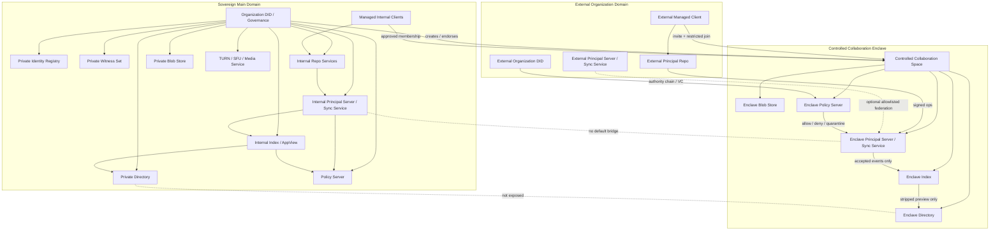

# Sovereign Deployment and Controlled Collaboration Draft

## 1. Scope

High-assurance environments can operate an independent Contrix network while allowing controlled collaboration with external principals or external organizations through specific spaces.

This document defines:

- sovereign deployment boundaries
- isolated federation domains
- controlled collaboration spaces
- verification / authorization / encryption / audit / exit rules for external actors
- sovereign client behavior and DID resolver policy

## 2. Deployment Model

A sovereign deployment is a Contrix service domain controlled by one organization or alliance, typically including:

- Organization DID / governance registry / witness
- Identity Registry
- Repo Service
- Principal Server / Sync Service
- Index / AppView
- Directory
- Blob Store
- Policy Server
- Push Gateway
- TURN / SFU / Media Service
- Applet / Agent runtime allowlist

Services SHOULD use service DIDs and be explicitly delegated by Organization DID or alliance governance DID.

### 2.1 Topology



Implications:

- Main domain keeps closed federation and does not expose internal directory/index or topology.
- Controlled enclosure is isolated and only hosts approved Spaces.
- External actors join enclave via DID / VC / authority chain / invite / restricted join.
- External organizations may keep own repos, but writes must pass enclave Principal Server / Sync Service, policy server, and local authorization.
- No default bridge between main network and enclave; material enters/leaves only through explicit export/import review.

### 2.2 Sovereign Client

High-assurance deployment does not require special clients by default, but clients MUST use managed/client profiles.

Public clients may enter only after locked configuration, signed publication, policy checks, and required audit controls are enabled.

Sovereign clients MUST:

- pin organization trust anchors (organization DID, governance DID, registry DID, witness DIDs, service allowlist)
- use organization DID resolver policy and avoid default public registry queries
- verify service DID delegation, certificates, message signature, and feature profile
- block unapproved sync/index/directory/blob/applet endpoints
- disable public federation, public search, public social feed, external applets and agent handoff by default
- show per-space classification, E2EE status, egress policy, and export permissions
- support remote revocation of session, device, grant, applet delegation, and cached secrets
- support local logs, audit export, and key wipe policies

Sovereign clients SHOULD:

- use hardware keys / HSM / smart cards where possible
- support offline or intranet resolver bundles
- support policy-signed configuration updates
- enforce local restrictions for screenshot, copy, bulk export, watermark, and external sharing

## 3. Default Security Profile

High-assurance deployments SHOULD default to:

- disallow public federation
- disallow public directory listing
- spaces default `discoverability=secret` or `invite_only`
- spaces default `join_rule=private` or `restricted`
- Policy Server default `closed` or `quarantine` fail mode
- sync/index/directory accept allowlisted service DIDs only
- blob/snapshot/backup/audit stored inside organization infrastructure
- disable external applets, A2A/ACP handoff, TSP by default; allow only by explicit Space policy
- E2EE enabled by default, auditable E2EE enabled where policy requires and visible to members

### 3.1 DID Policy

Sovereign deployments MAY use internal `did:uuid`.

`did:uuid` is not tied to public Contrix network policy.

Deployment MUST define DID resolver policy:

```json
{
  "kind": "cx.sovereign.did_policy",
  "trust_domain": "did:web:defense.example#contrix-domain",
  "allowed_methods": ["did:uuid", "did:web"],
  "registries": [
    "did:web:registry.defense.example"
  ],
  "witnesses": [
    "did:web:witness-1.defense.example",
    "did:web:witness-2.defense.example"
  ],
  "public_registry_allowed": false,
  "external_did_methods": {
    "did:web": "allowlist",
    "did:plc": "deny",
    "did:key": "ephemeral_only"
  }
}
```

Rules:

- Clients MUST NOT resolve internal `did:uuid` via public registry endpoints.
- Internal `did:uuid` documents MUST come from approved registry / witness / offline bundle.
- Public DID methods MAY be accepted for external collaborators only when policy permits and authority chain is valid.
- Pairwise DID SHOULD be used for high-correlation risk collaboration.
- DID document service endpoints to public sync/index/directory services MUST be ignored unless allowlisted.

## 4. Controlled Collaboration Spaces

Organizations MAY create spaces for external collaboration without exposing the full internal network.

This Space is an isolation boundary.

Recommended defaults:

```json
{
  "kind": "cx.space.create",
  "space_version": "1",
  "content": {
    "space_kind": "controlled_collaboration",
    "created_by_principal": "did:web:defense.example",
    "owning_organizations": ["did:web:defense.example"],
    "default_discoverability": "unlisted",
    "default_join_rule": "restricted",
    "history_visibility": "joined"
  }
}
```

Policy recommendations:

- `discoverability=unlisted` or `invite_only`
- `join_rule=restricted` or `knock_restricted`
- `history_visibility=joined`
- `encryption_required=true`
- `external_federation=allowlist`
- `directory_visibility.public_directory=false`
- `reshare` / `export` disabled by default
- applet / agent disabled unless explicitly granted

## 5. External Actor Entry Flow

External actors SHOULD follow:

1. external entity submits DID, organization DID, service DID, or verifiable credential
2. host verifies DID control, handle binding, and organization authority chain
3. Policy Server checks allowlist, risk score, clearance claim, contract claim, and device posture
4. Space admin or delegated approval actor issues invite
5. external actor accepts invite and submits `cx.member.state`
6. for E2EE Spaces, admin client or key service only issues MLS Welcome to approved devices
7. Directory/Index only expose allowed stripped preview and history after join

External actors MUST NOT receive:

- full main-domain directory search capability
- other Space lists
- organization membership lists
- unrelated service topology
- pre-join historical keys (unless policy explicitly allows)

## 6. External Organization Collaboration

Recommended pattern when external organization enters:

```json
{
  "claim_type": "external_org_authorization",
  "issuer": "did:web:defense.example",
  "subject": "did:web:contractor.example",
  "scope": {
    "space_id": "cx:space:joint-operation",
    "roles": ["contractor_reviewer"],
    "max_members": 20
  },
  "valid_until": "2026-07-26T00:00:00Z"
}
```

External organization MAY keep its own Repo/Principal Server, but controlled Space SHOULD require:

- approved external service DID
- federation transaction signature
- server ACL allowlist
- per-event signature verification
- local policy re-check
- audit records for cross-domain writes

## 7. Gateway and Enclave Pattern

High-assurance deployments SHOULD avoid bridging full internal domains to external networks.

Recommended pattern:

- keep main network closed federation
- create isolated collaboration enclave
- invite external actors only into enclave space
- use separate Principal Server/index/blob/policy inside enclave
- redact + export review + declassification required before importing into enclave
- import review + malware scan + policy approval for egress to main network

## 8. Applet and Agent Controls

Controlled Spaces SHOULD disable by default:

- Applet execution
- external agent protocol handoff
- external tool access
- media recording

Any exception MUST use explicit capability with constraints:

- `via_applet_id`
- `allowed_protocols`
- `allowed_data_classes`
- `human_approval_required`
- `audit_mode`
- `egress_policy`

## 9. Data Egress and Export

External actors MAY read/write only within granted scope.

Export controls SHOULD include:

- disable bulk export by default
- watermark or audit export packages
- approval for attachments and snapshots
- preserve audience/classification labels
- prevent public directory indexing
- prevent repost / quote / cross-service redistribution

For encrypted content, export MUST NOT leak keys beyond intended recipients.

## 10. Exit, Revocation, and Incident Response

When external access ends:

- revoke invite/grant/delegation
- move membership to `leave` or `ban`
- remove external device from MLS group
- rotate MLS epoch
- revoke applet / agent sessions
- stop directory visibility
- retain audit records per retention policy

If compromise is suspected:

- freeze affected space or object set
- quarantine cross-domain events
- rotate service keys
- require re-verification for all external members
- perform backfill integrity audit from source repo

## 11. Conformance Profile

`cx.profile.sovereign_deployment.v1` SHOULD test:

- closed federation by default
- service DID allowlist
- controlled Space creation
- restricted external join
- policy server closed fail mode
- MLS welcome only for approved devices
- directory non-disclosure for non-members
- cross-domain event auditing
- external grant revocation and epoch rotation
- enclave import/export review metadata
