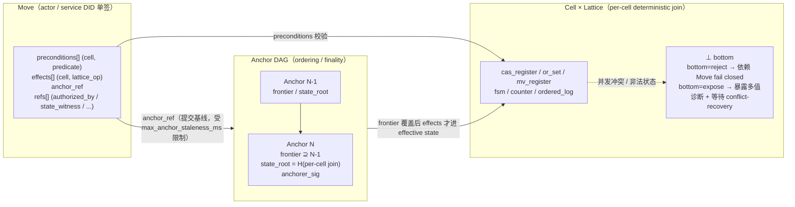

## 1. 目标

Contrix v1 的 canonical history 由 signed Move、Anchor DAG 与 per-cell Lattice 三个协议原语构成。协议状态不再由全局 winner 算法、单 host proof 或独立 MLS 中间态驱动。

本文件定义：

- Move 如何表达多 cell 原子条件写。
- Anchor 如何给 Move 批次提供最终性、state root 与 ordering commitment。
- Lattice 如何在每个 cell 上确定性合并并暴露 bottom (`⊥`)。
- 授权、撤销、E2EE、冲突修复和恢复路径如何统一落在三原语上。

非目标：本文不定义全文搜索、媒体分发、projection 查询优化、实时 typing/presence 等派生层行为。

## 2. 术语

| 术语 | 定义 |
| --- | --- |
| Move | 一个 actor / service DID 签名的事务意图，包含 `preconditions[]`、`effects[]`、`anchor_ref` 与语义依赖 `refs[]`。 |
| Anchor | ordering authority 对一组 Move frontier 的承诺，包含 `predecessor_refs[]`、`frontier[]`、`state_root` 与 `anchorer_sig`。 |
| Anchor DAG | 某个 Realm 内所有已接受 Anchor 的有向无环图。Genesis Anchor 没有 predecessor。 |
| Cell | 可被 Lattice 合并的最小协议状态单元，标识为 `cx:cell:<component>:<subject>` 或等价 canonical tuple。 |
| Lattice | Realm schema 为每个 cell family 选择的封闭核心代数类型。`join()` 返回值或 bottom (`⊥`)。 |
| Bottom (`⊥`) | 该 cell 在当前 Anchor frontier 下无有效单值或存在非法状态。`bottom=reject` 时依赖它的 Move fail closed；`bottom=expose` 时可向 projection 暴露多值诊断。 |
| Effective State | 某个 Anchor view 的 `frontier` 中所有 Move 经 Lattice join 后得到的 cell map。 |
| Pending Move | 通过本地格式/签名初检但尚未被 Anchor frontier 覆盖的 Move。Pending Move 不影响 effective state。 |

### 2.1 三原语关系总览

下图把 Move / Anchor / Lattice 三个原语的协作关系画成一张图。**Move 提交意图、Anchor 给出 finality、Lattice 决定 per-cell 收敛值或 ⊥**——三层缺一不可。



读图要点：

- Move 的 issuer 永远是单签；委员会 / 多签 / threshold 在 Anchor 层表达，不在 Move 层。
- Anchor 是持久承诺，**不修改 cell**——cell 变化只来自 frontier 内 Move 的 effects 经 Lattice join 后产生。
- Pending Move（已签名但 anchor_ref 未被覆盖）不进 effective state；超出 `max_anchor_staleness_ms` 后必须 rebase 重签。
- ⊥ 不是错误终态：`bottom=expose` 的 cell 可由带 `state_witness` + `inclusion_proof` 的 conflict-recovery Move 收回。

## 3. Move（Reducer-input Event 的协议视图）

"Move" 是 reducer-input Event 在 Lattice/Anchor 层的协议视图，不是独立 wire 对象。Wire schema 只有 signed Event（见 [`event-schema.json`](../../artifacts/schemas/event-schema.json)），下表给出 Event 与 Move 的字段对应关系：

```text
Move (reducer view of signed Event) {
  event_id        = cx:event:<uuidv7>                 // 来自 Event.event_id（producer-assigned UUIDv7）
  event_digest    = H(canonical bytes excluding proofs and unsigned)
                                                       // 内容指纹；等价于 proof.event_digest
  issuer          DID                                  // 来自 Event.actor_id
  realm_id        Realm id                             // 来自 Event.realm_id
  preconditions   [(cell_id, predicate)]               // 来自 Event.preconditions[]
  effects         [(cell_id, lattice_op)]              // 来自 Event.effects[]
  anchor_ref      Anchor.id                            // 来自 Event.anchor_ref
  refs            [(ref_id, role)]                     // 来自 Event.refs[]
  hlc             advisory timestamp                   // 来自 Event.hlc
  proof           detached JWS                         // 来自 Event.proofs[]
}
```

身份与去重模型（normative）：

- `event_id` 是 producer 在签名前分配的 typed UUIDv7（`cx:event:<uuidv7>`），是 actor chain 与 dedup 的稳定 wire id。它进入 canonical bytes 并被 `proof.event_digest` 覆盖。
- `event_digest` 是 canonical event bytes（不含 `proofs` 与 `unsigned`，包含 `hlc` 与所有其它顶层字段）的哈希，编码为 `<algo>:<hex>`，等价于 `proof.event_digest`。它是 Event 的内容指纹，Anchor `frontier[]` 直接引用 `event_digest`（v1 不存在独立 typed-id 形态的 Move identifier；早期草案中派生出的 Move-typed id 已 dropped，dot/lattice/hash profile 在 v1 均改以 `event_id` 与 `event_digest` 表达）。
- 同一 `event_id` 的两次提交若 `event_digest` 不同，节点 MUST 拒绝并记为冲突（见 [`operations-sync.md`](../sync/operations-sync.md) §15）。`event_id` 在签名前由 producer 分配，因此节点不能仅凭 digest 区分 actor 意图；正确实现 MUST 把 (event_id, event_digest) 都纳入 dedup key。

规则：

1. canonical bytes MUST 覆盖 `event_id`、`actor_id`、`realm_id`、`preconditions`、`effects`、`anchor_ref`、`refs`、`hlc` 与所有其它 signed 顶层字段。`proofs` 与 `unsigned` MUST NOT 进入 canonical bytes（它们是对 canonical bytes 的签名或后置 advisory）。`realm_id` 必须进入以防止跨 Realm 重放。
2. `preconditions[]` 与 `effects[]` 是 set；同一 Event 是多 cell 原子 CAS。任一 precondition 不成立时，整个 Event FAIL，不能部分应用 effects。`effects[]` MUST 至少含 1 项（纯查询 reducer-input event 不存在）。
3. `anchor_ref` MUST 指向接收方已知的 Anchor DAG 节点，并且相对本地 current anchor view 不超过 Realm 声明的 `max_anchor_staleness_ms`。
4. `refs[]` 是语义依赖，每个元素 `{id, role, critical?}`。常见 role 包括 `authorized_by`、`attestation`、`parent_event`、`after`、`audit_pair`（隐私敏感业务 Event 与 `cx.audit.accessed` 的同 batch 配对）、`recovery_capability`、`state_witness`（§8.1，conflict recovery Event 必备 — 引用签名 snapshot / compaction Anchor）、`inclusion_proof`（§8.1，conflict recovery Event 必备 — Merkle inclusion proof bytes 或 ref）。`critical` 默认 `true`；未识别的 critical role MUST fail closed，未识别的非 critical role MAY 被忽略。`role="authorized_by"` 的 `id` MUST 是 `cx:grant:<uuid>` 或 profile 明确注册的不可变 grant record id；不得引用裸 Event id、policy name、human-readable role 或可变 membership cell。reducer 必须能从该 id 反查 grant canonical digest、issuer、subject、actions、scope、parent grant 链和 revoke/supersede 状态。
5. `hlc` 是诊断与 freshness 辅助字段，不参与 winner 选择；核心收敛由 Anchor 与 Lattice 决定。
6. Event 的 issuer 只有单签。委员会、多签、host、threshold quorum 均在 Anchor 层表达，不在 Event issuer 层表达。

### 3.1 Predicate

核心 predicate（wire 字段 `{op, value?, values?, predicate_id?}`，schema 见 [`event-schema.json`](../../artifacts/schemas/event-schema.json) `predicate`）：

| `op` | 必填字段 | 语义 |
| --- | --- | --- |
| `head_eq` | `value` | 当前 cell value / head 必须等于指定值。单 cell basis 是该 predicate 的特例。 |
| `head_in` | `values` | 当前 cell value / exposed heads 必须属于集合。用于冲突修复 Move。 |
| `satisfies` | `predicate_id` | 当前 cell value 必须满足 schema 注册的 deterministic predicate（按 `predicate_id` 派发到该 cell schema 声明的可验证 predicate 实现）。仅允许引用封闭 Lattice 可验证的字段。 |
| `contains` | `value`（单元素）或 `values`（子集检查） | 当前 set / OR-set / covered frontier 必须包含指定元素或 frontier subset。 |

Predicate 不得读取本地数据库顺序、HTTP 到达时间、未签名服务端状态或外部 wall clock。

### 3.2 Effect

Effect 的 `lattice_op` 必须与目标 cell 的 Lattice type 兼容。`lattice_op` 的 wire 字段为 `{kind, tag?, value?, from?, to?, reason?, issuer_seq?}`（schema 见 [`event-schema.json`](../../artifacts/schemas/event-schema.json) `lattice_op`）：

| Lattice type | `op.kind` | 必填字段 | 可选字段 |
| --- | --- | --- | --- |
| `or_set` | `add` | `tag`、`value` | — |
| `or_set` | `remove` | `tag` | `reason` |
| `mv_register` | `set` | `value` | — |
| `cas_register` | `set` | `value` | — |
| `fsm` | `transition` | `from`、`to` | `reason` |
| `counter` | `inc` / `dec` | `value`（非负整数增量） | `tag`（per-counter 维度） |
| `ordered_log` | `append` | `value`（entry payload）、`issuer_seq` | — |

`op.value` 与 entry payload 必须满足该 cell schema；接收方 MUST 拒绝多余字段（`additionalProperties=false`）。

同一 Move MAY 写多个 cell。Realm schema MAY 声明 `co_write_policy` 限制哪些 cell family 可以同 Move 写入；违反时 Move MUST `schema_violation` reject。

## 4. Anchor

Anchor 的 wire schema 见 [`anchor.schema.json`](../../artifacts/schemas/anchor.schema.json)。Normative 形态：

```text
Anchor {
  id                 = "cx:anchor:" || <algo> || ":" || hex(H(anchor_canonical_bytes))
  realm_id            Realm id
  predecessor_refs    [Anchor.id]
  frontier            [event_digest]              // hash of each covered reducer-input Event's canonical bytes
  state_root          hash
  anchorer_sig        sig | multi_sig | threshold_sig    // signature over anchor_canonical_bytes
  anchored_at         RFC3339 UTC timestamp signed by anchorer
  hlc                 advisory timestamp
}
```

身份与去自引用模型（normative）：

- `id` 是 Anchor 的 wire-stable typed reference，形态为 `cx:anchor:<algo>:<hex>`。它的 hex 部分等于 `H(anchor_canonical_bytes)`，hash algo 跟 Realm `hash_profile`。`id` **不**进入 `anchor_canonical_bytes`——它在 wire 上是 H 的输出而不是输入，所以不会形成 `id = H(... id ...)` 自引用。
- `anchorer_sig` **不**进入 `anchor_canonical_bytes`：anchor 签名覆盖 canonical bytes，本身不是 canonical bytes 的成员。
- canonical bytes 由下表"transcript fields"列出的字段按 canonical JSON 编码（[`conformance/encoding.md`](../conformance/encoding.md) §2）形成，**不含** `id` 与 `anchorer_sig`，**包含** `realm_id` / `predecessor_refs` / `frontier` / `state_root` / `anchored_at` / `hlc` 与所有其它 signed 顶层字段（如 hash transition 下的 `previous_state_root` / `previous_hash_profile`）。

| 字段 | 进入 canonical bytes？ | 进入 anchorer_sig transcript？ | 来源 |
| --- | --- | --- | --- |
| `id` | ❌（是 H 的输出） | ❌ | wire-derived |
| `realm_id` | ✅ | ✅ | anchor body |
| `predecessor_refs` | ✅ | ✅ | anchor body |
| `frontier` | ✅ | ✅ | anchor body |
| `state_root` | ✅ | ✅ | anchor body |
| `previous_state_root` (transition only) | ✅ | ✅ | anchor body |
| `previous_hash_profile` (transition only) | ✅ | ✅ | anchor body |
| `anchored_at` | ✅ | ✅ | anchor body |
| `hlc` | ✅ | ✅ | anchor body |
| `anchorer_sig` | ❌（覆盖 canonical bytes） | ❌（不签自己） | wire signature |

接收方 verifier MUST：

a. 从 wire 收到的 Anchor 中提取 `anchor_canonical_bytes`（按上表）。
b. 重新计算 `H(anchor_canonical_bytes)` 并校验 `id` 的 hex 部分逐字节相等；不一致 `digest_mismatch`。
c. 用 `anchorer_sig` 的公钥验证签名覆盖的是 `anchor_canonical_bytes`（不是 `id`、不是其它派生形态）；不一致 `invalid_signature`。
d. 同一 wire bytes 在重排键顺序、注入额外 proof 字段或更换 `anchorer_sig` 后 hash 不变是 attack；canonical JSON + `additionalProperties=false` + 上表显式排除清单确保 attack 必然在 (b) 或 (c) 失败。

规则：

1. `predecessor_refs=[]` 仅允许 genesis Anchor。
2. 单调性：`A.frontier` MUST 是所有 predecessor frontier 的 superset。
3. Anchor 是持久承诺；它不修改 cell。Cell 变化只来自 frontier 内 Move 的 effects。
4. `anchorer_sig` 的合法签发者由 anchorer cell 在 predecessor joined view 下的 effective value 决定。
5. `state_root` MUST 是该 Anchor view 下所有 cell 当前 Lattice value / bottom diagnostics 的 canonical Merkle root。
6. `anchored_at` MUST 由 anchorer 写入并被 `anchorer_sig` 覆盖。它只用于 freshness 诊断和 `state_changed_at` 等 reducer-derived 投影时间，不得参与 Lattice winner 选择。
7. 负向：任何尝试把 `id` 或 `anchorer_sig` 放进 canonical bytes 的实现 MUST 失败（test 见 §4 Anchor canonical 负向向量条目）；frontier 中含非 `<algo>:<hex>` 形态（例如 `cx:event:<uuid>`）的 Anchor MUST `schema_violation`。

### 4.1 Anchor View 与 Signed Compaction

多个 Anchor leaf 并存时，节点 MUST 计算 deterministic effective anchor view：

```text
effective_anchor_view(leaves):
  predecessor_refs = sorted(leaves.ids)
  frontier         = union(leaves.frontier)
  state_root       = recompute(frontier)
```

该 view 是本地纯函数，不需要签名，也不是新的 Anchor object。只有当 anchorer / committee 想压缩 Anchor DAG 时，才签发一个持久 compaction Anchor。Compaction Anchor 的 `frontier` 与 deterministic view 等价，并带有效 `anchorer_sig`。

### 4.2 `state_root` Canonical Merkle 编码

§4 rule 5 要求 `state_root` 是该 Anchor view 下所有 cell value / bottom 的 canonical Merkle root。本节锁定具体编码以保证不同实现互通。

State root 使用的 hash 算法由 Realm 的 `hash_profile`（create-locked，默认 `sha256`）决定。本节伪代码以 `H(...)` 表示该 algo 的哈希函数；wire 上 hash value 形如 `<algo>:<hex>`，详见 [`encoding.md`](../conformance/encoding.md) §3。

#### 4.2.1 Leaf 编码

每个有过 effect 的 cell 一条 leaf：

```text
leaf_input = canonical_json({
  "cell":  "<CellRef wire string>",
  "state": <state_object>
})
leaf_hash  = H(0x00 || leaf_input)
```

`<state_object>` 取决于 cell 当前 join 结果：

| Lattice 结果 | `state_object` |
| --- | --- |
| `Value(v)` | `{ "value": v }` |
| `Bottom(b)` | `{ "bottom": <Bottom canonical JSON, **省略 `anchor_view` 字段**> }` |

`bottom.anchor_view` 必须省略，因为 state_root 自身已经定义于一个具体的
Anchor view，把同 view 写进 leaf 会造成自引用并破坏 root 的稳定性。
`bottom` 的其他字段（`kind` / `cells[]` / `event_ids[]` / `heads[]` / `details` /
`escalated_at`）保留进 leaf——它们是该 cell 在该 view 下状态的一部分，跨 view
可能不同，是 state_root 必须捕获的差异。

`state_root` leaf MUST NOT 包含 `batch_index`、Anchor 内接收顺序、本地数据库序号或其它历史排序字段。`state_root` 只承诺该 Anchor view 下的 **当前 cell state**；历史顺序与完整性由 Anchor `frontier[]`、actor chain `(actor_id, actor_seq)`、range completeness attestation 或 event-set commitment 承诺。两个 Anchor view 若归约出完全相同的 cell map，必须得到相同 `state_root`，即使其 Move 被不同批次或不同接收顺序合入。

#### 4.2.2 树形

1. 收集该 Anchor view 下所有有过至少一次 effect 的 cell。
2. 对每个 cell 计算 `leaf_hash`（4.2.1）。
3. 把 `(cell_wire, leaf_hash)` 元组按 `cell_wire` Unicode code point 升序排序。
4. 把排序后的 `leaf_hash` 列表按 RFC 6962 domain-separated binary Merkle tree 算 root：
   - 偶数个：两两配对 `parent = H(0x01 || left || right)`，逐层向上。
   - 奇数个：最后一个 leaf 直接提升到上一层（**不复制**）。
   - 单个 leaf：root = leaf_hash。
   - 空列表：root = `H("")` 用 algo 的空字节摘要值。
5. wire 形式：`state_root = "<algo>:" + lower_hex(root)`，`<algo>` 即 Realm `hash_profile`。

#### 4.2.3 增量重算

实现 SHOULD 缓存 cell → leaf_hash 表，在 `apply_anchor` 接受新 Anchor 后只
重算受影响 cell 的 leaf 与所属 Merkle 分支；wire 上的 `state_root` 必须等于
全量重算结果。等价性由 conformance vector
[`cx.vector.state_root.incremental.v1`](../conformance/conformance-vectors.md)
（§2.9）固定，覆盖单 cell 修改、半数修改、全量修改、空 frontier 与 schema-evolution
（新增 cell + 删除旧 effect）共四个 case；增量结果与全量重算 MUST bit-exact 一致。

#### 4.2.4 跨实现互通

不同 conformant 实现处理同一 Move/Anchor 历史 MUST 产出相同 state_root。
偏离上述编码（不同 leaf shape、不同 tree 形、不同空 list 处理、错误的 hash algo）即视为
v1 wire-incompatible，必须用独立 profile 声明。

#### 4.2.5 Hash Algorithm Transition

Realm 一旦在 create event 中固定 `hash_profile`，所有后续 Anchor / Move / state_root MUST 用同一 algo。需要切换 hash algo（例如 sha256 → blake3 性能升级，或 sha256 → 抗量子 hash family）时：

1. **Transition Anchor**：anchorer 签发一个特殊的 compaction Anchor，其 wire 字段同时携带 `previous_state_root`（旧 algo）和 `state_root`（新 algo）。Receiver 用旧 algo 重算 frontier 验证 `previous_state_root` 与本地一致；用新 algo 重算同 frontier 验证 `state_root`。两者都通过才能 accept transition Anchor。
2. **`hash_profile` cell update**：transition Anchor 的 frontier 包含一个 Move 把 Realm 的 `hash_profile` cell（`cas_register, bottom=reject`）从旧值 `head_eq=<old>` 改为 `set=<new>`。
3. **后续 Anchor**：新 anchor 只用新 algo。客户端做长历史 inclusion proof 时，跨 transition Anchor 的 proof 由 transition Anchor 的双 root 桥接——proof 在 transition 之前用旧 algo 验证，之后用新 algo 验证。
4. **降级禁止**：`hash_profile` 只允许从更弱 algo 升级到更强 algo（按 v1 hash registry 中声明的 strength order），不允许降级。Strength order：`sha256 < sha3_256 ≈ sha512 < blake3` 在性能侧；安全侧 v1 视为同等抗碰撞强度，差异在 algorithm diversity 与 bandwidth。未来加入抗量子 hash 时该 order 会被扩展。

实现不强制支持 hash transition；声明 `cx.profile.hash_transition.v1` 的实现 MUST 支持。这条机制保证了未来 hash algorithm 升级路径不需要硬分叉。

### 4.3 Anchor Batch 语义

`apply_anchor(A)` MUST 按批处理语义执行：

```text
pre_state = joined_state(A.predecessor_refs)
new_moves = A.frontier - union(predecessor.frontier)

for M in deterministic_order(new_moves):
  verify_move(M, pre_state)

post_state = apply_all_effects_atomically(pre_state, new_moves)
assert merkle_root(post_state) == A.state_root
```

同一 Anchor 内的 `new_moves` 视为并发批。一个 Move 不得通过读取同批另一个 Move 的 effect 满足 precondition。若需要顺序，提交方 MUST 分成多个 Anchor，或在 `refs(role="after")` 中声明并由 anchorer 按下一 Anchor 处理。

同批配对 invariant 是例外形式的**批级验证**，不允许读取同批 effect：若业务 Event 携带 `refs[role="audit_pair"]`，anchorer / reducer MUST 在应用任何 effect 前验证该 ref 指向同一 Anchor batch 内的 `cx.audit.accessed` event，且 audit payload 的 `paired_event_id` 与 `paired_event_digest` 回指该业务 Event。配对失败时拒绝业务 Event；audit Event 自身仍可按普通 durable Event 入库，供失败审计和告警使用。该规则用于 `cx.flow.watch.manage_others` 等 fail-closed 隐私门槛，不改变 precondition 读取模型。

### 4.4 Anchorer Cell

每个 Realm 有一个 anchorer cell：

```text
cell = cx:cell:cx.component.anchorer.v1:<realm_id>
lattice = cas_register
bottom = reject
```

它的 value 定义下一批 Anchor 的授权规则，例如：

- `single_did`: 单一 DID / service key。
- `threshold`: k-of-n committee。
- `open_set`: 允许集合内任一 DID 签发 leaf Anchor，DAG join 后收敛。
- `mixed`: 主 anchorer + fallback recovery anchorer。

变更 anchorer 是普通 Move，由旧 anchorer 签发的后续 Anchor finalize；新 anchorer 不得自签自己上位。

如果 anchorer cell 在某个 effective view 下为 `⊥`，Anchor 层进入 Realm-wide pause：普通 Anchor 不得推进，只有 genesis 声明的 recovery anchorer / emergency quorum MAY 签发恢复 Anchor。该暂停不同于普通 cell-scoped bottom，必须在 API / UX 中明确暴露。

## 5. Lattice

每个 cell family 在 Realm schema 或 canonical registry 中声明：

```text
Lattice {
  type        ∈ closed_core_set
  bottom      ∈ {reject, expose}
  parameters  type-specific
}
```

v1 封闭核心集（core）：

| Type | Join 语义 | 用途 | 授权层禁用 |
| --- | --- | --- | --- |
| `or_set` | observed-remove set；add/remove 通过唯一 tag 收敛。 | capability grant set、device list、凭证撤销集合。 | — |
| `mv_register` | 并发 set 暴露多值；无单一 winner。 | 非安全草稿、可人工选择的偏好。 | 不得作授权根 |
| `cas_register` | 严格 CAS；并发不同值返回 `⊥`。 | anchorer、关键 singleton policy、host 指针类状态。 | — |
| `fsm` | 状态机迁移；非法迁移或并发不可合并迁移返回 `⊥`。 | membership、lifecycle、invite/approval。 | — |
| `counter` | PN-counter 求和。 | 配额、审计计数。 | — |
| `ordered_log` | append-only log；按 issuer chain 与 entry id 去重。 | 审计、消息历史、不可变操作日志。 | — |

依赖 actor 自报 timestamp 排序的 join、HTTP receive order、数据库自增 ID 均不得进入协议授权根。

#### 5.0.1 扩展 Lattice：`lww_register` / `rga`

`lww_register` 与 `rga` **不属于** v1 core 封闭集；它们由扩展 profile [`cx.profile.collaborative_text.v1`](../conformance/conformance-profiles.md) 引入，目的是支持协作文本与 cosmetic 字段。声明该 profile 的实现 MUST 完整实现下列 §5.3.7 / §5.3.8 中的 join 与 validate 语义；未声明的实现遇到使用这两种 type 的 cell schema MUST fail closed（`unsupported_lattice_type`）。

| Type | Join 语义 | 用途 | 授权层禁用 |
| --- | --- | --- | --- |
| `lww_register` | 按 anchor-derived order 选最近 set；同 anchor batch 并发用 deterministic tiebreaker。 | UI affordance：Flow.title / summary、Morph 非关键字段、 emoji shortcuts、cosmetic preferences。 | **MUST NOT 作授权、policy、membership、anchorer、capability cell**。schema 静态拒绝。|
| `rga` | Replicated Growable Array：插入 op 携带 `(predecessor_id, element_id=issuer:seq)`，删除 op 写 tombstone；按 (anchor index, issuer, seq) 全序确定性合并。 | 协作文本编辑（Flow.body 富文本、Morph 文档段、Markdown 块的字符级编辑）、可插入的有序列表。 | **MUST NOT 作授权根**；只用于 content cell。|

`lww_register` 与 `rga` 的"时间"由 Anchor 批次索引与批次内确定性 tiebreaker 提供，**不**读取 actor 自报 HLC 或外部 wall clock。这是它们被允许出现在 conformance core 之外但仍是封闭代数的前提。

### 5.1 Bottom Diagnostics

协议判断只区分 value 与 `⊥`，但实现 MUST 保留结构化诊断（wire schema 见 [`bottom.schema.json`](../../artifacts/schemas/bottom.schema.json) `cx.schema.bottom.v1`）：

```text
Bottom {
  kind         ∈ {conflict, invalid_transition, missing_dependency,
                  unauthorized, anchorer_split, schema_error}
  cells[]      cell_ids 参与诊断（多 cell 原子 Move 失败时 >1）
  event_ids[]   anchored reducer-input Event ids 触发该诊断（结构性 ⊥ 可为空）
  anchor_view? {leaves[], state_root?} 观察该 ⊥ 的 Anchor view，便于复算
  heads[]?     kind=conflict 时候选 head 值；UI / 审计可见，授权 MUST NOT 据此选 winner
  details?     kind-specific structured details
  escalated_at? 跨过 Realm.bottom_escalation_after_ms 时的时间戳
}
```

`bottom=reject` 的 cell 被 Move precondition 读取时，Move MUST fail closed（state code `failed_bottom`），错误至少包含 `cells[]` 与 `event_ids[]`。`bottom=expose` 的 cell MAY 返回 `{status:"conflict", heads:[...]}` 给 projection；它不得被授权路径当作 allow。

`bottom=reject` 不是可被普通 CAS 写入直接覆盖的临时值。只要当前 effective view 下 cell value 为 `⊥`，任何普通 Move（包括携带 `head_eq` 的 cas_register set）读取或写入该 cell 时都 MUST `failed_bottom` / `failed_precondition`，`reason_code=cell_in_bottom_state`；实现不得把 `⊥` 当作 `null`、空 head 或任一候选 head。修复只能通过 §8 的 conflict-recovery Move 完成：该 Move MUST 引用冲突前 `state_witness`、`inclusion_proof` 与被授权的 recovery capability，并在新的 Anchor view 中把 cell 收敛到明确 value。若某 cell family 需要更专门的 recovery 事件，profile 可以在自己的 event kind 上定义 payload，但不能绕过本段的 witness 与 capability 要求。

`anchorer_split` 是特殊 kind：当 anchorer cell（cas_register, bottom=reject）出现并发 set 时该诊断生效；它对应 §13 的 `anchorer_paused` Realm 状态，仅 recovery anchorer / emergency quorum 签发的 Anchor 可恢复推进。

**Lattice type 与 bottom 行为对照**：

| Lattice type | bottom 是否出现 | bottom 配置语义 |
| --- | --- | --- |
| `or_set` | 永不 | bottom=expose 仅用于多 head 场景的 add/remove 并发可视化 |
| `mv_register` | 永不 reject；多值即 expose | bottom=expose 是常态：projection 暴露多个 head 给 UI，授权路径不得据此选 winner |
| `cas_register` | 出现：并发不同 set + 不同 basis 时返回 ⊥ | bottom=reject 是标准（anchorer / 关键 singleton）；依赖该 cell 的 Move fail closed |
| `fsm` | 出现：非法 transition / 并发 divergent next_state 时返回 ⊥ | bottom=reject 是标准（membership / lifecycle / invite-approval）|
| `counter` | 永不 | bottom=expose 仅在配额跨界等场景作诊断 |
| `ordered_log` | 永不 | bottom=expose 用于审计、消息历史；并发 append 不阻塞 |
| `lww_register` | **永不出现于 value path**——并发 sibling 由 §5.3.7 deterministic tiebreaker 选 winner | bottom=expose 仅由诊断层暴露 lost siblings；**授权层不得据此选 winner**（schema 已静态禁止 lww_register 作授权根）|
| `rga` | **永不**——RGA 总有合法 deterministic order | bottom=expose 用于把并发 insert/delete 多值反馈给 projection，不阻塞协议判断 |

### 5.2 序内因果

Lattice `join()` 输入是 Move set，而不是本地接收序列。需要顺序语义的 type 必须把顺序编码进 op：

- `fsm` 通过 `transition.from` / `transition.to` 校验路径。
- `ordered_log` 通过 `issuer_seq`、`parent_entry` 或 entry hash 链校验 append。
- `cas_register` 通过 Move precondition `head_eq` 表达 basis。

若某 lattice type 对同一输入 set 不能给出 deterministic value / bottom，则该 type 的实现不符合 v1。

### 5.3 Lattice 参考实现

下列伪代码为各核心 Lattice type 的 normative `join()` 与 `validate_op()` 行为；参考向量在 [`conformance-vectors.md`](../conformance/conformance-vectors.md) §2。

#### 5.3.1 `or_set`

真正的 observed-remove set，按 **dot** 收敛。

- 每个 add op MUST 携带 `dot = "<event_id>:<effect_index>"`，由 add op 所在 Event 的 wire `event_id`（typed `cx:event:<uuidv7>`）与该 effect 在 `effects[]` 中的 0-based 下标拼接而成。`event_id` 已经全局唯一，dot 因此天然唯一。当需要在 dot 之上做内容指纹比对（例如对照 Anchor frontier）时使用 `event_digest` 作为辅助键，但 dot 自身只用 `event_id`。
- 每个 remove op MUST 携带 `observed_dots: [dot, ...]`——它枚举 remove issuer 在 enclosing Event 的 `anchor_ref` 对应 pre-state 下能看到的、想要撤销的具体 add dot。`observed_dots` MUST 升序去重，且每条 dot 必须能在该 anchor view 下解析为合法 add op。
- Add op MAY 在 `value` 内嵌入 schema-defined `intent` 字段（例如 consent 的 `(consent_id, peer, scope)` 元组）。`intent` 不参与 lattice join；它只是 projection 层把同 intent 的多 dot 折叠成一条 UI/审计行的辅助数据。

```text
join(moves) -> Set<(dot, value)>:
  adds          = { (eff.dot, eff.value)
                    | M ∈ moves, eff ∈ M.effects, eff.op.type=="add" }
  observed_dots = ⋃ { set(eff.observed_dots)
                      | M ∈ moves, eff ∈ M.effects, eff.op.type=="remove" }
  return        { (d, v) ∈ adds | d ∉ observed_dots }

validate_op(op):
  op.type ∈ {add, remove}
  if add:
    op.dot      == "<enclosing_event.event_id>:<effect_index>"
    op.value satisfies schema
  if remove:
    op.observed_dots is a finite, sorted, deduplicated list of dot strings
    each dot in op.observed_dots resolves to an add effect
      visible at enclosing Event's anchor_ref pre-state
```

**Regrant 语义**：先 add(d1)、再 remove(observed=[d1])、再 add(d2) 是合法序列；d2 的 dot 不在任何 `observed_dots` 中，因此 join 后 d2 仍 active——regrant 是显式支持的。

**Idempotency**：dot 由 `event_id` 派生（`event_id` 在签名前由 producer 分配的 typed UUIDv7），因此相同 add op 跨节点重放不产生重复 dot，但不同 issuer 对同一 intent 的并发 add 会产生不同 dot——这是 OR-Set 的预期行为，去重落在 projection / 授权判定（"intent 是否当前 active = 该 intent 下 ≥1 dot 仍在 join 集合"）。

**部分撤销**：remove op 只 invalidates 它枚举的 dots。撤销整个 intent 需要 issuer 列出该 intent 下当前所有 active dots；missing 一些就只是部分撤销，剩余 dot 仍 active。这是 OR-Set 的 normative 语义，不是 bug。

`bottom` 永远不出现（or_set 总有合法 join 值）。`bottom=expose` 仅用于 projection 在多 head 场景把 add/remove 并发可视化，不影响协议授权判断。

#### 5.3.2 `mv_register`

Multi-value register。所有未被后续 set 取代的并发值都暴露。

```text
join(moves) -> Set<value>:
  candidates = { (M.event_digest, eff.value) | M ∈ moves, eff ∈ M.effects, eff.op.type=="set" }
  // 取因果最大集：去掉被任何后继 Move 偏序覆盖的 candidate
  return  { v | (m, v) ∈ candidates, ¬∃(m', _) ∈ candidates: m' > m via Move.refs("after") }

validate_op(op):
  op.type == "set"
  op.value satisfies schema
```

`bottom=expose` 是 mv_register 的常态：projection 以 `{status:"conflict", heads:[...]}` 暴露多值。授权路径不得用 mv_register 表达。

#### 5.3.3 `cas_register`

Compare-and-swap register。Move 通过 precondition `head_eq` 声明 basis；并发不同 set 返回 `⊥`。Move 的因果序由 (a) Anchor batch 包含关系，与 (b) 跨 batch 时 `Move.refs(role="after")` 显式声明给出；同 Anchor batch 内的 sibling Moves 视为并发。

**Cell schema 可选参数 `initial_value`**：cas_register cell schema MAY 声明 `initial_value`，该值在 cell 未被任何 Move 写过时作为 `current` 的初值。算法第一行原本 `current = null`，schema 声明 `initial_value` 时改为 `current = initial_value`。**单例 cell 模式**：schema 声明 `initial_value = "<sentinel>"` 时，配合 `head_eq: "<sentinel>"` predicate 的第一次 set Move 才能成功；后续 Move 因 `basis ≠ settled and basis is not null` 触发 `⊥`，从而强制 singleton 语义。

```text
join(moves, cell_schema) -> value | ⊥:
  // 按 Anchor batch index 升序 + 同 batch 内按 head_eq 链化（pre-state value → effect value）
  // 跨 batch 时若需要绕过 head_eq 链化，使用 Move.refs(role="after")
  current = cell_schema.initial_value if defined else null
  for batch in moves grouped by anchor_ref ordered by anchor index:
    settled = current
    siblings = []
    for M in batch with effect on this cell:
      pre = find precondition(head_eq) on this cell in M
      basis = pre.value if pre else null   // null = 允许 first set
      siblings.append((basis, M.effect.value))
    if ∃ siblings (b1, v1), (b2, v2) with b1==b2 and v1!=v2:
      return ⊥
    if siblings is non-empty:
      // 取共享 basis 后唯一新 value（已在上一步保证唯一）
      basis_required = unique(siblings.map(b))
      if basis_required != settled and basis_required is not null:
        return ⊥                  // basis 不匹配 pre-state
      current = unique(siblings.map(v))
  return current

validate_op(op, cell_schema, move_envelope):
  op.type == "set"
  op.value satisfies schema
  // when initial_value is declared, the sentinel is reserved for the
  // "unset" state. Only a Move whose enclosing Event kind is profile-declared
  // as a cleanup operation AND whose issuer holds the corresponding cleanup
  // capability MAY write the sentinel back. We deliberately key on event_kind
  // + capability rather than add an ad-hoc `from_cleanup_path` field to
  // `lattice_op` (lattice_op wire shape is closed, additionalProperties=false).
  // Cell schemas MAY declare `sentinel_writers[]` listing the event_kinds
  // permitted to write the sentinel; absent that list, no event_kind may
  // write the sentinel.
  if cell_schema.initial_value is defined:
    if op.value == cell_schema.initial_value:
      writers = cell_schema.sentinel_writers or []
      if move_envelope.event_kind not in writers:
        return SCHEMA_VIOLATION(reason=initial_value_reserved)
      // capability check is reducer's normal authz path; not duplicated here.
```

`bottom=reject` 是 cas_register 的标准配置：依赖该 cell 的 Move MUST `fail_bottom`（spec 状态码 `failed_bottom`）。anchorer cell、关键 singleton policy 与 host 指针均使用此组合。

#### 5.3.4 `fsm`

有限状态机。每个 transition op 声明 `from` / `to`；Schema 在 `parameters` 中声明合法 transition 表。

```text
join(moves) -> state | ⊥:
  ordered  = topological_sort(moves)
  state    = parameters.initial_state
  for M in ordered:
    eff = find transition effect for this cell
    if eff.op.from != state: return ⊥          // 非法 transition
    if eff.op.(from,to) ∉ parameters.allowed_transitions: return ⊥
    state = eff.op.to
  // 并发 sibling Move 在同 state 上选择不同 to，且都不可合并 → ⊥
  if siblings produce divergent next_state:
    return ⊥
  return state

validate_op(op):
  op.type == "transition"
  op.from, op.to ∈ parameters.states
  (op.from, op.to) ∈ parameters.allowed_transitions
```

membership / lifecycle / invite-approval 多用 `bottom=reject`。

**Realm bootstrap exception**: `cx.realm.create` 的 reducer 既是 Realm metadata 的 genesis, 也是 `created_by_principal` 首份成员资格的 genesis — 二者必须原子完成（详见 [`../models/realm-and-space.md` §2.5](../models/realm-and-space.md#25-cxrealmcreate-reducer-bootstrapnormative)）。任何后续 reducer / authz layer 在判定"`actor` 是否是 Realm 成员"时, MUST 以 `cx.component.member.state.v1` cell 的 reducer view 为准, 而该 cell 在 `cx.realm.create` commit 之后已经包含 `created_by_principal`。"显式 `cx.member.state{join}` event 必须先到"是错误读法; create event 本身就是 genesis member 凭证。

#### 5.3.5 `counter`

PN-counter（positive/negative split counter）。每个 (issuer, tag) 维护独立的 inc / dec 计数。`op.value` 是非负整数增量；`op.tag` 可选（per-counter 维度）。

```text
join(moves) -> integer:
  per_issuer_tag = empty map<(issuer, tag?), (pos, neg)>
  for M in moves:
    for eff in M.effects on this cell:
      key = (M.issuer, eff.op.tag)            // tag absent → null sentinel
      (pos, neg) = per_issuer_tag.get(key, (0,0))
      if eff.op.type == "inc": pos += eff.op.value
      if eff.op.type == "dec": neg += eff.op.value
      per_issuer_tag[key] = (pos, neg)
  return  Σ (pos - neg) over all keys

validate_op(op):
  op.type ∈ {inc, dec}
  op.value is a non-negative integer (overflow guard at parameters.max)
  op.tag is optional but, when present, MUST match schema tag pattern
```

`bottom` 永远不出现。`bottom=expose` 仅在配额跨界等场景下作为诊断（actual value still defined）。

#### 5.3.6 `ordered_log`

Append-only log。Entry payload 通过 `op.value` 承载；每 issuer 子链由 `op.issuer_seq` 单调推进；跨 Move 全局去重依赖 `cell schema` 在 entry 内声明的稳定 entry id（如 `value.entry_id` 或 canonical-bytes-derived hash），具体由 cell schema `parameters.entry_id_field` 指定。

```text
join(moves) -> List<entry_record>:
  entries = []
  for M in moves:
    for eff in M.effects on this cell:
      if eff.op.type != "append": continue
      eid = canonical_entry_id(eff.op.value, schema.parameters.entry_id_field)
      entries.append({
        event_digest: M.event_digest, issuer: M.issuer,
        seq: eff.op.issuer_seq, value: eff.op.value, entry_id: eid
      })
  // 每 issuer 形成独立子链；同一 (issuer, seq) 重复 → 取最小 entry_id
  per_issuer = group_by(entries, key=issuer)
  for issuer, items in per_issuer:
    items = dedupe_by_entry_id(items)
    items = sort_by(seq)
    items MUST form a contiguous chain：item[i].seq == item[i-1].seq + 1
  // 跨 issuer 不强制全局序；projection 可按 (effective_anchor_depth, hlc, issuer, seq) 展示
  return concat(per_issuer.values())

validate_op(op):
  op.type == "append"
  op.issuer_seq is non-negative integer; monotonic per (cell, issuer)
  op.value satisfies entry schema declared by cell parameters
```

`bottom` 永远不出现。审计、消息历史、不可变操作日志均使用 `bottom=expose`，并发 append 不阻塞协议判断。

#### 5.3.7 `lww_register`（扩展：`cx.profile.collaborative_text.v1`）

Last-write-wins register。本节是该 lattice type 的 normative 行为，但**仅在实现声明 `cx.profile.collaborative_text.v1` 时启用**——未声明的实现遇到使用 `lww_register` 的 cell schema MUST 按 §5.4 fail closed。"时间"由 Anchor DAG 中可推导的 effective depth 提供，**不**读 actor HLC，也不把批次序号写入 `state_root` leaf：

- 跨 Anchor batch：后批次 effect 覆盖前批次。
- 同 Anchor batch（sibling Move）并发不同 set：用 deterministic tiebreaker `(issuer DID lex order, event_digest lex order)` 选 winner；记录 lost siblings 进 bottom diagnostics 但不影响最终 value。

**Open_set anchor profile 下的全序保证**：当 anchor profile 是 `open_set`、effective anchor view 由多个 leaf 的 `union` 构成时，sibling Move 集合 MUST 按 deterministic effective anchor view（§4.1）的 canonical join 计算，**而不是**基于任意单 leaf 的局部观察：

- 输入 sibling 集合 = `union(all leaves' frontier) ∩ {moves with effect on this cell within the same effective_anchor_depth}`。这里的 `effective_anchor_depth` 是从 Anchor DAG predecessor relation 推导出的 view-local depth，不是 Event、Move、leaf 或 `state_root` 中的 wire 字段；不同 leaf 给出不同 sibling 集合的情况由 join 强制统一。
- Tiebreaker key `(issuer DID lex order, event_digest lex order)` 的比较 MUST 按 NFC + ASCII byte order；两个 Event 的 `(issuer, event_digest)` 不可能完全相等（event_digest 是 canonical-bytes hash），所以 winner 永远唯一。
- 不同 conformant 节点对同一 anchor view 计算 sibling 集合 + tiebreaker MUST 产出相同 winner；任何偏差视为 reducer 实现 bug，conformance vector `cx.vector.lattice.lww_open_set.v1` 验证此性质。

```text
join(moves) -> value:
  current = parameters.initial_value   // schema 声明的初值，可为 null
  // 关键：moves 已经是 effective anchor view 全 union 的结果，不是单 leaf
  for effective_anchor_depth in sorted(unique depths derived from anchor view union):
    siblings = [M for M in moves
                if effective_anchor_depth_of(M, view) == effective_anchor_depth
                and M has set effect on this cell]
    if siblings is empty: continue
    if len(siblings) == 1:
      current = siblings[0].effect.value
    else:
      // 多节点对同一 view 必须计算同一 winner
      winner = min(siblings, key=(M.issuer, M.event_digest))   // canonical lex order
      current = winner.effect.value
      // 其它 siblings 进入 bottom_diagnostics（kind=conflict）但 value 已确定
  return current

validate_op(op):
  op.type == "set"
  op.value satisfies schema
  cell schema MUST NOT 列入 authorization_root / policy_root / anchorer_root
```

`bottom` 不出现于 value path。`bottom=expose` 仅当并发 sibling 出现时由诊断层暴露 lost values；授权层 MUST NOT 据此选 winner（cell 已被 schema 静态禁止作授权根）。

Schema 声明 cell 为 `lww_register` 时 MUST 同时声明 `cell_role ∈ {ui_affordance, content, draft, cosmetic}`；声明 `cell_role` 为 authorization-related 值时 schema_violation。这是把 lww_register 关在协议安全圈外的硬约束。realm.schema.json 在 `cell_lattice` 上有 `allOf` 条件强制此规则。

#### 5.3.8 `rga` (Replicated Growable Array，扩展：`cx.profile.collaborative_text.v1`)

Replicated Growable Array — 协作文本与有序列表插入。本节同 §5.3.7 一样**仅在实现声明 `cx.profile.collaborative_text.v1` 时启用**；未声明者按 §5.4 fail closed。每个 element 由 `(issuer, issuer_seq)` 二元组确定性命名；插入 op 携带 predecessor element id；删除 op 写 tombstone。

```text
op shape:
  insert: {type: "insert", predecessor: <element_id | "head">, element_id: "<issuer>:<seq>", value: <atom>}
  delete: {type: "delete", element_id: <element_id>}

element_id 形态：`<issuer-did>:<seq>`，issuer 即 Move issuer，seq 由 issuer 在该 cell 上单调递增（每次 insert 递增）。

join(moves) -> List<{element_id, value, deleted}>:
  inserts = {}    // element_id → {predecessor, value, effective_anchor_depth, issuer_lex}
  tombs   = set() // element_ids deleted
  for effective_anchor_depth, batch in moves grouped by effective anchor depth:
    for M in batch with effect on this cell:
      for eff in M.effects:
        if eff.op.type == "insert":
          inserts[eff.op.element_id] = {
            predecessor: eff.op.predecessor,
            value:       eff.op.value,
            effective_anchor_depth: effective_anchor_depth,
            issuer:      M.issuer,
          }
        elif eff.op.type == "delete":
          tombs.add(eff.op.element_id)

  // 构建 forest：每个 element 挂在它的 predecessor 下
  // 同一 predecessor 下多个 child 按 (effective_anchor_depth, issuer, seq) 升序排列
  result = []
  walk(predecessor="head"):
    children = [eid for eid, meta in inserts if meta.predecessor == predecessor]
    children.sort by (inserts[eid].effective_anchor_depth, inserts[eid].issuer, eid_seq(eid))
    for c in children:
      if c not in tombs:
        result.append({element_id: c, value: inserts[c].value, deleted: false})
      else:
        result.append({element_id: c, value: inserts[c].value, deleted: true})  // tombstone
      walk(c)
  walk("head")
  return result

validate_op(op):
  op.type ∈ {insert, delete}
  if insert: op.element_id = "<M.issuer>:<seq>", seq monotonic per (cell, issuer)
             op.predecessor 在已知 inserts 集合中，或 == "head"
             op.value satisfies element schema (atom: char | block | list_item)
  if delete: op.element_id 必须曾被某个 insert 引入
  cell schema MUST NOT 列入 authorization_root / policy_root / anchorer_root
```

`bottom` 不出现：RGA 总有合法 deterministic order。Tombstone 不被物理删除（保留以让长后到的 reference 能正确 walk）；redaction 通过 `delete` op + `cx.message.redact` 类规则实现 metadata-level 隐藏。

RGA 的开销：每个未 GC 的 element 持续占空间。Realm 可声明 `rga_compaction_after_anchors`（默认 10000）触发 compaction Anchor，把 fully-deleted、无后继 reference 的 tombstone 物理移除并签入压缩 state_root。

### 5.4 Profile 不得引入新 Lattice type

接收方不识别核心或已注册扩展 Lattice type MUST fail closed；扩展 cell family MUST 通过 schema/profile 显式声明并声明 fall-back 行为；任何引入新 lattice type 的 profile 必须先经过 v1 protocol-amendment 流程才能被 normative 集成（避免 implicit 协议分叉）。

v1 已注册扩展 Lattice type：

- `lww_register` / `rga` — `cx.profile.collaborative_text.v1`（§5.0.1、§5.3.7、§5.3.8）。

未声明 `cx.profile.collaborative_text.v1` 的实现遇到使用这两种 type 的 cell schema 时 MUST 返回 `unsupported_lattice_type` 并拒绝写入对应 cell；既有 Move 已被 anchored 的 RGA / lww 历史 SHOULD 仍能 backfill 但只能透出诊断态，不得参与新 Move 的 reducer 决策。

## 6. Move 验证

```text
verify_move(M, pre_state):
  1. canonical bytes 哈希等于 M.event_digest 且等于 M.proof.event_digest；M.proof 由 M.issuer 控制的 key 签发。
  2. M.refs 中所有 critical ref 已知且自身 valid。
  3. M.anchor_ref 在本 Realm Anchor DAG 中，且未超过 max_anchor_staleness_ms。
  4. 对每个 (cell, predicate):
       L = schema.lattice(cell)
       v = pre_state[cell]
       if v == ⊥ and L.bottom == reject: FAIL_BOTTOM
       if not predicate(v): FAIL_PRECONDITION
  5. 对每个 (cell, op):
       schema.lattice(cell).validate(op)
       authz.check(M.issuer, cell, op, M.refs)
  6. PASS
```

授权来源必须是 `refs(role="authorized_by")` 或等价 schema role 中的凭证链。`authorized_by` 引用的是不可变 grant record，而不是“某次 allow 判定”。reducer MUST 维护 `(grant_id -> dependent_event_id[])` 的本地索引或等价审计索引：当 `cx.capability.revoke` / supersede / parent grant revoke / claim revocation 进入 accepted state 时，节点必须能列出受影响的 pending、cached allow 和后续 delegated grant，并触发 recheck / quarantine / audit note。已经 anchored 的历史 Event 不被物理删除，但任何依赖已失效 grant 的后继写入、snapshot claim 或 policy decision cache MUST fail closed，reason=`authorized_grant_revoked` 或更具体的上游原因。

Capability cache 的 key MUST 包含 Anchor view / state root；当相关 grant/revoke/claim/policy cell 变化时 cache 立即失效。

## 7. Anchor 应用

```text
apply_anchor(A):
  1. 校验 predecessor_refs 均已知且属于同一 Realm。
  2. 校验 A.frontier 覆盖所有 predecessor frontier。
  3. 在 predecessor joined view 下读取 anchorer cell 并校验 A.anchorer_sig。
  4. 以 predecessor joined state 批量 verify 所有 new_moves。
  5. 原子应用 new_moves effects，重算 state_root。
  6. state_root 匹配则接受 Anchor；否则拒绝 Anchor 并生成 anchor_fault 诊断。
```

Anchor 被拒绝时，其 frontier 内 Move 不因此变成 effective。节点 MAY 保留这些 Move 作为 pending / diagnostic 输入，但不得让它们推进 query 或授权。

## 8. 冲突修复

冲突修复没有特殊事件类型。它是普通 Move：

```text
Move {
  preconditions: [
    (cell, head_in [conflict_head_A, conflict_head_B])
  ],
  effects: [
    (cell, set decision)
  ],
  refs: [
    (recovery_capability,        role="authorized_by"),
    (pre_conflict_state_witness, role="state_witness", critical=true),
    (snapshot_inclusion_proof,   role="inclusion_proof", critical=true)
  ]
}
```

修复权威来自冲突前 effective state 中的 governance / recovery capability。不得用冲突候选本身声明的新 policy、new anchorer 或 new admin 来授权修复。

### 8.1 Pre-conflict State Witness 强制要求

`open_set` 与 `threshold` Anchor profile 下，多个 verifier 在 ⊥ 发生瞬间持有的"冲突前 effective state"可能不同——peer A 的 state_root 与 peer B 的 state_root 可能源自不同的 Anchor leaf 子集。如果允许 recovery Move 仅口头引用"冲突前 effective state"，攻击者就可以选择对自己有利的 anchor view 子集来"证明"自己持有 recovery_capability，于是同一 ⊥ 出现两条互斥的修复 Move。这种攻击在 v1.0 之前的 §8 设计下没有防护手段。

为此，conflict-recovery Move MUST 显式提供两条 critical refs，否则 receiver MUST `failed_precondition` 拒绝：

1. **`pre_conflict_state_witness`** — 一个签名 snapshot 或 signed compaction Anchor 的 id，满足：
   - 它来自冲突 cell 进入 ⊥ 之前的 Anchor view（即该 witness 所引用 frontier 不包含触发冲突的任一 sibling Move）。
   - 它由 Realm 当前 anchorer cell value 授权的签名者签发（`single_did` / `threshold` / `open_set` 的 anchorer rule）。
   - 它的 `state_root` 中包含 recovery_capability 所授权的 cell value。

2. **`snapshot_inclusion_proof`** — 一个使用 §4.2 leaf/internal-node domain separation 的 Merkle inclusion proof，证明：
   - 引用的 `recovery_capability` grant cell value 真实属于 `pre_conflict_state_witness.state_root`（而不是攻击者本地伪造的 effective view）。
   - Inclusion proof 的 leaf 编码 MUST 按 §4.2.1 锁定的 leaf shape 计算（`H(0x00 || canonical_json({"cell": "<CellRef>", "state": <state_object>}))`）。
   - Proof path 的 sibling hash 序列 MUST 能重算出与 `pre_conflict_state_witness.state_root` 完全相同的 root。

Receiver 在 verify_move(M) 时，对 critical role ∈ {`state_witness`, `inclusion_proof`}：

- 若 ref 缺失或签名无效 → `failed_precondition`（`reason="recovery_witness_missing"`）。
- 若 inclusion proof 不能重算出 witness 的 `state_root` → `failed_precondition`（`reason="recovery_witness_invalid"`）。
- 若 witness frontier 与触发 ⊥ 的 sibling Move 之一存在因果路径（即 witness 不在冲突前）→ `failed_precondition`（`reason="recovery_witness_post_conflict"`）。
- 若 witness 的 state_root 不包含 recovery_capability cell 或包含的 cell value 与 grant 引用不一致 → `failed_precondition`（`reason="recovery_capability_not_anchored"`）。

`single_did` Anchor profile 下，由于 anchor view 全网唯一，该机制等价于自然成立——但 wire 上仍 MUST 携带 witness ref，便于审计回放。这避免实现因为"现在用的是 single_did 就跳过校验"而在未来 anchorer 升级到 `open_set` 时无声留下盲区。

### 8.2 ⊥ 升级与 emergency recovery

长时间未修复的 `⊥` 不会自动选 winner。Realm MAY 声明 `bottom_escalation_after_ms`；超时后，客户端和服务端应提示 emergency recovery quorum，但仍需普通 Move + Anchor 生效，并仍 MUST 满足 §8.1 的 witness + inclusion proof 要求。emergency recovery quorum 的特殊之处仅在于 capability `subject` 由 genesis 声明的 emergency role 担任，而不在于跳过证据要求。

## 9. 部署 Profile

Hub、threshold、open federation、sovereign federation 和 E2EE 只是 anchorer cell value 与 Anchor uniqueness profile 的不同组合。

| Profile | Anchorer value | Anchor DAG 约束 |
| --- | --- | --- |
| `single_did` | 单一 service DID / host key。 | 可要求 signed Anchor 单链；compaction 由该 DID 签发。 |
| `threshold` | k-of-n committee key / signer set。 | 可要求 signed Anchor 单链；threshold sig 提供 uniqueness。 |
| `open_set` | 管理员 / federation peer DID 集合。 | 允许多 leaf；query 使用 deterministic effective anchor view。 |
| `mixed` | 主 anchorer + fallback recovery anchorer。 | 正常单链；anchorer fault / bottom 时 fallback 可签 recovery Anchor。 |

Realm create MUST 固定 genesis anchorer 与 recovery anchorer。`cx.schema.realm.v1` 要求 create payload 携带 `anchor_profile` 与 `anchorer`；`single_did` profile 还必须携带非空 `recovery_members`、主 anchorer 的 `controller_organization` 以及 recovery side 的 `recovery_controller_organizations`。后续变更走 anchorer cell 的普通 Move。

### 9.1 Anchor Profile 威胁与可用性矩阵

每种 anchor profile 在审查抗性、可用性、recovery 流畅度与 federation 复杂度上有不同 trade-off。Realm create 选择 profile 时 MUST 与 deployment / governance 团队对照本表评估。

| Profile | 审查抗性（anchorer 单方拒签） | 可用性（anchorer 故障） | Recovery 复杂度 | Federation 拓扑 | 主要威胁 |
| --- | --- | --- | --- | --- | --- |
| `single_did` | 弱：anchorer 可静默不签 → Realm 整体写入卡住，无法仲裁 | 弱：单点故障 = 全 Realm 写阻塞，必须等 anchorer 恢复 | 简单：anchorer 自己签即可 | 星型，所有 peer push 给单一 anchorer | **审查与 DOS**：anchorer 单方拒签某 actor / 某类 Move 是协议层无法防御的——必须由 governance / legal 层补偿；适合企业内可信 hub 与 personal_node，**不适合**对抗审查的开放协作 |
| `threshold` | 中：k 个签名者合谋才能审查 | 中：n-k 个签名者可继续推进 | 中：合谋抗性靠 threshold sig；恢复需要 ≥ k 个签名者重新组队 | 星型 + 多签名委员会 | **委员会 churn**：n-k 个签名者长时间离线 → 推进卡死；**recovery anchor 需要门限组重新签发** → 不能由单一 admin 解锁 |
| `open_set` | 强：任何 peer 都可签 leaf anchor → 单一审查者无法阻塞 | 强：peer 子集 outage 不影响其他 peer 推进 | 复杂：多 leaf join 形成 deterministic view；compaction Anchor cadence 决定查询性能 | mesh，所有 peer 互相交换 leaf anchor | **协调成本**：peer 间频繁交换 leaf anchor 与 compaction；**witness liveness 风险**：若没有定期 compaction Anchor，long-tail leaf 可能卡查询；conflict-recovery Move 需要的 state_witness 必须是 compaction Anchor 而非任意 leaf |
| `mixed` | 强（主 anchorer 健康时） + 强（fallback 时） | 强：主 anchorer 故障 → fallback recovery anchorer 接管 | 中：fallback 切换由 anchorer cell ⊥ 触发 + recovery quorum 签发 | 取决于主/fallback 各自类型 | **fallback 误触发**：主 anchorer 暂时不可达但仍健康时被错误判 fault → fallback 接管造成短暂双 leader；**recovery anchorer 选择**必须独立于主 anchorer，否则同一 outage 同时影响两者 |

### 9.2 Recovery Witness Liveness Profile

`open_set` 与 `threshold` profile 必须保证 conflict-recovery（§8.1）所需的 `state_witness` 与 `inclusion_proof` 可获得。这要求 **compaction Anchor 必须周期性签发**，否则 recovery Move 无 witness 可引用，⊥ 状态会无限期卡死。

| Profile | Compaction cadence 要求 | Snapshot witness liveness 要求 |
| --- | --- | --- |
| `single_did` | SHOULD 每 ≤ 1 周签发 compaction Anchor | SHOULD 每 ≤ 24h 发布 signed snapshot frontier |
| `threshold` | MUST 每 ≤ 7 天签发 compaction Anchor；超时 receiver SHOULD 提示 governance health alarm | MUST 每 ≤ 24h 发布 threshold-signed snapshot |
| `open_set` | MUST 每 ≤ 24h 由任一 peer 签发 compaction Anchor 收敛 leaf；超时所有 leaf 视为可恢复但不可作为 conflict-recovery witness（receiver fail closed for recovery Move） | MUST 每 ≤ 24h 至少有一个 peer 发布 signed snapshot |
| `mixed` | 主 anchorer 健康时同 single_did；fallback 期间 SHOULD 每 ≤ 24h | 同主 anchorer profile 要求 |

部署 profile（[`conformance-profiles.json` deployment_profiles](../../artifacts/profiles/conformance-profiles.json)）SHOULD 通过 `anchor_compaction_max_interval_ms` 与 `snapshot_witness_max_interval_ms` 字段表达上述硬上限；conformance test 验证实现暴露该 metric。

### 9.3 不可由协议防御的威胁（必须显式声明）

以下威胁 MUST 在 Realm create 时由 deployment 与 governance 层声明缓解措施，**协议层无法替代**：

- **`single_did` anchorer 审查与 DOS**：anchorer 拒签 = Realm 写阻塞。`single_did` profile MUST 在 Realm create 时同时声明非空 recovery anchorer 路径（wire 字段为 `anchorer.recovery_members[]`，语义等价于 recovery anchorer 集合），且至少一个 recovery controller MUST 与主 anchorer 在不同的 controlling organization；不满足者 reducer MUST 在 `cx.realm.create` 步骤返回 `anchorer_recovery_missing` 并拒绝创建。Receiver 不能只信任字符串不相等：它 MUST 用 DID resolver、deployment policy 或 `controller_organization` / `recovery_controller_organizations` evidence 验证组织多样性；无法验证时 MUST fail closed。声称对抗审查能力的部署 MUST NOT 选择 `single_did`，应使用 `threshold` 或 `open_set`。
- **`threshold` 委员会合谋**：k 个签名者可以联合审查特定 actor。Realm MUST 在 governance policy 中声明委员会成员选拔、轮换与 quorum recovery 流程。
- **`open_set` peer 集合污染**：若 anchorer cell 中加入了恶意 peer，它可签发恶意 leaf。anchorer cell 是 cas_register + bottom=reject，所以新增 peer 必须由当前合法 anchorer 签发的 Move 加入；但**初始 genesis anchorer 设置错误是不可恢复的**——MUST 在 genesis 时审慎选择并多方签名 verify。
- **签名 key 失窃与 anchorer key rotation**：anchorer 签名 key 失窃 → 攻击者可签发任意 Anchor。Recovery 路径必须是 genesis 时声明的 recovery_anchorer 通过 ⊥ + recovery Move 替换被泄露的 anchorer cell；deployment SHOULD 强制 anchorer key 用 HSM / threshold key 而非软件 key。

`server-threat-model.md` §2.1 已涵盖对应通用攻击面；本节专门点出**不可由协议层规避、必须由 governance 与 deployment 主动设防的部分**。

## 10. E2EE 与 MLS

E2EE Realm 通过 **MLS Governance Binding**（profile `cx.profile.mls_governance_binding.full.v1`，规范定义见 `crypto-media/encryption-and-audit.md §2.5`）把 MLS epoch 与 governance state 强绑定。本节只描述其在 Move / Anchor / Lattice 层的语义；commit-side `governance_binding` 的字段、profile 与 GroupContext extension 编码不重复，见上述规范文档。

MLS commit 是 Move，不是 Anchor。它写入三个 well-known cell（cell family 由 `cx.component.mls_epoch.v1` / `cx.component.key_schedule.v1` / `cx.component.covered_frontier.v1` 给出，cell_subject 为 MLS group id 或 realm id）：

```text
Move(MLS commit) {
  preconditions: [
    (mls_epoch_cell,        head_eq prev_epoch),                  // cas_register
    (covered_frontier_cell, contains governance_frontier_required) // or_set / set semantics
  ],
  effects: [
    (mls_epoch_cell,        set new_epoch),
    (key_schedule_cell,     set new_schedule),
    (covered_frontier_cell, add attested_governance_frontier)
  ]
}
```

`covered_frontier_cell` 是声明"该 MLS group 当前已绑定的 governance Anchor frontier"的 cell（`or_set`，bottom=expose）：每个 MLS commit 把它绑定到的 governance Anchor 加入；E2EE message Move 在 preconditions 中要求 `contains` 自身 `anchor_ref` 所代表的 governance frontier。

E2EE message Move（即在加密 payload 上下文中提交的 Move，例如 `cx.message.create` 在 E2EE Realm）MUST 在 preconditions 中证明 `covered_frontier_cell` 覆盖其 `anchor_ref` 所需 governance frontier。MLS 滞后只阻塞 E2EE message / key schedule Move（它们引用 `covered_frontier_cell`），不阻塞 governance / recovery Move（它们不引用该 cell）。

Move 在 Anchor 前是 pending；被 Anchor 后是否可用于 E2EE 由 `covered_frontier_cell` precondition 决定。

## 11. Redaction 与 Erasure

Redaction 是写入 redaction / erasure cell 的 Move。Redaction effect 必须保留足以验证 `event_id` / `event_digest`、签名、anchor inclusion、target id、授权凭证和 tombstone stub 的最小数据。

对 `ordered_log` 历史，redaction 不删除 log entry id；它写入同 target 的 redaction cell，使 projection 隐藏或替换 payload。审计、legal hold 与 erasure receipt 规则见隐私和安全文档。

## 12. Snapshot、GC 与恢复

1. 未被任何 Anchor frontier 覆盖、且未被 active pending Move / recovery Move 引用的 Move MAY GC。
2. 已 Anchor 的 Move MUST 保留审计 stub；payload 可按 retention / erasure 规则裁剪。
3. Anchor DAG 可通过 signed compaction Anchor 压缩；压缩不得丢失 frontier、state_root、签名验证链或必要 bottom diagnostics。
4. Snapshot 是 Anchor view 的 materialized state_root 证明，不是独立真相源。没有可验证 Anchor / Move inclusion proof 的 snapshot 不得用于授权 allow。

## 13. 失败状态

| 状态 | 语义 | 关联 Bottom kind |
| --- | --- | --- |
| `pending_anchor` | Move 已通过本地初检，等待 Anchor。 | — |
| `effective` | Move 被已接受 Anchor frontier 覆盖，并已进入 state_root。 | — |
| `failed_precondition` | Move 在 Anchor batch pre-state 下 precondition 不成立；包括 conflict-recovery Move 缺失或无效的 `state_witness` / `inclusion_proof` ref（§8.1）。`reason` 字段细分 `recovery_witness_missing` / `recovery_witness_invalid` / `recovery_witness_post_conflict` / `recovery_capability_not_anchored`。 | — |
| `failed_bottom` | Move 依赖 `bottom=reject` 的 cell。 | 由 §5.1 中对应的 kind 触发（如 `conflict`、`invalid_transition`、`schema_error`）。 |
| `rejected_anchor` | Anchor 签名、单调性、Move batch 或 state_root 校验失败。 | — |
| `anchorer_paused` | anchorer cell 为 `⊥`；Realm-wide Anchor 推进暂停，只允许 recovery Anchor。 | `anchorer_split`（§5.1）。 |

实现 MAY 在 API 层继续使用兼容错误码，但必须映射到本表语义。Move 的当前状态字段在 sync wire 上以 `event_state` 暴露（见 [`sync/service-surface.md`](../sync/service-surface.md) §5.3）。

## 14. 规模上限

Move/Anchor/Lattice 必须受 [`scalability-constraints.md`](../conformance/scalability-constraints.md) 约束：

- 单个 Move canonical size 默认不超过 1 MiB。
- 单个 Move 的 `preconditions + effects` 默认不超过 256。
- 单个 Anchor 新增 Move 默认不超过 1,000。
- Anchor DAG leaf 数超过实现声明上限时，节点 SHOULD 请求或生成 compaction Anchor。
- 单次 Lattice join 超过预算时，节点 MUST 返回可恢复错误或使用可验证 state_root + inclusion proof；不得用本地接收顺序替代。

实现 SHOULD 为每个 core lattice type 提供增量 API，但 wire 互操作只依赖 deterministic full join 语义。
