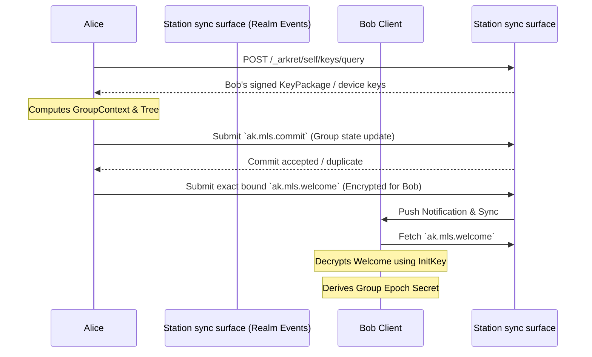

## 0. 规范语言

本文中的规范关键字（**MUST** / **SHOULD** / **MAY** 等）按 [conformance/normative-language.md](../conformance/normative-language.md) 解释；仅大写形式具规范约束力。

## 1. 目标

去中心化协作协议面临着复杂的隐私与合规矛盾：一方面，商业数据和私密频道必须提供不可被 Station sync surface 或未授权受托服务窃听的端到端加密 (E2EE)；另一方面，在特定组织边界内，数据流又需要受到法律或合规层面的安全审查。

本规范定义了 Arkret 官方推荐的加密标准，旨在实现：
- 基于 **MLS (RFC 9420)** 的高效大规模协作加密
- 强前向安全 (Forward Secrecy) 与后向安全 (Post-Compromise Security)——此为默认 `mls_rfc9420` 内容 scheme 的属性；启用 §2.10 `mls_exporter_aead_v1` 且保留 per-epoch `history_secret` 的 Realm，其 FS / PCS 在被保留 epoch 上按 §2.10.5 退化为限定形态（per-epoch FS、PCS 仅对未被保留的 epoch 成立）
- **可审查加密 (Auditable E2EE)**，在 TEE / HSM / 等价受控执行 profile 下把合规解密绑定到可验证审计记录；在 software-only profile 下提供透明审计流程，但不声称具备同等密码学强制力。

## 2. 基础加密架构：MLS 与 Arkret 的融合

Arkret 采用 [RFC 9420 - Message Layer Security (MLS)](https://datatracker.ietf.org/doc/html/rfc9420) 作为官方的群组加密标准。
不推荐使用传统的 Double Ratchet（双棘轮），因为在包含数十到数百名成员的 discussion track 或大型协作 Realm 中，双棘轮会导致巨大的性能开销与并发处理难题。

### 2.1 KeyPackage 与服务发现
在参与 MLS 加密前，用户必须公布自己的 `KeyPackage`。
- **发布位置**：Actor 通过 signed Event 发布自己的 `KeyPackage`，或者在其 DID Document 的 `service` 中指定独立的 `MLS Delivery Service` 节点入口。
- **生命周期验证**：自己的 Station 在返回 KeyPackage claim 前 MUST 验证普通设备或 Agent 的公共授权、确切账号/设备或 runtime key、generation、撤销状态和时效。普通设备 key 的权威来源是 accepted device authorization，不能回退 DID Document key；Agent 使用独立 current-admission 授权。客户端核对请求目标、KeyPackage hash/签名、ciphersuite、有效期与本地端到端设备信任，不验证 DID/PCR 历史，不下载 portable governance evidence。远端 origin carrier 仍由自己的 Station 独立验证。

### 2.2 握手与组成员管理 (Welcome, Commit)
MLS 维护了一颗成员密钥树 (Ratchet Tree)。在 Arkret 中，群组的密钥状态变动不依赖于独立的中心化分发服务器，而是映射到原生的 `Realm` 与 Event 模型中：



- **`ak.mls.commit`**：当拥有权限的 Admin 邀请新成员加入或移除成员时，客户端计算 MLS 的 `Commit` 消息。该 `Commit` 必须作为 `ak.mls.commit` 类型的 Event 提交至 Realm Event history。它作为不可篡改的账本，确保全网节点对群组密钥状态树的演进达成一致。
- **`Welcome` 分发**：新成员会收到由 Admin 构造的 `Welcome` 消息。完整 Welcome bytes MUST 以 canonical unpadded base64url `ciphertext` 内联在 durable `ak.mls.welcome` Event 中，并保留至被消费、撤销或过期；解码必须成功、不得含 padding，重新编码必须与 wire 字符串逐字节一致。Station sync surface 的 Signal Extension 只能作为通知和加速通道，不得是唯一交付路径；否则离线设备、跨域 backfill 和恢复流程无法验证加入历史。
- **投递不得降维**：Delivery / Station sync surface 把 accepted `ak.mls.welcome` 投影为 endpoint delivery 时，MUST 原样保留其规范 payload，至少包括 `mls_group_id`、`epoch`、closed recipient endpoint（ordinary `recipient_principal_id + recipient_device_id`、Agent identity/method/authorization，或 minimal-metadata pairwise actor/method）、`claim_ref`、`claim_envelope`、`governance_binding`、`commit_ref` 与 inline `ciphertext`。服务端不得只转发 MLS ciphertext 或重新构造一个缺少 claim / governance 字段的缩减信封；接收端必须在解密和入组前验证 `claim_envelope.welcome_digest` 精确等于 `sha256:` 加解码后 Welcome bytes 的 lowercase hex SHA-256、验证邀请方签名，并将同一个 `governance_binding` 与 MLS GroupContext extension 及 Seal 证明逐字段比较。

**发送方 admission saga（normative）**：一次 Add admission 的 Commit、面向全部目标设备的 Welcome、以及 Commit 后本地 MLS group state 是同一不可拆分的恢复单元。发送客户端在完成必要的 KeyPackage claim、构造出该 admission 后，MUST 在首次 Commit / Welcome 网络写入前，把以下材料原子写入 crash-recoverable outbound state：精确签名后的 `ak.mls.commit` Event、每条精确签名后的 `ak.mls.welcome` Event，以及仅在投递完成后安装的 post-Commit group state。网络时序 MUST 是 Commit accepted / duplicate 后才投递与其 `commit_ref` 绑定的 Welcome；不得先投递 Welcome，也不得在 Commit 未被接受时安装 post-Commit group state。

在提交含 Add 的 Commit 前，producer 已持有每个目标的完整 Welcome bytes，因而 MUST 先预构造每个候选 `ak.mls.welcome` 的完整 canonical accepted Event Envelope（包含全部 proof 与 reducer 将写入的字段），并按 1,048,576-byte Event 上限逐个检查。任一候选为 1,048,577 bytes 或更大时，producer MUST 在发送 Commit 前以 `payload_too_large` 终止该 generation，且不得安装 post-Commit state；随后只能重新生成满足上限的新 Add/Commit/Welcome 单元。恰好 1,048,576 bytes 在其它约束成立时可接受。该 inline-only 合同构成 v1 的隐含群规模上界；突破它必须另行定义完整的 blob 或受权 group-state material 协议，不能恢复无解析语义的 Welcome ref。

Commit 一旦 accepted / duplicate，发送方 MUST 持续重试**同一 event id、同一签名 bytes、同一 ciphertext** 的每条 Welcome，直到该 Welcome accepted / duplicate，或新的 accepted membership/repair Commit 已明确移除该接收方并使旧 Welcome 失效。单纯达到本地 TTL / policy expiry 不足以把已接受 Commit 对应的 Welcome 标为完成；实现必须同时进入明确的 repair/removal 流程。进程退出、页面关闭、网络错误和普通 deterministic service error 均不得让实现丢弃该 durable item、重新 claim KeyPackage、用新随机数重签 Welcome，或回退到旧 epoch 继续发送。无法自动恢复的响应 MUST 进入可诊断的 quarantined / repair-required 状态并保留原材料；修复路径 MAY 产生新的授权 Commit，但不得静默把已接受 Commit 对应的 Welcome 标为完成。只有全部 Welcome 完成 durable 提交后，发送方才能安装该 admission 的 staged post-Commit group state；若旧 Welcome 已被 accepted repair 取代，则 MUST 丢弃旧 staged state 并安装经验证的 repair 后 current state。两条路径都必须在收敛后才能解除本地 admission transition；接收客户端仍独立校验 Welcome 与本地 MLS transcript/leaf/epoch 绑定；Seal、membership 和治理 frontier 由自己的 Station 验证，客户端核对其结果与该 transition 一致。

**Welcome 大小侧信道（acknowledged side channel）**：MLS Welcome / GroupInfo 的 ciphertext 长度会与 leaf 数量、ratchet tree 形态、path secret 数量和近期 churn 有相关性。Arkret v1 不声称第三方观察者无法从 Welcome 大小推断粗粒度成员变化。需要该防护的服务部署 SHOULD 在 ServiceDescribe 声明支持 `ak.profile.traffic_metadata_hardened.v1`，并按部署配置对其承载的所有适用 Welcome / GroupInfo bytes 使用该 profile 的 padding bucket（默认 4KiB / 16KiB / 64KiB）。该 profile 是 service/deployment conformance claim，不是 Realm `schema_refs` 或私有 active-profile carrier。`welcome_padding_bucket` 表示取整粒度，不是 64 KiB 的 Welcome 最大长度；padding 后仍执行完整 Event 1 MiB preflight。

#### 2.2.1 MLS Group Admin 推导

MLS group admin 不是“第一个发 Welcome 的客户端”或“track 的第一个成员”。Arkret v1 按当前 accepted auth state 确定管理集合：

- Realm-scoped MLS group 的默认 admin set 来自 `ak.realm.create.payload.object.initial_creators` / `created_by`，以及当前有效的 `ak.realm.admin`、`ak.mls.commit`、`ak.mls.welcome` 或 Realm policy 声明的等价 E2EE admin capability。
- Realm 内的 [Circle](../models/circle.md)（`Strand.scope_circle_id` 指向的子事件边界）只有在 `encryption_profile=mls_rfc9420` 时才拥有 Circle MLS group；其 MLS group admin set 由该 Circle 的 `ak.circle.create` / `ak.circle.member.state` / `ak.mls.commit` / `ak.mls.welcome` 等事件按 Circle 自身的 capability 与 membership 体系收敛，与 Realm-default MLS group admin set 独立；Circle key MUST NOT 从 Realm-default key 派生。
- Admin capability 可以通过普通 capability grant / revoke Control Move 转移或收回；转移生效点由 Seal finality、Lattice value 和 revoke freshness 决定，不由 MLS leaf index、设备在线状态或本地 UI 角色决定。

发送 `ak.mls.proposal`、`ak.mls.commit` 或 `ak.mls.welcome` 的 actor 必须在其事件自己的 causal auth state 下属于上述 admin set，或满足该 event kind 允许的普通成员 update / self-update 规则。

### 2.3 载荷加密与 closed pre-encryption header

是否存在 MLS group 只由 effective scope 的 `encryption_profile` 决定；`content_scheme` 在该 group Genesis
中显式固定为 `mls_rfc9420|mls_exporter_aead_v1`。每个 MLS-backed Realm/Circle 使用独立 group。未选择 MLS 的
scope 不得产生 MLS envelope 或占位 group。

两种 scheme 都使用
[`encrypted-envelope.schema.json`](../../artifacts/schemas/encrypted-envelope.schema.json) 的最小 closed wire：

```text
EncryptedEnvelope = {version, content_type, encryption_context, ciphertext}
encryption_context = {epoch, group_state_ref, routing_context?}           // standard
                   | {epoch, group_state_ref, counter, routing_context?}  // exporter
```

双方在加密/解密时从已冻结 outer Event、exact winning group state 与该最小 context 唯一重构 AAD 对象：

```text
pre_encryption_header = {
  purpose: "arkret_event_content",
  envelope_version: EncryptedEnvelope.version,
  content_type: EncryptedEnvelope.content_type,
  scheme: content_scheme(exact group_state_ref),
  effective_scope: effective_scope_from_outer_signed_event,
  event_kind: outer_signed_event.kind,
  mls_group_id: derive(effective_scope),
  epoch: encryption_context.epoch,
  group_state_ref: encryption_context.group_state_ref,
  sender_domain: derive_from_frozen_producer_verification_method_and_verified_leaf,
  counter: encryption_context.counter, // exporter only
  routing_context: derived_routing_context
}
derived_routing_context = {kind:"none"}
                        | {kind:"reaction", target_ref, routing_window, routing_tag}
```

Wire 不复制 purpose、scheme、effective scope、Event kind 或 group id。Counter absence 是 standard 的结构分支，required
counter 是 exporter 的结构分支；receiver MUST 与 exact `group_state_ref` 冻结的 content scheme 交叉校验。重构 header 的
`effective_scope/event_kind/sender_domain/group/epoch/group_state_ref` MUST 与外层已签 Event 和 exact
historical active leaf 逐字节相符；unknown kind、额外字段、inner/outer routing 不一致或陈旧 current history frontier
均拒绝。当前 EventId、由当前 ciphertext/payload 派生的任何 digest、算法名、purpose/profile 的顶层重复副本均不得进入
AAD 或 envelope。构造顺序固定为“冻结 header → seal ciphertext → 组装 Event → 计算 EventId → 外层 proof”。

只有 registry 标记为 reaction 的外层 Event kind 才 MUST 在 wire 携带
`routing_context={target_ref,routing_tag}`；其它 kind MUST 省略。`kind="reaction"` 与
`routing_window=floor(unix_ms(event.created_at)/3_600_000)` 从外层已签 Event 派生并只进入
`derived_routing_context`，不得在 wire 重复。

Exporter scheme 的内容派生、counter 和 replay 见 §2.10。Standard MLS 把同一 header canonical bytes 作为 MLS
authenticated data，并额外执行 history-access 文档中的 endpoint-admission floor。外置 content-addressed blob 可保留
检索 digest；inline encrypted Event 不得携重复 `aad_digest/payload_digest/key_ref.algorithm/aead_profile`。

解密前 MUST 验 Event schema/proof、exact historical group state、unique active leaf、current history frontier 与
header 外层绑定；解密后 MUST 验 plaintext schema 与 inner/outer routing。错误不得进入 verified timeline。Redaction、
retention 或 erasure 可停止投影，但不能使已交付的 secret 失效。
**消息 authoring prepare 的加密边界（normative）**：SDK 的本地 intent MAY 含明文，但线上 closed
prepare request MUST 区分 policy 允许的 `content` 与客户端已加密的 `encrypted_content`；
`e2ee_required` 目标 MUST 拒绝明文分支。MLS 分支 MUST 先在客户端冻结并核对上述 header 所需的
target/effective scope、scheme、group state、producer verification method 与 sender domain，然后本地
加密。Station 只接收密文和同样处理的 encrypted metadata，不取得正文密钥或明文，也不能代用户加密。

返回的完整 unsigned Event MUST 逐字保留请求密文、metadata 与已冻结的 AAD 绑定值；客户端 MUST
独立核对目标、scope/group/sender、密文及用户意图，重算 EventId 后只附加 producer proof。任何不符均
拒绝签名，不得在返回后替换密文并沿用原 prepare 承诺。若新治理状态使冻结输入不再适用，prepare MUST
返回可重试的过期/not-ready 结果；客户端按新上下文显式重新准备。相同 request identity 的 exact retry
MUST 复用原密文和原结果，不得再次消费 MLS sender counter 或在同一 identity 下产生不同密文。

MLS/AAD/nonce/counter/replay 与加密状态持久化仍属客户端，可由 SDK 封装。prepare + submit 的“两次请求”
只适用于发送 gate 和本地 MLS state 均已就绪的情况；缺失前置材料时必须先补齐。本条约束 authoring
facade 的实现，不另设 Event、加密 envelope 或通用 prepare wire。

### 2.4 Sync 与 MLS Epoch

Client Sync 中的事件顺序不保证密钥材料已经同步完成。加密事件和 MLS epoch state MUST 作为相关但可独立到达的 stream 处理：

- encrypted event 可以先进入 raw event cache 和 timeline position。
- `ak.mls.*` state event / MLS Commit 决定客户端是否拥有对应 epoch 的解密状态。
- 客户端缺少 epoch 时 MUST 标记 `decryption_pending`，不得静默丢弃或重排事件。
- standard MLS 只允许 endpoint 从自身 initial Add/Welcome admission 起顺序应用 winning Commit，不得为历史 backfill 获取
  foreign active MLS state。Exporter scope 的 late receiver 缺历史正文时，按每个 epoch 的 T0 `history_access` ceiling 与
  chunk 首次耐久入队时的 T1 current gate 使用 private history-key manifest/chunk；不得把 snapshot、leaf signer、ratchet、
  proposal 或 sender counter 当作恢复材料。
- 被移除成员不得获取移除后 epoch 的 group secret；客户端必须 fail closed。
- `history_access` 只授予历史范围资格，不自动授予旧 epoch key。Exporter 交付必须执行
  [`../governance/history-visibility.md`](../governance/history-visibility.md) §4 的 receipt-bound 认证事实消费（cbs-profiles §9），核验每个 winning transition、current 单向收紧 history_access 与 current incarnation/join floor，并执行首次入队 T1 gate；v1 不存在
  第二套 key-sharing policy 或公开 share/withheld Event。

服务端和 Station sync surface 不需要解密正文，但必须保留明文 routing metadata、epoch reference、hash 和 causal refs，以便客户端后续补齐密钥后重试解密。

#### 2.4.1 Membership 与 Epoch 不一致窗口

Membership state 与 MLS epoch 推进是异步事件，但可见性规则必须确定：

  **明文发送豁免（normative）**：send-pause 只约束需要 MLS-backed 密文的发送。当某 scope 的 effective `content_encryption_floor=allow_plaintext` 且该消息以明文发送时，不受 MLS epoch / `security_frontier_digest` gating——明文消息的 ban / revoke 由 membership cell 即时生效，不依赖 epoch 推进。这使 “`encryption_profile=mls_rfc9420` + `allow_plaintext`” 的可升级默认形态在明文期间无需为每次成员变更推进 MLS epoch；一旦 effective floor 抬到 `e2ee_required`（或该消息以密文发送），完整 §2.5 governance-binding send-pause 立即恢复，首条密文发送 MUST 等待覆盖当前 membership frontier 的 epoch。`encryption_profile=none` 的 scope 不拥有 MLS group，本规则不适用。

  **`mls_send_pause="advisory"` 降级规则**：把上述 MUST 暂停降级为 SHOULD 的能力**仅在显式 degraded profile** `ak.profile.e2ee_relaxed.v1` 下允许声明，不得在默认 `ak.profile.mls_governance_binding.full.v1` profile 或任何声称 “完整 MLS Governance Binding” 的部署中使用。该字段在符合资格的部署中也 MUST：

  - 出现在 `ak.realm.policy_bundle` 的明文 audit log 中(声明本身被记录，便于审计)
  - 部署 profile 在 conformance 声明中**显式列出** `ak.profile.e2ee_relaxed.v1`，否则降级声明 MUST 被 reducer 拒绝（`unsupported_profile` reason）
  - 客户端 UI 在该 Realm 中 MUST 展示明确的"该 Realm 使用降级 E2EE,踢/ban 非密码学即时生效"banner-level 警示(详见 §2.4.2 / `ak.profile.e2ee_relaxed.v1` 规范)
  - 接收端在解密 advisory 模式下旧 epoch 消息时 MUST 检查 receive_at vs membership_change_at 时间窗，超过部署声明 `relaxed_window_max_ms` 时拒绝解密结果进入 verified timeline
  - **`relaxed_window_max_ms` 默认值 = 30,000 ms（30 秒），硬上限 = 300,000 ms（5 分钟）**：两者语义不同，不得混淆。**默认值**是部署未在 `ak.realm.policy_bundle` 显式声明 `relaxed_window_max_ms` 时 reducer / 接收端 MUST 采用的值，固定为 30,000 ms（与 §2.4.2 profile 行为表"被踢者继续解密窗口默认 30s"及 `max_mls_commit_delay_ms` 默认 30,000 ms 对齐，使"踢出后被踢者继续可读窗口"与"正常 commit roundtrip 上限"在默认配置下同量级）。**硬上限**是部署即使显式声明也不得超过的天花板 300,000 ms：部署不得通过 `ak.realm.policy_bundle` 把 `relaxed_window_max_ms` 写为大于硬上限的值；reducer MUST 用 `relaxed_window_exceeds_ceiling` 拒绝。接收端 MUST 独立 enforce 硬上限——不得静默 clamp 到 300000，否则部署声明的窗口与 receiver 接受的窗口会跨实现分裂。部署 MAY 在 `(0, 300000]` 区间内显式覆盖默认 30000；缺省即 30000。Negative vector `ak.vector.e2ee_relaxed.window_exceeds_ceiling.v1` 同时覆盖 policy write 超限与 receiver 接受超限 decrypt 两条路径。
  - **合规 profile 互斥**：声明 `ak.profile.attested_audit.e2ee.v1` / `ak.profile.disclosed_audit.e2ee.v1` 或存在 active Audit Applet Binding 的部署 MUST NOT 同时启用 `ak.profile.e2ee_relaxed.v1`；reducer MUST 用 `e2ee_relaxed_disallowed_in_compliance_profile` 拒绝。合规 / 监管 profile 的核心承诺是"踢出即时密码学生效"，relaxed 窗口与之矛盾。
  - **Federation guard**：`ak.profile.e2ee_relaxed.v1` MUST NOT 与 `federation_policy="open"` 或 `"quarantine"` 同时启用；reducer MUST 用 `e2ee_relaxed_federation_policy_unsupported` 拒绝。`federation_policy="restricted"` 只允许在 Realm policy 同时声明 `relaxed_fanout_deadline_ms <= relaxed_window_max_ms`、`max_federation_delivery_delay_ms <= relaxed_window_max_ms` 且 federation peers 在 `ak.server.read.describe.v1.limits` 中公开不超过该 deadline 的 fanout SLA 时启用；否则 MUST fail closed。`federation_policy="closed"` 不需要额外 federation guard。describe SLA 校验仅是准入门槛（声明时校验 peer 公开的 fanout deadline 是否满足约束），实际 enforcement 仍由接收端 `relaxed_window_max_ms` 时间窗兜底（运行时校验 receive_at vs membership_change_at，超窗即拒绝 decrypt 进入 verified timeline）；二者缺一不可，不得理解为"声明合规即放行"。

  **降级声明义务（normative）**：effective `mls_send_pause="advisory"` **当且仅当** `effective_e2ee_relaxed=true`；它由 active `ak.realm.policy_bundle` 唯一承载，不写入 Realm `schema_refs`，也不读取 generic profile list。服务端 ServiceDescribe 仍须声明实现支持 `ak.feature.e2ee_relaxed.v1`；该 Realm 后续每个 MLS `governance_binding.binding_profile` 必须等于 policy 派生结果：relaxed 时为 `ak.profile.e2ee_relaxed.v1`，否则为 `ak.profile.mls_governance_binding.full.v1`。active Audit Applet Binding 与 advisory policy 互斥。sync metadata、snapshot、backup/export 与 interop mapping receipt 必须保留派生的 `e2ee_relaxed` 与窗口。任一等式、Audit Binding 或 ServiceDescribe 支持面不一致均 fail closed；不得从私有配置、UI 标签或 genesis profile 猜测。

  **联邦互操作下界（normative）**：跨 deployment 的 MLS-backed Realm 以 `ak.profile.mls_governance_binding.full.v1` 为 E2EE 互操作下界。`ak.profile.e2ee_relaxed.v1` 是低于该下界的显式降级，只能在 `federation_policy="closed"` 或满足上方 restricted federation guard 的 `restricted` Realm 中出现；open / quarantine federation MUST reject。联邦 peer 未在 describe 中声明所需 profile/feature、未公开满足窗口的 fanout SLA、或 MLS commit / ordinary Event 的 `binding_profile`、`reducer_profile`、`security_frontier_digest` 无法验证时，接收方 MUST reject 或 quarantine，不得把该 peer 的 push 用于推进本地 Realm frontier。

  声明 advisory 但未声明 `ak.profile.e2ee_relaxed.v1` profile 的 Realm create / policy update event MUST 被 reducer 拒绝。详见 §2.4.2 与 [`conformance-profiles.json`](../../artifacts/profiles/conformance-profiles.json)。
- Realm / reducer profile MUST 声明 `max_mls_commit_delay_ms`，**默认 30,000 ms**；profile MAY 覆盖（交互式 profile SHOULD be no greater than 30,000 ms，高延迟 / 批量 profile MAY 声明更大值）。客户端在 commit 滞后超过该 effective 值后 MUST 将该 scope 降级为 read-only / send blocked，服务端 SHOULD 返回 `epoch_update_required` 或 `temporarily_unavailable`。
- 网络分区期间可以继续 backfill 旧 epoch 历史，但不得把旧 epoch 下的新消息展示为已满足最新 membership policy 的消息。

该窗口规则不改变 MLS Proposal / Commit 两阶段语义；它只定义 Arkret 在 state 已变化但 epoch 尚未收敛时的 UI、发送和解密处理。

### 2.4.2 `ak.profile.e2ee_relaxed.v1`(降级 profile)

**目的**:某些低延迟交互场景(实时音视频会议、协同光标 / 多人编辑、游戏内聊天等)不能容忍 MLS commit 完成才允许发新消息的等待开销(典型延迟 200ms-数秒)。`ak.profile.e2ee_relaxed.v1` 是为这些场景保留的**显式降级 profile**:允许 `mls_send_pause="advisory"`,代价是放弃"踢人/ban 后被踢者立即不能解密新消息"的密码学硬承诺。

**适用判断**:
- Allowed: 实时交互延迟要求 < 1s 且业务可接受"踢出后窗口内被踢者仍可读 1-2 条消息"的场景。
- Forbidden: 普通群聊 / 协作文档 / 项目讨论(踢人语义需要密码学强保证)不适用，继续用默认 `ak.profile.mls_governance_binding.full.v1`。
- Forbidden: 合规 / 法律 / 监管要求"立即生效"撤销时强制不适用，部署 MUST 拒绝。

**Profile 行为差异**:

| 维度 | 默认 (`mls_governance_binding.full.v1`) | 降级 (`e2ee_relaxed.v1`) |
| --- | --- | --- |
| `mls_send_pause` 默认 | MUST 暂停直到 security frontier 被当前 Commit 覆盖 | 允许声明 `"advisory"`,降为 SHOULD |
| `security_frontier_digest` 匹配 | reducer/客户端 MUST enforce | 仍然写入并验证，但 send-side 可按声明窗口延迟阻塞 |
| 被踢者继续解密窗口 | ≤ MLS commit roundtrip(密码学保证) | ≤ `relaxed_window_max_ms`(默认 30s,部署声明) |
| 接收端 verified timeline 检查 | epoch 不匹配 → 拒绝 | epoch 不匹配且超出 `relaxed_window_max_ms` → 拒绝 |
| UI 警示 | 无 | **MUST 显示 banner-level 警示**，并明确披露：该 Realm 使用降级 E2EE；踢出 / ban 不具备密码学即时生效保证；旧成员可能在声明窗口内继续解密最近消息。 |
| Server describe `supported_features` | `ak.feature.mls_governance_binding.full.v1` | `ak.feature.e2ee_relaxed.v1`(互斥;**MUST NOT** 同时声明 full + relaxed) |
| 在合规 / 监管语境下 | 满足"成员踢出即时生效" | 不满足,SHOULD 走非 E2EE 或专用 enclave 通道 |

**强制约束**:

- Realm 在 `ak.realm.policy_bundle` 中声明 `mls_send_pause="advisory"` 时，该字段本身就是唯一 Realm policy carrier，并派生 `effective_e2ee_relaxed=true`；省略时派生 false。Realm `schema_refs` MUST NOT 携带 `ak.profile.e2ee_relaxed.v1`。
- effective relaxed policy 与 active Audit Applet Binding **MUST NOT** 同时成立；冲突 MUST reject（`e2ee_relaxed_audit_binding_conflict`）。full/relaxed 不是两个 Realm 声明，而是由 policy 唯一选择的 operation-local `binding_profile`。
- 后续 MLS commit 的 `governance_binding.binding_profile` **MUST** 精确等于 effective policy：`mls_send_pause=advisory` 时写 `ak.profile.e2ee_relaxed.v1`，否则写 `ak.profile.mls_governance_binding.full.v1`；并携带当前协商 reducer profile。缺字段、未知值或与 policy / ServiceDescribe 支持面不一致时，接收方 MUST reject / quarantine。
- 声明本 profile 的 Realm 若同时声明 federation，MUST 满足 §2.4.1 的 Federation guard。open / quarantine federation 直接拒绝；restricted federation 必须证明 fanout deadline 不超过 relaxed window。
- 客户端实现 **MUST**:
  - 在该 Realm 的对话 UI 上展示 banner-level 警示(不可被用户永久 dismiss,可临时折叠)
  - 在用户邀请新成员时弹窗提示"该 Realm 使用降级 E2EE",让用户知情决策
  - 在 sync metadata 中标记该 Realm 为 `e2ee_relaxed=true`,导出 / 备份 / 跨设备时保留该标记
- 服务端 `ak.server.read.describe.v1.supported_features` **MUST** 列出 `ak.feature.e2ee_relaxed.v1` 才能接受该 profile 的 Realm 写入

**禁止扩展**:本 profile 不允许进一步降级到"不验证 `security_frontier_digest`" / "允许跨 epoch 解密无窗口限制"。降级到此为止；更宽松场景应当退回到**非 E2EE** Realm(`encryption_profile="none"`)而不是继续放宽 E2EE 承诺。

### 2.5 MLS Security Frontier Binding

Arkret v1 把 MLS epoch 只绑定到会改变当前或历史密钥取得者的 accepted control state。普通 Event admission 的 seal_ref 与 MLS security frontier 是正交证明：seal_ref 选择该 Event 的 CBS 授权视图；security_frontier_digest 证明当前 MLS epoch 已覆盖最新 key-access state。任何 Seal 都不得因为被消息引用而要求 MLS Commit 反向覆盖自身。

每个 MLS scope 投影唯一 current state：

- mls_group_id；
- epoch；
- security_frontier_digest；
- commit_ref（genesis 时为 genesis Event ref）。

security_frontier_digest 的输入由 [`mls-security-frontier-registry.json`](../../artifacts/registry/mls-security-frontier-registry.json) 闭合登记，并从 accepted Seal state 与 RFC 9420 current/pending leaf set 确定性重建：

1. Realm / Circle membership join、leave、remove、ban，以及实际使当前 MLS leaf 无效的 participant terminal；
2. 当前或 pending MLS leaf 实际引用的 participant device / Agent runtime key authorize、revoke、replacement；
3. MLS group membership；
4. 改变谁能取得当前或历史密钥的 encryption floor、content encryption scheme、history visibility / sharing policy。

与当前或 pending leaf 无关的 device/Agent key、普通 capability、message/Strand metadata、moderation、display metadata、media/routing endpoint 和 contact/consent-only state MUST 排除。block、Contact或Consent只在各自被当前操作正式登记为authority gate的路径上立即禁止新 application message、call signal或Welcome；Personal DM只读取双方directional Contact heads，Consent变化对其无效。除非accepted effect同时remove leaf，否则这些变化不单独触发rekey。

producer 不提交任意 Event/Seal ref 清单来定义 frontier。所有实现必须从相同 accepted state 得到逐字节相同的 canonical digest；未知 cell family 或无法闭合依赖时 fail closed。
#### 2.5.1 Security binding payload

ak.mls.genesis、ak.mls.commit、需要绑定当前 epoch 的 ak.mls.welcome 与 MLS proposal 使用同一 mls_governance_binding closed object。必需字段是：

| 字段 | 约束 |
| --- | --- |
| binding_version | 固定 1 |
| encoding_profile | 固定 cbor-deterministic-rfc8949-v1 |
| realm_id / effective_scope / circle_id? / sidecar_id? | 精确标识 Realm-default、Circle 或 native Sidecar MLS scope |
| mls_group_id | 目标 group |
| previous_epoch / next_epoch | genesis 为 0/0；Commit 必须 next=previous+1 |
| security_frontier_digest | 按 §2.5 的闭合集合重算 |
| binding_profile / reducer_profile | 显式解释 profile；缺失或不支持 fail closed |
| sidecar_binding? | 只在 `effective_scope.kind="sidecar"` 中出现，绑定 exact Realm-scoped desired participant authority |

membership_frontier、covered_seal_refs、policy_root、capability_root 与 discussion_metadata_digest 不再是 wire 字段。它们把同一 accepted state 重复拆成多个 producer-supplied commitments，并导致无关治理变化阻断消息；receiver 改为从 Seal state 直接重算唯一 security_frontier_digest。

每个 ak.mls.commit MUST 同时携带 mls_group_id、base_epoch、next_epoch、完整 commit_bytes_b64 与 governance_binding；可选 `commit_message_ref` 若存在必须是 content-addressed Blob ref，其内嵌 digest 必须匹配解码后的完整 Commit bytes。receiver 先验证包含该 payload 的 Event，并在 ref 存在时校验其 digest，再按 RFC 9420 应用完整 Commit bytes，并核对 epoch、group 与 security frontier。只提供 digest 或 object ref 不合规，payload 不携 sibling `commit_digest`。

**Realm/Circle 公开握手（normative）**：effective scope 为 Realm 或 Circle 时，`proposal_bytes_b64` 与
`commit_bytes_b64` MUST 分别编码完整 RFC 9420 MLSMessage 的 `PublicMessage` Proposal 与 Commit，
包括其原始认证内容，不得使用 `PrivateMessage`、裸 Proposal/Commit body 或重新编码的摘要替代。
producer 在 create、join、restore 后均须维持这一握手 wire-format policy；接收方按同一规则拒绝
错误 wire format/content type。Sidecar 继续适用自己的合同，本条不改变其握手格式。

Station 在 schema、Event proof/capability、canonical scope/group identity、可选 ref 与 inline bytes 的
exact digest、`base_epoch -> next_epoch` CAS 和 governance binding 检查之外，MUST 从 exact accepted
base 的耐久公开 group state 解析 Proposal/Commit，验证公开可检查的签名、sender、group、epoch、
proposal 引用与公开 ratchet-tree 转换，并按 §2.6 建立确切 leaf 来源。by-reference Proposal 必须来自
同一 base 的 accepted durable Proposal Event，RFC proposal reference 必须匹配其实际认证内容，不能
把 EventId 当作 RFC proposal reference。公开输入缺失或不一致时不得发布成功 transition/leaf 索引。

服务端不持有 member MLS secrets，MUST NOT 声称验证依赖这些 secrets 的 membership_tag、
confirmation_tag 或派生下一 epoch 私态；也不得索要 secrets，或仅因没有秘密就固定返回 503。
公开跟踪器可以按 RFC 9420 的公开处理规则 stage/merge tree 与 transcript，并原子发布治理接纳及
公开 leaf 来源；这不证明任一成员已完成秘密认证或能解密。客户端仍执行完整 RFC 9420 验证与
Commit 应用，错误 Commit 不得进入本地 MLS state。自己 Station 计算治理结果，客户端核对其与
实际 MLS transcript 的绑定，不重放治理历史。

公开握手不公开 UpdatePath 的 path secrets：仅发布 RFC 9420 规定的 public keys 与已加密 path
材料。application message、Welcome 与私有 group state 的端到端保护不变。minimal-metadata
Realm/Circle 只披露其既有 pairwise Actor/method/credential 公开材料，MUST NOT 为公开跟踪另加真实
Principal、Account、Device、Realm 外定位信息或解匿名目录；服务端使用该 profile 的既有授权规则。

ak.mls.welcome MUST 携带 commit_ref，并与同一 Commit、recipient 和 claimed KeyPackage 逐字段闭合。Delivery/Station sync surface 必须原样保留完整 payload；不得转发缺 claim、commit_ref、binding 或 ciphertext 的缩减 envelope。
#### 2.5.2 Send gate 与 self-heal

E2EE ordinary Event 必须声明 mls_group_id、epoch 与 security_frontier_digest，并携带普通 Event admission 所需的 auth_context.authority_refs。receiver 接受 application message 当且仅当：

1. 自己 Station 已按完整 accepted view 通过 Event 的 seal_ref / CBS admission；客户端不重放此治理判断；
2. group 与 scope 匹配；
3. epoch 等于 winning MLS epoch；
4. message 的 security_frontier_digest 等于自己 Station 在该 Event basis 验证的 key-access frontier 结果；
5. winning genesis/Commit Event 已 accepted，且其完整 RFC 9420 transcript 绑定同一 digest。

若存在尚未被 winning Commit 覆盖的 key-affecting fact，scope 进入 epoch_update_required，所有新加密 application message、call signal 和 Welcome暂停；返回 mls_governance_binding_stale。无关 capability、metadata、moderation、routing 或 consent-only state 前进时 MUST NOT 产生该错误。

任一 active member 客户端观察到 epoch_update_required 后 MUST 发起 self-heal Commit；并发 proposal/Commit 按现行 MLS winner/CAS 规则收敛。消息数、epoch 存活时长与 routing-token scope 的自保推进上限保持不变。明文 scope 不受 MLS epoch gate，但仍受即时 membership/authorization admission。
#### 2.5.3 GroupContext extension 与治理结果

MLS GroupContext extension type 0xF1C0 继续把确定性 CBOR 编码的完整 mls_governance_binding 纳入
confirmed_transcript_hash。canonical map 只包含 §2.5.1 的字段；禁止 indefinite-length CBOR、非最短整数、
重复/乱序 map key、未知字段或 JSON/CBOR 混用。

普通客户端 MUST 使用[服务器信任与结果 §5](../sync/server-trusted-results.md#5-mls-绑定结果)的 self
query/outcome：自己 Station 对 exact accepted basis 与本地 current/pending RFC 9420 叶集合计算治理结果，
客户端检查请求绑定及 GroupContext/Event 中的 digest，并执行 RFC 9420 密码学。客户端 MUST NOT 获取或
保存 proof_base_basis 对应的治理重放检查点，不执行 Merkle、DID history、Seal closure 或 reducer/root 重算。
新设备、Welcome、creator bootstrap 与历史恢复均适用。服务器结果不携私有 MLS tree secrets，也不替客户端
选择 leaf set；完整 ActorId 必须区分同 principal 的不同 Station。公开 GroupInfo/ratchet tree 仍走 §5.1.1。

Peer server 的 `ak.peer.seals.read.mls_governance_proof.v1` 独立使用 `read_request/read_outcome`：
query 绑定完整 canonical proof_base_basis/proof_target_basis、local_mls_leaves、group_binding purpose、
base_group_state_ref、Genesis proposal、epochs、binding_profile 与 byte_limit。base 必须是该 peer 已验证的
accepted cut；target 必须支配 base，base==target 合法。已证明不可达返回 mls_governance_anchor_unreachable，
必需材料缺失返回 frontier_unavailable。服务不得替换已指定的唯一确认 head 或截断结果。

Peer verifier MUST 逐条验证 target 的每个 branch 与其签署的 state_root；验证完整 predecessor closure、
每个 Seal.delta 对应的 every-and-only Events、历史 signer/notary 与 registered dependencies，再以普通 reducer
验证唯一 target head 的确认状态和确切安全 Cell 证明。notary 轮换必须由 predecessor authority 授权，不能用 current key
替代历史授权。sparse Merkle membership、range boundaries/nonmembership 和 provenance 必须闭合；安全确认故障、
recovery reset 与 missing 语义由普通 reducer 决定，禁止临时 JSON merge。最后按同一 frontier registry、Genesis
binding 和 exact leaves 计算 security_frontier_digest。每个 content-addressed Event/Seal 都按其完整摘要验证；
event_ids 仅列 sparse provenance，不能替代完整 delta 解析。query_digest/page_digest、1 MiB 完整响应上限、
64 siblings 上限和每个 closed collection 边界仍适用；没有 cursor、continuation 或 partial frontier。

向量 ak.vector.mls.security_frontier_key_access_only.v1 继续保证与密钥访问无关的治理 Seal 前进不改变 key-access
digest，而 active leaf revoke 必须影响它。自己 Station 的结果消费与 peer 的独立证明验证分别验收。

#### 2.5.4 SealBasis 信任来源（normative）

普通客户端的治理信任来源是已认证账号所属的 Station。`RealmSealFrontierView` 是该 Station 已验证的
唯一已确认 Realm head 与 live digest-suite 结果；客户端核对账号会话/Realm 和签署意图即可使用，MUST NOT
再次从 genesis 建立 T1/T2/T3 治理 pin。配对、Welcome、备份和旧设备迁移均不需要增加治理检查点或 witness。
MLS 本地快照与私钥的端到端保护继续适用；它们不承担证明自己 Station 诚实的职责。

实际接纳 foreign governance 的服务器仍须独立建立 accepted basis。event-derived Realm 的 genesis 必须
通过内容绑定 realm_id 派生并核对 create Event；genesis Seal 必须同 Realm、无 predecessor、覆盖该 create，
并由 create.payload.object.notary 的有效 genesis authority 签署。PCR 按 principal DID 的已验证 inception
与 critical did_inception root anchor unit 建立锚，不能套用 event-derived create 规则。

服务器从已验证 basis 前移时，必须验证全部新增 Seal/Event 与依赖、唯一确认前缀的可达性及安全状态，
原子持久化 accepted bytes、验证状态和派生索引；不能仅因另一个服务器提供 frontier、proof 或错误建议而替换
自身 accepted basis。跨请求/用户/重启复用按[服务器信任与结果 §4](../sync/server-trusted-results.md#4-服务器验证复用)。
服务器 verifier 向量继续覆盖错 genesis、错 notary、篡改 predecessor 与缺失确认前缀；这些不是客户端冷启动任务。

### 2.6 KeyPackage Claim 生命周期

Agent 的 claimed-endpoint trust binding 由 conformance vector `ak.vector.agent.mls_keypackage_authorization.v1` 固化。

KeyPackage 不应被建模为可无限次公开拉取的静态材料。E2EE 实现 MUST 将 MLS KeyPackage 作为可声明、可领取、可消费、可撤销的单次使用材料。

KeyPackage upload 与所有 accepted MLS transition 使用同一个 closed endpoint identity 合同：

| endpoint 分支 | `BasicCredential.identity` | LeafNode / upload batch key | principal/member 归属 |
| --- | --- | --- | --- |
| ordinary human | canonical `DeviceId` 的 UTF-8 bytes | 当前 accepted `ak.device.authorize.payload.device_public_key_did` | accepted Genesis 或 Add/Commit/Welcome transition binding |
| Agent | canonical Agent ActorId 的 UTF-8 bytes | exact current `ak.agent.key.authorize` method key | Agent transition/authorization binding |
| minimal-metadata pairwise | canonical Realm-local pairwise ActorId 的 UTF-8 bytes | exact `did:key` raw key | Realm-local actor，不得聚合回 account/device |

credential 标识 leaf endpoint，Leaf key证明该 endpoint，accepted transition证明 membership。ordinary human 不得把
principal 编入 credential，不接受 `principal_id + "#" + device_id` 或双格式 fallback；v1 也不存在独立 ordinary MLS
leaf signer。每个 accepted transition MUST 物化并持久保存 group-local
`leaf_index -> {principal_id, endpoint identity, endpoint_authorization_ref?, membership_incarnation, leaf_signature_key}` binding。Genesis 从 accepted
creator Event 的 `actor_id`、唯一 producer proof 与 signer leaf 建立。Add 必须从 winning Commit 的 `proposal_refs[]` 解析每个 accepted durable `ak.mls.proposal(add)` Event，再把其 target principal、membership incarnation、signed KeyPackage credential/Leaf key、对应 accepted membership Event 与 post-Commit RFC 9420 tree 联合验证；receipt、claim record 与 committer 私有 journal 只用于短命编排，MUST NOT 成为成员重建 binding 的输入。ordinary/Agent 的 exact endpoint authorization ref 由自己的 Station 在 accepted authority 中派生并随有界 accepted-artifact 的 public leaf binding 返回；receiver 只核对实际 MLS leaf 与该结果，不重放治理历史，不复制进 Add。Update 继承同一 binding；device/Agent key或其 authorization改变必须走
replacement/remove+add；Remove 与本地 MLS 接收状态保留 transition 当时的必要 leaf binding。current admission 只接受 current authority，
历史 replay 使用对应 epoch 已钉住的 historical binding。裸 RFC 9420 public tree 只能给出 endpoint leaves；没有 accepted
transition provenance 时不得把它解释为 principal roster，也不得查询 current directory补全。

同一 Commit 中，实际消费的 Add proposal、Commit `proposal_refs[]` 与 post-Commit 新 occupied leaves MUST 构成 every-and-only 双射：每个 referenced accepted Add 恰产生一个新 leaf，每个新 leaf恰由一个 referenced Add解释。inline/unreferenced Add、零匹配、多匹配、重复 credential/key、proposal set 不一致均拒绝；不得按到达顺序或“第一个空 leaf index”猜位置。同一 DeviceId最多一个 active leaf，同一 principal的不同 device可各占一个 leaf。自己的 Station 返回 winning transition/security frontier 治理结果；客户端验证与 exact accepted-artifact/真实 MLS 输入的绑定、应用 Commit，并把本地 RFC group state、必要 public leaf bindings 与 accepted transition ref 按 §2.5.4 同一耐久边界原子保存。重启直接恢复这份本地 MLS 状态，不重建治理 checkpoint 或扫描历史 Event/Proposal/Commit；不得另建一套客户端治理 leaf-directory。

Realm/Circle 的 retained/new/removed 叶集合 MUST 从 §2.5.1 的确切 PublicMessage、所消费 Proposal
与 RFC 9420 staged public transition 得出，不能仅比较前后 public tree。普通 Update proposal 或
Commit UpdatePath 对合法保留叶的 encryption_key 更新继承原 endpoint、membership incarnation、
signature_key 及其 authorization；签名密钥或授权 replacement 必须 remove+add。Remove 后 Add
即使复用了相同 leaf_index、ActorId、credential_ref 甚至相同 signature_key，也形成新的 leaf instance，
来源绑定本次 Add 与 accepted transition，不继承被移除叶的 incarnation。客户端和服务器都不得用
前后三元组相等跳过此判断。服务器将公开 staged tree、consumed proposal 身份、leaf 来源与 winning
transition 的发布同事务耐久提交；候选被否决、分支替换或 quarantine 时，不得留下它的 active 来源。
重启与分支恢复从已验证的 durable public base 继续，只重算真实受影响后缀，不要求客户端上传历史闭包。

> **Arkret 扩展说明**：RFC 9420 Section 10.1 将 KeyPackage 定义为全局单次使用材料（一个 KeyPackage 对应一次 Welcome）。Arkret 的 claim 模型在此基础上增加了 `intended_realm_id` 绑定和 Realm-scoped claim，要求 MLS Delivery Service 跟踪 Realm affinity。这是 Arkret 的有意扩展，理由是：(a) 去中心化环境中没有中心化 Delivery Service 来全局追踪 KeyPackage 消费状态；(b) Realm-scoped claim 使客户端可以控制自己被邀请进入哪些 Realm，而非被动接受任何 Welcome；(c) claim 绑定使审计链可追溯某个 KeyPackage 被哪个 Realm 消费。实现若使用标准 MLS 库（不支持 Realm-scoped claim），MUST 至少在 Arkret 协议层维护 claim 映射表，并在 Welcome 发送/接收时执行 claim 验证。

KeyPackage lifecycle：

```text
published -> claimed -> consumed
          -> revoked
          -> retired
```

推荐记录：

```json
{
  "kind": "ak.mls.keypackage",
  "keypackage_id": "ak:mls:kp:01964137-0000-7000-8000-000000000001",
  "principal_id": "ak:did_core:key:z6MkPairwise...",
  "endpoint_verification_method": "did:key:z6MkPairwise...#z6MkPairwise...",
  "intended_realm_id": "ak:realm:...",
  "keypackage_ref": "sha256:...",
  "keypackage_digest": "sha256:canonical_keypackage_bytes",
  "cipher_suites": ["MLS_128_DHKEMX25519_AES128GCM_SHA256_Ed25519"],
  "capabilities": ["ak.content.v1", "mimi.content.v1"],
  "state": "published",
  "created_at": "2026-04-30T00:00:00Z",
  "expires_at": "2026-05-07T00:00:00Z"
}
```

**MLS ciphersuite registered set（normative）**：`cipher_suites[]` 与 server describe 暴露的 MLS ciphersuite 合法值的机器可读 source of truth 是 [`mls-ciphersuite-registry.json`](../../artifacts/registry/mls-ciphersuite-registry.json)（与 hash 的 digest-suite registry、签名的 signature-alg registry、非-MLS 应用层封装的 [`hpke-suite-registry.json`](../../artifacts/registry/hpke-suite-registry.json) 形成四大算法 agility 面的对称纪律）。v1 active 集合仅 `MLS_128_DHKEMX25519_AES128GCM_SHA256_Ed25519`（default-MUST，RFC 9420 mandatory-to-implement suite）；软件友好的 RFC 9420 `0x0003` ChaCha20-Poly1305 suite 已作为 reserved row 占位，在 KAT、协商负例与新 contract release 完成前不得上 wire。KeyPackage claim / group 协商遇到未登记或 reserved suite MUST fail closed，即使底层 MLS 库支持。

**KeyPackage capability 归属与群下界（normative）**：`capabilities[]` / `required_capabilities[]` 的机器可读 source of truth 是 [`keypackage-capability-registry.json`](../../artifacts/registry/keypackage-capability-registry.json)。该集合是开放注册集；接收方 MUST 保留形状合法但未登记的值以便转发与诊断，但 MUST 把它按 unsupported 处理。未登记、非 active 或非 v1 的值不得满足 claim、不得进入群下界，也不得授权发送方选择对应 content / policy profile。数组 MUST 按 UTF-8 bytes 升序且无重复；v1 active 行是 `ak.content.v1` 与 interop namespace 的 `mimi.content.v1`，其中每个 Arkret MLS group 的下界 MUST 至少包含 `ak.content.v1`。

Arkret 不把应用层字符串误装进 RFC 9420 `required_capabilities` 的 codepoint 列表。应用能力使用 [`mls-extension-registry.json`](../../artifacts/registry/mls-extension-registry.json) 中两个 private-use 扩展：

- `keypackage_capabilities` (`0xF1C1`, LeafNode) 在签名 LeafNode 内携带 endpoint 支持的完整能力列表。其 `extension_data` 是 definite-length deterministic CBOR text-string array，逐项为 registry id，按 UTF-8 bytes 升序且无重复；禁止 indefinite length、非最短长度编码、未知 CBOR 类型与 trailing bytes。upload / claim record 的外层 `capabilities[]` MUST 与该 signed LeafNode 列表逐项、逐序相等；不相等的 KeyPackage MUST 在发布或 Add 前拒绝，外层字段不得扩大或缩小 LeafNode 的声明。
- `required_keypackage_capabilities` (`0xF1C2`, GroupContext) 用同一编码携带当前群能力下界。建群时 committer MUST 从 Realm 要求与实际选择的 content / policy profiles 确定 floor；不得把所有 endpoint 的能力并集或单个发送方偏好当作 floor。任何 Add / Update 后的 LeafNode `0xF1C1` 列表 MUST 是 current floor 的超集。提高或替换 floor 只能经 RFC 9420 `GroupContextExtensions` proposal，且在 Commit 前验证所有新 epoch 成员仍满足；否则该 proposal / Commit MUST fail closed。Welcome 接收方 MUST 在安装 group state 前验证本地能力是 floor 的超集。v1 不允许 external join 或由 external Commit 添加成员。

GroupContext 同时 MUST 携带 RFC 9420 `required_capabilities` (`0x0003`)，其 `extension_types` 至少列出 `0xF1C0`、`0xF1C1`、`0xF1C2`，从 MLS 层阻止不理解这些扩展的 LeafNode 进入。`0xF1C2` 是 MLS 认证群状态；后续变更由携带 `GroupContextExtensions` proposal 的 Commit 进入 `confirmed_transcript_hash`，Welcome 的 signed GroupInfo 认证新成员看到的 current GroupContext。发送方 MUST 仅选择 current `0xF1C2` floor 已包含的 content / policy capability；“某个 LeafNode 自称支持”或 claim 时的一次性子集检查都不能替代群下界。

Claim 请求 MUST 绑定：

- requester principal / service DID，以及 closed device、Agent 或 Realm-local pairwise endpoint proof。
- intended `realm_id` 或 `mls_group_id`。
- required capabilities / content profiles / cipher suites。
- 是否允许 minimal-metadata pseudonymous credential。
- `claim_receipt.claim_request_id` challenge、过期时间和目标 Welcome 路由服务。

Claim 成功后：

- KeyPackage 进入 `claimed`，并绑定 claim/requester/intended Realm、capability/digest、expiry 与 claimed endpoint 的 closed authority。普通 device 必须且只能使用 `device_authorize_event_id`；Agent runtime 必须且只能使用 `agent_key_authorize_event_id`；minimal-metadata endpoint 必须且只能使用 exact `did:key` method + `intended_realm_id`，不得伪造前两类 authorization ref。
- 同一 KeyPackage 不得被第二个 Realm/group、requester 或 Welcome 重复使用。
- Welcome `claim_ref` 携带 `{claim_id,keypackage_ref,keypackage_digest,capabilities_digest}` 加上述三分支之一的 authority binding，并进入 governance/AAD transcript。发起 claim 的 source Station 在远端调用前验证其本地托管 device/Agent 的 current generation 与未撤销状态，或独立验证 pairwise actor、exact `did:key` method、MLS LeafNode BasicCredential 与 signature key 逐字节一致；对端验证 target service 的签名 claim，不接收 PCR history sidecar。该 MLS 安全操作不赋予 source Station 普通 Event 准入权。
- 若 device 在 claim 与 Welcome 之间 revoke、re-anchor fenced 或其 authorization 被替换，未消费 claim 失效；发送方必须以 current `device_authorize_event_id` 新建 claim。Agent authorization revoke/supersede/expiry 同理。
- 返回 KeyPackage 时必须附 destination Station 签发的 claim receipt；该 receipt 以 `claims_digest` 覆盖 exact claim bytes，并与 destination durable claim ledger、request digest 和服务签名逐字绑定。upload endpoint signature 只在发布准入时验证，claim record 不复制无法由其自身重建验证前像的签名。claim 不携 device/PCR/Agent signer history sidecar；destination service receipt 提供对本地 admission 决定的可验证归责。device、Agent 与 pairwise method 三分支是 closed XOR，不能互相 fallback。

#### 2.6.1 Welcome `claim_envelope` 签名（normative）

per-Welcome `claim_envelope` 必须由 requester 当前 accepted signer 签署。canonical 签名 transcript 至少绑定：从同一 Welcome 的 `claim_receipt.claim_request_id` 取得且字段名为 `claim_request_id` 的 challenge、`keypackage_ref`、`keypackage_digest`、`intended_realm_id`、`claim_id`、`requester_actor_id`、`welcome_digest`、`created_at`，以及精确三选一的 `requester_device_id + device_authorize_event_id`、Agent method + `agent_key_authorize_event_id`，或与 `requester_actor_id` 精确投影一致的 pairwise `did:key` method。`claim_request_id` 不在 `claim_envelope` wire 中重复；签名方和验签方 MUST 从该 Welcome 的 exact destination-signed receipt 提供它，不得接受 envelope 自报、调用方默认值或别名。

普通 device signature 必须按 PCR authorization chain 解析到 current generation 的 accepted `device_public_key_did`，且 envelope 中 `requester_device_authorize_event_id` 必须逐字等于该 current binding；Agent 必须解析其 current active `ak.agent.key.authorize`，并逐字绑定同一 Event 中的 verification method；pairwise branch 必须直接从 exact `did:key` method 解析 Ed25519 key，并验证其 controller 投影、requester actor、KeyPackage LeafNode BasicCredential、signature key 与签名逐字节一致。接收端还必须从 `claim_ref.keypackage_digest` 与权威 claim record/receipt 重算 KeyPackage digest（不得再接收平行 top-level digest），验证 intended Realm 与 Welcome group 一致、receipt-derived `claim_request_id`/capabilities digest 一致、pairwise claim endpoint 与 top-level recipient endpoint 逐字相等、authority binding 在消费时仍成立，以及 `welcome_digest` 等于 canonical Welcome bytes。任何失败都拒绝 Welcome，reason=`keypackage_welcome_envelope_mismatch`。Delivery Service key、目标 KeyPackage 自身的 publish signature或裸服务断言都不能替代 requester signature。

#### 2.6.2 Last-Resort KeyPackage（可选语义）

§2.6 的默认模型把 KeyPackage 建模为严格单次使用材料：`published -> claimed -> consumed`，"同一 KeyPackage 不得被第二个 Realm / MLS group、第二个 requester 或第二次 Welcome 重复使用"。该纪律带来两个运营缺口：(a) 长期离线设备的预发布 KeyPackage 池耗尽后，该设备**完全不可被邀请 / 加群**，直到下次上线补池；(b) 对端可在 claim 限速预算内逐步 claim 直至抽干池子，制造**定向 DoS**——使目标设备对外不可邀请。

RFC 9420 Section 10 明确承认 last-resort KeyPackage 模式（生产 MLS 部署如 Wire 已采用）。Arkret 采纳该模式为**可选能力**：实现 MAY 在 KeyPackage 池耗尽时提供一个标记 `last_resort=true` 的可复用 KeyPackage 作为回退。该能力**不改变默认 fail-closed 路径**——不支持的实现继续在池空时 claim 失败（见下文协商规则）。

**前向保密折衷声明（normative）**：last-resort KeyPackage 可被多次消费意味着同一 init/encryption key 被复用于多个 Welcome，**削弱了 Welcome 阶段的前向保密**——在该 KeyPackage 被轮换前，任一被攻破的 last-resort 私钥可解出此前用它封装的全部 Welcome（及其携带的 group secrets 初始注入）。影响范围是经该包加入的每个 group 在对应加入 epoch 及其后续 ratchet 之前可由 Welcome 取得的 application secret / history material；不追溯解密加入前的旧 epoch，但会暴露该加入路径本应由一次性 KeyPackage 隔离的初始历史材料。该折衷是 last-resort 模式的固有代价。实现 MUST 通过下文的强制轮换把弱化限制在一个**有界窗口**内，并 MUST 向启用该能力的部署 / 用户明示此窗口内 Welcome 前向保密被弱化。组建立后的常规消息 ratchet 前向保密不受影响（仅初始 Welcome 注入受影响）。

**状态与多次使用（normative）**：

- last-resort KeyPackage 在发布时 MUST 标记 `last_resort=true`，并 MUST NOT 进入单次 `claimed` / `consumed` 状态。每次领取由独立 `keypackage_claim_record` 表达，KeyPackage 本身保持 `published`，直到轮换、过期或显式吊销时转入 `revoked`；account deactivation 可按 [`device-lifecycle.md` §9.1](./device-lifecycle.md) 转入 `retired`。
- `last_resort` 是 Arkret 应用层标记，MUST 包含在完整 KeyPackage upload request 的 required batch `endpoint_signature` 签名输入中；接收方 MUST 验证该签名，不得从未签名元数据推断或改写此标记。v1 不为尚未进入 IANA MLS 注册表的应用组件分配私有 wire codepoint。
- 池中存在普通（单次）KeyPackage 时，claim 响应 MUST 优先返回普通包；仅当普通包池为空时，claim 响应 MAY 返回 last-resort 包。
- claim 响应返回 last-resort 包时 MUST 在对应 `keypackage_claim_record` 中置 `last_resort=true`，使 requester 与 holder 都能识别本次 join 走的是 last-resort 路径。
- last-resort 包**不走** §2.6 的单次 `consume` 路径：服务端 MUST NOT 因一次 Welcome 消费而把它转入 `consumed` 或从池中移除。`ak.keys.keypackages.consume` 对 last-resort `keypackage_ref` 的调用 MUST 被服务端识别为幂等（返回成功但不改变 `published` 状态），不得返回 `keypackage_already_consumed`。
- §2.6 / §2.6.1 的其余校验（从 claim record 完整 bytes/capabilities 重算 digest 并与 Welcome claim_ref / published digest 匹配、current authorization ref、`claim_envelope` 签名、Realm 反向 resolve）对 last-resort 包**仍然全部适用**；放宽的只有"单次性"。

**消费审计（normative）**：每次 last-resort 包被 claim / 用于 Welcome，MUST 进入 §2.6 既有审计链。实现 MUST 为每次消费追加一条独立 `keypackage_claim_record` 审计记录，至少携带 `keypackage_ref`、完整 `keypackage` bytes 与 capabilities（供重算 digest）、`claim_id`、`last_resort=true`、消费的 `intended_realm_id`（见下文 Realm affinity）与时间戳。该记录不是第二条 `ak.mls.keypackage` 状态 Event，也不得触发 KeyPackage FSM transition；KeyPackage 本身保持 `published`。审计链 MUST 保留每次消费的独立记录（append-only，不得覆盖前次），使审计员能枚举"该 last-resort 包被哪些 Realm / requester 在哪些时点使用"。

**强制轮换时点（normative）**：

- last-resort 包的持有 device 下次上线时 MUST 轮换该 last-resort 包：发布新的 last-resort KeyPackage（新 init/encryption key），并把旧包转入 `revoked`、记录 `revocation_reason="keypackage_rotated"`，使旧包不再被分发给新 claim。`keypackage_rotated` 不是 KeyPackage 状态。
- 持有者上线后 MUST 对**所有经该 last-resort 包加入的 group**触发一次 MLS update（self-update Commit，引入新 leaf key 材料），以推进这些 group 的 epoch、把前向保密恢复到正常 ratchet 水平，从而**闭合**上文所述的弱化窗口。
- 实现 SHOULD 在 holder 本地持久化"经哪个 last-resort 包加入了哪些 group"的映射，以便上线后精确触发上述 update；无法精确定位时 MUST 对该 device 当前所有 last-resort-joined group 保守触发 update。
- 轮换与 update 完成前，弱化窗口持续存在；实现 SHOULD 尽量缩短 device 的离线-上线间隔以限制窗口长度。device 上线时间不可由协议强制，故"上线触发轮换"无法单独给出 normative 上界；为防止设备长期离线把弱化窗口拉到任意长，对 last-resort 包**自身的 `expires_at`** 施加独立于上线轮换的硬上限：
  - 非 `personal_node` profile 的部署，last-resort KeyPackage 发布时 MUST 设置 `expires_at`，且其有效期（`expires_at - created_at`）MUST NOT 超过 [`../conformance/scalability-constraints.md`](../conformance/scalability-constraints.md) §6 登记的 "KeyPackage 有效期" 默认上限（30 days）；profile 对 last-resort 包 MUST NOT 声明长于该上限的有效期（普通 KeyPackage 的"更长有效期由 profile 声明"豁免不适用于 last-resort 包）。服务端 MUST NOT 把已过 `expires_at` 的 last-resort 包返回给新 claim（MUST 转 `revoked`，`revocation_reason="keypackage_expired"`），从而把"未上线轮换"情形下的弱化窗口硬封顶在该生命周期内。
  - `personal_node` profile MAY 放宽该上限（个人设备长期离线场景），但 MUST 向用户披露弱化窗口随之延长。
- 高保证部署 MUST 禁止 last-resort 回退：`ak.profile.high_security_organization.v1` / `ak.profile.sovereign_deployment.v1` 下的 Realm MUST 通过 profile 禁止 last-resort join（即不声明 `ak.feature.mls_last_resort_keypackage.v1` 或在 Realm profile 中 opt-out），此时该 Realm 的邀请 MUST 走单次包或 fail closed，不接受任何 `last_resort=true` 的包。

**Realm affinity 处理（normative）**：§2.6 的 `intended_realm_id` 是 Realm-scoped claim——普通 KeyPackage 的 claim 绑定单一 `intended_realm_id`。last-resort 包天然要跨多个 Realm 复用，与该绑定存在张力。Arkret 选择**按 Realm 维度的 last-resort 池**而非全局 affinity 豁免：

- 实现 MUST NOT 用单个全局 last-resort 包跨任意 Realm 复用（即不豁免 Realm affinity）；而是 MUST 为每个需要 last-resort 回退的 Realm 维护**Realm-scoped 的 last-resort 池条目**：每个 last-resort `keypackage_claim_record` 仍绑定确定的 `intended_realm_id`，其多次复用**限定在同一 `intended_realm_id` 内**。
- 因此 last-resort 包的"多次使用"语义是**Realm 内多次**（同一 Realm 的多个 Welcome / 邀请可复用同一 last-resort 包），而非跨 Realm。跨 Realm 的 last-resort 回退 MUST 由各 Realm 各自的 last-resort 池条目分别满足。
- 该选择保留了 §2.6 的核心审计与隔离性质：每次消费的 `intended_realm_id` 确定、claim-Realm 一致性仍可校验、`claim_envelope` 的 Realm 反向 resolve 校验不被绕过；代价是 holder 需为每个活跃 Realm 各发布一个 last-resort 包（或在上线时按需补足）。
- holder 离线期间若一个尚无 last-resort 条目的 Realm 需要邀请该 device，则该 Realm 的 claim 在不支持普通包回退时 MUST fail closed（与默认池空行为一致），不得退化为跨 Realm 复用其它 Realm 的 last-resort 包。

**可选协商（normative）**：last-resort 是可选能力，复用 server describe `supported_features`（§2.4.2 同款 `ak.feature.*` 机制）与 Realm profile 的既有协商面，不引入新协商通道：

- 提供 last-resort 回退的服务端 MUST 在 `ak.server.read.describe.v1.supported_features` 中声明 `ak.feature.mls_last_resort_keypackage.v1`；未声明该 feature 的服务端 MUST 继续 fail-closed（池空 claim 失败），claim 响应 MUST NOT 返回 `last_resort=true` 的包。
- device 发布 last-resort 包前 SHOULD 校验目标服务端声明了该 feature；requester 收到 `last_resort=true` claim 记录时，若其本地 profile 不接受 last-resort 路径（例如高保证 Realm 要求严格单次性），MUST NOT 用该包发 Welcome，并 SHOULD 视为池空（按默认 fail-closed 处理）。
- 是否在某 Realm 允许 last-resort join 由 Realm policy / profile 决定：要求严格前向保密的 Realm MAY 通过 profile 禁止 last-resort join；`ak.profile.high_security_organization.v1` / `ak.profile.sovereign_deployment.v1` MUST 禁止。此时即便服务端支持该 feature，该 Realm 的邀请 MUST 走单次包或 fail closed。
- 这是加性 feature：不声明 feature、不发布 last-resort 包的部署，其 claim / consume / Welcome 行为保持默认 fail-closed 路径不变。

### 2.7 Minimal-Metadata E2EE Realm

Minimal-metadata 的 author/authorization subject 是 Realm-local pairwise endpoint actor。每个
`(Realm, endpoint incarnation)` MUST 使用唯一 canonical `ak:did_core:key:<canonical-multibase-id>` principal 分量与 signature key。同一 Realm 的不同 endpoint
不得复用，同一 endpoint MAY 在该 Realm-default group 与该 Realm 的 Circles 中复用。它在 Event actor、exact active
Leaf BasicCredential identity、Event `actor_id`、content KDF/counter sender domain 与 history request sender
domain 中用于密码学分域的 principal 必须是该 canonical did_core_id 的同一组 UTF-8 bytes。proof `verification_method` 是完整 did:key DID URL；其 controller/base 必须经 registered adapter 投影到该 ActorId 的 principal 分量，且其 key 必须等于 exact leaf signature key。

**wire 载体与外部匹配键的分工（normative）**：pairwise endpoint 在 wire 上作者 Event 时，envelope
`actor_id` 仍是完整 account `ActorId`——其 `station_id` 分量是**当次的 hosting Station**，只承担 wire 路由与
作者身份，由 accepted membership 与 authorization evidence 验证。**Realm 内的一切状态仍按完整 `ActorId`
定址**：`ak.component.member.state.v1` 的 cell subject 就是 `canonical_json(payload.member_id)`，
`member_id` 是完整 `ActorId`；§2.5.3 governance proof 的 `local_mls_leaves[].actor_id` 同样逐条携带完整
`ActorId`。同一 principal 不可能在本 profile 下出现两个并存 endpoint：本节已要求同一 Realm 内一个
`ak:did_core:key:` principal 恰对应一个 endpoint incarnation，重复 credential 在 MLS 层即被拒绝。

**例外是封闭列举的两处**：当一个**外部于该 Realm 的持有方**需要把这个 pairwise actor 当作匹配键时，
它拿不到、也不应该依赖 hosting Station，此时匹配键是 `(realm_id, principal_id)`。v1 只有两个这样的站点：

- consent peer 匹配（[`../identity/consent-model.md` §3.2 / §6.1](../identity/consent-model.md)）——
  consent Event 位于 holder PCR，holder 对该 Collaboration Realm 只有 view，没有 membership 记录；
- KeyPackage claim 授权（[`device-lifecycle.md` §9](./device-lifecycle.md) 的
  `(pairwise_verification_method, intended_realm_id)`）——该形态在本规范里已经这么写了。

这两处成立的理由只对本 profile 有效：`principal_id` 是 `did:key`，即公钥本身，冒充它需要私钥，
Station 分量不提供任何额外安全性。**普通 Account / Agent / service actor 不适用本条**，
本 profile 的 Realm 内状态也不适用：相等判断仍按
[`common-ids.schema.json#/$defs/actor_id`](../../artifacts/schemas/common-ids.schema.json) 的完整 ActorId 规则，
「no comparison may fall back to a bare `principal_id`」原样成立（另见
[`../identity/identity-handles.md` §3.2](../identity/identity-handles.md)）。

服务端只按 pairwise actor 执行 membership/current gate/join floor/remove/rejoin，不得查询目录或 transport session
推断真实 principal/device 聚合。持有 encrypted `identity_link` 的成员可在本地聚合并批量移除已知 actors；协议不声称
服务端能证明已发现某真实 principal 的全部 endpoint。该 profile 隐藏真实 principal、global DeviceId 和跨 Realm
关联，但不隐藏同一 Realm/Circle 中 actor、request range 或 timing 的可关联性。

pairwise endpoint 发布 KeyPackage 时只携 `principal_id`（即上述 Realm-local actor）、exact
`pairwise_verification_method` 与 `intended_realm_id`，不得携 account/device/Agent carrier。upload、durable
`ak.mls.keypackage`、claim record、Welcome recipient/claim envelope、durable receipt 与 consume 必须保持同一 closed
第三分支。接受端必须解析 KeyPackage LeafNode，要求 BasicCredential identity 等于 `principal_id` UTF-8、LeafNode
signature key 等于 `did:key` raw key，并用同一 key 验证唯一 required batch `endpoint_signature`；只验证外层签名而
不验证 KeyPackage 内部 leaf 是不合规的。Welcome 的 durable private index 以
`(recipient_pairwise_actor_id, recipient_pairwise_verification_method, intended_realm_id)` 路由；它不得制造
`recipient_device_id` sentinel，也不得向 ordinary to-device queue 投影。重启 hydration 必须从现存 durable 行恢复该
endpoint index，接收端通过其 pairwise-authenticated Realm event/backfill surface取得完整 accepted Welcome payload。
该 surface 的认证载体是 SessionGrant 的 `minimal_metadata_pairwise` holder 分支（[`../identity/key-management.md` §6.5](../identity/key-management.md)）：
它只在 issuer 与 hosting Station 之间证明该会话当前持有 exact pairwise 私钥，MUST NOT 被投影进 Realm state、
roster、目录、federation 载荷或任何 peer 可见面，也不得用来聚合同一账号的多个 pairwise endpoint。

Ordinary human 的 credential identity 必须逐字等于 canonical DeviceId UTF-8；Agent 必须逐字等于 canonical
Agent ActorId UTF-8。三种 profile 的 receiver 都只从 Event 钉住的 exact historical active leaf 取 sender domain；
零匹配、多匹配、credential/signing-key mismatch 或 directory fallback 均拒绝。


### 2.8 AAD 与 current frontier 的唯一性

v1 不再提供可选 AAD-visibility policy。加密内容只使用 §2.3 的 closed pre-encryption header；EventId 可见性、
discoverability、push 与 preview 由各自 projection 决定，不能改变 AEAD transcript。MLS-backed application Event
引用的 `group_state_ref` 必须覆盖 current effective history frontier；producer、服务端 admission 与 receiver 三方
都必须重算。policy 已改变而 winning Commit 尚未覆盖时，只允许治理 transition，不允许 application send。


### 2.9 Reaction routing window

```text
routing_window = floor(unix_ms(event.created_at) / 3_600_000)

routing_root[N] =
  exporter scheme: history_secret[N]
  standard scheme: MLS-Exporter(
    "ak.reaction-routing-root-v1",
    canonical_effective_scope_key_bytes(effective_scope),
    KDF.Nh
  )

K_reaction_routing = ExpandWithLabel(
  routing_root[N],
  "ak.reaction-routing-v1",
  JCS({effective_scope,target_ref,routing_window}),
  32
)
routing_tag = HMAC-SHA256(K_reaction_routing, utf8(canonical_emoji))
```

一小时是 v1 固定常量，取 Event 自身必填、已签且加密前冻结的 `created_at`；receiver 按 Event 自身 window 验证任意
历史 tag，不使用“当前/上一窗”限制。`target_ref` 是已存在的 canonical EventId。Exporter late receiver 可从获准
history secret 验证；standard MLS routing root 不交付给后加入者。Tag 不对持有 epoch root 的成员隐藏 emoji，也不是
跨 window reaction identity。Plaintext reaction 使用公开语义，不需要 opaque tag。

v1 不定义 mention routing KDF、plaintext recipient token 或专用 routing wire；mention 保持在 ciphertext 中，
push 只发通用 blind wakeup。Routing window 不驱动 MLS Commit 或 epoch。

### 2.10 Exporter AEAD 内容与历史恢复

仅 `content_scheme=mls_exporter_aead_v1` 的 Realm/Circle 可导出和交付：

```text
history_secret[N] = MLS-Exporter(
  "ak.history-v1",
  canonical_effective_scope_key_bytes(effective_scope),
  KDF.Nh
)

K_content[N,sender] = ExpandWithLabel(
  history_secret[N],
  "ak.content-v1",
  exact_active_leaf_basic_credential_identity,
  AEAD.Nk
)

nonce = I2OSP(durable_sender_counter, AEAD.Nn)

content_aad = JCS(reconstruct_pre_encryption_header(outer_signed_event, exact_group_state, encryption_context))
```

`sender_domain` 不上 wire，只取 producer 在 seal 前冻结的最终 producer proof verification method / signer，并与 exact active
Leaf BasicCredential identity 交叉验证：ordinary 从 verification-method fragment 投影 canonical DeviceId；Agent 与 minimal
从 verified signer/actor 投影 canonical ActorId。存储回执不参与。Producer proof 自身后生成且不进入 EventId
preimage；若最终 proof method 与冻结值不同，admission 必须先拒绝，receiver 重构 AAD 也必然 open 失败。Producer 以原子 CAS 在
`(mls_group_id,epoch,sender_domain)` 域耐久预留 counter；崩溃可留下 gap，但不得复用、回退或 random fallback。
counter 耗尽或状态无法证明时必须先推进 epoch。Nonce 不上 wire；counter 只出现于 exporter `encryption_context`，nonce 由其机械派生。
Standard MLS 分支把同一 `content_aad` 作为 RFC 9420 authenticated_data，不使用 Arkret counter、K_content 或 exporter nonce；
exporter 分支才使用 per-sender K_content 与 `I2OSP(counter,AEAD.Nn)`。

本机从 verified MLS state 直接导出的 secret 是 `local_authoritative`。history response、RHRK open 与其它 received secret 永远只是
candidate；v1 不定义远端 epoch promotion。Receiver 先验证外层 proof、scope/group/epoch、sender domain、AAD、schema 与
replay，再逐 candidate 尝试。AEAD 成功只把 exact `(EventId,event_digest,sender_domain)` 耐久绑定到该 candidate digest，失败也只记录
该 Event attribution；binding 只保存 digest/attribution、不得 pin secret bytes，也不得因此立即淘汰或升级 epoch 候选。后续配额驱逐
可以只删除 candidate bytes 并保留有界 attribution/tombstone 以供 refetch。恶意作者的 fake secret/fake ciphertext 只影响其自身签名 Event。配额、digest
去重、确定性 eviction 与 backup 限制见 history-visibility §7。

Receiver 先按 EventId 折叠完全相同 Event，再执行 durable replay gate：
`(mls_group_id,epoch,sender_domain,counter) -> exact EventId/ciphertext digest`。同 tuple 的不同 Event/digest
即使 AEAD 可开也拒绝。ordinary DeviceId 历史上不得重分配给另一 endpoint/principal。

`history_secret[N]` 是 epoch 最小授权单元，不能执行 per-Event audience；各 epoch secret 必须独立，禁止正向或反向
互推。交付授权、per-request response stream、proof、backup、RHRK 与 multi-candidate store 的唯一合同见
[`history-visibility.md`](../governance/history-visibility.md)。Standard `mls_rfc9420` 没有可交付 secret，固定
`history_access=since_join`。


### 2.11 Ordinary Agent Event 的 authorization + MLS 双绑定（normative）

本节只适用于未启用 minimal-metadata profile 的 ordinary MLS encrypted Event。Receiver 在 `event-and-patch.md` signer dispatch 已唯一确定 Agent regime 后，MUST：

1. 从 encrypted envelope 读取精确 `(group_id, epoch, group_state_ref)`，并证明 ref 是该 epoch accepted/winning state；不得用 current epoch 或同 epoch另一 fork补偿。
2. 普通客户端按 server-trusted-results §5.6 从自己的 Station 取得 exact historical_event key 结果，绑定 Event/receiver/完整实际 signer/method/原 accepted_at。Station 验证 destination-signed admission receipt、原 Agent authority/key/lifecycle/controller gate 与适用 transparency；客户端不下载这些闭包。Peer/服务器仍验证 portable historical evidence，不以 current snapshot 重建过去授权。
3. 要求 proof method byte-identical 等于 binding method，并用 binding raw key验证 detached JWS；proof transcript actor仍是Event `actor_id`，signer principal是 `executed_by ?? actor_id`。
4. 在该historical group state的active leaves中找到恰好一个BasicCredential identity等于signer Agent DID。缺失、removed、non-basic或duplicate均拒绝。
5. 要求该leaf `signature_key`与binding raw key逐字节相等。
6. 要求leaf admission lineage中的KeyPackage/Welcome binding引用同一 `agent_key_authorize_event_id`。lineage缺失或不同均拒绝。

MLS leaf在ordinary Realm是membership/key cross-binding，不是authorization root；不得仅凭leaf把内容提升为Verified。反之，Agent evidence也不能替代encrypted Event的historical MLS leaf。任一确定性mismatch返回 `agent_signing_key_mismatch` 或 `agent_mls_leaf_binding_mismatch`；证据缺失/过期返回pending/stale。minimal-metadata Realm继续只走§2.10.3且禁止查询本evidence。

## 3. 受审计的端到端加密 (Audited E2EE) — 可选 hardening profile

> **完整规范见 [`audited-e2ee.md`](./audited-e2ee.md)**。本节只提供概览；详细 schema、
> Audit Applet Binding、release session、RYW receipt 流程、disclosed/attested 区分、forbidden marketing terms
> 全部由独立的 audited-e2ee profile 文档承载。

Arkret 提供 **"透明留痕审计 (Transparent Audit Trail)"** 机制。审计 applet 是控制面绑定，不是 MLS 成员，也不接收实时 sync fanout；需要访问历史材料时，必须走 active `ak.audit.applet_binding`、`ak.audit.session.request`、`ak.audit.session.authorize`、`ak.audit.session.notice`、`ak.audit.release` 和 `ak.audit.session.close`。Audit Applet Binding 不得追溯生效：消息是否可被审计在加密时由当时已被 MLS commit 覆盖的 binding / release window policy 固定，后续新增 applet 或扩大窗口不得覆盖既有消息。

该机制划分为两类正交保证 hardening profile：

- **`ak.profile.attested_audit.e2ee.v1`**（`audit_assurance_class="attested_hardware"`）：通过
  TEE / HSM / 等价硬件隔离把 release service 输出**密码学绑定**到 accepted `ak.audit.release` 与 RYW receipt。
- **`ak.profile.disclosed_audit.e2ee.v1`**（`audit_assurance_class="disclosed_policy"`）：仅在
  Realm / Circle policy 中**公开声明**审计 applet、审批和通知流程，**不提供密码学/硬件强制**。

两者**不是强弱不同的同一保证**，而是不同 family 的保证。任何把两者混称为 "Auditable E2EE"
或暗示二者等价的措辞都不符合本规范——禁止措辞清单与 join warning canonical 文案见
[`audited-e2ee.md` §7 与 §3.3](./audited-e2ee.md)。

v1 core 互操作 **不要求** 实现这两个 profile；只有在 Realm / Circle 显式存在 active Audit Applet Binding 且对应 activation frontier 已被 MLS commit 覆盖后才启用。需要审计 / 合规能力的部署可以按所在 audit profile 声明 RYW receipt、release service attestation、阶段性通知和 sealed historical release。普通 E2EE Realm 不进入该 profile 时，不得产生 `ak.audit.applet_binding`、`ak.audit.session.*` 或 `ak.audit.release`；进入 profile 前已经加密的消息也不得被后续 binding 追溯 release。

下面继续描述与 audit profile 正交的核心 E2EE 机制。

## 4. 受控账号的通信穿透 (Master-Agent Control)

协议严格区分“场地方合规审查 (Realm Audit)”与“参与方主控权穿透 (Master-Agent Control)”。

当一个受控账户（如 AI Agent，拥有自己独立的 DID）加入了一个私密加密群组，其控制者（Controller / Master）可以通过显式设备、授权转发或受控日志获得该 Agent 的通信副本。这属于**终端节点数据与密钥管理范畴**，不等同于场地方合规审查；只要访问范围已经在 capability grant、设备绑定或 owner-private policy 中声明，就不属于合规审计 release 流程（不触发 §3 的 `ak.audit.applet_binding` / `ak.audit.session.*` / `ak.audit.release`）。

协议支持以下两种原生方式实现 Controller 对 Agent 的通信穿透。默认实现 SHOULD 使用方案 A；方案 B 只在部署和产品策略明确时启用。

### 4.1 方案 A：独立 Agent 密钥与显式控制通道 (Independent Agent Key) —— 默认

Agent SHOULD 拥有独立 DID、独立 device key 和独立 MLS KeyPackage。Controller 通过 capability delegation、device / session grant、approval policy 和可撤销的 owner-private control channel 管理该 Agent。

- **机制**：Agent 自己生成和持有签名密钥、设备密钥与 MLS KeyPackage；Controller 通过显式 grant、controller approval、kill switch、审计事件和可选的 owner-private 1 对 1 E2EE Realm 接收必要副本或摘要。
- **效果**：Agent compromise 的影响边界限制在 Agent 自身 DID、device、session、grant 和可见 Realm 内。Controller 根种子、恢复密钥和其他身份材料不会因为 Agent 运行环境泄露而被扩散。

规则：

- Agent 私钥、Controller 主体私钥、Controller recovery key 和 Controller backup key MUST 是不同密钥域。
- Controller 拥有权限不自动使 Agent 拥有权限；Agent 写入、加入 Realm / Strand discussion track、读取 owner-private 知识源、读取 owner presence 或启动外部 protocol session 仍必须命中 Agent 自己的 grant / approval / policy。
- Controller 的管理面 MUST 能解释 Agent 的 Controller、responsible actor、effective grant、presence policy、knowledge source、join policy 和 expiry。
- 撤销 Controller 对 Agent 的控制通道时，必须使相关 session grant、owner-private 知识源 grant、presence trigger 和 tool / protocol session grant 失效。

### 4.2 方案 B：多设备绑定 (Multi-Device KeyPackage)
- **机制**：Agent 作为一个独立的物理/逻辑实体，生成自己的 `KeyPackage`，但在身份层面上挂靠在 Master 的 DID 下，作为 Master 的另一台“设备”。
- **效果**：在 MLS 树中，发送者对同一个主体的多个叶子节点加密。Master 手机与 Agent 服务器同时收到密文副本并各自解密。

方案 B 会把 Agent 与 Controller 的主体边界收紧，适合“同一 principal 的托管设备”而不是“独立 Agent DID”。若产品向用户展示 Agent 是独立 Actor，或 Realm policy 要求 automated actor 可审计，MUST 使用方案 A，不得把 Agent 静默伪装成 Controller 的普通设备。

### 4.3 HD 派生的限制

使用 Controller 根种子或主恢复种子派生 Agent 初始私钥不是 v1 默认 profile。实现 MAY 在完全本地、单用户、可导出性受控且 UI 明确告知风险的 profile 中使用 HD 派生，但必须满足：

- 派生路径、purpose、Agent DID、device id、audience 和 expiry 必须固定并可审计。
- Agent 子密钥泄露不得允许攻击者推导 Controller 根种子、Controller DID 控制密钥、recovery key 或其他 Agent 子密钥。
- HD 派生密钥不得用于 Controller 的 DID recovery、Realm admin grant 签发或组织治理动作。
- 该 profile 必须声明为可选高风险能力；互操作对端不得假设所有 Agent DID 都由 Controller 根种子派生。

## 5. 组员变动与高可用容错 (Proposal & Commit)

在去中心化网络中，管理员踢人（或邀请人）是一个典型的容易因网络抖动而“在部分完成后导致 epoch advancement 卡死（key tree 锁定）”的操作。为避免单点故障导致群组密钥树锁定，Arkret 严格继承了 MLS (RFC 9420) 的 **“提案与提交分离 (Proposal & Commit)”** 架构。

### 5.1 MLS Group Genesis

`ak.mls.genesis` 创建 Arkret 绑定的 MLS group 初始状态。它不是普通 Commit，也不消费 Proposal；它声明 epoch 0 的 group identity、初始 ratchet tree / GroupInfo proof 和被 MLS GroupContext extension 覆盖的 Arkret application state。

**Canonical effective scope/group identity（normative）**：对可执行 MLS scope 定义
`canonical_effective_scope_key_bytes`：Realm 为 `utf8(canonical realm_id)`；Circle 为
`utf8(canonical circle_id)`；Sidecar 为
`utf8(canonical realm_id) || 0x1f || utf8(canonical sidecar_id)`。三类 typed id 的 lexical space 均不含
`0x1f`。`mls_group_id` MUST 等于
`base64url_no_pad(canonical_effective_scope_key_bytes(effective_scope))`；`RealmGenesis` 或其它 scope 不可执行。
producer、Station 与 receiver MUST 复算比较。普通 Realm/Circle/Sidecar scope 不定义第二 active group、
隐式 replacement 或 activate Event；同 scope 的不同 group id 在 schema 后的 semantic admission 阶段直接拒绝。

`ak.mls.genesis.payload` MUST 至少包含：

- `mls_group_id`
- `effective_scope`：tagged scope —— `{kind:"realm", realm_id}` 表示 Realm-default MLS group；`{kind:"circle", realm_id, circle_id}` 表示 MLS-backed [Circle](../models/circle.md)；`{kind:"sidecar", realm_id, sidecar_id}` 表示 native Sidecar MLS group。MUST NOT 从 `strand_id`、track 或隐藏 Circle 推断 genesis scope。
- `epoch`：MUST 为 `0`。
- `cipher_suite`
- `group_info_ref`
- `ratchet_tree_ref`
- `governance_binding`
- `created_at`

**创建者坐标（normative）**：Genesis 的创建者坐标不是 payload 字段，MUST 只从已接受 Event 派生。

- **creator principal** 恒等于 `Event.actor_id`；`executed_by` 存在时 `actor_id` 仍是 principal of record，
  MUST NOT 改取 `executed_by`。
- **creator device** 恒等于该 Event 唯一 producer proof 的 `verification_method` fragment，按
  [`../models/event-and-patch.md` §2.4.1](../models/event-and-patch.md) 第 2 条 ordinary device regime 投影出的完整
  `ak:device:<uuidv7>`；它 MUST 与 `GroupInfo.signer` 所指 leaf 的 BasicCredential identity 逐字一致（§2.7）。
- minimal-metadata、Agent 与 service regime 下**不存在** creator device。需要该坐标的消费方 MUST fail
  closed，MUST NOT 回退到 device directory query、leaf 枚举、transport session 或任何本地推断。
- 实现 MUST NOT 在 `ak.mls.genesis.payload` 中携带 `creator_principal_id` 或 `creator_device_id`；closed payload
  schema 把二者判为 `schema_violation`。

Genesis 接受规则：

3. 同一 effective scope 的 genesis/epoch/key-schedule 使用 `sequenced_state`。同一前态的竞争 genesis/Commit 必须经过唯一安全确认；至多一个成功，失败者不安装 staged state。不同 group id 不能绕过同一 scope 的唯一槽位。

**创建者客户端自举与恢复（normative）**：加密 Realm 的 bootstrap unit 已 accepted 后，创建者客户端
MUST 把 Realm-default scope 从“Realm 已接受”推进到“epoch-0 MLS 可写”，不得依赖一次性的 UI task、页面存活
或后台 effect 恰好执行完成。初始 leaf 的创建者不会收到发给自己的 Welcome；因此 Welcome 缺失、Welcome 查询的
`frontier_unavailable`，以及账号 current 投影暂未包含 authority-root cell，均不得被解释为“创建者需要等待
Welcome”或“自举已经完成”。客户端 MUST 按以下规则收敛：

1. 客户端 MUST 先从自己 Station 的 exact accepted 结果判断该 scope 是否已有 `ak.mls.genesis`。
   已有 Genesis 时，创建者 principal/device 由该 Genesis 的 actor 与签名设备确定，不由 Realm
   创建账号、membership、显示字段或 session 推断。同一账号的新设备没有本地匹配 group state 时，
   MUST 进入 Commit/Welcome 或已有状态恢复路径，MUST NOT 因账号是 Realm creator 而反复创建 Genesis。
2. 只有尚无 accepted Genesis 时，客户端才可依据 exact accepted Realm authority-root 与当前授权决定
   是否启动首次 Genesis；未知／暂不可用不得解释为不存在。已有本机 epoch-0 transaction 时重入该事务；
   Genesis 存在但本机私有状态缺失时转恢复，不得以“等待自身 Welcome”困住初始 leaf。
   分支判断不授予 Genesis 权限；authoring 与 admission 始终使用 §2.5 的 accepted security frontier。
3. 客户端 MUST 在产生不可重建的 epoch-0 私有状态后耐久保存该状态，以及恢复 exact signed Genesis 所需的
   transaction material；网络失败、页面卸载或进程崩溃后必须重入同一事务。byte-identical retry 必须复用同一
   Event；若 Station 已接受 Genesis，则客户端必须解析并收敛到该 accepted Event，不得生成第二个 Genesis。
4. 只有当 exact `ak.mls.genesis` 已 accepted，且与之匹配的 epoch-0 私有 group state 和客户端所需的 accepted
   artifact 已耐久保存后，客户端才可把该 scope 标记为 MLS-write-ready。仅有 optimistic Realm、epoch-0 本地
   snapshot、`submitted` / `emitted` 标志、HTTP 成功或本地 Event id 均不足以越过 §2.5.2 send gate。
5. 非创建者客户端 MUST NOT 因本地 authority-root 缺失而尝试 author Genesis；它应通过 accepted
   authority/Genesis 状态进入 Welcome、已有设备迁移或备份恢复路径。任何分支暂时无法取得所需 accepted
   结果时保持不可写并按服务端 retry 指令重试，不得降级为明文写入。

#### 5.1.1 Epoch-0 public group-state material

`group_info_ref` 与 `ratchet_tree_ref` MUST 分别是 `ak:blob:<digest-suite>:<hex>` content-addressed ref：`<digest-suite>`
MUST 等于该 Realm 声明的 `digest_algorithm`（[`../conformance/encoding.md` §4](../conformance/encoding.md)），`<hex>` 是
64 个 lowercase hex。producer MUST 在提交 genesis 前把精确 RFC 9420 GroupInfo bytes 与 `ratchet_tree` extension bytes
放入可由承载该 Realm 的服务解析的 durable object store，并按 Realm digest suite 对**原始 bytes**计算 digest 编码进 ref。
ref 内嵌的 digest 是这两份材料 digest 的唯一 wire 表示：verifier MUST 从 ref 解析 suite 与 digest 并据此校验取回的 bytes；
payload MUST NOT 再携带 `group_info_digest` / `ratchet_tree_digest` 之类的 sibling digest
（[`../conformance/encoding.md` §4.0.1](../conformance/encoding.md)）。随机 UUID object ref、解析后的 leaf DTO 或本地路径
都不合规。

Realm/Circle Genesis admission MUST 在发布 epoch-0 winner 前解析并验证这两份确切公开材料，
检查 GroupInfo 签名、signer leaf、GroupContext/tree hash、scope-derived group、epoch 0、cipher suite
与 governance binding 的一致性，并按 §2.6 和创建者 signer regime 建立唯一初始 leaf 来源。
公开树、材料引用、accepted Genesis 与 leaf 来源 MUST 同事务发布或通过同一耐久可见性指针提交。
只保存不透明 refs、从目录猜初始叶或缺材料仍宣布 accepted public lineage 均不合规。公开跟踪器
不验证需要 epoch secrets 的 confirmation_tag；成员保留完整 RFC 9420 验证。Agent/minimal regime
使用其已定义的 creator signer 身份，不生成 ordinary device 坐标或额外真实身份定位字段。

需要读取 epoch-0 public tree 的 federation peer 或显式部署的独立公开 MLS group tracker MUST 使用注册操作
`ak.peer.mls.read.group_state_material.v1`（`POST /_arkret/peer/mls/group-state-material`）或逐字段等价的同进程
typed binding。request 必须逐字携带 accepted genesis 的 Realm/scope/group/epoch/Event id 和两组 content-addressed ref；
响应必须回显同一 binding，并以未填充 base64url 返回两份原始 bytes。provider 在响应前 MUST：

1. resolve `group_state_event_id` 为当前 Realm 可验证、accepted 且未 quarantine 的 `ak.mls.genesis`；
2. 逐字段比较 Event 中的 scope/group/epoch/ref，不允许 caller 用一个 Event 的授权取另一个对象；
3. 从 ref 解析该 Realm 的 digest suite，对两份 raw bytes 按该 suite 重算并与各自 ref 内嵌 digest 比较；不存在 sibling 显式 digest 字段；
4. 按 RFC 9420 验证 GroupInfo、GroupContext、cipher suite、group id、epoch 与 ratchet tree 一致，并确认
   `governance_binding` 是该 Event transcript-authenticated binding；
5. 对不可见、不存在、未 accepted、缺对象、digest mismatch、tree/GroupInfo 不一致或超限一律 fail closed，
   不返回部分材料。

此操作只披露 RFC 9420 public group state，不披露 private tree、path secret、epoch secret 或 application key。
HTTP caller MUST 使用 §3 的 service-to-service authentication，并且是该 Realm 当前授权的 federation peer 或
被 Realm policy 显式授权读取 MLS public group state 的服务；同进程 tracker 也必须执行完全相同的 Event acceptance、visibility、digest 与 RFC 9420
校验。consumer 只能从验证后的 ratchet tree 的实际 occupied leaves 恢复 RFC leaf index；不得枚举 KeyPackage
记录猜测 tree position、不得按到达顺序编号，也不得从 governance proof bundle 获取 leaves。

### 5.2 意图与生效的分离
组员的增删改是两阶段流程：
1. **意图上链 (Proposal)**：exact base 中的 Member 发出 `ak.mls.proposal`（例如移除某成员的意图）；producer 类、sender 绑定与不受支持分支的错误按 §5.2.1 判定。payload MUST 同时携带未填充 base64url 编码的完整 RFC 9420 Proposal message `proposal_bytes_b64`，以及其解码后字节的 SHA-256 `proposal_digest`；receiver MUST 在写入 durable Event store 之前逐字验证 digest、MLS group id、base epoch 与 proposal type，并在处理 by-reference Commit 前从该 final Proposal Event 恢复 bytes 写入 MLS proposal store。v1 不存在 `proposal_message_ref` 或 digest-only 分支。此阶段 group epoch 尚未推进，先前密钥仍有效，被提议移除的成员仍在 group 内。
2. **正式生效 (Commit)**：MUST 有成员针对上述 Proposal 构造并广播 `ak.mls.commit`。一旦 Commit 被 accepted Seal 覆盖，epoch 推进，ratchet tree 据此更新，新 group secret 仅分发给剩余成员（不含被移除成员）；自该 epoch 起，被移除成员无法解密后续 application message。

#### 5.2.1 Proposal producer 与 sender 支持矩阵（normative）

v1 的 Realm / Circle durable `ak.mls.proposal` 只有一个 producer 类：exact base 中的 **Member sender**。机器可读支持矩阵是 [`mls-proposal-admission-registry.json`](../../artifacts/registry/mls-proposal-admission-registry.json)，本节与该 registry 逐行对应。实现 MUST NOT 从 RFC 9420 的可解析性、底层 MLS 库的能力或 GroupContext 的既有配置推出第二个 producer 类。

**Member sender 绑定**：Proposal 的 RFC 9420 `Sender` MUST 是 `member`，其 `leaf_index` MUST 指向由 `payload.base_epoch` 与 `governance_binding.previous_epoch` 唯一选定的 exact accepted base group state 中已占用的叶。该叶的 LeafNode BasicCredential identity 与 signature key MUST 逐字节等于该 Event 已验证的真实 producer `executed_by ?? actor_id`（[`../models/event-and-patch.md` §3.1](../models/event-and-patch.md)）。三种 regime 的 credential identity 取值按 §2.7 的封闭规则确定：ordinary human 为 canonical DeviceId 的 UTF-8 bytes，Agent 为 canonical Agent ActorId 的 UTF-8 bytes，minimal-metadata 为该 Realm-local pairwise `principal_id` 的 UTF-8 bytes。零匹配、多匹配、credential 或 signing-key mismatch 与 directory fallback 一律拒绝。

| RFC 9420 sender class | v1 | 结果 |
| --- | --- | --- |
| `member` | 支持 | 按本节绑定与各 Proposal 类型既有规则求值 |
| `external`（ExternalSender） | 不支持 | `unsupported_feature` |
| `new_member_proposal`（NewMemberProposal） | 不支持 | `unsupported_feature` |
| `new_member_commit`（NewMemberCommit） | 不支持 | `unsupported_feature` |

RFC 9420 GroupContext extension `external_senders`（`0x0004`）在 v1 是 unsupported row（见 [`mls-extension-registry.json`](../../artifacts/registry/mls-extension-registry.json)）。`ak.mls.genesis` 与 `ak.mls.commit` MUST NOT 在 staged GroupContext 中安装它，携带它的 transition MUST 以 `unsupported_feature` 拒绝：群状态不得广告一个本节永远不会接受的签名者集合。

**Proposal 类型矩阵**：`add`、`update`、`remove`、`psk`、`reinit`、`group_context_extensions` 由 Member sender 携带时，各自既有规则（§5.2、§5.4，以及 §2.6 的能力下界与 `target_authorization_incarnation` 约束）继续完整适用；本节 MUST NOT 被解释为禁用任何标准 Member Proposal 类型。RFC 9420 `external_init`（`0x0006`）在 v1 没有 wire 载体，解码到该类型 MUST 返回 `unsupported_feature`。`app_custom` 只有在其解码 codepoint 命中 registry `application_proposal_types[]` 的 active row、且接收方实现该 row 声明的 application 语义时才可接纳；v1 该集合为空，因此任何 `app_custom` Proposal MUST 返回 `unsupported_feature`。实现 MUST NOT 把未识别 codepoint 自动当作已授权 AppCustom，也不得仅凭 private-use 区间推断语义。

**错误分工与判定顺序**：接收方 MUST 按固定顺序求值，使返回码确定且可机器判定。

1. `mls_proposal_payload` 结构校验失败为 `schema_violation`。
2. `proposal_bytes_b64` 解码、`proposal_digest`、`mls_group_id` 与 `base_epoch` 的逐字比较失败为 `schema_violation`。
3. wire format 不是 `PublicMessage` 为 `schema_violation`。
4. sender class 命中 registry 的 unsupported row 时返回该 row 的 `rejection_error`，即 `unsupported_feature`。
5. 解码 Proposal 类型命中 unsupported row 或未登记 codepoint 时返回 `unsupported_feature`。
6. 解码 Proposal 类型与声明的 `proposal_type` 不一致为 `schema_violation`。
7. Member sender 绑定失败：叶不在 exact base 为 `failed_precondition`，credential 或 signature key 与已验证 producer 不一致为 `signature_invalid`。

第 4 步与第 5 步先于第 6 步，因此一个结构合法但 v1 不支持的 producer 或 Proposal 类型 MUST NOT 被误报为 `schema_violation`，也 MUST NOT 被报成 `unsupported_event_kind`（`ak.mls.proposal` 是 active 标准 kind）、`capability_denied` 或 `signature_invalid`。反向同样成立：第 7 步的失败是授权与绑定失败，不是不受支持的特性，MUST NOT 用 `unsupported_feature` 掩盖。per-Event 拒绝以 `rejections[].reason_code` 承载，服务级失败按 [`error-code-registry.json`](../../artifacts/registry/error-code-registry.json) 的 HTTP 映射。

**与既有禁令的衔接**：§2.6 的「v1 不允许 external join 或由 external Commit 添加成员」是 KeyPackage 能力下界一节的入群禁令，本节是 durable Proposal 的 producer 边界。两者互不替代、互不削弱：即便某部署已把外部签名者写进 GroupContext，本节仍 MUST 拒绝其 durable Proposal。`effective_scope.kind="sidecar"` 保持 §2.5.1 的独立握手 profile，本节 sender 矩阵不改变 Sidecar 合同。

本节的可执行证据是 [`../conformance/conformance-vectors.md` §2.5.7](../conformance/conformance-vectors.md) 的 `ak.vector.mls.proposal_producer_binding.v1`。

### 5.3 Committer 失联与 Commit 接管 (Takeover)
单一 committer 失联 MUST NOT 永久锁定 epoch 推进：任一持有相应 commit 权限的成员 MAY 在 observe 到 pending `ak.mls.proposal` 后构造并广播 `ak.mls.commit` 接管该 proposal；commit 被 accepted Seal 覆盖后，被移除成员 MUST 失去后续 epoch 的解密能力。

- **挂起态的可用性**：在对应 Commit 被 accepted Seal 覆盖前，scope 保持当前 epoch 与 group secret；尚未被移除的成员 MAY 继续使用当前 epoch 密钥收发 application message。
- **Churn 合并**：committer SHOULD 在不超过 `max_mls_commit_delay_ms` 的前提下，把同一 `(scope, mls_group_id, base_epoch)` 上已可见且仍满足授权 / membership / policy freshness 的 pending membership proposals 合并进单个 Commit；实现不得为每个 join/leave 机械地产生独立 Commit。高隐私或大群 profile MAY 声明更严格的 epoch 推进速率上限，但 ban / revoke / device revoke 不得因此超过 §2.4.1 的发送暂停窗口。
- **Commit 接管 (Takeover)**：任一持有相应 commit 权限的成员在 observe 到未消费的 Proposal 后，MAY 构造消费该 proposal 的 `ak.mls.commit` 并广播。该 commit 被 accepted Seal 覆盖后，epoch 推进，被移除成员自该 epoch 起 MUST 无法解密后续 application message。

#### 5.3.1 Direct Conversation participant MLS authority

在 `ak.profile.direct_conversation_realm.v1` 中，canonical pair 双方通过
`ak.authority.direct_conversation_participant.v1` 对等取得 `ak.mls.proposal` 与 `ak.mls.commit`，所以
epoch 活性不得依赖 creator/root controller 在线。求值仍必须逐字段验证唯一 immutable binding 的
`realm_id`、`main_strand_id`、`mls_group_id`、双方 active membership 与当前 MLS governance binding；仅有
membership、相同 group id 或 root owner 均不足。

同一 stable participant 增加其 active authorized device 时只可使用 profile action
`ak.mls.welcome.own_device`：Welcome recipient device 必须在该 participant 的当前 device authorization 中，
KeyPackage/claim/nonce/commit/MLS group 必须与 active binding 和当前 epoch 精确匹配。该 action不得加入第三
principal、对方的 device 或未知 device；这些情况也不能回退到宽 `ak.mls.welcome`。Agent
participant 还必须同时满足 immutable provision、runtime key、独立 capability 及当前 participation
selection/policy gate。

participant leave/ban、Realm terminal 或 immutable main Strand terminal accepted 时，当前 participant
MLS authoring authority 立即停止，同一 binding 投影为 `suspended`，不等待 retirement fact。恢复不得创建
新 Realm/main Strand、successor/predecessor binding 或历史 segment；resolver 返回同一 `pair_key` 与永久坐标，
并只在同一 scope-derived group 内用普通 Commit/rejoin 单调推进 epoch，绝不创建第二 group 或重置 epoch。若
所有成员都丢失该 group 的私有状态时，旧 encrypted scope 永久不可继续，同一 stable participant pair + trust domain 的 resolver 保持 `suspended`，本地唯一 slot 不得回到可创建态。只有实际不同的 stable participant pair 或不同 trust domain 才会自然得到新的 `pair_key` 并走普通建联；它不是旧 lineage 的 successor，也不继承旧历史、keys、proof、receipt 或 epoch namespace。
旧 epoch 的历史解密仍逐次按 receipt-bound direct Seal replay、current 单向收紧 history_access、incarnation/join floor、首次入队 current gate 与本地 key availability 判定，
恢复不得自动补发旧 epoch key。

- 并发 Commit 只允许唯一安全确认结果生效。客户端持久保留 exact outbound bytes 与 staged state，超时查询同一命令结果；确认失败才销毁暂存并从当前状态重建。epoch 数字不能选 fork winner，不存在通过通用冲突恢复随意合并 MLS 密钥状态的路径。

MLS Commit 的输入和输出必须在 Event payload 中可验证表达：

- `proposal_bytes_b64` / `proposal_digest` 属于每条被引用 `ak.mls.proposal`，分别是完整 RFC 9420 Proposal message 的未填充 base64url 和其解码后字节的 SHA-256。Committer、重启后的 receiver 与离线追赶 receiver 都必须从 durable Proposal Event 恢复 exact bytes；不得依赖同批 HTTP body、进程内 OpenMLS proposal store、发送端 outbox 或私有 blob route。
- `mls_group_id`：目标 MLS group。
- `base_epoch`：Commit 构造时读取的当前 epoch。
- `base_epoch_ref`：本地认为当前 effective 的 `ak.mls.commit` Control Move 或 `ak.mls.genesis` Control Move / genesis group state ref；epoch 由 effective commit 机械派生，协议不定义独立的 `ak.mls.epoch` seal event。
- `proposal_refs`：被该 Commit 消费的 `ak.mls.proposal` events；即使只有一个 proposal，也 MUST 使用长度为 1 的数组，生产者不得使用单数 `proposal_ref`。
- Add proposal 必须携 `target_authorization_incarnation`，逐字绑定要加入的 exact current Realm 或 Realm+Circle membership incarnation；非 Add proposal 禁带。消费该 Add 的 winning Commit 的 `next_epoch` 是该 incarnation 的唯一 `join_epoch`，不得用 wall clock 或服务本地接收顺序派生。
- `commit_bytes_b64`：未填充 base64url 编码的完整 RFC 9420 MLS Commit 消息，MUST 内联携带，使离线成员仅依赖 durable Event history 即可按序追上 epoch；只携带摘要不能满足 §6 的离线恢复义务。
- `commit_message_ref`：可选的 content-addressed Blob 引用，只用于归档、去重或传输优化；内嵌 suite/digest 必须匹配 `commit_bytes_b64` 解码后的 exact bytes，是这些 bytes 的唯一独立 wire digest carrier。payload 不携 `commit_digest`；ref 不得替代 `commit_bytes_b64`，也不得成为应用 winning Commit 的额外可用性依赖。
- `next_epoch`：必须等于 `base_epoch + 1`。
- `governance_binding`：见第 2.5 节。

同一 `(effective_scope, derived_group_id, base_epoch)` 上的多个 `ak.mls.commit` 候选由 Realm 安全序列按 `command_results` 顺序执行；首个满足 revision、授权和 MLS transition 的命令可提交，后续基于旧 revision 的候选必须留下 durable rejection，不能并存为多个有效 epoch，也不产生可接受的 `⊥`。客户端发现自己提交的 commit 未成为 effective state 后，必须以当前 confirmed Seal state 为 base 重新生成 Commit；原失败 commit 中未被消费且仍满足授权、membership、policy 和 freshness 的 proposal MAY 重新发布为 proposal，或被后续 Commit 重新引用，但不得自动视为已生效。

每个 group 的当前 epoch 由 effective `ak.mls.commit` Control Move 的 `next_epoch` 字段直接表达；projection seal 是 Lattice / snapshot 派生视图，不进入 wire history。

当网络分区导致节点尚未取得同一 confirmed Seal head、只看见不同未决 Commit 候选时，客户端 MUST 把依赖未知 epoch 的加密事件标记为 `decryption_pending` / `state_mismatch`，直到确认序列、backfill 或 snapshot-assisted verification 补齐。服务端不得通过本地接收顺序指定 MLS epoch；发现两个互不可达 confirmed Seal 时必须停止该安全域。可选 designated committer / key service 只能由 Realm policy 授权为普通 actor 或 service capability，不能替代 CBS 验证。

### 5.5 Commit / Welcome 处理失败报告

客户端本地处理 winning `ak.mls.commit`、`ak.mls.welcome` 或其 `governance_binding` 失败时，MAY 发布 `ak.mls.commit_failed` 诊断事件。该事件用于让管理员、key service 或发送方重新发 Welcome、重新提交 Commit 或调查 state mismatch；它不回滚 accepted commit，也不推进 epoch。

`ak.mls.commit_failed.payload` MUST 至少包含：

- `mls_group_id`
- `commit_ref`
- `epoch`
- `failure_stage`，例如 `welcome_decrypt`、`transcript_verify`、`governance_binding`、`group_state_update`、`keypackage_claim`、`security_frontier_mismatch`、`unsupported_cipher_suite`、`storage_failure`
- `reporter_device_id`
- `failed_at`

规则：

- 事件的 `actor_id` MUST 是报告失败的 principal 或其授权设备 / service actor；`reporter_device_id` 必须能从 principal control state 验证。
- `payload` MUST NOT 包含 MLS secret、明文、Welcome 明文、私钥、passphrase、完整 ratchet tree 或可用于离线攻击的调试 dump。
- `refs[]` SHOULD 包含失败的 `commit_ref`（`role="parent_event"` 或 `role="attestation"`）、相关 `ak.mls.welcome` 引用、当前 membership / policy frontier 或可验证 snapshot reference（`role="state_witness"`）。
- 收到该事件的客户端 MAY 将相关消息保持 `decryption_pending`，并提示重新同步；服务端或管理员 MAY 重发 Welcome 或提交修复 Commit Control Move，但必须重新走普通授权、Control Move precondition 和 Seal finalization。

### 5.6 Epoch 自保推进

Epoch 推进只由 MLS forward secrecy、message-count、membership/security-frontier 变化或部署固定运维上限触发。
Routing metadata 不得要求每小时 Commit。Exporter transition 在 accepted Event/Seal 后 MUST 先原子耐久保存 post-state、
该 epoch 的独立 history secret、group-state ref、counter marker，以及启用时同 Event 内的单一 RHRK archive，才允许
下一 Commit 或 application send。Standard MLS 只保存 RFC 9420 active state，不生成 history secret/archive。


## 6. 离线支持与消息延迟到达
- 凭借 MLS 的 Ratchet Tree，即使某成员长时间离线，只要他没有被驱逐出群组，他上线后依然能通过同步全量的 `ak.mls.commit` 操作中强制内联的 `commit_bytes_b64` 按 accepted Seal 顺序跟上 Epoch 的演进，并解密积压在 Station sync surface 中的加密事件。实现不得假设发送者仍在线，也不得把可选 `commit_message_ref` 对应 blob 的可用性作为恢复前提。
- 对于极端网络分区情况，客户端 SHOULD 保存尚未完全确认的前驱 Epoch 密钥状态，直到所有相关的历史 `encrypted_payload` 都已被成功拉取与解密。
- 这种前驱 Epoch 保留是有界的恢复缓存，不是为后加入成员历史共享而无限期保存先前 secret。客户端 MUST 对本地先前 epoch key 使用设备保护存储或明确授权的 key backup，并在 retention / legal hold / erasure policy 不再要求保留时销毁。

## 7. v1 集成要求

- KeyPackage 在 DID Document 或 Station device/key surface 中的映射 MUST 绑定 principal DID、device id、KeyPackage hash、supported cipher suites、created_at、expires_at、revocation status 和 device signature。自己的 Station 验证 DID/公开设备授权后，客户端仍须完成 KeyPackage 自签名、确切 key 绑定及适用的端到端设备信任检查，才能加密。
- 当 Audit Applet Binding 声明 `audit_assurance_class = "attested_hardware"`（profile = `ak.profile.attested_audit.e2ee.v1`）时，release service remote attestation MUST 绑定 measurement、service DID、`audit_actor_id`、policy version、audit purpose、operator DID、created_at 和 expiry。Attestation 只能证明受控输出路径和代码身份，不能绕过 `ak.audit.release`、notice 与 RYW receipt 要求。证据自身（信任根 / 有效期 / 格式 / measurement）校验失败的 reason code 为 `audit_release_attestation_invalid`；证据与 active binding 的 `realm_id` / `audit_actor_id` / `service_id` 不符时为 `audit_release_attestation_mismatch`（分工见 [`audited-e2ee.md` §6](./audited-e2ee.md)）。`ak.profile.disclosed_audit.e2ee.v1` 不得伪造或暗示存在 TEE attestation；client UI 必须按 [`audited-e2ee.md`](./audited-e2ee.md) 的两类提示区分展示，不得合并、省略关键限定词。
- Signal / Double Ratchet 私信互操作只能作为 profile-specific interop profile。该 profile 必须声明会话 identity binding、device verification、forward secrecy profile、history visibility 差异和互通边界；不得在 MLS Realm 内静默降级。

> **PQ 覆盖边界（informative，防误读）**：v1 的后量子覆盖分为三层：签名层（`ML-DSA-65`，[`../conformance/encoding.md` §6.1](../conformance/encoding.md)）与传输层（TLS `X25519MLKEM768`，[`../sync/federation.md` §3.2](../sync/federation.md)）已有 PQ 选项；应用层内容机密性由 MLS ciphersuite registry 与非-MLS HPKE suite registry 分别控制。读者 MUST NOT 把传输层 TLS PQ 误读为已覆盖 E2EE 正文：Harvest-Now-Decrypt-Later 攻击者收割的是落盘 / 转发的 E2EE 密文，其机密性取决于 MLS / HPKE 的 KEM 而非 TLS（TLS 只保护单次传输跳）。
>
> **非-MLS HPKE hybrid gate（informative）**：静态密文备份、to-device sealed material、member-application reviewer envelope 与 file-transfer key envelope 的 KEM agility 由 [`hpke-suite-registry.json`](../../artifacts/registry/hpke-suite-registry.json) 承载。该 registry 已登记 `ak.hpke_xwing_aead_chacha20poly1305.v1`（status=`reserved`，gate `ak.profile.kem.hybrid_xwing.v1`），用于 X-Wing（X25519+ML-KEM-768）hybrid KEM。reserved row 钉定 wire id、profile gate 与 activation requirements；在 row 翻为 active 且 conformance vectors 发布前，receiver 收到该 suite id MUST fail closed（`unsupported_hpke_suite`），不得自行组合 KEM/KDF/AEAD。
>
> **MLS 内容 KEM 边界（normative scoping）**：v1 core MLS active set 仍是 `MLS_128_DHKEMX25519_AES128GCM_SHA256_Ed25519`；本文件不定义 PQ-MLS negotiation 或 hybrid KeyPackage ciphersuite。MLS group KEM 的新增 suite 只能通过 `mls-ciphersuite-registry.json` 的 active row 与显式 profile gate 加法引入；未登记或 reserved 状态的 MLS suite MUST fail closed。与 HPKE registry 的 PQ 预注册纪律对齐，该 registry 已按 MLS WG `draft-ietf-mls-pq-ciphersuites-06` 登记 `MLS_128_MLKEM768X25519_AES128GCM_SHA256_Ed25519`（status=`reserved`，gate `ak.profile.kem.hybrid_xwing.v1`），并固定 KEM `0x647A`、KDF `0x0001`（HKDF-SHA256）、AEAD `0x0001`、SHA256 与 Ed25519 的 suite mapping。MLS 的 ratchet tree、key schedule 与 secret tree 使用两段式 Extract/Expand，而 `draft-ietf-hpke-pq` 未为 SHAKE 这类 single-stage KDF 定义这两个函数，因此 MLS KDF MUST 使用 HKDF 系列，MUST NOT 使用 HPKE PQ 的 SHAKE256 KDF `0x0011`。`draft-ietf-hpke-pq-05` / CFRG concrete-hybrid-kems 是 KEM 的主标准化路径；X-Wing individual draft 只作为同构造的补充参考。reserved row 在取得 IANA MLS code point、逐字节 conformance vectors 且全部 activation requirements 完成前不得出现在 wire 上，不改变本节 fail-closed 语义。
>
> **MLS 认证面 PQ 路线（normative scoping）**：上述 Ed25519 suite 只提供 post-quantum confidentiality，不提供 post-quantum authentication；实现 MUST NOT 宣称 full-PQ MLS。认证面不自行把 Arkret detached-JWS hybrid proof 拼进 MLS credential / LeafNode / KeyPackage。v1 registry 另以 `MLS_128_MLKEM768X25519_CHACHA20POLY1305_SHA384_MLDSA44` reserved row 跟踪 `draft-ietf-mls-pq-ciphersuites-06` 的 PQ/T hybrid KEM + ML-DSA-44 标准路线（KEM `0x647A`、KDF `0x0002`（HKDF-SHA384）、AEAD `0x0003`、SHA384 transcript hash），gate 为 `ak.profile.mls_ciphersuite.pq_auth.v1`。该 row 在 IANA code point、MLS credential / LeafNode / KeyPackage 签名逐字节向量、mixed-member unsupported-suite fail-closed 与新 negotiated contract release 全部就绪前不得激活或出现在 wire 上。后量子认证的优先级低于静态密文与 MLS KEM 的 HNDL 缓解，但它是显式跟踪的后续阶段，不得被误读为已由 `ak.profile.signature.pqc.v1` 自动覆盖。

## 持久恢复的完成条件（normative）

控制服务恢复签发与 MLS scope 恢复收发是不同条件。恢复 MUST 先核实 accepted winning Commit
链及 durable outcome，再从现行 outbound saga 保存的 exact Commit、Welcome 和 staged state
续办；结果不明时不得重消耗 KeyPackage 或另造 Commit 身份。Proposal、Welcome、commit_failed
继续遵守现有 plane、Seal、签名授权与依赖合同；本节不改变 §2.2 的 staged state 安装门槛。

服务恢复、治理资格终止或 epoch 数字改变，都不能替代可用 MLS 私有状态。相关撤销/退出后的
真实 key-access 缺口仍阻断该 scope 的发送，完成合法移除与换钥后才能解除；无依赖 scope
按既有授权规则继续工作。notary 不持有群私钥，不能靠修改 epoch cell 恢复群秘密。

声明端到端恢复完成前，MUST 验证既有成员在恢复后实际发送并由另一合法成员解密，受邀 endpoint
使用绑定 accepted Commit 的有效 Welcome 完成入组，已移除成员不获得移除后 epoch 新密钥。
接收者长期离线不是要求其确认收件的理由，但现行 durable Welcome 投递责任仍须满足。
必要私钥或交付材料永久丢失、没有可用恢复权威等情况必须明确报告，不能宣称无损恢复旧密文。


非投票接收者的治理判定统一遵循 [cbs-profiles §9](../authz/cbs-profiles.md#9-非投票接收者的-quorum-结论normative)：
可消费已确认 winning transition、成员实例与 every-and-only frontier Cell/range 结论，不重复重放无关控制历史。
生产者、实际投票/执行者仍验证公开 staged tree、consumed proposals、mls_frontier_leaves 和 security_frontier_digest。
端点仍按 RFC MLS 顺序应用真实 Commit，核对 credential/Leaf key、Welcome、transcript、MAC/AEAD；
quorum 不持有成员秘密，不能代替这些端到端检查。普通未确认 MLS 提交不能借一个旧的治理结论跳过公开输入校验。
