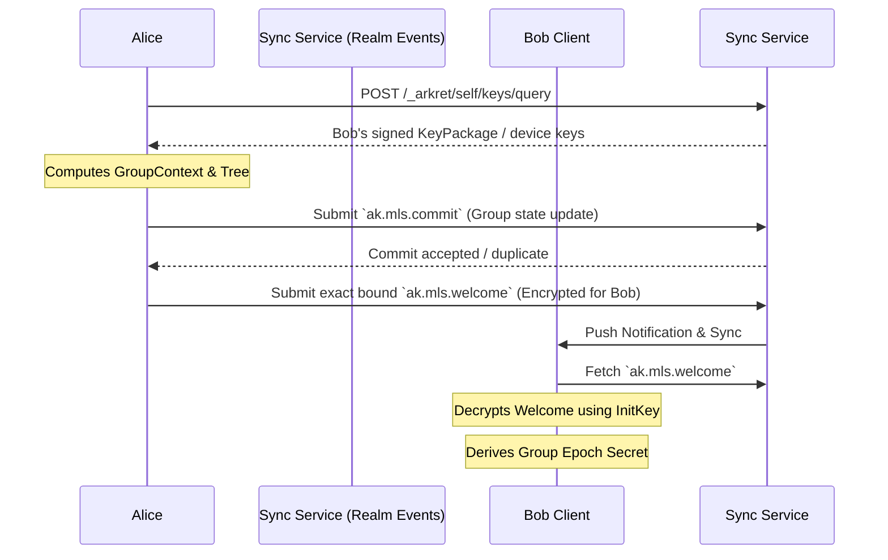

## 0. 规范语言

本文中的规范关键字（**MUST** / **SHOULD** / **MAY** 等）按 [conformance/normative-language.md](../conformance/normative-language.md) 解释；仅大写形式具规范约束力。

## 1. 目标

去中心化协作协议面临着复杂的隐私与合规矛盾：一方面，商业数据和私密频道必须提供不可被 Sync Service 或未授权受托服务窃听的端到端加密 (E2EE)；另一方面，在特定组织边界内，数据流又需要受到法律或合规层面的安全审查。

本规范定义了 Arkret 官方推荐的加密标准，旨在实现：
- 基于 **MLS (RFC 9420)** 的高效大规模协作加密
- 强前向安全 (Forward Secrecy) 与后向安全 (Post-Compromise Security)——此为默认 `mls_rfc9420` 内容 scheme 的属性；启用 §2.10 `mls_exporter_aead_v1` 且保留 per-epoch `history_secret` 的 Realm，其 FS / PCS 在被保留 epoch 上按 §2.10.5 退化为限定形态（per-epoch FS、PCS 仅对未被保留的 epoch 成立）
- **可审查加密 (Auditable E2EE)**，在 TEE / HSM / 等价受控执行 profile 下把合规解密绑定到可验证审计记录；在 software-only profile 下提供透明审计流程，但不声称具备同等密码学强制力。

## 2. 基础加密架构：MLS 与 Arkret 的融合

Arkret 采用 [RFC 9420 - Message Layer Security (MLS)](https://datatracker.ietf.org/doc/html/rfc9420) 作为官方的群组加密标准。
不推荐使用传统的 Double Ratchet（双棘轮），因为在包含数十到数百名成员的 discussion track 或大型协作 Realm 中，双棘轮会导致巨大的性能开销与并发处理难题。

### 2.1 KeyPackage 与服务发现
在参与 MLS 加密前，用户必须公布自己的 `KeyPackage`。
- **发布位置**：Actor 通过 signed Event 发布自己的 `KeyPackage`，或者在其 DID Document 的 `service` 中指定独立的 `MLS Delivery Service` 节点入口。
- **生命周期验证**：其他客户端在拉取 `KeyPackage` 时，MUST 通过 Actor 的 DID Document 与 Event history 验证该包的公钥签名，确保未被身份盗用。

### 2.2 握手与组成员管理 (Welcome, Commit)
MLS 维护了一颗成员密钥树 (Ratchet Tree)。在 Arkret 中，群组的密钥状态变动不依赖于独立的中心化分发服务器，而是映射到原生的 `Realm` 与 Event 模型中：



- **`ak.mls.commit`**：当拥有权限的 Admin 邀请新成员加入或移除成员时，客户端计算 MLS 的 `Commit` 消息。该 `Commit` 必须作为 `ak.mls.commit` 类型的 Event 提交至 Realm Event history。它作为不可篡改的账本，确保全网节点对群组密钥状态树的演进达成一致。
- **`Welcome` 分发**：新成员会收到由 Admin 构造的 `Welcome` 消息。Welcome MUST 通过 durable `ak.mls.welcome` Event、durable encrypted pointer 或等价可 backfill 记录交付，直到被消费、撤销或过期。Sync Service 的 Signal Extension 只能作为通知和加速通道，不得是唯一交付路径；否则离线设备、跨域 backfill 和恢复流程无法验证加入历史。
- **投递不得降维**：Delivery / Sync Service 把 accepted `ak.mls.welcome` 投影为 to-device message 时，MUST 原样保留其规范 payload，至少包括 `mls_group_id`、`epoch`、`recipient_principal_id`、`recipient_device_id`、`claim_ref`、`claim_envelope`、`governance_binding`、`commit_ref` 与 ciphertext / durable ciphertext pointer。服务端不得只转发 MLS ciphertext 或重新构造一个缺少 claim / governance 字段的缩减信封；接收端必须能在解密和入组前独立复算 Welcome digest、验证邀请方签名，并将同一个 `governance_binding` 与 MLS GroupContext extension 及 Seal 证明逐字段比较。

**发送方 admission saga（normative）**：一次 Add admission 的 Commit、面向全部目标设备的 Welcome、以及 Commit 后本地 MLS group state 是同一不可拆分的恢复单元。发送客户端在完成必要的 KeyPackage claim、构造出该 admission 后，MUST 在首次 Commit / Welcome 网络写入前，把以下材料原子写入 crash-recoverable outbound state：精确签名后的 `ak.mls.commit` Event、每条精确签名后的 `ak.mls.welcome` Event，以及仅在投递完成后安装的 post-Commit group state。网络时序 MUST 是 Commit accepted / duplicate 后才投递与其 `commit_ref` 绑定的 Welcome；不得先投递 Welcome，也不得在 Commit 未被接受时安装 post-Commit group state。

Commit 一旦 accepted / duplicate，发送方 MUST 持续重试**同一 event id、同一签名 bytes、同一 ciphertext** 的每条 Welcome，直到该 Welcome accepted / duplicate，或新的 accepted membership/repair Commit 已明确移除该接收方并使旧 Welcome 失效。单纯达到本地 TTL / policy expiry 不足以把已接受 Commit 对应的 Welcome 标为完成；实现必须同时进入明确的 repair/removal 流程。进程退出、页面关闭、网络错误和普通 deterministic service error 均不得让实现丢弃该 durable item、重新 claim KeyPackage、用新随机数重签 Welcome，或回退到旧 epoch 继续发送。无法自动恢复的响应 MUST 进入可诊断的 quarantined / repair-required 状态并保留原材料；修复路径 MAY 产生新的授权 Commit，但不得静默把已接受 Commit 对应的 Welcome 标为完成。只有全部 Welcome 完成 durable 提交后，发送方才能安装该 admission 的 staged post-Commit group state；若旧 Welcome 已被 accepted repair 取代，则 MUST 丢弃旧 staged state 并安装经验证的 repair 后 current state。两条路径都必须在收敛后才能解除本地 admission transition；这不改变接收方对 Welcome、governance binding 和 Seal proof 的独立校验义务。

**Welcome 大小侧信道（acknowledged side channel）**：MLS Welcome / GroupInfo 的 ciphertext 长度会与 leaf 数量、ratchet tree 形态、path secret 数量和近期 churn 有相关性。Arkret v1 不声称第三方观察者无法从 Welcome 大小推断粗粒度成员变化。高隐私 Realm SHOULD 声明 `ak.profile.traffic_metadata_hardened.v1`；声明后 Welcome / GroupInfo blob MUST 使用该 profile 声明的 padding bucket（默认 4KiB / 16KiB / 64KiB）并批量投递 welcome pointer。实现不得在 minimal-metadata 或 high-confidentiality 文案中承诺“成员变化不可由消息大小观察”，除非已声明并通过该 profile 的 padding 策略测试。

#### 2.2.1 MLS Group Admin 推导

MLS group admin 不是“第一个发 Welcome 的客户端”或“track 的第一个成员”。Arkret v1 按当前 accepted auth state 确定管理集合：

- Realm-scoped MLS group 的默认 admin set 来自 `ak.realm.create.payload.object.initial_creators` / `created_by`，以及当前有效的 `ak.realm.admin`、`ak.mls.commit`、`ak.mls.welcome` 或 Realm policy 声明的等价 E2EE admin capability。
- Realm 内的 [Circle](../models/circle.md)（`Strand.scope_circle_id` 指向的子事件边界）只有在 `encryption_profile=mls_rfc9420` 时才拥有 Circle MLS group；其 MLS group admin set 由该 Circle 的 `ak.circle.create` / `ak.circle.member.state` / `ak.mls.commit` / `ak.mls.welcome` 等事件按 Circle 自身的 capability 与 membership 体系收敛，与 Realm-default MLS group admin set 独立；Circle key MUST NOT 从 Realm-default key 派生。
- Admin capability 可以通过普通 capability grant / revoke Control Move 转移或收回；转移生效点由 Seal finality、Lattice value 和 revoke freshness 决定，不由 MLS leaf index、设备在线状态或本地 UI 角色决定。

发送 `ak.mls.proposal`、`ak.mls.commit` 或 `ak.mls.welcome` 的 actor 必须在其事件自己的 causal auth state 下属于上述 admin set，或满足该 event kind 允许的普通成员 update / self-update 规则。

### 2.3 载荷加密 (Application Data)
日常的 Message、Strand synthesis 或 Morph 内容负载在写入 Event 前，必须使用当前 MLS Epoch 的流密钥 (Application Key) 加密为密文信封。
- **可路由元数据分离**：有 `content` 明文对偶的对象使用 `encrypted_content` 包裹实际业务内容 (`content`, `attachments`)；没有 `content` 对偶的载荷仍可使用通用 `encrypted_payload`。
- **明文元数据保留**：用于网络路由和客户端本地 projection 的 `realm_id`, `type`, `causal_links`, `status`, `labels` 必须保持明文。
- Sync Service 可以依据明文元数据完成数据的转发、排序、过滤和去重，而完全无法窥探密文信封内的具体正文。客户端在解密后 MAY 建立本地搜索索引；受托 search / projection 服务只有在 `plaintext_visible_services` 授权下才能接收明文或可逆摘要。

#### 2.3.0 E2EE Profile：plaintext metadata 边界

v1 的 metadata 加密下限是二元字段 `metadata_encryption_floor ∈ {allow_plaintext, e2ee_required}`，与 `content_encryption_floor` 完全对称:`allow_plaintext` 允许用户可读 metadata 留在 wire 明文，`e2ee_required` 要求其进入 `encrypted_metadata`。启用 `encryption_profile="mls_rfc9420"` 或 `content_encryption_floor="e2ee_required"` 且未显式声明 `metadata_encryption_floor` 时，effective metadata floor MUST 默认为 `e2ee_required`。此时 Strand / Message 的用户可读 metadata（例如 Strand `metadata.title`、`metadata.summary`、`metadata.fields`，以及 Message `metadata.fields`）MUST 进入 `encrypted_metadata`，wire 上只保留 reducer / routing 必需字段。`allow_plaintext` 仅作为显式低隐私 / 高服务端 projection 能力的 opt-in；选择该值的 Realm 不得在 UI、营销材料或 service describe 中简称为“完整 E2EE”。

理由与影响：

- routing、reducer、ordering、notification gating 所需字段（例如 `realm_id`、event kind、object id、Strand `tracks` map、`stage` / `state`、必要 causal refs）可保持明文，因为它们是同步和收敛边界。
- 用户可读 metadata（标题、摘要、字段描述、reply/mention 摘要、可逆搜索 tokens）默认不得因为 MLS 开启而留在 wire 明文；若 Realm 显式选择 `allow_plaintext`，实现 MUST 向用户和 service describe 披露 metadata 不受 E2EE 覆盖。
- 受托 search / projection 服务只有在 metadata 为明文 profile 时才可直接接收这些字段；若 metadata 进入 `encrypted_metadata`，服务端 projection 能力必须降级，或通过 `plaintext_visible_services` / 本地客户端索引等受控机制取得明文。

**`e2ee_required` metadata floor** 是 v1 的 MLS / E2EE 默认形态；启用时 Strand / Message 的用户可读 metadata 按 §2.7 的 rules 进入 `encrypted_metadata`，wire 上只保留 reducer 和路由必需的键。`allow_plaintext` Realm 不得对 `metadata.title` / `metadata.summary` / `metadata.fields` / `rank` / `state` / `tracks` 等字段强制 wire-level 加密替换。

Realm policy MUST 通过 Event kind `ak.realm.policy_bundle` 的 payload path `metadata_encryption_floor` 显式声明 metadata 加密下限，取值为：

| floor | wire 明文 | encrypted_metadata | 说明 |
| --- | --- | --- | --- |
| `allow_plaintext` | routing / reducer / projection 所需 metadata；Strand / Message 用户可读 metadata 可明文 | 无或仅 profile 特定字段 | 显式 opt-in。不得宣传为 metadata E2EE。 |
| `e2ee_required` | `realm_id`、kind、epoch、routing digest、必要 cell subject、必要 causal refs、Strand `tracks`、`stage` / `state` | Strand / Message `metadata.title` / `metadata.summary` / `metadata.fields`、mention/reply 摘要、client search tokens | MLS / E2EE 默认；用户可读 metadata 进密文。 |

`metadata_encryption_floor` 只决定“用户可读 metadata 是否必须 E2EE”这一个是非问题；**哪些字段为换取服务端搜索 / projection 能力而对受托服务暴露明文，由独立的 `plaintext_visible_services` 声明控制**（见下条与 §2.8），不再用额外的 metadata 加密档位表达。`realm_id`、kind、epoch、routing digest 等同步收敛边界字段在两档下都保持 wire 明文，不可加密。

**`plaintext_visible_services` prose 权威（normative）**：本节是该 Realm policy 组件的唯一字段级 prose 真相源。每个条目 MUST 声明受托服务 DID、机器可校验的 `data_classes[]`（`message_content`、`attachment_preview`、`full_text_index`、`embedding`、`notification_summary`、`media_plaintext` 等注册值）与 `visibility`；自由文本 `purposes` 只作解释，MUST NOT 单独授权明文。新增、扩大、收缩或移除条目只能由具备 `ak.realm.plaintext_visible_services` capability 的 actor 通过同名 policy Event 写入；`ak.realm.profile`、ServiceDescribe 自声明或服务本地配置 MUST NOT 扩大边界。ServiceDescribe 声明的 `plaintext_visibility` 只能是当前 Realm policy 授权集合的子集，任何接收、索引、projection、通知或 media 路径都必须在披露前按 `(service DID, data_class, visibility, policy_root)` 逐项校验，缺失或不匹配时 fail closed。

`metadata_encryption_floor` 会改变 metadata key access 时必须纳入 MLS `security_frontier_digest`。客户端 / 服务端不得仅通过 `encryption_profile="mls_rfc9420"` 推断 metadata 处理方式；缺省规则是：MLS 或 `content_encryption_floor=e2ee_required` Realm 为 `e2ee_required`，其他 Realm 为 `allow_plaintext`。

`plaintext_visible_services` 的 ordinary service authorization 由 Event/CBA/Seal 即时判定，不因普通 endpoint 或 metadata 变化机械 rekey。只有改变当前或历史密钥取得者的扩大/收缩才进入 `security_frontier_digest` 并等待新的 `ak.mls.commit`；在覆盖前继续使用上一 accepted epoch 的 key-access view。被移除服务从覆盖该变更的下一 epoch 起不得再接收新明文；既有历史副本仍按当时 retention / erasure policy 处理。

#### 2.3.1 Envelope Wire 结构

加密信封的 wire 形态是 [`artifacts/schemas/encrypted-envelope.schema.json`](../../artifacts/schemas/encrypted-envelope.schema.json) 的 canonical 表达。最小示例：

```json
{
  "envelope": {
    "scheme": "mls_rfc9420",
    "version": "1.0",
    "group_id": "base64url",
    "epoch": 12,
    "content_type": "application/json",
    "ciphertext": "base64url",
    "aad_visibility_event_id": "routing_digest",
    "aad": {
      "realm_id": "ak:realm:Ac1aCK8aQdnkYImvdH3DFjq4jDCP198pXYWCGzGuVyj5",
      "event_kind": "ak.message.create",
      "event_ref_digest": "sha256:..."
    },
    "key_ref": {
      "algorithm": "MLS",
      "group_state_ref": "ak:event:Af-qizSfVETcKiliXG093VVneO4nQF194ZXGkMWJijix"
    },
    "payload_digest": "sha256:...",
    "aad_digest": "sha256:..."
  }
}
```

字段约束：

| 字段 | 类型 | 必需 | 说明 |
|------|------|------|------|
| `scheme` | string | 是 | 加密方案标识符 |
| `version` | string | 是 | 方案版本 |
| `group_id` | base64url | 是 | MLS 群组 ID |
| `epoch` | integer | 是 | MLS epoch 编号 |
| `content_type` | string | 是 | 解密后内容的 MIME 类型 |
| `ciphertext` | base64url | 是 | `mls_rfc9420` scheme 为 MLS PrivateMessage / application message 序列化字节;`mls_exporter_aead_v1` scheme 为 §2.10 定义的 `nonce \|\| AEAD_seal(K_content[N], nonce, aad_bytes, plaintext)`（nonce/AAD 遵循 [encoding.md](../conformance/encoding.md) §10.1；AEAD tag 含在 seal 输出内）。 |
| `authentication_tag` | base64url | 禁止 | v1 两个 scheme 下均 **MUST NOT 出现**:`mls_rfc9420` 的 tag 已在 MLS message 内、`mls_exporter_aead_v1` 的 AEAD tag 已附在 `ciphertext` 内，均不重复拆出;schema 用顶层 `not` 拒绝该字段（携带者 `schema_violation`）。 |
| `aad_visibility_event_id` | enum(hidden, routing_digest, opaque_id) | 是 | `aad.event_id` / `aad.event_ref_digest` 的 schema discriminator；receiver 必须按该值校验 AAD 字段集合，并按 §2.8 校验它不宽于 Realm `aad_visibility.event_id` 上限。 |
| `aad` | object | 是 | 路由元数据；明文但被 AEAD 认证。 |
| `aad.realm_id` | id:realm | 是 | 路由与授权的 Realm。 |
| `aad.event_kind` | string | 是 | 路由 event kind。 |
| `aad.scope_digest` | hash | 是 | 对本 Event **精确 `scope_ref`** 的域分隔承诺（常量 `ak.aad-scope-v1`），构造见 §2.3.2.1。**所有 scope 一律携带**，无 discriminator、无省略分支。 |
| `aad.event_id` | id:event | 条件 | `aad_visibility_event_id="opaque_id"` 时必填。 |
| `aad.event_ref_digest` | hash | 条件 | `aad_visibility_event_id="routing_digest"` 时必填；构造 MUST 按下方 `routing_digest` 条目的 canonical 公式（域分隔常量 `ak.aad-event-ref-v1`），实现 MUST NOT 使用其它输入或顺序。 |
| `aad.causal_refs` | array | 条件 | 可见因果依赖；高隐私 profile 可改用 `causal_ref_digests`。 |
| `aad.causal_ref_digests` | array&lt;hash&gt; | 条件 | `causal_refs` 的摘要化形态，高隐私 profile 用以替代明文 `causal_refs`；二者 MUST NOT 同时出现。 |
| `key_ref.algorithm` | string | 条件 | `mls_rfc9420` scheme 为 `MLS`；`mls_exporter_aead_v1` scheme 为 `MLS-EXPORTER-AEAD`；其他 scheme 必须注册自己的值。 |
| `key_ref.group_state_ref` | id:event 或 hash | 是 | 指向 accepted `ak.mls.genesis` / winning `ak.mls.commit` event / 等价 group state proof；用于加速 lookup，不替代 MLS transcript 验证。 |
| `payload_digest` | hash | 是 | `sha256(payload_metadata_bytes \|\| encrypted_payload_bytes)`；输入定义见 §2.3.3。 |
| `aad_digest` | hash | 是 | canonical AAD 的 SHA-256。 |
| `cleartext_commitment` | hash | 禁止 | v1 E2EE producer **MUST NOT emit** 裸明文哈希；receiver **MUST reject** 携带该字段的 envelope（`schema_violation`）。低熵 plaintext 会被离线字典攻击。需要明文承诺时必须使用带 profile 的 keyed / salted 机制（例如 [`../governance/content-moderation.md`](../governance/content-moderation.md) §3.4 现行的 reporter 加密 evidence + `franking_proof` 模型）。 |

Ratchet tree MUST 由 `ak.mls.genesis`、Welcome、Commit 或 group state proof 管理，不得在每条消息的 envelope 中重复传输。

#### 2.3.2 AAD 可见性 Profile 与 canonical 序列化

AAD 字段集合受 Realm 的 `aad_visibility` policy 组件约束（承载与上限语义见 §2.8）。隐私优先 Realm SHOULD 只保留路由所需的 `realm_id`、event kind、epoch 和不可逆 routing hash；需要跨 provider 投递确认的 Realm MAY 暴露 opaque `aad.event_id`，但该选择 MUST 先由 `ak.realm.policy_bundle` 的 `aad_visibility.event_id` 声明——组件缺省时上限为 `hidden`，越界信封按 §2.8 拒绝。只有该组件的变化改变密钥可见性时才进入 MLS `security_frontier_digest`；其它 AAD disclosure 仍由 Event/CBA/Seal admission 保护。

`aad_visibility_event_id` 是 schema discriminator，控制 `aad.event_id` 与 `aad.event_ref_digest`：

- `opaque_id`：AAD MUST 包含 `event_id` 且不得包含 `event_ref_digest`，用于跨 provider 投递确认和精确去重。
- `routing_digest`：AAD MUST 使用 `event_ref_digest`，不得暴露稳定 `event_id`。构造 **MUST**（canonical，normative）为：

  ```
  event_ref_digest = "sha256:" || hex(
      SHA-256( utf8("ak.aad-event-ref-v1") || 0x00 || utf8(event_id) || 0x00 || utf8(realm_id) )
  )
  ```

  其中 `ak.aad-event-ref-v1` 是固定的 ASCII 域分隔常量（逐字节等于该字符串），字段间以单字节 `0x00` 分隔以消除拼接歧义；`event_id` / `realm_id` 取其 canonical typed-id 字符串（`ak:event:<44-char-suite-tagged-full-digest-token>` / `ak:realm:<44-char-derivation-tagged-full-digest-token>`）的 UTF-8 字节，二者都是已在 wire 上、双方可逐字节获得的权威字段。输入**只有**这两个 typed id 与域分隔常量：未知 Event token 携完整 256-bit digest，盲枚举 token 的量级约 `2^256`，无需额外 nonce；`realm_id` 绑定 Realm 阻止跨 Realm 重放。**诚实边界**：本 digest 是 `(event_id, realm_id)` 的**确定性无密钥函数**，因此它是**稳定伪名**——任何已持有候选 `event_id`，或能猜中低熵 Event preimage 并自行派生候选 ID 的一方，都可逐字节重算并据此确认 / 链接该事件；本机制只提供对未知候选 token 的盲枚举抗性，**不**提供对候选内容字典攻击或已知 ID 确认 / 链接的保密（后者需 keyed 构造，v1 在此不引入）。v1 **不**在本 digest 引入任何未在 registry / schema 定义 canonical wire 来源的额外 nonce 输入。该常量与公式是 wire-breaking 的安全域分隔参数，实现 MUST 逐字节一致构造，MUST NOT 引入私有前缀、额外输入、改变字段顺序或省略 `0x00` 分隔；逐字节 KAT 与 mutation case 固化在 [conformance-vectors.md](../conformance/conformance-vectors.md) §1.12。**接收方语义**：`event_ref_digest` 是明文但受外层 AEAD 认证的字段——AEAD 解密本身直接使用 wire 字节、不重算该 digest；需要做反欺骗绑定校验或跨 provider 去重的 router / verifier **MAY** 按上式重算并与 wire 值 bytewise 比对，不一致时 **MUST** 视为绑定失效并拒绝据其路由 / 去重。
- `hidden`：AAD MUST 同时省略 `event_id` 与 `event_ref_digest`；去重只能依赖外层 Event Envelope、transport receipt 或 receiver-local cache。

#### 2.3.2.1 `aad.scope_digest`（normative）

密文必须被密码学地绑定到它所属的 **exact scope**，否则"这段密文属于这个 Sidecar / Circle"
只能靠 `group_id` + 投影查表**推断**，而不是可验证事实。构造 **MUST**（canonical，normative）为：

```
scope_digest = "sha256:" || hex(
    SHA-256( utf8("ak.aad-scope-v1") || 0x00 || utf8(canonical_json(scope_ref)) || 0x00 || utf8(realm_id) )
)
```

其中 `ak.aad-scope-v1` 是固定 ASCII 域分隔常量（逐字节相等），字段间以单字节 `0x00` 分隔；
`canonical_json(scope_ref)` 是外层 Event Envelope `scope_ref` 对象的 RFC 8785 JCS bytes，
**整对象参与**（`kind` 与该 kind 下的全部成员），因此 `realm` / `circle` / `sidecar` /
`realm_genesis` 四种形态用同一条公式处理，不需要逐 kind 分支；`realm_id` 取 `aad.realm_id` 的
canonical typed-id 字符串，绑定 Realm 以阻止跨 Realm 重放。

**所有 scope 一律携带该字段，v1 不为它定义可见性 discriminator。** 这与 `event_id` 的三态
判别器是有意的不对称：`event_id` 存在明文需求（跨 provider 投递确认），而 scope 没有——
router 按 `realm_id` 路由，服务端本就从 envelope 顶层 `group_id` 知道 MLS group。反过来，
任何"带或不带 / 明文或摘要"的选择本身都会成为指纹：只有 Sidecar 带则暴露 Sidecar 存在，
逐 Realm 可选则暴露该 Realm 的 scope 构成。恒定必填是唯一不泄漏选择本身的形态。
明文 `sidecar_id` 同理 **MUST NOT** 进入 AAD——那会让服务端直接从密文枚举 Sidecar 的存在、
数量与活跃度，违反 [`../models/sidecar.md` §9](../models/sidecar.md) 的反泄漏要求。

**诚实边界**（与 `event_ref_digest` 同）：本 digest 是 `(scope_ref, realm_id)` 的确定性无密钥
函数，因此是**稳定伪名**——已持有候选 `sidecar_id` / `circle_id` 的一方可逐字节重算并确认
关联。它提供的是对未知候选 token 的盲枚举抗性与密码学绑定，**不**提供对已知 id 的确认抗性
（后者需 keyed 构造，v1 不引入）。同一 scope 下所有密文共享同一 digest，这正是"同 scope 可
链接"的既有事实（`group_id` 早已如此），不构成新增泄漏。

**接收方语义**：`scope_digest` 是明文但受外层 AEAD 认证的字段。receiver 在解密后
**MUST** 按上式用外层 `scope_ref` 重算并与 wire 值 bytewise 比对，不一致 **MUST** 拒绝该
密文并按 `schema_violation` 处理——这正是把"密文属于本 scope"从推断升级为可验证事实的那一步；
跨 scope 搬运的密文因此在解密后被确定性检出，而不是依赖密钥隔离碰巧失败。

AAD 在计算 `aad_digest` 前必须序列化为规范 JSON：

```json
{
  "realm_id": "ak:realm:Ac1aCK8aQdnkYImvdH3DFjq4jDCP198pXYWCGzGuVyj5",
  "event_kind": "ak.message.create",
  "event_ref_digest": "sha256:0123456789abcdef0123456789abcdef0123456789abcdef0123456789abcdef",
  "scope_digest": "sha256:1ab18cba8cdb5f932820849de9cc736457eebbceffe27fb7a3f63a47f33fd1dc",
  "causal_refs": ["ak:event:Ae0kN-KHls3vjqQ9FHo4P_2uAhcMVu8dI8qHcFsqGn5d"]
}
```

规则：

- 键按字典序排序
- 无多余空白
- 无尾随逗号
- 字符串使用 UTF-8 编码

#### 2.3.3 `payload_digest` 计算

`payload_digest` 的输入必须完全确定，不得使用实现本地对象序列化结果。

1. `aad_bytes = canonical_json(aad)`，`aad_digest = sha256(aad_bytes)`。
2. `payload_metadata` 是以下对象的 canonical JSON，字段缺失时不得写入 null：

```json
{
  "scheme": "mls_rfc9420",
  "version": "1.0",
  "group_id": "base64url",
  "epoch": 12,
  "content_type": "application/json",
  "aad_visibility_event_id": "routing_digest",
  "aad": {
    "realm_id": "ak:realm:Ac1aCK8aQdnkYImvdH3DFjq4jDCP198pXYWCGzGuVyj5",
    "event_kind": "ak.message.create",
    "event_ref_digest": "sha256:..."
  },
  "key_ref": {
    "algorithm": "MLS",
    "group_state_ref": "ak:event:Af-qizSfVETcKiliXG093VVneO4nQF194ZXGkMWJijix"
  }
}
```

3. `payload_metadata_bytes = canonical_json(payload_metadata)`。
4. `encrypted_payload_bytes = base64url_decode(ciphertext)`。v1 `mls_rfc9420` scheme 下 envelope MUST NOT 携带 `authentication_tag`（见 §2.3.1），故该步骤不追加 tag,`payload_digest` 输入无歧义。
5. `payload_digest = "sha256:" + sha256(payload_metadata_bytes || encrypted_payload_bytes)`。

`mls_rfc9420` profile 中，MLS PrivateMessage 本身还必须把 `aad_bytes` 作为 MLS authenticated data 或 profile 声明的等价 authenticated input；`payload_digest` 是 Arkret envelope 的外层完整性检查，不替代 MLS AEAD。

#### 2.3.4 解密错误处理

| 错误 | 原因 | 响应 |
|------|------|------|
| `aad_digest_mismatch` | AAD 被篡改 | 拒绝整个事件 |
| `payload_digest_mismatch` | 密文损坏 | 拒绝整个事件 |
| `key_unavailable` | 缺少 epoch | 标记为 `decryption_pending`，按 `client-sync.md` 的 timeout / recovery 规则恢复 |
| `epoch_mismatch` | 错误的密钥 epoch | 回溯或获取 epoch；无法在 timeout 内恢复时标记 `decryption_failed` |
| `group_removed` | 不再是成员 | fail closed；不得向未授权成员请求密钥 |

`decryption_pending` 是有界恢复状态，不是永久展示状态。默认 timeout 为 7 天；超时后客户端 MUST 降级为 metadata-only `decryption_failed` 占位。连续 epoch 缺口过大时，客户端 SHOULD 使用 range-based recovery，从授权 peer、key backup、Archive Node 或 policy 声明的 Key Recovery Service 获取最小必要 epoch material。

任何 epoch material 交付（无论目标处于 `decryption_pending` 还是 `decryption_failed`）MUST 满足 §2.3.5 的 T₀ membership + policy + key-share-source 校验。

#### 2.3.5 Late Key Recovery 状态机（normative）

客户端 MAY 在 `decryption_failed` 之后接收到迟到的 key material（来自 key backup 同步、device 重新加入、Archive Node 回灌、history key share 等）。该 late material 重新解码受限历史的流程是受控状态机，**不是**静默解锁：

| 起始状态 | 触发 | 目标状态 | 客户端 / 审计行为 |
| --- | --- | --- | --- |
| `decryption_pending` | 在 timeout 内收到 key | `decrypted` | 正常解码，无额外 marker。 |
| `decryption_pending` | timeout（默认 7 天） | `decryption_failed` | UI 标 metadata-only；不可恢复直到收到 late key。 |
| `decryption_failed` | 收到 late key 且通过 (a)-(d) 校验 | `late_recovered` | 客户端 MUST 将该 Event 标记为 `late_recovered` 并保留原 `T₀`，MUST NOT 用解锁内容静默覆盖原 metadata-only 占位的 metadata；呈现方式由实现决定。audit profile 下 MUST emit `ak.audit.accessed`，payload `access_kind="e2ee_late_recovery"` 且 `late_recovery_original_event_id` 指向原加密 Event；history key share scope MUST 与 receiver 当时的 membership scope 一致。 |
| `decryption_failed` | 收到 late key 但 (a)-(d) 任一不过 | 保持 `decryption_failed` | 不解码、不显示明文；记 audit log。 |
| `late_recovered` | 后续 redaction / erasure 触发 | `redacted_after_recovery` | 已恢复明文 MUST 按 redaction policy 移除；wire stub 保留。 |

late key recovery 接受条件（normative）— 客户端 MUST 全部通过才能从 `failed` 转 `late_recovered`。本节的 T₀ 是目标 event 的 CBA query basis：DataEvent 使用其 `seal_ref` 指向的控制面 Seal view 与自身因果前缀；Control Move 使用其 `seal_basis` 指向的控制面 pre-state。T₀ MUST NOT 由客户端本地到达顺序、wall clock 或未 sealed 的 pending Control Move 决定。

a. **Membership 时点校验**：受影响 event 的 T₀，receiver 在 T₀ 必须确实是该 Realm 的成员（`ak.member.state` 在 T₀ pre-state 下为 join，且不是 ban / leave）。如果 receiver 在 T₀ 不是成员、或当时还未被 invite，late key 解码出的明文 MUST NOT 进入 verified timeline；audit log emit `late_recovery_rejected_membership`。
b. **Policy 时点校验**：T₀ 处的 Realm policy MUST 允许该 receiver 类别看到该 event（history visibility / disclosure policy 在 T₀ 处）；若 policy 在 T₀ 之后收紧到禁止该 receiver，late material 仍按 T₀ policy 解码（policy 不溯及既往），但 UI MUST 提示"已不在当前 policy 下可见"。
c. **Key share 来源授权**：late key 提供方 MUST 是 Realm policy 声明的合法 key recovery 源（key backup、archive node、authorized peer）。每条 `ak.realm_key.share` MUST 携带 `source_authorization_ref`，指向在 share Event 的 CBA basis 下有效、明确覆盖 `(source principal/device, recipient principal/device, key_scope, share_kind)` 的 policy/grant/authorized-source Control Move；该引用与 `sender_device_signature` 一起进入 canonical Event bytes。Receiver MUST 独立验证引用、签名与当前未撤销设备，缺失或不覆盖时以 `late_recovery_share_not_authorized` 拒绝。裸 `history_secret` 或没有该可验证来源凭证的 P2P 传递不得进入 key store。
d. **Audit profile 强制**：`ak.profile.attested_audit.e2ee.v1` / `ak.profile.disclosed_audit.e2ee.v1` 下，late_recovered transition MUST 同步 emit `ak.audit.accessed` Event（payload `access_kind="e2ee_late_recovery"`、`late_recovery_original_event_id=<原 event_id>`、当前 receiver actor），并等待 RYW receipt 与正常解码相同的流程；未拿到 receipt MUST NOT 解码。`ak.audit.ryw_receipt` 在 receipt object 上 MAY 标 `recovery_reason_code` = "late_key_arrival"（payload 取值，**不是** error code registry 中的 reason_code；仅用于 audit projection 区分晚到 key 触发的访问与首次访问）。**成员自访问 receipt 类别（normative 澄清）**：此处 late_recovered 所需的 RYW receipt 与该成员**正常解码**所用 receipt 同类（`single_source` / 本地 receipt 即可）；它**不是** [`audited-e2ee.md` §6](./audited-e2ee.md) 的 audit *release* 所要求的 `federation_witness_attested`（≥2 独立 witness）receipt——后者只约束阶段性 release session，MUST NOT 施加到成员对自己在 T₀ 合法可见历史的自访问活性路径，否则离线 / 分区下合法历史恢复将事实不可达。
e. **Expiry / retention guard**：目标 event 带 disappearing expiry 且当前时间已超过 `expired_at + grace`，或 Realm / retention policy 已要求销毁该 event 的内容 key 时，late key MUST NOT 使 plaintext 进入 `late_recovered`。客户端必须保持 expiry stub / metadata-only 状态并记录 `late_recovery_rejected_expired`；key recovery source 在发放 late material 前也必须执行同一 guard。

**失权主体（membership / account / device 撤销）的负向校验**：若 receiver 在 T₀ 已不是成员，或 late key share 的签发时刻该 receiver 已处于下列任一失权态——其 `ak.member.state` 已为 `ban` / `leave`、其 account status 已为 `suspended` / `deactivated` / `erasure_pending`、或其交付目标 device grant 已 revoked——且 key source 未重新执行 T₀ 校验，则 late key MUST NOT 进入 verified timeline。T₀ 之后发生的 ban / remove 不自动追溯撤销其在 T₀ 合法可见的历史，但 key backup / archive node / peer share 在发送 late material 前 MUST 重新执行 T₀ membership + policy 校验，并确认当前 share policy 仍允许向该 device 交付；否则必须拒绝并写 `late_recovery_rejected_membership` 或 `late_recovery_share_not_authorized`。`ak.vector.late_key_recovery.removed_actor.v1` 覆盖：(a) receiver 在 T₀ 不可见时不解密；(b) key source 在 ban 后未重新校验时拒绝 share；(c) 客户端 UI 不显示未授权明文。

#### 2.3.6 与 redaction / erasure 的关系

late_recovered 状态的明文 MUST 受后续 redaction / erasure 影响：若在 recovery 之后该 event 被 `ak.redaction` 或硬擦除，receiver MUST 立即移除已显示的明文并转入 `redacted_after_recovery` 状态。已 emit 的 `ak.audit.accessed` late_recovery marker 保留作为审计轨迹（即使内容已 redact，访问事实仍然可审计）。

### 2.4 Sync 与 MLS Epoch

Client Sync 中的事件顺序不保证密钥材料已经同步完成。加密事件和 MLS epoch state MUST 作为相关但可独立到达的 stream 处理：

- encrypted event 可以先进入 raw event cache 和 timeline position。
- `ak.mls.*` state event / MLS Commit 决定客户端是否拥有对应 epoch 的解密状态。
- 客户端缺少 epoch 时 MUST 标记 `decryption_pending`，不得静默丢弃或重排事件。
- backfill 历史事件时，客户端 SHOULD 同步对应 epoch 区间的 MLS state，而不是逐条向成员请求密钥。
- 被移除成员不得获取移除后 epoch 的 group secret；客户端必须 fail closed。
- `history_visibility` 只授予历史读取资格，不自动授予旧 epoch key。客户端 / key source 在交付历史 key 前 MUST 同时执行 [`../governance/history-visibility.md`](../governance/history-visibility.md) §3 的 Event-time visibility 判定与 effective `ak.realm.history_sharing_policy` 判定。

服务端和 Sync Service 不需要解密正文，但必须保留明文 routing metadata、epoch reference、hash 和 causal refs，以便客户端后续补齐密钥后重试解密。

#### 2.4.1 Membership 与 Epoch 不一致窗口

Membership state 与 MLS epoch 推进是异步事件，但可见性规则必须确定：

- 会影响 E2EE 可见性的 `ak.member.state`（Realm-level）或 MLS-backed `ak.circle.member.state`（Circle-level）accepted 后（track 不携带独立 membership；Realm 内的子事件边界由 [Circle](../models/circle.md) 通过 `Strand.scope_circle_id` 表达，并由 `ak.circle.member.state` 管理 Circle 成员），相应 MLS-backed scope（Realm-default 或 Circle）进入 `epoch_update_required`，直到 winning `ak.mls.commit.governance_binding.security_frontier_digest` 等于最新可重算 key-access frontier。Plaintext Circle 只执行 membership / delivery / query 裁剪，不进入 MLS epoch 状态机。
- 新加入成员在 Welcome / Commit 被接受并成功处理前，只能看到 policy 允许的 stripped metadata、邀请信息或 `decryption_pending` 占位；不得看到加入前后正文，除非 history visibility、history sharing policy 和 key share event 均明确授权。`history_visibility=shared` 只表示 joined 后具备读取 join 前历史的资格；旧 epoch key 仍必须通过 `ak.realm_key.share` 或等价 policy-authorized recovery path 交付。`history_visibility=joined` 下，join 前正文和旧 epoch key MUST 被拒绝。
- 被移除、ban 或离开的成员在对应 membership frontier 之后不得接收新 epoch 的 Welcome、group secret 或 history key share。若客户端仍收到使用旧 epoch 加密的新正文，必须标记 `state_mismatch` 或拒绝解密结果进入 verified timeline。
- 发送客户端在发现 `epoch_update_required` 后 **MUST** 暂停该 scope 的新**加密 application messages** 并标记 `encryption_transition_pending`，直到 effective epoch 的 `security_frontier_digest` 等于最新 key-access frontier。该规则适用于所有声明 `encryption_profile="mls_rfc9420"` 的 Realm，无论 `security_class`——忽略 governance Seal coverage 的发送会让 ban / revoke 在新消息上失效，正是引入 MLS Governance Binding 要消除的风险。

  **明文发送豁免（normative）**：send-pause 只约束需要 MLS-backed 密文的发送。当某 scope 的 effective `content_encryption_floor=allow_plaintext` 且该消息以明文发送时，不受 MLS epoch / `security_frontier_digest` gating——明文消息的 ban / revoke 由 membership cell 即时生效，不依赖 epoch 推进。这使 “`encryption_profile=mls_rfc9420` + `allow_plaintext`” 的可升级默认形态在明文期间无需为每次成员变更推进 MLS epoch；一旦 effective floor 抬到 `e2ee_required`（或该消息以密文发送），完整 §2.5 governance-binding send-pause 立即恢复，首条密文发送 MUST 等待覆盖当前 membership frontier 的 epoch。`encryption_profile=none` 的 scope 不拥有 MLS group，本规则不适用。

  **`mls_send_pause="advisory"` 降级规则**：把上述 MUST 暂停降级为 SHOULD 的能力**仅在显式 degraded profile** `ak.profile.e2ee_relaxed.v1` 下允许声明，不得在默认 `ak.profile.mls_governance_binding.full.v1` profile 或任何声称 “完整 MLS Governance Binding” 的部署中使用。该字段在符合资格的部署中也 MUST：

  - 出现在 `ak.realm.policy_bundle` 的明文 audit log 中(声明本身被记录，便于审计)
  - 部署 profile 在 conformance 声明中**显式列出** `ak.profile.e2ee_relaxed.v1`，否则降级声明 MUST 被 reducer 拒绝（`profile_unsupported` reason）
  - 客户端 UI 在该 Realm 中 MUST 展示明确的"该 Realm 使用降级 E2EE,踢/ban 非密码学即时生效"banner-level 警示(详见 §2.4.2 / `ak.profile.e2ee_relaxed.v1` 规范)
  - 接收端在解密 advisory 模式下旧 epoch 消息时 MUST 检查 receive_at vs membership_change_at 时间窗，超过部署声明 `relaxed_window_max_ms` 时拒绝解密结果进入 verified timeline
  - **`relaxed_window_max_ms` 默认值 = 30,000 ms（30 秒），硬上限 = 300,000 ms（5 分钟）**：两者语义不同，不得混淆。**默认值**是部署未在 `ak.realm.policy_bundle` 显式声明 `relaxed_window_max_ms` 时 reducer / 接收端 MUST 采用的值，固定为 30,000 ms（与 §2.4.2 profile 行为表"被踢者继续解密窗口默认 30s"及 `max_mls_commit_delay_ms` 默认 30,000 ms 对齐，使"踢出后被踢者继续可读窗口"与"正常 commit roundtrip 上限"在默认配置下同量级）。**硬上限**是部署即使显式声明也不得超过的天花板 300,000 ms：部署不得通过 `ak.realm.policy_bundle` 把 `relaxed_window_max_ms` 写为大于硬上限的值；reducer MUST 用 `relaxed_window_exceeds_ceiling` 拒绝。接收端 MUST 独立 enforce 硬上限——不得静默 clamp 到 300000，否则部署声明的窗口与 receiver 接受的窗口会跨实现分裂。部署 MAY 在 `(0, 300000]` 区间内显式覆盖默认 30000；缺省即 30000。Negative vector `ak.vector.e2ee_relaxed.window_exceeds_ceiling.v1` 同时覆盖 policy write 超限与 receiver 接受超限 decrypt 两条路径。
  - **合规 profile 互斥**：声明 `ak.profile.attested_audit.e2ee.v1` / `ak.profile.disclosed_audit.e2ee.v1` 或存在 active Audit Applet Binding 的部署 MUST NOT 同时启用 `ak.profile.e2ee_relaxed.v1`；reducer MUST 用 `e2ee_relaxed_disallowed_in_compliance_profile` 拒绝。合规 / 监管 profile 的核心承诺是"踢出即时密码学生效"，relaxed 窗口与之矛盾。
  - **Federation guard**：`ak.profile.e2ee_relaxed.v1` MUST NOT 与 `federation_policy="open"` 或 `"quarantine"` 同时启用；reducer MUST 用 `e2ee_relaxed_federation_policy_unsupported` 拒绝。`federation_policy="restricted"` 只允许在 Realm policy 同时声明 `relaxed_fanout_deadline_ms <= relaxed_window_max_ms`、`max_federation_delivery_delay_ms <= relaxed_window_max_ms` 且 federation peers 在 `ak.server.read.describe.limits` 中公开不超过该 deadline 的 fanout SLA 时启用；否则 MUST fail closed。`federation_policy="closed"` 不需要额外 federation guard。describe SLA 校验仅是准入门槛（声明时校验 peer 公开的 fanout deadline 是否满足约束），实际 enforcement 仍由接收端 `relaxed_window_max_ms` 时间窗兜底（运行时校验 receive_at vs membership_change_at，超窗即拒绝 decrypt 进入 verified timeline）；二者缺一不可，不得理解为"声明合规即放行"。

  **降级声明义务（normative）**：`ak.profile.e2ee_relaxed.v1` 不是本地优化开关，而是可审计的协议降级声明。有效声明必须同时满足：Realm `schema_refs` 明文记录 `ak.profile.e2ee_relaxed.v1`（经 `ak.realm.create` 或 `ak.realm.schema` 写入），且 `ak.realm.policy_bundle` 明文记录 `mls_send_pause="advisory"`——profile id 与 `mls_send_pause` 分属两个承载，bundle 闭合 payload 内没有 profile 字段；服务端 `ServiceDescribe.supported_profiles` / `supported_features` 声明 `ak.profile.e2ee_relaxed.v1` / `ak.feature.e2ee_relaxed.v1`；该 Realm 后续每个 MLS `governance_binding.binding_profile` 写为 `ak.profile.e2ee_relaxed.v1` 并携带匹配的 `reducer_profile`；sync metadata、snapshot、backup/export 与 interop mapping receipt 必须保留 `e2ee_relaxed=true` 和 `relaxed_window_max_ms`。任一条件缺失、互相矛盾、或仅通过部署私有配置 / UI 标签 / 省略 GroupContext extension 表达降级，接收方 MUST 按未声明降级 fail closed：拒绝 Realm 写入、quarantine 相关 MLS artifact，或拒绝 old-epoch decrypt 进入 verified timeline。

  **联邦互操作下界（normative）**：跨 deployment 的 MLS-backed Realm 以 `ak.profile.mls_governance_binding.full.v1` 为 E2EE 互操作下界。`ak.profile.e2ee_relaxed.v1` 是低于该下界的显式降级，只能在 `federation_policy="closed"` 或满足上方 restricted federation guard 的 `restricted` Realm 中出现；open / quarantine federation MUST reject。联邦 peer 未在 describe 中声明所需 profile/feature、未公开满足窗口的 fanout SLA、或 MLS commit / DataEvent 的 `binding_profile`、`reducer_profile`、`security_frontier_digest` 无法验证时，接收方 MUST reject 或 quarantine，不得把该 peer 的 push 用于推进本地 Realm frontier。

  声明 advisory 但未声明 `ak.profile.e2ee_relaxed.v1` profile 的 Realm create / policy update event MUST 被 reducer 拒绝。详见 §2.4.2 与 [`conformance-profiles.json`](../../artifacts/profiles/conformance-profiles.json)。
- Realm / reducer profile MUST 声明 `max_mls_commit_delay_ms`，**默认 30,000 ms**；profile MAY 覆盖（交互式 profile SHOULD be no greater than 30,000 ms，高延迟 / 批量 profile MAY 声明更大值）。客户端在 commit 滞后超过该 effective 值后 MUST 将该 scope 降级为 read-only / send blocked，服务端 SHOULD 返回 `epoch_update_required` 或 `temporarily_unavailable`。
- 网络分区期间可以继续 backfill 旧 epoch 历史，但不得把旧 epoch 下的新消息展示为已满足最新 membership policy 的消息。

该窗口规则不改变 MLS Proposal / Commit 两阶段语义；它只定义 Arkret 在 state 已变化但 epoch 尚未收敛时的 UI、发送和解密处理。

### 2.4.2 `ak.profile.e2ee_relaxed.v1`(降级 profile)

**目的**:某些低延迟交互场景(实时音视频会议、协同光标 / 多人编辑、游戏内聊天等)不能容忍 MLS commit 完成才允许发新消息的等待开销(典型延迟 200ms-数秒)。`ak.profile.e2ee_relaxed.v1` 是为这些场景保留的**显式降级 profile**:允许 `mls_send_pause="advisory"`,代价是放弃"踢人/ban 后被踢者立即不能解密新消息"的密码学硬承诺。

**适用判断**:
- Allowed: 实时交互延迟要求 < 1s 且业务可接受"踢出后窗口内被踢者仍可读 1-2 条消息"的场景。
- Forbidden: 普通群聊 / 协作文档 / 项目讨论(踢人语义需要密码学强保证)不适用，继续用默认 `ak.profile.mls_governance_binding.full.v1`。
- Forbidden: 合规 / 法律 / 监管要求"立即生效"撤销时强制不适用，部署 MUST 拒绝。

**Profile 行为差异**:

| 维度 | 默认 (`mls_governance_binding.full.v1`) | 降级 (`e2ee_relaxed.v1`) |
| --- | --- | --- |
| `mls_send_pause` 默认 | MUST 暂停直到 security frontier 被当前 Commit 覆盖 | 允许声明 `"advisory"`,降为 SHOULD |
| `security_frontier_digest` 匹配 | reducer/客户端 MUST enforce | 仍然写入并验证，但 send-side 可按声明窗口延迟阻塞 |
| 被踢者继续解密窗口 | ≤ MLS commit roundtrip(密码学保证) | ≤ `relaxed_window_max_ms`(默认 30s,部署声明) |
| 接收端 verified timeline 检查 | epoch 不匹配 → 拒绝 | epoch 不匹配且超出 `relaxed_window_max_ms` → 拒绝 |
| UI 警示 | 无 | **MUST 显示 banner-level 警示**，并明确披露：该 Realm 使用降级 E2EE；踢出 / ban 不具备密码学即时生效保证；旧成员可能在声明窗口内继续解密最近消息。 |
| Server describe `supported_features` | `ak.feature.mls_governance_binding.full.v1` | `ak.feature.e2ee_relaxed.v1`(互斥;**MUST NOT** 同时声明 full + relaxed) |
| 在合规 / 监管语境下 | 满足"成员踢出即时生效" | 不满足,SHOULD 走非 E2EE 或专用 enclave 通道 |

**强制约束**:

- Realm 在 `ak.realm.policy_bundle` 中声明 `mls_send_pause="advisory"` 时,**MUST** 在 Realm `schema_refs` 中同时声明 `ak.profile.e2ee_relaxed.v1` profile 适配。reducer 检测到 advisory 但 Realm `schema_refs` 不含 `ak.profile.e2ee_relaxed.v1` → MUST reject(`profile_unsupported`,详细 reason `mls_send_pause_advisory_requires_e2ee_relaxed_profile`)
- 声明本 profile 的 Realm **MUST NOT** 同时声明 `ak.profile.mls_governance_binding.full.v1`(互斥)。reducer 检测同时声明 → MUST reject(`conflicting_e2ee_profiles`)
- 声明本 profile 的 Realm 后续 MLS commit **MUST** 在 `governance_binding.binding_profile` 中写入 `ak.profile.e2ee_relaxed.v1`，并在 `governance_binding.reducer_profile` 中写入当前协商 reducer profile。缺字段、写成 full profile、写成未知 profile、或与 Realm policy / ServiceDescribe 声明不一致时，接收方 MUST reject / quarantine 该 commit，并不得把对应 epoch 用于 verified timeline。
- 声明本 profile 的 Realm 若同时声明 federation，MUST 满足 §2.4.1 的 Federation guard。open / quarantine federation 直接拒绝；restricted federation 必须证明 fanout deadline 不超过 relaxed window。
- 客户端实现 **MUST**:
  - 在该 Realm 的对话 UI 上展示 banner-level 警示(不可被用户永久 dismiss,可临时折叠)
  - 在用户邀请新成员时弹窗提示"该 Realm 使用降级 E2EE",让用户知情决策
  - 在 sync metadata 中标记该 Realm 为 `e2ee_relaxed=true`,导出 / 备份 / 跨设备时保留该标记
- 服务端 `ak.server.read.describe.supported_features` **MUST** 列出 `ak.feature.e2ee_relaxed.v1` 才能接受该 profile 的 Realm 写入

**禁止扩展**:本 profile 不允许进一步降级到"不验证 `security_frontier_digest`" / "允许跨 epoch 解密无窗口限制"。降级到此为止；更宽松场景应当退回到**非 E2EE** Realm(`encryption_profile="none"`)而不是继续放宽 E2EE 承诺。

### 2.5 MLS Security Frontier Binding

Arkret v1 把 MLS epoch 只绑定到会改变当前或历史密钥取得者的 accepted control state。普通 Event admission 的 seal_ref 与 MLS security frontier 是正交证明：seal_ref 选择该 Event 的 CBA 授权视图；security_frontier_digest 证明当前 MLS epoch 已覆盖最新 key-access state。任何 Seal 都不得因为被消息引用而要求 MLS Commit 反向覆盖自身。

每个 MLS scope 投影唯一 current state：

- mls_group_id；
- epoch；
- security_frontier_digest；
- commit_ref（genesis 时为 genesis Event ref）。

security_frontier_digest 的输入由 [`mls-security-frontier-registry.json`](../../artifacts/registry/mls-security-frontier-registry.json) 闭合登记，并从 accepted Seal state 与 RFC 9420 current/pending leaf set 确定性重建：

1. Realm / Circle membership join、leave、remove、ban，以及实际使当前 MLS leaf 无效的 participant terminal；
2. 当前或 pending MLS leaf 实际引用的 participant device / Agent runtime key authorize、revoke、replacement；
3. MLS group membership；
4. 改变谁能取得当前或历史密钥的 encryption floor、content encryption scheme、history visibility / sharing policy。

与当前或 pending leaf 无关的 device/Agent key、普通 capability、message/Strand metadata、moderation、display metadata、media/routing endpoint 和 contact/consent-only state MUST 排除。block、Contact或Consent只在各自被当前操作正式登记为authority gate的路径上立即禁止新 application message、call signal或Welcome；Personal DM只读取双方directional Contact heads，Consent变化对其无效。除非accepted effect同时remove leaf，否则这些变化不单独触发rekey。

producer 不提交任意 Event/Seal ref 清单来定义 frontier。所有实现必须从相同 accepted state 得到逐字节相同的 canonical digest；未知 cell family 或无法闭合依赖时 fail closed。
#### 2.5.1 Security binding payload

ak.mls.genesis、ak.mls.commit、需要绑定当前 epoch 的 ak.mls.welcome 与 MLS proposal 使用同一 mls_governance_binding closed object。必需字段是：

| 字段 | 约束 |
| --- | --- |
| binding_version | 固定 1 |
| encoding_profile | 固定 cbor-deterministic-rfc8949-v1 |
| realm_id / effective_scope / circle_id? / sidecar_id? | 精确标识 Realm-default、Circle 或 native Sidecar MLS scope |
| mls_group_id | 目标 group |
| previous_epoch / next_epoch | genesis 为 0/0；Commit 必须 next=previous+1 |
| security_frontier_digest | 按 §2.5 的闭合集合重算 |
| binding_profile / reducer_profile | 显式解释 profile；缺失或不支持 fail closed |
| sidecar_binding? | 只在 `effective_scope.kind="sidecar"` 中出现，绑定 ownership-derived participant authority |

membership_frontier、covered_seal_refs、policy_root、capability_root 与 discussion_metadata_digest 不再是 wire 字段。它们把同一 accepted state 重复拆成多个 producer-supplied commitments，并导致无关治理变化阻断消息；receiver 改为从 Seal state 直接重算唯一 security_frontier_digest。

每个 ak.mls.commit MUST 同时携带 mls_group_id、base_epoch、next_epoch、完整 commit_bytes_b64、commit_digest 与 governance_binding。receiver 先校验 digest，再按 RFC 9420 应用完整 Commit bytes，并核对 epoch、group 与 security frontier。只提供 digest 或 object ref 不合规。

ak.mls.welcome MUST 携带 commit_ref，并与同一 Commit、recipient 和 claimed KeyPackage 逐字段闭合。Delivery/Sync Service 必须原样保留完整 payload；不得转发缺 claim、commit_ref、binding 或 ciphertext 的缩减 envelope。
#### 2.5.2 Send gate 与 self-heal

E2EE DataEvent 必须声明 mls_group_id、epoch 与 security_frontier_digest，并携带普通 Event admission 所需的 seal_ref。receiver 接受 application message 当且仅当：

1. Event 的 seal_ref / CBA admission 独立通过；
2. group 与 scope 匹配；
3. epoch 等于 winning MLS epoch；
4. message 的 security_frontier_digest 等于 receiver 在该 Event basis 可验证的最新 key-access frontier；
5. winning genesis/Commit Event 已 accepted，且其完整 RFC 9420 transcript 绑定同一 digest。

若存在尚未被 winning Commit 覆盖的 key-affecting fact，scope 进入 epoch_update_required，所有新加密 application message、call signal 和 Welcome暂停；返回 mls_governance_binding_stale。无关 capability、metadata、moderation、routing 或 consent-only state 前进时 MUST NOT 产生该错误。

任一 active member 客户端观察到 epoch_update_required 后 MUST 发起 self-heal Commit；并发 proposal/Commit 按现行 MLS winner/CAS 规则收敛。消息数、epoch 存活时长与 routing-token scope 的自保推进上限保持不变。明文 scope 不受 MLS epoch gate，但仍受即时 membership/authorization admission。
#### 2.5.3 GroupContext extension 与 proof materialization

MLS GroupContext extension type 0xF1C0 继续把确定性 CBOR 编码的完整 mls_governance_binding 纳入 confirmed_transcript_hash。canonical map 只包含 §2.5.1 的字段；禁止 indefinite-length CBOR、非最短整数、重复/乱序 map key、未知字段或 JSON/CBOR 混用。

轻客户端可以请求 mls-governance-proof-bundle 来取得从 trusted anchor 到 accepted Seal 的完整、有界、分块 proof materialization。bundle 的作用是让 verifier 重建 accepted control state，并与 verifier 本地持有的 RFC 9420 current/pending leaf set 一起重算 security_frontier_digest；它不复制候选 `governance_binding`，不让服务替客户端选择 MLS leaf set 或可信 anchor，也不把旧 covered_seals_cell 恢复为协议状态。`proof_request_digest` 将 group、epoch、profile 与 trusted anchor 绑定到 materialization acquisition；verifier 必须将其与 transcript-authenticated binding identity 重算比较。

proof bundle 的所有 chunk 都 MUST NOT 携带 MLS leaves、leaf index、GroupInfo 或 ratchet tree bytes。公开 epoch-0
GroupInfo/ratchet tree 的获取只走 §5.1.1 的 group-state-material 合同；current/pending leaf set 仍由 verifier 的
RFC 9420 state 持有。两条材料路径不得合并为服务端选择 leaf set 的私有 proof DTO。

当前向量 `ak.vector.mls.security_frontier_key_access_only.v1`
断言是“普通 Seal/`seal_ref` 不进入 security frontier，active leaf revoke 必须进入”，不再测试已删除
的 covered-seals accumulator。

验证顺序是：确认 request anchor 已在本地 trust store（§2.5.4）→ 校验 bundle 自报 anchor 与请求逐字相等并校验 Seal path → 重算 covered control set 和 joined state → 按 registry closed frontier 过滤 key-access cells → 重算 security_frontier_digest → 比较 GroupContext extension 与 Event payload → 应用 Commit bytes。任一步缺失、歧义或不一致都 fail closed。响应出现与请求不同的 anchor MUST 拒绝，MUST NOT 验证通过后「顺便信任」。相同 bundle identity 与 chunks_root 才可复用 cache。

#### 2.5.4 Anchor 信任来源（normative）

§2.5.3 的验证以 `trusted_anchor` 为根：它只证明「从该锚出发这条 Seal path 自洽」，**不证明锚本身**。
锚从哪来因此是全部安全性所在，本节封闭定义，适用于所有请求 governance proof 的客户端。

**服务端的报告不产生信任。** 客户端 MUST NOT 仅因下列任一原因把某个 Seal 写入本地 trust store：

- 它出现在 `ak.self.events.read.frontier` 的 `RealmSealFrontierView` 或任何 frontier / head 查询结果里；
- 它是 proof bundle 自报的 `trusted_anchor_seal_id`；
- 它在 `mls_governance_anchor_unreachable` 等错误的 detail 里被建议为替代锚。

服务端 MAY 提供**候选**；只有候选通过下面 T1/T2/T3 之一的本地校验后才能采信。这条区分是本节的
全部要点：「服务端建议、客户端用自己独立已知的事实校验」合法，「服务端断言、客户端接受」不合法。
在内容绑定 ID（[`../conformance/encoding.md` §4.0](../conformance/encoding.md)）之前客户端没有可用来
校验的独立事实，只能靠枚举信任来源；现在有了，本节因此以自证判定取代枚举。

**T1 —— event-derived Realm 的 genesis 自证。** 客户端已知 `realm_id`，据此派生
`create_event_id = retype(realm_id, "event")`（[`../models/realm-and-space.md` §2.5.0](../models/realm-and-space.md)、
[`../models/common-fields.md` §6.0](../models/common-fields.md)），取回该 `ak.realm.create` Event `C`
并按 §4.0 重算其 content-bound `event_id`，MUST 与派生值逐字相等。候选 Seal `S` **MUST** 同时满足
才可被接纳为该 Realm 的 anchor：

1. `S.realm_id` 等于 `realm_id`；
2. `S.predecessor_refs` 为空（genesis）；
3. `S.delta[]` 含 `C` 的 `event_digest`；
4. `S.notary_signature` 按 [`../authz/event-auth-state-resolution.md` §6.3](../authz/event-auth-state-resolution.md)
   的 genesis 例外，用 `C.payload.object.notary` 求值的 notary authority 验签通过。

任一条不成立 MUST 拒绝且 MUST NOT pin。`C` 的内容绑定 ID 与 `realm_id` 同源，因此本判定不依赖
任何一方对「哪个 Seal 是 genesis」的断言：客户端拿 `realm_id` 就能独立认出 `C`。

**T2 —— PCR 的 identity-root 锚。** Principal Control Realm 的 `realm_id` 由 principal DID 派生而
不由 genesis Event 派生（§2.5.0 例外），T1 的 create 派生不适用。PCR 的候选 genesis Seal MUST 覆盖
该 principal 唯一 critical `did_inception` root anchor unit
（[`../identity/key-management.md` §5.0.1](../identity/key-management.md)）；客户端 MUST 用该 principal
的 DID 与已验证 inception 校验该 anchor Event，再按同一 genesis notary 规则验签。

**T3 —— 已验证后继（pin 前移）。** 客户端已信任锚 `A` 后，任何经完整 Seal path 校验为 `A` 后继的
Seal（含 compaction Seal）MAY 取代 `A` 成为新 pin。这是唯一合法的换锚路径。anchor 不可达时客户端
MAY 改用自己 trust store 里更旧的锚重试，或改向另一授权 proof service 请求，MUST NOT 因服务端建议
换锚。

**三条覆盖全部首次场景**：Realm 创建者、被邀请者、同一 principal 的新设备、以及本地状态丢失后从
key backup 恢复的设备，都只需要知道 `realm_id`（PCR 则是 principal DID）——它们各自的认证路径本来
就提供这一项。因此 `ak.mls.welcome`、key backup 与设备配对包 **MUST NOT** 为携带 anchor 而新增
字段：那会制造第二个信任源，且都弱于 T1/T2 的自证。

取回 `C` 与 `S` 走 `ak.self.events.read.resolve`：按派生的 `create_event_id` 解析 Event，响应的
`seals[]` 给出覆盖它的 Seal（[`../sync/service-http-binding.md` §4](../sync/service-http-binding.md)）。
该响应同样不产生信任——它只是候选来源，判定仍在 T1/T2。

本节的 conformance 入口是 `ak.vector.mls.governance_proof.verifier.v1`：其 mutation matrix MUST 覆盖
「以服务端 observed head 为锚」「候选 genesis 不覆盖派生出的 create Event」「候选 genesis 的 notary
不是 create payload 指定的 notary」三条负例，且都 MUST 在写入 trust store 前失败。
### 2.6 KeyPackage Claim 生命周期

Native Agent 的 claimed-endpoint trust binding 由 conformance vector `ak.vector.agent.mls_keypackage_authorization.v1` 固化。

KeyPackage 不应被建模为可无限次公开拉取的静态材料。E2EE 实现 MUST 将 MLS KeyPackage 作为可声明、可领取、可消费、可撤销的单次使用材料。

> **Arkret 扩展说明**：RFC 9420 Section 10.1 将 KeyPackage 定义为全局单次使用材料（一个 KeyPackage 对应一次 Welcome）。Arkret 的 claim 模型在此基础上增加了 `intended_realm_id` 绑定和 Realm-scoped claim，要求 MLS Delivery Service 跟踪 Realm affinity。这是 Arkret 的有意扩展，理由是：(a) 去中心化环境中没有中心化 Delivery Service 来全局追踪 KeyPackage 消费状态；(b) Realm-scoped claim 使客户端可以控制自己被邀请进入哪些 Realm，而非被动接受任何 Welcome；(c) claim 绑定使审计链可追溯某个 KeyPackage 被哪个 Realm 消费。实现若使用标准 MLS 库（不支持 Realm-scoped claim），MUST 至少在 Arkret 协议层维护 claim 映射表，并在 Welcome 发送/接收时执行 claim 验证。

KeyPackage lifecycle：

```text
published -> claimed -> consumed
          -> revoked
          -> retired
```

推荐记录：

```json
{
  "kind": "ak.mls.keypackage",
  "keypackage_id": "ak:mls:kp:01JS...",
  "principal_id": "did:webvh:zBfFLx7gUhQB7dPEQCj3qeHZR:alice.example.com",
  "device_id": "ak:device:01964137-0000-7000-8000-000000000000",
  "keypackage_ref": "sha256:...",
  "keypackage_digest": "sha256:canonical_keypackage_bytes",
  "cipher_suites": ["MLS_128_DHKEMX25519_AES128GCM_SHA256_Ed25519"],
  "capabilities": ["mimi.content.v1", "ak.content.v1"],
  "state": "published",
  "created_at": "2026-04-30T00:00:00Z",
  "expires_at": "2026-05-07T00:00:00Z",
  "device_signature": "base64url..."
}
```

**MLS ciphersuite registered set（normative）**：`cipher_suites[]` 与 server describe 暴露的 MLS ciphersuite 合法值的机器可读 source of truth 是 [`mls-ciphersuite-registry.json`](../../artifacts/registry/mls-ciphersuite-registry.json)（与 hash 的 digest-suite registry、签名的 signature-alg registry、非-MLS 应用层封装的 [`hpke-suite-registry.json`](../../artifacts/registry/hpke-suite-registry.json) 形成四大算法 agility 面的对称纪律）。v1 active 集合仅 `MLS_128_DHKEMX25519_AES128GCM_SHA256_Ed25519`（default-MUST，RFC 9420 mandatory-to-implement suite）；软件友好的 RFC 9420 `0x0003` ChaCha20-Poly1305 suite 已作为 reserved row 占位，在 KAT、协商负例与新 contract release 完成前不得上 wire。KeyPackage claim / group 协商遇到未登记或 reserved suite MUST fail closed，即使底层 MLS 库支持。

Claim 请求 MUST 绑定：

- requester principal / service DID 和 device proof。
- intended `realm_id` 或 `mls_group_id`。
- required capabilities / content profiles / cipher suites。
- 是否允许 minimal-metadata pseudonymous credential。
- claim nonce、过期时间和目标 Welcome 路由服务。

Claim 成功后：

- KeyPackage 进入 `claimed`，并绑定 claim/requester/intended Realm、capability/digest、expiry 与 claimed endpoint 的 accepted authorization ref。普通 device 必须且只能使用 `device_authorize_event_id`；Native Agent runtime 必须且只能使用 `agent_key_authorize_event_id`。
- 同一 KeyPackage 不得被第二个 Realm/group、requester 或 Welcome 重复使用。
- Welcome `claim_ref` 携带 `{claim_id,keypackage_ref,keypackage_digest,capabilities_digest}` 加上述二选一 authorization ref，并进入 governance/AAD transcript。接收端解密前必须验证所有 digest、capability subset 和 ref 指向 current active accepted authorization；device 分支还要验证 root-anchored PCR evidence、current device generation、未撤销状态与 MLS LeafNode/signature key 一致。
- 若 device 在 claim 与 Welcome 之间 revoke、re-anchor fenced 或其 authorization 被替换，未消费 claim 失效；发送方必须以 current `device_authorize_event_id` 新建 claim。Agent authorization revoke/supersede/expiry 同理。
- 返回 KeyPackage 时必须附 endpoint signature 与 portable authorization evidence。device 与 Native Agent 两分支不能互相 fallback。

#### 2.6.1 Welcome `claim_envelope` 签名（normative）

KeyPackage 发布时 Realm 尚未确定，因此 per-Welcome `claim_envelope` 必须由 requester 当前 accepted signer 签署并至少绑定：`keypackage_ref`、`keypackage_digest`、`intended_realm_id`、`claim_id`、`requester_did`、`nonce`、`welcome_digest`、`created_at`，以及精确二选一的 `requester_device_id + device_authorize_event_id` 或 `agent_key_authorize_event_id`。

普通 device signature 必须按 PCR authorization chain 解析到 current generation 的 accepted `device_public_key`；Native Agent 必须解析其 current active `ak.agent.key.authorize`。接收端还必须验证 intended Realm 与 Welcome group 一致、claim nonce/digests 一致、authorization ref 在消费时仍 current，以及 `welcome_digest` 等于 canonical Welcome bytes。任何失败都拒绝 Welcome，reason=`keypackage_welcome_envelope_mismatch`。Delivery Service key、目标 KeyPackage 自身的 publish signature或裸服务断言都不能替代 requester signature。

#### 2.6.2 Last-Resort KeyPackage（可选语义）

§2.6 的默认模型把 KeyPackage 建模为严格单次使用材料：`published -> claimed -> consumed`，"同一 KeyPackage 不得被第二个 Realm / MLS group、第二个 requester 或第二次 Welcome 重复使用"。该纪律带来两个运营缺口：(a) 长期离线设备的预发布 KeyPackage 池耗尽后，该设备**完全不可被邀请 / 加群**，直到下次上线补池；(b) 对端可在 claim 限速预算内逐步 claim 直至抽干池子，制造**定向 DoS**——使目标设备对外不可邀请。

RFC 9420 Section 10 明确承认 last-resort KeyPackage 模式（生产 MLS 部署如 Wire 已采用）。Arkret 采纳该模式为**可选能力**：实现 MAY 在 KeyPackage 池耗尽时提供一个标记 `last_resort=true` 的可复用 KeyPackage 作为回退。该能力**不改变默认 fail-closed 路径**——不支持的实现继续在池空时 claim 失败（见下文协商规则）。

**前向保密折衷声明（normative）**：last-resort KeyPackage 可被多次消费意味着同一 init/encryption key 被复用于多个 Welcome，**削弱了 Welcome 阶段的前向保密**——在该 KeyPackage 被轮换前，任一被攻破的 last-resort 私钥可解出此前用它封装的全部 Welcome（及其携带的 group secrets 初始注入）。影响范围是经该包加入的每个 group 在对应加入 epoch 及其后续 ratchet 之前可由 Welcome 取得的 application secret / history material；不追溯解密加入前的旧 epoch，但会暴露该加入路径本应由一次性 KeyPackage 隔离的初始历史材料。该折衷是 last-resort 模式的固有代价。实现 MUST 通过下文的强制轮换把弱化限制在一个**有界窗口**内，并 MUST 向启用该能力的部署 / 用户明示此窗口内 Welcome 前向保密被弱化。组建立后的常规消息 ratchet 前向保密不受影响（仅初始 Welcome 注入受影响）。

**状态与多次使用（normative）**：

- last-resort KeyPackage 在发布时 MUST 标记 `last_resort=true`，并 MUST NOT 进入单次 `claimed` / `consumed` 状态。每次领取由独立 `keypackage_claim_record` 表达，KeyPackage 本身保持 `published`，直到轮换、过期或显式吊销时转入 `revoked`；account deactivation 可按 [`device-lifecycle.md` §9.1](./device-lifecycle.md) 转入 `retired`。
- `last_resort` 是 Arkret 应用层标记，MUST 包含在 KeyPackage 发布条目的 `device_signature` 签名输入中；接收方 MUST 验证该签名，不得从未签名元数据推断或改写此标记。v1 不为尚未进入 IANA MLS 注册表的应用组件分配私有 wire codepoint。
- 池中存在普通（单次）KeyPackage 时，claim 响应 MUST 优先返回普通包；仅当普通包池为空时，claim 响应 MAY 返回 last-resort 包。
- claim 响应返回 last-resort 包时 MUST 在对应 `keypackage_claim_record` 中置 `last_resort=true`，使 requester 与 holder 都能识别本次 join 走的是 last-resort 路径。
- last-resort 包**不走** §2.6 的单次 `consume` 路径：服务端 MUST NOT 因一次 Welcome 消费而把它转入 `consumed` 或从池中移除。`ak.keys.keypackages.consume` 对 last-resort `keypackage_ref` 的调用 MUST 被服务端识别为幂等（返回成功但不改变 `published` 状态），不得返回 `keypackage_already_consumed`。
- §2.6 / §2.6.1 的其余校验（`keypackage_digest` / `capabilities_digest` / current authorization ref 匹配、`claim_envelope` 签名、Realm 反向 resolve）对 last-resort 包**仍然全部适用**；放宽的只有"单次性"。

**消费审计（normative）**：每次 last-resort 包被 claim / 用于 Welcome，MUST 进入 §2.6 既有审计链。实现 MUST 为每次消费追加一条独立 `keypackage_claim_record` 审计记录，至少携带 `keypackage_ref`、`keypackage_digest`、`claim_id`、`last_resort=true`、消费的 `intended_realm_id`（见下文 Realm affinity）与时间戳。该记录不是第二条 `ak.mls.keypackage` 状态 Event，也不得触发 KeyPackage FSM transition；KeyPackage 本身保持 `published`。审计链 MUST 保留每次消费的独立记录（append-only，不得覆盖前次），使审计员能枚举"该 last-resort 包被哪些 Realm / requester 在哪些时点使用"。

**强制轮换时点（normative）**：

- last-resort 包的持有 device 下次上线时 MUST 轮换该 last-resort 包：发布新的 last-resort KeyPackage（新 init/encryption key），并把旧包转入 `revoked`、记录 `revocation_reason="keypackage_rotated"`，使旧包不再被分发给新 claim。`keypackage_rotated` 不是 KeyPackage 状态。
- 持有者上线后 MUST 对**所有经该 last-resort 包加入的 group**触发一次 MLS update（self-update Commit，引入新 leaf key 材料），以推进这些 group 的 epoch、把前向保密恢复到正常 ratchet 水平，从而**闭合**上文所述的弱化窗口。
- 实现 SHOULD 在 holder 本地持久化"经哪个 last-resort 包加入了哪些 group"的映射，以便上线后精确触发上述 update；无法精确定位时 MUST 对该 device 当前所有 last-resort-joined group 保守触发 update。
- 轮换与 update 完成前，弱化窗口持续存在；实现 SHOULD 尽量缩短 device 的离线-上线间隔以限制窗口长度。device 上线时间不可由协议强制，故"上线触发轮换"无法单独给出 normative 上界；为防止设备长期离线把弱化窗口拉到任意长，对 last-resort 包**自身的 `expires_at`** 施加独立于上线轮换的硬上限：
  - 非 `personal_node` profile 的部署，last-resort KeyPackage 发布时 MUST 设置 `expires_at`，且其有效期（`expires_at - created_at`）MUST NOT 超过 [`../conformance/scalability-constraints.md`](../conformance/scalability-constraints.md) §6 登记的 "KeyPackage 有效期" 默认上限（30 days）；profile 对 last-resort 包 MUST NOT 声明长于该上限的有效期（普通 KeyPackage 的"更长有效期由 profile 声明"豁免不适用于 last-resort 包）。服务端 MUST NOT 把已过 `expires_at` 的 last-resort 包返回给新 claim（MUST 转 `revoked`，`revocation_reason="keypackage_expired"`），从而把"未上线轮换"情形下的弱化窗口硬封顶在该生命周期内。
  - `personal_node` profile MAY 放宽该上限（个人设备长期离线场景），但 MUST 向用户披露弱化窗口随之延长。
- 高保证部署 MUST 禁止 last-resort 回退：`ak.profile.high_security_organization.v1` / `ak.profile.sovereign_deployment.v1` 下的 Realm MUST 通过 profile 禁止 last-resort join（即不声明 `ak.feature.mls_last_resort_keypackage.v1` 或在 Realm profile 中 opt-out），此时该 Realm 的邀请 MUST 走单次包或 fail closed，不接受任何 `last_resort=true` 的包。

**Realm affinity 处理（normative）**：§2.6 的 `intended_realm_id` 是 Realm-scoped claim——普通 KeyPackage 的 claim 绑定单一 `intended_realm_id`。last-resort 包天然要跨多个 Realm 复用，与该绑定存在张力。Arkret 选择**按 Realm 维度的 last-resort 池**而非全局 affinity 豁免：

- 实现 MUST NOT 用单个全局 last-resort 包跨任意 Realm 复用（即不豁免 Realm affinity）；而是 MUST 为每个需要 last-resort 回退的 Realm 维护**Realm-scoped 的 last-resort 池条目**：每个 last-resort `keypackage_claim_record` 仍绑定确定的 `intended_realm_id`，其多次复用**限定在同一 `intended_realm_id` 内**。
- 因此 last-resort 包的"多次使用"语义是**Realm 内多次**（同一 Realm 的多个 Welcome / 邀请可复用同一 last-resort 包），而非跨 Realm。跨 Realm 的 last-resort 回退 MUST 由各 Realm 各自的 last-resort 池条目分别满足。
- 该选择保留了 §2.6 的核心审计与隔离性质：每次消费的 `intended_realm_id` 确定、claim-Realm 一致性仍可校验、`claim_envelope` 的 Realm 反向 resolve 校验不被绕过；代价是 holder 需为每个活跃 Realm 各发布一个 last-resort 包（或在上线时按需补足）。
- holder 离线期间若一个尚无 last-resort 条目的 Realm 需要邀请该 device，则该 Realm 的 claim 在不支持普通包回退时 MUST fail closed（与默认池空行为一致），不得退化为跨 Realm 复用其它 Realm 的 last-resort 包。

**可选协商（normative）**：last-resort 是可选能力，复用 server describe `supported_features`（§2.4.2 同款 `ak.feature.*` 机制）与 Realm profile 的既有协商面，不引入新协商通道：

- 提供 last-resort 回退的服务端 MUST 在 `ak.server.read.describe.supported_features` 中声明 `ak.feature.mls_last_resort_keypackage.v1`；未声明该 feature 的服务端 MUST 继续 fail-closed（池空 claim 失败），claim 响应 MUST NOT 返回 `last_resort=true` 的包。
- device 发布 last-resort 包前 SHOULD 校验目标服务端声明了该 feature；requester 收到 `last_resort=true` claim 记录时，若其本地 profile 不接受 last-resort 路径（例如高保证 Realm 要求严格单次性），MUST NOT 用该包发 Welcome，并 SHOULD 视为池空（按默认 fail-closed 处理）。
- 是否在某 Realm 允许 last-resort join 由 Realm policy / profile 决定：要求严格前向保密的 Realm MAY 通过 profile 禁止 last-resort join；`ak.profile.high_security_organization.v1` / `ak.profile.sovereign_deployment.v1` MUST 禁止。此时即便服务端支持该 feature，该 Realm 的邀请 MUST 走单次包或 fail closed。
- 这是加性 feature：不声明 feature、不发布 last-resort 包的部署，其 claim / consume / Welcome 行为保持默认 fail-closed 路径不变。

### 2.7 Minimal-Metadata E2EE Realm

高隐私 Realm MAY 启用 `ak.profile.mls.minimal_metadata_realm.v1`。该 profile 的作用域是 Realm，不表示 in-Realm Space 边界；目标是让转发服务、shared notary / Sync Service 或跨域 provider 只看到必要 routing pseudonym，而默认看不到真实 principal DID、设备列表或关系图谱。

Profile 规则：

- Event Envelope 的 `actor_id` 仍然必须是 DID。minimal-metadata profile 中，`actor_id` SHOULD 使用 Realm-scoped pairwise DID，例如成员为该 Realm / Strand track 生成的 `did:key`、`did:peer` 或 policy 允许的其他 pseudonymous DID。实现不得把非 DID 字符串放入 `actor_id`。
- 声明 minimal-metadata profile 的 Realm 中，MLS LeafNode MUST 使用 RFC 9420 `basic` credential，credential identity 必须是 Event `actor_id` 所用 Realm-scoped pairwise DID 的 UTF-8 字节；LeafNode `signature_key` 是该 pairwise sender 的内容作者性验签锚。不得改用真实 principal DID 作为该 credential identity，也不得要求服务端目录解析真实 principal 才能验签。
- 真实 `principal_id`、设备身份、display profile 和可选 handle MUST 放入端到端加密的 `ak.identity_link` application message 或 MLS private extension 中，只对当前 Realm members 可见。v1 的必需 wire shape 是 `ak.schema.identity_link.v1`；MLS private extension 只是等价承载，payload schema 不变。
- `ak.identity_link` MUST 绑定 pairwise DID、principal DID、device id、realm id、trust domain、可选 strand id / track、MLS leaf index、MLS epoch、effective time 和签名证明；签名输入固定为 `utf8("ak.identity-link-v1\n") || canonical_json(identity-link object with proof.signature omitted)`。证明必须能从 principal DID 的控制链或 profile 声明的 disclosure proof 验证。Receiver MUST 在验证签名前检查 `trust_domain` 与当前接收上下文一致；不一致时不得接受该 pairwise DID -> principal DID 映射。
- Sync / Federation 服务只可按 pairwise DID、realm id、epoch、event id / routing hash 和授权服务绑定路由；不得要求明文 principal DID 才能转发密文。
- Capability、moderation、legal hold 或 enterprise policy 需要真实主体时，Realm policy MUST 在加入前声明 disclosure 条件。客户端不接受该 disclosure policy 时 MUST NOT 加入该 Realm。
- 任何从 pairwise DID 到 principal DID 的服务端可见映射都 MUST 有明确 purpose、expiry、audience 和 audit record；默认不得写入公开 Realm history。

`ak.identity_link` payload-only schema 示例：

```json schema=schemas/identity-link.schema.json
{
  "schema": "ak.schema.identity_link.v1",
  "status": "active",
  "pairwise_did": "did:key:z6Mkpseudonymous",
  "principal_id": "did:webvh:z2gNJAM6eKtNKMnbxHuqHCnaw:alice.example",
  "device_id": "ak:device:019a6aa0-0000-7000-8000-000000000000",
  "realm_id": "ak:realm:AQpwDm7ZXVTjUWCnaqcmxxZ49Y8CpzFJ-vLzmvCjBXfw",
  "trust_domain": "ak:trust_domain:did.webvh.example",
  "mls_group_id": "mls-group-019a7360",
  "mls_leaf_index": 0,
  "mls_epoch": 1,
  "effective_at": "2026-05-20T00:00:00.000Z",
  "proof": {
    "verification_method": "did:webvh:z2gNJAM6eKtNKMnbxHuqHCnaw:alice.example#key-1",
    "signature_algorithm": "Ed25519",
    "payload_digest": "sha256:aaaaaaaaaaaaaaaaaaaaaaaaaaaaaaaaaaaaaaaaaaaaaaaaaaaaaaaaaaaaaaaa",
    "signature": "c2ln"
  }
}
```

Minimal-metadata Realm 不改变签名责任。客户端在解密后仍必须验证发送者的 identity link、MLS credential、device trust 和对应 capability。无法建立映射时，该消息可被展示为未验证 pairwise sender，但不得被提升为已验证 principal DID 发送者。

**Identity Link 缓存**：客户端 SHOULD 在本地设备存储中缓存已验证的 `ak.identity_link` 映射，key 为 `(realm_id, pairwise_did)`，value 中**MUST**额外携带签发时的 `policy_frontier_digest`（参见下方"Policy tightening 失效"）。缓存 value MUST 包含：验证时间、MLS epoch、principal DID、device id、签名证明摘要、`policy_frontier_digest`（绑定该缓存条目所依赖的 Realm policy 快照）。缓存失效规则：

- **Eager invalidation on member leave / ban / remove（normative MUST）**：当客户端处理一个 `ak.member.state` event（或等价的 ban / leave / remove governance Move）时，MUST **立即**（在该 event accepted 进入本地 frontier 的同一事务边界内）失效缓存中所有 `(realm_id == current_realm_id, pairwise_did → leaving_principal)` 的条目。**不得**等待 TTL 过期或 MLS epoch 推进——否则被移除成员的 pairwise→principal 映射会在其它成员客户端中残留至 TTL 末尾，泄露"X 在 T 时刻离开此 Realm"的时间侧信道，违反 minimal-metadata Realm 的核心隐私目标。
- MLS epoch 变更（任何 commit）时，MUST 检查并失效任何 epoch 匹配旧 epoch 的 stale 条目。
- `ak.identity_link` 被更新或撤销时，MUST 替换旧条目。
- **Eager invalidation on policy tightening（normative MUST）**：处理下列 Realm policy / disclosure policy event 时，客户端 MUST **立即**失效缓存中所有 `(realm_id == current_realm_id, *)` 条目——因为这些事件只可能**收紧**真实 principal 的可见性，旧缓存条目仍按更宽松的 policy 暴露 principal DID 会导致 UI / projection 把已收紧的真实身份继续展示给非授权成员：
  - 已注册的 `ak.identity.disclosure_policy` 让 `disclosure_policy.strictness` 升级（例：`open` → `minimal` / `pairwise_only` / `audit_only`）。
  - 已注册的 `ak.realm.policy_bundle` 更新把 `metadata_encryption_floor` 抬高，或 Realm 新声明 `ak.profile.mls.minimal_metadata_realm.v1` 而切到更严格的 minimal-metadata mode；同步影响 sync / federation 路由 disclosure。
  - `ak.realm.history_visibility` 收紧（例：`shared` → `invited` / `joined` / `restricted`）。
  - 任何 linked Realm（`Realm.linked_realms[]` 或 `ak.realm.link` 引用的 federation peer Realm）的 membership / history visibility 收紧——cross-Realm 解析依赖该 linked Realm policy；linked 一端收紧后 source 一端的缓存也 MUST 失效。Realm 内 [Circle](../models/circle.md) 的 membership / history visibility 收紧由 Circle 自身 `ak.circle.member.state` 与 `policy_root` 触发同 Realm 内的缓存失效。
  - 对应的失效粒度规则：失效全部 `(realm_id == current_realm_id, *)`，而不仅是当时已 disclosed 的 principal——因为收紧后的 policy 可能撤销之前被 disclose 的部分映射。
- 缓存比较时，客户端 MUST 把当前 Realm policy 的 `policy_frontier_digest` 与缓存条目内的值做 constant-time 比较；**任一**不一致即视为缓存失效，回退到完整 identity_link 重新验证。`policy_frontier_digest` 只有一个算法：[`../authz/policy-server.md` §5](../authz/policy-server.md) 定义的可跨 issuer 复算 filtered state root（枚举当前 accepted Seal view 下全部非 `⊥` policy control cell，按 [`../authz/event-auth-state-resolution.md` §6.2.1](../authz/event-auth-state-resolution.md) 的 `state_root` 算法折叠）。客户端在签发缓存条目时用同一算法计算，MUST NOT 另造一份按字段名拼装的 hash；它随后续 policy event 推进而变化，也不允许仅靠 TTL 或 MLS epoch 等内部计数替代该 hash 比较。
- 缓存 TTL SHOULD be no greater than 7 天；过期后 MUST 重新验证。该 TTL 仅是**最坏兜底**，不能替代 eager invalidation。
- 设备丢失或恢复后，MUST 清除所有 identity_link 缓存。
- conformance vector `ak.vector.identity_link.eager_invalidation.v1`（参见 `conformance-vectors.md`）覆盖 ban / leave / remove 三种触发条件下的 eager invalidation 行为；`ak.vector.identity_link.policy_tightening_invalidation.v1` 覆盖 disclosure policy、history visibility、minimal metadata mode、linked Realm visibility 与 Circle effective-scope visibility 收紧后的 eager invalidation 行为。

### 2.8 AAD 可见性 policy 组件（normative）

加密信封中的 AAD 能帮助路由和诊断，但也可能成为跨服务关联信号。Realm 通过
`ak.realm.policy_bundle` payload 的 `aad_visibility` 组件声明本 Realm 允许的 AAD 披露上限
（[`event-payload.schema.json#/$defs/realm_policy_bundle_payload`](../../artifacts/schemas/event-payload.schema.json)，
闭合对象）。它只在改变 key access 时进入 MLS `security_frontier_digest`；其余语义由 policy cell 与 Event admission 保护，因此 §2.5.1 的 security
binding 天然覆盖它：

```json
{
  "aad_visibility": {
    "event_id": "routing_digest"
  }
}
```

**v1 只有一条已登记的可见性轴**：`event_id`，对应逐信封 discriminator
`aad_visibility_event_id`（[`encrypted-envelope.schema.json`](../../artifacts/schemas/encrypted-envelope.schema.json)）。
`aad_visibility` 是闭合对象，未登记的轴名在 wire 解析阶段即 `schema_violation`——新增轴
必须同时新增一个真实的信封字段与判别式，不得只在 policy 侧凭空多一个 key。

`event_id` 取值与 §2.3.2 的 discriminator 同源，共三值：

| 值 | 含义 |
| --- | --- |
| `hidden` | 组件缺省时的取值；AAD 不暴露任何稳定 event 标识（`aad.event_id` 与 `aad.event_ref_digest` 都省略）。 |
| `routing_digest` | 只暴露 §2.3.2 canonical 公式算出的稳定 `event_ref_digest`，用于去重、幂等和 backfill 诊断；它对已知候选可确认，不得描述为不可逆。 |
| `opaque_id` | 暴露 opaque `aad.event_id`，用于跨 provider 投递确认。 |

**上限语义（normative）**：披露序为 `hidden < routing_digest < opaque_id`。
信封的 `aad_visibility_event_id` MUST NOT 宽于 Realm 当前 accepted `aad_visibility.event_id`；
更严（更靠近 `hidden`）永远允许，因为它只披露更少。组件缺省时上限即 `hidden`，因此
`routing_digest` 与 `opaque_id` 只有在 Realm 显式声明之后才可达——这正是本节与 §2.3.2
「该选择 MUST 在 Realm policy 中声明」的执行点。接收方与 reducer 观察到越界信封时 MUST 以
`failed_precondition`（`reason_code="aad_visibility_policy_violation"`）拒绝，MUST NOT 静默
降级为 `hidden` 后继续处理。可执行覆盖见
[`../conformance/conformance-vectors.md`](../conformance/conformance-vectors.md) 的
`ak.vector.aad_visibility.policy_ceiling.v1`。

上限只约束**最大**披露；需要保证跨 provider 去重可用的 Realm 还必须在产品层要求 producer
实际使用所声明的级别，协议不代替这一层。policy 的收紧与放宽都按 §2.3 的通用规则，在新的
`ak.mls.commit` 覆盖包含该 key-access 变化的新 `security_frontier_digest` 之后才对该 scope 后续 epoch 生效。

隐私优先 Realm SHOULD 使用 `hidden` 或 `routing_digest`。企业合规或 federation 调试场景
MAY 使用 `opaque_id`，并且任何取值下都不得把正文、附件名、mention、reply excerpt 或 sender
handle 放入 AAD。

加密信封的 Event kind 字段在 AAD 中规范名为 `aad.event_kind`；Realm policy、AAD visibility、日志和 conformance vector MUST 使用该名字。

### 2.9 Reaction 与短轻量事件的可见性

`ak.reaction.add` / `ak.reaction.remove`、`ak.read_cursor.advance`、`ak.receipt.read`、`ak.typing` 等高频小载荷事件需要明确 plaintext 与 ciphertext 的边界，否则即便消息正文加密，元数据通道仍可能泄露交互模式。

Reaction 事件 (`ak.reaction.*`) 的可见性规则：

- 非 E2EE Realm：`reaction_payload.key` 直接携带 emoji（单 Unicode cluster 或 profile 注册的短 tag），可选 `annotation` 同样为明文。这与 Matrix `m.reaction` 行为一致。
- `encryption_profile=mls_rfc9420` 的 E2EE Realm：
  - 真正的 emoji / annotation MUST 通过 `reaction_payload.encrypted_payload` 携带，envelope 复用 §2.3 的 MLS application key 流程。解密后的 plaintext JSON MUST validate as `event-payload.schema.json#/$defs/reaction_encrypted_payload_plaintext`，其中 plaintext `key` 是真实 emoji / 短 tag，不是外层 routing tag。
  - 明文 `reaction_payload.key` MUST 为 **keyed HMAC routing tag**:

    ```text
    reaction_routing_hmac_v1 =
        HMAC-SHA256(
            key   = MLS-Exporter("arkret-reaction-routing-v1", context = realm_id, length = 32),
            data  = utf8(canonical_emoji)
        )
    ```

    其中 `canonical_emoji` 为 NFC 归一化后的 Unicode 字节串;`MLS-Exporter` 即 MLS RFC9420 §8.5,使用当前 group epoch 的 exporter secret。Sync Service 仍可做 OR-Set dedup / rate-limit / push fanout / reducer 聚合(只要发送方同 epoch 内同一 emoji 派生相同 key 即可得到相同 tag);但 **server 无法从已知 emoji 字典(≈3700 项)枚举 tag → emoji** 的反查，因为 key 取自 MLS exporter secret,群外不可知。
  - 明文 `annotation` MUST 省略；annotation 文本随 `encrypted_payload` 一同加密。
  - Routing tag 的构造经由 `MLS-Exporter` 自然绑定 `mls_group_id`(exporter secret 由 group 派生) 与当前 `epoch`(每次 commit 必变);`realm_id` 通过 exporter `context` 参数额外绑定，即便 group_id 出现重用 / 碰撞,realm_id 绑定仍能阻止跨 Realm 重放。接收方 MUST 在路由层校验 routing tag 与当前 Realm / epoch 一致。
  - **Within-epoch 频次分析的剩余 tradeoff（风险登记，normative honesty）**：keyed HMAC 在同 epoch 内"emoji X 被使用过 N 次"的频次仍然可见(同 emoji 同 epoch 产生同 tag,这是 OR-Set dedup 的前提);要消除该侧信道需要 per-message 随机 salt,但会破坏 dedup 与幂等。**风险登记**：routing tag 防的是离线字典枚举（群外不可由已知 emoji 字典反查 tag→emoji），但**不防频率分析**。在长 epoch 下，观察方（Sync Service / 持有 routing metadata 的中间服务）可从稳定 tag 提取两类可关联信号——(1) **per-emoji 频率分布**：每个 tag 在该 epoch 内的出现次数构成一张直方图，结合公开的 emoji 使用频率先验可对高频项（如 👍 / ❤️）做去匿名化猜测；(2) **per-DID 等值聚类**：同 `(actor_id, tag)` 反复出现使观察方能按 tag 把同一发送者的反应聚成等价类，即便不知道 tag 对应哪个 emoji，也能刻画"某 DID 偏好某固定 emoji"的可链接画像；epoch 越长，可观察窗口越大，去匿名化与聚类越可靠。**因此本机制提供的是机密性（confidentiality）而非不可关联性（unlinkability）——二者不等价，本规范不声称 routing tag 隐藏 per-emoji/per-DID 的频率与等值结构。** 任何启用 `reaction_routing_hmac_v1` 或 mention recipient routing token 的 Realm，客户端 / committer MUST 将单 epoch lifetime 限制为不超过 1 小时；达到上限时 MUST 按 §5.6 发起 self-update Commit，在新 epoch 生效前 MUST 暂停产生新的稳定 routing tag。无法执行该上限的部署 MUST 关闭这些 routing metadata，并把反应 / mention 完整放入密文。实现 SHOULD 通过 `aad_visibility=hidden` 关闭 message_id 暴露，使频次只能 per-target_ref 而非 per-message 关联；对高频项 MAY 额外引入 per-epoch padding / 盲化（如发送 decoy reaction 或对高频 tag 做计数扰动），但该缓解不在 v1 默认互操作范围、且不得破坏 OR-Set dedup 语义。普通 Realm 的基线 epoch 自保推进（触发阈值、重复 commit 抑制、与成员变动 commit 的合并）见 §5.6。
- Minimal-metadata Realm (`ak.profile.mls.minimal_metadata_realm.v1`): 同上，且 `actor_id` MUST 使用 Realm-scoped pairwise DID,因此 `(actor_id, target_ref, routing_digest)` 三元组在服务侧也不直接暴露 principal。它继承上一条对所有启用 routing metadata 的 Realm 已经生效的 `epoch lifetime ≤ 1 小时` MUST；在此基础上，该 profile 还 MUST 使用 `aad_visibility=hidden` 关闭 message_id 暴露，使频次只能 per-target_ref 而非 per-message 关联。
- `ak.reaction.remove` 走相同规则；`encrypted_payload` 明文的 `remove_add_event_ids[]` MAY 引用要撤销的 add 事件 id 以加速本地 OR-Set 收敛，但不得将该 id 暴露在外层明文。

服务端 / Sync Service 处理 reaction 时:

- 在 routing hash 模式下，聚合层 MUST 仍能给出 `(target_ref, key, count)` 摘要 (其中 `key` 即 routing hash),客户端解密后将 hash 替换为真实 emoji 再渲染。
- 不得将 routing hash 与历史 plaintext emoji 跨 Realm 关联 (例如缓存全局 `emoji ↔ hash` 表),Realm policy 如声明 `aad_visibility=hidden` MUST 拒绝此类全局关联。
- `ak.receipt.read` / `ak.typing` 等 Signal 不进入 reducer state；其精确 kind、actor 与 target
  必须位于 Signal ciphertext 内，外层只暴露 scope 与三值 `signal_class`。

Reaction 事件的 `aad.event_kind` 始终为明文 (`ak.reaction.add` / `ak.reaction.remove`),以便服务端做 capability fast path 与限流；该明文 kind 不暴露具体 emoji。

#### 2.9.1 Signal 一律 encrypted-only（normative，fail closed）

Signal Extension 不存在 plaintext branch，且不因 Realm 内容 profile 改变这一规则。
typing、presence、read receipt 与 call signaling 的精确 kind、actor、target 和内容都在
`SignalEnvelope.encrypted_payload` 内。发送方、Sync Service 和接收方 MUST 拒绝任何旧
plaintext broadcast envelope，返回 `failed_precondition` 与
`reason_code=signal_plaintext_forbidden`。服务端只有在能按 scope 验证 MLS
basis、AAD 与 proof 时才能广告 Signal；能力缺失表现为该 scope 没有 Signal，不能降级为明文。

点对点 to-device 信号（`ak.key.verification.*`、`ak.secret.request` / `ak.secret.send`、
`ak.realm_key.request`）**不属于**本条范围：它们使用
[`device-message.schema.json`](../../artifacts/schemas/device-message.schema.json) 的独立
信封与自有加密，且直接承载设备验证与密钥分发，与 broadcast fanout 不是同一投递语义。

### 2.10 可共享历史的内容加密 scheme（`mls_exporter_aead_v1`，normative）

默认内容 scheme `mls_rfc9420`（MLS PrivateMessage）提供 per-message 前向安全，但其消息密钥由 MLS secret tree 单向棘轮、用完即焚，**后加入成员在密码学上无法解开 join 前 epoch 的内容**（这是 MLS 前向安全的本质，不是实现缺陷）。需要把历史授权给后加入成员的 Realm，MUST 改用本节定义的 `mls_exporter_aead_v1` scheme：内容用一把**可保留、可重新封装**的 per-epoch `history_secret` 加密，从而能经 `ak.realm_key.share` 合法交付给后加入成员。

scheme 选择是 Realm policy 字段 `content_scheme`（经 `ak.realm.policy_bundle` 写入；[`realm.schema.json`](../../artifacts/schemas/realm.schema.json) 取 `mls_rfc9420` / `mls_exporter_aead_v1`；缺省时 `encryption_profile=mls_rfc9420` 的 Realm 视为 `mls_rfc9420`），MUST 纳入 MLS governance binding 的 `security_frontier_digest`（§2.5.1）。同一 Realm 的 effective content scheme 由该字段在每个 epoch 的 `T0` 决定；不同 epoch 可使用不同 scheme（切换只对其后 epoch 生效，§2.10.6）。每条密文 envelope 自身的 `scheme` 字段记录其所用 scheme，故接收方解密时直接读 envelope，无需回溯 policy。

上述缺省值只能在客户端已经验证当前 `ak.realm.create`、且当前 `ak.realm.policy_bundle` projection 已知不存在覆盖值后应用；“同步尚未给出安全基线”不等于“policy 缺省”。若 initial / incremental sync 尚未提供或验证足以确定 `encryption_profile` 与 effective `content_scheme` 的当前安全基线，加密 producer MUST 暂停并报告 `encryption_policy_pending`，不得猜测 `mls_rfc9420` 后产生与实际 exporter policy 不同的 wire ciphertext。同步服务提供该基线的义务见 [`../sync/client-sync.md`](../sync/client-sync.md) §13。

**与 `history_visibility` 的强制联动（normative）**：在 `encryption_profile=mls_rfc9420` 的 Realm 中，`history_visibility ∈ {world_readable, shared, invited}` 表示允许后加入 / 加入前读取历史；这只有在 effective `content_scheme=mls_exporter_aead_v1` 时结构上可实现。若 effective `content_scheme=mls_rfc9420`（包括缺省值）或未声明 history-capable scheme，则该 Realm 只能使用 `history_visibility ∈ {joined, restricted}`。reducer / admission MUST 拒绝任何 `ak.realm.create` bootstrap、`ak.realm.history_visibility` 或 `ak.realm.policy_bundle` 写入导致的非法有效组合，返回 `failed_precondition`，reason=`history_visibility_requires_history_capable_scheme`。选择 `mls_exporter_aead_v1` 只表示历史在密码学上**可**按 policy 交付，并不自动打开 pre-join delivery；`history_visibility=joined` / `restricted` 仍可与 exporter scheme 同用，以便未来 policy 或 RRK 能力可用但默认不放开历史。

本 scheme 只选择**内容信封层**的加密方式，与 Realm 级 `encryption_profile`（仍为 `mls_rfc9420`，表示该 Realm 为 MLS-backed）**正交**；§2.4 epoch 推进、§2.4.1 send-pause 与 §2.5 MLS Governance Binding 对本 scheme **照常适用**——ban / revoke / policy 收紧仍须被后续 `ak.mls.commit` 覆盖方对新内容生效。

#### 2.10.1 密钥派生（normative）

设 ciphersuite 的 AEAD 为 `AEAD`（key 长 `AEAD.Nk`、nonce 长 `AEAD.Nn`），KDF hash 长 `KDF.Nh`。对 epoch `N`：

- `history_secret[N] = MLS-Exporter("ak.history-v1", realm_id, KDF.Nh)`，其中 `MLS-Exporter` 为 RFC 9420 §8.5（对 epoch `N` 的 `exporter_secret` 求值，故 epoch 隐含绑定），`context` 取 `realm_id` 字节以绑定 Realm。`history_secret[N]` 对该 epoch 全体成员确定且一致，服务器不可派生。
- epoch 内容键 `K_content[N] = ExpandWithLabel(history_secret[N], "ak.content-v1", "", AEAD.Nk)`，对 epoch `N` 唯一、全体成员一致。`history_secret[N]` 是可分享根，`K_content[N]` 是其派生隔离层（分享 root 不等同交出 AEAD 裸密钥）。

#### 2.10.2 ciphertext 布局与 AAD（normative）

`ciphertext = base64url(nonce || AEAD_seal(K_content[N], nonce, aead_aad_bytes, plaintext))`。`nonce` 与 AEAD AAD MUST 遵循 [`../conformance/encoding.md`](../conformance/encoding.md) §10.1 / §10.2 的 canonical AEAD nonce / AAD contract——`purpose="mls_exporter_aead_content"`、`device_id` 取作者设备，nonce 为 `sender_nonce_prefix || device_nonce_counter_be64`（per-sender 前缀 + 持久单调计数器，§10.1 保证 `(K_content[N], nonce)` 跨设备唯一、不回退 random）。`aead_profile` MUST 等于 `key_ref.group_state_ref` 所指 MLS group 实际协商的 active ciphersuite `canonical_id`（取自 [`mls-ciphersuite-registry.json`](../../artifacts/registry/mls-ciphersuite-registry.json)），MUST NOT 取 HPKE suite 名或任何本地别名。AEAD tag 含在 seal 输出内，故 `authentication_tag` 字段 MUST NOT 出现（§2.3.1）。`key_ref.algorithm = "MLS-EXPORTER-AEAD"`，`scheme = "mls_exporter_aead_v1"`。`payload_digest` 按 §2.3.3 对 `ciphertext` 字节计算（`scheme` 取本值）。

**AAD = pre-encryption immutable header（normative）**：本 scheme 的 AEAD AAD 是 `aead_aad_bytes`——下列 closed header 的 JCS canonical bytes。它把 §2.3.2 的 `aad` 对象作为**一个闭合成员**与 scheme/key/epoch/nonce/purpose/profile 合并成唯一 transcript；实现 MUST NOT 另造 `routing` 别名，MUST NOT 把 `aad` 内的字段同时复制到 header 顶层，也 MUST NOT 把 `aad_visibility` policy 已选择省略的字段作为平行顶层字段加回：

```json
{
  "scheme": "mls_exporter_aead_v1",
  "key_ref": {
    "algorithm": "MLS-EXPORTER-AEAD",
    "group_state_ref": "ak:event:Af-qizSfVETcKiliXG093VVneO4nQF194ZXGkMWJijix"
  },
  "epoch": 42,
  "nonce": "base64url...",
  "purpose": "mls_exporter_aead_content",
  "aead_profile": "MLS_128_DHKEMX25519_AES128GCM_SHA256_Ed25519",
  "aad": {
    "realm_id": "ak:realm:Ac1aCK8aQdnkYImvdH3DFjq4jDCP198pXYWCGzGuVyj5",
    "event_kind": "ak.message.create",
    "event_ref_digest": "sha256:0123456789abcdef0123456789abcdef0123456789abcdef0123456789abcdef"
  }
}
```

`aad` 成员的实际字段集合、`event_id` / `event_ref_digest` / hidden 三选一与 `causal_refs` 仍以 §2.3.2 为唯一真源。header MUST NOT 包含 `ciphertext`、AEAD tag、`payload_digest`、`ciphertext_digest`、producer proofs 或服务端 `unsigned`——它们都在 AEAD seal 之后才存在，进入 AAD 会形成不可构造循环（[`../conformance/encoding.md` §10.2](../conformance/encoding.md)）。

**`aead_aad_bytes` 与 `aad_bytes` / `aad_digest` 的关系（normative，避免同名歧义）**：`aad_bytes = canonical_json(aad)` 与 `aad_digest = sha256(aad_bytes)` 的定义在 §2.3.3 与 encoding §10 **保持不变**，对全部 content scheme 一致——它们承诺的是 §2.3.2 的 routing metadata 对象本身，`mls_rfc9420` 的 MLS authenticated data 仍取 `aad_bytes`。本 scheme 的 **AEAD AAD 另有其名**：`aead_aad_bytes` 是上述 header 的 canonical bytes，`aad` 是它的一个成员。两者 MUST NOT 混用同一名称，也 MUST NOT 把 `aad_digest` 重新定义成 header 的摘要——那会让同一个 wire 字段在两种 scheme 下指向不同 transcript。header 中除 `aad` 之外的全部字段（`scheme` / `key_ref` / `epoch` / `nonce` / `purpose` / `aead_profile`）都已经在 envelope 上、并由 `payload_digest` 与 Event proof 覆盖，因此 receiver 能确定性重建 `aead_aad_bytes`，不需要第二个 wire digest 字段。

**Sender 顺序（normative，无循环）**：

```text
1. 生成 event/message identity，并按有效 aad_visibility 构造 immutable `aad`
2. 确定 key_ref、epoch、purpose、aead_profile
3. 按 encoding §10.1 生成并持久化 nonce counter，得到 nonce
4. aad_bytes = canonical_json(aad)；aad_digest = sha256(aad_bytes)（§2.3.3，不进入 header）
5. aead_aad_bytes = JCS(header)
6. ciphertext = base64url(nonce || AEAD_seal(K_content[N], nonce, aead_aad_bytes, plaintext))
7. payload_digest 按 §2.3.3 计算
8. 组装完整 Event Envelope
9. 计算 Event digest 并生成 proofs
```

**Receiver 顺序（normative）**：

```text
1. 验证 Event schema、identity、payload_digest 与 producer proofs
2. 从 envelope 重建 `aad` 并 constant-time 比对 aad_digest（§2.3.3）
3. 从 envelope 重建相同 immutable header，得到 aead_aad_bytes = JCS(header)
4. 验证 key_ref/epoch/nonce prefix/counter replay
5. AEAD open
6. 验证 plaintext schema 与 inner/outer routing
7. 执行 reducer/consumer
```

完全相同 Event 的重复投递 MUST 先按 Event/digest identity 折叠，再判 nonce counter replay；否则同一条合法密文经两条 rail 到达时第二份会被误报为 nonce 攻击。

发送设备必须把 §10.1 的 counter 状态与 epoch 一起耐久化。设备恢复备份、检测到 counter 丢失/回退、无法证明下一 counter 严格大于该域全部已用值，或接近 `2^64-1` 时 MUST 停止发送并先通过 accepted MLS Commit 推进 epoch；新 epoch 使用新的 exporter prefix 后才可从 0 重新计数。Receiver 必须维护 per-`(key_ref,epoch,device_id,purpose,aead_profile)` replay set 或无误判等价结构；counter rollback/reuse MUST fail closed，且不得用 random nonce 兜底。Conformance suite MUST 覆盖持久化回退与设备备份恢复负例。

接收方 MUST 先按 §2.10.3 验签确定作者设备，再用 `history_secret[N]` 派生 `K_content[N]`、按 §10.1 用作者 `device_id` 重算 `sender_nonce_prefix` 校验 nonce 与 replay、以 `aead_aad_bytes` 为 AEAD AAD 解密；AEAD 校验失败 MUST 按 §2.3.4（`payload_digest_mismatch` / `key_unavailable`）处理，不得把结果纳入 verified timeline。作者设备身份由 §2.10.3 Event 签名与 §10.1 nonce 前缀双重绑定。

**共享 `K_content[N]` 的关键安全前提（normative）**：与标准 MLS（`mls_rfc9420`，每个发送方有独立的 secret-tree 派生 leaf key、AEAD 上下文天然按 leaf 隔离）不同，本 scheme 的 `K_content[N]` 是**全 epoch 成员共享的同一把 AEAD key**。这使 **nonce / prefix 唯一性从"实现细节"上升为关键安全前提**：在共享 key 下，任意两个发送方若复用同一 `(K_content[N], nonce)` 即发生灾难性 AEAD nonce 重用（泄露 keystream / 可伪造）。因此本 scheme 比标准 MLS 更脆——其安全性额外依赖跨设备 nonce 前缀不碰撞。两条 MUST：(1) 发送方按 §10.1 `sender_nonce_prefix || device_nonce_counter_be64` 构造 nonce，per-sender 前缀 + 持久单调计数器保证 `(K_content[N], nonce)` 跨设备唯一、不回退 random；(2) **接收方对 nonce 的 sender prefix 校验 MUST NOT 省略**——接收方 MUST 按 §10.1 用已验签作者 `device_id` 重算期望的 `sender_nonce_prefix` 并逐字节比对密文携带的 nonce 前缀，不匹配 MUST fail closed（按 `payload_digest_mismatch` 处理），以闭合"伪造方借他人 prefix 制造碰撞"的面。prefix 唯一性与碰撞防护的 canonical 契约见 [`../conformance/encoding.md`](../conformance/encoding.md) §10.1。

#### 2.10.3 作者认证（normative）

`mls_exporter_aead_v1` 的内容密钥为**全 epoch 成员共享的对称键**，AEAD 只证明“某成员所为”、**不证明是哪个成员**——`mls_rfc9420` 的发送方 leaf 签名在本 scheme 下不存在。因此内容作者性 MUST 完全由 Event 外层签名承载：

1. 每条 `mls_exporter_aead_v1` 内容事件 MUST 由作者设备签名，签名 MUST 覆盖 `payload_digest`（进而覆盖 `ciphertext`）、`aad`（含 `realm_id`、`event_kind`、epoch）与声称的 `actor_id`。
2. 接收方 MUST 验证该签名链接到 `actor_id` 在事件 `T0` 时当前授权的设备（[`device-lifecycle.md`](./device-lifecycle.md)）；签名缺失 / 无效 / 设备未授权 MUST 拒收，不得纳入 verified timeline。
3. 客户端 MUST 把展示的作者绑定到**已验证的签名者**，MUST NOT 信任密文明文内自带的任何 `from` / author 字段。
4. 实现 MUST NOT 把“AEAD 解密成功”本身当作作者证明。

缺失上述任一条等于把群内冒名漏洞放出（任一成员可伪造“看似他人所写”的内容）。

**与 minimal-metadata pairwise DID 的交互（normative）**：上述作者性校验把签名链接到"`actor_id` 当前授权的发送 leaf"。当 Realm 启用 §2.7 `ak.profile.mls.minimal_metadata_realm.v1` 时，Event Envelope 的 `actor_id` 是 **Realm-scoped pairwise DID**（不是真实 principal DID），作者性验签的唯一信任锚是该 Event 所引用 MLS group state 中的 active LeafNode credential；本路径 MUST NOT 查询 [`device-lifecycle.md` §8.2](./device-lifecycle.md) 的 principal-scoped `keys/query` 目录。

Receiver MUST 按以下顺序验证：

1. 从 encrypted envelope 的 `(group_id, epoch, key_ref.group_state_ref)` 解析并验证对应 accepted `ak.mls.genesis` / winning `ak.mls.commit` group state；不得退回 current epoch 或未验证的 ratchet-tree cache。
2. 在该 epoch 的 active LeafNode 集合中查找 credential type=`basic` 且 credential identity 逐字节等于 `utf8(Event.actor_id)` 的 leaf；结果必须恰好一条。零条、重复 identity、leaf 已被该 epoch 的 Remove/Commit 排除或 credential type 不符时，MUST 以 `failed_precondition`、`reason_code=minimal_metadata_author_credential_invalid` 拒绝。
3. Event `proof.verification_method` 必须由该 pairwise DID 控制，且解析出的公钥与该 LeafNode `signature_key` 逐字节相同；receiver 使用该 `signature_key` 验证 §2.10.3 的 Event proof。key mismatch、签名无效或算法不匹配同样使用 `minimal_metadata_author_credential_invalid` fail closed。
4. 上述步骤只证明"某 active pairwise sender leaf 所写"。真实 principal 的揭示仍只走 §2.7 的端到端加密 `ak.identity_link`（pairwise DID → principal DID）；无法建立映射时 MUST 仅呈现为未验证 pairwise sender，MUST NOT 提升为已验证 principal。

`ak.vector.identity_link.minimal_metadata_author_credential.v1` 固化合法 leaf、重复 identity、epoch/group-state rollback、removed leaf、signature-key mismatch 与禁止 principal-directory fallback 的行为。

#### 2.10.4 历史密钥交付（normative）

`mls_exporter_aead_v1` Realm 的历史共享通过 `ak.realm_key.share` 交付 `history_secret`：其 `ciphertext` / `encrypted_key_ref` MUST 为该区间内**每个 epoch 的 `history_secret` 集合**（`{history_secret[from_epoch], …, history_secret[to_epoch]}`，区间见 `key_scope.from_epoch` / `to_epoch`）经 HPKE 封装到接收方公钥的密文，服务器不可解。普通成员设备交付 MUST 使用 `share_kind="member_device"`，封装目标是**接收方掌握对应私钥的设备 HPKE 公钥**，并携带 `recipient_device_id`。每条 share 还 MUST 携带 §2.3.5(c) 的 `source_authorization_ref`；发送方设备签名 MUST 覆盖该 ref，receiver 必须在安装 secret 前验证来源授权。注意 MLS KeyPackage init key 的私钥通常不被 MLS 栈暴露供带外解封，故接收设备 SHOULD 发布/广告一把**专用设备 HPKE 公钥**（在 `ak.realm_key.request.recipient_hpke_public_key` 中携带，或预先 publish）供 provider seal，而非依赖 KeyPackage init key。发送前 MUST 通过 [`device-lifecycle.md`](./device-lifecycle.md) §13 的 canonical key-share 资格校验与 [`../governance/history-visibility.md`](../governance/history-visibility.md) §6 判定。接收方安装 `history_secret[N]` 后即可解 epoch-N 的 `decryption_pending` 内容，纳入 §2.3.5 late-recovery 状态机。

`mls_rfc9420`（PrivateMessage）Realm 不具备可交付的 `history_secret`，其 `ak.realm_key.share` 不适用于 join 前内容（那些 epoch 的 secret tree 已焚）。

#### 2.10.5 保留义务与前向安全边界（normative）

- 要充当 epoch-N key source 的成员 MUST 在可分享窗口内保留 `history_secret[N]`，MUST 加密保存（at-rest，置于设备 / 账号 secret 之下），并 MUST 在 Realm / retention policy 要求销毁或 erasure 时删除。
- **前向安全边界**：`history_secret[N]` 可派生 epoch-N 全部消息键，故 `mls_exporter_aead_v1` 的 FS 粒度为 **per-epoch 而非 per-message**——持有该根期间一次设备失陷暴露整段 epoch。Realm SHOULD 通过缩短 MLS epoch lifetime / 提高 commit 频次限制单 epoch 爆炸半径（与 §2.9 / §5.6 同机制）。
- **后向安全（PCS）边界（normative）**：标准 MLS（`mls_rfc9420`）的 PCS 保证是：成员设备失陷后，一次后续 Commit（heal）即可让攻击者**失去**对此后 epoch 的解密能力。`mls_exporter_aead_v1` 在**长期保留** `history_secret` 的 epoch 上**削弱**这一保证——只要某 epoch 的 `history_secret[N]` 仍被任何在线 key_source / RRK 持有者保留，对该 root 的失陷就持续暴露该 epoch 内容，后续 Commit 无法 heal 已被保留并泄露的旧 root。因此本 scheme 的 PCS 退化为"**仅对那些未被任何在线 key_source / 持久封存方保留的 epoch 成立**"：已按 §2.10.5 删除 `history_secret[N]` 的 epoch 恢复标准 PCS 语义；仍被保留（为历史共享 / durability）的 epoch 不享有标准 PCS。选择 `mls_exporter_aead_v1` 且保留 `history_secret` 的 Realm MUST 在 policy / UI 披露该 PCS 边界（"被保留 epoch 的历史在 root 失陷下不因后续 Commit 而恢复保护"），MUST NOT 在文案中对这些 epoch 宣称无限定的"强 PCS"。该边界与 §1 的 PCS 主张对齐——§1 的强 PCS 是默认 `mls_rfc9420` 形态的属性，本 scheme 在保留 root 的范围内是其显式限定例外。
- 不需要历史共享的 `mls_exporter_aead_v1` epoch，key source SHOULD 在该 epoch 关闭且本地内容已落地后删除 `history_secret[N]`，以近似恢复长期前向安全。
- 选择 `mls_exporter_aead_v1` 的 Realm MUST 在 policy / UI 披露“内容前向安全为 per-epoch 粒度、且历史可被授权后加入者解密”，MUST NOT 在文案中宣称 per-message FS。
- **踢后不可回收的残留（非保证，normative honesty）**：与 [`audited-e2ee.md` §7](./audited-e2ee.md) 的非保证项同构，本 scheme 明确**不保证**：移除 / ban 一个曾在某 epoch 充当 key_source（或仅作为该 epoch 普通成员而持有 `history_secret[N]`）的成员后，能撤回或销毁该成员设备上**已保留的** `history_secret[N]`。§2.4.1 的 ban / revoke + epoch 推进只保证被移除成员**得不到此后新 epoch 的 group secret**；它**不能**追溯回收对方设备本地已落盘的旧 epoch `history_secret`，因而该成员对其在任期间合法可解的 epoch 区间内容**仍可继续解密**。这是 `mls_exporter_aead_v1`（"可保留、可重新封装"的 per-epoch 根）**固有的代价**——把历史授权给后加入者的能力，与"踢后旧成员对历史立即失能"在密码学上不可兼得。实现 / UI / 采购文案 MUST NOT 声称移除或 ban 会使被移除成员对其曾合法可见的历史内容失去解密能力，也 MUST NOT 把 §2.4.1 的 ban 即时性表述为覆盖旧 epoch 内容。该非保证项与 §2.10.6"关闭只向前 / 已交付 `history_secret` 无法追溯收回"一致。

#### 2.10.6 生命周期与可逆性（normative）

- **开启可后置**：每个 `mls_exporter_aead_v1` epoch 结构上即可共享，故 Realm MAY 在任意时点放开历史共享 policy；能否真正交付取决于目标 epoch 的 `history_secret` 当时是否被保留（§2.10.5）。
- **关闭只向前**：收紧 history sharing policy 或切回 `mls_rfc9420` 只对其后 epoch 生效；已交付的 `history_secret` 无法追溯收回，已用 `mls_rfc9420` 焚过的 epoch 无法追溯变为可共享。
- scheme 在不同 epoch 间切换会产生“可共享段 / 不可共享段”交替的 epoch 带，后加入者获得的历史相应出现空洞；实现 SHOULD 能向用户解释该空洞。
- 关闭 / 切换是 policy Control Move，MUST 由后续 `ak.mls.commit` 覆盖对应 frontier 后方对新内容生效（§2.4.1 / §2.5）。

#### 2.10.7 互操作（normative）

`mls_exporter_aead_v1` 的内容**不是**标准 MLS application message，内容层不与仅支持 `mls_rfc9420` 的 MLS 实现 wire 互通；密钥分发层（KeyPackage / Welcome / Commit / governance binding）仍为标准 MLS。`scheme="mls_exporter_aead_v1"` 已注册进 [`encrypted-envelope.schema.json`](../../artifacts/schemas/encrypted-envelope.schema.json) 的 `scheme` 枚举（与 `key_ref.algorithm="MLS-EXPORTER-AEAD"` 经 schema 的 `if/then` 绑定）；声明本 scheme 的 Realm，其服务端 `ServiceDescribe.supported_features` MUST 列出 `ak.feature.mls_exporter_aead.v1`。

#### 2.10.8 Realm 恢复密钥（RRK）持久化封存（normative）

§2.10.4 的 `history_secret` 交付依赖**一个活成员**做 key source / re-share；当某 Realm 的全体成员设备失效或全员离职时，该 epoch 的 `history_secret` 不再有任何活着的持有者，密文虽在但永久不可解。这违背企业语境下"数据不丢失"的持久性要求。Realm 持久化策略（[`../models/realm-and-space.md` §2.3 `durability_policy`](../models/realm-and-space.md)）通过把每个 epoch 的 `history_secret` 额外封给一组**离线恢复方（Realm Recovery Key, RRK）**关闭这一暴露面。

适用条件：本节仅对 `content_scheme=mls_exporter_aead_v1` 的 Realm 适用。纯 `mls_rfc9420`（PrivateMessage）Realm 没有可交付的 `history_secret`（§2.10.4），其组织级历史恢复结构上不可达，MUST NOT 声称由 RRK 提供；此类 Realm 的成员级 durable 备份仍走 [`../identity/key-management.md` §7 `mls_history`](../identity/key-management.md)。

封存义务：

- 当 effective `durability_policy.mode != none` 时，推进 epoch 的 `ak.mls.commit` 提交方 MUST 在该 commit accepted 后、且在按 §2.10.5 删除 `history_secret[N]` **之前**，为 `durability_policy.recovery_recipients[]` 的每个接收方发布一条 `ak.realm_key.share`。该 share MUST 使用 `share_kind="realm_recovery_key"`，`recipient_principal_id` 等于该接收方 `principal_id`，`recipient_verification_method` 等于该接收方 `verification_method`，`recovery_recipient_id` 等于该接收方 `recipient_id`，且 MUST NOT 携带 `recipient_device_id`；其 `ciphertext` 按 §2.10.4 把 `history_secret[N]`（或自上次封存以来的 epoch 区间集合）HPKE 封装到该 `verification_method` 所声明的 RRK HPKE 公钥。该封存对接收方而言是 **provider-initiated**（无需接收方在线 claim），与 §2.10.4 的 join-time request/response 路径并存。
- **接收方解析与校验**：发送前 MUST 解析每个 `recovery_recipients[].principal_id` 的当前 DID Document，确认 `verification_method` 是该 principal 发布的、被一条 active `ArkretRealmHistoryRecoveryKey` service entry 指定的活跃 verification method（见 [`../identity/identity-did.md` §8.3](../identity/identity-did.md)）；不可解析、已撤销或未被该 service entry 指定时 MUST fail closed（`durability_recovery_recipient_unverified`），MUST NOT 回退到任意公钥。
- **eager 时序（防 FS-GC 竞态）**：RRK 封存 MUST 是 eager 的。任何成员 MUST NOT 在某 epoch 的全部 `recovery_recipients[]` 封存 `ak.realm_key.share` 被 accepted 落盘（read-your-writes）之前，按 §2.10.5 GC 掉该 epoch 的 `history_secret[N]`；否则崩溃窗口内该 epoch 的组织可恢复性永久丢失。实现遇到"`history_secret` 已不可得但封存尚未完成"的情况 MUST 报 `durability_seal_missing_before_gc` 并保留该 secret 直至封存完成或 policy 不再要求。
- **接收方的 policy tuple 绑定（normative）**：[`../identity/identity-did.md` §8.3](../identity/identity-did.md) 已要求 receiver 复验历史 RRK 封存时按该 share Event 的 accepted-at 对 DID 做按时点解析，用当时 active 的 RRK 验证；receiver MUST NOT 用接收时的当前 DID Document 覆盖该历史判断。在此之上，receiver 还 MUST 把 share payload 的 `(recovery_recipient_id, recipient_principal_id, recipient_verification_method)` 三元组，与该 Event `seal_ref` 所固定的 CBA / policy basis 上生效的 `durability_policy.recovery_recipients[]` 做**唯一匹配且逐字段相等**的绑定。缺失、多重匹配或任一字段不等 MUST 以 `durability_recovery_recipient_unverified` fail closed。这里 MUST NOT 使用接收时的当前 policy，也 MUST NOT 把 `recipient_verification_method` 加回 cell subject 代替该授权校验——subject 只提供稳定 cell identity，不是接收方授权证据。缺少本条时会留下"VM 在该 principal 的 DID history 中确实有效，但并非该 Realm 当时 policy 登记的 recovery recipient / VM"的替换面。
- **RRK holder re-share 的 source authorization（normative）**：本节"统一后加入者历史"允许无活成员时由 RRK holder 临时上线 re-seal，但 RRK holder 不是 MLS 成员，也不构成隐式特权。该路径 MUST 机械化为 history-sharing policy 已登记的 `recovery_service` key source（枚举见 [`../governance/history-visibility.md`](../governance/history-visibility.md) 与 `event-payload.schema.json`），并同时满足：source principal MUST 等于该 share CBA / policy basis 上 active 的 `RecoveryRecipient.principal_id`；临时上线的 signer MUST 是该 principal 真实 accepted、未撤销的设备（不要求成为 MLS leaf，但 MUST 通过普通 Event signer / device 验证）；`source_authorization_ref` MUST 指向包含该 RecoveryRecipient 的 accepted durability-policy Control Move，并同时满足 effective history-sharing policy 对 `recovery_service`、目标 receiver、scope 与 epoch range 的授权；发给后加入设备的 Event MUST 使用 `share_kind="member_device"` 且 target 是该设备——`realm_recovery_key` 只用于把 epoch secret 封存到 RRK，MUST NOT 反向复用。任一绑定不成立 MUST 以 `late_recovery_share_not_authorized` fail closed。实现 MUST NOT 靠离线 RRK 私钥或伪造 `sender_device_id` 直接 author Realm Event。
- **threshold 模式**：`durability_policy.mode=threshold` 时，封存目标是门限恢复策略的接收方集合；释放（恢复时重建 RRK 私钥）走 [`../identity/key-management.md` §7.5.4 / §8](../identity/key-management.md) 门限 recovery policy，本节只负责按 epoch 把 `history_secret` 封给这些接收方公钥。
- **存储与恢复读取**：RRK 封存的 `ak.realm_key.share` 是 durable Event，进 Realm 事件日志，服务端以密文存储不可解。组织恢复时按持久化策略取回这些 Event，用 RRK 私钥 HPKE-open 得到各 epoch `history_secret[N]`，再按 §2.10.1 派生 `K_content[N]` 解密历史内容。
- **统一后加入者历史**：RRK 同时充当 §2.10.4 的"永远在的后备 re-sharer"——常态后加入者仍由活成员 re-share；无活成员时，RRK 持有者临时上线把授权 epoch 区间 re-seal 给新成员。RRK 封存不改变 §2.10.5 的 per-epoch FS 边界对**普通成员**的语义，但**对 RRK 持有者**，持久化封存意味着该 epoch FS 被刻意保留（设计取舍，MUST 按 §2.10.5 与下条披露）。

披露义务：

- 声明 `durability_policy.mode != none` 的 Realm，其 policy / UI MUST 向成员披露"本 Realm 历史已持续封存给恢复方 `<可验证身份>`，该恢复方持有者可解密全部历史"，并标明 mode（`org_recovery_key` 单点 / `threshold` k-of-n）。文案 MUST NOT 把存在 RRK 描述成"恢复方正在实时旁听"——RRK 离线、不是 MLS 成员、不接收实时 fanout，只在恢复时取出。
- `durability_policy` 的变更是控制面 Move，MUST 由后续 `ak.mls.commit` 覆盖对应 frontier 后方对新 epoch 的封存义务生效（与 §2.4.1 / §2.5 一致），并 MUST 触发对受影响成员的重新披露。

与其它机制的边界：RRK 解决的是**机密性轴的持久性**（成员清空后谁能解密），与 [`../sync/federation.md` §2](../sync/federation.md) notary `mixed` profile 的 `recovery_members`（**finality 轴**：主 notary 失效后谁能继续签发 Seal）正交，二者 MUST NOT 互相替代。RRK 也不是 §3 audited-e2ee 的 `ak.audit.*` release——后者是按窗口、非常驻的合规取证，不提供组织永续持有。

### 2.11 Ordinary Native Agent Event 的 authorization + MLS 双绑定（normative）

本节只适用于未启用 minimal-metadata profile 的 ordinary MLS encrypted Event。Receiver 在 `event-and-patch.md` signer dispatch 已唯一确定 Native Agent regime 后，MUST：

1. 从 encrypted envelope 读取精确 `(group_id, epoch, group_state_ref)`，并证明 ref 是该 epoch accepted/winning state；不得用 current epoch 或同 epoch另一 fork补偿。
2. 只接受`verification_mode=historical_event`的`ak.schema.agent_signer_evidence.v1`：验证destination-signed Event admission receipt、Agent authority snapshot、key与Agent lifecycle witness、controller Account Authority gate，以及这些basis在receipt `accepted_at`的有效性；不得以current snapshot重建历史。按profile验证可选transparency proof。
3. 要求 proof method byte-identical 等于 binding method，并用 binding raw key验证 detached JWS；proof transcript actor仍是Event `actor_id`，signer principal是 `executed_by ?? actor_id`。
4. 在该historical group state的active leaves中找到恰好一个BasicCredential identity等于signer Agent DID。缺失、removed、non-basic或duplicate均拒绝。
5. 要求该leaf `signature_key`与binding raw key逐字节相等。
6. 要求leaf admission lineage中的KeyPackage/Welcome binding引用同一 `agent_key_authorize_event_id`。lineage缺失或不同均拒绝。

MLS leaf在ordinary Realm是membership/key cross-binding，不是authorization root；不得仅凭leaf把内容提升为Verified。反之，Agent evidence也不能替代encrypted Event的historical MLS leaf。任一确定性mismatch返回 `agent_signing_key_mismatch` 或 `agent_mls_leaf_binding_mismatch`；证据缺失/过期返回pending/stale。minimal-metadata Realm继续只走§2.10.3且禁止查询本evidence。

## 3. 受审计的端到端加密 (Audited E2EE) — 可选 hardening profile

> **完整规范见 [`audited-e2ee.md`](./audited-e2ee.md)**。本节只提供概览；详细 schema、
> Audit Applet Binding、release session、RYW receipt 流程、disclosed/attested 区分、forbidden marketing terms
> 全部由独立的 audited-e2ee profile 文档承载。

Arkret 提供 **"透明留痕审计 (Transparent Audit Trail)"** 机制。审计 applet 是控制面绑定，不是 MLS 成员，也不接收实时 sync fanout；需要访问历史材料时，必须走 active `ak.audit.applet_binding`、`ak.audit.session.request`、`ak.audit.session.authorize`、`ak.audit.session.notice`、`ak.audit.release` 和 `ak.audit.session.close`。Audit Applet Binding 不得追溯生效：消息是否可被审计在加密时由当时已被 MLS commit 覆盖的 binding / release window policy 固定，后续新增 applet 或扩大窗口不得覆盖既有消息。

该机制划分为两类正交保证 hardening profile：

- **`ak.profile.attested_audit.e2ee.v1`**（`audit_assurance_class="attested_hardware"`）：通过
  TEE / HSM / 等价硬件隔离把 release service 输出**密码学绑定**到 accepted `ak.audit.release` 与 RYW receipt。
- **`ak.profile.disclosed_audit.e2ee.v1`**（`audit_assurance_class="disclosed_policy"`）：仅在
  Realm / Circle policy 中**公开声明**审计 applet、审批和通知流程，**不提供密码学/硬件强制**。

两者**不是强弱不同的同一保证**，而是不同 family 的保证。任何把两者混称为 "Auditable E2EE"
或暗示二者等价的措辞都不符合本规范——禁止措辞清单与 join warning canonical 文案见
[`audited-e2ee.md` §7 与 §3.3](./audited-e2ee.md)。

v1 core 互操作 **不要求** 实现这两个 profile；只有在 Realm / Circle 显式存在 active Audit Applet Binding 且对应 activation frontier 已被 MLS commit 覆盖后才启用。需要审计 / 合规能力的部署可以按所在 audit profile 声明 RYW receipt、release service attestation、阶段性通知和 sealed historical release。普通 E2EE Realm 不进入该 profile 时，不得产生 `ak.audit.applet_binding`、`ak.audit.session.*` 或 `ak.audit.release`；进入 profile 前已经加密的消息也不得被后续 binding 追溯 release。

下面继续描述与 audit profile 正交的核心 E2EE 机制。

## 4. 受控账号的通信穿透 (Master-Agent Control)

协议严格区分“场地方合规审查 (Realm Audit)”与“参与方主控权穿透 (Master-Agent Control)”。

当一个受控账户（如 AI Agent，拥有自己独立的 DID）加入了一个私密加密群组，其控制者（Controller / Master）可以通过显式设备、授权转发或受控日志获得该 Agent 的通信副本。这属于**终端节点数据与密钥管理范畴**，不等同于场地方合规审查；只要访问范围已经在 capability grant、设备绑定或 owner-private policy 中声明，就不属于合规审计 release 流程（不触发 §3 的 `ak.audit.applet_binding` / `ak.audit.session.*` / `ak.audit.release`）。

协议支持以下两种原生方式实现 Controller 对 Agent 的通信穿透。默认实现 SHOULD 使用方案 A；方案 B 只在部署和产品策略明确时启用。

### 4.1 方案 A：独立 Agent 密钥与显式控制通道 (Independent Agent Key) —— 默认

Agent SHOULD 拥有独立 DID、独立 device key 和独立 MLS KeyPackage。Controller 通过 capability delegation、device / session grant、approval policy 和可撤销的 owner-private control channel 管理该 Agent。

- **机制**：Agent 自己生成和持有签名密钥、设备密钥与 MLS KeyPackage；Controller 通过显式 grant、controller approval、kill switch、审计事件和可选的 owner-private 1 对 1 E2EE Realm 接收必要副本或摘要。
- **效果**：Agent compromise 的影响边界限制在 Agent 自身 DID、device、session、grant 和可见 Realm 内。Controller 根种子、恢复密钥和其他身份材料不会因为 Agent 运行环境泄露而被扩散。

规则：

- Agent 私钥、Controller 主体私钥、Controller recovery key 和 Controller backup key MUST 是不同密钥域。
- Controller 拥有权限不自动使 Agent 拥有权限；Agent 写入、加入 Realm / Strand discussion track、读取 owner-private 知识源、读取 owner presence 或启动外部 protocol session 仍必须命中 Agent 自己的 grant / approval / policy。
- Controller 的管理面 MUST 能解释 Agent 的 Controller、responsible actor、effective grant、presence policy、knowledge source、join policy 和 expiry。
- 撤销 Controller 对 Agent 的控制通道时，必须使相关 session grant、owner-private 知识源 grant、presence trigger 和 tool / protocol session grant 失效。

### 4.2 方案 B：多设备绑定 (Multi-Device KeyPackage)
- **机制**：Agent 作为一个独立的物理/逻辑实体，生成自己的 `KeyPackage`，但在身份层面上挂靠在 Master 的 DID 下，作为 Master 的另一台“设备”。
- **效果**：在 MLS 树中，发送者对同一个主体的多个叶子节点加密。Master 手机与 Agent 服务器同时收到密文副本并各自解密。

方案 B 会把 Agent 与 Controller 的主体边界收紧，适合“同一 principal 的托管设备”而不是“独立 Agent DID”。若产品向用户展示 Agent 是独立 Actor，或 Realm policy 要求 automated actor 可审计，MUST 使用方案 A，不得把 Agent 静默伪装成 Controller 的普通设备。

### 4.3 HD 派生的限制

使用 Controller 根种子或主恢复种子派生 Agent 初始私钥不是 v1 默认 profile。实现 MAY 在完全本地、单用户、可导出性受控且 UI 明确告知风险的 profile 中使用 HD 派生，但必须满足：

- 派生路径、purpose、Agent DID、device id、audience 和 expiry 必须固定并可审计。
- Agent 子密钥泄露不得允许攻击者推导 Controller 根种子、Controller DID 控制密钥、recovery key 或其他 Agent 子密钥。
- HD 派生密钥不得用于 Controller 的 DID recovery、Realm admin grant 签发或组织治理动作。
- 该 profile 必须声明为可选高风险能力；互操作对端不得假设所有 Agent DID 都由 Controller 根种子派生。

## 5. 组员变动与高可用容错 (Proposal & Commit)

在去中心化网络中，管理员踢人（或邀请人）是一个典型的容易因网络抖动而“在部分完成后导致 epoch advancement 卡死（key tree 锁定）”的操作。为避免单点故障导致群组密钥树锁定，Arkret 严格继承了 MLS (RFC 9420) 的 **“提案与提交分离 (Proposal & Commit)”** 架构。

### 5.1 MLS Group Genesis

`ak.mls.genesis` 创建 Arkret 绑定的 MLS group 初始状态。它不是普通 Commit，也不消费 Proposal；它声明 epoch 0 的 group identity、初始 ratchet tree / GroupInfo proof 和被 MLS GroupContext extension 覆盖的 Arkret application state。

`ak.mls.genesis.payload` MUST 至少包含：

- `mls_group_id`
- `effective_scope`：tagged scope —— `{kind:"realm", realm_id}` 表示 Realm-default MLS group；`{kind:"circle", realm_id, circle_id}` 表示 MLS-backed [Circle](../models/circle.md)；`{kind:"sidecar", realm_id, sidecar_id}` 表示 native Sidecar MLS group。MUST NOT 从 `strand_id`、track 或隐藏 Circle 推断 genesis scope。
- `epoch`：MUST 为 `0`。
- `creator_principal_id`
- `creator_device_id`
- `cipher_suite`
- `group_info_ref` 与 `group_info_digest`
- `ratchet_tree_ref` 与 `ratchet_tree_digest`
- `governance_binding`
- `created_at`

Genesis 接受规则：

1. 创建者必须在 `governance_binding.security_frontier_digest` 所覆盖的 accepted key-access state下有创建该 MLS group 的权限；通常需要 `ak.mls.genesis` 或包含该动作的管理 grant。
2. `governance_binding.next_epoch` MUST 为 `0`；若包含 `previous_epoch`，也 MUST 为 `0`。
3. 同一 `(effective_scope, mls_group_id)` 的 genesis cell 使用 `cas_register + bottom=reject`。并发重复 genesis 会使该 cell 返回 `⊥`，后续 MLS Commit Control Move 必须 fail closed，直到 recovery Control Move 修复。
4. Genesis 后即可发送 epoch 0 application message。第一次成员变动或 group context extension 更新必须使用 `ak.mls.commit` Control Move，其 `base_epoch=0`、`base_epoch_ref` 指向 effective `ak.mls.genesis`、`next_epoch=1`。
5. 新加入成员的 `ak.mls.welcome` MUST 引用 effective genesis 或后续 effective commit 派生出的 epoch state；客户端不得从未被 accepted Seal 覆盖的 welcome / ratchet tree 本地推断 group authority。

#### 5.1.1 Epoch-0 public group-state material

`group_info_ref` 与 `ratchet_tree_ref` MUST 分别是 `ak:blob:sha256:...` content-addressed ref（省略号位置是
64 个 lowercase hex）；ref 内嵌 digest MUST 分别与同 Event 的
`group_info_digest`、`ratchet_tree_digest` 逐字对应。producer MUST 在提交 genesis 前把精确 RFC 9420
GroupInfo bytes 与 `ratchet_tree` extension bytes 放入可由承载该 Realm 的服务解析的 durable object store，
并对**原始 bytes**计算 SHA-256。ref 只提供检索坐标，不替代 digest 校验；只有 digest、只有 ref、随机 UUID
object ref、解析后的 leaf DTO 或本地路径都不合规。

服务器、federation peer 或独立公开 MLS group tracker 读取 epoch-0 tree 时 MUST 使用注册操作
`ak.peer.mls.read.group_state_material`（`POST /_arkret/peer/mls/group-state-material`）或逐字段等价的同进程
typed binding。request 必须逐字携带 accepted genesis 的 Realm/scope/group/epoch/Event id 和两组 ref/digest；
响应必须回显同一 binding，并以未填充 base64url 返回两份原始 bytes。provider 在响应前 MUST：

1. resolve `group_state_event_id` 为当前 Realm 可验证、accepted 且未 quarantine 的 `ak.mls.genesis`；
2. 逐字段比较 Event 中的 scope/group/epoch/ref/digest，不允许 caller 用一个 Event 的授权取另一个对象；
3. 从 ref 取两份 bytes，对 raw bytes 重算 SHA-256，同时比较显式 digest 与 ref 内嵌 digest；
4. 按 RFC 9420 验证 GroupInfo、GroupContext、cipher suite、group id、epoch 与 ratchet tree 一致，并确认
   `governance_binding` 是该 Event transcript-authenticated binding；
5. 对不可见、不存在、未 accepted、缺对象、digest mismatch、tree/GroupInfo 不一致或超限一律 fail closed，
   不返回部分材料。

此操作只披露 RFC 9420 public group state，不披露 private tree、path secret、epoch secret 或 application key。
HTTP caller MUST 使用 §3 的 service-to-service authentication，并且是该 Realm 当前授权的 federation peer 或
被 Realm policy 显式授权读取 MLS public group state 的服务；同进程 tracker 也必须执行完全相同的 Event acceptance、visibility、digest 与 RFC 9420
校验。consumer 只能从验证后的 ratchet tree 的实际 occupied leaves 恢复 RFC leaf index；不得枚举 KeyPackage
记录猜测 tree position、不得按到达顺序编号，也不得从 governance proof bundle 获取 leaves。

### 5.2 意图与生效的分离
组员的增删改是两阶段流程：
1. **意图上链 (Proposal)**：成员发出 `ak.mls.proposal`（例如移除某成员的意图）。这只是一条明文路由加上密码学签名的操作意图。此阶段 group epoch 尚未推进，先前密钥仍有效，被提议移除的成员仍在 group 内。
2. **正式生效 (Commit)**：MUST 有成员针对上述 Proposal 构造并广播 `ak.mls.commit`。一旦 Commit 被 accepted Seal 覆盖，epoch 推进，ratchet tree 据此更新，新 group secret 仅分发给剩余成员（不含被移除成员）；自该 epoch 起，被移除成员无法解密后续 application message。

### 5.3 Committer 失联与 Commit 接管 (Takeover)
单一 committer 失联 MUST NOT 永久锁定 epoch 推进：任一持有相应 commit 权限的成员 MAY 在 observe 到 pending `ak.mls.proposal` 后构造并广播 `ak.mls.commit` 接管该 proposal；commit 被 accepted Seal 覆盖后，被移除成员 MUST 失去后续 epoch 的解密能力。

- **挂起态的可用性**：在对应 Commit 被 accepted Seal 覆盖前，scope 保持当前 epoch 与 group secret；尚未被移除的成员 MAY 继续使用当前 epoch 密钥收发 application message。
- **Churn 合并**：committer SHOULD 在不超过 `max_mls_commit_delay_ms` 的前提下，把同一 `(scope, mls_group_id, base_epoch)` 上已可见且仍满足授权 / membership / policy freshness 的 pending membership proposals 合并进单个 Commit；实现不得为每个 join/leave 机械地产生独立 Commit。高隐私或大群 profile MAY 声明更严格的 epoch 推进速率上限，但 ban / revoke / device revoke 不得因此超过 §2.4.1 的发送暂停窗口。
- **Commit 接管 (Takeover)**：任一持有相应 commit 权限的成员在 observe 到未消费的 Proposal 后，MAY 构造消费该 proposal 的 `ak.mls.commit` 并广播。该 commit 被 accepted Seal 覆盖后，epoch 推进，被移除成员自该 epoch 起 MUST 无法解密后续 application message。

#### 5.3.1 Direct Conversation participant MLS authority

在 `ak.profile.direct_conversation_realm.v1` 中，canonical pair 双方通过
`ak.authority.direct_conversation_participant.v1` 对等取得 `ak.mls.proposal` 与 `ak.mls.commit`，所以
epoch 活性不得依赖 creator/root controller 在线。求值仍必须逐字段验证唯一 immutable binding 的
`realm_id`、`main_strand_id`、`mls_group_id`、双方 active membership 与当前 MLS governance binding；仅有
membership、相同 group id 或 root owner 均不足。

同一 stable participant 增加其 active authorized device 时只可使用 profile action
`ak.mls.welcome.own_device`：Welcome recipient device 必须在该 participant 的当前 device authorization 中，
KeyPackage/claim/nonce/commit/MLS group 必须与 active binding 和当前 epoch 精确匹配。该 action不得加入第三
principal、对方的 device 或未知 device；这些情况也不能回退到宽 `ak.mls.welcome`。Native Personal Agent
participant 还必须同时满足 immutable provision、runtime key、独立 capability 及当前 participation
selection/policy gate。

participant leave/ban、Realm terminal 或 immutable main Strand terminal accepted 时，当前 participant
MLS authoring authority 立即停止，同一 binding 投影为 `suspended`，不等待 retirement fact。恢复不得创建
新 Realm/main Strand、successor/predecessor binding 或历史 segment；resolver 返回同一 `pair_key` 与永久坐标，
并只在同一 Realm 内按标准 rejoin/rekey 建立新的 active MLS generation。旧 epoch 的历史解密仍逐次按
event-time membership、history/retention policy 与本地 key availability 判定，恢复不得自动补发旧 epoch key。

### 5.4 并发 Commit
如果 A 和 B 同时发起不同的 Commit，或者 A 发送缓慢导致与 B 的接力 Commit 在网络中发生竞态碰撞：
- 节点 MUST 以 accepted Seal view 下的 `mls_epoch_cell` / `key_schedule_cell` Lattice 结果为准。互不可达候选不会按时间或 actor 自动选 winner。
- 若并发 Commit Control Move 都满足各自 precondition 但写入同一 `cas_register` epoch cell 的不同值，该 cell 返回 `⊥`；后续 E2EE DataEvent fail closed，直到 recovery Control Move 或后续有效 Commit 修复。
- 只有 effective Commit Control Move 能成为合法的下一个 Epoch。未被 accepted Seal 覆盖或导致 bottom 的 Commit 客户端 MUST 丢弃本地 epoch 变更并拉取当前 Seal view。

MLS Commit 的输入和输出必须在 Event payload 中可验证表达：

- `group_id`：目标 MLS group。
- `base_epoch`：Commit 构造时读取的当前 epoch。
- `base_epoch_ref`：本地认为当前 effective 的 `ak.mls.commit` Control Move 或 `ak.mls.genesis` Control Move / genesis group state ref；epoch 由 effective commit 机械派生，协议不定义独立的 `ak.mls.epoch` seal event。
- `proposal_refs`：被该 Commit 消费的 `ak.mls.proposal` events；即使只有一个 proposal，也 MUST 使用长度为 1 的数组，生产者不得使用单数 `proposal_ref`。
- `commit_bytes_b64`：未填充 base64url 编码的完整 RFC 9420 MLS Commit 消息，MUST 内联携带，使离线成员仅依赖 durable Event history 即可按序追上 epoch；只携带摘要不能满足 §6 的离线恢复义务。
- `commit_digest`：`commit_bytes_b64` 解码后字节的 SHA-256 摘要；接收方 MUST 在处理 Commit 前校验。
- `commit_message_ref`：可选的 content-addressed blob 引用，只用于归档、去重或传输优化；不得替代 `commit_bytes_b64`，也不得成为应用 winning Commit 的额外可用性依赖。
- `next_epoch`：必须等于 `base_epoch + 1`。
- `governance_binding`：见第 2.5 节。

同一 `(group_id, base_epoch)` 上多个 effective `ak.mls.commit` 候选如果无法由 Lattice 合并，会产生 `⊥`，而不是并存的多个有效 epoch。客户端发现自己提交的 commit 未成为 effective state 后，必须以当前 Seal view 为 base 重新生成 Commit；原失败 commit 中未被消费且仍满足授权、membership、policy 和 freshness 的 proposal MAY 重新发布为 proposal，或被后续 Commit 重新引用，但不得自动视为已生效。

每个 group 的当前 epoch 由 effective `ak.mls.commit` Control Move 的 `next_epoch` 字段直接表达；projection seal 是 Lattice / snapshot 派生视图，不进入 wire history。

当网络分区导致节点短期看见不同 Seal leaf 时，客户端 MUST 把依赖未知或竞争 epoch 的加密事件标记为 `decryption_pending` / `state_mismatch`，直到 Seal view、backfill 或 snapshot-assisted verification 收敛。服务端不得通过本地接收顺序指定 MLS epoch；可选 designated committer / key service 只能由 Realm policy 授权为普通 actor 或 service capability，不能替代 CBA/Lattice 验证。

### 5.5 Commit / Welcome 处理失败报告

客户端本地处理 winning `ak.mls.commit`、`ak.mls.welcome` 或其 `governance_binding` 失败时，MAY 发布 `ak.mls.commit_failed` 诊断事件。该事件用于让管理员、key service 或发送方重新发 Welcome、重新提交 Commit 或调查 state mismatch；它不回滚 accepted commit，也不推进 epoch。

`ak.mls.commit_failed.payload` MUST 至少包含：

- `mls_group_id`
- `commit_ref`
- `epoch`
- `failure_stage`，例如 `welcome_decrypt`、`transcript_verify`、`governance_binding`、`group_state_update`、`keypackage_claim`、`security_frontier_mismatch`、`unsupported_cipher_suite`、`storage_failure`
- `reporter_device_id`
- `failed_at`

规则：

- 事件的 `actor_id` MUST 是报告失败的 principal 或其授权设备 / service actor；`reporter_device_id` 必须能从 principal control state 验证。
- `payload` MUST NOT 包含 MLS secret、明文、Welcome 明文、私钥、passphrase、完整 ratchet tree 或可用于离线攻击的调试 dump。
- `refs[]` SHOULD 包含失败的 `commit_ref`（`role="parent_event"` 或 `role="attestation"`）、相关 `ak.mls.welcome` 引用、当前 membership / policy frontier 或可验证 snapshot reference（`role="state_witness"`）。
- 收到该事件的客户端 MAY 将相关消息保持 `decryption_pending`，并提示重新同步；服务端或管理员 MAY 重发 Welcome 或提交修复 Commit Control Move，但必须重新走普通授权、Control Move precondition 和 Seal finalization。

### 5.6 Epoch 自保推进 (Self-preservation Commit)

无成员变动时 epoch 也不能无限期停留：单 epoch 存活越久，within-epoch skipped-key 缓存越大、前向保密暴露窗口越长、§6 的前驱 epoch 恢复缓存越难有界。本节规定**普通 Realm**（声明 `encryption_profile="mls_rfc9420"`、未声明更严 profile）的客户端自保 epoch 推进；隐私优先 Realm 与 minimal-metadata Realm 的更严时间阈值见 §2.9（minimal-metadata 为 MUST ≤ 1h）。

**第一义务是接收链持久化（normative）**：客户端成功解密某 epoch 的 application message 后，MUST 持久化推进后的 MLS group state（含有界的 skipped message key 缓存），不得在下次解密时从更早的快照重放 ratchet——"解密成功但不落盘、重启后同 epoch 消息不可解"是实现缺陷，MUST NOT 以提高 commit 频率来掩盖。

**本地静态加密（normative，交叉引用）**：上述被持久化的推进后 group state、skipped message key 缓存、以及为渲染前向保密消息而保留的解密明文缓存，均属敏感本地材料，其 at-rest 保护 MUST 满足 [`sync/client-sync.md` §14.1](../sync/client-sync.md) 的解密缓存与历史密钥静态加密约束——即静态加密或仅驻内存，且 join 前历史密钥材料(§6 的前驱 epoch 保留与 history sharing 密钥)MUST 存于等同账户 MLS secret 保护级别的硬化密钥存储,MUST NOT 明文落盘或镜像到弱化存储层。

在此前提下，自保 commit 规则如下：

- **触发（SHOULD）**：未启用 §2.9 routing metadata 的普通 MLS-backed scope，在无 pending membership proposal 的情况下，当前 epoch 满足任一条件时，eligible committer（持有该 scope `ak.mls.commit` capability 的成员）SHOULD 发起一次 self-update Commit（`proposal_refs=[]`，仅 path update）。启用 `reaction_routing_hmac_v1` 或 mention recipient routing token 的 scope 不适用下方 7 天基线，而 MUST 在 epoch 到达 1 小时前按 §2.9 发起 self-update Commit：
  - epoch 内已观测 application message 数 ≥ 1000（实现 / 部署 MAY 声明更小阈值）；
  - epoch 存活时长 ≥ 7 天（实现 / 部署 MAY 声明更短）。
- **重复 commit 抑制（normative）**：发起前 MUST 确认本地视图中同一 `(mls_group_id, base_epoch)` 不存在尚未判定的 pending `ak.mls.commit`（自保或其它）；存在时 MUST NOT 再发起。多客户端竞争 SHOULD 用确定性 jitter 错峰（例如按成员序 hash 排延迟），避免大群在阈值同时到达时齐发 commit。
- **冲突处理**：自保 commit 与任何并发 commit 的竞态完全按 §5.4 处理——`base_epoch` 即 expected-prev-epoch 守卫，输掉 CAS 的一方 MUST 丢弃本地 epoch 变更、以当前 Seal view 为 base 重试或放弃（对方 commit 已达成同样的自保效果时 SHOULD 直接放弃）。
- **与成员变动 commit 的合并（normative）**：触发时若存在仍有效的 pending membership proposals，MUST 按 §5.3 churn 合并把它们消费进同一 Commit，而不是发一个纯空 commit 再让 membership 等下一个 epoch；反向亦然——任何 membership commit 都重置该 scope 的自保计数与计时。
- 自保 commit 是普通 `ak.mls.commit`：`governance_binding`、capability 校验、§2.4.1 send-pause 语义一概不变；它不是新的 event kind，也不引入新的服务端协调要求。

## 6. 离线支持与消息延迟到达
- 凭借 MLS 的 Ratchet Tree，即使某成员长时间离线，只要他没有被驱逐出群组，他上线后依然能通过同步全量的 `ak.mls.commit` 操作中强制内联的 `commit_bytes_b64` 按 accepted Seal 顺序跟上 Epoch 的演进，并解密积压在 Sync Service 中的加密事件。实现不得假设发送者仍在线，也不得把可选 `commit_message_ref` 对应 blob 的可用性作为恢复前提。
- 对于极端网络分区情况，客户端 SHOULD 保存尚未完全确认的前驱 Epoch 密钥状态，直到所有相关的历史 `encrypted_payload` 都已被成功拉取与解密。
- 这种前驱 Epoch 保留是有界的恢复缓存，不是为后加入成员历史共享而无限期保存先前 secret。客户端 MUST 对本地先前 epoch key 使用设备保护存储或明确授权的 key backup，并在 retention / legal hold / erasure policy 不再要求保留时销毁。

## 7. v1 集成要求

- KeyPackage 在 DID Document 或 Device / Key Server 中的映射 MUST 绑定 principal DID、device id、KeyPackage hash、supported cipher suites、created_at、expires_at、revocation status 和 device signature。客户端必须通过 DID 控制链和 device trust chain 验证后才能加密。
- 当 Audit Applet Binding 声明 `audit_assurance_class = "attested_hardware"`（profile = `ak.profile.attested_audit.e2ee.v1`）时，release service remote attestation MUST 绑定 measurement、service DID、`audit_service_actor_id`、policy version、audit purpose、operator DID、created_at 和 expiry。Attestation 只能证明受控输出路径和代码身份，不能绕过 `ak.audit.release`、notice 与 RYW receipt 要求。`ak.profile.disclosed_audit.e2ee.v1` 不得伪造或暗示存在 TEE attestation；client UI 必须按 [`audited-e2ee.md`](./audited-e2ee.md) 的两类提示区分展示，不得合并、省略关键限定词。
- Signal / Double Ratchet 私信互操作只能作为 profile-specific interop profile。该 profile 必须声明会话 identity binding、device verification、forward secrecy profile、history visibility 差异和互通边界；不得在 MLS Realm 内静默降级。

> **PQ 覆盖边界（informative，防误读）**：v1 的后量子覆盖分为三层：签名层（`ML-DSA-65`，[`../conformance/encoding.md` §6.1](../conformance/encoding.md)）与传输层（TLS `X25519MLKEM768`，[`../sync/federation.md` §3.2](../sync/federation.md)）已有 PQ 选项；应用层内容机密性由 MLS ciphersuite registry 与非-MLS HPKE suite registry 分别控制。读者 MUST NOT 把传输层 TLS PQ 误读为已覆盖 E2EE 正文：Harvest-Now-Decrypt-Later 攻击者收割的是落盘 / 转发的 E2EE 密文，其机密性取决于 MLS / HPKE 的 KEM 而非 TLS（TLS 只保护单次传输跳）。
>
> **非-MLS HPKE hybrid gate（informative）**：静态密文备份、to-device sealed material、member-application reviewer envelope 与 file-transfer key envelope 的 KEM agility 由 [`hpke-suite-registry.json`](../../artifacts/registry/hpke-suite-registry.json) 承载。该 registry 已登记 `ak.hpke_xwing_aead_chacha20poly1305.v1`（status=`reserved`，gate `ak.profile.kem.hybrid_xwing.v1`），用于 X-Wing（X25519+ML-KEM-768）hybrid KEM。reserved row 钉定 wire id、profile gate 与 activation requirements；在 row 翻为 active 且 conformance vectors 发布前，receiver 收到该 suite id MUST fail closed（`unsupported_hpke_suite`），不得自行组合 KEM/KDF/AEAD。
>
> **MLS 内容 KEM 边界（normative scoping）**：v1 core MLS active set 仍是 `MLS_128_DHKEMX25519_AES128GCM_SHA256_Ed25519`；本文件不定义 PQ-MLS negotiation 或 hybrid KeyPackage ciphersuite。MLS group KEM 的新增 suite 只能通过 `mls-ciphersuite-registry.json` 的 active row 与显式 profile gate 加法引入；未登记或 reserved 状态的 MLS suite MUST fail closed。与 HPKE registry 的 PQ 预注册纪律对齐，该 registry 已按 MLS WG `draft-ietf-mls-pq-ciphersuites-06` 登记 `MLS_128_MLKEM768X25519_AES128GCM_SHA256_Ed25519`（status=`reserved`，gate `ak.profile.kem.hybrid_xwing.v1`），并固定 KEM `0x647A`、KDF `0x0001`（HKDF-SHA256）、AEAD `0x0001`、SHA256 与 Ed25519 的 suite mapping。MLS 的 ratchet tree、key schedule 与 secret tree 使用两段式 Extract/Expand，而 `draft-ietf-hpke-pq` 未为 SHAKE 这类 single-stage KDF 定义这两个函数，因此 MLS KDF MUST 使用 HKDF 系列，MUST NOT 使用 HPKE PQ 的 SHAKE256 KDF `0x0011`。`draft-ietf-hpke-pq-05` / CFRG concrete-hybrid-kems 是 KEM 的主标准化路径；X-Wing individual draft 只作为同构造的补充参考。reserved row 在取得 IANA MLS code point、逐字节 conformance vectors 且全部 activation requirements 完成前不得出现在 wire 上，不改变本节 fail-closed 语义。
>
> **MLS 认证面 PQ 路线（normative scoping）**：上述 Ed25519 suite 只提供 post-quantum confidentiality，不提供 post-quantum authentication；实现 MUST NOT 宣称 full-PQ MLS。认证面不自行把 Arkret detached-JWS hybrid proof 拼进 MLS credential / LeafNode / KeyPackage。v1 registry 另以 `MLS_128_MLKEM768X25519_CHACHA20POLY1305_SHA384_MLDSA44` reserved row 跟踪 `draft-ietf-mls-pq-ciphersuites-06` 的 PQ/T hybrid KEM + ML-DSA-44 标准路线（KEM `0x647A`、KDF `0x0002`（HKDF-SHA384）、AEAD `0x0003`、SHA384 transcript hash），gate 为 `ak.profile.mls_ciphersuite.pq_auth.v1`。该 row 在 IANA code point、MLS credential / LeafNode / KeyPackage 签名逐字节向量、mixed-member unsupported-suite fail-closed 与新 negotiated contract release 全部就绪前不得激活或出现在 wire 上。后量子认证的优先级低于静态密文与 MLS KEM 的 HNDL 缓解，但它是显式跟踪的后续阶段，不得被误读为已由 `ak.profile.signature.pqc.v1` 自动覆盖。
