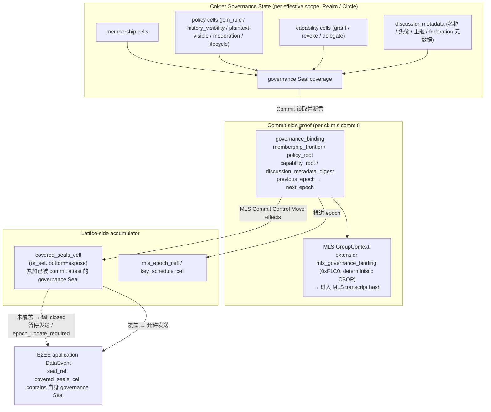

## 0. 规范语言

本文中的规范关键字（**MUST** / **SHOULD** / **MAY** 等）按 [conformance/normative-language.md](../conformance/normative-language.md) 解释；仅大写形式具规范约束力。

## 1. 目标

去中心化协作协议面临着复杂的隐私与合规矛盾：一方面，商业数据和私密频道必须提供不可被 Sync Service 或未授权受托服务窃听的端到端加密 (E2EE)；另一方面，在特定组织边界内，数据流又需要受到法律或合规层面的安全审查。

本规范定义了 Cokret 官方推荐的加密标准，旨在实现：
- 基于 **MLS (RFC 9420)** 的高效大规模协作加密
- 强前向安全 (Forward Secrecy) 与后向安全 (Post-Compromise Security)——此为默认 `mls-rfc9420` 内容 scheme 的属性；启用 §2.10 `mls-exporter-aead-v1` 且保留 per-epoch `history_secret` 的 Realm，其 FS / PCS 在被保留 epoch 上按 §2.10.5 退化为限定形态（per-epoch FS、PCS 仅对未被保留的 epoch 成立）
- **可审查加密 (Auditable E2EE)**，在 TEE / HSM / 等价受控执行 profile 下把合规解密绑定到可验证审计记录；在 software-only profile 下提供透明审计流程，但不声称具备同等密码学强制力。

## 2. 基础加密架构：MLS 与 Cokret 的融合

Cokret 采用 [RFC 9420 - Message Layer Security (MLS)](https://datatracker.ietf.org/doc/html/rfc9420) 作为官方的群组加密标准。
不推荐使用传统的 Double Ratchet（双棘轮），因为在包含数十到数百名成员的 discussion track 或大型协作 Realm 中，双棘轮会导致巨大的性能开销与并发处理难题。

### 2.1 KeyPackage 与服务发现
在参与 MLS 加密前，用户必须公布自己的 `KeyPackage`。
- **发布位置**：Actor 通过 signed Event 发布自己的 `KeyPackage`，或者在其 DID Document 的 `service` 中指定独立的 `MLS Delivery Service` 节点入口。
- **生命周期验证**：其他客户端在拉取 `KeyPackage` 时，MUST 通过 Actor 的 DID Document 与 Event history 验证该包的公钥签名，确保未被身份盗用。

### 2.2 握手与组成员管理 (Welcome, Commit)
MLS 维护了一颗成员密钥树 (Ratchet Tree)。在 Cokret 中，群组的密钥状态变动不依赖于独立的中心化分发服务器，而是映射到原生的 `Realm` 与 Event 模型中：


- **`ck.mls.commit`**：当拥有权限的 Admin 邀请新成员加入或移除成员时，客户端计算 MLS 的 `Commit` 消息。该 `Commit` 必须作为 `ck.mls.commit` 类型的 Event 提交至 Realm Event history。它作为不可篡改的账本，确保全网节点对群组密钥状态树的演进达成一致。
- **`Welcome` 分发**：新成员会收到由 Admin 构造的 `Welcome` 消息。Welcome MUST 通过 durable `ck.mls.welcome` Event、durable encrypted pointer 或等价可 backfill 记录交付，直到被消费、撤销或过期。Sync Service 的 Ephemeral Channel 只能作为通知和加速通道，不得是唯一交付路径；否则离线设备、跨域 backfill 和恢复流程无法验证加入历史。

**Welcome 大小侧信道（acknowledged side channel）**：MLS Welcome / GroupInfo 的 ciphertext 长度会与 leaf 数量、ratchet tree 形态、path secret 数量和近期 churn 有相关性。Cokret v1 不声称第三方观察者无法从 Welcome 大小推断粗粒度成员变化。高隐私 Realm SHOULD 声明 `ck.profile.traffic_metadata_hardened.v1`；声明后 Welcome / GroupInfo blob MUST 使用该 profile 声明的 padding bucket（默认 4KiB / 16KiB / 64KiB）并批量投递 welcome pointer。实现不得在 minimal-metadata 或 high-confidentiality 文案中承诺“成员变化不可由消息大小观察”，除非已声明并通过该 profile 的 padding 策略测试。

#### 2.2.1 MLS Group Admin 推导

MLS group admin 不是“第一个发 Welcome 的客户端”或“track 的第一个成员”。Cokret v1 按当前 accepted auth state 确定管理集合：

- Realm-scoped MLS group 的默认 admin set 来自 `ck.realm.create.payload.object.initial_creators` / `created_by`，以及当前有效的 `ck.realm.admin`、`ck.mls.commit`、`ck.mls.welcome` 或 Realm policy 声明的等价 E2EE admin capability。
- Realm 内的 [Circle](../models/circle.md)（`Strand.scope_circle_id` 指向的子事件边界）只有在 `encryption_profile=mls_rfc9420` 时才拥有 Circle MLS group；其 MLS group admin set 由该 Circle 的 `ck.circle.create` / `ck.circle.member.state` / `ck.mls.commit` / `ck.mls.welcome` 等事件按 Circle 自身的 capability 与 membership 体系收敛，与 Realm-default MLS group admin set 独立；Circle key MUST NOT 从 Realm-default key 派生。
- Admin capability 可以通过普通 capability grant / revoke Control Move 转移或收回；转移生效点由 Seal finality、Lattice value 和 revoke freshness 决定，不由 MLS leaf index、设备在线状态或本地 UI 角色决定。

发送 `ck.mls.proposal`、`ck.mls.commit` 或 `ck.mls.welcome` 的 actor 必须在其事件自己的 causal auth state 下属于上述 admin set，或满足该 event kind 允许的普通成员 update / self-update 规则。

### 2.3 载荷加密 (Application Data)
日常的 Message、Strand synthesis 或 Morph 内容负载在写入 Event 前，必须使用当前 MLS Epoch 的流密钥 (Application Key) 加密为密文信封。
- **可路由元数据分离**：有 `content` 明文对偶的对象使用 `encrypted_content` 包裹实际业务内容 (`content`, `attachments`)；没有 `content` 对偶的载荷仍可使用通用 `encrypted_payload`。
- **明文元数据保留**：用于网络路由和客户端本地 projection 的 `realm_id`, `type`, `causal_links`, `status`, `labels` 必须保持明文。
- Sync Service 可以依据明文元数据完成数据的转发、排序、过滤和去重，而完全无法窥探密文信封内的具体正文。客户端在解密后 MAY 建立本地搜索索引；受托 search / projection 服务只有在 `plaintext_visible_services` 授权下才能接收明文或可逆摘要。

#### 2.3.0 E2EE Profile：plaintext metadata 边界

v1 的 metadata 加密下限是二元字段 `metadata_encryption_floor ∈ {allow_plaintext, e2ee_required}`，与 `content_encryption_floor` 完全对称:`allow_plaintext` 允许用户可读 metadata 留在 wire 明文，`e2ee_required` 要求其进入 `encrypted_metadata`。启用 `encryption_profile="mls_rfc9420"` 或 `content_encryption_floor="e2ee_required"` 且未显式声明 `metadata_encryption_floor` 时，effective metadata floor MUST 默认为 `e2ee_required`。此时 Strand / Message 的用户可读 metadata（例如 Strand `metadata.title`、`metadata.summary`、`metadata.fields`，以及 Message `metadata.fields`）MUST 进入 `encrypted_metadata`，wire 上只保留 reducer / routing 必需字段。`allow_plaintext` 仅作为显式低隐私 / 高服务端 projection 能力的 opt-in；选择该值的 Realm 不得在 UI、营销材料或 service describe 中简称为“完整 E2EE”。

理由与影响：

- routing、reducer、ordering、notification gating 所需字段（例如 `realm_id`、event kind、object id、Strand `tracks` map、`stage` / `state`、必要 causal refs）可保持明文，因为它们是同步和收敛边界。
- 用户可读 metadata（标题、摘要、字段描述、reply/mention 摘要、可逆搜索 tokens）默认不得因为 MLS 开启而留在 wire 明文；若 Realm 显式选择 `allow_plaintext`，实现 MUST 向用户和 service describe 披露 metadata 不受 E2EE 覆盖。
- 受托 search / projection 服务只有在 metadata 为明文 profile 时才可直接接收这些字段；若 metadata 进入 `encrypted_metadata`，服务端 projection 能力必须降级，或通过 `plaintext_visible_services` / 本地客户端索引等受控机制取得明文。

**`e2ee_required` metadata floor** 是 v1 的 MLS / E2EE 默认形态；启用时 Strand / Message 的用户可读 metadata 按 §2.7 的 rules 进入 `encrypted_metadata`，wire 上只保留 reducer 和路由必需的键。`allow_plaintext` Realm 不得对 `metadata.title` / `metadata.summary` / `metadata.fields` / `rank` / `state` / `tracks` 等字段强制 wire-level 加密替换。

Realm policy MUST 通过 `ck.realm.policy_components.metadata_encryption_floor` 显式声明 metadata 加密下限，取值为：

| floor | wire 明文 | encrypted_metadata | 说明 |
| --- | --- | --- | --- |
| `allow_plaintext` | routing / reducer / projection 所需 metadata；Strand / Message 用户可读 metadata 可明文 | 无或仅 profile 特定字段 | 显式 opt-in。不得宣传为 metadata E2EE。 |
| `e2ee_required` | `realm_id`、kind、epoch、routing digest、必要 cell subject、必要 causal refs、Strand `tracks`、`stage` / `state` | Strand / Message `metadata.title` / `metadata.summary` / `metadata.fields`、mention/reply 摘要、client search tokens | MLS / E2EE 默认；用户可读 metadata 进密文。 |

`metadata_encryption_floor` 只决定“用户可读 metadata 是否必须 E2EE”这一个是非问题；**哪些字段为换取服务端搜索 / projection 能力而对受托服务暴露明文，由独立的 `plaintext_visible_services` 声明控制**（见下条与 §2.8），不再用额外的 metadata 加密档位表达。`realm_id`、kind、epoch、routing digest 等同步收敛边界字段在两档下都保持 wire 明文，不可加密。

`metadata_encryption_floor` 必须纳入 MLS governance binding `policy_root`。客户端 / 服务端不得仅通过 `encryption_profile="mls_rfc9420"` 推断 metadata 处理方式；缺省规则是：MLS 或 `content_encryption_floor=e2ee_required` Realm 为 `e2ee_required`，其他 Realm 为 `allow_plaintext`。

`plaintext_visible_services` 的生效边界与 MLS governance binding 对齐。任何扩大或收缩都 MUST 被新的 `ck.mls.commit` 覆盖后，才可用于该 scope 后续 epoch 的新明文披露判定；在覆盖前，客户端与服务端 MUST 继续使用上一 accepted epoch 的 `policy_root`。当列表收缩或移除某服务时，被移除服务从覆盖该变更的下一 epoch 起 MUST NOT 再接收新的明文、可逆摘要、索引输入、通知摘要或 media plaintext；该服务在移除前已合法收到的历史副本不能被密码学回收，但其继续保留、删除、审计和导出义务 MUST 按移除前已声明的 retention / erasure policy 执行。对 in-flight 明文，发送方和转发服务 MUST 在观察到收缩 frontier 后停止新的投递，无法证明属于旧 epoch 授权窗口的任务 MUST fail closed。

#### 2.3.1 Envelope Wire 结构

加密信封的 wire 形态是 [`artifacts/schemas/encrypted-envelope.schema.json`](../../artifacts/schemas/encrypted-envelope.schema.json) 的 canonical 表达。最小示例：

```json
{
  "envelope": {
    "scheme": "mls-rfc9420",
    "version": "1.0",
    "group_id": "base64url",
    "epoch": 12,
    "content_type": "application/json",
    "ciphertext": "base64url",
    "aad_visibility_event_id": "routing_digest",
    "aad": {
      "realm_id": "ck:realm:0196419b-0000-7000-8000-000000000000",
      "event_kind": "ck.message.create",
      "event_ref_digest": "sha256:..."
    },
    "key_ref": {
      "algorithm": "MLS",
      "group_state_ref": "ck:event:01964148-0000-7000-8000-000000000000"
    },
    "payload_digest": "sha256:...",
    "aad_digest": "sha256:..."
  }
}
```

字段约束：

| 字段 | 类型 | 必需 | 说明 |
|------|------|------|------|
| `scheme` | string | 是 | 加密方案标识符 |
| `version` | string | 是 | 方案版本 |
| `group_id` | base64url | 是 | MLS 群组 ID |
| `epoch` | integer | 是 | MLS epoch 编号 |
| `content_type` | string | 是 | 解密后内容的 MIME 类型 |
| `ciphertext` | base64url | 是 | `mls-rfc9420` scheme 为 MLS PrivateMessage / application message 序列化字节;`mls-exporter-aead-v1` scheme 为 §2.10 定义的 `nonce \|\| AEAD_seal(K_content[N], nonce, aad_bytes, plaintext)`（nonce/AAD 遵循 [encoding.md](../conformance/encoding.md) §10.1；AEAD tag 含在 seal 输出内）。 |
| `authentication_tag` | base64url | 禁止 | v1 两个 scheme 下均 **MUST NOT 出现**:`mls-rfc9420` 的 tag 已在 MLS message 内、`mls-exporter-aead-v1` 的 AEAD tag 已附在 `ciphertext` 内，均不重复拆出;schema 用顶层 `not` 拒绝该字段（携带者 `schema_violation`）。 |
| `aad_visibility_event_id` | enum(hidden, routing_digest, opaque_id) | 是 | `aad.event_id` / `aad.event_ref_digest` 的 schema discriminator；receiver 必须按该值校验 AAD 字段集合。 |
| `aad` | object | 是 | 路由元数据；明文但被 AEAD 认证。 |
| `aad.realm_id` | id:realm | 是 | 路由与授权的 Realm。 |
| `aad.event_kind` | string | 是 | 路由 event kind。 |
| `aad.event_id` | id:event | 条件 | `aad_visibility_event_id="opaque_id"` 时必填。 |
| `aad.event_ref_digest` | hash | 条件 | `aad_visibility_event_id="routing_digest"` 时必填；hash 输入由 profile 固定（推荐 `sha256("ck-aad-event-ref-v1" \|\| event_id \|\| realm_id \|\| policy_nonce)`）。 |
| `aad.causal_refs` | array | 条件 | 可见因果依赖；高隐私 profile 可改用 `causal_ref_digests`。 |
| `aad.causal_ref_digests` | array&lt;hash&gt; | 条件 | `causal_refs` 的摘要化形态，高隐私 profile 用以替代明文 `causal_refs`；二者 MUST NOT 同时出现。 |
| `key_ref.algorithm` | string | 条件 | `mls-rfc9420` scheme 为 `MLS`；`mls-exporter-aead-v1` scheme 为 `MLS-EXPORTER-AEAD`；其他 scheme 必须注册自己的值。 |
| `key_ref.group_state_ref` | id:event 或 hash | 是 | 指向 accepted `ck.mls.genesis` / winning `ck.mls.commit` event / 等价 group state proof；用于加速 lookup，不替代 MLS transcript 验证。 |
| `payload_digest` | hash | 是 | `sha256(payload_metadata_bytes \|\| encrypted_payload_bytes)`；输入定义见 §2.3.3。 |
| `aad_digest` | hash | 是 | canonical AAD 的 SHA-256。 |
| `cleartext_commitment` | hash | 禁止 | v1 E2EE producer **MUST NOT emit** 裸明文哈希；receiver **MUST reject** 携带该字段的 envelope（`schema_violation`）。低熵 plaintext 会被离线字典攻击。需要明文承诺时必须使用带 profile 的 keyed / salted 机制（例如 [`../governance/content-moderation.md`](../governance/content-moderation.md) §3.4 现行的 reporter 加密 evidence + `franking_proof` 模型）。 |

Ratchet tree MUST 由 `ck.mls.genesis`、Welcome、Commit 或 group state proof 管理，不得在每条消息的 envelope 中重复传输。

#### 2.3.2 AAD 可见性 Profile 与 canonical 序列化

AAD 字段集合受 Realm 的 `aad_visibility` policy 约束。隐私优先 Realm SHOULD 只保留路由所需的 `realm_id`、event kind、epoch 和不可逆 routing hash；需要跨 provider 投递确认的 Realm MAY 暴露 opaque `event_id` / `message_id`，但该选择 MUST 在 Realm policy 中声明并纳入 MLS-bound `policy_root`。

`aad_visibility_event_id` 是 schema discriminator，控制 `aad.event_id` 与 `aad.event_ref_digest`：

- `opaque_id`：AAD MUST 包含 `event_id` 且不得包含 `event_ref_digest`，用于跨 provider 投递确认和精确去重。
- `routing_digest`：AAD MUST 使用 `event_ref_digest`，不得暴露稳定 `event_id`。
- `hidden`：AAD MUST 同时省略 `event_id` 与 `event_ref_digest`；去重只能依赖外层 Event Envelope、transport receipt 或 receiver-local cache。

AAD 在计算 `aad_digest` 前必须序列化为规范 JSON：

```json
{
  "realm_id": "ck:realm:0196419b-0000-7000-8000-000000000000",
  "event_kind": "ck.message.create",
  "event_ref_digest": "sha256:0123456789abcdef0123456789abcdef0123456789abcdef0123456789abcdef",
  "causal_refs": ["ck:event:019640ed-0000-7000-8000-000000000000"]
}
```

规则：

- 键按字典序排序
- 无多余空白
- 无尾随逗号
- 字符串使用 UTF-8 编码

#### 2.3.3 `payload_digest` 计算

`payload_digest` 的输入必须完全确定，不得使用实现本地对象序列化结果。

1. `aad_bytes = canonical_json(aad)`，`aad_digest = sha256(aad_bytes)`。
2. `payload_metadata` 是以下对象的 canonical JSON，字段缺失时不得写入 null：

```json
{
  "scheme": "mls-rfc9420",
  "version": "1.0",
  "group_id": "base64url",
  "epoch": 12,
  "content_type": "application/json",
  "aad_visibility_event_id": "routing_digest",
  "aad": {
    "realm_id": "ck:realm:0196419b-0000-7000-8000-000000000000",
    "event_kind": "ck.message.create",
    "event_ref_digest": "sha256:..."
  },
  "key_ref": {
    "algorithm": "MLS",
    "group_state_ref": "ck:event:01964148-0000-7000-8000-000000000000"
  }
}
```

3. `payload_metadata_bytes = canonical_json(payload_metadata)`。
4. `encrypted_payload_bytes = base64url_decode(ciphertext)`。v1 `mls-rfc9420` scheme 下 envelope MUST NOT 携带 `authentication_tag`（见 §2.3.1），故该步骤不追加 tag,`payload_digest` 输入无歧义。
5. `payload_digest = "sha256:" + sha256(payload_metadata_bytes || encrypted_payload_bytes)`。

`mls-rfc9420` profile 中，MLS PrivateMessage 本身还必须把 `aad_bytes` 作为 MLS authenticated data 或 profile 声明的等价 authenticated input；`payload_digest` 是 Cokret envelope 的外层完整性检查，不替代 MLS AEAD。

#### 2.3.4 解密错误处理

| 错误 | 原因 | 响应 |
|------|------|------|
| `aad_digest_mismatch` | AAD 被篡改 | 拒绝整个事件 |
| `payload_digest_mismatch` | 密文损坏 | 拒绝整个事件 |
| `key_unavailable` | 缺少 epoch | 标记为 `decryption_pending`，按 `client-sync.md` 的 timeout / recovery 规则恢复 |
| `epoch_mismatch` | 错误的密钥 epoch | 回溯或获取 epoch；无法在 timeout 内恢复时标记 `decryption_failed` |
| `group_removed` | 不再是成员 | fail closed；不得向未授权成员请求密钥 |

`decryption_pending` 是有界恢复状态，不是永久展示状态。默认 timeout 为 7 天；超时后客户端 MUST 降级为 metadata-only `decryption_failed` 占位。连续 epoch 缺口过大时，客户端 SHOULD 使用 range-based recovery，从授权 peer、key backup、Archive Node 或 policy 声明的 Key Recovery Service 获取最小必要 epoch material。

任何 epoch material 交付（无论目标处于 `decryption_pending` 还是 `decryption_failed`）MUST 满足 §2.3.5 的 T₀ membership + policy + key-share-source 校验。

#### 2.3.5 Late Key Recovery 状态机（normative）

客户端 MAY 在 `decryption_failed` 之后接收到迟到的 key material（来自 key backup 同步、device 重新加入、Archive Node 回灌、history key share 等）。该 late material 重新解码受限历史的流程是受控状态机，**不是**静默解锁：

| 起始状态 | 触发 | 目标状态 | 客户端 / 审计行为 |
| --- | --- | --- | --- |
| `decryption_pending` | 在 timeout 内收到 key | `decrypted` | 正常解码，无额外 marker。 |
| `decryption_pending` | timeout（默认 7 天） | `decryption_failed` | UI 标 metadata-only；不可恢复直到收到 late key。 |
| `decryption_failed` | 收到 late key 且通过 (a)-(d) 校验 | `late_recovered` | 客户端 MUST 将该 Event 标记为 `late_recovered` 并保留原 `T₀`，MUST NOT 用解锁内容静默覆盖原 metadata-only 占位的 metadata；呈现方式由实现决定。audit profile 下 MUST emit `ck.audit.accessed`，payload `access_kind="e2ee_late_recovery"` 且 `late_recovery_original_event_id` 指向原加密 Event；history key share scope MUST 与 receiver 当时的 membership scope 一致。 |
| `decryption_failed` | 收到 late key 但 (a)-(d) 任一不过 | 保持 `decryption_failed` | 不解码、不显示明文；记 audit log。 |
| `late_recovered` | 后续 redaction / erasure 触发 | `redacted_after_recovery` | 已恢复明文 MUST 按 redaction policy 移除；wire stub 保留。 |

late key recovery 接受条件（normative）— 客户端 MUST 全部通过才能从 `failed` 转 `late_recovered`。本节的 T₀ 是目标 event 的 CBA query basis：DataEvent 使用其 `seal_ref` 指向的控制面 Seal view 与自身因果前缀；Control Move 使用其 `seal_basis` 指向的控制面 pre-state。T₀ MUST NOT 由客户端本地到达顺序、wall clock 或未 sealed 的 pending Control Move 决定。

a. **Membership 时点校验**：受影响 event 的 T₀，receiver 在 T₀ 必须确实是该 Realm 的成员（`ck.member.state` 在 T₀ pre-state 下为 join，且不是 ban / leave）。如果 receiver 在 T₀ 不是成员、或当时还未被 invite，late key 解码出的明文 MUST NOT 进入 verified timeline；audit log emit `late_recovery_rejected_membership`。
b. **Policy 时点校验**：T₀ 处的 Realm policy MUST 允许该 receiver 类别看到该 event（history visibility / disclosure policy 在 T₀ 处）；若 policy 在 T₀ 之后收紧到禁止该 receiver，late material 仍按 T₀ policy 解码（policy 不溯及既往），但 UI MUST 提示"已不在当前 policy 下可见"。
c. **Key share 来源授权**：late key 提供方 MUST 是 Realm policy 声明的合法 key recovery 源（key backup、archive node、authorized peer）；P2P 之间随意 share key MUST 被拒。
d. **Audit profile 强制**：`ck.profile.attested_audit.e2ee.v1` / `ck.profile.disclosed_audit.e2ee.v1` 下，late_recovered transition MUST 同步 emit `ck.audit.accessed` Event（payload `access_kind="e2ee_late_recovery"`、`late_recovery_original_event_id=<原 event_id>`、当前 receiver actor），并等待 RYW receipt 与正常解码相同的流程；未拿到 receipt MUST NOT 解码。`ck.audit.ryw_receipt` 在 receipt object 上 MAY 标 `recovery_reason_code` = "late_key_arrival"（payload 取值，**不是** error code registry 中的 reason_code；仅用于 audit projection 区分晚到 key 触发的访问与首次访问）。**成员自访问 receipt 类别（normative 澄清）**：此处 late_recovered 所需的 RYW receipt 与该成员**正常解码**所用 receipt 同类（`single_source` / 本地 receipt 即可）；它**不是** [`audited-e2ee.md` §6](./audited-e2ee.md) 的 audit *release* 所要求的 `federation_witness_attested`（≥2 独立 witness）receipt——后者只约束阶段性 release session，MUST NOT 施加到成员对自己在 T₀ 合法可见历史的自访问活性路径，否则离线 / 分区下合法历史恢复将事实不可达。
e. **Expiry / retention guard**：目标 event 带 disappearing expiry 且当前时间已超过 `expired_at + grace`，或 Realm / retention policy 已要求销毁该 event 的内容 key 时，late key MUST NOT 使 plaintext 进入 `late_recovered`。客户端必须保持 expiry stub / metadata-only 状态并记录 `late_recovery_rejected_expired`；key recovery source 在发放 late material 前也必须执行同一 guard。

**失权主体（membership / account / device 撤销）的负向校验**：若 receiver 在 T₀ 已不是成员，或 late key share 的签发时刻该 receiver 已处于下列任一失权态——其 `ck.member.state` 已为 `ban` / `leave`、其 account status 已为 `suspended` / `deactivated` / `erasure_pending`、或其交付目标 device grant 已 revoked——且 key source 未重新执行 T₀ 校验，则 late key MUST NOT 进入 verified timeline。T₀ 之后发生的 ban / remove 不自动追溯撤销其在 T₀ 合法可见的历史，但 key backup / archive node / peer share 在发送 late material 前 MUST 重新执行 T₀ membership + policy 校验，并确认当前 share policy 仍允许向该 device 交付；否则必须拒绝并写 `late_recovery_rejected_membership` 或 `late_recovery_share_not_authorized`。`ck.vector.late_key_recovery.removed_actor.v1` 覆盖：(a) receiver 在 T₀ 不可见时不解密；(b) key source 在 ban 后未重新校验时拒绝 share；(c) 客户端 UI 不显示未授权明文。

#### 2.3.6 与 redaction / erasure 的关系

late_recovered 状态的明文 MUST 受后续 redaction / erasure 影响：若在 recovery 之后该 event 被 `ck.redaction` 或硬擦除，receiver MUST 立即移除已显示的明文并转入 `redacted_after_recovery` 状态。已 emit 的 `ck.audit.accessed` late_recovery marker 保留作为审计轨迹（即使内容已 redact，访问事实仍然可审计）。

### 2.4 Sync 与 MLS Epoch

Client Sync 中的事件顺序不保证密钥材料已经同步完成。加密事件和 MLS epoch state MUST 作为相关但可独立到达的 stream 处理：

- encrypted event 可以先进入 raw event cache 和 timeline position。
- `ck.mls.*` state event / MLS Commit 决定客户端是否拥有对应 epoch 的解密状态。
- 客户端缺少 epoch 时 MUST 标记 `decryption_pending`，不得静默丢弃或重排事件。
- backfill 历史事件时，客户端 SHOULD 同步对应 epoch 区间的 MLS state，而不是逐条向成员请求密钥。
- 被移除成员不得获取移除后 epoch 的 group secret；客户端必须 fail closed。
- `history_visibility` 只授予历史读取资格，不自动授予旧 epoch key。客户端 / key source 在交付历史 key 前 MUST 同时执行 [`../governance/history-visibility.md`](../governance/history-visibility.md) §3 的 Event-time visibility 判定与 effective `ck.realm.history_sharing_policy` 判定。

服务端和 Sync Service 不需要解密正文，但必须保留明文 routing metadata、epoch reference、hash 和 causal refs，以便客户端后续补齐密钥后重试解密。

#### 2.4.1 Membership 与 Epoch 不一致窗口

Membership state 与 MLS epoch 推进是异步事件，但可见性规则必须确定：

- 会影响 E2EE 可见性的 `ck.member.state`（Realm-level）或 MLS-backed `ck.circle.member.state`（Circle-level）accepted 后（track 不携带独立 membership；Realm 内的子事件边界由 [Circle](../models/circle.md) 通过 `Strand.scope_circle_id` 表达，并由 `ck.circle.member.state` 管理 Circle 成员），相应 MLS-backed scope（Realm-default 或 Circle）进入 `epoch_update_required`，直到有 winning `ck.mls.commit` 的 `governance_binding.membership_frontier` 覆盖该 membership frontier。Plaintext Circle 只执行 membership / delivery / query 裁剪，不进入 MLS epoch 状态机。
- 新加入成员在 Welcome / Commit 被接受并成功处理前，只能看到 policy 允许的 stripped metadata、邀请信息或 `decryption_pending` 占位；不得看到加入前后正文，除非 history visibility、history sharing policy 和 key share event 均明确授权。`history_visibility=shared` 只表示 joined 后具备读取 join 前历史的资格；旧 epoch key 仍必须通过 `ck.realm_key.share` 或等价 policy-authorized recovery path 交付。`history_visibility=joined` 下，join 前正文和旧 epoch key MUST 被拒绝。
- 被移除、ban 或离开的成员在对应 membership frontier 之后不得接收新 epoch 的 Welcome、group secret 或 history key share。若客户端仍收到使用旧 epoch 加密的新正文，必须标记 `state_mismatch` 或拒绝解密结果进入 verified timeline。
- 发送客户端在发现 `epoch_update_required` 后 **MUST** 暂停该 scope 的新**加密 application messages** 并标记 `encryption_transition_pending`，直到 effective epoch 的 `covered_seals_cell` 覆盖最新 governance Seal。该规则适用于所有声明 `encryption_profile="mls_rfc9420"` 的 Realm，无论 `security_class`——忽略 governance Seal coverage 的发送会让 ban / revoke 在新消息上失效，正是引入 MLS Governance Binding 要消除的风险。

  **明文发送豁免（normative）**：send-pause 只约束需要 MLS-backed 密文的发送。当某 scope 的 effective `content_encryption_floor=allow_plaintext` 且该消息以明文发送时，不受 MLS epoch / `covered_seals_cell` gating——明文消息的 ban / revoke 由 membership cell 即时生效，不依赖 epoch 推进。这使 “`encryption_profile=mls_rfc9420` + `allow_plaintext`” 的可升级默认形态在明文期间无需为每次成员变更推进 MLS epoch；一旦 effective floor 抬到 `e2ee_required`（或该消息以密文发送），完整 §2.5 governance-binding send-pause 立即恢复，首条密文发送 MUST 等待覆盖当前 membership frontier 的 epoch。`encryption_profile=none` 的 scope 不拥有 MLS group，本规则不适用。

  **`mls_send_pause="advisory"` 降级规则**：把上述 MUST 暂停降级为 SHOULD 的能力**仅在显式 degraded profile** `ck.profile.e2ee_relaxed.v1` 下允许声明，不得在默认 `ck.profile.mls_governance_binding.full.v1` profile 或任何声称 “完整 MLS Governance Binding” 的部署中使用。该字段在符合资格的部署中也 MUST：

  - 出现在 `ck.realm.policy_components` 的明文 audit log 中(声明本身被记录，便于审计)
  - 部署 profile 在 conformance 声明中**显式列出** `ck.profile.e2ee_relaxed.v1`，否则降级声明 MUST 被 reducer 拒绝（`profile_unsupported` reason）
  - 客户端 UI 在该 Realm 中 MUST 展示明确的"该 Realm 使用降级 E2EE,踢/ban 非密码学即时生效"banner-level 警示(详见 §2.4.2 / `ck.profile.e2ee_relaxed.v1` 规范)
  - 接收端在解密 advisory 模式下旧 epoch 消息时 MUST 检查 receive_at vs membership_change_at 时间窗，超过部署声明 `relaxed_window_max_ms` 时拒绝解密结果进入 verified timeline
  - **`relaxed_window_max_ms` 默认值 = 30,000 ms（30 秒），硬上限 = 300,000 ms（5 分钟）**：两者语义不同，不得混淆。**默认值**是部署未在 `ck.realm.policy_components` 显式声明 `relaxed_window_max_ms` 时 reducer / 接收端 MUST 采用的值，固定为 30,000 ms（与 §2.4.2 profile 行为表"被踢者继续解密窗口默认 30s"及 `max_mls_commit_delay_ms` 默认 30,000 ms 对齐，使"踢出后被踢者继续可读窗口"与"正常 commit roundtrip 上限"在默认配置下同量级）。**硬上限**是部署即使显式声明也不得超过的天花板 300,000 ms：部署不得通过 `ck.realm.policy_components` 把 `relaxed_window_max_ms` 写为大于硬上限的值；reducer MUST 用 `relaxed_window_exceeds_ceiling` 拒绝。接收端 MUST 独立 enforce 硬上限——不得静默 clamp 到 300000，否则部署声明的窗口与 receiver 接受的窗口会跨实现分裂。部署 MAY 在 `(0, 300000]` 区间内显式覆盖默认 30000；缺省即 30000。Negative vector `ck.vector.e2ee_relaxed.window_exceeds_ceiling.v1` 同时覆盖 policy write 超限与 receiver 接受超限 decrypt 两条路径。
  - **合规 profile 互斥**：声明 `ck.profile.attested_audit.e2ee.v1` / `ck.profile.disclosed_audit.e2ee.v1` 或存在 active Audit Applet Binding 的部署 MUST NOT 同时启用 `ck.profile.e2ee_relaxed.v1`；reducer MUST 用 `e2ee_relaxed_disallowed_in_compliance_profile` 拒绝。合规 / 监管 profile 的核心承诺是"踢出即时密码学生效"，relaxed 窗口与之矛盾。
  - **Federation guard**：`ck.profile.e2ee_relaxed.v1` MUST NOT 与 `federation_policy="open"` 或 `"quarantine"` 同时启用；reducer MUST 用 `e2ee_relaxed_federation_policy_unsupported` 拒绝。`federation_policy="restricted"` 只允许在 Realm policy 同时声明 `relaxed_fanout_deadline_ms <= relaxed_window_max_ms`、`max_federation_delivery_delay_ms <= relaxed_window_max_ms` 且 federation peers 在 `ck.server.query.describe.limits` 中公开不超过该 deadline 的 fanout SLA 时启用；否则 MUST fail closed。`federation_policy="closed"` 不需要额外 federation guard。describe SLA 校验仅是准入门槛（声明时校验 peer 公开的 fanout deadline 是否满足约束），实际 enforcement 仍由接收端 `relaxed_window_max_ms` 时间窗兜底（运行时校验 receive_at vs membership_change_at，超窗即拒绝 decrypt 进入 verified timeline）；二者缺一不可，不得理解为"声明合规即放行"。

  **降级声明义务（normative）**：`ck.profile.e2ee_relaxed.v1` 不是本地优化开关，而是可审计的协议降级声明。有效声明必须同时满足：Realm create 或 `ck.realm.policy_components` 明文记录该 profile 与 `mls_send_pause="advisory"`；服务端 `ServiceDescribe.supported_profiles` / `supported_features` 声明 `ck.profile.e2ee_relaxed.v1` / `ck.feature.e2ee_relaxed.v1`；该 Realm 后续每个 MLS `governance_binding.binding_profile` 写为 `ck.profile.e2ee_relaxed.v1` 并携带匹配的 `reducer_profile`；sync metadata、snapshot、backup/export 与 interop mapping receipt 必须保留 `e2ee_relaxed=true` 和 `relaxed_window_max_ms`。任一条件缺失、互相矛盾、或仅通过部署私有配置 / UI 标签 / 省略 GroupContext extension 表达降级，接收方 MUST 按未声明降级 fail closed：拒绝 Realm 写入、quarantine 相关 MLS artifact，或拒绝 old-epoch decrypt 进入 verified timeline。

  **联邦互操作下界（normative）**：跨 deployment 的 MLS-backed Realm 以 `ck.profile.mls_governance_binding.full.v1` 为 E2EE 互操作下界。`ck.profile.e2ee_relaxed.v1` 是低于该下界的显式降级，只能在 `federation_policy="closed"` 或满足上方 restricted federation guard 的 `restricted` Realm 中出现；open / quarantine federation MUST reject。联邦 peer 未在 describe 中声明所需 profile/feature、未公开满足窗口的 fanout SLA、或 MLS commit / DataEvent 的 `binding_profile`、`reducer_profile`、`covered_seals_cell` 无法验证时，接收方 MUST reject 或 quarantine，不得把该 peer 的 push 用于推进本地 Realm frontier。

  声明 advisory 但未声明 `ck.profile.e2ee_relaxed.v1` profile 的 Realm create / policy update event MUST 被 reducer 拒绝。详见 §2.4.2 与 [`conformance-profiles.json`](../../artifacts/profiles/conformance-profiles.json)。
- Realm / reducer profile MUST 声明 `max_mls_commit_delay_ms`，**默认 30,000 ms**；profile MAY 覆盖（交互式 profile SHOULD be no greater than 30,000 ms，高延迟 / 批量 profile MAY 声明更大值）。客户端在 commit 滞后超过该 effective 值后 MUST 将该 scope 降级为 read-only / send blocked，服务端 SHOULD 返回 `epoch_update_required` 或 `temporarily_unavailable`。
- 网络分区期间可以继续 backfill 旧 epoch 历史，但不得把旧 epoch 下的新消息展示为已满足最新 membership policy 的消息。

该窗口规则不改变 MLS Proposal / Commit 两阶段语义；它只定义 Cokret 在 state 已变化但 epoch 尚未收敛时的 UI、发送和解密处理。

### 2.4.2 `ck.profile.e2ee_relaxed.v1`(降级 profile)

**目的**:某些低延迟交互场景(实时音视频会议、协同光标 / 多人编辑、游戏内聊天等)不能容忍 MLS commit 完成才允许发新消息的等待开销(典型延迟 200ms-数秒)。`ck.profile.e2ee_relaxed.v1` 是为这些场景保留的**显式降级 profile**:允许 `mls_send_pause="advisory"`,代价是放弃"踢人/ban 后被踢者立即不能解密新消息"的密码学硬承诺。

**适用判断**:
- Allowed: 实时交互延迟要求 < 1s 且业务可接受"踢出后窗口内被踢者仍可读 1-2 条消息"的场景。
- Forbidden: 普通群聊 / 协作文档 / 项目讨论(踢人语义需要密码学强保证)不适用，继续用默认 `ck.profile.mls_governance_binding.full.v1`。
- Forbidden: 合规 / 法律 / 监管要求"立即生效"撤销时强制不适用，部署 MUST 拒绝。

**Profile 行为差异**:

| 维度 | 默认 (`mls_governance_binding.full.v1`) | 降级 (`e2ee_relaxed.v1`) |
| --- | --- | --- |
| `mls_send_pause` 默认 | MUST 暂停直到 covered_seals_cell 覆盖 | 允许声明 `"advisory"`,降为 SHOULD |
| `covered_seals_cell` 覆盖检查 | reducer/客户端 MUST enforce | 仍然写入但 send-side 不阻塞 |
| 被踢者继续解密窗口 | ≤ MLS commit roundtrip(密码学保证) | ≤ `relaxed_window_max_ms`(默认 30s,部署声明) |
| 接收端 verified timeline 检查 | epoch 不匹配 → 拒绝 | epoch 不匹配且超出 `relaxed_window_max_ms` → 拒绝 |
| UI 警示 | 无 | **MUST 显示 banner-level 警示**，并明确披露：该 Realm 使用降级 E2EE；踢出 / ban 不具备密码学即时生效保证；旧成员可能在声明窗口内继续解密最近消息。 |
| Server describe `supported_features` | `ck.feature.mls_governance_binding.full.v1` | `ck.feature.e2ee_relaxed.v1`(互斥;**MUST NOT** 同时声明 full + relaxed) |
| 在合规 / 监管语境下 | 满足"成员踢出即时生效" | 不满足,SHOULD 走非 E2EE 或专用 enclave 通道 |

**强制约束**:

- Realm 在 create event 或 `ck.realm.policy_components` 中声明 `mls_send_pause="advisory"` 时,**MUST** 同时声明 `ck.profile.e2ee_relaxed.v1` profile 适配。reducer 检测到 advisory 但 Realm `supported_profiles` 不含 `e2ee_relaxed.v1` → MUST reject(`profile_unsupported`,详细 reason `mls_send_pause_advisory_requires_e2ee_relaxed_profile`)
- 声明本 profile 的 Realm **MUST NOT** 同时声明 `ck.profile.mls_governance_binding.full.v1`(互斥)。reducer 检测同时声明 → MUST reject(`conflicting_e2ee_profiles`)
- 声明本 profile 的 Realm 后续 MLS commit **MUST** 在 `governance_binding.binding_profile` 中写入 `ck.profile.e2ee_relaxed.v1`，并在 `governance_binding.reducer_profile` 中写入当前协商 reducer profile。缺字段、写成 full profile、写成未知 profile、或与 Realm policy / ServiceDescribe 声明不一致时，接收方 MUST reject / quarantine 该 commit，并不得把对应 epoch 用于 verified timeline。
- 声明本 profile 的 Realm 若同时声明 federation，MUST 满足 §2.4.1 的 Federation guard。open / quarantine federation 直接拒绝；restricted federation 必须证明 fanout deadline 不超过 relaxed window。
- 客户端实现 **MUST**:
  - 在该 Realm 的对话 UI 上展示 banner-level 警示(不可被用户永久 dismiss,可临时折叠)
  - 在用户邀请新成员时弹窗提示"该 Realm 使用降级 E2EE",让用户知情决策
  - 在 sync metadata 中标记该 Realm 为 `e2ee_relaxed=true`,导出 / 备份 / 跨设备时保留该标记
- 服务端 `ck.server.query.describe.supported_features` **MUST** 列出 `ck.feature.e2ee_relaxed.v1` 才能接受该 profile 的 Realm 写入

**禁止扩展**:本 profile 不允许进一步降级到"不 enforce `covered_seals_cell` 写入" / "允许跨 epoch 解密无窗口限制"。降级到此为止；更宽松场景应当退回到**非 E2EE** Realm(`encryption_profile="none"`)而不是继续放宽 E2EE 承诺。

### 2.5 MLS Governance Binding

**MLS Governance Binding** 是 Cokret v1 把 **MLS epoch 与 governance state（membership / policy / capability / Seal coverage）强绑定** 的机制，相对于 Matrix 把 Olm/Megolm 与 room state 当作两条并行轨而言，它是 v1 的核心新增层。该机制由两个 wire-level artifact 组成，分工固定：

| 层 | 名称（wire-level） | 角色 |
|---|---|---|
| **Commit-side proof** | `governance_binding`（GroupContext extension `mls_governance_binding`，定义见 §2.5.1，CBOR 编码见 §2.5.3） | 每个 `ck.mls.commit` 携带的 binding payload，把本次 epoch 推进所**断言覆盖**的 governance roots（`membership_frontier` / `policy_root` / `capability_root` / `discussion_metadata_digest`）哈希进 MLS transcript |
| **Lattice-side accumulator** | `covered_seals_cell`（cell family `ck.component.covered_seals.v1`，or_set，bottom=expose，见 §2.5.2） | MLS Commit Control Move 的 effect cell，**累计**已被 commit attest 的 governance Seal；E2EE DataEvent 用 `seal_ref` 与 `contains` 求值 gate 自身依赖的 governance Seal |

两层缺一不可：`governance_binding` 提供 per-commit 的不可伪造证据并由 MLS transcript hash 覆盖，`covered_seals_cell` 沉淀 reducer 可查询的累计状态供 E2EE DataEvent `seal_ref` coverage 引用。

下图把两层结构和 application message 如何被 gate 画在一起：



读图要点：

- 撤销 / ban / device revoke / policy 收紧只在 governance state 里 accepted **不够**——必须有后续 `ck.mls.commit` 把对应 governance Seal 写进 `covered_seals_cell`，新 application message 才会被 gate 阻止使用旧 epoch key。
- Governance / recovery Control Move 不依赖 `covered_seals_cell`，因此 MLS epoch 卡住时仍可提交修复 Control Move 并由 Seal finalization 生效。
- 客户端验证 `governance_binding` 时无法回补 inclusion proof 或 hash 不匹配 → epoch 标记 `decryption_pending` / `state_mismatch`，禁用该 epoch 解密新正文。

MLS 不应只保护正文，也必须帮助成员发现服务端是否向不同客户端展示了不同的成员、策略或 discussion 元数据 —— 这是引入 MLS Governance Binding 的根本动机。撤销、ban、device revoke 和 policy 收紧不能只在应用层 accepted；它们必须被 MLS epoch / key schedule 覆盖后才能影响新消息解密能力。

MLS group 的 scope 绑定到 tagged `effective_scope`：`{kind:"realm", realm_id}` 时 group 覆盖 Realm-default scope（Realm 自身使用 `encryption_profile="mls_rfc9420"`）；`{kind:"circle", realm_id, circle_id}` 时仅当该 [Circle](../models/circle.md) 使用 `encryption_profile="mls_rfc9420"` 才拥有独立 MLS group，与 Realm-default group 完全独立，且 Circle key MUST NOT 从 Realm-default key 派生。两个 group 通过 `(realm_id, circle_id?)` 复合 scope 区分，不依赖 track-scoped key model 或跨 Realm linked-Realm 模型。

#### 2.5.1 Governance Binding Payload (`governance_binding`)

每个 `ck.mls.commit` MUST 绑定一个 `governance_binding`，并把该引用纳入 MLS transcript 或等价的 commit-authenticated data：

```json
{
  "governance_binding": {
    "binding_version": 1,
    "encoding_profile": "cbor-deterministic-rfc8949-v1",
    "realm_id": "ck:realm:0196419b-0000-7000-8000-000000000000",
    "effective_scope": {
      "kind": "realm",
      "realm_id": "ck:realm:0196419b-0000-7000-8000-000000000000"
    },
    "mls_group_id": "base64url...",
    "previous_epoch": 41,
    "next_epoch": 42,
    "membership_frontier": ["ck:event:8ea2dd8c-c436-7b94-9000-000000000000"],
    "policy_root": "sha256:canonical_state_policy_root",
    "capability_root": "sha256:effective_capability_root",
    "discussion_metadata_digest": "sha256:canonical_discussion_metadata",
    "binding_profile": "ck.profile.mls_governance_binding.full.v1",
    "reducer_profile": "ck.reducer.v1"
  }
}
```

MLS group 的 key scope 由 `effective_scope`（§2.5 开头）唯一决定，**不存在 per-track MLS group**——整个 Strand 共享单一安全边界（见 [`strand-and-message.md`](../models/strand-and-message.md) §3）。`governance_binding` 是封闭对象，不携带 `strand_id` 或 `track_name`；

**顶层 `circle_id` 的出现条件（normative，与 §2.5.3 冗余表一致）**：`governance_binding` 顶层的可选 `circle_id` 字段 MUST **当且仅当** `effective_scope.kind == "circle"` 时出现，且 MUST 等于 `effective_scope.circle_id`；`effective_scope.kind == "realm"` 时顶层 MUST NOT 携带 `circle_id`。上面的 JSON 示例 `effective_scope.kind="realm"`，故顶层不含 `circle_id`；Circle-scoped commit 的 `governance_binding` 顶层 MUST 同时含 `realm_id` 与 `circle_id`，二者均与 `effective_scope` 内对应字段 bit-identical。该顶层字段是离线审计冗余字段（CBOR 编码见 §2.5.3，标 `optional, only when effective_scope.kind="circle"`），不一致时 receiver MUST 拒绝该 commit（governance_binding 可能被错误重绑定到不同 Circle）。Strand 级上下文只能出现在 application message AAD 或外层 payload 中，且不得据此派生独立 membership、history visibility 或 MLS group。验证边界是 Realm/Circle membership、history visibility、policy state 与 `allowed_tracks` action scope；`allowed_tracks` 只缩小已授权动作的 track 范围，不授予独立 track-level ACL。

**E2EE Realm MUST 声明 `ck.profile.mls_governance_binding.full.v1`**：声明 `encryption_profile="mls_rfc9420"` 的 Realm 隐式继承该 profile（`ck.profile.e2ee_client.v1` 直接 `inherits` 它）。所有 `ck.mls.commit` MUST 携带 GroupContext extension 形态的 `governance_binding`；仅 transcript-authenticated 而无 GroupContext extension 的实现不符合 v1。

- `membership_frontier` MUST 覆盖本次 Commit 声称生效的成员、invite/leave/ban 和设备信任 cell。
- `binding_version` MUST 为 `1`；`encoding_profile` MUST 为 `cbor-deterministic-rfc8949-v1`。两者进入 GroupContext extension bytes、Event payload 和 `covered_seals_cell` canonical value，接收方不得从 codepoint 或 profile id 隐式推断。
- `binding_profile` 与 `reducer_profile` 是 required 字段。`binding_profile` MUST 等于该 Realm 实际声明的 MLS governance binding profile：默认/full Realm 为 `ck.profile.mls_governance_binding.full.v1`；唯一 v1 降级 Realm 为 `ck.profile.e2ee_relaxed.v1`。接收方 MUST NOT 在字段缺失时用本地默认值补齐，也 MUST NOT 把未知 profile 当作 full profile 处理；缺失、未知或与 Realm policy / ServiceDescribe / federation peer 声明不一致时 MUST fail closed。
- `previous_epoch` / `next_epoch` MUST 同时出现在 `governance_binding` 与 `ck.mls.commit` payload 中；接收端 MUST 校验 `payload.base_epoch == governance_binding.previous_epoch` 且 `payload.next_epoch == governance_binding.next_epoch`。任一不一致时该 commit 不得推进 `mls_epoch_cell`。
- `policy_root` MUST 覆盖本次 Commit 依赖的 policy / join rule / history visibility / history sharing / media service / plaintext-visible service / moderation / lifecycle cell。
- `capability_root` MUST 覆盖本次 Commit 依赖的 grant / revoke / delegate / derived capability cell。
- `discussion_metadata_digest` 覆盖成员可见的 discussion 名称、头像、主题、公开标识和 provider/federation 元数据；不应包含只有服务端可见的私有索引状态。
- 客户端在接受 MLS epoch 前 MUST 独立验证 `governance_binding` 指向的 Cokret Seal view 与 state_root。无法回补 Control Move inclusion proof 或 hash 不匹配时 MUST 标记 epoch 为 `decryption_pending` 或 `state_mismatch`，不得继续用该 epoch 解密新正文。
- 并发 Commit 是并发 Control Move。它们只有被 accepted Seal 覆盖，且其 preconditions 在 `seal_basis` 指向的控制面 pre-state 下成立时，才能推进 `mls_epoch_cell`。

#### 2.5.2 Covered Seals Cell (`covered_seals_cell`)

`covered_seals_cell`（cell family `ck.component.covered_seals.v1`，or_set，bottom=expose）是 MLS Governance Binding 的 lattice 侧累加器。它声明 "本 MLS group 已由 commit attest 覆盖的 governance Seal 集合"；MLS Commit 被建模为 Control Move，读取 governance Seal，写入：

- `mls_epoch_cell`
- `key_schedule_cell`
- `covered_seals_cell`（把本次 commit 的 `governance_binding` 所断言的 governance Seal 加入 or_set）

**`bottom=expose` 语义（normative，默认态等价 fail-closed）**：本 cell 的 `bottom`（⊥，即一个 governance Seal 元素**尚未**被任何 accepted commit attest 覆盖的状态）定义为 `expose`。在 coverage accumulator 上下文中，"expose" 指该 Seal 仍**暴露在 MLS governance 覆盖之外**——它代表"该 membership / policy / capability 变更尚未被 MLS epoch 覆盖"，**不是**"允许发送"。E2EE DataEvent 的 `seal_ref` gate 把 `expose` 求值为 **覆盖不满足 → 发送暂停**。真值表：

| Seal 元素在 `covered_seals_cell` 中的状态 | join 值 | `contains` 求值 | E2EE DataEvent 结果 |
| --- | --- | --- | --- |
| 已被某 accepted commit 的 `governance_binding` attest（add dot 在 or_set 中） | `covered` | true | 允许发送该 epoch |
| 从未被 attest，或被 attest 后又被新 Seal 取代而未重新覆盖 | `expose`（= ⊥） | false | **MUST 暂停发送**（`encryption_transition_pending` / `epoch_update_required`） |

因此 cell 的**默认态**（任何尚未被 commit 覆盖的 governance Seal）求值为 `expose=false=暂停`，等价 fail-closed：只有显式的、不可伪造的 commit attestation 才能把某个 Seal 元素从默认 `expose` 翻转为 `covered`，缺失证据时系统停在"不发送"而不是"发送"。这与 §2.4.1 "发现 `epoch_update_required` 后 MUST 暂停" 同构——没有 commit 覆盖 = 默认拒绝。

**E2EE DataEvent 的 seal_ref 求值规则（normative）**：E2EE application message DataEvent 的 `seal_ref` MUST 指向已被 `covered_seals_cell` 覆盖的治理 Seal；该 Seal view 中的 membership / policy / capability frontier 必须与消息 epoch / key schedule 一致。求值规则：

- `M` 定义为该消息 `effective_scope` 在当前治理视图下需要被 MLS epoch 覆盖的 governance Seal 集合：包括消息 `seal_ref` 指向的 Seal、该 scope 最新 accepted membership / history visibility / plaintext-visible service / asset privacy / logging / bot / applet / agent policy / moderation policy / capability grant-revoke frontier 所属的 Seal，以及这些 frontier 因 Realm/Circle cascade 产生的最新治理 Seal。`M` 是 scope 级集合，不是 producer 自选的 per-message 子集；任一新 governance Seal 推进都会把对应元素加入 `M`，直到后续 accepted MLS Commit 重新 attest。
- 覆盖满足 **当且仅当** `M` 中**每一个**元素都在该 Seal view 下的 `covered_seals_cell` `active_dots` 的 attested-frontier 并集内（全称量化，不是存在量化）；任一元素求值为 `expose` → 整个 coverage false → DataEvent `failed_precondition`，reducer 不接受该消息进入 verified timeline。
- `contains` 在 sealed control state 上求值，不读取本地未 sealed 的 pending commit；客户端不得用"我本地已构造但尚未被 accepted Seal 覆盖的 commit"来满足该 coverage。
- `M` 单调增长：governance Seal 推进后，旧 covered 集合不自动覆盖新元素；新元素回到默认 `expose`，直到后续 commit 重新 attest——这正是 ban / revoke 在新消息上生效的机制。

规则：

- E2EE application DataEvent 的 `seal_ref` MUST 指向一个治理 Seal，且该 Seal 的 `covered_seals_cell` MUST `contains` 该消息依赖的 governance Seal。
- 客户端在 MLS Commit Control Move 滞后超过 `max_mls_commit_delay_ms`（默认 30,000 ms，见 §2.4.1）时 MUST 进入 `epoch_update_required`，并 MUST 暂停发送新 application messages，直到 `covered_seals_cell` 覆盖最新 governance Seal。所有 `encryption_profile="mls_rfc9420"` 的 Realm 均适用，无论 `security_class`；只有显式声明并通过 §2.4.1 / §2.4.2 所有 guard 的 `ck.profile.e2ee_relaxed.v1` Realm 可把发送侧暂停降为 SHOULD。audited / high-confidentiality / minimal-metadata Realm 以及 open / quarantine federation Realm MUST NOT 使用该降级。
- 撤销与失效（如 ban、revoke）只有被 `covered_seals_cell` 覆盖后，才能阻止后续 application messages 解密；旧 epoch 中已分发的 key material 仍可能被原持有者使用。
- Governance / recovery Control Move 不依赖 `covered_seals_cell`，因此 MLS epoch 卡住时仍可提交修复 Control Move 并由 Seal finality 生效。

Control Move 在被 accepted Seal 覆盖前是 pending；进入 `sealed` 后是否可用于 E2EE 由 `covered_seals_cell` coverage 决定。

#### 2.5.3 GroupContext Extension 定义

Cokret v1 定义以下 MLS GroupContext extension 绑定形状；codepoint 以 `artifacts/registry/mls-extension-registry.json` 中的 active entry 为准。

| 字段 | 值 |
|------|-----|
| ExtensionType（IANA name） | `mls_governance_binding`（与 `artifacts/registry/mls-extension-registry.json` 的 source-of-truth name 一致） |
| ExtensionType（数值 codepoint） | `0xF1C0` ∈ MLS GroupContext **private-use range `0xF000`–`0xFFFF`**（RFC 9420 §17.6 / IANA MLS registry）。**Cokret v1 wire 形态固定（pinned）为 `0xF1C0`,任何实现 MUST 使用该 codepoint;deployment policy MUST NOT 用其他 codepoint 覆盖该 binding。** `ck.profile.mls_governance_binding.full.v1` MUST 使用 `0xF1C0`。所有 Cokret 私有 MLS 扩展 codepoint 集中登记在 `artifacts/registry/mls-extension-registry.json`。 |
| ExtensionData | `governance_binding` 对象的 CBOR 编码 |

CBOR 编码 MUST 使用 deterministic canonical encoding (RFC 8949 Section 4.2)。字段顺序按 lexicographic key 排列；标注为 optional 的字段（如 `capability_root`、`circle_id`、`discussion_metadata_digest`）在不满足出现条件时 **MUST 从 CBOR map 整体省略该 key，MUST NOT 写入 null 占位**——deterministic CBOR 下 null 占位会改变 canonical 字节序，导致不同实现对同一 governance binding 得出不一致编码；lexicographic key 排序只对实际存在（present）的 key 生效。下表中的字段顺序仅为可读性展示，实际 wire 顺序以 present key 的 lexicographic 排序为准：

```text
{
  "binding_profile":     tstr,
  "binding_version":     uint,    ; v1 = 1
  "capability_root":     bstr,    ; optional, full profile only
  "circle_id":           tstr,    ; optional, only when effective_scope.kind="circle"
  "discussion_metadata_digest": bstr, ; optional, full profile only
  "effective_scope":     { "kind": tstr, "realm_id": tstr, "circle_id": tstr? },
  "encoding_profile":    tstr,    ; "cbor-deterministic-rfc8949-v1"
  "membership_frontier": [+ bstr],
  "mls_group_id":        bstr,
  "next_epoch":          uint,
  "policy_root":         bstr,
  "previous_epoch":      uint,
  "realm_id":            tstr,
  "reducer_profile":     tstr
}
```

**字段冗余说明（normative rationale）**：

| 字段 | 是否在 MLS GroupContext 已被绑定 | 保留理由 |
|------|------------------------------|---------|
| `binding_version` / `encoding_profile` | 否 | **必须**：把 codepoint 之外的 wire version 与 canonical encoding 锁入 signed bytes，使不同实现对同一 governance binding 得出相同 canonical 形态。 |
| `mls_group_id` | 是（MLS group_id 是 GroupContext 的标准字段） | **保留**：让 binding payload 可离线独立审计——审计员只读取 governance_binding bytes 即可验证它属于哪个 MLS group，无需附带完整 commit envelope 或 GroupContext。 |
| `next_epoch` / `previous_epoch` | 是（MLS epoch 是 GroupContext 的标准字段） | **保留**：同上，为离线审计提供完整 epoch 上下文；同时让 `covered_seals_cell` reducer 在不访问 MLS 库的情况下也能 join。 |
| `effective_scope` / `realm_id` / `circle_id` | **否**（Cokret-specific，MLS 不知道 Realm / Circle 概念） | **必须**：`effective_scope` 是把 MLS group 锚定到 Cokret governance state 的核心绑定；Realm-default group 使用 `{kind:"realm", realm_id}`，Circle group 使用 `{kind:"circle", realm_id, circle_id}`。`realm_id` 与可选 `circle_id` 是离线审计冗余字段，MUST 与 `effective_scope` 一致；缺失或不一致会使 governance_binding 可能被错误重绑定到不同 Realm/Circle 的 commit。 |
| `policy_root` / `capability_root` / `membership_frontier` / `discussion_metadata_digest` | 否 | **必须**：governance state 的核心证据，本规范的根本目的。 |
| `binding_profile` / `reducer_profile` | 否 | **必须**：profile id 决定接收方如何解释 root hash 与 frontier 集合；不能从 MLS transcript 推导。 |

简言之：MLS-redundant 字段（`mls_group_id` / `previous_epoch` / `next_epoch`）以约 ~50 字节的 wire 代价换取 binding payload 的离线自含性；非冗余字段是 governance binding 真正承载的事实。

**为什么禁止私有 codepoint 覆盖（normative rationale）**：允许 deployment 在 IANA 私用段内选择不同 codepoint（例如 `0xF1C1`）覆盖 `0xF1C0` 的路径在联邦边界 (federation Realm 跨 deployment) 上**无法静态 enforce**——两个独立合规的 deployment 各自合法选择不同 codepoint 后，接入同一 federation Realm 时, GroupContext extensions 中**任意一侧看不到对方的 extension**(因为 codepoint 不同)。MLS receiver 对未知 codepoint 的 extension 默认 ignore,因此 governance binding 会**静默退化为单边 binding**：本端按自己的 codepoint 解析+校验 + `confirmed_transcript_hash` 推进, 对端 binding 缺失但 epoch 仍前进 = 等价于 binding 被绕过。Receiver 没有可靠途径区分"对方使用了不同 codepoint(私有覆盖)"与"对方实现根本不携带 binding extension(降级 binding)"。

为关闭这条 federation 静默降级路径，v1 不提供 deployment 私有 codepoint 覆盖机制；声明 `ck.profile.mls_governance_binding.full.v1` 的实现只能发送和接受 `0xF1C0`。

`governance_binding` 是封闭对象；不得携带 `"strand_id"`、`"track"` 或其它 profile 未登记字段。Strand / Message 上下文只可作为 application message context / AAD 出现，**不**决定 key scope；key scope 只能由 `effective_scope` 决定，并且必须进入 deterministic CBOR canonical bytes。

规则：

- 声明 full binding profile 时，`mls_governance_binding` extension MUST 出现在每次 `ck.mls.commit` 对应的 GroupContext `extensions` 字段中。
- `confirmed_transcript_hash` 的计算覆盖包含该 extension 的 GroupContext，从而将 Cokret 应用状态绑定到 MLS transcript。
- 不能发送或验证该 GroupContext extension 的实现不得声明 `ck.profile.mls_governance_binding.full.v1`，不得参与 MLS-backed federation 互操作下界声明。
- 接收方在声称 full binding 或 federation MLS 下界的上下文中看不到 `0xF1C0` extension，或看到不同私有 codepoint 时，MUST fail closed：该 commit 不得推进 `mls_epoch_cell` / `covered_seals_cell`，依赖它的 DataEvent 必须保持 `decryption_pending` / `state_mismatch` 或 quarantine。
- 接收方验证 Commit 时 MUST 解码 `mls_governance_binding` extension 并执行 section 2.5 中的 `governance_binding` 验证规则。

### 2.6 KeyPackage Claim 生命周期

KeyPackage 不应被建模为可无限次公开拉取的静态材料。E2EE 实现 MUST 将 MLS KeyPackage 作为可声明、可领取、可消费、可撤销的单次使用材料。

> **Cokret 扩展说明**：RFC 9420 Section 10.1 将 KeyPackage 定义为全局单次使用材料（一个 KeyPackage 对应一次 Welcome）。Cokret 的 claim 模型在此基础上增加了 `intended_realm_id` 绑定和 Realm-scoped claim，要求 MLS Delivery Service 跟踪 Realm affinity。这是 Cokret 的有意扩展，理由是：(a) 去中心化环境中没有中心化 Delivery Service 来全局追踪 KeyPackage 消费状态；(b) Realm-scoped claim 使客户端可以控制自己被邀请进入哪些 Realm，而非被动接受任何 Welcome；(c) claim 绑定使审计链可追溯某个 KeyPackage 被哪个 Realm 消费。实现若使用标准 MLS 库（不支持 Realm-scoped claim），MUST 至少在 Cokret 协议层维护 claim 映射表，并在 Welcome 发送/接收时执行 claim 验证。

KeyPackage lifecycle：

```text
published -> claimed -> consumed
          -> expired
          -> revoked
```

推荐记录：

```json
{
  "kind": "ck.mls.keypackage",
  "keypackage_id": "ck:mls:kp:01JS...",
  "principal_id": "did:webvh:zBfFLx7gUhQB7dPEQCj3qeHZR:alice.example.com",
  "device_id": "ck:device:01964137-0000-7000-8000-000000000000",
  "keypackage_ref": "sha256:...",
  "keypackage_digest": "sha256:canonical_keypackage_bytes",
  "cipher_suites": ["MLS_128_DHKEMX25519_AES128GCM_SHA256_Ed25519"],
  "capabilities": ["mimi.content.v1", "ck.content.v1"],
  "state": "published",
  "created_at": "2026-04-30T00:00:00Z",
  "expires_at": "2026-05-07T00:00:00Z",
  "device_signature": "base64url..."
}
```

**MLS ciphersuite registered set（normative）**：`cipher_suites[]` 与 server describe 暴露的 MLS ciphersuite 合法值的机器可读 source of truth 是 [`mls-ciphersuite-registry.json`](../../artifacts/registry/mls-ciphersuite-registry.json)（与 hash 的 digest-suite registry、签名的 signature-alg registry、非-MLS 应用层封装的 [`hpke-suite-registry.json`](../../artifacts/registry/hpke-suite-registry.json) 形成四大算法 agility 面的对称纪律）。v1 active 集合仅 `MLS_128_DHKEMX25519_AES128GCM_SHA256_Ed25519`（default-MUST，RFC 9420 mandatory-to-implement suite）。KeyPackage claim / group 协商遇到未登记 suite MUST fail closed，即使底层 MLS 库支持；新 suite（如面向无 AES 硬件加速设备的 ChaCha20-Poly1305 或 PQ/hybrid KEM）按 registry 规则加法注册，未进入 active row 前不得出现在 wire 上。

Claim 请求 MUST 绑定：

- requester principal / service DID 和 device proof。
- intended `realm_id` 或 `mls_group_id`。
- required capabilities / content profiles / cipher suites。
- 是否允许 minimal-metadata pseudonymous credential。
- claim nonce、过期时间和目标 Welcome 路由服务。

Claim 成功后：

- KeyPackage MUST 进入 `claimed`，并绑定 `claim_id`、requester、intended Realm、capability set、`keypackage_digest = canonical_digest(KeyPackage bytes)`、`capabilities_digest = sha256(JCS(claimed_capabilities))`、claimed 设备当前 accepted trust binding（cross-signing `ssk_generation` 或 service-attested / enrollment-authority `device_authorize_event_id`，二者精确二选一）和 expiry。
- 同一 KeyPackage 不得被第二个 Realm / MLS group、第二个 requester 或第二次 Welcome 重复使用。
- Welcome 发送方 MUST 引用 `keypackage_ref` / `keypackage_digest` / `claim_id`，并在 `ck.mls.welcome.payload.claim_ref` 中携带 `{claim_id, keypackage_ref, keypackage_digest, capabilities_digest}` 以及 claimed 设备的 trust binding：cross-signing 设备携带 `ssk_generation`，service-attested / enrollment-authority 设备携带 `device_authorize_event_id`，二者 MUST 精确二选一；该 `claim_ref` MUST 进入 `governance_binding` transcript 或等价 Welcome AAD。接收端在解密 Welcome 前 MUST 校验：`claim_ref.claim_id` / `claim_ref.keypackage_ref` / `claim_ref.keypackage_digest` 与顶层字段一致，`claim_ref.keypackage_digest` 等于已发布 `ck.mls.keypackage.payload.keypackage_digest` 或重新获取 KeyPackage canonical bytes 后得到的 hash，`capabilities_digest == sha256(JCS(claimed_capabilities))`，`claim_ref.ssk_generation` 等于接收端当前 accepted `ck.cross_signing.publish.generation` 或 `claim_ref.device_authorize_event_id` 等于 claimed 设备当前 accepted `ck.device.authorize` event，且本次 Welcome 要求的 capability / content profile 集合是 `claimed_capabilities` 的子集；否则 fail closed，KeyPackage hash 或 capability 不匹配返回 `welcome_capability_mismatch`，trust binding 不匹配返回 `claim_generation_mismatch`。
- 若在 claim 与 Welcome 之间发生 cross-signing reset（接收端 accepted `ck.cross_signing.publish.generation` 递增），旧 generation 下尚未消费的 claim MUST 视为失效：其 `claim_ref.ssk_generation` 永远小于接收端当前 accepted generation，按上一条 fail closed 返回 `claim_generation_mismatch`。这是设备恢复（§15 reset 后重发 Welcome）的常态而非异常——发送方在收到 `claim_generation_mismatch` 后 MUST 以接收端新 accepted generation 重新 claim（产生新的 `claim_id` 与 `claim_ref.ssk_generation`）再发 Welcome，不得复用旧 generation 的 claim；接收端不得为兼容旧 generation 放宽该校验。
- 成功处理 Welcome 后，接收端或服务端状态 SHOULD 标记该 KeyPackage 为 `consumed`。若 Welcome 失败或过期，KeyPackage 不得自动回到 `published`；设备 SHOULD 发布新的 KeyPackage。
- 服务端返回 KeyPackage 时 MUST 附带 device signature、principal binding 和 revocation status。客户端 MUST 通过 DID control chain 与 device trust chain 验证后才能加密。

#### 2.6.1 Welcome `claim_envelope` 签名（normative）

KeyPackage `device_signature`(§2.6 上面的字段表)在发布时签名,**早于** claim/Welcome 阶段 Realm 还未确定，因此 device_signature 不能覆盖 `intended_realm_id`。这就出现一个攻击面:**rogue Delivery Service** 或同时控制 KeyPackage 与 Welcome 的中间者可以把一个为 Realm A 设计的 KeyPackage,用于把目标 device 加入 Realm B(用相同 keypackage_ref + 重写 group_id 的 Welcome)。即便接收端校验 Welcome 内 group_id,attacker 仍可在 UI 上诱导接收端用户接受错误 Realm。

为关闭该攻击面,Welcome 发送方 **MUST** 附带 detached **`claim_envelope`** signature,canonical signing input 至少绑定:

| 字段 | 类型 | 说明 |
| --- | --- | --- |
| `keypackage_ref` | hash | 被消费的 KeyPackage 的 `keypackage_ref`。 |
| `keypackage_digest` | hash | 被消费 KeyPackage canonical bytes 的 hash；MUST 等于 Welcome 顶层 `keypackage_digest` 与 `claim_ref.keypackage_digest`。 |
| `intended_realm_id` | id | Welcome 真正加入的 Realm ID (与 Realm governance state 同源)。 |
| `claim_id` | id | claim 阶段 server 返回的 `claim_id`,绑定 (requester, target_keypackage, intended_realm_id, nonce, expiry)。 |
| `requester_did` | did | Welcome 发送方 principal DID。 |
| `ssk_generation` | integer | requester 使用 cross-signing SSK 签名时的当前 accepted generation。与 `requester_device_id` 精确二选一。 |
| `requester_device_id` | id:device | requester 使用 service-attested / enrollment-authority device key 签名时的已授权设备 id。与 `ssk_generation` 精确二选一。 |
| `nonce` | string | per-Welcome 唯一的 ≥ 128 bit 随机串。 |
| `welcome_digest` | hash | MLS Welcome 消息本身的 canonical-bytes digest。 |
| `created_at` | timestamp | 签名时间；接收方校验在 KeyPackage `expires_at` 与 claim `expires_at` 之内。 |

`claim_envelope.signature` MUST 绑定到 `requester_did` 当前 accepted requester identity:cross-signing requester MUST 携带 `ssk_generation` 并由该 generation 的 active **self-signing key** 签发；service-attested / enrollment-authority requester MUST 携带 `requester_device_id` 并由该设备当前 accepted `ck.device.authorize.payload.device_public_key` 签发。二者 MUST 精确二选一。签名方不是 Delivery Service service key,也不是被 claim 的 KeyPackage 的 `device_signature`。接收端 **MUST**:

1. 对 cross-signing path,通过 DID control chain 验证 `claim_envelope.signature` → `requester_did` 的当前 accepted SSK generation;对 service-attested / enrollment-authority path,验证 `requester_device_id` 属于 `requester_did` 的当前未撤销 accepted device projection,且 signature `kid` 指向该 projection 的 `device_public_key`;
2. 校验 `intended_realm_id` 等于 MLS Welcome 内 group_id 反向 resolve 出的 Realm(防止 server-side rewrite);
3. 校验 `claim_id` 在 KeyPackage `claimed` 元数据中可见，`claim_envelope.nonce` 与 `claim_id` 关联的 nonce 一致，`claim_envelope.keypackage_digest == payload.keypackage_digest == payload.claim_ref.keypackage_digest`，`payload.claim_ref` 的 claimed-device trust binding 仍指向被 claim 设备当前 accepted state，且 `claim_envelope` 的 requester signing binding 仍指向 requester 当前 accepted SSK generation 或 accepted requester device;不得把 `payload.claim_ref.device_authorize_event_id` 当作 requester 签名身份使用;
4. 校验 `welcome_digest` 等于 `canonical_digest(welcome_bytes)`,防止 envelope 被剥离后重新封装。

任一项失败 → 拒绝 Welcome,reason=`keypackage_welcome_envelope_mismatch`,并 SHOULD 触发 client UI 警示，明确披露本次 Welcome envelope 无效，且邀请方身份无法为该 Realm 验证；具体本地化文案由客户端决定。

此处返回可区分 reason（区别于 claim API 失败侧 SHOULD 合并为单一不透明 `claim_failed`、不暴露细分原因，见 [`device-lifecycle.md`](device-lifecycle.md) §9）并不构成不一致：claim API 面向尚未确定身份的请求方，细分原因会成为目标枚举侧信道；而 Welcome 阶段的 receiver 已被确定为该 Welcome 的合法被邀请方，不存在向外部枚举者泄露的侧信道，故可向本端用户披露细分原因以支持知情决策。

为什么不直接让 device_signature 覆盖 intended_realm_id?KeyPackage 是离线发布、长期可消费的资源(典型 7 天 TTL),发布时 Realm 未知；每次需要预先签名所有可能 Realm 的 cross-product 既不可行也违反 KeyPackage 设计语义。`claim_envelope` 是 per-Welcome 一次性签名，把"哪个 Realm 接收这次 Welcome"的承诺锁定到 holder 的 self-signing key,与 KeyPackage 的长期发布关注点分离。

#### 2.6.2 Last-Resort KeyPackage（可选语义）

§2.6 的默认模型把 KeyPackage 建模为严格单次使用材料：`published -> claimed -> consumed`，"同一 KeyPackage 不得被第二个 Realm / MLS group、第二个 requester 或第二次 Welcome 重复使用"。该纪律带来两个运营缺口：(a) 长期离线设备的预发布 KeyPackage 池耗尽后，该设备**完全不可被邀请 / 加群**，直到下次上线补池；(b) 对端可在 claim 限速预算内逐步 claim 直至抽干池子，制造**定向 DoS**——使目标设备对外不可邀请。

RFC 9420 Section 10 明确承认 last-resort KeyPackage 模式（生产 MLS 部署如 Wire 已采用）。Cokret 采纳该模式为**可选能力**：实现 MAY 在 KeyPackage 池耗尽时提供一个标记 `last_resort=true` 的可复用 KeyPackage 作为回退。该能力**不改变默认 fail-closed 路径**——不支持的实现继续在池空时 claim 失败（见下文协商规则）。

**前向保密折衷声明（normative）**：last-resort KeyPackage 可被多次消费意味着同一 init/encryption key 被复用于多个 Welcome，**削弱了 Welcome 阶段的前向保密**——在该 KeyPackage 被轮换前，任一被攻破的 last-resort 私钥可解出此前用它封装的全部 Welcome（及其携带的 group secrets 初始注入）。影响范围是经该包加入的每个 group 在对应加入 epoch 及其后续 ratchet 之前可由 Welcome 取得的 application secret / history material；不追溯解密加入前的旧 epoch，但会暴露该加入路径本应由一次性 KeyPackage 隔离的初始历史材料。该折衷是 last-resort 模式的固有代价。实现 MUST 通过下文的强制轮换把弱化限制在一个**有界窗口**内，并 MUST 向启用该能力的部署 / 用户明示此窗口内 Welcome 前向保密被弱化。组建立后的常规消息 ratchet 前向保密不受影响（仅初始 Welcome 注入受影响）。

**状态与多次使用（normative）**：

- last-resort KeyPackage 在发布时 MUST 标记 `last_resort=true`，并 MUST NOT 进入单次 `consumed` 终态；它在 `published` 与（多次）`claimed` 之间循环，直到被轮换（`rotated`）、`expired` 或 `revoked`。
- 池中存在普通（单次）KeyPackage 时，claim 响应 MUST 优先返回普通包；仅当普通包池为空时，claim 响应 MAY 返回 last-resort 包。
- claim 响应返回 last-resort 包时 MUST 在对应 `keypackage_claim_record` 中置 `last_resort=true`，使 requester 与 holder 都能识别本次 join 走的是 last-resort 路径。
- last-resort 包**不走** §2.6 的单次 `consume` 路径：服务端 MUST NOT 因一次 Welcome 消费而把它转入 `consumed` 或从池中移除。`ck.keys.keypackages.consume` 对 last-resort `keypackage_ref` 的调用 MUST 被服务端识别为幂等（返回成功但不改变 `published` 状态），不得返回 `keypackage_already_consumed`。
- §2.6 / §2.6.1 的其余校验（`keypackage_digest` / `capabilities_digest` / `ssk_generation` 匹配、`claim_envelope` 签名、Realm 反向 resolve）对 last-resort 包**仍然全部适用**；放宽的只有"单次性"。

**消费审计（normative）**：每次 last-resort 包被 claim / 用于 Welcome，MUST 进入 §2.6 既有审计链。实现 MUST 为每次消费 emit 一条 `ck.mls.keypackage` 审计记录（或等价审计事件），至少携带 `keypackage_ref`、`keypackage_digest`、`claim_id`、`last_resort=true`、消费的 `intended_realm_id`（见下文 Realm affinity）与时间戳。由于 last-resort 包可多次消费，审计链 MUST 保留每次消费的独立记录（append-only，不得覆盖前次），使审计员能枚举"该 last-resort 包被哪些 Realm / requester 在哪些时点使用"。

**强制轮换时点（normative）**：

- last-resort 包的持有 device 下次上线时 MUST 轮换该 last-resort 包：发布新的 last-resort KeyPackage（新 init/encryption key）并撤销 / 标记旧包为 `rotated`，使旧包不再被分发给新 claim。
- 持有者上线后 MUST 对**所有经该 last-resort 包加入的 group**触发一次 MLS update（self-update Commit，引入新 leaf key 材料），以推进这些 group 的 epoch、把前向保密恢复到正常 ratchet 水平，从而**闭合**上文所述的弱化窗口。
- 实现 SHOULD 在 holder 本地持久化"经哪个 last-resort 包加入了哪些 group"的映射，以便上线后精确触发上述 update；无法精确定位时 MUST 对该 device 当前所有 last-resort-joined group 保守触发 update。
- 轮换与 update 完成前，弱化窗口持续存在；实现 SHOULD 尽量缩短 device 的离线-上线间隔以限制窗口长度。device 上线时间不可由协议强制，故"上线触发轮换"无法单独给出 normative 上界；为防止设备长期离线把弱化窗口拉到任意长，对 last-resort 包**自身的 `expires_at`** 施加独立于上线轮换的硬上限：
  - 非 `personal_node` profile 的部署，last-resort KeyPackage 发布时 MUST 设置 `expires_at`，且其有效期（`expires_at - created_at`）MUST NOT 超过 [`../conformance/scalability-constraints.md`](../conformance/scalability-constraints.md) §6 登记的 "KeyPackage 有效期" 默认上限（30 days）；profile 对 last-resort 包 MUST NOT 声明长于该上限的有效期（普通 KeyPackage 的"更长有效期由 profile 声明"豁免不适用于 last-resort 包）。服务端 MUST NOT 把已过 `expires_at` 的 last-resort 包返回给新 claim（MUST 转 `expired`），从而把"未上线轮换"情形下的弱化窗口硬封顶在该生命周期内。
  - `personal_node` profile MAY 放宽该上限（个人设备长期离线场景），但 MUST 向用户披露弱化窗口随之延长。
- 高保证部署 MUST 禁止 last-resort 回退：`ck.profile.high_security_organization.v1` / `ck.profile.sovereign_deployment.v1` 下的 Realm MUST 通过 profile 禁止 last-resort join（即不声明 `ck.feature.mls_last_resort_keypackage.v1` 或在 Realm profile 中 opt-out），此时该 Realm 的邀请 MUST 走单次包或 fail closed，不接受任何 `last_resort=true` 的包。

**Realm affinity 处理（normative）**：§2.6 的 `intended_realm_id` 是 Realm-scoped claim——普通 KeyPackage 的 claim 绑定单一 `intended_realm_id`。last-resort 包天然要跨多个 Realm 复用，与该绑定存在张力。Cokret 选择**按 Realm 维度的 last-resort 池**而非全局 affinity 豁免：

- 实现 MUST NOT 用单个全局 last-resort 包跨任意 Realm 复用（即不豁免 Realm affinity）；而是 MUST 为每个需要 last-resort 回退的 Realm 维护**Realm-scoped 的 last-resort 池条目**：每个 last-resort `keypackage_claim_record` 仍绑定确定的 `intended_realm_id`，其多次复用**限定在同一 `intended_realm_id` 内**。
- 因此 last-resort 包的"多次使用"语义是**Realm 内多次**（同一 Realm 的多个 Welcome / 邀请可复用同一 last-resort 包），而非跨 Realm。跨 Realm 的 last-resort 回退 MUST 由各 Realm 各自的 last-resort 池条目分别满足。
- 该选择保留了 §2.6 的核心审计与隔离性质：每次消费的 `intended_realm_id` 确定、claim-Realm 一致性仍可校验、`claim_envelope` 的 Realm 反向 resolve 校验不被绕过；代价是 holder 需为每个活跃 Realm 各发布一个 last-resort 包（或在上线时按需补足）。
- holder 离线期间若一个尚无 last-resort 条目的 Realm 需要邀请该 device，则该 Realm 的 claim 在不支持普通包回退时 MUST fail closed（与默认池空行为一致），不得退化为跨 Realm 复用其它 Realm 的 last-resort 包。

**可选协商（normative）**：last-resort 是可选能力，复用 server describe `supported_features`（§2.4.2 同款 `ck.feature.*` 机制）与 Realm profile 的既有协商面，不引入新协商通道：

- 提供 last-resort 回退的服务端 MUST 在 `ck.server.query.describe.supported_features` 中声明 `ck.feature.mls_last_resort_keypackage.v1`；未声明该 feature 的服务端 MUST 继续 fail-closed（池空 claim 失败），claim 响应 MUST NOT 返回 `last_resort=true` 的包。
- device 发布 last-resort 包前 SHOULD 校验目标服务端声明了该 feature；requester 收到 `last_resort=true` claim 记录时，若其本地 profile 不接受 last-resort 路径（例如高保证 Realm 要求严格单次性），MUST NOT 用该包发 Welcome，并 SHOULD 视为池空（按默认 fail-closed 处理）。
- 是否在某 Realm 允许 last-resort join 由 Realm policy / profile 决定：要求严格前向保密的 Realm MAY 通过 profile 禁止 last-resort join；`ck.profile.high_security_organization.v1` / `ck.profile.sovereign_deployment.v1` MUST 禁止。此时即便服务端支持该 feature，该 Realm 的邀请 MUST 走单次包或 fail closed。
- 这是加性 feature：不声明 feature、不发布 last-resort 包的部署，其 claim / consume / Welcome 行为保持默认 fail-closed 路径不变。

### 2.7 Minimal-Metadata E2EE Realm

高隐私 Realm MAY 启用 `ck.profile.mls.minimal_metadata_realm.v1`。该 profile 的作用域是 Realm，不表示 in-Realm Space 边界；目标是让转发服务、shared notary / Sync Service 或跨域 provider 只看到必要 routing pseudonym，而默认看不到真实 principal DID、设备列表或关系图谱。

Profile 规则：

- Event Envelope 的 `actor_id` 仍然必须是 DID。minimal-metadata profile 中，`actor_id` SHOULD 使用 Realm-scoped pairwise DID，例如成员为该 Realm / Strand track 生成的 `did:key`、`did:peer` 或 policy 允许的其他 pseudonymous DID。实现不得把非 DID 字符串放入 `actor_id`。
- MLS leaf credential SHOULD 绑定同一个 Realm-scoped pairwise DID，或绑定可由该 pairwise DID 验证的 credential。
- 真实 `principal_id`、设备身份、display profile 和可选 handle MUST 放入端到端加密的 `ck.identity_link` application message 或 MLS private extension 中，只对当前 Realm members 可见。v1 的必需 wire shape 是 `ck.schema.identity_link.v1`；MLS private extension 只是等价承载，payload schema 不变。
- `ck.identity_link` MUST 绑定 pairwise DID、principal DID、device id、realm id、trust domain、可选 strand id / track、MLS leaf index、MLS epoch、effective time 和签名证明；签名输入固定为 `utf8("ck-identity-link-v1\n") || canonical_json(identity-link object with proof.signature omitted)`。证明必须能从 principal DID 的控制链或 profile 声明的 disclosure proof 验证。Receiver MUST 在验证签名前检查 `trust_domain` 与当前接收上下文一致；不一致时不得接受该 pairwise DID -> principal DID 映射。
- Sync / Federation 服务只可按 pairwise DID、realm id、epoch、event id / routing hash 和授权服务绑定路由；不得要求明文 principal DID 才能转发密文。
- Capability、moderation、legal hold 或 enterprise policy 需要真实主体时，Realm policy MUST 在加入前声明 disclosure 条件。客户端不接受该 disclosure policy 时 MUST NOT 加入该 Realm。
- 任何从 pairwise DID 到 principal DID 的服务端可见映射都 MUST 有明确 purpose、expiry、audience 和 audit record；默认不得写入公开 Realm history。

`ck.identity_link` payload-only schema 示例：

```json schema=schemas/identity-link.schema.json
{
  "schema": "ck.schema.identity_link.v1",
  "status": "active",
  "pairwise_did": "did:key:z6Mkpseudonymous",
  "principal_id": "did:webvh:z2gNJAM6eKtNKMnbxHuqHCnaw:alice.example",
  "device_id": "ck:device:019a6aa0-0000-7000-8000-000000000000",
  "realm_id": "ck:realm:019a7360-0000-7000-8000-000000000000",
  "trust_domain": "ck:trust_domain:did.webvh.example",
  "mls_group_id": "mls-group-019a7360",
  "mls_leaf_index": 0,
  "mls_epoch": 1,
  "effective_at": "2026-05-20T00:00:00Z",
  "proof": {
    "verification_method": "did:webvh:z2gNJAM6eKtNKMnbxHuqHCnaw:alice.example#key-1",
    "signature_algorithm": "Ed25519",
    "payload_digest": "sha256:aaaaaaaaaaaaaaaaaaaaaaaaaaaaaaaaaaaaaaaaaaaaaaaaaaaaaaaaaaaaaaaa",
    "signature": "c2ln"
  }
}
```

Minimal-metadata Realm 不改变签名责任。客户端在解密后仍必须验证发送者的 identity link、MLS credential、device trust 和对应 capability。无法建立映射时，该消息可被展示为未验证 pairwise sender，但不得被提升为已验证 principal DID 发送者。

**Identity Link 缓存**：客户端 SHOULD 在本地设备存储中缓存已验证的 `ck.identity_link` 映射，key 为 `(realm_id, pairwise_did)`，value 中**MUST**额外携带签发时的 `policy_frontier_digest`（参见下方"Policy tightening 失效"）。缓存 value MUST 包含：验证时间、MLS epoch、principal DID、device id、签名证明摘要、`policy_frontier_digest`（绑定该缓存条目所依赖的 Realm policy 快照）。缓存失效规则：

- **Eager invalidation on member leave / ban / remove（normative MUST）**：当客户端处理一个 `ck.member.state` event（或等价的 ban / leave / remove governance Move）时，MUST **立即**（在该 event accepted 进入本地 frontier 的同一事务边界内）失效缓存中所有 `(realm_id == current_realm_id, pairwise_did → leaving_principal)` 的条目。**不得**等待 TTL 过期或 MLS epoch 推进——否则被移除成员的 pairwise→principal 映射会在其它成员客户端中残留至 TTL 末尾，泄露"X 在 T 时刻离开此 Realm"的时间侧信道，违反 minimal-metadata Realm 的核心隐私目标。
- MLS epoch 变更（任何 commit）时，MUST 检查并失效任何 epoch 匹配旧 epoch 的 stale 条目。
- `ck.identity_link` 被更新或撤销时，MUST 替换旧条目。
- **Eager invalidation on policy tightening（normative MUST）**：处理下列 Realm policy / disclosure policy event 时，客户端 MUST **立即**失效缓存中所有 `(realm_id == current_realm_id, *)` 条目——因为这些事件只可能**收紧**真实 principal 的可见性，旧缓存条目仍按更宽松的 policy 暴露 principal DID 会导致 UI / projection 把已收紧的真实身份继续展示给非授权成员：
  - 已注册的 `ck.identity.disclosure_policy` 让 `disclosure_policy.strictness` 升级（例：`open` → `minimal` / `pairwise_only` / `audit_only`）。
  - 已注册的 `ck.realm.policy_components` 更新中任何 `metadata_encryption_floor`、`minimal_metadata_mode` 或 routing disclosure 相关字段变化，把 Realm 切到更严格的 minimal-metadata mode；同步影响 sync / federation 路由 disclosure。
  - `ck.realm.history_visibility` 收紧（例：`shared` → `invited` / `joined` / `restricted`）。
  - `ck.realm.policy_components` 更新中任何 `identity_disclosure_profile` 字段变化。
  - 任何 linked Realm（`Realm.linked_realms[]` 或 `ck.realm.link` 引用的 federation peer Realm）的 membership / history visibility 收紧——cross-Realm 解析依赖该 linked Realm policy；linked 一端收紧后 source 一端的缓存也 MUST 失效。Realm 内 [Circle](../models/circle.md) 的 membership / history visibility 收紧由 Circle 自身 `ck.circle.member.state` 与 `policy_root` 触发同 Realm 内的缓存失效。
  - 对应的失效粒度规则：失效全部 `(realm_id == current_realm_id, *)`，而不仅是当时已 disclosed 的 principal——因为收紧后的 policy 可能撤销之前被 disclose 的部分映射。
- 缓存比较时，客户端 MUST 把当前 Realm policy 的 `policy_frontier_digest` 与缓存条目内的值做 constant-time 比较；**任一**不一致即视为缓存失效，回退到完整 identity_link 重新验证。`policy_frontier_digest` 在签发缓存条目时由客户端从最近 accepted Seal 的 Realm policy 状态计算（推荐 `sha256(canonical_json({policy_revision, disclosure_policy, history_visibility, identity_disclosure_profile, metadata_encryption_floor, minimal_metadata_mode}))`），并随后续 policy event 推进而变化；不允许仅靠 TTL 或 MLS epoch 等内部计数替代该 hash 比较。
- 缓存 TTL SHOULD be no greater than 7 天；过期后 MUST 重新验证。该 TTL 仅是**最坏兜底**，不能替代 eager invalidation。
- 设备丢失或恢复后，MUST 清除所有 identity_link 缓存。
- conformance vector `ck.vector.identity_link.eager_invalidation.v1`（参见 `conformance-vectors.md`）覆盖 ban / leave / remove 三种触发条件下的 eager invalidation 行为；`ck.vector.identity_link.policy_tightening_invalidation.v1` 覆盖 disclosure policy、history visibility、minimal metadata mode、linked Realm visibility 与 Circle effective-scope visibility 收紧后的 eager invalidation 行为。

### 2.8 Message ID AAD 可见性

加密信封中的 AAD 能帮助路由和诊断，但也可能成为跨服务关联信号。Realm policy MUST 声明 `aad_visibility`：

```json
{
  "aad_visibility": {
    "message_id": "hidden",
    "event_id": "routing_digest",
    "debug_trace_id": "disabled"
  }
}
```

取值：

- `hidden`：默认值；不在 MLS AAD 或服务可见 metadata 中暴露稳定 message id。
- `routing_digest`：只暴露不可逆 hash，用于去重、幂等和 backfill 诊断。
- `opaque_id`：暴露 opaque event/message id，用于跨 provider 投递确认。
- `debug`：仅限短期调试或受控企业 profile；MUST 有过期时间、审计和用户/管理员可见声明。

隐私优先 Realm SHOULD 使用 `hidden` 或 `routing_digest`。企业合规或 federation 调试场景 MAY 使用 `opaque_id`，但 MUST 在 `governance_binding.policy_root` 覆盖的 policy 中声明，并且不得把正文、附件名、mention、reply excerpt 或 sender handle 放入 AAD。

加密信封的 Event kind 字段在 AAD 中规范名为 `aad.event_kind`；Realm policy、AAD visibility、日志和 conformance vector MUST 使用该名字。

### 2.9 Reaction 与短轻量事件的可见性

`ck.reaction.add` / `ck.reaction.remove`、`ck.read_cursor.advance`、`ck.receipt.read`、`ck.typing` 等高频小载荷事件需要明确 plaintext 与 ciphertext 的边界，否则即便消息正文加密，元数据通道仍可能泄露交互模式。

Reaction 事件 (`ck.reaction.*`) 的可见性规则：

- 非 E2EE Realm：`reaction_payload.key` 直接携带 emoji（单 Unicode cluster 或 profile 注册的短 tag），可选 `annotation` 同样为明文。这与 Matrix `m.reaction` 行为一致。
- E2EE Realm（存在 active Audit Applet Binding 或任何 `aad_visibility != opaque_id` 的 profile）：
  - 真正的 emoji / annotation MUST 通过 `reaction_payload.encrypted_payload` 携带，envelope 复用 §2.3 的 MLS application key 流程。解密后的 plaintext JSON MUST validate as `event-payload.schema.json#/$defs/reaction_encrypted_payload_plaintext`，其中 plaintext `key` 是真实 emoji / 短 tag，不是外层 routing tag。
  - 明文 `reaction_payload.key` MUST 为 **keyed HMAC routing tag**:

    ```text
    reaction_routing_hmac_v1 =
        HMAC-SHA256(
            key   = MLS-Exporter("cokret-reaction-routing-v1", context = realm_id, length = 32),
            data  = utf8(canonical_emoji)
        )
    ```

    其中 `canonical_emoji` 为 NFC 归一化后的 Unicode 字节串;`MLS-Exporter` 即 MLS RFC9420 §8.5,使用当前 group epoch 的 exporter secret。Sync Service 仍可做 OR-Set dedup / rate-limit / push fanout / reducer 聚合(只要发送方同 epoch 内同一 emoji 派生相同 key 即可得到相同 tag);但 **server 无法从已知 emoji 字典(≈3700 项)枚举 tag → emoji** 的反查，因为 key 取自 MLS exporter secret,群外不可知。
  - 明文 `annotation` MUST 省略；annotation 文本随 `encrypted_payload` 一同加密。
  - Routing tag 的构造经由 `MLS-Exporter` 自然绑定 `mls_group_id`(exporter secret 由 group 派生) 与当前 `epoch`(每次 commit 必变);`realm_id` 通过 exporter `context` 参数额外绑定，即便 group_id 出现重用 / 碰撞,realm_id 绑定仍能阻止跨 Realm 重放。接收方 MUST 在路由层校验 routing tag 与当前 Realm / epoch 一致。
  - **Within-epoch 频次分析的剩余 tradeoff（风险登记，normative honesty）**：keyed HMAC 在同 epoch 内"emoji X 被使用过 N 次"的频次仍然可见(同 emoji 同 epoch 产生同 tag,这是 OR-Set dedup 的前提);要消除该侧信道需要 per-message 随机 salt,但会破坏 dedup 与幂等。**风险登记**：routing tag 防的是离线字典枚举（群外不可由已知 emoji 字典反查 tag→emoji），但**不防频率分析**。在长 epoch 下，观察方（Sync Service / 持有 routing metadata 的中间服务）可从稳定 tag 提取两类可关联信号——(1) **per-emoji 频率分布**：每个 tag 在该 epoch 内的出现次数构成一张直方图，结合公开的 emoji 使用频率先验可对高频项（如 👍 / ❤️）做去匿名化猜测；(2) **per-DID 等值聚类**：同 `(actor_id, tag)` 反复出现使观察方能按 tag 把同一发送者的反应聚成等价类，即便不知道 tag 对应哪个 emoji，也能刻画"某 DID 偏好某固定 emoji"的可链接画像；epoch 越长，可观察窗口越大，去匿名化与聚类越可靠。**因此本机制提供的是机密性（confidentiality）而非不可关联性（unlinkability）——二者不等价，本规范不声称 routing tag 隐藏 per-emoji/per-DID 的频率与等值结构。** 缓解：隐私优先 Realm SHOULD 通过缩短 MLS epoch lifetime 限制单个 epoch 内可观察到的频次窗口（例如每 1 小时或 100 commit 强制一次 commit），以及 SHOULD 通过 `aad_visibility=hidden` 关闭 message_id 暴露，使频次只能 per-target_ref 而非 per-message 关联；对高频项 MAY 额外引入 per-epoch padding / 盲化（如发送 decoy reaction 或对高频 tag 做计数扰动），但该缓解不在 v1 默认互操作范围、且不得破坏 OR-Set dedup 语义。普通 Realm 的基线 epoch 自保推进（触发阈值、重复 commit 抑制、与成员变动 commit 的合并）见 §5.6。
- Minimal-metadata Realm (`ck.profile.mls.minimal_metadata_realm.v1`): 同上，且 `actor_id` MUST 使用 Realm-scoped pairwise DID,因此 `(actor_id, target_ref, routing_digest)` 三元组在服务侧也不直接暴露 principal。对声明该 profile 的 Realm，上一条中针对 within-epoch 频次侧信道的两项缓解从 SHOULD 升为 MUST：客户端 / committer MUST 通过缩短 MLS epoch lifetime 限制单 epoch 内可观察的频次窗口，且 epoch lifetime MUST ≤ 1 小时（实现 MAY 声明更短）；同时该 Realm MUST 使用 `aad_visibility=hidden` 关闭 message_id 暴露，使频次只能 per-target_ref 而非 per-message 关联。
- `ck.reaction.remove` 走相同规则；`encrypted_payload` 明文的 `remove_add_event_ids[]` MAY 引用要撤销的 add 事件 id 以加速本地 OR-Set 收敛，但不得将该 id 暴露在外层明文。

服务端 / Sync Service 处理 reaction 时:

- 在 routing hash 模式下，聚合层 MUST 仍能给出 `(target_ref, key, count)` 摘要 (其中 `key` 即 routing hash),客户端解密后将 hash 替换为真实 emoji 再渲染。
- 不得将 routing hash 与历史 plaintext emoji 跨 Realm 关联 (例如缓存全局 `emoji ↔ hash` 表),Realm policy 如声明 `aad_visibility=hidden` MUST 拒绝此类全局关联。
- `ck.receipt.read` / `ck.typing` 等 ephemeral 事件不进入 reducer state, 但其 actor_id、target_ref 仍是元数据通道；高隐私 Realm SHOULD 同样使用 pairwise DID 与 routing hash,详细规则随对应章节给出。

Reaction 事件的 `aad.event_kind` 始终为明文 (`ck.reaction.add` / `ck.reaction.remove`),以便服务端做 capability fast path 与限流；该明文 kind 不暴露具体 emoji。

### 2.10 可共享历史的内容加密 scheme（`mls-exporter-aead-v1`，normative）

默认内容 scheme `mls-rfc9420`（MLS PrivateMessage）提供 per-message 前向安全，但其消息密钥由 MLS secret tree 单向棘轮、用完即焚，**后加入成员在密码学上无法解开 join 前 epoch 的内容**（这是 MLS 前向安全的本质，不是实现缺陷）。需要把历史授权给后加入成员的 Realm，MUST 改用本节定义的 `mls-exporter-aead-v1` scheme：内容用一把**可保留、可重新封装**的 per-epoch `history_secret` 加密，从而能经 `ck.realm_key.share` 合法交付给后加入成员。

scheme 选择是 Realm policy 字段 `ck.realm.content_scheme`（[`realm.schema.json`](../../artifacts/schemas/realm.schema.json)，取 `mls-rfc9420` / `mls-exporter-aead-v1`；缺省时 `encryption_profile=mls_rfc9420` 的 Realm 视为 `mls-rfc9420`），MUST 纳入 MLS governance binding 的 `policy_root`（§2.5.1）。同一 Realm 的 effective content scheme 由该字段在每个 epoch 的 `T0` 决定；不同 epoch 可使用不同 scheme（切换只对其后 epoch 生效，§2.10.6）。每条密文 envelope 自身的 `scheme` 字段记录其所用 scheme，故接收方解密时直接读 envelope，无需回溯 policy。

**与 `history_visibility` 的强制联动（normative）**：在 `encryption_profile=mls_rfc9420` 的 Realm 中，`history_visibility ∈ {world_readable, shared, invited}` 表示允许后加入 / 加入前读取历史；这只有在 effective `content_scheme=mls-exporter-aead-v1` 时结构上可实现。若 effective `content_scheme=mls-rfc9420`（包括缺省值）或未声明 history-capable scheme，则该 Realm 只能使用 `history_visibility ∈ {joined, restricted}`。reducer / admission MUST 拒绝任何 `ck.realm.create` bootstrap、`ck.realm.history_visibility` 或 `ck.realm.policy_components` 写入导致的非法有效组合，返回 `failed_precondition`，reason=`history_visibility_requires_history_capable_scheme`。选择 `mls-exporter-aead-v1` 只表示历史在密码学上**可**按 policy 交付，并不自动打开 pre-join delivery；`history_visibility=joined` / `restricted` 仍可与 exporter scheme 同用，以便未来 policy 或 RRK 能力可用但默认不放开历史。

本 scheme 只选择**内容信封层**的加密方式，与 Realm 级 `encryption_profile`（仍为 `mls_rfc9420`，表示该 Realm 为 MLS-backed）**正交**；§2.4 epoch 推进、§2.4.1 send-pause 与 §2.5 MLS Governance Binding 对本 scheme **照常适用**——ban / revoke / policy 收紧仍须被后续 `ck.mls.commit` 覆盖方对新内容生效。

#### 2.10.1 密钥派生（normative）

设 ciphersuite 的 AEAD 为 `AEAD`（key 长 `AEAD.Nk`、nonce 长 `AEAD.Nn`），KDF hash 长 `KDF.Nh`。对 epoch `N`：

- `history_secret[N] = MLS-Exporter("ck-history-v1", realm_id, KDF.Nh)`，其中 `MLS-Exporter` 为 RFC 9420 §8.5（对 epoch `N` 的 `exporter_secret` 求值，故 epoch 隐含绑定），`context` 取 `realm_id` 字节以绑定 Realm。`history_secret[N]` 对该 epoch 全体成员确定且一致，服务器不可派生。
- epoch 内容键 `K_content[N] = ExpandWithLabel(history_secret[N], "ck-content-v1", "", AEAD.Nk)`，对 epoch `N` 唯一、全体成员一致。`history_secret[N]` 是可分享根，`K_content[N]` 是其派生隔离层（分享 root 不等同交出 AEAD 裸密钥）。

#### 2.10.2 ciphertext 布局与 AAD（normative）

`ciphertext = base64url(nonce || AEAD_seal(K_content[N], nonce, aad_bytes, plaintext))`。`nonce` 与 AEAD AAD MUST 遵循 [`../conformance/encoding.md`](../conformance/encoding.md) §10.1 的 canonical AEAD nonce / AAD contract——`purpose="mls_exporter_aead_content"`、`device_id` 取作者设备、`aead_profile` 取 ciphersuite AEAD，nonce 为 `sender_nonce_prefix || device_nonce_counter_be64`（per-sender 前缀 + 持久单调计数器，§10.1 保证 `(K_content[N], nonce)` 跨设备唯一、不回退 random）；AEAD AAD 按 §10.1 绑定 `(key_ref, ciphertext_digest, nonce)` 的 canonical 形态并覆盖 §2.3.2 的 `aad_bytes`（routing 元数据）。AEAD tag 含在 seal 输出内，故 `authentication_tag` 字段 MUST NOT 出现（§2.3.1）。`key_ref.algorithm = "MLS-EXPORTER-AEAD"`，`scheme = "mls-exporter-aead-v1"`。`payload_digest` 按 §2.3.3 对 `ciphertext` 字节计算（`scheme` 取本值）。

接收方 MUST 先按 §2.10.3 验签确定作者设备，再用 `history_secret[N]` 派生 `K_content[N]`、按 §10.1 用作者 `device_id` 重算 `sender_nonce_prefix` 校验 nonce 与 replay、以 `aad_bytes` 为 AEAD AAD 解密；AEAD 校验失败 MUST 按 §2.3.4（`payload_digest_mismatch` / `key_unavailable`）处理，不得把结果纳入 verified timeline。作者设备身份由 §2.10.3 Event 签名与 §10.1 nonce 前缀双重绑定。

**共享 `K_content[N]` 的关键安全前提（normative）**：与标准 MLS（`mls-rfc9420`，每个发送方有独立的 secret-tree 派生 leaf key、AEAD 上下文天然按 leaf 隔离）不同，本 scheme 的 `K_content[N]` 是**全 epoch 成员共享的同一把 AEAD key**。这使 **nonce / prefix 唯一性从"实现细节"上升为关键安全前提**：在共享 key 下，任意两个发送方若复用同一 `(K_content[N], nonce)` 即发生灾难性 AEAD nonce 重用（泄露 keystream / 可伪造）。因此本 scheme 比标准 MLS 更脆——其安全性额外依赖跨设备 nonce 前缀不碰撞。两条 MUST：(1) 发送方按 §10.1 `sender_nonce_prefix || device_nonce_counter_be64` 构造 nonce，per-sender 前缀 + 持久单调计数器保证 `(K_content[N], nonce)` 跨设备唯一、不回退 random；(2) **接收方对 nonce 的 sender prefix 校验 MUST NOT 省略**——接收方 MUST 按 §10.1 用已验签作者 `device_id` 重算期望的 `sender_nonce_prefix` 并逐字节比对密文携带的 nonce 前缀，不匹配 MUST fail closed（按 `payload_digest_mismatch` 处理），以闭合"伪造方借他人 prefix 制造碰撞"的面。prefix 唯一性与碰撞防护的 canonical 契约见 [`../conformance/encoding.md`](../conformance/encoding.md) §10.1。

#### 2.10.3 作者认证（normative）

`mls-exporter-aead-v1` 的内容密钥为**全 epoch 成员共享的对称键**，AEAD 只证明“某成员所为”、**不证明是哪个成员**——`mls-rfc9420` 的发送方 leaf 签名在本 scheme 下不存在。因此内容作者性 MUST 完全由 Event 外层签名承载：

1. 每条 `mls-exporter-aead-v1` 内容事件 MUST 由作者设备签名，签名 MUST 覆盖 `payload_digest`（进而覆盖 `ciphertext`）、`aad`（含 `realm_id`、`event_kind`、epoch）与声称的 `actor_id`。
2. 接收方 MUST 验证该签名链接到 `actor_id` 在事件 `T0` 时当前授权的设备（[`device-lifecycle.md`](./device-lifecycle.md)）；签名缺失 / 无效 / 设备未授权 MUST 拒收，不得纳入 verified timeline。
3. 客户端 MUST 把展示的作者绑定到**已验证的签名者**，MUST NOT 信任密文明文内自带的任何 `from` / author 字段。
4. 实现 MUST NOT 把“AEAD 解密成功”本身当作作者证明。

缺失上述任一条等于把群内冒名漏洞放出（任一成员可伪造“看似他人所写”的内容）。

**与 minimal-metadata pairwise DID 的交互（normative）**：上述作者性校验把签名链接到"`actor_id` 当前授权的设备"。当 Realm 同时启用 §2.7 `ck.profile.mls.minimal_metadata_realm.v1` 时，Event Envelope 的 `actor_id` 是 **Realm-scoped pairwise DID**（不是真实 principal DID）。此时本节作者签名的验证 MUST 在**该 pairwise DID 的设备集投影域内**进行——即 receiver 校验"内容事件的签名链接到该 pairwise DID（及其绑定的 MLS leaf credential）当前授权的设备"，而**不**在验证内容作者性这一步解析真实 principal。真实 principal 的揭示走 §2.7 的端到端加密 `ck.identity_link`（pairwise DID → principal DID 的签名映射），与内容作者性校验解耦：内容只需证明"某 pairwise sender 所写且其设备授权有效"，是否提升为"已验证 principal DID 发送者"由 `ck.identity_link` 映射额外决定（§2.7：无法建立映射时 MUST 仅呈现为未验证 pairwise sender，MUST NOT 提升为已验证 principal）。

> **实现缺口登记（留协调者）**：上述"在 pairwise DID 设备集投影域内验签"要求设备验签公钥目录（[`device-lifecycle.md` §8.2](./device-lifecycle.md)）能按 **pairwise-scoped 设备集**解析 `(pairwise_did, device_id) → device_signing_key`。当前 §8.2 的 `keys/query` 目录以 `(principal_id, device_id)` 为键，并未定义 pairwise-DID-scoped 的设备目录投影；因此 minimal-metadata Realm 下"用 pairwise DID 而非 principal DID 解析作者设备公钥"在 v1 spec 层尚无明确的目录承载。这是**真实实现缺口**：要么 §8.2 增补 pairwise-scoped 设备目录面（pairwise DID 绑定的 MLS leaf credential 作为验签锚），要么 minimal-metadata Realm 的内容作者性验签依赖 MLS leaf credential（绑定 pairwise DID，§2.7）而非 `keys/query` principal 目录。本条仅登记该缺口供协调者裁决，不在本次改动中引入新的目录 schema。

#### 2.10.4 历史密钥交付（normative）

`mls-exporter-aead-v1` Realm 的历史共享通过 `ck.realm_key.share` 交付 `history_secret`：其 `ciphertext` / `encrypted_key_ref` MUST 为该区间内**每个 epoch 的 `history_secret` 集合**（`{history_secret[from_epoch], …, history_secret[to_epoch]}`，区间见 `key_scope.from_epoch` / `to_epoch`）经 HPKE 封装到接收方公钥的密文，服务器不可解。普通成员设备交付 MUST 使用 `share_class="member_device"`，封装目标是**接收方掌握对应私钥的设备 HPKE 公钥**，并携带 `recipient_device_id`。注意 MLS KeyPackage init key 的私钥通常不被 MLS 栈暴露供带外解封，故接收设备 SHOULD 发布/广告一把**专用设备 HPKE 公钥**（在 `ck.realm_key.request.recipient_hpke_public_key` 中携带，或预先 publish）供 provider seal，而非依赖 KeyPackage init key。发送前 MUST 通过 [`device-lifecycle.md`](./device-lifecycle.md) §13 的 canonical key-share 资格校验与 [`../governance/history-visibility.md`](../governance/history-visibility.md) §6 判定。接收方安装 `history_secret[N]` 后即可解 epoch-N 的 `decryption_pending` 内容，纳入 §2.3.5 late-recovery 状态机。

`mls-rfc9420`（PrivateMessage）Realm 不具备可交付的 `history_secret`，其 `ck.realm_key.share` 不适用于 join 前内容（那些 epoch 的 secret tree 已焚）。

#### 2.10.5 保留义务与前向安全边界（normative）

- 要充当 epoch-N key source 的成员 MUST 在可分享窗口内保留 `history_secret[N]`，MUST 加密保存（at-rest，置于设备 / 账号 secret 之下），并 MUST 在 Realm / retention policy 要求销毁或 erasure 时删除。
- **前向安全边界**：`history_secret[N]` 可派生 epoch-N 全部消息键，故 `mls-exporter-aead-v1` 的 FS 粒度为 **per-epoch 而非 per-message**——持有该根期间一次设备失陷暴露整段 epoch。Realm SHOULD 通过缩短 MLS epoch lifetime / 提高 commit 频次限制单 epoch 爆炸半径（与 §2.9 / §5.6 同机制）。
- **后向安全（PCS）边界（normative）**：标准 MLS（`mls-rfc9420`）的 PCS 保证是：成员设备失陷后，一次后续 Commit（heal）即可让攻击者**失去**对此后 epoch 的解密能力。`mls-exporter-aead-v1` 在**长期保留** `history_secret` 的 epoch 上**削弱**这一保证——只要某 epoch 的 `history_secret[N]` 仍被任何在线 key_source / RRK 持有者保留，对该 root 的失陷就持续暴露该 epoch 内容，后续 Commit 无法 heal 已被保留并泄露的旧 root。因此本 scheme 的 PCS 退化为"**仅对那些未被任何在线 key_source / 持久封存方保留的 epoch 成立**"：已按 §2.10.5 删除 `history_secret[N]` 的 epoch 恢复标准 PCS 语义；仍被保留（为历史共享 / durability）的 epoch 不享有标准 PCS。选择 `mls-exporter-aead-v1` 且保留 `history_secret` 的 Realm MUST 在 policy / UI 披露该 PCS 边界（"被保留 epoch 的历史在 root 失陷下不因后续 Commit 而恢复保护"），MUST NOT 在文案中对这些 epoch 宣称无限定的"强 PCS"。该边界与 §1 的 PCS 主张对齐——§1 的强 PCS 是默认 `mls-rfc9420` 形态的属性，本 scheme 在保留 root 的范围内是其显式限定例外。
- 不需要历史共享的 `mls-exporter-aead-v1` epoch，key source SHOULD 在该 epoch 关闭且本地内容已落地后删除 `history_secret[N]`，以近似恢复长期前向安全。
- 选择 `mls-exporter-aead-v1` 的 Realm MUST 在 policy / UI 披露“内容前向安全为 per-epoch 粒度、且历史可被授权后加入者解密”，MUST NOT 在文案中宣称 per-message FS。
- **踢后不可回收的残留（非保证，normative honesty）**：与 [`audited-e2ee.md` §7](./audited-e2ee.md) 的非保证项同构，本 scheme 明确**不保证**：移除 / ban 一个曾在某 epoch 充当 key_source（或仅作为该 epoch 普通成员而持有 `history_secret[N]`）的成员后，能撤回或销毁该成员设备上**已保留的** `history_secret[N]`。§2.4.1 的 ban / revoke + epoch 推进只保证被移除成员**得不到此后新 epoch 的 group secret**；它**不能**追溯回收对方设备本地已落盘的旧 epoch `history_secret`，因而该成员对其在任期间合法可解的 epoch 区间内容**仍可继续解密**。这是 `mls-exporter-aead-v1`（"可保留、可重新封装"的 per-epoch 根）**固有的代价**——把历史授权给后加入者的能力，与"踢后旧成员对历史立即失能"在密码学上不可兼得。实现 / UI / 采购文案 MUST NOT 声称移除或 ban 会使被移除成员对其曾合法可见的历史内容失去解密能力，也 MUST NOT 把 §2.4.1 的 ban 即时性表述为覆盖旧 epoch 内容。该非保证项与 §2.10.6"关闭只向前 / 已交付 `history_secret` 无法追溯收回"一致。

#### 2.10.6 生命周期与可逆性（normative）

- **开启可后置**：每个 `mls-exporter-aead-v1` epoch 结构上即可共享，故 Realm MAY 在任意时点放开历史共享 policy；能否真正交付取决于目标 epoch 的 `history_secret` 当时是否被保留（§2.10.5）。
- **关闭只向前**：收紧 history sharing policy 或切回 `mls-rfc9420` 只对其后 epoch 生效；已交付的 `history_secret` 无法追溯收回，已用 `mls-rfc9420` 焚过的 epoch 无法追溯变为可共享。
- scheme 在不同 epoch 间切换会产生“可共享段 / 不可共享段”交替的 epoch 带，后加入者获得的历史相应出现空洞；实现 SHOULD 能向用户解释该空洞。
- 关闭 / 切换是 policy Control Move，MUST 由后续 `ck.mls.commit` 覆盖对应 frontier 后方对新内容生效（§2.4.1 / §2.5）。

#### 2.10.7 互操作（normative）

`mls-exporter-aead-v1` 的内容**不是**标准 MLS application message，内容层不与仅支持 `mls-rfc9420` 的 MLS 实现 wire 互通；密钥分发层（KeyPackage / Welcome / Commit / governance binding）仍为标准 MLS。`scheme="mls-exporter-aead-v1"` 已注册进 [`encrypted-envelope.schema.json`](../../artifacts/schemas/encrypted-envelope.schema.json) 的 `scheme` 枚举（与 `key_ref.algorithm="MLS-EXPORTER-AEAD"` 经 schema 的 `if/then` 绑定）；声明本 scheme 的 Realm，其服务端 `ServiceDescribe.supported_features` MUST 列出 `ck.feature.mls_exporter_aead.v1`。

#### 2.10.8 Realm 恢复密钥（RRK）持久化封存（normative）

§2.10.4 的 `history_secret` 交付依赖**一个活成员**做 key source / re-share；当某 Realm 的全体成员设备失效或全员离职时，该 epoch 的 `history_secret` 不再有任何活着的持有者，密文虽在但永久不可解。这违背企业语境下"数据不丢失"的持久性要求。Realm 持久化策略（[`../models/realm-and-space.md` §2.3 `durability_policy`](../models/realm-and-space.md)）通过把每个 epoch 的 `history_secret` 额外封给一组**离线恢复方（Realm Recovery Key, RRK）**关闭这一暴露面。

适用条件：本节仅对 `content_scheme=mls-exporter-aead-v1` 的 Realm 适用。纯 `mls-rfc9420`（PrivateMessage）Realm 没有可交付的 `history_secret`（§2.10.4），其组织级历史恢复结构上不可达，MUST NOT 声称由 RRK 提供；此类 Realm 的成员级 durable 备份仍走 [`../identity/key-management.md` §7 `mls_history`](../identity/key-management.md)。

封存义务：

- 当 effective `durability_policy.mode != none` 时，推进 epoch 的 `ck.mls.commit` 提交方 MUST 在该 commit accepted 后、且在按 §2.10.5 删除 `history_secret[N]` **之前**，为 `durability_policy.recovery_recipients[]` 的每个接收方发布一条 `ck.realm_key.share`。该 share MUST 使用 `share_class="realm_recovery_key"`，`recipient_principal_id` 等于该接收方 `principal_id`，`recipient_verification_method` 等于该接收方 `verification_method`，`recovery_recipient_id` 等于该接收方 `recipient_id`，且 MUST NOT 携带 `recipient_device_id`；其 `ciphertext` 按 §2.10.4 把 `history_secret[N]`（或自上次封存以来的 epoch 区间集合）HPKE 封装到该 `verification_method` 所声明的 RRK HPKE 公钥。该封存对接收方而言是 **provider-initiated**（无需接收方在线 claim），与 §2.10.4 的 join-time request/response 路径并存。
- **接收方解析与校验**：发送前 MUST 解析每个 `recovery_recipients[].principal_id` 的当前 DID Document，确认 `verification_method` 是该 principal 发布的、被一条 active `CokretRealmHistoryRecoveryKey` service entry 指定的活跃 verification method（见 [`../identity/identity-did.md` §8.3](../identity/identity-did.md)）；不可解析、已撤销或未被该 service entry 指定时 MUST fail closed（`durability_recovery_recipient_unverified`），MUST NOT 回退到任意公钥。
- **eager 时序（防 FS-GC 竞态）**：RRK 封存 MUST 是 eager 的。任何成员 MUST NOT 在某 epoch 的全部 `recovery_recipients[]` 封存 `ck.realm_key.share` 被 accepted 落盘（read-your-writes）之前，按 §2.10.5 GC 掉该 epoch 的 `history_secret[N]`；否则崩溃窗口内该 epoch 的组织可恢复性永久丢失。实现遇到"`history_secret` 已不可得但封存尚未完成"的情况 MUST 报 `durability_seal_missing_before_gc` 并保留该 secret 直至封存完成或 policy 不再要求。
- **threshold 模式**：`durability_policy.mode=threshold` 时，封存目标是门限恢复策略的接收方集合；释放（恢复时重建 RRK 私钥）走 [`../identity/key-management.md` §7.5.4 / §8](../identity/key-management.md) 门限 recovery policy，本节只负责按 epoch 把 `history_secret` 封给这些接收方公钥。
- **存储与恢复读取**：RRK 封存的 `ck.realm_key.share` 是 durable Event，进 Realm 事件日志，服务端以密文存储不可解。组织恢复时按持久化策略取回这些 Event，用 RRK 私钥 HPKE-open 得到各 epoch `history_secret[N]`，再按 §2.10.1 派生 `K_content[N]` 解密历史内容。
- **统一后加入者历史**：RRK 同时充当 §2.10.4 的"永远在的后备 re-sharer"——常态后加入者仍由活成员 re-share；无活成员时，RRK 持有者临时上线把授权 epoch 区间 re-seal 给新成员。RRK 封存不改变 §2.10.5 的 per-epoch FS 边界对**普通成员**的语义，但**对 RRK 持有者**，持久化封存意味着该 epoch FS 被刻意保留（设计取舍，MUST 按 §2.10.5 与下条披露）。

披露义务：

- 声明 `durability_policy.mode != none` 的 Realm，其 policy / UI MUST 向成员披露"本 Realm 历史已持续封存给恢复方 `<可验证身份>`，该恢复方持有者可解密全部历史"，并标明 mode（`org_recovery_key` 单点 / `threshold` k-of-n）。文案 MUST NOT 把存在 RRK 描述成"恢复方正在实时旁听"——RRK 离线、不是 MLS 成员、不接收实时 fanout，只在恢复时取出。
- `durability_policy` 的变更是控制面 Move，MUST 由后续 `ck.mls.commit` 覆盖对应 frontier 后方对新 epoch 的封存义务生效（与 §2.4.1 / §2.5 一致），并 MUST 触发对受影响成员的重新披露。

与其它机制的边界：RRK 解决的是**机密性轴的持久性**（成员清空后谁能解密），与 [`../sync/federation.md` §2](../sync/federation.md) notary `mixed` profile 的 `recovery_members`（**finality 轴**：主 notary 失效后谁能继续签发 Seal）正交，二者 MUST NOT 互相替代。RRK 也不是 §3 audited-e2ee 的 `ck.audit.*` release——后者是按窗口、非常驻的合规取证，不提供组织永续持有。

## 3. 受审计的端到端加密 (Audited E2EE) — 可选 hardening profile

> **完整规范见 [`audited-e2ee.md`](./audited-e2ee.md)**。本节只提供概览；详细 schema、
> Audit Applet Binding、release session、RYW receipt 流程、disclosed/attested 区分、forbidden marketing terms
> 全部由独立的 audited-e2ee profile 文档承载。

Cokret 提供 **"透明留痕审计 (Transparent Audit Trail)"** 机制。审计 applet 是控制面绑定，不是 MLS 成员，也不接收实时 sync fanout；需要访问历史材料时，必须走 active `ck.audit.applet_binding`、`ck.audit.session.request`、`ck.audit.session.authorize`、`ck.audit.session.notice`、`ck.audit.release` 和 `ck.audit.session.close`。Audit Applet Binding 不得追溯生效：消息是否可被审计在加密时由当时已被 MLS commit 覆盖的 binding / release window policy 固定，后续新增 applet 或扩大窗口不得覆盖既有消息。

该机制划分为两类正交保证 hardening profile：

- **`ck.profile.attested_audit.e2ee.v1`**（`audit_assurance_class="attested_hardware"`）：通过
  TEE / HSM / 等价硬件隔离把 release service 输出**密码学绑定**到 accepted `ck.audit.release` 与 RYW receipt。
- **`ck.profile.disclosed_audit.e2ee.v1`**（`audit_assurance_class="disclosed_policy"`）：仅在
  Realm / Circle policy 中**公开声明**审计 applet、审批和通知流程，**不提供密码学/硬件强制**。

两者**不是强弱不同的同一保证**，而是不同 family 的保证。任何把两者混称为 "Auditable E2EE"
或暗示二者等价的措辞都不符合本规范——禁止措辞清单与 join warning canonical 文案见
[`audited-e2ee.md` §6](./audited-e2ee.md) 与 §2.1。

v1 core 互操作 **不要求** 实现这两个 profile；只有在 Realm / Circle 显式存在 active Audit Applet Binding 且对应 activation frontier 已被 MLS commit 覆盖后才启用。需要审计 / 合规能力的部署可以按所在 audit profile 声明 RYW receipt、release service attestation、阶段性通知和 sealed historical release。普通 E2EE Realm 不进入该 profile 时，不得产生 `ck.audit.applet_binding`、`ck.audit.session.*` 或 `ck.audit.release`；进入 profile 前已经加密的消息也不得被后续 binding 追溯 release。

下面继续描述与 audit profile 正交的核心 E2EE 机制。

## 4. 受控账号的通信穿透 (Master-Agent Control)

协议严格区分“场地方合规审查 (Realm Audit)”与“参与方主控权穿透 (Master-Agent Control)”。

当一个受控账户（如 AI Agent，拥有自己独立的 DID）加入了一个私密加密群组，其控制者（Controller / Master）可以通过显式设备、授权转发或受控日志获得该 Agent 的通信副本。这属于**终端节点数据与密钥管理范畴**，不等同于场地方合规审查；只要访问范围已经在 capability grant、设备绑定或 owner-private policy 中声明，就不属于合规审计 release 流程（不触发 §3 的 `ck.audit.applet_binding` / `ck.audit.session.*` / `ck.audit.release`）。

协议支持以下两种原生方式实现 Controller 对 Agent 的通信穿透。默认实现 SHOULD 使用方案 A；方案 B 只在部署和产品策略明确时启用。

### 4.1 方案 A：独立 Agent 密钥与显式控制通道 (Independent Agent Key) —— 默认

Agent SHOULD 拥有独立 DID、独立 device key 和独立 MLS KeyPackage。Controller 通过 capability delegation、device / session grant、approval policy 和可撤销的 owner-private control channel 管理该 Agent。

- **机制**：Agent 自己生成和持有签名密钥、设备密钥与 MLS KeyPackage；Controller 通过显式 grant、controller approval、kill switch、审计事件和可选的 owner-private 1 对 1 E2EE Realm 接收必要副本或摘要。
- **效果**：Agent compromise 的影响边界限制在 Agent 自身 DID、device、session、grant 和可见 Realm 内。Controller 根种子、恢复密钥和其他身份材料不会因为 Agent 运行环境泄露而被扩散。

规则：

- Agent 私钥、Controller 主体私钥、Controller recovery key 和 Controller backup key MUST 是不同密钥域。
- Controller 拥有权限不自动使 Agent 拥有权限；Agent 写入、加入 Realm / Strand discussion track、读取 owner-private 知识源、读取 owner presence 或启动外部 protocol session 仍必须命中 Agent 自己的 grant / approval / policy。
- Controller 的管理面 MUST 能解释 Agent 的 Controller、responsible actor、effective grant、presence policy、knowledge source、join policy 和 expiry。
- 撤销 Controller 对 Agent 的控制通道时，必须使相关 session grant、owner-private 知识源 grant、presence trigger 和 tool / protocol session grant 失效。

### 4.2 方案 B：多设备绑定 (Multi-Device KeyPackage)
- **机制**：Agent 作为一个独立的物理/逻辑实体，生成自己的 `KeyPackage`，但在身份层面上挂靠在 Master 的 DID 下，作为 Master 的另一台“设备”。
- **效果**：在 MLS 树中，发送者对同一个主体的多个叶子节点加密。Master 手机与 Agent 服务器同时收到密文副本并各自解密。

方案 B 会把 Agent 与 Controller 的主体边界收紧，适合“同一 principal 的托管设备”而不是“独立 Agent DID”。若产品向用户展示 Agent 是独立 Actor，或 Realm policy 要求 automated actor 可审计，MUST 使用方案 A，不得把 Agent 静默伪装成 Controller 的普通设备。

### 4.3 HD 派生的限制

使用 Controller 根种子或主恢复种子派生 Agent 初始私钥不是 v1 默认 profile。实现 MAY 在完全本地、单用户、可导出性受控且 UI 明确告知风险的 profile 中使用 HD 派生，但必须满足：

- 派生路径、purpose、Agent DID、device id、audience 和 expiry 必须固定并可审计。
- Agent 子密钥泄露不得允许攻击者推导 Controller 根种子、Controller DID 控制密钥、recovery key 或其他 Agent 子密钥。
- HD 派生密钥不得用于 Controller 的 DID recovery、Realm admin grant 签发或组织治理动作。
- 该 profile 必须声明为可选高风险能力；互操作对端不得假设所有 Agent DID 都由 Controller 根种子派生。

## 5. 组员变动与高可用容错 (Proposal & Commit)

在去中心化网络中，管理员踢人（或邀请人）是一个典型的容易因网络抖动而“在部分完成后导致 epoch advancement 卡死（key tree 锁定）”的操作。为避免单点故障导致群组密钥树锁定，Cokret 严格继承了 MLS (RFC 9420) 的 **“提案与提交分离 (Proposal & Commit)”** 架构。

### 5.1 MLS Group Genesis

`ck.mls.genesis` 创建 Cokret 绑定的 MLS group 初始状态。它不是普通 Commit，也不消费 Proposal；它声明 epoch 0 的 group identity、初始 ratchet tree / GroupInfo proof 和被 MLS GroupContext extension 覆盖的 Cokret application state。

`ck.mls.genesis.payload` MUST 至少包含：

- `mls_group_id`
- `effective_scope`：tagged scope —— `{kind:"realm", realm_id}` 表示 Realm-default MLS group；`{kind:"circle", realm_id, circle_id}` 表示 Realm 内 MLS-backed [Circle](../models/circle.md) 的独立 MLS group。MLS group 的 scope 绑定到 `(realm_id, circle_id?)` 复合 key；MUST NOT 从 `strand_id` 或 track 推断 genesis scope。
- `epoch`：MUST 为 `0`。
- `creator_principal_id`
- `creator_device_id`
- `cipher_suite`
- `group_info_ref` 或 `group_info_digest`
- `ratchet_tree_ref` 或 `ratchet_tree_digest`
- `governance_binding`
- `created_at`

Genesis 接受规则：

1. 创建者必须在 `governance_binding.membership_frontier` 和 `policy_root` 覆盖的状态下有创建该 MLS group 的权限；通常需要 `ck.mls.genesis` 或包含该动作的管理 grant。
2. `governance_binding.next_epoch` MUST 为 `0`；若包含 `previous_epoch`，也 MUST 为 `0`。
3. 同一 `(effective_scope, mls_group_id)` 的 genesis cell 使用 `cas_register + bottom=reject`。并发重复 genesis 会使该 cell 返回 `⊥`，后续 MLS Commit Control Move 必须 fail closed，直到 recovery Control Move 修复。
4. Genesis 后即可发送 epoch 0 application message。第一次成员变动或 group context extension 更新必须使用 `ck.mls.commit` Control Move，其 `base_epoch=0`、`base_epoch_ref` 指向 effective `ck.mls.genesis`、`next_epoch=1`。
5. 新加入成员的 `ck.mls.welcome` MUST 引用 effective genesis 或后续 effective commit 派生出的 epoch state；客户端不得从未被 accepted Seal 覆盖的 welcome / ratchet tree 本地推断 group authority。

### 5.2 意图与生效的分离
组员的增删改是两阶段流程：
1. **意图上链 (Proposal)**：成员发出 `ck.mls.proposal`（例如移除某成员的意图）。这只是一条明文路由加上密码学签名的操作意图。此阶段 group epoch 尚未推进，先前密钥仍有效，被提议移除的成员仍在 group 内。
2. **正式生效 (Commit)**：MUST 有成员针对上述 Proposal 构造并广播 `ck.mls.commit`。一旦 Commit 被 accepted Seal 覆盖，epoch 推进，ratchet tree 据此更新，新 group secret 仅分发给剩余成员（不含被移除成员）；自该 epoch 起，被移除成员无法解密后续 application message。

### 5.3 Committer 失联与 Commit 接管 (Takeover)
单一 committer 失联 MUST NOT 永久锁定 epoch 推进：任一持有相应 commit 权限的成员 MAY 在 observe 到 pending `ck.mls.proposal` 后构造并广播 `ck.mls.commit` 接管该 proposal；commit 被 accepted Seal 覆盖后，被移除成员 MUST 失去后续 epoch 的解密能力。

_Informative._ 提议者在发出移除 Proposal 后失联时，其它具备权限的成员可接管 Commit（见下方 normative 规则）。

- **挂起态的可用性**：在对应 Commit 被 accepted Seal 覆盖前，scope 保持当前 epoch 与 group secret；尚未被移除的成员 MAY 继续使用当前 epoch 密钥收发 application message。
- **Churn 合并**：committer SHOULD 在不超过 `max_mls_commit_delay_ms` 的前提下，把同一 `(scope, mls_group_id, base_epoch)` 上已可见且仍满足授权 / membership / policy freshness 的 pending membership proposals 合并进单个 Commit；实现不得为每个 join/leave 机械地产生独立 Commit。高隐私或大群 profile MAY 声明更严格的 epoch 推进速率上限，但 ban / revoke / device revoke 不得因此超过 §2.4.1 的发送暂停窗口。
- **Commit 接管 (Takeover)**：任一持有相应 commit 权限的成员在 observe 到未消费的 Proposal 后，MAY 构造消费该 proposal 的 `ck.mls.commit` 并广播。该 commit 被 accepted Seal 覆盖后，epoch 推进，被移除成员自该 epoch 起 MUST 无法解密后续 application message。

### 5.4 并发 Commit
如果 A 和 B 同时发起不同的 Commit，或者 A 发送缓慢导致与 B 的接力 Commit 在网络中发生竞态碰撞：
- 节点 MUST 以 accepted Seal view 下的 `mls_epoch_cell` / `key_schedule_cell` Lattice 结果为准。互不可达候选不会按时间或 actor 自动选 winner。
- 若并发 Commit Control Move 都满足各自 precondition 但写入同一 `cas_register` epoch cell 的不同值，该 cell 返回 `⊥`；后续 E2EE DataEvent fail closed，直到 recovery Control Move 或后续有效 Commit 修复。
- 只有 effective Commit Control Move 能成为合法的下一个 Epoch。未被 accepted Seal 覆盖或导致 bottom 的 Commit 客户端 MUST 丢弃本地 epoch 变更并拉取当前 Seal view。

MLS Commit 的输入和输出必须在 Event payload 中可验证表达：

- `group_id`：目标 MLS group。
- `base_epoch`：Commit 构造时读取的当前 epoch。
- `base_epoch_ref`：本地认为当前 effective 的 `ck.mls.commit` Control Move 或 `ck.mls.genesis` Control Move / genesis group state ref（v1 不再有独立的 `ck.mls.epoch` seal event；epoch 由 effective commit 机械派生）。
- `proposal_refs`：被该 Commit 消费的 `ck.mls.proposal` events；即使只有一个 proposal，也 MUST 使用长度为 1 的数组，生产者不得使用单数 `proposal_ref`。
- `commit_message_ref` / `commit_digest`：MLS Commit 消息或其 content-addressed blob。
- `next_epoch`：必须等于 `base_epoch + 1`。
- `governance_binding`：见第 2.5 节。

同一 `(group_id, base_epoch)` 上多个 effective `ck.mls.commit` 候选如果无法由 Lattice 合并，会产生 `⊥`，而不是并存的多个有效 epoch。客户端发现自己提交的 commit 未成为 effective state 后，必须以当前 Seal view 为 base 重新生成 Commit；原失败 commit 中未被消费且仍满足授权、membership、policy 和 freshness 的 proposal MAY 重新发布为 proposal，或被后续 Commit 重新引用，但不得自动视为已生效。

每个 group 的当前 epoch 由 effective `ck.mls.commit` Control Move 的 `next_epoch` 字段直接表达；projection seal 是 Lattice / snapshot 派生视图，不进入 wire history。

当网络分区导致节点短期看见不同 Seal leaf 时，客户端 MUST 把依赖未知或竞争 epoch 的加密事件标记为 `decryption_pending` / `state_mismatch`，直到 Seal view、backfill 或 snapshot-assisted verification 收敛。服务端不得通过本地接收顺序指定 MLS epoch；可选 designated committer / key service 只能由 Realm policy 授权为普通 actor 或 service capability，不能替代 CBA/Lattice 验证。

### 5.5 Commit / Welcome 处理失败报告

客户端本地处理 winning `ck.mls.commit`、`ck.mls.welcome` 或其 `governance_binding` 失败时，MAY 发布 `ck.mls.commit_failed` 诊断事件。该事件用于让管理员、key service 或发送方重新发 Welcome、重新提交 Commit 或调查 state mismatch；它不回滚 accepted commit，也不推进 epoch。

`ck.mls.commit_failed.payload` MUST 至少包含：

- `mls_group_id`
- `commit_ref`
- `epoch`
- `failure_stage`，例如 `welcome_decrypt`、`transcript_verify`、`governance_binding`、`group_state_update`、`keypackage_claim`、`policy_root_mismatch`、`unsupported_cipher_suite`、`storage_failure`
- `reporter_device_id`
- `failed_at`

规则：

- 事件的 `actor_id` MUST 是报告失败的 principal 或其授权设备 / service actor；`reporter_device_id` 必须能从 principal control state 验证。
- `payload` MUST NOT 包含 MLS secret、明文、Welcome 明文、私钥、passphrase、完整 ratchet tree 或可用于离线攻击的调试 dump。
- `refs[]` SHOULD 包含失败的 `commit_ref`（`role="parent_event"` 或 `role="attestation"`）、相关 `ck.mls.welcome` 引用、当前 membership / policy frontier 或可验证 snapshot reference（`role="state_witness"`）。
- 收到该事件的客户端 MAY 将相关消息保持 `decryption_pending`，并提示重新同步；服务端或管理员 MAY 重发 Welcome 或提交修复 Commit Control Move，但必须重新走普通授权、Control Move precondition 和 Seal finalization。

### 5.6 Epoch 自保推进 (Self-preservation Commit)

无成员变动时 epoch 也不能无限期停留：单 epoch 存活越久，within-epoch skipped-key 缓存越大、前向保密暴露窗口越长、§6 的前驱 epoch 恢复缓存越难有界。本节规定**普通 Realm**（声明 `encryption_profile="mls_rfc9420"`、未声明更严 profile）的客户端自保 epoch 推进；隐私优先 Realm 与 minimal-metadata Realm 的更严阈值见 §2.9（1 小时 / 100 commit，minimal-metadata 为 MUST ≤ 1h）。

**第一义务是接收链持久化（normative）**：客户端成功解密某 epoch 的 application message 后，MUST 持久化推进后的 MLS group state（含有界的 skipped message key 缓存），不得在下次解密时从更早的快照重放 ratchet——"解密成功但不落盘、重启后同 epoch 消息不可解"是实现缺陷，MUST NOT 以提高 commit 频率来掩盖。

**本地静态加密（normative，交叉引用）**：上述被持久化的推进后 group state、skipped message key 缓存、以及为渲染前向保密消息而保留的解密明文缓存，均属敏感本地材料，其 at-rest 保护 MUST 满足 [`sync/client-sync.md` §14.1](../sync/client-sync.md) 的解密缓存与历史密钥静态加密约束——即静态加密或仅驻内存，且 join 前历史密钥材料(§6 的前驱 epoch 保留与 history sharing 密钥)MUST 存于等同账户 MLS secret 保护级别的硬化密钥存储,MUST NOT 明文落盘或镜像到弱化存储层。

在此前提下，自保 commit 规则如下：

- **触发（SHOULD）**：某 MLS-backed scope 在无 pending membership proposal 的情况下，当前 epoch 满足任一条件时，eligible committer（持有该 scope `ck.mls.commit` capability 的成员）SHOULD 发起一次 self-update Commit（`proposal_refs=[]`，仅 path update）：
  - epoch 内已观测 application message 数 ≥ 1000（实现 / 部署 MAY 声明更小阈值）；
  - epoch 存活时长 ≥ 7 天（实现 / 部署 MAY 声明更短）。
- **重复 commit 抑制（normative）**：发起前 MUST 确认本地视图中同一 `(mls_group_id, base_epoch)` 不存在尚未判定的 pending `ck.mls.commit`（自保或其它）；存在时 MUST NOT 再发起。多客户端竞争 SHOULD 用确定性 jitter 错峰（例如按成员序 hash 排延迟），避免大群在阈值同时到达时齐发 commit。
- **冲突处理**：自保 commit 与任何并发 commit 的竞态完全按 §5.4 处理——`base_epoch` 即 expected-prev-epoch 守卫，输掉 CAS 的一方 MUST 丢弃本地 epoch 变更、以当前 Seal view 为 base 重试或放弃（对方 commit 已达成同样的自保效果时 SHOULD 直接放弃）。
- **与成员变动 commit 的合并（normative）**：触发时若存在仍有效的 pending membership proposals，MUST 按 §5.3 churn 合并把它们消费进同一 Commit，而不是发一个纯空 commit 再让 membership 等下一个 epoch；反向亦然——任何 membership commit 都重置该 scope 的自保计数与计时。
- 自保 commit 是普通 `ck.mls.commit`：`governance_binding`、capability 校验、§2.4.1 send-pause 语义一概不变；它不是新的 event kind，也不引入新的服务端协调要求。

## 6. 离线支持与消息延迟到达
- 凭借 MLS 的 Ratchet Tree，即使某成员长时间离线，只要他没有被驱逐出群组，他上线后依然能通过同步全量的 `ck.mls.commit` 操作跟上 Epoch 的演进，并解密积压在 Sync Service 中的加密事件。
- 对于极端网络分区情况，客户端 SHOULD 保存尚未完全确认的前驱 Epoch 密钥状态，直到所有相关的历史 `encrypted_payload` 都已被成功拉取与解密。
- 这种前驱 Epoch 保留是有界的恢复缓存，不是为后加入成员历史共享而无限期保存先前 secret。客户端 MUST 对本地先前 epoch key 使用设备保护存储或明确授权的 key backup，并在 retention / legal hold / erasure policy 不再要求保留时销毁。

## 7. v1 集成要求

- KeyPackage 在 DID Document 或 Device / Key Server 中的映射 MUST 绑定 principal DID、device id、KeyPackage hash、supported cipher suites、created_at、expires_at、revocation status 和 device signature。客户端必须通过 DID 控制链和 device trust chain 验证后才能加密。
- 当 Audit Applet Binding 声明 `audit_assurance_class = "attested_hardware"`（profile = `ck.profile.attested_audit.e2ee.v1`）时，release service remote attestation MUST 绑定 measurement、service DID、`audit_service_actor_id`、policy version、audit purpose、operator DID、created_at 和 expiry。Attestation 只能证明受控输出路径和代码身份，不能绕过 `ck.audit.release`、notice 与 RYW receipt 要求。`ck.profile.disclosed_audit.e2ee.v1` 不得伪造或暗示存在 TEE attestation；client UI 必须按 [`audited-e2ee.md`](./audited-e2ee.md) 的两类提示区分展示，不得合并、省略关键限定词。
- Signal / Double Ratchet 私信互操作只能作为 profile-specific interop profile。该 profile 必须声明会话 identity binding、device verification、forward secrecy profile、history visibility 差异和互通边界；不得在 MLS Realm 内静默降级。

> **PQ 覆盖边界（informative，防误读）**：v1 的后量子覆盖分为三层：签名层（`ML-DSA-65`，[`../conformance/encoding.md` §6.1](../conformance/encoding.md)）与传输层（TLS `X25519MLKEM768`，[`../sync/federation.md` §3.2](../sync/federation.md)）已有 PQ 选项；应用层内容机密性由 MLS ciphersuite registry 与非-MLS HPKE suite registry 分别控制。读者 MUST NOT 把传输层 TLS PQ 误读为已覆盖 E2EE 正文：Harvest-Now-Decrypt-Later 攻击者收割的是落盘 / 转发的 E2EE 密文，其机密性取决于 MLS / HPKE 的 KEM 而非 TLS（TLS 只保护单次传输跳）。
>
> **非-MLS HPKE hybrid gate（informative）**：静态密文备份、to-device sealed material、member-application reviewer envelope 与 file-transfer key envelope 的 KEM agility 由 [`hpke-suite-registry.json`](../../artifacts/registry/hpke-suite-registry.json) 承载。该 registry 已登记 `ck.hpke_xwing_aead_chacha20poly1305.v1`（status=`reserved`，gate `ck.profile.kem.hybrid_xwing.v1`），用于 X-Wing（X25519+ML-KEM-768）hybrid KEM。reserved row 钉定 wire id、profile gate 与 activation requirements；在 row 翻为 active 且 conformance vectors 发布前，receiver 收到该 suite id MUST fail closed（`unsupported_hpke_suite`），不得自行组合 KEM/KDF/AEAD。
>
> **MLS 内容 KEM 边界（normative scoping）**：v1 core MLS active set 仍是 `MLS_128_DHKEMX25519_AES128GCM_SHA256_Ed25519`；本文件不定义 PQ-MLS negotiation 或 hybrid KeyPackage ciphersuite。MLS group KEM 的新增 suite 只能通过 `mls-ciphersuite-registry.json` 的 active row 与显式 profile gate 加法引入；未登记或 reserved 状态的 MLS suite MUST fail closed。与 HPKE registry 的 PQ 预注册纪律对齐，该 registry 已登记 `MLS_128_XWING_AES128GCM_SHA256_Ed25519`（status=`reserved`，gate `ck.profile.kem.hybrid_xwing.v1`）：reserved row 只钉定 canonical id、gate 与 activation requirements，在翻为 active（含 IANA code point 与 conformance vectors）前不改变本节 fail-closed 语义。
