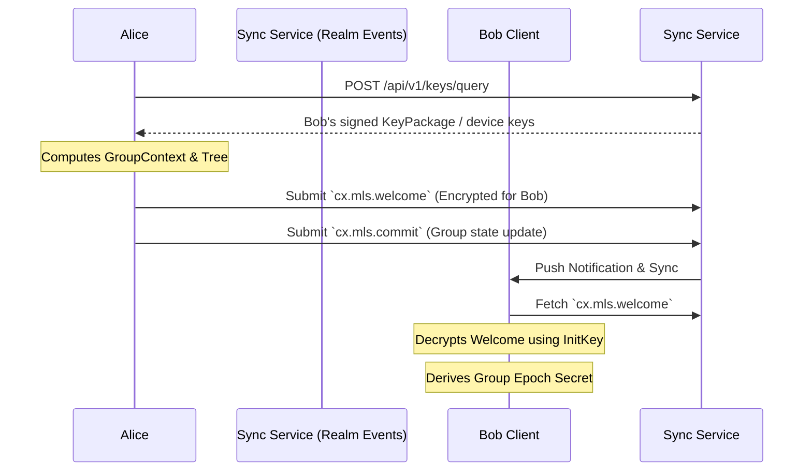
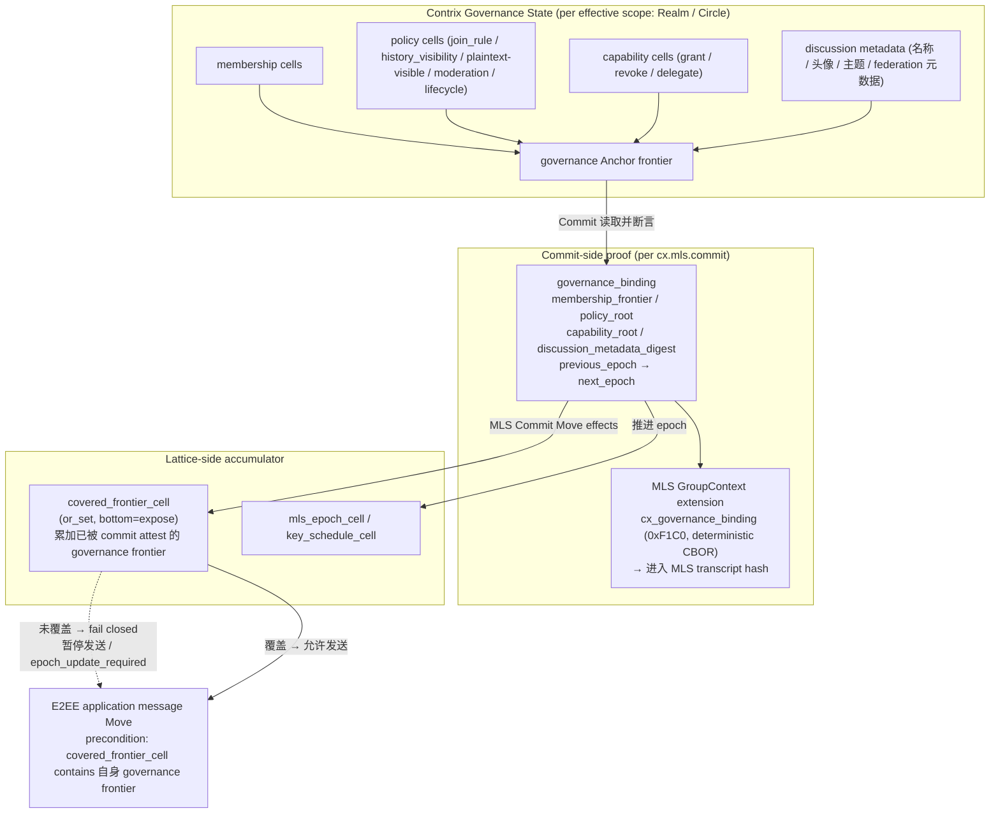

## 1. 目标

去中心化协作协议面临着复杂的隐私与合规矛盾：一方面，商业数据和私密频道必须提供不可被 Sync Service 或未授权受托服务窃听的端到端加密 (E2EE)；另一方面，在特定组织边界内，数据流又需要受到法律或合规层面的安全审查。

本规范定义了 Contrix 官方推荐的加密标准，旨在实现：
- 基于 **MLS (RFC 9420)** 的高效大规模协作加密
- 强前向安全 (Forward Secrecy) 与后向安全 (Post-Compromise Security)
- **可审查加密 (Auditable E2EE)**，在 TEE / HSM / 等价受控执行 profile 下把合规解密绑定到可验证审计记录；在 software-only profile 下提供透明审计流程，但不声称具备同等密码学强制力。

## 2. 基础加密架构：MLS 与 Contrix 的融合

Contrix 采用 [RFC 9420 - Message Layer Security (MLS)](https://datatracker.ietf.org/doc/html/rfc9420) 作为官方的群组加密标准。
不推荐使用传统的 Double Ratchet（双棘轮），因为在包含数十到数百名成员的 discussion track 或大型协作 Realm 中，双棘轮会导致巨大的性能开销与并发处理难题。

### 2.1 KeyPackage 与服务发现
在参与 MLS 加密前，用户必须公布自己的 `KeyPackage`。
- **发布位置**：Actor 通过 signed Event 发布自己的 `KeyPackage`，或者在其 DID Document 的 `service` 中指定独立的 `MLS Delivery Service` 节点入口。
- **生命周期验证**：其他客户端在拉取 `KeyPackage` 时，MUST 通过 Actor 的 DID Document 与 Event history 验证该包的公钥签名，确保未被身份盗用。

### 2.2 握手与组成员管理 (Welcome, Commit)
MLS 维护了一颗成员密钥树 (Ratchet Tree)。在 Contrix 中，群组的密钥状态变动不依赖于独立的中心化分发服务器，而是映射到原生的 `Realm` 与 Event 模型中：



- **`cx.mls.commit`**：当拥有权限的 Admin 邀请新成员加入或移除成员时，客户端计算 MLS 的 `Commit` 消息。该 `Commit` 必须作为 `cx.mls.commit` 类型的 Event 提交至 Realm Event history。它作为不可篡改的账本，确保全网节点对群组密钥状态树的演进达成一致。
- **`Welcome` 分发**：新成员会收到由 Admin 构造的 `Welcome` 消息。Welcome MUST 通过 durable `cx.mls.welcome` Event、durable encrypted pointer 或等价可 backfill 记录交付，直到被消费、撤销或过期。Sync Service 的 Ephemeral Channel 只能作为通知和加速通道，不得是唯一交付路径；否则离线设备、跨域 backfill 和恢复流程无法验证加入历史。

**Welcome 大小侧信道（acknowledged side channel）**：MLS Welcome / GroupInfo 的 ciphertext 长度会与 leaf 数量、ratchet tree 形态、path secret 数量和近期 churn 有相关性。Contrix v1 不声称第三方观察者无法从 Welcome 大小推断粗粒度成员变化。高隐私 Realm SHOULD 对 Welcome blob 使用 policy 声明的 padding bucket（例如按 4KiB / 16KiB 桶补齐）并批量投递 welcome pointer；实现不得在 minimal-metadata 或 high-confidentiality 文案中承诺“成员变化不可由消息大小观察”，除非部署 profile 额外声明并测试了 padding 策略。

#### 2.2.1 MLS Group Admin 推导

MLS group admin 不是“第一个发 Welcome 的客户端”或“track 的第一个成员”。Contrix v1 按当前 accepted auth state 确定管理集合：

- Realm-scoped MLS group 的默认 admin set 来自 `cx.realm.create.payload.object.initial_creators` / `created_by_principal`，以及当前有效的 `cx.realm.admin`、`cx.mls.commit`、`cx.mls.welcome` 或 Realm policy 声明的等价 E2EE admin capability。
- Realm 内的 [Circle](../models/circle.md)（`Flow.scope_ref` 指向的密码学子边界）的 MLS group admin set 由该 Circle 的 `cx.circle.create` / `cx.circle.member.state` / `cx.mls.commit` / `cx.mls.welcome` 等事件按 Circle 自身的 capability 与 membership 体系收敛，与 Realm-default MLS group admin set 独立；Circle key MUST NOT 从 Realm-default key 派生。
- Admin capability 可以通过普通 capability grant / revoke Move 转移或收回；转移生效点由 Anchor finality、Lattice value 和 revoke freshness 决定，不由 MLS leaf index、设备在线状态或本地 UI 角色决定。

发送 `cx.mls.proposal`、`cx.mls.commit` 或 `cx.mls.welcome` 的 actor 必须在其事件自己的 causal auth state 下属于上述 admin set，或满足该 event kind 允许的普通成员 update / self-update 规则。

### 2.3 载荷加密 (Application Data)
日常的 Message、Flow synthesis 或 Morph 内容负载在写入 Event 前，必须使用当前 MLS Epoch 的流密钥 (Application Key) 加密为密文信封。
- **可路由元数据分离**：密文信封 `encrypted_payload` 仅包裹实际的业务内容 (`body`, `content`, `attachments`)。
- **明文元数据保留**：用于网络路由和客户端本地 projection 的 `realm_id`, `type`, `causal_links`, `status`, `labels` 必须保持明文。
- Sync Service 可以依据明文元数据完成数据的转发、排序、过滤和去重，而完全无法窥探密文信封内的具体正文。客户端在解密后 MAY 建立本地搜索索引；受托 search / projection 服务只有在 `plaintext_visible_services` 授权下才能接收明文或可逆摘要。

#### 2.3.0 E2EE Profile：plaintext metadata 边界

v1 基线 E2EE profile 是 **body-only E2EE**，不得在 UI、营销材料或 service describe 中简称为“完整 E2EE”：`encrypted_payload` 加密 Message / Morph / Flow body 与 attachment，其余字段保持明文 wire schema。Space 与 Flow 的 `title`、`summary`、`rank`、`state`、`fields`（除明确标注 encrypted 的子字段外）、Flow `tracks` map 配置、Space `parent_ref` 等结构化 metadata 在未声明 minimal-metadata profile 时 **MUST** 以明文形式存在于 wire schema 中，即便所属 Realm 声明 `encryption_profile="mls_rfc9420"`。高隐私或 audited Realm 若要求 metadata 机密性，MUST 声明 minimal-metadata / encrypted-field profile，而不是仅依赖 body-only E2EE。

理由与影响：

- Space / Flow metadata 参与 routing、view projection、搜索、排序和 cross-realm ref；让 Sync Service 与服务端 reducer 能在不解密 body 的前提下计算 frontier、permission、ordering、notification gating。
- 这意味着 **E2EE Realm 中 Space / Flow 标题、摘要、状态等 metadata 对所有 Realm 成员（以及任何接收 wire bytes 的中继 / Sync Service）都是可见的**。希望避免标题泄漏敏感信息的部署 MUST 在客户端 UX 层提示用户 "title 不被 E2EE 覆盖"。
- 受托 search / projection 服务接收这些明文 metadata **不**需要 `plaintext_visible_services` 列入授权——它们本来就是 wire 明文；该 capability 仅约束 body / content / attachment 的解密结果与客户端本地索引产物。

**minimal-metadata E2EE profile** 是 v1 的可声明 profile；启用时标题 / 摘要 / 部分字段按 §2.7 的 rules 进入 `encrypted_metadata`，wire 上只保留 reducer 和路由必需的键。未声明该 profile 的 Realm 不得对 `title` / `summary` / `rank` / `state` / `tracks` 等字段进行 wire-level 加密替换。

Realm policy MUST 通过 `cx.realm.policy_components.metadata_encryption_profile` 显式声明 metadata 加密级别，取值为：

| profile | wire 明文 | encrypted_metadata | 说明 |
| --- | --- | --- | --- |
| `body_only` | routing / reducer / projection 所需 metadata；Space / Flow title、summary、state、rank、tracks 默认明文 | 无或仅 profile 特定字段 | v1 默认。不得宣传为完整 metadata E2EE。 |
| `minimal_encrypted` | `realm_id`、kind、epoch、routing hash、必要 cell subject、必要 causal refs | title、summary、部分 fields、mention/reply 摘要、client search tokens | 对应 minimal-metadata profile；服务端 projection 能力受限。 |
| `full_encrypted` | 仅 envelope routing、policy-required subject、hash、opaque refs | 绝大多数用户可读 metadata 与可逆索引材料 | extension profile；需要客户端本地 projection 或受信 plaintext-visible service。 |

`metadata_encryption_profile` 必须纳入 MLS governance binding `policy_root`。客户端 / 服务端不得仅通过 `encryption_profile="mls_rfc9420"` 推断 metadata 处理方式；缺省即 `body_only`。

#### 2.3.1 Envelope Wire 结构

加密信封的 wire 形态是 [`artifacts/schemas/encrypted-envelope.schema.json`](../../artifacts/schemas/encrypted-envelope.schema.json) 的 canonical 表达。最小示例：

```json
{
  "envelope": {
    "scheme": "mls-rfc9420",
    "version": "1.0",
    "group_id": "base64url",
    "epoch": 12,
    "content_type": "application/json",
    "ciphertext": "base64url",
    "aad_visibility_event_id": "routing_digest",
    "aad": {
      "realm_id": "cx:realm:0196419b-0000-7000-8000-000000000000",
      "event_kind": "cx.message.create",
      "event_ref_digest": "sha256:..."
    },
    "key_ref": {
      "algorithm": "MLS",
      "group_state_ref": "cx:event:01964148-0000-7000-8000-000000000000"
    },
    "payload_digest": "sha256:...",
    "aad_digest": "sha256:..."
  }
}
```

字段约束：

| 字段 | 类型 | 必需 | 说明 |
|------|------|------|------|
| `scheme` | string | 是 | 加密方案标识符 |
| `version` | string | 是 | 方案版本 |
| `group_id` | base64url | 是 | MLS 群组 ID |
| `epoch` | integer | 是 | MLS epoch 编号 |
| `content_type` | string | 是 | 解密后内容的 MIME 类型 |
| `ciphertext` | base64url | 是 | `mls-rfc9420` profile 为 MLS PrivateMessage / application message 序列化字节。 |
| `authentication_tag` | base64url | 条件 | 仅 raw AEAD / exporter-AEAD profile 使用；MLS profile 的 tag 已在 MLS message 内，不重复拆出。 |
| `aad_visibility_event_id` | enum(hidden, routing_digest, opaque_id) | 是 | `aad.event_id` / `aad.event_ref_digest` 的 schema discriminator；receiver 必须按该值校验 AAD 字段集合。 |
| `aad` | object | 是 | 路由元数据；明文但被 AEAD 认证。 |
| `aad.realm_id` | id:realm | 是 | 路由与授权的 Realm。 |
| `aad.event_kind` | string | 是 | 路由 event kind。 |
| `aad.event_id` | id:event | 条件 | `aad_visibility_event_id="opaque_id"` 时必填。 |
| `aad.event_ref_digest` | hash | 条件 | `aad_visibility_event_id="routing_digest"` 时必填；hash 输入由 profile 固定（推荐 `sha256("cx-aad-event-ref-v1" \|\| event_id \|\| realm_id \|\| policy_nonce)`）。 |
| `aad.causal_refs` | array | 条件 | 可见因果依赖；高隐私 profile 可改用 `causal_ref_digests`。 |
| `aad.causal_ref_digests` | array&lt;hash&gt; | 条件 | `aad_visibility.causal_refs="routing_digest"` 时使用。 |
| `key_ref.algorithm` | string | 条件 | `mls-rfc9420` profile 为 `MLS`；其他 profile 必须注册自己的值。 |
| `key_ref.group_state_ref` | id:event 或 hash | 是 | 指向 accepted `cx.mls.genesis` / winning `cx.mls.commit` event / 等价 group state proof；用于加速 lookup，不替代 MLS transcript 验证。 |
| `payload_digest` | hash | 是 | `sha256(payload_metadata_bytes \|\| encrypted_payload_bytes)`；输入定义见 §2.3.3。 |
| `aad_digest` | hash | 是 | canonical AAD 的 SHA-256。 |
| `cleartext_commitment` | hash | 否 (预留位) | v1 E2EE producer **MUST NOT emit** 裸明文哈希；receiver MAY ignore。低熵 plaintext 会被离线字典攻击。需要明文承诺时必须使用带 profile 的 keyed / salted 机制，例如 [`../governance/content-moderation.md`](../governance/content-moderation.md) §3.4.2 的 sender commitment。 |

Ratchet tree MUST 由 `cx.mls.genesis`、Welcome、Commit 或 group state proof 管理，不得在每条消息的 envelope 中重复传输。

#### 2.3.2 AAD 可见性 Profile 与 canonical 序列化

AAD 字段集合受 Realm 的 `aad_visibility` policy 约束。隐私优先 Realm SHOULD 只保留路由所需的 `realm_id`、event kind、epoch 和不可逆 routing hash；需要跨 provider 投递确认的 Realm MAY 暴露 opaque `event_id` / `message_id`，但该选择 MUST 在 Realm policy 中声明并纳入 MLS-bound `policy_root`。

`aad_visibility_event_id` 是 schema discriminator，控制 `aad.event_id` 与 `aad.event_ref_digest`：

- `opaque_id`：AAD MUST 包含 `event_id` 且不得包含 `event_ref_digest`，用于跨 provider 投递确认和精确去重。
- `routing_digest`：AAD MUST 使用 `event_ref_digest`，不得暴露稳定 `event_id`。
- `hidden`：AAD MUST 同时省略 `event_id` 与 `event_ref_digest`；去重只能依赖外层 Event Envelope、transport receipt 或 receiver-local cache。

AAD 在计算 `aad_digest` 前必须序列化为规范 JSON：

```json
{
  "realm_id": "cx:realm:0196419b-0000-7000-8000-000000000000",
  "event_kind": "cx.message.create",
  "event_ref_digest": "sha256:0123456789abcdef0123456789abcdef0123456789abcdef0123456789abcdef",
  "causal_refs": ["cx:event:019640ed-0000-7000-8000-000000000000"]
}
```

规则：

- 键按字典序排序
- 无多余空白
- 无尾随逗号
- 字符串使用 UTF-8 编码

#### 2.3.3 `payload_digest` 计算

`payload_digest` 的输入必须完全确定，不得使用实现本地对象序列化结果。

1. `aad_bytes = canonical_json(aad)`，`aad_digest = sha256(aad_bytes)`。
2. `payload_metadata` 是以下对象的 canonical JSON，字段缺失时不得写入 null：

```json
{
  "scheme": "mls-rfc9420",
  "version": "1.0",
  "group_id": "base64url",
  "epoch": 12,
  "content_type": "application/json",
  "aad_visibility_event_id": "routing_digest",
  "aad": {
    "realm_id": "cx:realm:0196419b-0000-7000-8000-000000000000",
    "event_kind": "cx.message.create",
    "event_ref_digest": "sha256:..."
  },
  "key_ref": {
    "algorithm": "MLS",
    "group_state_ref": "cx:event:01964148-0000-7000-8000-000000000000"
  }
}
```

3. `payload_metadata_bytes = canonical_json(payload_metadata)`。
4. `encrypted_payload_bytes = base64url_decode(ciphertext)`；若 envelope 含 `authentication_tag`，追加 `base64url_decode(authentication_tag)`。
5. `payload_digest = "sha256:" + sha256(payload_metadata_bytes || encrypted_payload_bytes)`。

`mls-rfc9420` profile 中，MLS PrivateMessage 本身还必须把 `aad_bytes` 作为 MLS authenticated data 或 profile 声明的等价 authenticated input；`payload_digest` 是 Contrix envelope 的外层完整性检查，不替代 MLS AEAD。

#### 2.3.4 解密错误处理

| 错误 | 原因 | 响应 |
|------|------|------|
| `aad_digest_mismatch` | AAD 被篡改 | 拒绝整个事件 |
| `payload_digest_mismatch` | 密文损坏 | 拒绝整个事件 |
| `key_unavailable` | 缺少 epoch | 标记为 `decryption_pending`，按 `client-sync.md` 的 timeout / recovery 规则恢复 |
| `epoch_mismatch` | 错误的密钥 epoch | 回溯或获取 epoch；无法在 timeout 内恢复时标记 `decryption_failed` |
| `group_removed` | 不再是成员 | fail closed；不得向未授权成员请求密钥 |

`decryption_pending` 是有界恢复状态，不是永久展示状态。默认 timeout 为 7 天；超时后客户端 MUST 降级为 metadata-only `decryption_failed` 占位。连续 epoch 缺口过大时，客户端 SHOULD 使用 range-based recovery，从授权 peer、key backup、Archive Node 或 policy 声明的 Key Recovery Service 获取最小必要 epoch material。

#### 2.3.5 Late Key Recovery 状态机（normative）

客户端 MAY 在 `decryption_failed` 之后接收到迟到的 key material（来自 key backup 同步、device 重新加入、Archive Node 回灌、history key share 等）。该 late material 重新解码受限历史的流程是受控状态机，**不是**静默解锁：

| 起始状态 | 触发 | 目标状态 | 客户端 / 审计行为 |
| --- | --- | --- | --- |
| `decryption_pending` | 在 timeout 内收到 key | `decrypted` | 正常解码，无额外 marker。 |
| `decryption_pending` | timeout（默认 7 天） | `decryption_failed` | UI 标 metadata-only；不可恢复直到收到 late key。 |
| `decryption_failed` | 收到 late key 且通过 (a)-(d) 校验 | `late_recovered` | UI MUST 显示 "历史内容已晚到解锁，原首次接收时刻 T₀" timeline marker（不静默替换 metadata-only 占位）；audit profile 下 MUST emit `cx.audit.accessed`，payload `access_kind="e2ee_late_recovery"` 且 `late_recovery_original_event_id` 指向原加密 Event；history key share scope MUST 与 receiver 当时的 membership scope 一致。 |
| `decryption_failed` | 收到 late key 但 (a)-(d) 任一不过 | 保持 `decryption_failed` | 不解码、不显示明文；记 audit log。 |
| `late_recovered` | 后续 redaction / erasure 触发 | `redacted_after_recovery` | 已恢复明文 MUST 按 redaction policy 移除；wire stub 保留。 |

late key recovery 接受条件（normative）— 客户端 MUST 全部通过才能从 `failed` 转 `late_recovered`。本节的 T₀ 是目标 event 在 accepted Anchor history 中的 deterministic effective pre-state：对 single-leaf Anchor 使用该 event 所属 Anchor 的 pre-state；对 `open_set` / multi-leaf view 使用 [`event-auth-state-resolution.md`](../authz/event-auth-state-resolution.md) 定义的 deterministic effective anchor view。T₀ MUST NOT 由客户端本地到达顺序、wall clock 或未锚定 pending Move 决定。

a. **Membership 时点校验**：受影响 event 的 T₀，receiver 在 T₀ 必须确实是该 Realm 的成员（`cx.member.state` 在 T₀ pre-state 下为 join，且不是 ban / leave）。如果 receiver 在 T₀ 不是成员、或当时还未被 invite，late key 解码出的明文 MUST NOT 进入 verified timeline；audit log emit `late_recovery_rejected_membership`。
b. **Policy 时点校验**：T₀ 处的 Realm policy MUST 允许该 receiver 类别看到该 event（history visibility / disclosure policy 在 T₀ 处）；若 policy 在 T₀ 之后收紧到禁止该 receiver，late material 仍按 T₀ policy 解码（policy 不溯及既往），但 UI MUST 提示"已不在当前 policy 下可见"。
c. **Key share 来源授权**：late key 提供方 MUST 是 Realm policy 声明的合法 key recovery 源（key backup、archive node、authorized peer）；P2P 之间随意 share key MUST 被拒。
d. **Audit profile 强制**：`cx.profile.attested_audit.e2ee.v1` / `cx.profile.disclosed_audit.e2ee.v1` 下，late_recovered transition MUST 同步 emit `cx.audit.accessed` Event（payload `access_kind="e2ee_late_recovery"`、`late_recovery_original_event_id=<原 event_id>`、当前 receiver actor），并等待 RYW receipt 与正常解码相同的流程；未拿到 receipt MUST 不解码。`cx.audit.ryw_receipt` 在 receipt object 上 MAY 标 `recovery_reason_code` = "late_key_arrival"（payload 取值，**不是** error code registry 中的 reason_code；仅用于 audit projection 区分晚到 key 触发的访问与首次访问）。

**Revoked / removed actor 负向**：若 receiver 在 T₀ 已不是成员，或 late key share 的签发时刻该 receiver 已被 ban / removed 且 key source 未重新执行 T₀ 校验，则 late key MUST NOT 进入 verified timeline。T₀ 之后发生的 ban / remove 不自动追溯撤销其在 T₀ 合法可见的历史，但 key backup / archive node / peer share 在发送 late material 前 MUST 重新执行 T₀ membership + policy 校验，并确认当前 share policy 仍允许向该 device 交付；否则必须拒绝并写 `late_recovery_rejected_membership` 或 `late_recovery_share_not_authorized`。`cx.vector.late_key_recovery.removed_actor.v1` 覆盖：(a) receiver 在 T₀ 不可见时不解密；(b) key source 在 ban 后未重新校验时拒绝 share；(c) 客户端 UI 不显示未授权明文。

#### 2.3.6 与 redaction / erasure 的关系

late_recovered 状态的明文 MUST 受后续 redaction / erasure 影响：若在 recovery 之后该 event 被 `cx.redaction` 或硬擦除，receiver MUST 立即移除已显示的明文并转入 `redacted_after_recovery` 状态。已 emit 的 `cx.audit.accessed` late_recovery marker 保留作为审计轨迹（即使内容已 redact，访问事实仍然可审计）。

### 2.4 Sync 与 MLS Epoch

Client Sync 中的事件顺序不保证密钥材料已经同步完成。加密事件和 MLS epoch state MUST 作为相关但可独立到达的 stream 处理：

- encrypted event 可以先进入 raw event cache 和 timeline position。
- `cx.mls.*` state event / MLS Commit 决定客户端是否拥有对应 epoch 的解密状态。
- 客户端缺少 epoch 时 MUST 标记 `decryption_pending`，不得静默丢弃或重排事件。
- backfill 历史事件时，客户端 SHOULD 同步对应 epoch 区间的 MLS state，而不是逐条向成员请求密钥。
- 被移除成员不得获取移除后 epoch 的 group secret；客户端必须 fail closed。

服务端和 Sync Service 不需要解密正文，但必须保留明文 routing metadata、epoch reference、hash 和 causal refs，以便客户端后续补齐密钥后重试解密。

#### 2.4.1 Membership 与 Epoch 不一致窗口

Membership state 与 MLS epoch 推进是异步事件，但可见性规则必须确定：

- 会影响 E2EE 可见性的 `cx.member.state`（Realm-level）或 `cx.circle.member.state`（Circle-level）accepted 后（track 不携带独立 membership；Realm 内的密码学子边界由 [Circle](../models/circle.md) 通过 `Flow.scope_ref` 表达，并由 `cx.circle.member.state` 管理 Circle 成员），相应 encryption scope（Realm-default 或 Circle）进入 `epoch_update_required`，直到有 winning `cx.mls.commit` 的 `governance_binding.membership_frontier` 覆盖该 membership frontier。
- 新加入成员在 Welcome / Commit 被接受并成功处理前，只能看到 policy 允许的 stripped metadata、邀请信息或 `decryption_pending` 占位；不得看到加入前后正文，除非 history sharing policy 和 key share event 明确授权。
- 被移除、ban 或离开的成员在对应 membership frontier 之后不得接收新 epoch 的 Welcome、group secret 或 history key share。若客户端仍收到使用旧 epoch 加密的新正文，必须标记 `state_mismatch` 或拒绝解密结果进入 verified timeline。
- 发送客户端在发现 `epoch_update_required` 后 **MUST** 暂停该 scope 的新 application messages 并标记 `encryption_transition_pending`,直到 effective epoch 的 `covered_frontier_cell` 覆盖最新 governance Anchor frontier。该规则适用于所有声明 `encryption_profile="mls_rfc9420"` 的 Realm,无论 `security_class`——忽略 governance frontier 的发送会让 ban / revoke 在新消息上失效,正是引入 MLS Governance Binding 要消除的风险。

  **`mls_send_pause="advisory"` 降级规则**:把上述 MUST 暂停降级为 SHOULD 的能力**仅在显式 degraded profile** `cx.profile.e2ee_relaxed.v1` 下允许声明,不得在默认 `cx.profile.mls_governance_binding.full.v1` profile 或任何声称"完整 MLS Governance Binding"的部署中使用。该字段在符合资格的部署中也 MUST:
  
  - 出现在 `cx.realm.policy_components` 的明文 audit log 中(声明本身被记录,便于审计)
  - 部署 profile 在 conformance 声明中**显式列出** `cx.profile.e2ee_relaxed.v1`,否则降级声明 MUST 被 reducer 拒绝(`profile_unsupported` reason)
  - 客户端 UI 在该 Realm 中 MUST 展示明确的"该 Realm 使用降级 E2EE,踢/ban 非密码学即时生效"banner-level 警示(详见 §2.4.2 / `cx.profile.e2ee_relaxed.v1` 规范)
  - 接收端在解密 advisory 模式下旧 epoch 消息时 MUST 检查 receive_at vs membership_change_at 时间窗,超过部署声明 `relaxed_window_max_ms` 时拒绝解密结果进入 verified timeline
  - **`relaxed_window_max_ms` 硬上限 = 300,000 ms（5 分钟）**：部署不得通过 `cx.realm.policy_components` 把 `relaxed_window_max_ms` 写为大于硬上限的值；reducer MUST 用 `relaxed_window_exceeds_ceiling` 拒绝。接收端 MUST 独立 enforce 硬上限——不得静默 clamp 到 300000，否则部署声明的窗口与 receiver 接受的窗口会跨实现分裂。Negative vector `cx.vector.e2ee_relaxed.window_exceeds_ceiling.v1` 同时覆盖 policy write 超限与 receiver 接受超限 decrypt 两条路径。
  - **合规 profile 互斥**：声明 `cx.profile.attested_audit.e2ee.v1` / `cx.profile.disclosed_audit.e2ee.v1` 或 `audit_assurance >= disclosed_policy` 的部署 MUST NOT 同时启用 `cx.profile.e2ee_relaxed.v1`；reducer MUST 用 `e2ee_relaxed_disallowed_in_compliance_profile` 拒绝。合规 / 监管 profile 的核心承诺是"踢出即时密码学生效"，relaxed 窗口与之矛盾。
  - **Federation guard**：`cx.profile.e2ee_relaxed.v1` MUST NOT 与 `federation_policy="open"` 或 `"quarantine"` 同时启用；reducer MUST 用 `e2ee_relaxed_federation_policy_unsupported` 拒绝。`federation_policy="restricted"` 只允许在 Realm policy 同时声明 `relaxed_fanout_deadline_ms <= relaxed_window_max_ms`、`max_federation_delivery_delay_ms <= relaxed_window_max_ms` 且 federation peers 在 `cx.server.describe.limits` 中公开不超过该 deadline 的 fanout SLA 时启用；否则 MUST fail closed。`federation_policy="closed"` 不需要额外 federation guard。
  
  声明 advisory 但未声明 `cx.profile.e2ee_relaxed.v1` profile 的 Realm create / policy update event MUST 被 reducer 拒绝。详见 §2.4.2 与 [`conformance-profiles.json`](../../artifacts/profiles/conformance-profiles.json)。
- Realm / reducer profile MUST 声明 `max_mls_commit_delay_ms`。交互式 profile 默认 SHOULD 不超过 30,000 ms；超过后客户端 MUST 将该 scope 降级为 read-only / send blocked，服务端 SHOULD 返回 `epoch_update_required` 或 `temporarily_unavailable`。
- 网络分区期间可以继续 backfill 旧 epoch 历史，但不得把旧 epoch 下的新消息展示为已满足最新 membership policy 的消息。

该窗口规则不改变 MLS Proposal / Commit 两阶段语义；它只定义 Contrix 在 state 已变化但 epoch 尚未收敛时的 UI、发送和解密处理。

### 2.4.2 `cx.profile.e2ee_relaxed.v1`(降级 profile)

**目的**:某些低延迟交互场景(实时音视频会议、协同光标 / 多人编辑、游戏内聊天等)不能容忍 MLS commit 完成才允许发新消息的等待开销(典型延迟 200ms-数秒)。`cx.profile.e2ee_relaxed.v1` 是为这些场景保留的**显式降级 profile**:允许 `mls_send_pause="advisory"`,代价是放弃"踢人/ban 后被踢者立即不能解密新消息"的密码学硬承诺。

**适用判断**:
- 实时交互延迟要求 < 1s 且业务可接受"踢出后窗口内被踢者仍可读 1-2 条消息"的场景 ✅ 适用
- 普通群聊 / 协作文档 / 项目讨论(踢人语义需要密码学强保证) ❌ 不适用,继续用默认 `cx.profile.mls_governance_binding.full.v1`
- 合规 / 法律 / 监管要求"立即生效"撤销 ❌ 强制不适用,部署 MUST 拒绝

**Profile 行为差异**:

| 维度 | 默认 (`mls_governance_binding.full.v1`) | 降级 (`e2ee_relaxed.v1`) |
| --- | --- | --- |
| `mls_send_pause` 默认 | MUST 暂停直到 covered_frontier_cell 覆盖 | 允许声明 `"advisory"`,降为 SHOULD |
| `covered_frontier_cell` 覆盖检查 | reducer/客户端 MUST enforce | 仍然写入但 send-side 不阻塞 |
| 被踢者继续解密窗口 | ≤ MLS commit roundtrip(密码学保证) | ≤ `relaxed_window_max_ms`(默认 30s,部署声明) |
| 接收端 verified timeline 检查 | epoch 不匹配 → 拒绝 | epoch 不匹配且超出 `relaxed_window_max_ms` → 拒绝 |
| UI 警示 | 无 | **MUST 显示 banner**:"该 Realm 使用降级 E2EE,踢/ban 非密码学即时生效;旧成员可能继续解密最近一小段消息" |
| Server describe `supported_features` | `cx.feature.mls_governance_binding.full.v1` | `cx.feature.e2ee_relaxed.v1`(互斥;**MUST NOT** 同时声明 full + relaxed) |
| 在合规 / 监管语境下 | 满足"成员踢出即时生效" | 不满足,SHOULD 走非 E2EE 或专用 enclave 通道 |

**强制约束**:

- Realm 在 create event 或 `cx.realm.policy_components` 中声明 `mls_send_pause="advisory"` 时,**MUST** 同时声明 `cx.profile.e2ee_relaxed.v1` profile 适配。reducer 检测到 advisory 但 Realm `supported_profiles` 不含 `e2ee_relaxed.v1` → MUST reject(`profile_unsupported`,详细 reason `mls_send_pause_advisory_requires_e2ee_relaxed_profile`)
- 声明本 profile 的 Realm **MUST NOT** 同时声明 `cx.profile.mls_governance_binding.full.v1`(互斥)。reducer 检测同时声明 → MUST reject(`conflicting_e2ee_profiles`)
- 声明本 profile 的 Realm 若同时声明 federation，MUST 满足 §2.4.1 的 Federation guard。open / quarantine federation 直接拒绝；restricted federation 必须证明 fanout deadline 不超过 relaxed window。
- 客户端实现 **MUST**:
  - 在该 Realm 的对话 UI 上展示 banner-level 警示(不可被用户永久 dismiss,可临时折叠)
  - 在用户邀请新成员时弹窗提示"该 Realm 使用降级 E2EE",让用户知情决策
  - 在 sync metadata 中标记该 Realm 为 `e2ee_relaxed=true`,导出 / 备份 / 跨设备时保留该标记
- 服务端 `cx.server.describe.supported_features` **MUST** 列出 `cx.feature.e2ee_relaxed.v1` 才能接受该 profile 的 Realm 写入

**禁止扩展**:本 profile 不允许进一步降级到"不 enforce `covered_frontier_cell` 写入" / "允许跨 epoch 解密无窗口限制"。降级到此为止;更宽松场景应当退回到**非 E2EE** Realm(`encryption_profile="none"`)而不是继续放宽 E2EE 承诺。

### 2.5 MLS Governance Binding

**MLS Governance Binding** 是 Contrix v1 把 **MLS epoch 与 governance state（membership / policy / capability / Anchor frontier）强绑定** 的机制，相对于 Matrix 把 Olm/Megolm 与 room state 当作两条并行轨而言，它是 v1 的核心新增层。该机制由两个 wire-level artifact 组成，分工固定：

| 层 | 名称（wire-level） | 角色 |
|---|---|---|
| **Commit-side proof** | `governance_binding`（GroupContext extension `cx_governance_binding`，定义见 §2.5.1，CBOR 编码见 §2.5.3） | 每个 `cx.mls.commit` 携带的 binding payload，把本次 epoch 推进所**断言覆盖**的 governance roots（`membership_frontier` / `policy_root` / `capability_root` / `discussion_metadata_digest`）哈希进 MLS transcript |
| **Lattice-side accumulator** | `covered_frontier_cell`（cell family `cx.component.covered_frontier.v1`，or_set，bottom=expose，见 §2.5.2） | MLS Commit Move 的 effect cell，**累计**已被 commit attest 的 governance Anchor frontier；E2EE message Move 用 `contains` precondition gate 自身依赖的 governance frontier |

两层缺一不可：`governance_binding` 提供 per-commit 的不可伪造证据并由 MLS transcript hash 覆盖，`covered_frontier_cell` 沉淀 reducer 可查询的累计状态供 message Move precondition 引用。

下图把两层结构和 application message 如何被 gate 画在一起：



读图要点：

- 撤销 / ban / device revoke / policy 收紧只在 governance state 里 accepted **不够**——必须有后续 `cx.mls.commit` 把对应 governance frontier 写进 `covered_frontier_cell`，新 application message 才会被 gate 阻止使用旧 epoch key。
- Governance / recovery Move 不依赖 `covered_frontier_cell`，因此 MLS epoch 卡住时仍可提交修复 Move 并由 Anchor finalization 生效。
- 客户端验证 `governance_binding` 时无法回补 inclusion proof 或 hash 不匹配 → epoch 标记 `decryption_pending` / `state_mismatch`，禁用该 epoch 解密新正文。

MLS 不应只保护正文，也必须帮助成员发现服务端是否向不同客户端展示了不同的成员、策略或 discussion 元数据 —— 这是引入 MLS Governance Binding 的根本动机。撤销、ban、device revoke 和 policy 收紧不能只在应用层 accepted；它们必须被 MLS epoch / key schedule 覆盖后才能影响新消息解密能力。

MLS group 的 scope 绑定到 tagged `effective_scope`：`{kind:"realm", realm_id}` 时 group 覆盖 Realm-default scope（Realm 自身使用 `encryption_profile="mls_rfc9420"`）；`{kind:"circle", realm_id, circle_id}` 时该 [Circle](../models/circle.md) 拥有独立 MLS group，与 Realm-default group 完全独立，且 Circle key MUST NOT 从 Realm-default key 派生。两个 group 通过 `(realm_id, circle_id?)` 复合 scope 区分，不再依赖 track-scoped fallback 或跨 Realm linked-Realm 模型。

#### 2.5.1 Governance Binding Payload (`governance_binding`)

每个 `cx.mls.commit` MUST 绑定一个 `governance_binding`，并把该引用纳入 MLS transcript 或等价的 commit-authenticated data：

```json
{
  "governance_binding": {
    "binding_version": 1,
    "encoding_profile": "cbor-deterministic-rfc8949-v1",
    "realm_id": "cx:realm:0196419b-0000-7000-8000-000000000000",
    "mls_group_id": "base64url...",
    "previous_epoch": 41,
    "next_epoch": 42,
    "membership_frontier": ["cx:event:8ea2dd8c-c436-7b94-9000-000000000000"],
    "policy_root": "sha256:canonical_state_policy_root",
    "capability_root": "sha256:effective_capability_root",
    "discussion_metadata_digest": "sha256:canonical_discussion_metadata",
    "binding_profile": "cx.profile.mls_governance_binding.full.v1",
    "reducer_profile": "cx.reducer.v1"
  }
}
```

当 MLS group 绑定到 Flow discussion track 时，`governance_binding` MUST 同时覆盖 `flow_id` 与 `track="discussion"`，并以 Realm membership、history visibility、policy state 和 `allowed_tracks` action scope 作为验证边界。`allowed_tracks` 只缩小已授权动作的 track 范围，不授予独立 track-level ACL。

**E2EE Realm MUST 声明 `cx.profile.mls_governance_binding.full.v1`**：声明 `encryption_profile="mls_rfc9420"` 的 Realm 隐式继承该 profile（`cx.profile.e2ee_client.v1` 直接 `inherits` 它）。所有 `cx.mls.commit` MUST 携带 GroupContext extension 形态的 `governance_binding`；仅 transcript-authenticated 而无 GroupContext extension 的实现不符合 v1。

- `membership_frontier` MUST 覆盖本次 Commit 声称生效的成员、invite/leave/ban 和设备信任 cell。
- `binding_version` MUST 为 `1`；`encoding_profile` MUST 为 `cbor-deterministic-rfc8949-v1`。两者进入 GroupContext extension bytes、Event payload 和 `covered_frontier_cell` canonical value，接收方不得从 codepoint 或 profile id 隐式推断。
- `previous_epoch` / `next_epoch` MUST 同时出现在 `governance_binding` 与 `cx.mls.commit` payload 中；接收端 MUST 校验 `payload.base_epoch == governance_binding.previous_epoch` 且 `payload.next_epoch == governance_binding.next_epoch`。任一不一致时该 commit 不得推进 `mls_epoch_cell`。
- `policy_root` MUST 覆盖本次 Commit 依赖的 policy / join rule / history visibility / history sharing / media service / plaintext-visible service / moderation / lifecycle cell。
- `capability_root` MUST 覆盖本次 Commit 依赖的 grant / revoke / delegate / derived capability cell。
- `discussion_metadata_digest` 覆盖成员可见的 discussion 名称、头像、主题、公开标识和 provider/federation 元数据；不应包含只有服务端可见的私有索引状态。
- 客户端在接受 MLS epoch 前 MUST 独立验证 `governance_binding` 指向的 Contrix Anchor view 与 state_root。无法回补 Move/Anchor inclusion proof 或 hash 不匹配时 MUST 标记 epoch 为 `decryption_pending` 或 `state_mismatch`，不得继续用该 epoch 解密新正文。
- 并发 Commit 是并发 Move。它们只有被有效 Anchor frontier 覆盖、且其 preconditions 在 Anchor batch pre-state 下成立时，才能推进 `mls_epoch_cell`。

#### 2.5.2 Covered Frontier Cell (`covered_frontier_cell`)

`covered_frontier_cell`（cell family `cx.component.covered_frontier.v1`，or_set，bottom=expose）是 MLS Governance Binding 的 lattice 侧累加器。它声明 "本 MLS group 已由 commit attest 覆盖的 governance Anchor frontier 集合"；MLS Commit 被建模为 Move，读取 governance Anchor frontier，写入：

- `mls_epoch_cell`
- `key_schedule_cell`
- `covered_frontier_cell`（把本次 commit 的 `governance_binding` 所断言的 governance frontier 加入或-set）

规则：

- E2EE application message Move 的 preconditions MUST 证明 `covered_frontier_cell` `contains` 该消息依赖的 governance Anchor frontier。
- 客户端在 MLS Commit Move 滞后超过 `max_mls_commit_delay_ms`（默认 30,000 ms，见 §2.4.1）时 MUST 进入 `epoch_update_required`，并 MUST 暂停发送新 application messages，直到 `covered_frontier_cell` 覆盖最新 governance Anchor frontier。所有 `encryption_profile="mls_rfc9420"` 的 Realm 均适用，无论 `security_class`；仅低安全或开发 profile 的 Realm schema 可显式声明 `mls_send_pause="advisory"`（详见 §2.4.1）并降级为 SHOULD，audited / high-confidentiality / minimal-metadata Realm MUST NOT 使用该降级。
- 撤销与失效（如 ban、revoke）只有被 `covered_frontier_cell` 覆盖后，才能阻止后续 application messages 解密；旧 epoch 中已分发的 key material 仍可能被原持有者使用。
- Governance / recovery Move 不依赖 `covered_frontier_cell`，因此 MLS epoch 卡住时仍可提交修复 Move 并由 Anchor finalization 生效。

Move 在 Anchor 前是 pending；被 Anchor 后是否可用于 E2EE 由 `covered_frontier_cell` precondition 决定。

#### 2.5.3 GroupContext Extension 定义

Contrix 定义以下 MLS GroupContext extension 绑定形状；实际 codepoint 必须通过实现 profile、部署 profile 或未来 registry 协商，不能静默占用未声明的公共 codepoint。

| 字段 | 值 |
|------|-----|
| ExtensionType（IANA name） | `cx_governance_binding` |
| ExtensionType（数值 codepoint） | `0xF1C0` ∈ MLS GroupContext **private-use range `0xF000`–`0xFFFF`**（RFC 9420 §17.6 / IANA MLS registry）。**Contrix v1 wire 形态硬钉为 `0xF1C0`,任何实现 MUST 使用该 codepoint;deployment policy MUST NOT 用其他 codepoint 覆盖该 binding。** `cx.profile.mls_governance_binding.full.v1` MUST 使用 `0xF1C0`。未来若需要全网注册,可通过 IETF MLS extensions registry specification-required 流程申请 standard codepoint,并在新 hardening profile 中显式声明,作为单独的 wire 版本,而不是 v1 内的私有覆盖。 |
| ExtensionData | `governance_binding` 对象的 CBOR 编码 |

CBOR 编码 MUST 使用 deterministic canonical encoding (RFC 8949 Section 4.2)。字段顺序按 lexicographic key 排列：

```text
{
  "binding_profile":     tstr,
  "binding_version":     uint,    ; v1 = 1
  "capability_root":     bstr,    ; optional, full profile only
  "discussion_metadata_digest": bstr, ; optional, full profile only
  "encoding_profile":    tstr,    ; "cbor-deterministic-rfc8949-v1"
  "membership_frontier": [+ bstr],
  "mls_group_id":        bstr,
  "next_epoch":          uint,
  "policy_root":         bstr,
  "previous_epoch":      uint,
  "realm_id":            tstr,
  "reducer_profile":     tstr
}
```

**字段冗余说明（normative rationale）**：

| 字段 | 是否在 MLS GroupContext 已被绑定 | 保留理由 |
|------|------------------------------|---------|
| `binding_version` / `encoding_profile` | 否 | **必须**：把 codepoint 之外的 wire version 与 canonical encoding 锁入 signed bytes，避免未来 codepoint 或 CBOR profile 变化时不同实现对同一 governance binding 得出不同 canonical 形态。 |
| `mls_group_id` | 是（MLS group_id 是 GroupContext 的标准字段） | **保留**：让 binding payload 可离线独立审计——审计员只读取 governance_binding bytes 即可验证它属于哪个 MLS group，无需附带完整 commit envelope 或 GroupContext。 |
| `next_epoch` / `previous_epoch` | 是（MLS epoch 是 GroupContext 的标准字段） | **保留**：同上，为离线审计提供完整 epoch 上下文；同时让 `covered_frontier_cell` reducer 在不访问 MLS 库的情况下也能 join。 |
| `realm_id` | **否**（Contrix-specific，MLS 不知道 Realm 概念） | **必须**：realm_id 是把 MLS group 锚定到 Contrix governance state 的核心绑定；缺失则 governance_binding 可能被错误重绑定到不同 Realm 的 commit。 |
| `policy_root` / `capability_root` / `membership_frontier` / `discussion_metadata_digest` | 否 | **必须**：governance state 的核心证据，本规范的根本目的。 |
| `binding_profile` / `reducer_profile` | 否 | **必须**：profile id 决定接收方如何解释 root hash 与 frontier 集合；不能从 MLS transcript 推导。 |

简言之：MLS-redundant 字段（`mls_group_id` / `previous_epoch` / `next_epoch`）以约 ~50 字节的 wire 代价换取 binding payload 的离线自含性，这是有意识设计而不是 leftover；非冗余字段是 governance binding 真正承载的事实。Wire-size 进一步优化（如把 redundant 字段折叠成单个 commit_anchor hash）属于未来 hardening profile，不进入 v1 core。

**为什么禁止私有 codepoint 覆盖（normative rationale）**：允许 deployment 在 IANA 私用段内选择不同 codepoint（例如 `0xF1C1`）覆盖 `0xF1C0` 的路径在联邦边界 (federation Realm 跨 deployment) 上**无法静态 enforce**——两个独立合规的 deployment 各自合法选择不同 codepoint 后,接入同一 federation Realm 时, GroupContext extensions 中**任意一侧看不到对方的 extension**(因为 codepoint 不同)。MLS receiver 对未知 codepoint 的 extension 默认 ignore,因此 governance binding 会**静默退化为单边 binding**：本端按自己的 codepoint 解析+校验 + `confirmed_transcript_hash` 推进, 对端 binding 缺失但 epoch 仍前进 = 等价于 binding 被绕过。Receiver 没有可靠途径区分"对方使用了不同 codepoint(私有覆盖)"与"对方实现根本不携带 binding extension(降级 binding)"。

为关闭这条 federation 静默降级路径,v1 取消 deployment 私有覆盖。需要更换 codepoint 的部署 MUST 申请新 hardening profile（与对应 `mls_governance_binding.full.v<n>` 配套）并显式声明,使得"使用不同 codepoint"成为可观察的 wire 版本切换而非 codepoint-only 私有约定。

当 MLS group 绑定到 Flow discussion track 时，CBOR map MUST 包含额外键 `"flow_id"` (tstr) 和 `"track"` (tstr, 值为 `"discussion"`)。

规则：

- 声明 full binding profile 时，`cx_governance_binding` extension MUST 出现在每次 `cx.mls.commit` 对应的 GroupContext `extensions` 字段中。
- `confirmed_transcript_hash` 的计算覆盖包含该 extension 的 GroupContext，从而将 Contrix 应用状态绑定到 MLS transcript。
- 若底层 MLS 库暂不支持 GroupContext extension，base E2EE profile MUST 至少把 `governance_binding` 放入签名 Event 和 Commit transcript hash 可验证覆盖的字段中，并在实现文档中声明降级原因；不得声称支持 full binding profile。
- 接收方验证 Commit 时 MUST 解码 `cx_governance_binding` extension 并执行 section 2.5 中的 `governance_binding` 验证规则。

### 2.6 KeyPackage Claim 生命周期

KeyPackage 不应被建模为可无限次公开拉取的静态材料。E2EE 实现 MUST 将 MLS KeyPackage 作为可声明、可领取、可消费、可撤销的单次使用材料。

> **Contrix 扩展说明**：RFC 9420 Section 10.1 将 KeyPackage 定义为全局单次使用材料（一个 KeyPackage 对应一次 Welcome）。Contrix 的 claim 模型在此基础上增加了 `intended_realm_id` 绑定和 Realm-scoped claim，要求 MLS Delivery Service 跟踪 Realm affinity。这是 Contrix 的有意扩展，理由是：(a) 去中心化环境中没有中心化 Delivery Service 来全局追踪 KeyPackage 消费状态；(b) Realm-scoped claim 使客户端可以控制自己被邀请进入哪些 Realm，而非被动接受任何 Welcome；(c) claim 绑定使审计链可追溯某个 KeyPackage 被哪个 Realm 消费。实现若使用标准 MLS 库（不支持 Realm-scoped claim），MUST 至少在 Contrix 协议层维护 claim 映射表，并在 Welcome 发送/接收时执行 claim 验证。

KeyPackage lifecycle：

```text
published -> claimed -> consumed
          -> expired
          -> revoked
```

推荐记录：

```json
{
  "kind": "cx.mls.keypackage",
  "keypackage_id": "cx:mls:kp:01JS...",
  "principal_id": "did:web:alice.example.com",
  "device_id": "cx:device:01964137-0000-7000-8000-000000000000",
  "keypackage_ref": "sha256:...",
  "keypackage_digest": "sha256:canonical_keypackage_bytes",
  "cipher_suites": ["MLS_128_DHKEMX25519_AES128GCM_SHA256_Ed25519"],
  "capabilities": ["mimi.content.v1", "cx.content.v1"],
  "state": "published",
  "created_at": "2026-04-30T00:00:00Z",
  "expires_at": "2026-05-07T00:00:00Z",
  "device_signature": "base64url..."
}
```

Claim 请求 MUST 绑定：

- requester principal / service DID 和 device proof。
- intended `realm_id` 或 `mls_group_id`。
- required capabilities / content profiles / cipher suites。
- 是否允许 minimal-metadata pseudonymous credential。
- claim nonce、过期时间和目标 Welcome 路由服务。

Claim 成功后：

- KeyPackage MUST 进入 `claimed`，并绑定 `claim_id`、requester、intended Realm、capability set、`keypackage_digest = canonical_digest(KeyPackage bytes)`、`capabilities_digest = sha256(JCS(claimed_capabilities))`、当前 accepted cross-signing `ssk_generation` 和 expiry。
- 同一 KeyPackage 不得被第二个 Realm / MLS group、第二个 requester 或第二次 Welcome 重复使用。
- Welcome 发送方 MUST 引用 `keypackage_ref` / `keypackage_digest` / `claim_id`，并在 `cx.mls.welcome.payload.claim_ref` 中携带 `{claim_id, keypackage_ref, keypackage_digest, capabilities_digest, ssk_generation}`；该 `claim_ref` MUST 进入 `governance_binding` transcript 或等价 Welcome AAD。接收端在解密 Welcome 前 MUST 校验：`claim_ref.claim_id` / `claim_ref.keypackage_ref` / `claim_ref.keypackage_digest` 与顶层字段一致，`claim_ref.keypackage_digest` 等于已发布 `cx.mls.keypackage.payload.keypackage_digest` 或重新获取 KeyPackage canonical bytes 后得到的 hash，`capabilities_digest == sha256(JCS(claimed_capabilities))`，`claim_ref.ssk_generation` 等于接收端当前 accepted `cx.cross_signing.publish.generation`，且本次 Welcome 要求的 capability / content profile 集合是 `claimed_capabilities` 的子集；否则 fail closed，KeyPackage hash 或 capability 不匹配返回 `welcome_capability_mismatch`，generation 不匹配返回 `claim_generation_mismatch`。
- 成功处理 Welcome 后，接收端或服务端状态 SHOULD 标记该 KeyPackage 为 `consumed`。若 Welcome 失败或过期，KeyPackage 不得自动回到 `published`；设备 SHOULD 发布新的 KeyPackage。
- 服务端返回 KeyPackage 时 MUST 附带 device signature、principal binding 和 revocation status。客户端 MUST 通过 DID control chain 与 device trust chain 验证后才能加密。

#### 2.6.1 Welcome `claim_envelope` 签名（normative）

KeyPackage `device_signature`(§2.6 上面的字段表)在发布时签名,**早于** claim/Welcome 阶段 Realm 还未确定,因此 device_signature 不能覆盖 `intended_realm_id`。这就出现一个攻击面:**rogue Delivery Service** 或同时控制 KeyPackage 与 Welcome 的中间者可以把一个为 Realm A 设计的 KeyPackage,用于把目标 device 加入 Realm B(用相同 keypackage_ref + 重写 group_id 的 Welcome)。即便接收端校验 Welcome 内 group_id,attacker 仍可在 UI 上诱导接收端用户接受错误 Realm。

为关闭该攻击面,Welcome 发送方 **MUST** 附带 detached **`claim_envelope`** signature,canonical signing input 至少绑定:

| 字段 | 类型 | 说明 |
| --- | --- | --- |
| `keypackage_ref` | hash | 被消费的 KeyPackage 的 `keypackage_ref`。 |
| `keypackage_digest` | hash | 被消费 KeyPackage canonical bytes 的 hash；MUST 等于 Welcome 顶层 `keypackage_digest` 与 `claim_ref.keypackage_digest`。 |
| `intended_realm_id` | id | Welcome 真正加入的 Realm ID (与 Realm governance state 同源)。 |
| `claim_id` | id | claim 阶段 server 返回的 `claim_id`,绑定 (requester, target_keypackage, intended_space, nonce, expiry)。 |
| `requester_did` | did | Welcome 发送方 principal DID。 |
| `ssk_generation` | integer | claim 签发时接收端 principal 当前 accepted cross-signing generation；MUST 与 `claim_ref.ssk_generation` 相同。 |
| `nonce` | string | per-Welcome 唯一的 ≥ 128 bit 随机串。 |
| `welcome_digest` | hash | MLS Welcome 消息本身的 canonical-bytes digest。 |
| `created_at` | timestamp | 签名时间;接收方校验在 KeyPackage `expires_at` 与 claim `expires_at` 之内。 |

`claim_envelope.signature` MUST 由 `requester_did` 的当前 active **self-signing key** 签发(不是 Delivery Service service key,不是 KeyPackage 的 device_signature 派生)。接收端 **MUST**:

1. 通过 DID control chain 验证 `claim_envelope.signature` → `requester_did`;
2. 校验 `intended_realm_id` 等于 MLS Welcome 内 group_id 反向 resolve 出的 Realm(防止 server-side rewrite);
3. 校验 `claim_id` 在 KeyPackage `claimed` 元数据中可见，`claim_envelope.nonce` 与 `claim_id` 关联的 nonce 一致，`claim_envelope.keypackage_digest == payload.keypackage_digest == payload.claim_ref.keypackage_digest`，且 `claim_envelope.ssk_generation == payload.claim_ref.ssk_generation == current accepted cross-signing generation`;
4. 校验 `welcome_digest` 等于 `canonical_digest(welcome_bytes)`,防止 envelope 被剥离后重新封装。

任一项失败 → 拒绝 Welcome,reason=`keypackage_welcome_envelope_mismatch`,并 SHOULD 触发 client UI 警示 "received an invalid Welcome envelope; the inviting party's identity could not be verified for this Realm"。

为什么不直接让 device_signature 覆盖 intended_realm_id?KeyPackage 是离线发布、长期可消费的资源(典型 7 天 TTL),发布时 Realm 未知;每次需要预先签名所有可能 Realm 的 cross-product 既不可行也违反 KeyPackage 设计语义。`claim_envelope` 是 per-Welcome 一次性签名,把"哪个 Realm 接收这次 Welcome"的承诺锁定到 holder 的 self-signing key,与 KeyPackage 的长期发布关注点分离。

### 2.7 Minimal-Metadata E2EE Realm

高隐私 Realm MAY 启用 `cx.profile.mls.minimal_metadata_realm.v1`。该 profile 的作用域是 Realm，不表示 in-Realm Space 边界；目标是让转发服务、shared anchorer / sync service 或跨域 provider 只看到必要 routing pseudonym，而默认看不到真实 principal DID、设备列表或关系图谱。

Profile 规则：

- Event Envelope 的 `actor_id` 仍然必须是 DID。minimal-metadata profile 中，`actor_id` SHOULD 使用 Realm-scoped pairwise DID，例如成员为该 Realm / Flow track 生成的 `did:key`、`did:peer` 或 policy 允许的其他 pseudonymous DID。实现不得把非 DID 字符串放入 `actor_id`。
- MLS leaf credential SHOULD 绑定同一个 Realm-scoped pairwise DID，或绑定可由该 pairwise DID 验证的 credential。
- 真实 `principal_id`、设备身份、display profile 和可选 handle MUST 放入端到端加密的 `cx.identity_link` application message 或 MLS private extension 中，只对当前 Realm members 可见。v1 的必需 wire shape 是 `cx.schema.identity_link.v1`；MLS private extension 只是等价承载，payload schema 不变。
- `cx.identity_link` MUST 绑定 pairwise DID、principal DID、device id、realm id、trust domain、可选 flow id / track、MLS leaf index、MLS epoch、effective time 和签名证明；签名输入固定为 `utf8("cx-identity-link-v1\n") || canonical_json(identity-link object with proof.signature omitted)`。证明必须能从 principal DID 的控制链或 profile 声明的 disclosure proof 验证。Receiver MUST 在验证签名前检查 `trust_domain` 与当前接收上下文一致；不一致时不得接受该 pairwise DID -> principal DID 映射。
- Sync / Federation 服务只可按 pairwise DID、realm id、epoch、event id / routing hash 和授权服务绑定路由；不得要求明文 principal DID 才能转发密文。
- Capability、moderation、legal hold 或 enterprise policy 需要真实主体时，Realm policy MUST 在加入前声明 disclosure 条件。客户端不接受该 disclosure policy 时 MUST NOT 加入该 Realm。
- 任何从 pairwise DID 到 principal DID 的服务端可见映射都 MUST 有明确 purpose、expiry、audience 和 audit record；默认不得写入公开 Realm history。

`cx.identity_link` payload-only schema 示例：

```json schema=schemas/identity-link.schema.json
{
  "schema": "cx.schema.identity_link.v1",
  "status": "active",
  "pairwise_did": "did:key:z6Mkpseudonymous",
  "principal_id": "did:web:alice.example",
  "device_id": "cx:device:019a6aa0-0000-7000-8000-000000000000",
  "realm_id": "cx:realm:019a7360-0000-7000-8000-000000000000",
  "trust_domain": "cx:trust_domain:did.webvh.example",
  "mls_group_id": "mls-group-019a7360",
  "mls_leaf_index": 0,
  "mls_epoch": 1,
  "effective_at": "2026-05-20T00:00:00Z",
  "proof": {
    "verification_method": "did:web:alice.example#key-1",
    "signature_algorithm": "Ed25519",
    "payload_digest": "sha256:aaaaaaaaaaaaaaaaaaaaaaaaaaaaaaaaaaaaaaaaaaaaaaaaaaaaaaaaaaaaaaaa",
    "signature": "c2ln"
  }
}
```

Minimal-metadata Realm 不改变签名责任。客户端在解密后仍必须验证发送者的 identity link、MLS credential、device trust 和对应 capability。无法建立映射时，该消息可被展示为未验证 pairwise sender，但不得被提升为已验证 principal DID 发送者。

**Identity Link 缓存**：客户端 SHOULD 在本地设备存储中缓存已验证的 `cx.identity_link` 映射，key 为 `(realm_id, pairwise_did)`，value 中**MUST**额外携带签发时的 `policy_frontier_digest`（参见下方"Policy tightening 失效"）。缓存 value MUST 包含：验证时间、MLS epoch、principal DID、device id、签名证明摘要、`policy_frontier_digest`（绑定该缓存条目所依赖的 Realm policy 快照）。缓存失效规则：

- **Eager invalidation on member leave / ban / remove（normative MUST）**：当客户端处理一个 `cx.member.state` event（或等价的 ban / leave / remove governance Move）时，MUST **立即**（在该 event accepted 进入本地 frontier 的同一事务边界内）失效缓存中所有 `(realm_id == current_realm_id, pairwise_did → leaving_principal)` 的条目。**不得**等待 TTL 过期或 MLS epoch 推进——否则被移除成员的 pairwise→principal 映射会在其它成员客户端中残留至 TTL 末尾，泄露"X 在 T 时刻离开此 Realm"的时间侧信道，违反 minimal-metadata Realm 的核心隐私目标。
- MLS epoch 变更（任何 commit）时，MUST 检查并失效任何 epoch 匹配旧 epoch 的 stale 条目。
- `cx.identity_link` 被更新或撤销时，MUST 替换旧条目。
- **Eager invalidation on policy tightening（normative MUST）**：处理下列 Realm policy / disclosure policy event 时，客户端 MUST **立即**失效缓存中所有 `(realm_id == current_realm_id, *)` 条目——因为这些事件只可能**收紧**真实 principal 的可见性，旧缓存条目仍按更宽松的 policy 暴露 principal DID 会导致 UI / projection 把已收紧的真实身份继续展示给非授权成员：
  - 已注册的 `cx.identity.disclosure_policy` 让 `disclosure_policy.strictness` 升级（例：`open` → `minimal` / `pairwise_only` / `audit_only`）。
  - 已注册的 `cx.realm.policy_components` 更新中任何 `metadata_encryption_profile`、`minimal_metadata_mode` 或 routing disclosure 相关字段变化，把 Realm 切到更严格的 minimal-metadata mode；同步影响 sync / federation 路由 disclosure。
  - `cx.realm.history_visibility` 收紧（例：`shared` → `invited` / `joined` / `restricted`）。
  - `cx.realm.policy_components` 更新中任何 `identity_disclosure_profile` 字段变化。
  - 任何 linked Realm（`Realm.linked_realms[]` 或 `cx.realm.link` 引用的 federation peer Realm）的 membership / history visibility 收紧——cross-Realm 解析依赖该 linked Realm policy；linked 一端收紧后 source 一端的缓存也 MUST 失效。Realm 内 [Circle](../models/circle.md) 的 membership / history visibility 收紧由 Circle 自身 `cx.circle.member.state` 与 `policy_root` 触发同 Realm 内的缓存失效。
  - 对应的失效粒度规则：失效全部 `(realm_id == current_realm_id, *)`，而不仅是当时已 disclosed 的 principal——因为收紧后的 policy 可能撤销之前被 disclose 的部分映射。
- 缓存比较时，客户端 MUST 把当前 Realm policy 的 `policy_frontier_digest` 与缓存条目内的值做 constant-time 比较；**任一**不一致即视为缓存失效，回退到完整 identity_link 重新验证。`policy_frontier_digest` 在签发缓存条目时由客户端从最近 anchored 的 Realm policy 状态计算（推荐 `sha256(canonical_json({policy_revision, disclosure_policy, history_visibility, identity_disclosure_profile, metadata_encryption_profile, minimal_metadata_mode}))`），并随后续 policy event 推进而变化；不允许仅靠 TTL 或 MLS epoch 等内部计数替代该 hash 比较。
- 缓存 TTL SHOULD 不超过 7 天；过期后 MUST 重新验证。该 TTL 仅是**最坏兜底**，不能替代 eager invalidation。
- 设备丢失或恢复后，MUST 清除所有 identity_link 缓存。
- conformance vector `cx.vector.identity_link.eager_invalidation.v1`（参见 `conformance-vectors.md`）覆盖 ban / leave / remove 三种触发条件下的 eager invalidation 行为；`cx.vector.identity_link.policy_tightening_invalidation.v1` 覆盖 disclosure policy、history visibility、minimal metadata mode、linked Realm visibility 与 Circle effective-scope visibility 收紧后的 eager invalidation 行为。

### 2.8 Message ID AAD 可见性

加密信封中的 AAD 能帮助路由和诊断，但也可能成为跨服务关联信号。Realm policy MUST 声明 `aad_visibility`：

```json
{
  "aad_visibility": {
    "message_id": "hidden",
    "event_id": "routing_digest",
    "debug_trace_id": "disabled"
  }
}
```

取值：

- `hidden`：默认值；不在 MLS AAD 或服务可见 metadata 中暴露稳定 message id。
- `routing_digest`：只暴露不可逆 hash，用于去重、幂等和 backfill 诊断。
- `opaque_id`：暴露 opaque event/message id，用于跨 provider 投递确认。
- `debug`：仅限短期调试或受控企业 profile；MUST 有过期时间、审计和用户/管理员可见声明。

隐私优先 Realm SHOULD 使用 `hidden` 或 `routing_digest`。企业合规或 federation 调试场景 MAY 使用 `opaque_id`，但 MUST 在 `governance_binding.policy_root` 覆盖的 policy 中声明，并且不得把正文、附件名、mention、reply excerpt 或 sender handle 放入 AAD。

加密信封的 Event kind 字段在 AAD 中规范名为 `aad.event_kind`；Realm policy、AAD visibility、日志和 conformance vector MUST 使用该名字。

### 2.9 Reaction 与短轻量事件的可见性

`cx.reaction.add` / `cx.reaction.remove`、`cx.read_cursor.advance`、`cx.receipt.read`、`cx.typing` 等高频小载荷事件需要明确 plaintext 与 ciphertext 的边界，否则即便消息正文加密，元数据通道仍可能泄露交互模式。

Reaction 事件 (`cx.reaction.*`) 的可见性规则：

- 非 E2EE Realm：`reaction_payload.key` 直接携带 emoji（单 Unicode cluster 或 profile 注册的短 tag），可选 `annotation` 同样为明文。这与 Matrix `m.reaction` 行为一致。
- E2EE Realm (`audit_assurance ∈ {disclosed_policy, attested_hardware}` 或任何 `aad_visibility != opaque_id` 的 profile)：
  - 真正的 emoji / annotation MUST 通过 `reaction_payload.encrypted_payload` 携带，envelope 复用 §2.3 的 MLS application key 流程。
  - 明文 `reaction_payload.key` MUST 为 **keyed HMAC routing tag**:

    ```text
    reaction_routing_hmac_v2 =
        HMAC-SHA256(
            key   = MLS-Exporter("contrix-reaction-routing-v2", context = realm_id, length = 32),
            data  = utf8(canonical_emoji)
        )
    ```

    其中 `canonical_emoji` 为 NFC 归一化后的 Unicode 字节串;`MLS-Exporter` 即 MLS RFC9420 §8.5,使用当前 group epoch 的 exporter secret。Sync Service 仍可做 OR-Set dedup / rate-limit / push fanout / reducer 聚合(只要发送方同 epoch 内同一 emoji 派生相同 key 即可得到相同 tag);但 **server 无法从已知 emoji 字典(≈3700 项)枚举 tag → emoji** 的反查,因为 key 取自 MLS exporter secret,群外不可知。
  - 明文 `annotation` MUST 省略；annotation 文本随 `encrypted_payload` 一同加密。
  - Routing tag 的构造经由 `MLS-Exporter` 自然绑定 `mls_group_id`(exporter secret 由 group 派生) 与当前 `epoch`(每次 commit 必变);`realm_id` 通过 exporter `context` 参数额外绑定,即便未来 MLS 库或部署出现 group_id 重用 / 碰撞,realm_id 绑定仍能阻止跨 Realm 重放。接收方 MUST 在路由层校验 routing tag 与当前 Realm / epoch 一致。
  - **Within-epoch 频次分析的剩余 tradeoff**：keyed HMAC 在同 epoch 内"emoji X 被使用过 N 次"的频次仍然可见(同 emoji 同 epoch 产生同 tag,这是 OR-Set dedup 的前提);要消除该侧信道需要 per-message 随机 salt,但会破坏 dedup 与幂等。剩余频次侧信道按以下方式缓解:隐私优先 Realm SHOULD 通过缩短 MLS epoch lifetime 限制单个 epoch 内可观察到的频次窗口（例如每 1 小时或 100 commit 强制一次 commit），以及 SHOULD 通过 `aad_visibility=hidden` 关闭 message_id 暴露,使频次只能 per-target_ref 而非 per-message 关联。
- Minimal-metadata Realm (`cx.profile.mls.minimal_metadata_realm.v1`): 同上,且 `actor_id` MUST 使用 Realm-scoped pairwise DID,因此 `(actor_id, target_ref, routing_digest)` 三元组在服务侧也不直接暴露 principal。
- `cx.reaction.remove` 走相同规则；`encrypted_payload` 内 MAY 引用要撤销的 add 事件 id 以加速本地 OR-Set 收敛,但不得将该 id 暴露在明文。

服务端 / sync service 处理 reaction 时:

- 在 routing hash 模式下,聚合层 MUST 仍能给出 `(target_ref, key, count)` 摘要 (其中 `key` 即 routing hash),客户端解密后将 hash 替换为真实 emoji 再渲染。
- 不得将 routing hash 与历史 plaintext emoji 跨 Realm 关联 (例如缓存全局 `emoji ↔ hash` 表),Realm policy 如声明 `aad_visibility=hidden` MUST 拒绝此类全局关联。
- `cx.receipt.read` / `cx.typing` 等 ephemeral 事件不进入 reducer state, 但其 actor_id、target_ref 仍是元数据通道；高隐私 Realm SHOULD 同样使用 pairwise DID 与 routing hash,详细规则随对应章节给出。

Reaction 事件的 `aad.event_kind` 始终为明文 (`cx.reaction.add` / `cx.reaction.remove`),以便服务端做 capability fast path 与限流；该明文 kind 不暴露具体 emoji。

## 3. 受审计的端到端加密 (Audited E2EE) — 可选 hardening profile

> **完整规范见 [`audited-e2ee.md`](./audited-e2ee.md)**。本节只提供概览；详细 schema、
> RYW receipt 流程、join warning 文案、disclosed/attested 区分、forbidden marketing terms
> 全部由独立的 audited-e2ee profile 文档承载。

Contrix 提供 **"透明留痕审计 (Transparent Audit Trail)"** 机制，划分为两类正交保证 hardening profile：

- **`cx.profile.attested_audit.e2ee.v1`**（`audit_assurance="attested_hardware"`）：通过
  TEE / HSM / 等价硬件隔离把 key release 或明文输出**密码学绑定**到先写审计记录。
- **`cx.profile.disclosed_audit.e2ee.v1`**（`audit_assurance="disclosed_policy"`）：仅在
  Realm policy 中**公开声明**审计代理在场并约定流程，**不提供密码学/硬件强制**。

两者**不是强弱不同的同一保证**，而是不同 family 的保证。任何把两者混称为 "Auditable E2EE"
或暗示二者等价的措辞都不符合本规范——禁止措辞清单与 join warning canonical 文案见
[`audited-e2ee.md` §6](./audited-e2ee.md) 与 §2.1。

v1 core 互操作 **不要求** 实现这两个 profile；只有在 Realm policy 显式声明 `audit_disclosure`
对象时启用。需要审计 / 合规能力的部署可以按所在 audit profile 申明 RYW receipt、Audit Agent
入群规则、强制留痕 (`cx.audit.accessed`) 与 transparency surface。普通 E2EE Realm 不进入
该 profile 时，所有相关 event kind (`cx.audit.accessed` / `cx.audit.ryw_receipt`) MUST NOT
出现。

下面继续描述与 audit profile 正交的核心 E2EE 机制。

## 4. 受控账号的通信穿透 (Master-Agent Control)

协议严格区分“场地方合规审查 (Realm Audit)”与“参与方主控权穿透 (Master-Agent Control)”。

当一个受控账户（如 AI Agent，拥有自己独立的 DID）加入了一个私密加密群组，其控制者（Controller / Master）可以通过显式设备、授权转发或受控日志获得该 Agent 的通信副本。这属于**终端节点数据与密钥管理范畴**，不等同于场地方合规审查；只要访问范围已经在 capability grant、设备绑定或 owner-private policy 中声明，就不需要触发前文所述的 `cx.audit.accessed` 强制公开留痕机制。

协议支持以下两种原生方式实现 Controller 对 Agent 的通信穿透。默认实现 SHOULD 使用方案 A；方案 B 只在部署和产品策略明确时启用。

### 4.1 方案 A：独立 Agent 密钥与显式控制通道 (Independent Agent Key) —— 默认

Agent SHOULD 拥有独立 DID、独立 device key 和独立 MLS KeyPackage。Controller 通过 capability delegation、device / session grant、approval policy 和可撤销的 owner-private control channel 管理该 Agent。

- **机制**：Agent 自己生成和持有签名密钥、设备密钥与 MLS KeyPackage；Controller 通过显式 grant、controller approval、kill switch、审计事件和可选的 owner-private 1 对 1 E2EE Realm 接收必要副本或摘要。
- **效果**：Agent compromise 的影响边界限制在 Agent 自身 DID、device、session、grant 和可见 Realm 内。Controller 根种子、恢复密钥和其他身份材料不会因为 Agent 运行环境泄露而被扩散。

规则：

- Agent 私钥、Controller 主体私钥、Controller recovery key 和 Controller backup key MUST 是不同密钥域。
- Controller 拥有权限不自动使 Agent 拥有权限；Agent 写入、加入 Realm / Flow discussion track、读取 owner-private 知识源、读取 owner presence 或启动外部 protocol session 仍必须命中 Agent 自己的 grant / approval / policy。
- Controller 的管理面 MUST 能解释 Agent 的 Controller、responsible actor、effective grant、presence policy、knowledge source、join policy 和 expiry。
- 撤销 Controller 对 Agent 的控制通道时，必须使相关 session grant、owner-private 知识源 grant、presence trigger 和 tool / protocol session grant 失效。

### 4.2 方案 B：多设备绑定 (Multi-Device KeyPackage)
- **机制**：Agent 作为一个独立的物理/逻辑实体，生成自己的 `KeyPackage`，但在身份层面上挂靠在 Master 的 DID 下，作为 Master 的另一台“设备”。
- **效果**：在 MLS 树中，发送者对同一个主体的多个叶子节点加密。Master 手机与 Agent 服务器同时收到密文副本并各自解密。

方案 B 会把 Agent 与 Controller 的主体边界收紧，适合“同一 principal 的托管设备”而不是“独立 Agent DID”。若产品向用户展示 Agent 是独立 Actor，或 Realm policy 要求 automated actor 可审计，MUST 使用方案 A，不得把 Agent 静默伪装成 Controller 的普通设备。

### 4.3 HD 派生的限制

使用 Controller 根种子或主恢复种子派生 Agent 初始私钥不是 v1 默认 profile。实现 MAY 在完全本地、单用户、可导出性受控且 UI 明确告知风险的 profile 中使用 HD 派生，但必须满足：

- 派生路径、purpose、Agent DID、device id、audience 和 expiry 必须固定并可审计。
- Agent 子密钥泄露不得允许攻击者推导 Controller 根种子、Controller DID 控制密钥、recovery key 或其他 Agent 子密钥。
- HD 派生密钥不得用于 Controller 的 DID recovery、Realm admin grant 签发或组织治理动作。
- 该 profile 必须声明为可选高风险能力；互操作对端不得假设所有 Agent DID 都由 Controller 根种子派生。

## 5. 组员变动与高可用容错 (Proposal & Commit)

在去中心化网络中，管理员踢人（或邀请人）是一个典型的容易因网络抖动而“做到一半瘫痪”的操作。为避免单点故障导致群组密钥树锁定，Contrix 严格继承了 MLS (RFC 9420) 的 **“提案与提交分离 (Proposal & Commit)”** 架构。

### 5.1 MLS Group Genesis

`cx.mls.genesis` 创建 Contrix 绑定的 MLS group 初始状态。它不是普通 Commit，也不消费 Proposal；它声明 epoch 0 的 group identity、初始 ratchet tree / GroupInfo proof 和被 MLS GroupContext extension 覆盖的 Contrix application state。

`cx.mls.genesis.payload` MUST 至少包含：

- `mls_group_id`
- `scope`：tagged `effective_scope` —— `{kind:"realm", realm_id}` 表示 Realm-default MLS group；`{kind:"circle", realm_id, circle_id}` 表示 Realm 内 [Circle](../models/circle.md) 的独立 MLS group。MLS group 的 scope 绑定到 `(realm_id, circle_id?)` 复合 key。
- `epoch`：MUST 为 `0`。
- `creator_principal_id`
- `creator_device_id`
- `cipher_suite`
- `group_info_ref` 或 `group_info_digest`
- `ratchet_tree_ref` 或 `ratchet_tree_digest`
- `governance_binding`
- `created_at`

Genesis 接受规则：

1. 创建者必须在 `governance_binding.membership_frontier` 和 `policy_root` 覆盖的状态下有创建该 MLS group 的权限；通常需要 `cx.mls.genesis` 或包含该动作的管理 grant。
2. `governance_binding.next_epoch` MUST 为 `0`；若包含 `previous_epoch`，也 MUST 为 `0`。
3. 同一 `(scope, mls_group_id)` 的 genesis cell 使用 `cas_register + bottom=reject`。并发重复 genesis 会使该 cell 返回 `⊥`，后续 MLS Commit Move 必须 fail closed，直到 recovery Move 修复。
4. Genesis 后即可发送 epoch 0 application message。第一次成员变动或 group context extension 更新必须使用 `cx.mls.commit` Move，其 `base_epoch=0`、`base_epoch_ref` 指向 effective `cx.mls.genesis`、`next_epoch=1`。
5. 新加入成员的 `cx.mls.welcome` MUST 引用 effective genesis 或后续 effective commit 派生出的 epoch state；客户端不得从未被 Anchor 覆盖的 welcome / ratchet tree 本地推断 group authority。

### 5.2 意图与生效的分离
组员的增删改是两阶段流程：
1. **意图上链 (Proposal)**：管理员 A 发出 `cx.mls.proposal` (意图移除用户 D)。这只是一条明文路由加上密码学签名的操作意图。**注意：此时群组 Epoch 并没有推进，先前密钥依然有效，用户 D 依然在群内**。
2. **正式生效 (Commit)**：必须有成员针对上述 Proposal 打包并发起一个 `cx.mls.commit` 操作。一旦 Commit 落盘，Ratchet Tree 被重新洗牌，新密钥分发给剩余成员（不包含 D），此时 D 才被真正物理隔离。

### 5.3 断网接力与挂起状态 (Takeover)
如果管理员 A 在发出踢人 Proposal 后瞬间掉线，群组**绝对不会瘫痪**。
- **挂起态的可用性**：在 Commit 被提交之前，群组处于“有待处理提案”的挂起状态，所有成员依然可以使用现有的 Epoch 密钥继续聊天通信。
- **无缝接力 (Takeover)**：群组内其他具备足够权限的成员（如管理员 B 或普通成员 C）在侦测到未处理的 Proposal 后，可以主动“接手”。成员 B 的客户端会自动执行重新加密，打包移除 D 的逻辑，并广播出 `cx.mls.commit`。一旦 B 的 Commit 被接受，D 成功被踢出。

### 5.4 并发 Commit
如果 A 和 B 同时发起不同的 Commit，或者 A 发送缓慢导致与 B 的接力 Commit 在网络中发生竞态碰撞：
- 节点 MUST 以 Anchor frontier 下的 `mls_epoch_cell` / `key_schedule_cell` Lattice 结果为准。互不可达候选不会按时间或 actor 自动选 winner。
- 若并发 Commit Move 都满足各自 precondition 但写入同一 `cas_register` epoch cell 的不同值，该 cell 返回 `⊥`；后续 E2EE message Move fail closed，直到 recovery Move 或后续有效 Commit 修复。
- 只有 effective Commit Move 能成为合法的下一个 Epoch。未被 Anchor 覆盖或导致 bottom 的 Commit 客户端 MUST 丢弃本地 epoch 变更并拉取当前 Anchor view。

MLS Commit 的输入和输出必须在 Event payload 中可验证表达：

- `group_id`：目标 MLS group。
- `base_epoch`：Commit 构造时读取的当前 epoch。
- `base_epoch_ref`：本地认为当前 effective 的 `cx.mls.commit` Move 或 `cx.mls.genesis` Move / genesis group state ref（v1 不再有独立的 `cx.mls.epoch` checkpoint event；epoch 由 effective commit 机械派生）。
- `proposal_refs`：被该 Commit 消费的 `cx.mls.proposal` events；即使只有一个 proposal，也 MUST 使用长度为 1 的数组，生产者不得使用单数 `proposal_ref`。
- `commit_message_ref` / `commit_digest`：MLS Commit 消息或其 content-addressed blob。
- `next_epoch`：必须等于 `base_epoch + 1`。
- `governance_binding`：见第 2.5 节。

同一 `(group_id, base_epoch)` 上多个 effective `cx.mls.commit` 候选如果无法由 Lattice 合并，会产生 `⊥`，而不是并存的多个有效 epoch。客户端发现自己提交的 commit 未成为 effective state 后，必须以当前 Anchor view 为 base 重新生成 Commit；原失败 commit 中未被消费且仍满足授权、membership、policy 和 freshness 的 proposal MAY 重新发布为 proposal，或被后续 Commit 重新引用，但不得自动视为已生效。

v1 协议不再注册独立的 `cx.mls.epoch` event。每个 group 的当前 epoch 由 effective `cx.mls.commit` Move 的 `next_epoch` 字段直接表达；checkpoint 是 Lattice / snapshot 派生视图，不进入 wire history。任何来自旧版本的 `cx.mls.epoch` event MUST 被拒绝，发送方应改为引用 effective commit。

当网络分区导致节点短期看见不同 Anchor leaf 时，客户端 MUST 把依赖未知或竞争 epoch 的加密事件标记为 `decryption_pending` / `state_mismatch`，直到 Anchor view、backfill 或 snapshot-assisted verification 收敛。服务端不得通过本地接收顺序指定 MLS epoch；可选 designated committer / key service 只能由 Realm policy 授权为普通 actor 或 service capability，不能替代 Anchor/Lattice 验证。

### 5.5 Commit / Welcome 处理失败报告

客户端本地处理 winning `cx.mls.commit`、`cx.mls.welcome` 或其 `governance_binding` 失败时，MAY 发布 `cx.mls.commit_failed` 诊断事件。该事件用于让管理员、key service 或发送方重新发 Welcome、重新提交 Commit 或调查 state mismatch；它不回滚 accepted commit，也不推进 epoch。

`cx.mls.commit_failed.payload` MUST 至少包含：

- `mls_group_id`
- `commit_ref`
- `epoch`
- `failure_stage`，例如 `welcome_decrypt`、`transcript_verify`、`governance_binding`、`group_state_update`、`keypackage_claim`、`policy_root_mismatch`、`unsupported_cipher_suite`、`storage_failure`
- `reporter_device_id`
- `failed_at`

规则：

- 事件的 `actor_id` MUST 是报告失败的 principal 或其授权设备 / service actor；`reporter_device_id` 必须能从 principal control state 验证。
- `payload` MUST NOT 包含 MLS secret、明文、Welcome 明文、私钥、passphrase、完整 ratchet tree 或可用于离线攻击的调试 dump。
- `refs[]` SHOULD 包含失败的 `commit_ref`（`role="parent_event"` 或 `role="attestation"`）、相关 `cx.mls.welcome` 引用、当前 membership / policy frontier 或可验证 snapshot reference（`role="state_witness"`）。
- 收到该事件的客户端 MAY 将相关消息保持 `decryption_pending`，并提示重新同步；服务端或管理员 MAY 重发 Welcome 或提交修复 Commit Move，但必须重新走普通授权、Move precondition 和 Anchor finalization。

## 6. 离线支持与消息延迟到达
- 凭借 MLS 的 Ratchet Tree，即使某成员长时间离线，只要他没有被驱逐出群组，他上线后依然能通过同步全量的 `cx.mls.commit` 操作跟上 Epoch 的演进，并解密积压在 Sync Service 中的加密事件。
- 对于极端网络分区情况，客户端 SHOULD 保存尚未完全确认的前驱 Epoch 密钥状态，直到所有相关的历史 `encrypted_payload` 都已被成功拉取与解密。
- 这种前驱 Epoch 保留是有界的恢复缓存，不是为未来新成员历史共享而无限期保存先前 secret。客户端 MUST 对本地先前 epoch key 使用设备保护存储或明确授权的 key backup，并在 retention / legal hold / erasure policy 不再要求保留时销毁。

## 7. v1 集成要求

- KeyPackage 在 DID Document 或 Device / Key Server 中的映射 MUST 绑定 principal DID、device id、KeyPackage hash、supported cipher suites、created_at、expires_at、revocation status 和 device signature。客户端必须通过 DID 控制链和 device trust chain 验证后才能加密。
- 当 Realm 声明 `audit_assurance = "attested_hardware"`（profile = `cx.profile.attested_audit.e2ee.v1`）时，Audit Agent remote attestation MUST 绑定 enclave measurement、service DID、policy version、audit purpose、operator DID、created_at 和 expiry。Attestation 只能证明运行环境和代码身份，不能绕过 `cx.audit.accessed` 先写后解密要求。`cx.profile.disclosed_audit.e2ee.v1` 不得伪造或暗示存在 TEE attestation；client UI 必须按 [`audited-e2ee.md` §2.1](./audited-e2ee.md) 的两套 normative join warning 文案区分展示，不得合并、省略关键限定词，并 MUST 完整呈现"协议层不能阻止恶意合规客户端…"段（详见 [`audited-e2ee.md` §6](./audited-e2ee.md) 关于 protocol-layer normative 边界与 governance hand-off 的说明）。
- Signal / Double Ratchet 私信互操作只能作为 profile-specific fallback。fallback 必须声明会话 identity binding、device verification、forward secrecy profile、history visibility 差异和迁移边界；不得在 MLS Realm 内静默降级。
