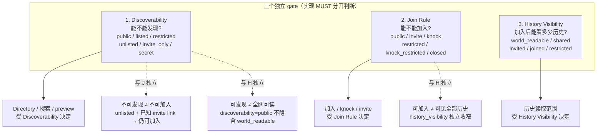

## 0. 规范语言

本文中的规范关键字（**MUST** / **SHOULD** / **MAY** 等）按 [conformance/normative-language.md](../conformance/normative-language.md) 解释；仅大写形式具规范约束力。

## 1. 目标

Cokret 需要明确区分三件事：

- 资源是否可被发现。
- 资源是否可被预览。
- 主体是否可加入、读取或写入资源。

发现不等于读取，读取不等于加入，加入不等于写入。实现 MUST NOT 用 `join_rule` 或 `history_visibility` 代替 discoverability policy。

本文定义 Realm、Organization、Actor 和 Applet 的发现模型、目录服务和防枚举要求。

## 2. 发现级别

`discoverability` 取值：

| 值 | 含义 |
| --- | --- |
| `public` | 可被公共目录索引和搜索。 |
| `listed` | 可在指定目录、组织页、源 Realm 或受信目录中列出，但不一定进入全网公共搜索。 |
| `restricted` | 只有满足可验证条件的请求方可发现，例如组织成员、受邀者、共同 Realm 成员或持有特定 claim 的主体。 |
| `unlisted` | 不进入目录搜索；知道精确 id、alias、邀请链接或 source Realm edge 的主体 MAY 尝试解析。 |
| `invite_only` | 未被邀请或未持有 invite proof 的主体不得得知其存在；查询 MUST 返回与不存在相同的错误（规范强度见 §3）。 |
| `secret` | 仅本地或端到端加密上下文中可见；目录、Sync Service 和受托 search / projection 服务 MUST NOT 公开可枚举 metadata（规范强度见 §3）。 |

默认值：

- 新 Realm 默认 `invite_only`。
- 新 Organization profile 默认 `listed`，但 MAY 设置为 `restricted` 或 `unlisted`。
- Pairwise / private DID 默认 `secret`。
- Public Persona DID 默认 `public` 或 `listed`，由 holder policy 决定。

## 3. Realm Discoverability

Realm discovery policy SHOULD 由 `ck.realm.discovery` state event 表达：

```json
{
  "kind": "ck.realm.discovery",
  "payload": {
    "discoverability": "listed",
    "directory_visibility": {
      "public_directory": false,
      "organization_directory": true,
      "source_realm_directory": true
    },
    "preview": {
      "mode": "stripped_state",
      "fields": [
        "title",
        "avatar_blob_ref",
        "summary",
        "owning_organizations",
        "join_rule",
        "member_count_bucket"
      ]
    },
    "allowed_discoverers": [
      {
        "type": "claim",
        "claim_type": "org_membership",
        "organization": "did:webvh:zGUwpRSnyVCLzU7upsm9iSwEv:acme.example",
        "issuer": "did:webvh:zGUwpRSnyVCLzU7upsm9iSwEv:acme.example"
      }
    ],
    "directory_services": [
      "did:webvh:z43vHHHeh32Hnyv6t7X3t33Xs:directory.acme.example"
    ],
    "anti_enumeration": {
      "require_exact_alias_for_unlisted": true,
      "member_count_mode": "bucketed",
      "not_found_blinding": true
    }
  }
}
```

规则：

- `discoverability=public` 的 Realm MAY 被公共目录服务索引。
- `listed` Realm MUST 仅出现在 `directory_visibility` 或 `directory_services` 明确允许的目录中。
- `restricted` Realm MUST 在返回搜索结果前要求目录查询授权。
- `unlisted` Realm MUST NOT 出现在关键字搜索，但在 policy 允许时 MAY 通过精确 id / alias / 签名 invite / source Realm edge 解析。
- 未授权 subject 对 `invite_only` 与 `secret` Realm 的查询 MUST 返回 `not_found` 或与其不可区分的响应。
- 在未单独授权时，目录结果 MUST NOT 包含事件历史、成员列表、policy 原文、MLS 状态、隐藏 parent/child edge 或完整组织治理链。

`discoverability=restricted` 的 Realm 查询授权使用 `DirectoryRestrictedClaimPresentation`（wire schema：`directory-operations.schema.json#/$defs/directory_restricted_claim_presentation`），由 `search_realms` / `resolve_realm` 请求体的 `claim_presentations[]` 承载；请求体同时 MAY 携带 `proof_challenge`，presentation 的 `nonce` MUST 等于该 challenge。presentation MUST 绑定 `kind="ck.directory.restricted_claim_presentation.v1"`、签发方 `iss`、`verification_method`、目标 Directory service `audience`、防重放 `nonce`、被披露的 `claim`、可选 `expires_at`、`created_at` 与 `jws`。Directory service MUST 验证 issuer key、JWS、audience、nonce、claim subject/requester、过期时间与 resource policy；任一失败 MUST fail closed，且 `resolve_realm` 对未授权 restricted Realm MUST 返回与不存在不可区分的 `not_found`。Realm restricted discovery MUST NOT 把 Event `Proof` 当作 claim presentation 解析。

`anti_enumeration.member_count_mode` 取值 normative：

| 模式 | 行为 |
| --- | --- |
| `exact` | 返回精确成员数；仅在 `discoverability ∈ {public, listed}` 时允许。 |
| `bucketed` | 返回**封闭 bucket** 之一：`1-10` / `11-50` / `51-100` / `101-500` / `501-2000` / `2000+`。Directory 实现 MUST 使用本 bucket grid，不得自定义粒度（防止粒度差异成为枚举侧信道）。请求方收到不在此枚举的 bucket 字符串 MUST 视作 `invalid_response` 并丢弃。**边界振荡侧信道（normative）**：真实成员数在两个 bucket 边界附近抖动时，反复观察 bucket 翻转可被用来逼近精确成员数。因此 bucket 输出 MUST 带迟滞（hysteresis）**且** 最小驻留时间，且两个下界均为 MUST，不得用"声明极小窗口 / 零带宽"架空：bucket 一旦切换，MUST 在 policy 声明或本段默认的最小驻留窗口内保持稳定，不得在边界两侧逐次 query 即翻转。该最小驻留窗口 MUST ≥ max(当前 directory entry 的刷新 TTL，成员数 query 的可观察刷新间隔)；声明小于此下界的窗口 MUST 被视为不合规，未声明时采用该下界。迟滞带宽下界亦为 MUST：实现 MUST 仅在真实计数越过 bucket 边界、并持续超过该 policy 声明或本段默认的迟滞带宽后才切换输出 bucket。默认迟滞带宽 = max(2, ceil(相邻有限 bucket 跨度较小者 × 0.10))；policy MAY 声明更大的绝对值或比例，但不得低于该默认值。**开放上界 bucket(`2000+`)的迟滞参照(normative)**:`2000+` 无有限跨度，故其相邻边界(`501-2000` 与 `2000+` 之间)的迟滞带宽 MUST 取相邻有限 bucket `501-2000` 的跨度(1500)作为参照基数，按上述默认或 policy 值计算。无论哪种，该边界的迟滞带宽 MUST 为正且不得为 0。 |
| `omit` | 不返回成员数；任何隐含的 hint（如返回组员数组的 length）也 MUST 被裁剪。 |

`restricted` / `unlisted` / `invite_only` / `secret` Realm 的 `member_count_mode` 默认 `omit`；显式声明 `bucketed` 时必须遵守上述 bucket grid 与迟滞约束。

**Preview 成员数字段与 `member_count_mode` 的绑定（normative）**：§3 `ck.realm.discovery.preview.fields` 中的成员数字段（canonical 名 `member_count_bucket`）的存在性与形态 MUST 由 effective `member_count_mode` 决定，二者不得各自独立：

| effective `member_count_mode` | `preview.fields` 中成员数字段的存在性与形态 |
| --- | --- |
| `omit` | preview MUST NOT 含任何成员数字段；即使 `preview.fields` 列出 `member_count_bucket`，directory 在产出 preview 时 MUST 裁剪该字段（与表中 `omit` 行"任何隐含 hint 也 MUST 被裁剪"一致）。 |
| `bucketed` | preview 成员数以 `member_count_bucket` 承载，取值 MUST 是上方 bucket grid 之一，并遵守迟滞 / 最小驻留约束。 |
| `exact` | preview 成员数以 `member_count_bucket` 字段承载精确计数（整数值），仅在 `discoverability ∈ {public, listed}` 时允许；字段名保持 `member_count_bucket` 不变，避免不同 mode 暴露不同 wire 字段名而成为枚举侧信道。 |

字段名在三种 mode 下统一为 `member_count_bucket`；请求方 MUST 按 effective `member_count_mode`（而非字段名）解释其语义。directory MUST NOT 因 `preview.fields` 显式列出该字段而越过 `member_count_mode` 披露上限。

**`member_count_bucket` 的 wire 类型（normative）**：该字段是 `string | int` union——`bucketed` mode 下 MUST 是上方 bucket grid 之一的封闭枚举字符串；`exact` mode 下 MUST 是非负整数（精确成员数）。请求方 MUST 由 effective `member_count_mode` 决定按字符串枚举还是整数解析，不得仅凭值类型推断 mode。两种 mode 下 preview 输出（`realm_preview` / `stripped_state`）中该字段的取值示例：

`bucketed` mode 下为封闭枚举字符串：

```json
{ "title": "Acme", "member_count_bucket": "51-100" }
```

`exact` mode（仅 `discoverability ∈ {public, listed}`）下为精确成员数整数：

```json
{ "title": "Acme Public", "member_count_bucket": 342 }
```

**`member_count_bucket` 属 §9.1 一致性字段，MUST 携带 effective mode（normative）**：`member_count_bucket` 是 union 字段（`bucketed` 下为枚举字符串、`exact` 下为整数），其语义依赖 effective `member_count_mode`。若仅凭值类型推断 mode，则跨 Directory 对账（§7.3 不变量 2 Pluralizable、§9.1 一致性字段）会因 mode 解析歧义而无法判定"两家 Directory 是否一致"。因此：

- `member_count_bucket` 一旦在 preview / 结果中出现，即**属于 §9.1 normative 一致性字段**，纳入同一资源跨 Directory 的一致性比对（针对同一 `(resource_id, source_refs frontier, policy_revision)`）。
- 携带 `member_count_bucket` 的 search / resolve 结果与 preview **MUST 同时携带 effective `member_count_mode`**（取值 `exact` / `bucketed` / `omit` 之一，`omit` 时不出现该字段），使请求方与对账方据带内 mode（而非带外推断或值类型猜测）确定解析路径并比对；缺失 effective mode 的结果 MUST 视作 `invalid_response` 并丢弃。
- 跨 Directory 对账时，`member_count_bucket` 值与其 effective mode 必须一并比对；两家 Directory 对同一资源给出不同 mode 或不同 bucket 时 MUST 标记 `divergent=true`（§7.3 不变量 2）。

`join_rule` 只控制加入流程。公开可发现的 Realm MAY 仍要求 invite、knock 或 restricted join。不可发现的 Realm MAY 对持有私有链接的成员保持 `join_rule=public`，但除非配套强反垃圾策略，否则不推荐。

`history_visibility` 只控制历史读取范围。`discoverability=public` MUST NOT 隐含 `history_visibility=world_readable`。五个 history level 的 reader class、invite / join 时点、removal 后 backfill 和 E2EE key share 语义以
[`../governance/history-visibility.md`](../governance/history-visibility.md) 为准；本文件只定义 discovery / join / history 三 gate 的组合关系。

### 3.0 三个独立 Gate（先于矩阵理解）

`discoverability`、`join_rule`、`history_visibility` 是三条**独立判定**的 gate，作用面互不替代：



读图要点：

- **Discoverability** 只控制资源是否能在搜索 / Directory / preview 里出现；不决定加入资格，也不决定历史读取范围。
- **Join Rule** 只控制加入流程；不可发现的 Realm 也可以是 `join_rule=public`（持有私链接即可加入），公开 Realm 也可以是 `join_rule=invite`。
- **History Visibility** 只控制 reader 对历史 Event range 的读取资格；与前两者完全正交。E2EE Realm 中它不自动授予旧 epoch key。
- 任何把 `discoverability` 当作 `join_rule` 或 `history_visibility` 简写的实现都是错误——下表 §3.1 锁定了允许的组合。

### 3.1 `discoverability × join_rule × history_visibility` 兼容矩阵（normative）

下表声明 v1 在三组维度上**允许 / 禁止 / 不推荐**的组合。`✓` = 允许；`!` = 允许但 SHOULD 在 Realm create 时显示警告；`✗` = MUST 拒绝（reducer 在 `ck.realm.policy_components` accept 时返回 `policy_combination_invalid`）。本表不替代 §3 与上方各 enum 的语义；当某条规则与本表冲突时，更严格者（拒绝/警告）优先。

| discoverability ↓ \ join_rule → | `public` | `invite` | `knock` | `restricted` | `knock_restricted` | `closed` |
| --- | --- | --- | --- | --- | --- | --- |
| `public` | ✓ | ✓ | ✓ | ✓ | ✓ | ! |
| `listed` | ! | ✓ | ✓ | ✓ | ✓ | ! |
| `restricted` | ✗ | ✓ | ✓ | ✓ | ✓ | ✓ |
| `unlisted` | ✗ | ✓ | ! | ✓ | ✓ | ✓ |
| `invite_only` | ✗ | ✓ | ✗ | ✓ | ✗ | ✓ |
| `secret` | ✗ | ✓ | ✗ | ✗ | ✗ | ✓ |

`history_visibility` 与上述任一组合搭配时的额外约束：

- `world_readable` MUST NOT 与 `discoverability ∈ {invite_only, secret}` 同时声明（拒绝）。
- `world_readable` 与 `discoverability ∈ {unlisted, restricted}` 同时声明 MUST 在 join warning 显式告知（"任何持有 link 的方都可读取全部历史"）。
- `shared` / `invited` / `joined` 与所有 discoverability 组合兼容。
- `restricted` 历史可见性 MUST 与有效 `ck.realm.history_sharing_policy` 一致；缺少该 policy 时 reducer MUST 拒绝该 effective state。与 `discoverability=public` 组合时仍 SHOULD 限制 lazy member preview 防止枚举。

实现 MUST 在 `ck.realm.policy_components` reducer 接受前用本表校验当前 effective 状态；变更任一字段使组合落入 `✗` 时 MUST 返回 `policy_combination_invalid` 并保留旧值。本表是 v1 wire 互操作的最小集，profile 可以**收紧**但不得放宽。

### 3.2 Preview / Peek 与 History Visibility 的关系

Directory preview 不是历史读取的快捷方式。`ck.realm.discovery.preview` 只声明目录结果或 exact resolve 可以返回哪些最小 metadata（例如 `title`、`summary`、`join_rule`、bucketed member count、`stripped_state`），不得单独授权正文历史、成员列表、policy 原文、隐藏 edge 或 E2EE 明文。

当实现要支持 Matrix-style "peek before join"、invitee 进入前历史片段、或带 token 的 object preview 时，Realm MUST 同时声明有效 `ck.realm.preview_policy`，并按
[`../governance/history-visibility.md`](../governance/history-visibility.md) §4 执行 preview audience、字段、历史范围、E2EE 和 anti-enumeration 规则。没有 `ck.realm.preview_policy` 时：

- Directory MAY 返回 directory card / stripped state，但 MUST NOT 返回 history stub 或 history snippet。
- `resolve_realm` / `resolve_target` 对未授权 preview MUST 返回与不存在不可区分的 `not_found`。
- `history_visibility=world_readable` 仍不允许 Directory 自动扩展 preview 字段；完整历史读取必须走 Events / backfill surface，并继续执行 capability、retention、redaction 和 plaintext-visible service 检查。

## 4. Organization 可发现性

Organization discovery policy SHOULD 通过组织 profile 状态或 governance registry 记录表达：

```json
{
  "kind": "ck.organization.discovery",
  "organization_did": "did:webvh:zGUwpRSnyVCLzU7upsm9iSwEv:acme.example",
  "discoverability": "public",
  "profile_visibility": {
    "display_name": "public",
    "logo_blob_ref": "public",
    "summary": "public",
    "owned_realms": "listed",
    "members": "restricted",
    "services": "listed"
  },
  "directory_services": [
    "did:webvh:z43vHHHeh32Hnyv6t7X3t33Xs:directory.acme.example"
  ],
  "proof": {
    "kind": "detached_jws",
    "verification_method": "did:webvh:zGUwpRSnyVCLzU7upsm9iSwEv:acme.example#governance-key-1",
    "jws": "..."
  }
}
```

Organization 可以是公开的、受限的或不可列举的。实现 MUST NOT 因为组织 DID 可解析，就公开组织成员列表、官方 Realm 列表、服务拓扑或治理策略全文。

客户端展示组织搜索结果时 SHOULD verify：

1. Organization DID 可解析。
2. discovery policy 或 profile 由组织 DID / governance service 签名。
3. 如果结果声称包含 official Realm，仍需验证每个 Realm 的 `ck.realm.organization` 背书。
4. 目录服务 DID 被组织 DID 声明或被本地 trust policy 接受。

### 4.1 Actor / Applet / Handle Discovery State

`ck.actor.discovery`、`ck.applet.discovery` 与 `ck.handle.discovery` 是 v1 active discovery state event kind。它们与 `ck.organization.discovery` 使用同一组目录 ingest 规则：resource 自签名声明可发现性，Directory 只索引被 `directory_services[]` 明确列出的资源，且不得替 resource 重新签名或扩展披露范围。

这些 payload 至少包含：

| 字段 | 类型 | 必填 | 说明 |
| --- | --- | --- | --- |
| `resource_kind` | `enum(actor,applet,handle)` | required | 必须与 Event kind 后缀一致。 |
| `resource_id` | `did` / canonical handle / applet id | required | 被发现资源的稳定标识。 |
| `discoverability` | §2 enum | required | `public` / `listed` / `restricted` / `unlisted` / `invite_only` / `secret`。 |
| `directory_services` | `did[]` | required | 被允许索引该资源的 Directory service DID 列表。 |
| `profile_visibility` | `object` | optional | 每个预览字段的可见性；未列字段默认不披露。 |
| `proof` | detached proof | required | 由 resource controller / governance key 签名，覆盖 canonical payload（不含 proof 本身）。 |

Actor discovery MUST NOT 暴露 pairwise/private DID、未披露组织账号或仅因共同 Realm 推断出的关系。Applet discovery MUST 只披露 registration 允许的 public metadata，不得暴露 private namespace、token、webhook secret 或租户内 endpoint。Handle discovery MUST 绑定 handle issuer、subject claim、audience 与过期时间；受限 handle 未满足 presentation / policy gate 时不得返回 subject DID 或 `member_delivery_binding`。

## 5. Actor 与 Handle 可发现性

Actor / Principal 发现 MUST 尊重 holder 隐私：

- 公开 persona MAY 出现在公共用户目录中。
- Pairwise DID、私有 DID、设备 DID 与隐私敏感的 agent DID 默认 MUST NOT 出现在公共目录中。
- Handle 搜索 MUST 仅返回绑定公开或 holder 已显式授权披露的 handle。
- Handle 搜索 / 解析若会暴露 `subject` DID 或 `member_delivery_binding`，MUST 额外满足 requester proof、intent、audience / challenge 和 issuer policy；共同 Realm 或同组织排序信号不得单独授权披露。`intent="contact_request"` 只表示调用方希望把 verified handle claim 用作 first-contact `handle_claim` introduction evidence，不构成 contact consent。这些受限 handle 解析的 not_found / unauthorized 分支 MUST 满足 §9.2 的失败不可区分（含**时延等同**）约束，不得因走完整校验失败与早退不存在产生可观测时序差。
- Controller-scoped agent selector（`@<controller-handle>/<agent_slug>`）解析若会暴露 agent DID 或 selector claim，MUST 满足 requester 已与该 agent 共享可见 scope，或 selector claim `visibility="public"` / 当前 `audience` 明确授权该 requester 与当前 `intent`（mention 场景为 `intent="mention"`）。未授权、slug 不存在、controller 不存在、agent 不可见、claim revoked / expired / ambiguous 等结果 MUST 使用不可区分失败（含 §9.2 的**时延等同**约束），避免按时序差分枚举 controller 的 agent 名单。
- Presence、common Realm、组织成员与联系人图谱 MUST NOT 通过搜索排序或自动补全泄露。

在共享 Realm 中查询未知 actor profile，仅允许在渲染已授权内容（如显示名、头像）所必需的范围内进行；MUST NOT 借此泄露无关 handle 或组织账号。

## 6. Private Contact Discovery

通讯录式发现比普通目录搜索更敏感。实现 MAY 支持 `ck.private_contact_discovery.v1`，用于在不上传明文通讯录、不让目录服务同时获得 requester DID 与目标 connection identifier 的前提下发现可联系主体。

### 6.1 Profile 目标

- Discovery Provider 不应同时获得 requester 的稳定 DID 和原始邮箱/手机号/用户名。
- 请求应使用 batch、padding、rate limit 和 time-bound proof，避免逐个枚举。
- 发现结果应返回最小可联系材料，而不是完整 profile 或关系图谱。
- 协议 MUST 定义"private discovery 能回答什么"——并显式声明不能回答什么——避免实现私自扩展导致隐私退化。

### 6.2 v1 core 形态：Set-Membership PSI（双轮 OPRF）

v1 core `ck.private_contact_discovery.v1` profile 明确限定为 **set-membership PSI**：客户端只能问"我已知的 connection identifier 集合中，哪些在 provider 的可联系集合内？"核心回答是命中位图。响应 MAY 在每个命中旁附带最小 invite/consent handoff stub，但该 stub 只能声明 consent state hash、grant/revoke 状态或下一步引导，且必须与未命中 / policy-denied 响应保持同样的 padding 与字段形态。响应 MUST NOT 附带 contact request handoff token、reachability claim、完整 profile、成员资格、Realm membership、读取权限或关系图谱。

实现 MUST 使用基于 OPRF（Oblivious Pseudorandom Function）的两轮协议（推荐 RFC 9497 VOPRF 或 Signal CDSI 风格）：

1. **Round 1 — Blind**：客户端按 RFC 9497 OPRF 流程对每个本地 connection identifier 计算 `blind = OPRF.Blind(identifier_canonical_bytes)`；提交 `{batch_id, blinded[]}` 给 provider。Provider 对每个 `blinded[i]` 用其 OPRF secret key 计算 `evaluation[i] = OPRF.BlindEvaluate(sk, blinded[i])` 并返回。Provider 看不到 raw identifier；客户端 unblind 后得到 `derived[i]`。`batch_size`、dummy padding 与失败延迟由 Provider policy 强制，不由客户端自报决定。
2. **Round 2 — Match**：客户端在第二个独立请求中提交 `{batch_id, derived_digest_prefix[]}`（每条发送 derived digest 的固定前缀，长度由 provider 在第一轮响应中声明）。Provider 仅在自己的 OPRF-evaluated 可联系集合中按前缀比较，返回固定基数（dummy padding 到 batch size）的命中位图；若 profile 返回最小 invite/consent handoff stub，该 stub 也 MUST 被 dummy padding 到相同 shape。无论命中数为 0、部分命中还是全部命中，response frame 数量、字段集合、排序和 padding 形态 MUST 相同。
3. **披露**：客户端只在 user 在 UI 中显式确认联系或发起邀请时，才向目标 principal 的 provider 披露自己的 DID、pairwise DID、presentation 或 connection identifier 原文。该披露走 §6 / consent-model 的 invite + consent 流程，不在 PSI 协议范围内。

OPRF 选择：

- v1 core 强制要求 RFC 9497 VOPRF（验证 OPRF），ciphersuite 至少包含 `OPRF(ristretto255, SHA-512)`。
- Provider OPRF secret key MUST 周期轮换（默认 ≥ 7 天 / ≤ 90 天）；轮换后客户端持有的 derived 缓存自动失效，避免长期跨域关联。
- Provider MUST 在 `server/describe.discovery` 暴露当前 ciphersuite、key epoch、batch size / padding 上限。

### 6.3 请求形态（非完整 schema）

第一轮（blind）：

```json
{
  "profile": "ck.private_contact_discovery.v1",
  "phase": "blind",
  "batch_id": "ck:batch:0196429a-0000-7000-8000-000000000000",
  "ciphersuite": "OPRF-ristretto255-SHA512",
  "key_epoch": 14,
  "blinded_elements": ["base64url...", "base64url..."]
}
```

第二轮（match）：

```json
{
  "profile": "ck.private_contact_discovery.v1",
  "phase": "match",
  "batch_id": "ck:batch:0196429a-0000-7000-8000-000000000000",
  "key_epoch": 14,
  "derived_prefixes": ["base64url-16bytes...", "base64url-16bytes..."]
}
```

### 6.4 规则

- Raw email、phone number、address-book label、local contact name 和未加盐低熵 hash MUST NOT 被发送给公共 Directory，包括第一轮的 OPRF input（OPRF Blind 已经做了 unlinkable 化，但实现仍 MUST 在客户端先做 normalization + canonical encoding，杜绝把明文写入 audit log）。
- Provider MUST 对 batch 大小、dummy padding、失败响应、计时和 result cardinality 做反枚举处理；不存在、不可发现、policy-denied 和 OPRF mismatch 在 wire 上 MUST 保持相同响应形态与延迟分布。客户端提交的 padding hint（若 profile 扩展保留该字段）只能作为上限内的偏好，Provider MUST 按自身 policy 重写为固定 `batch_size`。
- Provider MUST NOT 在第二轮返回 contact request handoff token、reachability proof、handle verified claim、完整 profile、组织成员资格、Realm membership 或读取权限。这些声明只能通过后续 contact / invite + consent 流程获得。既有最小 invite/consent handoff stub 只可声明 consent state hash、grant/revoke 状态或下一步引导，不得成为可直接创建 contact relation 的凭据。
- Private discovery 结果**仅** 证明"在 provider 当前可联系集合中存在 OPRF derived 与某项匹配的条目"——不证明该条目对应的真实身份、handle、活跃度或意愿。客户端 UI MUST 把它表述为"可能可联系"而不是"已确认存在"。
- 高隐私客户端 SHOULD 为每个 provider 或关系使用 pairwise DID，并在 consent 完成前避免披露全局 public persona DID。
- 实现 MUST NOT 在同一 quota window 内允许同一 quota key 提交超过 `max_psi_queries_per_window`（默认 1）次 batch；默认 quota window 为 24h，且 MUST 与 OPRF key epoch 解耦。**quota key 单位（normative）**：quota 以**已认证 device credential**为主键（per-device），使合法的换设备、新设备登录或本地 derived 缓存失效后能在该设备上重新发现联系人，不被另一设备的用尽配额连带锁死；provider MAY 额外施加 per-principal 聚合上界与 IP 维度作为**反滥用上限**(只能更严、不能放宽 per-device 配额),但单一 IP MUST NOT 作为唯一 quota key。**计数单位（normative）**：一次完整 PSI query 含 §6.2 的 blind + match 两轮独立请求，二者按同一 `batch_id` 关联，**整体计 1 次**(不得把 blind 与 match 各计 1 次，否则默认值 1 将使 blind 用尽配额、match 被拒，永远无法完成一次查询)。超过后 provider 返回与其它 policy-denied 情况等形态的 `psi_quota_exhausted`。IP 只能作为辅助限速维度，不能作为唯一 quota key。新 OPRF key epoch 不得单独重置 quota；只有 quota window 滚动或 operator 明确的反滥用解封才能重置。

## 7. Directory Service Role

Directory Service 是 Cokret 的**发现入口层**：让任意 subject 在不预先知道精确 id / alias / invite 的前提下，从其 trust 范围内**已 opt-in 暴露**的资源中找到目标，并取得**足以独立发起下一步 action（resolve / preview / knock / join / invite / verify / contact）的最小可验证元数据**。

它的职责面 normative 限定为三件事，超出以下范围的能力 MUST NOT 被实现为 Directory 的内置职责：

1. **Ingest**：按 §8 接入资源（Realm / Organization / Actor / Applet / Handle）的签名 discovery state，建立**可重建、可替换、可撤销**的索引。
2. **Query**：向 subject 提供 search / resolve（§9），返回最小可验证元数据 + `source_refs`，让客户端能独立回真相源验签。
3. **Filter & 防枚举**：执行 §3 / §11 的 discoverability 过滤、bucket 聚合、blinded `not_found`，杜绝侧信道。

### 7.1 索引内容

Directory MAY index：

- public / listed Realm preview metadata
- organization public profile
- public persona profile
- applet protocol metadata
- verified handle records that are intended to be public

Directory MUST NOT 索引任何**未通过 §8 ingest protocol opt-in 的**资源；MUST NOT 通过爬取 DID 命名空间、扫描 well-known endpoint、或被动嗅探 federation traffic 自行发现资源。

### 7.2 Directory 不是

| 不是 | 真正责任方 |
| --- | --- |
| 真相源 | 资源各自的 Principal Server 上的签名 state event |
| 授权决策点 | Realm policy / Organization governance / capability evaluator |
| Join 执行点 | `join_candidates[]` 中的 Realm ingress service 按 `join_rule` + Realm policy 接收 / 转发；最终由 reducer 收敛 |
| 身份解析器 | DID resolver / identity registry / witness |
| 消息或历史镜像 | Events API / Sync stream |
| Service topology 权威 | DID Document `service` entry |
| 全网爬虫 | 不存在；ingest 仅按 §8 双向 opt-in |

特别地：**Directory 不执行 join、不签发 invite token、不签发 capability grant**。Directory 的 join-side 责任到"产出 `realm_id + join_candidates[]` 让客户端能选择合格的 Realm ingress service 发起 join / invite-accept / knock"为止。能否实际加入由 Realm 的 `join_rule` 与 policy 决定（见 §3.0 三个独立 gate）。

### 7.3 不变量（normative）

任何符合 v1 的 Directory 实现 MUST 满足：

1. **Rebuildable**：丢失全部本地索引后，Directory 必须能仅凭 `directory_services` 列出本 DID 的资源 + ingest protocol 重建索引内容。Directory 不得持有任何不可从真相源恢复的"权威"数据。
2. **Pluralizable**：同一资源 opt-in 多家 Directory 时，针对同一 `(resource_id, source_refs frontier, policy_revision)` 的查询结果 MUST 在 §9.1 normative 字段上一致；不一致 MUST 标记为 `stale=true` 或 `divergent=true`。
3. **Freshness-tagged**：每条返回结果 MUST 携带 `as_of`、`source_refs`、`policy_revision`；TTL 过期未续约的 entry MUST 标记 `stale=true` 或被移除（见 §8.6）。
4. **Withdrawable**：资源 governance 通过 §8.7 撤销 opt-in 后，Directory MUST 在 ≤ 1h 内停止披露该资源。
5. **Plaintext-free**：Directory MUST NOT 持有或转发 Realm 内 plaintext content、E2EE 密文 payload、私 persona DID、pairwise DID 或 governance 密钥材料。
6. **No-shadow-grant**：Directory MUST NOT 签发 invite token、capability grant、session credential 或任何能绕过 Realm / Organization policy 的认证材料。

### 7.4 行为契约

Directory Service MUST：

- expose its service DID and feature profile（`ck.find.directory.query.describe`，含 §8.9 ingest 字段）
- accept ingest only via §8 with verified governance signature and bidirectional opt-in
- apply authorization filtering before returning each result
- return stable pagination cursors
- indicate result freshness（§9.1 字段）
- avoid leaking existence through distinct errors for hidden resources

Directory Service MUST NOT：

- list `invite_only` or `secret` resources to unauthorized subjects
- expose full member lists unless explicitly allowed
- expose private handles, pairwise DID, disclosure policy or credential contents
- rank hidden resources in a way that reveals their existence
- ingest resources whose signed discovery state does not list this Directory's DID
- alter, re-sign, or substitute discovery state on behalf of resources
- accept indexed content forwarded from another Directory as authoritative

## 8. Discovery Ingest Protocol

Directory 不是真相源（§7）。Directory 持有的索引内容 MUST 来自资源自身签名的 discovery state，并通过本节定义的 ingest protocol 接入。本节是 v1 公共发现互操作的契约层；任何符合 v1 的 Directory MUST 至少实现 §8.2 中的一种 ingest 模式。

### 8.1 双向 opt-in

ingest 是**双向 opt-in**，缺一不可：

| 方向 | 资源端表达 | Directory 端表达 |
| --- | --- | --- |
| 资源 → Directory | 在 `ck.{realm,organization,actor,applet,handle}.discovery.directory_services` 列出本 Directory 的 service DID + governance key 签名整份 payload | — |
| Directory → 资源 | — | 在 `ck.find.directory.query.describe.accept_policy_kind` 中声明可接受的资源类别、trust root、配额（§8.9） |

Directory 接受 ingest 的前置条件：

- 资源签名声明中**未列出**本 Directory DID → MUST 拒绝并返回 `directory_not_authorized`。
- 资源不在 Directory `accept_policy` 范围内 → MUST 拒绝并返回 `accept_policy_denied`。
- 资源端 governance key 在 ingest 时刻不在 DID document 当前 epoch → MUST 拒绝并返回 `governance_key_invalid`。

### 8.2 两种 ingest 模式

Directory MUST 支持 **push (announce)** 与 **pull (refresh)** 两种 ingest 模式之一，且 MUST 在 `ck.find.directory.query.describe.ingest_modes` 中显式声明本实例支持的模式。

| 模式 | 触发方 | 适用场景 |
| --- | --- | --- |
| push（announce） | 资源 Principal Server 主动提交签名 discovery state | 公开 / 社区 directory；资源希望尽快上线或撤销 |
| pull（refresh） | Directory 按已知资源 DID 周期性拉取最新签名 discovery state | 高安全部署、白名单 directory、与 federation 复用 |

资源端 MAY 任选支持的一种使用；Directory MAY 同时支持两种以提高可用性。两模式产生的索引条目 normative 等价。

### 8.3 Push 模式：`ck.find.directory.command.announce`

**Endpoint**：`POST /_cokret/find/directory/announce`

**认证**：

- Transport 层：HTTP Message Signature（RFC 9421）由资源所在 Principal Server 的 service DID 签发，绑定 `Source-Service-DID` header。
- Payload 层：`discovery_state.proof.detached_jws` 由资源 governance key（按资源 DID document 解析）签发，与 `ck.organization.discovery` / `ck.realm.discovery` 的 effective signer 一致。

**请求字段**：

| 字段 | 类型 | 必填 | 说明 |
| --- | --- | --- | --- |
| `resource_kind` | `enum(realm, organization, actor, applet, handle)` | required | 资源类别。 |
| `resource_id` | `id \| did \| handle` | required | 资源主键：Realm 用 `ck:realm:...`；Organization / Actor / Applet 用 DID；handle 用 canonical handle string。 |
| `discovery_state` | `object` | required | 完整签名 `ck.{kind}.discovery` payload（含 `proof`）。MUST 与真相源 byte-for-byte 一致。 |
| `source_refs` | `id[]` | required | 真相源 event id 列表，至少包含产生当前 effective discovery state 的 seal / state event id。 |
| `as_of` | `timestamp` | required | 资源端声明的 effective 时间；与服务端时间偏差 > 5 min MUST 拒绝（`signature_stale`）。 |
| `policy_revision` | `string` | required | `discovery_state` 对应的 effective policy revision；Realm 资源必须等于 `ck.realm.policy_components.policy_revision` 或由该 revision 派生。 |
| `principal_server_did` | `did` | required | 当前资源真相源所在的 Principal Server service DID（用于 Directory 在需要时 pull 验证）。 |
| `ttl_seconds` | `int` | optional | 期望保留时长；缺省采用 `default_ttl_seconds`。MUST ≤ `max_ttl_seconds`（§8.6）。 |
| `supersedes_announce_id` | `ck:announce:<uuidv7>` | optional | 上一次 announce id；用于幂等替换与 audit 链接。该 id 只在签发它的 Directory 内有权威含义。 |

**响应**：

| 字段 | 类型 | 说明 |
| --- | --- | --- |
| `announce_id` | `ck:announce:<uuidv7>` | 本次 ingest 记录 id，例如 `ck:announce:0196419b-0000-7000-8000-000000000000`。这是 Directory 本地 ingest 记录；typed 形态只用于统一 validator / SDK 处理，不赋予跨 Directory 的全局对象权威。 |
| `indexed_at` | `timestamp` | Directory 完成索引的服务器时间。 |
| `effective_ttl_seconds` | `int` | Directory 实际授予的 TTL。 |
| `next_revalidation_after` | `timestamp` | 下一次 re-announce 或 pull-refresh 的最早时间。 |
| `warnings` | `string[]?` | 非阻塞警告，例如 `truncated_member_count`、`policy_revision_drift`。 |

**典型错误码**：`directory_not_authorized`、`accept_policy_denied`、`invalid_signature`、`signature_stale`、`source_refs_unverifiable`、`governance_key_invalid`、`ttl_out_of_range`、`rate_limited`、`takedown_in_force`。

请求示例（非完整 schema）：

```json
{
  "resource_kind": "organization",
  "resource_id": "did:webvh:zGUwpRSnyVCLzU7upsm9iSwEv:acme.example",
  "principal_server_did": "did:webvh:z3omZGak5a5es84Ph2kfPs4UP:principal.acme.example",
  "as_of": "2026-05-10T08:00:00Z",
  "policy_revision": "01JTV0KQ7K5ZP4VN6C9WEZK2X1",
  "ttl_seconds": 86400,
  "source_refs": [
    "ck:event:0196419b-0000-7000-8000-000000000000"
  ],
  "discovery_state": {
    "kind": "ck.organization.discovery",
    "organization_did": "did:webvh:zGUwpRSnyVCLzU7upsm9iSwEv:acme.example",
    "discoverability": "public",
    "directory_services": [
      "did:webvh:zAvx6fqPK7h5rBjBiBRbmLmd6:directory.example",
      "did:webvh:z43vHHHeh32Hnyv6t7X3t33Xs:directory.acme.example"
    ],
    "profile_visibility": { "...": "..." },
    "proof": {
      "kind": "detached_jws",
      "verification_method": "did:webvh:zGUwpRSnyVCLzU7upsm9iSwEv:acme.example#governance-key-1",
      "jws": "..."
    }
  }
}
```

### 8.4 Pull 模式与 push webhook 注册：`ck.find.directory.push.command.register`

Pull 模式不得调用资源 Principal Server 的 `/_cokret/self/events/*`。资源若允许 Directory 主动 refresh discovery state，必须通过 `/_cokret/find/directory/*` ingest / pull profile 暴露 Directory 专用读取面，并在 `supported_operations` 中声明对应 Directory operation；Directory 只能读取该资源签名的 effective discovery state，不得把 Events API 当作通用 discovery dump。

Directory 拉取流程：

1. 按本地 trust root / 已配对资源列表，定期向资源 Principal Server 的 Directory 专用读取面发 state-only query。
2. Principal Server 返回最新 effective discovery state（含 `proof`）。
3. Directory 按 §8.5 验签后写入或更新本地索引。

可选的 webhook 辅助：Directory MAY 调用 `ck.find.directory.push.command.register`（§9）让资源 Principal Server 在 discovery state 变更时主动 webhook 通知（fan-out 优化），但**协议级 freshness 仍以 §8.6 为准**——通知缺失或迟到不得使 stale 条目复活。

### 8.5 验签与接受规则

Directory 接受 ingest（无论 push 或 pull）前 MUST 顺序完成：

1. **Transport layer**：验证 HTTP Message Signature（push）或 service binding + TLS（pull）。
2. **Discovery proof**：验证 `discovery_state.proof.detached_jws` 由资源 governance key 有效签发，签发时间在 key 当前 epoch 内（按 DID document key history）。
3. **Directory authorization**：确认 `discovery_state.directory_services` 数组包含本 Directory 的 service DID。
4. **Source refs sanity**：MAY 通过 pull 抽查 `source_refs` 中至少一个 seal 在资源 Principal Server 上可解析、frontier 一致。Directory MUST 对**首次 ingest** 的资源至少抽查一次。
5. **Accept policy**：对照本地 `accept_policy` 检查资源 DID method、trust root、配额、abuse 黑名单。

任一步失败 MUST 拒绝并返回对应错误码；Directory MUST NOT 部分接受或"先索引后审核"。

### 8.6 Freshness、TTL 与续约

| 参数 | 默认 | 上限 | 说明 |
| --- | --- | --- | --- |
| `default_ttl_seconds` | `86400`（24h） | — | Directory describe 中声明 |
| `max_ttl_seconds` | `604800`（7d） | `2592000`（30d） | TTL 不得超过此值 |
| `revalidation_grace_seconds` | `3600`（1h） | — | TTL 到期后允许的宽限期 |

规则：

- 资源 MUST 在 `next_revalidation_after` 之前发起 re-announce 或允许 Directory pull-refresh。
- TTL + grace 过期后未续约的 entry MUST 在查询结果中标记 `stale=true`；Directory MAY 在再延迟 24h 后从索引中移除。
- 资源 governance key 在 ingest 期间发生 rotation：MUST 在下一次 announce 中携带新 key 的签名；Directory MUST 在验证 DID document key history 后接受。
- Discovery state 内容未变但需要续约时，资源 MAY 重新提交相同 `discovery_state` + 新 `as_of`，Directory MUST 视为有效续约（按 `(resource_id, as_of)` 幂等）。
- Directory MUST 拒绝 `as_of` 早于已存 entry `as_of`，或 `policy_revision` 小于已存 entry `policy_revision` 的 announce（`policy_revision_rollback`）。

### 8.7 撤销

撤销 opt-in 有三条等价路径，Directory MUST 全部支持：

1. **资源端发布新 state**：`ck.{kind}.discovery` 中将 `directory_services` 移除本 Directory DID，或将 `discoverability` 改为 `secret` / `unlisted`。Directory 在下一次 ingest 周期内 MUST 移除条目；push-only 部署中资源 SHOULD 同时调用路径 2 加速生效。
2. **资源端主动 withdraw**：`POST /_cokret/find/directory/withdraw`，body 含 `resource_id`、`reason`、governance key 签名（与 announce 同等强度）。Directory MUST 在 ≤ 1h 内停止披露。
3. **Directory operator takedown**：单方面下架（policy 违规、abuse、法律）。Directory MUST：
   - 在内部 audit log 记录 `takedown_id`、operator、reason、生效时间；
   - 通过 `ck.find.directory.query.describe.takedown_contact` 暴露的入口或 DID document `service` entry 中声明的 governance contact 通知资源端；
   - 不得伪装为"资源主动撤销"——audit log 与资源端通知 MUST 标记为 `operator_takedown`。

Operator takedown 的申诉 / 恢复 MUST 形成可验证闭环：

`ck.find.directory.command.takedown_appeal` 是该闭环的标准协议 operation，但它是 **operator takedown 能力的声明式子面**，不是每个 directory service 的无条件必选端点。Directory 只有在 `ck.find.directory.query.describe.supported_operations` 中声明 `ck.find.directory.command.takedown_appeal`，或在 `takedown_contact` / takedown notice 中给出该 HTTP endpoint 时，才 MUST 路由并实现 `POST /_cokret/find/directory/takedown/appeal`。未提供 operator takedown 或只提供离线 / 私有治理联系通道的 Directory MUST 从 `supported_operations` 省略该 operation；省略本身不构成 catalog-completeness 违规。若服务声明了该 operation 却未挂载，或 notice 给出 endpoint 但返回 `unrecognized_endpoint`，则为不合规。

1. takedown notice MUST 向资源 governance contact 提供 `takedown_id`、resource id、policy reason code、evidence digest、effective_at、appeal endpoint / contact 和 Directory service DID signature；
2. 资源端提交 appeal 时，appeal packet MUST 绑定 `takedown_id`、resource id、appellant DID、argument / evidence digest、requested_outcome 和 created_at，并由资源 governance key 或授权 advocate 签名；
3. Directory 审核结果 MUST 写入内部 audit log，并返回 signed decision receipt；若 overturned，Directory MUST 在下一次 ingest 或 ≤1h 内解除 `takedown_in_force`，并接受资源端最新 signed discovery state；
4. 若该资源同时处于 Realm moderation / organization policy 管辖范围，Directory SHOULD 引用 `ck.moderation.appeal.*` 的 appeal id / decision receipt，避免发现层与协作层出现两个互相矛盾的申诉结果。

撤销后，Directory MUST 对该 `resource_id` 的精确 resolve 返回与 `unlisted` / `not_found` 不可区分的响应（参见 §3 防枚举）；对正在分页的 search 响应，MUST 在下一次 cursor 推进时停止披露。

### 8.8 Cross-Directory Replication（out of scope）

v1 core **不**定义 Directory 之间的 replication / federation 协议。每个 Directory 独立 ingest；同一资源 opt-in 多家 Directory 时分别 announce。

跨 directory mirror、ranking 共享、reputation 交换属于未来 extension profile（工作名 `directory_mesh.v1`），不在 v1 互操作 floor。Directory MUST NOT 接受其他 directory 转发的索引内容作为权威；MAY 把其他 directory 的存在性作为 hint，但仍 MUST 通过 §8.2 模式独立 ingest。

### 8.9 `ck.find.directory.query.describe` 扩展

**Schema overlay 关系（normative）**：`ck.find.directory.query.describe` 响应是通用 `ck.schema.service_describe.v1` 的 **directory-service overlay**。这些 overlay 字段已作为裸字段登记在 [`service-describe.schema.json`](../../artifacts/schemas/service-describe.schema.json) 中，且仅在 `service_type=directory_service` 的 describe 响应上成为 required directory contract；实现 MUST NOT 把下列标准字段改写为 vendor-specific `x_*` 顶层字段。Directory describe MUST 在通用 `service_describe` 基础上 extend 以下字段集，作为 directory-specific 字段权威列表：(a) `resource_types[]` 与 `discovery_profiles[]`（资源类别与索引 profile）；(b) `restricted_query_proof`（是否需要 holder-approved proof）；(c) 本节下表列出的 9 个 ingest 字段。`../sync/service-http-binding.md` 中所有 `ck.find.directory.query.describe` operation row 引用本节作为字段 superset 的权威定义，不另列重复表；任何 directory-specific 字段调整 MUST 先在本节落地。

Directory MUST 在 `describe` 响应中暴露 ingest 能力：

| 字段 | 类型 | 说明 |
| --- | --- | --- |
| `ingest_modes` | `array<push \| pull>` | 本 directory 支持的模式，至少一个。 |
| `accept_policy_kind` | `enum(open, allowlist, trust_root_signed, operator_review)` | `open` = 任意签名资源；`allowlist` = 资源 DID 在显式白名单；`trust_root_signed` = 需要 trust seal 背书；`operator_review` = 人工审核。 |
| `accept_policy_ref` | `object?` | 描述如何获得接入资格的可读 ref（URL / DID / governance contact）。 |
| `default_ttl_seconds` | `int` | 默认 TTL。 |
| `max_ttl_seconds` | `int` | TTL 上限，MUST ≤ 2,592,000。 |
| `revalidation_grace_seconds` | `int` | TTL 到期宽限。 |
| `accepted_resource_kinds` | `enum[]` | 本 directory 接受的资源类别子集。 |
| `accepted_did_methods` | `string[]` | 接受的 principal/governance DID method token，形如 `did:web`、`did:webvh`。 |
| `takedown_contact` | `did \| url?` | operator takedown 时的通知 / 申诉入口。 |
| `rate_limits` | `object?` | per-DID / per-org / per-IP 配额上限的可读描述。 |

Directory 若支持 handle lookup 的高敏 intent，SHOULD 在 `ServiceDescribe` 扩展字段中声明粗粒度能力，例如 `x_handle_resolution.contact_request_enabled`、`x_handle_resolution.invite_enabled` 与 `x_handle_resolution.member_add_enabled`。这些开关为 `false` 或缺失时，客户端 MUST 使用 [`../sync/invite-addressing.md`](../sync/invite-addressing.md) 的 invite address + introduction evidence 流程，或使用 `ck.self.contact.command.request` 的 `explicit_address` 低信任路径；不得把 `resolve_handle(intent="contact_request" | "invite" | "member_add")` 当作 base invite / contact 前置条件。

### 8.10 Anti-abuse

ingest 通道 MUST 防御：

- **Replay**：同一 `(resource_id, as_of)` 重复 announce MUST 幂等（返回原 `announce_id`）；过期 timestamp 的 announce MUST 拒绝（`signature_stale`，`as_of` 与服务端时间偏差 > 5 min）。
- **DID 抢占**：首次 ingest 某 DID 时 MUST 全量验证 DID document + governance key history；不允许仅凭 `did:web` 域名解析跳过 webvh history / witness 校验。
- **Quota burning**：Directory MUST 对 per-resource、per-Principal Server、per-IP 限流；超限返回 `rate_limited`。
- **Source-ref 伪造**：Directory MUST 拒绝 `source_refs` 中包含本 Directory 不能从声明的 Principal Server 解析得到的 event id 的 announce。
- **撤销规避**：Directory MUST NOT 接受 `as_of` 早于已记录 withdraw 时间的 announce（`takedown_in_force`）。
- **Policy rollback**：Directory MUST 拒绝 `discovery_state` 的 `policy_revision` 严格小于当前已索引版本的 announce（`policy_revision_rollback`）。

Directory operator MAY 维护资源黑名单（abuse、垃圾、法律）；命中黑名单时 MUST 直接返回 `accept_policy_denied`，不得进入 ingest 流程后再静默丢弃。

## 9. Service Surface

Recommended operations：

```text
GET  /_cokret/find/directory/describe
POST /_cokret/find/directory/search-realms
POST /_cokret/find/directory/resolve-realm
POST /_cokret/find/directory/search-organizations
POST /_cokret/find/directory/resolve-organization
POST /_cokret/find/directory/search-actors
POST /_cokret/find/directory/search-users
POST /_cokret/find/directory/resolve-handle
POST /_cokret/find/directory/resolve-agent-selector
POST /_cokret/find/directory/list-handles-for-subject
POST /_cokret/find/directory/private-contact-discovery
POST /_cokret/find/directory/announce
POST /_cokret/find/directory/withdraw
POST /_cokret/find/directory/push/register
```

字段级定义：

`organization_preview` 的基础字段为 `organization_did`、`handle?`、`display_name?`、`avatar_blob_ref?`、`as_of`、`source_refs`、`policy_revision`。当组织目录 policy 允许公开治理预览时，preview MAY 额外携带 `verified_badge`、`member_count`、`realms`、`realm_count`；这些字段仅表示公开/授权可发现的组织和 Realm fan-out，不授权披露非公开成员、完整组织拓扑或私有 Realm。

| operation_id | 必填字段 | 可选字段 | 响应字段 | 约束 |
| --- | --- | --- | --- | --- |
| `ck.find.directory.query.describe` | 无 | 无 | `service_did: did`; `resource_types: string[]`; `discovery_profiles: string[]`; `restricted_query_proof: boolean?`；以及 §8.9 全部 ingest 字段 | `public_metadata`；可限流。 |
| `ck.find.directory.query.search_realms` | 无 | `query: string`; `organization_did: did`; `source_realm_id: id`; `requester: did`; `proof_challenge: string`; `claim_presentations: DirectoryRestrictedClaimPresentation[]`; `cursor: cursor`; `limit: int` | `results: object[]`; `next_cursor: cursor?`; `has_more: boolean` | 每条 result MUST 含 §9.1 normative 字段；其余按 §3 / §11 过滤；restricted Realm 的 claim presentation 形态见 §2；隐藏资源不得泄露存在性。 |
| `ck.find.directory.query.resolve_realm` | 至少一个：`realm_id: id`、`alias: string`、`invite_token: string`、`signed_link: string` | `requester: did`; `proof_challenge: string`; `claim_presentations: DirectoryRestrictedClaimPresentation[]` | `realm_preview: object`; `stripped_state: object[]?`; `join_rule: string?`; `join_candidates?: ck.schema.realm_join_candidate.v1[]` | `join_candidates[]` 是 v1 join 路由的规范字段；当 resolver 支持结构化 candidate 且调用方有权得到 join 路由时 MUST 给出调用方可用且经过 policy 过滤的候选 ingress service。若隐私策略不能披露 candidate，响应 MUST 省略 `join_candidates[]`；客户端在取得候选列表前不得提交 join material。invite / restricted / secret Realm 对未授权请求使用统一 `not_found`。 |
| `ck.find.directory.query.resolve_target` | `address: string`（object-addressing grammar） | `requester: did`; `proofs: proof[]`; `token: string` | `target_kind: enum(realm,strand,message)`; `realm_preview: object?`; `object_preview: object?`; `join_rule: string?`; §9.1 全部通用字段 | `resolve_realm` 的对象级泛化（分享 Strand / Message / Realm 的深链解析）；realm 解析 MUST 委托同一 `resolve_realm` 路径，并继承 `join_candidates[]` 语义；`token` 仅在 `lt ∈ {invite, preview}` 的 link 类型下允许携带，reference 类型 MUST NOT 带 token（见 [`object-addressing.md` §4.1](./object-addressing.md)）；携带 `token` 时 MUST 按 target descriptor 逐级校验再走 join-policy；未授权统一 `not_found`。完整 grammar / token 绑定 / 隐私规则见 [`object-addressing.md`](./object-addressing.md)。 |
| `ck.find.directory.query.search_organizations` | 无 | `query: string`; `claims: object`; `cursor: cursor`; `limit: int` | `results: object[]`; `next_cursor: cursor?`; `has_more: boolean` | 仅返回公开或授权可发现组织。 |
| `ck.find.directory.query.resolve_organization` | 至少一个：`organization_did: did` 或 `handle: string` | `proofs: proof[]` | `organization_preview: object`; `did_document_ref: string?`; `endorsements: object[]?` | 解析组织不等于公开成员、Realm 列表或服务拓扑。 |
| `ck.find.directory.query.search_actors` | 无 | `query: string`; `realm_id: id`; `organization_did: did`; `cursor: cursor`; `limit: int` | `results: object[]`; `next_cursor: cursor?`; `has_more: boolean` | 不得泄露 pairwise/private DID 或未披露组织账号。 |
| `ck.find.directory.query.search_users` | `body.query: string` | `body.realm_id: id`; `body.limit: int`; `body.intent: enum(mention,contact_request,invite,member_add)`; `body.cursor: cursor` | `users: object[]`（每条 user：`handle: string?`、`did: did?`(conditional)、`display_name: string?`、`avatar_blob_ref: id:blob?`、`membership: string?`、`member_delivery_binding: object?`(conditional)）； `next_cursor: cursor?`; `has_more: boolean?` | Directory-side user search / candidate discovery；受共同 Realm / directory policy 限制。Realm message mention MUST 先走 roster-local 解析，不得自动外呼本接口。分页字段（`has_more` / `next_cursor`）与本表其它 `search_*` op 一致，是 `search-users` 响应的唯一规范分页约定（[`profiles-presence.md` §4.1](./profiles-presence.md) 引用本行，不另定义 `limited`）。user 主体 DID 字段名统一为 `did`。`users[].did` 是 **conditional**：仅当请求方已通过 `resolve_handle` 所需的 claim / presentation / audience / intent 验证，或结果来自调用方本地持有的联系人索引时才可返回；共同 Realm membership 不得单独授权披露 `did`。未授权时结果 MAY 只含 handle / display preview，不返回 `did` 或 `member_delivery_binding`。`query` 不得进入 URL、Referer 或未脱敏 access log。 |
| `ck.find.directory.query.resolve_handle` | `handle: string` | `expected_did: did`; `proof_challenge: string`; `intent: enum(lookup,mention,contact_request,invite,member_add)`; `realm_id: id`; `requester: did`; `proofs: proof[]` | `did: did`; `subject: did`; `handle: string`; `verified: boolean`; `claims: object[]?`; `member_delivery_binding: object?`; `source_refs: id[]?`; `expires_at: timestamp?` | 可选 Directory/profile 能力；base invite/member-add/contact request 不依赖该接口。受限 / 组织 handle 需要 presentation；响应 `handle` 是 canonical `user:domain`；投递服务 DID 只通过 `member_delivery_binding.recipient_service_did` 返回，且只能作为 builder evidence 或 `handle_claim` introduction evidence，不能替代 invite address / contact_address + introduction evidence，也不能越过接收方 Principal Server `receive_policy_constraints`。 |
| `ck.find.directory.query.resolve_agent_selector` | `controller_handle: string`; `agent_slug: string`; `intent: enum(lookup,mention,contact_request,invite,member_add)`; `requester: did` | `expected_agent_did: did`; `proof_challenge: string`; `realm_id: id`; `proofs: proof[]` | `controller_subject: did`; `subject: did`; `agent_slug: string`; `verified: true`; `selector_claim: object`; `source_refs: id[]?`; `expires_at: timestamp?` | 精确解析 native personal agent selector。Directory MUST 先按 handle claim 解析 `controller_handle` 为 controller DID，再验证当前可见 `ck.schema.agent_selector_claim.v1` 的 `(controller_subject, agent_slug) -> subject`、`binding_state="verified"`、visibility / audience / claim_scope、proof、agent Actor Profile 与 accountability grant。成功响应中的 `subject` 是 agent DID；失败、未授权、不可见、revoked / expired / ambiguous、controller 不存在或 agent 不可见 MUST 使用与不存在不可区分的失败。该接口不是搜索 / 列表接口，不得支持 slug prefix、模糊匹配或返回候选。 |
| `ck.find.directory.query.list_handles_for_subject` | `subject: did` | `realm_id: id`; `intent: enum(lookup,mention,contact_request,invite,member_add)`; `requester: did`; `proof_challenge: string`; `proofs: proof[]`; `as_of: datetime`; `cursor: cursor`; `limit: int` | `subject: did`; `claims: object[]`; `primary_handle: string?`; `as_of: datetime`; `next_cursor: cursor?`; `has_more: boolean` | 已知 holder / principal DID 时列出当前 context 可见 signed handle claims；响应符合 `ck.schema.list_handles_for_subject_response.v1`，且 `claims[].subject` MUST 等于响应 `subject`。`subject` 不是 Realm `actor_id`。必须按 disclosure policy、issuer trust、audience 和 intent 过滤。 |
| `ck.find.directory.query.private_contact_discovery` | 见 §6.3 | 见 §6.3 | 见 §6.3 | 见 §6；MUST 使用 blinded / padded identifier batch；不得返回原始 connection identifier、完整 profile、成员列表或关系图谱。 |
| `ck.find.directory.command.announce` | 见 §8.3 | 见 §8.3 | 见 §8.3 | 见 §8。 |
| `ck.find.directory.command.withdraw` | `resource_id: id\|did\|handle`; `governance_proof: object`; `reason: string` | `effective_at: timestamp` | `withdrawal_ref: string`; `acked_at: timestamp` | `withdrawal_ref` 是 Directory-local audit reference，不是注册 typed ID；见 §8.7。 |
| `ck.find.directory.push.command.register` | `subscriber_did: did`; `resource_filter: object`; `webhook_endpoint: url` | `secret: string`; `expires_at: timestamp` | `subscription_id: id`; `effective_at: timestamp` | 仅作为 pull 模式优化；不替代 §8.6 freshness 协议。 |

**Plaintext query 跨请求关联（normative）**：上表 `query` 脱敏约束（不进入 URL / Referer / 未脱敏 access log）只堵旁路面；受托 Directory（半受信第三方）还 MUST NOT 在应用层把 `(requester_did, query_term, realm_id, timestamp)` 跨请求持久关联用于重建 requester 画像（"谁在找谁、对哪些 Realm 成员感兴趣"）。`search_users` / `search_actors` / `search_realms` 的 plaintext `query` 留存 MUST 有界并 SHOULD 脱敏 / 仅保留聚合反滥用指标；高隐私部署 SHOULD 走客户端本地索引或 §6 PSI / blind index 路径而非把 raw query 交给 Directory。口径对齐 §6 对 raw identifier 的保护与 [`../sync/privacy-preserving-search.md`](../sync/privacy-preserving-search.md) 对 access pattern 的风险登记。

### 9.0 Handle 解析（normative）

Directory MAY 解析 `@alice:acme.example`、`alice@acme.example`、`alice:acme.example` 或 `acct:alice@acme.example` 这类 handle 输入。解析结果是**寻址证据**，不是成员资格、grant、contact consent、invite delivery 授权或投递授权本身。base v1 invite/member-add 使用 [`../sync/invite-addressing.md`](../sync/invite-addressing.md) 的显式 `invite_address + introduction_evidence`；base contact request 使用 [`../identity/contact-and-direct-conversation.md`](../identity/contact-and-direct-conversation.md) 的 `contact_address + introduction_evidence`。`resolve_handle(intent="contact_request" | "invite" | "member_add")` 仅是可选 Directory/profile 输出。已知 `subject` DID 但不知道当前 handle 时，调用方使用 `list-handles-for-subject`；该接口返回的是当前 context 可见 handle claim set，不是 profile 或 MemberIdentity event。

当 `intent ∈ {contact_request, invite, member_add}` 时，能够评价 `subject` 的 `invite_receive_policy` 或等价接收策略的 Directory / Principal Server MUST 在披露 `subject` DID、`claims[]` 或 `member_delivery_binding` 前先按 `handle_claim` introduction evidence 执行接收策略；若策略结果为 `drop`，或部署要求的 receive-policy 证据不可验证，响应 MUST 使用与不存在不可区分的统一拒绝。无法评价接收策略的受托 Directory MUST 不得把解析成功解释为投递授权，且返回的证据 MUST 仍强制接收方 Principal Server / reducer 按 `receive_policy_constraints` 与 Join Policy 复核。

当 `intent ∈ {contact_request, invite, member_add}` 且 Directory 返回 `member_delivery_binding` 时，响应 MUST 满足：

1. `subject` / `did` 是被寻址主体的 principal DID；两者同时出现时 MUST byte-for-byte 相同。
2. `handle` 是 canonical handle（`<localpart>:<domain>` 主形态）；UI 字符串不得作为验签输入。
3. `member_delivery_binding.recipient_service_did` 是 Principal Server service DID，且 claim issuer 对该 service DID 的使用有可验证授权。
4. `claims[]` 至少包含一个可验证 handle claim、VC presentation 或 signed directory claim，绑定 `handle`、`subject`、`member_delivery_binding.recipient_service_did`、issuer、`audience`、`created_at`、`expires_at`。
5. claim `audience` MUST 等于请求中 `realm_id`、requester service DID 或调用 profile 声明的 audience 之一；不一致 MUST 返回与"无可披露 claim"不可区分的统一拒绝。
6. 当 intent 为 `invite` 或 `member_add` 时，`member_delivery_binding` 只能作为构造 `ck.member.state{membership="join"}.delivery_binding` 的输入；`member_delivery_binding.binding_source` 不得是 `did_document_default`；接收方 reducer 仍 MUST 按 Join Policy 独立验证。当 intent 为 `contact_request` 时，`member_delivery_binding` 只能作为构造 `contact_address.recipient_service_did` 与 `handle_claim` introduction evidence 的输入；接收方仍 MUST 按 subject receive policy 与 `receive_policy_constraints` 独立判定 drop / quarantine / notify。

Directory MUST NOT：

- 因为某个 Principal Server 本地存在账号就直接披露 `member_delivery_binding.recipient_service_did`。
- 因为调用方猜中某个 handle 字符串就合成 `invite_address` / `contact_address`，或替调用方发起 invite delivery / contact request。
- 向无权请求方泄露组织内部 handle 与 DID / service DID 的映射。
- 把 handle 解析结果缓存为全局 actor routing；缓存必须绑定 `handle`、claim digest、audience / scope、requester policy 与 expiry。
- 执行 join、签发 invite token 或授予 Realm capability；Directory 只返回可验证寻址证据。

### 9.1 通用结果字段（normative）

每条 search / resolve 结果 MUST 包含：

| 字段 | 类型 | 说明 |
| --- | --- | --- |
| `as_of` | `timestamp` | Directory 上次刷新该条目的时间。 |
| `source_refs` | `id[]` | 真相源 event id；客户端可据此回 Principal Server 验签。 |
| `policy_revision` | `string` | discovery state 的 effective revision；便于跨 Directory 对账。每条 search / resolve 结果 MUST 携带（与 §7.3 不变量 3 一致），不得省略；`ck.find.directory.query.resolve_target` 等泛化解析继承同一 MUST。 |
| `stale` | `boolean?` | TTL 过期且未续约时为 `true`，客户端 SHOULD 仅作参考。 |
| `divergent` | `boolean?` | 与同一资源的另一 Directory 视图不一致时为 `true`（实现可选检测）。 |
| `join_candidates` | `ck.schema.realm_join_candidate.v1[]?` | Realm join / invite-accept / knock 的候选 ingress service 列表。`resolve_realm` 与 realm-target `resolve_target` 在 resolver 支持结构化 candidate 且调用方有权得到 join 路由时 MUST 给出；search 结果 MAY 省略，客户端 join 前再 resolve。没有 `join_candidates[]` 的响应不能直接用于提交 join material。 |

#### 9.1.1 Realm Join Candidate（normative）

`join_candidates[]` 是 Cokret 对 Matrix `via` / candidate resident servers 模式的 Realm 级对应物：它是路由提示，不是授权证明。客户端 MAY 通过列表中任一合格候选提交 `ck.invite.accept`、`ck.member.state{membership="join"}`、`ck.member.state{membership="knock"}` 或 profile 声明的 application receipt；协议不要求必须经邀请者所在 Principal Server 加入。

每个 candidate MUST 符合 [`ck.schema.realm_join_candidate.v1`](../../artifacts/schemas/realm-join-candidate.schema.json)，并满足：

1. `realm_id` MUST 等于解析结果的 canonical Realm ID。
2. `service_did` MUST 是 service DID，不是用户 / 成员 principal DID；调用方在传输前 MUST 重新解析 DID Document，并确认 endpoint 支持 candidate 声明的 `operations`。
3. `operations` MUST 包含 `ck.self.events.command.submit`；缺失时不得用于 join-side submit。
4. `expires_at` 过期、`stale=true`、或 `policy_revision` / `source_refs` 与真相源不一致时，客户端 MUST 重新 `resolve_realm`，不得继续使用缓存 candidate。
5. Candidate 只决定"把 join material 交给哪一个服务"；最终是否接受仍由 Realm auth state、Join Policy、capability、invite / review 链、event signature 和 reducer 校验决定。
6. `member_delivery_binding.recipient_service_did` 与 `join_candidates[].service_did` 是两个不同方向：前者是成员加入后自己的投递服务，后者是本次加入 Realm 的 ingress service。实现 MUST NOT 从一个字段推导另一个字段。
7. Directory / invite link MAY 按 requester、join_rule、discoverability、anti-enumeration policy 裁剪 candidate 数量；不得因 candidate 列表泄露完整成员 Principal Server 拓扑。对 `restricted` / `unlisted` / `invite_only` / `secret` 的 Realm，candidate 裁剪 MUST 收紧为最小可用集合（例如仅 primary / ingress），MUST NOT 返回反映成员 Principal Server 分布的完整 `service_did` 列表——否则 candidate 的 `service_did` 集合会近似揭示成员 home server 拓扑，与成员数 bucket+迟滞的反枚举保护口径相违。`public` Realm 可在反枚举 policy 内返回较完整列表。
8. `seal_basis` 是 candidate `service_did` 在 `as_of` 时该 Realm 的**当前已接受 Seal head** 对应的完整 single-leaf Control Move basis（`leaves=[seal_id]`、`control_event_set_root`、`state_root`）。被邀请人在 `invite -> join` 之前还不是成员，无法读取 membership 门控的 `ck.self.events.query.frontier` Realm Seal 视图，因此无法独立为其 `ck.member.state{membership="join"}` / `ck.invite.accept` 事件取得完整 `seal_basis`。当 resolver 已对调用方授权解析该 Realm(成员、有效 `invite_token` 或 signed link)时，principal_server candidate MUST 给出 `seal_basis`；客户端 MUST 在签名前据此 stamp Control Move——`seal_basis` 进入事件 digest 且被 proof 绑定，服务端无法在客户端签名后补填。`seal_basis` 是路由/锚定提示，不构成成员授权:接收服务仍 MUST 校验提交的 basis 与 invite。candidate `service_did` 不持有该 Realm 的 Seal(例如本次 resolve 的服务并不托管 / 不能 notarize 该 Realm)时 MUST NOT 返回可提交 `ck.self.events.command.submit` 的 join candidate；客户端改向其他 candidate `endpoint`(托管 Realm 的服务)取数并提交。**pre-join 活跃度侧信道收口（normative）**:对**非成员**（仅持 `invite_token` / signed link 的 pre-join 调用方）的 `seal_basis` 解析，服务端 MUST 按 `(realm_id, requester)` 限速并使用固定 timing bucket，且 SHOULD 对返回的 head 推进做迟滞 / 分桶——**不得让 pre-join 调用方通过高频 resolve 观察 Seal head 推进速率来推断该 invite_only Realm 的写入活跃度时间序列**。该收口口径对齐已授权 peer 的 [`../sync/federation.md` §4.5](../sync/federation.md)（后者禁止授权 peer 借高频 `frontier_root` 轮询推断 Realm 活跃度)；成员路径走 membership 门控的 `ck.self.events.query.frontier`，不受本限制。

客户端选择算法 SHOULD 按 `priority` 升序，再按本地可达性与 `service_did` 稳定排序。候选不可达、返回 `not_found`、`policy_denied`、过期 / stale 诊断或等价 fail-closed 错误时，客户端 MAY 尝试下一个未过期候选；收到新的 `join_candidates[]` 诊断时 MUST 用新列表替换旧列表。所有重试 MUST 使用同一 canonical `realm_id`，不得把失败重试重定向到另一个 Realm。

客户端在以下情况 MUST 回真相源验签后再 act：

- 准备执行 join、capability 请求或 invite 接受
- 跨 Directory 看到 `policy_revision` 不一致或 `divergent=true`
- 收到 `stale=true` 的关键条目（policy / membership / endorsement）

### 9.2 Search / Resolve 示例

`search-realms` 请求（非完整 schema）：

```json
{
  "query": "release",
  "search_scope": {
    "organization_did": "did:webvh:zGUwpRSnyVCLzU7upsm9iSwEv:acme.example",
    "source_realm_id": null
  },
  "requester": "did:webvh:zBfFLx7gUhQB7dPEQCj3qeHZR:alice.example.com",
  "proofs": [
    "ck:presentation:..."
  ],
  "limit": 20,
  "cursor": null
}
```

Result：

```json
{
  "results": [
    {
      "realm_id": "ck:realm:0196419b-0000-7000-8000-000000000000",
      "title": "Release Coordination",
      "summary": "Public release coordination",
      "discoverability": "listed",
      "join_rule": "knock_restricted",
      "history_visibility": "joined",
      "owning_organizations": [
        "did:webvh:zGUwpRSnyVCLzU7upsm9iSwEv:acme.example"
      ],
      "preview_ref": "ck:event:<uuid>",
      "join_candidates": [
        {
          "realm_id": "ck:realm:0196419b-0000-7000-8000-000000000000",
          "service_did": "did:webvh:z3omZGak5a5es84Ph2kfPs4UP:principal.acme.example",
          "service_type": "principal_server",
          "role": "primary",
          "endpoint": "https://principal.acme.example",
          "operations": [
            "ck.self.events.command.submit",
            "ck.self.events.query.scan"
          ],
          "join_methods": [
            "knock",
            "restricted_join"
          ],
          "priority": 0,
          "source": "directory_ingest",
          "source_refs": [
            "ck:event:36531ccc-395a-7455-9880-000000000000"
          ],
          "as_of": "2026-05-10T07:55:12Z",
          "expires_at": "2026-05-10T08:05:12Z"
        }
      ],
      "as_of": "2026-05-10T07:55:12Z",
      "policy_revision": "01JTV0KQ7K5ZP4VN6C9WEZK2X1",
      "source_refs": [
        "ck:event:36531ccc-395a-7455-9880-000000000000",
        "ck:event:36531cd0-e580-7bb1-a8ab-310000000000",
        "ck:event:36531c0c-4155-7fd5-a082-b15662000000"
      ]
    }
  ],
  "next_cursor": null
}
```

未授权对隐藏资源的精确 resolve SHOULD 返回：

```json
{
  "ok": false,
  "error": {
    "code": "not_found",
    "message": "not found"
  }
}
```

**失败不可区分（含时延等同，normative）**：对"不存在"与"未授权访问的隐藏资源"，实现 MUST 使用相同的 status、相同响应结构与**相同时延等级**（constant-time 或固定时延桶，避免按是否走完整 presentation / claim / audience 校验产生可观测时序差）。该要求适用于 `resolve_realm`、`resolve_target`、`resolve_handle`、`resolve_agent_selector`、`list_handles_for_subject`、`search_users` / `search_actors` / `search_realms` 的所有 `not_found` / `unauthorized` 分支。否则攻击者可用时序差分逐个探测 handle / selector / 成员是否存在，即便响应体一致也能去匿名化组织成员名单与关系图。timing 侧信道收口对齐 [`../conformance/conformance-vectors.md`](../conformance/conformance-vectors.md) 的目录 resolve 反枚举 / blinding 条款；`resolve_target`、`resolve_handle` 与 `resolve_agent_selector` 分别由 `ck.vector.directory.resolve_target_blinding.v1`、`ck.vector.directory.resolve_handle_failure_blinding.v1`、`ck.vector.directory.resolve_agent_selector_failure_blinding.v1` 固定。

## 10. Parent Realm 与 Organization Directory

Realm 层级 MAY 协助发现，但 parent 成员资格不授予 child 成员资格或 child 读权限。

规则：

- Space hierarchy MAY 列出跨 Realm child Space 预览，但每个 child Space 仍按自身 `realm_id` 的 discoverability 与 caller authorization 独立裁剪。Realm link graph 不提供通用 parent/child directory expansion。
- Organization 目录 MAY 列出 Realm 预览，仅当 Realm discovery policy 允许组织目录列出且组织背书有效时成立。
- 把 Realm 从组织目录中移除不会撤销成员资格或删除数据。
- 撤销 `ck.realm.organization` 背书 MUST 使官方目录徽章在目录刷新后被移除。

## 11. 安全要求

目录与发现实现 MUST 防御：

- Realm id enumeration
- alias guessing
- member count probing
- hidden organization probing
- private handle correlation
- pairwise DID correlation
- raw connection identifier leakage
- private contact graph reconstruction
- timing side channels that reveal hidden existence
- stale official badge after organization endorsement revocation
- announce replay 与 timestamp skew（§8.10）
- DID hijack via announce（首次 ingest 必须全量验证 DID method history / governance key）
- takedown spoofing（仅 Directory operator 与 governance key 持有方有撤销权；audit log 必须区分两者）
- policy revision rollback（拒绝 `as_of` / `policy_revision` 早于已索引值的 announce）
- cross-directory poisoning（每个 Directory 独立验签；不接受其他 directory 转发的索引内容作为权威）
- shadow grant（Directory MUST NOT 签发 invite / capability / session credential）

在高隐私部署中，客户端 SHOULD 优先使用 invite 链接或加密的带外邀请，而不是目录搜索。

## 12. Conformance

Directory-capable implementations MUST test：

**Query 面**

- `ck.vector.directory.public_realm_search.v1`：public Realm search。
- `ck.vector.directory.organization_search.v1`：listed organization directory search。
- `ck.vector.directory.restricted_claim_presentation.v1`：restricted search with valid and invalid claim presentation。
- `ck.vector.directory.unlisted_exact_resolve.v1`：unlisted exact resolve。
- `ck.vector.directory.invite_not_found_blinding.v1`：invite-only indistinguishable not_found。
- `ck.vector.directory.resolve_target_blinding.v1`：`ck.find.directory.query.resolve_target` unauthorized / nonexistent / undiscoverable targets return byte-identical `not_found` and do not reveal target kind, Realm id, object id, timing class or preview metadata。
- `ck.vector.directory.organization_badge_verification.v1`：official Realm verification through `ck.realm.organization`。
- `ck.vector.directory.pairwise_did_exclusion.v1`：hidden pairwise DID exclusion。
- `ck.vector.directory.stale_result_rejection.v1`：stale result rejection after discovery policy update。
- `ck.vector.psi.no_reachability_metadata.v1`：private contact discovery does not disclose raw connection identifiers、reachability proof、profile、成员列表或关系图谱。
- `ck.vector.directory.result_common_fields.v1`：search / resolve result MUST carry §9.1 normative 字段（`as_of`、`source_refs`、`policy_revision`；支持结构化 candidate 且可披露 join 路由的 resolve 必含 `join_candidates[]`）。

**Ingest 面**

- `ck.vector.directory.announce_bidirectional_opt_in.v1`：announce accepted when directory DID listed in `directory_services` and signature valid。
- `ck.vector.directory.announce_directory_not_authorized.v1`：announce rejected with `directory_not_authorized` when directory DID NOT listed。
- `ck.vector.directory.announce_bad_signature.v1`：announce rejected with `invalid_signature` on bad `discovery_state.proof`。
- `ck.vector.directory.announce_signature_stale.v1`：announce rejected with `signature_stale` when `as_of` skew > 5 min。
- `ck.vector.directory.policy_revision_rollback.v1`：announce rejected with `policy_revision_rollback` when `as_of` earlier than indexed entry。
- `ck.vector.directory.accept_policy_denied.v1`：announce rejected with `accept_policy_denied` when resource outside policy。
- `ck.vector.directory.reannounce_idempotent_ttl.v1`：re-announce idempotent on `(resource_id, as_of)`，TTL 正确续约。
- `ck.vector.directory.pull_mode_refresh_verification.v1`：pull-mode ingest verifies signed discovery state on every refresh。
- `ck.vector.directory.ttl_expiry_removal.v1`：TTL expiry marks entries `stale=true`，after grace + 24h removed。
- `ck.vector.directory.withdraw_blinded_not_found.v1`：withdraw stops disclosure within ≤ 1h，subsequent resolve returns indistinguishable `not_found`。
- `ck.vector.directory.operator_takedown_audit.v1`：operator takedown writes audit log with `operator_takedown` marker and notifies governance contact。
- `ck.vector.directory.takedown_reannounce_rejected.v1`：subsequent announce after takedown rejected with `takedown_in_force`。

**PSI 面**

- `ck.vector.psi.oprf_two_round_shape.v1`：private contact discovery MUST use the §6.2 two-round OPRF set-membership strand。
- `ck.vector.psi.padding_and_cardinality.v1`：batch size、dummy padding、result cardinality、failure response shape and timing do not reveal match count。
- `ck.vector.psi.quota_blinded_denial.v1`：`max_psi_queries_per_window` denial has the same wire shape / delay class as policy-denied or no-match cases。
