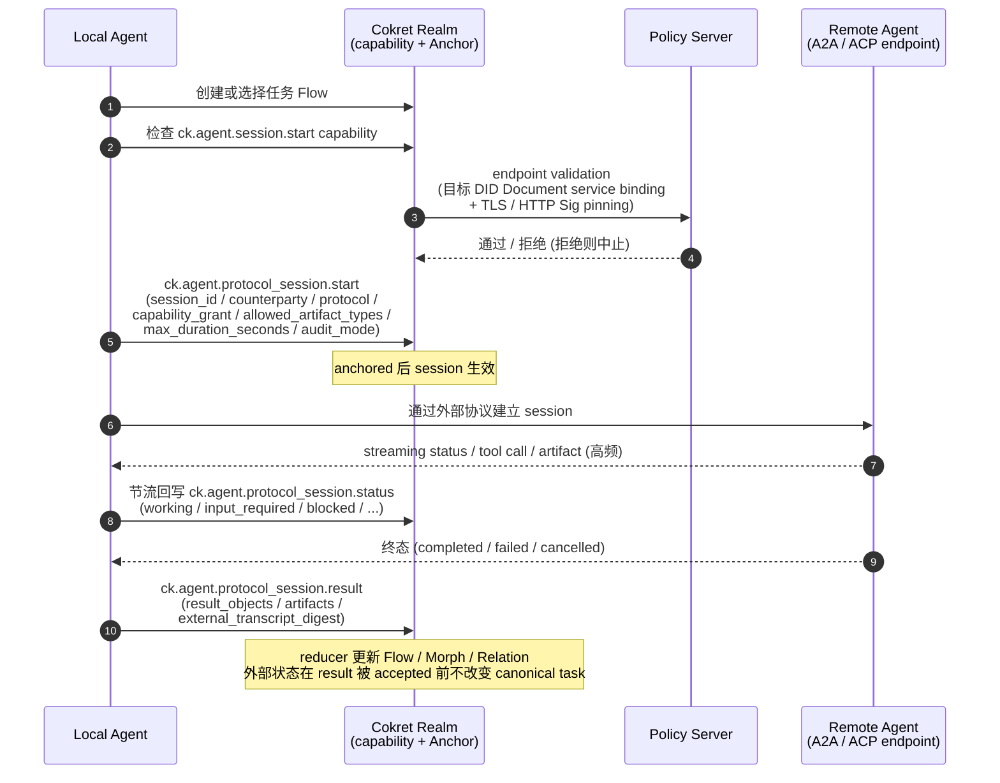

> **状态：extension profile（非 v1 core 互操作必需）**。本文档涉及的外部 agent 协议（A2A / ACP /
> MCP bridge 等）目前都未标准化（IBM Research 已宣布 ACP 并入 Linux Foundation 旗下的
> A2A）。Cokret v1 core 互操作 **不要求** 实现 agent-protocol upgrade；core v1 中 agent
> 仅作为 actor + capability 出现，外协议升级在标准成熟前由 `ck.profile.agent_runtime.v1`
> 单独承载，且视为可选 interop extension profile（见 `artifacts/profiles/conformance-profiles.json`
> 的 `profile_tiers.extension_profile_implementation`）。

## 0. 规范语言

本文中的规范关键字（**MUST** / **SHOULD** / **MAY** 等）按 [conformance/normative-language.md](../conformance/normative-language.md) 解释；仅大写形式具规范约束力。

## 1. 目标

Cokret 原生支持 AI agent 作为 Actor 参与协作，但不应假设所有 agent 通信都必须长期停留在 Cokret Event / Realm 模型内。

当两个 agent 都支持专用 agent-to-agent 协议，例如 A2A 或 ACP endpoint，且任务适合高频、流式、长运行或跨框架直接协作时，Cokret MAY 将一次协作从 canonical 协作层升级为外部 agent protocol session。

这里的“升级”不是替代 Cokret，而是：

- Cokret 负责身份、授权、任务登记、审计、状态回流和结果归档。
- A2A / ACP / 其他 agent protocol 负责高效的实时 agent-to-agent 执行通道。

## 2. 当前外部协议状态

截至本规范撰写时：

- ACP 原由 IBM BeeAI 推动，定位为轻量 HTTP-native agent 通信协议。
- IBM Research 页面已声明 ACP 正在并入 Linux Foundation 旗下的 A2A。
- BeeAI Framework 仍提供 ACP adapter，可连接 ACP-compliant service。
- A2A 使用 AgentCard / Task / Message / Artifact 等概念，面向 agent discovery、长任务协作、streaming、async 和跨框架互操作。

因此 Cokret 不应硬编码“ACP-only”路径。实现 MUST 使用 protocol adapter registry，并允许 A2A、ACP、MCP bridge、私有企业 agent protocol 并存。

## 3. 什么时候留在 Cokret

以下场景 SHOULD 留在 Cokret 原生协议：

- 需要强审计和长期可验证协作历史。
- 需要 Realm membership / capability / policy 逐事件判定。
- 需要 Flow / Morph / Relation / View 与人类 UI 紧密联动。
- 任务结果需要被人类审阅、批准、撤回或归档。
- 对端 agent 不可信、不可发现或没有受支持协议。
- E2EE / 合规 / policy server 要求所有步骤进入 Realm 账本。

Cokret 原生模式更适合作为“协作事实层”和“治理层”。

## 4. 什么时候升级到外部 Agent Protocol

以下场景 MAY 升级到 A2A / ACP / 其他 agent protocol：

- 两个 agent 需要高频 token streaming 或事件 streaming。
- 任务是长运行、分阶段、可暂停/恢复的 agent task。
- 对端 agent 已经以 A2A AgentCard 或 ACP metadata 暴露能力。
- 任务执行过程主要是 agent 内部推理、工具调用或跨框架编排，只有最终状态需要回写 Cokret。
- 多 agent 团队跨 LangChain、AutoGen、CrewAI、BeeAI、ADK 等框架协作。
- 需要临时直连或服务到服务通道，避免把每个 token / tool step 写成 durable Event。

升级 MUST 是显式、可授权、可审计的行为，不得由客户端静默发生。

## 5. 协议对象

### 5.1 Agent Endpoint

Agent 可在 profile 或 DID service endpoint 中声明外部协议能力：

```json
{
  "kind": "ck.agent.endpoint",
  "agent_id": "did:web:agent.example.com",
  "endpoints": [
    {
      "protocol": "a2a",
      "version": "1.x",
      "agent_card_url": "https://agent.example/.well-known/agent-card.json",
      "transport": ["https", "sse"],
      "auth": ["oauth2", "did-http-signature"],
      "content_types": ["text/plain", "application/json", "application/octet-stream"]
    },
    {
      "protocol": "acp",
      "version": "0.x",
      "metadata_url": "https://agent.example/info",
      "transport": ["https", "sse"],
      "auth": ["bearer", "did-http-signature"]
    }
  ]
}
```

> **`version` 语义(normative)**:endpoint 的 `version` 是 **human-readable hint**,仅供展示与粗粒度兼容判断;`1.x` / `0.x` 通配形式不是有效 semver 也不是 draft id,**MUST NOT** 用于精确 pinning 或版本协商。精确兼容与重放防护以 §5.2 / §5.5 的 `endpoint_digest`(= DID Document canonical hash + service endpoint digest 等 epoch 证据，见 §5.5)为唯一权威 pin;实现 SHOULD 在可行时同时给出精确版本 / 范围，但 reducer 与 session pinning MUST 以 `endpoint_digest` 为准，而非 `version` 字符串。

### 5.2 Protocol Session

升级会话由 Cokret 事件登记：

```json
{
  "kind": "ck.agent.protocol_session.start",
  "realm_id": "ck:realm:...",
  "actor_id": "did:web:requesting-agent.example.com",
  "payload": {
    "session_id": "ck:agent_session:019643c0-0000-7000-8000-000000000000",
    "task_flow_id": "ck:flow:4accc010-0000-7000-8000-000000000000",
    "counterparty_agent": "did:web:remote-agent.example.com",
    "protocol": "a2a",
    "protocol_version": "1.x",
    "endpoint_ref": "https://agent.example/.well-known/agent-card.json",
    "capability_grant": "ck:grant:...",
    "allowed_artifact_types": [
      "text",
      "file",
      "json"
    ],
    "max_duration_seconds": 3600,
    "audit_mode": "summary_and_artifacts"
  }
}
```

`ck.agent.protocol_session.start` 事件的提交 MUST 通过常规的 Realm 授权（capability action `ck.agent.session.start`）与 policy 校验。

Session start MUST pin counterparty DID epoch，规则见 [§5.5 DID Epoch Pinning (normative)](#55-did-epoch-pinning-normative)。

Endpoint 退役也是协议状态，不只是外部连接关闭。Agent owner、Realm admin 或持有等价 endpoint-management capability 的 actor 撤销 / 替换 endpoint 时，MUST 通过新的 `ck.agent.endpoint` 状态或等价 profile-declared endpoint record 把旧 `endpoint_digest`（即 §5.5 DID Epoch Pinning 中的 service endpoint digest;本文统一以 `endpoint_digest` 指代该 service endpoint digest,与 §5.5 的 "service endpoint digest" 同物,**见 [§5.5](#55-did-epoch-pinning-normative)**)标记为 retired / revoked；reducer 随后 MUST 拒绝以该 digest 发起的新 `ck.agent.protocol_session.start`，并把仍引用该 digest 的 active session 转为 `blocked` 或 `cancelled`，`reason_code=agent_endpoint_retired`。实现不得在旧 endpoint 仍能响应 HTTP 的情况下继续建立新 session，也不得自动把 session 迁移到新 endpoint；迁移必须重新 start 并重新 pin DID epoch（见 §5.5）。

### 5.3 Status 回流

外部协议执行过程中的状态 MUST 回流为 Cokret event：

```json
{
  "kind": "ck.agent.protocol_session.status",
  "realm_id": "ck:realm:...",
  "payload": {
    "session_id": "ck:agent_session:019643c0-0000-7000-8000-000000000000",
    "external_task_id": "a2a-task-123",
    "status": "working",
    "progress_basis_points": 4200,
    "last_update_at": "2026-04-26T00:00:00Z",
    "summary": "Remote agent is generating implementation plan."
  }
}
```

`progress_basis_points` 是可选的整数进度提示，取值域为 `0..10000` basis points（即 0% 到 100.00%，每 1 basis point = 0.01%）。它只表达外部任务的近似进度，不具授权或 canonical 状态语义；reducer MUST NOT 依据 `progress_basis_points` 改变 canonical task 状态（canonical 状态只由 `status` 与 `result` 决定）。超出 `0..10000` 的值 MUST 被拒绝或 clamp，并按 `agent_protocol_malformed_response` 处理。

标准状态：

- `negotiating`
- `accepted`
- `working`
- `input_required`
- `blocked`
- `completed`
- `failed`
- `cancelled`
- `expired`

Cancellation 是协议状态，不是只关本地 socket。持有 `ck.agent.session.cancel` capability 的 actor 或授权管理员取消会话时，MUST 通过 `ck.agent.protocol_session.status{status="cancelled"}` 或终态 `ck.agent.protocol_session.result{status="cancelled"}` 写入同一 `session_id`；payload MUST 携带 `cancelled_by`、`cancelled_at`、`reason_code`、`external_cancel_ref?` 和 `cleanup_required[]`。外部协议若无法确认 cancel，session MUST 先进入 `blocked`，直到 result 标记 `cancelled` / `failed` / `expired`。

`status="cancelled"` 完整示例(MUST 字段齐全):

```json
{
  "kind": "ck.agent.protocol_session.status",
  "realm_id": "ck:realm:...",
  "payload": {
    "session_id": "ck:agent_session:019643c0-0000-7000-8000-000000000000",
    "external_task_id": "a2a-task-123",
    "status": "cancelled",
    "cancelled_by": "did:web:requesting-agent.example.com",
    "cancelled_at": "2026-04-26T00:05:00Z",
    "reason_code": "user_cancelled",
    "external_cancel_ref": "a2a-cancel-789",
    "cleanup_required": [
      "remote_task_handle",
      "external_transcript"
    ],
    "last_update_at": "2026-04-26T00:05:00Z"
  }
}
```

`cancelled_by`(取消发起 actor DID)、`cancelled_at`(timestamp)、`reason_code`(取消原因码)与 `cleanup_required[]`(待清理外部 artifact 标识列表)在 `status="cancelled"` / `result{status="cancelled"}` 下 MUST 提供;`external_cancel_ref` 在外部协议返回 cancel 确认 id 时 MUST 携带，否则 MAY 省略。这些字段属 `ck.agent.protocol_session.status` / `.result` 的 payload。其机读 schema 真源为 [`schemas/event-payload.schema.json`](../../artifacts/schemas/event-payload.schema.json) 中对应 payload `$defs`(`agent.schema.json` 仅描述 agent session metadata snapshot,不含这些 wire payload 字段)。

### 5.4 Result 回流

最终结果 MUST 回写 Cokret：

```json
{
  "kind": "ck.agent.protocol_session.result",
  "realm_id": "ck:realm:...",
  "payload": {
    "session_id": "ck:agent_session:019643c0-0000-7000-8000-000000000000",
    "status": "completed",
    "result_objects": [
      {
        "object_type": "flow",
        "object_ref": "ck:flow:4accc010-0000-7000-8000-000000000000",
        "track": "synthesis",
        "role": "primary_result"
      }
    ],
    "artifacts": [
      {
        "artifact_type": "text",
        "object_ref": "ck:morph:0ecec3a6-8180-7000-8000-000000000000",
        "artifact_digest": "sha256:..."
      }
    ],
    "external_transcript_digest": "sha256:...",
    "artifact_retention": "retain_by_policy",
    "external_artifact_stub": {
      "artifact_digest": "sha256:...",
      "remote_id_digest": "sha256:...",
      "retention_reason": "realm_policy",
      "cleanup_retry_policy": "not_applicable"
    },
    "completed_at": "2026-04-26T00:10:00Z"
  }
}
```

`ck.agent.protocol_session.result` 的 `content` MUST 至少包含 `result_objects`、`artifacts` 或失败信息之一。`result_objects` 用于声明协议层可引用的持久化成果；v1 标准对象类型为 `flow`、`message`、`morph` 和 `blob` 引用。

外部 artifact 清理职责：若 start / status / result 暴露了外部 transcript、临时文件、tool output 或 remote task handle，result 终态 MUST 明确 `artifact_retention`（`retain_by_policy` / `delete_requested` / `deleted` / `unknown`）以及 `artifact_digest` / deletion receipt。`cancelled`、`failed`、`expired` 终态若未能删除外部 artifact，必须保留最小 `external_artifact_stub`（`artifact_digest`、`remote_id_digest`、retention reason、cleanup retry policy），不得把未验证的外部删除当成已完成。

Agent 产出的长期工作载体 SHOULD 优先落到 Flow：例如通过 Realm schema/profile、`metadata.fields.workflow_type`、Relation 或 labels 标记执行、决策、方案或研究类 Flow。需要聊天沉淀时，结果 MAY 同时附带 discussion Message 引用；二进制、代码包、长报告或外部 transcript 则 SHOULD 存为 Morph / Blob / Artifact，并在 result event 中引用 hash。

### 5.5 DID Epoch Pinning (normative)

本小节集中定义外部 agent DID 的 epoch pinning 规则。§5.2、§5.3、§5.4、§6 中所有提及 "pin DID epoch" / "DID epoch mismatch" 的位置均引用本小节，不再各自重复定义。

`ck.agent.protocol_session.start` MUST pin counterparty DID epoch。payload 或 `refs[]` evidence MUST 记录：

- counterparty DID Document canonical hash；
- method-specific version / log entry id（若 DID method 支持版本化）；
- matched service entry id；
- service endpoint digest（即 §5.2 所称 `endpoint_digest`,二者同物）；
- verification method。

reducer normative：

- 外部协议握手时 MUST 携带并签名同一组 pin digest。
- `ck.agent.protocol_session.status` / `result` 回流时 reducer MUST 校验这些 pin 仍与 session start 一致。
- 若外部 DID 在会话期间轮换到不同 service endpoint 或 verification method，现有 session MUST 进入 `blocked` 或 `cancelled`，reason `session_pinned_did_epoch_mismatch`，MUST NOT 静默迁移到新 endpoint；迁移必须重新 start 并重新 pin。

> 对无版本化 DID method（如部分 `did:web` 部署），canonical hash + service endpoint digest 即构成该 method 可用的 epoch 证据；reducer MUST 以 fetch-time digest 不匹配作为 mismatch，不得因为 method 不提供显式版本号而跳过校验。

## 6. 协商流程

下图把一次升级到外部 agent protocol 的握手画成时序图。**Cokret 始终持有身份 / capability / 任务登记 / 审计**，外部协议只承担高频实时执行通道。



读图要点：

- 步骤 3-4 的 endpoint validation 是 normative MUST：必须把 endpoint URL 与目标 agent DID Document 的 `service` entry 完全匹配，并校验 TLS / HTTP Message Signature 与 verificationMethod 绑定。
- 节流回写 `status` 不要求每个 token 都进 durable Event；具体频率由 `audit_mode` 决定（`status_only` / `summary_and_artifacts` / `full_transcript_digest` / `full_transcript`）。
- Cokret 不信任外部 task status：只有 `ck.agent.protocol_session.result` event 被 reducer accept 后才改变 canonical task 状态。


1. Requesting agent 查询目标 agent profile、DID service endpoint、A2A AgentCard 或 ACP metadata。
2. Requesting agent 在 Cokret 中创建或选择任务 Flow，或选择可承载任务语义的 Morph。
3. Requesting agent 检查自己是否拥有 `ck.agent.session.start` capability。
4. **Endpoint validation（normative MUST）**：Policy Server MUST 验证目标 endpoint 与目标 agent DID 的 service binding 一致性，至少完成以下检查（任一失败 MUST 拒绝 session start）：
   - 解析目标 agent DID Document，确认其 `service` entry 的 `serviceEndpoint` URL 与 session start 中声明的 endpoint **完全匹配**（包括 scheme / host / port / 路径前缀）。
   - 验证目标 endpoint 的 TLS 证书 / mutual TLS / HTTP Message Signature 与 DID Document 中声明的 verificationMethod 绑定（与 [`../sync/federation.md` §3.1-§3.2](../sync/federation.md) destination host pinning 同等强度）。
   - 按 [§5.5 DID Epoch Pinning (normative)](#55-did-epoch-pinning-normative) 把 DID epoch pin（canonical document hash、method-specific version / log entry id（若 method 支持）、matched service entry id、service endpoint digest、verification method）写入 session start 的 audit binding 或 policy decision evidence，并在外部协议握手与 `status` / `result` 回流时按 §5.5 校验。
   - **`allowed_endpoints` 只作 constraint 预筛，不替代精确匹配**：capability constraint 中的 `allowed_endpoints` 通配（如 `https://*.trusted.example`）只用于在 session start 之前粗粒度收敛候选 endpoint 集合；最终 session start MUST 仍满足上文的精确 DID-service-binding 匹配（`serviceEndpoint` URL 与 DID Document 的 `service` entry **完全匹配**）。通配命中本身 MUST NOT 被当作授权通过。实现 SHOULD 警告通配子域（`*.example`）会扩大 handoff 攻击面，并 SHOULD 把 `allowed_endpoints` 限为 host suffix 精确集合或显式 host 列表，而不是开放通配。
   - **Egress policy（normative 失败条件）**：当目标是外发 E2EE Realm 明文或其派生明文时，session start MUST 命中显式 egress grant 并通过数据分类（`allowed_data_classes`）校验；任一不满足 MUST 拒绝 session start，reason=`egress_policy_denied`。详见 [§8 安全边界](#8-安全边界)。
   宽松的 MAY 路径会留下漏洞窗口——恶意中间人可在不被任何节点验证的情况下劫持 A2A handoff，因此本规范统一为 MUST。
5. Requesting agent 提交 `ck.agent.protocol_session.start`。
6. 双方通过选定外部协议建立 session。
7. 执行过程按节流策略回写 `status`。
8. 结果、artifact、transcript hash、错误或取消原因回写 Cokret。
9. Reducer 将 Flow、Morph、Relation 或 notification 更新为最终状态。

## 7. Capability

新增标准动作（capability actions; 对应 event kind 保留 `ck.agent.protocol_session.*` 前缀以兼容已存在的 wire bytes）：

- `ck.agent.protocol.discover`
- `ck.agent.session.start`（authorize submitting `ck.agent.protocol_session.start`）
- `ck.agent.session.cancel`（authorize cancellation flow that writes `ck.agent.protocol_session.status{status="cancelled"}` / `result`）
- `ck.agent.session.stream_status`（authorize streaming `ck.agent.protocol_session.status`）
- `ck.agent.session.attach_artifact`（authorize artifact attachment that flows through `ck.agent.protocol_session.status` / `result`）
- `ck.agent.session.read_transcript`（authorize transcript read; no event kind side-effect）

Capability constraint SHOULD 支持：

```json
{
  "allowed_protocols": ["a2a", "acp"],
  "allowed_endpoints": ["https://*.trusted.example"],
  "max_duration_seconds": 3600,
  "max_artifact_bytes": 10485760,
  "allowed_data_classes": ["public", "internal"],
  "requires_human_approval": true,
  "egress_policy": "metadata_only"
}
```

## 7.1 与 Personal Agent Runtime Session 的边界

本文档定义的是与 **外部 A2A / ACP / MCP agent protocol** 互操作的 session 模型(`ck.agent.protocol_session.start/status/result`)。它与 [`../identity/key-management.md` §3.6.1](../identity/key-management.md) 定义的 **personal agent runtime authentication session**(`/_cokret/gate/account/session-grants` + `proof.proof_kind="agent_key_proof"`)是**两个不同的 session 概念**:

| 维度 | Personal agent runtime session | External agent protocol session(本文档) |
| --- | --- | --- |
| 用途 | Cokret 内部 native agent runtime 认证 Auth Server 与 Events API | 与外部 A2A / ACP / MCP endpoint 协商执行 task |
| Endpoint | `/_cokret/gate/account/session-grants` | `ck.agent.protocol_session.start` Event + 外部 protocol endpoint |
| Proof | `agent_key_proof`(短期 `ck.session.grant`) | 由 `ck.agent.endpoint` policy / external protocol auth 决定 |
| 是否数据外发 | 否——session 只用于在 Cokret 内签发后续 wire write | 是——外发到 external agent network |
| Realm policy 闸口 | `ck.profile.personal_agent_provisioning.v1` / `ck.profile.agent_auth.v1` | `ck.profile.agent_runtime.v1` + `audit_mode` |

Agent runtime 拥有 `ck.profile.agent_auth.v1` session grant **不**自动授权其启动外部 agent protocol session;后者仍需独立的 `ck.agent.protocol_session.start` 写入、`ck.agent.endpoint` policy 校验、以及 §8 的外发行为约束。实现 MUST 把二者作为独立 capability 与独立 audit 流处理。

## 8. 安全边界

外部 agent protocol session 是数据外发行为。实现 MUST：

- 在启动前做 capability 检查。
- 记录 endpoint、protocol、counterparty、task、grant 和数据分类。
- 外发 E2EE Realm 明文或其派生明文 / 摘要时，session start MUST 命中显式 egress grant（如 capability constraint 中的 `egress_policy` 配合具体 grant）并通过数据分类（`allowed_data_classes`）校验；任一不满足，实现 MUST 拒绝 session start，reason=`egress_policy_denied`，MUST NOT 退回到 SHOULD 形态或静默外发。
- 对敏感 Realm 默认要求 human approval。
- 对返回 artifact 做 hash、MIME、size、malware scan 和 policy check。
- 不信任外部 task status；只有 Cokret result event accepted 后才改变 canonical task 状态。
- 支持 cancellation 和 timeout。

## 9. 审计模式

`audit_mode`：

- `status_only`：只记录 start/status/result。
- `summary_and_artifacts`：记录摘要、artifact hash 和关键状态。
- `full_transcript_digest`：不保存全部明文 transcript，但保存外部 transcript 的 hash / Merkle root。
- `full_transcript`：完整回写 transcript。仅在 policy 允许且用户知情时使用。

默认 SHOULD 使用 `summary_and_artifacts`。

## 10. 与 MCP 的关系

MCP 主要是 agent 到 tool/data 的协议，不是 Cokret 的 agent-to-agent 升级目标。但外部 A2A / ACP agent 在执行内部 MAY 使用 MCP 调用工具。

Cokret 只要求最终状态、artifact、审计证明和授权边界回流，不要求记录远端 agent 内部每次 MCP tool call，除非 Realm policy 要求 full transcript 或 regulated audit。

## 11. Adapter Registry

实现 SHOULD 提供 adapter registry：

| Adapter | 用途 |
| --- | --- |
| `a2a` | 首选 agent-to-agent 外部协议。 |
| `acp` | 连接使用 ACP metadata / endpoint 的 BeeAI 或 ACP-compliant service。 |
| `mcp_bridge` | 将 Cokret task 包装为 MCP tool/resource 调用，适合 agent-to-tool。 |
| `http_custom` | 企业内部私有 agent API，需要显式 allowlist。 |

Adapter MUST 声明：

- discovery mechanism
- auth mechanism
- streaming support
- task id mapping
- message/artifact mapping
- cancellation mapping
- error mapping
- transcript hash format

## 12. 失败处理

失败 MUST 回写为 `ck.agent.protocol_session.status` 或 `result`：

| 错误 | 语义 |
| --- | --- |
| `discovery_failed` | 找不到或无法验证对端 metadata / AgentCard。 |
| `protocol_not_supported` | 双方没有共同协议。 |
| `auth_failed` | 外部协议认证失败。 |
| `policy_denied` | Cokret policy server 或 capability constraint 拒绝。 |
| `egress_policy_denied` | 外发 E2EE Realm 明文 / 派生明文未命中显式 egress grant 或未通过数据分类校验；MUST 拒绝 session start（见 §6 步骤 4 与 §8）。 |
| `remote_rejected` | 对端 agent 拒绝任务。 |
| `timeout` | 超过最大执行时间。 |
| `cancelled` | 主体或管理员取消。 |
| `artifact_rejected` | 返回 artifact 未通过安全或 schema 检查。 |
| `agent_endpoint_retired` | pinned endpoint 已被 owner/admin 标记退役或撤销；现有 session 必须 blocked/cancelled，新 session 必须重新 pin。 |
| `agent_protocol_malformed_response` | 外部协议返回无法按声明 schema / transcript hash / artifact binding 验证的响应；必须写回 status/result，而不是静默丢弃。 |

失败不得删除 `start` event；审计链必须保留。

## 13. 设计结论

Cokret SHOULD 支持 agent protocol upgrade，但它必须是受控 handoff：

- Cokret 是 durable coordination / authorization / audit layer。
- A2A / ACP 是 optional execution transport。
- 所有外部执行的输入边界、状态、结果和审计证明必须回到 Cokret。

这样 Cokret 可以连接外部 agent 生态，同时不牺牲 DID、capability、Realm policy、E2EE 和审计模型。
