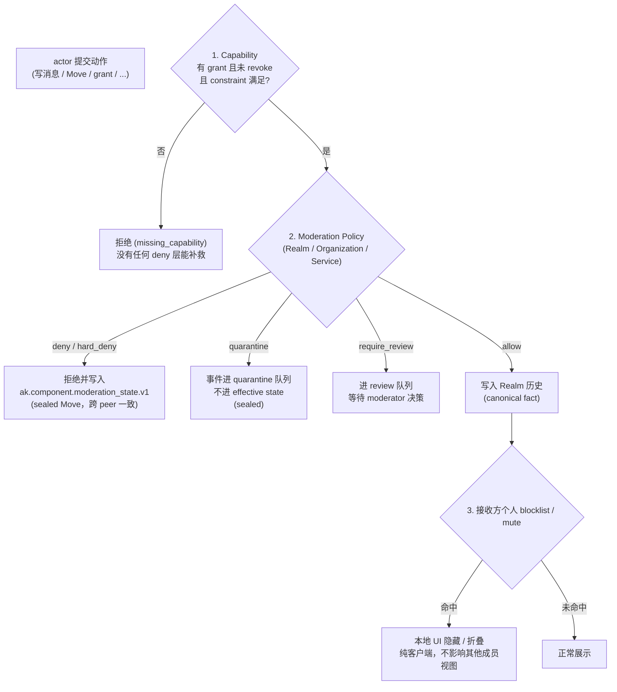

## 0. 规范语言

本文中的规范关键字（**MUST** / **SHOULD** / **MAY** 等）按 [conformance/normative-language.md](../conformance/normative-language.md) 解释；仅大写形式具规范约束力。

## 1. 目标

去中心化协作协议不能仅依赖"好人不会来捣乱"的假设。协议必须提供标准化的**内容审核与用户管理**机制，包括：

- 用户举报不当内容
- 忽略/屏蔽其他用户
- Realm 级别的审核动作与可审计决策
- 组织级别的准入黑名单、允许列表和风险策略
- 服务器级别的访问控制

## 2. 设计原则

### 2.1 审核权由 Realm / Circle 管理员行使

去中心化环境中没有"全网管理员"。内容审核的权限由 Realm / Circle 的 Capability 体系决定：

- Realm-default 内容由持有对应 `ak.moderation.decision`、`ak.moderation.decision.lift`、`ak.message.redact` 或成员治理 grant 的 Actor 处理。
- Circle-scoped 内容由该 Circle 的管理员 / moderator 处理；Realm 管理员只有在 grant 明确覆盖目标 Circle 时才可以处理该 Circle 的举报。
- 普通用户举报不会触发合规审计、历史 key release 或外部审查方密钥访问。

### 2.2 屏蔽是本地行为

用户屏蔽另一个用户是纯本地的客户端行为，不需要广播到网络。协议不应强制"告诉全世界我屏蔽了谁"。

### 2.3 举报留痕但不公开

举报记录应被安全送达目标 `effective_scope` 的管理员 / moderator，但不应暴露给被举报人或其他普通成员。Circle 举报不得泄露给无权知道该 Circle 内容的 Realm 普通成员。

### 2.4 黑名单不是 capability grant

Arkret 的授权核心仍然是 allow-grant + explicit revoke。黑名单、过滤器和风险策略是额外的 deny/quarantine 层：

- 没有 capability 时，黑名单不能创建权限。
- 有 capability 时，Realm / Organization / Service policy MAY deny、quarantine 或 require review。
- 个人 block 只影响个人客户端体验，不能替 Realm 删除其他成员可见的事实。

### 2.5 Capability / Moderation / Personal Blocklist 三层判定

下图把动作从提交到呈现要穿过的三层 gate 画在一起。**Capability 是唯一的"能不能做"判定**，Moderation 只能在 capability 之上叠加 deny / quarantine / require_review，Personal Blocklist 完全是接收方本地行为。



读图要点：

- **Capability 是唯一 allow 来源**：黑名单 / moderation policy / personal blocklist 都不能凭空创造权限。
- **Moderation 决策 MUST sealed**（见 §2.6）：`hard_deny` / `quarantine` / `require_review` / `dismiss` 必须通过 sealed Move 写入 `ak.component.moderation_state.v1` cell；`dismiss` 仅终结绑定的举报 queue item，不改变目标内容的 effective decision。
- **Personal Blocklist 不进 cell**：它只是接收方本地客户端 view 过滤，不广播、不共享、不替 Realm 删除其他人可见的事实。
- **Blocklist 不可枚举**：个人 block 命中不得向被屏蔽方或 federation peer 暴露为独立错误码、receipt 差异、presence / typing 差异或 directory 结果差异；对外表现必须与普通不可见、不可达或不存在一致。

### 2.6 Moderation 决策 MUST Sealed

任何会改变其他 peer 对事件可见性、可写性或可分发性判断的 moderation decision——即 `hard_deny`、`quarantine`、`require_review`——MUST 通过 sealed Move 写入 `ak.component.moderation_state.v1` cell。`dismiss` 同样使用 sealed `ak.moderation.decision`，但其 `target_ref` MUST 指向被驳回举报的 `ak.self.moderation.report` Event，且只把对应 queue item 终结为 `resolved`；它在目标内容的 decision fold 中等价于 `none`，不得放行本来缺少 capability 或被其它 active decision 拒绝的操作。个人 blocklist 仍是 out-of-band，不进入该 cell。

**确定性收敛与提交路径（normative）**：`ak.component.moderation_state.v1` cell 的确定性收敛由 [`event-kind-registry.json`](../../artifacts/registry/event-kind-registry.json) 注册的 sequenced_state 及集合值定义，与 capability cell（[`authz/capabilities.md` §12.1](../authz/capabilities.md)）同型：`ak.moderation.decision` = 对 moderation_state cell 的安全集合 **add**；`ak.moderation.decision.lift` = 对同一 cell 的**部分撤销**，投影为 `or_set_remove_dots`，移除集合逐字节等于 payload 的 `observed_dot_ids[]`。裁决一律经 `POST /_arkret/self/events` 作为 self-authored Move 提交，**不经任何实现私有运维 / admin 写路径**；治理状态完全由数据/控制面 reducer 收敛，运维管理面不持有 moderation 真相。lift 只解除指定 decision 的后续治理效力，不删除审计事实，也不复原已经接受的 redaction tombstone、已经密码学销毁的 content key 或其它不可逆 effect；需要恢复可见内容时只能由有权 actor 创建新的 replacement Event / object，并重新执行当下 authz 与 content policy。

**active decision set 与 effective decision（normative）**：moderation_state cell 的当前值是“所有尚未被 observed-remove 的 decision add”组成的集合，不是 last-writer register。对某次 read / write / distribute，reducer 先筛出 target 与可选 `action` 对本次路径适用的 active entries，再按封闭收紧序 `hard_deny > quarantine > require_review > none` 取最严格 effective decision；`dismiss` 只适用于 report queue item 且 fold 为 `none`，`soft_deny` 不写 cell，`allow` 也不是 decision add。多个 issuer 或同一 issuer 的多个合法 add 并存是 确认安全集合的正常状态，必须按该 fold 得到相同结果，**不得**因“集合元素多于一个”直接报 `moderation_control_split`，也不得按本地到达顺序选 winner。只有同一 add identity 对应不同 canonical bytes、remove provenance 不可验证或 安全确认或完整状态证明损坏 等真正 non-joinable / 损坏状态才进入 split fail-closed。

**`require_review` 承载与解除（normative）**：active `decision="require_review"` add 本身就是 pending-review 的 canonical 承载；review queue 是从这些 active adds（以及独立 report queue items）派生的 View，不另造第三套中间态。候选 Event / operation 在 review 期间保持 proposal / observed-only，不得进入 effective state。reviewer 必须用以下封闭路径结束该 gate：

- **allow**：在同一 ordered submit batch / control transaction 中，对本次 gate 的全部 active `require_review` decision 分别提交 `ak.moderation.decision.lift`。lift 后若不再有更严格 active decision，候选仍 MUST 以**当前** capability、policy、membership、quota 与 target state 重新求值后才可接受；不得把旧 review 结果当作绕过当前授权的 allow grant。
- **quarantine / hard deny**：在同一 batch 中 lift 本次 gate 的全部 active `require_review` decision，并 add 一条 replacement `ak.moderation.decision`（`quarantine` 或 `hard_deny`）。lift 与 replacement 必须原子接受；缺一时保持原 pending 状态并拒绝部分提交。
- 对同一 target 仍有其它适用 active decision 时，effective decision 继续按上述最严格 fold 计算；解除一条 review 不得隐式 lift 其它 issuer 的 decision。

**lift 的移除集合（normative）**：`ak.moderation.decision.lift` 的 payload MUST 携带
`observed_dot_ids[]`，reducer 精确投影为 `{"kind":"or_set_remove_dots","dots":{"field":"payload.observed_dot_ids"}}`，
移除集合与该数组**逐字节相等**。每个 dot 的 `event_id` 段 MUST 等于 `decision_ref` 的完整 EventId token——
这就是上一条"不得隐式 lift 其它 issuer 的 decision"的机器可读形式。

lift MUST NOT 使用 `or_set_remove_observed`：该形态移除冻结前态下该 cell 上**全部**存活 add
dot，会连带撤销其它 issuer 的 decision；[`../models/event-and-patch.md` §2.4.2](../models/event-and-patch.md)
逐字禁止用它做部分撤销。`decision_ref` 与 `observed_dot_ids[]` 不可互相替代：前者是
`ak:event:<44-char-event-token>`，dot 是 `ak:event:<44-char-event-token>:<write_index>`，二者永不逐字节相等，而 §2.4.2
不提供 `event_ref -> dot` 的派生式。

若要替换既有处置，提交方可在同一 batch 中 lift 被指名的旧 decision dot 并新增 replacement decision；
新 decision 是同一 cell 上的新 dot，继续参与最严格 fold。

## 3. 内容举报 (Report)

### 3.1 举报操作

用户可以举报自己可见的 Realm / Circle 对象（Message、Strand、Morph、Relation 等）：

```
POST /_arkret/self/moderation/report
```

请求 body 是 closed `{report_event: EventInitialSubmission}`，不得同时携带 unsigned `realm_id`、
`target_ref`、`reporter` 或 evidence 投影。`report_event.event.kind` MUST 为
`ak.self.moderation.report`；payload 字段如下：

| 字段 | 类型 | 必填 | 说明与约束 |
|------|------|------|------|
| `realm_id` | id | required | 被举报对象所在 Realm；MUST 等于 Event realm、signed scope 与 target-derived Realm。 |
| `effective_scope` | object | optional | Realm target 缺省为 `{kind:"realm", realm_id}`；Circle target MUST 显式签入 `{kind:"circle", realm_id, circle_id}`。 |
| `target_ref` | id | required | 被举报 accepted Object / Event 的 canonical ref；服务端不得把 Operation ref 映射成另一个 ref 后代签或改写 Event。 |
| `report_reason_code` | enum | required | 举报原因码，取值见 §3.2。 |
| `description` | string | optional；`report_reason_code=other` 时 required | 举报说明；服务端 MAY 限制长度。 |
| `reporter` | did_core_id | required | MUST 等于 Event `actor_id` 与认证 session principal。 |
| `provenance` | enum | optional | self endpoint 只允许省略或 `self`；`mimi_facade` 只属于独立 MIMI facade ingress。 |
| `evidence_refs` | id[] | optional | reporter 可见证据的 canonical refs，集合内不得重复。 |
| `evidence_package` | object | optional | [`moderation-evidence.schema.json#/$defs/evidence_package`](../../artifacts/schemas/moderation-evidence.schema.json) 的 closed 加密证据包。 |
| `franking_proof` | object | optional | [`moderation-evidence.schema.json#/$defs/franking_proof`](../../artifacts/schemas/moderation-evidence.schema.json) 的完整密文投递证明。 |

该 self operation 只接受 reporter 本人设备直接签名：`event.actor_id == payload.reporter ==
session principal`，并禁止 `executed_by`、`authorization_ref`、`applet_id`、`source_provider` 与
MIMI facade provenance。它是 DataEvent，MUST 携带 `auth_context`，MUST NOT 携带
`seal_basis` 或 `preconditions`。服务端只把 exact signed bytes 送入 ordinary Event admission，
不得构造、重建、共同签名或注入任何 guard。

响应字段：

| 字段 | 类型 | 必填 | 说明 |
|------|------|------|------|
| `report_id` | id | required | 从 accepted `report_event.event.event_id` retype 派生；服务端不得另分配 ID。 |
| `status` | const(`submitted`) | required | 首次 accepted 时存储的 submit outcome；后续 queue-item resolved 不得改写重放响应。 |
| `routed_to` | did_core_id[] | optional | 普通 reporter 的响应 MUST 省略；只有 caller 独立持有 exact scope 的 moderation/governance capability 时才可返回，避免枚举治理拓扑。 |

请求示例（非完整 schema）：

```json
{
  "report_event": {
    "event": {
      "kind": "ak.self.moderation.report",
      "realm_id": "ak:realm:Ac1aCK8aQdnkYImvdH3DFjq4jDCP198pXYWCGzGuVyj5",
      "scope_ref": {
        "kind": "circle",
        "realm_id": "ak:realm:Ac1aCK8aQdnkYImvdH3DFjq4jDCP198pXYWCGzGuVyj5",
        "circle_id": "ak:circle:AaalePlTK6W4ZKrbKyKzlmmcdhXVx-InxeWY4ul69tiN"
      },
      "actor_id": "ak:did_core:webvh:zBfFLx7gUhQB7dPEQCj3qeHZR",
      "payload": {
        "realm_id": "ak:realm:Ac1aCK8aQdnkYImvdH3DFjq4jDCP198pXYWCGzGuVyj5",
        "effective_scope": {
          "kind": "circle",
          "realm_id": "ak:realm:Ac1aCK8aQdnkYImvdH3DFjq4jDCP198pXYWCGzGuVyj5",
          "circle_id": "ak:circle:AaalePlTK6W4ZKrbKyKzlmmcdhXVx-InxeWY4ul69tiN"
        },
        "target_ref": "ak:message:AfslM_DNod70pfu-VkH6C2UTYa4N7qqqTljZ_MYLBciF",
        "report_reason_code": "harassment",
        "description": "This message contains targeted personal attacks.",
        "reporter": "ak:did_core:webvh:zBfFLx7gUhQB7dPEQCj3qeHZR",
        "provenance": "self"
      }
    }
  }
}
```

#### 3.1.1 举报入口反滥用约束（normative）

举报入口本身是可被滥用的写路径（举报洪水、超大 evidence_package 充塞、franking_proof 重放）。实现 MUST：

- 对 `/_arkret/self/moderation/report` 按 [`../security/server-threat-model.md` §2.3](../security/server-threat-model.md) 的通用防护手段施加**分层限速**（至少按 signed payload reporter、source service、Realm、source IP hash、endpoint 维度），超阈值 MUST 返回 `rate_limited`；同一 Event 的 exact replay 不得被重写成新举报，同 reporter 对同一 target 的不同 Event 仍 MAY 被限速或抑制。
- 对 `evidence_package` 施加大小上界：其总字节数 MUST 受一个 `max_total_blob_bytes` 等价上界约束（命名遵循 [`../models/common-fields.md` §3.0.1](../models/common-fields.md)），超限 MUST 拒绝而非静默截断。
- 对 `franking_proof.replay_nonce` 的去重存储 MUST 有界：去重窗口 MUST 有限（时间或计数），过期 nonce MAY 被驱逐；实现 MUST NOT 假定无限去重存储，超出窗口的 nonce 复用按不可验证投递证明处理（见 §3.4）。
- **target scope 绑定（normative）**：服务端 MUST 从 signed `payload.target_ref` 解析 accepted target 的真实治理边界，并校验它逐字等于 Event/payload Realm、signed `scope_ref` 与显式/默认 `effective_scope`。Circle target 不得省略 signed Circle scope。reporter 对 target 不可见时同样拒绝；目标不存在、不可见与任一 scope mismatch 全部返回同一 `not_found`，响应形态与时序不得形成对象/Circle 枚举 oracle。
- accepted Event 恰好 append 一条 report log 并物化一个不同 typed-id 的 queue item；两者都从 Event ID retype。exact canonical replay MUST 返回首次存储的 byte-identical `status=submitted` outcome 且不得再次 append；同 Event ID 异 canonical bytes MUST `duplicate_conflict` 并零新增写入。

### 3.2 举报原因枚举

| Report reason code | 说明 |
|--------|------|
| `spam` | 垃圾信息 / 广告 |
| `harassment` | 骚扰 / 人身攻击 |
| `hate_speech` | 仇恨言论 |
| `nsfw` | 不适当的成人内容 |
| `illegal` | 违法内容 |
| `misinformation` | 虚假信息 |
| `other` | 其他原因（需要 `description` 补充说明） |

### 3.3 举报的处理

- 举报 service operation（`ak.self.moderation.command.report.v1`）接受 reporter 已签名的 `ak.self.moderation.report` Event，并原样写入 Realm Event history；服务端不得物化或代签该 Event。Circle 举报的 plaintext metadata 和 evidence audience MUST 按 `effective_scope.kind="circle"` 加密 / 限制。
- 该事件仅对目标 scope 的管理员 / moderator 可见；Realm-default 内容是 Realm moderator，Circle 内容是 Circle moderator 或显式覆盖该 Circle 的 Realm grant 持有者。
- 被举报人不会收到通知。
- 管理员可以基于举报决定后续行动（警告、删除内容、封禁用户等）。
- 举报不会授予 moderator 历史 key、epoch key、审计 applet release 权限或外部 verifier 权限。

**queue-item 生命周期（normative，`moderation-queue-item.schema.json` 是权威源）**：v1 刻意最小化为两态。submit operation 的 stored response 始终是 `status=submitted`；queue-item 后续状态不能改写 exact replay outcome。

| 状态 | 语义 | 合法后继 | 终态? |
| --- | --- | --- | --- |
| `submitted` | 举报已受理，待处理 | `resolved` | 否 |
| `resolved` | 处理完成 | —(终态) | **是** |

`submitted → resolved` 只能由一条已接受、目标绑定该 `report_id`（或其被举报 target）的 `ak.moderation.decision` 派生；举报不成立时 moderator MUST 使用 `decision="dismiss"` 并令 `target_ref` 指向该 report Event。decision issuer MUST 持有该 decision 所需 moderation capability。queue service / reducer 在同一 accepted basis 上把 item 投影为 `resolved`，不接受 reporter、普通成员或无对应 decision 的显式 close/status 写入。重复派生是幂等 no-op；从 `resolved` 转出 MUST `failed_precondition`。

- **处置结果**(是否违规、采取何种处置)**不进** `status`,由独立的 `ak.moderation.decision` 事件承载。
- 本两态 queue-item 只承载用户 `report` 的受理 / 完成，不承载 §2.6 的 policy `require_review` pending 状态。后者以 active moderation decision add 为真相源并投影到同一 UI queue；两者可以在 View 中合并展示，但 reducer MUST 保持各自 lifecycle 与 id 不混用。
- 如后续工作流需要中间相(如 triage / review 分阶段),MAY 在新修订中增补状态值;v1 实现 MUST NOT 产生这两值之外的 `status`。

### 3.4 E2EE 举报 Evidence Package 与 Franking

在 E2EE Realm / Circle 中，服务端无法读取正文。举报 E2EE 内容时，reporter MAY 提交一个加密 evidence package 给目标 scope 的 moderator；实现 SHOULD 支持 `franking_proof`，用于证明某条密文 envelope 曾被接收服务投递，而不保存明文。

Evidence package SHOULD 包含 reporter 自己可见并愿意提交的最小证据，例如：

- 被举报消息明文或必要 excerpt；
- 原始 encrypted envelope；
- plaintext / ciphertext / AAD digest；
- reporter 对 evidence package 的签名；
- 可选 `franking_proof`。

Evidence package MUST 加密给 `effective_scope` 对应 moderator audience。它 MUST NOT 包含 Realm / Circle 历史 key、MLS epoch secret、exporter secret 或允许 moderator 解密未举报消息的材料。

该最小披露闭包由 `ak.vector.moderation.evidence_package_minimal_disclosure.v1` 固化；实现 MUST 把 evidence package 的目标、加密 audience、reporter signature evidence 与禁止披露的 MLS epoch/history secrets 一并纳入校验。

Canonical franking proof 结构（示例中的 signature 字节以 `...` 省略）：

```json
{
  "realm_id": "ak:realm:Ac1aCK8aQdnkYImvdH3DFjq4jDCP198pXYWCGzGuVyj5",
  "event_id": "ak:event:AQsHmGu_9sPOyJ4aG8VlWQBp8wGGhdC-BjfAaXqrIbk-",
  "received_by": "ak:did_core:webvh:z5a3yeFnKQFn6ZqPY1Qgv3RrZ",
  "verification_method": "did:webvh:z5a3yeFnKQFn6ZqPY1Qgv3RrZ:server.acme.example#franking-key-1",
  "received_at": "2026-04-30T00:00:00Z",
  "replay_nonce": "base64url...",
  "signature": "base64url..."
}
```

**Durable Event 与 report 内嵌对象的单一合同（normative）**：[`moderation-evidence.schema.json#/$defs/franking_proof`](../../artifacts/schemas/moderation-evidence.schema.json) 同时是 `ak.moderation.franking_proof` durable Event 的完整 payload 合同，以及 report payload 内嵌 `franking_proof` 的合同；两处不得维护不同字段集。`payload.event_id` 是**被证明已接收的 encrypted Event ID**，也是 `ak.component.moderation.franking_proof.v1` ordered-log cell 的 subject；它不是承载该 proof 的外层 Event 自身 `event_id`。Proof 在接收密文时由 receiving service 生成，先于且独立于任何后续 report，因此 payload MUST NOT 携带 `report_id` 或 `target_ref`，report 与 proof 的关联由 report 内嵌该完整 proof 对象建立。

当 receiving service 把 proof 发布为 `ak.moderation.franking_proof` Event 时，reducer MUST 在写 cell 前验证：envelope `realm_id == payload.realm_id`、envelope `actor_id == payload.received_by`、`payload.event_id` 指向同 Realm 内已接受且内容承诺可重算的 encrypted Event、`replay_nonce` 未在有效去重窗口内使用，且 payload `signature` 可由 `verification_method` 在 `received_at` 验证；该 method 的 controller 投影 MUST 等于 `received_by` 并在该 Realm 获授权。任一绑定不成立 MUST 按 `crypto_verifiable` admission fail closed；不得仅因 JSON Schema 通过就 append。

规则：

- 唯一签名字节是 `RFC8785_JCS({domain:"ak.franking_proof.signature.v1",realm_id,event_id,received_by,verification_method,received_at,replay_nonce})`。该 locally anchored detached signature domain 登记在 `proof-context-registry.json#domain_separations`；不得添加另一个 digest、proof id、kind 或 sender claim 镜像。
- `event_id` 是目标 Event producer-signed canonical content projection 的唯一承诺。Verifier 必须取得目标 accepted Event、按该 Realm 的 digest suite 重算 Event ID 并逐字比较，同时走普通 Event admission 路径验证 envelope proof、actor、Realm 与 routing binding。Franking proof 不复制任何可从目标 Event 投影出的 digest 或 sender 元数据，也不因自身存在而获得 MLS secret 或 AEAD 验证权限。
- `franking_proof` MUST NOT 包含 plaintext body、attachment filename、reply excerpt、mention 列表、private handle 或解密后内容 hash。
- **`received_by` / `received_at` 向非群成员 moderator 最小化（normative）**：Canonical `franking_proof` 必须保留被签名的 receiving service DID 与精确接收时间，分别按 schema 的 DID / timestamp 形态承载，否则无法执行 service-key authority 与签名时点校验；实现 MUST NOT 把 DID digest 填入 canonical `received_by`，也 MUST NOT 把 bucket 值冒充 canonical `received_at`。由于这两项会暴露 Station 拓扑与秒级活动 timing，完整 proof payload 只允许在持有对应治理 capability 的验证路径内解密/读取。普通 reporter 或不具该能力的非群 moderator只能取得**非 proof 的最小化投影**：`received_by` MAY 投影为 service DID digest 或“某授权投递服务”布尔证明，`received_at` SHOULD bucket 化；该投影 MUST 标记为不可直接验签，MUST NOT 重新提交为 `ModerationReport.franking_proof` 或 `ak.moderation.franking_proof` payload。Raw Event API、backfill 与 federation 对无权 caller / peer MUST 隐去完整 payload，只可返回 payload digest / redacted stub。§3.4.1 的精确校验只发生在授权验证路径内。
- `franking_proof` 只证明服务接收过对应密文事件；它不证明 reporter 提交的明文与密文一致，也不证明 sender 在群外不可抵赖地 authored 该明文。
- Moderator 验证时 MUST 检查 reporter 可见性、目标消息 accepted state 与内容承诺、franking service signature、durable proof Event/Seal observation 和 evidence package 签名。具备独立 MLS/治理密钥权限时 MAY 在另一证据路径验证 AEAD/AAD；该结果不写回 franking proof。
- 若任一环节缺失，moderator MAY 把材料作为人工线索，但 MUST NOT 将 `franking_proof` 视为可验证投递证明。

#### 3.4.1 不存在治理密钥释放

Realm / Circle 治理举报没有独立审查方，也没有“为了举报给 moderator 获取 MLS key / exporter secret”的流程。实现 MUST NOT 把 `ak.self.moderation.command.report.v1` 自动升级为 `ak.audit.session.request`，MUST NOT 因举报向 moderator、Station sync surface 或外部 verifier release 历史 key / epoch key。

需要政府 / 企业合规审计时，必须走 [`../crypto-media/audited-e2ee.md`](../crypto-media/audited-e2ee.md) 定义的 Audit Applet Binding + sealed release session；这与用户举报是不同协议流程。

Franking 信任链：

1. 从 `franking_proof` 的 `received_by` 取得 receiving service DID。
2. 解析该 DID Document，要求 signed `verification_method` 的 controller 投影等于 `received_by`，并验证该 method 在 `received_at` 时有效且未撤销。
3. 验证该 service DID 在目标 Realm 的 policy / service binding 中被授权为 Sync、Federation、MIMI facade 或 moderation ingestion 服务。
4. 验证 DID service endpoint、HTTP Message Signature / federation binding 与实际接收服务一致，防止把其他服务签名重放到本 Realm。
5. 按上述唯一 JCS transcript 验证签名，并对 `replay_nonce` 执行有界跨举报去重。
6. 若需要证明 franking proof 在服务 key 有效期内已存在，取得 byte-identical proof Event、可验证 Seal `existence_anchors` 条目和完整 frontier 祖先依赖。验证确切 franking grant/generation、原 producer、target、服务 key 与 Seal 有界时间；整个 anchor 不确定区间必须位于 key 有效期且不早于 `proof.received_at`。它证明期限内存在，不证明自报 received_at 恰为真实投递时间。缺证据时只保留服务签名声明，不宣称有独立时间证明；普通聊天不等待该可选证明。

## 4. 用户屏蔽 (Ignore/Block)

### 4.1 屏蔽是 Actor-Private 状态

用户可以屏蔽任意精确发送者 ActorId，屏蔽列表存储在本地或用户的私有 account data 中。
`ak.account.blocklist` 的**唯一权威结构定义与受检示例**在
[`../discovery/client-preferences.md` §3.5](../discovery/client-preferences.md)；本节不复制 payload，避免
重复 holder 坐标、裸 DID 或 target union 再次形成第二套结构。

### 4.2 屏蔽行为

客户端在渲染时：

- SHOULD 隐藏被屏蔽用户的消息
- SHOULD NOT 显示被屏蔽用户的 Typing 和 Presence 状态
- SHOULD NOT 为被屏蔽用户的消息生成通知
- SHOULD 默认拒绝被屏蔽用户发起的 DM、call invite、contact request 和 applet-mediated request
- MAY 在共同 Realm 中显示折叠占位符，避免破坏上下文
- MUST NOT 从网络层面丢弃被屏蔽用户的 Operation（这些 Operation 对其他成员仍然有效）

加入、移除、CAS revision、共享 Realm 与 Direct Conversation 的收取边界、解除屏蔽后的历史重算及 block / mute / hide 的精确差异，以 [`../discovery/client-preferences.md` §3.5–§3.5.1](../discovery/client-preferences.md) 为唯一权威源。本节不得另定义第二套屏蔽状态机。

### 4.3 个人过滤对象

个人 blocklist MAY 包含：

- 完整发送者 ActorId（外层统一为 `target.kind="actor"`；内部允许 account 或 service ActorId）
- device verification-method DID URL / `device_id`（设备自身没有 DID）
- handle
- domain
- Applet id
- keyword / mention pattern

actor target 只按 Event / request 已验证的完整发送者 ActorId 精确匹配，不得按 Organization、Realm、
托管 Station、转发 service 或其它 affiliation 扩张。`handle` 只与发送者已验证 handle claim 的
canonical handle 匹配；`domain` 只与该 claim 的 domain 分量或已验证 DID 域名绑定匹配；display name、
未验证身份字符串或裸后缀不得命中。`keyword` 才是纯内容字符串过滤。三者都只在 holder-private
projection 生效，不证明任何 Actor、service、Organization 或 Realm 归属，也不得改写身份或共享治理事实。
v1 不定义 `organization` 或 `realm` personal-blocklist target。

### 4.4 隐私要求

个人 blocklist 是 holder-private account data。实现 MUST NOT 默认上传明文 blocklist 到公共 Station sync surface、Realm、Directory 或被屏蔽方可见的位置。

跨设备同步 MUST 使用加密 account data。普通 Station / federation peer 只能看到不透明密文；仅有被
holder 显式授权读取 blocklist 明文的 confidential service 才能代表 holder 执行过滤，且不得向发送方
或 peer 暴露命中结果。

## 5. Realm 审核工具

### 5.1 内容删除

管理员可以通过 `ak.message.redact` 操作撤回任意成员的消息：
- 需要 `ak.message.redact` capability（撤回他人消息的非 `.own` 形态；moderator 身份本身**不**隐含该撤回权，审核员 bundle 必须在 grant 的 `actions[]` 中显式列出 `ak.message.redact`）
- 撤回会产生 tombstone，不可逆
- 审计视图中仍可看到撤回记录

### 5.2 用户封禁

管理员通过 `ak.member.state{membership="ban"}` Event 封禁用户（成员状态机详见 [`../models/realm-and-space.md` §2.7](../models/realm-and-space.md)，policy 对象详见 [`../models/governance-objects.md` §3](../models/governance-objects.md)）。封禁后：

- 被封禁用户无法重新加入该 Realm
- 其未来的 Operation 提交将被 Station sync surface 拒绝
- 是否对其隐藏**已可见**历史内容由 Realm Policy 决定；但 ban 后的 **key share 与 server-mediated backfill MUST fail closed**，其 fail-closed 真相源为 [`history-visibility.md` §6](./history-visibility.md) 与 [`../crypto-media/device-lifecycle.md` §13](../crypto-media/device-lifecycle.md)（把“接收 principal / device 已处于 ban / leave / removed”列为主体级拒绝终态）。Realm policy 只能在此基础上**更严**，MUST NOT 放宽该 fail-closed 边界向被封禁主体继续交付 key / 历史。

### 5.3 Realm 内审核状态边界

v1 不定义可复制的 Realm 级 blocklist、server ACL 或 content-filter policy Event。Realm 内持久化治理动作由既有原语直接表达：成员封禁使用 `ak.member.state{membership=ban}`，内容撤回使用 `ak.message.redact`，隔离、复核及其解除使用 sealed `ak.moderation.decision` / `ak.moderation.decision.lift`。

服务端 MAY 配置部署本地的风险信号、过滤器与 ACL，但这些配置不是 Realm 共享状态，不得伪装成标准 Event，也不得赋予 capability。Organization 明确适用于某 Realm 的 `ak.organization.moderation_policy` 可作为额外 deny 层；Realm 不存在独立 override cell。
### 5.4 消息审核队列

Realm SHOULD 支持审核队列 (Moderation Queue) 视图，汇集用户举报记录与 §2.6 active `require_review` decision。举报 item 的 `status={submitted,resolved}` 只描述 report lifecycle；policy review item 的 pending / resolved 由对应 decision add 是否仍 active 派生，不得为后者伪造 `moderation-queue-item.status` 新枚举。建议使用标准 View 机制：

```json
{
  "kind": "collection",
  "renderer": "list",
  "query": {
    "facets": ["reviewable"],
    "filters": [
      { "field": "fields.status", "op": "eq", "value": "submitted" }
    ]
  },
  "collection": {
    "item_facets": ["reviewable"],
    "item_render": "row",
    "item_order_by": [
      { "field": "fields.priority", "direction": "desc" },
      { "field": "created_at", "direction": "asc" }
    ],
    "grouping": {
      "mode": "field",
      "field": "fields.status",
      "lanes": [
        { "key": "submitted", "title": "Submitted" }
      ],
      "hidden_count_policy": "omit"
    }
  }
}
```

## 6. 服务器级访问控制

### 6.1 本地部署 ACL 与 Realm ACL 的边界

Station 可以配置本地服务器级 ACL，控制哪些 peer 的联邦请求被接受、拒绝或停止 fanout：

```json
{
  "server_acl": {
    "allow": ["*"],
    "deny": [
      "spam-node.example.com",
      "*.malicious.example.net"
    ]
  }
}
```

该 `server_acl` 是部署本地 policy 名称，不是标准 Event kind，不进入 `event-kind-registry.json`，也不是可复制的 Realm 状态。实现 MUST NOT 接受 `ak.realm.server_acl`、`ak.server.acl` 或等价未注册 kind 作为 Realm 权威状态。

规则评估顺序：先检查 `deny` 列表，再检查 `allow` 列表。支持 glob 通配符时，通配符只允许覆盖完整 DNS label；`*.example.com` 不得匹配 `example.com` 或 `badexample.com`。推荐实现同时支持 exact `service_id`、`trust_domain` 与 DNS domain 规则，并优先使用已验证 service DID。

### 6.2 Realm 级 peer 限制

v1 不提供可复制的 Realm 级 server ACL。接收方以 §6.1 的部署本地 ACL 拒绝 peer；由 Organization 治理的部署还可应用明确覆盖目标 Realm / service 的 `ak.organization.moderation_policy`。两者都是 capability 之后的 deny 层，不得授予权限，也不得静默改写已接受历史。

需要跨独立 peer 协调 Realm 级 ACL 时，必须另行定义完整扩展（包括 Event kind、合并语义、授权、SDK 与 conformance），不得提交未注册的 `ak.realm.server_acl`、`ak.server.acl` 或其他临时 Realm policy Event。
### 6.3 与联邦协议的关系

Server ACL 在联邦层（参见 [`../sync/federation.md`](../sync/federation.md) §3.4）起作用。当 Station 收到来自被 deny 的 peer 的 `ak.peer.events.command.submit.v1`（`/_arkret/peer/events`，`Source-Service-ID`、source trust domain 或已验证 endpoint domain 命中 deny list）请求时，MUST fail closed，SHOULD 返回 `403 policy_denied` 或 `403 capability_denied`，并保持错误最小披露。

整机级 defederation 需要入站与出站同时配置：拒收该 peer 的 push / pull / frontier probe，并停止向其 fanout 新 Event、push、to-device、key-package、backfill 和媒体 / snapshot fetch。

## 7. 组织级审核策略

Organization MAY 为其控制或背书的 Realm 与服务发布组织级审核策略。该策略仅通过显式引用生效，不会隐式继承、自动级联或作为全局默认策略适用。

该策略由 `ak.organization.moderation_policy` Event 承载。它的 payload 是
[`event-payload.schema.json#/$defs/organization_moderation_policy_state_payload`](../../artifacts/schemas/event-payload.schema.json)：
`organization_id: did_core_id`（即唯一 cell subject）加上
whole-value `value`；策略内容全部位于 `value` 内，**不得**平铺到 payload 顶层——该 schema 是
`additionalProperties:false`，平铺形态会被直接拒绝。`value` 是 required，且 v1 只有
`organization_moderation_policy_document` 这一 closed family：不存在 `value.schema` selector、外部 schema
分派或 subject-only no-op/tombstone；未知 value 字段同样以 `schema_violation` 拒绝。Event 本身已由 Organization 治理密钥签名并进入
accepted Seal state，因此 payload **不携带**独立的 detached `proof`：再签一次覆盖的是同一批 canonical
bytes，只会多出一条可漂移的第二真相源。

```json
{
  "kind": "ak.organization.moderation_policy",
  "payload": {
    "organization_id": "ak:did_core:webvh:zGUwpRSnyVCLzU7upsm9iSwEv",
    "value": {
      "policy_id": "ak:policy:0198f1a2-4c3d-7e56-8a90-1b2c3d4e5f60",
      "policy_scope": {
        "realm_ids": ["ak:realm:AcNT448P7qPaGrcUoLXxUyutbNGE4ZXv8UN835EnK4Wp"],
        "service_ids": [
          "ak:did_core:webvh:z5a3yeFnKQFn6ZqPY1Qgv3RrZ",
          "ak:did_core:webvh:z9hEFwrg1A6sjcDxhuzWJGKhe"
        ],
        "applies_to_owned_realms": true
      },
      "rules": [
        {
          "target": {
            "kind": "organization",
            "organization_id": "ak:did_core:webvh:z6zPnbtvkN7vxa9zUyCgGyX52"
          },
          "action": "deny_federation",
          "reason_code": "abuse_network"
        },
        {
          "target": {
            "kind": "claim_selector",
            "claim_kind": "organization_membership",
            "issuer_id": "ak:did_core:webvh:zCJLLNnZDTQJWQp7tztodmPUc"
          },
          "action": "deny_restricted_join"
        }
      ],
      "not_before": "2026-04-26T00:00:00.000Z"
    }
  }
}
```

规则：

- 组织策略只对显式引用它的 Realm / 服务有权威；对官方 Realm 也仅当其 `ak.realm.organization` 背书声明组织策略适用时才生效。
- v1 不定义 Realm 级 override；组织策略是否适用完全由已接受的 Organization / Realm 关联与 `policy_scope` 决定。
- 组织级 deny SHOULD 由 Station ACL、Directory 过滤与直接治理 Event 共同执行。
- 组织策略 MUST 由 Organization DID 或受授权的 governance service DID 签名。
- 组织策略 MUST NOT 暴露用户私有 blocklist、私有 handle 或未披露的组织成员关系。

## 8. 运行时 moderation 求值

Organization 审核策略与部署本地审核配置由接收请求的服务根据 accepted policy state 在本地求值，可覆盖以下场景：

- invite / join request
- knock request
- message create / edit
- media upload
- Applet transaction
- federation transaction
- directory listing
- call invite

运行时求值 MAY 得到 `hard_deny`、`quarantine`、`require_review` 或 `soft_deny`，但 policy MUST NOT 自行授予 capability。

### 8.1 Runtime decision

运行时判定结果为 `allow`、`soft_deny`、`hard_deny`、`quarantine` 或 `require_review`。Organization policy 的 `deny_*` 规则按被拒动作映射为 `hard_deny`；`quarantine_message` 与 `require_review` 分别映射为同名运行时结果。部署本地过滤器 MAY 产生更严格的结果，但不得把本地结果写成不存在的 Realm policy 状态。
## 9. 服务端威胁借鉴

服务端抗滥用经验（入口源身份强制、多级限速、批量事件反滥用、最小可观察性差异、可疑媒体隔离、
可追溯审计）的单点承载是 [`../security/server-threat-model.md` §2.3](../security/server-threat-model.md)；
其在授权与联邦层的 normative enforcement 分别见 [`../authz/capabilities.md`](../authz/capabilities.md)
与 [`../sync/federation.md`](../sync/federation.md)。

## 10. v1 流程要求

- 自动化审核只能产生 risk signal、`quarantine` 或 `require_review` 建议；除非 Realm policy 明确授权，AI 分类器不得直接 hard delete、ban 或扩大可见性。
- 跨 Realm 共享封禁列表必须由 Organization DID、联盟治理 DID 或受信 issuer 签名，并声明 scope、reason code、evidence hash 和过期时间。默认不得把个人 blocklist 发布为共享封禁。
- 审核操作 MUST 使用不可抵赖日志：moderator DID、device/service proof、policy version、target event hash、action、reason code 和 audit timestamp 都必须进入签名记录。
