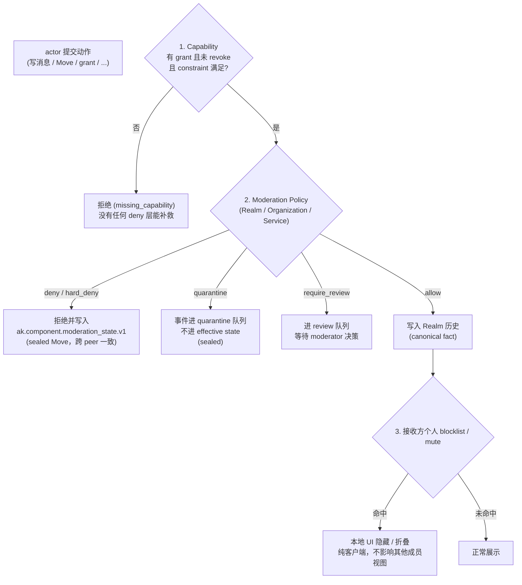

## 0. 规范语言

本文中的规范关键字（**MUST** / **SHOULD** / **MAY** 等）按 [conformance/normative-language.md](../conformance/normative-language.md) 解释；仅大写形式具规范约束力。

## 1. 目标

去中心化协作协议不能仅依赖"好人不会来捣乱"的假设。协议必须提供标准化的**内容审核与用户管理**机制，包括：

- 用户举报不当内容
- 忽略/屏蔽其他用户
- Realm 级别的审核策略
- 组织级别的准入黑名单、允许列表和风险策略
- 服务器级别的访问控制

## 2. 设计原则

### 2.1 审核权由 Realm / Circle 管理员行使

去中心化环境中没有"全网管理员"。内容审核的权限由 Realm / Circle 的 Capability 体系决定：

- Realm-default 内容由持有 `ak.realm.moderation_policy` 或等价 Realm-scoped moderation grant 的 Actor 处理。
- Circle-scoped 内容由该 Circle 的管理员 / moderator 处理；Realm 管理员只有在 grant 明确覆盖目标 Circle 时才可以处理该 Circle 的举报。
- 普通用户举报不会触发合规审计、历史 key release 或外部审查方密钥访问。

### 2.2 屏蔽是本地行为

用户屏蔽另一个用户是纯本地的客户端行为，不需要广播到网络。协议不应强制"告诉全世界我屏蔽了谁"。

### 2.3 举报留痕但不公开

举报记录应被安全送达目标 `effective_scope` 的管理员 / moderator，但不应暴露给被举报人或其他普通成员。Circle 举报不得泄露给无权知道该 Circle 内容的 Realm 普通成员。

### 2.4 黑名单不是 capability grant

Arkret 的授权核心仍然是 allow-grant + explicit revoke。黑名单、过滤器和风险策略是额外的 deny/quarantine 层：

- 没有 capability 时，黑名单不能创建权限。
- 有 capability 时，Realm / Organization / Service policy MAY deny、quarantine 或 require review。
- 个人 block 只影响个人客户端体验，不能替 Realm 删除其他成员可见的事实。

### 2.5 Capability / Moderation / Personal Blocklist 三层判定

下图把动作从提交到呈现要穿过的三层 gate 画在一起。**Capability 是唯一的"能不能做"判定**，Moderation 只能在 capability 之上叠加 deny / quarantine / require_review，Personal Blocklist 完全是接收方本地行为。



读图要点：

- **Capability 是唯一 allow 来源**：黑名单 / moderation policy / personal blocklist 都不能凭空创造权限。
- **Moderation 决策 MUST sealed**（见 §2.6）：`hard_deny` / `quarantine` / `require_review` / `dismiss` 必须通过 sealed Move 写入 `ak.component.moderation_state.v1` cell；`dismiss` 仅终结绑定的举报 queue item，不改变目标内容的 effective verdict。
- **Personal Blocklist 不进 cell**：它只是接收方本地客户端 view 过滤，不广播、不共享、不替 Realm 删除其他人可见的事实。
- **Blocklist 不可枚举**：个人 block 命中不得向被屏蔽方或 federation peer 暴露为独立错误码、receipt 差异、presence / typing 差异或 directory 结果差异；对外表现必须与普通不可见、不可达或不存在一致。

### 2.6 Moderation 决策 MUST Sealed

任何会改变其他 peer 对事件可见性、可写性或可分发性判断的 moderation decision——即 `hard_deny`、`quarantine`、`require_review`——MUST 通过 sealed Move 写入 `ak.component.moderation_state.v1` cell，详细规则见 [`authz/policy-server.md` §7.1](../authz/policy-server.md)。`dismiss` 同样使用 sealed `ak.moderation.decision`，但其 `target_ref` MUST 指向被驳回举报的 `ak.self.moderation.report` Event，且只把对应 queue item 终结为 `resolved`；它在目标内容的 verdict fold 中等价于 `none`，不得放行本来缺少 capability 或被其它 active decision 拒绝的操作。Policy Server signed decision 与个人 blocklist仍是 out-of-band，不进入该 cell。

**确定性收敛与提交路径（normative）**：`ak.component.moderation_state.v1` 与 `ak.component.moderation.appeal.v1` 两类 cell 的确定性收敛由 [`event-kind-registry.json`](../../artifacts/registry/event-kind-registry.json) 注册的 lattice 定义，与 capability cell（[`authz/capabilities.md` §12.1](../authz/capabilities.md)）同型：`ak.moderation.decision` = 对 moderation_state cell 的 `or_set` **add**；`ak.moderation.decision.lift` = 对同一 cell 的**部分撤销**，投影为 `or_set_remove_dots`，移除集合逐字节等于 payload 的 `observed_dots[]`；`ak.moderation.appeal.*` = appeal cell 上的 `fsm` 状态机（submitted → under_review → decided → closed）。裁决（`ak.moderation.decision[.lift]`）与申诉（`ak.moderation.appeal.*`）一律经 `POST /_arkret/self/events` 作为 self-authored Move 提交，**不经任何实现私有运维 / admin 写路径**；治理状态完全由数据/控制面 reducer 收敛，运维管理面不持有 moderation 真相。

**active decision set 与 effective verdict（normative）**：moderation_state cell 的当前值是“所有尚未被 observed-remove 的 decision add”组成的集合，不是 last-writer register。对某次 read / write / distribute / policy-check，reducer 先筛出 target 与可选 `action` 对本次路径适用的 active entries，再按封闭收紧序 `hard_deny > quarantine > require_review > none` 取最严格 effective verdict；`dismiss` 只适用于 report queue item 且 fold 为 `none`，`soft_deny` 不写 cell，`allow` 也不是 decision add。多个 issuer 或同一 issuer 的多个合法 add 并存是 OR-Set 的正常可 join 状态，必须按该 fold 得到相同结果，**不得**因“集合元素多于一个”直接报 `moderation_control_split`，也不得按本地到达顺序选 winner。只有同一 add identity 对应不同 canonical bytes、remove provenance 不可验证或 cell 无法按注册 lattice join 等真正非 joinable / 损坏状态才进入 [`policy-server.md` §7.2](../authz/policy-server.md#72-错误码与-reason_code-扩展) 的 split fail-closed。

**`require_review` 承载与解除（normative）**：active `decision="require_review"` add 本身就是 pending-review 的 canonical 承载；review queue 是从这些 active adds（以及独立 report queue items）派生的 View，不另造第三套中间态。候选 Event / operation 在 review 期间保持 proposal / observed-only，不得进入 effective state。reviewer 必须用以下封闭路径结束该 gate：

- **allow**：在同一 ordered submit batch / control transaction 中，对本次 gate 的全部 active `require_review` decision 分别提交 `ak.moderation.decision.lift`。lift 后若不再有更严格 active decision，候选仍 MUST 以**当前** capability、policy、membership、quota 与 target state 重新求值后才可接受；不得把旧 review 结果当作绕过当前授权的 allow grant。
- **quarantine / hard deny**：在同一 batch 中 lift 本次 gate 的全部 active `require_review` decision，并 add 一条 replacement `ak.moderation.decision`（`quarantine` 或 `hard_deny`）。lift 与 replacement 必须原子接受；缺一时保持原 pending 状态并拒绝部分提交。
- 对同一 target 仍有其它适用 active decision 时，effective verdict 继续按上述最严格 fold 计算；解除一条 review 不得隐式 lift 其它 issuer 的 decision。

**lift 的移除集合（normative）**：`ak.moderation.decision.lift` 的 payload MUST 携带
`observed_dots[]`，reducer 精确投影为 `{"kind":"or_set_remove_dots","dots":{"field":"payload.observed_dots"}}`，
移除集合与该数组**逐字节相等**。每个 dot 的 `event_id` 段 MUST 等于 `decision_ref` 的完整 EventId token——
这就是上一条"不得隐式 lift 其它 issuer 的 decision"的机器可读形式。

lift MUST NOT 使用 `or_set_remove_observed`：该形态移除冻结前态下该 cell 上**全部**存活 add
dot，会连带撤销其它 issuer 的 decision；[`../models/event-and-patch.md` §2.4.2](../models/event-and-patch.md)
逐字禁止用它做部分撤销。`decision_ref` 与 `observed_dots[]` 不可互相替代：前者是
`ak:event:<44-char-event-token>`，dot 是 `ak:event:<44-char-event-token>:<write_index>`，二者永不逐字节相等，而 §2.4.2
不提供 `event_ref -> dot` 的派生式。

§5.5.2 的 `modify` 路径由此天然成立：同 batch 内 lift 只移除被指名的旧 decision dot，
新增的 replacement decision 是同一 cell 上的新 dot，二者并存并继续参与最严格 fold。

## 3. 内容举报 (Report)

### 3.1 举报操作

用户可以举报自己可见的 Realm / Circle 对象（Message、Strand、Morph、Relation 等）：

```
POST /_arkret/self/moderation/report
```

请求 body 是 closed `{report_event: EventInitialSubmission}`，不得同时携带 unsigned `realm_id`、
`target_ref`、`reporter` 或 evidence 投影。`report_event.event.kind` MUST 为
`ak.self.moderation.report`；payload 字段如下：

| 字段 | 类型 | 必填 | 说明与约束 |
|------|------|------|------|
| `realm_id` | id | required | 被举报对象所在 Realm；MUST 等于 Event realm、signed scope 与 target-derived Realm。 |
| `effective_scope` | object | optional | Realm target 缺省为 `{kind:"realm", realm_id}`；Circle target MUST 显式签入 `{kind:"circle", realm_id, circle_id}`。 |
| `target_ref` | id | required | 被举报 accepted Object / Event 的 canonical ref；服务端不得把 Operation ref 映射成另一个 ref 后代签或改写 Event。 |
| `report_reason_code` | enum | required | 举报原因码，取值见 §3.2。 |
| `description` | string | optional；`report_reason_code=other` 时 required | 举报说明；服务端 MAY 限制长度。 |
| `reporter` | did_core_id | required | MUST 等于 Event `actor_id` 与认证 session principal。 |
| `provenance` | enum | optional | self endpoint 只允许省略或 `self`；`mimi_facade` 只属于独立 MIMI facade ingress。 |
| `evidence_refs` | id[] | optional | reporter 可见证据的 canonical refs，集合内不得重复。 |
| `evidence_package` | object | optional | [`moderation-evidence.schema.json#/$defs/evidence_package`](../../artifacts/schemas/moderation-evidence.schema.json) 的 closed 加密证据包。 |
| `franking_proof` | object | optional | [`moderation-evidence.schema.json#/$defs/franking_proof`](../../artifacts/schemas/moderation-evidence.schema.json) 的完整密文投递证明。 |

该 self operation 只接受 reporter 本人设备直接签名：`event.actor_id == payload.reporter ==
session principal`，并禁止 `executed_by`、`authorization_ref`、`applet_id`、`source_provider` 与
MIMI facade provenance。它是 DataEvent，MUST 携带 `seal_ref + auth_context`，MUST NOT 携带
`seal_basis` 或 `preconditions`。服务端只把 exact signed bytes 送入 ordinary Event admission，
不得构造、重建、共同签名或注入任何 guard。

响应字段：

| 字段 | 类型 | 必填 | 说明 |
|------|------|------|------|
| `report_id` | id | required | 从 accepted `report_event.event.event_id` retype 派生；服务端不得另分配 ID。 |
| `status` | const(`submitted`) | required | 首次 accepted 时存储的 submit outcome；后续 queue-item resolved 不得改写重放响应。 |
| `routed_to` | did_core_id[] | optional | 普通 reporter 的响应 MUST 省略；只有 caller 独立持有 exact scope 的 moderation/governance capability 时才可返回，避免枚举治理拓扑。 |

请求示例（非完整 schema）：

```json
{
  "report_event": {
    "event": {
      "kind": "ak.self.moderation.report",
      "realm_id": "ak:realm:Ac1aCK8aQdnkYImvdH3DFjq4jDCP198pXYWCGzGuVyj5",
      "scope_ref": {
        "kind": "circle",
        "realm_id": "ak:realm:Ac1aCK8aQdnkYImvdH3DFjq4jDCP198pXYWCGzGuVyj5",
        "circle_id": "ak:circle:AaalePlTK6W4ZKrbKyKzlmmcdhXVx-InxeWY4ul69tiN"
      },
      "actor_id": "ak:did_core:webvh:zBfFLx7gUhQB7dPEQCj3qeHZR",
      "payload": {
        "realm_id": "ak:realm:Ac1aCK8aQdnkYImvdH3DFjq4jDCP198pXYWCGzGuVyj5",
        "effective_scope": {
          "kind": "circle",
          "realm_id": "ak:realm:Ac1aCK8aQdnkYImvdH3DFjq4jDCP198pXYWCGzGuVyj5",
          "circle_id": "ak:circle:AaalePlTK6W4ZKrbKyKzlmmcdhXVx-InxeWY4ul69tiN"
        },
        "target_ref": "ak:message:AfslM_DNod70pfu-VkH6C2UTYa4N7qqqTljZ_MYLBciF",
        "report_reason_code": "harassment",
        "description": "This message contains targeted personal attacks.",
        "reporter": "ak:did_core:webvh:zBfFLx7gUhQB7dPEQCj3qeHZR",
        "provenance": "self"
      }
    }
  }
}
```

#### 3.1.1 举报入口反滥用约束（normative）

举报入口本身是可被滥用的写路径（举报洪水、超大 evidence_package 充塞、franking_proof 重放）。实现 MUST：

- 对 `/_arkret/self/moderation/report` 按 [`../security/server-threat-model.md` §4.1](../security/server-threat-model.md) 的入口与服务面规则施加**分层限速**（至少按 signed payload reporter、source service、Realm、source IP hash、endpoint 维度），超阈值 MUST 返回 `rate_limited`；同一 Event 的 exact replay 不得被重写成新举报，同 reporter 对同一 target 的不同 Event 仍 MAY 被限速或抑制。
- 对 `evidence_package` 施加大小上界：其总字节数 MUST 受一个 `max_total_blob_bytes` 等价上界约束（命名遵循 [`../models/common-fields.md` §3.0.1](../models/common-fields.md)），超限 MUST 拒绝而非静默截断。
- 对 `franking_proof.replay_nonce` 的去重存储 MUST 有界：去重窗口 MUST 有限（时间或计数），过期 nonce MAY 被驱逐；实现 MUST NOT 假定无限去重存储，超出窗口的 nonce 复用按不可验证投递证明处理（见 §3.4）。
- **target scope 绑定（normative）**：服务端 MUST 从 signed `payload.target_ref` 解析 accepted target 的真实治理边界，并校验它逐字等于 Event/payload Realm、signed `scope_ref` 与显式/默认 `effective_scope`。Circle target 不得省略 signed Circle scope。reporter 对 target 不可见时同样拒绝；目标不存在、不可见与任一 scope mismatch 全部返回同一 `not_found`，响应形态与时序不得形成对象/Circle 枚举 oracle。
- accepted Event 恰好 append 一条 report log 并物化一个不同 typed-id 的 queue item；两者都从 Event ID retype。exact canonical replay MUST 返回首次存储的 byte-identical `status=submitted` outcome 且不得再次 append；同 Event ID 异 canonical bytes MUST `duplicate_conflict` 并零新增写入。

### 3.2 举报原因枚举

| Report reason code | 说明 |
|--------|------|
| `spam` | 垃圾信息 / 广告 |
| `harassment` | 骚扰 / 人身攻击 |
| `hate_speech` | 仇恨言论 |
| `nsfw` | 不适当的成人内容 |
| `illegal` | 违法内容 |
| `misinformation` | 虚假信息 |
| `other` | 其他原因（需要 `description` 补充说明） |

### 3.3 举报的处理

- 举报 service operation（`ak.self.moderation.command.report`）接受 reporter 已签名的 `ak.self.moderation.report` Event，并原样写入 Realm Event history；服务端不得物化或代签该 Event。Circle 举报的 plaintext metadata 和 evidence audience MUST 按 `effective_scope.kind="circle"` 加密 / 限制。
- 该事件仅对目标 scope 的管理员 / moderator 可见；Realm-default 内容是 Realm moderator，Circle 内容是 Circle moderator 或显式覆盖该 Circle 的 Realm grant 持有者。
- 被举报人不会收到通知。
- 管理员可以基于举报决定后续行动（警告、删除内容、封禁用户等）。
- 举报不会授予 moderator 历史 key、epoch key、审计 applet release 权限或外部 verifier 权限。

**queue-item 生命周期（normative，`moderation-queue-item.schema.json` 是权威源）**：v1 刻意最小化为两态。submit operation 的 stored response 始终是 `status=submitted`；queue-item 后续状态不能改写 exact replay outcome。

| 状态 | 语义 | 合法后继 | 终态? |
| --- | --- | --- | --- |
| `submitted` | 举报已受理，待处理 | `resolved` | 否 |
| `resolved` | 处理完成 | —(终态) | **是** |

`submitted → resolved` 只能由一条已接受、目标绑定该 `report_id`（或其被举报 target）的 `ak.moderation.decision` 派生；举报不成立时 moderator MUST 使用 `decision="dismiss"` 并令 `target_ref` 指向该 report Event。decision issuer MUST 持有该 decision 所需 moderation capability。queue service / reducer 在同一 accepted basis 上把 item 投影为 `resolved`，不接受 reporter、普通成员或无对应 decision 的显式 close/status 写入。重复派生是幂等 no-op；从 `resolved` 转出 MUST `failed_precondition`。

- **处置结果**(是否违规、采取何种处置)**不进** `status`,由独立的 `ak.moderation.decision` 事件承载。
- **申诉**不改 queue-item,由独立的 `ak.moderation.appeal.*` 子系统(§5.5)按 `decision_ref` 维护。
- 本两态 queue-item 只承载用户 `report` 的受理 / 完成，不承载 §2.6 的 policy `require_review` pending 状态。后者以 active moderation decision add 为真相源并投影到同一 UI queue；两者可以在 View 中合并展示，但 reducer MUST 保持各自 lifecycle 与 id 不混用。
- 如后续工作流需要中间相(如 triage / review 分阶段),MAY 在新修订中增补状态值;v1 实现 MUST NOT 产生这两值之外的 `status`。

### 3.4 E2EE 举报 Evidence Package 与 Franking

在 E2EE Realm / Circle 中，服务端无法读取正文。举报 E2EE 内容时，reporter MAY 提交一个加密 evidence package 给目标 scope 的 moderator；实现 SHOULD 支持 `franking_proof`，用于证明某条密文 envelope 曾被接收服务投递，而不保存明文。

Evidence package SHOULD 包含 reporter 自己可见并愿意提交的最小证据，例如：

- 被举报消息明文或必要 excerpt；
- 原始 encrypted envelope；
- plaintext / ciphertext / AAD digest；
- reporter 对 evidence package 的签名；
- 可选 `franking_proof`。

Evidence package MUST 加密给 `effective_scope` 对应 moderator audience。它 MUST NOT 包含 Realm / Circle 历史 key、MLS epoch secret、exporter secret 或允许 moderator 解密未举报消息的材料。

该最小披露闭包由 `ak.vector.moderation.evidence_package_minimal_disclosure.v1` 固化；实现 MUST 把 evidence package 的目标、加密 audience、reporter signature evidence 与禁止披露的 MLS epoch/history secrets 一并纳入校验。

Canonical franking proof 结构（示例中的 digest / signature 字节以 `...` 省略）：

```json
{
  "kind": "ak.moderation.franking_proof",
  "franking_proof_id": "ak:franking_proof:0196425b-0000-7000-8000-000000000000",
  "realm_id": "ak:realm:Ac1aCK8aQdnkYImvdH3DFjq4jDCP198pXYWCGzGuVyj5",
  "event_id": "ak:event:AQsHmGu_9sPOyJ4aG8VlWQBp8wGGhdC-BjfAaXqrIbk-",
  "routing_metadata_digest": "sha256:...",
  "ciphertext_digest": "sha256:...",
  "aad_digest": "sha256:...",
  "sender_claim": {
    "actor_id": "ak:did_core:webvh:zBfFLx7gUhQB7dPEQCj3qeHZR",
    "device_id": "ak:device:01964137-0000-7000-8000-000000000000",
    "mls_group_id_digest": "sha256:..."
  },
  "received_by": "ak:did_core:webvh:z5a3yeFnKQFn6ZqPY1Qgv3RrZ",
  "verification_method": "did:webvh:z5a3yeFnKQFn6ZqPY1Qgv3RrZ:server.acme.example#franking-key-1",
  "received_at": "2026-04-30T00:00:00Z",
  "replay_nonce": "base64url...",
  "signature": "base64url..."
}
```

**Durable Event 与 report 内嵌对象的单一合同（normative）**：[`moderation-evidence.schema.json#/$defs/franking_proof`](../../artifacts/schemas/moderation-evidence.schema.json) 同时是 `ak.moderation.franking_proof` durable Event 的完整 payload 合同，以及 report payload 内嵌 `franking_proof` 的合同；两处不得维护不同字段集。`payload.event_id` 是**被证明已接收的 encrypted Event ID**，也是 `ak.component.moderation.franking_proof.v1` ordered-log cell 的 subject；它不是承载该 proof 的外层 Event 自身 `event_id`。Proof 在接收密文时由 receiving service 生成，先于且独立于任何后续 report，因此 payload MUST NOT 携带 `report_id` 或 `target_ref`，report 与 proof 的关联由 report 内嵌该完整 proof 对象建立。

当 receiving service 把 proof 发布为 `ak.moderation.franking_proof` Event 时，reducer MUST 在写 cell 前验证：envelope `realm_id == payload.realm_id`、envelope `actor_id == payload.received_by`、`payload.event_id` 指向同 Realm 内已接受的 encrypted Event、三类 digest 与该目标 Event 一致、`replay_nonce` 未在有效去重窗口内使用，且 payload `signature` 可由 `verification_method` 在 `received_at` 验证；该 method 的 controller 投影 MUST 等于 `received_by` 并在该 Realm 获授权。任一绑定不成立 MUST 按 `crypto_verifiable` admission fail closed；不得仅因 JSON Schema 通过就 append。

规则：

- `franking_proof` MUST 在 canonical event routing metadata、ciphertext digest、AAD digest、sender claim、receiving service DID、verification method、接收时间与 `replay_nonce` 之上生成。其中 canonical event routing metadata 的覆盖在 wire 上由必填字段 `routing_metadata_digest` 承载（见 [`moderation-evidence.schema.json`](../../artifacts/schemas/moderation-evidence.schema.json) `franking_proof.required`），验证方 MUST 据此核验该覆盖。
- 对 `encrypted-envelope.schema.json` 承载的 v1 消息，`franking_proof.ciphertext_digest` 的取值 MUST 等于被举报 `encrypted_content.payload_digest`：即 `sha256(canonical_json(payload_metadata) || base64url_decode(ciphertext))`（见 [`encryption-and-audit.md` §2.3.3](../crypto-media/encryption-and-audit.md#233-payload_digest-计算)）。实现 MUST NOT 接受或生成旧式嵌套 `digests.ciphertext` / `ciphertext_digest` envelope 字段。
- `franking_proof` MUST NOT 包含 plaintext body、attachment filename、reply excerpt、mention 列表、private handle 或解密后内容 hash。
- **群拓扑 / 时序元数据最小披露（normative）**：`sender_claim` MUST NOT 携带 raw `mls_group_id` 或明文 `epoch`。前者是群组身份、后者是 epoch 进度，均为元数据侧信道，向可能非该 E2EE 群成员的 moderator 披露会泄露群存在性与活跃 epoch 进度。需要把 sender claim 绑定到具体群上下文时，`mls_group_id` MUST 以不可逆 digest 形式（`mls_group_id_digest`，与 `routing_metadata_digest` 一致的 keyed/salted 或 plain digest 约定）出现；`epoch` MUST NOT 以明文整数出现于 `franking_proof`。
- **`received_by` / `received_at` 向非群成员 moderator 最小化（normative）**：Canonical `franking_proof` 必须保留被签名的 receiving service DID 与精确接收时间，分别按 schema 的 DID / timestamp 形态承载，否则无法执行 service-key authority 与签名时点校验；实现 MUST NOT 把 DID digest 填入 canonical `received_by`，也 MUST NOT 把 bucket 值冒充 canonical `received_at`。由于这两项会暴露 Principal Server 拓扑与秒级活动 timing，完整 proof payload 只允许在持有对应治理 capability 的验证路径内解密/读取。普通 reporter 或不具该能力的非群 moderator只能取得**非 proof 的最小化投影**：`received_by` MAY 投影为 service DID digest 或“某授权投递服务”布尔证明，`received_at` SHOULD bucket 化；该投影 MUST 标记为不可直接验签，MUST NOT 重新提交为 `ModerationReport.franking_proof` 或 `ak.moderation.franking_proof` payload。Raw Event API、backfill 与 federation 对无权 caller / peer MUST 隐去完整 payload，只可返回 payload digest / redacted stub。§3.4.1 的精确校验只发生在授权验证路径内。
- `franking_proof` 只证明服务接收过对应密文事件；它不证明 reporter 提交的明文与密文一致，也不证明 sender 在群外不可抵赖地 authored 该明文。
- Moderator 验证时 MUST 检查 reporter 可见性、目标消息 accepted state、encrypted envelope digest、franking service signature、AAD / ciphertext digest 和 evidence package 签名。
- 若任一环节缺失，moderator MAY 把材料作为人工线索，但 MUST NOT 将 `franking_proof` 视为可验证投递证明。

#### 3.4.1 不存在治理密钥释放

Realm / Circle 治理举报没有独立审查方，也没有“为了举报给 moderator 获取 MLS key / exporter secret”的流程。实现 MUST NOT 把 `ak.self.moderation.command.report` 自动升级为 `ak.audit.session.request`，MUST NOT 因举报向 moderator、Policy Server、Principal Server sync surface 或外部 verifier release 历史 key / epoch key。

需要政府 / 企业合规审计时，必须走 [`../crypto-media/audited-e2ee.md`](../crypto-media/audited-e2ee.md) 定义的 Audit Applet Binding + sealed release session；这与用户举报是不同协议流程。

Franking 信任链：

1. 从 `franking_proof` 的 `received_by` 取得 receiving service DID。
2. 解析该 DID Document，要求 signed `verification_method` 的 controller 投影等于 `received_by`，并验证该 method 在 `received_at` 时有效且未撤销。
3. 验证该 service DID 在目标 Realm 的 policy / service binding 中被授权为 Sync、Federation、MIMI facade 或 moderation ingestion 服务。
4. 验证 DID service endpoint、HTTP Message Signature / federation binding 与实际接收服务一致，防止把其他服务签名重放到本 Realm。
5. 验证 `franking_proof` payload hash 覆盖 canonical event routing metadata、ciphertext digest、AAD digest、sender claim、receiving service DID、received time 和 replay nonce。
6. **`received_at` 时序新鲜度（normative）**：本步使用的是验证路径内的**精确** `received_at`（即持有治理 capability 的释放/验证路径所见的精确值，见 §3.4 末段），**不是**向非群 moderator 展示的 bucket 化值；§3.4 的 bucket 化只面向展示层最小化，不削弱此处的时序校验精度。`received_at` 由 receiving service 自填，本身无外部时间锚；被攻陷服务可回填一个 key 仍有效的 `received_at`，让已撤销 key 的旧签名"看似有效"。因此验证方 MUST 执行下列其一：(a) 用一个可独立校验的时间锚（如 seal frontier / HLC，或绑定该 proof 的外部时间见证）约束 `received_at`；或 (b) 若 `received_at` 早于第 2 步 verification method 最近一次 rotation / 撤销且无独立时间见证，MUST 把该 franking proof 视为**不可验证投递证明**（与 §3.1.1 去重窗口外 nonce 复用按"不可验证"降级一致），不得仅凭 `received_at` 落在 key 有效期内即采信。

## 4. 用户屏蔽 (Ignore/Block)

### 4.1 屏蔽是 Actor-Private 状态

用户可以屏蔽任意 Actor，屏蔽列表存储在本地或用户的私有 account data 中。`ak.account.blocklist` 的**权威结构定义（entry 字段集、`version`、`entry_id`、`applies_to`、`target.kind` 取值与同步 / 隐私约束）在 [`../discovery/client-preferences.md` §3.5`](../discovery/client-preferences.md)**；本节不重复定义，仅引用，避免字段漂移。下例为最小说明性片段（完整必填字段与约束以 client-preferences §3.5 为准）：

```json
{
  "owner": "ak:did_core:webvh:z6mkfixtureHolder",
  "version": 1,
  "entries": [
    {
      "entry_id": "ak:block:019640b3-cc00-7000-8000-000000000000",
      "target": {
        "kind": "actor",
        "actor_id": "ak:did_core:webvh:zGMfBAbnRTYqW4943CVr9Dcii"
      },
      "mode": "block",
      "applies_to": ["messages", "mentions", "dm"],
      "reason_code": "harassment",
      "created_at": "2026-04-26T10:00:00Z",
      "expires_at": null
    }
  ]
}
```

### 4.2 屏蔽行为

客户端在渲染时：

- SHOULD 隐藏被屏蔽用户的消息
- SHOULD NOT 显示被屏蔽用户的 Typing 和 Presence 状态
- SHOULD NOT 为被屏蔽用户的消息生成通知
- SHOULD 默认拒绝被屏蔽用户发起的 DM、call invite、contact request 和 applet-mediated request
- MAY 在共同 Realm 中显示折叠占位符，避免破坏上下文
- MUST NOT 从网络层面丢弃被屏蔽用户的 Operation（这些 Operation 对其他成员仍然有效）

加入、移除、CAS revision、共享 Realm 与 Direct Conversation 的收取边界、解除屏蔽后的历史重算及 block / mute / hide 的精确差异，以 [`../discovery/client-preferences.md` §3.5–§3.5.1](../discovery/client-preferences.md) 为唯一权威源。本节不得另定义第二套屏蔽状态机。

### 4.3 个人过滤对象

个人 blocklist MAY 包含：

- actor DID
- device verification-method DID URL / `device_id`（设备自身没有 DID）
- service DID
- handle
- domain
- organization DID
- Applet id
- keyword / mention pattern

对 handle、domain、organization DID 的屏蔽 MUST 在本地解析成可验证 DID / claim 后应用。客户端 MUST NOT 因裸字符串后缀误伤无关主体。

### 4.4 隐私要求

个人 blocklist 是 holder-private account data。实现 MUST NOT 默认上传明文 blocklist 到公共 Principal Server sync surface、Realm、Directory 或被屏蔽方可见的位置。

跨设备同步 SHOULD 使用加密 account data。服务端只应看到不透明密文。

## 5. Realm 审核工具

### 5.1 内容删除

管理员可以通过 `ak.message.redact` 操作撤回任意成员的消息：
- 需要 `ak.message.redact` capability（撤回他人消息的非 `.own` 形态；`ak.realm.moderation_policy` 仅管理审核策略事件本身，**不**隐含该撤回权，若要并入审核员 bundle 须在 grant 的 `actions[]` 中显式并列 `ak.message.redact`）
- 撤回会产生 tombstone，不可逆
- 审计视图中仍可看到撤回记录

### 5.2 用户封禁

管理员通过 `ak.member.state{membership="ban"}` Event 封禁用户（成员状态机详见 [`../models/realm-and-space.md` §2.7](../models/realm-and-space.md)，policy 对象详见 [`../models/governance-objects.md` §3](../models/governance-objects.md)）。封禁后：

- 被封禁用户无法重新加入该 Realm
- 其未来的 Operation 提交将被 Principal Server sync surface 拒绝
- 是否对其隐藏**已可见**历史内容由 Realm Policy 决定；但 ban 后的 **key share 与 server-mediated backfill MUST fail closed**，其 fail-closed 真相源为 [`history-visibility.md` §6](./history-visibility.md) 与 [`../crypto-media/device-lifecycle.md` §13.1](../crypto-media/device-lifecycle.md)（把"接收 principal / device 已处于 ban / leave / removed"列为主体级拒绝终态）。Realm policy 只能在此基础上**更严**，MUST NOT 放宽该 fail-closed 边界向被封禁主体继续交付 key / 历史。

### 5.3 Realm Blocklist / Filter Policy

Realm MAY 使用 `ak.realm.moderation_policy` state event 声明黑名单、允许列表、内容过滤和风险处理策略。

```json
{
  "kind": "ak.realm.moderation_policy",
  "payload": {
    "value": {
      "version": 1,
      "targets": [
        {
          "target": {
            "kind": "actor",
            "did": "did:webvh:zGMfBAbnRTYqW4943CVr9Dcii:spammer.example.com"
          },
          "action": "deny_join",
          "reason_code": "spam",
          "created_by": "ak:did_core:webvh:zGUwpRSnyVCLzU7upsm9iSwEv",
          "created_at": "2026-04-26T00:00:00Z",
          "expires_at": null
        },
        {
          "target": {
            "kind": "domain",
            "domain": "malicious.example"
          },
          "action": "quarantine_message",
          "reason_code": "abuse_cluster"
        }
      ],
      "content_filters": [
        {
          "filter_id": "ak:filter:3655021a-cf20-7000-8000-000000000000",
          "match": {
            "kind": "url_domain",
            "pattern_digest": "sha256:..."
          },
          "action": "require_review"
        }
      ],
      "appeal": {
        "enabled": true,
        "endpoint": "ak:strand:AVJXk6oAyn0y1KTd0hdGIZQYhpTQR2lTDsGRVSzvQJg7"
      }
    }
  }
}
```

`action` 取值：

- `deny_join`
- `deny_restricted_join`
- `deny_invite`
- `deny_write`
- `deny_federation`
- `quarantine_message`
- `require_review`
- `redact_on_accept`
- `shadow_collapse`

`target.kind` 取值至少包括：

| kind | 标识字段 | 语义 |
| --- | --- | --- |
| `actor` | `did` | 单个 Actor / Principal。 |
| `device` | `device_id` 或 `did` | 单个设备身份。 |
| `service_id` | `did_core_id` | 单个 Principal Server、Principal Server sync surface、Federation peer 或其他 service 的稳定业务身份。 |
| `domain` | `domain`，可选 `match_subdomains` | 规范化 DNS A-label domain；只按 label 边界匹配。 |
| `trust_domain` | `trust_domain` | 部署级 trust domain。 |
| `organization` | `did` | Organization DID 或其签发的治理链。 |
| `claim_selector` | `claim_kind` / `issuer` | 由声明、VC 或组织关系选择一组主体。 |
| `media_digest` | `digest` | 媒体或 blob 内容 digest。 |
| `content_label` | `label` | 分类器或审核标签。 |

Realm 级 server ACL 等价规则 MUST 使用 `service_id`、`domain` 或 `trust_domain` target 表达。`deny_write` / `deny_federation` 命中这些 target 时，接收方 MUST 拒绝该 peer 后续 service-to-service 写入、backfill push、完整 frontier probe 和默认 fanout；`quarantine_message` 命中时，事件不得进入普通用户可见视图，直到 sealed moderation decision 解除。`deny_join` 命中 server target 时，MUST 拒绝通过该 service DID 或 domain 发起的新 join / invite acceptance，但不会自动清扫已经 accepted 的成员；`deny_restricted_join` 只作用于 `default_join_rule=restricted` / `default_join_rule=knock_restricted` / `history_visibility=restricted` 或等价 restricted admission profile 的申请、knock、invite acceptance（术语以 [`join-policy.md` §4](./join-policy.md) 的 `default_join_rule` 枚举为准，`restricted` 与 `knock_restricted` 两值均落入本作用域），命中时 MUST fail closed，不得回退到普通 `deny_join` 之外的宽松路径。清扫既有成员必须通过 `ak.member.state{membership="ban"}`、grant revoke、MLS epoch rotation 或明确的 moderation decision 完成。

Domain target 的匹配必须基于已验证 service `did_core_id` / current `ServiceResolutionRecord.base_url` / member delivery binding 的规范化结果。实现 MUST NOT 对未经验证的裸字符串、display name、handle 后缀或用户输入 URL 做后缀封禁推断。

规则：

- 修改 `ak.realm.moderation_policy` MUST 持有 `ak.realm.moderation_policy` 或 `ak.policy.manage` capability。
- `ak.self.realm.moderation_policy.resource.replace` MUST 只接受 closed `{moderation_policy_event: EventInitialSubmission}`。该 Event 的 `kind` 必须逐字为 `ak.realm.moderation_policy`，`realm_id` 必须逐字等于 path Realm，`actor_id` 必须逐字等于认证 session actor；payload 必须且只能为 `{value: object}`，不得把 policy 放入 `state`、`reason` 或 unsigned request 字段。服务端 MUST 将 exact caller-signed bytes 送入 ordinary Event admission，MUST NOT 重建、代签、共同签名或在签名后补 CAS。
- 每次 moderation-policy replace MUST 在 Event 签名内恰好携带一条目标为 `ak:cell:ak.component.realm.moderation_policy.v1:null` 的 `head_eq`，其 value 是调用方观察到的完整 settled cell value；cell 缺失时使用 `null`。stale、Bottom、缺失或多条适用 CAS 均 MUST fail closed。相同 Event identity 与 exact bytes 的已接受重放 MUST 返回 byte-identical outcome；相同 identity 异 bytes 必须零新增写入拒绝。
- capability 判定只按 registry：`ak.realm.moderation_policy` 或 `ak.policy.manage`。Realm owner 不具有 owner-only 特例；没有上述 capability 时同样 `capability_denied`。
- Realm blocklist MUST 在 signature / DID 基础校验之后、事件进入用户可见 reducer 状态之前进行评估。
- `deny_join` / `deny_write` SHOULD 产出已签名的 moderation decision 或 audit record。
- `quarantine_message` MUST 在审核通过前阻止事件进入普通用户可见视图。
- 内容过滤 SHOULD 优先使用 hash、label 或本地分类；E2EE Realm MUST NOT 要求向服务端过滤器上传明文。
- Realm blocklist MUST NOT 静默覆盖密码学历史。要改变已 accepted 事件的呈现，需通过 redaction / tombstone / quarantine 事件实现。
- **`redact_on_accept` 的 redact capability 前提（normative）**：`redact_on_accept` 在 review / accept 阶段自动产生对目标消息的 redaction，等价于代表 policy 作者行使 `ak.message.redact`。与 §5.1 "`ak.realm.moderation_policy` 不隐含撤回他人消息的 `ak.message.redact` 权"口径一致：声明含 `redact_on_accept` action 的 `ak.realm.moderation_policy` 的 policy 作者 MUST 同时持有 `ak.message.redact` capability（撤回他人消息的非 `.own` 形态）。reducer 在接受携带 `redact_on_accept` 的 policy 写入、以及在 accept 阶段执行该自动 redaction 时 MUST 校验该 capability；policy 作者不持有时 MUST 拒绝该 action（`capability_denied`），不得仅凭 `ak.realm.moderation_policy` 隐式获得 redact 权。

### 5.4 消息审核队列

Realm SHOULD 支持审核队列 (Moderation Queue) 视图，汇集用户举报记录与 §2.6 active `require_review` decision。举报 item 的 `status={submitted,resolved}` 只描述 report lifecycle；policy review item 的 pending / resolved 由对应 decision add 是否仍 active 派生，不得为后者伪造 `moderation-queue-item.status` 新枚举。建议使用标准 View 机制：

```json
{
  "kind": "collection",
  "renderer": "list",
  "query": {
    "facets": ["reviewable"],
    "filters": [
      { "field": "fields.status", "op": "eq", "value": "submitted" }
    ]
  },
  "collection": {
    "item_facets": ["reviewable"],
    "item_render": "row",
    "item_order_by": [
      { "field": "fields.priority", "direction": "desc" },
      { "field": "created_at", "direction": "asc" }
    ],
    "grouping": {
      "mode": "field",
      "field": "fields.status",
      "lanes": [
        { "key": "submitted", "title": "Submitted" }
      ],
      "hidden_count_policy": "omit"
    }
  }
}
```

### 5.5 上诉流程 (Appeal Strand, normative)

上诉是审核闭环的反向通道。被 `ak.moderation.decision` 影响的 target（成员被 ban、消息被 remove、Strand 被锁等）可以走标准 `ak.moderation.appeal.*` 事件链请求复核，无需脱离 Arkret wire。本节定义事件链、状态机与 reducer 强制约束。

#### 5.5.1 事件链

四个 active event kind（见 [`event-kind-registry.json`](../../artifacts/registry/event-kind-registry.json)）：

| Event kind | 触发者 | 目标 cell 状态转换 | capability |
| --- | --- | --- | --- |
| `ak.moderation.appeal.submit` | appellant（被影响 target 的控制者或 policy 列出的 advocate） | (none) → `submitted` | `ak.moderation.appeal.submit`（risk_tier=low） |
| `ak.moderation.appeal.review` | reviewer（不得是原 decision 的 issuer） | `submitted` → `under_review` | `ak.moderation.appeal.review`（risk_tier=medium） |
| `ak.moderation.appeal.decision` | reviewer（同上） | `under_review` → `decided` | （复用 `ak.moderation.appeal.review`，见表注） |
| `ak.moderation.appeal.close` | reviewer（手动）、appellant（撤回）或部署的授权关闭服务（见 §5.5.2 close 是手动 / 授权动作） | `decided` → `closed`；`submitted` / `under_review` → `closed` 仅限 appellant withdraw | （复用 `ak.moderation.appeal.review`，appellant withdraw 例外见 §5.5.2） |

> 表注（capability 复用）：`.decision` 与 `.close` 是 `ak.moderation.appeal.review` capability action 的目标 event kind，**有意复用同一 review capability**——见 [`capability-action-registry.json`](../../artifacts/registry/capability-action-registry.json) 中 `ak.moderation.appeal.review`（`event_mapping_kind=aggregate_admin`，`target_event_kinds` 含 `review` / `decision` / `close` 三者）。因此 `.decision` / `.close` 行不另列独立 capability，其 `risk_tier` **继承自 `ak.moderation.appeal.review` 的 `medium`**；它们不是独立 capability action，registry 也不为其登记单独 action。`separation of duties`（reviewer ≠ 原 decision issuer）由 §5.5.2 reducer 约束兜底，弥补共用 capability 带来的影响差。
> 表注（submit 授权）：Realm member 作为被影响 target 的 appellant 提交 `ak.moderation.appeal.submit` 属于 baseline membership 权限；非成员 advocate 只有在 Realm policy / `ak.moderation.appeal.submit` capability 授权时 MAY 代表 appellant 提交。

Payload schema 在 [`moderation-appeal.schema.json`](../../artifacts/schemas/moderation-appeal.schema.json)（schema id `ak.schema.moderation_appeal.v1`，四种 payload 通过 `oneOf` 分支）。

##### 5.5.1.1 `verdict` 封闭枚举（normative）

`ak.moderation.appeal.decision` 的 `verdict` 字段是**封闭枚举**，权威取值集合为 `{ uphold, overturn, modify }`（与 [`moderation-appeal.schema.json`](../../artifacts/schemas/moderation-appeal.schema.json) `decision_payload.verdict.enum` 完全一致）。取未列值时 reducer MUST 用 `schema_violation` 拒绝。各值语义与后续动作如下：

| `verdict` | 含义 | 后续动作（normative） |
| --- | --- | --- |
| `uphold` | **驳回上诉**：原 `ak.moderation.decision` 维持生效，无进一步动作。这是最常见结局。 | 不得携带 `modify_decision_ref`（schema `if/then` 强制）；不产生 lift / 新 decision；cell 转入 `decided`。 |
| `overturn` | **撤销原 decision**：上诉胜诉，解除该 decision 的后续治理效力；不声称逆转已发生的不可逆副作用。 | MUST 与一条 `ak.moderation.decision.lift`（target 等于 `decision_ref`）在同一 ordered submit batch 或等价控制事务中出现，否则 reducer 用 `appeal_overturn_missing_lift` 拒绝（见 §5.5.2）。 |
| `modify` | **替换原 decision**：处置参数被修订（如缩短 ban 时长、降级处置）。 | MUST 在同一 batch 同时 lift 原 decision，并新增一条 replacement `ak.moderation.decision`；`modify_decision_ref` 指向该新 event（见 §5.5.2）。 |

#### 5.5.2 Reducer 强制约束

- **非法迁移错误**：除 §5.5.1 表与本节 appellant-withdraw 例外外，任何 from/to 不匹配、越序或从 `closed` 转出的 appeal Move MUST `failed_precondition`，`reason_code="invalid_appeal_fsm_transition"`；不得复用 task 专用的 `invalid_task_fsm_transition`，也不得静默纠正状态。
- **Realm 绑定**：所有 `ak.moderation.appeal.*` payload MUST 携带 `realm_id`，且该值 MUST 等于 enclosing Event 的 `realm_id`。Reducer 还 MUST 解析 `decision_ref`，确认它引用同一 Realm 的 `ak.moderation.decision`；若 target / decision 属于另一 Realm，除非显式 cross-Realm moderation profile 授权，否则 MUST `schema_violation` 或 `capability_denied`。
- **separation of duties**：`ak.moderation.appeal.review` / `ak.moderation.appeal.decision` 的 `reviewer` MUST NOT 等于被上诉 `decision_ref` 对应 `ak.moderation.decision` event 的 issuer。违反时 reducer 用 `appeal_self_review_forbidden` 拒绝。
- **overturn 与 lift 原子**：`ak.moderation.appeal.decision` `verdict=overturn` MUST 与一条 `ak.moderation.decision.lift`（target 等于 `decision_ref`）在同一 ordered submit batch 或等价控制事务中出现；否则 reducer 用 `appeal_overturn_missing_lift` 拒绝。这关闭"上诉胜诉但原 decision 仍生效"的窗口。
- **不可逆副作用边界**：overturn 只 observed-remove 被上诉的 moderation decision，不删除审计事实，也不复原已经 accepted 的 redaction tombstone、已经密码学销毁的 content key 或其它不可逆 effect。原 decision 若已触发 §5.1 redaction，上诉胜诉后 reducer MUST 保留 tombstone，并在 appeal / audit projection 标记 decision 已 overturn；需要恢复可见内容时只能由有权 actor 创建一个新的 replacement Event / object（重新执行当下 authz 与 content policy），绝不得伪造原 Event resurrection。UI MUST NOT 把此结果描述为“原文已恢复”。
- **modify、lift 与新 decision 原子**：`verdict=modify` MUST 与一条 lift 原 `decision_ref` 的 `ak.moderation.decision.lift`、以及一条新的 `ak.moderation.decision`（其 `target_ref` 等于原 target）在同一 batch 中出现。`modify_decision_ref` 是 `ak.moderation.appeal.decision` payload 上的字段（不是新 decision 上的字段），其值 MUST 指向同 batch 内该新 decision event 的 id；reducer 校验 lift 目标、`modify_decision_ref` 与同 batch新 decision 的 event id / target 全部一致。缺 lift 时用 `failed_precondition`（`reason="appeal_modify_missing_lift"`）拒绝整个 batch，避免旧 decision 与 replacement 并存时按最严格 fold 继续保留旧处置。
- **Appeal 身份与重复 submit 约束**：submit payload MUST 省略 `appeal_id`，receiver 从该 submit Event 的 `event_id` 重标得到 `ak:appeal:<同一44字符token>`；review / decision / close payload 必须引用该派生 ID。同一 `(decision_ref, appellant)` 在其 appeal cell 处于**非 `closed`** 状态时不得再次 submit；违反时 `failed_precondition`。这是与时长无关的幂等约束（同一 appellant 对同一 decision 不得并存多个未结上诉）。cell 进入 `closed` 后允许新的 submit Event，并由其派生新 `appeal_id`。重复 submit 的**时长级限流**（冷静期）不在协议层规定，由部署 / Realm policy 自行决定，协议不规定任何具体时长。
- **appellant withdraw**：cell 处于 `submitted` 或 `under_review` 时，`appellant` 本人 MAY emit `ak.moderation.appeal.close`，并把 payload 字段 `close_reason` 设为 enum 值 `appellant_withdrawn`，从而把 appeal 直接转为 `closed`。Reducer MUST 校验 `closer == appellant`，且不得要求 reviewer capability；该路径不得隐式改变原 moderation decision。
- **close 是手动 / 授权动作**：`ak.moderation.appeal.close` 由 reviewer / 部署授权关闭服务在 appeal 已 `decided` 后主动关闭，或由 appellant withdraw 提前触发(见上一条)。协议层不规定任何自动关闭定时器、超时时长或 timer-service DID。部署若需要"非活跃自动关闭"，自行实现产品服务，在 appeal 已 `decided` 后经正常授权通道(reviewer / 部署的授权关闭服务的 capability)提交 `ak.moderation.appeal.close`；未 `decided` 的提前 close 只允许 appellant withdrawal。该 close payload MUST 携带 `closer`，reducer 按常规 capability gate 校验 `closer` 是否有权关闭。

#### 5.5.3 审计与可见性

- 全部四个 event 进入 moderation audit log（durable_event），同时受 moderation / appeal policy 的 evidence visibility 控制可见范围；它们不触发 Audit Applet release。
- `evidence_visibility`（submit payload 字段）控制 reason text / evidence_refs 的明文可见范围（`appellant_only` / `reviewers_only` / `realm_admins` / `realm_members`），默认 `reviewers_only`。这只影响明文 audience，不改变 wire envelope 加密。
- 与 §10 v1 流程要求一致：appeal 流程"形成可审计事件"现在由这四个事件原生承担，不再需要平台外通道。

#### 5.5.4 与 `moderation_policy.appeal.endpoint` 的关系

§5.3 `moderation_policy` 中 `appeal.endpoint` 字段保留用于 UI 引导（用户在哪个 Strand 提交上诉），不替代 wire 事件。endpoint Strand 内的消息只是 narrative，约束性 verdict / lift 仍走本节 normative 事件链。

## 6. 服务器级访问控制

### 6.1 本地部署 ACL 与 Realm ACL 的边界

Principal Server 可以配置本地服务器级 ACL，控制哪些 peer 的联邦请求被接受、拒绝或停止 fanout：

```json
{
  "server_acl": {
    "allow": ["*"],
    "deny": [
      "spam-node.example.com",
      "*.malicious.example.net"
    ]
  }
}
```

该 `server_acl` 是部署本地 policy 名称，不是标准 Event kind，不进入 `event-kind-registry.json`，也不是可复制的 Realm 状态。实现 MUST NOT 接受 `ak.realm.server_acl`、`ak.server.acl` 或等价未注册 kind 作为 Realm 权威状态。

规则评估顺序：先检查 `deny` 列表，再检查 `allow` 列表。支持 glob 通配符时，通配符只允许覆盖完整 DNS label；`*.example.com` 不得匹配 `example.com` 或 `badexample.com`。推荐实现同时支持 exact `service_id`、`trust_domain` 与 DNS domain 规则，并优先使用已验证 service DID。

### 6.2 Realm 级 server ACL 的权威路径

需要让参与该 Realm 的 peer 以可验证、可复制方式看到 server ACL 时，MUST 使用已注册的 `ak.realm.moderation_policy`：

```json
{
  "kind": "ak.realm.moderation_policy",
  "payload": {
    "value": {
      "version": 1,
      "targets": [
        {
          "target": {
            "kind": "service_id",
            "did": "did:webvh:z5GPnjxXzWM85J3Kw6iMV4Tj2:spam-node.example"
          },
          "action": "deny_federation",
          "reason_code": "abuse_network"
        },
        {
          "target": {
            "kind": "domain",
            "domain": "malicious.example.net",
            "match_subdomains": true
          },
          "action": "deny_write",
          "reason_code": "abuse_network"
        }
      ]
    }
  }
}
```

> `targets[]` 条目的 `target` / `action` / `reason_code` 为核心字段，`created_by` / `created_at` / `expires_at` 为可选 audit 字段（取值与 §5.3 一致）；本节示例为聚焦 server ACL 而省略可选 audit 字段，并非表示其不可携带。该 policy 文档只存在于 signed `ak.realm.moderation_policy.payload.value`；moderation report operation schema 不承载或定义 policy target。

`ak.realm.moderation_policy` server target 的生效规则：

- 接收方在完成请求签名、DID、trust domain 和 endpoint digest 识别后，MUST 在接受 Event 进入普通 reducer 前评估 Realm policy。
- 命中 `deny_federation` 或 `deny_write` 的入站 service-to-service 写入 MUST fail closed；批量请求中可逐项拒绝，也可在请求级拒绝，取决于被拒绝规则是否影响整批认证上下文。
- 命中出站 deny 的 peer MUST 从该 Realm 的 fanout 目标集中移除；该抑制不是临时网络失败，不应进入无限重试队列。
- 命中 `quarantine_message` 的 Event MUST 进入 quarantine，不得作为 accepted state 推进普通用户可见 frontier。
- 这些规则只影响未来接收、投递和呈现。它们 MUST NOT 静默改写、删除或重新解释已经 accepted 的密码学历史。

### 6.3 与联邦协议的关系

Server ACL 在联邦层（参见 [`../sync/federation.md`](../sync/federation.md) §3.4）起作用。当 Principal Server 收到来自被 deny 的 peer 的 `ak.peer.events.command.submit`（`/_arkret/peer/events`，`Source-Service-ID`、source trust domain 或已验证 endpoint domain 命中 deny list）请求时，MUST fail closed，SHOULD 返回 `403 policy_denied` 或 `403 capability_denied`，并保持错误最小披露。

整机级 defederation 需要入站与出站同时配置：拒收该 peer 的 push / pull / frontier probe，并停止向其 fanout 新 Event、push、to-device、key-package、backfill 和媒体 / snapshot fetch。

## 7. 组织级审核策略

Organization MAY 为其控制或背书的 Realm 与服务发布组织级审核策略。该策略仅通过显式引用生效，不会隐式继承、自动级联或作为全局默认策略适用。

推荐对象：

```json
{
  "kind": "ak.organization.moderation_policy",
  "organization_principal_id": "did:webvh:zGUwpRSnyVCLzU7upsm9iSwEv:acme.example",
  "policy_id": "ak:org-policy:abuse-v1",
  "policy_scope": {
    "realm_ids": ["ak:realm:AcNT448P7qPaGrcUoLXxUyutbNGE4ZXv8UN835EnK4Wp"],
    "service_ids": [
      "did:webvh:z5a3yeFnKQFn6ZqPY1Qgv3RrZ:server.acme.example",
      "did:webvh:z9hEFwrg1A6sjcDxhuzWJGKhe:policy.acme.example"
    ],
    "applies_to_owned_realms": true
  },
  "rules": [
    {
      "target": {
        "kind": "organization",
        "did": "did:webvh:z6zPnbtvkN7vxa9zUyCgGyX52:known-abuse.example"
      },
      "action": "deny_federation",
      "reason_code": "abuse_network"
    },
    {
      "target": {
        "kind": "claim_selector",
        "claim_kind": "org_membership",
        "issuer": "ak:did_core:webvh:zCJLLNnZDTQJWQp7tztodmPUc"
      },
      "action": "deny_restricted_join"
    }
  ],
  "not_before": "2026-04-26T00:00:00Z",
  "expires_at": null,
  "proof": {
    "kind": "detached_jws",
    "verification_method": "did:webvh:zGUwpRSnyVCLzU7upsm9iSwEv:acme.example#governance-key-1",
    "jws": "..."
  }
}
```

规则：

- 组织策略只对显式引用它的 Realm / 服务有权威；对官方 Realm 也仅当其 `ak.realm.organization` 背书声明组织策略适用时才生效。
- 仅当组织策略允许覆盖时，Realm MAY 覆盖组织默认值。
- 组织级 deny SHOULD 由 Policy Server、Principal Server ACL、Directory 过滤与 Realm moderation policy 共同执行。
- 组织策略 MUST 由 Organization DID 或受授权的 governance service DID 签名。
- 组织策略 MUST NOT 暴露用户私有 blocklist、私有 handle 或未披露的组织成员关系。

## 8. Policy Server 集成

Realm 与 Organization 的审核策略 SHOULD 通过 Policy Server 进行动态评估，覆盖以下场景：

- invite / join request
- knock request
- message create / edit
- media upload
- Applet transaction
- federation transaction
- directory listing
- call invite

Policy Server MAY 返回 `hard_deny`、`quarantine`、`require_review` 或 `soft_deny`，但 MUST NOT 自行授予 capability。

### 8.1 Decision verb 与 §5.3 policy action 家族映射

本文存在两套相关但不同前缀 / 粒度的词汇，易混淆，这里统一登记其关系。**Decision verb**（§2.5 判定流程图与 §8 Policy Server 返回值）是 *runtime 判定结果*，集合为 `allow` / `soft_deny` / `hard_deny` / `quarantine` / `require_review`（全小写、无 `deny_` 前缀）。**§5.3 `moderation_policy` action 家族**是 *持久化 Realm policy 规则的 effect*，集合为 `deny_join` / `deny_restricted_join` / `deny_invite` / `deny_write` / `deny_federation` / `quarantine_message` / `require_review` / `redact_on_accept` / `shadow_collapse`（`deny_*` 前缀 + 作用对象后缀）。二者映射：

| Decision verb（runtime） | 对应 §5.3 policy action 家族 | 说明 |
| --- | --- | --- |
| `allow` | （无对应 deny action） | 放行，写入 canonical 历史。 |
| `hard_deny` | `deny_join` / `deny_restricted_join` / `deny_invite` / `deny_write` / `deny_federation` 中按动作类型取一 | `deny_*` 是 hard_deny 按被拒动作维度的细分；命中即 fail closed。 |
| `soft_deny` | （无持久化 action；仅 runtime 降级 / 限流上下文，常与 `rate_limit` obligation 同用） | 不写入 `moderation_state` cell。 |
| `quarantine` | `quarantine_message` | 事件进 quarantine，不进 effective state。 |
| `require_review` | `require_review` | 同名；进 review 队列。 |

`redact_on_accept` / `shadow_collapse` 是 §5.3 特有的后处理 effect，不由 decision verb 直接表达；它们在 review / accept 阶段叠加，不属于上表的一对一 runtime verb。大小写约定：decision verb 与 policy action **均为全小写 snake_case**，实现 MUST NOT 引入大写或驼峰变体。

## 9. 服务端威胁借鉴

在“去中心化服务治理”场景中，服务端常见风险的抗滥用经验如下：

- **入口源身份强制**：任何外部服务联邦请求都先验 `service DID`。未签名或未被 allowlist 的源服务不得参与写路径（至少转入 `soft_deny` / `quarantine`）。
- **多级限速**：Principal Server sync surface / Policy Server 和受托 search / projection 服务应至少按以下维度限速：`source DID`、`source IP`（或其哈希）、`service token`、`realm id`、`endpoint`。超阈值 MUST 返回 `rate_limited`。
- **批量事件反滥用**：对短周期内的 `invite`、`join`、`message`、`media.upload` 进行突发抑制；出现异常突发可触发 `quarantine`。
- **最小可观察性差异**：对未通过鉴权的目录/加入枚举请求，返回统一错误，不泄露对象可见性差异。
- **可疑媒体隔离**：媒体 hash、MIME、扫描标签先入审计与审核，不应默认解密给 Principal Server sync surface 或受托 projection；必要时按 `snapshot`/`preview` 再二次放行。
- **可追溯审计**：每次风控拦截、隔离、降级决策都要记录结构化审计事件，且不得仅依赖联邦来源的本地口头说明。

上述抗滥用规则的威胁映射见 [`../security/server-threat-model.md`](../security/server-threat-model.md)；其在授权与联邦层的 normative enforcement 分别见 [`../authz/policy-server.md`](../authz/policy-server.md) 与 [`../sync/federation.md`](../sync/federation.md)。本节为借鉴性概览，约束力以上述文件的 normative 条款为准。

## 10. v1 流程要求

- 自动化审核只能产生 risk signal、`quarantine` 或 `require_review` 建议；除非 Realm policy 明确授权，AI 分类器不得直接 hard delete、ban 或扩大可见性。
- 上诉流程 MUST 形成可审计事件，至少包含 target、moderation action、appeal actor、reviewer、decision、reason code 和时间；上诉材料的明文可见范围必须受 policy 控制。v1 中该要求由 §5.5 的 normative 事件链原生承担：appeal MUST 走 `ak.moderation.appeal.submit` / `.review` / `.decision` / `.close` 四个 active event kind（见 §5.5.1），不再需要平台外通道。
- 跨 Realm 共享封禁列表必须由 Organization DID、联盟治理 DID 或受信 issuer 签名，并声明 scope、reason code、evidence hash、过期时间和误伤申诉入口。默认不得把个人 blocklist 发布为共享封禁。
- 审核操作 MUST 使用不可抵赖日志：moderator DID、device/service proof、policy version、target event hash、action、reason code 和 audit timestamp 都必须进入签名记录。
