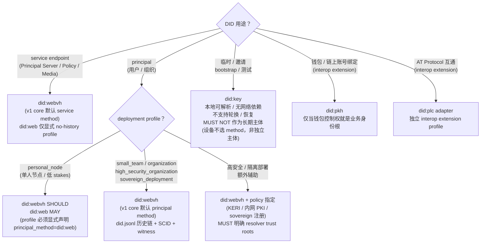

## 0. 规范语言

本文中的规范关键字（**MUST** / **SHOULD** / **MAY** 等）按 [conformance/normative-language.md](../conformance/normative-language.md) 解释；仅大写形式具规范约束力。

## 1. 目标

Cokret 使用 DID 作为稳定身份根。Handle、邮箱、组织用户名和第三方账号都只是可验证属性，不是协议主键。

本文定义：

- DID method 选择策略
- 默认 DID method
- resolver policy 与 method adapter
- DID Document normalized view
- 组织账号绑定的 DID proof

Cokret v1 不定义、注册或推荐任何自有 DID method。实现和用户 MUST 使用已有 DID method，例如 `did:webvh`、`did:web`、`did:key`、`did:pkh`、`did:plc`，或本地 trust policy 明确允许的其他公开 DID method。

## 2. 核心原则

### 2.1 稳定主体引用 MUST 使用 DID

协议中的主体引用 MUST 使用 DID，而不是 handle。

包括：

- object creator
- object updater
- grant issuer
- grant subject
- agent actor
- service node actor

#### 2.1.1 用户可见标识 MAY 不是 DID

实现 MAY 允许用户使用 `@alice:example.org`、`alice@example.org`、组织用户名、OIDC subject、邀请链接或其他人类可读标识完成发现、登录、邀请和账号恢复。

这些标识是 user-facing identifier、service account id、handle、3PID 或 bridge alias；它们不是协议主键。实现接受任何持久 Event、capability grant、federation transaction、MLS membership 或 service delegation 前，MUST 将当前会话绑定到 principal DID 与 device，并按本地 trust policy 验证该绑定。

如果用户尚无显式 DID，Auth Server MAY 在注册、邀请认领或首次写入前为其创建受支持的托管 DID。Cokret v1 core 部署的默认 principal DID method 是 `did:webvh`（详见 §3）：Auth Server 在自有域名（例如 `users.<org>.example`）下托管 `did.jsonl` 历史，并 SHOULD 接入至少一个 trusted witness。Cokret v1 core 部署的默认 service DID method 同样是 `did:webvh`；`did:web`（无历史链）仅作为显式声明的 no-history service method 与 `personal_node` deployment profile 的可选 principal method。`did:webvh` hosting domain 暂时不可达时只允许 §3.4 的 cache-only degraded mode，不得 live fallback 到 `did:web`。`did:web` 之所以不能作为 v1 core 默认 principal 或默认 service method，是因为它没有可审计 DID Document 历史——DNS 劫持或 TLS 证书失窃即可静默改写控制权而不留痕迹。托管 DID 的 controller、recovery policy、trust domain、method-specific history 和 service-account 绑定 MUST 可审计；后续协议对象仍然以 DID 作为 `actor_id`、grant `subject`、service DID 或 `verification_method` 的根。

### 2.2 DID 持久，密钥 SHOULD 可轮换

普通密钥轮换 SHOULD NOT 改变 DID。

长期 principal DID SHOULD 选择支持 key rotation、recovery、deactivation 或可验证历史的 DID method。`did:key` 和 `did:pkh` 属于生成式 DID method，通常不支持 DID document 更新、停用或内建恢复；它们 MAY 用于临时主体、邀请、bootstrap、钱包绑定或测试，但除非 Realm / organization policy 明确允许，MUST NOT 作为默认长期用户 DID。（注:设备不在此列——设备不是独立 DID 主体，其密钥是所属 principal DID 下的 verification method，见 [`../crypto-media/device-lifecycle.md` §4](../crypto-media/device-lifecycle.md)。）

### 2.3 DID Document 不是身份画像

DID Document SHOULD 只承载：

- 可验证控制材料
- 最小服务发现入口
- method-specific 更新、恢复或历史所需状态

DID Document MUST NOT 被用作跨组织身份画像。邮箱、跨组织 handle、第三方账号和隐私敏感属性应通过 claim / presentation 按需证明。

`metadata.primary_handle` 是 v1 唯一允许的 Cokret DID Document metadata 槽位：它 MAY 出现在 holder 自己控制的 DID Document 中，值 MUST 是 canonical handle 字符串或缺省。该字段只是 holder 的 primary handle 偏好指针，不是 handle claim、身份画像或可枚举 handle 列表；verifier MUST 按 [`identity-handles.md` §3.2.1](./identity-handles.md) 先验证 signed handle claim set，且仅当该值命中 verified candidates 时才可把它作为 holder-flagged 输入。

## 3. 默认 DID 方法

Cokret v1 core 部署的 **default principal DID method 与 default service DID method 都是 `did:webvh`**：

```text
did:webvh:<scid>:<host-and-path>
```

`did:web` 仅作为 **显式声明的 no-history service method** 与 **`personal_node` deployment profile 的可选 principal method**；不得作为 `small_team` / `organization` / `high_security_organization` / `sovereign_deployment` profile 的默认 principal method，也不得作为 v1 core 默认 service method。

选择 `did:webvh` 作为 v1 core principal 默认的原因：

- 它在 `did:web` 之上叠加了 `did.jsonl` 历史链 + SCID + 可选 witness 证据，提供了 **可审计的 DID 控制历史**。
- DNS 劫持、TLS 证书失窃或域名转移在 `did:web` 上是静默的——攻击者可以替换 DID Document 而不留任何可被 verifier 检测的证据。`did:webvh` 通过 entry hash chain + controller proof + witness 让任何身份控制权变更都进入可验证账本，与 Cokret 自身 signed-event chain 范式同构。
- 它与 Cokret 的 service DID 发现模型兼容，部署门槛仅比 `did:web` 多一份 `did.jsonl` 文件；service DID 若显式降级到 `did:web`，必须把 `history_evidence_kind="none"` / no-history trust profile 暴露给 verifier，不得伪装成默认强度。

为什么 `did:web` 不能是 v1 core principal 默认：`did:web` 没有可验证 DID 文档历史，攻击者控制 hosting domain 后可以把 DID Document 替换成自己的 `verificationMethod` 而 verifier 无从检测。把它作为长期 principal 默认会让协议安全模型整体退化到 DNS+TLS 强度。

默认值只表示"当系统需要为新用户创建 principal DID、且用户未明确选择其他 method 时使用 `did:webvh`"。协议仍然允许其他现有 DID method，只要实现能按该 method 的规范完成解析、控制权验证、（可选的）历史验证和服务委托验证。

> **残留暴露面与 Key Transparency profile（informative）**：`did:webvh` 的 `did.jsonl` hash chain + 可选 witness 提供的是**单个 DID 自身**控制权变更的可验证性。它**不**提供跨命名空间、可被任意第三方持续 monitor 的全局 Key Transparency 账本（CONIKS / Apple Contact Key Verification 类）。因此 v1 目录层的 equivocation 检测依赖各 DID 自身的 witness 覆盖与 [`../discovery/discovery-directory.md`](../discovery/discovery-directory.md) 的资源自签名，**hosting domain 对不同 verifier 出示不同 key 的针对性 split-view（尤其 `did:web` service method 与 `personal_node` 降级路径）是已知残留暴露面**。实现 MAY 声明可选 identity extension profile `ck.profile.key_transparency.v1` 来收敛该暴露面：该 profile 为 `handle / principal DID / cross-signing root / active device key set digest / KeyPackage publication digest` 提供 label→value append-only log，entry 必须携带 inclusion proof 与 consistency proof；log fork 以双签或等价 split-view evidence 暴露，monitor/auditor 验证结果可进入目录解析响应或 identity receipt。该 profile 不改变 v1 core Event bytes；未声明该 profile 的实现按普通 DID witness 与 directory 自签名规则互通。

### 3.1 Method Selection

| 场景 | 默认 / 推荐 DID method | 说明 |
| --- | --- | --- |
| 普通个人 principal DID（`small_team` / `organization` / 更高 profile） | `did:webvh` | v1 core 默认 principal method。无域名用户由 Auth Server 在组织子域代为托管 `did.jsonl`。 |
| `personal_node` profile principal DID（单人节点、低 stakes） | `did:webvh` SHOULD，`did:web` MAY | 单人自托管可降级为 `did:web`，但 deployment profile MUST 显式声明 `principal_method=did:web`。 |
| 组织 DID | `did:webvh` | v1 core MUST-support；治理 / 合规部署强制可验证 history chain。 |
| Service DID | `did:webvh` SHOULD / default；`did:web` MAY 显式声明 no-history profile | 服务发现虽依赖域名和 HTTPS endpoint，但 service DID 同样签发协议交易、describe、HTTP Message Signature 与 delegation；默认需要可审计历史。低风险或外部互通服务 MAY 使用 `did:web`，但 MUST 在 ServiceDescribe / resolver evidence 中声明无历史信任强度。 |
| 临时主体、测试、一次性邀请、bootstrap | `did:key` | 本地可解析、无网络依赖；不支持轮换 / 恢复，MUST NOT 作为默认长期身份。设备不选 DID method（设备非独立主体）。 |
| 钱包 / 链上账号绑定（interop extension） | `did:pkh` | 只在钱包控制权就是业务身份根时使用；由 chain-binding interop extension profile 承载，不属于 v1 core 互操作必需。 |
| AT Protocol 互通（interop extension） | `did:plc` adapter | 仅作为 AT Protocol bridge / interop adapter；由独立 interop extension profile 承载，不属于 v1 core 互操作必需。 |
| 高安全或隔离部署 | `did:webvh`（默认） + policy 指定的额外 method | sovereign / enclave / 内网 PKI / KERI 等可作为辅助；MUST 明确 resolver trust roots 与 witness 集合。 |

### 3.1.1 DID method 选择决策树

下图把 §3.1 的选择矩阵画成决策流。先按 **用途**（principal / service / 临时 / interop）分支，再按 deployment profile 与 stakes 决定 method。



读图要点：

- `did:web` 不能作为 v1 core principal 或 service 默认（`personal_node` profile 例外）：没有可验证文档历史，DNS 劫持 / TLS 失窃即可静默改写控制权。service DID 使用 `did:web` 时必须被显式标为 no-history trust profile。
- `did:webvh` hosting 暂时不可达时 MAY 进入 cache-only degraded mode；该模式只消费此前已验证的本地 evidence，不得 live fallback 到 `did:web`。
- `did:pkh` / `did:plc` 是 interop extension profile，不属于 v1 core 互操作必需。

### 3.2 标识域名与服务域名的解耦

DID 托管域名、Principal Server 服务域名和 handle 域名是**三个独立的标识层**，可以分别属于不同的域名甚至不同的运营方。实现 MUST NOT 假设这三者必须一致，也不得用其中一个直接推导另一个。

| 标识层 | 由谁决定 | 解析/验证通道 | 示例 |
| --- | --- | --- | --- |
| DID 历史托管域名 | DID method 与 SCID（一旦签发即写入历史链） | `did:webvh` `did.jsonl` + entry hash chain + witness | `did:webvh:<scid>:users.acme.example` |
| Principal Server 服务域名 | DID Document 中 `service` entry 的 `serviceEndpoint`，受组织/用户 service delegation 控制 | DID Document service binding + service DID 解析 + describe 响应 + `destination` 绑定（见 [federation.md §6](../sync/federation.md)） | `https://principal-7.cluster.acme.example:8443` |
| Handle 域名 | Holder 选择并通过双向验证发布 | DNS TXT / HTTPS well-known + DID Document `alsoKnownAs` 双向验证（见 [identity-handles.md §5–§6](./identity-handles.md)） | `alice.example.com`、`@alice:example.org` |

要点：

- DID 字符串中出现的域名（例如 `did:webvh:...:users.acme.example` 中的 `users.acme.example`）只表示 `did.jsonl` 历史的托管位置，**不**承诺该域名运行 Principal Server，也**不**是用户公开 handle。
- 用户/组织搬迁 Principal Server、变更端口、增加 mirror、切换到第三方 host 时，正确路径是更新 DID Document 中的 service entry 并重新签发 service delegation；这条路径会进入可验证历史，不依赖 DNS+TLS 的现时强度。
- DID Document 中的 `CokretPrincipalServer` service entry 是该 DID 的默认服务发现入口，不是所有 Realm 的强制投递入口。某个 Realm 中已接受的 `ck.member.state{membership="join"}` 若携带 `delivery_binding.recipient_service_did`，该 Realm 的事件、sync、to-device、push 与 KeyPackage 投递 MUST 优先使用该 binding。只有 Realm policy 允许 `did_document_default` fallback，且 fallback 结果已在 join 时物化为 `delivery_binding`（含 `did_document_digest` / `resolved_at`）时，DID Document 默认 endpoint 才能作为该 Realm 的投递路径。
- DID Document MAY 用窄关系指派**设备入册权威**（device enrollment authority）：一条 `CokretDeviceEnrollmentAuthority` service entry（`serviceEndpoint` 指向入册权威 DID，用于托管 DID / account-authority 模型），或一条 `capabilityDelegation` verification method（用于自主权模型，指向 holder 自有控制密钥）。被指派者获授签发 `service_attested` 的 `ck.device.authorize`（见 [`../crypto-media/device-lifecycle.md` §5.4](../crypto-media/device-lifecycle.md) 与 [`key-management.md` §5.0.6](./key-management.md)）。该指派 **MUST NOT** 复用 `controller`（`controller` 是改写身份根的强权，入册权威按最小权限只应能入册）。文档锚定的指派可被任意解析方自证;deployment 信任策略只能收紧或在文档无法表达时补空，**MUST NOT** 并集扩权。
- **无 history-resolution method 作入册权威时的历史复验（normative）**：当被指派的入册权威 DID 是**无可验证历史 method**（典型 `did:web`，只反映当前 DID Document、无按时点解析能力）时，被它签发并被引用为 actor 的旧 `ck.device.authorize` 无法按签发时点验签——入册密钥轮换后或 hosting domain 被劫持回填当前文档后，历史授权既无法解析当时的 verification method、也可被替换后的当前文档伪造复验。为此，由无 history-resolution method 入册权威签发的 `ck.device.authorize` **MUST** 在 `enrollment_authority_binding` 中 inline 携带签发时刻的 verification method 快照 + 该 key 的 controller proof，使历史复验只依赖事件内自带证据、不依赖对 `did:web` 当前文档的在线按时点解析；**或** deployment policy 禁止 `did:web` 等无历史 method 作入册权威轮换（轮换须先按 §4.2.2 / [`key-management.md` §5.0.5](./key-management.md) 升级到 `did:webvh`）。二者择一，v1 推荐前者。规范细则与 schema 协调见 [`key-management.md` §5.0.6 step4](./key-management.md)。
- **设备密钥不写入 DID method key log。** 设备的 `device_public_key` 作为所属 principal DID 下的 verification method，由 `ck.device.authorize` 进入**设备集投影**，而非写入 `did:webvh` 的 `did.jsonl`（[`../crypto-media/device-lifecycle.md` §5.4](../crypto-media/device-lifecycle.md)）。因此 resolver 解析该 principal DID 文档得到的 verification method 是控制者/入册权威密钥（如 `#did-key-1`）；设备密钥经设备集投影解析，二者来源不同。**校验普通业务事件 proof 的 receiver MUST NOT 在线解析 DID**，而是按 `{principal_did}#{device_id}` 从当前 control 流 frontier 的设备集投影取 `device_public_key`（缺失或已吊销即拒）；DID 解析只在入册、吊销/轮换 re-sync 与联邦边界出现。历史复验按 Event accepted-at 做按时点解析（`did:webvh` 历史 `versionTime`），故入册权威密钥轮换不使既有授权失效。
- Handle（例如 `@alice:acme.example` / `alice@acme.example`，canonical `alice:acme.example`）属于 Handle 层，不属于 DID method 或 DID Document service discovery。它 MAY 解析出 `subject DID + member_delivery_binding`，但该结果只有在加入 Realm 时被物化为 `delivery_binding` 并通过 Realm policy 校验后，才成为 Realm-scoped 投递路径。
- Handle 域名（含品牌域名）与 DID 托管域名可以完全无关。例如品牌持有者可以使用 `alice:alice.example.com` 作为公开 handle，而 DID 仍然由 `users.someprovider.example` 托管，只要 `alsoKnownAs` 与 issuer claim 双向验证一致。
- [federation.md §6.3](../sync/federation.md) 的 `https://<domain>/.well-known/cokret/server` 仅作为 bootstrap 候选发现 hint，**不是**身份解析必经路径，也不能授权联邦请求；权威服务发现源仍然是 DID Document 的 service entry。
- 实现 MUST NOT 引入"DID 字符串 → 实际服务地址"的额外带外重定向（例如类 Matrix `.well-known/matrix/server` 的间接），因为这会把信任根退化到 DNS+TLS 即时强度，与选择 `did:webvh` 而不是 `did:web` 作为 v1 core 默认 principal method 的初衷冲突（见 §3.4）。

### 3.3 支持要求

Cokret v1 core conformance 要求如下：

- Core resolver / verifier MUST 支持 DID Core 解析 / 验证抽象、`did:webvh`、`did:web` 和 `did:key`。
  - `did:webvh` 是 v1 core 默认 principal method（`personal_node` profile 例外，见 §3.1）。
  - `did:web` 是 `personal_node` profile 的可选 principal method，也是显式 no-history service profile 可用的 service method。它不是 v1 core 默认 service method，也不是 `did:webvh` outage fallback；outage 行为见 §3.4 cache-only degraded mode。
  - `did:key` 用于测试、bootstrap、一次性邀请、pairwise DID 和 registry outage 时的本地可验证身份材料。设备本身不是独立 DID 主体（其密钥是所属 principal DID 下的 verification method）；bootstrap 首台设备时的 inception key 属于 principal，不是设备的 DID。
- AT Protocol interop（`did:plc` adapter）、wallet binding（`did:pkh`）、KERI 等 method 是 **interop extension profile**；core 实现 MAY 不支持，profile 化承载的好处是把仍在演进的子规范隔离在 core 互操作之外。
- 实现 MAY 支持其他现有 DID method，但 MUST 保留 raw method evidence，并声明 trust profile。
- 实现 MUST NOT 将任何外部 DID Document 重写为 Cokret 私有 DID method。

### 3.4 `did:webvh` 作为 v1 core 默认

`did:webvh` 在 `did:web` 之上提供：

- `did.jsonl` 历史（SCID + entry hash chain + controller proof）
- 可选 witness / watcher 证据
- 与 Cokret signed-event chain 范式同构的"链式可验证"语义

所有声称 v1 core principal_server / full_client / e2ee_client conformance 的实现 MUST 支持 `did:webvh` witness 验证、SCID 派生、entry hash chain 验证和 controller proof 验证。

`did:webvh` hosting domain 暂时不可达时 resolver MAY 进入 **cache-only degraded mode**——仅消费此前已验证并落入本地 cache 的 `did:webvh` DID Document、SCID、entry hash chain 与 controller proof,**MUST NOT** 通过 live HTTP 获取该 DID 当前的 `did:web` document 作为 principal 控制权依据(这等价于把信任根从 SCID-sealed history chain 降级到当前 DNS + TLS,正好落入 [`server-threat-model.md` §2](../security/server-threat-model.md) 所列服务端攻击面中的 DNS / TLS 单点失陷)。

具体规则:

- **Cache-only,不解析 live `did:web` document**:fallback 期间 resolver MAY 返回 `did:webvh` 主体此前已验证的本地 cache(含 cache age 元数据);MUST NOT 退化为对 `did:web:<同 hosting domain>` 的 live resolve,即使该 hosting domain 此刻返回 200。`did:web` fallback 仅当 §3.1 表格中明确允许 `did:web` 作 principal method 的 deployment profile(目前仅 `personal_node`)显式声明 `principal_method=did:web` 时才生效——那是 deployment profile 选择，不是 outage fallback 路径。
- 该 fallback **仅**适用于**低风险只读**操作。本规范定义的"低风险只读"集合是**封闭的**:
  - Allowed: 已缓存 DID Document 的本地展示(handle 解析、display name 渲染)
  - Allowed: 已缓存对象的本地展示(已存在的 Strand / Message / Space / Morph 渲染)
  - Allowed: 已缓存对象的本地搜索 / 本地索引查询
  - Allowed: 已收到 snapshot / Seal 的 state_root 重算(用于本地一致性自检)
  - Forbidden: 接收新到达的 Event Envelope / DataEvent / Control Move / Seal 并写入本地 store(即使是只读 store)
  - Forbidden: 联邦 transaction 接收(`POST /_cokret/peer/events` / `ck.peer.events.command.submit`:含 `Source-Service-DID` / `Destination-Service-DID` header)
  - Forbidden: Push notification wakeup 后的 client sync 拉取
  - Forbidden: 任何 capability cache 重建或 freshness check
  - Forbidden: 任何 `ck.session.grant` 验证或登录态续期
  - Forbidden: Snapshot witness 接收
  - Forbidden: 解析任何新出现的 `did:webvh` DID(本地无 cache)——MUST 拒绝并返回 `unknown_did`,不允许 fallback 到 `did:web:<同 hosting>` live resolve
- fallback 期间禁止任何 live DID Document 解析、handle re-resolution、capability subject 重映射或基于网络响应的缓存索引重建。允许的"本地搜索"只能读取进入 degraded mode 之前已经由 verified DID evidence 建好的本地索引；实现不得在 outage 期间用新的 DNS / HTTPS / handle 结果重建索引或补全 subject。
- **"已建好的本地索引"的可信来源约束（normative，防索引洗白）**：degraded mode 期间可被读取的"已建好的本地索引"MUST 由满足以下两条的 sealed evidence 派生，否则 degraded 期间 resolver MUST 拒绝消费该索引（返回 `webvh_cache_unavailable` / `unknown_did`，按低风险只读失败处理），不得把它当作可信解析结果：
  - **evidence age ≤ 7 天**：构建该索引条目所依据的 `did:webvh` DID Document / SCID / entry hash chain / controller proof evidence 的 `cached_evidence_age_ms ≤ 7d`，且 controller-proof 在构建时已验证通过（与本节 per-entry 7 天 cache age 上限一致；过旧或 controller-proof 未验证的 evidence 不得支撑索引）。
  - **携带 build-time evidence 引用**：每条索引条目 MUST 记录其 build-time evidence 引用（被解析 DID、entry hash chain head / `versionId`、evidence 构建时间、controller-proof 验证结果摘要）；缺少该引用的索引条目视为"来源不可追溯"，degraded 期间 MUST 被拒绝。这关闭"在 outage 前用未经 controller-proof 验证或来源不明的数据建一份本地索引，再在 degraded 期间把它当作 verified 结果读出"的索引洗白路径——degraded 模式只能消费可回溯到 sealed、age 合格、controller-proof 已验证 evidence 的索引，而不是任何"碰巧已落地的本地表"。
- Resolver MUST 把 cache-only degraded 状态作为 service health / diagnostics 信号暴露给同 Realm peers（例如 `resolver_state=webvh_cache_only_degraded`、`cached_evidence_age_ms`、受影响 DID 集合摘要）。Peer 收到来自 degraded resolver 的高风险写入、capability 变更、service delegation 或 membership 变更时 MUST fail closed 或要求非 degraded resolver / witness 复核。
- **degraded / health 诊断信号的可验证性（normative）**：该 degraded / health 诊断信号 MUST 由 resolver 的 service DID 当前有效 verification method 签名，并在签名 transcript 中绑定 `resolver_service_did`、`as_of`（签发时间戳）、`trust_domain` 与一个 freshness nonce（防止旧的 "healthy" 信号被重放来掩盖当前 degraded 状态）。Peer MUST 先校验该签名链接到 Realm policy 授权的 resolver service DID（验证 service DID 控制权与 verification method 当前有效性），才可据此调整 fail-closed 决策。**缺失健康信号、或无法验证健康信号（签名失效、service DID 不在 Realm policy 授权集合、`as_of` 过旧 / freshness nonce 不可信、`trust_domain` 不匹配）时，peer MUST 按"该 resolver 可能 degraded"保守处理**——对高风险写入（grant、revoke、recovery、device authorization、key rotation、MLS commit、service delegation、joining new Realm、accepting invite）fail closed，不得因"没收到 degraded 信号"就默认 resolver healthy。该保守纪律与 freshness `unknown` 的 fail-closed 纪律一致：信号缺失或不可验证一律向 degraded 方向取整，而不是向 healthy 方向取整。
- 任何高风险动作——新写入、grant、revoke、recovery、device authorization、key rotation、MLS commit、service delegation、joining new Realm、accepting invite——MUST fail closed 直到 hosting 或 mirror 恢复，或走部署 policy 明确允许的替代路径。
- Resolver MUST 在 outage diagnostics 中暴露 `webvh_unreachable` 标记 + `cached_evidence_age_ms`,让客户端 UI 显式提示用户。客户端 UI MUST 在 fallback 期间向用户展示 banner-level 警示("身份历史链暂不可达，仅显示本地缓存内容"),不得静默继续。
- Fallback 总时长 MUST ≤ 24 小时（hosting 不可达期间对应 §4.2.1 `degraded_hosting_unreachable` 健康状态；**注意不是** `degraded_no_witness`——后者是 hosting 仍可达但缺 witness,触发条件与本节 cache-only fallback 互斥）；部署 policy MAY 缩短该窗口，MUST NOT 延长到超过 24 小时。超时后即使是低风险只读也 MUST fail closed，resolver MUST 进入 §4.2.1 的 `stale_history` 或 `write_unavailable` 状态，强制用户等待恢复或切换 resolver。
- 即使仍处于允许的 cache-only outage 窗口，单条 `did:webvh` cache entry 的 `cached_evidence_age_ms` 超过 7 天时也 MUST fail closed；resolver MUST 暴露 `webvh_cache_too_stale` diagnostic，不得把过旧 evidence 用于新的高风险写入、capability 重建、service delegation 或 snapshot witness 接收。**两个窗口是 AND 关系**：24 小时 outage fallback 上限与 7 天 per-entry cache age 上限互相独立成立，任一触发即 MUST fail closed；resolver 不得通过"outage 窗口尚未到 24h"为理由继续使用 age > 7d 的 cache entry，亦不得通过"cache entry 仍 < 7d"为理由把 outage fallback 总时长延长到 24h 以上。
- Cache entry 写入 / 刷新不能只信任单一 resolver 自报。`small_team`、`organization`、`high_security_organization` 与 `sovereign_deployment` profile 中，用于高风险写入（device grant、capability grant/revoke、service delegation、membership change、cross-signing reset）的 `did:webvh` cache entry MUST 绑定至少两个 witness signatures，或绑定来自两个 distinct controlling organization 的 witness / watcher evidence；只有一个 witness 的 entry MAY 用于低风险历史读取，但 MUST 标记 `single_witness_cache_degraded`，不得用于新的高风险控制判断。`personal_node` profile 可保留单 witness cache，但必须在 deployment profile 中显式声明并向用户暴露降级状态。

> **Log-backed witness 增强（informative scope）**：`did:webvh` witness 可以采用 transparency-log 形态（append-only Merkle log + 第三方可独立审计 consistency / inclusion proof + 抗 split-view）。当前 v1 baseline 仍为"≥2 witness from distinct controlling org"（见上一条 `small_team` / `organization` 等 profile 的离散 witness 签名要求）；log-backed witness 是下述高保障 profile 的加固项，不改变 base v1 的 witness 语义。

> **高保障 profile 加固（normative，profile-gated）**：`high_security_organization` 与 `sovereign_deployment` profile 的实现，对 key rotation、recovery、service delegation、membership change 等高风险操作所依据的 `did:webvh` cache entry / witness evidence，**MUST** 提供由 append-only Merkle transparency log 支撑的 witness，而非仅依赖离散 witness 签名；该 log-backed witness **MUST** 同时携带可被独立审计的 inclusion proof（证明该 entry 已纳入 log）与 consistency proof（证明 log 单调 append-only、历史未被改写），以抵抗 split-view、历史分叉与选择性披露攻击。上述任一证明缺失或验证不通过时，对应高风险操作 **MUST** fail closed。该要求是对上一条离散 witness 基线的 profile-gated 加固，仅作用于这两个高保障 profile；它**不改变** base v1（含 `small_team` / `organization` profile）的 witness 语义与强制要求，base v1 实现仍以"≥2 witness from distinct controlling org"的离散 witness 签名为准，**不要求**提供 log-backed witness。

> **`ck.profile.key_transparency.v1` 覆盖范围（informative）**：上述 log-backed witness 覆盖 `did:webvh` cache entry / witness evidence；`ck.profile.key_transparency.v1` 进一步覆盖 principal control stream 内的 device key、cross-signing key 与 KeyPackage 发布，目标是检测"服务器对不同 verifier 出示不同 key 集合"的 key material split-view。该 profile 的最小映射为 principal label → cross-signing root + active device key set digest + KeyPackage publication digest；log 运营方与 auditor 角色可与 did:webvh witness 运营方合并。实现声明该 profile 后，目录解析、identity receipt 或 principal control projection 必须给 verifier 足够的 inclusion / consistency proof 来确认其看到的 key material 与 log head 一致；缺 proof 时，高风险 key material 使用路径 MUST fail closed。
>
> **为什么 fallback 是 "cache-only" 而不是 "did:web 等价行为"**(rationale):允许 fallback "退化为 `did:web` 等价行为(仅当前状态)" 实际等于默许 resolver 在 hosting 不可达时切换到 live `did:web` resolve。攻击模型:hosting domain 在 `did:webvh` 的 SCID hash chain 之上叠加 DNS/TLS 控制，如果只在 unreachable 时退化为 `did:web` live,等于把信任根**主动**从 method-history-sealed 降级到 DNS+TLS 当前状态——攻击者可以**故意**让 hosting 短暂不可达(BGP / CDN / DNS hijack 都可触发),迫使 resolver 切换到攻击者控制的 live document。Cache-only mode 关闭这条降级路径:即使 hosting 不可达,resolver 也只能从此前已 sealed 的 evidence 读取，无新信任根可被攻击者注入。`did:web` 作为 principal method 仅由部署侧主动选择(`personal_node`),不是 outage fallback。

完整 method-specific 操作（创建、轮换、恢复、deactivation、history validation）的规范见
DIF / identity.foundation `did:webvh` method specification（<https://identity.foundation/didwebvh/v1.0/>）
与 §7.2；core v1 文档不再展开。`did:webvh` 当前不是 W3C Recommendation，本规范不应把它表述为 W3C
artifact。

### 3.5 Interop Adapter Extension Profiles

下列 method 在 v1 core 中**不要求**实现，作为可选 interop extension profile 提供：

- **`did:plc` adapter** — AT Protocol 互通；需要 PLC directory / mirror / audit source。
- **`did:pkh`** — 钱包 / 链上账号绑定；需要 chain-specific verification。
- **`did:keri` 与其他 KERI 系列** — KERI 部署的 raw evidence 保留与 normalized view 映射。
- **TSP transport** — 见 [`identity/tsp-integration.md`](./tsp-integration.md)（extension profile；v1 core 不要求实现）。

声明这些 adapter 的部署 MUST 在 `service/describe.identity_methods` 中显式列出，并在 conformance profile 中说明 trust roots、outage 策略与 mirror 来源。

### 3.6 Trust Domain

部署级 **trust domain** 是 Cokret v1 用来防止跨 deployment / 跨 sovereign 边界 replay 的命名空间。每个 deployment MUST 声明一个稳定的 typed string `ck:trust_domain:<scope>`，由部署运营方在初始化时确定并在以下位置暴露：

- Service Describe 响应的 `trust_domain` 字段（所有 `*/describe` endpoint 返回同一 `ServiceDescribe` shape）；
- Realm create object 的 `trust_domain` 字段（首次写入后 immutable，跟随 Realm create event 锁定）；
- 任何跨域可重放的 high-risk proof transcript（例如 `ck.cross_signing.reset` 的 canonical input，见 [`../crypto-media/device-lifecycle.md` §14.1](../crypto-media/device-lifecycle.md)）。

约束：

- `trust_domain` MUST 全 deployment 唯一；推荐由组织主控 DID 派生（例如 `ck:trust_domain:did.webvh.acme.example`）或外部 trust framework 分配。
- 同一 principal DID 在多个 deployment 中被复用时，每个 deployment 仍各自有独立 `trust_domain`；跨域 high-risk proof（reset、recovery service unlock、device quorum 等）的 canonical transcript MUST 嵌入 receive 端的 `trust_domain`，使 deployment A 签发的 proof bytes 在 deployment B 校验时 signature transcript 不匹配，立即触发 `cross_domain_replay_rejected` 而进入不到签名校验。
- Resolver / Sync / Federation 服务 MAY 在不同 `trust_domain` 之间互联，但跨域 federation transaction MUST 通过 `Source-Trust-Domain` / `Destination-Trust-Domain` header 显式声明 source / destination `trust_domain`，并把两者纳入 HTTP Message Signature transcript；receiver MUST 按本 deployment 的 trust policy 决定是否接受。
- `trust_domain` 不替代 `service_did`、`realm_id`、`principal_id` 等其它绑定；它只关闭"完全相同的 proof bytes 被搬到另一 deployment 重放"这一面。

详见 [`../crypto-media/device-lifecycle.md` §14.1](../crypto-media/device-lifecycle.md) 的 reset proof transcript 与 [`error-code-registry.json`](../../artifacts/registry/error-code-registry.json) 中 `cross_domain_replay_rejected` 条目。

## 4. Identity Resolution Infrastructure

Cokret 把身份解析抽象为 `Identity Resolution Infrastructure`，而不是要求所有 DID method 都部署同一种 Identity Registry。不同 DID method 的解析状态来源不同：

| DID method | 是否需要公共 Identity Registry | 需要的解析 / 验证能力 |
| --- | --- | --- |
| `did:webvh` | 不需要公共 registry（high-trust profile 默认 method）。 | `did.jsonl` history、SCID、entry hash chain、controller proof、watcher / witness evidence、HTTPS / DNS 校验。 |
| `did:web` | 不需要公共 registry。 | HTTPS / DNS / 域名治理、TLS / PKI、method-specific DID Document 获取与校验。无历史链——只能反映"当前 DID Document 状态"。 |
| `did:key` | 不需要。 | 本地 method resolver 从 DID 字符串展开 DID Document；适合临时主体、设备、测试、一次性邀请或 bootstrap key。 |
| `did:pkh` | 不需要 Cokret registry。 | CAIP-10 / chain-specific account validation、wallet proof、chain namespace policy；通常不支持 DID document update / deactivation。 |
| `did:plc` | 需要可接受的 PLC directory / mirror / audit source（AT Protocol interop adapter）。 | 验证 PLC operation chain、genesis / previous op hash、rotation keys、recovery state、DID Document、service bindings 和 directory transparency evidence。仅在声明 AT 互通 profile 的部署中需要。 |
| 其他现有 DID method（KERI 等） | 取决于 method。 | 保留 raw DID Document 与 method-specific proof，并映射到 Cokret normalized principal view。 |

使用 `did:key` 或 `did:pkh` 不表示“不需要身份解析”。它只表示通常不需要公共可写 registry。客户端、Auth Server、Principal Server 和 Policy / Authz 仍然必须具备对应 DID method 的 resolver / verifier，才能确认 DID 控制状态、服务委托和 method 限制。

### 4.1 Resolver Policy

Resolver policy MUST 至少定义：

- allowed methods：当前部署接受哪些 DID method。
- default principal method：v1 core 默认 SHOULD 为 `did:webvh`；`personal_node` profile MAY 降级为 `did:web` 但必须在 deployment profile 中显式声明 `principal_method=did:web`。私有组织、enclave、本地测试或 AT 互通部署 MAY 选用其他 method，但必须在 profile 中明确声明。
- trust roots：webvh witness / watcher、DNS / HTTPS trust、PLC directory / mirror（仅 AT 互通）、KERI watcher、chain namespace allowlist 等。
- method capability：该 method 是否支持 rotation、recovery、deactivation、service endpoint、historical resolution、witness evidence。
- privacy handling：是否允许公开解析、是否需要 holder-approved proof、pairwise DID 是否禁止 directory 查询。
- cache rules：缓存 MUST 绑定 DID、method、resolver trust domain、document hash / history head、evidence set 和 expiry。
- failure rules：无法按本地 trust policy 解析、method evidence 不足、history 断链、service delegation 过期或 DID deactivated 时，resolver MUST fail closed。

示例：

```json
{
  "default_principal_method": "did:webvh",
  "allowed_methods": ["did:webvh", "did:web", "did:key"],
  "method_policy": {
    "did:webvh": {
      "role": ["principal", "organization"],
      "require_history_chain": true,
      "require_witness": "required",
      "witness_threshold": 1,
      "trusted_witnesses": [
        "did:webvh:zFEcxx2zsuYLbjx2ncBvnE9sW:witness-a.example",
        "did:webvh:zJ9Q5oVHyeFp6SKXd9HcMpBpY:witness-b.example"
      ],
      "outage_mode": "cache_only_low_risk_read",
      "outage_max_duration_ms": 86400000
    },
    "did:web": {
      "role": ["service", "personal_node_principal_optional"],
      "require_https": true,
      "allow_principal_for_profiles": ["personal_node"]
    },
    "did:key": {
      "role": ["device", "test", "bootstrap"],
      "long_lived_principal": "deny"
    }
  }
}
```

声明 AT Protocol interop profile 的部署 MAY 在同一 policy 中加入 `did:plc` 适配器：

```json
{
  "did:plc": {
    "role": ["interop_principal"],
    "directory": ["https://web.plc.directory"],
    "require_operation_history": true,
    "long_lived_principal": "interop_only"
  }
}
```

`role: "interop_principal"` 表示该 DID 只在 AT 互通边界内被当作 principal；Cokret 自身的默认创建路径不签发 `did:plc`。

> **关于 `did:webvh` outage policy 字段命名**：v1 resolver policy MUST NOT 接受 `fallback_to_did_web` 这种字段名，因为它在语义上暗示 outage 期间 resolver 会切换到 `did:web` 的 live HTTP 解析路径——这与 §3.4 的 cache-only degraded mode 不变量（见 §3.4，尤其"Cache-only 不解析 live `did:web` document"规则）直接矛盾。本规范使用 `outage_mode`（取值 `cache_only_low_risk_read` 等）+ `outage_max_duration_ms`（语义见 §3.4 的 24h fallback 上限）来表达 outage 行为；任何带有 `fallback_to_did_web` 名字的字段在 resolver policy load 时 MUST `schema_violation`，不得被实现解释成 `did:webvh` 可以临时降级为 `did:web` 的"信号"。如果部署确实需要把 `did:web` 作为 principal method 使用，那是 §3.1 中的 `personal_node` deployment profile 选项（`principal_method=did:web`），属于显式部署选择，与 outage fallback 无关。

### 4.2 DID Method Continuity

DID method 或 registry 不可用时，节点 MUST NOT 把“暂时无法解析”解释为“身份仍然有效”。Resolver MUST fail closed，但实现还必须提供可恢复的用户路径。

> **不可达 / 缓存降级行为的单一权威源**：`did:webvh` hosting / registry 不可达时的 cache-only degraded mode、per-entry 7 天 cache age 上限、24h fallback 总时长上限、低风险只读封闭集合与 fail-closed 不变量统一见 §3.4（cache-only degraded mode）与 §4.2.1（健康状态机）。本节**不重复**这些阈值与缓存规则，只承载下面 DID 之间 continuity / 迁移相关的独有规则。

continuity / 迁移独有规则：

- 用户迁移到新 DID（同 method 或换 method）时，历史 Event 的 `actor_id`、grant `subject` 和 proof `verification_method` MUST NOT 被重写。迁移必须表现为新的 signed continuity proof、profile/account binding、membership update 或 capability re-grant。
- 若原 DID 仍可解析，continuity proof MUST 由原 DID 当前有效控制密钥签署，并绑定 `old_did`、`new_did`、purpose、audience、issued_at、expires_at、目标 Realm / service 范围和接收 deployment 的 `trust_domain`。Verifier MUST 拒绝未签名、`trust_domain` 不匹配、`audience` 不匹配、`issued_at` 超出接收端 skew 窗口或 `expires_at - issued_at` 超过部署声明最大窗口的 continuity proof；默认最大窗口 SHOULD ≤ 24 小时，组织 / high-security deployment MAY 收紧。continuity proof 若被设计为跨 deployment 全局声明，必须为每个目标 `trust_domain` 生成独立 proof 或明确走公开 DID Document service entry + 目标 deployment acceptance proof 的验证路径，不能复用同一签名字节跨域放行高风险迁移。
- 原 DID Document 若仍可解析，MUST 暴露 `service` entry `type="CokretContinuityProof"`，其 `serviceEndpoint` 指向可获取 continuity proof 的 HTTPS URL 或 content-addressed ref。Verifier MUST 同时校验该 service entry、continuity proof 签名和 proof 中的 `old_did_document_digest`；缺少 service entry 或 hash 不匹配时 MUST NOT 把 Directory / Handle 返回的新 DID 当作连续身份。
- 新 DID Document MUST 暴露反向 `CokretContinuityAccepted` service entry 或等价 signed acceptance proof，绑定同一 `old_did` / `new_did` / `issued_at`。单向声明只能作为发现线索，不能完成 continuity。
- 若原 method 永久不可用且无法验证原控制密钥，只能走 Realm / organization policy 定义的恢复流程，例如 threshold governance、recovery service attestation 或管理员重新邀请；客户端必须向用户明确这是恢复/重绑定，而不是无缝 DID 所有权延续。
- Principal Server、Directory 或 Handle 服务 MAY 帮助发现新 DID，但不得单独证明 DID continuity。

#### 4.2.1 `did:webvh` 健康检查

实现 MUST 对 `did:webvh` resolver policy 定义主动健康检查：

- 监控 hosting domain、`did.jsonl` 可达性、最近 entry head、SCID 一致性、controller proof 验证结果，以及 policy 声明的 trusted witness 的最新签名时间。
- 健康状态 MUST 区分 `healthy`、`degraded_no_witness`、`degraded_hosting_unreachable`、`stale_history`、`write_unavailable` 和 `untrusted` 或等价状态。
- `degraded_no_witness`（**hosting 仍可达**但 witness evidence 缺失或过期）只能用于历史解析和低风险读取；新 DID 创建、key rotation、recovery、deactivation 和高风险 service delegation MUST 等待 witness evidence 恢复，或走部署 policy 明确允许的替代路径。该状态的 per-entry cache freshness 上限、超时后进入 `stale_history` / `write_unavailable` 并 fail closed 等不变量统一见 §3.4 cache-only degraded mode；本节不重复其阈值，只在 freshness 触发时驱动健康状态转换。
- `degraded_hosting_unreachable`（**hosting domain 不可达**：`did.jsonl` 拉取失败 / 连接超时 / DNS 解析失败）是 §3.4 cache-only degraded mode 所对应的健康状态——此时 resolver 只能消费此前已验证的本地 cache,不得 live 解析。其 24h fallback 总时长上限、per-entry 7 天 cache age 上限、低风险只读封闭集合与超时后进入 `stale_history` / `write_unavailable` 并 fail closed 等不变量统一见 §3.4;本节不重复其阈值，只在该窗口或 freshness 触发时驱动健康状态转换。注意 `degraded_no_witness`（hosting 可达、缺 witness）与 `degraded_hosting_unreachable`（hosting 不可达）触发条件互斥，实现 MUST 据 hosting 可达性区分进入哪一状态。
- `stale_history` 或 `untrusted` 时，resolver MUST fail closed；MUST NOT 用缓存 handle、DNS、Principal Server 声明或用户登录态替代 DID 历史链。
- 客户端和服务端 SHOULD 暴露 outage diagnostics，包括使用的 hosting / mirror、entry head、witness 列表、evidence age 和下一次 retry 时间。

#### 4.2.2 跨 method 迁移路径

实现 MUST 支持从其它 method（例如 `did:web` 升级、`did:plc` 互通历史、`did:key` 临时身份转长期身份）到 `did:webvh` 的计划迁移路径，而不只是在事故后恢复——这是 conformance 必备能力（`personal_node` profile 升级到 `small_team` 必经此路径，见 [`key-management.md` §5.0.5](./key-management.md)）：

> **`purpose` 取值边界**：本节第 1–5 步描述的是一般迁移流程，continuity proof 的 `purpose` 取 `principal_migration`（原 DID 仍可解析时只需常规 continuity proof + 反向 acceptance proof）。但当迁移是 **`personal_node`(`did:web`) → `small_team`(`did:webvh`) 的弱根升级到强根**时，proof 的 `purpose` MUST 改用 `principal_method_upgrade`，并附加 [`key-management.md` §5.0.5](./key-management.md) 规定的强制 OOB inception fingerprint 确认与 inception key + entry-0 双签 `signature_chain`（防注册期 DNS 劫持继承）。实现 MUST NOT 用 `principal_migration` 绕过该 `did:web→did:webvh` 升级的 OOB 硬条件。

1. 用户在原 DID 仍可解析时创建新 `did:webvh`，并发布 SCID、首个 `did.jsonl` entry 和（可选）witness evidence。
2. 原 DID 当前有效控制密钥签署 continuity proof；新 DID 控制密钥反向签署 acceptance proof。
3. Handle / service account / profile binding 指向新 DID，但历史 Event 仍保留旧 DID。
4. Realm membership、capability grant、device/session control 和 MLS identity link 通过普通 Event 或 policy 流程重新绑定到新 DID。
5. 客户端在 UI 中显示"已计划迁移"状态和原 DID 的验证历史，不把它当作无痕重命名。

## 5. Resolver、Auth Server 与组织授权

DID 解析、登录认证和组织数据授权是三个不同职责：

| 层次 | 负责什么 | 不负责什么 |
| --- | --- | --- |
| Identity Resolution Infrastructure | 把 DID 解析为 DID Document、key state、method history、service delegation、witness evidence 或 method-specific proof。 | 不决定用户是否能登录某个组织，也不授予 Realm / Event 数据访问权。 |
| Auth Server | 处理 passkey、OIDC、SSO、设备配对、账户恢复和 session grant，并把服务账户登录绑定到某个 DID / device。 | 不改变 DID 控制权；不替代 DID key proof；不决定所有组织授权。 |
| Organization / Policy / Authz | 判断某个 DID、device、credential 或 capability 是否可以访问组织数据、Realm、Event、Applet 或管理动作。 | 不负责维护公共 DID 控制历史。 |

一个组织 MAY 自建 Auth Server，同时接受多种 DID method 的用户 DID。典型流程是：

1. 用户提交 `did:webvh:...`（v1 core 默认）、`did:webvh:z8kSru9qAfd1G7AvcVjggdEKy:...`（service DID 或 `personal_node` profile principal）、handle、邀请链接或组织账号；声明 AT 互通的部署也接受 `did:plc:...`。
2. 组织 Auth Server 按本地 trust policy 选择 resolver。v1 core 默认 principal 解析路径是 `did:webvh`（验证 `did.jsonl` 链 + SCID + entry hash chain + witness）；service DID 通常是 `did:web`；`personal_node` profile MAY 降级 principal 解析路径为 `did:web`；高安全部署可以只允许 allowlist 中的 resolver 和 trust roots。
3. Auth Server 或客户端解析 DID Document，校验 method history、witness / directory evidence、service delegation 和可接受的 trust domain。
4. 用户用 DID 控制密钥、设备密钥、passkey / OIDC 绑定证明或组织要求的 VC presentation 完成登录绑定。
5. Auth Server 只签发 session grant / device binding；组织 Policy / Authz 再基于 DID、credential、membership、invite、capability 和 Realm policy 决定可访问的数据范围。

### 5.1 组织账号绑定的 DID Proof

当用户用一个已有 DID 注册、认领或绑定组织 service account 时，Auth Server MUST 验证调用方当前控制该 DID。仅提交 DID 字符串、handle、邮箱验证码、OIDC subject 或组织用户名不足以建立 DID 绑定。

推荐的 DID proof 是 challenge-response：

1. 用户提交待绑定的 DID。
2. Auth Server 解析 DID Document，并按本地 trust policy 校验 method、history、witness / directory evidence、deactivation 状态和可接受的 trust domain。
3. Auth Server 生成一次性 challenge。challenge MUST 绑定用途、目标服务、origin / audience、过期时间和随机 nonce。
4. 客户端使用该 DID 当前有效的 `authentication` verification method、已授权 device key，或被有效 session / device grant 覆盖的临时 key 签名 challenge。
5. Auth Server 验证签名、verification method 当前有效性、challenge 未过期且未使用过。
6. 验证通过后，Auth Server MAY 创建或更新 `service_account -> principal_id` 绑定，并签发短期 `ck.session.grant` 或登记 device binding。

签名 payload SHOULD 使用结构化 canonical JSON，至少包含：

```json
{
  "kind": "ck.did.proof",
  "purpose": "account_binding",
  "did": "did:webvh:zQ3sh7p8K3pV4cXbKqL2nMsR9tWfH:alice.example",
  "audience": "did:webvh:zA5MZ8QSzW1MFABBM2ubUPuPY:auth.acme.example",
  "origin": "https://auth.acme.example",
  "challenge": "base64url-random",
  "issued_at": "2026-04-26T00:00:00Z",
  "expires_at": "2026-04-26T00:05:00Z"
}
```

**device 绑定策略（normative）**：上述 challenge / 签名 payload 在 multi-device principal（principal 控制 ≥1 个授权 device key）下 MUST 额外携带并签名覆盖 `device_id`,绑定到发起绑定 / 恢复请求的具体 device,使该 challenge-response proof 不能被同 principal 的其它设备复用完成绑定 / 恢复（与 [`account-lifecycle.md` §4](./account-lifecycle.md) soft-logout 恢复的 `device_id` 必填要求一致）。仅当 principal 在 control stream 中**无任何未撤销 device record**（不持有任何当前有效的 device-bound key，proof 由 account auth key / passkey / recovery key 签署）时方可省略 `device_id`。Auth Server MUST 依据该 principal control stream 中 device record 的当前状态（存在 ≥1 条未撤销 device record 即豁免不成立）判定豁免，**MUST NOT** 仅凭本次 proof 的签名 key 类型判定——否则持有未撤销 device-bound key 的 multi-device principal 可用 passkey / account-auth-key 签 proof 伪造"无 device key"假象，绕过同 principal 其它设备复用 proof 的窗口。豁免不成立时不得对 device-bound 路径接受缺 `device_id` 的 proof。

该豁免判定 MUST 基于 **fresh control-stream frontier**（freshness 纪律见 [`../authz/capabilities.md` §18.2](../authz/capabilities.md)）。control stream 因分区 / outage 不可达、frontier stale 或 device 集投影 freshness 为 `unknown` 时，Auth Server **MUST** 保守按"存在 device record"处理（视为 multi-device，`device_id` 必填并被签名覆盖，缺 `device_id` 的 proof MUST NOT 被接受），**MUST NOT** 把"暂时读不到 device record"乐观解释为豁免成立。`did:webvh` resolver 处于 §3.4 cache-only degraded mode 时，account binding / 恢复属于该节列举的高风险写入，MUST 遵循 §3.4 的 fail-closed 不变量；与 [`account-lifecycle.md` §4](./account-lifecycle.md) soft-logout 恢复的同一 frontier 新鲜度要求对齐。

Auth Server 在以下情况下 MUST NOT 接受 DID proof：

- DID 在组织 trust policy 下无法解析
- 验证方法当前未被授权用于身份认证或所声明的 device/session 路径
- 签名未覆盖完整的 challenge payload
- challenge 已过期、已使用、audience 不匹配或 origin 不匹配
- `issued_at` 相对 Auth Server 时钟的偏移（双向）超过 skew 容忍（SHOULD ≤ 300s），或 `expires_at - issued_at` 超过最大新鲜度窗口（窗口上界 MUST ≤ 300s）——否则签发方可任意拉宽重放窗口
- `issued_at` 晚于 Auth Server 当前时钟加 skew 容忍（即 proof 自称在未来签发）——此情况 MUST 拒绝，防止签发方把整个 `[issued_at, expires_at]` 窗口推到未来以延长可重放区间
- DID 已停用或 method history 无效

Conformance vector `ck.vector.identity.did_proof_replay_window.v1` 固定该 replay 边界：同一 challenge 第二次使用、跨 audience/origin 重放、`expires_at - issued_at > 300s`，以及 `issued_at` 超出接收端 skew 窗口的 proof 都必须 fail closed；服务端不得只靠签名正确性接受 DID proof。

service account 绑定是组织本地状态。它不会把 DID 所有权转移给组织，也不会允许组织轮换、恢复或停用用户 DID，除非 DID 自身控制状态或 recovery policy 授权该动作。

## 6. DID Document 与 Normalized View

Raw W3C DID Core / VC 文档在线路上 MUST 保留标准字段名。实现 MUST NOT 把 DID Document 的 `alsoKnownAs`、`verificationMethod`、`assertionMethod`、`publicKeyMultibase`、`publicKeyJwk`、`serviceEndpoint`，或 VC 的 `credentialSubject`、`validFrom`、`validUntil`、`credentialStatus` 改写为 snake_case 后再作为 raw DID / VC 文档输出。

Cokret 自有 envelope、API 参数、索引、policy input 和 reducer input 仍然使用 snake_case。实现 MAY 构造内部 normalized principal view，但该 view 是派生投影，不是 DID Document 本身；若要重新发布或转发 DID / VC，MUST 使用原始标准字段名。

Normalized principal view SHOULD 包含：

- `did`
- `did_method`
- `supported_profiles`
- `raw_document_digest`
- `raw_history_ref`
- `current_control_keys`
- `authentication_methods`
- `assertion_methods`
- `service_bindings`
- `cokret_bindings`
- `method_evidence`
- `limitations`

Cokret MUST NOT：

- 把外部 DID 文档重写成伪私有 DID
- 假装外部 DID 支持它没有的字段
- 丢弃 method-specific 历史或证明细节
- 因 DID Document 可解析就默认接受其所有 service endpoint

公开 persona DID MAY 包含 `alsoKnownAs`。Pairwise / private DID SHOULD NOT 包含公开 handle、邮箱、组织用户名或可关联历史别名。

## 7. Method-Specific Operations

DID 更新 MUST 使用对应 DID method 的 operation 格式、授权规则和提交通道。Cokret 不定义通用的自有 DID operation patch 格式。

Identity Resolution Surface MAY 提供统一 API 来提交或查询 method-specific operation，但请求体 MUST 明确 `did_method`、raw operation、proofs 和 resolver policy context。

示例：

```json
{
  "did": "did:plc:ewvi7nxzyoun6zhxrhs64oiz",
  "did_method": "did:plc",
  "operation": {
    "type": "plc_operation",
    "raw": "<method-specific canonical object>"
  },
  "proofs": [
    {
      "verification_method": "did:plc:ewvi7nxzyoun6zhxrhs64oiz#atproto",
      "jws": "..."
    }
  ],
  "policy_context": {
    "audience": "did:webvh:z2Cxbwy2o7AmBLzdfDbix8WAP:registry.example",
    "purpose": "did_update"
  }
}
```

Resolver / registry / adapter MUST 拒绝：

- 签名无效
- method-specific operation 不符合对应 DID method 规范
- history head / previous operation 不匹配
- operation 与本地 resolver policy、trust roots 或 allowed role 冲突
- method 不支持该操作却被当作支持处理

## 8. Organization Principal Ownership

Organization principal 的“所有权”由 DID 控制状态和组织治理策略共同定义，而不是由某台服务器、某个域名注册人或某个 Realm 自动决定。

组织 DID Document SHOULD 声明最小治理材料：

```json
{
  "id": "did:webvh:zQ3shAcmeGovScidVnosYTzHAMbzYDRZkVrD32ea9Sr2XNs8NkgMB5mn:acme.example",
  "verificationMethod": [
    {
      "id": "did:webvh:zQ3shAcmeGovScidVnosYTzHAMbzYDRZkVrD32ea9Sr2XNs8NkgMB5mn:acme.example#governance-key-1",
      "type": "Multikey",
      "controller": "did:webvh:zQ3shAcmeGovScidVnosYTzHAMbzYDRZkVrD32ea9Sr2XNs8NkgMB5mn:acme.example",
      "publicKeyMultibase": "z..."
    }
  ],
  "authentication": [
    "did:webvh:zQ3shAcmeGovScidVnosYTzHAMbzYDRZkVrD32ea9Sr2XNs8NkgMB5mn:acme.example#governance-key-1"
  ],
  "assertionMethod": [
    "did:webvh:zQ3shAcmeGovScidVnosYTzHAMbzYDRZkVrD32ea9Sr2XNs8NkgMB5mn:acme.example#governance-key-1"
  ],
  "service": [
    {
      "id": "did:webvh:zQ3shAcmeGovScidVnosYTzHAMbzYDRZkVrD32ea9Sr2XNs8NkgMB5mn:acme.example#governance",
      "type": "CokretGovernanceService",
      "serviceEndpoint": "https://acme.example/.well-known/cokret/governance"
    }
  ],
  "cokret_governance": {
    "profile": "ck.org.governance.v1",
    "threshold": {
      "required": 2,
      "eligible_methods": [
        "did:webvh:zQ3shAcmeGovScidVnosYTzHAMbzYDRZkVrD32ea9Sr2XNs8NkgMB5mn:acme.example#governance-key-1",
        "did:webvh:zQ3shAcmeGovScidVnosYTzHAMbzYDRZkVrD32ea9Sr2XNs8NkgMB5mn:acme.example#governance-key-2",
        "did:webvh:zQ3shAcmeGovScidVnosYTzHAMbzYDRZkVrD32ea9Sr2XNs8NkgMB5mn:acme.example#governance-key-3"
      ]
    },
    "service_delegations": [
      {
        "service_did": "did:webvh:z5a3yeFnKQFn6ZqPY1Qgv3RrZ:server.acme.example",
        "purposes": ["principal_server", "space_endorsement"],
        "validFrom": "2026-04-26T00:00:00Z",
        "validUntil": null
      }
    ]
  }
}
```

规则：

- Organization principal MUST 由其 DID Document / method history 中的密钥或委托服务控制。
- 高风险治理动作 SHOULD 使用阈值签名、多签 approval 或 governance service attestation。
- 组织可委派 service DID 代表其运行 Principal Server、Policy Server、Applet、Directory 或受托 search / projection 扩展，但该委派 MUST 明确 purpose、scope 和有效期。
- 组织 DID 的密钥轮换、恢复和停用 MUST 进入 DID method 的可验证历史。
- 组织所有权转移 MUST 由原控制状态授权，并生成可验证 transfer / recovery 记录；实现 MUST NOT 因域名、商标或 UI 文案变化自动认定组织所有权转移。

#### Organization principal 与 Account Authority 边界（normative）

Organization principal 是一个可控制的 DID principal，有 DID Document、governance policy、delegated service 和 Principal Control Realm（PCR）等控制状态；它不是一个供多人共享密码登录的人工账号。实现 MUST NOT 为组织 principal 定义共享用户名 / 共享密码 / 共享 human session，并把这种凭据当作组织控制权。成员、管理员或自动化服务登录时，登录的是自己的 principal 或 service principal；代表组织执行动作时，必须额外出示组织 DID 控制状态、governance service attestation、threshold proof 或 DID Document 中声明的 service delegation。

组织 PCR genesis 只能由下列授权之一创建或接受：

1. 组织 DID method inception / controller key 的证明，且证明绑定 `principal_control_realm_id`、`fields.purpose="principal_control"` 和 `ck.profile.principal_control_realm.v1`。
2. 组织 DID Document / governance profile 显式委派的 Account Authority 或 `CokretGovernanceService`，其 delegation purpose MUST 覆盖 `principal_control_realm_bootstrap`，事件 MUST 记录实际执行主体（例如 `executed_by` 或组织侧 governance decision id），且接收方必须按事件时间解析该 delegation。

OIDC / SSO / passkey 只能证明某个自然人或服务账号通过了认证；它本身不是组织 DID 控制证明。Account Authority MAY 在验证企业 IdP 结果后为该自然人签发 `ck.session.grant`，也 MAY 按组织治理策略触发组织 DID / PCR 的托管创建流程；但最终写入组织 PCR、组织 DID delegation 或 `ck.realm.organization` 的事件仍 MUST 绑定组织授权证据。客户端和服务器 MUST NOT 把 IdP 的 `sub`、域名归属、租户管理员 UI 或 Auth-side session 直接等同为 Organization principal 控制权。

#### 标准 service entry 类型

| `type` | 适用 DID 主体 | 用途 | 引用规范 |
| --- | --- | --- | --- |
| `CokretGovernanceService` | Organization | 组织治理 endpoint | 本节示例 |
| `CokretPrincipalServer` | Principal / Organization | 该 DID 的默认服务发现入口（非强制投递入口） | §3 |
| `CokretContinuityProof` | Principal / Organization | 原 DID 暴露的 continuity proof 获取入口（迁移时 MUST 暴露） | §4.2 |
| `CokretContinuityAccepted` | Principal / Organization | 新 DID 暴露的反向 continuity acceptance（迁移时 MUST 暴露） | §4.2 |
| `CokretRealmHistoryRecoveryKey` | Organization / Principal | 指定该主体的离线 Realm 历史恢复公钥（RRK），供 Realm `durability_policy` 引用 | §8.3 |

客户端判断“谁控制该组织”时，应验证：

1. Organization DID 解析结果有效。
2. 当前控制密钥可从 method history 推导。
3. governance policy 中的阈值或 approval 要求已满足。
4. 若动作由 service DID 执行，该 service DID 被 organization DID 委派且 purpose 覆盖该动作。
5. 相关 key / delegation 在事件时间未过期、未撤销。

### 8.1 Threshold Governance 操作层级

`threshold` 可以在不同层实现，但 DID Document / governance policy MUST 明确声明 profile：

- **method-native threshold signature**：DID method 或底层 key type 原生支持阈值签名（例如 FROST 生成单一 verification method 签名）。验证方按 method history 验证一个签名，但必须能从 governance evidence 确认阈值参数和参与 key set。
- **application-level multi-proof**：DID method 不支持阈值签名时，治理事件携带多个独立 proof；Cokret / governance service 按 `threshold.required`、eligible methods、purpose、expiry 和 history head 检查 quorum。
- **governance service attestation**：组织 DID 委派的 service DID 聚合审批并签发 attestation。该 service 本身必须由 organization DID 委派，attestation 必须保留参与 signer、policy version、decision id 和 audit digest。

实现不得仅因为 DID method 支持 witness（例如 `did:webvh` witness）就把 witness 当作 threshold signature。Witness 证明历史可见性或日志一致性；quorum 证明治理授权。

### 8.2 组织治理流程示例

**Key rotation**：

1. 发起者构造 rotation proposal，绑定 organization DID、当前 history head、待撤销 key、待加入 key、目的、有效期和 rollback plan。
2. 收集满足 threshold 的 method-native signature、multi-proof 或 governance service attestation。
3. 提交 DID method operation；`did:webvh` 场景写入新的 DID log entry，并由 watcher / witness 见证。
4. 发布或更新 Cokret governance / service delegation state，使 Principal Server、Policy Server 和 Realm endorsement 使用新 key set。
5. 客户端验证旧 history head、quorum proof、新 key 生效时间和被撤销 key 不再授权后，才接受高风险组织写入。

若 3 个 governance key 中 1 个泄露，且 policy 为 2-of-3，两个未泄露 key 可以签发 rotation，移除泄露 key 并加入新 key；泄露 key 单独不能完成 rotation。若剩余可用 key 少于 threshold，必须走 policy 中预先声明的 emergency recovery，而不是临时降低 threshold。

**新 service delegation**：

1. proposal 绑定 service DID、service endpoint、purpose、scope、plaintext visibility、validFrom / validUntil 和 revocation path。
2. quorum proof 覆盖完整 proposal。
3. DID Document service entry 或 Cokret `ck.realm.organization` / policy state 发布 delegation。
4. 接收方在接受该 service 的事件、明文可见性或 federation transaction 前，验证 organization DID、quorum proof、service DID 控制权和 Realm policy。

**Emergency recovery**：

1. recovery policy 必须在事故前写入 DID method history 或 governance profile，包含 threshold、recovery service / guardian、cooldown、通知和审计要求。
2. 恢复事件必须绑定 incident id、旧 history head、新 key set、失效 key set、原因和生效延迟。
3. 客户端在 cooldown 内 SHOULD 显示高风险状态；高风险 Realm MAY 冻结组织 admin 动作，直到 recovery witness / approval 完成。

### 8.3 Realm History Recovery Key（RRK，normative）

`CokretRealmHistoryRecoveryKey` service entry 指定该主体（通常是 Organization Principal）持有的一把**离线 Realm 历史恢复公钥（RRK）**。它供 Realm `durability_policy.recovery_recipients[]` 引用，使组织在该 Realm 全体成员设备失效或全员离职后仍能解开历史（机制见 [`../crypto-media/encryption-and-audit.md` §2.10.8`](../crypto-media/encryption-and-audit.md)，策略字段见 [`../models/realm-and-space.md` §2.3.1`](../models/realm-and-space.md)）。

```json
{
  "verificationMethod": [
    {
      "id": "did:webvh:zQ3shAcmeGovScidVnosYTzHAMbzYDRZkVrD32ea9Sr2XNs8NkgMB5mn:acme.example#realm-history-recovery-1",
      "type": "Multikey",
      "controller": "did:webvh:zQ3shAcmeGovScidVnosYTzHAMbzYDRZkVrD32ea9Sr2XNs8NkgMB5mn:acme.example",
      "publicKeyMultibase": "z..."
    }
  ],
  "keyAgreement": [
    "did:webvh:zQ3shAcmeGovScidVnosYTzHAMbzYDRZkVrD32ea9Sr2XNs8NkgMB5mn:acme.example#realm-history-recovery-1"
  ],
  "service": [
    {
      "id": "did:webvh:zQ3shAcmeGovScidVnosYTzHAMbzYDRZkVrD32ea9Sr2XNs8NkgMB5mn:acme.example#realm-history-recovery",
      "type": "CokretRealmHistoryRecoveryKey",
      "serviceEndpoint": {
        "verificationMethod": "did:webvh:zQ3shAcmeGovScidVnosYTzHAMbzYDRZkVrD32ea9Sr2XNs8NkgMB5mn:acme.example#realm-history-recovery-1",
        "kem": "hpke",
        "domain": "mls_history"
      }
    }
  ]
}
```

规则：

- RRK 的 HPKE 公钥 MUST 以标准 `verificationMethod`（`type=Multikey`）承载，并 MUST 同时被 `keyAgreement` 关系引用（它用于 encryption-to / 密钥协商）。`CokretRealmHistoryRecoveryKey` service entry 的 `serviceEndpoint.verificationMethod` MUST 指向该 VM，`serviceEndpoint.domain` MUST 为 `mls_history`。
- **域隔离（MUST）**：RRK MUST 独立于该主体 `did_recovery` 域的恢复钥匙（[`key-management.md` §7.1`](./key-management.md)）。同一把 key MUST NOT 既作 `did_recovery` 又作 `CokretRealmHistoryRecoveryKey`；攻破"能解 Realm 历史"MUST NOT 等于"能改该主体身份"。
- **引用校验**：Realm `durability_policy.recovery_recipients[].verification_method` MUST 等于某个 `principal_id` 当前 DID Document 中、被一条 active `CokretRealmHistoryRecoveryKey` service entry 指定的 VM；解析不到、已撤销或未被该 service entry 指定时，封存方 MUST fail closed（`durability_recovery_recipient_unverified`），MUST NOT 回退到任意 key。
- **轮换按时点解析**:RRK 轮换进入 DID method 可验证历史；receiver 复验历史 RRK 封存的 `ck.realm_key.share` 时 MUST 按封存 Event 的 accepted-at 对该主体 DID 做按时点解析，用当时 active 的 RRK 验证，与 §4.2 / [`key-management.md` §5.0.6`](./key-management.md) 的按时点解析纪律一致。
- RRK 私钥的离线保管、门限拆分与释放走 [`key-management.md` §8`](./key-management.md) recovery policy（24 词 / threshold / hardware），subject 为该 principal、域为 history-recovery。

## 9. 验证规则

节点接受写入前至少应校验：

1. actor 是合法 DID。
2. DID method 在本地 resolver policy 中被允许。
3. DID Document 可按 method-specific 规则解析。
4. method history / proof / evidence 满足该 method 的控制权规则。
5. 当前 `authentication` / `assertionMethod` 在事件时间有效。
6. service endpoint 或 service delegation 与当前 Realm policy、destination binding 和 plaintext-visible service policy 一致。
7. DID 未被 deactivated、quarantined 或本地 policy 禁止。
8. `did:key`、`did:pkh` 等受限 method 未被用于 policy 禁止的长期 principal、组织或高风险 service 角色。
9. Pairwise/private DID 不被强制公开 `alsoKnownAs`。

## 10. 一致性要求

Cokret v1 对 DID 实现要求如下：

- v1 core 默认 principal DID 创建与默认 service DID 创建 MUST 使用 `did:webvh`（见 §3 / §3.4），除非部署 policy 显式选择了另一个已有 DID method 并声明其 trust profile。`personal_node` deployment profile MAY 把 principal method 降级为 `did:web`，但 MUST 在 deployment profile 中显式声明 `principal_method=did:web`；其他 deployment profile（`small_team` / `organization` / `high_security_organization` / `sovereign_deployment`）MUST 使用 `did:webvh` 或更强 method 作为长期 principal。`did:web` 仅作为显式 no-history service method 与 `personal_node` 显式 principal method；`did:webvh` outage 只允许 cache-only degraded mode。
- Method adapter conformance tests MUST 覆盖 `did:webvh`、`did:web`、`did:key`；声明 AT Protocol interop profile 的实现 MUST 额外覆盖 `did:plc` adapter；声明 wallet interop profile 的实现 MUST 额外覆盖 `did:pkh`。
- DID proof JSON Schema MUST 与 `../models/event-and-patch.md` §3 的 Proof 和 `../conformance/encoding.md` 的 canonical JSON 规则一致。
- Normalized principal view MUST 保留 raw document hash、method-specific proof、current control keys、service bindings、cokret bindings 和 evidence；不得丢弃外部 DID 的原始语义。
- 无法验证 method history 的 adapter 只能声明 limited trust profile，并且 MUST NOT 被默认用于高风险组织、service delegation 或长期 principal 创建。
