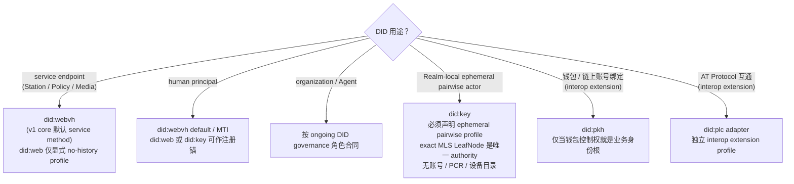

## 0. 规范语言

本文中的规范关键字（**MUST** / **SHOULD** / **MAY** 等）按 [conformance/normative-language.md](../conformance/normative-language.md) 解释；仅大写形式具规范约束力。

## 1. 目标

Arkret 使用 `did_core_id` 作为稳定身份根，使用 `did` 携带可由 DID method 解析和验证的当前 resolution。Handle、邮箱、组织用户名和第三方账号都只是可验证属性，不是协议主键。

本文定义：

- DID method 选择策略
- 默认 DID method
- resolver policy 与 method adapter
- `did_core_id` / `did` 投影与 PCR resolution 发布
- DID Document normalized view
- 组织账号绑定的 DID proof

DID / DID URL 字段总表，以及“何时只把 DID 当作身份锚点、何时才验证 DID 控制权”的统一
边界见 [`did-usage-and-verification.md`](./did-usage-and-verification.md)。本文只定义真正进入
DID authority path 后的方法、证据与解析规则，不要求普通业务路径重复解析 DID。

Arkret v1 不定义、注册或推荐任何自有 DID method。v1 主体创建面使用由
[`did-method-adapter-registry.json`](../../artifacts/registry/did-method-adapter-registry.json)
`role_requirements` 从 active adapter 客观属性推导的封闭 method 集。human 注册锚 method 为
`did:webvh`、`did:web` 与 `did:key`；`did:webvh` 是 MTI/default，`did:web` 需要持久化 DNS/WebPKI
bootstrap evidence，`did:key` 是不可变锚。Realm-local 临时 pairwise actor 也可使用 `did:key`，但该
角色只由 exact MLS LeafNode 约束、不进入账号/PCR/设备目录。service method 集为 `did:webvh` 与
`did:web`。未满足对应角色要求或未登记为 active adapter 的 method MUST
`unsupported_did_method`，本地 trust policy 不得自行扩大可互操作的角色准入面。

## 2. 核心原则

### 2.1 稳定主体引用 MUST 使用 `did_core_id`

协议中的持久主体引用 MUST 使用 `did_core_id`，而不是 handle 或当前 `did`。v1 wire 形态固定为：

```text
ak:did_core:<method>:<core>
```

`<method>` 是不含 `did:` 前缀的已登记 method 名，`<core>` 是该 method adapter 从 DID 投影出的稳定、不透明 identity core。业务层 MUST 对完整 `did_core_id` 做逐字节比较，不得解析 `<core>` 猜测 method-private 语义。

包括：

- object creator
- object updater
- grant issuer
- grant subject
- agent actor
- service node actor

#### 2.1.1 用户可见标识 MAY 不是 DID

实现 MAY 允许用户使用 `@alice:example.org`、`alice@example.org`、组织用户名、OIDC subject、邀请链接或其他人类可读标识完成发现、登录、邀请和账号恢复。

这些标识是 user-facing identifier、service account id、handle、3PID 或 bridge alias；它们不是协议主键。实现首次建立账号、session、device、membership、federation peer 或 service delegation 信任绑定时，MUST 要求提交 `did`，用已登记 method adapter 独立验证并投影为 principal `did_core_id`，再绑定到 device。后续持久 Event 仍须逐条验签与授权，但命中既有 accepted auth-state / key epoch 时 MUST 复用该绑定，不得把每次 Event 接收都解释为重新解析 DID。

如果用户尚无显式 DID，Auth Server MAY 编排 account-first onboarding；客户端按所选 active adapter 生成并控制注册材料，服务端不得代持控制私钥。选择 `did:webvh` 时可由 registry 托管客户端签名的 `did.jsonl` 并提供 witness；选择 `did:web` 时必须冻结注册时 DNS/WebPKI 与 DID Document evidence；选择 `did:key` 时必须冻结 deterministic expansion evidence。无论 method，设备目录、recovery policy、resolution 与业务授权都按具体 `(principal_id, station_id)` 账号分区，hosting 或当前 DID control 不等于注册后 PCR 控制权。

#### 2.1.2 `did_core_id` / `did` 模型（normative）

`did` 是符合 W3C DID syntax 的**W3C DID**，不含 fragment、query 或 path；它携带特定 method 当前解析所需的 resolution。`did_core_id` 是 method adapter 对 `did` 的稳定投影：

```text
project(did) -> did_core_id
did ≅ did_core_id + method-specific resolution
```

上式是语义关系，不是通用字符串拼接算法。实现 MUST NOT 用截断、分隔符切割、模板拼接或把任意 resolution suffix 附到 `did_core_id` 的方式构造 `did`；只有 [`did-method-adapter-registry.json`](../../artifacts/registry/did-method-adapter-registry.json) 登记的 method adapter 可以执行 `parse`、`project`、`resolve`、canonicalization 与 DID URL 构造。adapter MUST 拒绝无法产生唯一 `did_core_id` 的输入。

同一 registry 的 `role_requirements` 是 method 角色资格的机读真相源。adapter 行只声明
`self_certifying_genesis`、`verifiable_control_history`、`pre_rotation_commitment`、
`has_update_operation`、`network_resolved_document`、`native_history` 与
`history_evidence_kind` 等客观属性；角色只声明所需属性。实现 MUST 从 active adapter 行推导
长期 principal、service 与 Realm-local ephemeral actor 的允许集合，不得维护独立手工 allowlist。
`native_history=false` 的 service adapter 只有在 `history_evidence_kind="none"` 时才满足 service
角色要求，不能把合成 current-document 摘要宣称为 method-native history。

以下边界固定：

- principal / service core reference 与只按 core 定义的 capability subject 使用 `did_core_id`。Event `actor_id` 与 Realm membership 必须使用完整 closed `ActorId`；account-scoped state 必须使用完整 `AccountId`。同 principal、异 Station 的两个 account actor 永不相等，任何实现不得通过 `signing_principal_id()` 或其它 core 投影完成 account/actor equality。
- 注册、首次 service binding、method-native operation、DID Document 获取以及需要最新控制状态的验证提交 `did`。
- 同一个 `did_core_id` 的 resolution 更新不改变主体；改变 method 或 `<core>` 会产生另一个 `did_core_id`，MUST NOT 作为“迁移”冒充原主体。
- `verification_method` 等 DID URL MUST 由已验证的 `did` 及 method adapter 构造和比较；不得把 fragment 直接拼到 `did_core_id`，也不得用 `did_core_id` 与 DID URL 做字符串前缀比较。

### 2.2 DID 持久，密钥 SHOULD 可轮换

普通密钥轮换 SHOULD NOT 改变 DID。

human DID MUST 使用满足 registry `role_requirements.human_principal_anchor` 的 active adapter；当前为
`did:webvh`、`did:web` 与 `did:key`。relocation、DID-root recovery 与 ongoing governance 分别由独立
role requirement 推导，不能反向成为 human 锚点准入条件。`did:key` human anchor 可以创建完整账号、
PCR 与设备授权链；只有其 ephemeral actor 用法不创建这些状态。`did:pkh`、`did:plc` 与其它 method 不属于 v1 human principal 创建面，Realm / organization
本地 policy 不得把它们加入该封闭 allowlist。（设备不在此列——设备不是独立 DID 主体，其密钥是所属
principal `did` 下的 verification method，见 [`../crypto-media/device-lifecycle.md` §4](../crypto-media/device-lifecycle.md)。）

### 2.3 DID Document 不是身份画像

DID Document SHOULD 只承载：

- 可验证控制材料
- 可选的 service control/delegation 证明（不得作为 `did_core_id -> URL` 的通用首跳）
- method-specific 更新、恢复或历史所需状态

DID Document MUST NOT 被用作跨组织身份画像。邮箱、跨组织 handle、第三方账号和隐私敏感属性应通过 claim / presentation 按需证明。

Agent 的完整 `requested_scope`（包括 resource selector 与 mandatory constraint）属于隐私敏感授权意图，MUST NOT 写入当前 DID Document 或可解析的 DID version history。`ArkretPrincipalControlRealm.serviceEndpoint` 只保留域分离 `requested_scope_digest`；需要执行 ceiling 子集判定的 verifier 按 [`key-management.md` §4.1](./key-management.md) 取得 controller-signed 私有披露。

`metadata.primary_handle` 是 v1 唯一允许的 Arkret DID Document metadata 槽位：它 MAY 出现在 holder 自己控制的 DID Document 中，值 MUST 是 canonical handle 字符串或缺省。该字段只是 holder 的 primary handle 偏好指针，不是 handle claim、身份画像或可枚举 handle 列表；verifier MUST 按 [`identity-handles.md` §3.2.1](./identity-handles.md) 先验证 signed handle claim set，且仅当该值命中 verified candidates 时才可把它作为 holder-flagged 输入。

## 3. 默认 DID 方法

Arkret v1 core 的 MTI/default human 与 service method 是 `did:webvh`：

```text
did:webvh:<scid>:<host-and-path>
```

human anchor 还允许 `did:web` 与 `did:key`；它们分别提供 no-history DNS/WebPKI bootstrap 与不可变
self-certifying anchor。二者都不是 `did:webvh` outage fallback。

选择 `did:webvh` 作为 v1 core principal 默认的原因：

- 它在 `did:web` 之上叠加了 `did.jsonl` 历史链 + SCID + 可选 witness 证据，提供了 **可审计的 DID 控制历史**。
- DNS 劫持、TLS 证书失窃或域名转移在 `did:web` 上是静默的——攻击者可以替换 DID Document 而不留任何可被 verifier 检测的证据。`did:webvh` 通过 entry hash chain + controller proof + witness 让任何身份控制权变更都进入可验证账本，与 Arkret 自身 signed-event chain 范式同构。
- 它与 Arkret 的 service DID 发现模型兼容，部署门槛仅比 `did:web` 多一份 `did.jsonl` 文件；service DID 若显式降级到 `did:web`，必须把 `history_evidence_kind="none"` / no-history trust profile 暴露给 verifier，不得伪装成默认强度。

`did:web` 的当前状态只有 DNS/WebPKI 强度，因此注册 verifier MUST 持久化 accepted-at bootstrap evidence，
并依赖 create-once account authority pair 防止后续域名转手替换既有关系；它不能用于 relocation 或
DID-root recovery。未来 human anchor method 必须登记 adapter 客观属性、注册 evidence 与 conformance
vector，并满足 `role_requirements.human_principal_anchor`。v1 core 实现 MUST 支持
`did:webvh:1.0` adapter，以保证 mandatory-to-implement 的联邦互验基线。

> **残留暴露面与 Key Transparency profile（informative）**：`did:webvh` history 与 witness 只证明单个 DID 的 method continuity，不决定某个 Arkret 业务关系选择哪条 PCR。`did:web` 的 DNS/WebPKI split-view 与 controller transfer 风险同时适用于 service 和 human registration bootstrap；human 侧通过 durable registration evidence 与 create-once account authority pair 阻止它改写既有关系。可选 `ak.profile.key_transparency.v1` 的 PCR label 必须包含完整 account authority pair，不能只用 `did_core_id`，否则同 core 多 PCR 会被错误合并。

### 3.1 Method Selection

| 场景 | 默认 / 推荐 DID method | 说明 |
| --- | --- | --- |
| human principal | `did:webvh` default/MTI；`did:web`、`did:key` MAY | 三者都可作注册锚；额外 relocation/history/DID-root 能力按 adapter 属性分别启用。 |
| 组织 DID | `did:webvh` | v1 core MUST-support；治理 / 合规部署强制可验证 history chain。 |
| Service DID | `did:webvh` SHOULD / default；`did:web` MAY 显式声明 no-history profile | 服务发现虽依赖域名和 HTTPS endpoint，但 service DID 同样签发协议交易、describe、HTTP Message Signature 与 delegation；默认需要可审计历史。低风险或外部互通服务 MAY 使用 `did:web`，但 MUST 在 ServiceDescribe / resolver evidence 中声明无历史信任强度。 |
| 显式 ephemeral pairwise actor principal | `did:key` | 必须声明 `ak.profile.ephemeral_pairwise_principal.v1`；只在已声明 minimal-metadata profile 的 Realm 内由 exact accepted MLS LeafNode 约束，不创建账号/PCR/设备目录，不可升级为长期 principal。 |
| 钱包、AT Protocol 或其它 interop identity | interop extension 自有 method | 可以作为外部 claim/bridge identity，但不进入 v1 principal 创建 allowlist；需要 Arkret principal 时必须另建 `did:webvh` principal 并走显式业务绑定。 |
| 高安全或隔离部署 | `did:webvh` | sovereign / enclave / 内网部署可以收紧 resolver trust roots 与 witness 集合，不得本地扩展长期 principal method allowlist。 |

### 3.1.1 DID method 选择决策树

下图把 §3.1 的选择矩阵画成决策流。先按 **用途**（principal / service / 临时 / interop）分支，再按 deployment profile 与 stakes 决定 method。



读图要点：

- `did:web` human anchor 必须冻结注册 bootstrap evidence；service 使用时必须声明 no-history trust profile。
- `did:webvh` hosting 暂时不可达时 MAY 进入 cache-only degraded mode；该模式只消费此前已验证的本地 evidence，不得 live fallback 到 `did:web`。
- `did:pkh` / `did:plc` 等是 interop extension identity，不属于 v1 principal 创建面。

### 3.2 标识域名与服务域名的解耦

DID 托管域名、Station 服务域名和 handle 域名是**三个独立的标识层**，可以分别属于不同的域名甚至不同的运营方。实现 MUST NOT 假设这三者必须一致，也不得用其中一个直接推导另一个。

| 标识层 | 由谁决定 | 解析/验证通道 | 示例 |
| --- | --- | --- | --- |
| DID 历史托管域名 | DID method 与 SCID（一旦签发即写入历史链） | `did:webvh` `did.jsonl` + entry hash chain + witness | `did:webvh:<scid>:users.acme.example` |
| Station 服务域名 | current signed `ServiceResolutionRecord.base_url`，且该 record 的 service control identity 必须经过 method adapter / DID history 验证 | 业务授权的 service binding + current record + describe 第二跳 + `destination` 绑定（见 [federation.md §6](../sync/federation.md)） | `https://principal-7.cluster.acme.example:8443/` |
| Handle 域名 | Holder 选择并通过双向验证发布 | DNS TXT / HTTPS well-known + DID Document `alsoKnownAs` 双向验证（见 [identity-handles.md §5–§6](./identity-handles.md)） | `alice.example.com`、`@alice:example.org` |

要点：

- DID 字符串中出现的域名（例如 `did:webvh:...:users.acme.example` 中的 `users.acme.example`）只表示 `did.jsonl` 历史的托管位置，**不**承诺该域名运行 Station，也**不**是用户公开 handle。
- Station 变更端口、增加 mirror 或切换第三方 host 时，service owner 发布同一 service `did_core_id` 的 signed successor `ServiceResolutionRecord`；调用方验证 record chain、DID method history、proof 与 freshness。这只是同一 `station_id` 的路由刷新，不改变 AccountId。service core 改变则形成新的 AccountId，不能把旧账号的 membership 或数据静默迁移过去。
- DID Document 中的 `type="ArkretService", serviceKind="station"` service entry 不是账号选择或 Realm-scoped 路由 authority。membership 直接保存完整 `ActorId`；account 分支已经包含 `principal_id + station_id`，事件、sync、to-device、push 与 KeyPackage 投递据此选择账号及服务路由，不再存在第二套 joined-member ActorId routing projection 状态或 DID Document 默认回退。
- **DID 只作为 identity anchor。** Principal DID method log 只承载 active update root、pre-rotation commitment、method-native history 与 witness evidence。DID Document 不得用 `service`、verification relationship 或 fragment 指派设备 authority，也不得承载设备、recovery policy、capability 或业务 profile state。
- **设备密钥不写入 DID method key log。** `device_public_key_did` 只由 PCR accepted `ak.device.authorize` 进入设备集投影。普通业务 Event proof 保留签名时的 DID URL；verifier 以 fragment 选择 accepted PCR device evidence、执行 generation fence，并验证该设备属于 Event `actor_id` 指定的 account / service。不得把 ActorId 当作 DID URL 拼接 fragment，也不得回退到 DID Document verification method 充当设备授权。
- Genesis/re-anchor verifier 只从对应 DID history 解析 identity root。首设备和 replacement device 的 candidate key来自同批 descriptor/authorize payload，通过 unit-local overlay 验证；DID resolver 不提供该 key。
- Handle（例如 `@alice:acme.example` / `alice@acme.example`，canonical `alice:acme.example`）属于 Handle 层，不属于 DID method 或 DID Document service discovery。账号 handle claim 直接绑定 exact AccountId；它只用于寻址和 pending invite，不能替目标账号接受 membership。
- Handle 域名（含品牌域名）与 DID 托管域名可以完全无关。例如品牌持有者可以使用 `alice:alice.example.com` 作为公开 handle，而 DID 仍然由 `users.someprovider.example` 托管，只要 `alsoKnownAs` 与 issuer claim 双向验证一致。
- [federation.md §6.3](../sync/federation.md) 的 `https://<domain>/.well-known/arkret/server` 仅作为 bootstrap 候选发现 hint，**不是**身份解析必经路径，也不能授权联邦请求；可路由服务必须来自业务授权的 service binding，并通过 current `ServiceResolutionRecord` 独立验证。DID Document 只证明 `did` 的 control/history，不是 `did_core_id -> URL` 的通用首跳。
- 实现 MUST NOT 引入"DID 字符串 → 实际服务地址"的额外带外重定向（例如类 Matrix `.well-known/matrix/server` 的间接），因为这会把信任根退化到 DNS+TLS 即时强度，与选择 `did:webvh` 而不是 `did:web` 作为 v1 core 默认 principal method 的初衷冲突（见 §3.4）。

### 3.3 支持要求

Arkret v1 core conformance 要求如下：

- Core resolver / verifier MUST 支持 DID Core 解析 / 验证抽象、`did:webvh`、`did:web` 和 `did:key`，但 method 能被解析不代表可用于任意角色或能力。
  - `did:webvh:1.0` 是 v1 core MTI adapter 与 default human/service method。method evidence 的 `parameters.method` MUST 等于 `did:webvh:1.0`；缺失或未知版本 MUST `unsupported_did_method`。
  - `did:webvh:1.0` 的 method parameter registry 是 closed：只允许 `method`、`scid`、`updateKeys`、`nextKeyHashes`、`witness`、`watchers`、`portable`。构造器与 verifier MUST 消费 `did-method-adapter-registry.json` 的同一 `parameter_allowlist` 与 `parameter_consumption`；任何其他 member（特别是 `governance`）必须在 proof、hash 与持久化之前以 `param_invalid` 拒绝。`portable` 缺失或 false 时，host-and-path 变化 MUST 以 `did_method_successor_invalid` 拒绝；只有 predecessor 的 effective `portable=true` 才能授权后继 relocation，在 relocation entry 自身首次设 true 不授权本次搬迁。`watchers` 由 method parser 验证并保留，但 v1 明确接受而不消费：它不得影响 authorization、admission、controller 选择、witness quorum、freshness、routing 或 policy。组织治理只存在于 typed DID Document `arkret_governance` / `ArkretGovernanceService` overlay，不得写入 method-native parameters，也不得与 witness quorum 混同。
  - `did:key` MAY 作为不可变 human identity anchor；其账号、PCR、device 与 recovery 生命周期完全由 PCR 承担。method update、relocation 与 DID-root recovery MUST `unsupported_feature`。它也可用于显式 ephemeral pairwise profile，但两种角色合同不得混用。
  - `did:web` MAY 作为不可迁移 human identity anchor，前提是注册时 DNS/WebPKI bootstrap trust evidence 被 durable 固定，并且所有业务关系绑定 create-once account authority pair；它不提供 method-native history、relocation 或 DID-root recovery，也不是 `did:webvh` outage fallback。
- `did:webvh` 的 history/pre-rotation 只开启 relocation 与可选 DID-root recovery 能力；它们不是 human anchor 的统一准入门槛。organization、Agent 与 service 是否要求持续 DID governance 由各自角色合同决定。
- AT Protocol interop（`did:plc`）、wallet binding（`did:pkh`）、KERI 等 method 可以由 extension 解析为外部 claim；要进入 human anchor 或其它角色集合，必须先在 adapter registry 登记对应能力与 bootstrap trust，而不能由 implementation-local policy 增加。
- 实现 MUST NOT 将任何外部 DID Document 重写为 Arkret 私有 DID method。

### 3.4 `did:webvh` 作为 v1 core 默认

`did:webvh` 在 `did:web` 之上提供：

- `did.jsonl` 历史（SCID + entry hash chain + controller proof）
- 可选 witness / watcher 证据
- 与 Arkret signed-event chain 范式同构的"链式可验证"语义

所有声称 v1 core station / full_client / e2ee_client conformance 的实现 MUST 支持 `did:webvh` witness 验证、SCID 派生、entry hash chain 验证和 controller proof 验证。

`ak.vector.identity.did_webvh_v1_adapter.v1` 与 `did-webvh-v1-fixture.json` 是上述精确版本选择的可执行证据：接受 `parameters.method=did:webvh:1.0`，并拒绝未知或缺失的 method 版本。凡 `method_history_evidence.evidence_kind=webvh_log` 被用作公开 resolution 或 retained historical signer evidence 时，`log_entries` **MUST** 从 inception 开始、无缺口地终止于 `boundary.to_version_id`，并携带该区间全部适用 `witness_records`；验证者必须重新执行 SCID、hash chain、controller proof、key rotation 与 witness threshold 验证，并要求 terminal state 与同对象的 normalized DID Document 逐字 canonical 相等。resolver summary、partial range 或单独 current DID Document 均不是该 evidence。

`did:webvh` hosting domain 暂时不可达时 resolver MAY 进入 **cache-only degraded mode**——仅消费此前已验证并落入本地 cache 的 `did:webvh` DID Document、SCID、entry hash chain 与 controller proof,**MUST NOT** 通过 live HTTP 获取该 DID 当前的 `did:web` document 作为 principal 控制权依据(这等价于把信任根从 SCID-sealed history chain 降级到当前 DNS + TLS,正好落入 [`server-threat-model.md` §2](../security/server-threat-model.md) 所列服务端攻击面中的 DNS / TLS 单点失陷)。

具体规则:

- **Cache-only,不解析替代 `did:web` document**：对既有 `did:webvh` identity，fallback 期间 resolver MAY 返回此前已验证的本地 cache；MUST NOT 把同 hosting domain 拼成另一条 `did:web` identity。独立注册的 `did:web` human anchor 仍按自己的 adapter/trust profile 处理，两者不能互换。
- 该 fallback 只决定**需要 current DID authority** 的操作能否消费 cached method evidence；它不得成为 human PCR、device、capability、MLS、membership、session 或 account lifecycle 的全局运行模式。下列集合只描述 resolver 自己可提供的 current-DID 结果：
  - Allowed: 已缓存 DID Document 的本地展示(handle 解析、display name 渲染)
  - Allowed: 已缓存对象的本地展示(已存在的 Strand / Message / Space / Morph 渲染)
  - Allowed: 已缓存对象的本地搜索 / 本地索引查询
  - Allowed: 已收到 snapshot / Seal 的 state_root 重算(用于本地一致性自检)
  - Out of scope: Event/Seal ingress、联邦 transaction、client sync、capability freshness、session、Snapshot witness 与账号操作继续验证各自 accepted authority；它们不得仅因 resolver degraded 被拒绝
  - Forbidden: 解析任何新出现的 `did:webvh` DID(本地无 cache)——MUST 拒绝并返回 `did_unknown`,不允许 fallback 到 `did:web:<同 hosting>` live resolve
- fallback 期间禁止任何 live DID Document 解析、handle re-resolution、capability subject 重映射或基于网络响应的缓存索引重建。允许的"本地搜索"只能读取进入 degraded mode 之前已经由 verified DID evidence 建好的本地索引；实现不得在 outage 期间用新的 DNS / HTTPS / handle 结果重建索引或补全 subject。
- **"已建好的本地索引"的可信来源约束（normative，防索引洗白）**：degraded mode 期间可被读取的"已建好的本地索引"MUST 由满足以下两条的 sealed evidence 派生，否则 degraded 期间 resolver MUST 拒绝消费该索引（返回 `webvh_cache_unavailable` / `did_unknown`，按低风险只读失败处理），不得把它当作可信解析结果：
  - **evidence age ≤ 7 天**：构建该索引条目所依据的 `did:webvh` DID Document / SCID / entry hash chain / controller proof evidence 的 `cached_evidence_age_ms ≤ 7d`，且 controller-proof 在构建时已验证通过（与本节 per-entry 7 天 cache age 上限一致；过旧或 controller-proof 未验证的 evidence 不得支撑索引）。
  - **携带 build-time evidence 引用**：每条索引条目 MUST 记录其 build-time evidence 引用（被解析 DID、entry hash chain head / `versionId`、evidence 构建时间、controller-proof 验证结果摘要）；缺少该引用的索引条目视为"来源不可追溯"，degraded 期间 MUST 被拒绝。这关闭"在 outage 前用未经 controller-proof 验证或来源不明的数据建一份本地索引，再在 degraded 期间把它当作 verified 结果读出"的索引洗白路径——degraded 模式只能消费可回溯到 sealed、age 合格、controller-proof 已验证 evidence 的索引，而不是任何"碰巧已落地的本地表"。
- Resolver MUST 把 cache-only degraded 状态作为 service health / diagnostics 信号暴露给同 Realm peers（例如 `resolver_state=webvh_cache_only_degraded`、`cached_evidence_age_ms`、受影响 DID 集合摘要）。Peer 只在收到 operation/action registry 登记为 current-DID-dependent 的请求时据此 fail closed；普通 human PCR 写入不得读取该信号作为 authority gate。
- **degraded / health 诊断信号的可验证性（normative）**：该 degraded / health 诊断信号 MUST 由 resolver 的 service DID 当前有效 verification method 签名，并在签名 transcript 中绑定 `resolver_service_id`、`as_of`、`trust_domain` 与 freshness nonce。缺失或无法验证时，只对 `registration_control`、`current_external_claim`、`method_successor`、已启用的 `optional_did_root_recovery` 和登记的 `ongoing_governance` 调用 fail closed；不得外推到同一个主体的其它动作。
- DID outage 下必须继续工作的 human 路径包括普通/高风险 PCR Event、device authorize/revoke、PCR-policy recovery、capability grant/revoke、MLS commit、membership/join/invite、session 恢复、账号删除/擦除与 Contact。它们仍须对自己的实际 authority fail closed，但不得要求 hosting 或 mirror 恢复。
- Resolver MUST 在 outage diagnostics 中暴露 `webvh_unreachable` 标记 + `cached_evidence_age_ms`,让客户端 UI 显式提示用户。客户端 UI MUST 在 fallback 期间向用户展示 banner-level 警示("身份历史链暂不可达，仅显示本地缓存内容"),不得静默继续。
- Fallback 总时长 MUST ≤ 24 小时；超时后 resolver 对 current-DID-dependent 调用进入 `stale_history` 或 `write_unavailable`。该时钟不得改变 account/PCR status，也不得阻止 durable accepted-at evidence 的历史重放。
- 即使仍处于允许的 cache-only outage 窗口，单条 `did:webvh` cache entry 的 `cached_evidence_age_ms` 超过 7 天，任何登记为 current-DID-dependent 的调用也 MUST fail closed 并暴露 `webvh_cache_too_stale`。该阈值不得扩散到 human PCR 的 capability、device、membership 或 account 动作。
- Cache entry 写入 / 刷新不能只信任单一 resolver 自报。deployment profile 对 witness 的门限只适用于其登记的 current DID authority call；device/capability/membership 等 human PCR 动作不因自身风险等级继承该门限。v1 的 method-evidence 载体仍只接受登记 kind，未知 kind fail closed。

> **Log-backed witness 增强（informative scope）**：`did:webvh` witness 可以采用 transparency-log 形态（append-only Merkle log + 第三方可独立审计 consistency / inclusion proof + 抗 split-view）。当前 v1 baseline 仍为 §3.4.2 基线表的"≥2 witness from distinct controlling organization"；log-backed witness 是下述高保障 profile 的加固项，不改变 base v1 的 witness 语义。

> **高保障 profile 加固（normative，profile-gated）**：`high_security_organization` 与 `sovereign_deployment` 对登记为 `method_successor` 或 `ongoing_governance` 的 `did:webvh` 调用，MUST 使用带 inclusion/consistency proof 的 append-only witness log。该要求不适用于仅由 human PCR 授权的 recovery、membership、device 或 capability 动作。

> **`ak.profile.key_transparency.v1` 覆盖范围（normative，profile-gated）**：log-backed witness 可覆盖账号内部 device key、authorization frontier 与 KeyPackage 发布，但其外部 account label MUST 只使用 `(principal_id, station_id)`；PCR realm、genesis receipt 与 frontier 只能作为该 pair 内部审计材料，不能形成第二套 principal equality。
>
> **为什么 fallback 是 cache-only**（rationale）：把既有 `did:webvh` identity 临时改按同域 `did:web` 解析，会把 SCID/history 信任根降级成 DNS+TLS 当前状态。独立注册的 `did:web` anchor 合法，但绝不是另一条 `did:webvh` identity 的 fallback。

完整 method-specific 操作（创建、轮换、恢复、deactivation、history validation）的规范见
DIF / identity.foundation `did:webvh` method specification（<https://identity.foundation/didwebvh/v1.0/>）
与 §7.2；core v1 文档不再展开。`did:webvh` 当前不是 W3C Recommendation，本规范不应把它表述为 W3C
artifact。

#### 3.4.1 Witness 的 method-native 输入合同（normative）

§3.4 把 witness 验证定为 v1 core MUST。该 MUST 的输入合同是封闭的，实现之间不得各自解释：

**唯一 policy 来源**：witness policy 只来自 DID log 的 `parameters.witness`，形状为
`{threshold, witnesses: [{id}]}`。`witnesses[].id` MUST 是 `did:key` 且在数组内唯一；
`threshold` MUST 落在 `1..witnesses.length`。

**`did:key` MUST 可解码为合规公钥。** 形状检查不够：verifier MUST 在**参数校验阶段**把每个
`witnesses[].id` 的 multibase/multicodec 载荷实际解码，确认它是一个长度与算法均合法、
且与该 log 所用 Data Integrity cryptosuite 兼容的公钥；解码失败、multicodec 未登记、
密钥长度不符或算法与 cryptosuite 不匹配时 MUST `webvh_witness_parameter_malformed`，
**MUST NOT 推迟到验签时才发现**。只按字符串形状接受，等于允许一个永远无法验签的 witness
占据 threshold 名额，从而把门限悄悄架空。

**唯一 proof 来源**：witness proofs 只来自与 `did.jsonl` 分离发布的 `did-witness.json`，
按 `versionId` 绑定。每个适用 log entry MUST 满足其生效 threshold。

**不承认任何 alias**：`witness_threshold`、`witnessThreshold`、`parameters.witnesses.*`
及其它未登记键**都不是** method 输入。注意 §4.1 resolver policy 示例中的
`require_witness` / `witness_threshold` / `trusted_witnesses` 是 **verifier 本地部署配置**的形状，
不是 DID log parameter；把它们当作 log parameter 解析会把 verifier 自己的信任配置
误认成 holder 的声明。**`trusted_witnesses` 的元素 MUST 与 §3.4.1 的 `parameters.witness.witnesses[].id`
使用同一标识符空间（`did:key`），否则该白名单无法与 log 中声明的 witness 逐字比对而形同虚设；
部署配置里出现 `did:webvh` 或其它形态的 witness 标识符 MUST 视为配置错误并 fail closed。**

**缺失与 malformed 是两件事**：`parameters.witness` 缺席表示该 DID 未声明 method witness；
而对象存在但形状不合法、threshold 越界、witness id 重复或非 `did:key`、proof 缺失或不足 threshold，
一律 MUST fail closed 并返回下表错误码，**MUST NOT 归零为「未配置 witness」**。
`parameters` 中出现上述 alias 键时同样 MUST fail closed：该形状本身即证明该 log 是按非标准方言产出的，
真实 policy 未知。把解析失败向「无需 witness」方向取整，会让一个**声明了** witness 的 DID
静默变成一个**不要求** witness 的 DID，与 §4.2.1（degraded 信号缺失一律向 degraded 方向取整）
所确立的保守纪律相反。

| 情形 | 错误码 |
|---|---|
| `parameters.witness` 形状不合法、threshold 越界、witness id 重复或非 `did:key`、`did:key` 无法解码为与 cryptosuite 兼容的合规公钥、出现 alias 键 | `webvh_witness_parameter_malformed` |
| 已声明 policy 但 `did-witness.json` 不可达 / 不可解析 / 无该 `versionId` 条目 | `webvh_witness_proofs_unavailable` |
| 单条 witness proof 验签失败、签名者不在 witness 列表、或未绑定所声称的 `versionId` | `webvh_witness_proof_invalid` |
| 有效且互不相同的 witness proof 少于生效 threshold | `webvh_witness_threshold_not_met` |
| evidence 超过生效 max age | `webvh_witness_evidence_stale` |
| distinct controlling organization 要求下，某 witness 的控制组织不可验证或两者同源 | `webvh_witness_controlling_organization_unverified` |

#### 3.4.2 Arkret overlay policy 与 method-native policy 的分层（normative）

**各 deployment profile 的 witness 基线（normative）**：下表是 v1 唯一的 overlay 基线定义点；本文其它
位置引用「≥2 distinct controlling organization 基线」时一律指本表。profile id 见
[`conformance-profiles.json`](../../artifacts/profiles/conformance-profiles.json) 的 `deployment_profiles`。

| deployment profile | 最少有效 witness proof | distinct controlling organization | log-backed witness |
| --- | --- | --- | --- |
| `ak.profile.personal_node.v1` | 1 | 不要求 | 不要求 |
| `ak.profile.small_team.v1` | 1 | 不要求 | 不要求 |
| `ak.profile.organization.v1` | 2 | MUST ≥2 | 不要求 |
| `ak.profile.high_security_organization.v1` | 2 | MUST ≥2 | MUST（仅 `method_successor` / `ongoing_governance` 调用） |
| `ak.profile.sovereign_deployment.v1` | 2 | MUST ≥2 | MUST（同上） |
| `ak.profile.isolated_sovereign_network.v1` | 2 | MUST ≥2 | MUST（同上） |
| `ak.profile.sovereign_enclave.v1` | 2 | MUST ≥2 | MUST（同上） |

`personal_node` / `small_team` 的 self-witness 因此是**合规但已降级**的形态：实现 MUST 向用户暴露该降级
状态，MUST NOT 把它宣称为具备外部见证的信任强度。`organization` 及以上 profile 的自举 service identity
MUST 满足本表，MUST NOT 以宿主自见证作为高风险控制判断的唯一依据。本表只约束**登记为需要 current DID
authority 的调用**；device / capability / membership / recovery 等由 human PCR 授权的动作不继承该门限
（§3.4 cache-only 段与 §3.4.3 已分别说明）。

上表的 ≥2 distinct controlling organization、log-backed witness
与 evidence age 属于 **Arkret overlay**，不是 did:webvh method 语义。二者分层如下：

- **overlay policy MUST NOT 写入 method 参数**。`profileMinThreshold`、`structuredWitnesses`、
  `watcherEvidence`、`maxAgeSeconds` 或任何等价的部署侧字段 MUST NOT 出现在 `parameters.witness` 中。
  写进 method history 会造成三个后果：外部标准 verifier 面对未登记字段；policy 轮换必须改写 DID history；
  以及 holder 得以同时自报 threshold 与自签 evidence，从而自定 trust root。
- **overlay policy 的来源是 deployment / Realm policy**（§4.1 resolver policy 的
  `require_witness` / `witness_threshold` / `trusted_witnesses`，及 profile 声明的
  distinct-organization 与 max age 要求）。服务 MUST 在 ServiceDescribe 中声明它能提供的 witness rail
  与 evidence 形态，使调用方无需试探即可判断可得性。
- **生效 policy 取最严格交集**：`effective_threshold = max(method_threshold, deployment_minimum)`，
  distinct-organization 与 max age 取各约束中最严者。holder 在 log 中的声明只能**提高**门限，
  **MUST NOT 降低** deployment policy 的任一项。
- **controlling organization 的判定与去重**：distinct-organization 要求按 witness 的控制组织计数，
  而不是按 witness key 计数。verifier MUST 能独立验证某 witness 到其控制组织的绑定；
  不可验证或两个 witness 同源时 MUST 按 `webvh_witness_controlling_organization_unverified` fail closed。
  否则一个运营方持有多把 witness key 即可独自满足「两个不同组织」要求，该要求形同虚设。
- **freshness 以观测时刻计**：evidence age 从 witness proof 被**观测**的时刻起算，
  而不是从任何 Arkret 层记录被签发的时刻起算；重新签发一份旧观测不构成刷新。

#### 3.4.3 Witness evidence 在 Arkret 层的承载（normative）

Arkret 层用 [`did-webvh-witness-receipt.schema.json`](../../artifacts/schemas/did-webvh-witness-receipt.schema.json)
（`ak.schema.did_webvh_witness_receipt.v1`）承载 witness 观测结论，
经 `ak.root.identity.receipts.read.list.v1` 以**闭合 discriminator 的 tagged union** 返回。

该 receipt 与 `ak.schema.identity_receipt.v1` 是**两个不同的对象族**，不得合并：
后者的 `witness_role ∈ {writer, witness, replica}` 描述的是 DID **registry consensus group** 中的复制角色，
并绑定 `seq` + `head_event_digest`；前者描述的是 **did:webvh method witness** 在某个 `versionId` 上的观测，
绑定 `version_id` + witness `did:key` + controlling organization + `observed_at`。
两者用同一个英文词表达不同含义，因此 discriminator 是必需的，verifier MUST 按 `schema` 常量分支，
不得靠"哪些可选字段恰好出现"来猜测语义。

receipt 是 Arkret 层的**可缓存、可审计**承载，**MUST NOT** 替代 method conformance：
verifier 仍 MUST 直接验证标准 `did-witness.json` proof、entry hash chain 与 controller proof。
`IdentityReceiptListOutcome.threshold_met` 同理只是便利信号；其缺席 MUST NOT 被读作 `true`。

§3.4.1–§3.4.3 的可执行证据是 `ak.vector.identity.did_webvh_witness_rail.v1`
（见 [`../conformance/conformance-vectors.md` §22.6](../conformance/conformance-vectors.md)
与 [`did-webvh-witness-fixture.json`](../../artifacts/fixtures/did-webvh-witness-fixture.json)），
其负向用例逐条固定上述 fail-closed 矩阵，包括 alias 键、overlay 字段污染、
threshold 不满足、同源 controlling organization 与 stale evidence。

#### 3.4.4 `{SCID}` 占位符的替换范围（normative）

§3.4 把 SCID 派生定为 v1 core MUST。SCID 派生的 pre-image 与 SCID 代入的**范围**同样是封闭的，
实现之间不得各自解释。

上游 DIF did:webvh v1.0 对此已有明确规定，本节与其一致并不另立方言：
inception 的 preliminary log entry 生成 SCID 后，
「把该 preliminary JSON object 当作字符串，对占位符 `{SCID}` 的**每一次出现**做字面文本替换」；
verification 侧反向执行——「把 log entry 当作字符串，把从 DID 取出的 SCID 值文本替换回字面 `{SCID}`」。
因此替换范围是**整条 log entry 的整棵 JSON 树**，而不是 skeleton 顶层的某几个字段。

具体规则：

- **构造（normative）**：SCID 代入 MUST 覆盖整条 entry 的每一次 `{SCID}` 出现，
  包含任意深度的字符串值、数组元素、以及 JSON 成员名，且**包含 `state`（DID Document）内部**。
  实现 MUST NOT 只替换 `versionId` 与 `parameters.scid` 等 skeleton 自有字段：
  同一份输入在「只替换顶层」与「整树替换」两种实现下会产出**不同的 entry、不同的 entry hash
  与不同的 `versionId`**，即两个同样自洽却互不可复现的 DID。
- **派生 pre-image（normative）**：SCID = `base58btc(multihash(JCS(preliminary entry), sha2-256))`，
  其中 preliminary entry 的 `versionId` 是裸 `{SCID}` 占位符（不是 `<seq>-{SCID}` 形态），
  且不含 `proof`。
- **残留占位符 MUST fail closed（normative）**：已发布的 log entry 中 MUST NOT 残留任何字面
  `{SCID}`。producer MUST 在代入后自检；verifier 在 entry 中发现残留 `{SCID}` 时
  MUST 拒绝并返回 `param_invalid`，MUST NOT 尝试「补替换」后再验证。
  残留占位符正是「只替换顶层」实现的可观测指纹，因此它是判据而非风格问题。
- **verification（normative）**：verifier MUST 从 DID 取出 SCID，去掉 `proof`，
  把 entry 中该 SCID 值的每一次出现替换回 `{SCID}`，把 `versionId` 置为裸 `{SCID}`，
  再重新计算并逐字节比对；不一致时 MUST `param_invalid`。
- **holder 提供的 `state` 不是豁免区**：`state` 由 holder 提供并不使其免于替换。
  把 `state` 排除在替换之外，等于允许 holder 在 SCID pre-image 里放入一段
  「派生后仍保持原样」的内容，从而在同一 SCID 下取得与其他实现不同的已发布文档。

§3.4.4 的可执行证据与 §3.4 同属 `ak.vector.identity.did_webvh_v1_adapter.v1`
（见 [`did-webvh-v1-fixture.json`](../../artifacts/fixtures/did-webvh-v1-fixture.json)），
其正例覆盖 `state` 内含字面 `{SCID}` 时的整树替换结果，
负例覆盖只替换顶层字段而在 `state` 中残留 `{SCID}` 的 entry。

### 3.5 Interop Adapter Extension Profiles

下列 method 在 v1 core 中**不要求**实现，作为可选 interop extension profile 提供：

- **`did:plc` adapter** — AT Protocol 互通；需要 PLC directory / mirror / audit source。
- **`did:pkh`** — 钱包 / 链上账号绑定；需要 chain-specific verification。
- **`did:keri` 与其他 KERI 系列** — KERI 部署的 raw evidence 保留与 normalized view 映射。
- **TSP transport** — 见 [`identity/tsp-integration.md`](./tsp-integration.md)（extension profile；v1 core 不要求实现）。

声明这些 adapter 的部署 MUST 在 `service/describe.identity_methods` 中显式列出，并在 conformance profile 中说明 trust roots、outage 策略与 mirror 来源。

### 3.6 Trust Domain

部署级 **trust domain** 是 Arkret v1 用来防止跨 deployment / 跨 sovereign 边界 replay 的命名空间。每个 deployment MUST 声明一个稳定的 typed string `ak:trust_domain:<scope>`，由部署运营方在初始化时确定并在以下位置暴露：

- Service Describe 响应的 `trust_domain` 字段（所有 `*/describe` endpoint 返回同一 `ServiceDescribe` shape）；
- Realm create object 的 `trust_domain` 字段（首次写入后 immutable，跟随 Realm create event 锁定）；
- 任何跨域可重放的 high-risk proof transcript（例如 PCR-policy re-anchor，或显式启用的 DID-root recovery-session proof input）。

约束：

- `trust_domain` MUST 全 deployment 唯一；推荐由组织主控 DID 派生（例如 `ak:trust_domain:did.webvh.acme.example`）或外部 trust framework 分配。
- 同一 principal DID 在多个 deployment 中被复用时，每个 deployment 仍各自有独立 `trust_domain`；跨域 high-risk proof（reset、recovery service unlock、device quorum 等）的 canonical transcript MUST 嵌入 receive 端的 `trust_domain`，使 deployment A 签发的 proof bytes 在 deployment B 校验时 signature transcript 不匹配，立即触发 `cross_domain_replay_rejected` 而进入不到签名校验。
- Resolver / Sync / Federation 服务 MAY 在不同 `trust_domain` 之间互联，但跨域 federation transaction MUST 通过 `Source-Trust-Domain` / `Destination-Trust-Domain` header 显式声明 source / destination `trust_domain`，并把两者纳入 HTTP Message Signature transcript；receiver MUST 按本 deployment 的 trust policy 决定是否接受。
- `trust_domain` 不替代 `service_id`、`realm_id`、`principal_id` 等其它绑定；它只关闭"完全相同的 proof bytes 被搬到另一 deployment 重放"这一面。

详见 [`../crypto-media/device-lifecycle.md` §14.1](../crypto-media/device-lifecycle.md) 的 reset proof transcript 与 [`error-code-registry.json`](../../artifacts/registry/error-code-registry.json) 中 `cross_domain_replay_rejected` 条目。

### 3.7 服务身份自举（Service Identity Bootstrap）

一个服务的 `service_id` 与其签名私钥是同一事实的两面：service DID 是该服务签发的一切凭据（`ak.session.grant`、notary seal、claim attestation）、其派生子身份（如 `{service_id}:users:<id>`）以及 §3.6 `trust_domain` 的稳定根。因此 service identity MUST 在服务生命周期内稳定，MUST NOT 在每次启动时重新生成——重新生成会使此前签发的所有凭据与派生身份成为无根孤儿。

本节规范服务如何获得并持有自身 service identity。目标是让部署**无需人工 mint DID 字符串即可启动**，同时以 fail-closed 纪律防止身份被代持或被静默替换。约束按重要性排列：

- **I-1 密钥自持**：每个服务 MUST 自行生成自身 service DID 的签名私钥，私钥 MUST NOT 离开该服务的信任边界。一个服务 MAY 作为另一主体 `did:webvh` 的 **hosting**（存放公开 `did.jsonl` 日志、代为发布 inception / rotation 条目），但 MUST NOT 生成或持有该主体的控制私钥；被托管方的 inception / rotation 条目 MUST 由被托管方用自己的密钥签名后提交。违反此约束会使 hosting 方能够伪造被托管方签发的凭据，等于消除签发方与验证方之间的信任边界。

- **I-2 持久身份与 Provider mapping 是真相源，config 不含 DID**：部署配置 MUST NOT 接受、复制或 pin 本服务的 `service_id`。运行时只从已验证的本地 `service_identity` 记录、外部 Service Identity Provider 的稳定 registration mapping，或可验证 identity bundle 恢复 DID。配置只声明网络 endpoint、Provider transport credential 和 key/bundle backend。所有 wire `service_id`、issuer 和 audience 均使用 SDK `DidCoreId` 强类型。

- **I-3 显式 first-provisioning 门仅适用于 B 类**："持久层无 service identity" 对自身就是 Provider 的部署可能是真正首次部署，也可能是数据灾难；没有外部权威能区分两者。因此 B 类生产部署仅在显式一次性 `first-provisioning` 信号存在时 MAY 创建新 DID。开发模式 MAY 自动 provision。B 类有可验证 bundle 时 MUST 恢复原 DID；无 bundle、无记录、无信号时 MUST fail closed。A 类不使用该信号：它先按 `ServiceRegistrationKey {service_kind, public_base_url}` 查询外部 Provider，mapping 存在则校验本地 control/signing key binding 后回填原 DID，明确 not-found 才提交 client-signed inception，传输失败时进入 waiting 且绝不 mint。

- **I-4 native-history service pre-rotation**：使用 `did:webvh` 的 service DID inception 与每次 rotation MUST 同时持有恰好一把 active update key 和一把本服务预生成的 next update key。`updateKeys` 与 `nextKeyHashes` 均恰含一项；`nextKeyHashes[0]` MUST 是 next update key Multikey 文本按 [`key-management.md` §5.0.1](./key-management.md) 相同的 sha2-256 multihash + Base58BTC 规则所得承诺。Provider / resolver 接受后继 entry 前 MUST 验证其 `updateKeys[0]` 命中前一 entry 的 `nextKeyHashes[0]`，并将被替换 key 标为 spent；缺少承诺、数量不为一或 commitment 不匹配 MUST fail closed 为 `service_registration_denied` / reason=`service_prerotation_invalid`。Provider 不得生成、接收或托管 next private key。显式 no-history `did:web` service 不携带这些 webvh-only 参数，必须以 current-document evidence 与 no-history trust profile 验证，不能伪造 pre-rotation 能力。

Service Identity Provider 的标准操作是：

- `ak.root.identity.service_registration.command.ensure.v1` → `POST /_arkret/root/identity/service-registrations:ensure`；
- `ak.root.identity.service_registration.resource.get.v1` → `GET /_arkret/root/identity/service-registrations?service_kind=...&public_base_url=...`。

注册键由 registry 限定的 `service_kind` 与 canonical `public_base_url` 组成。同一个注册键 MUST 永远映射到同一个 DID；普通 ensure、重启、数据库重连和 key rotation 都不得改变它。Provider MUST 验证 client-signed `did:webvh` inception 内声明的 service type / endpoint 与注册键完全相等，MUST 以 `UNIQUE(service_kind, public_base_url)` 和单事务先查后建保证并发幂等，并且在 mapping 行缺失时扫描现存托管 DID Document：任何 document 已声明同一注册键都必须返回 `service_identity_conflict`，不得创建第二 DID。`idempotency_key` 只用于审计关联，不是并发正确性的来源。

`ServiceRegistrationReceipt` 采用 Arkret 统一 detached JWS，不引入 Data Integrity cryptosuite 例外。transcript 只能按下列步骤构造：

1. 令 `receipt_claims` 为不含 `registration_receipt_id` 与 `proof` 的对象 `{registration_key, service_id, did, version_id, log_head_digest, control_key_digest, issued_at, provider_id}`；`registration_receipt_id = "ak:service_registration_receipt:" || hex(SHA-256(canonical_json(receipt_claims)))`。
2. 令 `document` 为包含 `registration_receipt_id`、但删除整个 `proof` 后的完整 receipt；`payload_digest = "sha256:" || hex(SHA-256(canonical_json(document)))`。
3. detached JWS MUST 签 `canonical_json({context:"ak.service_registration_receipt_proof.v1", payload_digest, provider_id, registration_receipt_id, verification_method, created_at, domain?, audience?})`。`created_at` MUST 等于 receipt `issued_at`；代码块 / 对象书写顺序不构成 byte order，key 顺序唯一由 [`encoding.md` §2](../conformance/encoding.md) 决定。
4. `provider_id` MUST 是 Provider 的稳定 service `did_core_id`。消费者 MUST 取得 Provider 当前 `did`，用已登记 method adapter 验证其 method-native history 并要求 `project(did) == provider_id`；`verification_method` 的 bare controller DID MUST 等于该 `did`，且该 method 在 receipt 签发时属于对应 DID Document 的 `assertionMethod`。不得把 `provider_id` 当作可解析 DID，也不得把 VM controller DID 与它直接作字符串相等比较；transport bearer、mTLS、HTTPS 成功或 proof 结构校验均不得替代密码学验证。identity bundle 的离线恢复同样 MUST 完成上述验证。

Provider 是 hosting 方而非控制者。transport bearer、mTLS 或内网凭据只认证部署通道；inception、rotation、endpoint update 与 registration-key migration 仍 MUST 由服务持有的 WebVH control/update key 签名。Provider 不得生成、接收或托管调用方私钥。服务自身必须持久化 active signing key ref、active control key ref、**next control key material**、version 与 receipt；B 类若要求数据库灾难后保持 DID，其可验证 identity bundle backend MUST 同时保存当前与下一代 control key material，否则不得声称可保持 DID。

运行时状态至少区分 `Ready`、`DegradedStored`、`WaitingProvider`、`RegistrationKeyDrift`、`RotationMaterialLost` 与 `Faulted`。已有并验证过的本地记录在 Provider 短暂不可用时 MAY 以 `DegradedStored` 提供普通签发/验证流程，但 MUST 禁止身份变更；本地为空且 Provider 不可达时进入 `WaitingProvider`，readiness=false，Service Describe 返回 `503 service_identity_unavailable` 与 `Retry-After`，Provider 恢复后自动重试，无需重启。`public_base_url` 漂移进入 `RegistrationKeyDrift`，继续用原 DID 服务但不得静默 ensure；只有 control-key-signed `migrate-base` 可以原子重绑同一 DID。已验证当前 DID 但 next control key material 丢失时进入 `RotationMaterialLost`：普通签发 / 验证可继续且 readiness 保持，所有 rotation、endpoint update 与 registration-key migration MUST 禁止并持续告警，直到从可验证 bundle 恢复匹配承诺的 key；不得生成新 key 绕过既有承诺。

Profile 分层（承接 §3.4 的 witness 要求，不新增语义）：

- `personal_node` / `small_team`：自举产出的 `did:webvh` 若仅由宿主自身见证（self-witness），属 §3.4.2 基线表的单 witness 降级——MUST 向用户暴露降级状态；MUST NOT 把 self-witness 宣称为具备外部见证的信任强度。
- `organization` / `high_security_organization` / `sovereign_deployment`：自举产出的 service identity MUST 满足 §3.4.2 基线表对应 profile 的 ≥2 distinct-organization witness（及高保障 profile 的 log-backed witness）要求，MUST NOT 以宿主自见证作为高风险控制判断的唯一依据。

> 错误是否进入 registry 取决于观察者。Provider/服务对调用方的 wire 响应使用 [`error-code-registry.json`](../../artifacts/registry/error-code-registry.json) 中的 `service_identity_unavailable`、`service_identity_provider_unavailable`、`service_registration_denied`、`service_identity_conflict`。
>
> 本机启动监督器的 `service_identity_provider_ambiguous`、`service_identity_provider_not_configured`、`service_identity_key_mismatch`、`service_registration_restore_failed`、`service_identity_first_provisioning_required`、`service_identity_registration_key_drift` 是 operator-facing diagnostic，不是 wire code；其中 drift 继续服务，不能笼统描述为“启动失败”。

## 4. Identity Resolution Infrastructure

Arkret 把身份解析抽象为 `Identity Resolution Infrastructure`，而不是要求所有 DID method 都部署同一种 Identity Registry。不同 DID method 的解析状态来源不同：

| DID method | 是否需要公共 Identity Registry | 需要的解析 / 验证能力 |
| --- | --- | --- |
| `did:webvh` | 不需要公共 registry（high-trust profile 默认 method）。 | `did.jsonl` history、SCID、entry hash chain、controller proof、watcher / witness evidence、HTTPS / DNS 校验。 |
| `did:web` | 不需要公共 registry。 | HTTPS / DNS / 域名治理、TLS / PKI、method-specific DID Document 获取与校验。无历史链——只能反映"当前 DID Document 状态"。 |
| `did:key` | 不需要。 | 本地 method resolver 从 DID 字符串展开 DID Document；适合作为测试、一次性邀请、bootstrap 或设备公钥的自描述 key material。只有显式 ephemeral pairwise profile 可在 minimal-metadata Realm 中把它投影为 LeafNode-bound 短期 actor；该 actor 无账号/PCR/设备目录。设备身份仍由 `device_id` + 长期 principal 下的 authorization 表达。 |
| `did:pkh` | 不需要 Arkret registry。 | CAIP-10 / chain-specific account validation、wallet proof、chain namespace policy；通常不支持 DID document update / deactivation。 |
| `did:plc` | 需要可接受的 PLC directory / mirror / audit source（AT Protocol interop adapter）。 | 验证 PLC operation chain、genesis / previous op hash、rotation keys、recovery state、DID Document、service bindings 和 directory transparency evidence。仅在声明 AT 互通 profile 的部署中需要。 |
| 其他现有 DID method（KERI 等） | 取决于 method。 | extension MAY 保留 raw DID Document 与 method-specific proof 并映射为外部 claim view；不得据此创建 v1 principal。 |

使用 `did:key` 或 `did:pkh` 不表示“不需要身份解析”。它只表示通常不需要公共可写 registry。
客户端、Auth Server、Station 和 Policy / Authz 仍然必须具备对应 DID method 的
resolver / verifier，供 [`did-usage-and-verification.md` §4](./did-usage-and-verification.md)
列出的权威验证触发场景确认 DID 控制状态、服务委托和 method 限制。普通对象读取、主体比较、
授权 selector 匹配和命中既有 key binding 的 Event 验签不因此触发解析。

### 4.1 Resolver Policy

Resolver policy MUST 至少定义：

- allowed methods：当前部署接受哪些 DID method。
- role method：可注册 human anchor、启用 DID-root recovery、启用 same-core relocation、持续 DID
  governance、service 与 Realm-local ephemeral pairwise actor 的 method 集 MUST 分别从 registry
  对应 `role_requirements` 推导，不能由一个 `long_lived_principal` 条件代替。human anchor 当前为
  `did:webvh` + `did:web` + `did:key`；MTI 仍只有 `did:webvh`。
  ephemeral actor 必须声明 `ak.profile.ephemeral_pairwise_principal.v1` 并以 exact accepted MLS
  LeafNode 为唯一 authority；它作者 Event 时 envelope `actor_id` 的 `station_id` 分量是当次
  hosting Station。Realm 内状态仍按完整 `ActorId` 定址；只有 Realm 之外的持有方（consent peer 匹配、
  KeyPackage claim 授权两处）改用 `(realm_id, principal_id)` 作匹配键，判据与封闭列举见
  [`../crypto-media/encryption-and-audit.md` §2.7](../crypto-media/encryption-and-audit.md)。
  deployment policy 只能收紧，不能增加任何角色的 method。
- trust roots：webvh witness / watcher、DNS / HTTPS trust、PLC directory / mirror（仅 AT 互通）、KERI watcher、chain namespace allowlist 等。
- method capability：该 method 是否支持 rotation、recovery、deactivation、service endpoint、historical resolution、witness evidence。
- privacy handling：是否允许公开解析、是否需要 holder-approved proof、pairwise DID 是否禁止 directory 查询。
- cache rules：缓存 MUST 绑定 DID、method、resolver trust domain、document hash / history head、evidence set 和 expiry。
- failure rules：无法按本地 trust policy 解析、method evidence 不足、history 断链、service delegation 过期或 DID deactivated 时，resolver MUST fail closed。

示例：

```json
{
  "default_principal_method": "did:webvh",
  "allowed_methods": ["did:webvh", "did:web", "did:key"],
  "method_policy": {
    "did:webvh": {
      "role": ["human_anchor", "organization", "service"],
      "history_chain_required": true,
      "require_witness": "required",
      "witness_threshold": 1,
      "trusted_witnesses": [
        "did:key:z6MkfixtureWitnessAaaaaaaaaaaaaaaaaaaaaaaaaaa",
        "did:key:z6MkfixtureWitnessBbbbbbbbbbbbbbbbbbbbbbbbbbb"
      ],
      "outage_mode": "cache_only_low_risk_read",
      "outage_max_duration_ms": 86400000
    },
    "did:web": {
      "role": ["human_anchor_no_history", "service_no_history"],
      "https_required": true,
      "human_anchor_admission": "allow_with_registration_bootstrap_evidence"
    },
    "did:key": {
      "role": ["human_anchor_immutable", "realm_local_ephemeral_pairwise_actor", "local_verifiable_material"],
      "principal_allowed_profiles": ["ak.profile.ephemeral_pairwise_principal.v1"],
      "account_registration": "allow_for_human_anchor",
      "principal_control_realm": "allow_for_human_anchor",
      "did_root_recovery": "unsupported",
      "relocation": "unsupported",
      "author_trust_anchor": "accepted_exact_epoch_mls_leafnode"
    }
  }
}
```

声明 AT Protocol interop profile 的部署 MAY 在同一 policy 中加入 `did:plc` 适配器：

```json
{
  "did:plc": {
    "role": ["interop_principal"],
    "directory": ["https://web.plc.directory"],
    "operation_history_required": true,
    "long_lived_principal": "interop_only"
  }
}
```

`role: "interop_principal"` 表示该 DID 只在 AT 互通边界内被当作 principal；Arkret 自身的默认创建路径不签发 `did:plc`。

> **关于 `did:webvh` outage policy 字段命名**：v1 resolver policy MUST NOT 接受 `fallback_to_did_web`。`did:web` human anchor 是独立注册选择，不是 webvh outage 时可切换的信任根。任何把已有 webvh principal 临时按 did:web 解析的配置都 MUST `schema_violation`。

### 4.2 Resolution 的 PCR 持久化与审计发布

principal 创建时，注册方 MUST 接收 `did`，用 method adapter 验证其 inception/current control、method history 与本地 trust policy，并确认 `project(did)` 逐字等于待创建的 `did_core_id`。验证通过后，PCR genesis 的 `initial_resolution` MUST 同时承诺 `did`、`method_history_head` 与 `version_id`；服务端不得只把它留在临时注册会话或私有账号表。

PCR reducer MUST 以 create-locked cell family `ak.component.identity.resolution.v1` 初始化当前 resolution。后续更新只允许 durable Event `ak.identity.resolution.update`；其 payload 只携 `next {did, method_history_head, version_id}`，前序状态只来自 Event envelope 中唯一一条针对 `ak:cell:ak.component.identity.resolution.v1:null` 的 `head_eq` precondition，其 `value` 是完整的 current `resolution_projection`。admission MUST 验证：

创建协议需要持久化的是 **immutable creation anchor**，不是 current source ref：它可以引用携
`initial_resolution` 的 PCR genesis，或引用一个由该 genesis 唯一交叉绑定、且已经独立验证 method evidence
的 provision Event。长期业务记录不得复制“当前 resolution Event ref”；运行时必须以完整
`AccountId=(principal_id, station_id)` 选择唯一 PCR lineage，并从
`ak.component.identity.resolution.v1` cell 读取 current projection。这样 rotation 只推进 cell，不要求重装、
重 provision 或改写业务记录，也不得为满足字段名强造无意义 update。公开读取仍只使用本节登记的最小化
attested projection，私有 resolver row、内联 DID Document 与 core→DID 模板都不是合法第二载体。

- 新 `did` 经同一 method adapter 投影后仍逐字等于 PCR principal `did_core_id`；
- method-native history 从 accepted current head 连续推进，且新 entry 的控制 proof、witness/freshness 与本地 policy 有效；
- signed `head_eq.value` 逐字段等于 accepted current cell，method-native successor 从其中的 `method_history_head` 连续推进；禁止用 payload 回声字段、跳头、回滚或并发覆盖；
- Event author、proof 与 PCR 当前控制状态闭合，Station 的声明或 transport 身份不能替代 method-native 验证。

上述两个 history position 字段不得由实现自由命名或省略。`did:webvh:1.0` 的 `method_history_head` 是当前已验证 log entry 的 RFC 8785 JCS SHA-256，`version_id` 是同一 entry 的 method-native `versionId`；`did:web:1` 使用当前已验证 DID Document 的 RFC 8785 JCS SHA-256，并以同一摘要构造 `synthetic-jcs-sha256:<hex>`；`did:key:1` 使用 canonical `did` UTF-8 字节的 SHA-256，并以同一摘要构造 `synthetic-did-sha256:<hex>`。算法与字符串格式以 `contract-registry.json` 的 active adapter row 为唯一权威。

Profile 是该 cell 的公开 **current projection**，可以发布当前 `did`、history head、version、resolution Event ref 与更新时间；Profile 不是授权根。公开 operation `ak.open.identity.read.resolution.v1` 的两个 query/path 参数是一个 `AccountId` 的传输投影参数，服务端必须先构造并验证完整 `AccountId` 再选择账号；响应不得重复并列这两个分量。

**公开面与账号内部审计面分离（normative）**：该公开 operation 的响应 **MUST** 恰为 closed `public_principal_resolution`——`account_id`、`resolution_projection`、bounded `method_history_evidence` 与 Station 签名的 `projection_attestation`。它 **MUST NOT** 携带 `principal_control_realm_id`、PCR genesis Event、genesis receipt、resolution Event 或 accepted Seal，因此该面也不再有 history selector。`resolution_projection.resolution_event_ref` 只是用于比较新旧的 head 坐标，不是可在任何公开面取回该 Event 的句柄；conformance vector `ak.vector.identity.public_resolution_minimization.v1` 锁定这条最小化边界。

`projection_attestation` **MUST** 由 `account_id.station_id` 当前已验证 method history 下的 assertion 能力密钥，对登记的 canonical transcript 签名，并逐字绑定完整 `account_id`、`resolution_projection`、`method_history_evidence` 的 JCS SHA-256 与 `issued_at`/`expires_at`；`proof.created_at` **MUST** 等于 `issued_at`。消费方 **MUST** 先验证 `account_id.station_id` 的 service resolution，再验 attestation、`project(did) == account_id.principal_id` 与 bounded method history；**MUST NOT** 把一组无证明的裸字段当作 current projection。

账号内部 PCR genesis/Seal/history 作为审计材料，只能由授权 operation `ak.self.identity.read.resolution_audit.v1` 返回，其授权只取绑定 exact `account_id` 的 current holder session。recovery actor 必须先完成既有 recovery transaction、成为 current holder 后再读；v1 **MUST NOT** 为同一审计数据另建 recovery-session/capability 授权支路。**caller 自报的 intent 不构成授权**，因为任何已认证调用者都能自报。unknown 账号、错误 authority pair 与无权调用者 **MUST** 共用同一反枚举结果。该面复用统一 evidence 形状：exact genesis/current/predecessor Event、genesis receipt 与覆盖 current Event 的 accepted Seal；verifier 通过登记 reducer 重放 current Event，v1 **MUST NOT** 再叠加 resolution 专用的 state-cell Merkle proof。这样避免为单一字段建立第二套不可复用证明系统。这些字段不改变 external identity，也 **MUST NOT** 成为普通 federated Event 验证的前置条件；普通 Event 只验证 in-envelope producer proof 与 Station admission proof。

审计面的 history 披露上限是闭合的：`history_depth` 取值范围 `0..256`，缺省 `0`（只返回 current head），越界 **MUST** `param_invalid`，实现 **MUST NOT** 用私有上限静默替换。`after_resolution_event_ref` 把披露区间排他性截止在调用方已持有的 ancestor，该 ref **MUST** 是本账号 current lineage 内的 genesis Event 或已接受 `ak.identity.resolution.update`，否则 **MUST** `param_invalid` 并带 reason `resolution_history_ancestor_unknown`；它与 `history_depth = 0` 同时出现同样 **MUST** `param_invalid`。返回的 predecessor 段 **MUST** 连续且不跳条，条数 **MUST NOT** 超过 `history_depth`；到达 head 0 或该 ancestor 时 `history_complete = true`，否则 `history_complete = false` 且 **MUST** 返回最旧一条已披露 Event 的 exact `head_eq` precondition 中 `value.resolution_event_ref` 作为 `next_audit_cursor`。该签名 guard 是最旧 Event 的直接前驱坐标；不得从已删除的 payload 回声字段派生。被省略的历史是 unknown，不是 absent。

外部接收方**不要求**为任意其他 principal 持久保存 current resolution binding。普通 profile 浏览可以消费公开 projection；human 历史 device/Event evidence使用 genesis receipt 钉住的 registration evidence 与 PCR authorization chain，不重新取得 latest projection。只有 §4 的 current external claim、method successor、optional DID-root recovery 与持续 DID governance 调用点才刷新 current evidence；无法刷新时仅这些动作 fail closed。

DID hosting 位置或其它 resolution 成分变化，只要 adapter 仍投影为同一个 `did_core_id`，就是上述 resolution update；历史 Event 的 `actor_id`、grant subject 与 membership reference 不变。若 method 或 identity core 改变并产生不同 `did_core_id`，则是新主体：旧主体的 Event、设备、capability、账号和 Realm membership MUST NOT 通过旧式 DID continuity proof、双方 continuity 声明、SCID 猜测或 profile 重写自动继承。需要转移业务关系时必须走普通 re-grant、重新邀请、账号显式换绑或治理恢复，并在 UI 中明确显示主体已改变。

#### 4.2.1 `did:webvh` 健康检查

实现 MUST 对 `did:webvh` resolver policy 定义主动健康检查：

- 监控 hosting domain、`did.jsonl` 可达性、最近 entry head、SCID 一致性、controller proof 验证结果，以及 policy 声明的 trusted witness 的最新签名时间。
- 健康状态 MUST 区分 `healthy`、`degraded_no_witness`、`degraded_hosting_unreachable`、`stale_history`、`write_unavailable` 和 `untrusted` 或等价状态。
- **适用前提（normative）**：witness 证据本身是可选的（§3.4.1：`parameters.witness` 缺席表示该 DID 未声明 method witness）。本地托管且 DID log 未声明 witness policy、所属 deployment profile 也不要求 witness 证据的部署形态是合规形态，**不**进入 `degraded_no_witness`；该状态仅适用于"已声明 witness policy、或所属 profile 按 §3.4.2 要求 witness 证据"而证据缺失或过期的情形。
- `degraded_no_witness`（**hosting 仍可达**但 witness evidence 缺失或过期）只能用于历史解析和低风险读取；新 DID 创建、key rotation、recovery、deactivation 和高风险 service delegation MUST 等待 witness evidence 恢复，或走部署 policy 明确允许的替代路径。该状态的 per-entry cache freshness 上限、超时后进入 `stale_history` / `write_unavailable` 并 fail closed 等不变量统一见 §3.4 cache-only degraded mode；本节不重复其阈值，只在 freshness 触发时驱动健康状态转换。
- `degraded_hosting_unreachable`（**hosting domain 不可达**：`did.jsonl` 拉取失败 / 连接超时 / DNS 解析失败）是 §3.4 cache-only degraded mode 所对应的健康状态——此时 resolver 只能消费此前已验证的本地 cache,不得 live 解析。其 24h fallback 总时长上限、per-entry 7 天 cache age 上限、低风险只读封闭集合与超时后进入 `stale_history` / `write_unavailable` 并 fail closed 等不变量统一见 §3.4;本节不重复其阈值，只在该窗口或 freshness 触发时驱动健康状态转换。注意 `degraded_no_witness`（hosting 可达、缺 witness）与 `degraded_hosting_unreachable`（hosting 不可达）触发条件互斥，实现 MUST 据 hosting 可达性区分进入哪一状态。
- `stale_history` 或 `untrusted` 时，resolver MUST fail closed；MUST NOT 用缓存 handle、DNS、Station 声明或用户登录态替代 DID 历史链。
- 客户端和服务端 SHOULD 暴露 outage diagnostics，包括使用的 hosting / mirror、entry head、witness 列表、evidence age 和下一次 retry 时间。

#### 4.2.2 更换 method 或 identity core

从 `did:web` 改为 `did:webvh`、从临时 `did:key` 改为长期 method，或任何导致 adapter 产出不同 `did_core_id` 的变化，均创建新主体，不属于 resolution update。实现 MUST 支持通过显式业务流程把允许转移的关系重新建立到新主体，但 MUST NOT 声明两个 `did_core_id` 密码学等价，也不得改写旧 Event。

1. 新的长期主体用自己的 `did:webvh` `did` 完成独立注册、adapter 验证与 PCR genesis；旧 pairwise actor 不参与该注册，也不是新主体的 control proof。
2. 旧主体仍可控制时，可分别对账号换绑、Handle 更新、Realm 重新邀请或 capability re-grant 发起显式授权；这些授权只控制对应业务对象，不形成全局 identity continuity。
3. 旧主体不可控制时，只能使用目标 Realm / organization 已定义的 recovery 或 governance 路径；恢复结论不得伪装为旧 DID 控制 proof。
4. 客户端 MUST 显示“主体已更换”以及哪些关系已重新建立；不得把它渲染成无痕 rename。

ephemeral pairwise actor principal 转为长期关系时也适用本节：它必须创建新的 `did:webvh` principal，
再显式重建被允许转移的业务关系。所谓 OOB fingerprint 或双方签名 MAY 作为具体业务 re-binding 的
强证据，但不改变 `did_core_id` 相等规则，也不构成 identity continuity。

### 4.3 Identity Receipt 签名 transcript

`identity-receipt.schema.json` 的 `signature` 是非 Event detached proof。其
`payload_digest = sha256(canonical_json(receipt_without_signature))`；detached JWS 的输入必须是：

```json
{
  "context": "ak.identity_receipt_proof.v1",
  "payload_digest": "sha256:<64-hex>",
  "registry_id": "ak:did_core:webvh:<registry-core>",
  "did": "did:webvh:<subject>",
  "verification_method": "did:webvh:<registry>#<key-id>",
  "created_at": "<canonical RFC3339 timestamp>"
}
```

该对象族保留的 `did` 字段承载 subject `did`，不是稳定业务主键；receipt 对应的稳定主体必须由 adapter 投影后与其 `did_core_id` 绑定字段交叉验证。新对象族 SHOULD 直接命名为 `did`，避免把两种类型混为一谈。

`domain` 与 `audience` 按该顺序在存在时追加。`context` 是 verifier 构造的固定对象族
domain tag，不进入 receipt wire body。`signature.created_at` 必须与 receipt 顶层
`created_at` 相等；`signature.verification_method` 的 DID URL base 必须经 registry service 当前
`did` 的 adapter 解析并投影为 `registry_id`，且该 method 必须是当前有效的 assertion
method；不得把 fragment 拼到 `registry_id`。顶层 `audience` 与 proof `audience` 必须同时缺失，或同时为相同的单个
字符串；此对象族禁止 array audience。Verifier 必须先重算并常量时间比较
`payload_digest`，再构造上述 binding object 验证 JWS。直接签 receipt body、遗漏
`context`、复用 `ak.event_proof.v1` 或只签 proof 字段都必须拒绝。

### 4.4 DID 日志的返回形态（normative）

**Arkret 不为 DID 日志定义任何自有的 entry 信封、序号、哈希链或 proof transcript。**
DID method 已经提供了这些：`did:webvh` 有 `versionId`、entryHash 链与 Data Integrity proof，
按其 method specification 验证即可。

`GET /_arkret/root/identity/log`（[`../sync/service-surface.md` §3.1.3](../sync/service-surface.md)）
MUST 逐字返回该 DID 的 **method-native** 日志条目：

- `method` 字段声明该日志属于哪个 DID method，消费方据此分派解析与验证；
- `entries[]` 是**原样**的 method-native 条目，Arkret MUST NOT 重新编号、重新链接、
  重新签名或以任何方式重解释它们；
- 验证完全按该 method 的规范进行；本规范不复述、不改写其前像。

**没有原生历史的 method（`did:web`）MUST 如实报告**：`native_history=false` 且 `entries` 为空。
服务端 MUST NOT 合成该 method 并不具备的条目、序号或哈希链——那不会凭空产生它没有的安全性，
只会把"此 method 无可验证历史"这一事实包装得看不出来。

## 5. Resolver、Station Account Authority 与组织授权

### 5.0 Key transparency 与 IETF KEYTRANS 的边界

`ak.profile.key_transparency.v1` / `ak.schema.key_transparency.v1` 是 Arkret 自有的 log-head、inclusion、consistency 与 witness evidence 格式，不是 IETF KEYTRANS wire protocol。实现 MUST NOT 仅凭该 profile 声明 KEYTRANS 兼容。需要 KEYTRANS 互操作时，适配器 MUST 另行声明版本化 profile，并精确钉定 `draft-ietf-keytrans-protocol-05`；Arkret evidence 与 KEYTRANS monitoring proof 之间的每个字段、hash suite、tree position 和 auditor/witness trust mapping 都必须在该 profile 中登记并有向量覆盖。由于该 IETF 文档仍为活跃 Internet-Draft，本 v1 不把其易变 wire shape 合并进核心 schema。

DID 解析、登录认证和组织数据授权是三个不同职责：

| 层次 | 负责什么 | 不负责什么 |
| --- | --- | --- |
| Identity Resolution Infrastructure | 验证 `did`，投影 `did_core_id`，并解析 DID Document、key state、method history、service delegation、witness evidence 或 method-specific proof。 | 不决定用户是否能登录某个组织，也不授予 Realm / Event 数据访问权。 |
| Station Account Authority | 作为 Station capability 处理 passkey、OIDC、SSO、设备配对、账户恢复和 session grant，并把登录绑定到 exact `AccountId {principal_id, station_id}` / device。 | 不是独立 Arkret service role；不改变 DID 控制权；不替代 method-native control proof；不决定所有组织授权。 |
| Organization / Policy / Authz | 判断某个 principal `did_core_id`、device、credential 或 capability 是否可以访问组织数据、Realm、Event、Applet 或管理动作。 | 不负责维护公共 DID 控制历史。 |

一个组织 MAY 在自建 Station 的认证 TCB 内部署独立认证组件；该组件对协议参与者透明，v1 principal 创建仍受封闭 method/profile 集约束。典型流程是：

1. 用户提交 registry 允许的长期 human principal（`did:webvh`、`did:web` 或 `did:key`）、handle、邀请链接或组织账号；Realm-local pairwise `did:key` profile 与长期 `did:key` human anchor 是不同角色合同，不能混用。interop method 只作为外部 claim。
2. Station Account Authority 按本地 trust policy 与 adapter 选择 resolver：`did:webvh` 验证完整 history/witness，`did:web` 冻结 DNS/WebPKI current-document bootstrap evidence，`did:key` 验证 deterministic local expansion evidence；高安全部署可以收紧为 `did:webvh`，但不得增加 registry 外 method。
3. Station Account Authority 或客户端解析 DID Document，校验 method history、witness / directory evidence、service delegation 和可接受的 trust domain。
4. 用户用 DID 控制密钥、设备密钥、passkey / OIDC 绑定证明或组织要求的 VC presentation 完成登录绑定。
5. Station Account Authority 只签发 session grant / device binding；Station policy 再基于 DID、credential、membership、invite、capability 和 Realm policy 决定可访问的数据范围。

### 5.1 组织账号绑定的 identity control proof

当用户用一个已有身份注册、认领或绑定 Station-local account 时，Station Account Authority MUST 要求提交 `did`，验证调用方当前控制该 DID，并确认 adapter 投影出的 `did_core_id` 与请求中 `account_id.principal_id` 相等、`account_id.station_id` 与当前 Station 相等。仅提交 `did_core_id`、handle、邮箱验证码、OIDC subject 或组织用户名不足以建立绑定。

推荐的 identity control proof 是 challenge-response：

1. 用户提交待绑定的 `did`；若接口同时携带 `principal_id`，两者 MUST 满足 `project(did) == principal_id`。
2. Station Account Authority 通过已登记 method adapter 解析 DID Document，并按本地 trust policy 校验 method、history、witness / directory evidence、deactivation 状态和可接受的 trust domain。
3. Station Account Authority 生成一次性 challenge。challenge MUST 绑定用途、目标 Station、origin / audience、过期时间和随机 nonce。
4. 客户端使用该 DID 当前有效的 `authentication` verification method、已授权 device key，或被有效 session / device grant 覆盖的临时 key 签名 challenge。
5. Station Account Authority 验证签名、verification method 当前有效性、challenge 未过期且未使用过。
6. 验证通过后，Station MAY 创建 exact `AccountId {principal_id, station_id}`，并签发短期 `ak.session.grant` 或登记 device binding；不得创建可脱离 `station_id` 的泛化 service-account identity。

签名 payload SHOULD 使用结构化 canonical JSON，至少包含：

```json
{
  "purpose": "account_binding",
  "principal_id": "ak:did_core:webvh:zQ3sh7p8K3pV4cXbKqL2nMsR9tWfH",
  "did": "did:webvh:zQ3sh7p8K3pV4cXbKqL2nMsR9tWfH:alice.example",
  "audience": "ak:did_core:webvh:zA5MZ8QSzW1MFABBM2ubUPuPY",
  "origin": "https://station.acme.example",
  "challenge": "base64url-random",
  "issued_at": "2026-04-26T00:00:00Z",
  "expires_at": "2026-04-26T00:05:00Z"
}
```

**device 绑定策略（normative）**：上述 challenge / 签名 payload 在 multi-device principal（principal 控制 ≥1 个授权 device key）下 MUST 额外携带并签名覆盖 `device_id`,绑定到发起绑定 / 恢复请求的具体 device,使该 challenge-response proof 不能被同 principal 的其它设备复用完成绑定 / 恢复（与 [`account-lifecycle.md` §4](./account-lifecycle.md) soft-logout 恢复的 `device_id` 必填要求一致）。仅当 principal 在 control stream 中**无任何未撤销 device record**（不持有任何当前有效的 device-bound key，proof 由 account auth key / passkey / recovery key 签署）时方可省略 `device_id`。Station Account Authority MUST 依据该 principal control stream 中 device record 的当前状态（存在 ≥1 条未撤销 device record 即豁免不成立）判定豁免，**MUST NOT** 仅凭本次 proof 的签名 key 类型判定——否则持有未撤销 device-bound key 的 multi-device principal 可用 passkey / account-auth-key 签 proof 伪造"无 device key"假象，绕过同 principal 其它设备复用 proof 的窗口。豁免不成立时不得对 device-bound 路径接受缺 `device_id` 的 proof。

该豁免判定 MUST 基于 **fresh PCR control-stream frontier**。control stream 不可达、frontier stale 或 device 投影 freshness 为 `unknown` 时，Station Account Authority MUST 保守按“存在 device record”处理。DID resolver degraded 与此 PCR frontier 判定正交：soft logout、account recovery 和普通 device 路径不得因 DID outage 额外失败；只有显式选择 DID-root factor 的分支才读取 current DID freshness。

Station Account Authority 在以下情况下 MUST NOT 接受 identity control proof：

- `did` 在组织 trust policy 下无法解析，或其 adapter projection 不等于 `principal_id`
- 验证方法当前未被授权用于身份认证或所声明的 device/session 路径
- 签名未覆盖完整的 challenge payload
- challenge 已过期、已使用、audience 不匹配或 origin 不匹配
- `issued_at` 相对 Station Account Authority 时钟的偏移（双向）超过 skew 容忍（SHOULD ≤ 300s），或 `expires_at - issued_at` 超过最大新鲜度窗口（窗口上界 MUST ≤ 300s）——否则签发方可任意拉宽重放窗口
- `issued_at` 晚于 Station Account Authority 当前时钟加 skew 容忍（即 proof 自称在未来签发）——此情况 MUST 拒绝，防止签发方把整个 `[issued_at, expires_at]` 窗口推到未来以延长可重放区间
- DID 已停用或 method history 无效

对应 replay vector 固定该边界：同一 challenge 第二次使用、跨 audience/origin 重放、`expires_at - issued_at > 300s`，以及 `issued_at` 超出接收端 skew 窗口的 proof 都必须 fail closed；服务端不得只靠签名正确性接受 proof。

service account 绑定是组织本地状态。它不会把 DID 所有权转移给组织，也不会允许组织轮换、恢复或停用用户 DID，除非 DID 自身控制状态或 recovery policy 授权该动作。

## 6. DID Document 与 Normalized View

Raw W3C DID Core / VC 文档在线路上 MUST 保留标准字段名。实现 MUST NOT 把 DID Document 的 `alsoKnownAs`、`verificationMethod`、`assertionMethod`、`publicKeyMultibase`、`publicKeyJwk`、`serviceEndpoint`，或 VC 的 `credentialSubject`、`validFrom`、`validUntil`、`credentialStatus` 改写为 snake_case 后再作为 raw DID / VC 文档输出。

Arkret 自有 envelope、API 参数、索引、policy input 和 reducer input 仍然使用 snake_case。实现 MAY 构造内部 normalized principal view，但该 view 是派生投影，不是 DID Document 本身；若要重新发布或转发 DID / VC，MUST 使用原始标准字段名。

Normalized principal view SHOULD 包含：

- `did_core_id`
- `did`
- `did_method`
- `supported_profiles`
- `raw_document_digest`
- `raw_history_ref`
- `current_control_keys`
- `authentication_methods`
- `assertion_methods`
- `service_bindings`
- `arkret_bindings`
- `method_evidence`
- `limitations`

**Method-portability invariant（normative）**：除 DID method adapter / resolver policy / method-specific operation 层外，Arkret Event、capability、membership、MLS identity link、service binding 与 audit 语义 MUST 只依赖 `did_core_id` 及上述 normalized view 的稳定语义字段，不得分支读取 `did:webvh` 的 SCID、entry hash chain、witness、versionId 等 method-private 字段。Method-private 证据只能保留在 `method_evidence` / `raw_history_ref` 并由对应 adapter 验证。同一 `did_core_id` 的 resolution 更新不修改历史 `actor_id` 或 proof bytes；不同 `did_core_id` 只能按 §4.2.2 重新建立具体业务关系。若某项 core 决策无法只凭 normalized view 与显式 policy 完成，实现 MUST fail closed，并把缺失能力登记为 method adapter limitation，而不是把 `did:webvh` 解析细节渗入 core。

Arkret MUST NOT：

- 把外部 DID 文档重写成伪私有 DID
- 假装外部 DID 支持它没有的字段
- 丢弃 method-specific 历史或证明细节
- 因 DID Document 可解析就默认接受其所有 service endpoint

公开 persona DID MAY 包含 `alsoKnownAs`。Pairwise / private DID SHOULD NOT 包含公开 handle、邮箱、组织用户名或可关联历史别名。

## 7. Method-Specific Operations

DID 更新 MUST 使用对应 DID method 的 operation 格式、授权规则和提交通道。Arkret 不定义通用的自有 DID operation patch 格式。

Identity Resolution Surface MAY 提供统一 API 来提交或查询 method-specific operation，但请求体 MUST 明确不含 `did:` 前缀的 `did_method` 与完整 raw operation。控制权 proof 是 raw operation 的 method-native 组成部分；统一 wrapper 不得再附加一套 method-neutral proof。resolver policy、trust roots 与 witness 要求来自接收方配置和已验证状态，不得由调用方自报。

示例：

```json
{
  "did": "did:webvh:zQ3shExampleScid:alice.example",
  "did_method": "webvh",
  "seq": 1,
  "operation": {
    "versionId": "1-<entry-hash>",
    "versionTime": "2026-07-15T00:00:00Z",
    "parameters": {
      "scid": "zQ3shExampleScid",
      "method": "did:webvh:1.0",
      "updateKeys": ["z6Mk..."]
    },
    "state": {
      "id": "did:webvh:zQ3shExampleScid:alice.example"
    },
    "proof": [{
      "type": "DataIntegrityProof",
      "cryptosuite": "eddsa-jcs-2022",
      "verificationMethod": "did:key:z6Mk...#z6Mk...",
      "proofPurpose": "assertionMethod",
      "proofValue": "z..."
    }]
  }
}
```

Resolver / registry / adapter MUST 拒绝：

- 签名无效
- `did_method` 与 DID 的 method component 不一致，或 registry 没有该 method 的显式 adapter
- method-specific operation 不符合对应 DID method 规范
- history head / previous operation 不匹配
- operation 与本地 resolver policy、trust roots 或 allowed role 冲突
- method 不支持该操作却被当作支持处理

相同 native operation 可以由冷端一次签名后提交给多个 registry / witness。接收方不得要求 Provider-specific challenge 才接受控制操作；重放与并发安全由 native operation identity、canonical bytes、previous head / sequence CAS、逐字节幂等和 sibling fork 检测共同保证。所有验证 MUST 在任何 DID Document、history、receipt 或 cache 写入之前完成。

## 8. Organization Principal Ownership

Organization principal 的“所有权”由 DID 控制状态和组织治理策略共同定义，而不是由某台服务器、某个域名注册人或某个 Realm 自动决定。

组织 DID Document SHOULD 声明最小治理材料：

```json
{
  "id": "did:webvh:zQ3shAcmeGovScidVnosYTzHAMbzYDRZkVrD32ea9Sr2XNs8NkgMB5mn:acme.example",
  "verificationMethod": [
    {
      "id": "did:webvh:zQ3shAcmeGovScidVnosYTzHAMbzYDRZkVrD32ea9Sr2XNs8NkgMB5mn:acme.example#governance-key-1",
      "type": "Multikey",
      "controller": "did:webvh:zQ3shAcmeGovScidVnosYTzHAMbzYDRZkVrD32ea9Sr2XNs8NkgMB5mn:acme.example",
      "publicKeyMultibase": "z..."
    }
  ],
  "authentication": [
    "did:webvh:zQ3shAcmeGovScidVnosYTzHAMbzYDRZkVrD32ea9Sr2XNs8NkgMB5mn:acme.example#governance-key-1"
  ],
  "assertionMethod": [
    "did:webvh:zQ3shAcmeGovScidVnosYTzHAMbzYDRZkVrD32ea9Sr2XNs8NkgMB5mn:acme.example#governance-key-1"
  ],
  "service": [
    {
      "id": "did:webvh:zQ3shAcmeGovScidVnosYTzHAMbzYDRZkVrD32ea9Sr2XNs8NkgMB5mn:acme.example#governance",
      "type": "ArkretGovernanceService",
      "serviceEndpoint": "https://acme.example/.well-known/arkret/governance"
    }
  ],
  "arkret_governance": {
    "profile": "ak.organization.governance.v1",
    "threshold": {
      "required": 2,
      "eligible_methods": [
        "did:webvh:zQ3shAcmeGovScidVnosYTzHAMbzYDRZkVrD32ea9Sr2XNs8NkgMB5mn:acme.example#governance-key-1",
        "did:webvh:zQ3shAcmeGovScidVnosYTzHAMbzYDRZkVrD32ea9Sr2XNs8NkgMB5mn:acme.example#governance-key-2",
        "did:webvh:zQ3shAcmeGovScidVnosYTzHAMbzYDRZkVrD32ea9Sr2XNs8NkgMB5mn:acme.example#governance-key-3"
      ]
    },
    "service_delegations": [
      {
        "service_id": "ak:did_core:webvh:z5a3yeFnKQFn6ZqPY1Qgv3RrZ",
        "purposes": ["station", "space_endorsement"],
        "validFrom": "2026-04-26T00:00:00Z",
        "validUntil": null
      }
    ]
  }
}
```

规则：

- Organization principal MUST 由其 DID Document / method history 中的密钥或委托服务控制。
- 高风险治理动作 SHOULD 使用阈值签名、多签 approval 或 governance service attestation。
- 组织可委派 service DID 代表其运行 Station、Applet、Directory 或受托 search / projection 扩展，但该委派 MUST 明确 purpose、scope 和有效期。
- 组织 DID 的密钥轮换、恢复和停用 MUST 进入 DID method 的可验证历史。
- 组织所有权转移 MUST 由原控制状态授权，并生成可验证 transfer / recovery 记录；实现 MUST NOT 因域名、商标或 UI 文案变化自动认定组织所有权转移。

#### Organization principal 与 Account Authority 边界（normative）

Organization principal 是一个可控制的 DID principal，有 DID Document、governance policy、delegated service 和 Principal Control Realm（PCR）等控制状态；它不是一个供多人共享密码登录的人工账号。实现 MUST NOT 为组织 principal 定义共享用户名 / 共享密码 / 共享 human session，并把这种凭据当作组织控制权。成员、管理员或自动化服务登录时，登录的是自己的 principal 或 service principal；代表组织执行动作时，必须额外出示组织 DID 控制状态、governance service attestation、threshold proof 或 DID Document 中声明的 service delegation。

组织 PCR genesis 只能由下列授权之一创建或接受：

1. 组织 DID method inception / controller key 的证明，且证明绑定 `principal_control_realm_id`、`fields.purpose="principal_control"` 和 `ak.profile.principal_control_realm.v1`。
2. 组织 DID Document / governance profile 显式委派的 Account Authority 或 `ArkretGovernanceService`，其 delegation purpose MUST 覆盖 `principal_control_realm_bootstrap`，事件 MUST 记录实际执行主体（例如 `executed_by` 或组织侧 governance decision id），且接收方必须按事件时间解析该 delegation。

OIDC / SSO / passkey 只能证明某个自然人或服务账号通过了认证；它本身不是组织 DID 控制证明。Account Authority MAY 在验证企业 IdP 结果后为该自然人签发 `ak.session.grant`，也 MAY 按组织治理策略触发组织 DID / PCR 的托管创建流程；但最终写入组织 PCR、组织 DID delegation 或 `ak.realm.organization` 的事件仍 MUST 绑定组织授权证据。客户端和服务器 MUST NOT 把 IdP 的 `sub`、域名归属、租户管理员 UI 或 Auth-side session 直接等同为 Organization principal 控制权。

#### 标准 service entry 类型

| `type` | 适用 DID 主体 | 用途 | 引用规范 |
| --- | --- | --- | --- |
| `ArkretGovernanceService` | Organization | 组织治理 endpoint | 本节示例 |
| `ArkretService` + `serviceKind="station"` | Principal / Organization / Agent | service bootstrap / discoverable Station hint（非强制投递入口） | §3.7 / `ServiceDidEndpoint` |
| `ArkretRealmHistoryRecoveryKey` | Organization / Principal | 指定该主体的离线 Realm 历史恢复公钥（RHRK），供 Realm `durability_policy` 引用 | §8.3 |
| `ArkretManagedPrincipalController` | Agent | entry 0 中 create-locked controller delegation | `key-management.md` §4.1 |
| `ArkretPrincipalControlRealm` | Agent | entry 1 中 create-locked PCR 四元组反向指针 | `key-management.md` §4.1 |

本表的机器真相源是
[`did-document-contract-registry.json`](../../artifacts/registry/did-document-contract-registry.json)。
`ArkretStation` 与 `ArkretDirectory` 不属于 v1 登记 type，也不是 `ArkretService` 的 alias；接收方
必须拒绝而不是双读。specialized organization/Agent type 不得替代 service bootstrap 的
`ArkretService + serviceKind`。

客户端判断“谁控制该组织”时，应验证：

1. Organization DID 解析结果有效。
2. 当前控制密钥可从 method history 推导。
3. governance policy 中的阈值或 approval 要求已满足。
4. 若动作由 service DID 执行，该 service DID 被 organization DID 委派且 purpose 覆盖该动作。
5. 相关 key / delegation 在事件时间未过期、未撤销。

### 8.1 Threshold Governance 操作层级

`threshold` 可以在不同层实现，但 DID Document / governance policy MUST 明确声明 profile：

- **method-native threshold signature**：DID method 或底层 key type 原生支持阈值签名（例如 FROST 生成单一 verification method 签名）。验证方按 method history 验证一个签名，但必须能从 governance evidence 确认阈值参数和参与 key set。
- **application-level multi-proof**：DID method 不支持阈值签名时，治理事件携带多个独立 proof；Arkret / governance service 按 `threshold.required`、eligible methods、purpose、expiry 和 history head 检查 quorum。
- **governance service attestation**：组织 DID 委派的 service DID 聚合审批并签发 attestation。该 service 本身必须由 organization DID 委派，attestation 必须保留参与 signer、policy version、decision id 和 audit digest。

实现不得仅因为 DID method 支持 witness（例如 `did:webvh` witness）就把 witness 当作 threshold signature。Witness 证明历史可见性或日志一致性；quorum 证明治理授权。

### 8.2 组织治理流程示例

**Key rotation**：

1. 发起者构造 rotation proposal，绑定 organization DID、当前 history head、待撤销 key、待加入 key、目的、有效期和 rollback plan。
2. 收集满足 threshold 的 method-native signature、multi-proof 或 governance service attestation。
3. 提交 DID method operation；`did:webvh` 场景写入新的 DID log entry，并由 watcher / witness 见证。
4. 发布或更新 Arkret governance / service delegation state，使 Station 和 Realm endorsement 使用新 key set。
5. 客户端验证旧 history head、quorum proof、新 key 生效时间和被撤销 key 不再授权后，才接受高风险组织写入。

若 3 个 governance key 中 1 个泄露，且 policy 为 2-of-3，两个未泄露 key 可以签发 rotation，移除泄露 key 并加入新 key；泄露 key 单独不能完成 rotation。若剩余可用 key 少于 threshold，必须走 policy 中预先声明的 emergency recovery，而不是临时降低 threshold。

**新 service delegation**：

1. proposal 绑定 service DID、service endpoint、purpose、scope、plaintext visibility、validFrom / validUntil 和 revocation path。
2. quorum proof 覆盖完整 proposal。
3. DID Document service entry 或 Arkret `ak.realm.organization` / policy state 发布 delegation。
4. 接收方在接受该 service 的事件、明文可见性或 federation transaction 前，验证 organization DID、quorum proof、service DID 控制权和 Realm policy。

**Emergency recovery**：

1. recovery policy 必须在事故前写入 DID method history 或 governance profile，包含 threshold、recovery service / guardian、cooldown、通知和审计要求。
2. 恢复事件必须绑定 incident id、旧 history head、新 key set、失效 key set、原因和生效延迟。
3. 客户端在 cooldown 内 SHOULD 显示高风险状态；高风险 Realm MAY 冻结组织 admin 动作，直到 recovery witness / approval 完成。

### 8.3 Realm History Recovery Key（RHRK，normative）

`ArkretRealmHistoryRecoveryKey` service entry 指定该主体（通常是 Organization Principal）持有的一把**离线 Realm 历史恢复公钥（RHRK）**。它供 Realm `durability_policy.recovery_recipients[]` 引用，使组织在该 Realm 全体成员设备失效或全员离职后仍能解开历史（机制见 [`../crypto-media/encryption-and-audit.md` §2.10](../crypto-media/encryption-and-audit.md)，策略字段见 [`../models/realm-and-space.md` §2.3.1](../models/realm-and-space.md)）。

```json
{
  "verificationMethod": [
    {
      "id": "did:webvh:zQ3shAcmeGovScidVnosYTzHAMbzYDRZkVrD32ea9Sr2XNs8NkgMB5mn:acme.example#realm-history-recovery-1",
      "type": "Multikey",
      "controller": "did:webvh:zQ3shAcmeGovScidVnosYTzHAMbzYDRZkVrD32ea9Sr2XNs8NkgMB5mn:acme.example",
      "publicKeyMultibase": "z..."
    }
  ],
  "keyAgreement": [
    "did:webvh:zQ3shAcmeGovScidVnosYTzHAMbzYDRZkVrD32ea9Sr2XNs8NkgMB5mn:acme.example#realm-history-recovery-1"
  ],
  "service": [
    {
      "id": "did:webvh:zQ3shAcmeGovScidVnosYTzHAMbzYDRZkVrD32ea9Sr2XNs8NkgMB5mn:acme.example#realm-history-recovery",
      "type": "ArkretRealmHistoryRecoveryKey",
      "serviceEndpoint": {
        "verificationMethod": "did:webvh:zQ3shAcmeGovScidVnosYTzHAMbzYDRZkVrD32ea9Sr2XNs8NkgMB5mn:acme.example#realm-history-recovery-1",
        "kem": "hpke",
        "domain": "mls_history"
      }
    }
  ]
}
```

规则：

### 8.4 外部 Organization DID 的本地 registration（normative）

一个已在别处发布、成熟的 Organization DID 要进入本部署的管理范围，唯一 canonical 路径是
`ak.root.identity.organization_registration.*` family。该 family 有意与个人 account 注册和
service identity registration 分开：三者的主体模型不同，混用会把互不相干的生命周期绑在一起。

**先分清五件事。** 它们经常被混为一谈，规范逐一划界：

| 概念 | 含义 | 不蕴含 |
|---|---|---|
| resolution | 解析 DID Document 与 method history | 不证明任何人控制它 |
| control verification | 证明调用方在某个 pinned version 上持有控制权或治理 quorum | 不建立持久状态 |
| local registration | 本部署保存可审计的 organization binding 与本地管理委派 | 不托管 method history，不使本部署成为 controller |
| Realm relationship | 由 `ak.realm.organization` statement 表达 | 不因本地 registration 自动获得 |
| service delegation | organization → service DID 的 purpose/scope/validity | 另行验证，registration 不代替 |

`ak.find.directory.read.resolve_organization.v1` 只提供可见的 discovery/resolve 结果，
`ak.self.realm_organization.read.list.v1` 只是既有 Realm relationship 的投影。
**能解析或能引用，不产生本地管理权**——规范必须堵住"可见 ⇒ 可管理"的权限升级。

**为什么不复用 service registration。** 结构先例可以借：root identity 下的 operation 位置、
ensure 的幂等姿态与 resource.get 的只读分工、pinned `version_id + log_head_digest + control_key_digest`、
闭合 receipt claims，以及 receipt id / payload digest / detached JWS / signing-time issuer authority 的
transcript 构造方式。但主体不可借：`ServiceRegistrationKey {service_kind, public_base_url}`、
service type/endpoint 校验、`service_id` 主体名、Provider 默认托管 service DID history 的含义，
以及 `ak.service_registration_receipt_proof.v1` context 都不适用于组织。
把 organization 冒充 service 会让"本部署托管它的历史"这一含义随命名一起被继承。

**两阶段是裁决结果，不是可选项。** `prepare` 由 registry 签发并记住 single-use challenge，
绑定 `purpose` / `audience` / `origin` / `trust_domain` / `nonce` / `organization_id: did_core_id` /
`organization_did` / `requested_scopes` / `local_admin_subject` 与 ≤300 秒窗口；registry 在签发前 MUST 独立验证
`organization_did` 并要求 `project(organization_did) == organization_id`，首次使用即消费；`ensure` 才提交 proof。
若把 challenge 折叠进 ensure，challenge 就由调用方自报，接收方既无法确定 freshness
也无法保证单次消费。`prepare` 刻意不幂等：每次调用铸新 nonce。

消费与安全重试 MUST 同时成立：registry MUST 在消费 challenge 的同一事务内持久化
`(challenge_id, canonical_request_digest, outcome)`。此后只有 canonical bytes 完全相同的
`ensure` 重试可以返回该既有 outcome；同一 `challenge_id` 携带不同 digest、或已消费但找不到
匹配成功 ledger 的请求 MUST `organization_registration_challenge_invalid`。因此“single-use”
禁止第二个意图，**不**把网络超时后的 byte-identical 安全重试变成错误。

**proof MUST 绑定受益管理员。** control proof 的签名 transcript 是
`canonical_json({context:'ak.organization_registration_control_proof.v1', challenge_id,
organization_id, organization_did, local_admin_subject, version_id, log_head_digest, verification_method, created_at})`。
其中 `organization_id` 是稳定 `did_core_id`，`organization_did` 是当前 published Organization DID；`ensure.organization_did` MUST
逐字等于 challenge 所载值，且 verifier MUST 独立要求 `project(organization_did) == organization_id`。
`local_admin_subject` 必须同时出现在 challenge 与 proof 中，且 `ensure` MUST 拒绝与所引用 challenge
不一致的值（`organization_registration_challenge_invalid`）。
**只绑定 organization 与 version 的 proof 不说明谁受益**：任何拿到该 proof 的人都能提交 `ensure`
把自己填进 `local_admin_subject`，从而取得该组织的管理 scope。这是必须在合同层堵死的转交攻击，
不能留给实现自行加固。

**registration generation 让终态与幂等共存。** `organization_id` 是稳定 key，
但终态是**按 generation** 成立的：receipt 与 outcome 携带 `registration_generation`（从 1 起单调递增）。

- 重放当前 generation 中已成功消费 challenge 的 byte-identical 同一请求 → 从 challenge
  consumption ledger 返回既有 receipt，`created=false`；相同 challenge 的不同请求不是幂等重试；
- `revoke` 结束第 N 代；此后的 `ensure` 开启第 N+1 代（`created=true`），既不复活 N，也不与 N 冲突；
- 改变 `local_admin_subject` 或 scope 集合的 `ensure` 同样开启新 generation——所授予的委派已不是
  前一份 receipt 所证明的那一个；
- 任一 `ensure` 开启 N+1 时，registry MUST 在同一原子事务内先把仍为 current 的 N
  终止为 `revoked`（reason `organization_registration_superseded`），再以单调 CAS 推进
  current-generation pointer。不得存在 N 与 N+1 同时 active 的窗口。授权方 MUST 同时验证
  receipt 的 generation 等于 registry 当前 generation 且当前状态为 `active`；旧 receipt 即使其
  不可变签名载荷仍写着 `status=active`，在 current pointer 推进后也不再授予任何 scope；
- `refresh` 永远不开新 generation，只在当前 generation 内换新的 `version_id`；
  对 `revoked` generation 执行 refresh MUST 返回 `organization_registration_revoked`。

没有 generation 时，"`revoked` 是终态"与"`ensure` 按 `organization_id` 幂等"互相矛盾，
实现只能在"返回旧终态"、"报 duplicate conflict"、"非法复活终态"之间自行选择——三者会产生不同的 wire 行为。

**receipt 构造唯一。** `OrganizationRegistrationReceipt` 沿用 Arkret detached JWS，且两个摘要
不得把自身包含进输入：

1. `receipt_claims` 精确为不含 `registration_receipt_id` 与 `proof` 的对象
   `{organization_id, organization_did, registration_generation, version_id, log_head_digest, control_proof_kind,
   control_key_digest, local_admin_subject, delegated_scopes, status, issued_at, expires_at,
   issuer_id}`；`registration_receipt_id = "ak:organization_registration_receipt:" ||
   hex(SHA-256(canonical_json(receipt_claims)))`。
2. `document` 是加入 `registration_receipt_id`、但删除整个 `proof` 后的完整 receipt；
   `proof.payload_digest = "sha256:" || hex(SHA-256(canonical_json(document)))`。
3. detached JWS MUST 签
   `canonical_json({context:"ak.organization_registration_receipt_proof.v1", payload_digest,
   issuer_id, registration_receipt_id, organization_id, organization_did, verification_method, created_at,
   domain?, audience?})`；`created_at` MUST 等于 `issued_at`。任何实现把 receipt id 或 proof
   递归放回各自摘要输入都会得到不可构造的自引用合同，MUST 拒绝。

**proof discriminator 封闭。** `OrganizationControlProof.proof_kind` 只有
`resolved_verification_method` 与 `governance_quorum`，二者都描述**已发布的成熟 DID**。
新建 Organization DID 属独立的 organization inception / governance ceremony，
在本 family 中没有成员——接收方不必猜测某个 proof 主张的是既有控制权还是新建。
按 §8.1，witness 不是 quorum：witness 证明历史可见性，quorum 证明治理授权，
`governance_quorum` 分支 MUST NOT 用 witness attestation 充数。

**生命周期唯一。** receipt 的 `status` 是封闭三值：

- `active`：控制证据现行有效；
- `stale`：pinned version 因 controller rotation 不再反映当前控制权，或 receipt 已过 `expires_at`。
  低风险只读可继续，**高风险路径 MUST fail closed**（`organization_registration_stale`）直到 refresh 成功。
  选择"转 stale"而不是"自动失效"或"保持有效"，是因为前者会让攻击者靠触发一次轮换即强制解绑，
  后者会让被窃取后完成轮换的组织继续保有绑定；
- `revoked`：终态。本地撤销，或外部 DID 被 deactivated 时**强制**转入——已停用的 DID 无法再被控制，
  refresh 永远不可能成功，因此不能停留在可刷新的 `stale`。重建关系只能走新的 `ensure`。

`prepare`、`ensure` 与 `refresh` 请求都 MUST 携带 `organization_id: did_core_id` 和 current published
`organization_did`，并在接受前满足 `project(organization_did) == organization_id`；outcome 与 receipt 同时记录两者。
`refresh` 可在同一 core 下更新 `organization_did` / `version_id`，不创建新 organization identity。
`revoke` 请求则是 core-only：只用 `organization_id` 定址且禁止调用方提交 `organization_did`；其 outcome / receipt
回显既有 binding 记录的 `organization_did`。`revoke` 只撤销本地 binding，不修改、不停用、不批注外部 DID 的
method history——本部署不控制它。

**scope 闭合。** `delegated_scopes` 取自封闭集合
`organization_profile_manage` / `organization_realm_endorse` / `organization_service_delegate`，
且 `ensure` 携带的集合 MUST 与 challenge 所载逐项一致。开放的 scope 词表会让部署凭空铸出
组织从未同意的管理权。持有 scope 是"日后可以做某事"的许可，不是动作本身：
registration 本身不创建 Realm、成员、notary、capability 或 service delegation。

**不可枚举。** `resource.get` 对"无权管理"与"不存在"MUST 返回同一个 `did_not_found`，
否则该查询会成为枚举本部署绑定了哪些组织的侧信道。

**handle 只是附加证据。** organization handle / domain claim 可增强发现与展示，
MUST NOT 替代 DID control 或 quorum proof——运营某个域名的人并不因此成为该组织 DID 的 controller。
`handle_attestation` 绑定 `subject`（MUST 等于 `organization_id`）、`issuer`、`audience`、
`status` 与有效期；其 `status` 是签发时自述，接收方仍 MUST 查询 issuer 当前撤销状态。

witness evidence 的 method 形状、proof 位置与 Arkret freshness 由 §3.4.1–§3.4.3 唯一裁决，
本节不另立 witness 字段。

本节的可执行证据是 `ak.vector.identity.organization_registration.v1`
（见 [`../conformance/conformance-vectors.md` §22.5](../conformance/conformance-vectors.md)
与 [`organization-registration-fixture.json`](../../artifacts/fixtures/organization-registration-fixture.json)）。

## 9. 验证规则

节点接受写入前始终校验 wire schema、actor `did_core_id` 语法、签名、事件所引用的 auth-state / key
epoch、capability、membership 与 policy。若写入命中
[`did-usage-and-verification.md` §4](./did-usage-and-verification.md) 的权威验证触发条件，还
MUST 校验：

1. `did` 的 DID method 在本地 resolver policy 中被允许，且 adapter projection 逐字等于目标 `did_core_id`。
2. DID Document 可按 method-specific 规则解析；DID URL 的 base / fragment 由 adapter 处理，不做 `did_core_id` 字符串前缀比较。
3. method history / proof / evidence 满足该 method 的控制权规则。
4. 目标 `authentication` / `assertionMethod` 在事件引用的历史时点或 pinned version 有效。
5. service endpoint 或 service delegation 与当前 Realm policy、destination binding 和
   plaintext-visible service policy 一致。
6. DID 未被 deactivated、quarantined 或本地 policy 禁止。
7. `did:key`、`did:pkh` 等受限 method 未被用于 policy 禁止的长期 principal、组织或高风险
   service 角色。
8. Pairwise/private DID 不被强制公开 `alsoKnownAs`。

命中已接受 binding 的普通 Event 不重复执行 1–8；它验证 Event proof 与 pinned key binding，
而不是重新在线解析当前 DID Document。缓存 TTL 到期也只把 authority result 标成 stale；
是否阻塞当前动作由 §4 的触发场景与风险 freshness policy 决定。

## 10. 一致性要求

Arkret v1 对 DID 实现要求如下：

- v1 human principal DID 创建 MUST 使用满足 registry `human_principal_anchor` 角色要求的 active adapter；当前
  集合为 `did:webvh`、`did:web` 与 `did:key`，其中 v1 core MTI/default 为 `did:webvh`。显式
  `ak.profile.ephemeral_pairwise_principal.v1` 同样使用 `did:key`，但它是由 exact accepted MLS LeafNode 约束的 Realm-local 临时 pairwise actor，且不得创建账号/PCR/设备目录；不能把该限制外推到长期 `did:key` human anchor。default service
  DID method 是 `did:webvh`，显式 no-history service profile MAY 使用 registry-derived service
  allowlist 中的 `did:web`。deployment policy 只能收紧这些集合，不能增加任何角色的 method；
  `did:webvh` outage 只允许 cache-only degraded mode。
- Method adapter conformance tests MUST 覆盖 `did:webvh`、`did:web`、`did:key`；声明 AT Protocol interop profile 的实现 MUST 额外覆盖 `did:plc` adapter；声明 wallet interop profile 的实现 MUST 额外覆盖 `did:pkh`。
- `did_core_id` / `did` projection、resolution Event、Profile current projection 与选择性 Seal/cell evidence MUST 有正负向 conformance coverage；旧式跨 DID continuity proof 不得恢复为身份等价机制。
- Normalized principal view MUST 保留 raw document hash、method-specific proof、current control keys、service bindings、arkret bindings 和 evidence；不得丢弃外部 DID 的原始语义。
- 无法验证 method history 的 adapter 只能声明 limited trust profile，并且 MUST NOT 被默认用于高风险组织、service delegation 或长期 principal 创建。
