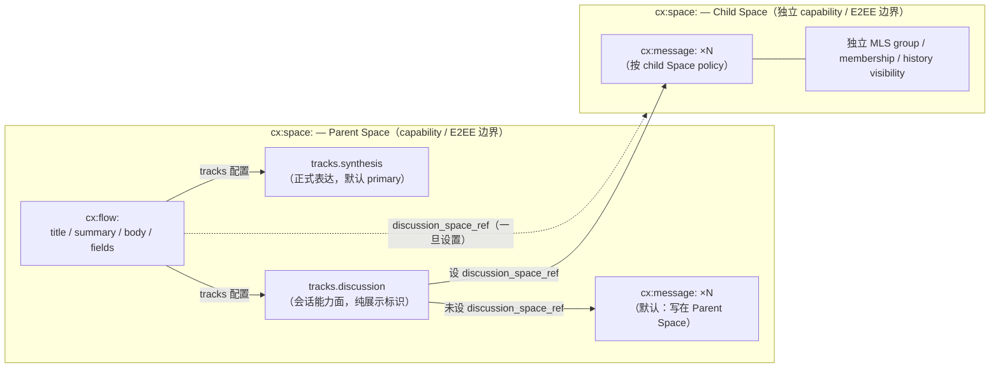

## 1. 目标

本文定义 Contrix 协作图中两个最常用的对象：

- **Flow**（`cx:flow:`）：Space 内统一的协作主对象，承载"这件事本身"。
- **Message**（`cx:message:`）：Flow `discussion` track 时间线中的原子消息。

Flow 通过 `tracks` map 表达多种能力面，并可选通过 `discussion_space_ref` 把讨论升级到独立 child Space。Track 模型、access 规则、conflict 收敛、ephemeral 信号都在本文一处讲完。

公共字段、lifecycle、reducer 总则见 [`common-fields.md`](./common-fields.md)。

## 2. Flow 概览

Flow 是 Space 内被讨论、推进、引用、审阅、执行或沉淀的统一协作对象。它直接承载"这件事本身"、一组参与者和围绕它的上下文信息。

Flow 适合：

- 产品/工程 initiative
- 决策或提案
- 事故、客户 case、研究主题
- 跨多个团队的任务簇
- 需要长期沉淀的知识主题
- 外部资产或业务对象的协作锚点
- 会话主导的协作线程

Flow 不再定义额外的顶层模式或分类字段；默认入口由 track primary 解析规则决定，业务语义由 Space schema、profile、`fields`、Relation 或 Morph 扩展表达。业务语义分类不属于 Flow 顶层字段。实现 SHOULD 通过 Space schema/profile、`fields`、Relation、labels 或 Morph profile 表达业务类型，并通过 View 定义选择 renderer。

## 3. Flow Schema 与字段

Schema id: `cx.schema.flow.v1`

| 字段 | 必填 | 类型 | 约束 | 说明 |
| --- | --- | --- | --- | --- |
| `id` | yes | `id:flow` | 以 `cx:flow:` 开头。 | Flow ID。 |
| `space_id` | yes | `id:space` |  | 所属 Space。 |
| `title` | yes | `string` | 1..512 chars。 | 标题。 |
| `summary` | no | `string` | SHOULD <= 2048 chars。 | 一句话/一段话简介。 |
| `body` | no | `ContentBlock` | 见 [`content-types.md`](./content-types.md)。 | 富文本正文。 |
| `encrypted_payload` | conditional | `EncryptedPayload` | 与 `body` 二选一；见 `encrypted-envelope.schema.json`。 | E2EE 场景下包裹 Flow synthesis 正文或附件内容。 |
| `tracks` | yes | `map<TrackName, FlowTrack>` | 至少 1 个 key；key 唯一性由 map 结构保证；至多 1 个 entry `is_primary=true`。 | 轨道定义、默认入口与轨道访问继承。 |
| `discussion_space_ref` | no | `id:space` | 必须是同 organization / federation 范围内的 Space。 | 该 Flow 的 discussion 时间线、成员、E2EE group 由该 child Space 承载。详见 §5。 |
| `fields` | no | `object` |  | 扩展字段。 |
| `state` | no | `enum(active, archived, deleted, redacted)` | 删除/撤回必须有事件来源。Reducer 按 [common-fields.md §5.1](./common-fields.md) 校验源状态：`cx.flow.archive` MUST 来自 `active`（否则 `flow_not_active`）；`cx.flow.restore` MUST 来自 `archived`（否则 `flow_not_archived`）；`cx.redaction` 指向 Flow 时 MUST 来自 `{active, archived}`（否则 `flow_already_terminal`）。same-state self-transition MUST fail。 | 物化状态。 |
| `state_changed_at` | conditional | `timestamp` | `state != active` 时必填。 | 最近一次 state 转换时间。 |
| `created_by` | yes | `did` |  | 创建者。 |
| `created_at` | yes | `timestamp` |  | 创建时间。 |
| `updated_by` | no | `did` |  | 最近更新者。 |
| `updated_at` | no | `timestamp` |  | 更新时间。 |

### 3.1 最小示例

```json
{
  "id": "cx:flow:019640f9-8000-7000-8000-000000000000",
  "schema": "cx.schema.flow.v1",
  "space_id": "cx:space:0196419b-0000-7000-8000-000000000000",
  "title": "支付重构",
  "summary": "统一支付链路、风控回调和退款状态机；同步 owner、决策与 blocker。",
  "body": {
    "kind": "cx.content.text",
    "body": "Please finish the final review.",
    "format": "markdown",
    "formatted_body": "Please finish the final review."
  },
  "fields": {
    "status": "review",
    "priority": "high",
    "due_at": "2026-05-01T00:00:00Z"
  },
  "tracks": {
    "synthesis": { "is_primary": true },
    "discussion": { "profile": "review" }
  },
  "discussion_space_ref": "cx:space:019640dc-8000-7000-8000-000000000000",
  "state": "active",
  "created_by": "did:web:alice.example",
  "created_at": "2026-04-26T00:00:00Z"
}
```

## 4. Tracks 模型

`tracks` 是 active track 定义 map：

- key 是 track 稳定名（`TrackName = ^[a-z][a-z0-9_]{0,63}$`）；
- value 是该 track 的配置对象；
- `is_primary=true` 是可选显式 primary 标记。

标准 track name 为 `synthesis` 与 `discussion`，profile MAY 声明更多 track name。

### 4.1 `FlowTrack` 字段

track 名是 `tracks` map 的 key，不重复在 value 中。

| 字段 | 必填 | 类型 | 约束 | 说明 |
| --- | --- | --- | --- | --- |
| `is_primary` | no | `boolean` | 同一 Flow 至多一个 track 为 true；省略或 false 均表示无显式 primary。 | 是否为显式默认入口。 |
| `profile` | no | `string` | 由 Space schema/profile 定义；标准 discussion profile 可用 `discussion`、`announcement`、`support`、`activity`、`review`、`external`。 | track 交互 profile（pure UI hint）。 |
| `template` | no | `string` | track profile 可声明结构模板。 | 模板引用。 |
| `fields` | no | `object` |  | track-local 扩展字段（pure UI hint，不影响访问）。 |

### 4.2 `synthesis` track

`synthesis` track 承载 Flow 的整理后正式表达。它不是"摘要专栏"，而是 Flow 当前可被编辑、被引用、被推进的主数据面。

适合放入：

- `title`
- `summary`
- `body`
- `fields`
- 状态推进字段
- 结构化业务字段

`body` SHOULD 使用 `content-types.md` 定义的 Content Block；结构化状态和业务字段继续放在 `fields`，不要把可归约状态只藏在富文本正文中。

### 4.3 `discussion` track

`discussion` track 承载会话能力，而不是独立对象。它包含：

- Message timeline
- timeline / notification profile
- 讨论相关 track-local UI hint fields

`profile` 初版建议支持：

- `discussion`
- `announcement`
- `support`
- `activity`
- `review`
- `external`

规则：

- `profile` 是 discussion track 的 UI / 语义 hint，不是自动授权后门。
- `announcement`、`review` 等 posting 约束 MUST 通过 capability / policy 表达，不得只靠 `profile` 字符串隐式生效。
- `activity` SHOULD 允许系统/agent 产生状态播报，但 reducer 仍按普通 Message timeline 处理。
- `discussion` track membership 不从 `assigned_to`、`watches` 或其他 Flow relation 隐式派生；若实现需要此类映射，必须在父 Space（或 `discussion_space_ref` Space）的 capability / policy 中可审计地声明。`watches` 是个人通知订阅偏好（§8），不是访问 / membership 控制。
- 当 `discussion` track 不存在或不处于 active 状态时，`cx.message.create`、`cx.message.revise`、`cx.message.redact` MUST 被拒绝，错误语义 SHOULD 为 `discussion_track_disabled` 或等价 fail-closed 结果。

### 4.4 Track 是纯展示标识，不是 access 域

**Track 是纯展示 / 时间线分段标识，不携带独立的 membership / 权限 / history visibility / E2EE**。Track 的访问语义完全继承自所属 Space（或 `discussion_space_ref` 指向的 child Space，见 §5）。

早期 v1 草案曾允许 track 配置内嵌 `access` 子对象表达 `track_scoped` 的 hybrid 模型，该机制已被移除——任何需要独立访问域的 discussion 必须升级为 child Space。

`assigned_to`、`watches` 或其他业务关系不会自动成为 discussion 成员或获取访问权，除非 Space policy 明确把它们映射为授权条件。`watches` Relation 表达**通知订阅偏好**，与访问控制完全正交——完整语义、状态枚举、投影脱敏规则见 §8。

### 4.5 Primary track 解析规则

若没有显式 `is_primary=true`，Reducer MUST 按确定性规则派生 primary：

1. 若恰好一个 track entry 设置 `is_primary=true`，对应 key 是 primary。
2. 若没有显式 primary 且 `tracks` 中存在 key `synthesis`，`synthesis` 是 primary。
3. 若没有显式 primary 且 map 只有一个 key，该唯一 key 是 primary。
4. 若没有显式 primary，且 profile 声明了可验证默认 track 且该 key 存在于 `tracks`，使用该默认 track。
5. 仍无法唯一确定时，Reducer MUST fail closed，要求写入 `cx.flow.track.set_primary` 或等价修复事件。

`is_primary=false` 与省略 `is_primary` 等价；它不是阻止默认派生的 veto。

resolved primary 只影响默认打开哪个协作面，不改变 `flow_id`，不授予读取、写入或管理权限。

### 4.6 Track 转换

`cx.flow.track.set_primary` 在同一个 Flow 内把目标 `track` 标记为唯一 primary；目标 track 在该事件生效前 MUST 已启用，或与同一批次中的 `cx.flow.track.enable` 一起生效。

规则：

- 转换不改变 `flow_id`。
- 转换不复制或迁移消息历史。
- 切换到 `track="discussion"` 时，若 `discussion` track 尚不存在，必须先写入 `cx.flow.track.enable`；单独的 `set_primary` MUST fail closed / reject，不得隐式创建 track。
- 切换到其他 track 时，不得自动删除 `discussion` track 或既有消息；若需要关闭讨论，必须显式使用 `cx.flow.track.disable` 或 profile 声明的 archive 语义。
- 转换不自动移除 Board Place/List Place 中的 `contains` Relation；是否保留位置由独立的 workflow policy 或后续 `cx.flow.move` 决定。
- `cx.flow.track.set_primary` / `cx.flow.track.enable` 只改变默认入口或 track 启用状态，不得隐式创建或迁移 child Space；child Space 的生命周期由独立 `cx.space.*` event 管理。

### 4.7 Track 启用 / 禁用

- track 在 map 中存在即表示 active。
- 禁用 track 应通过 `cx.flow.track.disable` 从 `tracks` map 中移除该 key 或标记为 profile 声明的 archived state，不得留下可写入的 disabled track。
- View 的 renderer 选择 SHOULD 基于 View 定义、对象类型、Space schema/profile、track config 和可见字段；不得要求 Flow 额外声明模式字段。

### 4.8 统一 event `cx.flow.tracks.update`(P-D12 O1.2 canonical)

为减少 track 写入路径的 event kind 数量,v1.x 引入统一 event **`cx.flow.tracks.update`**(注意名称用复数 `tracks`),通过 `cx.patch.v1` 表达对 `Flow.tracks` map 的任意原子修改。原有 4 个单用途 event kind(`cx.flow.track.{enable,disable,update,set_primary}`)仍 active,v1.x reducer MUST 同时接受两种形态;新客户端 SHOULD 优先使用统一 event。

**典型 patch 示例**:

```json
{
  "kind": "cx.flow.tracks.update",
  "payload": {
    "flow_id": "cx:flow:...",
    "patch": {
      "tracks.discussion.enabled":   { "$op": "set", "value": true },
      "tracks.discussion.profile":   { "$op": "set", "value": "review" },
      "tracks.synthesis.is_primary": { "$op": "set", "value": false },
      "tracks.discussion.is_primary": { "$op": "set", "value": true }
    }
  }
}
```

上述单个 event 等价于先 `cx.flow.track.enable(discussion)` + `cx.flow.track.update(discussion, profile=review)` + `cx.flow.track.set_primary(discussion)` 三个 legacy event,但作为**原子 Move** 在同一 cell precondition / effect 中完成,避免中间态被其它 actor 抢写。

**Capability**:`cx.flow.tracks.manage` 一个 action 覆盖统一 event + 4 个 legacy event(`target_event_kinds` 列出 5 个)。客户端可以选择申请细粒度 legacy action(`cx.flow.track.enable` 等)或粗粒度统一 `cx.flow.tracks.manage`;reducer 按命中的 action 判定。

**Reducer 规则**:同 §4.6 §4.7 — 切到 `discussion` 前 `discussion` track MUST 已 enabled(可在同一 patch 中通过 `tracks.discussion.enabled: set true` + `tracks.discussion.is_primary: set true` 原子完成);primary track 不能空缺(切走旧 primary 后必须有一个新 primary);track key 必须匹配 `^[a-z][a-z0-9_]{0,63}$`。

**迁移期建议**:server-side reducer 接受两种形态;client SDK 把 4 个 legacy 调用 normalize 为 1 个统一 event 是 SDK-internal 优化,不影响 wire 兼容。v2 MAY 移除 legacy event kind,但 v1.x 不强制。

## 5. Discussion 独立 Space (`discussion_space_ref`)

需要让 discussion 拥有独立 membership、history visibility 或 MLS group 时，**不再**通过 track hybrid 表达，而是创建一个 child Space 并通过 `Flow.discussion_space_ref` 引用：

| 字段 | 必填 | 类型 | 约束 | 说明 |
| --- | --- | --- | --- | --- |
| `discussion_space_ref` | no | `id:space` | 必须是同 organization / federation 范围内的 Space。 | 该 Flow 的 discussion 时间线、成员、E2EE group 由该子 Space 承载。 |

```json
{
  "tracks": {
    "synthesis": { "is_primary": true },
    "discussion": { "profile": "review" }
  },
  "discussion_space_ref": "cx:space:019640dc-8000-7000-8000-000000000000"
}
```

规则：

- 未设置 `discussion_space_ref` 时，discussion 时间线事件直接写在 Flow 所属 Space，访问规则完全等于父 Space。能看父 Space 的 actor 即可看 discussion 时间线（按父 Space history visibility）。
- 设置 `discussion_space_ref` 时，所有 discussion-side `cx.message.*` / `cx.reaction.*` / track membership 写入 MUST 使用该 child Space 的 `space_id`；child Space 是独立的安全边界，按其自身 policy 收敛。能否看 discussion 由 child Space 自身 access policy 决定，与父 Space 的 Flow synthesis 可见性无关。Flow synthesis 和 discussion 是两个独立 reducer 视图，不共享 cell。
- 能看 `discussion` 不表示能改 Flow 的字段、状态或 Board 位置（这些仍按父 Space capability 判断）。
- 同一 Flow MUST NOT 同时存在 track hybrid（不存在）+ child Space 引用——hybrid 已废弃，只有 child Space 一种方式。
- `discussion_space_ref` 启用 MLS 时，对应 MLS group 绑定该 child Space；E2EE 边界、membership frontier、`covered_frontier_cell` 都按 child Space 自身收敛。
- `discussion_space_ref` 的生命周期由独立 `cx.space.*` event 管理；Flow 不能通过修改自身字段间接 reinit / archive child Space。
- Flow 的 parent Space 与 `discussion_space_ref` Space 之间的关系建议用 `cx.space.parent` / `cx.space.child` 或独立的 governance 关系表达；reducer 不强制 hierarchy，授权仍按各自 Space policy 独立判断。
- 切换 primary track 不会自动删除已有讨论历史。

### 5.1 Track / discussion_space_ref 关系图

下图把 Flow 的 track 模型和 child Space 升级路径画在一起。Flow 只有一份 identity，`tracks` map 的 key 决定可用协作面，是否设置 `discussion_space_ref` 决定 discussion 的访问域落在哪个 Space。



读图要点：

- Track 是纯展示 / 时间线分段标识，不携带独立 access；`synthesis` 与 `discussion` 都继承 Parent Space 的 capability。
- `cx.flow.track.set_primary` 只切换默认入口，不复制对象、不迁移历史；切到 `discussion` 必须先 enable 该 track。
- 想给 discussion 独立 membership / E2EE / history 时，**必须**升级为 child Space 并通过 `discussion_space_ref` 引用——hybrid 模式（早期草案的 track 内嵌 access）已废弃。
- 能看 discussion 不等于能改 Flow synthesis 字段或 Board 位置；后者仍按 Parent Space capability 判断。

## 6. Flow 行为规则

- Flow identity 只保存一份，resolved primary track 只决定默认视角，不创建新的对象副本。
- `tracks` 是 map，key 唯一性由结构保证；至多一个 active track MAY 设置 `is_primary=true`。
- 多个显式 primary MUST 被 reducer 拒绝。
- `synthesis` track 与 `discussion` track 共享同一标题和基础字段；track 不存在独立 access 域。
- `synthesis` track 字段级限制使用 capability constraints；不为 `synthesis` 单独创建成员表或 access 域。
- `is_primary` 只是默认入口标记，不授予读取、写入或管理权限。

## 7. Flow 常见关系

- `List Place --contains--> flow`
- `flow --assigned_to--> actor`
- `actor --watches--> flow`
- `flow --depends_on--> flow`
- `flow --blocks--> flow`
- `flow --references--> flow / morph / message / blob`
- `flow --derived_from--> flow / morph`
- `flow --summarized_from--> message`
- `flow --promoted_from_discussion--> message`

`assigned_to` 与 `contains` 的基数和跨 Space 规则见 [relation.md](./relation.md) §3-§4。

## 8. Watch 与通知订阅

### 8.1 概念与边界

Watch 是个人通知订阅模型：actor 声明自己对某个 Flow（或 profile 声明的其他 watchable 对象，例如带 timeline 的 Morph）的**通知偏好**。它**只影响通知派发**，**不影响访问控制**——访问权仍由所属 Space 的 capability 决定，与本节完全正交（参见 §4.4）。

Wire 形态：`cx.flow.watch.set` durable event 写入下文 §8.3 描述的 cas-register cell（cell 是 truth source）。读侧暴露一个**派生** `watches` Relation（`actor --watches--> flow`，见 [relation.md §3](./relation.md)）供查询，但 **`cx.relation.create relation_kind=watches` 直接写入派生 Relation MUST schema_violation**——与 [`./space-and-place.md` §4.6](./space-and-place.md) Flow position 派生 `contains` Relation 的双源约束同模式。

在 Flow 顶层或 `fields` 中携带 `participants` / `watchers` 列表等价物 MUST 被 reducer 拒绝（`schema_violation`），避免与 watch cell 双源并存。

### 8.2 Watch 级别枚举

`cx.flow.watch.set` payload 的 `level` 字段（v1 reducer-enforced 枚举）。这里用 `level`（不复用 Relation 顶层 `state` 的 active / tombstone 命名，避免歧义）：

| `level` | 含义 | 通知行为 |
| --- | --- | --- |
| `mentions_only` | 默认（≡ 无 watch 记录） | 仅当 push rule 引擎 `mentions_actor` condition 为本人命中（mention 通过 content AST 解析 / `mentions` Relation / E2EE mention sidecar 派生，见 [push-notifications.md §4.3 / §4.5](../discovery/push-notifications.md)），或本人在 `assigned_to` Relation `to_ref` 上时通知 |
| `participating` | 在我参与过的 thread 之上叠加订阅 | 上面那些 + 本人发过 Message 后该 thread 的新回复 + 与本人 `replies_to` 链相连的更新 |
| `all` | 全量订阅 | 该 Flow 任何 `cx.message.create` / `cx.reaction.add` / `cx.reaction.remove` / Flow synthesis 字段变更 |
| `muted` | 显式静音 | 一律不通知，**覆盖** `mentions_only` 的定向通知；显式声明"即使被 @ 也不要打扰" |

未声明 `level` 或 cell value 为 `null` 时等价于 `mentions_only`。

### 8.3 Cell basis 与写入事件

`watches` 由 cas-register cell 维护：

```text
event_kind  := cx.flow.watch.set
cell_family := cx.component.flow.watch.v1
cell_id     := cx:cell:cx.component.flow.watch.v1:<flow_id>:<actor_did>
lattice     := cas-register
bottom      := reject
value shape := { "level": "mentions_only" | "participating" | "all" | "muted",
                 "level_public": boolean? }
              | null
```

`cx.flow.watch.set` payload（详见 [`artifacts/schemas/event-schema.json`](../../artifacts/schemas/event-schema.json) 的 `flow_watch_set_payload`）：

| 字段 | 必填 | 类型 | 说明 |
| --- | --- | --- | --- |
| `flow_id` | yes | `id:flow` | 被订阅的 Flow（cell key 之一）。 |
| `actor_did` | yes | `did` | 订阅者 DID（cell key 之一）。默认 MUST 等于 envelope `actor_id`，admin 写他人需要 `cx.flow.watch.manage_others`（见 §8.4）。 |
| `level` | **yes** | `enum / null` | 期望写入的级别；`null` 等价于"清空 cell"（= `mentions_only` 默认行为）。`level=null` 时 `level_public` MUST 省略。 |
| `level_public` | conditional | `boolean` | Opt-in publication；默认 `false`。仅在 `level` 为非 null 字符串值时允许出现；详见 §8.5。 |
| `expected_value` | no | `null \| { level, level_public? }` | 编译为 cell `head_eq` precondition（**whole-value compare**）；省略时按 last-write-wins 处理。 |

约束：

- `null` value 等价于 `mentions_only`。客户端必须显式 `level: null` 来清空，不允许通过省略 `level` 字段隐式清空——避免 wire 上的歧义。
- 同一 `(flow_id, actor_did)` cell 内的并发写入按标准 cas-register 收敛。`expected_value` 编译为 [event-auth-state-resolution.md §4.2.4](../authz/event-auth-state-resolution.md) 描述的 `head_eq` precondition，**比较整个 cell value**（不是单字段）。例如 cell 当前是 `{level:"all", level_public:true}` 时，希望 CAS 升级到 `all` + 公开 → 必须写 `expected_value: {level:"all", level_public: true}`；只写 `expected_value: {level:"all"}` 不匹配。希望放弃 CAS 校验时直接省略 `expected_value`。
- **Cell 是 truth source，`watches` Relation 是派生投影**。客户端 MUST NOT 通过 `cx.relation.create / update / delete relation_kind=watches` 直接编辑该 Relation；reducer 收到对该派生 Relation 的直接写入 MUST `schema_violation`（与 [`./space-and-place.md` §4.6](./space-and-place.md) 派生 `contains` Relation 的双源约束同模式）。
- Cell 的 Space 归属：`<flow_id>` 隐含决定 Space（Flow.space_id），cell 始终落在 Flow 所属 Space 的 namespace 下。即使 Flow 设置了 `discussion_space_ref`，watch cell 也仍在 parent Space —— discussion 消息通知派发由 Sync Service 跨 Space 查询该 cell 完成（详见 §8.9）。

### 8.4 写入授权

- 默认：`cx.flow.watch.set` MUST 满足 `payload.actor_did == envelope.actor_id`。reducer 在写入前校验，不满足 `failed_precondition`（`reason="watch_must_be_self"`）。普通成员写入自己的 watch state 需要持有 `cx.flow.watch.set` capability（low risk_tier，admin 默认 bundle 给所有成员）。
- 帮他人订阅：actor 持有 `cx.flow.watch.manage_others` capability（medium risk_tier）时 MAY 写入 `payload.actor_did != envelope.actor_id` 的 watch cell，典型用法是 Flow creator 在创建对话时把核心相关人加为 `participating`。被加为 watcher 的 actor MAY 随时通过自写 cell 覆盖（升级 / 降级 / `muted`），无需对方同意。
- 创建者隐式订阅：reducer 在 `cx.flow.create` 写入时 MAY 同时为 `created_by` actor 写一条 `level=participating` 的 watch cell（profile 决定是否启用，默认启用）。该写入不消耗 `cx.flow.watch.manage_others`，但仍记入 cell 历史。

### 8.5 投影脱敏（normative）

Watch 级别暴露程度按下表派发。projection executor MUST 在响应包含 watch 的 view（例如"Flow watchers 列表"、"我的订阅 Flow"）时严格执行：

| Cell value | 自己（`requester == cell.actor_did`） | Space 其他成员 | `cx.space.notification.audit` 持有方 | Sync Service / 通知 dispatcher |
| --- | --- | --- | --- | --- |
| 无记录 / `level=mentions_only` | "未订阅" | **不出现**在 watcher 列表 | 完整可见 | 走 `mentions_only` 路径 |
| `level=participating` | 完整 `{actor, level}` | 仅 `{actor}`（**脱去 level**） | 完整可见 | 完整 level |
| `level=all` | 完整 `{actor, level}` | 仅 `{actor}`（**脱去 level**） | 完整可见 | 完整 level |
| `level=muted` | "已静音" | **不出现**在 watcher 列表（投影上与"无记录"不可区分） | 完整可见 | 一律不推送 |

`cx.space.notification.audit` 是纯 READ capability（target_event_kinds 为空），授予"读取完整 watch 状态（含 `muted`）"的权限。审计写入闭环要求读取方**同时**持有 `cx.audit.accessed` capability，并在每次 audit 读取前 / 同事务内提交一条 `kind="cx.audit.accessed"` durable event（payload 包含读取者 DID、目标 actor DID、被读取的 cell id），与 [`../crypto-media/audited-e2ee.md` §4](../crypto-media/audited-e2ee.md) "先写后解密"模型同构。

- 仅持有 `cx.space.notification.audit` 而无 `cx.audit.accessed` 的 actor MUST 被 reducer / projection executor 拒绝（`failed_precondition`，`reason="audit_capability_incomplete"`）。
- 默认 admin 角色 bundle SHOULD 同时包含两者；profile SHOULD 把它们作为不可拆分的 bundle 授予。
- 被读取的当事人通过 `cx.audit.accessed` event 链获得事后审计权；缺失对应 audit event 的 watch 读取 MUST 在投影 / sync 层 fail closed。

**Opt-in 暴露**：actor 在自写 watch cell 时 MAY 设置 `level_public = true`。该 flag 为 true 时，projection 在向 Space 其他成员投影该 actor 的 watch 时**不脱级别**（即区分 `participating` vs `all`）。`muted` **永远**不投影给非自己 / 非 audit 持有方，即使 `level_public=true`（防止社交核弹）。默认 `level_public = false`。

> 暂未规范"全局隐身（hide_watching）"开关——actor 想完全隐身的简单做法是不写显式 watch cell（行为退化为 `mentions_only`，投影上不出现）。如未来需要 opt-out 让别人看不到 `participating` / `all` 状态，将通过独立 actor profile 字段扩展，本版本不预留 wire 位。

### 8.6 Agent / Bot watcher

`actor_kind = agent` 的 actor（见 [actor.md §2](./actor.md)），其 watch 级别**完整公开**（包括 level），不应用 §8.5 的脱敏规则。理由：agent 的关注度是协作功能信号（"yougen-bot 在监听状态变更"），不是个人隐私。projection 通过 actor 的 `actor_kind` 直接派生该例外，不需要单独 opt-in。

`muted` 级别对 agent 同样适用（agent 持有方可能希望临时停用某个 Flow 上的 agent 行为），但投影上仍按 §8.5 规则——`muted` agent 在 watcher 列表中消失，等价于"该 agent 未订阅"。

### 8.7 隐含订阅

下列业务关系对**通知派发**等价于 `level=participating`，但**不**写入 watch cell，也**不**出现在显式 watcher 列表：

- `flow --assigned_to--> self`（active edge）
- 我在该 Flow `discussion` track 中发过至少一条 active Message

Sync Service 在计算"是否应该通知 X"时 MUST 取以下集合的并集：
1. X 的 active watch cell `level ∈ {participating, all}`
2. X 的隐含订阅来源（assigned_to / 自己发过消息）

并应用 X 的 `muted` 覆盖：若 X 显式 `level=muted`，则**所有**隐含订阅与定向 mention 一律抑制。

显式 `watches` cell 优先于隐含订阅；用户可通过显式写 `muted` 屏蔽被 assigned 后的通知。

### 8.8 与 push-notification rule 引擎的关系

Watch 级别参与 [`../discovery/push-notifications.md`](../discovery/push-notifications.md) §4 push rule 引擎评估，但 `level=muted` 必须收敛到 `dont_notify`。Sync Service MUST 通过以下三种等价实现之一保证该收敛：

- (a) 在引擎评估**之前**短路：直接 `dont_notify`，跳过 rule chain；
- (b) 在引擎最高优先级位置注入**系统内置 deny rule**（与用户规则同形但 actor 不可写）；
- (c) 接受用户显式 `override` rule with `condition=watch_state=muted` —— 仍由引擎匹配到。

三者在 wire 上不可区分（最终 dispatcher decision 一致）。实现 SHOULD 在 dispatch decision log 中标记 `muted_short_circuit=true` 便于审计调试，但**不要求**对外暴露具体实现路径。

更一般地：

- **Watch level = "通知是否发生"**：Sync Service 在派发前 MUST 解析 receiver 的 effective level（含 §8.7 隐含订阅、`muted` 覆盖）；effective level 为 `mentions_only` 且当前 Event 非定向事件时，直接 `dont_notify`。
- **Push rule = "通知如何投递"**：在 watch level 允许通知发生的前提下，push rule 决定提示音、是否高亮、DND 例外等。
- Push rule 引擎 MAY 通过 `watch_state` condition 显式引用本节级别（详见 [push-notifications.md §4.3](../discovery/push-notifications.md)），常见用途是用户显式声明"watching=all 也只想要静默通知"等更细粒度策略。

### 8.9 `discussion_space_ref` 场景

当 Flow 设置了 `discussion_space_ref`（§5），watch 行为分两层：

- Flow synthesis 字段变更通知：watch cell 在父 Space namespace 下，按本节规则收敛。
- Discussion 消息通知：消息 Event 写在 child Space。Sync Service 在派发时 MUST 用 actor 在 child Space 的 capability 重新校验**可见性**（actor 不是 child Space 成员则无论 watch level 如何都不发通知），然后再应用 actor 在父 Space 的 watch level 决定通知级别。

换言之：访问权先于订阅意愿。无访问权 = 没有通知，无论 watch 设了什么。

## 9. Message

### 9.1 概览

Message 是 Flow `discussion` track 时间线中的原子消息对象。

Message 创建是 append-only。编辑通过 revision chain；撤回通过 redaction/tombstone。

未加密消息的 `content` MUST 是 `content-types.md` 定义的 Content Block。E2EE 消息使用 `payload.encrypted_payload` 承载同一 Content Block 的 canonical encrypted envelope；`flow_id`、`message_id`、`reply_to` 等字段只表达归属、目标或关系。

Message MAY reply to another Message, mention Actor or object, reference Flow / Morph / Space, or be redacted.

### 9.2 Schema 与字段

Schema id: `cx.schema.message.v1`

| 字段 | 必填 | 类型 | 约束 | 说明 |
| --- | --- | --- | --- | --- |
| `id` | yes | `id:message` | 以 `cx:message:` 开头。 | Message ID。 |
| `space_id` | yes | `id:space` |  | 所属 Space。 |
| `flow_id` | yes | `id:flow` |  | 所属 Flow。 |
| `track` | yes | `string` | 必须匹配 `^[a-z][a-z0-9_]{0,63}$`，并且必须是目标 Flow 当前 active 的 track name。v1 reducer 默认只识别 `discussion`；profile 可声明额外 track name 承载 Message timeline，但 v1 wire 互操作 SHOULD 使用 `discussion`。 | 所属 Flow 轨道。 |
| `content` | conditional | `object` | 富文本/blocks 见 `content-types.md`；`state=active` 且未加密时必填。 | 消息正文。 |
| `encrypted_payload` | conditional | `EncryptedPayload` | 与 `content` 二选一；见 `encrypted-envelope.schema.json`。 | E2EE 场景下包裹消息正文与附件内容。 |
| `state` | yes | `enum(active, redacted, deleted)` | 默认 `active`。`redacted` 由 `cx.message.redact` reducer 设置（content 被替换为 redaction tombstone 但消息槽保留）；`deleted` 表示消息整体被治理或 retention 清除（content / encrypted_payload MUST 被清空，仅保留 envelope 元数据用于审计）。**与 Flow.state / Place.state 在顶层 schema 上对齐**，不再用 `fields.visible_state` 表达可见性。 | 消息生命周期状态。 |
| `state_changed_at` | conditional | `timestamp` | `state != active` 时必填。 | 最近一次 state 转换时间。 |
| `revision_root` | no | `id:message` | 第一条 revision MUST 等于 `id`；后续 revision 引用 chain 起点。同一 `revision_root` 下的 revision 形成有序 chain，由 `cx.message.revise` reducer 维护。 | revision chain 起点（顶层 schema-validated）。 |
| `edited_at` | no | `timestamp` | revision chain 中 latest revise event 的 `created_at`；首次 create 后未编辑时缺省。MUST 不早于 `created_at`。 | 最近一次编辑时间。 |
| `redaction_ref` | conditional | `id:event` | `state=redacted` 时必填，指向触发 redaction 的 `cx.message.redact` event；其他 state MUST 缺省。 | redaction event 引用。 |
| `attachments` | no | `array` | 按 profile 声明，通常通过 Relation `attached_to` 表达。 | 附件 hint。 |
| `fields` | no | `object` | 客户端 metadata、reaction summary 等扩展字段；不再承载 revision / visibility 状态。 | 扩展字段。 |
| `created_by` | yes | `did` |  | 发送者。 |
| `created_at` | yes | `timestamp` |  | 创建时间。 |

> **schema 迁移说明**：早期草案把 `revision_root` / `visible_state` 藏在 `fields` 黑盒中，缺乏 schema 验证、易被实现各自命名。v1 把这些字段提升到顶层；同时用 `state` 顶层枚举替代 `fields.visible_state`、用 `redacted: true` 单一 boolean。`fields.revision_root` / `fields.visible_state` / `fields.redacted` 在 v1 wire 上 MUST 被拒绝（`schema_violation`），不接受双源并存。

### 9.3 最小示例

```json
{
  "id": "cx:message:0196414c-8000-7000-8000-000000000000",
  "schema": "cx.schema.message.v1",
  "space_id": "cx:space:0196419b-0000-7000-8000-000000000000",
  "flow_id": "cx:flow:019640f9-8000-7000-8000-000000000000",
  "track": "discussion",
  "created_by": "did:web:alice.example",
  "content": {
    "kind": "cx.content.text",
    "body": "@bob 请确认这个 item 的 legal 风险。",
    "format": "markdown",
    "formatted_body": "<mention did=\"did:web:bob.example\">@bob</mention> 请确认这个 item 的 legal 风险。"
  },
  "state": "active",
  "revision_root": "cx:message:0196414c-8000-7000-8000-000000000000",
  "created_at": "2026-04-26T00:00:00Z"
}
```

### 9.4 Chat 模式示例

讨论型 Space 的最小实施序列：创建 Flow（`discussion` 默认 primary）→
（如需要独立访问域）创建 child Space 并设置 `Flow.discussion_space_ref` →
加入成员 → 发消息 → 编辑 / 撤回 / reaction。

```json
[
  {
    "kind": "cx.flow.create",
    "payload": {
      "object": {
        "id": "cx:flow:019640f9-8000-7000-8000-000000000000",
        "schema": "cx.schema.flow.v1",
        "space_id": "cx:space:0196419b-0000-7000-8000-000000000000",
        "title": "项目同步",
        "tracks": {
          "discussion": { "is_primary": true }
        },
        "created_by": "did:web:alice.example",
        "created_at": "2026-04-26T00:00:00Z"
      }
    }
  },
  {
    "kind": "cx.flow.track.enable",
    "target_ref": "cx:flow:019640f9-8000-7000-8000-000000000000",
    "payload": {
      "flow_id": "cx:flow:019640f9-8000-7000-8000-000000000000",
      "track": "discussion"
    }
  },
  {
    "kind": "cx.message.create",
    "payload": {
      "flow_id": "cx:flow:019640f9-8000-7000-8000-000000000000",
      "track": "discussion",
      "content": {
        "kind": "cx.content.text",
        "body": "@bob 请确认这个 flow 的 legal 风险。",
        "format": "markdown"
      }
    }
  }
]
```

`@mention` 与 reference：消息正文 SHOULD 使用结构化 AST 或带 DID/object ref 的
Markdown 链接。客户端 reducer 可从 Message content AST 派生 mention 关系和通知，
但派生关系不得扩大权限。跨 Space 引用按 [relation.md](./relation.md) §4 的跨 Space
规则处理：源消息可暴露 ref 与最小 metadata，目标对象内容与 preview 必须重新按
目标 Space policy 授权。

### 9.5 冲突与收敛规则

Message timeline 的同步与 reducer 行为：

| 场景 | 收敛规则 |
| --- | --- |
| Message 创建 | append-only。Timeline 排序 = causal_depth → HLC → actor_id → actor_seq → event_id。 |
| Message 编辑 | 并发 revision 共存于 revision chain；默认视图显示最新可见 revision。 |
| Message 撤回 | 若 revision 与 redaction 并发，默认视图 redaction 优先；审计视图保留完整历史。 |
| 撤回先到、原消息后到 | 接收方 SHOULD 保留 dangling redaction，待原消息到达后再应用。 |
| Reaction | OR-Set 收敛；同一 actor 对同一 emoji 的 add/remove 由因果关系决定最终成员。 |

历史可见性枚举与 canonical 语义见 [`../authz/event-auth-state-resolution.md` §6](../authz/event-auth-state-resolution.md)。

### 9.6 Ephemeral 信号

以下高频交互状态 MUST NOT 作为持久化共享对象写入 Event 链：

- typing
- 当前输入草稿
- 临时在线状态
- 高频 read marker

它们 SHOULD 作为 Sync Service 上的 ephemeral signal，或由各端本地缓存。Read
receipt / read marker 的具体规则见 [`../discovery/read-receipts.md`](../discovery/read-receipts.md)。

### 9.7 Message 常见关系

- `flow(discussion) --contains--> message`
- `message --replies_to--> message`
- `message --mentions--> actor / flow / morph`
- `message --references--> flow / morph / blob`

## 10. 规范性引用

- 公共字段：[common-fields.md](./common-fields.md)。
- Place / Flow 位置语义：[space-and-place.md](./space-and-place.md) §4.6。
- Relation 基数与跨 Space：[relation.md](./relation.md)。
- Content Block：[content-types.md](./content-types.md)。
- Read receipts / read markers：[`../discovery/read-receipts.md`](../discovery/read-receipts.md)。
- 历史可见性 / E2EE：[`../authz/event-auth-state-resolution.md`](../authz/event-auth-state-resolution.md)。
- Flow / Message schema：`artifacts/schemas/flow.schema.json`、`artifacts/schemas/message.schema.json`。
