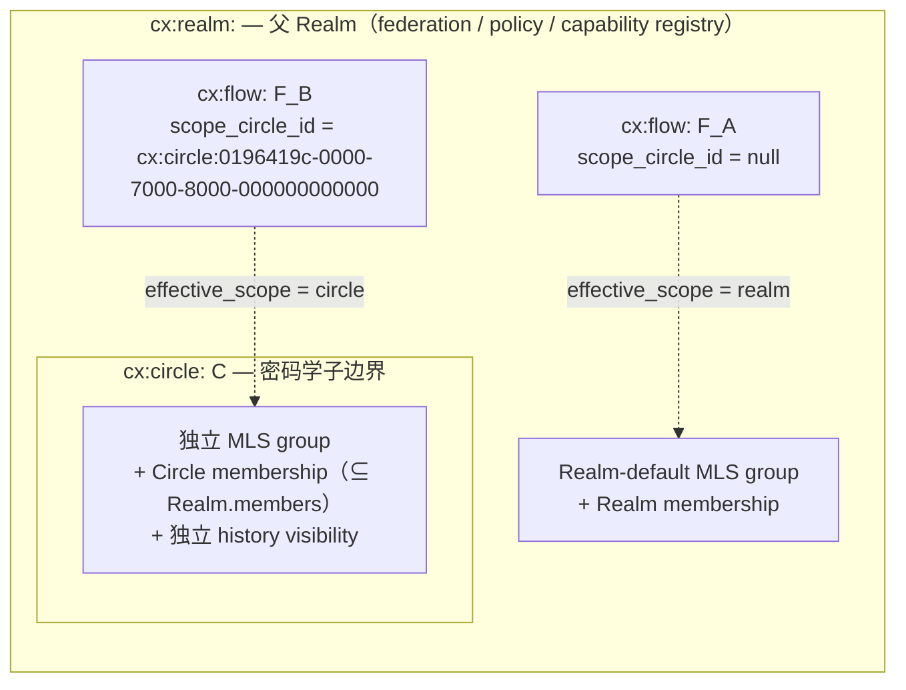

## 0. 规范语言

本文中的规范关键字（**MUST** / **SHOULD** / **MAY** 等）按 [conformance/normative-language.md](../conformance/normative-language.md) 解释；仅大写形式具规范约束力。

## 1. 目标

本文定义 Contrix 协作图中两个最常用的对象：

- **Flow**（`cx:flow:`）：Realm 内统一的协作主对象，承载"这件事本身"。
- **Message**（`cx:message:`）：Flow `discussion` track 时间线中的原子消息。

Flow 通过 `tracks` map 表达多种能力面，并可选通过 `scope_circle_id` 把整个 Flow 落在 Realm 内的某个 [Circle](./circle.md)（独立 MLS 子边界）。Track 模型、access 规则、conflict 收敛、ephemeral 信号都在本文一处讲完。

Flow 永远只有**一个**加密 scope —— 整个 Flow(所有 track)共享同一安全边界。需要"宽 synthesis + 窄 discussion"的场景 MUST 用**两个 Flow + Relation**(`confidential_discussion_of`)表达，详见 [`circle.md` §7.2](./circle.md)。

公共字段、lifecycle、reducer 总则见 [`common-fields.md`](./common-fields.md)。

## 2. Flow 概览

Flow 是 Realm 内被讨论、推进、引用、审阅、执行或沉淀的统一协作对象。它直接承载"这件事本身"、一组参与者和围绕它的上下文信息。

Flow 适合：

- 产品/工程 initiative
- 决策或提案
- 事故、客户 case、研究主题
- 跨多个团队的任务簇
- 需要长期沉淀的知识主题
- 外部资产或业务对象的协作锚点
- 会话主导的协作线程

Flow 不再定义额外的顶层模式或分类字段；默认入口由 track primary 解析规则决定，业务语义由 Realm schema、profile、`fields`、Relation 或 Morph 扩展表达。业务语义分类不属于 Flow 顶层字段。实现 SHOULD 通过 Realm schema/profile、`fields`、Relation、labels 或 Morph profile 表达业务类型，并通过 View 定义选择 renderer。

## 3. Flow Schema 与字段

Schema id: `cx.schema.flow.v1`

| 字段 | 必填 | 类型 | 约束 | 说明 |
| --- | --- | --- | --- | --- |
| `id` | yes | `id:flow` | 以 `cx:flow:` 开头。 | Flow ID。 |
| `realm_id` | yes | `id:realm` |  | 所属 Realm。 |
| `title` | yes | `string` | 1..512 chars。 | 标题。 |
| `summary` | no | `string` | SHOULD <= 2048 chars。 | 一句话/一段话简介。 |
| `content` | no | `ContentBlock` | 见 [`content-types.md`](./content-types.md)。 | 富文本正文。 |
| `encrypted_payload` | conditional | `EncryptedPayload` | 与 `content` 二选一；见 `encrypted-envelope.schema.json`。 | E2EE 场景下包裹 Flow synthesis 正文或附件内容。 |
| `tracks` | yes | `map<TrackName, FlowTrack>` | 至少 1 个 key；key 唯一性由 map 结构保证；至多 1 个 entry `is_primary=true`。 | 轨道定义、默认入口与轨道访问继承。 |
| `scope_circle_id` | no | `id:circle` | 必须是同 Realm 内的 Circle（`Circle.realm_id == Flow.realm_id`）；否则 `schema_violation` `reason=circle_realm_mismatch`。Reducer 把 `null` 物化为 `effective_scope={kind:"realm",...}`，把 Circle 引用物化为 `effective_scope={kind:"circle",...}`。改绑默认拒（`scope_rebind_forbidden`）。 | 整个 Flow 的加密 scope（含所有 track）。未设置时 Flow 落在 Realm-default encryption scope；设置时整个 Flow（含 synthesis、discussion）落在该 Circle 的 MLS group 与 membership 边界内。详见 §5 与 [`circle.md`](./circle.md)。 |
| `fields` | no | `object` |  | 扩展字段。 |
| `state` | no | `enum(active, archived, redacted)` | 终态必须有事件来源。Reducer 按 [common-fields.md §5.1](./common-fields.md) 校验源状态：`cx.flow.archive` MUST 来自 `active`（否则 `flow_not_active`）；`cx.flow.restore` MUST 来自 `archived`（否则 `flow_not_archived`）；`cx.redaction` 指向 Flow 时 MUST 来自 `{active, archived}`（否则 `flow_already_terminal`）。same-state self-transition MUST fail。**Flow 不引入独立 `tombstoned` 终态**；deletion 语义通过指向该 Flow 的 `cx.redaction` 表达，见 [common-fields.md §5.1](./common-fields.md)。 | 物化状态（物理生命周期）。 |
| `state_changed_at` | conditional | `timestamp` | `state != active` 时必填。 | 最近一次 state 转换时间。 |
| `stage` | **yes** | `enum(draft, proposed, planned, in_progress, blocked, done, cancelled, superseded)` | `cx.flow.create` 时 actor 必填（无默认值）。语义与转换规则见 [common-fields.md §5.3](./common-fields.md)。变更只能通过 `cx.flow.stage.set`（详见 §3.2）；`cx.flow.update` 的 patch path `stage` / `stage_changed_at` MUST `schema_violation`。`fields.stage` / `fields.lifecycle` / `fields.progress_state` / `fields.stage_reason` MUST `schema_violation`（forbidden-wire）。**不携带 reason 字段**：需要解释时在 discussion track 发 Message 并 `references` 本次 `cx.flow.stage.set` event。 | 业务进度阶段（与 `state` 正交）。 |
| `stage_changed_at` | conditional | `timestamp` | **Reducer-derived**：每次 `stage` 实际变更时由 reducer 用触发 event 的 `created_at` 覆盖写入；same-value self-transition 不更新本字段。 | 最近一次 stage 转换时间。 |
| `created_by` | yes | `did` |  | 创建者。 |
| `created_at` | yes | `timestamp` |  | 创建时间。 |
| `updated_by` | no | `did` |  | 最近更新者。 |
| `updated_at` | no | `timestamp` |  | 更新时间。 |

### 3.1 最小示例

```json schema=schemas/flow.schema.json
{
  "id": "cx:flow:019640f9-8000-7000-8000-000000000000",
  "schema": "cx.schema.flow.v1",
  "realm_id": "cx:realm:0196419b-0000-7000-8000-000000000000",
  "title": "支付重构",
  "summary": "统一支付链路、风控回调和退款状态机；同步 owner、决策与 blocker。",
  "content": {
    "kind": "cx.content.text",
    "body": "Please finish the final review.",
    "format": "markdown",
    "formatted_body": "Please finish the final review."
  },
  "fields": {
    "status": "review",
    "priority": "high",
    "due_at": "2026-05-01T00:00:00Z"
  },
  "tracks": {
    "synthesis": { "is_primary": true },
    "discussion": { "profile": "review" }
  },
  "scope_circle_id": "cx:circle:019640dc-8000-7000-8000-000000000000",
  "state": "active",
  "stage": "in_progress",
  "created_by": "did:web:alice.example",
  "created_at": "2026-04-26T00:00:00Z"
}
```

### 3.2 Stage（业务进度）

`stage` 是 Flow 必填字段，表达"这件事走到哪了"。它与 `state`（物理生命周期）正交：archive 一个 `stage=in_progress` 的 Flow 不会自动改 stage；`stage=done` 也不会自动 archive。

**枚举值**（与 [common-fields.md §5.3.2](./common-fields.md) 共用，固定 8 值）：

| 值 | bucket | 典型来源 |
| --- | --- | --- |
| `draft` | `todo` | 默认起点，正在 scoping。 |
| `proposed` | `todo` | 待评审 / 决策。 |
| `planned` | `todo` | 已接受，排期中。 |
| `in_progress` | `doing` | 当前推进中。 |
| `blocked` | `doing` | 依赖未解。 |
| `done` | `closed` | 成功完成。 |
| `cancelled` | `closed` | 主动放弃。 |
| `superseded` | `closed` | 被另一个 Flow 取代，SHOULD 写 Relation `superseded_by --> flow:<successor>`。 |

**Wire 写入路径**：唯一 event 是 `cx.flow.stage.set`，payload 形态：

```json
{
  "kind": "cx.flow.stage.set",
  "payload": {
    "flow_id": "cx:flow:...",
    "stage": "blocked",
    "expected_stage": "in_progress"
  }
}
```

- `flow_id`：必填。
- `stage`：必填，必须是上面 8 值之一。
- `expected_stage`：可选，编译为 cell `head_eq` precondition，避免并发覆盖（与 `cx.flow.watch.set` 的 `expected_value` 同模式）。省略时等价无 CAS。

**Payload 不携带 reason / note / explanation 字段**。stage 变更的"为什么"由人类讨论承担：

- actor SHOULD 在该 Flow 的 `discussion` track 发一条 `cx.message.create`，并通过 Relation `references` 指向本次 `cx.flow.stage.set` event。
- 该 Message 受 `discussion` track 的权限、E2EE、redaction、editing 规则约束（与所有其他讨论同级），可以被引用、回应、撤回。
- 审计归属由 `cx.flow.stage.set` event 自身的 `actor_id` / `created_at` 提供——事件日志就是真源，不需要在对象上再开一个 256-char 黑盒字段。

**Capability**：`cx.flow.stage.set`（low risk_tier）—— 允许把推进 Flow 进度的权限授予 reporter / assignee / participant，而不必给完整 `cx.flow.update`（后者可改 title / content / fields）。

**Reducer 硬约束**（来自 [common-fields.md §5.3.3](./common-fields.md)）：

1. `state ∈ {redacted}` → `failed_precondition` `reason=flow_already_terminal`
2. `state = archived` → `failed_precondition` `reason=flow_not_active`
3. `stage_changed_at` reducer-derived，忽略 wire 上 actor-supplied 值
4. same-value self-transition → reducer 接受但不更新 `stage_changed_at`、不产生审计变更
5. `cx.flow.update` patch path 出现 `stage` / `stage_changed_at` → `schema_violation`
6. `flow.fields.stage` / `flow.fields.stage_reason` / `flow.fields.lifecycle` / `flow.fields.progress_state` → `schema_violation`（forbidden-wire reserved-name guard）

**与 workflow profile 的关系**：未启用自定义 workflow 时，actor 直接调用 `cx.flow.stage.set`。启用 workflow profile 时，profile MAY 把 workflow 的 fine-grained state 通过 `stage_category` 映射到此处 8 值，由 reducer 在 workflow event 后派生写入 stage —— stage 始终是 workflow_state 的协议级粗投影，跨 Realm dashboard 可聚合。

**与 `fields.status` 的关系**：`fields.status` 是自由扩展字段（profile 自管），可与 `stage` 共存表达 fine-grained 业务子状态；但 stage 本身**不允许**藏在 `fields` 下。

## 4. Tracks 模型

`tracks` 是 active track 定义 map：

- key 是 track 稳定名（`TrackName = ^[a-z][a-z0-9_]{0,63}$`）；
- value 是该 track 的配置对象；
- `is_primary=true` 是可选显式 primary 标记。

标准 track name 为 `synthesis` 与 `discussion`，profile MAY 声明更多 track name。

### 4.1 `FlowTrack` 字段

track 名是 `tracks` map 的 key，不重复在 value 中。

| 字段 | 必填 | 类型 | 约束 | 说明 |
| --- | --- | --- | --- | --- |
| `enabled` | no | `boolean` | 省略时默认 `true`；patch 写为 `false` 后 reducer MUST 用 `track_disabled` 拒绝该 track 上的新写入。 | track 是否接受新写入；置 `false` 仅冻结新写入，不删除历史；UI MAY 隐藏或只读化已禁用 track；重新置 `true` 恢复写入。 |
| `is_primary` | no | `boolean` | 同一 Flow 至多一个 track 为 true；省略或 false 均表示无显式 primary。 | 是否为显式默认入口。 |
| `profile` | no | `string` | 由 Realm schema/profile 定义；标准 discussion profile 可用 `discussion`、`announcement`、`support`、`activity`、`review`、`external`。 | track 交互 profile（pure UI hint）。 |
| `template` | no | `string` | track profile 可声明结构模板。 | 模板引用。 |
| `fields` | no | `object` |  | track-local 扩展字段（pure UI hint，不影响访问）。 |

### 4.2 `synthesis` track

`synthesis` track 承载 Flow 的整理后正式表达。它不是"摘要专栏"，而是 Flow 当前可被编辑、被引用、被推进的主数据面。

适合放入：

- `title`
- `summary`
- `content`
- `fields`
- 状态推进字段
- 结构化业务字段

`content` SHOULD 使用 `content-types.md` 定义的 Content Block；结构化状态和业务字段继续放在 `fields`，不要把可归约状态只藏在富文本正文中。

`synthesis` 是可选 track：`tracks` map 不要求声明它。「只聊天不归纳」的 Flow（仅 `discussion`）是合法形态，见 §9.4 与 [`overview/current-model.md` §3](../overview/current-model.md)。若 Flow 同时声明了 `synthesis` 与 `discussion` 且未显式标 primary，`synthesis` 按 §4.5 第 2 条派生为 primary。关闭已存在的 `synthesis` track 与关闭任何 track 同形：在 `cx.flow.tracks.update` 同一 patch 中写 `tracks.synthesis.enabled: set false`；若当前 primary 是 `synthesis`，同一 patch 必须把 primary 转给另一个 active track（§4.6 / §4.7 / §4.8）。

### 4.3 `discussion` track

`discussion` track 也是可选 track：`tracks` map 不要求声明它，纯结构化 Flow（仅 `synthesis`，例如归档文档、只读规格条目）合法。与 `synthesis` 不对称的一点：reducer MUST NOT 隐式创建 `discussion` track——切换 primary 到 `discussion` 时，必须在同一 `cx.flow.tracks.update` patch 中显式 `tracks.discussion.enabled: set true`（详见 §4.6 / §4.8）。

`discussion` track 承载会话能力，而不是独立对象。它包含：

- Message timeline
- timeline / notification profile
- 讨论相关 track-local UI hint fields

`profile` 初版建议支持：

- `discussion`
- `announcement`
- `support`
- `activity`
- `review`
- `external`

规则：

- `profile` 是 discussion track 的 UI / 语义 hint，不是自动授权后门。
- `announcement`、`review` 等 posting 约束 MUST 通过 capability / policy 表达，不得只靠 `profile` 字符串隐式生效。
- `activity` SHOULD 允许系统/agent 产生状态播报，但 reducer 仍按普通 Message timeline 处理。
- discussion 可见成员关系不从 `assigned_to`、`watches` 或其他 Flow relation 隐式派生；track 自身不持有 membership，可见成员一律由 Flow 的 effective scope 决定（`scope_circle_id=null` 时为父 Realm 的 membership / capability / policy；`scope_circle_id` 指向 Circle 时为该 [Circle](./circle.md) 的 membership / capability / policy），若实现需要此类映射必须可审计地声明。`watches` 是个人通知订阅偏好（§8），不是访问 / membership 控制。
- 当 `discussion` track 不存在或不处于 active 状态时，`cx.message.create`、`cx.message.revise`、`cx.message.redact` MUST 被拒绝，错误语义 SHOULD 为 `discussion_track_disabled` 或等价 fail-closed 结果。

### 4.4 Track 是纯展示标识，不是 access 域

**Track 是纯展示 / 时间线分段标识，不携带独立的 membership / 权限 / history visibility / E2EE**。Track 的访问语义完全继承自 Flow 的 effective scope —— `scope_circle_id=null` 时继承父 Realm，`scope_circle_id` 指向 Circle 时继承该 Circle（见 §5 与 [`circle.md`](./circle.md)）。

Track 配置不携带 `access` 子对象（v1 不支持 `track_scoped` hybrid 模型）—— 任何需要独立访问域的场景必须通过 `Flow.scope_circle_id` 把整个 Flow 落在 [Circle](./circle.md)，或者按 [`circle.md` §7.2](./circle.md) 拆为两个 Flow + Relation。

`assigned_to`、`watches` 或其他业务关系不会自动成为 discussion 成员或获取访问权，除非 Realm policy 明确把它们映射为授权条件。`watches` Relation 表达**通知订阅偏好**，与访问控制完全正交——完整语义、状态枚举、投影脱敏规则见 §8。

### 4.5 Primary track 解析规则

若没有显式 `is_primary=true`，Reducer MUST 按确定性规则派生 primary：

1. 若恰好一个 track entry 设置 `is_primary=true`，对应 key 是 primary。
2. 若没有显式 primary 且 `tracks` 中存在 key `synthesis`，`synthesis` 是 primary。
3. 若没有显式 primary 且 map 只有一个 key，该唯一 key 是 primary。
4. 若没有显式 primary，且 profile 声明了可验证默认 track 且该 key 存在于 `tracks`，使用该默认 track。
5. 仍无法唯一确定时，Reducer MUST fail closed，要求通过 `cx.flow.tracks.update` 显式设置 `tracks.<name>.is_primary=true`。

`is_primary=false` 与省略 `is_primary` 等价；它不是阻止默认派生的 veto。

resolved primary 只影响默认打开哪个协作面，不改变 `flow_id`，不授予读取、写入或管理权限。

### 4.6 Track 转换

切换 primary track、启用 / 关闭 track、修改 track profile 全部通过 `cx.flow.tracks.update` 的 patch 完成（详见 §4.8）。不存在独立的 `set_primary` / `enable` / `disable` event kind。

规则：

- 转换不改变 `flow_id`。
- 转换不复制或迁移消息历史。
- 切换到 `track="discussion"` 时，若 `discussion` track 尚不存在，必须在同一 patch 中同时写 `tracks.discussion.enabled: set true` + `tracks.discussion.is_primary: set true`；写入仅含 `is_primary` 而 track 未 enabled 时 MUST `failed_precondition`，不得隐式创建 track。
- 切换到其他 track 时，不得自动删除 `discussion` track 或既有消息；若需要关闭讨论，必须在同一或后续 `cx.flow.tracks.update` patch 中显式 `tracks.discussion.enabled: set false`（或按 profile 声明的 archive 语义）。
- 转换不自动移除 Board Space / List Space 中的 `contains` Relation；是否保留位置由独立的 workflow policy 或后续 `cx.flow.move` 决定。
- `cx.flow.tracks.update` 只改变 track 配置 / primary / enabled 状态，不得隐式创建或迁移 Circle 或修改 Flow 的 `scope_circle_id`；Circle 的生命周期由独立 `cx.circle.*` event 管理（见 [`circle.md`](./circle.md)），Flow 的 scope 改绑默认禁止。

### 4.7 Track 启用 / 禁用

- track 在 map 中存在且 `enabled=true`（或 schema 默认为 true）即表示 active。
- 关闭 track 通过 `cx.flow.tracks.update` patch `tracks.<name>.enabled: set false`（或从 map 中删除该 key、或写 profile 声明的 archived state），不得留下可写入的 disabled track。
- View 的 renderer 选择 SHOULD 基于 View 定义、对象类型、Realm schema/profile、track config 和可见字段；不得要求 Flow 额外声明模式字段。

### 4.8 Track 写入: `cx.flow.tracks.update`

Track 写入路径只有一个 event kind: **`cx.flow.tracks.update`**(注意名称用复数 `tracks`),通过 `cx.patch.v1` 表达对 `Flow.tracks` map 的任意原子修改——开/关 track、切换 primary、修改 track profile / fields 都走同一条 event。

**典型 patch 示例**:

```json
{
  "kind": "cx.flow.tracks.update",
  "payload": {
    "flow_id": "cx:flow:...",
    "patch": {
      "tracks.discussion.enabled":   { "$op": "set", "value": true },
      "tracks.discussion.profile":   { "$op": "set", "value": "review" },
      "tracks.synthesis.is_primary": { "$op": "set", "value": false },
      "tracks.discussion.is_primary": { "$op": "set", "value": true }
    }
  }
}
```

整个变更作为**原子 Move** 在同一 cell precondition / effect 中完成，避免中间态被其它 actor 抢写。

**Capability**: `cx.flow.tracks.manage` 一个 action 覆盖该 event。

**Reducer 规则**: 同 §4.6 §4.7 — 切到 `discussion` 前 `discussion` track MUST 已 enabled(可在同一 patch 中通过 `tracks.discussion.enabled: set true` + `tracks.discussion.is_primary: set true` 原子完成); primary track 不能空缺(切走旧 primary 后必须有一个新 primary); track key 必须匹配 `^[a-z][a-z0-9_]{0,63}$`。

## 5. Flow Scope（`scope_circle_id`）

Flow 永远只有**一个**加密 scope。整个 Flow（含所有 track：synthesis、discussion 等）共享同一安全边界，要么落在 Realm-default encryption scope，要么落在 Realm 内的某个 [Circle](./circle.md)。Flow 不允许跨两个安全边界。

| 字段 | 必填 | 类型 | 约束 | 说明 |
| --- | --- | --- | --- | --- |
| `scope_circle_id` | no | `id:circle` | 引用的 Circle MUST `realm_id` 与 Flow.realm_id 一致（否则 `schema_violation` `reason=circle_realm_mismatch`）；引用的 Circle MUST `state=active`（否则 `failed_precondition` `reason=circle_not_active`）。 | 整个 Flow 的加密 scope。`null`（缺省）表示 Realm-default scope；指向 Circle 表示落在该 Circle 的 MLS group / membership / history visibility 内。 |

```json
{
  "tracks": {
    "synthesis": { "is_primary": true },
    "discussion": { "profile": "review" }
  },
  "scope_circle_id": "cx:circle:019640dc-8000-7000-8000-000000000000"
}
```

规则（详尽 normative 见 [`circle.md` §6](./circle.md)）：

- `scope_circle_id=null` 时，Flow 与所有 track 的事件落在父 Realm 的 Realm-default MLS group / membership / history visibility；reducer 把 `effective_scope` 物化为 `{kind:"realm", realm_id}`。
- `scope_circle_id` 指向 Circle 时，整个 Flow 与所有 track 的事件落在该 Circle 的独立 MLS group / membership / history；reducer 把 `effective_scope` 物化为 `{kind:"circle", realm_id, circle_id}`。
- `effective_scope` 是 reducer 在每个 event 接受时**immutable stamped**，进入 Event envelope / E2EE AAD / MLS governance binding / Anchor leaf。后续 `scope_circle_id` 改绑不得重解释旧 event。
- 改绑 `scope_circle_id` 默认 reducer 拒绝（`failed_precondition` `reason=scope_rebind_forbidden`）；profile MAY 允许，但 MUST audit-paired high-risk update，且既有历史保留在原 scope，新内容才进新 scope。
- 跨 Flow 的"宽 synthesis + 窄 discussion"模式见 [`circle.md` §7.2](./circle.md)：两个 Flow + `confidential_discussion_of` Relation。
- Watch、通知、生命周期、metadata 加密 floor 等跨 scope 行为统一在 [`circle.md` §6 / §7 / §9 / §10](./circle.md) 描述，不再在本文件单独发明特例。

### 5.1 Track 与 scope 关系图

Flow 只有一份 identity；`tracks` map 的 key 决定可用协作面；`scope_circle_id` 决定**整个** Flow 的加密 scope（不是 per-track）。



读图要点：

- Track 是纯展示 / 时间线分段标识，本身不携带 access；synthesis 与 discussion 在 F_A 上都继承 Realm-default scope，在 F_B 上都继承 Circle scope。
- `cx.flow.tracks.update` 不修改 `scope_circle_id`；scope 的生命周期事件由 [`circle.md` §5](./circle.md) 的 `cx.circle.*` 系列承担。
- 想让 discussion 独立 membership / E2EE / history 时，**正确的做法**是给整个 Flow 设置 `scope_circle_id`，或按 [`circle.md` §7.2](./circle.md) 拆为两个 Flow（一个公开 anchor Flow + 一个 Circle 内 private Flow）+ `confidential_discussion_of` Relation。
- 能看 Flow 的 effective scope 不等于能改 Flow synthesis 字段或 Board 位置；后者仍按 capability + scope membership 的两层 AND 判断（见 [`circle.md` §8](./circle.md)）。

## 6. Flow 行为规则

- Flow identity 只保存一份，resolved primary track 只决定默认视角，不创建新的对象副本。
- `tracks` 是 map，key 唯一性由结构保证；至多一个 active track MAY 设置 `is_primary=true`。
- 多个显式 primary MUST 被 reducer 拒绝。
- `synthesis` track 与 `discussion` track 共享同一标题和基础字段；track 不存在独立 access 域。
- `synthesis` track 字段级限制使用 capability constraints；不为 `synthesis` 单独创建成员表或 access 域。
- `is_primary` 只是默认入口标记，不授予读取、写入或管理权限。

## 7. Flow 常见关系

- `List Space --contains--> flow`
- `flow --assigned_to--> actor`
- `actor --watches--> flow`
- `flow --depends_on--> flow`
- `flow --blocks--> flow`
- `flow --references--> flow / morph / message / blob`
- `flow --derived_from--> flow / morph`
- `flow --summarized_from--> message`
- `flow --promoted_from_discussion--> message`

`assigned_to` 与 `contains` 的基数和跨 Realm 规则见 [relation.md](./relation.md) §3-§4。

## 8. Watch 与通知订阅

### 8.1 概念与边界

Watch 是个人通知订阅模型：actor 声明自己对某个 Flow（或 profile 声明的其他 watchable 对象，例如带 timeline 的 Morph）的**通知偏好**。它**只影响通知派发**，**不影响访问控制**——访问权仍由所属 Realm 的 capability 决定，与本节完全正交（参见 §4.4）。

Wire 形态：`cx.flow.watch.set` durable event 写入下文 §8.3 描述的 cas_register cell（cell 是 truth source）。读侧暴露一个**派生** `watches` Relation（`actor --watches--> flow`，见 [relation.md §3](./relation.md)）供查询，但 **`cx.relation.create relation_kind=watches` 直接写入派生 Relation MUST schema_violation**——与 [`./realm-and-space.md` §3.6](./realm-and-space.md) Flow position 派生 `contains` Relation 的双源约束同模式。

在 Flow 顶层或 `fields` 中携带 `participants` / `watchers` 列表等价物 MUST 被 reducer 拒绝（`schema_violation`），避免与 watch cell 双源并存。

### 8.2 Watch 级别枚举

`cx.flow.watch.set` payload 的 `level` 字段（v1 reducer-enforced 枚举）。这里用 `level`（不复用 Relation 顶层 `state` 的 active / tombstone 命名，避免歧义）：

| `level` | 含义 | 通知行为 |
| --- | --- | --- |
| `mentions_only` | 默认（≡ 无 watch 记录） | 仅当 push rule 引擎 `mentions_actor` condition 为本人命中（mention 通过 content AST 解析 / `mentions` Relation / E2EE mention sidecar 派生，见 [push-notifications.md §4.3 / §4.5](../discovery/push-notifications.md)），或本人在 `assigned_to` Relation `to_ref` 上时通知 |
| `participating` | 在我参与过的 thread 之上叠加订阅 | 上面那些 + 本人发过 Message 后该 thread 的新回复 + 与本人 `replies_to` 链相连的更新 |
| `all` | 全量订阅 | 该 Flow 任何 `cx.message.create` / `cx.reaction.add` / `cx.reaction.remove` / Flow synthesis 字段变更 |
| `muted` | 显式静音 | 一律不通知，**覆盖** `mentions_only` 的定向通知；显式声明"即使被 @ 也不要打扰" |

未声明 `level` 或 cell value 为 `null` 时等价于 `mentions_only`。

### 8.3 Cell basis 与写入事件

`watches` 由 cas_register cell 维护：

```text
event_kind  := cx.flow.watch.set
cell_family := cx.component.flow.watch.v1
cell_id     := cx:cell:cx.component.flow.watch.v1:<flow_id>:<watcher_actor_id>
lattice     := cas_register
bottom      := reject
value shape := { "level": "mentions_only" | "participating" | "all" | "muted",
                 "level_public": boolean? }
              | null
```

`cx.flow.watch.set` payload（详见 [`artifacts/schemas/event-schema.json`](../../artifacts/schemas/event-schema.json) 的 `flow_watch_set_payload`）：

| 字段 | 必填 | 类型 | 说明 |
| --- | --- | --- | --- |
| `flow_id` | yes | `id:flow` | 被订阅的 Flow（cell key 之一）。 |
| `watcher_actor_id` | yes | `did` | 订阅者 DID（cell key 之一）。默认 MUST 等于 envelope `actor_id`，admin 写他人需要 `cx.flow.watch.set.others`（见 §8.4）。 |
| `level` | **yes** | `enum / null` | 期望写入的级别；`null` 等价于"清空 cell"（= `mentions_only` 默认行为）。`level=null` 时 `level_public` MUST 省略。 |
| `level_public` | conditional | `boolean` | Opt-in publication；默认 `false`。仅在 `level` 为非 null 字符串值时允许出现；详见 §8.5。 |
| `expected_value` | no | `null \| { level, level_public? }` | 编译为 cell `head_eq` precondition（**whole-value compare**）；省略时等价 `head_eq null`，仅允许首次写入，不允许绕过 CAS。 |

约束：

- `null` value 等价于 `mentions_only`。客户端必须显式 `level: null` 来清空，不允许通过省略 `level` 字段隐式清空——避免 wire 上的歧义。
- 同一 `(flow_id, watcher_actor_id)` cell 内的并发写入按标准 cas_register 收敛。`expected_value` 编译为 [event-auth-state-resolution.md §4.2.4](../authz/event-auth-state-resolution.md) 描述的 `head_eq` precondition，**比较整个 cell value**（不是单字段）。例如 cell 当前是 `{level:"all", level_public:true}` 时，希望 CAS 升级到 `all` + 公开 → 必须写 `expected_value: {level:"all", level_public: true}`；只写 `expected_value: {level:"all"}` 不匹配。省略 `expected_value` 等价 `head_eq null`：只有 cell 尚未存在时通过；cell 已存在时 MUST `failed_precondition`，不得把省略字段解释为 last-write-wins 或无条件覆盖。
- **Cell 是 truth source，`watches` Relation 是派生投影**。客户端 MUST NOT 通过 `cx.relation.create / update / delete relation_kind=watches` 直接编辑该 Relation；reducer 收到对该派生 Relation 的直接写入 MUST `schema_violation`（与 [`./realm-and-space.md` §3.6](./realm-and-space.md) 派生 `contains` Relation 的双源约束同模式）。
- Cell 的 scope 归属：`<flow_id>` 隐含决定 Flow.realm_id；cell 的 `effective_scope` 由 Flow.scope_circle_id 决定（`scope_circle_id=null` → cell 落在 Realm-default scope namespace；`scope_circle_id` 指向 Circle → cell 落在该 Circle scope namespace，单源不双投影）。详见 §8.9。

### 8.4 写入授权

- 默认：`cx.flow.watch.set` MUST 满足 `payload.watcher_actor_id == envelope.actor_id`。reducer 在写入前校验，不满足 `failed_precondition`（`reason="watch_must_be_self"`）。普通成员写入自己的 watch state 需要持有 `cx.flow.watch.set` capability（low risk_tier，admin 默认 bundle 给所有成员）。
- 帮他人订阅：actor 持有 `cx.flow.watch.set.others` capability（high risk_tier）时 MAY 写入 `payload.watcher_actor_id != envelope.actor_id` 的 watch cell，典型用法是 Flow creator 在创建对话时把核心相关人加为 `participating`。`.others` 写入受以下硬约束：
  - `payload.level` MUST ∈ `{mentions_only, participating, all}`；写入 `level="muted"` MUST `failed_precondition`（`reason="watch_muted_must_be_self"`）。理由：`muted` 会抑制 mention / 审核 / 工作流定向通知，必须由本人主动选择，不得被管理员或自动化代写。
  - `payload.level_public` MUST 省略或显式 `false`；写入 `level_public=true` MUST `failed_precondition`（`reason="watch_level_public_must_be_self"`）。理由：是否公开自己的订阅意图属于个人 opt-in publication，不得由他人代写。
  - 每条 `.others` 写入 MUST 与一条 `cx.audit.accessed` event 形成可验证配对：业务 event 的 `refs[]` MUST 包含 `{id: <audit_event_id>, role: "audit_pair", critical: true}`，audit event payload MUST 使用 `access_kind="watch_set_others"`，并绑定 `writer_actor_id`、`target_actor_id`、`target_cell_id`、`paired_event_id`、`paired_event_digest`、`cell_head_before` 与 `cell_head_after`。二者 MUST 位于同一 Anchor batch；batch 验证器在接受任何一条前先检查该配对 invariant。缺失、目标不一致、digest 不匹配或不在同 batch 时 reducer MUST 拒绝业务 event（`failed_precondition`，`reason="watch_set_others_audit_missing"`）。
  - 被加为 watcher 的 actor MAY 随时通过自写 cell 覆盖（升级 / 降级 / 自行 `muted` / 自行 `level_public`），无需对方同意。
- 创建者隐式订阅：reducer 在 `cx.flow.create` 写入时 MAY 同时为 `created_by` actor 建立 `level=participating` 的通知订阅。v1 默认只在 actor-private / notification dispatcher state 中启用该默认值；若 profile 选择把它物化为共享 `cx.flow.watch.set` cell，必须显式声明该行为，并仍保持 `level_public=false`。该写入不消耗 `cx.flow.watch.set.others`，但若物化为共享 cell，仍记入 cell 历史。
- 如需管理员强制静音某 actor 的通知（e.g. 反骚扰、moderation 场景），MUST 使用独立 moderation event（`cx.moderation.decision` 或 profile-specific kind），不得复用个人 watch preference。

### 8.5 投影脱敏（normative）

Watch 级别暴露程度按下表派发。projection executor MUST 在响应包含 watch 的 view（例如"Flow watchers 列表"、"我的订阅 Flow"）时严格执行：

| Cell value | 自己（`requester == cell.watcher_actor_id`） | Realm 其他成员 | `cx.realm.notification.audit` 持有方 | Sync Service / 通知 dispatcher |
| --- | --- | --- | --- | --- |
| 无记录 / `level=mentions_only` | "未订阅" | **不出现**在 watcher 列表 | 完整可见 | 走 `mentions_only` 路径 |
| `level=participating` | 完整 `{actor, level}` | 仅 `{actor}`（**脱去 level**） | 完整可见 | 完整 level |
| `level=all` | 完整 `{actor, level}` | 仅 `{actor}`（**脱去 level**） | 完整可见 | 完整 level |
| `level=muted` | "已静音" | **不出现**在 watcher 列表（投影上与"无记录"不可区分） | 完整可见 | 一律不推送 |

`cx.realm.notification.audit` 是纯 READ capability（target_event_kinds 为空），授予"读取完整 watch 状态（含 `muted`）"的权限。审计写入闭环要求读取方**同时**持有 `cx.audit.accessed` capability，并在每次 audit 读取前提交一条 accepted durable event（payload 使用 `access_kind="watch_audit_read"`，包含 `writer_actor_id`、`target_actor_id`、`target_cell_id`、`target_ref`、`purpose`、`accessed_at`），或在同一投影事务中提交并等待 RYW receipt 后再释放完整 watch 结果。该流程与 [`../crypto-media/audited-e2ee.md` §4](../crypto-media/audited-e2ee.md) "先写后解密"模型同构。

当 Flow 设置了 `scope_circle_id` 指向 Circle 时，watch cell 落在该 Circle 的 scope namespace（单源），projection 直接受 Circle membership 约束：watcher 列表只对该 Circle 的成员、本人、通知 dispatcher 和完成 `cx.audit.accessed` 配对的 audit reader 可见。仅持有父 Realm membership 不得推断某 actor 正在观察 Circle scope 的机密 Flow。

- 仅持有 `cx.realm.notification.audit` 而无 `cx.audit.accessed` 的 actor MUST 被 reducer / projection executor 拒绝（`failed_precondition`，`reason="audit_capability_incomplete"`）。
- 默认 admin 角色 bundle SHOULD 同时包含两者；profile SHOULD 把它们作为不可拆分的 bundle 授予。
- 被读取的当事人通过 `cx.audit.accessed` event 链获得事后审计权；缺失对应 audit event 或 RYW receipt 的 watch 读取 MUST 在投影 / sync 层 fail closed。

**Opt-in 暴露**：actor 在自写 watch cell 时 MAY 设置 `level_public = true`。该 flag 为 true 时，projection 在向 Realm 其他成员投影该 actor 的 watch 时**不脱级别**（即区分 `participating` vs `all`）。`muted` **永远**不投影给非自己 / 非 audit 持有方，即使 `level_public=true`（防止社交核弹）。默认 `level_public = false`。

> v1 不定义共享可见的"全局隐身（hide_watching）"wire 位。默认客户端 SHOULD 把 watch 状态保存在 actor-private state；只有用户显式 opt-in 展示参与/关注状态时才写共享 watch cell。actor 想完全隐身的简单做法是不写显式共享 watch cell（行为退化为 `mentions_only`，投影上不出现）。如后续需要跨设备同步的 opt-out，将通过独立 actor profile 字段扩展，本版本不预留共享 wire 位。

### 8.6 Agent / Bot watcher

`actor_kind = agent` 的 actor（见 [actor.md §2](./actor.md)），其 watch 级别**完整公开**（包括 level），不应用 §8.5 的脱敏规则。理由：agent 的关注度是协作功能信号（"yougen-bot 在监听状态变更"），不是个人隐私。projection 通过 actor 的 `actor_kind` 直接派生该例外，不需要单独 opt-in。

`muted` 级别对 agent 同样适用（agent 持有方可能希望临时停用某个 Flow 上的 agent 行为），但投影上仍按 §8.5 规则——`muted` agent 在 watcher 列表中消失，等价于"该 agent 未订阅"。

### 8.7 隐含订阅

下列业务关系对**通知派发**等价于 `level=participating`，但**不**写入 watch cell，也**不**出现在显式 watcher 列表：

- `flow --assigned_to--> self`（active edge）
- 我在该 Flow `discussion` track 中发过至少一条 active Message

Sync Service 在计算"是否应该通知 X"时 MUST 取以下集合的并集：
1. X 的 active watch cell `level ∈ {participating, all}`
2. X 的隐含订阅来源（assigned_to / 自己发过消息）

并应用 X 的 `muted` 覆盖：若 X 显式 `level=muted`，则**所有**隐含订阅与定向 mention 一律抑制。

显式 `watches` cell 优先于隐含订阅；用户可通过显式写 `muted` 屏蔽被 assigned 后的通知。

### 8.8 与 push-notification rule 引擎的关系

Watch 级别参与 [`../discovery/push-notifications.md`](../discovery/push-notifications.md) §4 push rule 引擎评估，但 `level=muted` 必须收敛到 `dont_notify`。Sync Service MUST 通过以下三种等价实现之一保证该收敛：

- (a) 在引擎评估**之前**短路：直接 `dont_notify`，跳过 rule chain；
- (b) 在引擎最高优先级位置注入**系统内置 deny rule**（与用户规则同形但 actor 不可写）；
- (c) 接受用户显式 `override` rule with `condition=watch_state=muted` —— 仍由引擎匹配到。

三者在 wire 上不可区分（最终 dispatcher decision 一致）。实现 SHOULD 在 dispatch decision log 中标记 `muted_short_circuit=true` 便于审计调试，但**不要求**对外暴露具体实现路径。

更一般地：

- **Watch level = "通知是否发生"**：Sync Service 在派发前 MUST 解析 receiver 的 effective level（含 §8.7 隐含订阅、`muted` 覆盖）；effective level 为 `mentions_only` 且当前 Event 非定向事件时，直接 `dont_notify`。
- **Push rule = "通知如何投递"**：在 watch level 允许通知发生的前提下，push rule 决定提示音、是否高亮、DND 例外等。
- Push rule 引擎 MAY 通过 `watch_state` condition 显式引用本节级别（详见 [push-notifications.md §4.3](../discovery/push-notifications.md)），常见用途是用户显式声明"watching=all 也只想要静默通知"等更细粒度策略。

### 8.9 `scope_circle_id` 场景

当 Flow 的 `scope_circle_id` 指向某个 [Circle](./circle.md) 时，watch 与通知行为按 Circle scope 收敛（不再有"跨两 Realm 双层校验"的特例）：

- Watch cell 落在 Circle scope namespace（单源），actor 写自己的 watch 需先是该 Circle 成员；非成员对该 Flow 的 watch 写入 MUST `failed_precondition`。
- Flow synthesis 与 discussion 通知均按同一 effective scope 派发：Sync Service 用 [`circle.md` §9.3](./circle.md) 投递不变量过滤——actor 不属于 `Circle.members(at causal frontier)` 即不投递事件 envelope 或 payload，亦不产生通知，无论 watch level。
- Realm-only 成员（不在 Circle 中）不会看到该 Flow 的存在、活动节奏或 watcher 列表（参见 §8.5 投影脱敏与 [`circle.md` §9.3](./circle.md) directory_visibility 裁剪）。

换言之：访问权先于订阅意愿。`scope_circle_id` 决定访问权;watch 只在访问权前提下叠加通知偏好。无访问权 = 没有通知，无论 watch 设了什么。

## 9. Message

### 9.1 概览

Message 是 Flow `discussion` track 时间线中的原子消息对象。

Message 创建是 append-only。编辑通过 revision chain；撤回通过 redaction/tombstone。

未加密消息的 `content` MUST 是 `content-types.md` 定义的 Content Block。E2EE 消息使用 `payload.encrypted_payload` 承载同一 Content Block 的 canonical encrypted envelope；`flow_id`、`message_id`、`reply_to` 等字段只表达归属、目标或关系。

Message MAY reply to another Message, mention Actor or object, reference Flow / Morph / Realm, or be redacted.

### 9.2 Schema 与字段

Schema id: `cx.schema.message.v1`

| 字段 | 必填 | 类型 | 约束 | 说明 |
| --- | --- | --- | --- | --- |
| `id` | yes | `id:message` | 以 `cx:message:` 开头。 | Message ID。 |
| `realm_id` | yes | `id:realm` |  | 所属 Realm。 |
| `flow_id` | yes | `id:flow` |  | 所属 Flow。 |
| `track` | yes | `const("discussion")` | v1 Message 只属于目标 Flow 的 `discussion` track，且该 track 必须当前 active。需要其它 timeline 语义的 profile MUST 注册独立对象 / event profile，不得复用 Message.track 扩展出第二类消息时间线。 | 所属 Flow 轨道。 |
| `content` | conditional | `object` | 富文本/parts 见 `content-types.md`；`state=active` 且未加密时必填。 | 消息正文。 |
| `encrypted_payload` | conditional | `EncryptedPayload` | 与 `content` 二选一；见 `encrypted-envelope.schema.json`。 | E2EE 场景下包裹消息正文与附件内容。 |
| `state` | yes | `enum(active, redacted)` | 默认 `active`。`redacted` 由 `cx.message.redact` reducer 设置（content / encrypted_payload 被清空或替换为 redaction tombstone，但消息槽和审计元数据保留）。Message 不定义单独 `deleted` 终态；治理、retention 或 moderation 清除均落到 `redacted`。Message lifecycle 使用顶层 `state` 字段，不再用 `fields.visible_state` 表达可见性。 | 消息生命周期状态。 |
| `state_changed_at` | conditional | `timestamp` | `state != active` 时必填。 | 最近一次 state 转换时间。 |
| `revision_root` | no | `id:message` | 第一条 revision MUST 等于 `id`；后续 revision 引用 chain 起点。同一 `revision_root` 下的 revision 形成有序 chain，由 `cx.message.revise` reducer 维护。**`cx.message.create` 的 payload MUST NOT 携带 `revision_root` 字段**（即使值与 `id` 相同）——首次创建时 reducer 自行初始化 `revision_root = id`；只有 `cx.message.revise` 与后续 revise event 才允许携带 `revision_root`，且其值 MUST 等于 chain 起点 message 的 `id`。create payload 出现 `revision_root` MUST 触发 `schema_violation`（见 [`artifacts/registry/forbidden-wire-fields.json`](../../artifacts/registry/forbidden-wire-fields.json)）。 | revision chain 起点（顶层 schema-validated）。 |
| `edited_at` | no | `timestamp` | revision chain 中 latest revise event 的 `created_at`；首次 create 后未编辑时缺省。MUST 不早于 `created_at`。 | 最近一次编辑时间。 |
| `redaction_ref` | conditional | `id:event` | `state=redacted` 时必填，指向触发 redaction 的 `cx.message.redact` event；其他 state MUST 缺省。 | redaction event 引用。 |
| `attachments` | no | `array` | 按 profile 声明，通常通过 Relation `attached_to` 表达。 | 附件 hint。 |
| `fields` | no | `object` | 客户端 metadata、reaction summary 等扩展字段；不再承载 revision / visibility 状态。 | 扩展字段。 |
| `created_by` | yes | `did` |  | 发送者。 |
| `created_at` | yes | `timestamp` |  | 创建时间。 |
| `updated_by` | no | `did` | 由最近一次 revise / redact 等 materialized update 的 Event actor 派生。 | 最近更新者。 |
| `updated_at` | no | `timestamp` | 不早于 `created_at`。 | 最近更新时间。 |

> `revision_root` / `visible_state` 字段位于对象顶层，**不**藏在 `fields` 黑盒中。`state` 顶层枚举表达对象生命周期状态。`fields.revision_root` / `fields.visible_state` / `fields.redacted` 形态在 v1 wire 上 MUST 被拒绝（`schema_violation`），不接受双源并存。

### 9.3 最小示例

```json schema=schemas/message.schema.json
{
  "id": "cx:message:0196414c-8000-7000-8000-000000000000",
  "schema": "cx.schema.message.v1",
  "realm_id": "cx:realm:0196419b-0000-7000-8000-000000000000",
  "flow_id": "cx:flow:019640f9-8000-7000-8000-000000000000",
  "track": "discussion",
  "created_by": "did:web:alice.example",
  "content": {
    "kind": "cx.content.text",
    "body": "@bob 请确认这个 item 的 legal 风险。",
    "format": "markdown",
    "formatted_body": "<mention did=\"did:web:bob.example\">@bob</mention> 请确认这个 item 的 legal 风险。"
  },
  "state": "active",
  "revision_root": "cx:message:0196414c-8000-7000-8000-000000000000",
  "created_at": "2026-04-26T00:00:00Z"
}
```

### 9.4 Chat 模式示例

讨论型 Realm 的最小实施序列：创建 Flow（`discussion` 默认 primary）→
（如需要独立访问域）创建 [Circle](./circle.md) 并设置 `Flow.scope_circle_id` →
加入成员 → 发消息 → 编辑 / 撤回 / reaction。

```json
[
  {
    "kind": "cx.flow.create",
    "payload": {
      "object": {
        "id": "cx:flow:019640f9-8000-7000-8000-000000000000",
        "schema": "cx.schema.flow.v1",
        "realm_id": "cx:realm:0196419b-0000-7000-8000-000000000000",
        "title": "项目同步",
        "tracks": {
          "discussion": { "is_primary": true }
        },
        "stage": "in_progress",
        "created_by": "did:web:alice.example",
        "created_at": "2026-04-26T00:00:00Z"
      }
    }
  },
  {
    "kind": "cx.message.create",
    "payload": {
      "flow_id": "cx:flow:019640f9-8000-7000-8000-000000000000",
      "track": "discussion",
      "content": {
        "kind": "cx.content.text",
        "body": "@bob 请确认这个 flow 的 legal 风险。",
        "format": "markdown"
      }
    }
  }
]
```

> `cx.flow.create` 的 payload 已在 `tracks.discussion` 中声明该 track 启用，无需额外事件。
> Flow 创建后想新增 / 重新启用某个被 disable 过的 track 时通过 `cx.flow.tracks.update` 完成（见 §4.8）。

`@mention` 与 reference：消息正文 SHOULD 使用结构化 AST 或带 DID/object ref 的
Markdown 链接。客户端 reducer 可从 Message content AST 派生 mention 关系和通知，
但派生关系不得扩大权限。跨 Realm 引用按 [relation.md](./relation.md) §4 的跨 Realm
规则处理：源消息可暴露 ref 与最小 metadata，目标对象内容与 preview 必须重新按
目标 Realm policy 授权。

客户端 MAY 允许用户输入 handle（例如 `@alice:acme.example`）完成 mention autocomplete；发送前 MUST 通过 `cx.directory.resolve_handle(intent="mention")` 解析为 DID，并在结构化 mention 节点中以 `subject_id` 为权威字段保存解析结果。handle 字符串本身**不**作为权威字段进入 mention 节点；MAY 携带 §3.8.1 定义的 audit / fallback metadata（`handle_at_time` / `display_name_at_time` / `mention_text_original`）。授权、通知路由、audit attribution 一律按 `subject_id` 处理。

结构化 mention 节点形态（与 [`identity/identity-handles.md` §3.8.1](../identity/identity-handles.md) normative shape 对齐）：

```json
{
  "kind": "mention",
  "subject_id": "did:webvh:z2dmjA1ice:users.acme.example",
  "display_name_at_time": "Alice Zhang",
  "handle_at_time": "alice:acme.example",
  "mention_text_original": "@alice:acme.example",
  "resolved_at": "2026-05-19T10:00:00Z"
}
```

字段语义：

- `subject_id`（必填）：被 mention 主体的 principal DID。授权、通知路由、audit attribution、阅读侧渲染查找一律以此为准。
- `display_name_at_time`（可选）：发送时刻 subject 的 display name 快照；persistent snapshot 语义，写入后不再随 subject 改名而变化（反冒充护栏）。
- `handle_at_time`（可选）：发送时刻的 canonical handle string；**仅** audit / debug / 全文搜索用途，**MUST NOT** 作为阅读侧主显示路径的当前 handle 来源。
- `mention_text_original`（可选）：用户键入的原始字符串（例如 `@alice:acme.example`）；audit 与搜索索引用途。
- `resolved_at`（可选）：handle 解析时刻；audit metadata，标记 `handle_at_time` 与 `display_name_at_time` 快照对应的时间点。

阅读侧渲染 MUST 按 [`identity/identity-handles.md` §3.8.2](../identity/identity-handles.md) 流程实时解析 `subject_id` 的当前 primary handle（优先使用 Realm-scoped MemberIdentity subject disclosure + roster handle-claim snapshot，回退到 live `list_handles_for_subject`），**不得**用节点内 `handle_at_time` 作为当前显示值。`handle` 重分配的语义自然结果：旧消息里 `alice:acme.example` 这条 mention 解析到的 `subject_id` 仍是原 Alice，渲染时显示她**当前**的 primary handle；新拿到 `alice` localpart 的人是不同的 `subject_id`，不会被回填进历史 mention。若 renderer 检测到 `handle_at_time` 与当前 primary handle 不一致，MAY 加 "handle changed since" 提示（显示层增强，非 normative）。

DID 暂时无法解析时按 §3.8.2 fallback 序列降级：`display_name_at_time`（若存在）作为 "name only" 兜底；都没有则显示 truncated DID。任何 fallback 渲染 MUST 有视觉降级标识，不得与正常解析无差别显示。

### 9.5 冲突与收敛规则

Message timeline 的同步与 reducer 行为：

| 场景 | 收敛规则 |
| --- | --- |
| Message 创建 | append-only。Timeline 排序 = causal_depth → HLC → actor_id → actor_seq → event_id。 |
| Message 编辑 | 并发 revision 共存于 revision chain；默认视图显示最新可见 revision。 |
| Message 撤回 | 若 revision 与 redaction 并发，默认视图 redaction 优先；审计视图保留完整历史。 |
| 撤回先到、原消息后到 | 接收方 SHOULD 保留 dangling redaction，待原消息到达后再应用。 |
| Reaction | OR-Set 收敛；同一 actor 对同一 emoji 的 add/remove 由因果关系决定最终成员。 |

历史可见性枚举与 canonical 语义见 [`../authz/event-auth-state-resolution.md` §6](../authz/event-auth-state-resolution.md)。

### 9.6 Ephemeral 信号

以下高频交互状态 MUST NOT 作为持久化共享对象写入 Event 链：

- typing
- 当前输入草稿
- 临时在线状态
- 高频 read cursor

它们 SHOULD 作为 Sync Service 上的 ephemeral signal，或由各端本地缓存。Read
receipt / read cursor 的具体规则见 [`../discovery/read-receipts.md`](../discovery/read-receipts.md)。

### 9.7 Message 常见关系

- `flow(discussion) --contains--> message`
- `message --replies_to--> message`
- `message --mentions--> actor / flow / morph`
- `message --references--> flow / morph / blob`

## 10. 规范性引用

- 公共字段、stage 轴（§5.3）：[common-fields.md](./common-fields.md)。
- Space / Flow 位置语义：[realm-and-space.md](./realm-and-space.md) §3.6。
- Relation 基数与跨 Realm：[relation.md](./relation.md)。
- Content Block：[content-types.md](./content-types.md)。
- Read receipts / read cursors：[`../discovery/read-receipts.md`](../discovery/read-receipts.md)。
- 历史可见性 / E2EE：[`../authz/event-auth-state-resolution.md`](../authz/event-auth-state-resolution.md)。
- Flow / Message schema：`artifacts/schemas/flow.schema.json`、`artifacts/schemas/message.schema.json`。
- Stage 事件 payload：`artifacts/schemas/event-payload.schema.json#/$defs/flow_stage_set_payload`。
- Stage 事件 / capability 注册：`artifacts/registry/event-kind-registry.json`、`artifacts/registry/capability-action-registry.json`。
- Stage 字段 forbidden-wire 规则：`artifacts/registry/forbidden-wire-fields.json`。
