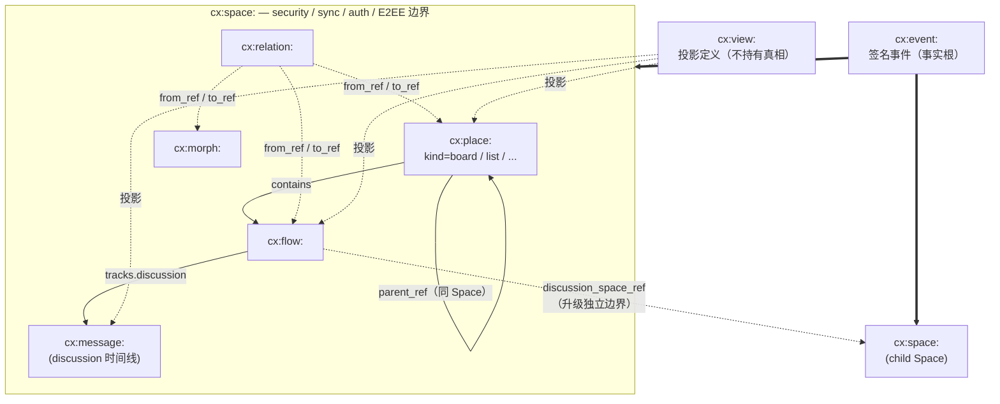

## 1. 目标

Contrix 的核心数据模型是一张以 Space 为边界、以标准对象和开放 Morph 共同组成的可审计协作图。本目录定义协作图中所有标准对象的语义、字段、行为与互相之间的关系。

阅读建议：

- 第一次接触请按本文 §3 设计原则与 §2 typed-id 一览建立总览。
- 字段细节、必填性、枚举值集中在 [`common-fields.md`](./common-fields.md)（公共字段）与各对象自己的"字段"小节。
- 每个对象在 `models/` 下都有唯一权威文件；文件之间不重复 normative 规则，只在必要处交叉引用。

## 2. Typed ID 一览

每个 Contrix 对象的种类由 `id` 的 typed-id 前缀（`cx:<kind>:`）唯一决定，canonical object 上不再单独写 `type` 字段。下表是对象到详细文档的索引。

### 2.1 协作图核心对象

| Typed ID | 对象 | 说明 | 详情 |
| --- | --- | --- | --- |
| `cx:space:` | Space | security / sync / auth / E2EE 边界 | [space-and-place.md](./space-and-place.md) |
| `cx:place:` | Place | Space 内部的结构容器（看板 / 列 / 泳道 / calendar bucket / page group ...） | [space-and-place.md](./space-and-place.md) |
| `cx:flow:` | Flow | 统一协作主对象（task / decision / incident / channel ...） | [flow-and-message.md](./flow-and-message.md) |
| `cx:message:` | Message | Flow `discussion` track 时间线消息 | [flow-and-message.md](./flow-and-message.md) |
| `cx:morph:` | Morph | 开放形态对象，承载扩展业务类型 | [morph.md](./morph.md) |
| `cx:relation:` | Relation | 一等关系对象（contains / replies_to / depends_on ...） | [relation.md](./relation.md) |
| `cx:actor_profile:` | Actor Profile | Actor 在协作图中的展示镜像 | [actor.md](./actor.md) |
| `cx:view:` | View | 投影定义（看板 / 列表 / 时间线 / graph / document ...） | [views.md](./views.md) |
| `cx:event:` | Event | 签名事件，reducer 输入与审计事实 | [event-and-patch.md](./event-and-patch.md) |

### 2.2 治理对象

| Typed ID | 对象 | 说明 | 详情 |
| --- | --- | --- | --- |
| `cx:policy:` | Policy | access / encryption / retention / federation / moderation 等策略 | [governance-objects.md](./governance-objects.md) |
| `cx:grant:` | Capability Grant | 授权委派 | [governance-objects.md](./governance-objects.md) |
| `cx:invite:` | Invite | Space 加入引导 | [governance-objects.md](./governance-objects.md) |
| `cx.schema.*` | Schema | 标准对象 / Morph type / facet / event 的结构与约束 | [governance-objects.md](./governance-objects.md) |

### 2.3 派生 / 私有对象

> 派生对象不是 canonical truth，由 client / SDK 从 Event 集合本地计算；schema 仅用于 wire 表示。

| Typed ID | 对象 | 说明 | 详情 |
| --- | --- | --- | --- |
| Read Marker | actor-private 已读位置（id 由 actor + 范围派生，非 typed-id） | [private-objects.md](./private-objects.md) |
| Notification | inbox projection（id content-addressed 或派生，非 typed-id） | [private-objects.md](./private-objects.md) |

### 2.4 内容 / 媒体 / 扩展对象

| Typed ID | 对象 | 说明 | 详情 |
| --- | --- | --- | --- |
| `cx:blob:` | Blob | 由 Blob Store 管理的内容寻址数据，不参与协作图归约 | [extension-objects.md](./extension-objects.md) |
| `cx:applet:` | Applet | bot / bridge / portal / 集成服务（extension profile） | [extension-objects.md](./extension-objects.md) |
| Agent | A2A / ACP 互通运行时 | [extension-objects.md](./extension-objects.md) |

### 2.5 辅助标识符

| Typed ID | 对象 | 说明 |
| --- | --- | --- |
| `cx:receipt:` | Event Batch Receipt | 可选审计 / 同步加速对象，不是 reducer 输入 |
| `cx:cell:`、`cx:cursor:`、`cx:anchor:` | 状态 / 同步原语 | 不是协作图对象；语义见 `authz/event-auth-state-resolution.md`、`sync/operations-sync.md` 与 `conformance/encoding.md` |

字段级、必填性、枚举值与 wire 约束统一以 [`common-fields.md`](./common-fields.md) 与各对象文件中的字段表为准。Schema 引用见 `artifacts/schemas/`，event/operation registry 见 `artifacts/registry/`。

### 2.6 对象关系总览

下图把核心 typed-id 之间的归属、容纳、引用、投影关系画成一张图。`cx:event:` 是事实根，所有共享对象都是 Event 集合在某个 reducer profile 下的物化结果。

读图要点：

- 实线箭头是结构归属或容纳关系；虚线是引用 / 投影 / 升级到独立边界。
- `cx:space:` 是硬边界——授权、E2EE、history visibility、federation 都以它为根。`cx:place:` 永远不是边界，授权透明回退到所属 Space。
- `cx:relation:` 是一等对象，跨对象语义 MUST 通过 Relation 表达，不藏在字段里。
- `cx:view:` 拥有投影定义的真相，但不持有被投影对象的协作事实。
- Discussion 想要独立 membership / E2EE / history visibility 时，必须升级为 child Space 并通过 `Flow.discussion_space_ref` 引用，而不是在 track 内部表达。

## 3. 设计原则

### 3.1 Space 边界与 Place 容器

每个 `cx:space:` 都是 security/sync/auth/E2EE 硬边界——复制、权限、schema、policy、membership、history visibility、加密、federation policy 都以它为根。Space 没有"容器形态"分支：结构性分组（看板、列、泳道、calendar bucket 等）由独立的 **Place** 对象（`cx:place:`）承担，Place 永远不形成独立边界。

`security_class=high_assurance` 是 Space 的可选标签，进一步收紧 federation policy 与默认审计/E2EE 选项。

Space MAY 通过 `cx.space.child` / `cx.space.parent` 形成 **Space-Space 层级**（每个 child 仍是独立边界）。membership、capability、history visibility、schema、policy 和 encryption key 默认不从 parent 级联到 child；任何继承都必须由 child Space 显式声明。详细规则见 [`space-hierarchy.md`](./space-hierarchy.md)。

Place 层级（看板嵌套、列在板内）通过 Place 自己的 `parent_ref` + `cx.place.parent` 表达，**不**与 Space-Space 层级混用。Place 嵌套必须在同一 Space 内；跨 Space 的引用走 Relation。

### 3.2 Flow 承载主语义

同一个协作主题由一个 Flow 表达；track primary 解析规则与 track 配置决定默认入口和能力面。

标准对象本身表达主语义：

- `flow`：统一协作主对象。它承载 `title` / `summary` / `body` 等基础字段，并通过 track primary 解析规则决定默认进入哪个 track。
- `message`：Flow `discussion` track 中的消息。
- `morph`：开放形态对象，用于业务扩展、未知类型和实验对象。
- `place`：Space 内部的结构容器（`kind=board` / `kind=list` / 其他 profile 注册的形态）。

标准对象 MAY 暴露 schema/profile 已声明的 `facets` 来辅助展示或查询，但它的核心职责不依赖 facets 才成立。实现不得要求标准对象先声明 facet 才能承认其主语义。

### 3.3 Morph 是开放对象

`morph` 表示协议未固化为标准类型的协作对象，适合插件、未来标准类型实验、外部系统镜像、低频弱互操作扩展数据。

Morph 的可见能力可以由 Space schema / Morph profile 声明，并通过 `facets` 暴露给 View、UI、本地搜索或插件。实现遇到未知标准类型 SHOULD fail closed；遇到未知 Morph facet SHOULD 保留数据，但不得让未知 facet 绕过 schema、capability、policy 或 encryption 约束。

Facet 字符串本身不是规范性 reducer 或授权来源。任何会改变写入权限、状态转换、排序、包含关系、事件有效性或跨实现 wire 行为的能力，MUST 由明确 schema/profile/event kind/capability action 定义。详情见 [morph.md](./morph.md)。

### 3.4 Relation 是一等对象

跨对象语义 MUST 使用 `relation` 表达，而不是藏在对象字段里。Relation 连接的是对象引用：标准字段 `from_ref` / `to_ref` 可以指向 `flow`、`message`、`morph`、`actor`、`place` 或 `space`。

跨 Space 引用规则、结构性 Relation 的本地约束（如 `contains` / `belongs_to` 不可跨 Space）见 [relation.md](./relation.md)。

### 3.5 Event 是事实

所有协作变化最终都落为签名 `event`。Event 是审计根和 reducer 输入。当前态只是 Event 集合在某个 reducer profile 下的物化结果。详情见 [event-and-patch.md](./event-and-patch.md)。

### 3.6 View 是投影定义

`view` 是一等协议对象，但它拥有的是投影定义的真相，而不是被投影对象的协作事实。它定义查询、过滤、排序、分组、renderer、布局、可见字段和共享 saved view 配置。

View 不得发明对象能力，也不得持有对象状态的唯一副本；对象能力来自对象类型、schema/profile 和 capability，facets 只作为已声明能力的查询与投影 hint。详情见 [views.md](./views.md)。

### 3.7 Schema 演进

标准类型演进 MUST 遵守：

- 新字段优先 optional。
- 既有字段不得静默改变语义。
- reducer 和客户端 MUST 保留未知字段，但 MUST NOT 让未知字段绕过 capability、schema、policy 或加密约束。
- UI 遇到未知 Morph type SHOULD 降级为 generic Morph card。
- 标准对象不得阻止 Space 定义自定义 Morph type。

## 4. 阅读路径

按你想了解的层面选择：

| 想了解 | 起点 |
| --- | --- |
| 协作图整体结构 / 标准对象一览 | 本文 §2-§3 |
| 公共字段、lifecycle、reducer 总则 | [common-fields.md](./common-fields.md) |
| Space 边界、看板 / 列 / 容器、位置语义 | [space-and-place.md](./space-and-place.md) |
| Flow / track / discussion / Message | [flow-and-message.md](./flow-and-message.md) |
| Morph 类型、facets、扩展 | [morph.md](./morph.md) |
| Relation 基数、跨 Space、冲突 | [relation.md](./relation.md) |
| Actor、Actor Profile | [actor.md](./actor.md) |
| Schema / Policy / Capability Grant / Invite | [governance-objects.md](./governance-objects.md) |
| Read Marker / Notification | [private-objects.md](./private-objects.md) |
| Event Envelope / Proof / Patch / Receipt / reducer | [event-and-patch.md](./event-and-patch.md) |
| Applet / Agent / Blob | [extension-objects.md](./extension-objects.md) |
| Content Block（消息正文 / 富文本 / 媒体） | [content-types.md](./content-types.md) |
| 投影 / 看板 / 时间线 / graph / document View | [views.md](./views.md) |
| Space-Space 层级、继承、lazy link | [space-hierarchy.md](./space-hierarchy.md) |

## 5. 规范性引用

- 标准 event type 注册表见 `../conformance/schema-registry.md`。
- Reducer conformance vector 见 `../conformance/conformance-vectors.md`。
- Schema evolution 测试见 `../conformance/conformance-profiles.md`。
- Move / Anchor / Lattice / capability 校验规则见 `../authz/event-auth-state-resolution.md`。
