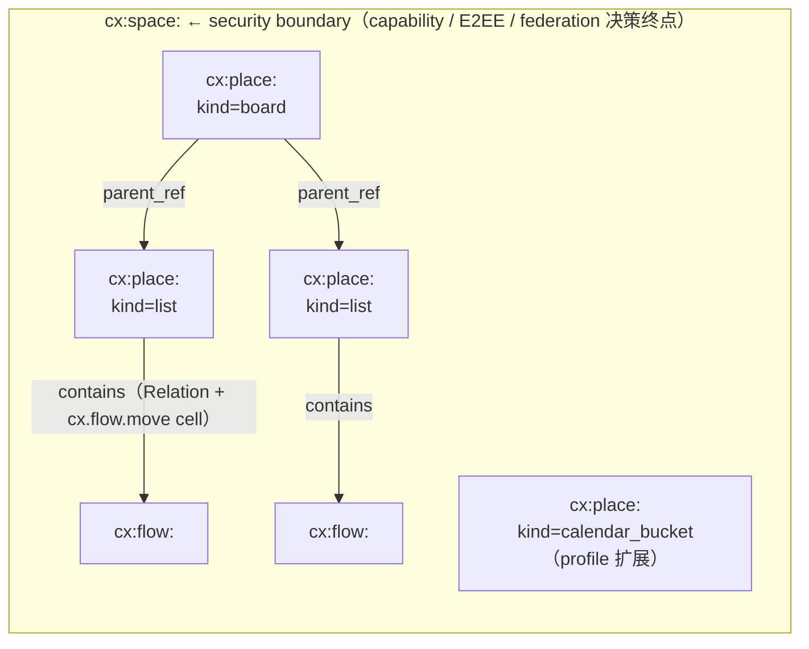
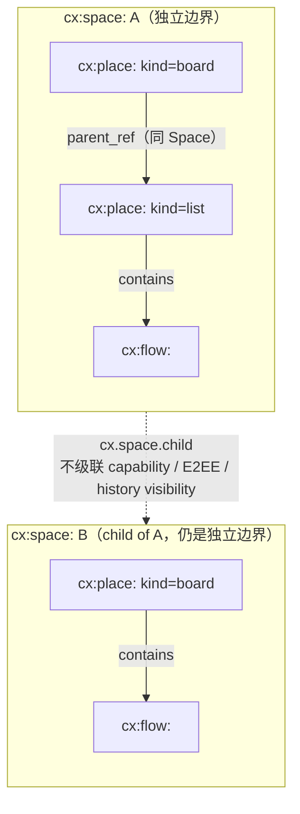

## 1. 目标

本文定义 Contrix 协作图中的两个结构性对象：

- **Space**（`cx:space:`）：security / sync / auth / E2EE 的硬边界。
- **Place**（`cx:place:`）：Space 内部的结构容器（看板、列、泳道、calendar bucket 等），永远不形成独立边界。

Space 之间的层级、继承和 Lazy Link 在 [`space-hierarchy.md`](./space-hierarchy.md) 单独讨论；本文仅在 §6 给出摘要与跳转。

公共字段、lifecycle、reducer 总则见 [`common-fields.md`](./common-fields.md)。

## 2. Space

### 2.1 概念

每个 `cx:space:` ID 都直接是 security/sync/auth/E2EE 边界。授权、membership、history visibility、E2EE、federation、retention、plaintext-visible service 和 policy server 解析全部以该 Space 为根，无需运行时 dispatch。

`security_class=high_assurance` 是 Space 的可选标签，进一步收紧 federation policy 与默认审计/E2EE 选项。

一个 Space 可以包含多个：

- Flow
- Place（包括 board / list / 其他 profile 注册的结构容器）
- Document（由 Flow `synthesis` track 或 Morph 表达，详见 [flow-and-message.md](./flow-and-message.md) / [morph.md](./morph.md)）
- Morph

产品语义（个人 / 项目 / 组织 / enclave 等）使用 `Space.fields` / `schema_refs` / `labels` 表达；安全等级使用 `security_class` 字段。

### 2.2 Schema id 与字段

Schema id: `cx.schema.space.v1`

> Materialized Space 上以 **reducer 派生** 标注的字段（`policy_ref` / `default_discoverability` / `default_join_rule` / `history_visibility` / `federation_policy` 等）只是当前态快照。**写入路径**必须使用对应 per-facet state event（`cx.space.policy` / `cx.space.join_rule` / `cx.space.history_visibility` / `cx.space.discovery` / `cx.space.policy_components` / ...），不得直接 PATCH Space 对象更新这些字段。`encryption_profile` 在 create event 时锁定，后续不可变。

| 字段 | 必填 | 类型 | 约束 | 说明 |
| --- | --- | --- | --- | --- |
| `id` | yes | `id:space` | 以 `cx:space:` 开头。 | Space ID。 |
| `schema` | yes | `cx.schema.space.v1` | 固定为 Space schema id。 | 对象 schema。 |
| `title` | yes | `string` | 1..256 UTF-8 chars。 | 人类可读名称。 |
| `summary` | no | `string` | SHOULD <= 2048 chars。 | 简短说明。 |
| `security_class` | no | `enum(standard, high_assurance)` | 默认 `standard`。`high_assurance` MUST 满足 `federation_policy ∈ {closed, restricted, quarantine}`，并 SHOULD 使用更严的 resolver / E2EE / 审计默认值。schema enforce 见 `space.schema.json`。 | 安全等级标签。 |
| `created_by_principal` | yes | `did` | 必须是 create event 授权主体。 | 创建 Principal。 |
| `owning_organizations` | no | `array<did>` | 每项必须可解析为 Organization Principal。 | 官方或治理组织。 |
| `schema_refs` | yes | `array<string>` | MUST 包含 registry 中的对象 schema，例如 `cx.schema.space.v1`，或实现 profile。 | 启用 schema。 |
| `relation_profiles` | no | `array<RelationProfile>` | 可由 Space schema/profile 等价声明；同一 `(relation_kind, from_type, to_type, scope)` 至多一个 active profile。详见 [relation.md](./relation.md) §5。 | Relation 基数、去重和冲突规则。 |
| `policy_ref` | no | `id:policy` | **reducer 派生**，由 `cx.space.policy` 维护；若 create event 未声明则为空。 | 派生：当前 Space access policy 引用。 |
| `default_discoverability` | yes | `enum(public, listed, restricted, unlisted, invite_only, secret)` | **reducer 派生**，由 `cx.space.discovery` 维护；create event 提供初值。详见 `discovery-directory.md`。 | 派生：默认可发现性。 |
| `default_join_rule` | yes | `enum(public, invite, knock, restricted, knock_restricted, closed)` | **reducer 派生**，由 `cx.space.join_rule` 维护；create event 提供初值。`invite` 表示只允许邀请加入；canonical state MUST 使用本枚举值。 | 派生：默认加入规则。 |
| `history_visibility` | yes | `enum(world_readable, shared, invited, joined, restricted)` | **reducer 派生**，由 `cx.space.history_visibility` 维护；create event 提供初值。各取值 canonical 语义见 `authz/event-auth-state-resolution.md` §6。 | 派生：历史可见性。 |
| `encryption_profile` | yes | `enum(none, mls_rfc9420, external)` | create event 锁定；后续不得通过 Space update 改变。E2EE Space SHOULD 使用 `mls_rfc9420`。 | 加密配置（create-locked）。 |
| `federation_policy` | no | `enum(open, restricted, closed, quarantine)` | **reducer 派生**，由 `cx.space.policy_components` 中相关组件维护。sovereign 默认 SHOULD `closed`。`security_class=high_assurance` MUST 使用 `closed`、`restricted` 或 `quarantine`，禁止 `open`；schema enforce 见 `space.schema.json`。 | 派生：联邦策略。 |
| `anchor_profile` | no | `enum(single_did, threshold, open_set, mixed)` | **create-locked**。省略时 sovereign / closed deployment SHOULD 使用 `single_did`，开放联邦 SHOULD 使用 `open_set`。详见 `authz/event-auth-state-resolution.md`。 | Anchor finality profile。 |
| `hash_profile` | no | `enum(sha256, sha512, sha3_256, blake3)` | **create-locked**。Space 内 Anchor / Move id、state_root、Merkle leaf 等核心承诺字段使用的 hash 算法。默认 `sha256`。切换需要走 hash transition Anchor，详见 `authz/event-auth-state-resolution.md` §4.2.5。各算法 wire 形态见 `conformance/encoding.md` §3。 | Hash 算法 profile。 |
| `anchorer` | conditional | `object` | Genesis anchorer cell 的初值；`anchor_profile` 存在时 SHOULD 指定。支持 `single_did`、`threshold`、`open_set`、`mixed`。 | 派生：当前 Anchor 授权规则。 |
| `max_anchor_staleness_ms` | no | `integer` | Move `anchor_ref` 的 freshness 窗口。离线超过窗口的客户端必须 rebase 并重新签名。默认 24h。 | Move freshness。 |
| `cell_lattices` | no | `array<CellLattice>` | Space-specific 扩展 cell family 的 lattice 声明；核心 cell family 由 registry 声明。 | Lattice 扩展。 |
| `co_write_policy` | no | `array<array<component>>` | 限制哪些 cell family 可以在同一 Move 中共同写入，避免跨域原子写滥用。 | Move 原子写约束。 |
| `retention_policy_ref` | no | `id:policy` | 可引用 retention policy。 | 保留策略。 |
| `avatar_blob_ref` | no | `id:blob` | 必须满足 media auth。 | 图标 Blob。 |
| `created_at` | yes | `timestamp` |  | 创建时间。 |
| `updated_at` | no | `timestamp` |  | 更新时间。 |

### 2.3 最小示例

```json
{
  "id": "cx:space:0196419b-0000-7000-8000-000000000000",
  "schema": "cx.schema.space.v1",
  "title": "Launch Plan",
  "created_by_principal": "did:web:acme.example",
  "schema_refs": [
    "cx.schema.space.v1"
  ],
  "policy_ref": "cx:policy:01964160-8000-7000-8000-000000000000",
  "default_discoverability": "invite_only",
  "default_join_rule": "invite",
  "history_visibility": "joined",
  "encryption_profile": "mls_rfc9420",
  "created_at": "2026-04-26T00:00:00Z"
}
```

### 2.4 Space policy 决定的语义

- 谁能加入 Space
- 哪些 Flow / Morph 类型与 track profile 可用
- 哪些服务可同步、索引或看见明文
- 是否加密
- 是否允许外部联邦
- 数据保留与 blob 配额

Space 层级关系不改变上述边界。Parent Space 可以帮助发现和组织 child Space，但不能单方面授予 child Space 的读取、写入、审核或解密能力。详见 [`space-hierarchy.md`](./space-hierarchy.md)。

## 3. Join Policy

### 3.1 目标与范围

本节描述 Join Policy 的目标模型。当前 v1 core 的 active 机器 contract 仍以
`cx.space.join_rule`、`cx.space.policy_components`、capability 与 invite 状态机为准；
独立 join-policy Event.kind / schema 尚未进入 registry。实现若做实验，MUST 使用自有
extension namespace，并且不得在 describe/profile discovery 中把它声明为 active `cx.*`
标准 contract。

`default_join_rule` 枚举（§2.2）只表达粗粒度的入口模式：`public` 直接进、`invite` 必须有人邀、`knock` 可申请、`restricted` / `knock_restricted` 有附加条件、`closed` 不收新人。但是 `restricted` 的"条件"是什么、`knock` 申请里能否带结构化材料、人工审批的决策是否上链审计、CAPTCHA / proof-of-work 等运行时挑战如何接入——这些都需要本节统一定义。

本节定义的 **Join Policy** 与 §2.2 `default_join_rule` 正交又互补：

- `default_join_rule` 决定**入口模式**（`public` / `invite` / `knock` / `restricted` / `knock_restricted` / `closed`）。
- Join Policy 决定**入口模式选定后，到 `membership=join` 必须穿越的 gate 集合**（凭证、问卷、挑战、人工审批等）的组合、解析顺序、加密语义和反滥用约束。
- `default_join_rule=public` 与 `default_join_rule=closed` 不消耗 Join Policy（前者无 gate，后者无入口）；其余四个枚举值的精确语义由 §3.4 与 Join Policy 交叉决定。

### 3.2 设计原则

1. **Gate 是组合的，不是命名的。** 不再以新 enum 区分"附加条件类型"。Space 通过 `gates[]` + `combinator` 表达任意 AND/OR 组合；`knock_restricted` 等组合 enum 的语义由 `combinator` 直接表达，避免每加一类 gate 就要再造 enum。
2. **申请材料对外不可见。** Matrix `m.room.member{knock}` 的 free-text `reason` 因默认可见已成为 spam 通道。Contrix 申请正文 MUST 仅对 `cx.space.join.review` capability 持有方可见：E2EE Space 中通过 reviewer-only encryption envelope；非 E2EE Space 中由 Sync Service 强制访问控制并审计读取（`cx.audit.accessed`）。
3. **审核决策必须上链。** 所有审核接受 / 拒绝 MUST 是签名的 anchored Move，记录 reviewer DID、review reason、引用证据 hash。事后审计与申诉（参见 [`../governance/content-moderation.md` §6](../governance/content-moderation.md)）依赖该 trail。
4. **审核必须密码学绑定到 join。** 借鉴 Matrix `join_authorised_via_users_server` 的担保模式：随后的 `cx.invite.create` MUST 通过 `refs[role="join_authorised_by"]` 引用对应 review accept Move。reducer 校验该 ref 在写入时仍指向有效 capability 持有者。
5. **自动解析路径不强制走人工。** 当所有 gate 都可自动解析（claim presentation 验证、challenge proof 验证），applicant 可直接提交 `cx.member.state{membership=join}`，由 reducer 内联校验，无需 application / review Move。这条路径替代既有 `restricted` 入口模式的实质语义。
6. **Capability 仍是 allow 唯一来源。** Join Policy gate 通过即"可以提议加入"，但 reducer 仍按 [`../authz/event-auth-state-resolution.md`](../authz/event-auth-state-resolution.md) 校验 join Move 的 capability。Policy Server `obligations[]`（§3.10）只能在 capability 之上叠加额外要求（如 challenge），不能凭空创造权限。

### 3.3 Cell Family 与 State Event

```text
cell_id     := cx:cell:space.join_policy.v1:<space_id>
lattice     := cas-register
bottom      := reject
value shape := JoinPolicy（见下）
```

写入 cell 的候选事件在正式登记前记为 `space.join_policy`（无 `cx.` 标准前缀），需要 `cx.policy.manage` capability（与 `cx.space.policy_server` / `cx.space.policy_components` 同等级）。`cx.space.create` 时 SHOULD 通过 `cx.space.policy_components` 一并提供 join policy 初值；省略时 cell 维持 `null`，行为退化为"`default_join_rule` 单独决定"。

JoinPolicy 候选 schema 名：`space.join_policy.v1`。

| 字段 | 必填 | 类型 | 约束 | 说明 |
| --- | --- | --- | --- | --- |
| `gates` | yes | `array<Gate>` | 1..16 项；空数组 MUST schema_violation。 | 必须穿越的 gate 列表。 |
| `combinator` | yes | `enum(all, any)` | 默认 `all`。 | gate 之间的组合语义。 |
| `review_capability` | conditional | `string` | 任一 gate `kind ∈ {manual_review, application_form}` 时必填；缺省 `cx.space.join.review`。 | 审核所需 capability。 |
| `reviewer_quorum` | no | `enum(any, majority, all) | object` | 默认 `any`。`object` 形式 `{ threshold: int, of: did[] }` 表达 N-of-M。 | 审核法定人数。 |
| `application_ttl` | no | `duration` | 默认 `168h`，最小 `1h`，最大 `8760h`（1y）。 | 申请未决超时即失效。 |
| `cooldown_after_reject` | no | `duration` | 默认 `72h`。 | 拒绝后同一 actor 重新申请的最短间隔。 |
| `max_open_applications_per_actor` | no | `integer` | 默认 `1`，最大 `5`。 | 同一 actor 在本 Space 同时未决申请上限。 |
| `applicant_visibility` | no | `enum(reviewer_only, members_after_join, public)` | 默认 `reviewer_only`。 | 申请正文谁可见；`members_after_join` 表示 join 成功后开放给 Space 成员（用于自我介绍场景）。 |
| `directory_hint` | no | `object` | 见 §3.3.2。 | Discovery Directory 公开投影所需 hint。 |

#### 3.3.1 Gate 类型

每个 Gate 是 typed flat object，复用 [`../authz/constraint-schema.md` §2.1](../authz/constraint-schema.md) 的扁平结构传统：

```json
{
  "gate_id": "string",
  "kind": "claim_required",
  "auto_resolve": true
}
```

字段语义：

- `gate_id`：稳定 id，用于审计与 application 中的 proof 关联
- `kind`：取 `claim_required` / `application_form` / `challenge_response` / `manual_review` / `parent_membership` / `cooldown` 之一
- `auto_resolve`：该 gate 能否仅靠 applicant 提交的材料解析；`manual_review` / `application_form` 必为 `false`
- 其余字段按 `kind` 决定（见下表）

| `kind` | 必带字段 | 语义 | `auto_resolve` |
| --- | --- | --- | --- |
| `claim_required` | `requires_claims[]`（见 [`../authz/constraint-schema.md` §10](../authz/constraint-schema.md)） | applicant MUST 提交满足声明集合的 VC / claim presentation。 | `true` |
| `parent_membership` | `parent_space_refs: id:space[]`、`require_min_membership: enum(invite, join)` | applicant MUST 已是任一 parent space 的指定成员。reducer 在 join Move 校验时必须能够独立验证（snapshot 或 backfill）。等价于 Matrix MSC3083 `m.room_membership` 条件。 | `true` |
| `challenge_response` | `provider_did: did`、`challenge_kinds: enum(captcha, pow, attested_human, idp_oidc)[]`、`max_proof_age: duration` | applicant MUST 完成 provider 颁发的挑战并提交 signed proof。详见 §3.10。 | `true` |
| `application_form` | `questions[]`（见 §3.3.3） | applicant MUST 在 `member.application` 中提交对应 answer；reviewer 人工评估。 | `false` |
| `manual_review` | （无额外字段） | reviewer 必须显式签署 accept；不要求结构化问卷。 | `false` |
| `cooldown` | `min_interval_since_leave: duration` | applicant 上次 `cx.member.state{membership=leave}` 后未达冷却期 MUST 拒绝。仅作为 deny gate（与 `combinator` 无关，单独评估）。 | `true` |

未注册 `kind` MUST schema_violation；未注册的 `(kind, subfield)` 组合按 lattice `bottom=reject` 处理。

##### 3.3.2 `directory_hint`

为帮助 Discovery Directory（[`../discovery/discovery-directory.md`](../discovery/discovery-directory.md)）告知 applicant "进入这个 Space 大概要做什么"，Space MAY 声明 directory hint。该 hint 是公开投影，**不得**包含敏感问卷正文：

```json
{
  "directory_hint": {
    "summary": "Members must hold an Acme employee VC and complete a brief intro form.",
    "expected_review_time": "PT24H",
    "requires_human_review": true,
    "challenge_kinds_displayed": ["captcha"]
  }
}
```

`questions[]` 正文 MUST NOT 出现在 hint 中；公开 question prompt 是 opt-in（每个 question 独立 `disclosed_in_directory: bool`）。

##### 3.3.3 `application_form.questions[]`

```json
{
  "questions": [
    {
      "question_id": "q1",
      "prompt_canonical": "Why do you want to join?",
      "prompt_locales": {"en": "Why do you want to join?", "zh": "为什么想加入？"},
      "answer_kind": "text | single_choice | multi_choice | boolean",
      "required": true,
      "min_chars": 20,
      "max_chars": 500,
      "choices": [{"id": "yes", "label": "Yes"}, {"id": "no", "label": "No"}],
      "auto_reject_if_choice_in": ["no"],
      "disclosed_in_directory": false
    }
  ]
}
```

`auto_reject_if_choice_in` 让 reducer / 审核服务对明显错误答案直接生成 `decision=reject`，不进入人工队列。

### 3.4 与 `default_join_rule` 的交叉表

| `default_join_rule` | Join Policy 是否生效 | 等价 gate 组合 |
| --- | --- | --- |
| `public` | 不生效 | applicant 提交 `cx.member.state{join}` 即被接受。 |
| `invite` | 不生效 | 必须有 `cx.invite.create`；Join Policy 不可绕过 invite。 |
| `restricted` | 生效（自动解析路径） | `gates[*].auto_resolve == true` MUST 全为 true；含 `manual_review` 或 `application_form` MUST schema_violation。 |
| `knock` | 生效（任一路径） | gate 集合可包含人工审核；申请-审核路径必走。 |
| `knock_restricted` | 生效（OR 合成） | `combinator` SHOULD 为 `any`；典型组合：`[claim_required(auto), application_form(manual)]`，凭证持有者直接进，否则走问卷申请。 |
| `closed` | 不生效 | reducer 拒绝任何 join / knock / application Move。 |

reducer 在 `cx.space.join_rule` 与 join-policy cell 任一变更时 MUST 重新评估上述一致性约束；不一致 MUST `failed_precondition` 拒绝写入，并附带 `reason="join_rule_policy_mismatch"`。

### 3.5 自动解析路径

适用条件：`default_join_rule ∈ {public, restricted, knock_restricted}` 且 applicant 拟使用的 gate 子集全部 `auto_resolve=true`。

applicant 直接提交：

```json
{
  "kind": "cx.member.state",
  "payload": {
    "space_id": "cx:space:0196419b-0000-7000-8000-000000000000",
    "subject_did": "did:webvh:bob",
    "membership": "join",
    "gate_proofs": [
      {
        "gate_id": "g-org-vc",
        "claim_presentation": "jws-vc:eyJhbGciOiJFZERTQSJ9..."
      },
      {
        "gate_id": "g-captcha",
        "challenge_proof": {
          "challenge_id": "chg_01HXY9PM0AB6Y7VN2C7M4WG5KQ",
          "issued_by": "did:web:captcha.example",
          "proof": "base64url:..."
        }
      }
    ]
  }
}
```

reducer MUST：

1. 加载当前 join-policy cell value；
2. 按 `combinator` 选取需满足的 gate 子集；
3. 对每个引用的 gate 调用对应 verifier（claim issuer revocation check、challenge provider signature check、parent membership snapshot 查询）；
4. `cooldown` gate 独立评估，命中即拒绝（无视 `combinator`）；
5. 全部通过则接受 `membership=join`；任一失败 `failed_precondition`，附带 `reason_code` 指明哪个 gate fail 与原因。

reducer MUST NOT 在自动解析路径上隐式生成 application / review Move——此路径绕过申请-审核状态机。

### 3.6 申请-审核路径

适用条件：`default_join_rule ∈ {knock, knock_restricted}` 且至少一个 gate `auto_resolve=false`。

#### 3.6.1 阶段

| 阶段 | Move | 写入方 |
| --- | --- | --- |
| 1. 敲门 | `cx.member.state{membership=knock}` | applicant |
| 2. 提交申请 | `member.application` | applicant |
| 3. 审核决策 | `member.application.review` | reviewer（持 `review_capability`） |
| 4. 接受邀请（隐式） | `cx.invite.create` + `cx.invite.accept` | reviewer 与 applicant |

reducer MUST 接受 stage 1 与 stage 2 在同一 batch 内提交；client SHOULD 把它们打包到同一 Anchor request 以减少 round trip。

#### 3.6.2 `member.application`

候选 durable Event；schema 名 `member.application.v1`，正式进入 v1 registry 前不得使用 `cx.*` 标准前缀。

| 字段 | 必填 | 类型 | 说明 |
| --- | --- | --- | --- |
| `space_id` | yes | `id:space` | 申请目标 Space。 |
| `applicant_did` | yes | `did` | 等于 envelope `actor`。 |
| `knock_ref` | yes | `event_ref` | 引用 stage 1 的 `cx.member.state{knock}` event id。 |
| `policy_version` | yes | `sha256` | 提交时 `space.join_policy` cell value 的 canonical hash；reducer 校验 reviewer 决策时是否仍是同一 policy。 |
| `answers` | conditional | `array<Answer>` | 任一 `application_form` gate 存在时必填，覆盖该 gate 所有 `required=true` 的 question_id。 |
| `gate_proofs` | conditional | `array<GateProof>` | 任一可自动解析 gate 存在时按需提供（与自动解析路径同形）。 |
| `applicant_note` | no | `string` | 1..2000 chars 自由文本备注。 |
| `encryption_envelope` | conditional | `object` | E2EE Space 必填；见 §3.7。 |

`Answer` 形态：`{question_id, value: string|string[]|boolean}`；reducer 仅做存在性 / shape 校验，语义评估留给 reviewer。

#### 3.6.3 `member.application.review`

durable Event，需要 `review_capability`。

| 字段 | 必填 | 类型 | 说明 |
| --- | --- | --- | --- |
| `space_id` | yes | `id:space` |  |
| `application_ref` | yes | `event_ref` | 指向 §3.6.2 的 application event。 |
| `decision` | yes | `enum(accept, reject, request_changes)` | `request_changes` 允许 applicant 修订 answer 后重提，不计入 cooldown。 |
| `reason_code` | yes | `string` | 稳定原因码：`ok` / `incomplete_answers` / `policy_violation` / `claim_invalid` / `challenge_failed` / `duplicate` / `other`。 |
| `reason_text` | no | `string` | 1..1000 chars 自由文本，对 applicant 可见。 |
| `evidence_refs` | no | `event_ref[]` | 评审依据的其它 event（如 `cx.audit.*` 风险记录）。 |
| `reviewer_capability_proof` | yes | `object` | 引用授予 reviewer `review_capability` 的 grant id 与当时 frontier hash；reducer 必须在写入时再校验一次。 |

`reviewer_quorum != "any"` 时，reducer 需收集 N 个独立 reviewer 的 accept 才认为申请进入 `accepted` 状态；任一 reject 即终止。

#### 3.6.4 `member.application.cancel`

applicant 可主动撤回；写入 `decision=canceled`，不计 cooldown。

#### 3.6.5 接受后的 invite

application 进入 `accepted` 状态后：

1. 任一 reviewer 提交 `cx.invite.create`，`refs[role="join_authorised_by"]` MUST 引用对应 `member.application.review{accept}` event；
2. applicant 提交 `cx.invite.accept`；
3. reducer 在写入 `cx.invite.create` 时再次校验：被引用的 review accept 仍指向尚未消费的 application（防止同一 accept 被复用）、reviewer 在当前 frontier 仍持有 `review_capability`、application 未过 `application_ttl`、未被后续 `reject` / `cancel` 覆盖。

校验失败 `failed_precondition`，`reason_code="join_authorisation_invalid"`。

### 3.7 加密与隐私

#### 3.7.1 非 E2EE Space

`member.application` payload 在 wire 上保持明文，但 Sync Service / Principal Server MUST：

- 仅向 reviewer set（`review_capability` 持有方）与 applicant 自身投影 application 正文；
- 对其它 Space 成员投影占位（`{application_pending: true}`）；
- 对每次 reviewer 读取写一条 `cx.audit.accessed`（payload 包含 application event id 与读取者 DID）。

`applicant_visibility=members_after_join` 仅在 application 进入 `accepted` 且对应 `cx.invite.accept` 已落入 frontier 后，才允许向 Space 成员投影正文。

#### 3.7.2 E2EE Space（`encryption_profile=mls_rfc9420`）

Space 主 MLS group 不包含尚未 join 的 applicant，因此申请正文不能直接走 Space MLS group。MUST 使用以下机制之一：

1. **Reviewer Sub-Group MLS**：Space 维护一个独立 MLS group `cx:mls:reviewer_subgroup:<space_id>:reviewers`，成员是当前所有 `review_capability` 持有方。applicant 通过 reviewer set 中任一成员公布的 KeyPackage 出 group commit + welcome，将 application 正文作为该 sub-group 的 application message 投递。reducer 通过 `cx.mls.commit.governance_binding` 验证 sub-group roster 与 capability 一致。
2. **Envelope Encryption to Reviewer Devices**：当 reviewer 数小于阈值（默认 `<=5`）或 sub-group 维护成本不可接受时，applicant 可使用 `encryption_envelope` 字段对 reviewer 当前已 published `cx.mls.keypackage` 的接收方公钥逐一封装：

```json
{
  "encryption_envelope": {
    "scheme": "hpke-base-x25519-aes256gcm",
    "ciphertext": "base64url:...",
    "recipients": [
      {"reviewer_did": "did:webvh:alice", "device_id": "cx:device:...", "wrapped_key": "base64url:..."},
      {"reviewer_did": "did:webvh:carol", "device_id": "cx:device:...", "wrapped_key": "base64url:..."}
    ]
  }
}
```

reviewer 加 / 退职导致 envelope 失效时，应用层 SHOULD 提示 applicant 重提。

申请正文 MUST NOT 进入 `cx.member.state{knock}` Move（该 Move 公开），所有自由文本仅出现在受加密保护的 `member.application.encryption_envelope` 中。Matrix `m.room.member{knock}.reason` 因默认对部分客户端可见而成为 spam 通道——Contrix 通过结构上禁止 knock Move 携带正文规避该缺陷。

### 3.8 Membership 状态机扩展

复用既有 `cx.member.state` 枚举（`invite / join / leave / knock / ban`），不引入新值。状态转换补充：

```text
        knock ──submit member.application──▶ knock (with application_ref projection)
            │
            ├─ review.accept ──▶ invite (via cx.invite.create) ──▶ join (via cx.invite.accept)
            ├─ review.reject ──▶ leave  (with rejected_at + cooldown_until projection)
            ├─ application.cancel ──▶ leave
            └─ application_ttl 到期 ──▶ leave (reducer 自动转换，rejected_reason="ttl_expired")
```

派生 view `cx.view.space.applications.v1`（[`./views.md`](./views.md)）SHOULD 提供：

- `pending`: 未决申请；
- `awaiting_review`: 已提交但 reviewer 未决；
- `accepted_pending_invite`: 审核通过但 `cx.invite.create` 尚未签发；
- `recently_decided`: 7 日内的 accept/reject 决策。

### 3.9 联邦语义

跨域加入流程在 [`../sync/federation.md` §5.2](../sync/federation.md) 详述。本节仅说明 Join Policy 引入的不变量：

- `member.application` 与 `member.application.review` 都是候选 durable Event，参与正常 federation push / pull；
- `policy_version` 字段使 reviewer 与 applicant 显式承认评估时所用的 policy 快照，避免 reviewer 在不同 policy frontier 下决策导致争议；
- E2EE 场景下 reviewer sub-group MLS commit 通过既有 `cx.mls.*` 联邦机制传播；envelope encryption 由 origin Principal Server 投递到目标 reviewer 的 device list（参见 [`../crypto-media/device-lifecycle.md`](../crypto-media/device-lifecycle.md)）。
- `parent_membership` gate 评估需要其它 Space 的成员 snapshot；origin reducer MAY 通过 [`../discovery/discovery-directory.md`](../discovery/discovery-directory.md) 的 verified snapshot 接口或直接 backfill；snapshot 不可达时 fail closed。

### 3.10 Policy Server 运行时挑战

Policy Server（[`../authz/policy-server.md`](../authz/policy-server.md)）声明 `applies_to` 包含 `join` 时，对每条 `cx.member.state{join}` / `member.application` Move 调用 `/contrix/v1/check`。除既有 `decision` 外，Join 场景新增 obligation 子规范：

```json
{
  "obligations": [
    {
      "type": "challenge",
      "challenge_id": "chg_01HXY9PM0AB6Y7VN2C7M4WG5KQ",
      "kinds": ["captcha", "pow"],
      "issuer": "did:web:captcha.example",
      "endpoint": "https://captcha.example/challenge/01HXY9PM0AB6Y7VN2C7M4WG5KQ",
      "max_proof_age": "PT5M",
      "must_satisfy_before_resubmit": true
    }
  ]
}
```

applicant 完成挑战后，重新提交 join / application Move，在 `gate_proofs[]` 中追加 `{gate_id: "_runtime", challenge_proof: {...}}`（保留 `gate_id="_runtime"` 作为运行时挑战的占位）。Policy Server 重新校验后返回 `decision=allow`。`must_satisfy_before_resubmit=true` 时 reducer MUST 拒绝缺失对应 challenge_proof 的重提。

`obligations[].type` 注册值（`rate_limit` / `challenge` / `review_hold` / `drop_attachment`）维护在 [`../authz/policy-server.md` §4](../authz/policy-server.md) 表中；本规范是 `challenge` 类型在 join 路径上的 normative wire schema，其它路径（如 `cx.message.create`）若使用 `challenge` 必须遵循同一 envelope。

### 3.11 反滥用约束

| 控制项 | 默认 | 强制要求 |
| --- | --- | --- |
| `application_ttl` | 168h | reducer 到期自动转 `rejected_reason="ttl_expired"`；不计 cooldown。 |
| `cooldown_after_reject` | 72h | reject 后 reducer MUST 拒绝同 actor 在窗口内的新 `member.application`。`request_changes` 不触发 cooldown。 |
| `max_open_applications_per_actor` | 1 | reducer 校验 actor 当前 pending 数；超出 `failed_precondition`。 |
| Quota constraint | 由 Space `cx.space.policy_components` 声明 | 推荐对 `cx.member.state{knock}` 配置 `quota.subtype=rate`（如 `max_operations=5/day`），通过既有 [`../authz/constraint-schema.md` §7](../authz/constraint-schema.md) 表达。 |
| Policy Server `challenge` | 高风险 Space 推荐 | Sync Service 面对突发 knock 流量时 SHOULD 通过 Policy Server 注入 challenge obligation。 |

### 3.12 与 MIMI 的映射

[`../extensions/mimi-interop.md` §9.1](../extensions/mimi-interop.md) `participation` 中 `join_policy` 子字段 SHOULD 由 facade 在 Contrix `space.join_policy` component 与 MIMI room policy 之间双向归约；MIMI 侧暂未规范的 gate 类型作为 Contrix 专属 component 标记 `application/vnd.contrix.component+json`。MIMI facade 接收外部 join 请求时 SHOULD 至少强制执行 `claim_required` 与 `parent_membership` gate；`application_form` / `manual_review` / `challenge_response` 在 MIMI 客户端不支持 inline 表达时，facade SHOULD 拒绝跨域请求并指引 applicant 通过 Contrix 原生客户端完成。

### 3.13 完整示例

公开知识社群，凭证持有者直通、否则走 5 道问卷 + CAPTCHA：

```json
{
  "kind": "space.join_policy",
  "payload": {
    "space_id": "cx:space:0196419b-0000-7000-8000-000000000000",
    "value": {
      "combinator": "any",
      "gates": [
        {
          "gate_id": "g-vc",
          "kind": "claim_required",
          "auto_resolve": true,
          "requires_claims": [
            {"claim_type": "membership", "issuer": "did:web:openresearch.org", "status": "active"}
          ]
        },
        {
          "gate_id": "g-form",
          "kind": "application_form",
          "auto_resolve": false,
          "questions": [
            {"question_id": "q1", "answer_kind": "text", "required": true, "min_chars": 50, "max_chars": 500,
             "prompt_canonical": "Briefly describe your interest in this community."},
            {"question_id": "q2", "answer_kind": "single_choice", "required": true,
             "choices": [{"id": "yes", "label": "Yes"}, {"id": "no", "label": "No"}],
             "auto_reject_if_choice_in": ["no"],
             "prompt_canonical": "Do you agree to follow the community code of conduct?"}
          ]
        },
        {
          "gate_id": "g-captcha",
          "kind": "challenge_response",
          "auto_resolve": true,
          "provider_did": "did:web:captcha.example",
          "challenge_kinds": ["captcha"],
          "max_proof_age": "PT5M"
        }
      ],
      "review_capability": "cx.space.join.review",
      "reviewer_quorum": "any",
      "application_ttl": "168h",
      "cooldown_after_reject": "168h",
      "max_open_applications_per_actor": 1,
      "applicant_visibility": "reviewer_only",
      "directory_hint": {
        "summary": "Members hold an OpenResearch credential, OR complete a brief application + CAPTCHA.",
        "expected_review_time": "PT24H",
        "requires_human_review": true,
        "challenge_kinds_displayed": ["captcha"]
      }
    }
  }
}
```

对应 `cx.space.join_rule.value="knock_restricted"`：凭 VC 自动通过的走自动解析路径，其余走申请-审核路径。

## 4. Place

### 4.1 概念

Place 是 Space 内部的**结构性分组对象**——看板、列、泳道、calendar bucket、document outline group 等都是 Place。Place **永远不是**安全边界：它没有自己的 membership、policy、history visibility、E2EE group 或 federation policy；授权解析透明回退到所属 Space。

看板（`kind=board`）、列（`kind=list`）是 v1 标准 kind；profile 可注册新 kind（如 `swimlane`、`calendar_bucket`、`page_group`）。

### 4.2 Schema id 与字段

Schema id: `cx.schema.place.v1`

| 字段 | 必填 | 类型 | 约束 | 说明 |
| --- | --- | --- | --- | --- |
| `id` | yes | `id:place` | 以 `cx:place:` 开头。 | Place ID。 |
| `schema` | yes | `cx.schema.place.v1` | 固定。 | 对象 schema。 |
| `space_id` | yes | `id:space` | MUST 指向 `cx:space:`，**MUST NOT** 指向另一个 `cx:place:`。 | 所属 Space（安全边界）。 |
| `parent_ref` | no | `id:place` 或 `id:space` | 在结构层级中的父；可以是 `cx:place:`（如列的父是看板）或同 `space_id` 的 `cx:space:`（Place 在 Space 根）。省略表示 Space 根。 | 结构层级父。 |
| `kind` | yes | `string` | v1 标准 kind 包括 `board`、`list`。Profile 可注册新 kind（如 `swimlane`、`calendar_bucket`、`page_group`），未注册 kind MUST `schema_violation`。 | Place 类型。 |
| `title` | yes | `string` | 1..256 chars。 | 显示名。 |
| `summary` | no | `string` | <= 2048 chars。 | 简短说明。 |
| `rank` | no | `string` | 见 `encoding.md` §9。 | 在 parent 内的位置。 |
| `schema_refs` | no | `array<string>` | 可选 schema/profile 引用，进一步约束本 Place 容纳的 Flow 类型 / fields。 | Place schema 扩展。 |
| `fields` | no | `object` | kind-specific 字段：例如 `kind=list` 的 `wip_limit`，`kind=board` 的默认 view ref。 | 扩展字段。 |
| `labels` | no | `array<string>` |  | 用户/系统标签。 |
| `avatar_blob_ref` | no | `id:blob` |  | Place 图标。 |
| `state` | no | `enum(active, archived, tombstoned)` | 默认 `active`。`archived` 由 `cx.place.archive` reducer 设置（可逆 UI 隐藏），由 `cx.place.restore` 还原到 `active`；`tombstoned` 由 `cx.place.tombstone` reducer 设置（不可逆，引用尚存的 active Flow 时 MUST schema_violation；tombstoned 状态 MUST NOT 被 restore）。 | Place 生命周期状态。 |
| `state_changed_at` | no | `timestamp` | `state != active` 时必填。 | 最近一次 state 转换时间。 |
| `created_by` | yes | `did` |  | 创建者。 |
| `created_at` | yes | `timestamp` |  | 创建时间。 |
| `updated_by` | no | `did` |  | 最近更新者。 |
| `updated_at` | no | `timestamp` | 不早于 `created_at`。 | 最近更新时间。 |

### 4.3 行为规则

- **授权**：Place 自身不持有 capability、membership 或 policy。任何对 Place 的写入（`cx.place.create` / `cx.place.update` / `cx.place.archive` / `cx.place.restore` / `cx.place.tombstone` / `cx.place.parent`）的授权检查 MUST 落到所属 `space_id` 的 Space membership + capability。Place 上 `cx.flow.move` 类操作的授权检查仍由 Space 决定。
- **同步与联邦**：Place 跟随所属 Space 同步；它**不**形成独立 federation transaction 单位。Place 的 Move 与 Anchor 共享 Space 的 anchor pipeline。
- **加密**：Place **永远没有**自己的 MLS group。E2EE Space 中 Place 元数据（title、rank 等）按 Space 的 encryption_profile 处理。
- **生命周期**：archive Place = UI 隐藏；tombstone Place = 不可逆删除（但 Space 与已被关联 Flow 都仍存在）。这与 archive/tombstone Space（影响成员、E2EE、history）的语义截然不同——Place lifecycle 仅影响 UI 分组。
- **嵌套**：Place 之间可以嵌套（看板里的列），通过 `parent_ref` 表达；`cx.place.parent` event 是该字段的 reducer-input。Place 之间嵌套**不得跨 Space**——`parent_ref` 引用的 Place 必须 `space_id` 相同。
- **位置**：Flow 在 Place 中的位置由 active `contains` Relation + Flow position event（`cx.flow.move` / `cx.flow.reorder`）维护，不由 Flow canonical object 自带 `place_id` 表达。`cx.flow.move` payload 使用 `target_place_id` 字段。

### 4.4 Lifecycle 与 Cascade 规则

**Archive Place**：

- 由 `cx.place.archive` 把 `state` 设为 `archived` 并写入 `state_changed_at`；该 Place 在默认 view 中被隐藏。
- Reducer 在接受 `cx.place.archive` 前 **MUST** 校验当前 `state == "active"`（或缺省，缺省语义等价于 `active`）；其他状态（`archived` / `tombstoned`）MUST `failed_precondition` 且 `reason="place_not_active"`，**不**改写任何字段。same-state self-transition（archive 一个已 archived 的 Place）也算违反；客户端要"重新 archive"应先 `cx.place.restore` 再发新 archive。详见 [common-fields.md §5.1](./common-fields.md)。
- Archive **不**自动级联到内部 Flow 或 child Place。具体级联策略由 Place schema/profile 声明，缺省策略：
  - 内部 Flow 的 `contains` Relation 保留（Flow 仍在该 Place，但不可见）；用户在 unarchive 后看到的位置一致。
  - Child Place（List 在 Board 内）保留，跟随 parent 一起被默认 view 隐藏。
  - 客户端 SHOULD 在 archive 前提示用户 "X 个 Flow / Place 将一起隐藏"；reducer 不强制 relocate。

**Restore Place**（archive 的反向操作）：

- 由 `cx.place.restore` 把 `state` 从 `archived` 还原到 `active` 并写入 `state_changed_at`。
- Reducer 在接受 `cx.place.restore` 前 **MUST** 校验：
  - 当前 `state == "archived"`；其他状态（`active` / `tombstoned`）MUST `failed_precondition`（`reason="place_not_archived"`）。`tombstoned` 是不可逆终态，**绝不能**通过 restore 复活。
  - 这是与 [common-fields.md](./common-fields.md) §5 状态机一致的 canonical `archived -> active` 写入路径——客户端 MUST NOT 通过 `cx.place.update` 直接 PATCH 顶层 `state` 字段。
- Restore **不**级联——若 archive 时同时隐藏的 child Place / 内部 Flow 仍处于自身的 `archived` 状态，restore parent 不会改变 children 的状态；UI 需独立 restore 它们。
- Restore 后 `contains` Relation、Flow position cell 与 `parent_ref` cell 都保持 archive 前的值（archive 不级联即意味着这些数据从未被擦除），用户看到的内容与 archive 之前一致。
- 容量 / 授权：与 `cx.place.archive` 共享同一 risk tier（medium）与同一 Space-level capability category，但 capability action 是独立的 `cx.place.restore`，需要单独 grant 或由 admin 默认 bundle 涵盖。

**Tombstone Place**：

- 由 `cx.place.tombstone` 把 `state` 设为 `tombstoned` 并写入 `state_changed_at`；不可逆。
- Reducer 在接受 `cx.place.tombstone` 前 **MUST** 校验：
  - 当前 `state` 在 {`active`, `archived`} 之内（包括缺省视为 `active`）;`tombstoned` 状态 MUST `failed_precondition` 且 `reason="place_already_terminal"`(终态不可重复进入,与 [common-fields.md §5.1](./common-fields.md) 一致)。
  - 不存在指向该 Place 的 active `contains` Relation（即所有 Flow 已被 relocate 或它们也在被同批次 tombstone）。
  - 不存在 `parent_ref = <this_place>` 且未 tombstone 的 child Place。
  - 任一校验失败时返回 `failed_precondition`，依赖类用 `reason="place_has_live_dependents"`(附带未清空的依赖列表),终态类用 `reason="place_already_terminal"`。
- Tombstone 一个引用了**已 tombstone Place** 的 child（即 `parent_ref` 指向 dangling Place）：reducer SHOULD 接受（这是依赖清理路径），但 MUST 同时把该 child 标记为 `parent_ref_dangling=true` 投影 hint，让 UI 显示孤立状态。
- Tombstone 后 Place 元数据本身保留（用于 audit），但 `title` / `summary` 等用户内容 SHOULD 通过 redaction Move 清理。

### 4.5 `cx.place.parent` cas-register basis

`cx.place.parent` 写入 cell `cx:cell:cx.component.place.parent.v1:<place_id>`（`cas-register, bottom=reject`）。Move 的 precondition `head_eq` 表达期望的 pre-state：

- **首次 set**（Place 刚 create，尚无 parent 记录）：precondition 使用 `head_eq null`。Reducer 在 cell pre-state 为初始（无任何 add/set）时只接受 `head_eq null` 的 Move；任何带具体 value 的 `head_eq` 在初始 cell 上 `failed_precondition`。
- **从 A 改为 B**：precondition 使用 `head_eq <A_place_id>`，effect 是 `set <B_place_id>`。
- **并发 reparent**：两个 Move 都用 `head_eq <A>` 但 set 不同 target，Anchor batch 内被识别为 sibling → cas-register 返回 `⊥`（kind=conflict）；依赖该 cell 的后续 Move fail_bottom，必须走 conflict-recovery（带 state_witness + inclusion_proof，详见 [`../sync/operations-sync.md`](../sync/operations-sync.md) §8）。
- **不允许 self-loop**：`cx.place.parent.set value == this_place_id` MUST schema_violation。
- **不允许跨 Space**：effect value MUST `space_id` 与 cell subject Place 的 `space_id` 相同；reducer 校验失败 `failed_precondition`。

Conformance fixture `move-anchor-lattice-fixture.json` SHOULD 覆盖三种场景：first-set、change-from-A-to-B、并发 reparent。

### 4.6 `cx.flow.move` / `cx.flow.reorder` cas-register basis

为与 §4.5 的 lattice 模型对称，Flow 在 Board 内的位置由 cas-register cell 而**不是** reducer-side dedup tuple 决定。一个 Flow 在某个 Board 内的 active 位置占用一个 cell：

```text
cell_id     := cx:cell:cx.component.flow.position.v1:<board_place_id>:<flow_id>
lattice     := cas-register
bottom      := reject
value shape := { "list_place_id": id:place, "rank": string } | null
```

写入语义：

- `cx.flow.move` 的 effect 是 `set { list_place_id, rank }`，precondition `head_eq` 表达 Move 提交者期望的 pre-state（即 `expected_position`）：
  - **首次进入 Board**：`head_eq null`，effect `set { <target_list>, <rank> }`；
  - **跨 List 移动**：`head_eq { <from_list>, <from_rank> }`，effect `set { <target_list>, <new_rank> }`；
  - **从 Board 移除**：`head_eq { <from_list>, <from_rank> }`，effect `set null`（reducer 同步删除对应 `contains` Relation）。
- `cx.flow.reorder` 写同一 cell，但要求 effect 的 `list_place_id` 与 pre-state 的 `list_place_id` 相同；改 list 必须走 `cx.flow.move`，reducer 在写入 cell 前静态拒绝试图通过 reorder 改 list 的 effect。
- **并发 move/reorder**：两个 Move 都用同一 `head_eq` 但 set 不同 value，cas-register 返回 `⊥`（kind=conflict）；依赖该 cell 的后续 Move fail_bottom，必须走 conflict-recovery。这取代了早期"reducer 关闭旧 position edge + tuple dedup"的分流：tuple dedup 仍是 projection 不变量，但**真相由 cell 决定**，并发竞态收敛到正式的 cas-register 冲突而非"先到先赢的接收顺序"。
- **跨 Board**：每个 `(board_place_id, flow_id)` 对应独立 cell；Flow 同时出现在不同 Board 是合法的（看板视图各自独立），所以 reducer **不**跨 Board 执行 cell join；仅在同一 Board 内强制单 active list。
- **`contains` Relation 是派生投影**：`list_place_id --contains--> flow_id` Relation 由 cell value 派生；客户端不得通过 `cx.relation.create/delete` 直接编辑该 Relation 来移动 Flow，必须使用 `cx.flow.move`。reducer 收到对该派生 Relation 的直接写入 MUST `schema_violation`。
- **Self-loop / 跨 Space**：effect value 的 `list_place_id` MUST 与 cell subject 的 `board_place_id` 共享同一 Space；不一致即 `failed_precondition`。

`cx.flow.move` payload 字段：

- `flow_id`：被移动的 Flow（与 `board_place_id` 共同决定 cell key）。
- `target_place_id`：目标 List Place（`cx:place: kind=list`），编入 effect `set { list_place_id }`。
- `board_place_id`：必填，cell key 的另一组成部分；早期版本曾允许省略由 reducer 推断，cas-register 模型下 MUST 显式提供。
- `rank`：移动后在目标 List 内的 rank，编入 effect `set { rank }`。
- `expected_position`：编译为 cell `head_eq`（详见 [`../sync/operations-sync.md`](../sync/operations-sync.md) §9.1）。

Conformance fixture `move-anchor-lattice-fixture.json` SHOULD 覆盖：first-move-into-board、cross-list-move、in-list-reorder、并发 move-to-different-list（产生 ⊥）、cross-board-independent-cells。

### 4.7 Board / List 示例

Board Place canonical 对象：

```json
{
  "id": "cx:place:019640b6-8000-7000-8000-000000000000",
  "schema": "cx.schema.place.v1",
  "space_id": "cx:space:0196419b-0000-7000-8000-000000000000",
  "kind": "board",
  "title": "Release Board",
  "fields": {
    "default_view_id": "cx:view:019641be-0000-7000-8000-000000000000"
  },
  "created_by": "did:web:alice.example",
  "created_at": "2026-04-26T00:00:00Z"
}
```

List Place canonical 对象（在父 Board 内的位置由 `parent_ref` + `rank` 共同决定）：

```json
{
  "id": "cx:place:0196401c-8000-7000-8000-000000000000",
  "schema": "cx.schema.place.v1",
  "space_id": "cx:space:0196419b-0000-7000-8000-000000000000",
  "parent_ref": "cx:place:019640b6-8000-7000-8000-000000000000",
  "kind": "list",
  "title": "Review",
  "rank": "mV",
  "fields": {
    "wip_limit": 5
  },
  "created_by": "did:web:alice.example",
  "created_at": "2026-04-26T00:00:00Z"
}
```

### 4.8 推荐字段（业务 hint）

Board Place（`kind=board`）：

- `title`、`summary`、`rank`
- `fields.default_view_id`、`fields.workflow_profile`、`fields.swimlane_policy`、`fields.wip_rules`
- `state` / `state_changed_at`

List Place（`kind=list`）：

- `title`、`summary`、`rank`
- `fields.wip_limit`、`fields.entry_criteria`
- `state` / `state_changed_at`

业务工作流 profile（看板类型、泳道策略、WIP 规则等）SHOULD 进入 `fields` 或由 Place schema 声明，不进入顶层字段。

### 4.9 常见关系

- `Board Place --contains--> List Place`
- `Board Place --has_default_view--> view`
- `List Place --contains--> flow`
- `flow --assigned_to--> actor`
- `flow --depends_on--> flow`
- `message --references--> flow`

`contains` 的基数与跨 Space 互斥规则见 [relation.md](./relation.md) §3。

## 5. Space-Place-Flow 关系示意



每条 typed ID 一眼即知其角色：

- `cx:space:` → 安全边界，永远是授权/E2EE/federation 决策终点。
- `cx:place:` → 结构容器（看板 / 列 / 泳道 / calendar bucket / page group ...），永远透明回退到 `space_id`，没有自己的 membership / policy / E2EE。
- `cx:flow:` → 协作主对象，永远在某 `space_id` 内；位置由 Place + `cx.flow.move` cas-register cell 决定。

### 5.1 Place 嵌套 vs Space-Space 层级

Place 嵌套（板里有列）和 Space-Space 层级（child Space）是两条**不混用**的层级路径：Place 嵌套通过 `parent_ref` 表达，必须落在同一 Space；Space-Space 层级通过 `cx.space.child` / `cx.space.parent` 表达，**不级联**授权 / membership / E2EE。



跨 Space 引用（如 Flow 引用另一 Space 的 Flow）走 Relation；结构性 Relation `contains` / `belongs_to` MUST NOT 跨 Space。详见 [`relation.md`](./relation.md) §3、[`space-hierarchy.md`](./space-hierarchy.md)。

## 6. 通用对象 ID 规则

完整 ID 列表与 ID kind registry 见 [common-fields.md](./common-fields.md) §6。Space / Place 相关：

- `cx:space:<uuid>`
- `cx:place:<uuid>`

## 7. Space-Space 层级（摘要）

Space MAY 通过 `cx.space.child` / `cx.space.parent` 形成 Space-Space 层级。每个 child 仍是独立边界，membership / capability / history visibility / schema / policy / encryption key 默认不级联到 child；任何继承都必须由 child Space 显式声明 `cx.space.inheritance_policy`，且只能收窄。

完整规则见 [`space-hierarchy.md`](./space-hierarchy.md)。

## 8. 规范性引用

- 公共字段：[common-fields.md](./common-fields.md)。
- Flow / Message / track 语义：[flow-and-message.md](./flow-and-message.md)。
- Relation 基数与跨 Space 规则：[relation.md](./relation.md)。
- Move / Anchor / Lattice：[`../authz/event-auth-state-resolution.md`](../authz/event-auth-state-resolution.md)。
- `cx.flow.move` / cas-register sync 编译：[`../sync/operations-sync.md`](../sync/operations-sync.md)。
- Place / Space schema：`artifacts/schemas/place.schema.json`、`artifacts/schemas/space.schema.json`。
- Space-Space hierarchy：[`space-hierarchy.md`](./space-hierarchy.md)。
