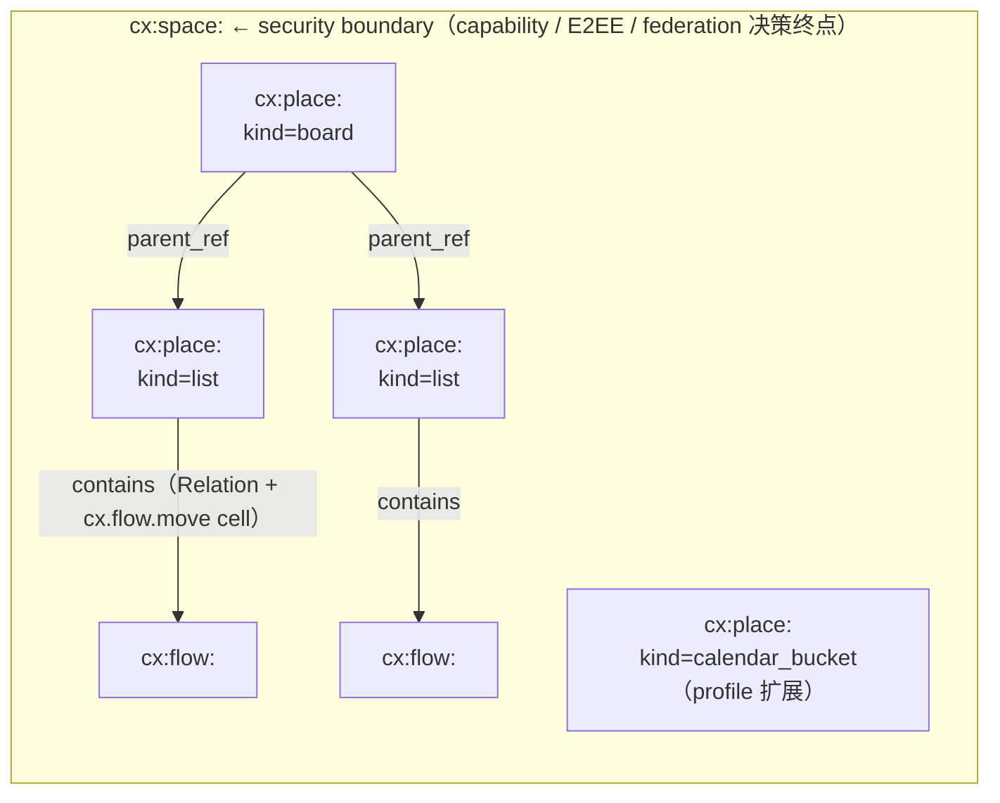
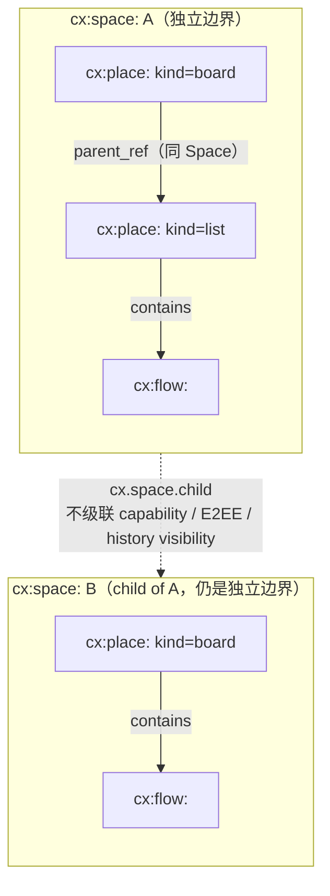

## 1. 目标

本文定义 Contrix 协作图中的两个结构性对象：

- **Space**（`cx:space:`）：security / sync / auth / E2EE 的硬边界。
- **Place**（`cx:place:`）：Space 内部的结构容器（看板、列、泳道、calendar bucket 等），永远不形成独立边界。

Space 之间的层级、继承和 Lazy Link 在 [`space-hierarchy.md`](./space-hierarchy.md) 单独讨论；本文仅在 §6 给出摘要与跳转。

公共字段、lifecycle、reducer 总则见 [`common-fields.md`](./common-fields.md)。

## 2. Space

### 2.1 概念

每个 `cx:space:` ID 都直接是 security/sync/auth/E2EE 边界。授权、membership、history visibility、E2EE、federation、retention、plaintext-visible service 和 policy server 解析全部以该 Space 为根，无需运行时 dispatch。

`security_class=high_assurance` 是 Space 的可选标签，进一步收紧 federation policy 与默认审计/E2EE 选项。

一个 Space 可以包含多个：

- Flow
- Place（包括 board / list / 其他 profile 注册的结构容器）
- Document（由 Flow `synthesis` track 或 Morph 表达，详见 [flow-and-message.md](./flow-and-message.md) / [morph.md](./morph.md)）
- Morph

产品语义（个人 / 项目 / 组织 / enclave 等）使用 `Space.fields` / `schema_refs` / `labels` 表达；安全等级使用 `security_class` 字段。

### 2.2 Schema id 与字段

Schema id: `cx.schema.space.v1`

> Materialized Space 上以 **reducer 派生** 标注的字段（`policy_ref` / `default_discoverability` / `default_join_rule` / `history_visibility` / `federation_policy` 等）只是当前态快照。**写入路径**必须使用对应 per-facet state event（`cx.space.policy` / `cx.space.join_rule` / `cx.space.history_visibility` / `cx.space.discovery` / `cx.space.policy_components` / ...），不得直接 PATCH Space 对象更新这些字段。`encryption_profile` 在 create event 时锁定，后续不可变。

| 字段 | 必填 | 类型 | 约束 | 说明 |
| --- | --- | --- | --- | --- |
| `id` | yes | `id:space` | 以 `cx:space:` 开头。 | Space ID。 |
| `schema` | yes | `cx.schema.space.v1` | 固定为 Space schema id。 | 对象 schema。 |
| `title` | yes | `string` | 1..256 UTF-8 chars。 | 人类可读名称。 |
| `summary` | no | `string` | SHOULD <= 2048 chars。 | 简短说明。 |
| `security_class` | no | `enum(standard, high_assurance)` | 默认 `standard`。`high_assurance` MUST 满足 `federation_policy ∈ {closed, restricted, quarantine}`，并 SHOULD 使用更严的 resolver / E2EE / 审计默认值。schema enforce 见 `space.schema.json`。 | 安全等级标签。 |
| `created_by_principal` | yes | `did` | 必须是 create event 授权主体。 | 创建 Principal。 |
| `owning_organizations` | no | `array<did>` | 每项必须可解析为 Organization Principal。 | 官方或治理组织。 |
| `schema_refs` | yes | `array<string>` | MUST 包含 registry 中的对象 schema，例如 `cx.schema.space.v1`，或实现 profile。 | 启用 schema。 |
| `relation_profiles` | no | `array<RelationProfile>` | 可由 Space schema/profile 等价声明；同一 `(relation_kind, from_type, to_type, scope)` 至多一个 active profile。详见 [relation.md](./relation.md) §5。 | Relation 基数、去重和冲突规则。 |
| `policy_ref` | no | `id:policy` | **reducer 派生**，由 `cx.space.policy` 维护；若 create event 未声明则为空。 | 派生：当前 Space access policy 引用。 |
| `default_discoverability` | yes | `enum(public, listed, restricted, unlisted, invite_only, secret)` | **reducer 派生**，由 `cx.space.discovery` 维护；create event 提供初值。详见 `discovery-directory.md`。 | 派生：默认可发现性。 |
| `default_join_rule` | yes | `enum(public, invite, knock, restricted, knock_restricted, closed)` | **reducer 派生**，由 `cx.space.join_rule` 维护；create event 提供初值。`invite` 表示只允许邀请加入；canonical state MUST 使用本枚举值。 | 派生：默认加入规则。 |
| `history_visibility` | yes | `enum(world_readable, shared, invited, joined, restricted)` | **reducer 派生**，由 `cx.space.history_visibility` 维护；create event 提供初值。各取值 canonical 语义见 `authz/event-auth-state-resolution.md` §6。 | 派生：历史可见性。 |
| `encryption_profile` | yes | `enum(none, mls_rfc9420, external)` | create event 锁定；后续不得通过 Space update 改变。E2EE Space SHOULD 使用 `mls_rfc9420`。 | 加密配置（create-locked）。 |
| `federation_policy` | no | `enum(open, restricted, closed, quarantine)` | **reducer 派生**，由 `cx.space.policy_components` 中相关组件维护。sovereign 默认 SHOULD `closed`。`security_class=high_assurance` MUST 使用 `closed`、`restricted` 或 `quarantine`，禁止 `open`；schema enforce 见 `space.schema.json`。 | 派生：联邦策略。 |
| `anchor_profile` | no | `enum(single_did, threshold, open_set, mixed)` | **create-locked**。省略时 sovereign / closed deployment SHOULD 使用 `single_did`，开放联邦 SHOULD 使用 `open_set`。详见 `authz/event-auth-state-resolution.md`。 | Anchor finality profile。 |
| `hash_profile` | no | `enum(sha256, sha512, sha3_256, blake3)` | **create-locked**。Space 内 Anchor / Move id、state_root、Merkle leaf 等核心承诺字段使用的 hash 算法。默认 `sha256`。切换需要走 hash transition Anchor，详见 `authz/event-auth-state-resolution.md` §4.2.5。各算法 wire 形态见 `conformance/encoding.md` §3。 | Hash 算法 profile。 |
| `anchorer` | conditional | `object` | Genesis anchorer cell 的初值；`anchor_profile` 存在时 SHOULD 指定。支持 `single_did`、`threshold`、`open_set`、`mixed`。 | 派生：当前 Anchor 授权规则。 |
| `max_anchor_staleness_ms` | no | `integer` | Move `anchor_ref` 的 freshness 窗口。离线超过窗口的客户端必须 rebase 并重新签名。默认 24h。 | Move freshness。 |
| `cell_lattices` | no | `array<CellLattice>` | Space-specific 扩展 cell family 的 lattice 声明；核心 cell family 由 registry 声明。 | Lattice 扩展。 |
| `co_write_policy` | no | `array<array<component>>` | 限制哪些 cell family 可以在同一 Move 中共同写入，避免跨域原子写滥用。 | Move 原子写约束。 |
| `retention_policy_ref` | no | `id:policy` | 可引用 retention policy。 | 保留策略。 |
| `avatar_blob_ref` | no | `id:blob` | 必须满足 media auth。 | 图标 Blob。 |
| `created_at` | yes | `timestamp` |  | 创建时间。 |
| `updated_at` | no | `timestamp` |  | 更新时间。 |

### 2.3 最小示例

```json
{
  "id": "cx:space:0196419b-0000-7000-8000-000000000000",
  "schema": "cx.schema.space.v1",
  "title": "Launch Plan",
  "created_by_principal": "did:web:acme.example",
  "schema_refs": [
    "cx.schema.space.v1"
  ],
  "policy_ref": "cx:policy:01964160-8000-7000-8000-000000000000",
  "default_discoverability": "invite_only",
  "default_join_rule": "invite",
  "history_visibility": "joined",
  "encryption_profile": "mls_rfc9420",
  "created_at": "2026-04-26T00:00:00Z"
}
```

### 2.4 Space policy 决定的语义

- 谁能加入 Space
- 哪些 Flow / Morph 类型与 track profile 可用
- 哪些服务可同步、索引或看见明文
- 是否加密
- 是否允许外部联邦
- 数据保留与 blob 配额

Space 层级关系不改变上述边界。Parent Space 可以帮助发现和组织 child Space，但不能单方面授予 child Space 的读取、写入、审核或解密能力。详见 [`space-hierarchy.md`](./space-hierarchy.md)。

## 3. Join Policy

Join Policy 的完整规范已拆出到独立文档 [`../governance/join-policy.md`](../governance/join-policy.md)，包括 gate 类型、组合规则、自动解析路径、申请-审核路径、加密与隐私、联邦语义、policy server 运行时挑战、反滥用约束以及 MIMI 映射等。本节只保留必要的入口指引；任何 normative 行为都以 join-policy.md 为准。

`default_join_rule` 枚举（§2.2 `default_join_rule`）与 Join Policy 正交又互补：

- `default_join_rule` 决定**入口模式**（`public` / `invite` / `knock` / `restricted` / `knock_restricted` / `closed`）。
- Join Policy 决定**入口模式选定后，到 `membership=join` 必须穿越的 gate 集合**与其加密、审核、反滥用约束。
- `default_join_rule=public` / `closed` 不消耗 Join Policy；其余四个枚举值的精确语义由 [`../governance/join-policy.md` §4](../governance/join-policy.md) 交叉表决定。

详细的 cell family、Gate 类型表、状态机、E2EE 申请正文加密路径、Policy Server obligation 协议、与 MIMI 的映射、完整示例等内容，统一在 [`../governance/join-policy.md`](../governance/join-policy.md) 中维护。

## 4. Place

### 4.1 概念

Place 是 Space 内部的**结构性分组对象**——看板、列、泳道、calendar bucket、document outline group 等都是 Place。Place **永远不是**安全边界：它没有自己的 membership、policy、history visibility、E2EE group 或 federation policy；授权解析透明回退到所属 Space。

看板（`kind=board`）、列（`kind=list`）是 v1 标准 kind；profile 可注册新 kind（如 `swimlane`、`calendar_bucket`、`page_group`）。

### 4.2 Schema id 与字段

Schema id: `cx.schema.place.v1`

| 字段 | 必填 | 类型 | 约束 | 说明 |
| --- | --- | --- | --- | --- |
| `id` | yes | `id:place` | 以 `cx:place:` 开头。 | Place ID。 |
| `schema` | yes | `cx.schema.place.v1` | 固定。 | 对象 schema。 |
| `space_id` | yes | `id:space` | MUST 指向 `cx:space:`，**MUST NOT** 指向另一个 `cx:place:`。 | 所属 Space（安全边界）。 |
| `parent_ref` | no | `id:place` 或 `id:space` | 在结构层级中的父；可以是 `cx:place:`（如列的父是看板）或同 `space_id` 的 `cx:space:`（Place 在 Space 根）。省略表示 Space 根。 | 结构层级父。 |
| `kind` | yes | `string` | v1 标准 kind 包括 `board`、`list`。Profile 可注册新 kind（如 `swimlane`、`calendar_bucket`、`page_group`），未注册 kind MUST `schema_violation`。 | Place 类型。 |
| `title` | yes | `string` | 1..256 chars。 | 显示名。 |
| `summary` | no | `string` | <= 2048 chars。 | 简短说明。 |
| `rank` | no | `string` | 见 `encoding.md` §9。 | 在 parent 内的位置。 |
| `schema_refs` | no | `array<string>` | 可选 schema/profile 引用，进一步约束本 Place 容纳的 Flow 类型 / fields。 | Place schema 扩展。 |
| `fields` | no | `object` | kind-specific 字段：例如 `kind=list` 的 `wip_limit`，`kind=board` 的默认 view ref。 | 扩展字段。 |
| `labels` | no | `array<string>` |  | 用户/系统标签。 |
| `avatar_blob_ref` | no | `id:blob` |  | Place 图标。 |
| `state` | no | `enum(active, archived, tombstoned)` | 默认 `active`。`archived` 由 `cx.place.archive` reducer 设置（可逆 UI 隐藏），由 `cx.place.restore` 还原到 `active`；`tombstoned` 由 `cx.place.tombstone` reducer 设置（不可逆，引用尚存的 active Flow 时 MUST schema_violation；tombstoned 状态 MUST NOT 被 restore）。 | Place 生命周期状态。 |
| `state_changed_at` | no | `timestamp` | `state != active` 时必填。 | 最近一次 state 转换时间。 |
| `created_by` | yes | `did` |  | 创建者。 |
| `created_at` | yes | `timestamp` |  | 创建时间。 |
| `updated_by` | no | `did` |  | 最近更新者。 |
| `updated_at` | no | `timestamp` | 不早于 `created_at`。 | 最近更新时间。 |

### 4.3 行为规则

- **授权**：Place 自身不持有 capability、membership 或 policy。任何对 Place 的写入（`cx.place.create` / `cx.place.update` / `cx.place.archive` / `cx.place.restore` / `cx.place.tombstone` / `cx.place.parent`）的授权检查 MUST 落到所属 `space_id` 的 Space membership + capability。Place 上 `cx.flow.move` 类操作的授权检查仍由 Space 决定。
- **同步与联邦**：Place 跟随所属 Space 同步；它**不**形成独立 federation transaction 单位。Place 的 Move 与 Anchor 共享 Space 的 anchor pipeline。
- **加密**：Place **永远没有**自己的 MLS group。未声明 minimal-metadata profile 时，Place 的 `title`、`summary`、`rank`、`state`、`parent_ref` 等结构化 metadata 始终是 wire 明文，即便所属 Space 声明 `encryption_profile="mls_rfc9420"`；启用 minimal-metadata profile 时按 [`../crypto-media/encryption-and-audit.md` §2.7](../crypto-media/encryption-and-audit.md) 只保留 reducer / routing 必需字段。
- **生命周期**：archive Place = UI 隐藏；tombstone Place = 不可逆删除（但 Space 与已被关联 Flow 都仍存在）。这与 archive/tombstone Space（影响成员、E2EE、history）的语义截然不同——Place lifecycle 仅影响 UI 分组。
- **嵌套**：Place 之间可以嵌套（看板里的列），通过 `parent_ref` 表达；`cx.place.parent` event 是该字段的 reducer-input。Place 之间嵌套**不得跨 Space**——`parent_ref` 引用的 Place 必须 `space_id` 相同。
- **位置**：Flow 在 Place 中的位置由 active `contains` Relation + Flow position event（`cx.flow.move` / `cx.flow.reorder`）维护，不由 Flow canonical object 自带 `place_id` 表达。`cx.flow.move` payload 使用 `target_place_id` 字段。

### 4.4 Lifecycle 与 Cascade 规则

**Archive Place**：

- 由 `cx.place.archive` 把 `state` 设为 `archived` 并写入 `state_changed_at`；该 Place 在默认 view 中被隐藏。
- Reducer 在接受 `cx.place.archive` 前 **MUST** 校验当前 `state == "active"`（或缺省，缺省语义等价于 `active`）；其他状态（`archived` / `tombstoned`）MUST `failed_precondition` 且 `reason="place_not_active"`，**不**改写任何字段。same-state self-transition（archive 一个已 archived 的 Place）也算违反；客户端要"重新 archive"应先 `cx.place.restore` 再发新 archive。详见 [common-fields.md §5.1](./common-fields.md)。
- Archive **不**自动级联到内部 Flow 或 child Place。具体级联策略由 Place schema/profile 声明，缺省策略：
  - 内部 Flow 的 `contains` Relation 保留（Flow 仍在该 Place，但不可见）；用户在 unarchive 后看到的位置一致。
  - Child Place（List 在 Board 内）保留，跟随 parent 一起被默认 view 隐藏。
  - 客户端 SHOULD 在 archive 前提示用户 "X 个 Flow / Place 将一起隐藏"；reducer 不强制 relocate。

**Restore Place**（archive 的反向操作）：

- 由 `cx.place.restore` 把 `state` 从 `archived` 还原到 `active` 并写入 `state_changed_at`。
- Reducer 在接受 `cx.place.restore` 前 **MUST** 校验：
  - 当前 `state == "archived"`；其他状态（`active` / `tombstoned`）MUST `failed_precondition`（`reason="place_not_archived"`）。`tombstoned` 是不可逆终态，**绝不能**通过 restore 复活。
  - 这是与 [common-fields.md](./common-fields.md) §5 状态机一致的 canonical `archived -> active` 写入路径——客户端 MUST NOT 通过 `cx.place.update` 直接 PATCH 顶层 `state` 字段。
- Restore **不**级联——若 archive 时同时隐藏的 child Place / 内部 Flow 仍处于自身的 `archived` 状态，restore parent 不会改变 children 的状态；UI 需独立 restore 它们。
- Restore 后 `contains` Relation、Flow position cell 与 `parent_ref` cell 都保持 archive 前的值（archive 不级联即意味着这些数据从未被擦除），用户看到的内容与 archive 之前一致。
- 容量 / 授权：与 `cx.place.archive` 共享同一 risk tier（medium）与同一 Space-level capability category，但 capability action 是独立的 `cx.place.restore`，需要单独 grant 或由 admin 默认 bundle 涵盖。

**Tombstone Place**：

- 由 `cx.place.tombstone` 把 `state` 设为 `tombstoned` 并写入 `state_changed_at`；不可逆。
- Reducer 在接受 `cx.place.tombstone` 前 **MUST** 校验：
  - 当前 `state` 在 {`active`, `archived`} 之内（包括缺省视为 `active`）;`tombstoned` 状态 MUST `failed_precondition` 且 `reason="place_already_terminal"`(终态不可重复进入,与 [common-fields.md §5.1](./common-fields.md) 一致)。
  - 不存在指向该 Place 的 active `contains` Relation（即所有 Flow 已被 relocate 或它们也在被同批次 tombstone）。
  - 不存在 `parent_ref = <this_place>` 且未 tombstone 的 child Place。
  - 任一校验失败时返回 `failed_precondition`，依赖类用 `reason="place_has_live_dependents"`(附带未清空的依赖列表),终态类用 `reason="place_already_terminal"`。
- Tombstone 一个引用了**已 tombstone Place** 的 child（即 `parent_ref` 指向 dangling Place）：reducer SHOULD 接受（这是依赖清理路径），但 MUST 同时把该 child 标记为 `parent_ref_dangling=true` 投影 hint，让 UI 显示孤立状态。
- Tombstone 后 Place 元数据本身保留（用于 audit），但 `title` / `summary` 等用户内容 SHOULD 通过 redaction Move 清理。

### 4.5 `cx.place.parent` cas-register basis

`cx.place.parent` 写入 cell `cx:cell:cx.component.place.parent.v1:<place_id>`（`cas-register, bottom=reject`）。Move 的 precondition `head_eq` 表达期望的 pre-state：

- **首次 set**（Place 刚 create，尚无 parent 记录）：precondition 使用 `head_eq null`。Reducer 在 cell pre-state 为初始（无任何 add/set）时只接受 `head_eq null` 的 Move；任何带具体 value 的 `head_eq` 在初始 cell 上 `failed_precondition`。
- **从 A 改为 B**：precondition 使用 `head_eq <A_place_id>`，effect 是 `set <B_place_id>`。
- **并发 reparent**：两个 Move 都用 `head_eq <A>` 但 set 不同 target，Anchor batch 内被识别为 sibling → cas-register 返回 `⊥`（kind=conflict）；依赖该 cell 的后续 Move fail_bottom，必须走 conflict-recovery（带 state_witness + inclusion_proof，详见 [`../sync/operations-sync.md`](../sync/operations-sync.md) §8）。
- **不允许 self-loop**：`cx.place.parent.set value == this_place_id` MUST schema_violation。
- **不允许跨 Space**：effect value MUST `space_id` 与 cell subject Place 的 `space_id` 相同；reducer 校验失败 `failed_precondition`。

Conformance fixture `move-anchor-lattice-fixture.json` SHOULD 覆盖三种场景：first-set、change-from-A-to-B、并发 reparent。

### 4.6 `cx.flow.move` / `cx.flow.reorder` cas-register basis

为与 §4.5 的 lattice 模型对称，Flow 在 Board 内的位置由 cas-register cell 而**不是** reducer-side dedup tuple 决定。一个 Flow 在某个 Board 内的 active 位置占用一个 cell：

```text
cell_id     := cx:cell:cx.component.flow.position.v1:<board_place_id>:<flow_id>
lattice     := cas-register
bottom      := reject
value shape := { "list_place_id": id:place, "rank": string } | null
```

写入语义：

- `cx.flow.move` 的 effect 是 `set { list_place_id, rank }`，precondition `head_eq` 表达 Move 提交者期望的 pre-state（即 `expected_position`）：
  - **首次进入 Board**：`head_eq null`，effect `set { <target_list>, <rank> }`；
  - **跨 List 移动**：`head_eq { <from_list>, <from_rank> }`，effect `set { <target_list>, <new_rank> }`；
  - **从 Board 移除**：`head_eq { <from_list>, <from_rank> }`，effect `set null`（reducer 同步删除对应 `contains` Relation）。
- `cx.flow.reorder` 写同一 cell，但要求 effect 的 `list_place_id` 与 pre-state 的 `list_place_id` 相同；改 list 必须走 `cx.flow.move`，reducer 在写入 cell 前静态拒绝试图通过 reorder 改 list 的 effect。
- **并发 move/reorder**：两个 Move 都用同一 `head_eq` 但 set 不同 value，cas-register 返回 `⊥`（kind=conflict）；依赖该 cell 的后续 Move fail_bottom，必须走 conflict-recovery。tuple dedup 仍是 projection 不变量，但**真相由 cell 决定**，并发竞态收敛到正式的 cas-register 冲突而非"先到先赢的接收顺序"。
- **跨 Board**：每个 `(board_place_id, flow_id)` 对应独立 cell；Flow 同时出现在不同 Board 是合法的（看板视图各自独立），所以 reducer **不**跨 Board 执行 cell join；仅在同一 Board 内强制单 active list。
- **`contains` Relation 是派生投影**：`list_place_id --contains--> flow_id` Relation 由 cell value 派生；客户端不得通过 `cx.relation.create/delete` 直接编辑该 Relation 来移动 Flow，必须使用 `cx.flow.move`。reducer 收到对该派生 Relation 的直接写入 MUST `schema_violation`。
- **Self-loop / 跨 Space**：effect value 的 `list_place_id` MUST 与 cell subject 的 `board_place_id` 共享同一 Space；不一致即 `failed_precondition`。

`cx.flow.move` payload 字段：

- `flow_id`：被移动的 Flow（与 `board_place_id` 共同决定 cell key）。
- `target_place_id`：目标 List Place（`cx:place: kind=list`），编入 effect `set { list_place_id }`。
- `board_place_id`：必填，cell key 的另一组成部分；cas-register 模型要求显式提供，不接受由 reducer 推断。
- `rank`：移动后在目标 List 内的 rank，编入 effect `set { rank }`。
- `expected_position`：编译为 cell `head_eq`（详见 [`../sync/operations-sync.md`](../sync/operations-sync.md) §9.1）。

Conformance fixture `move-anchor-lattice-fixture.json` SHOULD 覆盖：first-move-into-board、cross-list-move、in-list-reorder、并发 move-to-different-list（产生 ⊥）、cross-board-independent-cells。

### 4.7 Board / List 示例

Board Place canonical 对象：

```json
{
  "id": "cx:place:019640b6-8000-7000-8000-000000000000",
  "schema": "cx.schema.place.v1",
  "space_id": "cx:space:0196419b-0000-7000-8000-000000000000",
  "kind": "board",
  "title": "Release Board",
  "fields": {
    "default_view_id": "cx:view:019641be-0000-7000-8000-000000000000"
  },
  "created_by": "did:web:alice.example",
  "created_at": "2026-04-26T00:00:00Z"
}
```

List Place canonical 对象（在父 Board 内的位置由 `parent_ref` + `rank` 共同决定）：

```json
{
  "id": "cx:place:0196401c-8000-7000-8000-000000000000",
  "schema": "cx.schema.place.v1",
  "space_id": "cx:space:0196419b-0000-7000-8000-000000000000",
  "parent_ref": "cx:place:019640b6-8000-7000-8000-000000000000",
  "kind": "list",
  "title": "Review",
  "rank": "mV",
  "fields": {
    "wip_limit": 5
  },
  "created_by": "did:web:alice.example",
  "created_at": "2026-04-26T00:00:00Z"
}
```

### 4.8 推荐字段（业务 hint）

Board Place（`kind=board`）：

- `title`、`summary`、`rank`
- `fields.default_view_id`、`fields.workflow_profile`、`fields.swimlane_policy`、`fields.wip_rules`
- `state` / `state_changed_at`

List Place（`kind=list`）：

- `title`、`summary`、`rank`
- `fields.wip_limit`、`fields.entry_criteria`
- `state` / `state_changed_at`

业务工作流 profile（看板类型、泳道策略、WIP 规则等）SHOULD 进入 `fields` 或由 Place schema 声明，不进入顶层字段。

### 4.9 常见关系

- `Board Place --contains--> List Place`
- `Board Place --has_default_view--> view`
- `List Place --contains--> flow`
- `flow --assigned_to--> actor`
- `flow --depends_on--> flow`
- `message --references--> flow`

`contains` 的基数与跨 Space 互斥规则见 [relation.md](./relation.md) §3。

## 5. Space-Place-Flow 关系示意



每条 typed ID 一眼即知其角色：

- `cx:space:` → 安全边界，永远是授权/E2EE/federation 决策终点。
- `cx:place:` → 结构容器（看板 / 列 / 泳道 / calendar bucket / page group ...），永远透明回退到 `space_id`，没有自己的 membership / policy / E2EE。
- `cx:flow:` → 协作主对象，永远在某 `space_id` 内；位置由 Place + `cx.flow.move` cas-register cell 决定。

### 5.1 Place 嵌套 vs Space-Space 层级

Place 嵌套（板里有列）和 Space-Space 层级（child Space）是两条**不混用**的层级路径：Place 嵌套通过 `parent_ref` 表达，必须落在同一 Space；Space-Space 层级通过 `cx.space.child` / `cx.space.parent` 表达，**不级联**授权 / membership / E2EE。



跨 Space 引用（如 Flow 引用另一 Space 的 Flow）走 Relation；结构性 Relation `contains` / `belongs_to` MUST NOT 跨 Space。详见 [`relation.md`](./relation.md) §3、[`space-hierarchy.md`](./space-hierarchy.md)。

## 6. 通用对象 ID 规则

完整 ID 列表与 ID kind registry 见 [common-fields.md](./common-fields.md) §6。Space / Place 相关：

- `cx:space:<uuid>`
- `cx:place:<uuid>`

## 7. Space-Space 层级（摘要）

Space MAY 通过 `cx.space.child` / `cx.space.parent` 形成 Space-Space 层级。每个 child 仍是独立边界，membership / capability / history visibility / schema / policy / encryption key 默认不级联到 child；任何继承都必须由 child Space 显式声明 `cx.space.inheritance_policy`，且只能收窄。

完整规则见 [`space-hierarchy.md`](./space-hierarchy.md)。

## 8. 规范性引用

- 公共字段：[common-fields.md](./common-fields.md)。
- Flow / Message / track 语义：[flow-and-message.md](./flow-and-message.md)。
- Relation 基数与跨 Space 规则：[relation.md](./relation.md)。
- Move / Anchor / Lattice：[`../authz/event-auth-state-resolution.md`](../authz/event-auth-state-resolution.md)。
- `cx.flow.move` / cas-register sync 编译：[`../sync/operations-sync.md`](../sync/operations-sync.md)。
- Place / Space schema：`artifacts/schemas/place.schema.json`、`artifacts/schemas/space.schema.json`。
- Space-Space hierarchy：[`space-hierarchy.md`](./space-hierarchy.md)。
