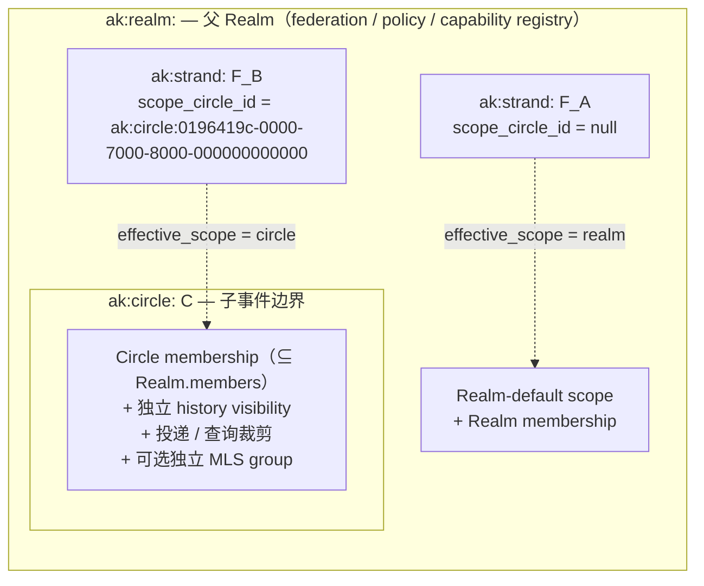

## 0. 规范语言

本文中的规范关键字（**MUST** / **SHOULD** / **MAY** 等）按 [conformance/normative-language.md](../conformance/normative-language.md) 解释；仅大写形式具规范约束力。

## 1. 目标

本文定义 Arkret 协作图中两个最常用的对象：

- **Strand**（`ak:strand:`）：Realm 内统一的协作主对象，承载"这件事本身"。
- **Message**（`ak:message:`）：Strand `discussion` track 时间线中的原子消息。

Strand 通过 `tracks` map 表达多种能力面，并可选通过 `scope_circle_id` 把整个 Strand 落在 Realm 内的某个 [Circle](./circle.md)（子事件 / 子消息边界；可按父 Realm floor 启用独立 MLS）。Track 模型、access 规则、conflict 收敛、ephemeral 信号都在本文一处讲完。

Strand 永远只有**一个** effective scope —— 整个 Strand(所有 track)共享同一事件 / 投递 / history 边界。需要"宽 synthesis + 窄 discussion"的场景 MUST 用**两个 Strand + Relation**(`confidential_discussion_of`)表达，详见 [`circle.md` §7.2](./circle.md)。

公共字段、lifecycle、reducer 总则见 [`common-fields.md`](./common-fields.md)。

## 2. Strand 概览

Strand 是 Realm 内被讨论、推进、引用、审阅、执行或沉淀的统一协作对象。它直接承载"这件事本身"、一组参与者和围绕它的上下文信息。

Strand 适合：

- 产品/工程 initiative
- 决策或提案
- 事故、客户 case、研究主题
- 跨多个团队的任务簇
- 需要长期沉淀的知识主题
- 外部资产或业务对象的协作锚点
- 会话主导的协作线程

Strand 顶层字段不承载额外模式或业务分类；默认入口由 track primary 解析规则决定，业务语义由 Realm schema、profile、`metadata.fields`、Relation 或 Morph 扩展表达。业务语义分类不属于 Strand 顶层字段。实现 SHOULD 通过 Realm schema/profile、`metadata.fields`、Relation、labels 或 Morph profile 表达业务类型，并通过 View 定义选择 renderer。

### 2.1 默认讨论 Strand 与发现机制

一个 Realm MAY 指定**一个**默认讨论 Strand（"general" 式的常驻讨论入口）。该指针的设计裁决如下，实现 MUST 遵循：

- **权威状态放在 Realm，单指针。** 权威当前值是 Realm 投影的 `default_strand_id`（[`realm.schema.json`](../../artifacts/schemas/realm.schema.json) 的可选 / nullable 字段）。它由 `ak.realm.set_default_strand` 事件投影得到（cell `ak.component.realm.set_default_strand.v1`、`cas_register`、`bottom=reject`）。**单一指针**避免多个 Strand 各自声明"我是默认"导致的多默认脏态；`null` / 缺省表示该 Realm 没有指定默认 Strand。**Null 归一（normative）**：cell 当前无默认时，`default_strand_id` 的 canonical 形态 MUST 为**显式 `null`**（固定二选一，不允许 "absent" 与 "explicit null" 两种语义并存）；reducer 在投影写入与 `expected_default_strand_id` CAS 比较前 MUST 先把缺省与显式 `null` 归一为同一 `null` 值，再做 whole-value 比较。该口径与 [§8.3](#83-cell-basis-与写入事件) watch cell `expected_value` 的 whole-value compare 一致（省略 = `head_eq null`），避免 "absent vs null" 导致 CAS 比较落空。
- **Strand 侧只暴露派生标记。** Strand 投影（[`ProjectionStrandRow`](../../artifacts/schemas/service-operation-dtos.schema.json)）的 `is_default` 是**派生**字段（`is_default == (strand_id == realm.default_strand_id)`），**不是**独立存储，投影器从 Realm 的 `default_strand_id` 计算得到。Strand 对象本身不持有任何"默认"布尔位。
- **设置 / 变更走事件驱动，不强制原子。** 改变默认 Strand 仅通过 `ak.realm.set_default_strand` 事件（payload 至少 `{realm_id, strand_id}`，见 [`event-payload.schema.json` `realm_set_default_strand_payload`](../../artifacts/schemas/event-payload.schema.json)）。授权是标准 Realm-admin 闸门:写入方 MUST 持有 `ak.realm.admin`（aggregate admin 覆盖）或被直接授予同名动作 `ak.realm.set_default_strand`（risk medium，见 [`../authz/capabilities.md` §5.4](../authz/capabilities.md)）。Realm 指针更新与 Strand 创建之间不要求单一原子事务，最终一致即可。
- **reducer 防悬空（MUST）。** reducer 在投影 `ak.realm.set_default_strand` 时，被指向的 `strand_id` MUST 已经是本 Realm 内**已投影且非 tombstoned** 的 Strand；否则 MUST 拒绝（`failed_precondition`），不得写入悬空指针。因此 `default_strand_id` 永远指向一个存在的 Strand，`is_default` 永远不会因悬空指针被错误派生为 `true`。payload 的可选字段 `expected_default_strand_id` 提供乐观并发（CAS):存在时 reducer 仅在 Realm 当前 `default_strand_id` 等于该值时接受，否则 `failed_precondition`。
- **客户端确定性发现（MUST NOT 靠实现细节）。** 客户端 MUST 通过下面两种确定性途径之一识别默认讨论 Strand:(a) 读取 Realm 投影的 `default_strand_id`；或 (b) 读取 Strand 投影的 `is_default`。客户端 MUST NOT 依赖"Strand 复用 Realm UUID""默认 Strand 是创建时间最早的 Strand"等任何实现细节或启发式来推断默认 Strand。

## 3. Strand Schema 与字段

Schema id: `ak.schema.strand.v1`

| 字段 | 必填 | 类型 | 约束 | 说明 |
| --- | --- | --- | --- | --- |
| `id` | yes | `id:strand` | 以 `ak:strand:` 开头。 | Strand ID。 |
| `schema` | yes | `ak.schema.strand.v1` | 固定。 | 对象 schema。 |
| `realm_id` | yes | `id:realm` |  | 所属 Realm。 |
| `scope_circle_id` | no | `id:circle` | 必须是同 Realm 内的 active Circle。producer 据此填写签名 `Event.scope_ref`，receiver 对冻结前态复核；对象 read projection 可物化同值 `effective_scope`。改绑默认拒（`scope_rebind_forbidden`）。 | 整个 Strand 的 effective scope（含所有 track）。未设置时 Strand 落在 Realm-default scope；设置时整个 Strand落在该 Circle 的 membership / history / delivery / query / encryption profile 边界内。 |
| `schema_refs` | no | `array<string>` | 出现时至少 1 项且唯一，每项形如 `ak.schema.<name>.v1`。容器 self-schema `ak.schema.strand.v1` MUST NOT 出现在此（同 [`morph.md` §4](./morph.md)）。**该 pattern 比 Realm / Morph 的同名字段更严格是有意的**：Realm 的 `schema_refs` 允许同时承载 `ak.profile.*` 判别式（见 [`../identity/contact-and-direct-conversation.md` §7](../identity/contact-and-direct-conversation.md)），而 Strand 的激活轴 MUST 只接受 schema id——否则 conformance profile id 会再次变成对象激活 token，正是本字段要消除的歧义。与 Morph 不同，本字段可选：没有 profile 子树的普通讨论 Strand MUST 整体省略，而不是填占位 schema id。**双向共现（normative）**：每个被列出的 profile schema 与其在 `metadata.fields` 下的命名空间子树 MUST 在 post-patch 对象上同时出现或同时不出现，任一方向缺失均 `schema_violation`（Calendar 用 `reason=calendar_activation_mismatch`）。因此 ref 与子树可增可减，但只能整体成对增减。该规则对每一对已登记的 `(schema id, metadata.fields 命名空间)` 生效，并 MUST 在 `strand.schema.json` 中逐对以 `if/then` 机器强制；v1 只登记一对：`ak.schema.calendar_event.v1` ↔ `metadata.fields.calendar`。新增 Strand profile 子树时 MUST 在同一处补齐该对的双向分支，MUST NOT 只写正文。写入端 MUST 同时在 Event `requirements.schema[]` 绑定同一 schema id，replay 用该绑定而不是对象当前值（见 [`event-and-patch.md` §2.7](./event-and-patch.md)）。v1 不新增 `ak.strand.schema_migrate`：Strand profile 子树由 spec 固定 schema，没有 Morph 式 Realm-defined schema 演进面。 | `metadata.fields` 下 profile 子树的权威 schema 集合，也是唯一的 profile 激活轴。`metadata.fields.profile` / `profile_refs` 等替代形态 MUST 被拒绝。 |
| `agent_participation` | no | `object{native_agent:{reply, accept_third_party_mention, act_on_behalf: boolean}}` | 省略时继承有效父级 ceiling：`scope_circle_id` 指向 Circle 时取该 Circle ceiling，否则取 Realm-default ceiling。`native_agent` 的每一位只能收紧、不得放宽父级对应位（违反 `failed_precondition`，`reason="agent_participation_ceiling_widen"`）；第三方 mention 投递 gate 见 §9.4.5。Realm、Circle、Strand 使用同一带轴 wire 形态；旧扁平三位不是 v1 wire，见 [`common-fields.md` §4.4](./common-fields.md#44-agent_participation-wire-形态normative)。详见 [`../authz/capabilities.md` §5.4](../authz/capabilities.md)、[`realm-and-space.md` §2.2](./realm-and-space.md) 与 [`circle.md` §7](./circle.md)。 | native personal agent 在该 Strand scope 内的参与上限。 |
| `metadata` | no | `object` | MAY contain `title`, `summary`, `fields` and profile-defined keys. `metadata.title` 1..512 chars；`metadata.summary` SHOULD <= 2048 chars。 | 用户可读 Strand metadata；MLS / E2EE 下按 `metadata_encryption_floor` 决定是否必须放入 `encrypted_metadata`。 |
| `encrypted_metadata` | conditional | `EncryptedPayload` | 与 `metadata` 二选一；plaintext 是同一个 Strand metadata object。 | E2EE 场景下包裹 `title` / `summary` / 用户可读 `fields` 等 metadata。 |
| `content` | no | `ContentBlock` | 见 [`content-types.md`](./content-types.md)。 | 富文本正文。 |
| `encrypted_content` | conditional | `EncryptedPayload` | 与 `content` 二选一；见 `encrypted-envelope.schema.json`。 | E2EE 场景下包裹 Strand synthesis 正文或附件内容。 |
| `tracks` | yes | `map<TrackName, StrandTrack>` | 至少 1 个 key；key 唯一性由 map 结构保证；至多 1 个 entry `is_primary=true`。 | 轨道定义、默认入口与轨道访问继承。 |
| `state` | no | `enum(active, archived, redacted)` | 终态必须有事件来源。Reducer 按 [common-fields.md §5.1](./common-fields.md) 校验源状态：`ak.strand.archive` MUST 来自 `active`（否则 `strand_not_active`）；`ak.strand.restore` MUST 来自 `archived`（否则 `strand_not_archived`）；`ak.redaction` 指向 Strand 时 MUST 来自 `{active, archived}`（否则 `strand_already_terminal`）。same-state self-transition MUST fail。**Strand 不引入独立 `tombstoned` 终态**；deletion 语义通过指向该 Strand 的 `ak.redaction` 表达，见 [common-fields.md §5.1](./common-fields.md)。 | 物化状态（物理生命周期）。 |
| `state_changed_at` | conditional | `timestamp` | `state != active` 时必填。 | 最近一次 state 转换时间。 |
| `stage` | no | `enum(draft, proposed, planned, in_progress, blocked, done, cancelled, superseded)` | `ak.strand.create` 时 MAY 省略；若携带，必须是 [common-fields.md §5.3](./common-fields.md) 的 8 值之一。普通业务 Strand SHOULD 填写；DM 主 Strand MAY 省略或选填合法值。变更只能通过 `ak.strand.stage.set`（详见 §3.2）；`ak.strand.update` 的 patch path `stage` / `stage_changed_at` MUST `schema_violation`。`metadata.fields.stage` / `metadata.fields.status` / `metadata.fields.lifecycle` / `metadata.fields.progress_state` / `metadata.fields.stage_reason` MUST `schema_violation`（forbidden-wire）。**不携带 reason 字段**：需要解释时在 discussion track 发 Message 并 `references` 本次 `ak.strand.stage.set` event。 | 可选业务进度阶段（与 `state` 正交）。 |
| `stage_changed_at` | conditional | `timestamp` | **Reducer-derived**：仅当 `stage` 存在且实际变更时由 reducer 用触发 event 的 `created_at` 覆盖写入；MUST NOT 在缺少 `stage` 时单独出现；same-value self-transition 不更新本字段。 | 最近一次 stage 转换时间。 |
| `created_by` | yes | `did` |  | 创建者。 |
| `created_at` | yes | `timestamp` |  | 创建时间。 |
| `updated_by` | no | `did` |  | 最近更新者。 |
| `updated_at` | no | `timestamp` |  | 更新时间。 |

### 3.1 最小示例

```json schema=schemas/strand.schema.json
{
  "id": "ak:strand:019640f9-8000-7000-8000-000000000000",
  "schema": "ak.schema.strand.v1",
  "realm_id": "ak:realm:0196419b-0000-7000-8000-000000000000",
  "metadata": {
    "title": "支付重构",
    "summary": "统一支付链路、风控回调和退款状态机；同步 owner、决策与 blocker。",
    "fields": {
      "component": "payments",
      "priority": "high",
      "due_at": "2026-05-01T00:00:00.000Z"
    }
  },
  "content": {
    "kind": "ak.content.text",
    "body": "Please finish the final review.",
    "format": "markdown",
    "formatted_body": "Please finish the final review."
  },
  "tracks": {
    "synthesis": { "is_primary": true },
    "discussion": { "profile": "review" }
  },
  "scope_circle_id": "ak:circle:019640dc-8000-7000-8000-000000000000",
  "state": "active",
  "stage": "in_progress",
  "created_by": "did:webvh:z2gNJAM6eKtNKMnbxHuqHCnaw:alice.example",
  "created_at": "2026-04-26T00:00:00.000Z"
}
```

### 3.2 Stage（业务进度）

`stage` 是 Strand 的可选业务进度字段，表达"这件事走到哪了"。普通业务 Strand SHOULD 填写；DM 主 Strand MAY 省略或选填合法值。它与 `state`（物理生命周期）正交：archive 一个 `stage=in_progress` 的 Strand 不会自动改 stage；`stage=done` 也不会自动 archive。

**枚举值**（与 [common-fields.md §5.3.2](./common-fields.md) 共用，固定 8 值）：

| 值 | bucket | 典型来源 |
| --- | --- | --- |
| `draft` | `todo` | 默认起点，正在 scoping。 |
| `proposed` | `todo` | 待评审 / 决策。 |
| `planned` | `todo` | 已接受，排期中。 |
| `in_progress` | `doing` | 当前推进中。 |
| `blocked` | `doing` | 依赖未解。 |
| `done` | `closed` | 成功完成。 |
| `cancelled` | `closed` | 主动放弃。 |
| `superseded` | `closed` | 被另一个 Strand 取代，SHOULD 写 Relation `superseded_by --> strand:<successor>`。 |

**Wire 写入路径**：唯一 event 是 `ak.strand.stage.set`，payload 形态：

```json
{
  "kind": "ak.strand.stage.set",
  "payload": {
    "target_ref": "ak:strand:...",
    "stage": "blocked",
    "expected_stage": "in_progress"
  }
}
```

- `strand_id`：必填。
- `stage`：必填，必须是上面 8 值之一。
- `expected_stage`：可选，编译为 cell `head_eq` precondition，避免并发覆盖（与 `ak.strand.watch.set` 的 `expected_value` 同模式）。省略时等价无 CAS。

**Payload 不携带 reason / note / explanation 字段**。stage 变更的"为什么"由人类讨论承担：

- actor SHOULD 在该 Strand 的 `discussion` track 发一条 `ak.message.create`，并通过 Relation `references` 指向本次 `ak.strand.stage.set` event。
- 该 Message 受 `discussion` track 的权限、E2EE、redaction、editing 规则约束（与所有其他讨论同级），可以被引用、回应、撤回。
- 审计归属由 `ak.strand.stage.set` event 自身的 `actor_id` / `created_at` 提供——事件日志就是真源，不需要在对象上再开一个 256-char 黑盒字段。

**Capability**：`ak.strand.stage.set`（low risk_tier）—— 允许把推进 Strand 进度的权限授予 reporter / assignee / member，而不必给完整 `ak.strand.update`（后者可改 metadata / content）。

**Reducer 硬约束**（来自 [common-fields.md §5.3.3](./common-fields.md)）：

1. `state ∈ {redacted}` → `failed_precondition` `reason=strand_already_terminal`（这是 [common-fields.md §5.3.3](./common-fields.md) 通用规则 `state ∈ {redacted, tombstoned, deleted}` 在 Strand 上的实例化：Strand **无 `tombstoned` / `deleted` 终态**，其 state 枚举只有 `active` / `archived` / `redacted`，故 `{redacted}` 已等价于通用规则在 Strand 上的终态全集，此处复述等价于上游规则，并非窄化）
2. `state = archived` → `failed_precondition` `reason=strand_not_active`
3. `stage_changed_at` reducer-derived，忽略 wire 上 actor-supplied 值
4. same-value self-transition → reducer 接受但不更新 `stage_changed_at`、不产生审计变更
5. `ak.strand.update` patch path 出现 `stage` / `stage_changed_at` → `schema_violation`
6. `strand.metadata.fields.stage` / `strand.metadata.fields.stage_reason` / `strand.metadata.fields.lifecycle` / `strand.metadata.fields.progress_state` → `schema_violation`（forbidden-wire reserved-name guard）
7. `ak.strand.update` MAY patch `schema_refs`，但 reducer MUST 对 **post-patch 完整对象**重新求值 §3 的双向共现，而不是只看被 patch 的路径；同一 patch 未成对增删 ref 与 profile 子树时 `schema_violation`。携带 profile 子树的 create / update 还 MUST 在 `requirements.schema[]` 绑定同一 schema id，缺绑定时 `schema_violation`

**与 workflow profile 的关系**：未启用自定义 workflow 时，actor 可直接调用 `ak.strand.stage.set`。启用 workflow profile 时，profile MAY 把 workflow 的 fine-grained state 通过 `stage_category` 映射到此处 8 值，由 reducer 在 workflow event 后派生写入 stage —— 携带 `stage` 的 Strand 使用该字段作为 workflow_state 的协议级粗投影，跨 Realm dashboard 可聚合。

**与 `metadata.fields.status` 的关系**：`metadata.fields.status` 是自由扩展字段（profile 自管），可与 `stage` 共存表达 fine-grained 业务子状态；但 stage 本身**不允许**藏在 `metadata.fields` 下。

## 4. Tracks 模型

`tracks` 是 active track 定义 map：

- key 是 track 稳定名（`TrackName = ^[a-z][a-z0-9_]{0,63}$`）；
- value 是该 track 的配置对象；
- `is_primary=true` 是可选显式 primary 标记。

标准 track name 为 `synthesis` 与 `discussion`，profile MAY 声明更多 track name。

### 4.1 `StrandTrack` 字段

track 名是 `tracks` map 的 key，不重复在 value 中。

| 字段 | 必填 | 类型 | 约束 | 说明 |
| --- | --- | --- | --- | --- |
| `enabled` | no | `boolean` | 省略时默认 `true`；patch 写为 `false` 后 reducer MUST 用 `track_disabled` 拒绝该 track 上的新写入。 | track 是否接受新写入；置 `false` 仅冻结新写入，不删除历史；UI MAY 隐藏或只读化已禁用 track；重新置 `true` 恢复写入。 |
| `is_primary` | no | `boolean` | 同一 Strand 至多一个 track 为 true；省略或 false 均表示无显式 primary。 | 是否为显式默认入口。 |
| `profile` | no | `string` | 由 Realm schema/profile 定义；标准 discussion profile 可用 `discussion`、`announcement`、`support`、`activity`、`review`、`external`。 | track 交互 profile（pure UI hint）。 |
| `template` | no | `string` | track profile 可声明结构模板。 | 模板引用。 |
| `metadata` | no | `object` |  | track-local UI metadata（pure UI hint，不影响访问）。 |

### 4.2 `synthesis` track

`synthesis` track 承载 Strand 随 `discussion` 推进而沉淀下来的**正式记录**：把讨论中逐步形成的共识、结论与决策整理、收敛成连贯的正式表达。它同时是 Strand 当前可被编辑、被引用、被推进的主数据面——既是这件事"谈成了什么"的权威表述，也是后续被引用、推进（`stage`）与审阅的对象本体。它不是被动、只读、自动生成的"摘要侧栏"，而是由人主动整理、可持续编辑的权威记录面。

适合放入：

- `metadata.title`
- `metadata.summary`
- `content`
- `metadata.fields`
- 状态推进字段
- 结构化业务字段

`content` SHOULD 使用 `content-types.md` 定义的 Content Block；结构化状态和业务字段继续放在 `metadata.fields`，不要把可归约状态只藏在富文本正文中。

`synthesis` 是可选 track：`tracks` map 不要求声明它。「只聊天不归纳」的 Strand（仅 `discussion`）是合法形态，见 §9.4 与 [`overview/current-model.md` §3](../overview/current-model.md)。若 Strand 同时声明了 `synthesis` 与 `discussion` 且未显式标 primary，`synthesis` 按 §4.5 第 2 条派生为 primary。关闭已存在的 `synthesis` track 与关闭任何 track 同形：在 `ak.strand.tracks.update` 同一 patch 中写 `tracks.synthesis.enabled: set false`；若当前 primary 是 `synthesis`，同一 patch 必须把 primary 转给另一个 active track（§4.6 / §4.7 / §4.8）。

### 4.3 `discussion` track

`discussion` track 也是可选 track：`tracks` map 不要求声明它，纯结构化 Strand（仅 `synthesis`，例如归档文档、只读规格条目）合法。与 `synthesis` 不对称的一点：reducer MUST NOT 隐式创建 `discussion` track——切换 primary 到 `discussion` 时，必须在同一 `ak.strand.tracks.update` patch 中显式 `tracks.discussion.enabled: set true`（详见 §4.6 / §4.8）。

`discussion` track 承载会话能力，而不是独立对象。它包含：

- Message timeline
- timeline / notification profile
- 讨论相关 track-local UI metadata

`profile` 初版建议支持：

- `discussion`
- `announcement`
- `support`
- `activity`
- `review`
- `external`

规则：

- `profile` 是 discussion track 的 UI / 语义 hint，不是自动授权后门。
- `track.profile` 与 Morph / 标准对象的 [`facets`](./morph.md#5-标准-facets) 同属 declared UI-hint 家族：前者只作用于 Strand track，后者作用于对象 projection；两者都不得改变授权、状态机、reducer 或 wire 互操作。
- `announcement`、`review` 等 posting 约束 MUST 通过 capability / policy 表达，不得只靠 `profile` 字符串隐式生效。
- `activity` SHOULD 允许系统/agent 产生状态播报，但 reducer 仍按普通 Message timeline 处理。
- discussion 可见成员关系不从 `assigned_to`、`watches` 或其他 Strand relation 隐式派生；track 自身不持有 membership，可见成员一律由 Strand 的 effective scope 决定（`scope_circle_id=null` 时为父 Realm 的 membership / capability / policy；`scope_circle_id` 指向 Circle 时为该 [Circle](./circle.md) 的 membership / capability / policy），若实现需要此类映射必须可审计地声明。`watches` 是个人通知订阅偏好（§8），不是访问 / membership 控制。
- 当 `discussion` track 不存在或不处于 active 状态时，`ak.message.create`、`ak.message.revise`、`ak.message.redact` MUST 被拒绝，错误语义 SHOULD 为 `discussion_track_disabled` 或等价 fail-closed 结果。

### 4.4 Track 是纯展示标识，不是 access 域

**Track 是纯展示 / 时间线分段标识，不携带独立的 membership / 权限 / history visibility / E2EE**。Track 的访问语义完全继承自 Strand 的 effective scope —— `scope_circle_id=null` 时继承父 Realm，`scope_circle_id` 指向 Circle 时继承该 Circle（见 §5 与 [`circle.md`](./circle.md)）。

Track 配置不携带 `access` 子对象（v1 不支持 `track_scoped` hybrid 模型）—— 任何需要独立访问域的场景必须通过 `Strand.scope_circle_id` 把整个 Strand 落在 [Circle](./circle.md)，或者按 [`circle.md` §7.2](./circle.md) 拆为两个 Strand + Relation。

`assigned_to`、`watches` 或其他业务关系不会自动成为 discussion 成员或获取访问权，除非 Realm policy 明确把它们映射为授权条件。`watches` Relation 表达**通知订阅偏好**，与访问控制完全正交——完整语义、状态枚举、投影脱敏规则见 §8。

### 4.5 Primary track 解析规则

若没有显式 `is_primary=true`，Reducer MUST 按确定性规则派生 primary：

1. 若恰好一个 track entry 设置 `is_primary=true`，对应 key 是 primary。
2. 若没有显式 primary 且 `tracks` 中存在 key `synthesis`，`synthesis` 是 primary。
3. 若没有显式 primary 且 map 只有一个 key，该唯一 key 是 primary。
4. 若没有显式 primary，且 profile 声明了可验证默认 track 且该 key 存在于 `tracks`，使用该默认 track。
5. 仍无法唯一确定时，Reducer MUST fail closed，要求通过 `ak.strand.tracks.update` 显式设置 `tracks.<name>.is_primary=true`。

`is_primary=false` 与省略 `is_primary` 等价；它不是阻止默认派生的 veto。

resolved primary 只影响默认打开哪个协作面，不改变 `strand_id`，不授予读取、写入或管理权限。

### 4.6 Track 转换

切换 primary track、启用 / 关闭 track、修改 track profile 全部通过 `ak.strand.tracks.update` 的 patch 完成（详见 §4.8）。不存在独立的 `set_primary` / `enable` / `disable` event kind。

规则：

- 转换不改变 `strand_id`。
- 转换不复制或迁移消息历史。
- 切换到 `discussion` track 时，若 `discussion` track 尚不存在，必须在同一 patch 中同时写 `tracks.discussion.enabled: set true` + `tracks.discussion.is_primary: set true`；写入仅含 `is_primary` 而 track 未 enabled 时 MUST `failed_precondition`，不得隐式创建 track。
- 切换到其他 track 时，不得自动删除 `discussion` track 或既有消息；若需要关闭讨论，必须在同一或后续 `ak.strand.tracks.update` patch 中显式 `tracks.discussion.enabled: set false`（或按 profile 声明的 archive 语义）。
- 转换不自动移除 Board Space / List Space 中的 `contains` Relation；是否保留位置由独立的 workflow policy 或后续 `ak.strand.move` 决定。
- `ak.strand.tracks.update` 只改变 track 配置 / primary / enabled 状态，不得隐式创建或迁移 Circle 或修改 Strand 的 `scope_circle_id`；Circle 的生命周期由独立 `ak.circle.*` event 管理（见 [`circle.md`](./circle.md)），Strand 的 scope 改绑默认禁止。

### 4.7 Track 启用 / 禁用

- track 在 map 中存在且 `enabled=true`（或 schema 默认为 true）即表示 active。
- 关闭 track 通过 `ak.strand.tracks.update` patch `tracks.<name>.enabled: set false`（或从 map 中删除该 key、或写 profile 声明的 archived state），不得留下可写入的 disabled track。
- View 的 renderer 选择 SHOULD 基于 View 定义、对象类型、Realm schema/profile、track config 和可见字段；不得要求 Strand 额外声明模式字段。

### 4.8 Track 写入: `ak.strand.tracks.update`

Track 写入路径只有一个 event kind: **`ak.strand.tracks.update`**(注意名称用复数 `tracks`)，通过 `ak.patch.v1` 表达对 `Strand.tracks` map 的任意原子修改——开/关 track、切换 primary、修改 track profile / metadata 都走同一条 event。

**典型 patch 示例**:

```json
{
  "kind": "ak.strand.tracks.update",
  "payload": {
    "strand_id": "ak:strand:...",
    "patch": {
      "tracks.discussion.enabled":   { "$op": "set", "value": true },
      "tracks.discussion.profile":   { "$op": "set", "value": "review" },
      "tracks.synthesis.is_primary": { "$op": "set", "value": false },
      "tracks.discussion.is_primary": { "$op": "set", "value": true }
    }
  }
}
```

整个变更由单个 DataEvent 的 reducer projection 原子写入同一 `mv_register` cell；并发更新暴露多 head，后续写入按 [`event-and-patch.md` §4.3.1](./event-and-patch.md) 引用一个明确 base head，不得依赖接收顺序静默覆盖。

**Capability**: `ak.strand.tracks.update` 一个 action 覆盖该 event。

**Reducer 规则**: 同 §4.6 §4.7 — 切到 `discussion` 前 `discussion` track MUST 已 enabled(可在同一 patch 中通过 `tracks.discussion.enabled: set true` + `tracks.discussion.is_primary: set true` 原子完成); primary track 不能空缺(切走旧 primary 后必须有一个新 primary); track key 必须匹配 `^[a-z][a-z0-9_]{0,63}$`。

## 5. Strand Scope（`scope_circle_id`）

Strand 永远只有**一个** effective scope。整个 Strand（含所有 track：synthesis、discussion 等）共享同一事件 / 投递 / history 边界，要么落在 Realm-default scope，要么落在 Realm 内的某个 [Circle](./circle.md)。Strand 不允许跨两个 effective scope。

| 字段 | 必填 | 类型 | 约束 | 说明 |
| --- | --- | --- | --- | --- |
| `scope_circle_id` | no | `id:circle` | 引用的 Circle MUST `realm_id` 与 Strand.realm_id 一致（否则 `schema_violation` `reason=circle_realm_mismatch`）；引用的 Circle MUST `state=active`（否则 `failed_precondition` `reason=circle_not_active`）。 | 整个 Strand 的 effective scope。`null`（缺省）表示 Realm-default scope；指向 Circle 表示落在该 Circle 的 membership / history visibility / delivery / query / encryption profile 内。 |

```json
{
  "tracks": {
    "synthesis": { "is_primary": true },
    "discussion": { "profile": "review" }
  },
  "scope_circle_id": "ak:circle:019640dc-8000-7000-8000-000000000000"
}
```

规则（详尽 normative 见 [`circle.md` §6](./circle.md)）：

- `scope_circle_id=null` 时，Strand 与所有 track 的事件落在父 Realm 的 Realm-default scope；reducer 把 `effective_scope` 物化为 `{kind:"realm", realm_id}`。
- `scope_circle_id` 指向 Circle 时，整个 Strand 与所有 track 的事件落在该 Circle 的 membership / history / delivery / query / encryption profile scope；reducer 把 `effective_scope` 物化为 `{kind:"circle", realm_id, circle_id}`。
- 每个 Event 的 `scope_ref` 由 producer 签名并进入 `event_digest`、E2EE AAD / MLS governance binding。reducer 从 Strand/Message 引用派生后复核；后续 `scope_circle_id` 改绑不得重解释旧 Event。
- 改绑 `scope_circle_id` 默认 reducer 拒绝（`failed_precondition` `reason=scope_rebind_forbidden`）；profile MAY 允许，但 MUST audit-paired high-risk update，且既有历史保留在原 scope，新内容才进新 scope。
- 跨 Strand 的"宽 synthesis + 窄 discussion"模式见 [`circle.md` §7.2](./circle.md)：两个 Strand + `confidential_discussion_of` Relation。
- Watch、通知、生命周期、metadata 加密 floor 等跨 scope 行为统一在 [`circle.md` §6 / §7 / §9 / §10](./circle.md) 描述；本文件不定义额外特例。

### 5.1 Track 与 scope 关系图

Strand 只有一份 identity；`tracks` map 的 key 决定可用协作面；`scope_circle_id` 决定**整个** Strand 的 effective scope（不是 per-track）。



读图要点：

- Track 是纯展示 / 时间线分段标识，本身不携带 access；synthesis 与 discussion 在 F_A 上都继承 Realm-default scope，在 F_B 上都继承 Circle scope。
- `ak.strand.tracks.update` 不修改 `scope_circle_id`；scope 的生命周期事件由 [`circle.md` §5](./circle.md) 的 `ak.circle.*` 系列承担。
- 想让 discussion 独立 membership / history / delivery 裁剪或 E2EE 时，**正确的做法**是给整个 Strand 设置 `scope_circle_id`，或按 [`circle.md` §7.2](./circle.md) 拆为两个 Strand（一个公开 seal Strand + 一个 Circle 内 private Strand）+ `confidential_discussion_of` Relation。
- 能看 Strand 的 effective scope 不等于能改 Strand synthesis 字段或 Board 位置；后者仍按 capability + scope membership 的两层 AND 判断（见 [`circle.md` §8](./circle.md)）。

## 6. Strand 行为规则

- Strand identity 只保存一份，resolved primary track 只决定默认视角，不创建新的对象副本。
- `tracks` 是 map，key 唯一性由结构保证；至多一个 active track MAY 设置 `is_primary=true`。
- 多个显式 primary MUST 被 reducer 拒绝。
- `synthesis` track 与 `discussion` track 共享同一 `metadata`、`content` 和基础 reducer 字段；track 不存在独立 access 域。
- `synthesis` track 字段级限制使用 capability constraints；不为 `synthesis` 单独创建成员表或 access 域。
- `is_primary` 只是默认入口标记，不授予读取、写入或管理权限。

## 7. Strand 常见关系

- `List Space --contains--> strand`
- `strand --contains--> strand`（profile-declared subtask / checklist item 语义）
- `strand --assigned_to--> actor`
- `actor --watches--> strand`
- `strand --depends_on--> strand`
- `strand --blocks--> strand`
- `strand --references--> strand / morph / message / blob`
- `strand --derived_from--> strand / morph`
- `strand --summarized_from--> message`
- `strand --promoted_from_discussion--> message`

Checklist / subtask 不在 v1 core 中新增独立顶层对象。需要独立负责人、截止时间、评论、stage 或审计的子项 SHOULD 表达为子 `Strand`，并由 Realm schema/profile 声明 `contains` / `depends_on` / `blocks` 等 RelationProfile；只服务于正文展示的清单项 MAY 留在 `content` 或 profile-defined Morph 内，但不得被当作跨实现可调度对象。

`assigned_to` 与 `contains` 的基数和跨 Realm 规则见 [relation.md](./relation.md) §3-§4。

### 7.1 Assignment / Assignee 投影

Strand 的 assignment 真相源是标准 Relation，而不是 Strand 对象字段：

```text
strand --assigned_to--> actor
```

Wire 上 MUST 表达为 active `ak.schema.relation.v1` 对象，且满足：

- `relation_kind = "assigned_to"`
- `from_ref = <strand_id>`
- `to_ref = <actor DID>`

UI MAY 把该关系显示为 "Assignee" / "Assignees"。`unassigned` 只表示当前 Strand 没有任何 visible active `assigned_to` edge；它是本地显示文案，MUST NOT 作为字符串写入 Strand、Relation 或 projection canonical state。

默认基数按 [relation.md §3.2](./relation.md#32-默认基数表)：一个 Strand MAY 同时分配给多个 Actor。需要 Jira / Kanban 式单负责人时，Realm schema/profile MUST 声明 `relation_kind="assigned_to"` 的 RelationProfile 并收紧 `max_to_per_from=1`（或声明独立 owner relation）。客户端不得仅凭 UI 标签 "Assignee" 推断协议是单值。

写入 assignment MUST 使用 `ak.relation.create` 创建 `assigned_to` edge；解除 assignment MUST tombstone 对应 Relation。单负责人 profile 下的更换负责人 MUST 按该 profile 的 `on_conflict` 规则关闭旧 edge 或拒绝并发冲突。`ak.strand.update` 不得修改 assignment。

Strand `metadata.fields` 中的 `assignee` / `assignees` / `assigned_to` / `assigned_actor_ids` 路径是 forbidden-wire reserved names，MUST `schema_violation`。`ak.strand.update` 直接 patch 这些路径、patch 其子路径，或 patch 父 map `metadata.fields` / `metadata` 且 `value` 中包含这些 key，均 MUST `schema_violation`。这些名字会与 `assigned_to` Relation 和 projection 字段形成双源；字段式 assignment 不是 profile extension 点。Profile 如需 assignment-specific metadata（例如分配原因、轮值班次、分派来源）应写在对应 Relation 的 `fields` 中，或声明独立 RelationProfile。

Projection 层 MAY 为列表 / Board UI 提供只读派生字段 `assigned_actor_ids: did[]`，并在需要编辑 assignment 的客户端上提供 `assigned_to_relations: [{ relation_id, actor_id }]`。`assigned_actor_ids` 只来自当前可见 active `assigned_to` Relation 的 `to_ref` 集合；`assigned_to_relations[].relation_id` 是 tombstone 旧 assignment edge 的目标 id，`actor_id` MUST 等于该 Relation 的 `to_ref`。二者均不得从 Strand metadata 读出，也不得扩大访问权。对 Circle-scoped Strand，assignment Relation 的可见性不得宽于 Strand effective scope；非该 scope 成员不得通过 `assigned_actor_ids`、`assigned_to_relations`、计数、排序空洞或 timing 推断隐藏 assignment。

## 8. Watch 与通知订阅

### 8.1 概念与边界

Watch 是个人通知订阅模型：actor 声明自己对某个 Strand（或 profile 声明的其他 watchable 对象，例如带 timeline 的 Morph）的**通知偏好**。它**只影响通知派发**，**不影响访问控制**——访问权仍由对象 effective scope（Realm-default 或 Circle）与 capability 共同决定，与本节完全正交（参见 §4.4 与 §5）。

Wire 形态：`ak.strand.watch.set` durable event 写入下文 §8.3 描述的 cas_register cell（cell 是 truth source）。读侧暴露一个**派生** `watches` Relation（`actor --watches--> strand`，见 [relation.md §3](./relation.md)）供查询，但 **`ak.relation.create relation_kind=watches` 直接写入派生 Relation MUST schema_violation**——与 [`./realm-and-space.md` §3.6](./realm-and-space.md) Strand position 派生 `contains` Relation 的双源约束同模式。

在 Strand 顶层或 `metadata.fields` 中携带 `participants` / `watchers` 列表等价物 MUST 被 reducer 拒绝（`schema_violation`），避免与 watch cell 双源并存。

### 8.2 Watch 级别枚举

`ak.strand.watch.set` payload 的 `level` 字段（v1 reducer-enforced 枚举）。这里用 `level`（不复用 Relation 顶层 `state` 的 active / tombstone 命名，避免歧义）：

| `level` | 含义 | 通知行为 |
| --- | --- | --- |
| `mentions_only` | 默认（≡ 无 watch 记录） | 仅当 push rule 引擎 `mentions_actor` condition 为本人命中（mention 通过 content AST 解析 / `mentions` Relation / E2EE mention sidecar 派生，见 [push-notifications.md §4.3 / §4.5](../discovery/push-notifications.md)），或本人在 `assigned_to` Relation `to_ref` 上时通知 |
| `participating` | 在我参与过的 thread 之上叠加订阅 | 上面那些 + 本人发过 Message 后该 thread 的新回复 + 与本人 `replies_to` 链相连的更新 |
| `all` | 全量订阅 | 该 Strand 任何 `ak.message.create` / `ak.reaction.add` / `ak.reaction.remove` / Strand synthesis 字段变更 |
| `muted` | 显式静音 | 一律不通知，**覆盖** `mentions_only` 的定向通知；显式声明"即使被 @ 也不要打扰" |

未声明 `level` 或 cell value 为 `null` 时等价于 `mentions_only`。

### 8.3 Cell basis 与写入事件

`watches` 由 cas_register cell 维护：

```text
event_kind  := ak.strand.watch.set
cell_family := ak.component.strand.watch.v1
cell_id     := ak:cell:ak.component.strand.watch.v1:<strand_id>:<watcher_actor_id>
lattice     := cas_register
bottom      := reject
value shape := { "level": "mentions_only" | "participating" | "all" | "muted",
                 "level_public": boolean? }
              | null
```

`ak.strand.watch.set` payload（详见 [`artifacts/schemas/event-envelope.schema.json`](../../artifacts/schemas/event-envelope.schema.json) 的 `strand_watch_set_payload`）：

| 字段 | 必填 | 类型 | 说明 |
| --- | --- | --- | --- |
| `strand_id` | yes | `id:strand` | 被订阅的 Strand（cell key 之一）。 |
| `watcher_actor_id` | yes | `did` | 订阅者 DID（cell key 之一）。默认 MUST 等于 envelope `actor_id`，admin 写他人需要 `ak.strand.watch.set.others`（见 §8.4）。 |
| `level` | **yes** | `enum / null` | 期望写入的级别；`null` 等价于"清空 cell"（= `mentions_only` 默认行为）。`level=null` 时 `level_public` MUST 省略。 |
| `level_public` | conditional | `boolean` | Opt-in publication；默认 `false`。仅在 `level` 为非 null 字符串值时允许出现；详见 §8.5。 |
| `expected_value` | no | `null \| { level, level_public? }` | 编译为 cell `head_eq` precondition（**whole-value compare**）；省略时等价 `head_eq null`，仅允许首次写入，不允许绕过 CAS。 |

约束：

- `null` value 等价于 `mentions_only`。客户端必须显式 `level: null` 来清空，不允许通过省略 `level` 字段隐式清空——避免 wire 上的歧义。
- 同一 `(strand_id, watcher_actor_id)` cell 内的并发写入按标准 cas_register 收敛。`expected_value` 编译为 [event-auth-state-resolution.md §9.3.1](../authz/event-auth-state-resolution.md) 描述的 `head_eq` precondition，**比较整个 cell value**（不是单字段）。例如 cell 当前是 `{level:"all", level_public:true}` 时，希望 CAS 升级到 `all` + 公开 → 必须写 `expected_value: {level:"all", level_public: true}`；只写 `expected_value: {level:"all"}` 不匹配。省略 `expected_value` 等价 `head_eq null`：只有 cell 尚未存在时通过；cell 已存在时 MUST `failed_precondition`，不得把省略字段解释为 last-write-wins 或无条件覆盖。
- **Cell 是 truth source，`watches` Relation 是派生投影**。客户端 MUST NOT 通过 `ak.relation.create / update / delete relation_kind=watches` 直接编辑该 Relation；reducer 收到对该派生 Relation 的直接写入 MUST `schema_violation`（与 [`./realm-and-space.md` §3.6](./realm-and-space.md) 派生 `contains` Relation 的双源约束同模式）。
- Cell 的 scope 归属：`<strand_id>` 隐含决定 Strand.realm_id；cell 的 `effective_scope` 由 Strand.scope_circle_id 决定（`scope_circle_id=null` → cell 落在 Realm-default scope namespace；`scope_circle_id` 指向 Circle → cell 落在该 Circle scope namespace，单源不双投影）。详见 §8.9。

### 8.4 写入授权

- 默认：`ak.strand.watch.set` MUST 满足 `payload.watcher_actor_id == envelope.actor_id`。reducer 在写入前校验，不满足 `failed_precondition`（`reason="watch_must_be_self"`）。普通成员写入自己的 watch state 需要持有 `ak.strand.watch.set` capability（low risk_tier，admin 默认 bundle 给所有成员）。
- 帮他人订阅：actor 持有 `ak.strand.watch.set.others` capability（high risk_tier）时 MAY 写入 `payload.watcher_actor_id != envelope.actor_id` 的 watch cell，典型用法是 Strand creator 在创建对话时把核心相关人加为 `participating`。`.others` 写入受以下硬约束：
  - `payload.level` MUST ∈ `{mentions_only, participating, all}`；写入 `level="muted"` MUST `failed_precondition`（`reason="watch_muted_must_be_self"`）。理由：`muted` 会抑制 mention / 审核 / 工作流定向通知，必须由本人主动选择，不得被管理员或自动化代写。
  - `payload.level_public` MUST 省略或显式 `false`；写入 `level_public=true` MUST `failed_precondition`（`reason="watch_level_public_must_be_self"`）。理由：是否公开自己的订阅意图属于个人 opt-in publication，不得由他人代写。
  - 每条 `.others` 写入 MUST 与一条 `ak.audit.accessed` event 形成可验证配对：业务 event 的 `refs[]` MUST 包含 `{id: <audit_event_id>, role: "audit_pair", critical: true}`，audit event payload MUST 使用 `access_kind="watch_set_others"`，并绑定 `writer_actor_id`、`target_actor_id`、`target_cell_id`、`paired_event_id`、`paired_event_digest`、`cell_head_before` 与 `cell_head_after`。二者 MUST 位于同一 ordered submit batch；batch 验证器在接受任何一条前先检查该配对 invariant。缺失、目标不一致、digest 不匹配或不在同 batch 时 reducer MUST 拒绝业务 event（`failed_precondition`，`reason="watch_set_others_audit_missing"`）。
  - 被加为 watcher 的 actor MAY 随时通过自写 cell 覆盖（升级 / 降级 / 自行 `muted` / 自行 `level_public`），无需对方同意。
- 创建者隐式订阅：reducer 在 `ak.strand.create` 写入时 MAY 同时为 `created_by` actor 建立 `level=participating` 的通知订阅。v1 默认只在 actor-private / notification dispatcher state 中启用该默认值；若 profile 选择把它物化为共享 `ak.strand.watch.set` cell，必须显式声明该行为，并仍保持 `level_public=false`。该写入不消耗 `ak.strand.watch.set.others`，但若物化为共享 cell，仍记入 cell 历史。
- 如需管理员强制静音某 actor 的通知（e.g. 反骚扰、moderation 场景），MUST 使用独立 moderation event（`ak.moderation.decision` 或 profile-specific kind），不得复用个人 watch preference。

### 8.5 投影脱敏（normative）

Watch 级别暴露程度按下表派发。projection executor MUST 在响应包含 watch 的 view（例如"Strand watchers 列表"、"我的订阅 Strand"）时严格执行：

| Cell value | 自己（`requester == cell.watcher_actor_id`） | Realm 其他成员 | `ak.realm.notification.audit` 持有方 | Sync Service / 通知 dispatcher |
| --- | --- | --- | --- | --- |
| 无记录 / `level=mentions_only` | "未订阅" | **不出现**在 watcher 列表 | 完整可见 | 走 `mentions_only` 路径 |
| `level=participating` | 完整 `{actor, level}` | 默认**不出现**；`level_public=true` 时见下方 opt-in 规则 | 完整可见 | 完整 level |
| `level=all` | 完整 `{actor, level}` | 默认**不出现**；`level_public=true` 时见下方 opt-in 规则 | 完整可见 | 完整 level |
| `level=muted` | "已静音" | **不出现**在 watcher 列表（投影上与"无记录"不可区分） | 完整可见 | 一律不推送 |

`ak.realm.notification.audit` 是纯 READ capability（target_event_kinds 为空），授予"读取完整 watch 状态（含 `muted`）"的权限。审计写入闭环要求读取方**同时**持有 `ak.audit.accessed` capability，并在每次 audit 读取前提交一条 accepted durable event（payload 使用 `access_kind="watch_audit_read"`，包含 `writer_actor_id`、`target_actor_id`、`target_cell_id`、`target_ref`、`purpose`、`accessed_at`），或在同一投影事务中提交并等待 RYW receipt 后再释放完整 watch 结果。该流程与 [`../crypto-media/audited-e2ee.md` §4](../crypto-media/audited-e2ee.md) "先写后解密"模型同构。

当 Strand 设置了 `scope_circle_id` 指向 Circle 时，watch cell 落在该 Circle 的 scope namespace（单源），projection 直接受 Circle membership 约束：watcher 列表只对该 Circle 的成员、本人、通知 dispatcher 和完成 `ak.audit.accessed` 配对的 audit reader 可见。仅持有父 Realm membership 不得推断某 actor 正在观察 Circle scope 的机密 Strand。

- 仅持有 `ak.realm.notification.audit` 而无 `ak.audit.accessed` 的 actor MUST 被 reducer / projection executor 拒绝（`failed_precondition`，`reason="audit_capability_incomplete"`）。
- 默认 admin 角色 bundle SHOULD 同时包含两者；profile SHOULD 把它们作为不可拆分的 bundle 授予。
- 被读取的当事人通过 `ak.audit.accessed` event 链获得事后审计权；缺失对应 audit event 或 RYW receipt 的 watch 读取 MUST 在投影 / sync 层 fail closed。

**Opt-in 暴露**：actor 在自写 watch cell 时 MAY 设置 `level_public = true`。该 flag 为 true 时，projection 在向 Realm 其他成员投影该 actor 的 watch 时返回 `{actor, level}`（即区分 `participating` vs `all`）。`muted` **永远**不投影给非自己 / 非 audit 持有方，即使 `level_public=true`（防止社交核弹）。默认 `level_public = false`，此时 human actor 的 watch 不出现在其他成员可见的 watcher 列表中。

> v1 不定义共享可见的"全局隐身（hide_watching）"wire 位。默认语义是 watch 不公开：`ak.strand.watch.set` 是通知路由 truth source，projection executor 只向本人、通知 dispatcher、完成审计配对的 audit reader 暴露完整值。`level_public=true` 是显式展示关注状态的 opt-in；不设置该 flag 不得被他人从 watcher 列表、`@here` 投递结果或 delivery response 中反推出来。

### 8.6 Agent / Bot watcher

`actor_kind = agent` 的 actor（见 [actor.md §2](./actor.md)），其 watch 级别**完整公开**（包括 level），不应用 §8.5 的脱敏规则。理由：agent 的关注度是协作功能信号（"automation-bot 在监听状态变更"），不是个人隐私。projection 通过 actor 的 `actor_kind` 直接派生该例外，不需要单独 opt-in。

`muted` 级别对 agent 同样适用（agent 持有方可能希望临时停用某个 Strand 上的 agent 行为），但投影上仍按 §8.5 规则——`muted` agent 在 watcher 列表中消失，等价于"该 agent 未订阅"。

### 8.7 隐含订阅

下列业务关系对**通知派发**等价于 `level=participating`，但**不**写入 watch cell，也**不**出现在显式 watcher 列表：

- `strand --assigned_to--> self`（active edge）
- 我在该 Strand `discussion` track 中发过至少一条 active Message

Sync Service 在计算"是否应该通知 X"时 MUST 取以下集合的并集：
1. X 的 active watch cell `level ∈ {participating, all}`
2. X 的隐含订阅来源（assigned_to / 自己发过消息）

并应用 X 的 `muted` 覆盖：若 X 显式 `level=muted`，则**所有**隐含订阅与定向 mention 一律抑制。

显式 `watches` cell 优先于隐含订阅；用户可通过显式写 `muted` 屏蔽被 assigned 后的通知。

#### 8.7.1 Watch 与 audience mention

Audience mention 可以把 watch state 用作 receiver-side fanout 条件，但不得把 watch 列表公开给发送者。具体规则：

- `strand_watchers` audience 只包含在 source event causal frontier 下对该 Strand 有读取权、且 effective watch level 为 `participating` 或 `all` 的 actor；`mentions_only` 与无记录不算 watcher，`muted` 必须排除。
- `strand_engaged` audience 是 `strand_participants ∪ strand_watchers`。其中 `strand_participants` 由该 Strand discussion track 中至少一条 active Message 的 `created_by` 派生；被 redacted 后不再可见的消息不得单独使作者进入参与者集合。
- Dispatcher MAY 使用完整 watch cell、actor-private watch state 或受托通知服务状态计算 receiver 是否命中 audience mention；但它 MUST NOT 把命中原因、watch level、watcher 列表或 recipient count 暴露给 sender、普通 Realm 成员、push gateway 或公开日志。
- `level_public=true` 只影响普通 projection 是否展示该 actor 正在 watch；不影响该 actor 是否被 `strand_watchers` / `strand_engaged` audience 命中。通知命中仍由完整 effective watch level 计算。

### 8.8 与 push-notification rule 引擎的关系

Watch 级别参与 [`../discovery/push-notifications.md`](../discovery/push-notifications.md) §4 push rule 引擎评估，但 `level=muted` 必须收敛到 `dont_notify`。Sync Service MUST 通过以下三种等价实现之一保证该收敛：

- (a) 在引擎评估**之前**短路：直接 `dont_notify`，跳过 rule chain；
- (b) 在引擎最高优先级位置注入**系统内置 deny rule**（与用户规则同形但 actor 不可写）；
- (c) 接受用户显式 `override` rule with `condition=watch_state=muted` —— 仍由引擎匹配到。

三者在 wire 上不可区分（最终 dispatcher decision 一致）。实现 SHOULD 在 dispatch decision log 中标记 `muted_short_circuit=true` 便于审计调试，但**不要求**对外暴露具体实现路径。

更一般地：

- **Watch level = "通知是否发生"**：Sync Service 在派发前 MUST 解析 receiver 的 effective level（含 §8.7 隐含订阅、`muted` 覆盖）；effective level 为 `mentions_only` 且当前 Event 非定向事件时，直接 `dont_notify`。
- **Push rule = "通知如何投递"**：在 watch level 允许通知发生的前提下，push rule 决定提示音、是否高亮、DND 例外等。
- Push rule 引擎 MAY 通过 `watch_state` condition 显式引用本节级别（详见 [push-notifications.md §4.3](../discovery/push-notifications.md)），常见用途是用户显式声明"watching=all 也只想要静默通知"等更细粒度策略。

### 8.9 `scope_circle_id` 场景

当 Strand 的 `scope_circle_id` 指向某个 [Circle](./circle.md) 时，watch 与通知行为按 Circle scope 收敛：

- Watch cell 落在 Circle scope namespace（单源），actor 写自己的 watch 需先是该 Circle 成员；非成员对该 Strand 的 watch 写入 MUST `failed_precondition`。
- Strand synthesis 与 discussion 通知均按同一 effective scope 派发：Sync Service 用 [`circle.md` §9.3](./circle.md) 投递不变量过滤——actor 不属于 `Circle.members(at causal frontier)` 即不投递事件 envelope 或 payload，亦不产生通知，无论 watch level。
- Realm-only 成员（不在 Circle 中）不会看到该 Strand 的存在、活动节奏或 watcher 列表（参见 §8.5 投影脱敏与 [`circle.md` §9.3](./circle.md) directory_visibility 裁剪）。

换言之：访问权先于订阅意愿。`scope_circle_id` 决定访问权；watch 只在访问权前提下叠加通知偏好。无访问权 = 没有通知，无论 watch 设了什么。

## 9. Message

### 9.1 概览

Message 是 Strand `discussion` track 时间线中的原子消息对象。

Message 创建是 append-only。编辑通过 revision chain；撤回通过 redaction/tombstone。

`ak.message.create` 只有一个 producer-chosen 创建 UUID：Event wire 的
`event_id=ak:event:<uuidv7>`。reducer MUST 把同一 UUIDv7 重类型为
`Message.id=ak:message:<uuidv7>`；create payload MUST NOT 携带 `message_id`。两个 typed ID
分别寻址 durable 创建事实与物化 Message 对象，但不得成为两个可独立选择的 identity。网络重试
MUST 重发相同 canonical Event；相同 `event_id` 的不同 canonical bytes 按 Event identity
conflict 处理，新 `event_id` 则必然创建新的 Message。

未加密消息的 `content` MUST 是 `content-types.md` 定义的 Content Block。Event wire 上，`ak.message.create` / `ak.message.revise` 的正文位于 Event Envelope 的 `payload.content`，E2EE 对偶位于 `payload.encrypted_content`；物化 Message 对象的字段名分别是顶层 `content` / `encrypted_content`。`strand_id` 等字段只表达归属或目标（Message 主键是顶层 `id`，不是 `message_id`）；物化 Message 对象的回复关系不走标量字段，由 `replies_to` 关系表达（`ak.message.create` payload 可携带 `reply_to` 创建便利，reducer 据此记录回复指向并投影为 `replies_to` 关系，不要求单独的 canonical `ak.relation` 事件）。Message 的用户可读扩展 metadata 使用 `metadata` / `encrypted_metadata`。

Message MAY reply to another Message, mention Actor or object, reference Strand / Morph / Realm, or be redacted.

### 9.2 Schema 与字段

Schema id: `ak.schema.message.v1`

| 字段 | 必填 | 类型 | 约束 | 说明 |
| --- | --- | --- | --- | --- |
| `id` | yes | `id:message` | 以 `ak:message:` 开头；创建时 MUST 等于把 `ak.message.create` Event 的 `event_id` UUIDv7 重类型为 `ak:message:`。 | Message ID。 |
| `schema` | yes | `ak.schema.message.v1` | const。 | Schema ID。 |
| `realm_id` | yes | `id:realm` |  | 所属 Realm。 |
| `strand_id` | yes | `id:strand` |  | 所属 Strand。 |
| `track_name` | yes | `const("discussion")` | v1 Message 只属于目标 Strand 的 `discussion` track，且该 track 必须当前 active。需要其它 timeline 语义的 profile MUST 注册独立对象 / event profile，不得复用 Message.track_name 扩展出第二类消息时间线。 | 所属 Strand track key。 |
| `content` | conditional | `object` | 富文本/parts 见 `content-types.md`；`state=active` 且未加密时必填。effective `content_encryption_floor=e2ee_required` scope 下 MUST 改用 `encrypted_content`,plaintext `content` 由 reducer 拒绝(`content_encryption_floor_violation`)——单对象 schema 不感知 Realm floor，通过校验不代表合法。 | 消息正文。 |
| `encrypted_content` | conditional | `EncryptedPayload` | 与 `content` 二选一；见 `encrypted-envelope.schema.json`。 | E2EE 场景下包裹消息正文与附件内容。 |
| `metadata` | no | `object` | MAY contain `fields` and profile-defined keys. `sidecar_exchange_binding`（`ak.schema.agent_sidecar_event_exchange_binding.v1`）只能出现在 Sidecar-scoped Event 的 `encrypted_metadata` plaintext 中；明文 `metadata` 或 shared scope 携带 MUST `schema_violation` 拒绝（见 [`sidecar.md` §7.2.1](./sidecar.md) 与 [`forbidden-wire-fields.json`](../../artifacts/registry/forbidden-wire-fields.json)）。 | 用户可读 Message metadata；MLS / E2EE 下按 `metadata_encryption_floor` 决定是否必须放入 `encrypted_metadata`。 |
| `encrypted_metadata` | conditional | `EncryptedPayload` | 与 `metadata` 二选一；plaintext 是同一个 Message metadata object。 | E2EE 场景下包裹 Message metadata。 |
| `state` | yes | `enum(active, redacted)` | 新建时 MUST 显式写 `active`(`state` 为 required，不靠默认补齐)。`redacted` 由 `ak.message.redact` reducer 设置（content / encrypted_content 被清空或替换为 redaction tombstone，但消息槽和审计元数据保留）。Message 不定义单独 `deleted` 终态；治理、retention 或 moderation 清除均落到 `redacted`。Message lifecycle 使用顶层 `state` 字段表达可见性。 | 消息生命周期状态。 |
| `state_changed_at` | conditional | `timestamp` | `state != active` 时必填。 | 最近一次 state 转换时间。 |
| `revision_root` | no | `id:message` | 第一条 revision MUST 等于 `id`；后续 revision 引用 chain 起点。同一 `revision_root` 下的 revision 形成有序 chain，由 `ak.message.revise` reducer 维护。**`ak.message.create` 的 payload MUST NOT 携带 `revision_root` 字段**（即使值与 `id` 相同）——首次创建时 reducer 自行初始化 `revision_root = id`；只有 `ak.message.revise` 与后续 revise event 才允许携带 `revision_root`，且其值 MUST 等于 chain 起点 message 的 `id`。create payload 出现 `revision_root` MUST 触发 `schema_violation`（见 [`artifacts/registry/forbidden-wire-fields.json`](../../artifacts/registry/forbidden-wire-fields.json)）。 | revision chain 起点（顶层 schema-validated）。 |
| `edited_at` | no | `timestamp` | 取 §9.5.1 选出的「最新可见 revision」对应 revise event 的 `created_at`；首次 create 后未编辑时缺省。MUST be no earlier than `created_at`。**仅为展示派生时间戳，MUST NOT 参与「最新可见 revision」的 winner 选择**（并发 revision 的 winner 由 §9.5.1 的 `event_digest` 全序确定，不由 `edited_at`/`created_at` 选边）。 | 最近一次编辑时间。 |
| `redaction_ref` | conditional | `id:event` | `state=redacted` 时必填，指向触发 redaction 的 `ak.message.redact` event；其他 state MUST 缺省。 | redaction event 引用。 |
| `attachments` | no | `array` | 最多 32 项；item 形态按 profile 声明，通常通过 Relation `attached_to` 表达。 | 附件 hint。 |
| `created_by` | yes | `did` |  | 发送者。 |
| `created_at` | yes | `timestamp` |  | 创建时间。 |
| `updated_by` | no | `did` | 由最近一次 revise / redact 等 materialized update 的 Event actor 派生。 | 最近更新者。 |
| `updated_at` | no | `timestamp` | 不早于 `created_at`。 | 最近更新时间。 |
| `effective_scope` | materialized | `EffectiveScope` | 只读投影，MUST 等于签名 `Event.scope_ref`；actor 的 content payload 不重复携带，accepted 后 immutable。 | Message 的实际可见与授权边界。 |

> `revision_root` 字段位于对象顶层，**不**藏在 `metadata.fields` 黑盒中；可见性由顶层 `state` 枚举（`active` / `redacted`）表达，不存在独立的 `visible_state` 顶层字段。`metadata.fields.revision_root` / `metadata.fields.visible_state` / `metadata.fields.redacted` 形态在 v1 wire 上 MUST 被拒绝（`schema_violation`），不接受双源并存。

**长文本正文的物化与生命周期（normative）**：`content`（或 `encrypted_content` 的 plaintext）为 `ak.content.long_text` 时，Message 物化的仍然是**一个** Message 对象，正文分成已认证的 inline `body` fallback 与一个 Blob-backed 完整正文（见 [`content-types.md` §4.1.1](./content-types.md)）。

- 客户端 MUST 在提交 `ak.message.create` / `ak.message.revise` 之前完成 Blob 上传并取得稳定 hash ref；reducer 不为 Blob 可达性背书，接收端按现有 Blob / Content 校验错误（`digest_mismatch` 等）处理。
- Message 转为 `state=redacted`、超出 disappearing / retention 窗口或所属 Realm/Strand 不再可见时，实现 MUST 同步使 inline fallback、搜索索引、本地缓存与该 Blob 的访问一并失效；Blob GC 沿用现有引用追踪。仅清空 `content` 而让完整正文仍可从索引或缓存恢复不满足 redaction 语义。
- long text 与 revision chain、`replies_to`、reaction、mention 通知的关系与普通 `ak.content.text` 完全相同：引用方引用 Message ID，MUST NOT 复制完整长正文；canonical mentions MUST 仍在 Message metadata / `encrypted_metadata` 中，MUST NOT 要求服务端扫描 Blob。

### 9.3 最小示例

```json schema=schemas/message.schema.json
{
  "id": "ak:message:0196414c-8000-7000-8000-000000000000",
  "schema": "ak.schema.message.v1",
  "realm_id": "ak:realm:0196419b-0000-7000-8000-000000000000",
  "strand_id": "ak:strand:019640f9-8000-7000-8000-000000000000",
  "track_name": "discussion",
  "created_by": "did:webvh:z2gNJAM6eKtNKMnbxHuqHCnaw:alice.example",
  "content": {
    "kind": "ak.content.text",
    "body": "@bob 请确认这个 item 的 legal 风险。",
    "format": "markdown",
    "formatted_body": "<mention did=\"did:webvh:zHuXvTbhiRsj2KEPE64TLhzG4:bob.example\">@bob</mention> 请确认这个 item 的 legal 风险。"
  },
  "state": "active",
  "revision_root": "ak:message:0196414c-8000-7000-8000-000000000000",
  "created_at": "2026-04-26T00:00:00.000Z"
}
```

### 9.4 Chat 模式示例

讨论型 Realm 的最小实施序列：创建 Strand（`discussion` 默认 primary）→
（如需要独立访问域）创建 [Circle](./circle.md) 并设置 `Strand.scope_circle_id` →
加入成员 → 发消息 → 编辑 / 撤回 / reaction。

```json
[
  {
    "kind": "ak.strand.create",
    "payload": {
      "object": {
        "id": "ak:strand:019640f9-8000-7000-8000-000000000000",
        "schema": "ak.schema.strand.v1",
        "realm_id": "ak:realm:0196419b-0000-7000-8000-000000000000",
        "metadata": {
          "title": "项目同步"
        },
        "tracks": {
          "discussion": { "is_primary": true }
        },
        "stage": "in_progress",
        "created_by": "did:webvh:z2gNJAM6eKtNKMnbxHuqHCnaw:alice.example",
        "created_at": "2026-04-26T00:00:00Z"
      }
    }
  },
  {
    "kind": "ak.message.create",
    "payload": {
      "strand_id": "ak:strand:019640f9-8000-7000-8000-000000000000",
      "track_name": "discussion",
      "content": {
        "kind": "ak.content.text",
        "body": "@bob 请确认这个 strand 的 legal 风险。",
        "format": "markdown"
      }
    }
  }
]
```

> `ak.strand.create` 的 payload 已在 `tracks.discussion` 中声明该 track 启用，无需额外事件。
> Strand 创建后想新增 / 重新启用某个被 disable 过的 track 时通过 `ak.strand.tracks.update` 完成（见 §4.8）。

#### 9.4.1 Direct Conversation 主 Strand

1:1 私聊仍然是 Strand discussion track 上的 Message，不存在独立"消息表"或不经过 Strand 的 DM timeline。Direct conversation 的完整关系模型见 [`../identity/contact-and-direct-conversation.md`](../identity/contact-and-direct-conversation.md)。

DM 主 Strand MUST：

- 位于 direct conversation Realm 内。
- `scope_circle_id=null`，继承 DM Realm 的 Realm-default MLS group。双人 DM Realm 内不得再用 Circle 包一层主聊天，因为 Circle 子集无法提供比两人 Realm 更窄的隐私边界。
- 启用 `tracks.discussion` 且 `tracks.discussion.is_primary=true`。
- `stage` MAY 省略；若携带，MUST 是当前 v1 Strand schema 的合法枚举值。推荐 wire 值为 `stage="in_progress"`；UI MUST NOT 把 DM 主 Strand 的 `stage` 当成待办进度展示，也 SHOULD 禁用普通 `ak.strand.stage.set` 控件。
- 由 `ak.direct_conversation.bound` fact 的 `main_strand_id` 标识为该 pair 的 canonical main Strand。`discussion.is_primary=true` 只是 Strand 内默认入口，不能单独证明"这是 DM 主 Strand"。

同一 DM Realm 至多一个 active canonical main Strand。DM Realm 内 MAY 有其它普通 Strand 用于把某个话题升级成独立议题；默认聊天消息必须写入 binding 指向的 main Strand。

`@mention` 与 reference：消息正文 SHOULD 使用结构化 AST 或带 DID/object ref 的
Markdown 链接。客户端 reducer 可从 Message content AST 派生 mention 关系和通知，
但派生关系不得扩大权限。跨 Realm 引用按 [relation.md](./relation.md) §4 的跨 Realm
规则处理：源消息可暴露 ref 与最小 metadata，目标对象内容与 preview 必须重新按
目标 Realm policy 授权。

客户端 MAY 允许用户输入 handle（例如 `@alice:acme.example`）完成 mention autocomplete；发送前 MUST 从当前 Realm roster、MemberIdentity subject disclosure、内联 signed `handle_claims[]` 或本地已授权 claim cache 解析为 DID，并在结构化 mention 节点中以 `subject_id` 为权威字段保存解析结果。Realm message mention **MUST NOT** 自动调用外部 `ak.find.directory.query.resolve_handle(intent="mention")` 来发现未知主体；已知 `subject_id` 的当前 handle 展示 MAY 使用 roster 内联 claim 或 `ak.find.directory.query.list_handles_for_subject`。handle 字符串本身**不**作为权威字段进入 mention 节点；MAY 携带 §3.8.1 定义的 audit / fallback metadata（`handle_at_time` / `display_name_at_time` / `controller_subject_id` / `controller_handle_at_time` / `agent_slug_at_time` / `mention_text_original`）。授权、通知路由、audit attribution 一律按 `subject_id` 处理。

Native personal agent 不要求拥有公开 handle。客户端 MAY 支持 controller-scoped agent mention selector：

```text
@<controller-handle>/<agent_slug>
```

例如 `@alice:acme.example/summary`。该 token 是**输入别名**，不是 handle 子路径；`<controller-handle>` 按上段 handle 规则解析为 controller `subject_id`，`<agent_slug>` 必须匹配 [`actor.md` §3.2](./actor.md) 的 `agent_slug` 规则。发送前客户端 MUST 验证一个当前可见的 `ak.schema.agent_selector_claim.v1`，其 `controller_subject` 等于左侧 controller `subject_id`，`agent_slug` 等于 token 右侧，`subject` 是唯一 active native personal agent DID，`binding_state="verified"`，`visibility` / `audience` / `claim_scope` 覆盖当前 requester 与 Realm intent，且 proof 由 controller 或 controller 授权 issuer 签发。客户端还 MUST 验证该 agent 的 Actor Profile `actor_kind="agent"`，并存在已验证 `ak.identity.accountability_grant` 证明该 agent 的 controller / accountable principal 等于 `controller_subject`。解析结果 MUST 写成普通结构化 mention 节点，`subject_id` 为 **agent principal DID**。解析不到、解析出多个 current valid selector claims、controller handle 未披露、selector claim 不可见、accountability grant 未验证或 agent profile 不可见时，客户端 MUST fail closed：不得构造 mention 节点，可要求用户从 picker 选择或把输入保留为普通文本。服务端 / reducer / dispatcher 对已提交事件仍只信任 `subject_id` 与已验证 agent/accountability/provisioning 状态，不信任 `mention_text_original`。

任何支持跨 roster / Directory / bridge 的 selector resolve surface 都 MUST 复用 Directory 的反枚举姿态：只有当请求者已与该 agent 共享一个可见 scope、或 selector claim `visibility="public"` / 当前 `audience` 明确授权该 requester 与 `intent="mention"` 时，才可返回 agent DID 或 selector claim。未授权、slug 不存在、controller 不存在、agent 不可见、claim expired / revoked / ambiguous 等情况 MUST 使用不可区分的失败形态（例如统一 `not_found` / 空结果 / opaque denial），不得泄露"该 controller 是否拥有某 slug 的 agent"。

结构化 mention 节点形态（与 [`identity/identity-handles.md` §3.8.1](../identity/identity-handles.md) normative shape 对齐）：

```json
{
  "kind": "mention",
  "subject_id": "did:webvh:z2dmjA1ice:users.acme.example",
  "display_name_at_time": "Alice Zhang",
  "handle_at_time": "alice:acme.example",
  "mention_text_original": "@alice:acme.example",
  "resolved_at": "2026-05-19T10:00:00Z"
}
```

Native personal agent selector 解析后的 mention 节点示例：

```json
{
  "kind": "mention",
  "subject_id": "did:webvh:zSummaryAgent:users.acme.example:agents:summary",
  "display_name_at_time": "Alice / Summary Assistant",
  "controller_subject_id": "did:webvh:z2dmjA1ice:users.acme.example",
  "controller_handle_at_time": "alice:acme.example",
  "agent_slug_at_time": "summary",
  "mention_text_original": "@alice:acme.example/summary",
  "resolved_at": "2026-06-11T10:00:00Z"
}
```

字段语义：

- `subject_id`（必填）：被 mention 主体的 principal DID。授权、通知路由、audit attribution、阅读侧渲染查找一律以此为准。
- `display_name_at_time`（可选）：发送时刻 subject 的 display name 快照；persistent snapshot 语义，写入后不再随 subject 改名而变化（反冒充护栏）。
- `handle_at_time`（可选）：发送时刻的 canonical handle string；**仅** audit / debug / 全文搜索用途，**MUST NOT** 作为阅读侧主显示路径的当前 handle 来源。
- `controller_subject_id`（可选）：当 mention 由 `@<controller-handle>/<agent_slug>` 解析而来时，记录 controller principal DID；仅 audit / debug / fallback metadata，MUST NOT 替代 `subject_id`。
- `controller_handle_at_time`（可选）：agent selector 左侧 controller handle 的 canonical 快照；仅 audit / debug / 全文搜索用途，MUST NOT 作为当前 controller 解析来源。
- `agent_slug_at_time`（可选）：agent selector 右侧 slug 快照；仅 audit / debug / 全文搜索用途，MUST NOT 作为当前 agent 解析来源。
- `mention_text_original`（可选）：用户键入的原始字符串（例如 `@alice:acme.example`）；audit 与搜索索引用途。
- `resolved_at`（可选）：handle / subject / agent selector 解析时刻；audit metadata，标记 `handle_at_time`、`display_name_at_time` 或 selector 快照对应的时间点。

阅读侧渲染 MUST 按 [`identity/identity-handles.md` §3.8.2](../identity/identity-handles.md) 流程实时解析 `subject_id` 的当前 primary handle（优先使用 Realm-scoped MemberIdentity subject disclosure + roster handle-claim snapshot，回退到 live `list_handles_for_subject`），**不得**用节点内 `handle_at_time` 作为当前显示值。`handle` 重分配的语义自然结果：旧消息里 `alice:acme.example` 这条 mention 解析到的 `subject_id` 仍是原 Alice，渲染时显示她**当前**的 primary handle；新拿到 `alice` localpart 的人是不同的 `subject_id`，不会被回填进历史 mention。若 renderer 检测到 `handle_at_time` 与当前 primary handle 不一致，MAY 加 "handle changed since" 提示（显示层增强，非 normative）。

DID 暂时无法解析时按 [`identity/identity-handles.md` §3.8.2](../identity/identity-handles.md) fallback 序列降级：`display_name_at_time`（若存在）作为 "name only" 兜底；都没有则显示 truncated DID。任何 fallback 渲染 MUST 有视觉降级标识，不得与正常解析无差别显示。

#### 9.4.2 普通 mention 的通知派生

普通 mention 是面向单个主体的定向引用。Notification dispatcher 在从 Message 派生 `notification_kind=mention` 时 MUST 使用下列规则：

- 目标 actor MUST 等于结构化 mention 节点的 `subject_id`，并且在 source event 的 causal frontier 下拥有该 Message 所在 effective scope 的读取权；否则不得产生通知，也不得把目标对象内容或 preview 泄露给该 actor。
- 同一 Message / revision 中重复出现同一 `subject_id` MUST 去重；同一 `(actor_id, source_event_id, notification_kind=mention)` 最多产生一个 notification projection。
- 默认情况下，发送者自己的 direct mention 不产生通知；用户可通过 actor-private push rule 显式 opt-in，但该 opt-in 不改变 shared history 或他人投影。
- `level=muted`、个人 blocklist、DND 与更高优先级 `dont_notify` push rule MUST 覆盖 direct mention。
- `ak.message.create` 可以产生 mention notification。`ak.message.revise` 只有在实现能证明某个 target 相比前一条 accepted visible revision 是**新增** mention 时，才 MAY 为该 revise event 派生新的 mention notification；无法证明差异时 MUST NOT 通知，避免通过反复编辑制造重复提醒。
- `ak.message.redact` 不产生新的 mention notification。既有 notification 的 preview MUST 按 redaction / history visibility 重新裁剪；不得继续展示已撤回正文。

当 reply、assignment、reaction、watch 与 mention 同时命中同一 actor / device 时，dispatcher SHOULD 合并为单个 inbox row 或单个 push wakeup，并保留内部 reason set；若实现返回多条 inbox projection，也 MUST 在 push 出口按 [`push-notifications.md` §2.4](../discovery/push-notifications.md) 去重。

#### 9.4.3 Audience mention (`@all`)

v1 定义 audience mention 作为一等结构化 AST 节点；它不是把所有成员展开成多个普通 `mention` 节点，也不在共享 history 中持久化展开后的收件人列表。典型 UI token `@all` 映射为 `audience="effective_scope_members"`：

```json
{
  "kind": "audience_mention",
  "audience": "effective_scope_members",
  "mention_text_original": "@all",
  "resolved_at": "2026-05-31T10:00:00Z"
}
```

字段语义：

- `audience`（必填）：v1 core 允许 `effective_scope_members`、`strand_participants`、`strand_watchers`、`strand_engaged`、`assigned_actors`。`effective_scope_members` 表示该 Message 写入时 effective scope 内可读取该 Message 的 active actors；当 Strand 绑定 Circle 时只包含该 Circle scope 的可见成员。`strand_participants` 表示该 Strand discussion track 中至少发过一条 active Message 的 actors。`strand_watchers` 表示 §8.7.1 定义的当前有效 watcher 集合。`strand_engaged` 是 `strand_participants ∪ strand_watchers`，是 Arkret v1 对常见 UI token `@here` 的 canonical 映射。`assigned_actors` 只包含 active `assigned_to` Relation 的 `to_ref` actors。
- `mention_text_original`（可选）：用户键入的原始 token，例如 `@all`、`@participants` 或本地化显示文本；仅用于 audit / debug / 搜索。
- `resolved_at`（可选）：客户端形成该节点的时间。最终收件人集合仍由 dispatcher 在 source event causal frontier 下计算，不能信任客户端填入的计数或列表。

`@here` 在 Arkret v1 中 **不是 presence-filtered**：它 MUST 映射为 `audience="strand_engaged"`，即“曾经参与当前 Strand discussion 或当前有效 watch 该 Strand 的接收者”。Presence 不能成为第三方 push timing oracle；实现若要提供真正在线态筛选的 `@online` / presence-based mention，MUST 声明独立 profile。该 profile MUST 明确 threat model、可观察面与机器可判定的隐私判据，并至少交付 online/offline 成对负向向量：在输入 Message、授权可见集合与非 presence 状态相同、只改变某 target 的 presence 时，未获该 target presence 读取权的 sender / observer 所见提交响应 status、响应字段集合、recipient count、delivery error、push/fanout 可见副作用与 profile 声明的 timing bucket MUST 相同；任何内部 audience expansion 计数不得返回给该 observer。未定义上述判据、未交付成对向量，或未声明该 profile 时，接收端 MUST 按未知 critical semantics fail closed 或把该节点降级为普通文本，不得宣称 presence privacy。

Audience expansion 的结果只用于 receiver-side notification / inbox / local highlight。它不得扩大访问权：不满足 Message effective scope、history visibility、Circle membership 或 target policy 的 actor MUST NOT 收到 Event、notification 或 push wakeup，也不得通过 recipient count、delivery error 或 timing 观察到该 Message 的存在。

#### 9.4.4 Audience mention 授权与防滥用

包含 `audience_mention` 节点的 `ak.message.create` 或会新增 audience mention 的 `ak.message.revise`，MUST 同时满足：

- 普通消息写入授权：actor 持有 `ak.message.create` / `ak.message.revise` 对目标 Strand discussion scope 的有效授权。
- 广播 mention 授权：actor 额外持有 `ak.message.mention.broadcast`。该 action 是 high risk，MUST 带有限期 grant、resource selector narrowing 与 rate-limit quota（`max_operations` + `period` + `constraint_scope`）；持有该 action 本身不授权发送消息。
- Realm / Circle policy 明确允许对应 `audience`，并声明有限 `max_recipients`、时间窗口 quota 和超过阈值时的处理（deny / require_review / quarantine）。若 effective policy 未声明 audience mention 策略，dispatcher 与 reducer admission MUST 按禁用处理。
- Dispatcher MUST 在 fanout 前计算 `recipient_count`，并在超过 effective `max_recipients`、rate limit 或 review gate 时拒绝通知派发；不得先推送再异步撤回。
- 自动化 actor / agent 使用 audience mention 时，Realm policy SHOULD 要求 `accountability_required` 或等价负责主体约束，并 SHOULD 采用更低 quota。

Audience mention 的失败不得污染普通消息写入语义：实现 MAY 接受消息但把 audience mention 降级为普通文本 / 不通知，或按 Realm policy 拒绝整条 message event；无论选择哪种模式，都 MUST 在 Realm policy 中声明并对同一 scope 内所有成员一致执行。若选择拒绝整条 event，错误语义 SHOULD 使用 `failed_precondition`、`rate_limited` 或 `quota_exceeded` 中的既有 code，不得发明只对发送者可见、对接收者造成状态分叉的本地结果。

#### 9.4.5 Native agent 第三方 mention 投递 gate

当一条 `ak.message.create` / `ak.message.revise`（含 direct mention 与 audience mention）的某个 mention target 是一个 **native personal agent** principal 时，dispatcher / reducer 在为该 agent 派生 mention notification 前 MUST 解析该 message effective_scope（Strand → Circle / Realm）针对该 agent 的 effective participation（immutable provision-derived ceiling ∩ deployment/Realm/Circle/Strand governance ceiling ∩ controller selection），并据 `accept_third_party_mention` 位决定投递。该位只有在 provision `requested_scope.actions[]` 含 `ak.event.read` 时才可能为真；治理 policy 不得补回创建时省略的 action：

- mention 作者 == 该 agent 的 controller principal：照常投递（仍受该 agent 是否被授权读取该 scope 约束）。
- mention 作者 != controller 且 effective `accept_third_party_mention=false`：MUST NOT 为该 agent 派生任何 mention notification、inbox row、push wakeup，也 MUST NOT 把该 mention 纳入该 agent 的 `ak.self.events.stream.subscribe` 投影。该抑制只针对该 agent 自身；对 message 的其他人类 target、shared history、其它投影无影响。
- effective `accept_third_party_mention=true`：照常投递，并继续受 `level=muted`、个人 blocklist、DND、rate-limit 等本节既有更高优先级规则约束（§9.4.1–§9.4.4）。

该 gate 是 reducer / dispatcher 强制规则，不依赖 agent runtime 自觉；runtime 另从 session `scope_details.participation` 与 `ak.self.agent.participation.resource.get` 获得同一 effective 契约用于主动遵守。effective ceiling 未知或 stale 时 MUST fail closed 为不投递。

求值时点与非追溯语义（normative）：

- 本 gate 对每条 message event 在其进入 notification fanout / 投影派生时**一次性**求值，输入是该时刻该 agent 的 effective participation；求值结果（投递或抑制）随该 event 的派生产物固化。
- participation 的任一来源（controller selection 或任一层级 ceiling）之后发生变化，MUST NOT 触发对既有 event 的重新 fanout：由 `false` 翻转为 `true` 不补发、不回溯派生此前被抑制的 mention notification / inbox row / push wakeup / `ak.self.events.stream.subscribe` 投影条目；由 `true` 翻转为 `false` 也不追溯撤销已派生的 notification（redaction / erasure / retention 等既有机制不受影响）。该时间语义与 `level=muted` 一致：策略只约束变更之后新派生的投递。
- 抑制只作用于**定向投递平面**。被抑制 mention 所在的 message 仍是普通 shared history；该 agent 此后能否把这条 message 作为普通历史读到，由其对该 scope 的读取授权、[history-visibility](../governance/history-visibility.md) gate 与 E2EE key 可达性决定，与本 gate 无关。实现 MUST NOT 把本 gate 解释或复用为读取权控制；需要对 agent 隐藏消息本体的部署，应使用读取授权 / history visibility 表达。

### 9.5 冲突与收敛规则

Message timeline 的同步与 reducer 行为：

| 场景 | 收敛规则 |
| --- | --- |
| Message 创建 | append-only。Timeline 展示排序是 projection-only，默认键为 causal_depth → HLC → actor_id → actor_seq → event_id；不得输入 canonical state、授权或 winner 选择。 |
| Message 编辑 | 并发 revision 共存于 revision chain；默认视图显示的「最新可见 revision」由下文 §9.5.1 的确定性全序 winner 规则选出，审计视图保留全部 revision 分支。 |
| Message 撤回 | 若 revision 与 redaction 并发，默认视图 redaction 优先；审计视图保留完整历史。 |
| 撤回先到、原消息后到 | 接收方 MUST 保留 dangling redaction，待原消息到达后再应用；保留键为 `redacts` 目标 event id。 |
| Reaction | Reaction-specific remove-wins set 收敛；同一 actor 对同一 emoji 的 add/remove 由 §9.8.3 定义。 |

历史可见性枚举与 canonical 语义见 [`../governance/history-visibility.md`](../governance/history-visibility.md)。

#### 9.5.1 并发 revision 的「最新可见 revision」全序选择（normative）

同一 `revision_root` chain 内，两条 `ak.message.revise`（或 `ak.message.create` 后接 revise）若**因果上互不可达**（彼此不在对方的 `prev_refs` 因果闭包中），不存在天然的「谁更晚」。默认视图展示的「最新可见 revision」MUST 由下列确定性全序 winner 规则机械选出，与 [`relation.md` §6](./relation.md#6-冲突处理)（互不可达候选按 [`encoding.md` §4.2](../conformance/encoding.md) 统一规则取 `event_digest` bytewise 最大者）、[`identity/account-lifecycle.md` §3](../identity/account-lifecycle.md) 的领域顺序同属 canonical 全序 tie-break：

1. **因果优先**：若一条 revise event 在另一条的 `prev_refs` 因果闭包中（严格因果后继），则后继 revision 胜出，前驱被该后继 supersede。此步用 prev_refs 因果序，不用任何墙钟字段。
2. **并发 tie-break（canonical 全序）**：对一组**互不可达**的 revision，winner 按 [`../conformance/encoding.md` §4.2](../conformance/encoding.md) 的统一 canonical tie-break 选出——即这些 revision 各自产生 event 的 canonical `event_digest` 按 bytewise 升序排序后的**最大值**（字典序最后者）。`event_digest` 是签名覆盖的 canonical Event digest，是全协议统一的最终 tie-break 键，对所有 verifier 唯一确定。
3. **绝对禁止的选择键**：winner 选择 MUST NOT 使用 `created_at` / HLC / `actor_id` / `actor_seq` / 本地接收顺序 / 数据库 ID / 服务端插入顺序中的任何一个作为选边依据。`created_at`（及由其派生的 `edited_at`，见 §9.2）是墙钟/HLC 量，按 [`../conformance/encoding.md` §7](../conformance/encoding.md) 不能单独决定因果，故不得作为「最新可见 revision」的 winner 选择键。

该规则只决定**默认视图展示哪一条** revision，不改变 canonical event log：全部并发 revision 都保留在 revision chain 中，审计视图 MUST 能列出所有分支。`edited_at` 是对选出的可见 revision 的展示派生时间戳，不参与上述 winner 选择。

> 与撤回的交互：若并发 revision 与 redaction 并存，先按本节选出可见 revision，再按 §9.5 表「Message 撤回」行（redaction 优先）裁决可见性。

### 9.6 Ephemeral 信号

以下高频交互状态 MUST NOT 作为持久化共享对象写入 Event 链：

- typing
- 当前输入草稿
- 尚未提交的生成式正文预览
- 临时在线状态
- 高频 read cursor

它们 SHOULD 使用强制密文的 [Signal Extension](../sync/signal.md)，或由各端本地缓存。声明
`ak.profile.signal_message_stream.v1` 的实现可按 [`signal.md` §7](../sync/signal.md#7-message-正文流式预览-payload-profile)
发送 `ak.message.stream` transient preview。preview 不进入 Realm history、不参与 reducer、
不建立 cursor/replay，也不是最终 Content Block；最终真相仍只有通过普通 Event 验证与 reducer
接受的 `ak.message.create`。Read receipt / read cursor 的具体规则见
[`../discovery/read-receipts.md`](../discovery/read-receipts.md)。

### 9.7 Message 常见关系

- `strand(discussion) --contains--> message`
- `message --replies_to--> message`
- `message --mentions--> actor / strand / morph`
- `message --references--> strand / morph / blob`

### 9.8 表情回复（Reaction）

Reaction 是附着在 discussion timeline 对象上的轻量表态。它**不是** Message：不进入 revision chain、不单独承载 Content Block、不产生独立顶层对象，也没有 `state=redacted` 终态。它通过 `ak.reaction.add` / `ak.reaction.remove` 两个 durable event 维护一个 per-target 的 OR-Set。本节是 Reaction 的权威模型定义；E2EE 可见性见 [`../crypto-media/encryption-and-audit.md` §2.9](../crypto-media/encryption-and-audit.md)，reducer 向量见 [`artifacts/fixtures/reaction-fixture.json`](../../artifacts/fixtures/reaction-fixture.json)。

#### 9.8.1 事件与 payload

写入路径只有 `ak.reaction.add` / `ak.reaction.remove`（均 `durable_event` / `reducer_input`，见 [`event-kind-registry.json`](../../artifacts/registry/event-kind-registry.json)）。Reaction **不**定义 `revise` / `redact` 形态——改变表态用 remove + add，移除表态用 remove。

Payload schema：[`event-payload.schema.json#/$defs/reaction_payload`](../../artifacts/schemas/event-payload.schema.json)。

| 字段 | 必填 | 类型 | 约束 | 说明 |
| --- | --- | --- | --- | --- |
| `target_ref` | yes | `ref:object` | 见 §9.8.2 target 范围。 | 被表态的对象。 |
| `key` | yes | `string` | 1..128 chars。非 E2EE：单 Unicode emoji cluster（NFC 归一化）或 profile 注册的短 tag；E2EE：MUST 为 §2.9 的 keyed-HMAC routing tag，真实 emoji 在 `encrypted_payload`。 | 表情键 / 路由键；OR-Set 成员键之一。 |
| `annotation` | no | `string` | E2EE 下 MUST 省略（随 `encrypted_payload` 一同加密）。 | 可选附注。 |
| `encrypted_payload` | conditional | `EncryptedPayload` | E2EE Realm 下必填，承载真实 emoji 与 annotation；存在时外层明文 `key` MUST 为 routing tag、`annotation` MUST 省略。 | E2EE 载体。 |

`encrypted_payload` 解密后的 plaintext JSON MUST validate as [`event-payload.schema.json#/$defs/reaction_encrypted_payload_plaintext`](../../artifacts/schemas/event-payload.schema.json)：

| 字段 | 必填 | 类型 | 约束 | 说明 |
| --- | --- | --- | --- | --- |
| `key` | yes | `string` | 单 NFC Unicode emoji cluster 或 profile 注册短 tag；MUST NOT 是外层 HMAC routing tag。 | 真实 reaction key。 |
| `annotation` | no | `string` | 最大 2048 chars。 | 加密附注。 |
| `remove_add_event_ids` | conditional | `array<id:event>` | 仅 `ak.reaction.remove` MAY 携带；`ak.reaction.add` MUST 省略。 | 客户端收敛加速 hint；服务端仍按外层 actor / target_ref / key / causal frontier 收敛。 |

#### 9.8.2 Target 范围（v1 决策）

v1 core 的 Reaction `target_ref` MUST 指向与该 reaction 同一 effective scope 内的一条 `ak:message:`（即 discussion track 上的 Message）。`reaction_payload.target_ref` 的 wire 类型虽是通用 `ref:object`，但 reducer MUST 对 v1 core 拒绝非 `ak:message:` 的 target（`schema_violation`，`reason="reaction_target_unsupported"`）。Profile MAY 注册额外可表态对象（例如 Strand synthesis、Morph）；未声明该 profile 的实现遇到未知 target kind MUST fail closed，不得静默接受。

跨 security scope 表态不允许：`target_ref` 必须落在 reaction Event 自身签名 `scope_ref` 内，否则 `failed_precondition`（`reason="reaction_scope_mismatch"`）。

#### 9.8.3 Reaction-specific remove-wins set 收敛（authoritative）

成员身份键为 `(actor_id, target_ref, key)`；本节为权威定义，[§9.5](#95-冲突与收敛规则) 表中的一行是其摘要：

`ak.vector.reaction.remove_wins_join.v1` 与 `reaction-fixture.json` 固化本节 add/remove、并发、redaction、epoch 与 capability-revoke 行为。

**本节与 cell lattice 的分层（normative）**：`ak.component.message.reactions.v1` 是
[`../authz/event-auth-state-resolution.md` §9](../authz/event-auth-state-resolution.md) 的核心
`or_set`，其元素是 **reaction 断言**——`ak.reaction.add` 与 `ak.reaction.remove` 各精确投影
一个 `{"kind":"or_set_add","tag":{"dot":true},"value":{"field":"payload"}}`，即 remove 同样
是**往集合里加一条断言**，而不是 observed-remove。这不是绕路，而是本节要求的唯一可表达形态：
本节明文要求审计视图保留并发 (add, remove) 的双方，若 remove 走 observed-remove，被移除的
add dot 就不复存在，审计视图无从重建；本节又要求 remove 连**与之并发**的 add 一并 tombstone，
而 observed-remove 的判据是冻结前态，并发 add 根本不在其中。

断言的 `actor_id` 与极性（add 还是 remove）**不是元素字段**：二者从元素 dot 所指的 Event 的
签名 envelope（`actor_id` 与 `kind`）读出。投影不拼装对象是因为
[`event-and-patch.md` §2.4.2](./event-and-patch.md) 禁止在 projection 内拼装、改名或裁剪字段，
而这两个事实已由签名 envelope 承载，无需复制进元素值。

因此下文"不引用核心 `or_set` lattice"的准确含义是：**remove-wins 收敛规则不是 or_set 的
join**，而是该 or_set 之上的**默认视图投影**。cell 的 join 仍是核心 or_set 的 dot 集合并，
仍然可交换、可结合、幂等且数学上永不产生 `⊥`；registry 登记的 `bottom=expose` 按 §9.1.1 由
本节这一领域规则定义暴露语义。实现 MUST NOT 据此把该 cell 实现成第七种 lattice。

默认视图的成员判定式：actor `A` 属于 `(target_ref, key)` 的 `members[]`，当且仅当集合中存在
一条 `A` 在该 `(target_ref, key)` 上的 add 断言 `α`，使得对 `A` 在该 `(target_ref, key)` 上的
**每一条** remove 断言 `ρ`，`α` 都严格因果晚于 `ρ`。去重与 `count` 由该判定式自然得出——
`members[]` 是 actor 集合，同一 actor 的多条存活 add 只贡献一个成员条目。

- **去重**：同一 actor 对同一 `(target_ref, key)` 的多次 `add` 收敛为一个成员条目（`count` 不重复累加）；per-event 审计日志保留全部 add event。
- **add / remove**：`ak.reaction.remove` 对该 actor、同 `(target_ref, key)`、且**不严格因果晚于**该 remove 的所有 add（即因果过去 ∪ 与该 remove 并发）打 tombstone；只有**严格因果晚于**该 remove 的 re-add 才存活。因此并发（无因果序）的 (add, remove) 在默认视图 MUST 按 remove 收敛；审计视图保留双方。本规则是 reaction 专用的 remove-wins set，不引用 `event-auth-state-resolution.md` 的核心 `or_set` lattice。
- **dangling**：`target_ref` 尚未观测到时，reducer MUST 把该 reaction 挂起（pending，`reason="dependency_missing"`），目标 Message 物化后再落 reaction set 条目。
- **target redacted**：目标 Message 被 redact 后，默认视图 summary MUST NOT 暴露 reaction 成员；审计视图保留 reaction event 于 redaction stub 之下（与 [§9.5](#95-冲突与收敛规则) 撤回语义一致）。
- **E2EE epoch**：routing tag 绑定当前 MLS epoch；同一真实 emoji 在不同 epoch 派生不同 tag，因此跨 epoch 不去重（见 §2.9 与 fixture `e2ee_epoch_rotation_breaks_dedup`）。

读侧投影暴露 `(target_ref, key, members[], count)` summary；E2EE 路由模式下 `key` 为 routing tag，客户端解密后替换为真实 emoji 再渲染。

#### 9.8.4 授权与防滥用

- Capability：`ak.reaction.add` / `ak.reaction.remove`（均 low risk_tier，admin 默认 bundle 给成员）。capability 撤销后，因果上位于 revoke frontier 之后的 add MUST 在 reducer 改状态前被拒（`capability_denied`）；revoke frontier 之前已接受的 reaction 保留在 OR-Set（见 fixture `capability_revoked_blocks_subsequent_add`）。
- **Self-scoped**：actor 的 add/remove 只影响**它自己**的 OR-Set 成员；`ak.reaction.remove` 按 `(actor_id, target_ref, key)` 仅 tombstone 该 actor 自己的 add。v1 **不**定义"移除他人 reaction"的标准 action；清除他人滥用表态走 §9.8.5 的治理路径。
- **限流**：Server MAY 对 `ak.reaction.add` 按 actor 限流；reducer MUST 把被限流事件归为 `rate_limited` / `quota_exceeded` / `quarantine` 之一，绝不可"接受后静默丢弃"（见 fixture `rate_limit_high_rate_reaction_burst`）。频率约束通过 `quota`(`constraint_subkind=rate`) constraint 表达。
- **允许的 key 集合**：非 E2EE Realm MAY 通过 profile 把允许的 `key` 限定为注册 emoji 集合 / 短 tag 白名单；未命中白名单的 add 按 profile 声明 `deny` / `quarantine` 处理。E2EE Realm 下 server 看不到真实 emoji，key 集合策略只能在客户端 / 解密后 enforce。
- **每 target / 每 actor 的去重 key 上限**：Realm/profile MAY 通过 `quota`(`constraint_subkind=resource`) 约束单 target 的 distinct key 数与单 actor 的 distinct key 数，防止表态轰炸。

#### 9.8.5 与 redaction / moderation 的关系

- **annotation 是用户内容**：admission 时 MUST 受 `ak.realm.moderation_policy` 的 `content_filters` 约束（命中可 `quarantine` / `require_review`），与 Message content 同级（见 [`../governance/content-moderation.md` §5.3](../governance/content-moderation.md)）。
- **目标撤回级联**：目标 Message redact 后其 reaction 一并从默认视图消失（§9.8.3）；不需要逐条 remove。
- **清除他人滥用表态**：v1 无跨 actor reaction 删除 action。可用手段是（a）moderator redact 目标 Message（级联清除其全部 reaction），（b）`ak.capability.revoke` 撤销滥用者的 `ak.reaction.add` 阻止后续表态，（c）profile 注册的 moderation action。跨 actor 的细粒度 reaction 治理是已知 extension point，v1 core 不发明新 action。

#### 9.8.6 通知

Reaction 不是 mention。`ak.reaction.add` / `ak.reaction.remove` 仅对 effective watch `level=all` 的订阅者产生通知（见 [§8.2](#82-watch-级别枚举)）；`participating` / `mentions_only` 不因他人对自己消息的 reaction 收到推送，除非 push rule 引擎另有显式规则。目标对象被 redact 后既有 reaction 通知的 preview MUST 按 redaction 重新裁剪。

## 10. 规范性引用

- 公共字段、stage 轴（§5.3）：[common-fields.md](./common-fields.md)。
- Space / Strand 位置语义：[realm-and-space.md](./realm-and-space.md) §3.6。
- Relation 基数与跨 Realm：[relation.md](./relation.md)。
- Content Block：[content-types.md](./content-types.md)。
- Read receipts / read cursors：[`../discovery/read-receipts.md`](../discovery/read-receipts.md)。
- 历史可见性 / E2EE：[`../authz/event-auth-state-resolution.md`](../authz/event-auth-state-resolution.md)。
- Strand / Message schema：`artifacts/schemas/strand.schema.json`、`artifacts/schemas/message.schema.json`。
- Stage 事件 payload：`artifacts/schemas/event-payload.schema.json#/$defs/strand_stage_set_payload`。
- Stage 事件 / capability 注册：`artifacts/registry/event-kind-registry.json`、`artifacts/registry/capability-action-registry.json`。
- Stage 字段 forbidden-wire 规则：`artifacts/registry/forbidden-wire-fields.json`。
- Reaction payload / 收敛向量：`artifacts/schemas/event-payload.schema.json#/$defs/reaction_payload`、`artifacts/fixtures/reaction-fixture.json`；E2EE 可见性见 [`../crypto-media/encryption-and-audit.md` §2.9](../crypto-media/encryption-and-audit.md)。
- 编辑窗口 / 撤回窗口约束：[`../authz/constraint-schema.md` §14.2](../authz/constraint-schema.md)（`message_edit_window` / `message_redact_window` / `redact_after_window_allowed`）。
