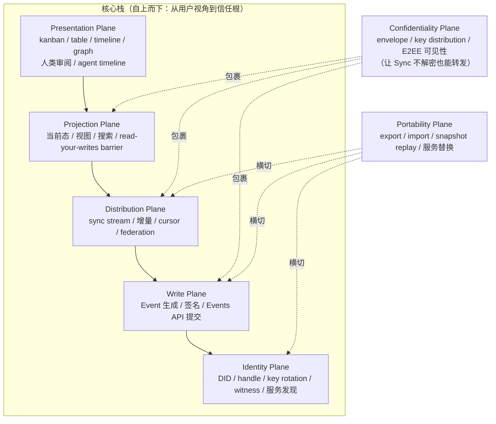
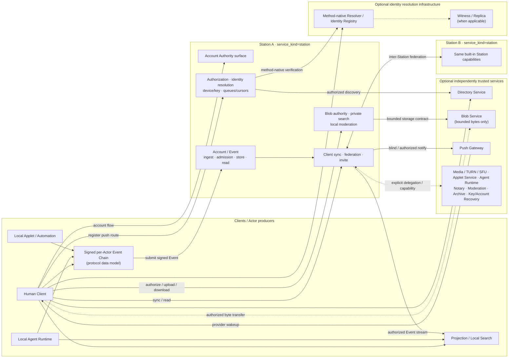

## 0. 规范语言

本文中的规范关键字（**MUST** / **SHOULD** / **MAY** 等）按 [conformance/normative-language.md](../conformance/normative-language.md) 解释；仅大写形式具规范约束力。

## 1. 目标（Goals）

Arkret 的顶层架构要同时满足四件事：

- 去中心化身份与发布
- 多主体协作对象共享
- 对人类友好的工作界面
- 对 AI agent 友好的执行与可审计沉淀模型

这要求协议在一开始就把“身份、写入、传播、展示”和可选查询体验拆成不同平面，而不是把所有能力都塞进一个服务角色里。

## 2. 总体模型

Arkret 采用 **Station + signed Event + identity registry + client-side projection** 的分层模型。

`Station` 是 principal 自己控制或通过 DID / Realm policy 明确委托的服务入口。它可以同机承载 Events API、sync、blob、push、policy 等能力，但协议上仍然把这些能力分层描述。搜索、inbox、notification 和 View projection 默认是客户端或 SDK 的派生能力；若某部署额外提供受托搜索服务，该服务仍是可选扩展，不是协议核心真相源。

Arkret 不设置独立的第三方分发服务器角色。跨主体、跨组织传播通过参与方 Station 之间的同步与联邦完成。

协作数据层使用 Realm 作为复制与授权边界，在 Realm 内直接建模 Circle、Strand、Space、Message 等标准对象；Circle（`ak:circle:`）是 Realm 内的子事件边界（见 §2.0 容器选型），看板与列容器是独立的 Space（`ak:space:`），住在 Realm 内但永远不形成自己的 boundary。Morph 只承担开放扩展对象角色；其可选能力由 Realm schema / Morph profile 显式声明，facets 只是这些声明能力的 hint / 查询标签。Morph 不得作为绕过已注册标准对象 kind、capability 与 reducer 规则的 catch-all 容器。

### 2.0 容器选型参考（Container Selection Reference）

Arkret 定义四种"包含 / 边界"语义对象：Realm、Circle、Space、Strand。

本节的"判定顺序"是容器选型的唯一 normative 总入口。`overview/current-model.md` 与 `models/overview.md` 只作为读者导览引用本节与各对象专属文件，不重复承载容器升级 / 降级规则。

*Table 2-1. 容器对象按使用场景索引（informative）。*

| 使用场景 | 推荐对象 | 关键边界属性 |
| --- | --- | --- |
| 共享 federation / identity、capability registry、Realm-default E2EE group | `ak:realm:`（独立或加入既有） | federation / identity boundary；持有 membership 主源、capability registry、Realm-default MLS group |
| Realm 内子集成员 + 独立 history / 投递 / 查询裁剪，复用父 Realm federation / policy / capability registry；必要时独立 MLS group | `ak:circle:`，对象通过 `scope_circle_id` 引用 | intra-Realm scoped event boundary；不持有 federation identity；约束 `Circle.members ⊆ Realm.members` |
| Realm 内导航 / 排序 / 结构分组（board / list / folder / project / swimlane / calendar bucket 等） | `ak:space:`，`kind` 表 board / list / folder / project / ... | authorization-transparent 容器；自身不持有 membership / key；`Space.scope_circle_id` 仅决定 Space metadata effective scope，不构成独立 Realm 边界 |
| Realm 内带 stage / state / fields / track 时间线的协作单元（task / decision / incident / channel 等） | `ak:strand:` | Realm 内协作主体；整 Strand 单一 effective scope（由 `Strand.scope_circle_id` 决定，`null` = Realm-default，否则指向 Circle） |
| 客户端导航整洁化（"软隐藏一组 Realm"） | （不新建容器）使用 View / Space hierarchy / Realm linking | Realm 间无树形包含关系，仅有 link graph；产品层"我的工作区"为 client-side 概念 |

判定顺序（normative）：

1. 实现 MUST 先确认是否需要独立的 federation / policy / capability registry 边界；仅在此情形升级到独立 `ak:realm:`。
2. Realm 内若需要独立 membership、history visibility、投递 / 查询裁剪或独立 MLS group，MUST 使用 `ak:circle:`，对象通过 `scope_circle_id` 引用。
3. 仅用于导航 / 结构分组的容器 MUST 使用 `ak:space:`，MUST NOT 借此获得 membership 或安全边界。
4. 带协作语义的最小单元 MUST 使用 `ak:strand:`。
5. 协议演化引入新容器型概念前 MUST 先证明无法分解为以上四类；governance 层若批准新增，须在 [proposals/](../../proposals/) 留档。

子资源 scope 继承（`child_scope_policy`）取值、冲突解析，以及 `Space.scope_circle_id` 与 `realm_id` 同时存在时的优先级，权威定义见 [`models/circle.md`](../models/circle.md)（`child_scope_policy` 与 scope 解析优先级）；overview 不重复承载该解析规则。

详细字段定义见 [`models/realm-and-space.md`](../models/realm-and-space.md)、[`models/circle.md`](../models/circle.md)、[`models/space-hierarchy.md`](../models/space-hierarchy.md)、[`models/realm-links.md`](../models/realm-links.md) 与 [`models/strand-and-message.md`](../models/strand-and-message.md)。

### 2.1 Organization / Realm 边界

组织在 Arkret 中首先表现为 **Organization principal**，通常由组织 DID 标识，而不是直接表现为 Realm。

Organization principal 可以：

- 签发组织成员资格、组织角色、handle 绑定等 credential
- 控制 Station、Applet、Realtime Media Services 等 service DID
- 作为 Realm owner、policy issuer、trusted issuer 或 capability issuer
- 托管多个 Realm，或与其他组织共同治理同一个 Realm

Realm 则是协作数据边界。它定义 membership、capability scope、schema、policy、history visibility、replication 和 E2EE group。一个组织 MAY 创建或拥有多个 Realm；一个 Realm MAY 由多个组织共同治理；用户也 MAY 创建不属于任何组织的个人或临时 Realm。

因此实现 MUST NOT 以 `realm_id` 代替组织身份，也 MUST NOT 仅凭用户在某 Realm 内的 membership 推断其属于某组织。组织身份和成员资格应通过组织 DID 签发的 claim / VC / attestation、Realm policy 中列出的 trusted issuer、或 governance registry 中的组织记录证明。

### 2.2 Per-Actor Event Chain

Arkret v1 的协议一等概念是 **signed Event** 与 **per-actor event chain**，不是任何形式的内容仓库或公开发布记录。每个 actor 通过自己签名的 Event Envelope、`actor_id`、`actor_seq` 和 `prev_refs` 形成可验证 event chain。

它承担：

- actor 侧可验证发布
- 历史追溯
- 设备离线后重传
- 审计基线

Arkret 记录的是 **协作 Event**——授权状态、协作事实、E2EE handshake、审计摘要——而非面向公开内容分发的 record 集。是否把 event chain 物化成仓库、append-only log、Merkle tree 或对象存储，完全是实现选择，协议不规定。

Event chain 可以由以下形态承载：

- 用户设备上的本地 append-only log。
- Station 内置的 Event 存储实现与 `/_arkret/self/events/*` surface。
- 多个受控 storage replica 保存的只读副本。
- Station 在 DID Document 中声明的服务 endpoint。

Event 的实际存储形态由实现决定：可以是数据库表、对象存储中的 Event blob、文件系统 append-only log、Merkle log、content-addressed block store，或这些形式的组合。协议只要求它能稳定输出 canonical Event bytes、hash、签名、frontier、cursor 和 proof material。

Event 的权威来自 actor/device/service 对 Event 的签名、DID 控制链、`actor_seq` 路径递增约束、`prev_refs` 因果链和 `event_id` 幂等性，而不是来自托管它的 Station。Station 可以拒绝服务、延迟同步或丢失副本，但不能替 principal 伪造有效写入。

### 2.3 Station

Station 是 principal 的受控服务边界。它负责承载或代理：

- Event 的提交、读取、回填与复制
- Realm 范围的增量同步、回补与订阅
- blob、push、policy、device message 等辅助服务
- 与其他 Station 的 federation transaction

Station 不是身份本身，也不能替 principal 伪造 Event，**更不是协议的唯一真相源**：共享状态的真相来自 signed Event 与 per-actor event chain（见 §2.2、§6.2），Station 可拒绝服务、延迟同步或丢失副本，但不能替 principal 伪造有效写入。它的权威来自 DID Document、service delegation、Realm policy、capability 和签名事件。

明文规则：

- 非 E2EE / 非内容加密的私有内容 MUST NOT 提交给未被发送方、接收方或 Realm policy 明确委托的第三方服务。
- 如果 Realm 声明了 shared notary / Station sync surface，该服务必须是 Realm policy 中显式列出的受信 Station 或组织服务 DID。
- 客户端在发送非加密内容前 MUST 校验目标服务器是否属于本 principal 控制、对方 principal 控制，或 Realm policy 明确委托。
- Realm member identity 由完整 ActorId 决定；目标 Station 从其 account 分支派生，endpoint 另走标准 service resolution。DID Document 不补齐账号身份或 membership route。
- 私有正文、附件预览、全文索引、通知摘要、embedding 与可逆派生摘要的受托服务可见边界，由 [`sync/service-surface.md` §5.4](../sync/service-surface.md) 的 `plaintext_visible_services` 权威规则定义；本节只记录该边界属于 Realm policy，而不重复条目 schema 与授权事件。
- 接收方 Station 对非加密内容是可见方；这属于用户或组织控制边界的一部分，不应被描述成透明转发层。
- public plaintext Realm 必须同时看四个独立信号：`discoverability` 是否公开可发现、`join_rule` 是否可公开加入、`history_access` 是否世界可读、`encryption_profile` 是否未加密；任一项 MUST NOT 自动推导其它项。history snippet / public export 还必须受 `ak.realm.preview_policy` 或等价 export policy 约束；若 Realm 未声明 `preview_policy`，缺省 MUST fail closed（不暴露任何 history snippet / export），MUST NOT 因 `history_access=all_history_for_current_members` 而自动放行。`preview_policy` 取值与缺省规则的权威源见 [`governance/history-visibility.md`](../governance/history-visibility.md)。
- 未受信的第三方服务只能接收公开内容、密文 envelope 或不可解析 payload。

### 2.4 Client Query / Projection

客户端或 SDK 可以把已同步、已授权、已解密的 Event 集合物化成当前态、搜索索引、inbox、notification 和 View projection。这些都是本地派生体验，不是协议必需服务面。

协议只约束以下边界：

- View 是可同步的投影定义，不拥有被投影对象的事实。
- 查询、搜索和 projection MUST NOT 绕过 Realm policy、`allowed_tracks` action scope、history visibility、E2EE 可见性或 capability。`allowed_tracks` 只在已有 Realm / capability 授权内缩小 track 范围，不是独立 track-level ACL。
- 任何受托 search / projection 服务若接收私有明文、正文摘要、embedding、通知摘要或可逆派生内容，MUST 被 Realm policy 列入 `plaintext_visible_services`。
- 派生输出 MUST NOT 成为唯一真相源；缓存丢失后必须能从 signed Event、reducer profile、View definition 和 causal frontier 重新计算。

### 2.5 Blob Store

Blob Store 提供附件、大对象和可选 snapshot chunk 的内容存储。

Blob 地址可以多源，校验应基于内容哈希而不是单一 URL。

### 2.6 Authz / Policy 角色

Authz / Policy 是一组逻辑职责，不是独立的 service role 专名。Station 根据 accepted capability 与 policy state 执行本地 precheck 和 reducer 校验；授权服务面以 [`sync/service-surface.md` §2.5](../sync/service-surface.md) 与 [`sync/service-http-binding.md` §2.1](../sync/service-http-binding.md) 为准。

这些职责包括：

- 发布授权策略
- 响应 grant / revoke / delegate 相关查询
- 为 Events API / sync / projection executor 提供可缓存的授权依据

### 2.7 Client / Agent

Arkret 的 client 不只包括 GUI 应用，也包括：

- CLI
- webhook worker
- CI agent
- autonomous agent
- background automation

协议必须把 agent 当作一等参与者，而不是 UI 里的“插件”。

### 2.8 Station 部署形态

Arkret 的协议文档按“服务角色”定义能力；实际落地时可以把多个角色合并在同一进程、同一域名或同一节点中。合并部署 MUST NOT 改变各角色的安全边界：每个 `ServiceDescribe` 只描述一个逻辑角色；共享 public binding 的多个角色必须通过 `GET /_arkret/describe?service_kind=<registered-id>` 分别返回 role-scoped describe，使 service DID、`service_kind`、capability、Realm policy、plaintext visibility、`supported_operation_bundles` 和 endpoint 契约仍可逐角色验证。

面向用户和运维文档时，也应直接使用 **Station**。不同部署层级的差异由 deployment profile、内置或拆分的服务角色、委托来源、公共基础设施依赖、合规和明文边界要求表达。

部署 profile 与服务角色契约的权威定义：

- 部署 profile（包括 `personal_node` / `small_team` / `organization` / `high_security_organization` / `isolated_sovereign_network` / `sovereign_deployment` 等，非穷尽列举）：完整 deployment profile 集合以 [`artifacts/profiles/conformance-profiles.json`](../../artifacts/profiles/conformance-profiles.json) 的 `deployment_profiles` 为准。
- 服务角色与 `service_kind` / 真相源 / 明文边界矩阵：informative 一览见 [`sync/service-surface.md` §2.5](../sync/service-surface.md)；`service_kind` 机读真源见 [`artifacts/registry/service-kind-registry.json`](../../artifacts/registry/service-kind-registry.json)、namespace canonical 见 [`sync/service-http-binding.md` §2.1](../sync/service-http-binding.md)。
- 高安全自建网络的额外约束：见 [`sync/sovereign-deployment.md`](../sync/sovereign-deployment.md)。

本节只保留无法机器化的信任边界叙述、最小拓扑示意和 identity resolver 的部署常识；任何"哪种规模需要哪些服务"的列举请直接读上面三处源。

最小个人或小团队部署只要求一个公开业务数据角色：**Station**。Account Authority 是 Station 对客户端发布的账号准入 capability/surface，不是第二个 service role，也没有独立 `service_kind`、service DID、service registration 或 role-local Describe。实现 MAY 在 Station 认证 TCB 内拆分认证进程、数据库或私有 RPC，但这些拓扑对客户端、peer Station、Directory 与 Realm policy 透明。

```text
Station
├─ principal endpoint / event storage
├─ sync / federation endpoint
├─ local policy / blob surface
├─ Account Authority：注册 / 恢复 / session grant
├─ device enroll / pairing / claim attestation
└─ basic app view / inbox
```

Account Authority 为什么**不能**成为可外挂的公开角色：账户注册与恢复、device enroll、claim attestation 与 session lifecycle 都必须和 exact Station-local `AccountId`、设备状态及 durable issuer ledger 共同裁决。Station 可在认证 TCB 内调用独立进程或外部标准 Authentication Method Provider，但 Arkret 客户端只从 Station 根级 Describe 的 `auth_metadata.account_authority.gate_account_base_url` 发现唯一入口；认证方法 provider 的 issuer/discovery metadata 不产生第二个 Arkret 服务身份。

默认仍可使用、且属于低主权风险的公共基础设施（读侧 / 传输侧）：Identity Resolution Infrastructure（DID 解析，只读）、Directory Service、Push Gateway、TURN / Media Relay。普通用户不应被要求单独部署这些或 Moderation Service；搜索、inbox、notification 和 View projection 默认在客户端本地派生。只有身份主权、内网隔离、合规审计、公共网络不可依赖或受控跨组织 federation 场景才应把这些读侧 / 传输侧基础设施也收回自建。

Identity 部署常识（无法在 deployment profile 表中表达）：

- v1 human anchor 闭集为 `did:webvh`、`did:web` 与 `did:key`，默认/MTI 与默认 service DID method 均为 `did:webvh`。`did:web` human anchor 冻结注册时 DNS/WebPKI evidence，`did:key` human anchor 不可变；显式 ephemeral pairwise `did:key` 是另一角色，才受无账号/PCR/设备目录约束。service 可显式使用 no-history `did:web`。deployment profile 只能收紧集合。`did:webvh` hosting 暂不可达时只允许 cache-only degraded mode，MUST NOT live fallback 到 `did:web`。cache-only 的完整阈值与 TTL 耗尽后的 fail-closed 不变量只由 [`identity/identity-did.md` §3.4](../identity/identity-did.md) 定义。
- 服务 DID 默认使用 `did:webvh`（可审计控制历史）；仅低风险或外部互通服务 MAY 显式降级为 no-history `did:web`，且 MUST 在 describe / resolver evidence 中声明无历史信任强度（权威源见 [`identity/identity-did.md` §3](../identity/identity-did.md)）。测试 / bootstrap 可使用 `did:key` 自描述密钥材料；它只有在 minimal-metadata Realm 的显式 profile 下才是短期 pairwise actor。设备自身没有 DID；KERI 等可作为辅助 root / trust binding（interop extension profile）；AT Protocol interop 部署额外挂 `did:plc` adapter（interop extension profile）。
- Station 的内部认证组件与 Identity Resolution Infrastructure 不必同源部署：前者只验证登录因子并向 Account Authority capability 提供认证结果，identity resolver 返回或验证 DID 控制密钥、key state、method history / KERI log 和服务委托；Station policy 再完成账号绑定与授权判定。
- 客户端和服务器必须按本地 trust policy 选择 resolver，MUST NOT 因为 DID 字符串可解析就跳过 method evidence、trust root 和 service delegation 校验；私有部署 MAY 只允许 allowlist 中的 resolver trust domain。

某个节点实际支持哪些服务，必须通过 DID Document service entry、`GET /_arkret/describe`、`supported_operation_bundles`、conformance profile 和 Realm policy 共同声明。

## 3. 架构平面（Architectural Planes）

架构按职责分层为 5 个核心平面与 2 个横切关注点。核心栈包含 Presentation、Projection、Distribution、Write、Identity；Confidentiality 与 Portability 是横切关注点，不计入核心栈层级。

> **规范力说明**：本节（§3 及各子节）的平面划分、职责描述与图示均为 **informative**，用于说明架构分层意图，不单独承载机器可校验的约束。各平面涉及的实质 normative 字段约束、授权过滤与查询行为以对应专门文档为权威源——尤其 Projection / 查询的可解析输出与授权过滤规则见 [`conformance/query-schema.md` §8-§9](../conformance/query-schema.md)。本节文字与上述 normative 文档冲突时以后者为准。

*Figure 3-1. 架构平面分层（informative）。*



规范要点（_informative_）：

- Presentation 永远消费 Projection 的输出，不持有真相副本；Projection 永远是派生层，可重算。
- Confidentiality 是包裹层，决定 Distribution / Write / Projection 各自能看到什么；Station sync surface 不解密正文也能继续转发。
- Portability 在 export / import 时把多个平面的状态打包并重放，是协议平面而不是部署细节。

### 3.1 Identity Plane

负责：

- DID 解析
- Handle 解析
- 服务发现
- key rotation / recovery
- DID 日志写入与复制
- registry / witness / replica 协调

### 3.2 Write Plane

负责：

- 生成 Event
- 签名
- 发布到 Events API

### 3.3 Distribution Plane

负责：

- sync stream
- realm 增量同步
- 去重与 cursor

### 3.4 Projection Plane

负责：

- 当前态查询
- 视图查询
- 搜索
- **因果一致性屏障 (Causal Barrier)**：客户端或可选受托服务在返回查询结果前，可根据本地 sync frontier 等待特定写入前沿的到达，保障“读己之所写”体验。

Projection Plane 的输出是机器可解析的数据结构（例如 JSON 对象、cursor 列表、聚合统计），不依赖 Presentation Plane 的渲染逻辑；该输出形态的权威 normative 约束（response 结构、`basis` / `frontier` / `grade`）见 [`conformance/query-schema.md` §8](../conformance/query-schema.md)，授权过滤与不绕过 Realm policy / history visibility / E2EE 可见性的 normative 规则见 [同文 §9](../conformance/query-schema.md)。本子节的描述为 informative，字段约束以该锚点为准。Local Query 是 Projection Plane 的职责之一，不是独立平面。

### 3.5 Presentation Plane

负责：

- kanban/list/table/calendar/timeline/graph/activity
- 人类审阅队列
- agent protocol session timeline

Presentation Plane 消费 Projection Plane 的输出，产生人类或 agent 可交互的渲染结果。Presentation 不持有对象状态的唯一副本（派生输出不得成为唯一真相源的 normative 约束见 §6.3 与 [`conformance/query-schema.md` §9](../conformance/query-schema.md)）；对象能力来自对象类型、schema/profile 和 capability，facets 只作为已声明能力的查询与投影 hint。

### 3.6 Confidentiality Plane

负责：

- 可见性与密文负载区分
- 内容加密 envelope
- key distribution / rotation
- 让 Station sync surface 在不解密正文时也能继续转发
- 决定 Distribution / Write / Projection 各平面分别能看到什么（与图 3-1 的"包裹"关系一致）：Projection 只能投影本端已授权解密的内容，Confidentiality 同样约束 Projection 层的可见边界，而不仅是 Distribution 转发层

### 3.7 Portability Plane

负责：

- export / import
- snapshot + Event replay
- service replacement
- 多 Station / 受托 search service 迁移

## 4. 部署拓扑

Arkret 不要求所有角色分离部署。

### 4.0 通用网络拓扑（General Network Topology）

*Figure 4-1. 通用网络拓扑（informative）。*



规范要点（_informative_）：

- Station 是核心 wire role；Account/Event、Account Authority、client sync/federation/invite、Authz、device/key、queue/cursor、Blob authority、私有搜索和本地 moderation 都是其内置 capability/surface，不产生额外 `service_kind`。这些能力可以拆成内部进程，但拆分对协议参与方透明。
- Signed per-Actor Event Chain 是协议数据模型，不是独立网络服务。客户端向自己的 Station 提交签名 Event；Station 完成准入、存储和读取，并通过 inter-Station federation 交换已接受材料。
- DID Document 是 method-native 解析结果；Resolver、Identity Registry、Witness 或 Replica 只有在形成独立可寻址、签名或信任边界时才作为基础设施出现。它们不替代 Station 的账号与 Event authority。
- Search / View projection 默认在客户端本地派生；Directory Service 是可选的公共或授权发现层，不能替代签名 Event 和 reducer。
- Blob authorization、metadata、retention policy 与引用关系由 Station 判定；可选 Blob Service 只按绑定 contract 执行 bytes storage/delivery。客户端不得把可达 Blob URL 当作读取授权。
- Push route 向账号所属 Station 注册，由 Station sync surface 或 Realm policy 明确授权的通知服务调用 Push Gateway；Push Gateway 不持有 Station 业务数据 authority。
- Directory、Blob、Push、Media、TURN/SFU、Applet、Agent、外部 Moderation、Archive 与 Recovery 等角色只有在实际形成独立 service DID、endpoint、委托、签名、明文/密钥可见性或 normative authority 边界时才进入 discovery；同机部署不消除这些边界。

### 4.1 单人/小团队拓扑

同一个部署可同时承载：

- identity registry
- events
- Station sync surface
- blob

适合：

- 小团队
- 私有实验环境
- 单组织内部部署

### 4.2 多组织协作拓扑

常见模式是：

- 每个组织维护自己的受控 Station / Event store
- 每个组织或可信运营方运行自己的 Station
- 参与方 Station 通过 federation transaction 交换 Realm 相关 Event
- 各参与方客户端基于自身授权范围生成本地视图，或显式使用受托 search / projection 扩展
- Realm policy 明确列出共同治理的 organization DID、trusted issuer 和 service DID

这种模式更接近跨企业交付与供应链协作。

### 4.3 Agent 优先拓扑

在 agent 密集场景中，常见模式是：

- user/organization DID 作为 authority
- agent DID 拥有受限 capability
- agent 的结果和审计摘要写成 agent 签名 Event
- agent 的 Station 将这些 Event 同步到 Collaboration Realm（参见 [`models/realm-and-space.md` §2.8](../models/realm-and-space.md)）
- 客户端或受托 projection 扩展生成 human review queue

### 4.4 Sovereign / High-Assurance 拓扑

高安全组织 MAY 运行 sovereign deployment，即由组织或联盟控制 identity registry、events、sync、directory、blob、media service、applet runtime 和 agent runtime。

该拓扑默认关闭公共 federation 和公共 directory，只允许 allowlist service DID 与受控客户端接入。

Sovereign deployment 不排斥跨组织协作。组织 MAY 创建 **External Collaboration Realm**，只向经过验证的外部人员或组织开放特定 Realm，而不是开放整个内部网络。Realm 角色分类（Internal / External Collaboration Realm、Principal Control Realm）见 [`models/realm-and-space.md` §2.8](../models/realm-and-space.md)；sovereign deployment 对 External Collaboration Realm 施加的强制 policy 见 [`sync/sovereign-deployment.md` §4](../sync/sovereign-deployment.md)。

在 sovereign deployment 下，External Collaboration Realm SHOULD：

- 使用 `discoverability=unlisted`、`invite_only` 或 `secret`。
- 使用 `join_rule=restricted` 或 `knock_restricted`。
- 通过 Organization DID、external organization DID、claim / VC 和 admin approval 验证外部主体。
- 使用 E2EE，并只向批准设备发送 MLS Welcome。
- 使用独立 Station / directory / blob enclave，避免外部主体获得主网络目录或服务拓扑。
- 对 Applet、Agent handoff、media recording、export、bulk download 默认 deny，按 capability 显式授权。

详细规则见 [`sync/sovereign-deployment.md`](../sync/sovereign-deployment.md)。

## 5. 核心架构取向

Arkret 固定以下架构取向：

- realm-first
- object-first
- event-first
- collaboration-first

这意味着：

- 房间不是唯一世界模型
- 消息也不是唯一原子单元
- UI 不需要从聊天历史里推业务状态
- 协议直接允许 Strand、Realm、Message、Morph 和 Relation 成为一等对象

## 6. 信任边界

本节中的“信任”只表示某一方被协议指定为某类结论的裁决者，不表示该方善意、永不失效或被授予其它权限。认证服务身份、信任其特定 operation 的结果、相信某个用户、允许读取明文和接受某个 Event 是彼此独立的判断。共享同一 principal、Station、Realm、组织或网络位置，均不得自动合并这些判断。

### 6.0 参与方关系矩阵

| 关系 | 协议允许依赖的结论 | 仍须由消费方独立完成 | 不提供的保证与残余风险 |
| --- | --- | --- | --- |
| 用户设备 ↔ 自己 Station | 建立账号会话前，客户端先固定预期 Station 身份与认证绑定；会话建立后，普通客户端信任该 Station 对本次完整 AccountId、operation、Realm/scope、对象和观察坐标给出的治理接纳、当前授权及 signer 结果。精确结果合同见 [`sync/server-trusted-results.md` §1–§2](../sync/server-trusted-results.md#1-信任方与角色)。 | 客户端核对响应与请求、账号、scope、basis、对象和待签字节的绑定；保管设备私钥；验证实际 Event/内容签名、MLS、附件、备份和设备带外信任；签名前核对用户意图。 | Station 可拒绝、延迟、遗漏或回滚服务视图，并可对自己负责的服务器验证结果撒谎或 equivocate；base v1 普通客户端不通过完整治理重放独立发现这类谎言。Station 仍不能生成它不持有密钥的有效用户/设备签名，也不能仅凭服务器身份解密端到端密文。独立检测恶意自己 Station 需要另行部署审计者、witness 或高保证 profile，不能由普通结果消费流程暗示。 |
| 同一用户的不同设备 | PCR 中已接受且 current generation 为 active 的设备授权，只证明该设备当前可代表相应 Account 执行已授予动作；用户完成带外验证后，客户端可另行记录设备信任。 | 每台设备证明私钥持有；新设备按授权链与 generation 接纳；设备密钥变化、撤销、fence 和带外验证状态分别处理；端到端秘密只经已登记的配对、加密 to-device、backup 或 recovery 流程传递。 | 同属一个 principal 或 Account 不等于设备彼此可信，不允许自动复制私钥、MLS state 或“已验证”标记。一个被攻陷的已授权设备可在其 capability 内作恶，吊销不能追回其已经看见的明文或旧 epoch 密钥。权威规则见 [`crypto-media/device-lifecycle.md` §5–§10](../crypto-media/device-lifecycle.md#5-device-authorization-chain)。 |
| 同一 Station 的不同用户 | 各用户分别信任该 Station 对自己已认证 Account 会话给出的 scoped 结果；Station 可执行本地接纳、投递和授权检查。 | 用户之间仍按完整 ActorId、Event proof、capability、membership、MLS sender 与内容认证互相验证；服务端必须执行账号和 Realm 隔离。 | 共用 Station 不建立用户间信任、联系人关系、membership、读取权或设备信任。Station 被攻陷可能同时影响多个本地账号的可用性、元数据和服务器结果；未加密或 policy 明确委托的明文也在其可见边界内。 |
| 同一 principal 在不同 Station 的 Account | 每个完整 AccountId 都是独立账号与信任上下文；只有显式、已验证的绑定或协议事件才能建立它们之间的关系。 | 分别认证 Station、会话、设备 generation、ActorId 与 operation scope；跨站引用不得丢弃 `station_id` 或只按 principal DID 合并。 | 相同 principal 分量不证明两个 Account、设备集合、消息队列、push target、权限或历史相同，也不授权一个 Station 代表另一 Station。 |
| 跨 Station 用户 | 用户可依赖自己的 Station 已验证并按本次 operation 返回的远端治理、设备或 signer 结果；共享事实仍以签名 Event、Seal、membership/capability 和端到端密码学为准。 | 客户端核对完整双方 AccountId/ActorId、Realm/scope、实际 producer 签名、MLS/内容绑定和 freshness；远端取材由自己 Station 走 peer 面完成，客户端不向远端 Station 交付自己的 SessionGrant/DPoP。 | 用户不因 federation、同 Realm 或对方 Station 的自报 verified 状态而直接信任对方。远端 Station 的已签 attestation 提供归责，不在密码学上阻止其为自己的账号发布虚假服务器断言；恶意源还可 withholding、选择性转发或提供不完整观察。 |
| Station ↔ Station | 没有默认互信。接收 Station 只在本地 peer policy、Realm 业务授权和请求级认证全部通过后，接受某个有界 federation transaction。 | 接收方独立验证 service DID/method evidence、delegation/endpoint、HTTP message signature、双方 service/trust-domain、body digest、replay/freshness、Event proof、capability、Seal/basis 和目标绑定。 | allowlist、TLS、可解析 DID、有效服务签名或已知 peer 只证明相应层的身份/准入，不证明业务授权、内容真实、历史完整或对方善意。current-v1 不证明从未观察到的 Event 不存在，也不阻止 source withholding；见 [`sync/federation.md` §2–§3](../sync/federation.md#2-设计原则)。 |
| 同一 Realm/Circle 的用户或 Agent | accepted membership 与 capability 只证明主体可在相应 effective scope 内执行特定动作；MLS membership 证明相应 epoch 的密码学参与资格。 | 每个接收方继续验证 Event、授权状态、scope、MLS epoch/sender、内容 schema，并把不可信内容当作潜在恶意输入。 | 共处 Realm/Circle 不建立人际信任、设备信任或内容真实性的额外保证。E2EE 防止未持钥服务读取正文，不阻止合法成员泄露已解密内容、提交恶意内容或观察其有权看到的元数据。 |
| 客户端/Station ↔ Directory、Push、Blob、Media、Projection、Applet 等第三方服务 | 只依赖 DID/service delegation、Realm policy、operation contract 和 `plaintext_visible_services` 明确授予的最小职责。 | 调用方验证服务身份、用途、audience、scope、输入/输出绑定、有效期、内容 hash/AEAD 与撤销状态；不能把服务自报 verified 当作授权。 | 被委托一种职责不获得其它职责；传输密文不等于可见明文，获准看明文也不等于能代签、决定 membership 或成为真相源。第三方仍可拒绝服务、记录其可见元数据或在权限范围内返回错误结果。 |

矩阵中的“自己 Station”始终指当前完整 AccountId 的 `station_id` 所标识、在会话建立前已经固定身份且由当前认证上下文调用的 Station；不是当前 URL、Directory 搜索结果、远端 Realm 服务、同 principal 的另一 Station 或任意能返回相似 JSON 的服务。服务器可信结果只替代客户端侧的治理闭包验证工作，不替代服务器首次接纳远端材料时的验证，也不替代端到端客户端职责。

### 6.1 Event Chain 可证明 actor 发过什么

Event chain 能证明：

- 哪个 principal 发布了哪些 Event
- Event 的签名、`actor_seq` 和 `prev_refs` 是否成立
- 顺序与签名是否成立

Event chain 不能单方面定义共享 realm 的最终当前态。

### 6.2 Station 可提供同步，但不应重写历史

Station 可以：

- 缓存
- 排序
- 去重
- 按 cursor 订阅输出
- 与其他 Station 交换 federation transaction

Station 不可以：

- 伪造 actor Event
- 静默删除仍然有效的历史 Event
- 把未授权明文内容发送给未被 principal 或 Realm policy 委托的第三方服务。常见受托服务（Push、Blob preview、Policy preview、search / projection）是否可见私有明文，以 §2.3 的 `plaintext_visible_services` 规则为准。

上述“不可以”是合规 Station 的规范义务，不是客户端已获得的恶意 Station 检测保证。actor/device 签名使 Station 无法把自己构造的不同 bytes 冒充为该签名者的有效 Event；但 Station 仍可能 withholding、回放陈旧视图、对自己签署的 admission/治理结果作虚假陈述，或向不同观察者给出矛盾结果。普通客户端按 §6.0 信任自己 Station 的 scoped 服务器结果并保留端到端校验；接收远端材料的服务器和独立审计者不得套用该客户端信任捷径。

### 6.3 Projection 可解释状态，但不应替代原始审计链

客户端本地 projection 或受托 search / projection 服务可以：

- 给出当前态
- 提供搜索
- 给出看板/列表/图投影
- 依据 barrier `cursor` 提供强一致性屏障（read-your-writes）

这些派生输出不能作为唯一可验证来源。

### 6.4 Capability 是共享状态合法性的裁判，不是 UI 假设

是否允许某个写入，必须由有效 grant 集决定，而不是：

- 某客户端里当前看起来像管理员
- 某个服务器本地的隐式角色表

### 6.5 物理隔离与跨域限制

Realm 构成了协作图的硬性隔离边界：
- 节点在处理深度 Graph / Space-hierarchy 查询（即 View.kind=`graph` 投影或跨 Space 层级遍历）时，遇到跨 Realm 引用必须截断返回惰性链接 (Lazy Link)，MUST NOT 越权自动化拼接外部图谱。
- 跨组织的级联图谱展示必须由拥有多域权限的客户端发起多次请求主动合成。

### 6.6 边界穿越的强制复核项

任何新 operation、证据载体、缓存、代理或服务拆分一旦跨过上述边界，设计评审 MUST 明确回答以下问题；不能只写“trusted”“verified”或“secure”：

1. **主体与角色**：谁产生事实、谁传输、谁接纳、谁消费、谁独立审计；程序部署在同一进程不合并逻辑角色。
2. **精确身份与上下文**：使用完整 AccountId/ActorId、service DID、Realm/effective scope、operation、对象、audience、basis/epoch/generation 中哪些字段绑定结论；不得用裸 principal、URL、域名或显示名补足缺失身份。
3. **信任依据与验证者**：结论来自用户/设备签名、service attestation、DID method evidence、capability/Seal、MLS/AEAD、Realm policy 还是本地 operator policy；在哪个边界首次验证，后续复用如何证明来源未变。
4. **时间与状态**：freshness、expiry、replay、幂等、撤销、key rotation、leave/rejoin、fork/recovery 和缓存失效如何处理；历史有效不能自动推导当前授权。
5. **数据暴露**：各方可见正文、密钥、身份、关系图和流量元数据中的哪些部分；最小披露、不可枚举失败和日志/审计保留如何约束。
6. **失败语义**：不存在、不可见、未验证、依赖不可用、pending、conflict 与有效空结果是否可区分且不会被错误降级；网络成功、服务器接纳、治理 finality、业务完成和端到端可解密不得合并成一个“成功”。
7. **残余风险**：明确哪些攻击被密码学阻止，哪些只有可归责证据，哪些只能由 policy/审计缓解，哪些仍允许拒绝服务、withholding、equivocation、合法成员泄露或已授权端点作恶。

若一项设计不能给出上述答案，应先补充所属领域 prose 与 conformance 场景，再增加 wire 字段或交互轮次；不得用未定义的“信任服务”、客户端完整历史重放或把所有参与方放进同一 TCB 来掩盖边界。

## 7. AI 与人类共用同一协议

Arkret 不打算做“两套系统”：

- 一套给人类看板
- 一套给 agent 上下文

相反，协议应该保证：

- AI 写入的对象能被人类审阅
- 人类创建的对象能被 AI 理解和引用
- 卡片型 Strand、Message、Relation 和其他 Morph 对象可以互相链接
- 所有沉淀都能投影成可操作界面

因此协议**不**定义统一的 agent memory subsystem。Agent 的运行时上下文（prompt、scratchpad、向量索引、缓存等）由各 agent runtime 自行管理，协议不约束其形式。协议只负责两件事：

- **可审计长期沉淀**：agent 需要跨会话保留的结论、决策、研究、代码或报告 SHOULD 写成 agent 签名的 Event，落到 Strand / Message / Morph / Blob，进入 Realm 账本，与人类协作沉淀共用同一份事实层。
- **受控外部知识访问**：agent 可读取的 Realm、对象或派生摘要 MUST 通过显式的 capability grant 声明 `scope`、`visibility` 与 retention 约束，受 capability 与 Realm policy 约束。

这里"可审计长期沉淀"用 SHOULD，只约束**是否选择把某条沉淀落账**;它与下文 agent 署名的 MUST 相互独立——"沉淀可选"**不蕴含**"署名可选"。一旦选择以 Event 落账(尤其代表人类写入共享对象),署名规则即无条件适用:

Agent 写入 Event 的可审计署名由 Event Envelope 的规范字段承担，权威定义见 [`../models/event-and-patch.md`](../models/event-and-patch.md):agent 以自身身份写入时 `actor_id` 即 agent principal,reducer stamp `actor_kind="agent"` projection;agent 代表 controller 写入(act-on-behalf)时 MUST 同时携带 `executed_by`(agent principal)与 `authorization_ref`(覆盖该动作的 grant / approval 引用),receiver MUST 校验 proof `verification_method` 解析到 `executed_by`。缺少上述署名字段的 agent-signed write MUST 被视为 `schema_violation` 或 `capability_denied`，MUST NOT 把它伪装成人类直接写入。v1 不定义独立的 `agent_context` wire 对象；运行时上下文(prompt、tool session、model 版本等)属于 agent runtime 本地信息，若需向部署留痕，使用 actor-private Account Data 或部署本地审计设施。

这意味着不存在协议层面的"agent 私有记忆库"。任何需要被审阅、引用或撤回的 agent 记忆都必须以标准对象形式落账；不需要被审阅的运行时状态留在 agent runtime 内部，不进入协议视野。

## 8. 架构决定

Arkret v1 固定以下方向：

- signed Event Envelope 和 per-actor event chain 是 actor 发布基线
- identity registry / witness 是 DID 文档的解析与写入层
- Station / Station sync surface 是受控同步与联邦层
- search / View projection 默认是客户端本地派生体验；受托搜索服务只能作为可选扩展
- blob 是独立内容层
- capability 是独立决策层
- agent 输出通过 Message、卡片型 Strand、Morph、Relation 或 agent protocol session event 成为可审计协议事实
- 同一数据既服务人类 UI，也服务 agent 上下文
- confidentiality 与 portability 也是明确协议平面，而不是部署细节

## 9. 可落地性要求

Arkret v1 不允许实现用单一聚合服务隐藏已声明的 Station / Directory / Blob / Media / Applet 等协议边界。任何声称支持 `ak.profile.station.v1` 或 `ak.profile.full_client.v1` 的实现 MUST 满足以下要求：

- Event digest、event-batch receipt digest、签名绑定、HLC 和 cursor 行为按 `encoding.md` 与 `conformance-vectors.md` 执行。
- Client sync、subscribe、backfill、snapshot frontier 和 read-your-writes barrier 按 `client-sync.md`、`operations-sync.md`、`conformance-vectors.md` 与 `service-surface.md` 执行。
- Search / View projection 若对外暴露可互操作语义，按 `query-schema.md`、`views.md` 和 `service-surface.md` 执行；结果必须能追溯到 signed Event、reducer profile 和 causal frontier。
- Capability cache 只能作为优化。缓存命中必须绑定 causal frontier、grant / revoke / claim 状态和 policy version；上下文缺失、过期或发生分叉时 MUST fail closed 或重新执行完整 authz。
- 多 Station 或受托 search / projection 服务并存时，客户端 MUST 比较 DID service delegation、Realm policy、frontier、snapshot hash、reducer profile 和 plaintext visibility 后再选用服务。
- 加密 envelope、Station device/key surface、MLS KeyPackage、Welcome、epoch backfill 和 key backup 按 `encryption-and-audit.md`、`device-lifecycle.md`、`key-management.md` 与 `media-and-blob.md` 执行。
- Export / import MUST 以 snapshot manifest、state hash、chunk digest、Event replay 和 policy / redaction metadata 为边界；导入端 MUST NOT 仅信任外部 projection 或 search dump。
