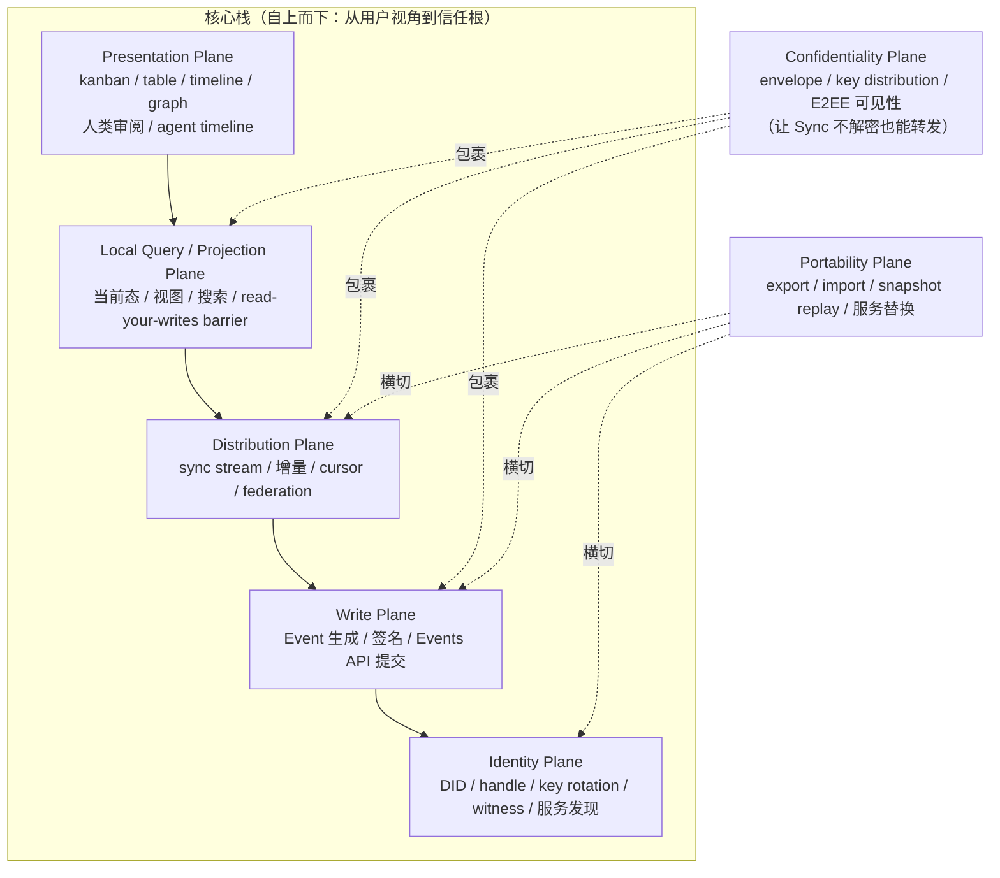
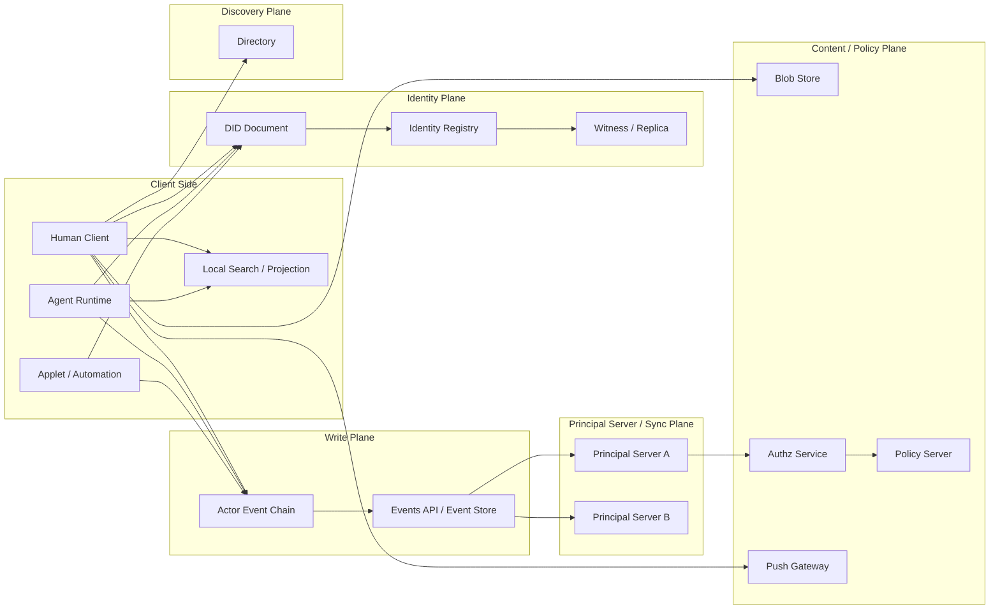

## 1. 目标

Contrix 的顶层架构要同时满足四件事：

- 去中心化身份与发布
- 多主体协作对象共享
- 对人类友好的工作界面
- 对 AI agent 友好的执行与可审计沉淀模型

这要求协议在一开始就把“身份、写入、传播、展示”和可选查询体验拆成不同平面，而不是把所有能力都塞进一个服务角色里。

## 2. 总体模型

Contrix 采用 **principal server + signed Event + identity registry + client-side projection** 的分层模型。

`Principal Server` 是 principal 自己控制或通过 DID / Realm policy 明确委托的服务入口。它可以同机承载 Events API、sync、blob、push、policy 等能力，但协议上仍然把这些能力分层描述。搜索、inbox、notification 和 View projection 默认是客户端或 SDK 的派生能力；若某部署额外提供受托搜索服务，该服务仍是可选扩展，不是协议核心真相源。

Contrix 不设置独立的第三方分发服务器角色。跨主体、跨组织传播通过参与方 Principal Server 之间的同步与联邦完成。

协作数据层使用 Realm 作为复制与授权边界，在 Realm 内直接建模 Flow、Space、Message 等标准对象；看板与列容器是独立的 Space（`cx:space:`），住在 Realm 内但永远不形成自己的 boundary。Morph 只承担开放扩展对象角色；其可选能力由 Realm schema / Morph profile 显式声明，facets 只是这些声明能力的 hint / 查询标签。Morph 不是替代所有标准对象的万能容器。

### 2.0 容器选型速查（Realm vs Circle vs Space vs Flow）

Contrix 有四种"包含 / 边界"语义。决定使用哪一个的速查表（normative reference）：

| 你的诉求 | 选哪个 | 一句话理由 |
| --- | --- | --- |
| 共享 federation/identity、policy server、capability registry、Realm-default E2EE group | **Realm**（独立 Realm 或加入既有 Realm） | Realm 承担 federation/identity boundary；持有 membership 主源、policy server、capability registry、Realm-default MLS group。 |
| 在已有 Realm 内做**密码学子圈**（独立 MLS group / 子集成员 / 独立 history），但共享 federation / policy / capability registry | **Circle**（`cx:circle:`），对象 `scope_ref` 引用 | Circle 是 Realm 内的密码学子边界；不持有 federation identity 或 policy server；`Circle.members ⊆ Realm.members`。详见 [`../models/circle.md`](../models/circle.md)。 |
| 在已有 Realm 内做"看板 / 列 / 文件夹 / swimlane / calendar bucket"等**结构分组**，让用户在 UI 中导航和排序 | **Space**（`cx:space:`，`kind` 表 board/list/folder/project/...） | Space 是 "authorization-transparent" 容器：自身不持有 membership / key，只承载导航与分类。`Space.scope_ref` 仅决定 Space 自身 metadata 的加密 scope，不让 Space 成为安全边界。 |
| 在同一个 Realm 内做"协作单元"（任务、文档、会话、工单），需要带 stage / state / fields / track 时间线 | **Flow** | Flow 是 Realm 内的协作主体；整 Flow 单一加密 scope（由 `Flow.scope_ref` 决定，null = Realm-default，否则指向 Circle）。 |
| 想"软隐藏一组 Realm 让导航更整洁" | **不要新建容器**：在客户端用 View / Space hierarchy / Realm linking 处理 | Realm 之间不形成树形包含关系（只有 link graph）；用户层的"我的工作区"完全是 client-side 概念。 |

判断规则 MUST 按上表顺序:**只有跨 federation/policy/capability registry 边界才升级到独立 Realm**;Realm 内的密码学子圈用 Circle;纯导航/结构分组用 Space;协作单元用 Flow。新增容器型概念 MUST 先验证是否可以分解为以上四种已有形态；不得自行造第五类。

> **v1 设计变更**：早期版本曾在本表中列出 `Flow + discussion_realm_ref 指向 linked Realm` 作为第五类，让一个 Flow 跨两个 Realm 存在。该模式与字段已通过 CXP-0007 彻底删除；"宽 synthesis + 窄 discussion" 改用两个 Flow + `confidential_discussion_of` Relation 表达（见 [`../models/circle.md` §7.2](../models/circle.md)）。

详细字段见 [`../models/realm-and-space.md`](../models/realm-and-space.md)、[`../models/circle.md`](../models/circle.md)、[`../models/space-hierarchy.md`](../models/space-hierarchy.md)、[`../models/realm-links.md`](../models/realm-links.md) 和 [`../models/flow-and-message.md`](../models/flow-and-message.md)。

### 2.1 Organization / Realm 边界

组织在 Contrix 中首先表现为 **Organization principal**，通常由组织 DID 标识，而不是直接表现为 Realm。

Organization principal 可以：

- 签发组织成员资格、组织角色、handle 绑定等 credential
- 控制 Principal Server、Policy Server、Applet、Media Service 等 service DID
- 作为 Realm owner、policy issuer、trusted issuer 或 capability issuer
- 托管多个 Realm，或与其他组织共同治理同一个 Realm

Realm 则是协作数据边界。它定义 membership、capability scope、schema、policy、history visibility、replication 和 E2EE group。一个组织 MAY 创建或拥有多个 Realm；一个 Realm MAY 由多个组织共同治理；用户也 MAY 创建不属于任何组织的个人或临时 Realm。

因此实现 MUST NOT 以 `realm_id` 代替组织身份，也 MUST NOT 仅凭用户在某 Realm 内的 membership 推断其属于某组织。组织身份和成员资格应通过组织 DID 签发的 claim / VC / attestation、Realm policy 中列出的 trusted issuer、或 governance registry 中的组织记录证明。

### 2.2 Per-Actor Event Chain

Contrix v1 的协议一等概念是 **signed Event** 与 **per-actor event chain**，不是任何形式的内容仓库或公开发布记录。每个 actor 通过自己签名的 Event Envelope、`actor_id`、`actor_seq` 和 `prev_refs` 形成可验证 event chain。

它承担：

- actor 侧可验证发布
- 历史追溯
- 设备离线后重传
- 审计基线

Contrix 记录的是 **协作 Event**——授权状态、协作事实、E2EE handshake、审计摘要——而非面向公开内容分发的 record 集。是否把 event chain 物化成仓库、append-only log、Merkle tree 或对象存储,完全是实现选择,协议不规定。

Event chain 可以由以下形态承载：

- 用户设备上的本地 append-only log。
- Principal Server 内置的 event store 与 `/events/*` API。
- 多个受控 storage replica 保存的只读副本。
- Principal Server 在 DID Document 中声明的服务 endpoint。

Event 的实际存储形态由实现决定：可以是数据库表、对象存储中的 Event blob、文件系统 append-only log、Merkle log、content-addressed block store，或这些形式的组合。协议只要求它能稳定输出 canonical Event bytes、hash、签名、frontier、cursor 和 proof material。

Event 的权威来自 actor/device/service 对 Event 的签名、DID 控制链、`actor_seq` 路径递增约束、`prev_refs` 因果链和 `event_id` 幂等性，而不是来自托管它的 Principal Server。Principal Server 可以拒绝服务、延迟同步或丢失副本，但不能替 principal 伪造有效写入。

### 2.3 Principal Server

Principal Server 是 principal 的受控服务边界。它负责承载或代理：

- Event 的提交、读取、回填与复制
- Realm 范围的增量同步、回补与订阅
- blob、push、policy、device message 等辅助服务
- 与其他 Principal Server 的 federation transaction

Principal Server 不是身份本身，也不能替 principal 伪造 Event。它的权威来自 DID Document、service delegation、Realm policy、capability 和签名事件。

明文规则：

- 非 E2EE / 非内容加密的私有内容 MUST NOT 提交给未被发送方、接收方或 Realm policy 明确委托的第三方服务。
- 如果 Realm 声明了 shared anchorer / sync service，该服务必须是 Realm policy 中显式列出的受信 Principal Server 或组织服务 DID。
- 客户端在发送非加密内容前 MUST 校验目标服务器是否属于本 principal 控制、对方 principal 控制，或 Realm policy 明确委托。
- Realm 内成员的投递目标由该成员的 effective `delivery_binding.recipient_service_did` 决定；DID Document 中的默认 Principal Server 只可在 join / rebind 时作为 Realm policy 明确允许的 `did_document_default` 物化来源，binding accepted 之后不得再作为投递 fallback。组织 Principal Server 上存在同一 DID 的内部账号，不自动获得该 DID 的其它 Realm 或个人上下文投递权。
- 凡会接收或保存私有正文、附件预览、全文索引、通知摘要、embedding、可逆派生摘要的服务，都必须在 Realm policy 中声明为 `plaintext_visible_services`。
- `plaintext_visible_services` 条目 MUST 声明机器可校验的 `data_classes[]`（例如 `message_body`、`attachment_preview`、`full_text_index`、`embedding`、`notification_summary`、`media_plaintext`）和 `visibility`；自由文本 `purposes` 只用于解释，不得单独作为明文授权依据。
- 修改 `plaintext_visible_services` 的事件必须经 `cx.realm.plaintext_visible_services` 授权；普通 `cx.realm.update` 或服务自声明不得隐式扩大明文可见边界。
- 接收方 Principal Server 对非加密内容是可见方；这属于用户或组织控制边界的一部分，不应被描述成透明转发层。
- 未受信的第三方服务只能接收公开内容、密文 envelope 或不可解析 payload。

### 2.4 Client Query / Projection

客户端或 SDK 可以把已同步、已授权、已解密的 Event 集合物化成当前态、搜索索引、inbox、notification 和 View projection。这些都是本地派生体验，不是协议必需服务面。

协议只约束以下边界：

- View 是可同步的投影定义，不拥有被投影对象的事实。
- 查询、搜索和 projection 不得绕过 Realm policy、`allowed_tracks` action scope、history visibility、E2EE 可见性或 capability。`allowed_tracks` 只在已有 Realm / capability 授权内缩小 track 范围，不是独立 track-level ACL。
- 任何受托 search / projection 服务若接收私有明文、正文摘要、embedding、通知摘要或可逆派生内容，MUST 被 Realm policy 列入 `plaintext_visible_services`。
- 派生输出不得成为唯一真相源；缓存丢失后必须能从 signed Event、reducer profile、View definition 和 causal frontier 重新计算。

### 2.5 Blob Store

Blob Store 提供附件、大对象和可选 snapshot chunk 的内容存储。

Blob 地址可以多源，校验应基于内容哈希而不是单一 URL。

### 2.6 Capability Authority

Capability Authority 是一个逻辑角色，不要求独立部署。

它负责：

- 发布授权策略
- 响应 grant / revoke / delegate 相关查询
- 为 Events API / sync / projection executor 提供可缓存的授权依据

### 2.7 Client / Agent

Contrix 的 client 不只包括 GUI 应用，也包括：

- CLI
- webhook worker
- CI agent
- autonomous agent
- background automation

协议必须把 agent 当作一等参与者，而不是 UI 里的“插件”。

### 2.8 Principal Server 部署形态

Contrix 的协议文档按“服务角色”定义能力；实际落地时可以把多个角色合并在同一进程、同一域名或同一节点中。合并部署不得改变各角色的安全边界：service DID、`service_type`、capability、Realm policy、plaintext visibility 和 endpoint 契约仍必须可区分。

面向用户和运维文档时，也应直接使用 **Principal Server**。不同部署层级的差异由 deployment profile、内置或拆分的服务角色、委托来源、公共基础设施依赖、合规和明文边界要求表达。

部署 profile 与服务角色契约的权威定义：

- 部署 profile（`personal_node` / `small_team` / `organization` / `high_security_organization` / `isolated_sovereign_network` / `sovereign_deployment`）：见 [`artifacts/profiles/conformance-profiles.json`](../../artifacts/profiles/conformance-profiles.json) `deployment_profiles`。
- 服务角色与 `service_type` / 真相源 / 明文边界矩阵：见 [`sync/service-surface.md` §2.5](../sync/service-surface.md)。
- 高安全自建网络的额外约束：见 [`sync/sovereign-deployment.md`](../sync/sovereign-deployment.md)。

本节只保留无法机器化的信任边界叙述、最小拓扑示意和 identity resolver 的部署常识；任何"哪种规模需要哪些服务"的列举请直接读上面三处源。

最小个人或小团队部署只有一个 Principal Server：

```text
Principal Server
├─ principal endpoint
├─ event storage
├─ sync / federation endpoint
├─ local policy
├─ blob storage
└─ basic app view / inbox
```

默认可使用的公共基础设施：Identity Resolver、Directory Server、Push Gateway、TURN / Media Relay。普通用户不应被要求单独部署 Directory、Push、Identity Resolution Infrastructure、TURN / Media Relay 或 Moderation / Compliance；搜索、inbox、notification 和 View projection 默认在客户端本地派生。只有身份主权、内网隔离、合规审计、公共网络不可依赖或受控跨组织 federation 场景才应把这些基础设施收回自建。

Identity 部署常识（无法在 deployment profile 表中表达）：

- v1 core 默认 principal DID method 为 `did:webvh`：`did.jsonl` 历史链 + SCID + witness 提供可审计 DID 控制历史。无域名用户的 `did.jsonl` 由 Auth/Account Server 在自有子域代为托管。`did:web`（无历史链）只能作为 service DID 默认 method 与 `personal_node` profile 的可选 principal method；`did:webvh` hosting 暂不可达时只允许 cache-only degraded mode，禁止 live `did:web` fallback。
- 服务 DID 使用 `did:web`；临时 / 测试 / 设备 / bootstrap 使用 `did:key`；KERI 部署使用 `did:keri`（interop extension profile）；AT Protocol interop 部署额外挂 `did:plc` adapter（interop extension profile）。
- Auth / Account Server 与 Identity Resolution Infrastructure 不必同源部署：登录服务器证明"这个服务账户 / 设备当前绑定到哪个 DID"，identity resolver 返回或验证该 DID 的控制密钥、key state、method history / KERI log 和服务委托；组织 Policy / Authz 再决定授权。
- 客户端和服务器必须按本地 trust policy 选择 resolver，不能因为 DID 字符串可解析就跳过 method evidence、trust root 和 service delegation 校验；私有部署 MAY 只允许 allowlist 中的 resolver trust domain。

某个节点实际支持哪些服务，必须通过 DID Document service entry、`GET /api/v1/server/describe`、`supported_operations`、conformance profile 和 Realm policy 共同声明。

## 3. 架构平面

七个平面按职责分层：Identity / Write / Distribution / Local Query / Presentation 形成自下而上的核心栈，Confidentiality 与 Portability 是横切关注点。



读图要点：

- Presentation 永远消费 Projection 的输出，不持有真相副本；Projection 永远是派生层，可重算。
- Confidentiality 是包裹层，决定 Distribution / Write / Projection 各自能看到什么；Sync Service 不解密正文也能继续转发。
- Portability 在 export / import 时把多个平面的状态打包并重放，是协议平面而不是部署细节。

### 3.1 Identity Plane

负责：

- DID 解析
- Handle 解析
- 服务发现
- key rotation / recovery
- DID 日志写入与复制
- registry / witness / replica 协调

### 3.2 Write Plane

负责：

- 生成 Event
- 签名
- 发布到 Events API

### 3.3 Distribution Plane

负责：

- sync stream
- realm 增量同步
- 去重与 cursor

### 3.4 Local Query / Projection Plane

负责：

- 当前态查询
- 视图查询
- 搜索
- **因果一致性屏障 (Causal Barrier)**：客户端或可选受托服务在返回查询结果前，可根据本地 sync frontier 等待特定写入前沿的到达，保障“读己之所写”体验。

Projection Plane 的输出 MUST 是机器可解析的数据结构（例如 JSON 对象、cursor 列表、聚合统计）。Projection MUST NOT 依赖 Presentation Plane 的渲染逻辑。

### 3.5 Presentation Plane

负责：

- kanban/list/table/calendar/timeline/graph/activity
- 人类审阅队列
- agent protocol session timeline

Presentation Plane 消费 Projection Plane 的输出，产生人类或 agent 可交互的渲染结果。Presentation MUST NOT 持有对象状态的唯一副本；对象能力来自对象类型、schema/profile 和 capability，facets 只作为已声明能力的查询与投影 hint。

### 3.6 Confidentiality Plane

负责：

- 可见性与密文负载区分
- 内容加密 envelope
- key distribution / rotation
- 让 Sync Service 在不解密正文时也能继续转发

### 3.7 Portability Plane

负责：

- export / import
- snapshot + Event replay
- service replacement
- 多 Principal Server / 受托 search service 迁移

## 4. 部署拓扑

Contrix 不要求所有角色分离部署。

### 4.0 通用网络拓扑图



要点：

- DID / Registry / Witness 负责身份解析和控制链证明。
- Actor Event Chain 是主体发布日志，Principal Server 提供受控同步、托管和联邦入口。
- Search / View projection 默认在客户端本地派生；Directory 是受授权的发现层，不能替代签名事件和 reducer。
- Blob、Policy、Push 是独立服务平面，可与其他角色同机部署，也可分离部署。

### 4.1 单人/小团队拓扑

同一个部署可同时承载：

- identity registry
- events
- sync service
- blob

适合：

- 小团队
- 私有实验环境
- 单组织内部部署

### 4.2 多组织协作拓扑

常见模式是：

- 每个组织维护自己的受控 Principal Server / Event store
- 每个组织或可信运营方运行自己的 Principal Server / policy server
- 参与方 Principal Server 通过 federation transaction 交换 Realm 相关 Event
- 各参与方客户端基于自身授权范围生成本地视图，或显式使用受托 search / projection 扩展
- Realm policy 明确列出共同治理的 organization DID、trusted issuer 和 service DID

这种模式更接近跨企业交付与供应链协作。

### 4.3 Agent 优先拓扑

在 agent 密集场景中，常见模式是：

- user/org DID 作为 authority
- agent DID 拥有受限 capability
- agent 的结果和审计摘要写成 agent 签名 Event
- agent 的 Principal Server 将这些 Event 同步到协作 Realm
- 客户端或受托 projection 扩展生成 human review queue

### 4.4 Sovereign / High-Assurance 拓扑

高安全组织 MAY 运行 sovereign deployment，即由组织或联盟控制 identity registry、events、sync、directory、blob、policy server、media service、applet runtime 和 agent runtime。

该拓扑默认关闭公共 federation 和公共 directory，只允许 allowlist service DID 与受控客户端接入。

Sovereign deployment 不排斥跨组织协作。组织 MAY 创建 **Controlled Collaboration Realm**，只向经过验证的外部人员或组织开放特定 Realm，而不是开放整个内部网络。

Controlled Collaboration Realm SHOULD：

- 使用 `discoverability=unlisted`、`invite_only` 或 `secret`。
- 使用 `join_rule=restricted` 或 `knock_restricted`。
- 通过 Organization DID、external organization DID、claim / VC、policy server 和 admin approval 验证外部主体。
- 使用 E2EE，并只向批准设备发送 MLS Welcome。
- 使用独立 Principal Server / directory / blob enclave，避免外部主体获得主网络目录或服务拓扑。
- 对 Applet、Agent handoff、media recording、export、bulk download 默认 deny，按 capability 显式授权。

详细规则见 `sovereign-deployment.md`。

## 5. 核心架构取向

Contrix 固定以下架构取向：

- realm-first
- object-first
- event-first
- collaboration-first

这意味着：

- 房间不是唯一世界模型
- 消息也不是唯一原子单元
- UI 不需要从聊天历史里推业务状态
- 协议直接允许 Flow、Realm、Message、Morph 和 Relation 成为一等对象

## 6. 信任边界

### 6.1 Event Chain 可证明 actor 发过什么

Event chain 能证明：

- 哪个 principal 发布了哪些 Event
- Event 的签名、`actor_seq` 和 `prev_refs` 是否成立
- 顺序与签名是否成立

Event chain 不能单方面定义共享 realm 的最终当前态。

### 6.2 Principal Server 可提供同步，但不应重写历史

Principal Server 可以：

- 缓存
- 排序
- 去重
- 按 cursor 订阅输出
- 与其他 Principal Server 交换 federation transaction

Principal Server 不可以：

- 伪造 actor Event
- 静默删除仍然有效的历史 Event
- 把未授权明文内容发送给未被 principal 或 Realm policy 委托的第三方服务
- 把非加密私有内容复制到未声明为 `plaintext_visible_services` 的 Push、Blob preview、Policy preview 或任何受托 search / projection 服务

### 6.3 Projection 可解释状态，但不应替代原始审计链

客户端本地 projection 或受托 search / projection 服务可以：

- 给出当前态
- 提供搜索
- 给出看板/列表/图投影
- 依据 barrier `cursor` 提供强一致性屏障（read-your-writes）

这些派生输出不能作为唯一可验证来源。

### 6.4 Capability 是共享状态合法性的裁判，不是 UI 假设

是否允许某个写入，必须由有效 grant 集决定，而不是：

- 某客户端里当前看起来像管理员
- 某个服务器本地的隐式角色表

### 6.5 物理隔离与跨域限制

Realm 构成了协作图的硬性隔离边界：
- 节点在处理深度 Graph/Tree 查询时，遇到跨 Realm 引用必须截断返回惰性链接 (Lazy Link)，严禁越权自动化拼接外部图谱。
- 跨组织的级联图谱展示必须由拥有多域权限的客户端发起多次请求主动合成。

## 7. AI 与人类共用同一协议

Contrix 不打算做“两套系统”：

- 一套给人类看板
- 一套给 agent 上下文

相反，协议应该保证：

- AI 写入的对象能被人类审阅
- 人类创建的对象能被 AI 理解和引用
- 卡片型 Flow、Message、Relation 和其他 Morph 对象可以互相链接
- 所有沉淀都能投影成可操作界面

因此协议**不**定义统一的 agent memory subsystem。Agent 的运行时上下文（prompt、scratchpad、向量索引、缓存等）由各 agent runtime 自行管理，协议不约束其形式。协议只负责两件事：

- **可审计长期沉淀**：agent 需要跨会话保留的结论、决策、研究、代码或报告 SHOULD 写成 agent 签名的 Event，落到 Flow / Message / Morph / Blob，进入 Realm 账本，与人类协作沉淀共用同一份事实层。
- **受控外部知识访问**：agent 可读取的 Realm、对象或派生摘要 MUST 通过显式的 capability grant 声明 `scope`、`visibility` 与 retention 约束，受 capability 与 Realm policy 约束。

Agent 代表人类或服务写入 Event 时，payload、`unsigned` 或 profile 注册的扩展字段中 MUST 携带可审计 `agent_context`（至少包含 `agent_id`、`operator_or_controller`、`authorization_ref`、`execution_purpose` 和可选 `tool_session_ref` / `model_ref`）。缺少 `agent_context` 的 agent-signed write MUST 被视为 `schema_violation` 或 `capability_denied`，不得把它伪装成人类直接写入。

这意味着不存在协议层面的"agent 私有记忆库"。任何需要被审阅、引用或撤回的 agent 记忆都必须以标准对象形式落账；不需要被审阅的运行时状态留在 agent runtime 内部，不进入协议视野。

## 8. 架构决定

Contrix v1 固定以下方向：

- signed Event Envelope 和 per-actor event chain 是 actor 发布基线
- identity registry / witness 是 DID 文档的解析与写入层
- Principal Server / Sync Service 是受控同步与联邦层
- search / View projection 默认是客户端本地派生体验；受托搜索服务只能作为可选扩展
- blob 是独立内容层
- capability 是独立决策层
- agent 输出通过 Message、卡片型 Flow、Morph、Relation 或 agent protocol session event 成为可审计协议事实
- 同一数据既服务人类 UI，也服务 agent 上下文
- confidentiality 与 portability 也是明确协议平面，而不是部署细节

## 9. 可落地性要求

Contrix v1 不允许实现用单一“万能服务”隐藏协议边界。任何声称支持 `cx.profile.principal_server.v1` 或 `cx.profile.full_client.v1` 的实现 MUST 满足以下要求：

- Event digest、event-batch receipt digest、签名绑定、HLC 和 cursor 行为按 `encoding.md` 与 `conformance-vectors.md` 执行。
- Client sync、subscribe、backfill、snapshot frontier 和 read-your-writes barrier 按 `client-sync.md`、`operations-sync.md`、`conformance-vectors.md` 与 `service-surface.md` 执行。
- Search / View projection 若对外暴露可互操作语义，按 `query-schema.md`、`views.md` 和 `service-surface.md` 执行；结果必须能追溯到 signed Event、reducer profile 和 causal frontier。
- Capability cache 只能作为优化。缓存命中必须绑定 causal frontier、grant / revoke / claim 状态和 policy version；上下文缺失、过期或发生分叉时 MUST fail closed 或重新执行完整 authz。
- 多 Principal Server 或受托 search / projection 服务并存时，客户端 MUST 比较 DID service delegation、Realm policy、frontier、snapshot hash、reducer profile 和 plaintext visibility 后再选用服务。
- 加密 envelope、device / key server、MLS KeyPackage、Welcome、epoch backfill 和 key backup 按 `encryption-and-audit.md`、`device-lifecycle.md`、`key-management.md` 与 `media-and-blob.md` 执行。
- Export / import MUST 以 snapshot manifest、state hash、chunk digest、Event replay 和 policy / redaction metadata 为边界；导入端不得仅信任外部 projection 或 search dump。
