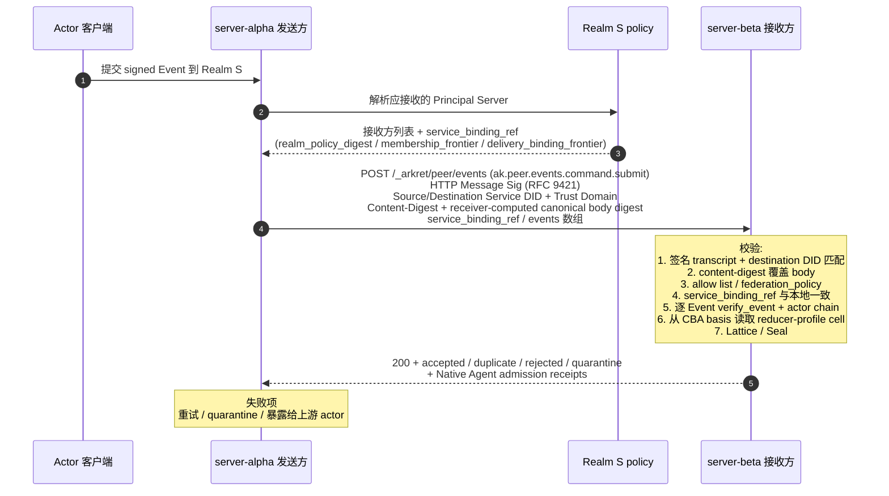

## 0. 规范语言

本文中的规范关键字（**MUST** / **SHOULD** / **MAY** 等）按 [conformance/normative-language.md](../conformance/normative-language.md) 解释；仅大写形式具规范约束力。

## 1. 目标

Arkret 是去中心化协议，不同用户或组织各自运行受控 Principal Server。当来自不同域的 Actor 需要在同一个 Realm 中协作时，Principal Server 之间需要一套**跨域联邦协议 (Federation Protocol)**，定义：

- 节点之间如何互相发现与认证
- 如何安全交换签名 Event Envelope
- 如何处理跨域加入 Realm 的请求
- 如何在异构网络中维持因果一致性

本文 §4 定义联邦 wire transaction 形态；所有联邦 HTTP 绑定以本文和 `service-http-binding.md` / OpenAPI 为准。

## 2. 设计原则

### 2.1 Event Chain 是信任锚点

跨域协作的信任不来自"服务器管理员彼此认识"，而来自**每个 Actor 的 signed Event chain 都是密码学可验证的**。任何节点在接收到来自外部域的 Event Envelope 时，可以独立验证签名、DID、`actor_seq`、`prev_refs` 和授权因果链，不需要信任对方服务器。

### 2.2 Principal Server 是受控同步边界，不是全局权威

联邦场景中没有独立第三方分发服务器角色。Realm 范围传播由参与方 Principal Server 之间的 federation transaction 完成。Principal Server 不能伪造、篡改或选择性隐藏已签名的 Event Envelope；任何参与者都可以通过直接查询源 Events API、witness receipt、snapshot frontier 或其他受信 Principal Server 交叉验证历史。

### 2.3 Seal Finality 优于全局同步共识

跨域网络延迟不可预测。联邦协议不要求所有 Principal Server 同步参与一个全局共识组；每个 Realm 通过 Seal DAG 表达控制面 ordering commitment。`single_signer`（单 did_core actor）、`threshold`（k-of-n actor 委员会）、`open_set`（开放对等）和 `mixed`（含 sovereign fallback）只是 `notary` control cell value 与 Notary profile 的不同配置；详见 §2.4。

### 2.4 Notary Profile 决定控制面 finality

联邦传播按目标 Realm create-locked 的 `notary.kind`（参见 [`../models/realm-and-space.md` §2.3](../models/realm-and-space.md#23-schema-id-与字段)）决定控制面 Seal 的签发方式；DataEvent 仍按签名、`seal_ref` 与 Lattice/CRDT 规则在参与方之间传播：

- **`single_signer`**：单一 did_core actor 的 current authorized verification method 签发 Seal；wire 不把 service DID 或 DID URL 当作 authority member。DataEvent 可由参与方 Principal Server 直接验证并传播；Control Move 由该 actor 的 Seal 覆盖后 `sealed`。
- **`threshold`**：k-of-n committee 签发 Seal。Control Move finality 需要 threshold signature。
- **`open_set`**：多个 federation peer / admin DID 可以签发 Seal leaf。Principal Server 之间 push / pull DataEvent、pending Control Move 与 Seal leaf；查询时使用 deterministic control view join。
- **`mixed`**：正常由主 notary 签发 Seal；主 notary 故障、签发矛盾 Seal 或 notary control cell 变成 `⊥` 时，fallback recovery notary 可以签发恢复 Seal。

跨域 Realm 跨过两个 deployment（A 与 B）时，`notary.kind` 与 genesis notary descriptors 由 Realm create 固定，所有参与 deployment 都按同一 Seal 验证规则处理；不存在 "A 当 hub、B 当 peer mesh" 的分裂状态。

## 3. 节点间认证

### 3.1 基于 core/full DID 的服务器身份与路由

每个 Principal Server / Events API 节点 MUST 拥有一对由注册 method adapter 绑定的身份：业务合同和 `Source-Service-ID` / `Destination-Service-ID` 使用稳定 `did_core_id`；首次注册、control key 与 method history 验证使用完整 bare `full_id`。默认 method 为 `did:webvh`；仅低风险或外部互通服务 MAY 显式降级为 no-history `did:web`，并 MUST 声明无历史信任强度，见 [`../identity/identity-did.md` §3](../identity/identity-did.md)。首次注册 MUST 提交 `full_id`，注册方独立解析并验证其 DID Document，再确认 `project(full_id) == service_id`。

DID Document 仍负责 control key / delegation 证明，但不再充当从 `service_id` 到 HTTP URL 的通用首跳。高频路由使用由 service control identity 签名、可独立验证的 current `ServiceResolutionRecord`：

```json
{
  "record": {
    "service_id": "ak:did_core:webvh:zCXaWSDv1afiBoxDX5sVBU5an",
    "service_kind": "principal_server",
    "full_id": "did:webvh:zCXaWSDv1afiBoxDX5sVBU5an:server.acme.example.com",
    "method_history_head": "QmHistoryHead...",
    "version_id": "1-QmHistoryHead...",
    "resolution_event_ref": "did:webvh-entry:1-QmHistoryHead...",
    "record_sequence": 0,
    "previous_record_digest": null,
    "current_record_url": "https://server.acme.example.com/_arkret/open/services/ak%3Adid_core%3Awebvh%3AzCXaWSDv1afiBoxDX5sVBU5an/resolution",
    "base_url": "https://server.acme.example.com/",
    "describe_digest": "sha256:0123456789abcdef0123456789abcdef0123456789abcdef0123456789abcdef",
    "issued_at": "2026-08-10T00:00:00Z",
    "refresh_after": "2026-08-10T00:05:00Z",
    "expires_at": "2026-08-10T00:10:00Z"
  },
  "proof": {
    "verification_method": "did:webvh:zCXaWSDv1afiBoxDX5sVBU5an:server.acme.example.com#server-key-1",
    "created_at": "2026-08-10T00:00:00Z",
    "jws": "eyJ..."
  }
}
```

完整 record 字段和摘要规则见 [`service-surface.md` §3](./service-surface.md)。发送方从已授权的 member/service binding 取得 inline record 或 current-record URL，独立验证 `full_id`、method history、record proof、freshness 与 core 投影后才使用 `base_url`；随后从该 URL 调用 `/_arkret/describe`，并校验稳定 route-binding projection 的 `describe_digest`。不得只凭域名、URL 或 describe 自声明接受请求。

### 3.2 请求签名

节点间的 HTTP 请求 MUST 使用 [HTTP Message Signatures (RFC 9421)](https://datatracker.ietf.org/doc/html/rfc9421) 进行签名。接收方使用已接受的发送方 current service resolution / key binding 验证请求。路由和 key state MAY 采用有界 TTL cache，但 cache 只是实现优化：record 过期、proof/key 变化、binding rebind、HTTP signature key miss 或高风险 freshness trigger 时必须取得 current record 并重新独立验证；不得从 `did_core_id` 猜测 URL，也不得逐请求无条件解析 method history。

> **PQ-hybrid TLS 联邦姿态**：service-to-service 联邦链路承载的 transaction 元数据多数只靠 TLS 保护，是 Harvest-Now-Decrypt-Later 的暴露面。生产 v1 联邦 TLS 1.3 连接 SHOULD 支持并优先协商混合后量子 group `X25519MLKEM768`（`draft-ietf-tls-ecdhe-mlkem-05`）。在 `ak.profile.high_security_organization.v1`、`ak.profile.sovereign_deployment.v1` 及继承它们的 profile 下，该联邦连接 MUST 协商 `X25519MLKEM768`，对端不提供时 MUST fail closed，MUST NOT 静默降级到纯经典 key exchange。default profile 可按 [`transport-bindings.md` §5](./transport-bindings.md) 的 posture 记录规则回落，但不得宣称该连接具备 HNDL-resistant transport。规范义务的 canonical 表述见 [`transport-bindings.md` §5](./transport-bindings.md)；完整威胁论据见 [`../security/server-threat-model.md` §2.4](../security/server-threat-model.md)。

签名 transcript MUST 覆盖以下 RFC 9421 derived components 与 header 字段：
- `@method`
- `@target-uri`
- `@authority`
- `content-digest`（仅针对有 body 的请求；编码遵循 RFC 9530。无 body 的请求 MUST NOT 携带 `Content-Digest`，`Signature-Input` 也 MUST NOT 绑定 `content-digest`。v1 的 peer surface 中，只有 `GET /_arkret/peer/snapshot/head` 是无 body 请求；`QUERY /_arkret/peer/events` 等一律带 JSON body 并 MUST 绑定 `content-digest`）
- `source-service-id`（自定义 header `Source-Service-ID`）
- `destination-service-id`（自定义 header `Destination-Service-ID`）
- `destination-service-endpoint-digest`（自定义 header `Destination-Service-Endpoint-Digest`；shared ingress / 多租户 / allowlist endpoint 场景必填）
- `source-trust-domain`（自定义 header `Source-Trust-Domain`）
- `destination-trust-domain`（自定义 header `Destination-Trust-Domain`）
- `idempotency-key`（自定义 header `Idempotency-Key`；当该 header 参与幂等或 replay key 时必填并进入签名 transcript）
- 签名 parameters MUST 包含 `created` 与 `expires`（不得用 `Date` header 替代）

**签名时效窗口（normative）**：接收方 MUST 拒绝时效不合规的签名（统一归入本节末"时间窗口失效"的最小披露错误）；以下任一 MUST 拒绝——`expires - created` 超过 300s（协议常量，量级同 [`encoding.md`](../conformance/encoding.md) §7.2 的 `hard_future_skew_ms`）、`created` 偏离接收方本地时钟超过 ±30s（量级同 `expected_future_skew_ms`）、或 `expires` 已过接收方本地时钟。**即便有界 replay cache 已 evict 对应条目，落在该签名时效窗口之外的逐字节重放也 MUST 因 `expires` / `created` 校验失败而被拒**：重放防护的有效期由协议常量界定，不交给发送方可控的 `expires` 值与 replay cache 容量。对不携带 `Idempotency-Key` 的 `POST /_arkret/peer/events` 批次，批次级 replay 防护退化为仅靠该签名时效窗口加单事件 `event_id` 去重兜底，故高价值写路径 SHOULD 携带 `Idempotency-Key`。

签名验证规则：

- body 中的 `origin` / `destination` MUST 与签名 transcript 中的来源 / 目标 service `did_core_id` 一致。
- `Source-Trust-Domain` / `Destination-Trust-Domain` MUST 进入签名 transcript；若 body 或 `service_binding_ref` 中携带来源 / 目标 trust domain，必须与 header 完全一致。
- `destination` MUST 是接收方 service `did_core_id`；反向代理、多租户 host 或 shared ingress 不能只凭 `Host` 判断目的地。
- `Destination-Trust-Domain` MUST 等于接收方当前 deployment 的 `ServiceDescribe.trust_domain`，并与被接收 Realm 的 `trust_domain` 一致；不一致 MUST 归入本节统一最小披露失败族，对外使用同一鉴权失败 envelope，内部 audit-only reason 记为 `federation_trust_domain_mismatch`。
- 接收方 MUST 校验 `Destination-Service-ID` 对应 current `ServiceResolutionRecord.base_url`，并验证 HTTP Message Signature 中的 `@authority` / `@target-uri` host 与该 URL 或 Realm policy 明确授权的 shared ingress 一致；不一致 MUST 归入本节统一最小披露失败族，对外使用同一鉴权失败 envelope，内部 audit-only reason 可记为 `federation_authority_mismatch`。若只绑定 `Destination-Service-ID` 而不校验 `@authority`，同一签名可能被错误投递到另一个虚拟 host。
- shared ingress / 多租户反向代理场景下，TLS Server Name (SNI) 与 current `ServiceResolutionRecord.base_url` origin MUST 直接匹配，或该 exact origin MUST 出现在 Realm policy / service delegation 明确登记的 shared ingress allowlist 中。Wildcard host 不能隐式覆盖 service identity 列表；若 deployment 用同一 host 承载多个 service，发送方 MUST 携带 `Destination-Service-Endpoint-Digest` header（endpoint canonical URL 的 `sha256:` digest），该 header MUST 进入 HTTP Message Signature transcript，接收方 MUST 与 current record / allowlist 中的 endpoint digest 比对。
- 请求带 body 时 MUST 携带 `Content-Digest`；sender MUST 发送 Arkret canonical JSON 作为 exact HTTP message content，receiver MUST 对收到的 exact content bytes 校验唯一 RFC 9530 `sha-256` digest，并拒绝 parse 后再 canonicalize 才匹配的非 canonical wire，完整 byte-level 算法见 [`service-http-binding.md` §2.5.1](./service-http-binding.md)。无 body 的 `GET` pull MUST NOT 携带 `Content-Digest`，`Signature-Input` 也 MUST NOT 绑定 `content-digest`。
- 接收方从已经通过 `Content-Digest` 校验的 exact canonical body bytes 内部计算 Arkret `sha256:<lowercase-hex>`，用于幂等、replay cache 与审计；sender 不再发送第二个等价 `Request-Canonical-Digest` header。无 body 请求不得携带 `Content-Digest`；其查询语义由 method、target、双方 service DID、trust domain 与 endpoint digest 绑定。
- 受保护联邦 endpoint MUST NOT 接受 query string 认证。
- 签名失败、`destination` 不匹配、digest 不匹配或时间窗口失效，接收方 MUST 返回**统一最小披露**错误响应，对外形态在这几类原因之间 MUST NOT 可区分（详见 §8.3）。具体而言：
  - 这几类失败 MUST 复用 `api-conventions.md` 的标准 JSON error envelope，并对所有这几类原因返回**同一个** HTTP status 与**同一个** `reason_code`（使用 `error-code-registry` 中已登记的统一鉴权失败码，如 `capability_denied`；不得为不同失败原因返回不同 status / `reason_code`）。错误 envelope 的可见字段 MUST NOT 携带 Realm、Actor、Event、binding 或 frontier 是否存在的任何可区分信息。
  - 响应 timing MUST 归一到统一时间桶（fixed timing bucket），使「destination 不匹配 / 签名失败」等不同原因之间不产生可被观测的时延侧信道；接收方 MUST NOT 在校验成功路径与上述失败路径之间，或在上述各失败原因之间，泄露可测量的处理时延差异。同桶判定使用与 [`models/relation.md` §4.5](../models/relation.md) 一致的可测口径：同一服务端测量点、同一请求类别、同一部署 profile 下，实现 SHOULD 对每类至少采样 30 次，p95 差异 SHOULD ≤ 50ms；声明高安全 profile 时 MUST 使用 padding / jitter 使 p99 也落入同一 bucket。网络传输时间不计入服务端本地口径。
  - 真实失败原因（audit-only reason）MUST 只写入接收方审计日志，MUST NOT 出现在对外响应的 status、`reason_code`、header、body 或 timing 中。
  - 本要求覆盖联邦 ingress 的存在性枚举面：对外 MUST 保持不可区分「Realm / Actor / Event / member binding 不存在」与「存在但本请求鉴权 / 完整性失败」。

### 3.3 域信任模型

Arkret 不要求全局信任列表。每个节点维护自己的**联邦许可列表 (Federation Allow List)**：

- **开放联邦 (Open)**：接受来自任何域的合法签名请求。适合公共协作场景。
- **受限联邦 (Restricted)**：仅接受来自预配置域列表的请求。适合企业内部或联盟场景。
- **封闭 (Closed)**：不接受任何外部联邦请求。适合纯内部部署。

### 3.4 Federation Peer Policy 与整机级 defederation

服务的联邦准入由三层共同决定，且每层都只能收紧，不能放宽上一层拒绝：

1. **部署本地 peer policy**：operator 配置的 `allow` / `deny` 规则，按 exact service `did_core_id`、trust domain 或 DNS domain 匹配。该策略是本地部署控制面，不进入 Realm Event history。
2. **Realm 授权状态**：effective joined member 的 `delivery_binding.recipient_service_id`、显式 service actor membership、以及对应 capability / policy cell。部署 allowlist、service delegation 或已知 peer 本身不取得 Realm Event。
3. **请求级认证与完整性**：HTTP Message Signature、`Source-Service-ID` / `Destination-Service-ID`、trust domain、endpoint digest、body digest、event signature、capability 与 CBA basis。

部署本地 peer policy 的规则：

- `deny` MUST 先于 `allow` 评估；被 deny 命中的 peer 即使同时命中 allow 也必须拒绝。
- `domain` 规则只匹配规范化 DNS A-label 的完整 label 边界；`*.example.com` 可以匹配 `a.example.com`，不得匹配 `example.com` 或 `badexample.com`。实现 MUST NOT 只做字符串后缀匹配。
- service `did_core_id` 规则优先于 domain 规则；当 current `ServiceResolutionRecord.base_url` host 与 `full_id` method domain 不一致时，接收方 MUST 同时校验 record proof、endpoint digest 和 domain/trust-domain policy。
- 入站被本地 peer policy 拒绝的 service-to-service 请求 MUST 先验证 HTTP Message Signature 能解析到 `Source-Service-ID`、`verification_method` 与 `trust_domain`，再 fail closed；验证失败按认证失败处理，验证成功但命中 peer policy 拒绝时 SHOULD 返回 `policy_denied` 或 `capability_denied`，并避免泄露 Realm 是否存在。
- 出站被本地 peer policy 拒绝的 peer MUST 从 fanout、frontier probe、backfill、push、to-device、key-package 和 media/snapshot fetch 目标集中移除。该状态是 policy-suppressed，不是临时网络失败；发送方不得无限重试，直到 policy version 改变或 operator 解除规则。
- 若 operator 执行整机级 defederation，入站和出站规则 MUST 同时生效：既拒收该 peer 的联邦写入 / backfill / probe，也不得向该 peer 投递新事件、推送或补发历史。

Realm 级 server ACL 的权威表达是 `ak.realm.moderation_policy` 中的 server target（见 [`../governance/content-moderation.md`](../governance/content-moderation.md) §5.3 与 §6），而不是新的 `ak.realm.server_acl` Event kind。`server_acl` 可以作为本地部署配置名存在，但它不得被实现当作可复制的 Realm 状态对象，也不得绕过 `ak.realm.moderation_policy` 和 capability 检查。

出站解析任意 peer endpoint 前，发送方还 MUST 执行 [`api-conventions.md`](./api-conventions.md) §11.2 的出站网络目标策略；DNS、redirect 或 service discovery 把目标解析到被禁止地址类别时，联邦请求必须 fail closed。

## 4. Event 交换协议

### 4.0 单轨联邦接收（唯一互通入口，normative）

跨域联邦接收**收敛为单轨**：`POST /_arkret/peer/events`（`ak.peer.events.command.submit`）是**唯一**的 federation Event 接收轨。所有跨 deployment 的 Event 接收——包括 DataEvent、Control Move（含 Move / Anchor / Seal-bearing 控制面事件）——MUST 统一走该单一 sealed Event Envelope 通道：

- 每条联邦接收的载体都是签名 `ak.schema.event.v1` Event Envelope（DataEvent 携带 `seal_ref`，Control Move 携带 `seal_basis`），由 §3 节点间认证 + §4.1 service binding 快照保护，由接收方按 §4.1.0 独立验证签名 / 因果链 / CBA basis / Seal。不存在第二套按对象类型分轨（如把 Move、Anchor、Operation 拆成不同接收 endpoint）的联邦接收形态。
- **实现私有 peer 入站轨 MUST NOT 作为联邦互通入口**：实现可以在自己的 negative-space root（如 `/_<impl>/peer/...`）下保留部署本地的内部接收 / 调试路径，但这类私有轨 MUST NOT 被任何跨厂商 / 跨 deployment 对端当作联邦投递目标，MUST NOT 接受外部 federation peer 的 Move / Anchor / Operation 推送，也 MUST NOT 在 `GET /_arkret/describe` 的 `supported_operations` 中作为 federation surface 宣告。它们只能降级为**只读调试 / 部署本地内部** affordance，或整体移除；保留时 MUST 在 `profile_limitations()` 等价声明中标注为 deployment-local-only、非互通入口，且 MUST 与 `/_arkret/peer/events` 施加同等或更严的 §3 service-to-service 认证与授权（不得出现"私有轨有 9421 验签、协议轨反而没有"的姿态倒挂——协议轨 `/_arkret/peer/events` 的 §3.2 RFC 9421 service signature 是 MUST，私有轨不得以更弱姿态接收外部流量）。
- 任一对端把实现私有 peer 轨当作联邦投递目标，或任一接收方在私有轨上接受外部 federation 写入，均视为 federation profile violation；跨 deployment 互通声明（`ak.profile.federation_minimal.v1` 等）只覆盖 `/_arkret/peer/*` 协议轨。

> 唯一受 conformance gate 的联邦接收轨是 `/_arkret/peer/events`，其 9421 验签、trust-domain、destination binding、逐 Event CBA reducer 求值与最小披露失败语义均由 §3 / §4.1 强制。

### 4.0.1 MLS-backed Realm 联邦互操作下界（normative）

任一 federation transaction 携带或依赖 `encryption_profile="mls_rfc9420"` 的 Realm 状态、`ak.mls.genesis`、`ak.mls.commit`、`ak.mls.welcome`、MLS-backed E2EE DataEvent 或 active MLS security-frontier projection 时，接收方 MUST 把 [`crypto-media/encryption-and-audit.md`](../crypto-media/encryption-and-audit.md) §2.5 的 `ak.profile.mls_governance_binding.full.v1` 视为 MLS 联邦互操作下界。该下界至少包含：

- `governance_binding.binding_profile` 与 `governance_binding.reducer_profile` 均存在；后者必须等于该制品绑定 frontier 下 Realm reducer-profile cell 的 settled value，并位于验证方的 `supported_reducer_profiles`；
- `ak.mls.commit` 的 MLS GroupContext extensions 中存在固定 codepoint `mls_governance_binding` (`0xF1C0`)，并且 extension bytes、Event payload 与 registered current winning group-state projection 相互匹配；
- `security_frontier_digest` 必须从 accepted key-access state 独立重算；E2EE DataEvent 的 group/epoch 必须指向当前 digest，普通 `seal_ref` 另行按 Event admission 验证；
- peer 的 `ServiceDescribe.supported_profiles` / `supported_features` 声明足以支持该下界；仅支持 payload fallback、替换私用 codepoint 或省略 GroupContext extension 的 peer 不满足下界。

`ak.profile.e2ee_relaxed.v1` 是低于上述下界的显式降级声明，而不是另一个 full binding 等价形态。它只允许在 `federation_policy="closed"` 或满足 `encryption-and-audit.md` §2.4.1 federation guard 的 `restricted` Realm 中跨 peer 传播；`open` / `quarantine` federation MUST reject。restricted federation 中，所有参与 peer 还必须在 describe 中声明 `ak.feature.e2ee_relaxed.v1`，并公开不超过 `relaxed_window_max_ms` 的 fanout SLA；无法证明时接收方 MUST fail closed。

**relaxed peer 集合的可审计登记（normative）**：E2EE 下界判定 MUST NOT 仅挂在"对端自声明 describe + 部署本地 allowlist"两个非 Realm-state、非密码学绑定的输入上——前者是对端单方面可随时变更的 HTTP 响应，后者是 operator 本地配置、不进 Realm Event history、不可被成员密码学审计。因此在 restricted Realm 中参与 `e2ee_relaxed` 密文传播的 peer 集合 MUST 在 Realm policy（可审计 Control Move，如 federation peer 登记事件）中显式登记其 service DID；接收方 MUST 把对端 describe 的 `ak.feature.e2ee_relaxed.v1` 声明与该 Realm-sealed peer 授权**交叉校验**，仅当 service DID 同时出现在 Realm policy 登记集合与 describe 声明中时才接受其为降级密文的合法收发方。仅凭本地 allowlist + describe 自声明 MUST NOT 单独授权 relaxed 传播。

Fail-closed 条件：

- peer 不声明或不支持所需 full / relaxed profile；
- `binding_profile` 缺失、未知、与 Realm policy 不一致，或 full Realm 上出现 relaxed binding；
- `reducer_profile` 缺失，或与该制品绑定 frontier 下的 Realm reducer-profile cell 不一致；
- `0xF1C0` extension 缺失、被其它私用 codepoint 替代、或 extension canonical bytes 与 Event payload 不一致；
- current winning MLS group state 未覆盖最新 key-access security frontier，或把普通 capability/metadata Seal 错误吸收到该 frontier；
- relaxed federation guard 中任一 SLA、窗口或 federation_policy 条件无法证明。

上述失败 MUST 在接收方推进本地 Realm frontier 前处理：写入型 push 返回 reject/quarantine 或 `temporarily_unavailable`，pull/backfill 结果保持未验证，不得清除 `state_mismatch`，snapshot/frontier witness 也不得把该 MLS epoch 标为可用。错误对外仍遵守 §3.2 / §8.3 的最小披露原则；内部 audit reason 可以记录为 `unsupported_profile`、`mls_send_pause_advisory_requires_e2ee_relaxed_profile`、`conflicting_e2ee_profiles`、`e2ee_relaxed_federation_policy_unsupported`、`mls_governance_binding_stale` 或对应 binding mismatch 族。

### 4.0.2 Principal-private peer 投递与 KeyPackage command 不是共享 Event 接收轨（normative）

`/_arkret/peer/invites`（`ak.peer.invites.command.submit`）与 `/_arkret/peer/contacts`（`ak.peer.contacts.command.submit`）是 Principal-private 事实投递面：前者承载目标 holder 的 invite command submit envelope；后者只承载联系人请求 / 响应 / scope replacement / tombstone 的原签名 `ak.contact.*` envelope，用于把 principal-scoped Contact fact 投递到对端 Principal Server。`/_arkret/peer/keys/keypackages/claim` 与 `/_arkret/peer/keys/keypackages/claims/query` 则是目标 KeyPackage authority 的原子 command / outcome-query 面，不承载 Event。三类 surface **MUST NOT** 接受共享 Realm durable Event，**MUST NOT** 推进共享 Realm reducer、Seal、CBA frontier 或 state root，也 **MUST NOT** 被实现当作 `/_arkret/peer/events` 的并行替代 fanout 通道。Direct Conversation 的 binding、Realm、member、Strand 与 MLS Event 只能走 `ak.peer.events.command.submit`——founding 四 Event unit 走 §4.0.4 的 `direct_conversation_founding` branch，其余走通用 branch；`/_arkret/peer/contacts` 不得镜像或夹带 `ak.direct_conversation.bound`；KeyPackage surface 只改变目标 authority 的 KeyPackage lifecycle 与幂等 ledger。

这些 endpoint 仍属于 `/_arkret/peer/*` 联邦协议面，因而 MUST 复用 §3 的 service-to-service HTTP Message Signature、trust-domain、destination binding、body digest、最小披露错误和 replay 防护。invite / contact 接收方只把 payload 投影进目标 holder 的 principal control / account-private 处理路径；KeyPackage authority 还 MUST 执行 [`../crypto-media/device-lifecycle.md` §9.2](../crypto-media/device-lifecycle.md) 的 participant authorization、唯一 CAS、幂等 ledger 与反枚举 gate。任何尝试在这些 endpoint 中夹带共享 Realm Event Envelope 的请求 MUST fail closed（`schema_violation` 或 `capability_denied`，对外仍遵守最小披露）。

### 4.0.3 Signal peer relay 不是 Event federation（normative）

`/_arkret/peer/signal`（`ak.peer.signal.command.relay`）是 `ak.profile.signal_peer_relay.v1` 的可选、
encrypted-only、单跳、best-effort Signal Extension surface。它承载
[`signal.md`](./signal.md) 的原 producer-signed `SignalEnvelope`，MUST NOT：

- 分配 Event ID、推进 `actor_seq` / Realm frontier / Seal / CBA state；
- 写入 durable Event log、backfill、snapshot、range completeness 或 federation ack；
- 复用 `/_arkret/peer/events` 的 transaction/idempotency ledger；
- 解密、重签、改写或重加密 producer envelope；
- 从 destination 再转发第三 peer。

它仍属于 `/_arkret/peer/*` trust surface，MUST 完整复用 §3 的 service DID、trust domain、
endpoint、canonical body digest、HTTP Message Signature 与最小披露错误；该 operation 另外把
`expires-created` 收紧为 5 秒，禁止 `Idempotency-Key`，不确定结果固定
`drop_unconfirmed`。source 必须是每个 sender actor/device 的 current member delivery binding；
destination 只按 outer `scope_ref` 计算本地 eligible devices，精确产品 kind/target 位于 ciphertext，
不得按 kind 广告、路由或返回结果。

schema-valid、已认证 request 即使 Realm/scope/sender 未知、producer proof 或 current member
delivery binding 不成立，或所有 signal 都过期、重复、不可见、policy-denied、没有 local
recipient，也只返回 opaque `{"accepted":true}`；只有外层 peer auth、跨 Realm batch 及
body/schema/count/byte 失败才拒绝。完整 batch、签名窗口、重复/乱序、资源隔离与 conformance
合同以 [`signal.md` §4](./signal.md) 为准。

### 4.0.4 Direct Conversation founding exception（normative）

Direct Conversation Realm 尚不存在时无法取得普通 `federation_peer` authority，因此
[`../identity/contact-and-direct-conversation.md` §5.6](../identity/contact-and-direct-conversation.md)
要求的那条封闭例外在此登记：`ak.peer.events.command.submit` 的 request union MUST 包含 discriminated
branch `DirectConversationFoundingFederationSubmission`（discriminator
`unit_kind="direct_conversation_founding"`）。这不是新 endpoint，也不是私有轨；§4.0 的单轨结论不变。

该 branch MUST 精确承载：

- 恰好四条按 `contact-and-direct-conversation.md` §6.1 wire 顺序排列的 `EventFederationSubmission`
  （`ak.realm.create` → 另一 participant 的 `ak.member.state{join}` → `ak.strand.create`）；
- 一张 source `DirectConversationFoundingAcceptanceReceipt`；
- 验证该 unit 所需的 bounded dependencies（`cba_proof_bundles` 与 Contact round evidence）；四条 Event 都必须携带由其 `principal_server_id` 签发的 in-envelope admission proof，且认证的 `Source-Service-ID` 必须等于该 origin service。

该 branch MUST NOT 携带 `service_binding_ref`：Realm 在接收方尚不存在，普通 Realm-scoped service binding
快照无从计算；destination 绑定改由 §3 的 service DID / trust-domain header 与下述 receipt 校验承担。

接收方每次 MUST 按固定顺序 fresh 验证，任一步失败即整组零写入：

1. §3 的 service-to-service 认证、`Source`/`Destination` service DID 与 trust-domain header 成立；
2. transport source 当前确实承载 `receipt.founder_id`；receipt 由迁移前旧 service 签发时，还 MUST 携带该
   origin service 的可验证 admission proof 与 cutover/fence 连续性证明；
3. `Destination` 承载本地 participant，且该 participant 恰为该 pair 中非 founder 的一方；
4. body 只含该 unit、该 receipt 与 bounded dependencies，无第四条 Event、无其它 Realm 的 Event；
5. 重算 `founding_unit_digest` 并与 `receipt.founding_unit_digest` 逐字比对，重算 `realm_id` /
   `main_strand_id` 并与 receipt 逐字比对；
6. 该 create 通过 `contact-and-direct-conversation.md` §5.4 的全部 admission 校验与 §6.2 的固定 baseline 投影。

该 branch 是 registered atomic unit：Contact round 镜像或其它 bounded dependency 尚未到达时 MUST 返回
top-level HTTP 409 `dependency_missing` 与 `EventsDependencyMissingProblem` 并零写入，随后可重试；
MUST NOT 放行、MUST NOT 永久拒绝、MUST NOT 退化为 per-item partial，也 MUST NOT 只接受其中一或两条 Event。
Realm 在接收方 accepted 后，该 pair 的后续 Event 立即回落普通 federation 规则与普通 batch 分支。

### 4.1 推送模式 (Push)

> **v1 联邦使用专用 peer HTTP API surface**。跨域 Event 推送、拉取、补洞、frontier probe 与 snapshot bootstrap 必须使用 `/_arkret/peer/*` 路径和 `ak.peer.*` operation_id。`/_arkret/self/*` 是当前 principal / 自服务会话攻击面，不承接 federation server-to-server wire。本节描述的所有规则适用于 `ak.peer.events.*` / `ak.peer.snapshot.read.manifest_head` 调用。

本文件中的联邦载荷项是 v1 规范性 Event Envelope。请求与响应体中的共享事实字段使用 `events[]`，不引入第二套 Operation wire object。

当 Actor A（托管在 `server-alpha.com`）向 Realm S 提交了新 Event，而 Realm S 的另一参与方 Principal Server `server-beta.com` 也服务同一个 Realm 时：

1. `server-alpha.com` 检测到新 Event 属于跨域 Realm
2. `server-alpha.com` 从 Realm policy / membership / service delegation 中解析应接收该 Event 的对端 Principal Server，并生成接收方服务绑定快照
3. `server-alpha.com` 向 `server-beta.com` 发送推送请求：

**实时 fanout 的责任与目标集合（normative）**：首次接受本地 Actor 所签 Event 的 Principal Server 是该 Event 实时 push 的唯一编排方；通过 `/_arkret/peer/events` 收到该 Event 的 remote Principal Server MUST 验证、持久化并服务其本地成员，但 MUST NOT 因该次 peer ingress 再创建第二轮实时 fanout。缺失副本通过 frontier probe、pull、backfill 或 snapshot 修复，不能靠接收方无界转广播。

对 Realm 共享 Event，发送方 MUST 从同一 accepted Realm view 取所有 `delivery_status="routable"` 且未撤销的 effective joined member `delivery_binding.recipient_service_id`，排除本机并按 service `did_core_id` 去重。多个成员由同一 remote service 托管时只创建一份 Event transaction。bot、service、notary、archive 或 search projection 若要持有 Realm Event，必须成为显式 joined member/service actor，并受 membership、capability、E2EE 与 plaintext visibility 约束；已知 peer、allowlist、mirror、resolver 或部署拓扑都不自动取得内容。

面向单个成员的 to-device、push、KeyPackage、邀请或其它 direct rail 只使用该成员的 effective delivery binding，MUST NOT 扩张为 Realm fanout。发送方对目标集合中的每个 distinct service MUST 创建独立、持久的 outbox intent；本地 Event 的 accepted 状态、按 service DID 去重后的完整目标集合与全部 outbox intents MUST 在同一 durable transaction 中提交。任一写入失败时整个事务回滚。

目标暂时缺少 verified route **不得**拒绝已经通过 admission 的本地 Event，也不得返回 `service_unavailable` 来撤销本地 acceptance。该目标必须以 `pending_route` 状态原子写入；已有 verified route 但尚未收到 peer 成功响应的目标写为 `pending_delivery`。两种 pending 状态都必须跨重启恢复、按同一 idempotency key 重试，并在超过部署运维阈值后告警；只要冻结的接收 authority 仍有效，就不得因 TTL、尝试次数、dead-letter 上限、cache eviction 或进程重启静默终止义务。

每个 intent 必须冻结使该 distinct service 获得投递 authority 的 exact witness 集：至少包含 Realm、member `did_core_id`、current membership Event ref、current delivery-binding frontier 与 recipient service `did_core_id`。每次真正发送前，发送方必须在当前 accepted Realm view 中逐 witness 复校验同一 member 仍是 effective joined、routable，且 exact membership Event ref、delivery-binding frontier 与 recipient service 均未变化。至少一个冻结 witness 仍成立时目标仍有权接收；全部失效时 intent 原子进入 terminal `cancelled_authority_lost` 且绝不发送。之后相同 member 或 service 重新 join/rebind 会产生新的 Event/frontier，只能影响新 intent，MUST NOT 复活旧 intent。

成功 peer 响应把 intent 置为 terminal `delivered`。`pending_route`、`pending_delivery`、`delivered`、`cancelled_authority_lost` 是 Realm Event fanout 的封闭 target 状态；其中前两者计入 pending，后两者不再欠投递。普通 self submit outcome 只返回汇总 `delivery_state=complete|pending` 与 `pending_delivery_count`，不得泄露 target service。`delivery_state=complete` 当且仅当计数为 0；存在任一 pending intent 时必须返回 `pending`。`accepted` 只表示本地 canonical acceptance，不表示所有 remote target 已交付。

认证调用者通过 `ak.self.events.read.delivery_status` 读取自己可见 Event 的当前 target 状态。响应按 opaque `target_id` 排序并始终返回完整 frozen target set；只有调用者按当前 Realm membership/history/plaintext visibility 规则可读取产生该 target 的 member delivery-binding 时，对应 row 才可携带 `service_id`。未知 Event 与不可见 Event 使用同一 `not_found`，不得通过 target 数量或 service id 枚举隐藏成员拓扑。

```
POST /_arkret/peer/events
Host: server-beta.com
Source-Service-ID: ak:did_core:webvh:z4YZEfM4SYVUdnZbosrGu69JK
Destination-Service-ID: ak:did_core:webvh:z2z1rvs6FuSuJWQcRMn6p8K3m
Destination-Service-Endpoint-Digest: sha256:<hex>
Source-Trust-Domain: ak:trust_domain:did.webvh.alpha.example
Destination-Trust-Domain: ak:trust_domain:did.webvh.beta.example
Content-Digest: sha-256=:<base64>:
Idempotency-Key: <opaque-key>
Signature-Input: sig1=("@method" "@target-uri" "@authority" "content-digest" "source-service-id" "destination-service-id" "destination-service-endpoint-digest" "source-trust-domain" "destination-trust-domain" "idempotency-key");created=...;expires=...
Signature: sig1=:base64...:
```

请求字段（service-to-service 形态）。`service_binding_ref` 是 federation transaction 的请求级元数据，不是独立 durable Event kind；其授权来源只能是 effective joined `ak.member.state.delivery_binding`。

| 字段 | 位置 | 类型 | 必填 | 说明与约束 |
| --- | --- | --- | --- | --- |
| `Source-Service-ID` | header | `did_core_id` | required | 来源 service 稳定身份；与签名 transcript 绑定。 |
| `Destination-Service-ID` | header | `did_core_id` | required | 目标 service 稳定身份；MUST 与 current `ServiceResolutionRecord.base_url`、目标 URL 和 Realm policy 委托一致。 |
| `Destination-Service-Endpoint-Digest` | header | `sha256:<hash>` | conditional | shared ingress / 多租户 / allowlist endpoint 场景 required；endpoint canonical URL 的 digest，MUST 进入签名 transcript，并与独立验证后的 current `ServiceResolutionRecord.base_url` 或 Realm policy allowlist 匹配。 |
| `Source-Trust-Domain` | header | `id:trust_domain` | required | 来源 deployment trust domain；与签名 transcript 绑定，用于 receiver trust policy、审计与跨域 replay 隔离。 |
| `Destination-Trust-Domain` | header | `id:trust_domain` | required | 目标 deployment trust domain；MUST 等于接收方 `ServiceDescribe.trust_domain` 与目标 Realm `trust_domain`。 |
| `Idempotency-Key` | header | `string` | conditional | 当发送方希望请求级幂等、批次 replay key 或 partial retry 去重时 required；该 header MUST 进入 HTTP Message Signature transcript。 |
| `Signature-Input` | header | `string` | required | HTTP Message Signature 输入；MUST 至少绑定 `@method`、`@target-uri`、`@authority`、`source-service-id`、`destination-service-id`、`source-trust-domain`、`destination-trust-domain`，以及 `created` / `expires` 参数。有 body 请求 MUST 额外绑定 `content-digest`；无 body 请求 MUST NOT 绑定它。出现 endpoint digest 或 Idempotency-Key 时也 MUST 绑定对应 header。 |
| `Signature` | header | `string` | required | 来源 service DID 的 HTTP Message Signature。 |
| `Content-Digest` | header | `sha-256=:...:` | conditional | 仅有 body 请求携带（`POST /_arkret/peer/events` required）；MUST 按 [`service-http-binding.md` §2.5.1](./service-http-binding.md) 覆盖 exact canonical HTTP content bytes。接收方 MUST 在 JSON 业务解析与验签前对 exact bytes 重算并校验，且 MUST 拒绝 `sha256=:` alias、非 canonical JSON wire 与 parse-then-canonicalize verification。无 body 的 `GET` pull MUST NOT 携带该 header，`Signature-Input` 也 MUST NOT 绑定 `content-digest`。 |
| `events` | body | `EventFederationSubmission[]` | required | 每项包含完整签名 `event`。普通在线投递必须省略 `authorization_lease` 且 `ingress_receipts[]` 为空；显式离线/延迟投递必须同时携带 lease 与至少一个 lease-bound receipt。Control Move还可携带唯一 `control_proposal_ack` authority set，DataEvent禁止该字段。receiver独立重算 Event digest、当前 admission 与可选离线证据。 |
| `cba_proof_bundles` | body | `CbaProofBundle[]` | optional | 最多 64 个 receiver-relative CBA 依赖 bundle。bundle 可以是有界、完整可验证的超集，不要求字节级最小；每个内含对象独立验签、重算 root 与 reducer，缺项返回精确 missing refs。 |
| `service_binding_ref` | body | `object` | required | 接收方服务绑定快照（v1 联邦特有的请求级元数据；client write 时省略）。 |
| `service_binding_ref.realm_id` | body | `id` | required | 本请求唯一受影响的 Realm；每个 `events[].event.realm_id` 与每个 bundle 中可归属 Realm 的对象 MUST 与其逐字相等。多 Realm 投递 MUST 拆成独立请求。 |
| `service_binding_ref.realm_policy_digest` | body | `sha256:<hash>` | required | 发送方用于判定接收方委托关系的 Realm policy hash。 |
| `service_binding_ref.membership_frontier` | body | `id[]` | required | membership / policy 因果前沿。 |
| `service_binding_ref.delivery_binding_frontier` | body | `id[]` | required | 发送方解析投递目标时所依据的 member delivery binding 因果前沿。接收方 MUST 校验该前沿在自己的 Realm 视图中可达，且对应到当前 effective `delivery_binding.recipient_service_id = Destination-Service-ID`。前沿落后于当前接收方 binding（接收方已收到 rebind handover frontier `F` 而 sender 仍按旧 binding 投递）时，接收方 MUST 返回 `delivery_binding_stale` 并在响应中带回 `new_recipient_service_id` 与 `handover_frontier`，sender 切到新目标后重试。 |
| `service_binding_ref.delivery_binding_diagnostics` | body | `object` | optional | 纯诊断字段。可携带 `basis: ["member_delivery_binding"]` 等本次投递的来源标签，便于排查；不得替代接收方独立校验。 |
| `service_binding_ref.destination_service_kind` | body | `string` | required | 目标服务类型，例如 `principal_server`。 |

Reducer profile 不属于投递关系，因此 `service_binding_ref` 不携带 profile。接收方对每个 Event 独立读取其 CBA governance basis 中的 `ak.component.realm.reducer_profile.v1` cell：DataEvent 使用 `seal_ref` 认证的 joined control state，Control Move 使用 `seal_basis` 的 frozen predecessor `J(L)`。缺少求值依赖返回 `dependency_missing`；cell 为 Bottom 返回 `failed_bottom`；settled profile 本地未实现时返回 `unsupported_profile`。

每个 federation Event 必须原样携带 origin `principal_server_admission` proof。接收方重算 canonical Event digest、exact producer proof digest、producer JWS 与 admission JWS，并要求 admission service 等于 `event.principal_server_id`；Native Agent Event 还必须带 admission proof 已签入的 `producer_signer_resolution_evidence_ref/digest` pair。receiver 只复制并绑定这组 content-addressed selector，不接收内联 device/PCR/Agent signer evidence sidecar，也不得由 receiver 或 relay 重签 origin proof。

### 4.1.0 推送时序

下图把 push transaction 的握手画成时序图。**信任根是签名 Event 本身 + RFC 9421 HTTP Message Signature + 接收方服务绑定快照，不是任何一方服务器的本地数据库。**



读图要点：

- 接收方独立验证每个 Event 的签名与因果链，不信任发送方服务器；服务器之间的握手只是传输面认证。
- 每个 Event 按自己的 CBA governance basis 选择 reducer；同批可以包含 upgrade 及其后继，只要 control-before-data、依赖、Seal 与原子 unit 规则成立。
- 批内单 Event 失败 **不**回滚同批已接受 Event；依赖同批失败项的后续 Event 必须 `dependency_missing` / `causal_conflict` 拒绝或 quarantine。

### 4.1.1 批量推送与幂等

Arkret v1 联邦推送使用 `POST /_arkret/peer/events`（`ak.peer.events.command.submit`）：

- 幂等以 `(Source-Service-ID, Destination-Service-ID, event_id)` 逐事件去重；接收方对重复 `event_id` 且内容一致 MUST 在 `duplicate[]` 中确认（幂等 no-op）而非报错，内容不一致 MUST 以 `duplicate_conflict`（409）拒绝（参见 §4.3）。
- 批次级重放检测使用 receiver 从已验证 exact body bytes 计算的 canonical digest 与签名覆盖的 `Idempotency-Key`；不引入额外 path 事务 ID。
- `quarantine[]` 是 `EventsSubmitOutcome` 的独立响应字段；实现 MUST NOT 把隔离项折叠进 `rejected[]`。非协议 adapter 的本地展示行为不改变 wire outcome。
- receiver 对每个 `accepted[] ∪ duplicate[]` 内的 Native Agent Event MUST 返回一个
  `agent_event_admission_receipts[]` 项。receipt 与 Event durable acceptance 在同一事务写入；exact duplicate 返回
  第一次保存的 byte-identical receipt。rejected、quarantine 与 dependency-missing 项不得签发 receipt。
- source durable outbox 必须先验证 receipt 的 Event/Realm/Agent/method、origin producer evidence pair、receiver service、
  protected `kid` 与 historical receiver key，再原子保存 receipt 和 materialization obligation；在此之前不得把该
  Event/receiver 的历史证据交接标为完成。
- Agent Authority 消费 obligation 时只允许读取 admission proof 指向的 byte-exact original `CurrentAdmission` root，
  复用其 frozen `admission_evidence`，加入 receipt 并签 historical outer；receipt、root、递归 signer dependencies、
  digest CAS 与 selector index 必须原子可见。receiver 与 Authority 的历史 method 都从既有 current signed
  ServiceResolutionRecord carrier 所携完整 WebVH log按 `accepted_at` / 实际 `attested_at` 选择，不新增历史检索 endpoint，
  也不得直接使用 carrier 的 head document。selector tuple 是幂等权威：同 tuple + 同 receipt 在签名前返回已存 root，
  同 tuple 异 receipt/root 为 `duplicate_conflict` 且零覆盖。
  outcome receipt 返回、exact duplicate byte-identical replay 与 source outbox durable handoff 的完整正负矩阵由
  `ak.vector.federation.agent_admission_receipt_handoff.v1` 固化。
- 持续同步、批量重试和 frontier 交换通过组合 `ak.peer.events.command.submit`（推送，本节）、`ak.peer.events.read.scan` / `ak.peer.events.read.resolve`（拉取 / backfill / 补洞，§4.2）与 `ak.peer.events.read.frontier`（§4.5）完成；无需额外的有状态事务 endpoint。

### 4.2 拉取模式 (Pull / Backfill)

当节点发现自己的验证图中存在缺失（`prev_refs` 引用了本地没有的 Event，或 `refs[role=authorized_by]` 所指 grant record 无法从本地 sealed control history 重建）时，可以主动向源 Principal Server 的 peer surface 拉取对应历史。`authorized_by` 仍保留 `ak:grant:` id，不得改写为承载 Event alias；接收方从回填的 control Event 与 Seal 重建 grant record 后继续验证。v1 联邦 Event pull 使用 `ak.peer.events.read.scan`（`QUERY /_arkret/peer/events`），JSON content 的 `before` 表示历史回填（取该 cursor 之前最近一批），认证使用与 §4.1 同一套 service signature header：

```
QUERY /_arkret/peer/events
Content-Type: application/json

{"realms":["ak:realm:..."],"before":"<cursor>","limit":100}
Host: server-alpha.com
Source-Service-ID: ak:did_core:webvh:z2z1rvs6FuSuJWQcRMn6p8K3m
Destination-Service-ID: ak:did_core:webvh:z4YZEfM4SYVUdnZbosrGu69JK
Signature-Input: ...
Signature: ...
```

v1 的 peer pull **只有**这一种带 JSON body 的 `QUERY` 形态，没有无 body 的 `GET` pull。它因此 MUST 携带 `Content-Digest` 并把 `content-digest` 签入 covered components；示例中的 `Signature-Input: ...` 为省略写法，实际 covered components 以 §3.2 为准。

请求字段（query；完整参数集与默认顺序规则见 [`service-http-binding.md` §3.3](./service-http-binding.md)）：

| 字段 | 位置 | 类型 | 必填 | 说明与约束 |
| --- | --- | --- | --- | --- |
| `realms` | query | `id[]` | required | 请求回补的 Realm。 |
| `before` | query | `cursor` | conditional | 取该 cursor *之前*（排除）的最近一批；历史 backfill 主用例。`before` 与 `after` 至少给其一，否则服务端按隐式 `before=<server_head>` 处理。 |
| `after` | query | `cursor` | conditional | 取该 cursor *之后*（排除）的最近一批；catch-up 场景使用。 |
| `order` | query | `enum(default, ascending, descending)` | optional | 联邦 pull 默认沿用 §3.3 "近邻先返回" 规则——仅 `before` 时 descending，仅 `after` 时 ascending；reducer-导向场景显式 `order=ascending`。 |
| `limit` | query | `int` | optional | 返回数量上限；服务端 MUST enforce 最大值（见 [`scalability-constraints.md`](../conformance/scalability-constraints.md)）。 |

响应字段（与 `ak.peer.events.read.scan` 响应同源；`snapshot_bootstrap` 是 optional 加速返回）：

| 字段 | 类型 | 必填 | 说明与约束 |
| --- | --- | --- | --- |
| `events` | `object[]` | required | Event Envelope 数组；每项 MUST 保持原始签名信封。批次内顺序按 `order` 规则与"近邻先返回"默认（[`service-http-binding.md` §3.3.3](./service-http-binding.md)）。 |
| `snapshot_bootstrap` | `object` | optional | 可选的快照加速返回；如有则接收方 MUST 校验签名并验证 frontier 一致性后才可使用。详见 §9.1。 |
| `prev_cursor` | `cursor` | optional | 朝**更旧事件**方向的延续位置；下次请求传入 `before=<prev_cursor>` 继续历史 backfill。 |
| `next_cursor` | `cursor` | optional | 朝**更新事件**方向的延续位置；下次请求传入 `after=<next_cursor>` 继续 catch-up。 |
| `has_more` | `boolean` | required | 是否仍有可拉取的 Event；客户端到达 oldest accessible event 时 `false`。 |

> `snapshot_bootstrap` 字段以 optional 形式出现在 `ak.peer.events.read.scan` 响应中（仅 Realm policy 显式允许时）。若接收方需要直接按 event id / digest 补洞，必须使用 `QUERY /_arkret/peer/events/resolve`（`ak.peer.events.read.resolve`），不得改用 self surface。

**Pull 授权 freshness（normative，与 §8.5.1 互补）**：§8.5.1 处理的是 push 路径——把 service key state 一起进入 idempotency cache key，从而在 cache hit 时仍重做授权检查；而 pull 路径根本**不进幂等缓存**：无 body 的 `GET` pull 省略 `Content-Digest`（§3.2），因此不像 push 那样把 receiver-computed canonical body digest 纳入幂等缓存键。两条路径用**不同机制**关闭同一个"撤销后重放"窗口（push 靠 cache-key 绑定 + cache hit 重校验，pull 靠每次请求强制重新解析 service binding freshness），互为补充而非镜像对称。每次 pull 请求，接收方（被拉取的源服务）MUST 在返回事件前重新解析并校验请求方 `Source-Service-ID` 的 service binding freshness——当前 `verification_method` 仍 active、未 revoke，且该 source 在目标 Realm policy 下仍持有 `federation_peer` 角色——并 MUST NOT 因 `(Source-Service-ID, query)` 命中任何幂等 / 响应缓存而豁免该重新授权检查。请求方 service key 已 revoke 或 service binding 已被 Realm policy 移除时，MUST 返回 `capability_denied` / `policy_denied`，不得从缓存回放历史事件批次给已失权的 puller。

`snapshot_bootstrap` 字段（存在时）：

| 字段 | 类型 | 必填 | 说明与约束 |
| --- | --- | --- | --- |
| `snapshot_ref` | `id` | optional | 外部快照指针，MUST 等于 Snapshot manifest 的 `id`。 |
| `state_digest` | `string` | optional | 快照状态根，必须与快照 frontier 对应。 |
| `snapshot_frontier` | `id[]` | optional | 需要从该 frontier 之后开始增量回放。 |
| `signature` | `object` | optional | 标准 Snapshot detached proof；接收方 MUST 验证该 proof 覆盖的 manifest `id` 与本对象的 `snapshot_ref` 相等。 |
| `signature.verification_method` | `string` | optional | 用于信任锚点的 DID verification method。 |
| `signature.alg` | `string` | optional | 签名算法。 |
| `signature.jws` | `string` | optional | detached JWS。 |

### 4.3 重复与幂等

- 同一个 `event_id` 的 Event MAY 被多个 Principal Server 推送多次
- 接收方 MUST 以 `event_id` 去重
- 内容相同的重复推送 MUST 幂等接受
- `event_id` 相同但内容不同的推送 MUST 以 `duplicate_conflict`（HTTP 409 / conflict-class reason）拒绝，与 [operations-sync.md](./operations-sync.md) §12 一致；不得退化为 `causal_conflict` / `state_mismatch`

### 4.4 Capability Revoke Fanout

`ak.capability.revoke`、superseding grant、membership removal、ban、device/session revoke 和会使既有 allow cache 失效的 policy change 是高优先级 auth state。源 Principal Server 在接受这类 Event 后，MUST 主动推送给所有当前已知的相关 Principal Server，而不是只等待对端下一次 pull：

- fanout 目标包括 Realm policy / membership / service delegation 中声明的 shared notary / Principal Server sync surface、受影响 subject 的 Principal Server、grant issuer / delegatee 所在 Principal Server，以及正在服务该 Realm 的 federation peer。
- 推送 payload MUST 包含原始 Event Envelope、必要 auth refs、当前 auth frontier 或可验证 snapshot reference，便于接收方立即失效 capability cache。
- 接收方即使暂时无法完整验证该 revoke，也 MUST 将匹配 scope 的 allow cache 标记为 stale / `revocation_freshness_unknown`，直到 backfill 完成。
- fanout 失败时，源服务器 MUST 保留重试队列并在后续 federation transaction、frontier probe 或 pull 响应中暴露缺失诊断；不得因单个 peer 不可达而回滚已 accepted revoke。

该主动推送只加速缓存一致性，不替代接收方对签名、Event refs、CBA basis、Lattice、控制面 `state_root` 和 policy 的独立验证。

#### 4.4.1 Account Deactivation Federation Fanout

`AccountStatusRecord` 进入 terminal / `deactivated` 状态时，首个接收 Principal Server MUST 把原始 signed record 主动推送给所有曾持有该 principal 的 account/device/KeyPackage/to-device/push-route 状态、或在 Realm membership delivery binding 中服务过该 principal 的 peer Principal Server。该路径与 §4.4 的 revoke fanout 同等级，不得只等待常规 pull。

- 默认 `deactivation_propagation_window_ms` MUST ≤ 600000（10 分钟）。高安全部署 MAY 更短。
- peer 收到 deactivation 后 MUST 立即 drop `recipient_principal_id == deactivated_principal` 的 pending to-device message、停止 KeyPackage claim、撤销 push route 投递，并拒绝该 principal 后续 device-side effect。
- peer 收到 deactivation 后 MUST 安装与 [`identity/account-lifecycle.md` §7.1](../identity/account-lifecycle.md) 相同的 `principal_deactivated` write barrier：任何新 device/session grant、KeyPackage、capability delegation、delivery-binding、push route 或 to-device enqueue 若以该 principal 为 actor / subject / issuer / recipient / device owner，均 MUST fail closed；pending 写入只能在重新验证该 barrier 后恢复。
- 源服务未在窗口内收到 peer ack 时 MUST 在 account status 诊断中标记 `deactivation_federation_incomplete`，并继续重试；客户端 UI MUST 显示停用未完成，不得静默展示为 fully deactivated。
- 在 `deactivation_federation_incomplete` 期间，源服务 MUST NOT 为该 principal onboard 新 Realm、签发新 device/session grant 或发布新的 KeyPackage。

该 fanout 不自动把 Realm membership 改为 `ban`；membership action 仍由 Realm policy 决定。但跨 PS 投递和 key/device 能力必须按本节 fail closed。

### 4.5 Fork Detection / Frontier Exchange

参与同一 Realm 的 federation peer 通过 frontier 交换检测 silent fork。本节定义三层职责：peer **MUST** 实现 frontier probe **能力**（响应已授权 peer 的查询），baseline 部署 **SHOULD** 周期性主动交换，high-assurance / sovereign / regulated profile **MUST** 周期性主动交换并具备失败降级语义。

#### 4.5.1 Frontier Probe 能力 (MUST)

每个托管 Realm S effective joined member 的 Principal Server **MUST** 暴露 `QUERY /_arkret/peer/events/frontier`（`ak.peer.events.read.frontier`），使被 Realm S policy 授权的对端 peer 可以按需查询当前 frontier。该 endpoint 只承接 federation peer probe 调用面：调用方必须是托管当前 effective joined member 的 Principal Server DID，鉴权必须满足 §3 节点间认证，响应形态是完整 `(heads, max_hlc, frontier_root, actor_seq_upper_bounds, witness_receipts, signature)`。

Probe **MUST** 是 capability-gated：

- 被 Realm service binding 授权为 federation peer 的服务方可读取该 Realm 的 frontier 完整形态；
- 未授权 reader **MUST NOT** 通过该 endpoint 取得 frontier 完整形态（防止 actor 集合枚举）；服务端必须使用与不存在 Realm 不可区分的失败语义。
- Probe 请求与响应都 **MUST** 走 §3 节点间认证。
- 已授权 peer 的 probe 仍然 MUST 按 `(realm_id, peer_service_id)` 限速，并使用固定响应 timing bucket（同桶判定口径同 §3.2：≥ 30 次采样下 p95 差异 SHOULD ≤ 50ms，高安全 profile 时 MUST 使 p99 也落入同一 bucket，对齐 [`models/relation.md` §4.5](../models/relation.md)）。服务端对外可见的 `frontier_root` 与 `actor_seq_upper_bounds` snapshot MUST 至少按固定刷新 bucket 发布，bucket 选择不得随 Realm 实时活动量变化；除 operator-triggered diagnostic 外，不得因新 Event / push / backfill 活动立即刷新对某 peer 可见的 probe 值。该固定 bucket 机制与限速 / timing bucket 共同构成 baseline 防护，使授权 peer 不能通过规律轮询 root 取值变化重建 Realm 活跃度时间序列。

Probe 响应 payload：

```json
{
  "realm_id": "ak:realm:Ac1aCK8aQdnkYImvdH3DFjq4jDCP198pXYWCGzGuVyj5",
  "heads": ["sha256:..."],
  "max_hlc": "01970e589d21-0004-a13f9c2e",
  "frontier_root": "sha256:...",
  "actor_seq_upper_bounds": {
    "ak:did_core:webvh:zBfFLx7gUhQB7dPEQCj3qeHZR": 144,
    "ak:did_core:webvh:zARwgBSVhdiZNBCvbrVoYd8zG": 87
  },
  "witness_receipts": [],
  "observed_at": "2026-05-18T08:30:00Z",
  "issuer": "ak:did_core:webvh:z4YZEfM4SYVUdnZbosrGu69JK",
  "signature": {}
}
```

字段规则：

- `heads[]` 是当前 accepted frontier 的稳定 event hash；接收方比较两端 heads 集合发现差异。
- `max_hlc` 是 issuer 在 frontier 处观察到的最大 HLC；用于检测时钟严重偏移。
- `frontier_root` 是 canonical Merkle root over `(heads[] ∪ sorted(actor_seq_upper_bounds))`，使用 [`event-auth-state-resolution.md` §6.2.2](../authz/event-auth-state-resolution.md) 的 Seal Merkle 族（`leaf = H(0x00 || leaf_data)`，`node = H(0x01 || left || right)`，空集合 root 同 §6.2.2），不得使用 snapshot Merkle 族。leaf 集合由两类 typed leaf 组成并按 `leaf_sort_key` 的 canonical UTF-8 byte order 升序排列：`heads` leaf 的 `leaf_data = canonical_json({"type":"head","event_digest":<digest>})`，`leaf_sort_key = "head:" + <digest>`；`actor_seq_upper_bounds` leaf 的 `leaf_data = canonical_json({"type":"actor_seq_upper_bound","actor_id":<did_core_id>,"actor_seq_upper_bound":<integer>})`，`leaf_sort_key = "actor:" + <actor_id>`。签名仅覆盖该 root 与 `(realm_id, issuer, observed_at)`，便于轻量比对而无需重传全部字段。
- `actor_seq_upper_bounds` 是 issuer 视角每个 federation-visible actor 的 `actor_seq` 上界，用于检测 *per-actor* 缺口（silent fork 常表现为某 actor 的某段 seq 在对端不可见而全局 frontier 仍单调推进）。Issuer MUST 按 probing peer 的投递 / 服务范围裁剪该 map：只返回该 peer 依据 Realm policy、member delivery binding 或 federation role 有 need-to-know 的 actor 子集；不得把与该 peer 无投递或审计职责的其它组织 / 其它服务范围 actor DID 和 seq 上界暴露给该 peer。高隐私 Realm MAY 先只返回聚合 `frontier_root`，在发现差异后再用 per-actor challenge / backfill 展开最小必要子集。
- **聚合承诺的跨 peer 可比性边界（normative）**：`frontier_root` 的 leaf 集合含**按 probing peer 裁剪**的 `actor_seq_upper_bounds`，同一 Realm 的两个诚实 issuer 若对同一 receiver 的 need-to-know 裁剪不同（member delivery binding 认知不同 → actor 子集不同），会对同一 range 产出**不同的** `frontier_root`。更根本地，v1 **允许合法 partial replication**（见本节下方"`actor_seq_upper_bounds` 差异本身不是冲突证据（合法 partial replication 也会出现差异）"条），因此 `frontier_root`、`heads[]`、`range-completeness root` 等**任何聚合承诺**在两个 peer 的复制 / 披露 / attestation scope 不同时都会**诚实地**不同——`heads[]` 随各 peer 实际复制的事件子集变化，`range-completeness root` 绑定 attestation 的 `event_range` / `actor_seq_ranges`（见 [`range-completeness-attestation.schema.json`](../../artifacts/schemas/range-completeness-attestation.schema.json)），二者都**不是** scope 不变量。普通 peer probe 的聚合承诺只是**乐观快路径比较器**：scope 完全相同时取值相等即可快速确认一致；取值不同时 **MUST NOT** 直接判 fork，而 MUST 先对双方已复制 / 披露 actor 的交集做 per-actor challenge / backfill。

  per-actor 归约的比较单元不是单值 `(actor_id, actor_seq)→hash`，而是该位置的 **canonical sibling 集** `S(peer, realm_id, actor_id, actor_seq) = sort_unique({(event_id,event_digest,prev_frontier_digest)})`。同一位置出现多个不同 `event_id` / hash 是 [`event-and-patch.md` §2.6](../models/event-and-patch.md) 明确允许的 sibling fork；在单桶 16、跨桶累计 64 的上限内，且未触发 counter / FSM 等领域特定不可 join 规则时，双方 MUST 通过 backfill 取 union、逐条验证并收敛到同一 sibling 集，MUST NOT 因各自先看到不同子集而 quarantine。只有归约后出现以下证据才进入 fork-detection quarantine：同一 `event_id` 对应不同 digest（`duplicate_conflict`）；某 sibling 桶 / 位置的已验证集合超过 [`event-and-patch.md` §2.6](../models/event-and-patch.md) 上限；领域规范把该 sibling 组合定义为不可 join 冲突；或 [`operations-sync.md` §6.4.2](./operations-sync.md) 的 witness 被要求签署**同一完整 attestation payload**却给出不一致结果。scope 不同的 `frontier_root` / `heads[]` / range-completeness root 仍不得单独触发 `witness_disagreement`。
- `witness_receipts[]` 可选，包含 witness / receipt service 对 frontier 的 attestation。
- `signature` 是 issuing service 对 canonical probe payload 的签名，按 §3.2 规则。

冲突检测规则：

- 若两端历史包含相同 `event_id` 但不同 hash，接收方 MUST quarantine 并以 `duplicate_conflict` 报告。此处的 `duplicate_conflict` 是 **probe-detected fork 的 quarantine reason**（语义同 error-code-registry 的 `duplicate_conflict` reason_code，`applies_to=event_envelope`：两条 canonical-byte 不同的 event 共用同一 `event_id`，reducer MUST quarantine 并要求 operator / fork-resolution 处理），**不是** §8.5 / `ak.peer.events.command.submit` 提交路径上"同一幂等键 + 不同 canonical body"那种可由调用方修正后重试的 submit 冲突。接收方 MUST NOT 把它当作可直接重试的提交错误返回给上游 sender，也不得通过简单重发解除；只能走 raw replay、quorum witness 或 operator-approved fork resolution。
- 上述 probe 检测一旦成立，必须复用 [`operations-sync.md` §12](./operations-sync.md) 的整组追溯处置：此前已 accepted 的同 id 变体也进入 quarantine，数据面 reducer projection 输入被移除，Seal 已覆盖的控制面变体只按 CBA §6.3.2 由后继 fork-resolution compaction Seal 归一。不得因一个变体先到达或来自本地 submit 就保留其普通 accepted 状态。
- 若冲突来自同一 actor 的不同签名 frontier，接收方 SHOULD 保留最小证据集：冲突 event id、hash、签名 key id、source service DID、收到时间和相关 frontier。证据集不得包含未授权明文 payload。
- 可疑 remote 输入 MAY 在 quarantine 队列中暂存，直到签名、schema、capability、fork resolution 与 operator policy 全部通过。
- **quarantine 驻留语义（normative 澄清）**：quarantine 是 fail-closed 安全态——quarantined 输入 MUST NOT 推进本地 frontier、MUST NOT 进入 joined view 或授权判定，因此长时间驻留**不影响互操作正确性或一致性**。协议**不**为 quarantine 设 wire 级最大驻留时长或自动转 `rejected` 的超时:fork resolution 依赖 raw replay / quorum witness / operator-approved resolution 等可能耗时的带外动作，设硬超时反而会丢弃合法但解析较慢的分叉。最大驻留时长、是否以及何时人工清退，属 **operator policy**，不在 wire conformance 范围。实现 SHOULD 对超过部署声明阈值仍未解析的 quarantine 条目触发治理健康告警（运维可见)，但 MUST NOT 据此自动接受或静默丢弃。high-assurance profile MAY 声明更严格的 operator-side resolution SLA，但该 SLA 是运营承诺，不改变上述 wire 语义。
- `actor_seq_upper_bounds` 差异本身不是冲突证据（合法 partial replication 也会出现差异），但 SHOULD 触发 `ak.peer.events.read.scan` per-actor backfill，并在 backfill 后仍存在差异时升级为 fork suspect。
- 普通 peer probe 的聚合承诺（`frontier_root` / `heads[]` / `range-completeness root`）取值不一致本身 **MUST NOT** 单独构成 `witness_disagreement`——合法 partial replication / scope 裁剪以及尚未补齐的合法 sibling 都会使之诚实地不同。接收方 MUST 先按上一条对双方已复制 / 披露 actor 交集做 per-actor sibling-set challenge / backfill；合法且未超限的 sibling union 正常 accepted。只有确认同一 `event_id` 不同 digest、over-fork、领域特定不可 join sibling 冲突，或同一完整 scope 的 witness attestation payload 不一致时，才记录 `witness_disagreement` / 对应更具体 reason 并 quarantine 受影响 range / peer。该状态不是普通网络分歧，不能通过“最后写入者”或本地接收顺序解决；必须走 raw replay、quorum witness 或 operator-approved fork resolution。不同完整 scope 的 range attestation 是两个独立证明，不直接互比；同一 witness quorum 被要求签署同一 `(realm_id, from_frontier, to_frontier, actor_seq_ranges, root, count)` payload 时的不一致仍按 [`operations-sync.md` §6.4.2](./operations-sync.md) fail closed。

#### 4.5.2 Baseline 主动交换 (SHOULD)

普通 federation 部署 **SHOULD** 周期性主动交换 frontier；默认建议每个 federation-visible Realm 与每个 peer 的间隔不超过 6 小时，超大 Realm 或低活跃 Realm 可放宽到 24 小时。Baseline 不强制 fail-state，但实现 SHOULD 在 probe 失败时进入指数退避并向运营暴露 diagnostics。

#### 4.5.3 High-Assurance Profile 主动交换 (MUST)

启用 `ak.profile.federation.high_assurance.v1`（high-assurance / sovereign / regulated / multi-writer federation 部署，详见 [`sovereign-deployment.md`](./sovereign-deployment.md)）的服务 **MUST**：

- 每个 federation-visible Realm 与每个授权 peer 的 frontier probe 间隔 ≤ **1 小时**；
- `frontier_root` 主动交换 MUST 使用固定刷新 bucket 与 jitter，bucket 选择不得随 Realm 实时活动量变化；除 operator-triggered diagnostic 外，不得因为新 Event / push / backfill 活动立即触发额外 probe。high-assurance profile 的 bucket 上限 MUST ≤ 1 小时，并且主动交换与按需 probe 共享同一对外可见 snapshot 口径。
- 对每个 accepted push / backfill range，要求 `ak.attestation.range_completeness` 使用 `federation_witness_attested` quorum；只有单源证明时 MAY 暂存为 pending，但不得推进 high-assurance completeness frontier；
- 维护 per-peer / per-Realm frontier exchange 状态机，跟踪 `last_success_at` 与连续失败计数；
- **失败分类与计数（normative，避免把 silent fork 延迟到第 3 次才暴露）**：probe 失败 MUST 按两类分别处理，二者不共用同一容忍计数窗口：
  - **可达性 / 签名失败类**（peer 不可达、超时、HTTP 错误、签名验证失败、frontier payload schema 无效）：用**退避计数**，连续 3 次失败 **MUST** 把该 peer 在该 Realm 的状态标记为 `peer_stale`。这类失败可能是瞬态网络问题，给有界容忍窗口合理。
  - **已确认 fork-evidence 类**（按 §4.5.1，聚合承诺取值不同经 per-actor sibling-set challenge / backfill 归约后，确认同一 `event_id` 不同 digest、over-fork、领域特定不可 join sibling 冲突，或同一完整 attestation scope 的 witness payload 不一致）：**第 1 次**确认即 **MUST** quarantine 该 peer 在该 Realm 的受影响增量，并立即视为 fork suspect；它 **MUST NOT** 进入上面可达性 / 签名失败的 3 次容忍窗口。未归约的聚合承诺差异、scope 不同的聚合值，以及上限内合法 sibling 子集差异**不属本类**、不单独触发 quarantine。
- `peer_stale` 状态期间：
  - **MUST** 拒绝以来自该 peer 的 push payload 在本地推进 Realm frontier（继续 quarantine，不让 silent fork 永久化），直到 fork resolution 或重新对齐；
  - **MUST** 通过 §8.6 威胁映射要求的 alarm 通道（operator dashboard / audit log / pager hook）暴露该状态；
  - **MAY** 拒绝向该 peer fanout 新 Event。
- fork resolution 成功后 **MUST** 解除 `peer_stale` 标记。成功条件 MUST 对准最初的证据范围：同 `event_id` 双 digest 已由 fork-resolution 选定 canonical digest / 全部作废；over-fork 或领域特定冲突桶已由 authorized resolution 归一，且该 peer 对争议 `(realm_id, actor_id, actor_seq)` 的 canonical sibling 集与 resolution 一致；或同一完整 scope 的 quorum witness attestation 已重新形成一致 payload。由于合法 partial replication 下全局 `heads[]` 可永久不同，**MUST NOT** 要求 scope 不同 peer 的全部 heads 重合作为解除条件。

启用 high-assurance profile 但实现未实现上述 fail-state 等同于不满足 profile 声明，**MUST NOT** 在 ServiceDescribe profile 声明中声明 `ak.profile.federation.high_assurance.v1`。

## 5. 跨域加入 Realm

### 5.0 Join Candidate Routing

跨域加入 Realm 时，客户端唯一的提交目标是 invitee 自己的 Principal Server。`join_candidates[]` 只供该 Principal Server 在完成本地 admission 后，按 signed invite / inviter 当前 joined-member delivery binding 选择已有 Realm 成员 Principal Server 作为有界 federation forwarding 目标；它不创造 Realm ingress authority。结构见 [`ak.schema.realm_join_candidate.v1`](../../artifacts/schemas/realm-join-candidate.schema.json) 与 [`discovery-directory.md` §9.1.1](../discovery/discovery-directory.md)。

规范约束：

1. 客户端在提交 `ak.invite.accept`、`ak.member.state{membership="join"}`、`ak.member.state{membership="knock"}` 或 application receipt 前，MUST 取得 canonical `realm_id` 与所需 `seal_basis`，然后只向 Event 声明的 `principal_server_id` 提交。
2. invitee Principal Server 完成本地 schema、producer proof、session pair 与 device/PCR 状态 admission 后，MAY 从 signed invite 或 inviter 当前 member delivery binding 裁剪 `join_candidates[]`，并按 service DID 去重后选择未过期的 joined-member Principal Server 转发。部署已知 peer、notary、mirror、Directory/search projection 或裸 URL 不得成为候选来源。
3. 接收 joined-member Principal Server MUST 验证 `realm_id`、producer proof、内嵌 origin Principal Server admission proof、Source-Service-ID 是否等于 `event.principal_server_id`、candidate provenance，以及 Join Policy / invite / review 链。Candidate 本身不是 authorization grant。
4. **join-side 接收的最小披露失败语义（normative）**：candidate 服务接收 `ak.invite.accept` / `ak.member.state{membership="join"|"knock"}` / application receipt 时，§3.2 定义的**统一最小披露失败族**（存在性不可区分 + 固定 timing bucket）MUST 同样适用于该接收路径——对外 MUST NOT 可区分"该 `(realm_id, subject)` 不存在 pending invite / 不是该 Realm 成员候选"与"存在但本提交鉴权 / 完整性 / Join Policy 校验失败"。具体而言：对这两类原因 MUST 返回同一 HTTP status 与同一 `reason_code`（沿用 §3.2 的统一鉴权失败码），响应可见字段 MUST NOT 携带 Realm / invite / membership 是否存在的可区分信息，timing MUST 归一到 §3.2 同口径的固定 bucket（≥30 次采样 p95 差异 SHOULD ≤ 50ms，高安全 profile MUST 使 p99 落入同桶）。真实 reason 仅写入接收方审计日志。这把"可探测 `(realm_id, subject)` 是否存在 pending invite"的枚举面在 join-side submission 接收上关闭，与 [`third-party-invites.md` §6](./third-party-invites.md) 的不可枚举 claim 响应口径一致。
5. 客户端不得读取或选择 federation forwarding candidate，也不得绕过自己的 Principal Server 直投；invitee Principal Server 不得从 Realm metadata、URL hint 或部署配置推导额外 target。
6. 候选不可达、过期或返回 fail-closed diagnostics 时，invitee Principal Server MAY 在同一有界来源集合中尝试下一个候选。所有重试 MUST 绑定同一 canonical `realm_id` 与 byte-identical accepted Event，不得跨 Realm 重定向或重签 origin admission proof。

### 5.1 邀请流程

当 Realm S 的管理员邀请外部用户 Bob（Principal Server 在 `server-beta.com`）时：

1. 管理员提交 `ak.invite.create` Event，`subject_id` 指向 Bob 的 principal `did_core_id`；邀请的私有 metadata MAY 携带从 inviter 当前 member delivery binding 裁剪的候选提示，但不得把该列表当作授权本身。
2. 该 Event 通过联邦推送到达 Bob 的 Principal Server；Bob 的客户端也 MAY 用 invite token / signed link 调用 `ak.find.directory.read.resolve_realm` 刷新 candidate 列表。
3. Bob 的客户端发现 Invite，决定接受，并把 `ak.invite.accept` Event 提交给 Bob 自己的 Principal Server。
4. Bob 的 Principal Server 完成本地 admission，追加唯一 `principal_server_admission` proof，再按 signed invite / inviter 当前 member delivery binding 将 byte-identical Event 转发给一个已有成员 Principal Server。
5. 接收方验证 invite / membership / delivery binding 与完整 Event proofs 后，仅向 effective joined-member Principal Servers 按 service DID 去重扇出。
6. 各参与方按 reducer 验证 Invite 有效性并收敛成员状态
7. 若 Realm 启用了 E2EE，管理员的客户端构造 MLS `Welcome` 消息发给 Bob

### 5.2 Knock / Restricted 跨域加入流程

Bob 也可以主动申请加入。具体流程取决于 Realm 的 `ak.realm.join_rule` 当前 value，以及 Join Policy candidate workflow 的 `realm.join_policy` value（`realm.join_policy` 不是 v1 wire `Event.kind`；见 [`../governance/join-policy.md`](../governance/join-policy.md)）。

**自动解析路径**（`join_rule ∈ {restricted, knock_restricted}`，且 Bob 拟使用的 gate 子集均 `auto_resolve=true`）：

1. Bob 发现 Realm S 的元数据（通过公开的 Realm Directory、链接或 `directory_hint`），并取得 `join_candidates[]`
2. Bob 直接提交 `ak.member.state{membership="join", gate_proofs=[...]}` Control Move，附带 claim presentation / challenge proof
3. Bob 的客户端 / Principal Server 将 join Control Move 推送至所选未过期 candidate。**候选来源只有 §5.0 step 2 的两处**：signed invite，或 inviter 当前 joined-member delivery binding；部署已知 peer、shared notary、mirror、Directory / search projection 与裸 URL MUST NOT 成为候选
4. 各参与方 reducer 加载当前 Join Policy candidate value，按 `combinator` 校验 `gate_proofs[]`；通过则收敛 `membership=join`
5. 若 Realm 启用了 E2EE，Bob join 后由现有成员通过 MLS commit + welcome 引入

**申请-审核路径**（`join_rule ∈ {knock, knock_restricted}`，且至少一个 gate `auto_resolve=false`）：

1. Bob 发现 Realm S 的元数据，并取得 `join_candidates[]`
2. Bob 提交 `ak.member.state{membership="knock"}` Control Move（不携带正文），并提交 profile 声明的 signed `member.application` receipt / private record（携带 answers / claim presentation / challenge proof，E2EE Realm 中 application 正文必须通过 reviewer sub-group MLS 或 envelope encryption 加密给 reviewer set）。`member.application` 是候选 workflow 概念，不是 v1 base `Event.kind`。
3. knock Control Move 与 application receipt / private record 先提交给 Bob 的 Principal Server；后者 admission 后按有界 candidate 转发，接收方验证完整 proofs 与 candidate provenance 后扇出至 reviewer 的设备列表
4. 持有 `ak.realm.join.review` capability 的 reviewer 评估申请，产生 `member.application.review{decision=accept|reject|request_changes}` 候选 workflow 决策（不是 v1 base Event.kind；capability action 自身仍按 `ak.realm.join.review` 注册）；`reviewer_quorum != "any"` 时 reducer 收集足够 accept 后视为 accepted
5. 任一 reviewer 提交 `ak.invite.create`，`refs[role="join_authorised_by"]` 引用对应 signed review accept receipt digest；若实现 profile 已注册私有 review Event kind，MAY 引用该 Event id
6. Bob 提交 `ak.invite.accept`；reducer 校验 join_authorisation 链有效后收敛 `membership=join`
7. 若 Realm 启用了 E2EE，inviter 客户端构造 MLS `Welcome` 消息发给 Bob

> 申请正文 MUST NOT 出现在公开可见的 `ak.member.state{knock}` payload 中（参见 [`../governance/join-policy.md` §8](../governance/join-policy.md)）；只能进入受加密保护的 `member.application`。这避免 Matrix `m.room.member{knock}.reason` 因默认可见而成为外部 spam 通道的设计缺陷。

## 6. 联邦级服务发现

### 6.1 Member Principal Server 发现

Realm 不声明独立 Principal Server sync surface、mirror 或 endpoint 列表。frontier probe、backfill、snapshot 与 Event push 只在当前 effective joined members 的 Principal Servers 之间进行；路由来自成员 `delivery_binding.recipient_service_id` 及其可验证 `service_resolution`。同一 service 托管多个成员时按 service DID 去重。


### 6.2 Actor Event Source 与 member route 发现

Profile 的 current principal resolution projection 只公开 `did_core_id -> full_id/method head`，它不是 server URL。非 Realm actor event source 若存在，MUST 由其公开 Profile 或选择性 resolution evidence 携带的、独立授权的 service binding 给出；Realm-scoped 投递则只认 member delivery binding。两者用途严格分开：

| 用途 | 解析路径 |
| --- | --- |
| 拉取 actor 的 per-actor event chain（非 Realm 上下文） | `Profile / identity evidence -> authorized service binding -> ServiceResolutionRecord -> base_url` |
| Bootstrap 一个 actor 刚发现时的服务发现 hint | 同上；hint 不授权，必须独立验证 binding 与 record |
| join 时物化进 `delivery_binding` 的来源 | `join candidate / invite evidence -> signed service resolution carrier`；join 之后仍走 member binding |
| 已加入 Realm 的成员的 events / account aggregate / to_device / push / keypackages 投递 | **MUST** 走 [`governance/member-delivery-binding.md` §5](../governance/member-delivery-binding.md) 的 member binding 路径；**MUST NOT** 从 actor `full_id` 猜测或回退 URL |

任何把 DID Document service entry 或 `full_id` method domain 当作 "Realm 投递 fallback" 的实现都违反 §4.1。一旦 binding 被 join Control Move sealed 并写入 control cell，后续投递只使用该 binding 中的 service `did_core_id` 与 resolution carrier；同-core record refresh 不需要 rebind，core 变更则必须显式 rebind。

### 6.3 域名级 bootstrap 与 current record 缓存

域名级 bootstrap MAY 暴露：

```text
GET https://<domain>/.well-known/arkret/server
```

该响应只用于找到候选 `ServiceResolutionRecord` 或 current-record URL，不直接授权联邦请求。接收方仍 MUST 独立校验 record 的 `full_id` method history、`project(full_id) == service_id`、record proof/freshness、describe digest、TLS 名称、HTTP Message Signature、Realm policy / service delegation 和 `destination` 绑定一致。

缓存规则：

- bootstrap hint 可按 HTTP cache header 缓存，但不得延长 signed record 自身的 `refresh_after` / `expires_at`。
- 未提供显式缓存时间时，bootstrap hint MAY 使用不超过 24 小时的默认 TTL；record 不得自行补造 TTL。
- record 正缓存 MUST 以 `refresh_after` 主动刷新，并以 `expires_at` 为硬上限。
- 失败缓存必须短 TTL 或指数退避，避免一次临时故障长期破坏跨域同步。
- service delegation 被撤销、method key/history 更新、record proof/key miss、binding rebind 或 Realm policy 变更时，本地缓存必须按版本 / digest 失效并重新取得 current record。

每份正缓存必须保留 `full_id`、`method_history_head`、`verified_at`、`refresh_after`、target-signed record `expires_at` 与本地 `cache_expires_at`；`cache_expires_at` MUST `<= expires_at`，任一到期都使 cache miss。只保存本地 TTL、把 signed expiry 覆盖为本地值或因本地续期延长 record 都不合规。

上述可丢 TTL cache 不得兼任 anti-rollback 状态。每个实际投递或联邦关系中的 remote service 都必须按 [`service-surface.md` §2.6](./service-surface.md) durable 保存 last-seen record sequence/digest；重启后收到旧但尚未过期的 record 时仍必须拒绝。

### 6.4 Realm-scoped service route publish / resolve（normative）

service route mirror 是受 Realm 可见性约束的稀疏可用性网络，不是全局 resolver。canonical operations 固定为：

```text
ak.peer.service_resolution.command.publish
ak.peer.service_resolution.read.resolve
```

两项 operation 都使用 §3.2 的完整 RFC 9421 service signature、双 service `did_core_id`、双 trust domain、endpoint digest 与 canonical `Content-Digest`。授权必须同时满足：requester 通过本地 federation peer policy；requester 对 `realm_id` 是当前 accepted federation peer；target service `did_core_id` 已出现在 requester 对该 Realm 可见的 effective joined member delivery binding。仅知道 `realm_id`、target core、URL、DID Document 或 target 与某 Realm 的历史关系均不足以查询或发布。

`ak.peer.service_resolution.command.publish` 的 request 必须携 `request_id` 与 exact-one 未改写的 target-signed `ServiceResolutionRecord` 或 `ServiceRouteHandoverNotice` 及其 canonical artifact digest；HTTP `Idempotency-Key` MUST 与 body `request_id` 逐字节相等并进入 §3.2 签名 transcript。source 可以是 target owner service，或是在同一 Realm 授权路径中实际见过并验证该 artifact 的 peer；转发者不得删除、补写、重签 target material，也不得用自己的签名把裸 URL 升级成 route。

publish 必须分开维护两个 durable key：

- **transport idempotency key** 固定为 `(source_service_id, realm_id, request_id)`。同 key + 同 canonical request digest 返回原 ack；同 key + 不同 request digest 返回 `duplicate_conflict` 且零写入。header/body id 不等也必须在任何 artifact ledger 写入前拒绝。
- **artifact integrity key** 固定为 `(source_service_id, realm_id, artifact_key)`；其中 `artifact_key` 已封闭包含 target `service_id`、artifact family，以及 record sequence 或 handover id + notice revision。相同 artifact key + 相同 `artifact_digest` 可以复用既有 artifact bytes；相同 artifact key + 不同 digest 必须 `duplicate_conflict` 且零覆盖，即使 transport request_id 不同也一样。

receiver 必须验证 target proof、core/kind、record 或 notice chain、时间窗、Realm 可见性和大小上限后，才可原子保存 artifact integrity row 与当前 transport outcome。receiver-signed ack 必须同时绑定 transport key 的 `source_service_id/realm_id/request_id`、完整 `artifact_key`、`artifact_digest`、receiver service id 与 accepted time，并使用独立 context `ak.service_resolution_publish_ack_proof.v1`；不能只绑定其中一层。ack 只证明 mirror 已 durable 保存 exact bytes，不证明 target route 有效，也不授予任何业务访问。

notice 的 basis 必须在 notice request 到达前已经等于 receiver durable floor。若 receiver 落后，publisher 必须按 sequence 用多个独立 publish request 逐份发送缺失 record，并逐份取得 durable ack；最后才用另一个 request publish notice。notice request 不得夹带 record chain，receiver 也不得把“records + notice”当作同请求原子补链。迁移编排器只有在必要的 record acks、notice ack 与部署 policy 要求的 peer/mirror ack 集合全部取得后，才能声明 preannouncement complete；1:1 双方要同时关闭旧入口时必须先交叉完成 ack。

这里的必要通知集合不是“所有知道过该 service 的服务器”，也不是全网广播。对每个将被迁移 service 作为 effective member delivery target或显式 service delegation 的 accepted Realm，owner MUST 按 remote service `did_core_id` 去重，通知该 Realm 中当前有权向它投递或从它拉取材料的 remote services；另外通知部署 policy 明确列出的 route mirrors。已撤销/过期关系、仅存在于本地通讯录或 generic federation allowlist 的 peer、以及只因 DNS/DID namespace 可枚举而发现的节点 MUST 排除。非 Realm 的 invite/contact bootstrap 可以携带同一份 target-signed notice，但不得借此调用本 Realm-scoped publish operation。

每个目标的 durable ack 独立计算；某个目标未 ack 时，owner MUST 继续保留旧入口至该关系完成补发或被显式撤销，或者把该目标记录为 continuity gap 并阻止“安全关闭旧入口”的声明。一次 publish 的接收方不得替 owner 向其它 peer 转广播；mirror 只在另一方逐请求授权 resolve 时返回其已持有的 exact target-signed bytes。

`ak.peer.service_resolution.read.resolve` 的 request 必须携带 `realm_id`、`target_service_id`、`target_service_kind`、`known_record_sequence`、`known_record_digest`，并 MAY 携 `known_notice_digest`、`max_records` 与 `max_response_bytes`。协议上限固定为每次最多 32 个 successor records、canonical response 最多 256 KiB；caller 提供的上限只能收紧。成功响应只可含从 known record 开始逐项连续的 target-signed `successor_records[]`、可选 active target-signed `handover_notice` 与 `has_more`；不得返回 mirror 自签 URL、成员列表、其它 service、缺口后的 record 或不连续摘要。若响应被上限截断，caller 只能用最后一份已验证 record 的 sequence/digest 继续查询；mirror 不得跳过中间链项。每份材料仍由 requester 独立验证，notice 只能引导读取 candidate 的正式 current record，最终 endpoint 仍必须通过 target-signed successor 与 describe reverse binding 才能用于业务。

responder 只可镜像它经 accepted member binding、invite/contact bootstrap、合法 federation、target owner publish 或已授权 resolve 实际见过并验证的材料，并按 target core 有界保存 current/少量 successor、active notice 和 durable last-seen floor。它 MUST NOT 爬取 DID namespace、枚举任意 core、通过错误细节披露 Realm topology，或把 mirror 变成 principal→service binding 的真相源。对 source、Realm、target 和总请求量分别限速。多个 mirror 返回同 sequence 的不同 target-signed digest 时，requester MUST 进入 fork quarantine，停止使用该 target route，不得按多数票或最快响应选 winner。

resolve 的失败必须外部 blinded：未认证或未通过统一 peer/Realm authorization gate 的请求只能使用同一 `capability_denied` envelope/timing bucket；通过该 gate 后，unknown、target invisible、mirror not-held、successor gap、route fork、notice cancelled 或 notice expired 必须统一为同一 `not_found` envelope/timing bucket。实现 MAY 在私有审计中分别记录这些内部 reason，但不得把它们暴露为 wire reason、status、header、body shape 或可测 timing。除上述两个 blinded family 外，只允许使用跨 surface 通用的 `rate_limited` 与 request/response size-limit 错误；caller 不能从错误判断 target、notice、fork 或 mirror holdings 是否存在。

实现 route mirror 的 service MUST 在 `ServiceDescribe.supported_operations` 同时声明上述两个 operation；未声明的 service 不得被当作 mirror。该能力是可选可用性增强：未实现时，current record、invite carrier 与已 durable ack 的直接 1:1 planned handover 仍须互操作，不得把某个 mirror provider 设为 v1 隐式必选真相源。是否另设 conformance profile 只能约束部署承诺，不能改变本节逐请求授权。

这两项是非 Event 的路由材料交换 rail：它们不写 Realm Event、member cell、capability 或 PCR，也不能绕过 member delivery binding。same-core route recovery 只推进本地 durable route state；target service core 改变时，本 rail MUST 拒绝，必须走 member rebind 或其它显式 service binding 流程。

## 7. 联邦请求 vs 单域 client 请求

v1 联邦与单域 client 请求不共享 HTTP attack surface：federation server-to-server wire 使用 `/_arkret/peer/*`，client / self 请求使用 `/_arkret/self/*`。二者可共享 Event Envelope / cursor / snapshot manifest 等数据 schema，但 operation_id 与 HTTP path 必须分开。wire 细节见 §4.1 / §4.2 与 [`service-http-binding.md`](./service-http-binding.md)。

| 联邦行为 | peer endpoint | 认证模式 |
| --- | --- | --- |
| 跨域推送 Event（含批处理） | `POST /_arkret/peer/events`（`ak.peer.events.command.submit`） | service_signature（HTTP Message Signature）+ `Source-Service-ID` / `Destination-Service-ID` / `Source-Trust-Domain` / `Destination-Trust-Domain` / `Content-Digest` header；Realm policy 必须列出 source service DID 为合法 federation peer。 |
| 跨域 backfill / 拉取缺失历史 | `QUERY /_arkret/peer/events` + JSON content `before`（`ak.peer.events.read.scan`） | 同一 service signature 规则；QUERY 携带 JSON content，因此 MUST 携带并签入 `Content-Digest`。 |
| 跨域按 id / digest 补洞 | `QUERY /_arkret/peer/events/resolve`（`ak.peer.events.read.resolve`） | 同上；服务端按 Realm policy、history visibility 与 reference disclosure 裁剪响应。 |
| 发布 target-signed service route 材料 | `POST /_arkret/peer/service-resolution/publish`（`ak.peer.service_resolution.command.publish`） | 完整 service signature + Content-Digest + Idempotency-Key；header key MUST 逐字等于 body `request_id`。transport key 与 artifact integrity key 按 §6.4 分离，ack 同时绑定两者；requester 与 target 必须满足同 Realm 可见性。 |
| 恢复 target service route | `QUERY /_arkret/peer/service-resolution/resolve`（`ak.peer.service_resolution.read.resolve`） | 完整 service signature + Content-Digest；按 §6.4 反枚举并只返回有界连续的 target-signed successor/active notice。外部失败只使用 blinded `capability_denied` / `not_found`（另有通用 rate/size error），不得暴露内部 gap/fork/notice 状态。 |
| Account status issuer-ledger resolve | `POST /_arkret/peer/account-status/resolve`（`ak.peer.account_status.read.resolve`） | 完整 service signature + Content-Digest；Account Authority 仅向持有 exact account/principal 状态的服务返回 bounded contiguous original records。 |
| 获取 MLS epoch-0 public group state | `POST /_arkret/peer/mls/group-state-material`（`ak.peer.mls.read.group_state_material`） | 完整 service signature + Content-Digest；调用方须获目标 Realm 授权，provider 必须按 accepted genesis 验证 selector、content-addressed refs、raw-byte digests 与 RFC 9420 GroupInfo/tree 一致性。 |
| 跨域 Realm 成员视图 | `QUERY /_arkret/peer/events`（`ak.peer.events.read.scan`）+ `ak.member.state` 过滤 | 同上；服务端按 Realm policy 决定哪些成员对该 service DID 可见。 |
| 跨域 snapshot-assisted bootstrap | `GET /_arkret/peer/snapshot/head`（`ak.peer.snapshot.read.manifest_head`） | 同上；manifest 必须签名并绑定 authority_binding。 |
| 跨域 actor / DID 验证 | `POST /_arkret/root/identity/resolve`（`ak.root.identity.read.resolve`） | 该端点本就是公共服务面；联邦请求按调用方信任策略缓存。 |

### 7.1 跨域 Event 推送 / Backfill / 成员视图

上表三行分别对应 `ak.peer.events.command.submit`、`ak.peer.events.read.scan`（`before=` 回填历史）与
同一 scan 加 `ak.member.state` 过滤。**wire 形态、字段集、签名 transcript 与响应 shape 只有一处定义**：
push 见 §4.1，pull / backfill 与成员视图见 §4.2，operation 行见
[`service-http-binding.md` §4](./service-http-binding.md)，请求 / 响应 schema 见
[`service-operation-dtos.schema.json`](../../artifacts/schemas/service-operation-dtos.schema.json)。本节
**不重复**这些字段表与示例——此前的重复副本已与权威定义漂移（QUERY 示例的 covered components 漏掉
`content-digest`，成员视图另给了一套顶层 `kinds` / `members[]` / `membership_frontier` 的响应 shape）。

两条仍然只在本节声明的约束：

- 带 JSON body 的 `QUERY` MUST 携带并把 `content-digest` 签入 RFC 9421 covered components（上表"跨域
  backfill / 拉取缺失历史"行）。covered components 缺 `content-digest` 的 QUERY MUST 拒绝。
- 成员视图不是独立 operation：它就是 `ak.peer.events.read.scan` 加 `ak.member.state` kind 过滤，响应仍是
  `EventsQueryOutcome`（`events` / `prev_cursor` / `next_cursor` / `has_more`）。实现 MUST NOT 为它引入
  第二套顶层字段。


### 7.4 验证 Actor

跨域 actor 验证复用 `POST /_arkret/root/identity/resolve` 公共服务面（`ak.root.identity.read.resolve`）。该端点本就是公共 DID 解析入口，但 Arkret 实现 MUST 按调用方信任策略限速、缓存、并对私有 / pairwise DID 拒绝匿名公开。

下面列出 `holder-approved proof challenge` 高级 query 形态的字段集——这是 `/_arkret/root/identity/resolve` 的一种调用形态，不是独立 operation。

请求字段：

| 字段 | 位置 | 类型 | 必填 | 说明与约束 |
| --- | --- | --- | --- | --- |
| `actor_id` | body | `did_core_id` | required | 待验证 Actor 的稳定身份。 |
| `purpose` | body | `enum(event_source,federation_join,device_binding)` | required | 验证目的；服务端 MUST 将目的纳入授权与限流策略。 |
| `realm_id` | body | `id` | optional；Realm 相关目的为 required | 相关 Realm ID；用于绑定 Realm policy、membership 和 plaintext visibility。 |
| `challenge` | body | `base64url string` | optional；challenge 验证为 required | 请求方生成的短期随机挑战；服务端 MUST 拒绝过期或重复 challenge。 |
| `signed_payload_digest` | body | `<algo>:<lowercase_hex>` | optional；验证具体事件/设备绑定时为 required | 被验证 payload 的 canonical digest，MUST 与签名 transcript 绑定。 |
| `signature` | body | `object` | required | Actor 设备键或授权签名。 |
| `signature.kid` | body | `did-url` | required | 签名键 ID，MUST 属于 `actor_id` 的当前或可验证历史 key log。 |
| `signature.alg` | body | `string` | optional | 签名算法；出现时 MUST 与 DID Document/key log 中的 key 类型一致。 |
| `signature.sig` | body | `base64url string` | required | 对 canonical verification payload 的 detached signature。 |

`signature.sig` 覆盖的 canonical verification payload MUST 至少绑定 `actor_id`、`purpose`、`realm_id`（若存在）、`challenge`（若存在）、`signed_payload_digest`（若存在）、请求方与目标 service `did_core_id` 和请求时间窗口，防止跨目的、跨 Realm 或跨服务重放。

请求示例（非完整 schema）：

```json
{
  "actor_id": "ak:did_core:webvh:zActorCore",
  "purpose": "event_source",
  "realm_id": "ak:realm:...",
  "challenge": "base64url...",
  "signed_payload_digest": "sha256:...",
  "signature": {
    "kid": "did:webvh:...#device-a",
    "sig": "base64url...",
    "signature_algorithm": "Ed25519"
  }
}
```

响应字段：

| 字段 | 类型 | 必填 | 说明与约束 |
| --- | --- | --- | --- |
| `valid` | `boolean` | required | 是否完成签名、DID/key-log 和目的约束校验；不得表示最终授权。 |
| `actor_id` | `did_core_id` | required | 回显被验证 Actor 稳定身份，MUST 与请求一致。 |
| `verified_key_id` | `did-url` | `valid=true` 时 required | 实际通过校验的 key id。 |
| `key_log_head` | `id` | optional | 服务端用于校验的 key-log head；接收方可据此刷新本地缓存。 |
| `did_document_ref` | `sha256:<hash>` | optional | DID Document canonical hash 或等价引用。 |
| `expires_at` | `datetime` | `valid=true` 时 required | 该辅助验证结果的最晚缓存时间；不得长于本地策略 TTL。 |
| `warnings` | `string[]` | required | 非致命提示；无提示时为空数组。 |

响应示例（非完整 schema）：

```json
{
  "valid": true,
  "actor_id": "ak:did_core:webvh:zActorCore",
  "verified_key_id": "did:webvh:...#device-a",
  "key_log_head": "ak:key_event:...",
  "did_document_ref": "sha256:...",
  "expires_at": "2026-04-26T00:05:00Z",
  "warnings": []
}
```

访问限制：

- 请求 MUST 使用来源 service DID 的 HTTP Message Signature。
- `purpose` MUST 是 `event_source`、`federation_join`、`device_binding` 或 Realm policy 明确允许的等价目的。
- 请求方 MUST 是该 Realm 的参与方 Principal Server、被委托 notary / Principal Server sync surface，或拥有相关 federation / join 处理权限的服务。
- 服务端 MUST 限流，并对不可见 actor 返回统一 `not_found` / `capability_denied` 语义，避免批量枚举 DID。
- 响应只能作为缓存加速或诊断。接收方在接受事件、成员变更或设备绑定前，仍 MUST 独立验证 DID Document、key log、签名 transcript、capability 和 Realm policy。

### 7.5 Agent Event federation

managed/native Agent Event 与其它普通 Event 使用相同 in-envelope Principal Server admission proof。receiver 不接收 Agent signer evidence bundle；origin Principal Server 在 admission 前验证 controller/runtime branch 与当前本地状态。


## 8. 安全考量

### 8.1 反洪泛 (Anti-Flooding)

联邦端点 MUST 实施严格的速率限制。恶意节点可能通过大量推送无效 Event 来消耗对端资源。建议：
- 按 `origin` DID、来源 IP hash、endpoint 和 Realm id 做独立限速
- 对来自未知域的首次请求做降级处理（先验证后全速）
- 限制单次请求体积和批次大小，超阈值先进入 `rate_limited`
- 先执行低成本 envelope / size / signature transcript 校验，再进入昂贵的 DID resolution、auth chain 展开和 reducer 预演
- 对连续失败来源使用有界队列和 `Retry-After`，不得让失败请求触发无限 backfill 或 retry fanout

**Pull 路径反枚举 / anti-amplification（normative）**：push（§4.1）已有重放 cache、批次大小上限与 §8.5 回压窗口，但 pull（QUERY scan）/ resolve 路径的反洪泛与枚举防护此前弱于 push。为对齐，`ak.peer.events.read.scan`（`QUERY /_arkret/peer/events`）与 `ak.peer.events.read.resolve`（`QUERY /_arkret/peer/events/resolve`）MUST 与 §4.5.1 frontier probe **同口径**按 `(realm_id, peer_service_id)` 限速：

- 接收方 MUST 维护 per-`(realm_id, peer_service_id)` 的请求计数 / 速率窗口，并在超过部署声明上限时返回 `rate_limited`（附 `retry_after_ms` / HTTP `Retry-After`）或 `temporarily_unavailable`；该限速维度与 frontier probe 的 `(realm_id, peer_service_id)` 限速一致，使授权 peer 无法通过高频 scan / resolve 枚举 Realm 内容或推断活跃度时间序列。
- 该上限独立于 §8.5 的失败率熔断：scan / resolve 即便每次都成功返回事件，也 MUST 受 per-`(realm_id, peer_service_id)` 速率约束，不得让"全部成功"的高频拉取绕过 anti-amplification。
- 对未授权 / 不可见 Realm 的 scan / resolve，仍 MUST 使用与不存在不可区分的失败语义（§3.2 最小披露），不得让限速响应本身泄露 Realm 是否存在。

### 8.2 选择性拒绝

节点有权选择性拒绝来自特定域的联邦请求（参见 3.3 节的域信任模型），这不违反协议。被拒绝的域可以通过其他途径（如用户直接下载可见 Event 历史）获取信息。

### 8.3 元数据与身份校验

联邦请求在鉴权前应执行签名与服务源一致性检查：

- `origin`/`destination` service DID 必须与请求签名与 `target-uri` 一致；
- 对签名失败、签名域缺失、`origin` 不在可接受集合的来源进入 `quarantine` 或 `hard_deny`；
- 未通过身份校验的错误响应 MUST NOT 泄露可验证/不可验证来源的差异。

### 8.4 元数据泄露防护

在联邦推送 E2EE Realm 的 Event 时，密文信封 `encrypted_content` / `encrypted_metadata`（以及非 content surface 的 `encrypted_payload`）对联邦中间节点同样不可见。联邦协议传输的只有明文路由元数据和不透明的密文块。

### 8.5 重放与异常模式防护

节点 MUST 将 `Idempotency-Key` 与请求 canonical hash 绑定后执行幂等和重放检查。任何参与该检查的 `Idempotency-Key` MUST 被 HTTP Message Signature 覆盖；未签名的 `Idempotency-Key` MUST NOT 用作幂等或 replay key：

- 相同 `(origin, destination, Idempotency-Key)` 但 canonical hash 不同 MUST 拒绝；
- 相同 `(origin, destination, Idempotency-Key)` 且 canonical hash 相同 MAY 返回原幂等 outcome（sender 仅在完全未收到响应、首次结果不确定时才负有全量 transport retry 同 key 义务，见 [`api-conventions.md` §6.2](./api-conventions.md)；收到响应后的重新求值必须换 key）；
- 幂等 / replay 记录的保留窗口遵循 [`api-conventions.md` §6.1](./api-conventions.md)：自记录创建起至少 24 小时，且不短于 §3.2 签名时效窗口加最大允许时钟偏移；
- 单事件级别仍以 `event_id` 去重，规则见 4.3 节；`event_id` 去重是 durable Event 语义的一部分，不受上述幂等记录保留窗口限制；
- 对同一 `(Source-Service-ID, Destination-Service-ID, endpoint, realm_id?)` 计数窗口，若 60 秒内相同 canonical request hash 被拒绝 ≥ 3 次，或 5 分钟内总请求数 ≥ 10 且失败率 ≥ 50%，接收方 MUST 将该来源在该 endpoint / Realm 范围内暂停至少 60 秒，并返回 `rate_limited`（可附 `retry_after_ms` / HTTP `Retry-After`）或 `temporarily_unavailable`。

**该回压窗口同样覆盖 pull 路径（normative）**：上面的失败率熔断与暂停窗口不仅适用于 push（`POST /_arkret/peer/events`），也 MUST 适用于 pull / resolve（`QUERY /_arkret/peer/events` 的 `ak.peer.events.read.scan`、`QUERY /_arkret/peer/events/resolve` 的 `ak.peer.events.read.resolve`）。QUERY 的相同 request key 必须覆盖 body digest。其余熔断阈值、暂停时长与 `Retry-After` 语义与 push 一致。

#### 8.5.1 Idempotency cache 绑定 service key state（normative）

仅按 `(origin, destination, Idempotency-Key, canonical_digest)` 建 cache 不足以防御"撤销后重放"——若 origin service key 在 t₀ 签发请求 R，t₁ revoke，t₂ attacker 重放 R，缓存命中后 destination 仍会 accept。本节强制把 service key state 一起进入 cache key：

- Idempotency cache entry MUST 至少携带：`Source-Service-ID`、`origin verification_method`（key id 或 DID URL fragment）、`service_binding_ref`（参见 §4.1）、当时 origin 的 key state frontier（`origin_key_state_digest` = source service 在 origin Realm 上的 service binding state 的 canonical hash），以及 destination 本地 peer policy 的版本 / digest（`local_peer_policy_digest`）。
- **撤销后重放**：destination 接收同一 `Idempotency-Key` 重复请求时 MUST 重新解析 origin 的 service binding：
  - 若当前 `verification_method` 仍 active、`origin_key_state_digest` 与 cache 一致，且当前本地 peer policy digest 仍与 `local_peer_policy_digest` 一致并允许该 source：MAY 返回 cached accepted 响应（真正幂等）。
  - 若 `verification_method` 已被 revoke / `origin_key_state_digest` 已变 / 本地 peer policy digest 已变：MUST 重做完整 key、binding、Realm policy 与本地 peer policy 授权检查；不通过时返回**仅历史诊断**响应——`EventsSubmitOutcome.status="historical_only"`，原 cache outcome 通过响应的 `original_outcome` 字段原样带回（见 [`service-operation-dtos.schema.json#/$defs/EventsSubmitOutcome`](../../artifacts/schemas/service-operation-dtos.schema.json)），此时顶层 `accepted[]` MUST 为 empty——不得触发任何新副作用（不向下游 Realm reducer 推送、不刷新 frontier）。
  - 若 destination 不能解析当前 service binding（federation peer 不可达）：MUST `temporarily_unavailable`，不允许 fall back to cached accept。
- **Key revoke / peer policy 变化后 cache 入口必须重新校验**：cache hit 不豁免授权检查。每次 hit MUST 重新调用 capability check（destination Realm policy 对 source service 的 `federation_peer` 角色是否仍在）并检查部署本地 peer policy 是否仍 allow；不通过 MUST 拒绝（`capability_denied` 或 `policy_denied`），返回历史诊断而非继续推送。
- **Negative vector** `ak.vector.federation.idempotency_after_key_revoke.v1` 覆盖：(a) origin service key revoke 后同 Idempotency-Key 重放 ⇒ destination 返回 historical_only；(b) origin service binding 被 Realm policy 移除后重放 ⇒ destination 返回 capability_denied；(c) origin_key_state_digest 不一致即使 cache 命中也 MUST 重做完整授权判定。

### 8.6 威胁映射落地

本协议在服务器端应默认支持 [server-threat-model.md](../security/server-threat-model.md) 中“可借鉴项”，特别是：

- 开放联邦入口阻断；
- 攻击来源限流与排队；
- 重放检测与 quarantine；
- 统一回执和拒绝语义避免枚举泄漏。

## 9. 未来实现边界与优化优先级

这类方向并非都属于第一版互操作要求。按“安全完整性 → 可交付性 → 优化性”分层如下。

### 9.1 联邦级 Snapshot 同步与校验（必须项）

联邦场景下，Principal Server 之间应支持基于快照的快速恢复（snapshot-assisted bootstrap），否则首次加入或大范围缺失时会退化为全量历史回放，影响可用性。实现层面：

在 `QUERY /_arkret/peer/events`（JSON content 携带 `before`，`ak.peer.events.read.scan`）响应中，服务端 SHOULD 在可用时提供 `snapshot_bootstrap`（可选字段）；需要单独读取 manifest head 时使用 `GET /_arkret/peer/snapshot/head`（`ak.peer.snapshot.read.manifest_head`）：

| 字段 | 类型 | 必填 | 说明 |
| --- | --- | --- | --- |
| `snapshot_bootstrap` | `object` | optional | 可选，携带可验证的快照入口，不改变操作集合语义。 |
| `snapshot_bootstrap.snapshot_ref` | `id` | optional | 触发本次增量前可选的 snapshot 外部指针，MUST 等于 Snapshot manifest 的 `id`。 |
| `snapshot_bootstrap.state_digest` | `string` | optional | snapshot 的状态摘要。 |
| `snapshot_bootstrap.snapshot_frontier` | `id[]` | optional | snapshot 覆盖的 frontier。 |
| `snapshot_bootstrap.signature` | `object` | optional | 标准 Snapshot detached proof；接收方必须验证签名、state_digest 与 `snapshot_frontier` 一致性。 |

校验规则：

- 客户端在接收到 `snapshot_bootstrap` 时，先执行 `signature`、签名者授权、`state_digest` 和 chunk digest 校验。
- 接受快照后，增量回放起点必须以 `snapshot_frontier` 为锚点，不得把 snapshot 当成无因果前沿的新 genesis。
- 快照校验失败时，必须退回到纯 Event 增量回放，并将该来源记入 `quarantine` 或 `rate_limited` 分支进行观察。

### 9.2 多 Principal Server 的 Gossip / 批量同步（增强项）

该方向用于性能和可靠性提升，不是签名真实性的前提条件。最小实现可直接使用本文件 4/7 节的 push + pull。实现支持时应遵循：

> **集合调和算法 pin（informative）**：本节与 [`../authz/event-auth-state-resolution.md` §4.4](../authz/event-auth-state-resolution.md) 把数据面传播指向"gossip / anti-entropy / RBSR（range-based set reconciliation）类"。跨实现需要具体算法 pin 时，双方 MAY 声明 `ak.profile.federation.rbsr.negentropy.v1` candidate profile：该 profile 把 federation set reconciliation 固定为 Negentropy-style range reconciliation，range fingerprint hash 复用 `digest-suite-registry` 的 active digest suite，运行在 `/_arkret/peer/*` pull 轨之上，不改变单 Event 签名语义。只有双方 ServiceDescribe 都声明该 profile 且 profile digest / hash suite / range bound 一致时，receiver 才可把 RBSR 摘要用于 backfill 缺口定位；任一条件不满足时，peer MUST 回退到本节的 push/pull 与 cursor 回填，不得把本地私有 RBSR 摘要当成互操作证据。

- 批次内必须保持 `events` 的原始签名 Envelope 顺序与 `event_id` 可去重性。
- Gossip 转发不得改变单条 Event 的语义、签名或时间线排序前置假设。
- 不得以批处理成功作为 Event 被最终可验证的充要条件；最终仍以 `event_id`、签名、因果前沿验证判定是否可见。
- 每个 batch 应带可核验的批次摘要（例如请求级 hash）以便对端做重试/重放检测。
- 若实现启用多跳 gossip 而不是直接 push / pull，每个 federation transaction MUST 携带由 service-to-service 签名覆盖的 transport-level path metadata，例如 `relay_path`、`hop_count` 和 `max_hops`。接收方发现自己的 service DID 已在路径中、`origin`/`destination` 与签名 transcript 不一致，或超过 `max_hops` 时，MUST reject 或 quarantine。path metadata 不能替代单条 Event 的 Actor 签名，也不是 Actor canonical event 的一部分。
  - **path 防剥离（normative）**：逐跳（per-hop）签名只覆盖本跳无法防止中间节点截断 / 重写 `relay_path` 前缀（只要自己这一跳签名自洽、接收方 DID 不在保留路径中，接收方无法检测前缀被剥离，使 `hop_count` / `max_hops` 防环与放大控制失效）。因此启用多跳 gossip relay 的实现 **MUST** 对 `relay_path` 采用 **append-only 链式签名**：每一跳的签名覆盖**完整前缀 path**（含所有更早条目），任何剥离 / 重排导致后续签名失配而被接收方检测；接收方对链式签名失配的 `relay_path` MUST reject 或 quarantine。未实现多跳 relay 且不声明相关 binding / feature 的实现不承担发送侧链式签名义务；但接收方一旦观察到 `relay_path` / `hop_count` / `max_hops` 任一字段，MUST 要求该 transaction 满足链式签名，或明确满足下述不依赖 path 完整性的 fanout 上限，不能用发送方“非 conformance”自我声明豁免验证。若实现确需启用多跳 gossip 但无法提供链式签名，则 MUST NOT 把 `relay_path` 的 `hop_count` / `max_hops` 当作防环 / 防放大安全机制，并 MUST 对 gossip 转发设置独立的、不依赖 path 完整性的**全局放大速率上限**——可测试下界为：per-`(realm_id, origin)` 与 per-`(realm_id, peer_service_id)` 的转发 fanout 因子 MUST 有声明上限，单位窗口内超过该 fanout 上限的转发 MUST 被丢弃或降级为 `rate_limited`，使任何路径剥离都无法把转发量放大到超过该 per-origin / per-peer fanout 上限。
- 转发方 MUST 在 fanout 前按 `event_id` 与 canonical event hash 去重。实现 SHOULD 维护有界的 `(realm_id, event_id, peer_service_id)` replay cache，并对 `origin`、Realm 和 peer 维度设置 in-flight 上限。队列超过本地策略时返回 `rate_limited` 或 `temporarily_unavailable` 并带 `Retry-After`，不得制造无界重试风暴。

### 9.3 跨域权限委托与级联（明确边界项）

方向“跨域 Realm 的权限委托与级联”是必要但必须收敛到显式规则：

- 默认不跨域、不中继地隐式级联。任何权限在跨域传递前都必须有明确 `ak.capability.grant` Event 表达，并通过 `issuer_authority_refs[]` 绑定上游 authority，同时绑定目标 `realm_id`、目标服务/主体、可见范围、时效和可撤销性。
- 受权链必须可审计、可传递上限（如 depth / scope）并支持回收（revoke）。在未满足上限或超出范围时应 fail closed。
- 委托不得扩大被委托方可见范围；只能收窄或保持不变。`principal_server` 不能仅凭受托委托获得不在其角色定义内的明文访问。
- 对级联场景，只允许显式 opt-in，且每一跳必须重复检查 policy 与签名。无法验明权利链的来源时必须 fail closed 视为未授权（拒绝并按 `capability_denied` 处理）。

### 9.4 联邦节点声誉系统（可选项）

声誉系统可作为 anti-abuse 组件是可选的，不得影响协议的最终一致性安全边界：

- 声誉只能用于流量调度、排队优先级和临时降级，不得替代签名验证、DID 校验和 Realm policy 授权判断。
- 声誉决策不得造成可审计事件的不可达性（例如把合法请求静默降权为拒绝）。
- 即使在高声誉策略触发下，仍应返回可区分的标准错误码（`temporarily_unavailable`、`rate_limited`、`quarantine`）供重试/恢复。
