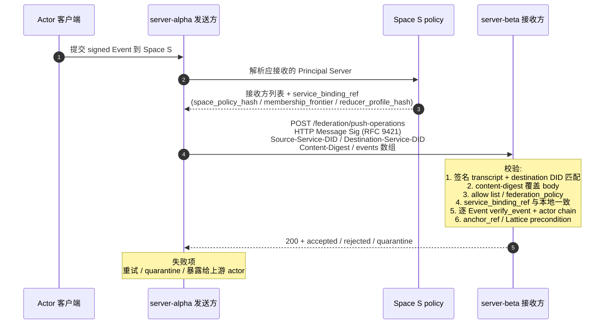

## 1. 目标

Contrix 是去中心化协议，不同用户或组织各自运行受控 Principal Server。当来自不同域的 Actor 需要在同一个 Space 中协作时，Principal Server 之间需要一套**跨域联邦协议 (Federation Protocol)**，定义：

- 节点之间如何互相发现与认证
- 如何安全交换签名 Event Envelope
- 如何处理跨域加入 Space 的请求
- 如何在异构网络中维持因果一致性

## 2. 设计原则

### 2.1 Event Chain 是信任锚点

跨域协作的信任不来自"服务器管理员彼此认识"，而来自**每个 Actor 的 signed Event chain 都是密码学可验证的**。任何节点在接收到来自外部域的 Event Envelope 时，可以独立验证签名、DID、`actor_seq`、`prev_refs` 和授权因果链，不需要信任对方服务器。

### 2.2 Principal Server 是受控同步边界，不是全局权威

联邦场景中没有独立第三方分发服务器角色。Space 范围传播由参与方 Principal Server 之间的 federation transaction 完成。Principal Server 不能伪造、篡改或选择性隐藏已签名的 Event Envelope；任何参与者都可以通过直接查询源 Events API、witness receipt、snapshot frontier 或其他受信 Principal Server 交叉验证历史。

### 2.3 Anchor Finality 优于全局同步共识

跨域网络延迟不可预测。联邦协议不要求所有 Principal Server 同步参与一个全局共识组；每个 Space 通过 Anchor DAG 表达 ordering commitment。Hub、threshold、open peer mesh 和 sovereign fallback 只是 `anchorer` cell value 与 Anchor profile 的不同配置。

### 2.4 Anchor Profile 决定传播形态

联邦传播按目标 Space 的 `anchor_profile`（参见 [`../models/space-and-place.md` §2.2](../models/space-and-place.md)）走几种形态：

- **`single_did`**：单一 service DID 签发持久 Anchor。Actor 可以向自己的 Principal Server 提交 Move，但 Move 只有被该 DID 签发的 Anchor frontier 覆盖后才 effective。传播形态是 actor/server → anchorer → fanout。
- **`threshold`**：k-of-n committee 签发 Anchor。提交路径与 `single_did` 类似，但 Anchor 验证 threshold signature。
- **`open_set`**：多个 federation peer / admin DID 可以签发 leaf Anchor。Principal Server 之间 push / pull pending Move 与 Anchor leaf；查询时使用 deterministic effective anchor view join。
- **`mixed`**：正常由主 anchorer 签发 Anchor；主 anchorer 故障、签发矛盾 Anchor 或 anchorer cell 变成 `⊥` 时，fallback recovery anchorer 可以签发恢复 Anchor。

跨域 Space 跨过两个 deployment（A 与 B）时，`anchor_profile` 与 genesis anchorer 由 Space create 固定，所有参与 deployment 都按同一 Anchor 验证规则处理；不存在 "A 当 hub、B 当 peer mesh" 的分裂状态。

## 3. 节点间认证

### 3.1 基于 DID 的服务器身份

每个 Principal Server / Events API 节点 MUST 拥有自己的 DID（通常是 `did:web`），并在其 DID Document 中声明 Service Endpoints：

```json
{
  "id": "did:web:server.acme.example.com",
  "service": [
    {
      "id": "#contrix-principal-server",
      "type": "ContrixPrincipalServer",
      "serviceEndpoint": "https://server.acme.example.com/api/v1"
    }
  ],
  "verificationMethod": [
    {
      "id": "#server-key-1",
      "type": "Ed25519VerificationKey2020",
      "publicKeyMultibase": "z6Mkf..."
    }
  ]
}
```

其中 DID Document 的 `service.type` 使用协议注册名（如 `ContrixPrincipalServer`），服务 describe 响应中的 `service_type` 使用运行时注册值（如 `principal_server`）。联邦鉴权 MUST 校验两者的绑定关系，不得只凭域名或 URL 接受请求。

### 3.2 请求签名

节点间的 HTTP 请求 MUST 使用 [HTTP Message Signatures (RFC 9421)](https://datatracker.ietf.org/doc/html/rfc9421) 进行签名。接收方通过发送方 DID Document 中的公钥验证请求的真实性。

签名 transcript MUST 覆盖以下 RFC 9421 derived components 与 header 字段：
- `@method`
- `@target-uri`
- `@authority`
- `content-digest`（针对有 body 的请求；编码遵循 RFC 9530）
- `source-service-did`（自定义 header `Source-Service-DID`）
- `destination-service-did`（自定义 header `Destination-Service-DID`）
- `request-canonical-hash`（自定义 header `Request-Canonical-Hash`）
- 签名 parameters MUST 包含 `created` 与 `expires`（不得用 `Date` header 替代）

签名验证规则：

- body 中的 `origin` / `destination` MUST 与签名 transcript 中的来源 / 目标 service DID 一致。
- `destination` MUST 是接收方 service DID；反向代理、多租户 host 或 shared ingress 不能只凭 `Host` 判断目的地。
- 请求带 body 时 MUST 携带 `Content-Digest`，且 digest 必须覆盖 canonical request body。
- 受保护联邦 endpoint MUST NOT 接受 query string 认证。
- 签名失败、destination 不匹配、digest 不匹配或时间窗口失效 MUST 返回标准 error envelope，并尽量不泄露 Space、Actor 或 Event 是否存在。

### 3.3 域信任模型

Contrix 不要求全局信任列表。每个节点维护自己的**联邦许可列表 (Federation Allow List)**：

- **开放联邦 (Open)**：接受来自任何域的合法签名请求。适合公共协作场景。
- **受限联邦 (Restricted)**：仅接受来自预配置域列表的请求。适合企业内部或联盟场景。
- **封闭 (Closed)**：不接受任何外部联邦请求。适合纯内部部署。

## 4. Event 交换协议

### 4.1 推送模式 (Push)

本文件中的联邦载荷项是 v1 规范性 Event Envelope。`push-operations` 与 `pull-operations` 是 service operation / HTTP binding 名称；请求与响应体中的共享事实字段使用 `events[]`，不引入第二套 Operation wire object。

当 Actor A（托管在 `server-alpha.com`）向 Space S 提交了新 Event，而 Space S 的另一参与方 Principal Server `server-beta.com` 也服务同一个 Space 时：

1. `server-alpha.com` 检测到新 Event 属于跨域 Space
2. `server-alpha.com` 从 Space policy / membership / service delegation 中解析应接收该 Event 的对端 Principal Server，并生成接收方服务绑定快照
3. `server-alpha.com` 向 `server-beta.com` 发送推送请求：

```
POST /api/v1/federation/push-operations
Host: server-beta.com
Signature-Input: sig1=("@method" "@target-uri" "content-digest")
Signature: sig1=:base64...:
```

请求字段：

| 字段 | 位置 | 类型 | 必填 | 说明与约束 |
| --- | --- | --- | --- | --- |
| `Signature-Input` | header | `string` | required | HTTP Message Signature 输入；MUST 绑定 `@method`、`@target-uri`、`content-digest`、来源 service DID 和目标 service DID。 |
| `Signature` | header | `string` | required | 来源 service DID 的 HTTP Message Signature。 |
| `Content-Digest` | header | `string` | required | 请求体摘要，MUST 与签名覆盖内容一致。 |
| `origin` | body | `did` | required | 来源 service DID。 |
| `destination` | body | `did` | required | 目标 service DID，MUST 与目标 URL、DID service endpoint 和 Space policy 委托一致。 |
| `space_id` | body | `id` | required | Event 所属 Space。 |
| `service_binding_ref` | body | `object` | required | 接收方服务绑定快照。 |
| `service_binding_ref.space_policy_hash` | body | `sha256:<hash>` | required | 发送方用于判定接收方委托关系的 Space policy hash。 |
| `service_binding_ref.membership_frontier` | body | `id[]` | required | membership / policy 因果前沿。 |
| `service_binding_ref.destination_service_type` | body | `string` | required | 目标服务类型，例如 `principal_server`。 |
| `service_binding_ref.reducer_profile_hash` | body | `sha256:<hash>` | required | 发送方在此 Space 使用的 reducer profile canonical hash（覆盖 `cx.reducer.<id>.v<n>` 的完整规则定义）。接收方 MUST 与自己的 reducer profile 比对；不一致 MUST 拒绝整批请求并返回 `reducer_profile_mismatch`。这避免了同一 Event 在两端 reducer 下产生不同 cell 状态、state_root 或 covered_frontier，进而被 idempotent 接受却不可重放的隐性失败。 |
| `events` | body | `object[]` | required | Event Envelope 数组；每项 MUST 是完整签名 `cx.schema.event.v1`。 |

请求示例（非完整 schema）：

```json
{
  "origin": "did:web:server-alpha.com",
  "destination": "did:web:server-beta.com",
  "space_id": "cx:space:0196419b-0000-7000-8000-000000000000",
  "service_binding_ref": {
    "space_policy_hash": "sha256:...",
    "membership_frontier": ["cx:event:..."],
    "destination_service_type": "principal_server",
    "reducer_profile_hash": "sha256:..."
  },
  "events": [
    { /* 完整的 Event Envelope，含签名 */ }
  ]
}
```

响应字段：

| 字段 | 类型 | 必填 | 说明与约束 |
| --- | --- | --- | --- |
| `accepted` | `id[]` | required | 已接受 Event ID。 |
| `rejected` | `object[]` | required | 被拒绝项；每项 SHOULD 包含 `id`、`reason_code` 和可审计说明。 |
| `quarantine` | `id[]` | optional | 进入隔离队列等待人工或异步验证的 Event ID。 |

4. `server-beta.com` 独立验证每个 Event 的 Actor 签名、Space policy、服务委托、接收方服务绑定和因果链，然后决定是否接受

错误响应 MUST 使用 `api-conventions.md` 中的标准 JSON error envelope。批量请求中，单条 Event 的拒绝 SHOULD 进入 `rejected[]`；整个请求无法认证、目的地不匹配、schema 解析失败或被限流时 SHOULD 返回对应 HTTP 错误。`rate_limited` 和可预期恢复的 `temporarily_unavailable` SHOULD 携带 `Retry-After`。

Contrix v1 的联邦批量传播采用依赖感知的 partial accept：最小原子单元是单个 Event 及其已接受依赖，而不是整个请求数组。接收方已经 accepted 的 Event 不因后续 Event 失败而回滚；后续 Event 若依赖同批失败项，必须拒绝或隔离并暴露依赖诊断。需要 all-or-nothing 批处理的部署必须通过 profile / critical extension 显式协商。

`events[]` MUST 按数组顺序处理。同批中已接受的 Event 可以满足后续 Event 的 `prev_refs`、`auth_refs` 或 payload-level causal reference；同批中尚未处理、已拒绝或隔离的 Event 不能被视为已接受依赖。单条 Event 失败不得回滚同批已接受 Event；响应 MUST 将成功项放入 `accepted[]`，失败项放入 `rejected[]`，需要异步校验的项放入 `quarantine[]`。依赖同批失败或缺失 Event 的后续项 MUST 以 `dependency_missing`、`causal_conflict` 或等价原因拒绝/隔离。

接收方服务绑定规则：

- Actor DID 的当前 DID Document MAY 声明其受控或委托的 `ContrixPrincipalServer` endpoint。
- Organization DID 或 Space policy MAY 为组织成员、受管设备或特定 Space 指定 Principal Server。
- Space metadata 的 `sync_endpoints` 只表示 Space policy 明确委托的 shared anchorer / sync service 或组织 Principal Server，不自动授权任意第三方接收私有内容。
- 联邦 transaction MUST 绑定 `destination` service DID、Space policy hash / version、membership frontier 和目标 endpoint；接收方 MUST 校验自己在该快照下有权接收该 Space 的事件。
- 当服务委托被撤销或成员被移除后，生效因果点之后不得继续向已撤销 service DID 推送非加密私有内容；历史 backfill 也必须按撤销后的 visibility 与 history policy 重新判定。

### 4.1.0 推送时序

下图把 push transaction 的握手画成时序图。**信任根是签名 Event 本身 + RFC 9421 HTTP Message Signature + 接收方服务绑定快照，不是任何一方服务器的本地数据库。**



读图要点：

- 接收方独立验证每个 Event 的签名与因果链，不信任发送方服务器；服务器之间的握手只是传输面认证。
- `service_binding_ref.reducer_profile_hash` 不一致时整批拒绝（`reducer_profile_mismatch`），避免同 Event 在两端 reducer 下产生不同 cell 状态的隐性失败。
- 批内单 Event 失败 **不**回滚同批已接受 Event；依赖同批失败项的后续 Event 必须 `dependency_missing` / `causal_conflict` 拒绝或 quarantine。

### 4.1.1 批量推送与幂等

Contrix v1 联邦推送只定义 `POST /federation/push-operations` 一个 endpoint：

- 幂等以 `(origin, destination, event_id)` 逐事件去重；接收方对重复 `event_id` 且内容一致 MUST 返回 `accepted[]` 而非报错，内容不一致 MUST 拒绝（参见 4.3 节）。
- 批次级重放检测使用签名 transcript 中的 `Request-Canonical-Hash` 与 `Idempotency-Key` header（详见 8.5 节），不引入额外的 path 事务 ID。
- `quarantine[]` 项 SHOULD 放入 `rejected[]` 并附 `reason_code=quarantined`，或由实现扩展响应 schema。
- 持续同步、批量重试和 frontier 交换通过组合 `push-operations`、`pull-operations`（4.2 节）与 frontier exchange（4.5 节）完成；无需额外的有状态事务 endpoint。

### 4.2 拉取模式 (Pull / Backfill)

当节点发现自己的因果图中存在缺失（`prev_refs` 或 `auth_refs` 引用了本地没有的 Event）时，可以主动向源 Principal Server 或源 Events API 拉取：

```
GET /api/v1/federation/pull-operations?space_id=cx:space:...&after_cursor=...&limit=100
Host: server-alpha.com
```

请求字段：

| 字段 | 位置 | 类型 | 必填 | 说明与约束 |
| --- | --- | --- | --- | --- |
| `space_id` | query | `id` | required | 请求回补的 Space。 |
| `after_cursor` | query | `cursor` | optional | 从该 cursor 之后拉取；缺省时由服务策略决定起点。 |
| `limit` | query | `int` | optional | 返回数量上限；服务端 MUST enforce 最大值。 |

响应字段：

| 字段 | 类型 | 必填 | 说明与约束 |
| --- | --- | --- | --- |
| `events` | `object[]` | required | Event Envelope 数组；每项 MUST 保持原始签名信封。 |
| `snapshot_bootstrap` | `object` | optional | 可选的快照加速返回；如有则接收方 MUST 校验签名并验证 frontier 一致性后才可使用。 |
| `next_cursor` | `cursor` | optional | 下一页 cursor。 |
| `has_more` | `boolean` | required | 是否还有更多可见 Event。 |

`snapshot_bootstrap` 字段（存在时）：

| 字段 | 类型 | 必填 | 说明与约束 |
| --- | --- | --- | --- |
| `snapshot_ref` | `id` | optional | 快照标识。 |
| `state_hash` | `string` | optional | 快照状态根，必须与快照 frontier 对应。 |
| `snapshot_frontier` | `id[]` | optional | 需要从该 frontier 之后开始增量回放。 |
| `signature` | `object` | optional | 标准 Snapshot detached proof，覆盖 `snapshot_ref`、`state_hash`、`snapshot_frontier` 和 reducer/schema profile。 |
| `signature.verification_method` | `string` | optional | 用于信任锚点的 DID verification method。 |
| `signature.alg` | `string` | optional | 签名算法。 |
| `signature.jws` | `string` | optional | detached JWS。 |

### 4.3 重复与幂等

- 同一个 `event_id` 的 Event MAY 被多个 Principal Server 推送多次
- 接收方 MUST 以 `event_id` 去重
- 内容相同的重复推送 MUST 幂等接受
- `event_id` 相同但内容不同的推送 MUST 拒绝

### 4.4 Capability Revoke Fanout

`cx.capability.revoke`、superseding grant、membership removal、ban、device/session revoke 和会使既有 allow cache 失效的 policy change 是高优先级 auth state。源 Principal Server 在接受这类 Event 后，MUST 主动推送给所有当前已知的相关 Principal Server，而不是只等待对端下一次 pull：

- fanout 目标包括 Space policy / membership / service delegation 中声明的 shared anchorer / sync service、受影响 subject 的 Principal Server、grant issuer / delegatee 所在 Principal Server，以及正在服务该 Space 的 federation peer。
- 推送 payload MUST 包含原始 Event Envelope、必要 auth refs、当前 auth frontier 或可验证 snapshot reference，便于接收方立即失效 capability cache。
- 接收方即使暂时无法完整验证该 revoke，也 MUST 将匹配 scope 的 allow cache 标记为 stale / `revoke_freshness_unknown`，直到 backfill 完成。
- fanout 失败时，源服务器 MUST 保留重试队列并在后续 federation transaction、frontier probe 或 pull 响应中暴露缺失诊断；不得因单个 peer 不可达而回滚已 accepted revoke。

该主动推送只加速缓存一致性，不替代接收方对签名、Move refs、Anchor frontier、Lattice state_root 和 policy 的独立验证。

### 4.5 Fork Detection / Frontier Exchange

参与同一 Space 的 federation peer SHOULD 周期性交换 frontier，确保未发生 silent fork：

```json
{
  "space_id": "cx:space:0196419b-0000-7000-8000-000000000000",
  "heads": ["sha256:..."],
  "max_hlc": "01970e589d21-0004-a13f9c2e",
  "witness_receipts": []
}
```

规则：

- `heads[]` 是当前 accepted frontier 的稳定 event hash；接收方比较两端 heads 集合发现差异。
- `max_hlc` 是 issuer 在 frontier 处观察到的最大 HLC；用于检测时钟严重偏移。
- `witness_receipts[]` 可选，包含 witness / receipt service 对 frontier 的 attestation。
- 若两端历史包含相同 `event_id` 但不同 hash，接收方 MUST quarantine 并以 `duplicate_conflict` 报告。
- 若冲突来自同一 actor 的不同签名 frontier，接收方 SHOULD 保留最小证据集：冲突 event id、hash、签名 key id、source service DID、收到时间和相关 frontier。证据集不得包含未授权明文 payload。
- 可疑 remote 输入 MAY 在 quarantine 队列中暂存，直到签名、schema、capability、fork resolution 与 operator policy 全部通过。

## 5. 跨域加入 Space

### 5.1 邀请流程

当 Space S 的管理员邀请外部用户 Bob（Principal Server 在 `server-beta.com`）时：

1. 管理员提交 `cx.invite.create` Event，`subject_did` 指向 Bob 的 DID
2. 该 Event 通过联邦推送到达 Bob 的 Principal Server
3. Bob 的客户端发现 Invite，决定接受
4. Bob 的客户端提交 `cx.invite.accept` Event 到自己的 Events API
5. Bob 的 Principal Server 将该 Event 推送给 Space S 的其他参与方 Principal Server
6. 各参与方按 reducer 验证 Invite 有效性并收敛成员状态
7. 若 Space 启用了 E2EE，管理员的客户端构造 MLS `Welcome` 消息发给 Bob

### 5.2 Knock 流程

Bob 也可以主动申请加入：

1. Bob 发现 Space S 的元数据（通过公开的 Space Directory 或链接）
2. Bob 提交 `cx.member.state{membership="knock"}` Move / compatible Event，推送给 Space S 的 shared anchorer、sync service 或管理员 Principal Server
3. 接收方验证 knock 的签名有效后，转发给 Space 管理员
4. 管理员审批后提交 `cx.invite.create` + Bob 提交 `cx.invite.accept`

## 6. 联邦级服务发现

### 6.1 Anchorer / Sync Endpoint 列表

每个 Space 的 metadata MAY 包含一个 `sync_endpoints` 列表，用于列出被 Space policy 明确委托的 shared anchorer、sync service 或组织 Principal Server。该列表不是公开分发节点列表；列表中的每个 endpoint 都必须有 service DID、角色、可见性范围和是否可见明文的声明：

```json
{
  "space_id": "cx:space:0196419b-0000-7000-8000-000000000000",
  "sync_endpoints": [
    {
      "did": "did:web:server-alpha.com",
      "endpoint": "https://server-alpha.com/api/v1",
      "role": "primary",
      "service_type": "principal_server",
      "plaintext_visible": true
    },
    {
      "did": "did:web:server-beta.com",
      "endpoint": "https://server-beta.com/api/v1",
      "role": "mirror",
      "service_type": "principal_server",
      "plaintext_visible": false
    }
  ]
}
```

若 `plaintext_visible` 为 true，该 service DID 还 MUST 出现在 Space policy 的 `plaintext_visible_services` 中。若为 false，服务只能接收公开内容、密文 envelope、不可逆 hash 或 policy 允许的 stripped preview。

### 6.2 Actor Event Source 发现

给定一个 Actor 的 DID，其他节点通过解析 DID Document 中的 `#contrix-principal-server` 或等价服务端点来定位其 Events API：

```
DID Document -> service[type=ContrixPrincipalServer] -> serviceEndpoint
```

### 6.3 域名级服务发现缓存

DID Document 的 service entry 是联邦服务发现的权威来源。域名级 bootstrap MAY 暴露：

```text
GET https://<domain>/.well-known/contrix/server
```

该响应只用于找到候选服务 endpoint，不直接授权联邦请求。接收方仍 MUST 校验 service DID、DID Document、describe 响应、TLS 名称、HTTP Message Signature、Space policy / service delegation 和 `destination` 绑定一致。

缓存规则：

- 按 HTTP cache header 缓存服务发现响应。
- 未提供显式缓存时间时 MAY 使用不超过 24 小时的默认 TTL。
- 正缓存 SHOULD 设置本地上限（建议不超过 48 小时）。
- 失败缓存必须短 TTL 或指数退避，避免一次临时故障长期破坏跨域同步。
- service delegation 被撤销、DID Document key log 更新或 Space policy 变更时，本地缓存必须按版本 / hash 失效。

## 7. 联邦请求复用 Sync / Events API

v1 已合并联邦 API 与 Sync / Events API：联邦对端不再需要独立 `/federation/*` 端点，所有联邦行为通过现有 Sync / Events 端点 + service-level 认证完成。

| 联邦行为 | 复用端点 | 认证模式差异 |
| --- | --- | --- |
| 跨域推送 Event（含批处理） | `POST /api/v1/events`（`cx.events.submit`） | service_signature（HTTP Message Signature）+ `Source-Service-DID` / `Destination-Service-DID` header；Space policy 必须列出 source service DID 为合法 federation peer。 |
| 跨域 backfill / 拉取缺失历史 | `GET /api/v1/events?direction=backward`（`cx.events.query`） | 同上。 |
| 跨域 Space 成员视图 | `GET /api/v1/events`（`cx.events.query`） + `cx.member.state` 过滤 | 同上；服务端按 Space policy 决定哪些成员对该 service DID 可见。 |
| 跨域 actor / DID 验证 | `POST /api/v1/identity/resolve`（`cx.identity.resolve`） | 该端点本就是公共服务面；联邦请求按调用方信任策略缓存。 |

### 7.1 跨域 Event 推送

```
POST /api/v1/events
Authorization: <service_signature>
Source-Service-DID: did:web:server.acme.example
Destination-Service-DID: did:web:server.beta.example
Request-Canonical-Hash: sha256:...
```

字段、签名 transcript、绑定与重放保护按 §3.2、§4.1 与 [`api-conventions.md` §3](./api-conventions.md) 与 [`service-http-binding.md` §3](./service-http-binding.md) 执行。事件以普通 reducer-input event 提交（preconditions / effects / anchor_ref 在顶层），与单域 client write 共享同一 schema（`cx.schema.event.v1`）。

### 7.2 跨域 Backfill

```
GET /api/v1/events?spaces=<id>&direction=backward&from=<cursor>&limit=<n>
Authorization: <service_signature>
```

字段定义见 4.2 节；service operation id 为 `cx.events.query`，`direction=backward` 用于回填历史。空间历史按 Space policy 与 history visibility 过滤；snapshot bootstrap 通过 `/api/v1/sync/snapshot-head` 单独获取。

### 7.3 查询 Space 成员

跨域参与方查询某 Space 成员视图时，使用 `cx.events.query` 并过滤 `kind=cx.member.state`：

```
GET /api/v1/events?spaces=<id>&kinds=cx.member.state&from=<cursor>&limit=<n>
Authorization: <service_signature>
```

请求字段：

| 字段 | 位置 | 类型 | 必填 | 说明与约束 |
| --- | --- | --- | --- | --- |
| `spaces` | query | `id[]` | required | 要查询成员的 Space。 |
| `kinds` | query | `string[]` | optional | 事件类型过滤；此处固定 `cx.member.state`。 |
| `from` | query | `cursor` | optional | 分页 cursor。 |
| `limit` | query | `int` | optional | 返回数量上限；服务端 MUST enforce 最大值。 |

响应字段：

| 字段 | 类型 | 必填 | 说明与约束 |
| --- | --- | --- | --- |
| `members` | `object[]` | required | 成员摘要数组；内容受 requester 可见性和 Space policy 限制。 |
| `membership_frontier` | `object` | required | 用于判断成员视图新鲜度的因果前沿。 |
| `next_cursor` | `cursor` | optional | 下一页 cursor。 |

### 7.4 验证 Actor

跨域 actor 验证复用 `POST /api/v1/identity/resolve` 公共服务面（`cx.identity.resolve`）。该端点本就是公共 DID 解析入口，但 Contrix 实现 MUST 按调用方信任策略限速、缓存、并对私有 / pairwise DID 拒绝匿名公开。

下面保留的是 v1 之前定义的 `verify-actor` 单独端点的字段集——它现在是 `/api/v1/identity/resolve` 的高级 query 形态（"holder-approved proof challenge"），不是独立 operation。

请求字段：

| 字段 | 位置 | 类型 | 必填 | 说明与约束 |
| --- | --- | --- | --- | --- |
| `actor_id` | body | `did` | required | 待验证 Actor DID。 |
| `purpose` | body | `enum(event_source,federation_join,device_binding)` | required | 验证目的；服务端 MUST 将目的纳入授权与限流策略。 |
| `space_id` | body | `id` | optional；Space 相关目的为 required | 相关 Space ID；用于绑定 Space policy、membership 和 plaintext visibility。 |
| `challenge` | body | `base64url string` | optional；challenge 验证为 required | 请求方生成的短期随机挑战；服务端 MUST 拒绝过期或重复 challenge。 |
| `signed_payload_hash` | body | `sha256:<base64url-or-hex>` | optional；验证具体事件/设备绑定时为 required | 被验证 payload 的 canonical hash，MUST 与签名 transcript 绑定。 |
| `signature` | body | `object` | required | Actor 设备键或授权签名。 |
| `signature.kid` | body | `did-url` | required | 签名键 ID，MUST 属于 `actor_id` 的当前或可验证历史 key log。 |
| `signature.alg` | body | `string` | optional | 签名算法；出现时 MUST 与 DID Document/key log 中的 key 类型一致。 |
| `signature.sig` | body | `base64url string` | required | 对 canonical verification payload 的 detached signature。 |

`signature.sig` 覆盖的 canonical verification payload MUST 至少绑定 `actor_id`、`purpose`、`space_id`（若存在）、`challenge`（若存在）、`signed_payload_hash`（若存在）、请求方 service DID、目标 service DID 和请求时间窗口，防止跨目的、跨 Space 或跨服务重放。

请求示例（非完整 schema）：

```json
{
  "actor_id": "did:webvh:...",
  "purpose": "event_source",
  "space_id": "cx:space:...",
  "challenge": "base64url...",
  "signed_payload_hash": "sha256:...",
  "signature": {
    "kid": "did:webvh:...#device-a",
    "alg": "Ed25519",
    "sig": "base64url..."
  }
}
```

响应字段：

| 字段 | 类型 | 必填 | 说明与约束 |
| --- | --- | --- | --- |
| `valid` | `boolean` | required | 是否完成签名、DID/key-log 和目的约束校验；不得表示最终授权。 |
| `actor_id` | `did` | required | 回显被验证 Actor DID，MUST 与请求一致。 |
| `verified_key_id` | `did-url` | `valid=true` 时 required | 实际通过校验的 key id。 |
| `key_log_head` | `id` | optional | 服务端用于校验的 key-log head；接收方可据此刷新本地缓存。 |
| `did_document_ref` | `sha256:<hash>` | optional | DID Document canonical hash 或等价引用。 |
| `expires_at` | `datetime` | `valid=true` 时 required | 该辅助验证结果的最晚缓存时间；不得长于本地策略 TTL。 |
| `warnings` | `string[]` | required | 非致命提示；无提示时为空数组。 |

响应示例（非完整 schema）：

```json
{
  "valid": true,
  "actor_id": "did:webvh:...",
  "verified_key_id": "did:webvh:...#device-a",
  "key_log_head": "cx:keyevt:...",
  "did_document_ref": "sha256:...",
  "expires_at": "2026-04-26T00:05:00Z",
  "warnings": []
}
```

访问限制：

- 请求 MUST 使用来源 service DID 的 HTTP Message Signature。
- `purpose` MUST 是 `event_source`、`federation_join`、`device_binding` 或 Space policy 明确允许的等价目的。
- 请求方 MUST 是该 Space 的参与方 Principal Server、被委托 anchorer / sync service，或拥有相关 federation / join 处理权限的服务。
- 服务端 MUST 限流，并对不可见 actor 返回统一 `not_found` / `capability_denied` 语义，避免批量枚举 DID。
- 响应只能作为缓存加速或诊断。接收方在接受事件、成员变更或设备绑定前，仍 MUST 独立验证 DID Document、key log、签名 transcript、capability 和 Space policy。

## 8. 安全考量

### 8.1 反洪泛 (Anti-Flooding)

联邦端点 MUST 实施严格的速率限制。恶意节点可能通过大量推送无效 Event 来消耗对端资源。建议：
- 按 `origin` DID、来源 IP hash、endpoint 和 Space id 做独立限速
- 对来自未知域的首次请求做降级处理（先验证后全速）
- 限制单次请求体积和批次大小，超阈值先进入 `rate_limited`
- 先执行低成本 envelope / size / signature transcript 校验，再进入昂贵的 DID resolution、auth chain 展开和 reducer 预演
- 对连续失败来源使用有界队列和 `Retry-After`，不得让失败请求触发无限 backfill 或 retry fanout

### 8.2 选择性拒绝

节点有权选择性拒绝来自特定域的联邦请求（参见 3.3 节的域信任模型），这不违反协议。被拒绝的域可以通过其他途径（如用户直接下载可见 Event 历史）获取信息。

### 8.3 元数据与身份校验

联邦请求在鉴权前应执行签名与服务源一致性检查：

- `origin`/`destination` service DID 必须与请求签名与 `target-uri` 一致；
- 对签名失败、签名域缺失、`origin` 不在可接受集合的来源进入 `quarantine` 或 `hard_deny`；
- 未通过身份校验的错误响应 MUST 不泄露可验证/不可验证来源的差异。

### 8.4 元数据泄露防护

在联邦推送 E2EE Space 的 Event 时，密文信封 `encrypted_payload` 对联邦中间节点同样不可见。联邦协议传输的只有明文路由元数据和不透明的密文块。

### 8.5 重放与异常模式防护

节点 MUST 将 `Idempotency-Key` 与请求 canonical hash 绑定后执行幂等和重放检查：

- 相同 `(origin, destination, Idempotency-Key)` 但 canonical hash 不同 MUST 拒绝；
- 相同 `(origin, destination, Idempotency-Key)` 且 canonical hash 相同 MAY 幂等接受；
- 单事件级别仍以 `event_id` 去重，规则见 4.3 节；
- 同源短时重复失败、失败率异常上升时 MUST 暂停该源并返回 `rate_limited`/`temporarily_unavailable`。

### 8.6 威胁映射落地

本协议在服务器端应默认支持 [server-threat-model.md](../security/server-threat-model.md) 中“可借鉴项”，特别是：

- 开放联邦入口阻断；
- 攻击来源限流与排队；
- 重放检测与 quarantine；
- 统一回执和拒绝语义避免枚举泄漏。

## 9. 未来实现边界与优化优先级

这类方向并非都属于第一版互操作要求。按“安全完整性 → 可交付性 → 优化性”分层如下。

### 9.1 联邦级 Snapshot 同步与校验（必须项）

联邦场景下，Principal Server 之间应支持基于快照的快速恢复（snapshot-assisted bootstrap），否则首次加入或大范围缺失时会退化为全量历史回放，影响可用性。实现层面：

在 `GET /api/v1/federation/pull-operations` 返回中，应在可用时提供 `snapshot_bootstrap`（可选字段）：

| 字段 | 类型 | 必填 | 说明 |
| --- | --- | --- | --- |
| `snapshot_bootstrap` | `object` | optional | 可选，携带可验证的快照入口，不改变操作集合语义。 |
| `snapshot_bootstrap.snapshot_ref` | `id` | optional | 触发本次增量前可选的 snapshot id。 |
| `snapshot_bootstrap.state_hash` | `string` | optional | snapshot 的状态摘要。 |
| `snapshot_bootstrap.snapshot_frontier` | `id[]` | optional | snapshot 覆盖的 frontier。 |
| `snapshot_bootstrap.signature` | `object` | optional | 标准 Snapshot detached proof；接收方必须验证签名、state_hash 与 `snapshot_frontier` 一致性。 |

校验规则：

- 客户端在接收到 `snapshot_bootstrap` 时，先执行 `signature`、签名者授权、`state_hash` 和 chunk digest 校验。
- 接受快照后，增量回放起点必须以 `snapshot_frontier` 为锚点，不得把 snapshot 当成无因果前沿的新 genesis。
- 快照校验失败时，必须退回到纯 Event 增量回放，并将该来源记入 `quarantine` 或 `rate_limited` 分支进行观察。

### 9.2 多 Principal Server 的 Gossip / 批量同步（增强项）

该方向用于性能和可靠性提升，不是签名真实性的前提条件。最小实现可直接使用本文件 4/7 节的 push + pull。实现支持时应遵循：

- 批次内必须保持 `events` 的原始签名 Envelope 顺序与 `event_id` 可去重性。
- Gossip 转发不得改变单条 Event 的语义、签名或时间线排序前置假设。
- 不得以批处理成功作为 Event 被最终可验证的充要条件；最终仍以 `event_id`、签名、因果前沿验证判定是否可见。
- 每个 batch 应带可核验的批次摘要（例如请求级 hash）以便对端做重试/重放检测。
- 若实现启用多跳 gossip 而不是直接 push / pull，每个 federation transaction MUST 携带由 service-to-service 签名覆盖的 transport-level path metadata，例如 `relay_path`、`hop_count` 和 `max_hops`。接收方发现自己的 service DID 已在路径中、`origin`/`destination` 与签名 transcript 不一致，或超过 `max_hops` 时，MUST reject 或 quarantine。path metadata 不能替代单条 Event 的 Actor 签名，也不是 Actor canonical event 的一部分。
- 转发方 MUST 在 fanout 前按 `event_id` 与 canonical event hash 去重。实现 SHOULD 维护有界的 `(space_id, event_id, peer_service_did)` replay cache，并对 `origin`、Space 和 peer 维度设置 in-flight 上限。队列超过本地策略时返回 `rate_limited` 或 `temporarily_unavailable` 并带 `Retry-After`，不得制造无界重试风暴。

### 9.3 跨域权限委托与级联（明确边界项）

方向“跨域 Space 的权限委托与级联”是必要但必须收敛到显式规则：

- 默认不跨域、不中继地隐式级联。任何权限在跨域传递前都必须有明确 `cx.capability.grant` / `cx.capability.delegate` Event 表达，并绑定目标 `space_id`、目标服务/主体、可见范围、时效和可撤销性。
- 受权链必须可审计、可传递上限（如 depth / scope）并支持回收（revoke）。在未满足上限或超出范围时应 fail-closed。
- 委托不得扩大被委托方可见范围；只能收窄或保持不变。`principal_server` 不能仅凭受托委托获得不在其角色定义内的明文访问。
- 对级联场景，只允许显式 opt-in，且每一跳必须重复检查 policy 与签名。无法验明权利链的来源时必须视为 unauthorized。

### 9.4 联邦节点声誉系统（可选项）

声誉系统可作为 anti-abuse 组件是可选的，不得影响协议的最终一致性安全边界：

- 声誉只能用于流量调度、排队优先级和临时降级，不得替代签名验证、DID 校验和 Space policy 授权判断。
- 声誉决策不得造成可审计事件的不可达性（例如把合法请求静默降权为拒绝）。
- 即使在高声誉策略触发下，仍应返回可区分的标准错误码（`temporarily_unavailable`、`rate_limited`、`quarantine`）供重试/恢复。
