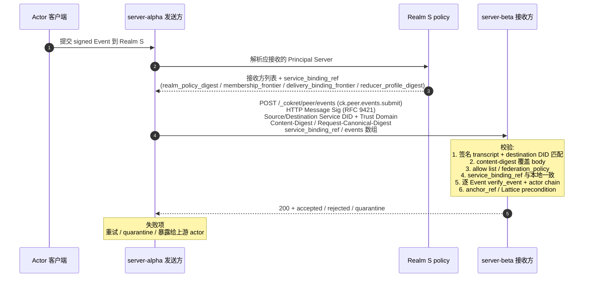

## 0. 规范语言

本文中的规范关键字（**MUST** / **SHOULD** / **MAY** 等）按 [conformance/normative-language.md](../conformance/normative-language.md) 解释；仅大写形式具规范约束力。

## 1. 目标

Cokret 是去中心化协议，不同用户或组织各自运行受控 Principal Server。当来自不同域的 Actor 需要在同一个 Realm 中协作时，Principal Server 之间需要一套**跨域联邦协议 (Federation Protocol)**，定义：

- 节点之间如何互相发现与认证
- 如何安全交换签名 Event Envelope
- 如何处理跨域加入 Realm 的请求
- 如何在异构网络中维持因果一致性

本文 §4 定义联邦 wire transaction 形态；所有联邦 HTTP 绑定以本文和 `service-http-binding.md` / OpenAPI 为准。

## 2. 设计原则

### 2.1 Event Chain 是信任锚点

跨域协作的信任不来自"服务器管理员彼此认识"，而来自**每个 Actor 的 signed Event chain 都是密码学可验证的**。任何节点在接收到来自外部域的 Event Envelope 时，可以独立验证签名、DID、`actor_seq`、`prev_refs` 和授权因果链，不需要信任对方服务器。

### 2.2 Principal Server 是受控同步边界，不是全局权威

联邦场景中没有独立第三方分发服务器角色。Realm 范围传播由参与方 Principal Server 之间的 federation transaction 完成。Principal Server 不能伪造、篡改或选择性隐藏已签名的 Event Envelope；任何参与者都可以通过直接查询源 Events API、witness receipt、snapshot frontier 或其他受信 Principal Server 交叉验证历史。

### 2.3 Anchor Finality 优于全局同步共识

跨域网络延迟不可预测。联邦协议不要求所有 Principal Server 同步参与一个全局共识组；每个 Realm 通过 Anchor DAG 表达 ordering commitment。`single_did`（中心化 hub）、`threshold`（k-of-n 委员会）、`open_set`（开放对等）和 `mixed`（含 sovereign fallback）只是 `anchorer` cell value 与 Anchor profile 的不同配置；详见 §2.4。

### 2.4 Anchor Profile 决定传播形态

联邦传播按目标 Realm 的 `anchor_profile`（参见 [`../models/realm-and-space.md` §2.3](../models/realm-and-space.md#23-schema-id-与字段) — 该字段在 Realm Schema 字段表中定义，create-locked）走几种形态：

- **`single_did`**：单一 service DID 签发持久 Anchor。Actor 可以向自己的 Principal Server 提交 Move，但 Move 只有被该 DID 签发的 Anchor frontier 覆盖后才 effective。传播形态是 actor/server → anchorer → fanout。
- **`threshold`**：k-of-n committee 签发 Anchor。提交路径与 `single_did` 类似，但 Anchor 验证 threshold signature。
- **`open_set`**：多个 federation peer / admin DID 可以签发 leaf Anchor。Principal Server 之间 push / pull pending Move 与 Anchor leaf；查询时使用 deterministic effective anchor view join。
- **`mixed`**：正常由主 anchorer 签发 Anchor；主 anchorer 故障、签发矛盾 Anchor 或 anchorer cell 变成 `⊥` 时，fallback recovery anchorer 可以签发恢复 Anchor。

跨域 Realm 跨过两个 deployment（A 与 B）时，`anchor_profile` 与 genesis anchorer 由 Realm create 固定，所有参与 deployment 都按同一 Anchor 验证规则处理；不存在 "A 当 hub、B 当 peer mesh" 的分裂状态。

## 3. 节点间认证

### 3.1 基于 DID 的服务器身份

每个 Principal Server / Events API 节点 MUST 拥有自己的 DID（通常是 `did:web`），并在其 DID Document 中声明 Service Endpoints：

```json
{
  "id": "did:web:server.acme.example.com",
  "service": [
    {
      "id": "#cokret-principal-server",
      "type": "CokretPrincipalServer",
      "serviceEndpoint": "https://server.acme.example.com"
    }
  ],
  "verificationMethod": [
    {
      "id": "#server-key-1",
      "type": "Ed25519VerificationKey2020",
      "publicKeyMultibase": "z6Mkf..."
    }
  ]
}
```

其中 DID Document 的 `service.type` 使用协议注册名（如 `CokretPrincipalServer`），服务 describe 响应中的 `service_type` 使用运行时注册值（如 `principal_server`）。联邦鉴权 MUST 校验两者的绑定关系，不得只凭域名或 URL 接受请求。

### 3.2 请求签名

节点间的 HTTP 请求 MUST 使用 [HTTP Message Signatures (RFC 9421)](https://datatracker.ietf.org/doc/html/rfc9421) 进行签名。接收方通过发送方 DID Document 中的公钥验证请求的真实性。

> **PQ-hybrid TLS 基线（informative，路线图注记）**：service-to-service 联邦链路承载的 transaction 元数据多数只靠 TLS 保护，是 Harvest-Now-Decrypt-Later 的暴露面。联邦传输 SHOULD 使用 TLS 1.3 并启用混合后量子 group `X25519MLKEM768`（draft-ietf-tls-ecdhe-mlkem）；这与请求级 RFC 9421 签名正交，不改任何 wire 字段，老旧栈自动回退经典 group。完整论据见 [`../security/server-threat-model.md` §2.4](../security/server-threat-model.md)。本注记为 informative / SHOULD 级，不引入新 normative 规则。

签名 transcript MUST 覆盖以下 RFC 9421 derived components 与 header 字段：
- `@method`
- `@target-uri`
- `@authority`
- `content-digest`（针对有 body 的请求；编码遵循 RFC 9530）
- `source-service-did`（自定义 header `Source-Service-DID`）
- `destination-service-did`（自定义 header `Destination-Service-DID`）
- `destination-service-endpoint-digest`（自定义 header `Destination-Service-Endpoint-Digest`；shared ingress / 多租户 / allowlist endpoint 场景必填）
- `source-trust-domain`（自定义 header `Source-Trust-Domain`）
- `destination-trust-domain`（自定义 header `Destination-Trust-Domain`）
- `request-canonical-digest`（自定义 header `Request-Canonical-Digest`；带 body 或需要批次幂等 / replay key 的请求必填，`POST /_cokret/peer/events` MUST 携带）
- `idempotency-key`（自定义 header `Idempotency-Key`；当该 header 参与幂等或 replay key 时必填并进入签名 transcript）
- 签名 parameters MUST 包含 `created` 与 `expires`（不得用 `Date` header 替代）

**签名时效窗口（normative）**：接收方 MUST 拒绝时效不合规的签名（统一归入本节末"时间窗口失效"的最小披露错误）；以下任一 MUST 拒绝——`expires - created` 超过 300s（协议常量，量级同 [`encoding.md`](../conformance/encoding.md) §6 的 `hard_future_skew_ms`）、`created` 偏离接收方本地时钟超过 ±30s（量级同 `expected_future_skew_ms`）、或 `expires` 已过接收方本地时钟。**即便有界 replay cache 已 evict 对应条目，落在该签名时效窗口之外的逐字节重放也 MUST 因 `expires` / `created` 校验失败而被拒**：重放防护的有效期由协议常量界定，不交给发送方可控的 `expires` 值与 replay cache 容量。对不携带 `Idempotency-Key` 的 `POST /_cokret/peer/events` 批次，批次级 replay 防护退化为仅靠该签名时效窗口加单事件 `event_id` 去重兜底，故高价值写路径 SHOULD 携带 `Idempotency-Key`。

签名验证规则：

- body 中的 `origin` / `destination` MUST 与签名 transcript 中的来源 / 目标 service DID 一致。
- `Source-Trust-Domain` / `Destination-Trust-Domain` MUST 进入签名 transcript；若 body 或 `service_binding_ref` 中携带来源 / 目标 trust domain，必须与 header 完全一致。
- `destination` MUST 是接收方 service DID；反向代理、多租户 host 或 shared ingress 不能只凭 `Host` 判断目的地。
- `Destination-Trust-Domain` MUST 等于接收方当前 deployment 的 `ServiceDescribe.trust_domain`，并与被接收 Realm 的 `trust_domain` 一致；不一致 MUST 归入本节统一最小披露失败族，对外使用同一鉴权失败 envelope，内部 audit-only reason 记为 `federation_trust_domain_mismatch`。
- 接收方 MUST 解析 `Destination-Service-DID` 的 service endpoint registry，并验证 HTTP Message Signature 中的 `@authority` / `@target-uri` host 与该 endpoint 或 Realm policy 明确授权的 shared ingress 一致；不一致 MUST 归入本节统一最小披露失败族，对外使用同一鉴权失败 envelope，内部 audit-only reason 可记为 `federation_authority_mismatch`。若只绑定 `Destination-Service-DID` 而不校验 `@authority`，同一签名可能被错误投递到另一个虚拟 host。
- shared ingress / 多租户反向代理场景下，TLS Server Name (SNI) 与 `Destination-Service-DID` DID Document 中声明的 service endpoint origin MUST 直接匹配，或该 exact origin MUST 出现在 Realm policy / service delegation 明确登记的 shared ingress allowlist 中。Wildcard host 不能隐式覆盖 service DID 列表；若 deployment 用同一 host 承载多个 service DID，发送方 MUST 携带 `Destination-Service-Endpoint-Digest` header（endpoint canonical URL 的 `sha256:` digest），该 header MUST 进入 HTTP Message Signature transcript，接收方 MUST 与 DID Document / allowlist 中的 endpoint digest 比对。
- 请求带 body 时 MUST 携带 `Content-Digest`，且 digest 必须覆盖 canonical request body。
- 请求携带 `Request-Canonical-Digest` 时，该值 MUST 等于 canonical request body 的 SHA-256 digest，并进入签名 transcript；接收方在幂等缓存命中前仍须校验其与 body 一致。无 body 的 `GET` pull MAY 省略该 header，因为 `@method` / `@target-uri` 已绑定查询语义。
- 受保护联邦 endpoint MUST NOT 接受 query string 认证。
- 签名失败、`destination` 不匹配、digest 不匹配或时间窗口失效，接收方 MUST 返回**统一最小披露**错误响应，对外形态在这几类原因之间 MUST NOT 可区分（详见 §8.3）。具体而言：
  - 这几类失败 MUST 复用 `api-conventions.md` 的标准 JSON error envelope，并对所有这几类原因返回**同一个** HTTP status 与**同一个** `reason_code`（使用 `error-code-registry` 中已登记的统一鉴权失败码，如 `capability_denied`；不得为不同失败原因返回不同 status / `reason_code`）。错误 envelope 的可见字段 MUST NOT 携带 Realm、Actor、Event、binding 或 frontier 是否存在的任何可区分信息。
  - 响应 timing MUST 归一到统一时间桶（fixed timing bucket），使「destination 不匹配 / 签名失败」等不同原因之间不产生可被观测的时延侧信道；接收方 MUST NOT 在校验成功路径与上述失败路径之间，或在上述各失败原因之间，泄露可测量的处理时延差异。同桶判定使用与 [`models/relation.md` §4.5](../models/relation.md) 一致的可测口径：同一服务端测量点、同一请求类别、同一部署 profile 下，实现 SHOULD 对每类至少采样 30 次，p95 差异 SHOULD ≤ 50ms；声明高安全 profile 时 MUST 使用 padding / jitter 使 p99 也落入同一 bucket。网络传输时间不计入服务端本地口径。
  - 真实失败原因（audit-only reason）MUST 只写入接收方审计日志，MUST NOT 出现在对外响应的 status、`reason_code`、header、body 或 timing 中。
  - 本要求覆盖联邦 ingress 的存在性枚举面：对外 MUST 保持不可区分「Realm / Actor / Event / member binding 不存在」与「存在但本请求鉴权 / 完整性失败」。

### 3.3 域信任模型

Cokret 不要求全局信任列表。每个节点维护自己的**联邦许可列表 (Federation Allow List)**：

- **开放联邦 (Open)**：接受来自任何域的合法签名请求。适合公共协作场景。
- **受限联邦 (Restricted)**：仅接受来自预配置域列表的请求。适合企业内部或联盟场景。
- **封闭 (Closed)**：不接受任何外部联邦请求。适合纯内部部署。

### 3.4 Federation Peer Policy 与整机级 defederation

服务的联邦准入由三层共同决定，且每层都只能收紧，不能放宽上一层拒绝：

1. **部署本地 peer policy**：operator 配置的 `allow` / `deny` 规则，按 exact service DID、trust domain 或 DNS domain 匹配。该策略是本地部署控制面，不进入 Realm Event history。
2. **Realm 授权状态**：`sync_endpoints`、member delivery binding、service delegation、`ck.realm.moderation_policy` 中的 server target，以及对应 capability / policy cell。
3. **请求级认证与完整性**：HTTP Message Signature、`Source-Service-DID` / `Destination-Service-DID`、trust domain、endpoint digest、body digest、event signature、capability 与 reducer pre-state。

部署本地 peer policy 的规则：

- `deny` MUST 先于 `allow` 评估；被 deny 命中的 peer 即使同时命中 allow 也必须拒绝。
- `domain` 规则只匹配规范化 DNS A-label 的完整 label 边界；`*.example.com` 可以匹配 `a.example.com`，不得匹配 `example.com` 或 `badexample.com`。实现 MUST NOT 只做字符串后缀匹配。
- service DID 规则优先于 domain 规则；当 DID Document endpoint host 与 service DID 所属域不一致时，接收方 MUST 同时校验 DID、endpoint digest 和 domain/trust-domain policy。
- 入站被本地 peer policy 拒绝的 service-to-service 请求 MUST 先验证 HTTP Message Signature 能解析到 `Source-Service-DID`、`verification_method` 与 `trust_domain`，再 fail closed；验证失败按认证失败处理，验证成功但命中 peer policy 拒绝时 SHOULD 返回 `policy_denied` 或 `capability_denied`，并避免泄露 Realm 是否存在。
- 出站被本地 peer policy 拒绝的 peer MUST 从 fanout、frontier probe、backfill、push、to-device、key-package 和 media/snapshot fetch 目标集中移除。该状态是 policy-suppressed，不是临时网络失败；发送方不得无限重试，直到 policy version 改变或 operator 解除规则。
- 若 operator 执行整机级 defederation，入站和出站规则 MUST 同时生效：既拒收该 peer 的联邦写入 / backfill / probe，也不得向该 peer 投递新事件、推送或补发历史。

Realm 级 server ACL 的权威表达是 `ck.realm.moderation_policy` 中的 server target（见 [`../governance/content-moderation.md`](../governance/content-moderation.md) §5.3 与 §6），而不是新的 `ck.realm.server_acl` Event kind。`server_acl` 可以作为本地部署配置名存在，但它不得被实现当作可复制的 Realm 状态对象，也不得绕过 `ck.realm.moderation_policy` 和 capability 检查。

出站解析任意 peer endpoint 前，发送方还 MUST 执行 [`api-conventions.md`](./api-conventions.md) §11.2 的出站网络目标策略；DNS、redirect 或 service discovery 把目标解析到被禁止地址类别时，联邦请求必须 fail closed。

## 4. Event 交换协议

### 4.1 推送模式 (Push)

> **v1 联邦使用专用 peer HTTP API surface**。跨域 Event 推送、拉取、补洞、frontier probe 与 snapshot bootstrap 必须使用 `/_cokret/peer/*` 路径和 `ck.peer.*` operation_id。`/_cokret/self/*` 是当前 principal / 自服务会话攻击面，不承接 federation server-to-server wire。本节描述的所有规则适用于 `ck.peer.events.*` / `ck.peer.snapshot.head` 调用。

本文件中的联邦载荷项是 v1 规范性 Event Envelope。请求与响应体中的共享事实字段使用 `events[]`，不引入第二套 Operation wire object。

当 Actor A（托管在 `server-alpha.com`）向 Realm S 提交了新 Event，而 Realm S 的另一参与方 Principal Server `server-beta.com` 也服务同一个 Realm 时：

1. `server-alpha.com` 检测到新 Event 属于跨域 Realm
2. `server-alpha.com` 从 Realm policy / membership / service delegation 中解析应接收该 Event 的对端 Principal Server，并生成接收方服务绑定快照
3. `server-alpha.com` 向 `server-beta.com` 发送推送请求：

```
POST /_cokret/peer/events
Host: server-beta.com
Source-Service-DID: did:web:server-alpha.com
Destination-Service-DID: did:web:server-beta.com
Destination-Service-Endpoint-Digest: sha256:<hex>
Source-Trust-Domain: ck:trust_domain:did.webvh.alpha.example
Destination-Trust-Domain: ck:trust_domain:did.webvh.beta.example
Content-Digest: sha256=:<base64>:
Request-Canonical-Digest: sha256:<hex>
Idempotency-Key: <opaque-key>
Signature-Input: sig1=("@method" "@target-uri" "@authority" "content-digest" "source-service-did" "destination-service-did" "destination-service-endpoint-digest" "source-trust-domain" "destination-trust-domain" "request-canonical-digest" "idempotency-key");created=...;expires=...
Signature: sig1=:base64...:
```

请求字段（service-to-service 形态）。`service_binding_ref` 是 federation transaction 的请求级元数据，不是独立 durable Event kind；其 member-level 来源是 effective `ck.member.state.delivery_binding`，Realm-level 来源是 Realm metadata `sync_endpoints`（schema: `ck.schema.realm.v1#/properties/sync_endpoints`）。

| 字段 | 位置 | 类型 | 必填 | 说明与约束 |
| --- | --- | --- | --- | --- |
| `Source-Service-DID` | header | `did` | required | 来源 service DID；与签名 transcript 绑定。 |
| `Destination-Service-DID` | header | `did` | required | 目标 service DID；MUST 与目标 URL、DID service endpoint 和 Realm policy 委托一致。 |
| `Destination-Service-Endpoint-Digest` | header | `sha256:<hash>` | conditional | shared ingress / 多租户 / allowlist endpoint 场景 required；endpoint canonical URL 的 digest，MUST 进入签名 transcript 并与 DID Document service endpoint 或 Realm policy allowlist 匹配。 |
| `Source-Trust-Domain` | header | `id:trust_domain` | required | 来源 deployment trust domain；与签名 transcript 绑定，用于 receiver trust policy、审计与跨域 replay 隔离。 |
| `Destination-Trust-Domain` | header | `id:trust_domain` | required | 目标 deployment trust domain；MUST 等于接收方 `ServiceDescribe.trust_domain` 与目标 Realm `trust_domain`。 |
| `Request-Canonical-Digest` | header | `sha256:<hash>` | required | canonical request body 的 SHA-256 digest；MUST 与 `Content-Digest` 指向同一 body，并进入签名 transcript 与幂等 replay key。 |
| `Idempotency-Key` | header | `string` | conditional | 当发送方希望请求级幂等、批次 replay key 或 partial retry 去重时 required；该 header MUST 进入 HTTP Message Signature transcript。 |
| `Signature-Input` | header | `string` | required | HTTP Message Signature 输入；MUST 至少绑定 `@method`、`@target-uri`、`@authority`、`content-digest`、`source-service-did`、`destination-service-did`、`source-trust-domain`、`destination-trust-domain`、`request-canonical-digest`，以及 `created` / `expires` 参数；出现 `Destination-Service-Endpoint-Digest` 时也 MUST 绑定 `destination-service-endpoint-digest`；出现 `Idempotency-Key` 时也 MUST 绑定 `idempotency-key`。 |
| `Signature` | header | `string` | required | 来源 service DID 的 HTTP Message Signature。 |
| `Content-Digest` | header | `string` | required | 请求体摘要，MUST 覆盖 canonical request body；接收方 MUST 在验签前先校验 body 实际 hash 与 header 一致，再走签名 transcript 校验。 |
| `events` | body | `object[]` | required | Event Envelope 数组；每项 MUST 是完整签名 `ck.schema.event.v1`。复用 §3 client write 同一 schema，不引入第二套形态。 |
| `service_binding_ref` | body | `object` | required | 接收方服务绑定快照（v1 联邦特有的请求级元数据；client write 时省略）。 |
| `service_binding_ref.realm_id` | body | `id` | required | 受影响的 Realm。在多 Realm 批量推送中，发送方 SHOULD 把不同 Realm 的 events 拆成独立请求；单请求 MUST 至少携带一个 `realm_id`。 |
| `service_binding_ref.realm_policy_digest` | body | `sha256:<hash>` | required | 发送方用于判定接收方委托关系的 Realm policy hash。 |
| `service_binding_ref.membership_frontier` | body | `id[]` | required | membership / policy 因果前沿。 |
| `service_binding_ref.delivery_binding_frontier` | body | `id[]` | required | 发送方解析投递目标时所依据的 member delivery binding 因果前沿。接收方 MUST 校验该前沿在自己的 Realm 视图中可达，且对应到当前 effective `delivery_binding.recipient_service_did = Destination-Service-DID`。前沿落后于当前接收方 binding（接收方已收到 rebind handover frontier `F` 而 sender 仍按旧 binding 投递）时，接收方 MUST 返回 `delivery_binding_stale` 并在响应中带回 `new_recipient_service_did` 与 `handover_frontier`，sender 切到新目标后重试。 |
| `service_binding_ref.delivery_binding_diagnostics` | body | `object` | optional | 纯诊断字段。可携带 `basis: ["member_delivery_binding"\|"realm_sync_endpoint"]` 等本次投递的来源标签，便于排查；不得替代接收方独立校验。 |
| `service_binding_ref.destination_service_type` | body | `string` | required | 目标服务类型，例如 `principal_server`。 |
| `service_binding_ref.reducer_profile_digest` | body | `sha256:<hash>` | required | 发送方在此 Realm 使用的 reducer profile canonical hash（覆盖 `ck.reducer.<id>.v<n>` 的完整规则定义）。接收方 MUST 与自己的 reducer profile 比对；不一致 MUST 拒绝整批请求并返回 `reducer_profile_mismatch`。这避免了同一 Event 在两端 reducer 下产生不同 cell 状态、state_root 或 covered_frontier，进而被 idempotent 接受却不可重放的隐性失败。 |


请求示例（`Source-Service-DID` / `Destination-Service-DID` 由 header 承载，不重复在 body 中）：

```json schema=openapi/cokret-service-api.openapi.yaml#/components/schemas/EventsSubmitFederationRequestBody
{
  "service_binding_ref": {
    "realm_id": "ck:realm:0196419b-0000-7000-8000-000000000000",
    "realm_policy_digest": "sha256:aaaaaaaaaaaaaaaaaaaaaaaaaaaaaaaaaaaaaaaaaaaaaaaaaaaaaaaaaaaaaaaa",
    "membership_frontier": [
      "ck:event:0196419b-1000-7000-8000-000000000001"
    ],
    "delivery_binding_frontier": [
      "ck:event:0196419b-1000-7000-8000-000000000002"
    ],
    "delivery_binding_diagnostics": {
      "basis": ["member_delivery_binding"]
    },
    "destination_service_type": "principal_server",
    "reducer_profile_digest": "sha256:bbbbbbbbbbbbbbbbbbbbbbbbbbbbbbbbbbbbbbbbbbbbbbbbbbbbbbbbbbbbbbbb"
  },
  "events": [
    {
      "event_id": "ck:event:0196419b-2000-7000-8000-000000000001",
      "kind": "ck.read_cursor.advance",
      "realm_id": "ck:realm:0196419b-0000-7000-8000-000000000000",
      "actor_id": "did:web:alice.example",
      "actor_seq": 42,
      "created_at": "2026-04-26T00:00:00Z",
      "prev_refs": [],
      "refs": [],
      "payload": {
        "id": "ck:read_cursor:0196419b-3000-7000-8000-000000000001",
        "schema": "ck.schema.read_cursor.v1",
        "actor_id": "did:web:alice.example",
        "device_id": "ck:device:0196419b-3000-7000-8000-000000000002",
        "realm_id": "ck:realm:0196419b-0000-7000-8000-000000000000",
        "read_scope": {
          "kind": "flow",
          "ref": "ck:flow:0196419b-3000-7000-8000-000000000003",
          "track_name": "discussion"
        },
        "position": {
          "event_id": "ck:event:0196419b-1000-7000-8000-000000000001",
          "hlc": "01970e589d21-0001-a13f9c2e"
        },
        "updated_at": "2026-04-26T00:00:00Z"
      },
      "proofs": [
        {
          "kind": "detached_jws",
          "alg": "EdDSA",
          "verification_method": "did:web:alice.example#device-1",
          "event_digest": "sha256:cccccccccccccccccccccccccccccccccccccccccccccccccccccccccccccccc",
          "created_at": "2026-04-26T00:00:00Z",
          "jws": "a..b"
        }
      ]
    }
  ]
}
```

响应字段：

| 字段 | 类型 | 必填 | 说明与约束 |
| --- | --- | --- | --- |
| `accepted` | `id[]` | required | 首次接受的 Event ID；不含幂等重复项。 |
| `duplicate` | `id[]` | optional | 内容完全相同的幂等重复项（幂等 no-op）；同一 `event_id` MUST NOT 同时出现在 `accepted[]` 与 `duplicate[]`。 |
| `rejected` | `object[]` | required | 被拒绝项；每项 SHOULD 包含 `id`、`reason_code` 和可审计说明。 |
| `quarantine` | `id[]` | optional | 进入隔离队列等待人工或异步验证的 Event ID。 |

4. `server-beta.com` 独立验证每个 Event 的 Actor 签名、Realm policy、服务委托、接收方服务绑定和因果链，然后决定是否接受

错误响应 MUST 使用 `api-conventions.md` 中的标准 JSON error envelope。批量请求中，单条 Event 的拒绝 SHOULD 进入 `rejected[]`；整个请求无法认证、目的地不匹配、schema 解析失败或被限流时 SHOULD 返回对应 HTTP 错误。`rate_limited` 和可预期恢复的 `temporarily_unavailable` SHOULD 携带 `Retry-After`。

Cokret v1 的联邦批量传播采用依赖感知的 partial accept：最小原子单元是单个 Event 及其已接受依赖，而不是整个请求数组。接收方已经 accepted 的 Event 不因后续 Event 失败而回滚；后续 Event 若依赖同批失败项，必须拒绝或隔离并暴露依赖诊断。需要 all-or-nothing 批处理的部署必须通过 profile / critical extension 显式协商。

`events[]` MUST 按数组顺序处理。同批中已接受的 Event 仅可作为**解析材料**（resolution-only）出现在后续 Event 中：可以满足 `prev_refs` 的 byte / event-id 解析、actor event chain 链接、payload-level causal reference 等结构性引用；但**不得**作为同批后续 Event 的**授权 pre-state**。换言之，`refs[role=authorized_by]`、capability grant freshness 校验、policy auth state 引用 MUST 命中后续 Event 自身 `anchor_ref` 指向的 Anchor pre-state；同批前序 Event 创建、delegate、恢复或扩权出的 grant **不**在同一 Anchor batch 内对后续高风险 Event 生效，依赖方必须等待下一 Anchor 覆盖，否则当前批 MUST 以 `dependency_missing` / `stale_frontier` / `capability_denied` 拒绝或隔离（与 [`service-http-binding.md`](./service-http-binding.md) §`POST /_cokret/peer/events` 同批授权可见性规则、[`authz/event-auth-state-resolution.md`](../authz/event-auth-state-resolution.md) §4.3 `apply_anchor(A)` pre-state 模型完全一致）。同批中尚未处理、已拒绝或隔离的 Event 不能被视为已接受依赖。单条 Event 失败不得回滚同批已接受 Event；响应 MUST 将成功项放入 `accepted[]`，失败项放入 `rejected[]`，需要异步校验的项放入 `quarantine[]`。依赖同批失败或缺失 Event 的后续项 MUST 以 `dependency_missing`、`causal_conflict` 或等价原因拒绝/隔离。

**partial accept 后的 retry 边界（normative）**：sender 收到包含非空 `accepted[]` / `duplicate[]` 且仍有 `rejected[]` / `quarantine[]` / 未发送依赖的响应后，MUST 把下一次 retry 组装成新的 batch，只包含尚未被 `accepted[]` ∪ `duplicate[]` 确认且仍需投递的 Event；不得原样重放包含已确认 Event 的旧 `events[]` 来“补齐失败项”。内容完全相同的幂等重复项 MUST 列入 `duplicate[]`（幂等 no-op），MUST NOT 当作 `rejected[]`。新 batch MUST 重新计算 `Content-Digest`、`Request-Canonical-Digest` 与签名 transcript；幂等缓存命中旧 batch 不得被当作新 retry 的成功证明。接收方 SHOULD 在 `rejected[]` 项内携带原数组 `index` 与 `id`，让 sender 能机械求差；若响应缺少 `index`，sender MUST 以 `id` 集合为准剔除 `accepted[] ∪ duplicate[]`（已投递集合）。

接收方服务绑定规则（normative）：

v1 联邦投递有**两条互不重叠的路径**，sender MUST 明确区分：

| 路径 | 投递对象 | 解析来源 | 谁是 destination |
| --- | --- | --- | --- |
| **Member-level delivery** | 面向某个 Realm 成员的 events / account aggregate / to_device / push / key_packages | 该成员的 effective `ck.member.state{membership="join"}.delivery_binding.recipient_service_did` | 该 binding 指定的 Principal Server |
| **Realm-level fanout** | Realm 共享的 shared anchorer / Sync Service / 受托 search-projection 等服务面 | Realm metadata 的 `sync_endpoints`（受 [`governance/member-delivery-binding.md` §7](../governance/member-delivery-binding.md) 与 [`models/realm-and-space.md`](../models/realm-and-space.md) 约束） | sync_endpoints 中列出的 service DID |

两条路径**不得互相代替**：member-level 投递不走 sync_endpoints，Realm-level fanout 不走 member binding。

针对 member-level delivery，sender 的解析算法是确定性的（其中 `delivery_status ∈ {routable, unroutable}` 的定义见 [`event-payload.schema.json`](../../artifacts/schemas/event-payload.schema.json) 与 [`governance/member-delivery-binding.md`](../governance/member-delivery-binding.md) §2，`unroutable` 表示该成员不接受服务端推送 / 同步 / to-device / push / key-package 投递）：

```
for each member m of Realm S that needs to receive event E:
  binding := load_effective_member_cell(S, m.actor_id).delivery_binding
  IF binding 不存在 (delivery_status="unroutable"):
    MUST NOT 投递；SHOULD 在 sender 上游暴露 unroutable diagnostics
  IF binding.expires_at 已过期 OR binding 已被撤销:
    MUST quarantine E 并触发 rebind 提示；MUST NOT 退回 DID Document
  IF binding.recipient_service_did 临时不可达:
    MUST quarantine + 指数退避重试；MUST NOT 退回 DID Document
  fanout target = binding.recipient_service_did
```

**MUST NOT fallback** 路径（语义权威：[`governance/member-delivery-binding.md` §5](../governance/member-delivery-binding.md)，本节不另行定义）：

- 即便 `recipient_service_did` 解析失败、binding 过期或被撤销，sender **MUST NOT** 退回 actor DID Document 的 `CokretPrincipalServer` service entry 作为替代目的地；本地账号、OIDC/SSO 绑定、员工目录记录、device session 均不构成 Realm-scoped 投递授权。投递授权来源与完整的路由不可降级原则以 [`governance/member-delivery-binding.md` §5](../governance/member-delivery-binding.md) 为准。
- wire 侧补充：DID Document service entry 是 actor event source / 非 Realm 默认服务发现入口（§6.2），与 member-level delivery 解耦。

**权威划分（normative）**：member-level delivery 与 rebind handover 的**语义**权威是 [`governance/member-delivery-binding.md`](../governance/member-delivery-binding.md)——路由不可降级原则见其 §5，handover 接受集合全分类与 `handover_grace_seconds` 见其 §6。本节只承载联邦 **wire 形态**：`delivery_binding_stale` 响应体、`handover_proof` 校验、handover 限速与重定向边界。两处表述如有分歧，语义以 member-delivery-binding.md 为准，wire 形态以本节为准。

Rebind handover：

- 接收方观察到自己已 accept rebind handover frontier `F`，而 sender 仍按 frontier 之前的旧 binding 投递时，接收方 MUST 返回 `delivery_binding_stale` 并在响应中带回 `new_recipient_service_did`、`handover_frontier` 与 `handover_proof`。`handover_proof` MUST 绑定产生新 `delivery_binding.recipient_service_did` 的 accepted `ck.member.state{membership="join"}` event digest / state witness / inclusion proof，且该证明的 `frontier == handover_frontier`、`recipient_service_did == new_recipient_service_did`、`actor_id == target_principal_id`。sender MUST 先验证该证明在 Realm Event graph 与 policy 下可达，并确认 `new_recipient_service_did` 属于当前 effective `allowed_recipient_services` / delivery binding policy 允许集合，再向新目标重试；验证失败 MUST 返回 `delivery_binding_handover_proof_invalid` 并停止重定向（不得回退到 DID Document）。
- `delivery_binding_stale` 是高风险重定向信号。Sender 在切换到 `new_recipient_service_did` 前 MUST 至少用一个非 destination 的 trusted peer、anchorer witness 或 range-completeness witness 交叉验证 `handover_frontier` 可达；无法交叉验证时 MUST quarantine 并要求 backfill，而不是直接跟随旧 destination 的单方重定向。
- `handover_proof` 引用的、产生新 `delivery_binding` 的 `ck.member.state{membership="join"}` rebind Move MUST 由 `target_principal_id` 自身的授权链（actor 自签，或 controller 对该 actor 的授权委托）签发；任何非该授权链签发的 rebind binding MUST 拒绝（`delivery_binding_handover_proof_invalid`）。该 rebind Move 还 MUST 已被 anchor frontier finalize（仅 soft-fail / 未 finalize 的 frontier 不足以触发重定向）；未 finalize 时 sender MUST 继续向旧 binding 投递并 quarantine，而不是跟随。
- 当 `new_recipient_service_did` 所属信任域（`trust_domain`）≠ 当前 binding 的信任域时，sender MUST 拒绝该重定向，除非 `target_principal_id` actor 自身对该跨信任域 rebind 的签名证据在 Realm Event graph 中可见；缺该 actor 自签证据时 MUST NOT 跟随跨域重定向，MUST quarantine 并进入 operator diagnostic。
- 对同一 `(target_principal_id, realm_id)`，sender 在 24h rolling window 内最多接受一次 successful handover。超过上限 MUST 返回 `delivery_binding_handover_rate_limited` 并进入 operator diagnostic；Realm policy 可以声明更短窗口，但不得放宽该默认上限。
- `delivery_binding_stale` 重试是有界重定向，不是无限 fanout：sender 对同一 `(event_id, target_principal_id, handover_frontier)` 最多重试一次到 `new_recipient_service_did`；再次收到 stale / handed_over 时 MUST 停止投递并进入 backoff / operator diagnostic，避免跨服务循环。
- 旧 `recipient_service_did` MUST 在 `handover_grace_seconds`（默认 86400）内继续接受迟到的 `prec(F)` 与 ∥F（与 F 并发）event，超出 grace 后旧服务 MUST 返回 `delivery_binding_handed_over`；接受集合全分类与 `handover_grace_seconds` 的语义以 [`governance/member-delivery-binding.md` §6](../governance/member-delivery-binding.md) 为准。

`delivery_binding_stale` 响应体（normative 字段表，canonical schema [`delivery-binding-stale.schema.json`](../../artifacts/schemas/delivery-binding-stale.schema.json)，schema id `ck.schema.delivery_binding_stale.v1`，已登记于 `contract-catalog`）：符合规范的实现 MUST 按该 canonical schema 与下表产出 / 校验响应结构。下表与 §4.1 散文、canonical schema 之间若有歧义，以更严格者为准。

| 字段 | 类型 | 必填 | 说明与约束 |
| --- | --- | --- | --- |
| `new_recipient_service_did` | `did` | required | rebind 后的目标 Principal Server service DID；MUST ∈ 当前 effective `allowed_recipient_services` / delivery binding policy 允许集合。 |
| `handover_frontier` | `id[]` | required | 触发该 rebind 的 handover frontier `F`；MUST 与 `handover_proof.frontier` 相等。 |
| `handover_proof` | `object` | required | 绑定产生新 binding 的 accepted `ck.member.state{membership="join"}` Move 的可验证证明（见下）。 |
| `handover_proof.frontier` | `id[]` | required | MUST `== handover_frontier`。 |
| `handover_proof.recipient_service_did` | `did` | required | MUST `== new_recipient_service_did`。 |
| `handover_proof.actor_id` | `did` | required | rebind 目标主体；MUST `== target_principal_id`。 |
| `handover_proof.witness` | `object` | required | 该 rebind Move 的 event digest / state witness / inclusion proof；sender MUST 验证其在 Realm Event graph 与 policy 下可达，且对应 Move 已被 anchor frontier finalize。 |

> `delivery_binding_stale` 响应体与内嵌 `handover_proof` 结构已登记为 canonical artifact [`delivery-binding-stale.schema.json`](../../artifacts/schemas/delivery-binding-stale.schema.json)（schema id `ck.schema.delivery_binding_stale.v1`），互操作实现可机器校验该响应体；相关 reason code（`delivery_binding_stale` / `delivery_binding_handover_proof_invalid` / `delivery_binding_handover_rate_limited` / `delivery_binding_handed_over`）登记于 `error-code-registry.json`。
>
> `handover_grace_seconds`（默认 `86400`）是该 handover 路径的部署常量，与 `allowed_recipient_services`（由 `ck.realm.delivery_binding_policy` 声明）一并属于 Realm policy / 部署常量，不进入 `delivery_binding_stale` 响应体 schema；其 normative 语义由本节散文与 `ck.realm.delivery_binding_policy` 承载。

撤销 / 移除 cascading：

- 当 member binding 被 `ck.capability.revoke` / 成员被移除 / Realm policy 不再列出 `recipient_service_did` 时，生效因果点之后 sender MUST NOT 继续向已撤销 service DID 推送 Realm 内容；历史 backfill 也必须按撤销后的 visibility 与 history policy 重新判定。
- 服务委托被撤销时 MUST 走 [§4.4 Capability Revoke Fanout](#44-capability-revoke-fanout) 主动通知所有相关 Principal Server 失效缓存。

Realm-level fanout 仍受现有约束：联邦 transaction MUST 绑定 `destination` service DID、Realm policy hash / version、membership frontier、`delivery_binding_frontier` 和目标 endpoint；接收方 MUST 校验自己在该快照下有权接收该 Realm 的事件。

### 4.1.0 推送时序

下图把 push transaction 的握手画成时序图。**信任根是签名 Event 本身 + RFC 9421 HTTP Message Signature + 接收方服务绑定快照，不是任何一方服务器的本地数据库。**



读图要点：

- 接收方独立验证每个 Event 的签名与因果链，不信任发送方服务器；服务器之间的握手只是传输面认证。
- `service_binding_ref.reducer_profile_digest` 不一致时整批拒绝（`reducer_profile_mismatch`），避免同 Event 在两端 reducer 下产生不同 cell 状态的隐性失败。
- 批内单 Event 失败 **不**回滚同批已接受 Event；依赖同批失败项的后续 Event 必须 `dependency_missing` / `causal_conflict` 拒绝或 quarantine。

### 4.1.1 批量推送与幂等

Cokret v1 联邦推送使用 `POST /_cokret/peer/events`（`ck.peer.events.submit`）：

- 幂等以 `(Source-Service-DID, Destination-Service-DID, event_id)` 逐事件去重；接收方对重复 `event_id` 且内容一致 MUST 在 `duplicate[]` 中确认（幂等 no-op）而非报错，内容不一致 MUST 以 `duplicate_conflict`（409）拒绝（参见 §4.3）。
- 批次级重放检测使用签名 transcript 中的 `Request-Canonical-Digest` 与 `Idempotency-Key` header（详见 §8.5），不引入额外的 path 事务 ID。
- `quarantine[]` 是 `EventsSubmitOutcome` 的独立响应字段；实现 MUST NOT 把隔离项折叠进 `rejected[]`，除非调用方明确使用不支持 `quarantine[]` 的旧本地 adapter，且该 adapter 不得声明 v1 wire conformance。
- 持续同步、批量重试和 frontier 交换通过组合 `ck.peer.events.submit`（推送，本节）、`ck.peer.events.query` / `ck.peer.events.resolve`（拉取 / backfill / 补洞，§4.2）与 `ck.peer.events.frontier`（§4.5）完成；无需额外的有状态事务 endpoint。

### 4.2 拉取模式 (Pull / Backfill)

当节点发现自己的因果图中存在缺失（`prev_refs` 或 `refs[role=authorized_by]` 引用了本地没有的 Event）时，可以主动向源 Principal Server 的 peer surface 拉取。v1 联邦 pull 使用 `ck.peer.events.query`（`GET /_cokret/peer/events`），通过 `before=<cursor>` 表示历史回填（取该 cursor 之前最近一批），认证使用与 §4.1 同一套 service signature header：

```
GET /_cokret/peer/events?realms=ck:realm:...&before=<cursor>&limit=100
Host: server-alpha.com
Source-Service-DID: did:web:server-beta.com
Destination-Service-DID: did:web:server-alpha.com
Signature-Input: ...
Signature: ...
```

GET pull 无 body，但签名 transcript MUST 覆盖 §3.2 中适用于无 body 请求的最小 component 集：`@method`、`@target-uri`、`@authority`、`source-service-did`、`destination-service-did`、`source-trust-domain`、`destination-trust-domain`，以及签名 parameter `created` / `expires`（`content-digest` 仅在有 body 时必填，故 GET pull 省略）。示例中的 `Signature-Input: ...` 为省略写法，实际 covered components 以 §3.2 为准。

请求字段（query；完整参数集与默认顺序规则见 [`service-http-binding.md` §3.3](./service-http-binding.md)）：

| 字段 | 位置 | 类型 | 必填 | 说明与约束 |
| --- | --- | --- | --- | --- |
| `realms` | query | `id[]` | required | 请求回补的 Realm。 |
| `before` | query | `cursor` | conditional | 取该 cursor *之前*（排除）的最近一批；历史 backfill 主用例。`before` 与 `after` 至少给其一，否则服务端按隐式 `before=<server_head>` 处理。 |
| `after` | query | `cursor` | conditional | 取该 cursor *之后*（排除）的最近一批；catch-up 场景使用。 |
| `order` | query | `enum(default, ascending, descending)` | optional | 联邦 pull 默认沿用 §3.3 "近邻先返回" 规则——仅 `before` 时 descending，仅 `after` 时 ascending；reducer-导向场景显式 `order=ascending`。 |
| `limit` | query | `int` | optional | 返回数量上限；服务端 MUST enforce 最大值（见 [`scalability-constraints.md`](../conformance/scalability-constraints.md)）。 |

响应字段（与 `ck.peer.events.query` 响应同源；`snapshot_bootstrap` 是 optional 加速返回）：

| 字段 | 类型 | 必填 | 说明与约束 |
| --- | --- | --- | --- |
| `events` | `object[]` | required | Event Envelope 数组；每项 MUST 保持原始签名信封。批次内顺序按 `order` 规则与"近邻先返回"默认（[`service-http-binding.md` §3.3.3](./service-http-binding.md)）。 |
| `snapshot_bootstrap` | `object` | optional | 可选的快照加速返回；如有则接收方 MUST 校验签名并验证 frontier 一致性后才可使用。详见 §9.1。 |
| `prev_cursor` | `cursor` | optional | 朝**更旧事件**方向的延续位置；下次请求传入 `before=<prev_cursor>` 继续历史 backfill。 |
| `next_cursor` | `cursor` | optional | 朝**更新事件**方向的延续位置；下次请求传入 `after=<next_cursor>` 继续 catch-up。 |
| `has_more` | `boolean` | required | 是否仍有可拉取的 Event；客户端到达 oldest accessible event 时 `false`。 |

> `snapshot_bootstrap` 字段以 optional 形式出现在 `ck.peer.events.query` 响应中（仅 Realm policy 显式允许时）。若接收方需要直接按 event id / digest 补洞，必须使用 `POST /_cokret/peer/events/resolve`（`ck.peer.events.resolve`），不得改用 self surface。

**Pull 授权 freshness（normative，与 §8.5.1 互补）**：§8.5.1 处理的是 push 路径——把 service key state 一起进入 idempotency cache key，从而在 cache hit 时仍重做授权检查；而 pull 路径根本**不进幂等缓存**：无 body 的 `GET` pull 省略 `Content-Digest` / `Request-Canonical-Digest`（§3.2），因此不像 push 那样把 canonical digest 纳入幂等缓存键。两条路径用**不同机制**关闭同一个"撤销后重放"窗口（push 靠 cache-key 绑定 + cache hit 重校验，pull 靠每次请求强制重新解析 service binding freshness），互为补充而非镜像对称。每次 pull 请求，接收方（被拉取的源服务）MUST 在返回事件前重新解析并校验请求方 `Source-Service-DID` 的 service binding freshness——当前 `verification_method` 仍 active、未 revoke，且该 source 在目标 Realm policy 下仍持有 `federation_peer` 角色——并 MUST NOT 因 `(Source-Service-DID, query)` 命中任何幂等 / 响应缓存而豁免该重新授权检查。请求方 service key 已 revoke 或 service binding 已被 Realm policy 移除时，MUST 返回 `capability_denied` / `policy_denied`，不得从缓存回放历史事件批次给已失权的 puller。

`snapshot_bootstrap` 字段（存在时）：

| 字段 | 类型 | 必填 | 说明与约束 |
| --- | --- | --- | --- |
| `snapshot_ref` | `id` | optional | 外部快照指针，MUST 等于 Snapshot manifest 的 `id`。 |
| `state_digest` | `string` | optional | 快照状态根，必须与快照 frontier 对应。 |
| `snapshot_frontier` | `id[]` | optional | 需要从该 frontier 之后开始增量回放。 |
| `signature` | `object` | optional | 标准 Snapshot detached proof；接收方 MUST 验证该 proof 覆盖的 manifest `id` 与本对象的 `snapshot_ref` 相等。 |
| `signature.verification_method` | `string` | optional | 用于信任锚点的 DID verification method。 |
| `signature.alg` | `string` | optional | 签名算法。 |
| `signature.jws` | `string` | optional | detached JWS。 |

### 4.3 重复与幂等

- 同一个 `event_id` 的 Event MAY 被多个 Principal Server 推送多次
- 接收方 MUST 以 `event_id` 去重
- 内容相同的重复推送 MUST 幂等接受
- `event_id` 相同但内容不同的推送 MUST 以 `duplicate_conflict`（HTTP 409 / conflict-class reason）拒绝，与 [operations-sync.md](./operations-sync.md) §15 一致；不得退化为 `causal_conflict` / `state_mismatch`

### 4.4 Capability Revoke Fanout

`ck.capability.revoke`、superseding grant、membership removal、ban、device/session revoke 和会使既有 allow cache 失效的 policy change 是高优先级 auth state。源 Principal Server 在接受这类 Event 后，MUST 主动推送给所有当前已知的相关 Principal Server，而不是只等待对端下一次 pull：

- fanout 目标包括 Realm policy / membership / service delegation 中声明的 shared anchorer / Sync Service、受影响 subject 的 Principal Server、grant issuer / delegatee 所在 Principal Server，以及正在服务该 Realm 的 federation peer。
- 推送 payload MUST 包含原始 Event Envelope、必要 auth refs、当前 auth frontier 或可验证 snapshot reference，便于接收方立即失效 capability cache。
- 接收方即使暂时无法完整验证该 revoke，也 MUST 将匹配 scope 的 allow cache 标记为 stale / `revocation_freshness_unknown`，直到 backfill 完成。
- fanout 失败时，源服务器 MUST 保留重试队列并在后续 federation transaction、frontier probe 或 pull 响应中暴露缺失诊断；不得因单个 peer 不可达而回滚已 accepted revoke。

该主动推送只加速缓存一致性，不替代接收方对签名、Move refs、Anchor frontier、Lattice state_root 和 policy 的独立验证。

#### 4.4.1 Account Deactivation Federation Fanout

`ck.account.status` 进入 terminal / `deactivated` 状态时，源 Principal Server MUST 把 deactivation event 主动推送给所有曾持有该 principal 的 account/device/KeyPackage/to-device/push-route 状态、或在 Realm membership delivery binding 中服务过该 principal 的 peer Principal Server。该路径与 §4.4 的 revoke fanout 同等级，不得只等待常规 pull。

- 默认 `deactivation_propagation_window_ms` MUST ≤ 600000（10 分钟）。高安全部署 MAY 更短。
- peer 收到 deactivation 后 MUST 立即 drop `recipient_principal_id == deactivated_principal` 的 pending to-device message、停止 KeyPackage claim、撤销 push route 投递，并拒绝该 principal 后续 device-side effect。
- peer 收到 deactivation 后 MUST 安装与 [`identity/account-lifecycle.md` §7.1](../identity/account-lifecycle.md) 相同的 `principal_deactivated` write barrier：任何新 device/session grant、KeyPackage、capability delegation、delivery-binding、push route 或 to-device enqueue 若以该 principal 为 actor / subject / issuer / recipient / device owner，均 MUST fail closed；pending 写入只能在重新验证该 barrier 后恢复。
- 源服务未在窗口内收到 peer ack 时 MUST 在 account status 诊断中标记 `deactivation_federation_incomplete`，并继续重试；客户端 UI MUST 显示停用未完成，不得静默展示为 fully deactivated。
- 在 `deactivation_federation_incomplete` 期间，源服务 MUST NOT 为该 principal onboard 新 Realm、签发新 device/session grant 或发布新的 KeyPackage。

该 fanout 不自动把 Realm membership 改为 `ban`；membership action 仍由 Realm policy 决定。但跨 PS 投递和 key/device 能力必须按本节 fail closed。

### 4.5 Fork Detection / Frontier Exchange

参与同一 Realm 的 federation peer 通过 frontier 交换检测 silent fork。本节定义三层职责：peer **MUST** 实现 frontier probe **能力**（响应已授权 peer 的查询），baseline 部署 **SHOULD** 周期性主动交换，high-assurance / sovereign / regulated profile **MUST** 周期性主动交换并具备失败降级语义。

#### 4.5.1 Frontier Probe 能力 (MUST)

每个参与 Realm S 的 federation peer **MUST** 暴露 `GET /_cokret/peer/events/frontier`（`ck.peer.events.frontier`），使被 Realm S policy 授权的对端 peer 可以按需查询当前 frontier。该 endpoint 只承接 federation peer probe 调用面：调用方必须是被 Realm service binding（`sync_endpoints` 或等价 policy facet）授权的 federation peer 服务 DID，鉴权必须满足 §3 节点间认证，响应形态是完整 `(heads, max_hlc, frontier_root, actor_seq_upper_bounds, witness_receipts, signature)`。

Probe **MUST** 是 capability-gated：

- 被 Realm service binding 授权为 federation peer 的服务方可读取该 Realm 的 frontier 完整形态；
- 未授权 reader **MUST NOT** 通过该 endpoint 取得 frontier 完整形态（防止 actor 集合枚举）；服务端必须使用与不存在 Realm 不可区分的失败语义。
- Probe 请求与响应都 **MUST** 走 §3 节点间认证。
- 已授权 peer 的 probe 仍然 MUST 按 `(realm_id, peer_service_did)` 限速，并使用固定响应 timing bucket（同桶判定口径同 §3.2：≥ 30 次采样下 p95 差异 SHOULD ≤ 50ms，高安全 profile 时 MUST 使 p99 也落入同一 bucket，对齐 [`models/relation.md` §4.5](../models/relation.md)）；服务端不得让授权 peer 通过高频轮询 `frontier_root` 推断 Realm 活跃度时间序列。

Probe 响应 payload：

```json
{
  "realm_id": "ck:realm:0196419b-0000-7000-8000-000000000000",
  "heads": ["sha256:..."],
  "max_hlc": "01970e589d21-0004-a13f9c2e",
  "frontier_root": "sha256:...",
  "actor_seq_upper_bounds": {
    "did:web:alice.example.com": 144,
    "did:web:bob.example.org": 87
  },
  "witness_receipts": [],
  "observed_at": "2026-05-18T08:30:00Z",
  "issuer": "did:web:server-alpha.com",
  "signature": {}
}
```

字段规则：

- `heads[]` 是当前 accepted frontier 的稳定 event hash；接收方比较两端 heads 集合发现差异。
- `max_hlc` 是 issuer 在 frontier 处观察到的最大 HLC；用于检测时钟严重偏移。
- `frontier_root` 是 canonical Merkle root over `(heads[] ∪ sorted(actor_seq_upper_bounds))`；签名仅覆盖该 root 与 `(realm_id, issuer, observed_at)`，便于轻量比对而无需重传全部字段。
- `actor_seq_upper_bounds` 是 issuer 视角每个 federation-visible actor 的 `actor_seq` 上界，用于检测 *per-actor* 缺口（silent fork 常表现为某 actor 的某段 seq 在对端不可见而全局 frontier 仍单调推进）。
- `witness_receipts[]` 可选，包含 witness / receipt service 对 frontier 的 attestation。
- `signature` 是 issuing service 对 canonical probe payload 的签名，按 §3.2 规则。

冲突检测规则：

- 若两端历史包含相同 `event_id` 但不同 hash，接收方 MUST quarantine 并以 `duplicate_conflict` 报告。此处的 `duplicate_conflict` 是 **probe-detected fork 的 quarantine reason**（语义同 error-code-registry 的 `duplicate_conflict` reason_code，`applies_to=event_envelope`：两条 canonical-byte 不同的 event 共用同一 `event_id`，reducer MUST quarantine 并要求 operator / fork-resolution 处理），**不是** §8.5 / `ck.peer.events.submit` 提交路径上"同一幂等键 + 不同 canonical body"那种可由调用方修正后重试的 submit 冲突。接收方 MUST NOT 把它当作可直接重试的提交错误返回给上游 sender，也不得通过简单重发解除；只能走 raw replay、quorum witness 或 operator-approved fork resolution。
- 若冲突来自同一 actor 的不同签名 frontier，接收方 SHOULD 保留最小证据集：冲突 event id、hash、签名 key id、source service DID、收到时间和相关 frontier。证据集不得包含未授权明文 payload。
- 可疑 remote 输入 MAY 在 quarantine 队列中暂存，直到签名、schema、capability、fork resolution 与 operator policy 全部通过。
- `actor_seq_upper_bounds` 差异本身不是冲突证据（合法 partial replication 也会出现差异），但 SHOULD 触发 `ck.peer.events.query` per-actor backfill，并在 backfill 后仍存在差异时升级为 fork suspect。
- 若两个 peer / witness 对同一 `(realm_id, actor_id, actor_seq)` 返回不同 `event_id` / hash，或对同一 `(from_frontier, to_frontier]` range 返回无法调和的 `frontier_root` / range-completeness root，接收方 MUST 记录 `witness_disagreement` 并 quarantine 该 peer 在该 Realm 的增量。该状态不是普通网络分歧，不能通过“最后写入者”或本地接收顺序解决；必须走 raw replay、quorum witness 或 operator-approved fork resolution。

#### 4.5.2 Baseline 主动交换 (SHOULD)

普通 federation 部署 **SHOULD** 周期性主动交换 frontier；默认建议每个 federation-visible Realm 与每个 peer 的间隔不超过 6 小时，超大 Realm 或低活跃 Realm 可放宽到 24 小时。Baseline 不强制 fail-state，但实现 SHOULD 在 probe 失败时进入指数退避并向运营暴露 diagnostics。

#### 4.5.3 High-Assurance Profile 主动交换 (MUST)

启用 `ck.profile.federation.high_assurance.v1`（high-assurance / sovereign / regulated / multi-writer federation 部署，详见 [`sovereign-deployment.md`](./sovereign-deployment.md)）的服务 **MUST**：

- 每个 federation-visible Realm 与每个授权 peer 的 frontier probe 间隔 ≤ **1 小时**；
- `frontier_root` 主动交换 MUST 使用固定刷新 bucket 与 jitter，bucket 选择不得随 Realm 实时活动量变化；除 operator-triggered diagnostic 外，不得因为新 Event / push / backfill 活动立即触发额外 probe。
- 对每个 accepted push / backfill range，要求 `ck.attestation.range_completeness` 使用 `federation_witness_attested` quorum；只有单源证明时 MAY 暂存为 pending，但不得推进 high-assurance completeness frontier；
- 维护 per-peer / per-Realm frontier exchange 状态机，跟踪 `last_success_at` 与连续失败计数；
- 连续 3 次 probe 失败（peer 不可达、签名失败、`frontier_root` 不一致超过 fork-resolution 阈值）**MUST** 把该 peer 在该 Realm 的状态标记为 `stale_peer`；
- `stale_peer` 状态期间：
  - **MUST** 拒绝以来自该 peer 的 push payload 在本地推进 Realm frontier（继续 quarantine，不让 silent fork 永久化），直到 fork resolution 或重新对齐；
  - **MUST** 通过 §8.6 威胁映射要求的 alarm 通道（operator dashboard / audit log / pager hook）暴露该状态；
  - **MAY** 拒绝向该 peer fanout 新 Event。
- fork resolution 成功（heads 重合或 quorum witness attestation 一致）后 **MUST** 解除 `stale_peer` 标记。

启用 high-assurance profile 但实现未实现上述 fail-state 等同于不满足 profile 声明，**MUST NOT** 在 Realm service binding / `sync_endpoints` / ServiceDescribe profile 声明中声明 `ck.profile.federation.high_assurance.v1`。

## 5. 跨域加入 Realm

### 5.0 Join Candidate Routing

跨域加入 Realm 时，"向哪台服务提交 join material"由 Realm 解析结果中的 `join_candidates[]` 决定，而不是由 Realm ID、邀请者所在 Principal Server、被邀请者 Principal Server 或 URL 路由提示隐式决定。`join_candidates[]` 是 time-bounded routing hint，结构见 [`ck.schema.realm_join_candidate.v1`](../../artifacts/schemas/realm-join-candidate.schema.json) 与 [`discovery-directory.md` §9.1.1](../discovery/discovery-directory.md)。

规范约束：

1. 客户端 / 提交服务在提交 `ck.invite.accept`、`ck.member.state{membership="join"}`、`ck.member.state{membership="knock"}` 或 application receipt 前，MUST 通过 `ck.find.directory.resolve_realm` / `ck.find.directory.resolve_target` / signed invite metadata 取得 canonical `realm_id` 与 `join_candidates[]`。
2. 提交方 MAY 选择任一未过期 candidate；协议不要求通过邀请者 Principal Server，也不要求通过被邀请者自己的 Principal Server 加入。被邀请者自己的 Principal Server 仍负责其本地账号视角、device / to-device / KeyPackage 等投递，但这不等于 Realm ingress。
3. Candidate 服务接收 join-side submission 时，MUST 独立验证 `realm_id`、Event signature、candidate 是否仍被当前 Realm auth state / `sync_endpoints` / service delegation / peer policy 授权，以及 Join Policy / invite / review 链是否允许该提交。Candidate 本身不是 authorization grant。
4. `join_candidates[]` 是唯一标准 Realm join ingress 列表；客户端不得从 URL hint、邀请者 service DID、被邀请者 Principal Server 或成员 delivery binding 推导候选。
5. 候选不可达、过期、frontier / policy stale、或返回 fail-closed redirect diagnostics 时，客户端 MAY 按 candidate 列表尝试下一个候选；新的诊断如果携带 `join_candidates[]`，MUST 替换旧列表。所有重试 MUST 绑定同一 canonical `realm_id`，不得跨 Realm 重定向。

### 5.1 邀请流程

当 Realm S 的管理员邀请外部用户 Bob（Principal Server 在 `server-beta.com`）时：

1. 管理员提交 `ck.invite.create` Event，`subject_id` 指向 Bob 的 DID；邀请的私有 metadata MAY 携带裁剪后的 `join_candidates[]`，但不得把该列表当作授权本身。
2. 该 Event 通过联邦推送到达 Bob 的 Principal Server；Bob 的客户端也 MAY 用 invite token / signed link 调用 `ck.find.directory.resolve_realm` 刷新 candidate 列表。
3. Bob 的客户端发现 Invite，决定接受，并选择一个未过期 join candidate。
4. Bob 的客户端提交 `ck.invite.accept` Event 到所选 candidate 的 Events API；该 candidate 可以是邀请者 Principal Server、Realm shared anchorer / Sync Service、或其他被 Realm policy 授权的参与方服务。
5. 接收 candidate 验证 invite / membership / service binding 后，将该 Event 扇出给 Realm S 的其他参与方 Principal Server / federation peer。
6. 各参与方按 reducer 验证 Invite 有效性并收敛成员状态
7. 若 Realm 启用了 E2EE，管理员的客户端构造 MLS `Welcome` 消息发给 Bob

### 5.2 Knock / Restricted 跨域加入流程

Bob 也可以主动申请加入。具体流程取决于 Realm 的 `ck.realm.join_rule` 当前 value，以及 Join Policy candidate workflow 的 `realm.join_policy` value（`realm.join_policy` 不是 v1 wire `Event.kind`；见 [`../governance/join-policy.md`](../governance/join-policy.md)）。

**自动解析路径**（`join_rule ∈ {restricted, knock_restricted}`，且 Bob 拟使用的 gate 子集均 `auto_resolve=true`）：

1. Bob 发现 Realm S 的元数据（通过公开的 Realm Directory、链接或 `directory_hint`），并取得 `join_candidates[]`
2. Bob 直接提交 `ck.member.state{membership="join", gate_proofs=[...]}` Move，附带 claim presentation / challenge proof
3. Bob 的客户端 / Principal Server 将 join Move 推送至所选未过期 candidate；candidate MUST 是 Realm policy / service delegation 授权的 shared anchorer、Sync Service、federation peer 或参与方 Principal Server
4. 各参与方 reducer 加载当前 Join Policy candidate value，按 `combinator` 校验 `gate_proofs[]`；通过则收敛 `membership=join`
5. 若 Realm 启用了 E2EE，Bob join 后由现有成员通过 MLS commit + welcome 引入

**申请-审核路径**（`join_rule ∈ {knock, knock_restricted}`，且至少一个 gate `auto_resolve=false`）：

1. Bob 发现 Realm S 的元数据，并取得 `join_candidates[]`
2. Bob 提交 `ck.member.state{membership="knock"}` Move（不携带正文），并提交 profile 声明的 signed `member.application` receipt / private record（携带 answers / claim presentation / challenge proof，E2EE Realm 中 application 正文必须通过 reviewer sub-group MLS 或 envelope encryption 加密给 reviewer set）。`member.application` 是候选 workflow 概念，不是 v1 base `Event.kind`。
3. knock Move 与 application receipt / private record 推送到所选 join candidate；接收方验证签名和 candidate 授权后扇出至 reviewer 的设备列表
4. 持有 `ck.realm.join.review` capability 的 reviewer 评估申请，产生 `member.application.review{decision=accept|reject|request_changes}` 候选 workflow 决策（不是 v1 base Event.kind；capability action 自身仍按 `ck.realm.join.review` 注册）；`reviewer_quorum != "any"` 时 reducer 收集足够 accept 后视为 accepted
5. 任一 reviewer 提交 `ck.invite.create`，`refs[role="join_authorised_by"]` 引用对应 signed review accept receipt digest；若实现 profile 已注册私有 review Event kind，MAY 引用该 Event id
6. Bob 提交 `ck.invite.accept`；reducer 校验 join_authorisation 链有效后收敛 `membership=join`
7. 若 Realm 启用了 E2EE，inviter 客户端构造 MLS `Welcome` 消息发给 Bob

> 申请正文 MUST NOT 出现在公开可见的 `ck.member.state{knock}` payload 中（参见 [`../governance/join-policy.md` §8](../governance/join-policy.md)）；只能进入受加密保护的 `member.application`。这避免 Matrix `m.room.member{knock}.reason` 因默认可见而成为外部 spam 通道的设计缺陷。

## 6. 联邦级服务发现

### 6.1 Anchorer / Sync Endpoint 列表

每个 Realm 的 metadata MAY 包含一个 `sync_endpoints` 列表（schema: `ck.schema.realm.v1#/properties/sync_endpoints`），用于列出被 Realm policy 明确委托的 shared anchorer、Sync Service、federation peer 或组织 Principal Server。该列表不是公开分发节点列表；Directory / invite link 暴露给外部 joiner 的 `join_candidates[]` 是从 `sync_endpoints`、service delegation、peer policy 和 requester policy 中裁剪出的 join ingress 投影，不能直接等同于完整 `sync_endpoints`。列表中的每个 endpoint 都必须有 service DID、角色、可见性范围和是否可见明文的声明：

```json
{
  "realm_id": "ck:realm:0196419b-0000-7000-8000-000000000000",
  "sync_endpoints": [
    {
      "did": "did:web:server-alpha.com",
      "endpoint": "https://server-alpha.com",
      "role": "primary",
      "service_type": "principal_server",
      "plaintext_visible": true
    },
    {
      "did": "did:web:server-beta.com",
      "endpoint": "https://server-beta.com",
      "role": "mirror",
      "service_type": "principal_server",
      "plaintext_visible": false
    }
  ]
}
```

若 `plaintext_visible` 为 true，该 service DID 还 MUST 出现在 Realm policy 的 `plaintext_visible_services` 中，且 policy 条目的 `data_classes[]` MUST 覆盖实际发送的明文类别。若为 false，服务只能接收公开内容、密文 envelope、不可逆 hash 或 policy 允许的 stripped preview。

### 6.2 Actor Event Source 发现

DID Document 的 `service[type=CokretPrincipalServer]` 是该 Actor DID 的**默认 event source**，**不是** Realm-scoped 投递入口。两者用途严格分开：

| 用途 | 解析路径 |
| --- | --- |
| 拉取 actor 的 per-actor event chain（非 Realm 上下文） | `DID Document -> service[type=CokretPrincipalServer] -> serviceEndpoint` |
| Bootstrap 一个 actor 刚发现时的服务发现 hint | 同上 |
| Realm policy 显式允许 `did_document_default` 且 join 时已物化进 `delivery_binding` 的来源 | 同上（仅作为 join 时的 source；join 之后**仍**走 member binding） |
| 已加入 Realm 的成员的 events / account aggregate / to_device / push / key_packages 投递 | **MUST** 走 [`governance/member-delivery-binding.md` §5](../governance/member-delivery-binding.md) 的 member binding 路径；**MUST NOT** 用 DID Document |

任何把 DID Document service entry 当作 "Realm 投递 fallback" 的实现都违反 §4.1。本路径仅用于 actor event source、首次发现 hint，以及 join 时（Realm policy 允许时）的 `did_document_default` 物化来源——一旦 binding 被 join Move 接受写入 cell，后续投递再也不读 DID Document。

### 6.3 域名级服务发现缓存

DID Document 的 service entry 是联邦服务发现的权威来源。域名级 bootstrap MAY 暴露：

```text
GET https://<domain>/.well-known/cokret/server
```

该响应只用于找到候选服务 endpoint，不直接授权联邦请求。接收方仍 MUST 校验 service DID、DID Document、describe 响应、TLS 名称、HTTP Message Signature、Realm policy / service delegation 和 `destination` 绑定一致。

缓存规则：

- 按 HTTP cache header 缓存服务发现响应。
- 未提供显式缓存时间时 MAY 使用不超过 24 小时的默认 TTL。
- 正缓存 SHOULD 设置本地上限（建议不超过 48 小时）。
- 失败缓存必须短 TTL 或指数退避，避免一次临时故障长期破坏跨域同步。
- service delegation 被撤销、DID Document key log 更新或 Realm policy 变更时，本地缓存必须按版本 / hash 失效。

## 7. 联邦请求 vs 单域 client 请求

v1 联邦与单域 client 请求不共享 HTTP attack surface：federation server-to-server wire 使用 `/_cokret/peer/*`，client / self 请求使用 `/_cokret/self/*`。二者可共享 Event Envelope / cursor / snapshot manifest 等数据 schema，但 operation_id 与 HTTP path 必须分开。wire 细节见 §4.1 / §4.2 与 [`service-http-binding.md`](./service-http-binding.md)。

| 联邦行为 | peer endpoint | 认证模式 |
| --- | --- | --- |
| 跨域推送 Event（含批处理） | `POST /_cokret/peer/events`（`ck.peer.events.submit`） | service_signature（HTTP Message Signature）+ `Source-Service-DID` / `Destination-Service-DID` / `Source-Trust-Domain` / `Destination-Trust-Domain` / `Request-Canonical-Digest` header；Realm policy 必须列出 source service DID 为合法 federation peer。 |
| 跨域 backfill / 拉取缺失历史 | `GET /_cokret/peer/events?before=<cursor>`（`ck.peer.events.query`） | 同一 service signature 规则；无 body 的 pull 请求不携带 `Content-Digest`，但仍 MUST 绑定 source/destination service DID 与 trust domain。 |
| 跨域按 id / digest 补洞 | `POST /_cokret/peer/events/resolve`（`ck.peer.events.resolve`） | 同上；服务端按 Realm policy、history visibility 与 reference disclosure 裁剪响应。 |
| 跨域 Realm 成员视图 | `GET /_cokret/peer/events`（`ck.peer.events.query`） + `ck.member.state` 过滤 | 同上；服务端按 Realm policy 决定哪些成员对该 service DID 可见。 |
| 跨域 snapshot-assisted bootstrap | `GET /_cokret/peer/snapshot/head`（`ck.peer.snapshot.head`） | 同上；manifest 必须签名并绑定 authority_binding。 |
| 跨域 actor / DID 验证 | `POST /_cokret/root/identity/resolve`（`ck.root.identity.resolve`） | 该端点本就是公共服务面；联邦请求按调用方信任策略缓存。 |

### 7.1 跨域 Event 推送

```
POST /_cokret/peer/events
Source-Service-DID: did:web:server.acme.example
Destination-Service-DID: did:web:server.beta.example
Destination-Service-Endpoint-Digest: sha256:<hex>
Source-Trust-Domain: ck:trust_domain:did.webvh.acme.example
Destination-Trust-Domain: ck:trust_domain:did.webvh.beta.example
Request-Canonical-Digest: sha256:...
Idempotency-Key: <opaque-key>
Signature-Input: sig1=("@method" "@target-uri" "@authority" "content-digest" "source-service-did" "destination-service-did" "destination-service-endpoint-digest" "source-trust-domain" "destination-trust-domain" "request-canonical-digest" "idempotency-key");created=...;expires=...
Signature: sig1=:<base64>:
```

字段、签名 transcript、绑定与重放保护按 §3.2、§4.1 与 [`api-conventions.md` §3](./api-conventions.md) 与 [`service-http-binding.md` §3](./service-http-binding.md) 执行。事件以普通 reducer-input event 提交（preconditions / effects / anchor_ref 在顶层），与单域 client write 共享同一 schema（`ck.schema.event.v1`）。

### 7.2 跨域 Backfill

```
GET /_cokret/peer/events?realms=<id>&before=<cursor>&limit=<n>
Signature-Input: sig1=("@method" "@target-uri" "@authority" "source-service-did" "destination-service-did" "destination-service-endpoint-digest" "source-trust-domain" "destination-trust-domain" "request-canonical-digest");created=...;expires=...
Signature: sig1=:<base64>:
```

字段定义见 §4.2；service operation id 为 `ck.peer.events.query`，`before=<cursor>` 用于回填历史（取 cursor 之前最近一批，默认 descending）。空间历史按 Realm policy 与 history visibility 过滤；snapshot bootstrap 通过 `/_cokret/peer/snapshot/head` 获取，或作为 `ck.peer.events.query` 的 `snapshot_bootstrap` 加速字段返回。

### 7.3 查询 Realm 成员

跨域参与方查询某 Realm 成员视图时，使用 `ck.peer.events.query` 并过滤 `kind=ck.member.state`：

```
GET /_cokret/peer/events?realms=<id>&kinds=ck.member.state&after=<cursor>&limit=<n>
Signature-Input: sig1=("@method" "@target-uri" "@authority" "source-service-did" "destination-service-did" "destination-service-endpoint-digest" "source-trust-domain" "destination-trust-domain" "request-canonical-digest");created=...;expires=...
Signature: sig1=:<base64>:
```

请求字段：

| 字段 | 位置 | 类型 | 必填 | 说明与约束 |
| --- | --- | --- | --- | --- |
| `realms` | query | `id[]` | required | 要查询成员的 Realm。 |
| `kinds` | query | `string[]` | optional | 事件类型过滤；此处固定 `ck.member.state`。 |
| `after` | query | `cursor` | optional | 分页 cursor（forward page）。与 [`api-conventions.md §6`](api-conventions.md) `after` / `before` 对齐。 |
| `before` | query | `cursor` | optional | 分页 cursor（reverse page），与 `after` 互斥。 |
| `limit` | query | `int` | optional | 返回数量上限；服务端 MUST enforce 最大值。 |

响应字段：

| 字段 | 类型 | 必填 | 说明与约束 |
| --- | --- | --- | --- |
| `members` | `object[]` | required | 成员摘要数组；内容受 requester 可见性和 Realm policy 限制。 |
| `membership_frontier` | `object` | required | 用于判断成员视图新鲜度的因果前沿。 |
| `next_cursor` | `cursor` | optional | 下一页 cursor。 |

### 7.4 验证 Actor

跨域 actor 验证复用 `POST /_cokret/root/identity/resolve` 公共服务面（`ck.root.identity.resolve`）。该端点本就是公共 DID 解析入口，但 Cokret 实现 MUST 按调用方信任策略限速、缓存、并对私有 / pairwise DID 拒绝匿名公开。

下面列出 `holder-approved proof challenge` 高级 query 形态的字段集——这是 `/_cokret/root/identity/resolve` 的一种调用形态，不是独立 operation。

请求字段：

| 字段 | 位置 | 类型 | 必填 | 说明与约束 |
| --- | --- | --- | --- | --- |
| `actor_id` | body | `did` | required | 待验证 Actor DID。 |
| `purpose` | body | `enum(event_source,federation_join,device_binding)` | required | 验证目的；服务端 MUST 将目的纳入授权与限流策略。 |
| `realm_id` | body | `id` | optional；Realm 相关目的为 required | 相关 Realm ID；用于绑定 Realm policy、membership 和 plaintext visibility。 |
| `challenge` | body | `base64url string` | optional；challenge 验证为 required | 请求方生成的短期随机挑战；服务端 MUST 拒绝过期或重复 challenge。 |
| `signed_payload_digest` | body | `<algo>:<lowercase_hex>` | optional；验证具体事件/设备绑定时为 required | 被验证 payload 的 canonical digest，MUST 与签名 transcript 绑定。 |
| `signature` | body | `object` | required | Actor 设备键或授权签名。 |
| `signature.kid` | body | `did-url` | required | 签名键 ID，MUST 属于 `actor_id` 的当前或可验证历史 key log。 |
| `signature.alg` | body | `string` | optional | 签名算法；出现时 MUST 与 DID Document/key log 中的 key 类型一致。 |
| `signature.sig` | body | `base64url string` | required | 对 canonical verification payload 的 detached signature。 |

`signature.sig` 覆盖的 canonical verification payload MUST 至少绑定 `actor_id`、`purpose`、`realm_id`（若存在）、`challenge`（若存在）、`signed_payload_digest`（若存在）、请求方 service DID、目标 service DID 和请求时间窗口，防止跨目的、跨 Realm 或跨服务重放。

请求示例（非完整 schema）：

```json
{
  "actor_id": "did:webvh:...",
  "purpose": "event_source",
  "realm_id": "ck:realm:...",
  "challenge": "base64url...",
  "signed_payload_digest": "sha256:...",
  "signature": {
    "kid": "did:webvh:...#device-a",
    "alg": "Ed25519",
    "sig": "base64url..."
  }
}
```

响应字段：

| 字段 | 类型 | 必填 | 说明与约束 |
| --- | --- | --- | --- |
| `valid` | `boolean` | required | 是否完成签名、DID/key-log 和目的约束校验；不得表示最终授权。 |
| `actor_id` | `did` | required | 回显被验证 Actor DID，MUST 与请求一致。 |
| `verified_key_id` | `did-url` | `valid=true` 时 required | 实际通过校验的 key id。 |
| `key_log_head` | `id` | optional | 服务端用于校验的 key-log head；接收方可据此刷新本地缓存。 |
| `did_document_ref` | `sha256:<hash>` | optional | DID Document canonical hash 或等价引用。 |
| `expires_at` | `datetime` | `valid=true` 时 required | 该辅助验证结果的最晚缓存时间；不得长于本地策略 TTL。 |
| `warnings` | `string[]` | required | 非致命提示；无提示时为空数组。 |

响应示例（非完整 schema）：

```json
{
  "valid": true,
  "actor_id": "did:webvh:...",
  "verified_key_id": "did:webvh:...#device-a",
  "key_log_head": "ck:key_event:...",
  "did_document_ref": "sha256:...",
  "expires_at": "2026-04-26T00:05:00Z",
  "warnings": []
}
```

访问限制：

- 请求 MUST 使用来源 service DID 的 HTTP Message Signature。
- `purpose` MUST 是 `event_source`、`federation_join`、`device_binding` 或 Realm policy 明确允许的等价目的。
- 请求方 MUST 是该 Realm 的参与方 Principal Server、被委托 anchorer / Sync Service，或拥有相关 federation / join 处理权限的服务。
- 服务端 MUST 限流，并对不可见 actor 返回统一 `not_found` / `capability_denied` 语义，避免批量枚举 DID。
- 响应只能作为缓存加速或诊断。接收方在接受事件、成员变更或设备绑定前，仍 MUST 独立验证 DID Document、key log、签名 transcript、capability 和 Realm policy。

## 8. 安全考量

### 8.1 反洪泛 (Anti-Flooding)

联邦端点 MUST 实施严格的速率限制。恶意节点可能通过大量推送无效 Event 来消耗对端资源。建议：
- 按 `origin` DID、来源 IP hash、endpoint 和 Realm id 做独立限速
- 对来自未知域的首次请求做降级处理（先验证后全速）
- 限制单次请求体积和批次大小，超阈值先进入 `rate_limited`
- 先执行低成本 envelope / size / signature transcript 校验，再进入昂贵的 DID resolution、auth chain 展开和 reducer 预演
- 对连续失败来源使用有界队列和 `Retry-After`，不得让失败请求触发无限 backfill 或 retry fanout

### 8.2 选择性拒绝

节点有权选择性拒绝来自特定域的联邦请求（参见 3.3 节的域信任模型），这不违反协议。被拒绝的域可以通过其他途径（如用户直接下载可见 Event 历史）获取信息。

### 8.3 元数据与身份校验

联邦请求在鉴权前应执行签名与服务源一致性检查：

- `origin`/`destination` service DID 必须与请求签名与 `target-uri` 一致；
- 对签名失败、签名域缺失、`origin` 不在可接受集合的来源进入 `quarantine` 或 `hard_deny`；
- 未通过身份校验的错误响应 MUST NOT 泄露可验证/不可验证来源的差异。

### 8.4 元数据泄露防护

在联邦推送 E2EE Realm 的 Event 时，密文信封 `encrypted_content` / `encrypted_metadata`（以及非 content surface 的 `encrypted_payload`）对联邦中间节点同样不可见。联邦协议传输的只有明文路由元数据和不透明的密文块。

### 8.5 重放与异常模式防护

节点 MUST 将 `Idempotency-Key` 与请求 canonical hash 绑定后执行幂等和重放检查。任何参与该检查的 `Idempotency-Key` MUST 被 HTTP Message Signature 覆盖；未签名的 `Idempotency-Key` MUST NOT 用作幂等或 replay key：

- 相同 `(origin, destination, Idempotency-Key)` 但 canonical hash 不同 MUST 拒绝；
- 相同 `(origin, destination, Idempotency-Key)` 且 canonical hash 相同 MAY 幂等接受；
- 单事件级别仍以 `event_id` 去重，规则见 4.3 节；
- 对同一 `(Source-Service-DID, Destination-Service-DID, endpoint, realm_id?)` 计数窗口，若 60 秒内相同 canonical request hash 被拒绝 ≥ 3 次，或 5 分钟内总请求数 ≥ 10 且失败率 ≥ 50%，接收方 MUST 将该来源在该 endpoint / Realm 范围内暂停至少 60 秒，并返回 `rate_limited`（可附 `retry_after_ms` / HTTP `Retry-After`）或 `temporarily_unavailable`。

#### 8.5.1 Idempotency cache 绑定 service key state（normative）

仅按 `(origin, destination, Idempotency-Key, canonical_digest)` 建 cache 不足以防御"撤销后重放"——若 origin service key 在 t₀ 签发请求 R，t₁ revoke，t₂ attacker 重放 R，缓存命中后 destination 仍会 accept。本节强制把 service key state 一起进入 cache key：

- Idempotency cache entry MUST 至少携带：`Source-Service-DID`、`origin verification_method`（key id 或 DID URL fragment）、`service_binding_ref`（参见 §4.1）、当时 origin 的 key state frontier（`origin_key_state_digest` = source service 在 origin Realm 上的 service binding state 的 canonical hash），以及 destination 本地 peer policy 的版本 / digest（`local_peer_policy_digest`）。
- **撤销后重放**：destination 接收同一 `Idempotency-Key` 重复请求时 MUST 重新解析 origin 的 service binding：
  - 若当前 `verification_method` 仍 active、`origin_key_state_digest` 与 cache 一致，且当前本地 peer policy digest 仍与 `local_peer_policy_digest` 一致并允许该 source：MAY 返回 cached accepted 响应（真正幂等）。
  - 若 `verification_method` 已被 revoke / `origin_key_state_digest` 已变 / 本地 peer policy digest 已变：MUST 重做完整 key、binding、Realm policy 与本地 peer policy 授权检查；不通过时返回**仅历史诊断**响应——`EventsSubmitOutcome.status="historical_only"`，原 cache outcome 通过响应的 `original_outcome` 字段原样带回（见 [`service-operation-dtos.schema.json#/$defs/EventsSubmitOutcome`](../../artifacts/schemas/service-operation-dtos.schema.json)），此时顶层 `accepted[]` MUST 为 empty——不得触发任何新副作用（不向下游 Realm reducer 推送、不刷新 frontier）。
  - 若 destination 不能解析当前 service binding（federation peer 不可达）：MUST `temporarily_unavailable`，不允许 fall back to cached accept。
- **Key revoke / peer policy 变化后 cache 入口必须重新校验**：cache hit 不豁免授权检查。每次 hit MUST 重新调用 capability check（destination Realm policy 对 source service 的 `federation_peer` 角色是否仍在）并检查部署本地 peer policy 是否仍 allow；不通过 MUST 拒绝（`capability_denied` 或 `policy_denied`），返回历史诊断而非继续推送。
- **Negative vector** `ck.vector.federation.idempotency_after_key_revoke.v1` 覆盖：(a) origin service key revoke 后同 Idempotency-Key 重放 ⇒ destination 返回 historical_only；(b) origin service binding 被 Realm policy 移除后重放 ⇒ destination 返回 capability_denied；(c) origin_key_state_digest 不一致即使 cache 命中也 MUST 重做完整授权判定。

### 8.6 威胁映射落地

本协议在服务器端应默认支持 [server-threat-model.md](../security/server-threat-model.md) 中“可借鉴项”，特别是：

- 开放联邦入口阻断；
- 攻击来源限流与排队；
- 重放检测与 quarantine；
- 统一回执和拒绝语义避免枚举泄漏。

## 9. 未来实现边界与优化优先级

这类方向并非都属于第一版互操作要求。按“安全完整性 → 可交付性 → 优化性”分层如下。

### 9.1 联邦级 Snapshot 同步与校验（必须项）

联邦场景下，Principal Server 之间应支持基于快照的快速恢复（snapshot-assisted bootstrap），否则首次加入或大范围缺失时会退化为全量历史回放，影响可用性。实现层面：

在 `GET /_cokret/peer/events?before=<cursor>`（`ck.peer.events.query`）响应中，服务端 SHOULD 在可用时提供 `snapshot_bootstrap`（可选字段）；需要单独读取 manifest head 时使用 `GET /_cokret/peer/snapshot/head`（`ck.peer.snapshot.head`）：

| 字段 | 类型 | 必填 | 说明 |
| --- | --- | --- | --- |
| `snapshot_bootstrap` | `object` | optional | 可选，携带可验证的快照入口，不改变操作集合语义。 |
| `snapshot_bootstrap.snapshot_ref` | `id` | optional | 触发本次增量前可选的 snapshot 外部指针，MUST 等于 Snapshot manifest 的 `id`。 |
| `snapshot_bootstrap.state_digest` | `string` | optional | snapshot 的状态摘要。 |
| `snapshot_bootstrap.snapshot_frontier` | `id[]` | optional | snapshot 覆盖的 frontier。 |
| `snapshot_bootstrap.signature` | `object` | optional | 标准 Snapshot detached proof；接收方必须验证签名、state_digest 与 `snapshot_frontier` 一致性。 |

校验规则：

- 客户端在接收到 `snapshot_bootstrap` 时，先执行 `signature`、签名者授权、`state_digest` 和 chunk digest 校验。
- 接受快照后，增量回放起点必须以 `snapshot_frontier` 为锚点，不得把 snapshot 当成无因果前沿的新 genesis。
- 快照校验失败时，必须退回到纯 Event 增量回放，并将该来源记入 `quarantine` 或 `rate_limited` 分支进行观察。

### 9.2 多 Principal Server 的 Gossip / 批量同步（增强项）

该方向用于性能和可靠性提升，不是签名真实性的前提条件。最小实现可直接使用本文件 4/7 节的 push + pull。实现支持时应遵循：

- 批次内必须保持 `events` 的原始签名 Envelope 顺序与 `event_id` 可去重性。
- Gossip 转发不得改变单条 Event 的语义、签名或时间线排序前置假设。
- 不得以批处理成功作为 Event 被最终可验证的充要条件；最终仍以 `event_id`、签名、因果前沿验证判定是否可见。
- 每个 batch 应带可核验的批次摘要（例如请求级 hash）以便对端做重试/重放检测。
- 若实现启用多跳 gossip 而不是直接 push / pull，每个 federation transaction MUST 携带由 service-to-service 签名覆盖的 transport-level path metadata，例如 `relay_path`、`hop_count` 和 `max_hops`。接收方发现自己的 service DID 已在路径中、`origin`/`destination` 与签名 transcript 不一致，或超过 `max_hops` 时，MUST reject 或 quarantine。path metadata 不能替代单条 Event 的 Actor 签名，也不是 Actor canonical event 的一部分。
- 转发方 MUST 在 fanout 前按 `event_id` 与 canonical event hash 去重。实现 SHOULD 维护有界的 `(realm_id, event_id, peer_service_did)` replay cache，并对 `origin`、Realm 和 peer 维度设置 in-flight 上限。队列超过本地策略时返回 `rate_limited` 或 `temporarily_unavailable` 并带 `Retry-After`，不得制造无界重试风暴。

### 9.3 跨域权限委托与级联（明确边界项）

方向“跨域 Realm 的权限委托与级联”是必要但必须收敛到显式规则：

- 默认不跨域、不中继地隐式级联。任何权限在跨域传递前都必须有明确 `ck.capability.grant` / `ck.capability.delegate` Event 表达，并绑定目标 `realm_id`、目标服务/主体、可见范围、时效和可撤销性。
- 受权链必须可审计、可传递上限（如 depth / scope）并支持回收（revoke）。在未满足上限或超出范围时应 fail closed。
- 委托不得扩大被委托方可见范围；只能收窄或保持不变。`principal_server` 不能仅凭受托委托获得不在其角色定义内的明文访问。
- 对级联场景，只允许显式 opt-in，且每一跳必须重复检查 policy 与签名。无法验明权利链的来源时必须 fail closed 视为未授权（拒绝并按 `capability_denied` 处理）。

### 9.4 联邦节点声誉系统（可选项）

声誉系统可作为 anti-abuse 组件是可选的，不得影响协议的最终一致性安全边界：

- 声誉只能用于流量调度、排队优先级和临时降级，不得替代签名验证、DID 校验和 Realm policy 授权判断。
- 声誉决策不得造成可审计事件的不可达性（例如把合法请求静默降权为拒绝）。
- 即使在高声誉策略触发下，仍应返回可区分的标准错误码（`temporarily_unavailable`、`rate_limited`、`quarantine`）供重试/恢复。
