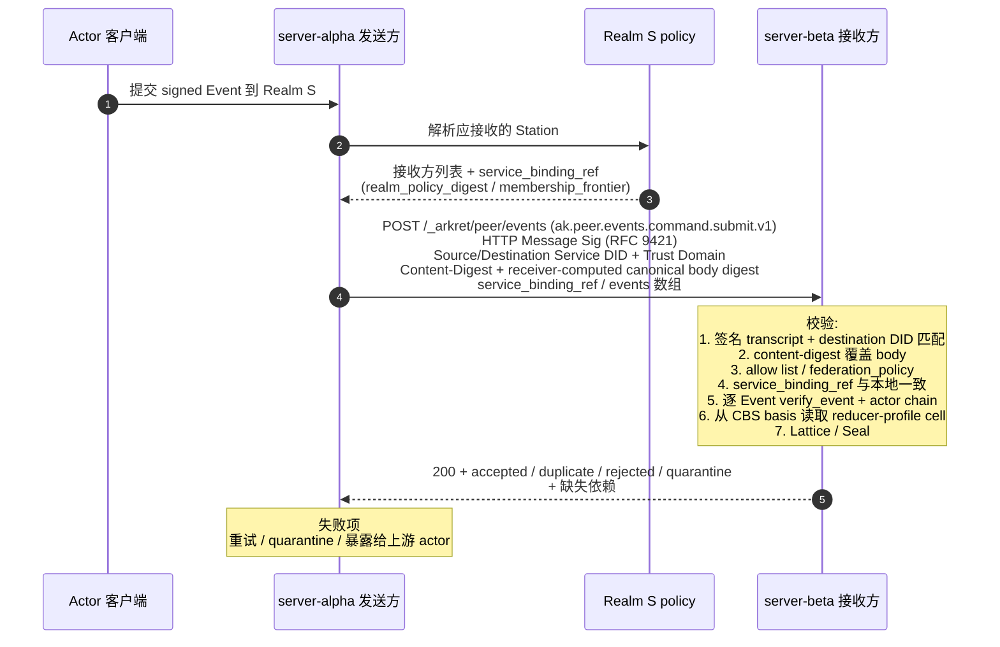

## 0. 规范语言

本文中的规范关键字（**MUST** / **SHOULD** / **MAY** 等）按 [conformance/normative-language.md](../conformance/normative-language.md) 解释；仅大写形式具规范约束力。

## 1. 目标

Arkret 是去中心化协议，不同用户或组织各自运行受控 Station。当来自不同域的 Actor 需要在同一个 Realm 中协作时，Station 之间需要一套**跨域联邦协议 (Federation Protocol)**，定义：

- 节点之间如何互相发现与认证
- 如何安全交换签名 Event Envelope
- 如何处理跨域加入 Realm 的请求
- 如何在异构网络中维持因果一致性

本文 §4 定义联邦 wire transaction 形态；所有联邦 HTTP 绑定以本文和 `service-http-binding.md` / OpenAPI 为准。

## 2. 设计原则

### 2.1 Event Chain 是信任锚点

跨域协作的信任不来自"服务器管理员彼此认识"，而来自**每个 Actor 的 signed Event chain 都是密码学可验证的**。任何节点在接收到来自外部域的 Event Envelope 时，可以独立验证签名、DID、`actor_seq`、`prev_refs` 和授权因果链，不需要信任对方服务器。

### 2.2 Station 是受控同步边界，不是全局权威

联邦场景中没有独立第三方分发服务器角色。Realm 范围传播由参与方 Station 之间的 federation transaction 完成。接收方可以独立验证**已经收到**的 Event Envelope 是否被伪造或篡改，并可在两个已知持有者的同一方向、同一授权披露范围内核对已观察集合；签名、frontier、receipt 或多个 Witness 都不能证明一个从未被任何验证方观察到的 Event 不存在，也不能阻止恶意 source withholding。current-v1 不提供 Realm 历史完整性证明或 completeness authority。

### 2.3 安全确认与普通传播

每个 Realm 的安全状态使用唯一确认序列；普通 Event 使用可携带授权独立接收和因果合流。联邦 Station 不需要全体参与共识。Seal 只用于安全变更，普通数据不等待它推进。

### 2.4 Notary 配置

`notary.kind=quorum` 是唯一配置，n=3f+1、确认需 2f+1，不同 voter 独立且按确切配置验签；f=0 为无副本容错部署。完整协议包含持久投票、prepared 锁和 view change，不能把多签集合直接称为共识。不同 deployment 必须验证同一 Realm 的唯一配置和 lineage；不存在任意多个安全 leaf 的 join 或自动 fallback 新开 lineage。

## 3. 节点间认证

### 3.1 基于 core/DID 的服务器身份与路由

每个 Station / Events API 节点 MUST 拥有一对由注册 method adapter 绑定的身份：业务合同和 `Source-Service-ID` / `Destination-Service-ID` 使用稳定 `did_core_id`；首次注册、control key 与 method history 验证使用完整 bare `did`。默认 method 为 `did:webvh`；仅低风险或外部互通服务 MAY 显式降级为 no-history `did:web`，并 MUST 声明无历史信任强度，见 [`../identity/identity-did.md` §3](../identity/identity-did.md)。首次注册 MUST 提交 `did`，注册方独立解析并验证其 DID Document，再确认 `project(did) == service_id`。

DID Document 同时提供经 method 验证的服务身份、控制密钥和唯一 ArkretService 入口。发送方从业务绑定取得 AuthenticatedServiceResolution 或 resolution_url 发现线索，按 [service-surface.md §2.6](./service-surface.md) 验证完整原生历史、当前状态、新鲜度、service/core/kind 与入口唯一性，再从该入口获取 describe 反向确认。URL、镜像和 describe 均不能替代 DID 权威或业务授权。

### 3.2 请求签名

节点间的 HTTP 请求 MUST 使用 [HTTP Message Signatures (RFC 9421)](https://datatracker.ietf.org/doc/html/rfc9421) 进行签名。接收方使用已接受的发送方 current service resolution / key binding 验证请求。路由和 key state MAY 采用有界 TTL cache，但 cache 只是实现优化：路由缓存过期、method proof/key 变化、binding rebind、HTTP signature key miss 或高风险 freshness trigger 时必须查询当前 DID 状态并重新独立验证；不得从 `did_core_id` 猜测 URL，也不得逐请求无条件解析 method history。

> **PQ-hybrid TLS 联邦姿态**：service-to-service 联邦链路承载的 transaction 元数据多数只靠 TLS 保护，是 Harvest-Now-Decrypt-Later 的暴露面。生产 v1 联邦 TLS 1.3 连接 SHOULD 支持并优先协商混合后量子 group `X25519MLKEM768`（`draft-ietf-tls-ecdhe-mlkem-05`）。在 `ak.profile.high_security_organization.v1`、`ak.profile.sovereign_deployment.v1` 及继承它们的 profile 下，该联邦连接 MUST 协商 `X25519MLKEM768`，对端不提供时 MUST fail closed，MUST NOT 静默降级到纯经典 key exchange。default profile 可按 [`transport-bindings.md` §5](./transport-bindings.md) 的 posture 记录规则回落，但不得宣称该连接具备 HNDL-resistant transport。规范义务的 canonical 表述见 [`transport-bindings.md` §5](./transport-bindings.md)；完整威胁论据见 [`../security/server-threat-model.md` §2.4](../security/server-threat-model.md)。

签名 transcript MUST 覆盖以下 RFC 9421 derived components 与 header 字段：
- `@method`
- `@target-uri`
- `@authority`
- `content-digest`（仅针对有 body 的请求；编码遵循 RFC 9530。无 body 的请求 MUST NOT 携带 `Content-Digest`，`Signature-Input` 也 MUST NOT 绑定 `content-digest`。`QUERY /_arkret/peer/events` 等带 JSON body 的请求 MUST 绑定 `content-digest`）
- `source-service-id`（自定义 header `Source-Service-ID`）
- `destination-service-id`（自定义 header `Destination-Service-ID`）
- `destination-service-endpoint-digest`（自定义 header `Destination-Service-Endpoint-Digest`；shared ingress / 多租户 / allowlist endpoint 场景必填）
- `source-trust-domain`（自定义 header `Source-Trust-Domain`）
- `destination-trust-domain`（自定义 header `Destination-Trust-Domain`）
- `idempotency-key`（自定义 header `Idempotency-Key`；当该 header 参与幂等或 replay key 时必填并进入签名 transcript）
- 签名 parameters MUST 包含 `created` 与 `expires`（不得用 `Date` header 替代）

**签名时效窗口（normative）**：接收方 MUST 拒绝时效不合规的签名（统一归入本节末"时间窗口失效"的最小披露错误）；以下任一 MUST 拒绝——`expires - created` 超过 300s（协议常量，量级同 [`encoding.md`](../conformance/encoding.md) §7.2 的 `hard_future_skew_ms`）、`created` 偏离接收方本地时钟超过 ±30s（量级同 `expected_future_skew_ms`）、或 `expires` 已过接收方本地时钟。**即便有界 replay cache 已 evict 对应条目，落在该签名时效窗口之外的逐字节重放也 MUST 因 `expires` / `created` 校验失败而被拒**：重放防护的有效期由协议常量界定，不交给发送方可控的 `expires` 值与 replay cache 容量。对不携带 `Idempotency-Key` 的 `POST /_arkret/peer/events` 批次，批次级 replay 防护退化为仅靠该签名时效窗口加单事件 `event_id` 去重兜底，故高价值写路径 SHOULD 携带 `Idempotency-Key`。

签名验证规则：

- `Source-Service-ID` / `Destination-Service-ID` MUST 分别绑定来源与实际接收方的 service `did_core_id`，并进入 HTTP Message Signature transcript；共享 Event batch body 不重复携带顶层来源 / 目标字段。
- `Source-Trust-Domain` / `Destination-Trust-Domain` MUST 进入签名 transcript；若 body 或 `service_binding_ref` 中携带来源 / 目标 trust domain，必须与 header 完全一致。
- `Destination-Service-ID` MUST 是接收方 service `did_core_id`；反向代理、多租户 host 或 shared ingress 不能只凭 `Host` 判断目的地。
- `Destination-Trust-Domain` MUST 等于接收方当前 deployment 的 `ServiceDescribe.trust_domain`，并与被接收 Realm 的 `trust_domain` 一致；不一致 MUST 归入本节统一最小披露失败族，对外使用同一鉴权失败 envelope，内部 audit-only reason 记为 `federation_trust_domain_mismatch`。
- 接收方 MUST 校验 `Destination-Service-ID` 对应 当前经 method 验证的 DID 服务入口，并验证 HTTP Message Signature 中的 `@authority` / `@target-uri` host 与该 URL 或 Realm policy 明确授权的 shared ingress 一致；不一致 MUST 归入本节统一最小披露失败族，对外使用同一鉴权失败 envelope，内部 audit-only reason 可记为 `federation_authority_mismatch`。若只绑定 `Destination-Service-ID` 而不校验 `@authority`，同一签名可能被错误投递到另一个虚拟 host。
- shared ingress / 多租户反向代理场景下，TLS Server Name (SNI) 与 当前经 method 验证的 DID 服务入口 origin MUST 直接匹配，或该 exact origin MUST 出现在 Realm policy / service delegation 明确登记的 shared ingress allowlist 中。Wildcard host 不能隐式覆盖 service identity 列表；若 deployment 用同一 host 承载多个 service，发送方 MUST 携带 `Destination-Service-Endpoint-Digest` header（endpoint canonical URL 的 `sha256:` digest），该 header MUST 进入 HTTP Message Signature transcript，接收方 MUST 与 经验证的 DID 入口 / allowlist 中的 endpoint digest 比对。
- 请求带 body 时 MUST 携带 `Content-Digest`；sender MUST 发送 Arkret canonical JSON 作为 exact HTTP message content，receiver MUST 对收到的 exact content bytes 校验唯一 RFC 9530 `sha-256` digest，并拒绝 parse 后再 canonicalize 才匹配的非 canonical wire，完整 byte-level 算法见 [`service-http-binding.md` §2.5.1](./service-http-binding.md)。无 body 的 `GET` pull MUST NOT 携带 `Content-Digest`，`Signature-Input` 也 MUST NOT 绑定 `content-digest`。
- 接收方从已经通过 `Content-Digest` 校验的 exact canonical body bytes 内部计算 Arkret `sha256:<lowercase-hex>`，用于幂等、replay cache 与审计；sender 不再发送第二个等价 `Request-Canonical-Digest` header。无 body 请求不得携带 `Content-Digest`；其查询语义由 method、target、双方 service DID、trust domain 与 endpoint digest 绑定。
- 受保护联邦 endpoint MUST NOT 接受 query string 认证。
- 签名失败、`Destination-Service-ID` 不匹配、digest 不匹配或时间窗口失效，接收方 MUST 返回**统一最小披露**错误响应，对外形态在这几类原因之间 MUST NOT 可区分（详见 §8.3）。具体而言：
  - 这几类失败 MUST 复用 `api-conventions.md` 的标准 JSON Problem Details，并对所有这几类原因返回**同一个** HTTP status 与**同一个** `reason_code`（使用 `error-code-registry` 中已登记的统一鉴权失败码，如 `capability_denied`；不得为不同失败原因返回不同 status / `reason_code`）。错误 envelope 的可见字段 MUST NOT 携带 Realm、Actor、Event、binding 或 frontier 是否存在的任何可区分信息。
  - 响应 timing MUST 归一到统一时间桶（fixed timing bucket），使「destination 不匹配 / 签名失败」等不同原因之间不产生可被观测的时延侧信道；接收方 MUST NOT 在校验成功路径与上述失败路径之间，或在上述各失败原因之间，泄露可测量的处理时延差异。同桶判定使用与 [`models/relation.md` §4.5](../models/relation.md) 一致的可测口径：同一服务端测量点、同一请求类别、同一部署 profile 下，实现 SHOULD 对每类至少采样 30 次，p95 差异 SHOULD ≤ 50ms；声明高安全 profile 时 MUST 使用 padding / jitter 使 p99 也落入同一 bucket。网络传输时间不计入服务端本地口径。
  - 真实失败原因（audit-only reason）MUST 只写入接收方审计日志，MUST NOT 出现在对外响应的 status、`reason_code`、header、body 或 timing 中。
  - 本要求覆盖联邦 ingress 的存在性枚举面：对外 MUST 保持不可区分「Realm / Actor / Event / member binding 不存在」与「存在但本请求鉴权 / 完整性失败」。

### 3.3 域信任模型

Arkret 不要求全局信任列表。每个节点维护自己的**联邦许可列表 (Federation Allow List)**：

- **开放联邦 (Open)**：接受来自任何域的合法签名请求。适合公共协作场景。
- **受限联邦 (Restricted)**：仅接受来自预配置域列表的请求。适合企业内部或联盟场景。
- **封闭 (Closed)**：不接受任何外部联邦请求。适合纯内部部署。

### 3.4 Federation Peer Policy 与整机级 defederation

服务的联邦准入由三层共同决定，且每层都只能收紧，不能放宽上一层拒绝：

1. **部署本地 peer policy**：operator 配置的 `allow` / `deny` 规则，按 exact service `did_core_id`、trust domain 或 DNS domain 匹配。该策略是本地部署控制面，不进入 Realm Event history。
2. **Realm 授权状态**：effective joined member 的完整 ActorId、由其 closed 分支确定的 routing service，以及对应 capability / policy cell。部署 allowlist、service delegation 或已知 peer 本身不取得 Realm Event。
3. **请求级认证与完整性**：HTTP Message Signature、`Source-Service-ID` / `Destination-Service-ID`、trust domain、endpoint digest、body digest、event signature、capability 与 CBS basis。

部署本地 peer policy 的规则：

- `deny` MUST 先于 `allow` 评估；被 deny 命中的 peer 即使同时命中 allow 也必须拒绝。
- `domain` 规则只匹配规范化 DNS A-label 的完整 label 边界；`*.example.com` 可以匹配 `a.example.com`，不得匹配 `example.com` 或 `badexample.com`。实现 MUST NOT 只做字符串后缀匹配。
- service `did_core_id` 规则优先于 domain 规则；当 当前经 method 验证的 DID 服务入口 host 与 `did` method domain 不一致时，接收方 MUST 同时校验 DID method proof、endpoint digest 和 domain/trust-domain policy。
- 入站被本地 peer policy 拒绝的 service-to-service 请求 MUST 先验证 HTTP Message Signature 能解析到 `Source-Service-ID`、`verification_method` 与 `trust_domain`，再 fail closed；验证失败按认证失败处理，验证成功但命中 peer policy 拒绝时 SHOULD 返回 `policy_denied` 或 `capability_denied`，并避免泄露 Realm 是否存在。
- 出站被本地 peer policy 拒绝的 peer MUST 从 fanout、frontier probe、backfill、push、to-device、key-package 和 media/snapshot fetch 目标集中移除。该状态是 policy-suppressed，不是临时网络失败；发送方不得无限重试，直到 policy version 改变或 operator 解除规则。
- 若 operator 执行整机级 defederation，入站和出站规则 MUST 同时生效：既拒收该 peer 的联邦写入 / backfill / probe，也不得向该 peer 投递新事件、推送或补发历史。

v1 不定义可复制的 Realm 级 server ACL。`server_acl` 只能作为本地部署配置名存在；Organization 明确适用于目标 Realm / service 的 `ak.organization.moderation_policy` 可作为额外 deny 层。实现不得接受 `ak.realm.server_acl` 或其他未注册 kind，也不得绕过 capability 检查。

出站解析任意 peer endpoint 前，发送方还 MUST 执行 [`api-conventions.md`](./api-conventions.md) §11.2 的出站网络目标策略；DNS、redirect 或 service discovery 把目标解析到被禁止地址类别时，联邦请求必须 fail closed。

## 4. Event 交换协议

### 4.0 单轨联邦接收（唯一互通入口，normative）

跨域联邦接收**收敛为单轨**：`POST /_arkret/peer/events`（`ak.peer.events.command.submit.v1`）是**唯一**的 federation Event 接收轨。所有跨 deployment 的 Event 接收——包括 DataEvent、Control Move（含 Move / Anchor / Seal-bearing 控制面事件）——MUST 统一走该单一 sealed Event Envelope 通道：

- 每条联邦接收的载体都是签名 `ak.schema.event.v1` Event Envelope（DataEvent 携带 `auth_context.authority_refs`，Control Move 携带 `seal_basis`），由 §3 节点间认证 + §4.1 service binding 快照保护，由接收方按 §4.1.0 独立验证签名 / 因果链 / CBS basis / Seal。不存在第二套按对象类型分轨（如把 Move、Anchor、Operation 拆成不同接收 endpoint）的联邦接收形态。
- **实现私有 peer 入站轨 MUST NOT 作为联邦互通入口**：实现可以在自己的 negative-space root（如 `/_<impl>/peer/...`）下保留部署本地的内部接收 / 调试路径，但这类私有轨 MUST NOT 被任何跨厂商 / 跨 deployment 对端当作联邦投递目标，MUST NOT 接受外部 federation peer 的 Move / Anchor / Operation 推送，也 MUST NOT 在 `GET /_arkret/describe` 的 `supported_operation_bundles` 中作为 federation surface 宣告。它们只能降级为**只读调试 / 部署本地内部** affordance，或整体移除；保留时 MUST 在 `profile_limitations()` 等价声明中标注为 deployment-local-only、非互通入口，且 MUST 与 `/_arkret/peer/events` 施加同等或更严的 §3 service-to-service 认证与授权（不得出现"私有轨有 9421 验签、协议轨反而没有"的姿态倒挂——协议轨 `/_arkret/peer/events` 的 §3.2 RFC 9421 service signature 是 MUST，私有轨不得以更弱姿态接收外部流量）。
- 任一对端把实现私有 peer 轨当作联邦投递目标，或任一接收方在私有轨上接受外部 federation 写入，均视为 federation profile violation；跨 deployment 互通声明（`ak.profile.federation_minimal.v1` 等）只覆盖 `/_arkret/peer/*` 协议轨。

> 唯一受 conformance gate 的联邦接收轨是 `/_arkret/peer/events`，其 9421 验签、trust-domain、destination binding、逐 Event CBS reducer 求值与最小披露失败语义均由 §3 / §4.1 强制。

### 4.0.1 MLS-backed Realm 联邦互操作下界（normative）

任一 federation transaction 携带或依赖 `encryption_profile="mls_rfc9420"` 的 Realm 状态、`ak.mls.genesis`、`ak.mls.commit`、`ak.mls.welcome`、MLS-backed E2EE DataEvent 或 active MLS security-frontier projection 时，接收方 MUST 把 [`crypto-media/encryption-and-audit.md`](../crypto-media/encryption-and-audit.md) §2.5 的 `ak.profile.mls_governance_binding.full.v1` 视为 MLS 联邦互操作下界。该下界至少包含：

- `governance_binding.binding_profile` 与 `governance_binding.reducer_profile` 均存在；后者必须等于该制品绑定 frontier 下 Realm reducer-profile cell 的 settled value，并位于验证方的 `supported_reducer_profiles`；
- `ak.mls.commit` 的 MLS GroupContext extensions 中存在固定 codepoint `mls_governance_binding` (`0xF1C0`)，并且 extension bytes、Event payload 与 registered current winning group-state projection 相互匹配；
- `security_frontier_digest` 必须从 accepted key-access state 独立重算；E2EE DataEvent 的 group/epoch 必须指向当前 digest，普通 `auth_context.authority_refs` 另行按 Event admission 验证；
- peer 的 `ServiceDescribe.supported_profiles` / `supported_features` 声明足以支持该下界；仅支持 payload fallback、替换私用 codepoint 或省略 GroupContext extension 的 peer 不满足下界。

`ak.profile.e2ee_relaxed.v1` 是低于上述下界的显式降级声明，而不是另一个 full binding 等价形态。它只允许在 `federation_policy="closed"` 或满足 `encryption-and-audit.md` §2.4.1 federation guard 的 `restricted` Realm 中跨 peer 传播；`open` / `quarantine` federation MUST reject。restricted federation 中，所有参与 peer 还必须在 describe 中声明 `ak.feature.e2ee_relaxed.v1`，并公开不超过 `relaxed_window_max_ms` 的 fanout SLA；无法证明时接收方 MUST fail closed。

**relaxed peer 集合的可审计登记（normative）**：E2EE 下界判定 MUST NOT 仅挂在"对端自声明 describe + 部署本地 allowlist"两个非 Realm-state、非密码学绑定的输入上——前者是对端单方面可随时变更的 HTTP 响应，后者是 operator 本地配置、不进 Realm Event history、不可被成员密码学审计。因此在 restricted Realm 中参与 `e2ee_relaxed` 密文传播的 peer 集合 MUST 在 Realm policy（可审计 Control Move，如 federation peer 登记事件）中显式登记其 service DID；接收方 MUST 把对端 describe 的 `ak.feature.e2ee_relaxed.v1` 声明与该 Realm-sealed peer 授权**交叉校验**，仅当 service DID 同时出现在 Realm policy 登记集合与 describe 声明中时才接受其为降级密文的合法收发方。仅凭本地 allowlist + describe 自声明 MUST NOT 单独授权 relaxed 传播。

Fail-closed 条件：

- peer 不声明或不支持所需 full / relaxed profile；
- `binding_profile` 缺失、未知、与 Realm policy 不一致，或 full Realm 上出现 relaxed binding；
- `reducer_profile` 缺失，或与该制品绑定 frontier 下的 Realm reducer-profile cell 不一致；
- `0xF1C0` extension 缺失、被其它私用 codepoint 替代、或 extension canonical bytes 与 Event payload 不一致；
- current winning MLS group state 未覆盖最新 key-access security frontier，或把普通 capability/metadata Seal 错误吸收到该 frontier；
- relaxed federation guard 中任一 SLA、窗口或 federation_policy 条件无法证明。

上述失败 MUST 在接收方推进本地 Realm frontier 前处理：写入型 push 返回 reject/quarantine 或 `temporarily_unavailable`，pull/backfill 结果保持未验证，不得清除 `state_mismatch`，snapshot/frontier witness 也不得把该 MLS epoch 标为可用。错误对外仍遵守 §3.2 / §8.3 的最小披露原则；内部 audit reason 可以记录为 `unsupported_profile`、`e2ee_relaxed_audit_binding_conflict`、`e2ee_relaxed_federation_policy_unsupported`、`mls_governance_binding_stale` 或对应 binding mismatch 族。

### 4.0.2 Principal-private peer 投递与 KeyPackage command 不是共享 Event 接收轨（normative）

`/_arkret/peer/invites`（`ak.peer.invites.command.submit.v1`）与 `/_arkret/peer/contacts`（`ak.peer.contacts.command.submit.v1`）是 Principal-private 事实投递面：前者承载目标 holder 的 invite command submit envelope；后者只承载联系人请求 / 响应 / scope replacement / tombstone 的原签名 `ak.contact.*` envelope，用于把 principal-scoped Contact fact 投递到对端 Station。`/_arkret/peer/keys/keypackages/claim` 与 `/_arkret/peer/keys/keypackages/claims/query` 则是目标 KeyPackage authority 的原子 command / outcome-query 面，不承载 Event。三类 surface **MUST NOT** 接受共享 Realm durable Event，**MUST NOT** 推进共享 Realm reducer、Seal、CBS frontier 或 state root，也 **MUST NOT** 被实现当作 `/_arkret/peer/events` 的并行替代 fanout 通道。Direct Conversation 的 binding、Realm、member、Strand 与 MLS Event 只能走 `ak.peer.events.command.submit.v1`——founding 四 Event unit 走 §4.0.4 的 `direct_conversation_founding` branch，其余走通用 branch；`/_arkret/peer/contacts` 不得镜像或夹带 `ak.direct_conversation.bound`；KeyPackage surface 只改变目标 authority 的 KeyPackage lifecycle 与幂等 ledger。

这些 endpoint 仍属于 `/_arkret/peer/*` 联邦协议面，因而 MUST 复用 §3 的 service-to-service HTTP Message Signature、trust-domain、destination binding、body digest、最小披露错误和 replay 防护。invite / contact 接收方只把 payload 投影进目标 holder 的 principal control / account-private 处理路径；KeyPackage authority 还 MUST 执行 [`../crypto-media/device-lifecycle.md` §9.2](../crypto-media/device-lifecycle.md) 的 participant authorization、唯一 CAS、幂等 ledger 与反枚举 gate。任何尝试在这些 endpoint 中夹带共享 Realm Event Envelope 的请求 MUST fail closed（`schema_violation` 或 `capability_denied`，对外仍遵守最小披露）。

### 4.0.3 Signal peer relay 不是 Event federation（normative）

`/_arkret/peer/signal`（`ak.peer.signal.command.relay.v1`）是 `ak.profile.signal_peer_relay.v1` 的可选、
encrypted-only、单跳、best-effort Signal Extension surface。它承载
[`signal.md`](./signal.md) 的原 producer-signed `SignalEnvelope`，MUST NOT：

- 分配 Event ID、推进 `actor_seq` / Realm frontier / Seal / CBS state；
- 写入 durable Event log、backfill、snapshot 或 federation ack；
- 复用 `/_arkret/peer/events` 的 transaction/idempotency ledger；
- 解密、重签、改写或重加密 producer envelope；
- 从 destination 再转发第三 peer。

它仍属于 `/_arkret/peer/*` trust surface，MUST 完整复用 §3 的 service DID、trust domain、
endpoint、canonical body digest、HTTP Message Signature 与最小披露错误；该 operation 另外把
`expires-created` 收紧为 5 秒，禁止 `Idempotency-Key`，不确定结果固定
`drop_unconfirmed`。source 必须是每个 sender actor/device 的 current joined-member ActorId routing projection；
source 执行 exact account-device current authorization 与 producer signature 检查；destination 验证
已认证 source/body、sender routing projection、proof transcript/digest、scope/Seal/current membership、
class/TTL 与外层 MLS basis，不查询远端设备目录、不执行 producer signature 验签，也不维护 MLS
public-tree tracker。recipient 在展示前独立完成 current device trust、producer signature 与 MLS/AEAD
绑定。destination 只按 outer `scope_ref` 计算本地 eligible devices，精确产品 kind/target 位于 ciphertext，
不得按 kind 广告、路由或返回结果。

schema-valid、已认证 request 即使 Realm/scope/sender 未知、proof transcript/digest 或 current joined-member
ActorId routing authority 不成立，或所有 signal 都过期、重复、不可见、policy-denied、没有 local
recipient，也只返回 opaque `{"accepted":true}`；只有外层 peer auth、跨 Realm batch 及
body/schema/count/byte 失败才拒绝。完整 batch、签名窗口、重复/乱序、资源隔离与 conformance
合同以 [`signal.md` §4](./signal.md) 为准。

### 4.0.4 Direct Conversation founding exception（normative）

Direct Conversation Realm 尚不存在时无法取得普通 `federation_peer` authority，因此
[`../identity/contact-and-direct-conversation.md` §5.6](../identity/contact-and-direct-conversation.md)
要求的那条封闭例外在此登记：`ak.peer.events.command.submit.v1` 的 request union MUST 包含 discriminated
branch `DirectConversationFoundingFederationSubmission`（discriminator
`unit_kind="direct_conversation_founding"`）。这不是新 endpoint，也不是私有轨；§4.0 的单轨结论不变。

该 branch MUST 精确承载：

- 恰好四条按 `contact-and-direct-conversation.md` §6.1 wire 顺序排列的 `EventFederationSubmission`
  （`ak.realm.create` → 另一 participant 的 `ak.member.state{join}` → `ak.strand.create`）；
- 一张 source `DirectConversationFoundingAcceptanceReceipt`；
- 验证该 unit 所需的 bounded dependencies（`cbs_proof_bundles`、Contact round evidence 与 producer signer evidence closure）；四条 Event 各自携带唯一 producer proof，接收方从其 `signer_resolution_evidence_ref` 独立解析 exact actor key。认证的 `Source-Service-ID` 只标识本次 transport relay，不得被要求等于任一 Event 的 `actor_id.account_id.station_id` 或 receipt issuer。

该 branch MUST NOT 携带 `service_binding_ref`：Realm 在接收方尚不存在，普通 Realm-scoped service binding
快照无从计算；destination 绑定改由 §3 的 service DID / trust-domain header 与下述 receipt 校验承担。

接收方每次 MUST 按固定顺序 fresh 验证，任一步失败即整组零写入：

1. §3 的 service-to-service 认证、`Source`/`Destination` service DID 与 trust-domain header 成立；
2. 独立验证 receipt 签名、issuer 的可携带 service signer evidence，以及 receipt 与 `founder_id`、完整 founding unit 的绑定；receipt 由服务迁移前的旧 service 签发时，还 MUST 验证该 issuer 的历史方法证据与 cutover/fence 连续性。transport source 可以是其它已认证 relay，其身份不进入 founder 或 Event 授权结果；
3. `Destination` 承载本地 participant，且该 participant 恰为该 pair 中非 founder 的一方；
4. body 只含该 unit、该 receipt 与 bounded dependencies，无第四条 Event、无其它 Realm 的 Event；
5. 重算 `founding_unit_digest` 并与 `receipt.founding_unit_digest` 逐字比对，重算 `realm_id` /
   `main_strand_id` 并与 receipt 逐字比对；
6. 该 create 通过 `contact-and-direct-conversation.md` §5.4 的全部 admission 校验与 §6.2 的固定 baseline 投影。

该 branch 是 registered atomic unit：Contact round 镜像或其它 bounded dependency 尚未到达时 MUST 返回
top-level HTTP 409 `dependency_missing` 与 `EventsDependencyMissingProblem` 并零写入，随后可重试；
MUST NOT 放行、MUST NOT 永久拒绝、MUST NOT 退化为 per-item partial，也 MUST NOT 只接受其中一或两条 Event。
Realm 在接收方 accepted 后，该 pair 的后续 Event 立即回落普通 federation 规则与普通 batch 分支。

### 4.1 推送模式 (Push)

> **v1 联邦使用专用 peer HTTP API surface**。跨域 Event 推送、拉取、补洞与 frontier probe 必须使用 `/_arkret/peer/*` 路径和 `ak.peer.*` operation_id。`/_arkret/self/*` 是当前 principal / 自服务会话攻击面，不承接 federation server-to-server wire。本节描述的所有规则适用于 `ak.peer.events.*` 与 `ak.peer.seals.*` 调用。

本文件中的联邦载荷项是 v1 规范性 Event Envelope。请求与响应体中的共享事实字段使用 `events[]`，不引入第二套 Operation wire object。

当 Actor A（托管在 `server-alpha.com`）向 Realm S 提交了新 Event，而 Realm S 的另一参与方 Station `server-beta.com` 也服务同一个 Realm 时：

1. `server-alpha.com` 检测到新 Event 属于跨域 Realm
2. `server-alpha.com` 从 Realm policy / membership / service delegation 中解析应接收该 Event 的对端 Station，并生成接收方服务绑定快照
3. `server-alpha.com` 向 `server-beta.com` 发送推送请求：

**实时 fanout 的责任与目标集合（normative）**：首次接受本地 Actor 所签 Event 的 Station 是该 Event 实时 push 的唯一编排方；通过 `/_arkret/peer/events` 收到该 Event 的 remote Station MUST 验证、持久化并服务其本地成员，但 MUST NOT 因该次 peer ingress 再创建第二轮实时 fanout。缺失副本通过 frontier probe、pull、backfill 或 snapshot 修复，不能靠接收方无界转广播。

对 Realm 共享 Event，发送方 MUST 从同一 accepted Realm view 取所有未撤销的 effective joined member ActorId，按 `common-fields.md §4.2` 的封闭规则投影 routing service，排除本机并按 service `did_core_id` 去重。多个成员由同一 remote service 托管时只创建一份 Event transaction。bot、service、notary、archive 或 search projection 若要持有 Realm Event，必须成为显式 joined ActorId，并受 membership、capability、E2EE 与 plaintext visibility 约束；已知 peer、allowlist、mirror、resolver 或部署拓扑都不自动取得内容。

面向单个成员的 to-device、push、KeyPackage、邀请或其它 direct rail 只使用该成员 ActorId 投影出的 exact routing service，MUST NOT 扩张为 Realm fanout。发送方对目标集合中的每个 distinct service MUST 创建独立、持久的 outbox intent；本地 Event 的 accepted 状态、按 service DID 去重后的完整目标集合与全部 outbox intents MUST 在同一 durable transaction 中提交。任一写入失败时整个事务回滚。

目标暂时缺少 verified route **不得**拒绝已经通过 admission 的本地 Event，也不得返回 `service_unavailable` 来撤销本地 acceptance。该目标必须以 `pending_route` 状态原子写入；已有 verified route 但尚未收到 peer 成功响应的目标写为 `pending_delivery`。两种 pending 状态都必须跨重启恢复、按同一 idempotency key 重试，并在超过部署运维阈值后告警；只要冻结的接收 authority 仍有效，就不得因 TTL、尝试次数、dead-letter 上限、cache eviction 或进程重启静默终止义务。

每个 intent MUST 冻结目标 service `did_core_id`，以及使它获得投递 authority 的非空 member-witness 集。**一个 witness 是完整三元组 `(realm_id, member_id: ActorId, membership_event_ref)`，不是其中任意一个字段。** 每次真正发送前，发送方 MUST 在同一当前 accepted Realm view 中验证该 witness 的全部条件同时成立：完整 ActorId 仍是 effective joined、其 effective membership Event ref 与冻结值逐字相等，并且 `route(member_id)` 等于 intent 的冻结目标 service。只有至少一个**完整 witness**通过全部条件，目标才仍有权接收；这是 tuple 内 AND、tuple 间 OR，MUST NOT 跨两个 witness 拼凑条件，也 MUST NOT 把恒定的 ActorId routing projection、可达 endpoint 或 service resolution 当成独立授权 witness。全部 witness 失效时 intent MUST 原子进入 terminal `cancelled_authority_lost` 且绝不发送。

同一 service DID 的 endpoint/record 更新只刷新 transport route，MUST NOT 改变冻结 witness、target identity 或原幂等键。AccountId 的 Station 分量变化意味着另一完整 ActorId，不是旧 intent 的 route 更新；之后同一 principal 以新 AccountId、其它 ActorId 或新 membership Event 重新加入，只能影响新 intent，MUST NOT 复活或重定向旧 intent。多个 frozen members 共享同一 service 时，一个成员退出不影响其它仍完整有效的 witness。

只有经过 transport 认证、schema 校验和本轮授权求值后，目标 exact `event_id` 出现在响应**顶层当前求值**的 `accepted[] ∪ duplicate[]` 中，source 才能把该 Event / destination intent 置为 terminal `delivered`。HTTP 2xx、批次 `status`、写入 socket、`sent_at`、attempt count、batch receipt，或 `status=historical_only` 的 `original_outcome` 都不是该逐项当前 delivery evidence；同批未出现于该集合的 Event 必须保持 pending 或按其当前 rejection 处理。`pending_route`、`pending_delivery`、`delivered`、`cancelled_authority_lost` 是 Realm Event fanout 的封闭 target 状态；其中前两者计入 pending，后两者不再欠投递。普通 self submit outcome 只返回汇总 `pending_delivery_count`，不得泄露 target service；consumer 将 count 为 0 派生为 `complete`，非零派生为 `pending`。这里的 `complete` 只表示 source 当前没有未结 fanout intent，不表示 destination 当前仍持有 Event 或 Realm 历史完整。`accepted` 只表示本地 canonical acceptance，不表示所有 remote target 已交付。delivery-status 读取返回完整 `targets[]`，count 与 state 均从 target 状态派生而不上 wire。

认证调用者通过 `ak.self.events.read.delivery_status.v1` 读取自己可见 Event 的当前 target 状态。响应按 opaque `target_id` 排序并始终返回完整 frozen target set；只有调用者按当前 Realm membership/history/plaintext visibility 规则可读取产生该 target 的 joined-member ActorId routing projection 时，对应 row 才可携带 `service_id`。未知 Event 与不可见 Event 使用同一 `not_found`，不得通过 target 数量或 service id 枚举隐藏成员拓扑。

```
POST /_arkret/peer/events
Host: server-beta.com
Source-Service-ID: ak:did_core:webvh:z4YZEfM4SYVUdnZbosrGu69JK
Destination-Service-ID: ak:did_core:webvh:z2z1rvs6FuSuJWQcRMn6p8K3m
Destination-Service-Endpoint-Digest: sha256:<hex>
Source-Trust-Domain: ak:trust_domain:did.webvh.alpha.example
Destination-Trust-Domain: ak:trust_domain:did.webvh.beta.example
Content-Digest: sha-256=:<base64>:
Idempotency-Key: <opaque-key>
Signature-Input: sig1=("@method" "@target-uri" "@authority" "content-digest" "source-service-id" "destination-service-id" "destination-service-endpoint-digest" "source-trust-domain" "destination-trust-domain" "idempotency-key");created=...;expires=...
Signature: sig1=:base64...:
```

请求字段（service-to-service 形态）。`service_binding_ref` 是 federation transaction 的请求级元数据，不是独立 durable Event kind；其授权来源只能是 effective joined membership frontier 中的完整 ActorId 及其路由投影。

| 字段 | 位置 | 类型 | 必填 | 说明与约束 |
| --- | --- | --- | --- | --- |
| `Source-Service-ID` | header | `did_core_id` | required | 来源 service 稳定身份；与签名 transcript 绑定。 |
| `Destination-Service-ID` | header | `did_core_id` | required | 目标 service 稳定身份；MUST 与 当前经 method 验证的 DID 服务入口、目标 URL 和 Realm policy 委托一致。 |
| `Destination-Service-Endpoint-Digest` | header | `sha256:<hash>` | conditional | shared ingress / 多租户 / allowlist endpoint 场景 required；endpoint canonical URL 的 digest，MUST 进入签名 transcript，并与独立验证后的 当前经 method 验证的 DID 服务入口 或 Realm policy allowlist 匹配。 |
| `Source-Trust-Domain` | header | `id:trust_domain` | required | 来源 deployment trust domain；与签名 transcript 绑定，用于 receiver trust policy、审计与跨域 replay 隔离。 |
| `Destination-Trust-Domain` | header | `id:trust_domain` | required | 目标 deployment trust domain；MUST 等于接收方 `ServiceDescribe.trust_domain` 与目标 Realm `trust_domain`。 |
| `Idempotency-Key` | header | `string` | conditional | 当发送方希望请求级幂等、批次 replay key 或 partial retry 去重时 required；该 header MUST 进入 HTTP Message Signature transcript。 |
| `Signature-Input` | header | `string` | required | HTTP Message Signature 输入；MUST 至少绑定 `@method`、`@target-uri`、`@authority`、`source-service-id`、`destination-service-id`、`source-trust-domain`、`destination-trust-domain`，以及 `created` / `expires` 参数。有 body 请求 MUST 额外绑定 `content-digest`；无 body 请求 MUST NOT 绑定它。出现 endpoint digest 或 Idempotency-Key 时也 MUST 绑定对应 header。 |
| `Signature` | header | `string` | required | 来源 service DID 的 HTTP Message Signature。 |
| `Content-Digest` | header | `sha-256=:...:` | conditional | 仅有 body 请求携带（`POST /_arkret/peer/events` required）；MUST 按 [`service-http-binding.md` §2.5.1](./service-http-binding.md) 覆盖 exact canonical HTTP content bytes。接收方 MUST 在 JSON 业务解析与验签前对 exact bytes 重算并校验，且 MUST 拒绝 `sha256=:` alias、非 canonical JSON wire 与 parse-then-canonicalize verification。无 body 的 `GET` pull MUST NOT 携带该 header，`Signature-Input` 也 MUST NOT 绑定 `content-digest`。 |
| `events` | body | `EventFederationSubmission[]` | required | 每项包含完整签名 `event`。普通在线投递必须省略 `authorization_lease` 且 `ingress_receipts[]` 为空；显式选择有限期延迟执行合同时才携带该合同要求的 lease/receipt；普通离线聊天不要求两者。Control Move还可携带唯一 `control_proposal_ack` authority set，DataEvent禁止该字段。receiver独立重算 Event digest、当前 admission 与可选离线证据。 |
| `cbs_proof_bundles` | body | `CbsProofBundle[]` | optional | 最多 64 个 receiver-relative CBS 依赖 bundle。bundle 可以是有界、完整可验证的超集，不要求字节级最小；每个内含对象独立验签、重算 root 与 reducer，缺项返回精确 missing refs。 |
| `service_binding_ref` | body | `object` | required | 接收方服务绑定快照（v1 联邦特有的请求级元数据；client write 时省略）。 |
| `service_binding_ref.realm_id` | body | `id` | required | 本请求唯一受影响的 Realm；每个 `events[].event.realm_id` 与每个 bundle 中可归属 Realm 的对象 MUST 与其逐字相等。多 Realm 投递 MUST 拆成独立请求。 |
| `service_binding_ref.realm_policy_digest` | body | `sha256:<hash>` | required | 发送方用于判定接收方委托关系的 Realm policy hash。 |
| `service_binding_ref.membership_frontier` | body | `id[]` | required | membership / policy 因果前沿。 |
| `service_binding_ref.destination_kind` | body | `string` | required | 目标服务类型，例如 `station`。 |

Reducer profile 不属于投递关系，因此 `service_binding_ref` 不携带 profile。接收方从 Event 的已验证授权上下文解析精确 reducer 合同：普通数据使用 `auth_context.authority_refs`，安全命令使用唯一确认的 `seal_basis`。缺依赖 pending；未实现的合同返回 `unsupported_profile`；不能用接收方较新的合同静默重解释旧写入。

每个 federation Event MUST 原样携带唯一 producer proof 及其 `signer_resolution_evidence_ref`。接收方独立重算 Event 身份、验签、解析精确 signer 授权和 `auth_context.authority_refs` 或安全命令的 `seal_basis`。HTTP service signature 只认证传输；来源服务无需等于作者原账号 Station，relay 不重签 Event。普通消息可以由 B 首次接收再传播，Agent 使用同样的可携带证据闭包。缺少必要证据 pending，已知撤销立即限制新 live 投递，持久历史按授权关闭集合重分类。

### 4.1.0 推送时序

下图把 push transaction 的握手画成时序图。**信任根是签名 Event 本身 + RFC 9421 HTTP Message Signature + 接收方服务绑定快照，不是任何一方服务器的本地数据库。**



读图要点：

- 接收方独立验证每个 Event 的签名与因果链，不信任发送方服务器；服务器之间的握手只是传输面认证。
- 每个 Event 按自己的 CBS governance basis 选择 reducer；同批可以包含 upgrade 及其后继，只要 control-before-data、依赖、Seal 与原子 unit 规则成立。
- 批内单 Event 失败 **不**回滚同批已接受 Event；依赖同批失败项的后续 Event 必须 `dependency_missing` / `causal_conflict` 拒绝或 quarantine。

### 4.1.1 批量推送与幂等

Arkret v1 联邦推送使用 `POST /_arkret/peer/events`（`ak.peer.events.command.submit.v1`）：

- 幂等以 `(Source-Service-ID, Destination-Service-ID, event_id)` 逐事件去重；接收方对重复 `event_id` 且内容一致 MUST 在 `duplicate[]` 中确认（幂等 no-op）而非报错，carried ID 不等于重算 ID MUST 以 `event_id_digest_mismatch` 拒绝；只有 §4.5.1 定义的 full-hash collision evidence 才以 `witness_disagreement` 整组隔离。
- 批次级重放检测使用 receiver 从已验证 exact body bytes 计算的 canonical digest 与签名覆盖的 `Idempotency-Key`；不引入额外 path 事务 ID。
- `quarantine[]` 是 `EventsSubmitOutcome` 的独立响应字段；实现 MUST NOT 把隔离项折叠进 `rejected[]`。非协议 adapter 的本地展示行为不改变 wire outcome。
- Agent Event 与其它 Event 共用逐项 outcome，不产生另一张准入凭证。source 保留原 Event、producer evidence 及所有递归依赖；destination 的成功响应表示本地持久化，不为作者创建 authority。exact retry 返回持久结果。`ak.vector.federation.agent_admission_receipt_handoff.v1` 校验的是这一证据交接和去重边界。
- 持续同步、批量重试和 frontier 交换通过组合 `ak.peer.events.command.submit.v1`（推送，本节）、`ak.peer.events.read.scan.v1` / `ak.peer.events.read.resolve.v1`（拉取 / backfill / 补洞，§4.2）与 `ak.peer.events.read.frontier.v1`（§4.5）完成；无需额外的有状态事务 endpoint。

**outbox 崩溃 / 重试矩阵（normative）**：destination 在 durable commit 前崩溃不得确认该 Event；commit 后、响应发送前崩溃时，source 的 byte-identical retry 必须取得 `duplicate[]` 中的逐项确认；source 收到合法 outcome 但在持久化 `delivered` 前崩溃时，恢复后必须允许安全重试并由同一 duplicate 语义收敛。destination 从旧备份恢复或丢失 accepted store 后，历史 `delivered`、batch receipt 或 `historical_only.original_outcome` 不得阻止按当前授权执行 backfill；它们也不构成永久 retention 承诺。协议不新增 delivery ledger、`delivery_seq`、通用 signed ACK 或第二套 receipt 作为另一真相源。

### 4.2 拉取模式 (Pull / Backfill)

当节点发现自己的验证图中存在缺失（`prev_refs` 引用了本地没有的 Event，或 `refs[role=authorized_by]` 所指 grant record 无法从本地 sealed control history 重建）时，可以主动向源 Station 的 peer surface 拉取对应历史。`authorized_by` 仍保留 `ak:grant:` id，不得改写为承载 Event alias；接收方从回填的 control Event 与 Seal 重建 grant record 后继续验证。v1 联邦 Event pull 使用 `ak.peer.events.read.scan.v1`（`QUERY /_arkret/peer/events`），JSON content 的 `before` 表示历史回填（取该 cursor 之前最近一批），认证使用与 §4.1 同一套 service signature header：

```
QUERY /_arkret/peer/events
Content-Type: application/json

{"realms":["ak:realm:..."],"before":"<cursor>","limit":100}
Host: server-alpha.com
Source-Service-ID: ak:did_core:webvh:z2z1rvs6FuSuJWQcRMn6p8K3m
Destination-Service-ID: ak:did_core:webvh:z4YZEfM4SYVUdnZbosrGu69JK
Signature-Input: ...
Signature: ...
```

v1 的 peer pull **只有**这一种带 JSON body 的 `QUERY` 形态，没有无 body 的 `GET` pull。它因此 MUST 携带 `Content-Digest` 并把 `content-digest` 签入 covered components；示例中的 `Signature-Input: ...` 为省略写法，实际 covered components 以 §3.2 为准。

请求字段（query；完整参数集与默认顺序规则见 [`service-http-binding.md` §3.3](./service-http-binding.md)）：

| 字段 | 位置 | 类型 | 必填 | 说明与约束 |
| --- | --- | --- | --- | --- |
| `realms` | query | `id[]` | required | 请求回补的 Realm。 |
| `before` | query | `cursor` | conditional | 取该 cursor *之前*（排除）的最近一批；历史 backfill 主用例。`before` 与 `after` 至少给其一，否则服务端按隐式 `before=<server_head>` 处理。 |
| `after` | query | `cursor` | conditional | 取该 cursor *之后*（排除）的最近一批；catch-up 场景使用。 |
| `order` | query | `enum(default, ascending, descending)` | optional | 联邦 pull 默认沿用 §3.3 "近邻先返回" 规则——仅 `before` 时 descending，仅 `after` 时 ascending；reducer-导向场景显式 `order=ascending`。 |
| `limit` | query | `int` | optional | 返回数量上限；服务端 MUST enforce 最大值（见 [`scalability-constraints.md`](../conformance/scalability-constraints.md)）。 |

响应字段（closed `PeerEventsQueryOutcome`）：

| 字段 | 类型 | 必填 | 说明与约束 |
| --- | --- | --- | --- |
| `events` | `object[]` | required | Event Envelope 数组；每项 MUST 保持原始签名信封。scan 只用于发现可见候选与 cursor，不提供独立 publication evidence，也不得直接授予本地 acceptance。批次内顺序按 `order` 规则与"近邻先返回"默认（[`service-http-binding.md` §3.3.3](./service-http-binding.md)）。 |
| `prev_cursor` | `cursor` | optional | 朝**更旧事件**方向的延续位置；下次请求传入 `before=<prev_cursor>` 继续历史 backfill。 |
| `next_cursor` | `cursor` | optional | 朝**更新事件**方向的延续位置；下次请求传入 `after=<next_cursor>` 继续 catch-up。 |
| `has_more` | `boolean` | required | 是否仍有可拉取的 Event；客户端到达 oldest accessible event 时 `false`。 |

peer scan response MUST NOT 携带 `realm_state_snapshot_bootstrap`；v1 core 没有 peer snapshot manifest、签名、chunk 或失败回退合同。若接收方需要直接按 event id / digest 补洞或把 scan 候选送入本地 admission，必须使用 `QUERY /_arkret/peer/events/resolve`（`ak.peer.events.read.resolve.v1`），不得改用 self surface。resolve 的 `events[]` 元素是 `EventFederationSubmission`：source 从首次 durable acceptance 原样投影独立 Control Proposal Ack、membership compensation carrier、Ack-less human self-principal 的 stable admission evidence 以及可选 delayed-publication lease/receipt；receiver 复用 push admission。source 不得在 read 时补签或按当前状态重建这些证据。Ack-less evidence 必须与 Ack 互斥；receiver 必须按 origin-authority replay 规则验证 Event、source Station、producer device、accepted device-authorize dependency、device generation 与 signed Seal basis，不能只信 sidecar 字段。其它需要 Ack 的 Control Move 缺 Ack 必须 fail closed。覆盖 Seal 证明 effectiveness，不替代首次 publication evidence，也不把 pending Move 自动降格为 historical-only acceptance。

**Pull 授权 freshness（normative，与 §8.5.1 互补）**：§8.5.1 处理的是 push 路径——把 service key state 一起进入 idempotency cache key，从而在 cache hit 时仍重做授权检查；而 pull 路径根本**不进幂等缓存**：无 body 的 `GET` pull 省略 `Content-Digest`（§3.2），因此不像 push 那样把 receiver-computed canonical body digest 纳入幂等缓存键。两条路径用**不同机制**关闭同一个"撤销后重放"窗口（push 靠 cache-key 绑定 + cache hit 重校验，pull 靠每次请求强制重新解析 service binding freshness），互为补充而非镜像对称。每次 pull 请求，接收方（被拉取的源服务）MUST 在返回事件前重新解析并校验请求方 `Source-Service-ID` 的 service binding freshness——当前 `verification_method` 仍 active、未 revoke，且该 source 在目标 Realm policy 下仍持有 `federation_peer` 角色——并 MUST NOT 因 `(Source-Service-ID, query)` 命中任何幂等 / 响应缓存而豁免该重新授权检查。请求方 service key 已 revoke 或 service binding 已被 Realm policy 移除时，MUST 返回 `capability_denied` / `policy_denied`，不得从缓存回放历史事件批次给已失权的 puller。

`ak.peer.events.read.scan.v1` 只作为小历史或 operator-triggered 的 best-effort 兼容 fallback；它不是每次 frontier mismatch 的 routine 路径，也不保证动态权限、持续写入、重启或长历史下确定终止。cursor 只绑定当前 live query scope，不是 immutable accepted-set generation；cursor 过期 / 完整性失败、并发 snapshot stale、分页或本地资源预算耗尽必须显式停止或重启该 fallback，并作为本地 `reconciliation_incomplete` 诊断处理，MUST NOT 单独累计 peer failure、产生 quarantine 或指控 fork。每页仍须重新验证 current authorization，撤权后立即 fail closed。若未来要声明 deterministic disaster recovery，必须另行登记 frozen generation、current-auth recheck、revocation、expiry / restart 与有界资源合同；本 operation 当前不作该声明。

### 4.3 重复与幂等

- 同一个 `event_id` 的 Event MAY 被多个 Station 推送多次
- 接收方 MUST 以 `event_id` 去重
- 内容相同的重复推送 MUST 幂等接受
- 每个推送 Event MUST 先按 encoding §4.0 重算完整 Event ID。carried ID 不等于重算 ID MUST 以 `event_id_digest_mismatch` 拒绝；只有 §4.5.1 定义的 full-hash collision evidence 才按 [operations-sync.md](./operations-sync.md) §12 整组隔离并报 `witness_disagreement`，不得退化为 `duplicate_conflict`、`causal_conflict` 或 `state_mismatch`。

### 4.4 Capability Revoke Fanout

`ak.capability.revoke`、superseding grant、membership removal、ban、device/session revoke 和会使既有 allow cache 失效的 policy change 是高优先级 auth state。源 Station 在接受这类 Event 后，MUST 主动推送给所有当前已知的相关 Station，而不是只等待对端下一次 pull：

- fanout 目标包括 Realm policy / membership / service delegation 中声明的 shared notary / Station sync surface、受影响 subject 的 Station、grant issuer / delegatee 所在 Station，以及正在服务该 Realm 的 federation peer。
- 推送 payload MUST 包含原始 Event Envelope、必要 auth refs、当前 auth frontier 或可验证 snapshot reference，便于接收方立即失效 capability cache。
- 接收方即使暂时无法完整验证该 revoke，也 MUST 将匹配 scope 的 allow cache 标记为 stale / `revocation_freshness_unknown`，直到 backfill 完成。
- fanout 失败时，源服务器 MUST 保留重试队列并在后续 federation transaction、frontier probe 或 pull 响应中暴露缺失诊断；不得因单个 peer 不可达而回滚已 accepted revoke。

该主动推送只加速缓存一致性，不替代接收方对签名、Event refs、CBS basis、Lattice、控制面 `state_root` 和 policy 的独立验证。

#### 4.4.1 Account Deactivation Federation Fanout

`AccountStatusRecord` 进入 terminal / `deactivated` 状态时，首个接收 Station MUST 把原始 signed record 主动推送给所有曾持有该 exact AccountId 的 device/KeyPackage/to-device/push-route 状态、或持有引用该 AccountId 的 Realm membership 的 peer Station。该路径与 §4.4 的 revoke fanout 同等级，不得只等待常规 pull，也不得按相同 `principal_id` 扩大目标集合。

- 默认 `deactivation_propagation_window_ms` MUST ≤ 600000（10 分钟）。高安全部署 MAY 更短。
- peer 收到 deactivation 后 MUST 立即 drop `recipient_principal_id == deactivated_principal` 的 pending to-device message、停止 KeyPackage claim、撤销 push route 投递，并拒绝该 principal 后续 device-side effect。
- peer 收到 deactivation 后 MUST 安装与 [`identity/account-lifecycle.md` §7.1](../identity/account-lifecycle.md) 相同的 account write barrier：任何新 device/session grant、KeyPackage、capability delegation、membership write、push route 或 to-device enqueue 若以该 exact AccountId 为 actor / subject / issuer / recipient / device owner，均 MUST fail closed；pending 写入只能在重新验证该 barrier 后恢复。
- 源服务未在窗口内收到 peer ack 时 MUST 在 account status 诊断中标记 `deactivation_federation_incomplete`，并继续重试；客户端 UI MUST 显示停用未完成，不得静默展示为 fully deactivated。
- 在 `deactivation_federation_incomplete` 期间，源服务 MUST NOT 为该 principal onboard 新 Realm、签发新 device/session grant 或发布新的 KeyPackage。

该 fanout 不自动把 Realm membership 改为 `ban`；membership action 仍由 Realm policy 决定。但跨 PS 投递和 key/device 能力必须按本节 fail closed。

### 4.5 Scope-relative Frontier Diagnostics

frontier 只提供 issuer→requester 方向、当前授权披露视图的 divergence hint，并为已知 head / dependency 缺口提供诊断触发；它不检测任意 silent omission，也不是 Realm 全局摘要或历史完整性证明。本节定义三层职责：peer **MUST** 实现 frontier probe **能力**（响应已授权 peer 的查询）；只有能以固定发布 bucket 和增量 / 持久化索引满足部署资源预算的实现，才 MAY 把 probe 作为周期性低成本信号，当前仍需全历史读取的实现必须限制为小历史或 operator-triggered 诊断。baseline 与 high-assurance profile 均不要求用 routine full-history scan 追逐每个 mismatch。

#### 4.5.1 Frontier Probe 能力 (MUST)

每个托管 Realm S effective joined member 的 Station **MUST** 暴露 `QUERY /_arkret/peer/events/frontier`（`ak.peer.events.read.frontier.v1`），使被 Realm S policy 授权的对端 peer 可以按需查询当前 frontier。该 endpoint 只承接 federation peer probe 调用面：调用方必须是托管当前 effective joined member 的 Station DID，鉴权必须满足 §3 节点间认证，响应形态是完整 `(head_ids, max_hlc, frontier_root, actor_seq_upper_bounds, witness_receipts, signature)`；请求携带可选 `actor_id` 时，响应还必须返回该 actor scope 的 `auth_state_root`、`policy_frontier_root` 与 `membership_frontier_root`。

Probe **MUST** 是 capability-gated：

- 被 Realm service binding 授权为 federation peer 的服务方可读取该 Realm 的 frontier 完整形态；
- 未授权 reader **MUST NOT** 通过该 endpoint 取得 frontier 完整形态（防止 actor 集合枚举）；服务端必须使用与不存在 Realm 不可区分的失败语义。
- Probe 请求与响应都 **MUST** 走 §3 节点间认证。
- 已授权 peer 的 probe 仍然 MUST 按 `(realm_id, peer_id)` 限速，并使用固定响应 timing bucket（同桶判定口径同 §3.2：≥ 30 次采样下 p95 差异 SHOULD ≤ 50ms，高安全 profile 时 MUST 使 p99 也落入同一 bucket，对齐 [`models/relation.md` §4.5](../models/relation.md)）。服务端对外可见的 `frontier_root` 与 `actor_seq_upper_bounds` snapshot MUST 至少按固定刷新 bucket 发布，bucket 选择不得随 Realm 实时活动量变化；除 operator-triggered diagnostic 外，不得因新 Event / push / backfill 活动立即刷新对某 peer 可见的 probe 值。该固定 bucket 机制与限速 / timing bucket 共同构成 baseline 防护，使授权 peer 不能通过规律轮询 root 取值变化重建 Realm 活跃度时间序列。

Probe 响应 payload：

```json
{
  "realm_id": "ak:realm:Ac1aCK8aQdnkYImvdH3DFjq4jDCP198pXYWCGzGuVyj5",
  "head_ids": ["ak:event:ASeIBHNVQyeIcU4aBIt2t2BF_ikuVMH0kNru_HgO_gG1"],
  "max_hlc": "01970e589d21-0004-a13f9c2e",
  "frontier_root": "sha256:...",
  "auth_state_root": "sha256:...",
  "policy_frontier_root": "sha256:...",
  "membership_frontier_root": "sha256:...",
  "actor_seq_upper_bounds": {
    "{\"account_id\":{\"principal_id\":\"ak:did_core:webvh:zBfFLx7gUhQB7dPEQCj3qeHZR\",\"station_id\":\"ak:did_core:web:station-a.example\"},\"kind\":\"account\"}": 144,
    "{\"account_id\":{\"principal_id\":\"ak:did_core:webvh:zBfFLx7gUhQB7dPEQCj3qeHZR\",\"station_id\":\"ak:did_core:web:station-b.example\"},\"kind\":\"account\"}": 87
  },
  "witness_receipts": [],
  "observed_at": "2026-05-18T08:30:00.000Z",
  "issuer_id": "ak:did_core:webvh:z4YZEfM4SYVUdnZbosrGu69JK",
  "signature": {}
}
```

字段规则：

- `head_ids[]` 是当前 accepted frontier 的 canonical EventId；接收方比较两端集合发现差异。Merkle head leaf 的 `event_digest` MUST 从 EventId 内嵌的同源 digest 派生，不得将整个 EventId 字符串冒充 digest。
- `max_hlc` 是 issuer 在 frontier 处观察到的最大 HLC；用于检测时钟严重偏移。
- `actor_seq_upper_bounds` 保持 JSON object 外形；每个 property name MUST 是完整 closed `ActorId` 对象的 UTF-8 JCS JSON 字符串，而不是裸 principal DID、Actor 的显示名称或仅 `AccountId`。接收方 MUST 解析并验证完整 Actor，要求 property name 逐字等于该 Actor 的 canonical JSON，并拒绝非规范编码、旧分支和重复 property name。同 principal、不同 Station 的 Account Actor MUST 保持两个独立条目；不得按 principal 去重或补入本机 Station。
- `frontier_root` 是 canonical Merkle root over `(head_ids[] ∪ sorted(actor_seq_upper_bounds))`，使用 [`event-auth-state-resolution.md` §11](../authz/event-auth-state-resolution.md) 的 Seal Merkle 族（`leaf = H(0x00 || leaf_data)`，`node = H(0x01 || left || right)`，空集合 root 同 §11），不得使用 snapshot Merkle 族。leaf 集合由两类 typed leaf 组成并按 `leaf_sort_key` 的 canonical UTF-8 byte order 升序排列：`head_ids` leaf 的 `leaf_data = canonical_json({"type":"head","event_digest":<digest>})`，`leaf_sort_key = "head:" + <digest>`；`actor_seq_upper_bounds` leaf 的 `leaf_data = canonical_json({"type":"actor_seq_upper_bound","actor_id":<完整 ActorId 对象>,"actor_seq_upper_bound":<integer>})`，`leaf_sort_key = "actor:" + canonical_json(<完整 ActorId 对象>)`。leaf 中的 `actor_id` 是对象，而不是再次编码为 JSON 字符串。
- `actor_id` 省略时，响应不得伪造 actor-scoped root；`auth_state_root`、`policy_frontier_root`、`membership_frontier_root` 均省略。携带 `actor_id` 时三者必须同时出现：分别承诺 issuer-local authorization state、Realm policy filtered state root 与该 actor 的 membership/role filtered state root，不得以 `frontier_root` 复制填充。
- `signature` 的唯一 preimage 是以下九字段对象的 UTF-8 JCS bytes，domain 固定为 `ak.events.frontier.signature.v1`；字段名和集合由 proof-context registry 与 response schema 同时登记：

  `domain, frontier_root, auth_state_root, policy_frontier_root, membership_frontier_root, realm_id, issuer_id, max_hlc, observed_at`

  所有值均从外层 response 重建；三个可选 actor-scoped root 与 `max_hlc` 在外层缺失时，MUST 在 transcript 中显式为 JSON null。
  三个 actor root 必须同时存在或同时缺失，且与请求的 `actor_id` 选择一致。`realm_id` 不得为 null。
  接收方 MUST 先从 `head_ids` 和 canonical Actor-keyed `actor_seq_upper_bounds` 重算 `frontier_root`，
  再验证该 transcript 的签名，不能信任 response 附带的摘要或 signed-payload 镜像。
- `actor_seq_upper_bounds` 是 issuer 视角每个 federation-visible actor 的 `actor_seq` 上界，只能提示已观察 actor 的已知差异。Issuer MUST 按 probing peer 的投递 / 服务范围裁剪该 map：只返回该 peer 依据 Realm policy、joined-member ActorId routing projection 或 federation role 有 need-to-know 的 actor 子集；不得把与该 peer 无投递或审计职责的其它组织 / 其它服务范围 actor DID 和 seq 上界暴露给该 peer。高隐私 Realm MAY 只返回聚合 `frontier_root`；不得为了让不同 peer 的 root 相同而泄露 scope 外 Actor 或 shadow Event。
- **方向与跨 peer 可比性边界（normative）**：一个 disclosure 方向由 `(origin_service_id=issuer_id, destination_service_id=requester Source-Service-ID, realm_id)` 绑定，反向调用是另一个集合。`frontier_root` 的 leaf 集合又含按 requester 裁剪的 `actor_seq_upper_bounds`，而 current-v1 没有登记可由双方唯一重算的 `comparison_scope_digest` 或 frozen disclosure generation；因此不同 issuer、不同 requester、不同 policy / membership / routing basis 的 root **MUST NOT** 作跨端集合相等比较。即使数值相等，也只表示两个 issuer-local observation 恰好具有同一聚合值，不证明中间 sibling、未观察 Event 或 Realm 历史完整；数值不同也不证明丢失或恶意。实现可以保存同一 issuer→requester 方向的连续观察作诊断，但不得据此产生协议级 `set_equal`、fork evidence 或 completeness 状态。

  per-actor 归约的比较单元不是单值 `(actor_id, actor_seq)→hash`，而是该位置的 **canonical sibling 集** `S(peer, realm_id, actor_id, actor_seq) = sort_unique({(event_id,event_digest,prev_frontier_digest)})`。同一位置出现多个不同 `event_id` / hash 是 [`event-and-patch.md` §2.6](../models/event-and-patch.md) 明确允许的 sibling fork；在单桶 16、跨桶累计 64 的上限内，双方 MUST 通过 backfill 取 union、逐条验证并收敛到同一 sibling 集，MUST NOT 因各自先看到不同子集、普通 causal_register 暴露多头 Bottom 或领域 validator 拒绝某条写入而 quarantine。只有归约后出现以下证据才进入 fork-detection quarantine：两个 byte-distinct canonical Event preimage 均通过完整结构、suite 与 proof 前置检查，并独立重算为同一完整 suite-tagged `event_id`（full-hash collision evidence）；或某 sibling 桶 / 位置的已验证集合超过 [`event-and-patch.md` §2.6](../models/event-and-patch.md) 上限。scope 不同的 `frontier_root` / `head_ids[]` 仍不得单独触发 `witness_disagreement`。
- `witness_receipts[]` 可选，每份按其已登记对象族 proof context、issuer、scope 与 freshness 独立验证；未登记或无法验证的 receipt MUST NOT 作为 witness 证据。它们不进入 issuer transcript。缺失/剥离只降低可选 witness 证据，不使 issuer signature 无效；任何强制 witness policy 仍需满足自己的 quorum，不能因此绕过。
- `signature` 使用 response schema 登记的 closed envelope：`verification_method, jws`。
  `jws` 按 encoding 的 Ed25519 detached JWS 签署上述九字段 bytes，不是 RFC 9421 HTTP response 签名；算法唯一来源是
  JWS protected header 的 `alg`（[`encoding.md` §6.1](../conformance/encoding.md)）。envelope MUST NOT 携带 transcript 镜像、
  transcript 摘要、第二个时间戳或任何可由位置推导的类型/方案常量：九字段 transcript 的每个值都只从外层 response 重建，verifier 在
  验签失败时 MAY 在本地打印重建对象作诊断，但该诊断不上 wire。
  freshness 对 canonical `observed_at` 判定：`observed_at` 必须在接收时间前后 300 秒内，否则 MUST 拒绝。
  `verification_method` 必须是已验证 issuer current DID Document 中授权的 assertion method；不得使用未发布的合成 key id，
  对 key rotation/miss 必须遵守 §3.2 current resolution/freshness，不能回退到 service-id-only key cache 或开发确定性 key。
  任何字段、null 规则、issuer、Realm、`observed_at` 时间窗或 JWS 不匹配都 MUST 拒绝；对象非空不等于已验签。

冲突检测规则：

- 每个 challenge/backfill Event MUST 先按 [`encoding.md` §4.0](../conformance/encoding.md) 重算 canonical digest 与完整 Event ID，再用于接受、去重命中、索引写入、sibling 集归约和冲突判断等有副作用用途。未验证 carried ID MAY 仅用于无副作用的候选 bytes 定位。carried ID 不等于重算 ID 时 MUST 以 `event_id_digest_mismatch` 拒绝该输入；MUST NOT quarantine 本地同 carried ID Event，MUST NOT 报 `duplicate_conflict` 或 `witness_disagreement`。
- confirmed collision evidence 的唯一条件是：两个 byte-distinct canonical Event preimage 均通过完整结构、suite 与 proof 前置检查，并独立重算为同一完整 suite-tagged `event_id`（full-hash collision evidence）。此时 MUST 按 [`operations-sync.md` §12](./operations-sync.md) 整组隔离并报 `witness_disagreement`；不以到达顺序选择 canonical 版本。`duplicate_conflict` 只承载幂等键或非 Event 的 stable identifier 重用，不承载 Event Envelope fork 证据。
- 上述 probe 检测一旦成立，必须复用 [`operations-sync.md` §12](./operations-sync.md) 的整组追溯处置：此前已 accepted 的同 id 变体也进入 quarantine，数据面 reducer projection 输入被移除，Seal 已覆盖的控制面变体只按 安全确认与分叉裁决规则，以后继安全命令解除对应 gate，历史结果不重算。不得因一个变体先到达或来自本地 submit 就保留其普通 accepted 状态。
- 若冲突来自同一 actor 的不同签名 frontier，接收方 SHOULD 保留最小证据集：冲突 event id、hash、签名 key id、source service DID、收到时间和相关 frontier。证据集不得包含未授权明文 payload。
- 可疑 remote 输入 MAY 在 quarantine 队列中暂存，直到签名、schema、capability、fork resolution 与 operator policy 全部通过。
- **quarantine 驻留语义（normative 澄清）**：quarantine 是 fail-closed 安全态——quarantined 输入 MUST NOT 推进本地 frontier、MUST NOT 进入 joined view 或授权判定，因此长时间驻留**不影响互操作正确性或一致性**。协议**不**为 quarantine 设 wire 级最大驻留时长或自动转 `rejected` 的超时:fork resolution 依赖 raw replay / quorum witness / operator-approved resolution 等可能耗时的带外动作，设硬超时反而会丢弃合法但解析较慢的分叉。最大驻留时长、是否以及何时人工清退，属 **operator policy**，不在 wire conformance 范围。实现 SHOULD 对超过部署声明阈值仍未解析的 quarantine 条目触发治理健康告警（运维可见)，但 MUST NOT 据此自动接受或静默丢弃。high-assurance profile MAY 声明更严格的 operator-side resolution SLA，但该 SLA 是运营承诺，不改变上述 wire 语义。
- `actor_seq_upper_bounds` 差异本身不是冲突证据（合法 partial replication 也会出现差异）。接收方先检查 durable outbox 与已经给出 exact ID / digest 的 head、`prev_refs`、Seal、grant 或其它 dependency 缺口：已知缺口 MUST 复用 `ak.peer.events.read.resolve.v1` 取得完整 `EventFederationSubmission`，反向缺口使用现有 submit/outbox。仍无法定位时，`ak.peer.events.read.scan.v1` 的 exact `actor_ids[]` + cursor 只 MAY 由 operator / disaster-recovery policy 作为小历史 best-effort fallback 启动；不得把它作为每个 mismatch 的 routine MUST。scan 的裸 Event row 不得直接进入 acceptance，分页必须有界，且不得新增 actor-seq range 请求字段。backfill 后 upper bounds 仍不同 MUST NOT 单独升级为 fork evidence。

  **exact-scope sibling 披露面（MUST）**：托管 Realm S effective joined member 的 Station 还 **MUST** 暴露 `QUERY /_arkret/peer/events/sibling-positions`（`ak.peer.events.read.sibling_positions.v1`），供 §4.5.3 第二阶段的 per-peer alignment 使用。它与上面被禁的 actor-seq range 字段是两件事：range 会把 scan 的 best-effort 分页变成半个历史读，而本面**只接受精确位置**——每个 selector 恰是一个 `(actor_id, actor_seq)` 加上裁决该位置的 accepted `ak.fork.resolution` `event_id`，单次至多 16 个位置，无 cursor、无分页、无 range，响应规模由请求而不是由该 actor 的历史长度决定。规范约束：

  - 调用方必须是托管当前 effective joined member 的 Station DID，鉴权、限速与 §4.5.1 frontier probe **同口径**（`(realm_id, peer_id)` 限速 + 固定 timing bucket）。
  - 某位置只有在 responder 自己的 当前已确认安全状态 中存在 settled 且非 `⊥` 的 `ak.component.fork_resolution.v1` cell、其 subject 逐字等于该 `(actor_id, actor_seq)`、且其 resolution Move 就是请求给出的 `fork_resolution_event_id` 时，才进入 `disclosed_positions[]`。其余情况——Realm scope 不可见、peer 未授权、该位置无已裁决 cell、responder 未持有该 resolution Move、本地响应预算不足——**MUST** 合并到同一个不可区分的 `undisclosed_positions[]` 桶，不得携带任何可区分字段或 timing 差异。本面因此只能到达已被恢复权威裁决过的位置，不构成 actor 历史枚举面；它披露的信息严格少于同一批授权 peer 已可调用的 `ak.peer.events.read.scan.v1`。
  - `disclosed_positions[].siblings[]` 是 responder 在该位置的**完整** canonical sibling 集，不是一页：空数组是"本端在该位置没有任何 Event"这一**肯定**结论，也就是与 `void_all` verdict 对齐的形态。条目按独立重算出的 `event_id` canonical-bytewise 升序、byte-distinct，上限 64 与 [`../models/event-and-patch.md` §2.6](../models/event-and-patch.md) 的跨桶 sibling 上限一致；超限的 over-fork 不得被披露成看似在界内的子集。
  - challenger **MUST** 按本节第一条冲突检测规则先独立重算每条返回 Event 的完整 Event ID，再让它计入集合；carried ID 不得直接采信。
  - 集合完整性是**未签名的否定性断言**，其信任基础与 `ak.peer.events.read.resolve.v1` 响应里的 `missing_event_ids[]` 完全相同：都由 §3 节点间认证信道承载。因此披露与 verdict 不一致时，只表示该 peer 尚未对齐、继续 `peer_stale`，**MUST NOT** 据此产生新的 fork evidence 或 `witness_disagreement`。
  - 本面 **MUST NOT** 被用作普通 backfill、history read 或 scan 的替代路径；未被裁决的位置在此没有答案，dependency 补洞仍走 `ak.peer.events.read.resolve.v1`。
- 普通 peer probe 的聚合承诺（`frontier_root` / `head_ids[]`）取值不一致本身 **MUST NOT** 单独构成 `witness_disagreement`——合法 partial replication / scope 裁剪以及尚未补齐的合法 sibling 都会使之诚实地不同。只有从已经取得并独立验证的完整 Event / proof 确认 full-hash collision evidence（定义见本节）、over-fork或领域特定不可 join sibling 冲突时，才记录 `witness_disagreement` / 对应更具体 reason 并 quarantine 受影响 range / peer。合法且未超限的 sibling union 正常 accepted。raw mismatch、未执行的 scan、cursor expiry、snapshot stale 或本地预算耗尽都不产生该证据。

**exchange 归约终态（normative）**：

- 同一 issuer→requester 方向的 `frontier_root` 与上次 observation 相等，只结束本轮 probe；不证明双方副本集合相等、全部中间 sibling 已披露或历史完整。
- root 不等时先处理 outbox 与已知 ID / digest dependency；无法定位的剩余差异记录内部 `reconciliation_incomplete`。只有 operator 明确触发 fallback 时才执行 exact ActorId scan；未触发、未完成或预算耗尽都不得伪装为自动修复成功，也不得以 raw mismatch 指控 fork。
- 已知缺口收敛后只剩 scope 外差异、合法 partial replication、未超限合法 sibling union、本地领先或远端领先且无已确认冲突证据时，本轮 exchange MUST 记 success，清零普通连续失败计数，并保存远端 observed root 仅作诊断。MUST NOT 声称集合相等或历史完整，也 MUST NOT 等待不同 scope 的全局 root、heads 或 upper bounds 重合。本地待发送项继续正常 outbox。
- 实际执行的 resolve / fallback 因网络、超时、HTTP、签名、policy 或 schema 原因失败时，只有真实对端失败才进入既有三次普通失败窗口；本地 page / byte / wall-clock 预算、cursor 过期、并发 snapshot stale 或调度延迟只停止本地工作并暴露诊断，不计 peer failure。raw mismatch 本身 MUST NOT 计失败或产生 quarantine。
- 归约确认上述证据时 MUST 立即执行 §4.5.3 的 `peer_stale`、受影响证据范围 quarantine 与 alarm 转换。

#### 4.5.2 Baseline 诊断交换

普通 federation 部署不承担周期性主动交换义务。实现只有在 probe 计算不需要全量读取 / clone accepted history、固定发布 bucket 已持久化且调度资源有界时，才 SHOULD 按声明 cadence 主动交换；否则 MUST 限制为小历史或 operator-triggered 诊断。Baseline 不以 scan / checkpoint 完成为成功条件；probe 或 fallback 的真实远端失败 MAY 指数退避并向运营暴露 diagnostics，本地资源不足不得归责 peer。

#### 4.5.3 High-Assurance Profile 失败降级

启用 `ak.profile.federation.high_assurance.v1`（high-assurance / sovereign / regulated / multi-writer federation 部署，详见 [`sovereign-deployment.md`](./sovereign-deployment.md)）的服务 **MUST**：

- high-assurance 不新增历史完整性承诺，也不把 routine full-history scan / checkpoint 作为 profile 成功条件。实现若声明 scheduled probe，只有在满足 §4.5.2 的增量 / 持久化与有界资源前提后才可把 cadence 作为生产 SLO；否则只允许 operator-triggered diagnostics，并必须公开该 limitation。
- 所有 probe 必须使用固定刷新 bucket 与 jitter，bucket 选择不得随 Realm 实时活动量变化；除 operator-triggered diagnostic 外，不得因为新 Event / push / backfill 活动立即触发额外 probe。主动交换与按需 probe 共享同一对外可见 snapshot 口径。
- 维护 per-peer / per-Realm frontier exchange 状态机，跟踪 `last_success_at` 与连续失败计数；
- **失败分类与计数（normative，避免把 silent fork 延迟到第 3 次才暴露）**：probe 失败 MUST 按两类分别处理，二者不共用同一容忍计数窗口：
  - **可达性 / 签名失败类**（peer 不可达、超时、HTTP 错误、签名验证失败、frontier payload schema 无效）：用**退避计数**，连续 3 次失败 **MUST** 把该 peer 在该 Realm 的状态标记为 `peer_stale`。这类失败可能是瞬态网络问题，给有界容忍窗口合理。
  - **已确认 fork-evidence 类**（按 §4.5.1，从已取得且独立验证的完整 Event / proof 确认 full-hash collision evidence（定义见本节）、over-fork或领域特定不可 join sibling 冲突）：**第 1 次**确认即 **MUST** quarantine 该 peer 在该 Realm 的受影响增量，并立即把该 peer/Realm 置为 canonical `peer_stale`，同时通过 alarm 通道告警；实现不得为此定义第二个 wire/status、error code 或状态机，也 **MUST NOT** 把它纳入上面可达性 / 签名失败的 3 次容忍窗口。未归约的聚合承诺差异、scope 不同的聚合值、未执行 / 未完成 fallback，以及上限内合法 sibling 子集差异**不属本类**、不单独触发 quarantine。
- `peer_stale` 状态期间：
  - **MUST** 拒绝以来自该 peer 的 push payload 在本地推进 Realm frontier（继续 quarantine，不让已确认冲突证据进入普通 accepted view），直到 fork resolution 或重新对齐；
  - **MUST** 通过 §8.6 威胁映射要求的 alarm 通道（operator dashboard / audit log / pager hook）暴露该状态；
  - **MAY** 拒绝向该 peer fanout 争议 scope 内的普通数据面 / 控制面 Event；但用于解除该 `peer_stale`、由当前固定 quorum 确认的专用 fork-resolution Seal 及其覆盖的 `ak.fork.resolution` Move **不在此拒绝范围内**。challenger MUST 继续经既有 durable outbox 向 stale peer 投递该 Seal / Move；peer 也 MAY 经 `ak.peer.events.read.resolve.v1` 按 `event_id` 点查补取。实现不得以 fanout quarantine 阻断第二阶段 per-peer alignment 所必需的裁决本身。
- 普通失败造成的 `peer_stale` 在一次成功 exchange 后 MUST 解除；已确认 fork evidence 造成的 `peer_stale` MUST NOT 仅因 root 相等或普通 exchange 成功解除。fork resolution 成功后 **MUST** 解除 `peer_stale` 标记。解除分成两个 MUST NOT 合并的阶段。**第一阶段 local normalization**：当前已确认安全状态 中 `ak.component.fork_resolution.v1` 的对应 cell 已 settled 且非 `⊥` 后，实现按 verdict 原子重算本地争议 scope、移除 losers 或全部作废输入、保留历史 Seal 已钉住的 bytes 与 reducer 输出，并生成 scope-bound resolution record。**第二阶段 per-peer alignment**：对 over-fork、领域不可 join 与 full-hash collision，某 peer 的 `peer_stale` MUST 在第一阶段完成后，再经该 peer 的 authenticated exact-scope challenge / raw replay 证明其 canonical sibling 集已等于 verdict（`canonical_winner` 时为精确单元素 winner，`void_all` 时为空）才可解除。该 challenge 的**唯一登记面**按 subject 分型，二者都 bounded 且与该 actor 的历史长度无关：`subject.kind=event_id_collision` 用 `ak.peer.events.read.resolve.v1` 点查该 `event_id` 并比对完整 canonical bytes（`void_all` 对应点查为空）；`subject.kind=event_sibling_position` 用 §4.5.1 登记的 `ak.peer.events.read.sibling_positions.v1` 取该精确 `(realm_id, actor_id, actor_seq)` 位置的**完整** sibling 集。MUST NOT 用整 actor 分页 scan、加大预算或后台无限续跑代替：那样 alignment 的可判定性与历史长度成反比，等于没有 bounded 保证。两个分型的判定表由 conformance vector `ak.vector.cbs_lattice.fork_resolution_peer_alignment.v1` 固定。accepted resolution 本身、全局 root 相等、普通 exchange 成功，或另一个 peer 已对齐，**都不足以**清除该 peer。实现只能从上述 accepted cell 投影生成 resolution record，并原子解除匹配的 original evidence scope；其它 unresolved evidence 与普通失败窗口不变。current-v1 不存在历史范围 attestation 或同 scope witness 重一致的解除分支。事务重放 MUST 幂等；若随后发现无效确认或出现新的未裁决 subject，MUST 重新 fail closed / quarantine，不得沿用陈旧 clear。已 settled 的 subject **不会**产生新的 verdict：[`../authz/event-auth-state-resolution.md` §15](../authz/event-auth-state-resolution.md) 要求 `ak.fork.resolution` 携带该 cell 的 `head_eq: null`，因果后继的第二条裁决 MUST `failed_precondition`。因此实现 MUST NOT 为「verdict 改变」保留重算 alignment 的分支；该 Cell 不允许后继改写，也不存在以 Bottom 为入口的通用 recovery；确认故障按安全域故障处理。由于合法 partial replication 下全局 `heads[]` 可永久不同，**MUST NOT** 要求 scope 不同 peer 的全部 heads 重合作为解除条件。

启用 high-assurance profile 但实现未实现上述 fail-state 等同于不满足 profile 声明，**MUST NOT** 在 ServiceDescribe profile 声明中声明 `ak.profile.federation.high_assurance.v1`。

## 5. 跨域加入 Realm

### 5.0 Join Candidate Routing

跨域加入 Realm 时，客户端唯一的提交目标是 invitee AccountId 中的 Station。`join_candidates[]` 只供该 Station 在完成本地 admission 后，按 signed invite / current joined-member ActorId routing projection 选择已有 Realm 成员 Station 作为有界 federation forwarding 目标；它不创造 Realm ingress authority。结构见 [`ak.schema.realm_join_candidate.v1`](../../artifacts/schemas/realm-join-candidate.schema.json) 与 [`discovery-directory.md` §9.1.1](../discovery/discovery-directory.md)。

规范约束：

1. 客户端在提交 `ak.invite.accept`、`ak.member.state{membership="join"}`、`ak.member.state{membership="knock"}` 或 application receipt 前，MUST 通过 §5.3.4 的 `ak.self.realm_join.command.prepare.v1` 从自己的 Station 取得 canonical `realm_id`、已验证 `seal_basis` 与全部待签输入，然后只向 Event `actor_id` 的 routing-service projection 提交。
2. invitee Station 完成本地 schema、producer proof、session pair 与 device/PCR 状态 admission 后，MAY 从 signed invite 或 inviter 当前 joined-member ActorId routing projection 裁剪 `join_candidates[]`，并按 service DID 去重后选择未过期的 joined-member Station 转发。部署已知 peer、notary、mirror、Directory/search projection 或裸 URL 不得成为候选来源。
3. 接收 joined-member Station MUST 验证 `realm_id`、producer proof、内嵌 可携带的 producer signer evidence 与原始授权、Source-Service-ID 的真实传输身份与转发授权（不要求等于 Event author 的 routing-service projection）、candidate provenance，以及 Join Policy / invite / review 链。Candidate 本身不是 authorization grant。
4. **join-side 接收的最小披露失败语义（normative）**：candidate 服务接收 `ak.invite.accept` / `ak.member.state{membership="join"|"knock"}` / application receipt 时，§3.2 定义的**统一最小披露失败族**（存在性不可区分 + 固定 timing bucket）MUST 同样适用于该接收路径——对外 MUST NOT 可区分"该 `(realm_id, subject)` 不存在 pending invite / 不是该 Realm 成员候选"与"存在但本提交鉴权 / 完整性 / Join Policy 校验失败"。具体而言：对这两类原因 MUST 返回同一 HTTP status 与同一 `reason_code`（沿用 §3.2 的统一鉴权失败码），响应可见字段 MUST NOT 携带 Realm / invite / membership 是否存在的可区分信息，timing MUST 归一到 §3.2 同口径的固定 bucket（≥30 次采样 p95 差异 SHOULD ≤ 50ms，高安全 profile MUST 使 p99 落入同桶）。真实 reason 仅写入接收方审计日志。这把"可探测 `(realm_id, subject)` 是否存在 pending invite"的枚举面在 join-side submission 接收上关闭，与 [`third-party-invites.md` §6](./third-party-invites.md) 的不可枚举 claim 响应口径一致。
5. 客户端不得读取或选择 federation forwarding candidate，也不得绕过自己的 Station 直投；invitee Station 不得从 Realm metadata、URL hint 或部署配置推导额外 target。
6. 候选不可达、过期或返回 fail-closed diagnostics 时，invitee Station MAY 在同一有界来源集合中尝试下一个候选。所有重试 MUST 绑定同一 canonical `realm_id` 与 byte-identical accepted Event，不得跨 Realm 重定向或重签 producer proof。

### 5.1 邀请流程

当 Realm S 的管理员邀请外部用户 Bob（Station 在 `server-beta.com`）时：

1. 管理员提交 `ak.invite.create` Event，`invitee_account_id` 指向 Bob 的 exact AccountId；邀请的私有 metadata MAY 携带从 inviter 当前 joined-member ActorId routing projection 裁剪的候选提示，但不得把该列表当作授权本身。
2. 该 Event 通过联邦推送到达 Bob 的 Station；Bob 的客户端 MAY 用 `ak.self.realm_join.read.preview.v1` 查看加入前预览，candidate 解析与刷新只发生在 Bob 的 Station 内部。
3. Bob 的客户端发现 Invite，决定接受，先用 §5.3.4 准备待签输入，再把签好的 `ak.invite.accept` Event 提交给 Bob 自己的 Station。
4. Bob 选择的接收 Station 独立验证 producer proof 与授权闭包并持久化，再按 signed invite / inviter 当前 joined-member ActorId routing projection 将 byte-identical Event 转发给一个已有成员 Station。
5. 接收方验证 invite、完整 membership ActorId、路由投影与 Event proofs 后，仅向 effective joined-member routing services 按 service DID 去重扇出。
6. 各参与方按 reducer 验证 Invite 有效性并收敛成员状态
7. 若 Realm 启用了 E2EE，管理员的客户端构造 MLS `Welcome` 消息发给 Bob

### 5.2 Knock / Restricted 跨域加入流程

Bob 也可以主动申请加入。具体流程取决于 Realm 的 `ak.realm.join_rule` 当前 value 与 Join Policy component 当前 value（见 [`../governance/join-policy.md`](../governance/join-policy.md)）。

**自动解析路径**（`join_rule ∈ {restricted, knock_restricted}`，且 Bob 拟使用的 gate 子集均 `auto_resolve=true`）：

1. Bob 通过 `ak.self.realm_join.read.preview.v1` 发现并查看 Realm S；候选解析只发生在 Bob 的 Station 内部，客户端不取得 `join_candidates[]`
2. Bob 用 §5.3.4 准备 `ak.member.state{membership="join", gate_proofs=[...]}` 的待签输入（gate proof 由用户 / 客户端提供），签名后提交给自己的 Station
3. Bob 的 Station 将 join Control Move 推送至所选未过期 candidate。**候选来源只有 §5.0 step 2 的两处**：signed invite，或当前 joined-member ActorId routing projection；部署已知 peer、shared notary、mirror、Directory / search projection 与裸 URL MUST NOT 成为候选
4. 各参与方 reducer 加载当前 Join Policy component，按 `combinator` 校验 `gate_proofs[]`；通过则收敛 `membership=join`
5. 若 Realm 启用了 E2EE，Bob join 后由现有成员通过 MLS commit + welcome 引入

**人工邀请路径**（`join_rule ∈ {knock, knock_restricted}`，且不能由自动 gate 直接完成加入）：

1. Bob 通过 `ak.self.realm_join.read.preview.v1` 发现 Realm S；候选解析仍只在 Bob 的 Station 内部
2. Bob 按 §5.3.4 准备并提交 `ak.member.state{membership="knock"}` Control Move；该公开状态只表达加入意图，不携带申请正文
3. knock Control Move 先提交给 Bob 的 Station；后者 admission 后按有界 candidate 转发，接收方验证完整 proofs 与 candidate provenance 后扇出至管理员设备
4. 持有目标 Realm 精确 `ak.realm.admin` capability 的管理员根据本地或独立加密扩展流程决定是否邀请；v1 base 不定义 application、review、quorum 或 request-changes 协议
5. 同意加入时，管理员提交普通 `ak.invite.create`，Bob 随后提交 `ak.invite.accept`；reducer 按标准 Invite 状态机收敛 `membership=join`
6. 若 Realm 启用了 E2EE，inviter 客户端构造 MLS `Welcome` 消息发给 Bob

> 申请正文 MUST NOT 出现在公开可见的 `ak.member.state{knock}` payload 中。v1 base 不定义独立 `member.application` 对象；部署若需申请正文，必须通过独立的加密扩展通道传输，不能把 Matrix `m.room.member{knock}.reason` 一类默认可见字段变成外部 spam 通道。

### 5.3 首次跨站加入的引导与结果回传（normative）

本节针对 invitee 的 Station **从未参与该 Realm** 的首次加入。加入分三个互不替代的时点：来源
接收 Station 完成独立验证、Realm authority 完成签收、覆盖该 Move 的有效 Seal 生效。来源存储确认
MUST NOT 被表述、投影或消费为 Realm acceptance；来源传输或存储收据只证明对应服务行为，不授予作者权限；目标接收方独立验证原始 producer proof、可携带授权与 Event，不把来源站当作首次准入权威。

**普通在线加入不使用 lease。** `ak.invite.accept`、`ak.member.state{membership="join"|"knock"}` 的普通在线
提交按 [`../authz/offline-publication.md`](../authz/offline-publication.md) 走 `publication_mode="online"` 的无
lease 分支；只有明确的延迟／离线窗口才使用 `publication_mode="delayed"` 并独立验证 AuthorizationLease。
实现 MUST NOT 为首次加入强制申请 AuthorizationLease，也 MUST NOT 把无效或过期 lease 静默降级为在线成功。

#### 5.3.1 有界加入引导（normative）

用户明确开始加入后，invitee 的 Station MUST 通过
`ak.peer.realm_join.read.bootstrap.v1`（`POST /_arkret/peer/realm-joins/bootstrap`）从 §5.0 step 2 的**同一有界
候选集合**取得完成本次加入所需的最小材料。候选来源仍只有两处：signed invite，或当前 joined-member
ActorId routing projection；部署已知 peer、notary、mirror、Directory / search projection 与裸 URL MUST NOT
成为候选来源。客户端 MUST NOT 调用该 operation，也 MUST NOT 绕过自己的 Station 直连远端 Station。

请求体是 closed `peer_bootstrap_request_body`：首次请求只携 `request_id`、`realm_id`、完整 `applicant_account_id`、`intent`；续页只携 opaque `cursor`。持有方 MUST 验证服务认证、Source/Destination、trust domain，申请人的 Station 必须等于已认证来源。每页（包括缓存重放）均 MUST 从 current accepted 状态重新验证本次 intent：exact invite/token/完整 invitee/未撤销/未过期，或 Join Policy 允许的 join/knock。读取权不冻结；撤销/过期/策略改变立即停止后续披露。未授权、不存在、跨人或失效邀请共用不可枚举 not_found 与固定 timing bucket；沿 `(realm_id, applicant_account_id)` 及来源 service 限速。未登记的 restricted/application intent 返回 unsupported_feature。

**治理材料披露授权**：允许本次引导只允许申请人的 Station 读取本次 intent 所需、且其各自 scope policy 允许向该申请人披露的治理验证闭包，包含其中其它成员身份、历史治理值、Control Move 原 payload 和公开签名元数据。来源 Station 可能由申请人运营；不得承诺已发送材料仍对其保密，撤销不能回收 bytes。该许可不包括普通消息、附件、应用历史、额外 roster/search、私钥、KeyPackage claim、Welcome 或消息密钥；必要公开 MLS 治理记录按原载体返回，不授予解密权。不增加通用治理读接口或可转赠 capability。Realm 加入许可不授予 private Circle 或其它独立 scope 的控制正文读取权。持有方 MUST 在输出每个对象前核验该披露权限；非投票来源使用 [cbs-profiles §9](../authz/cbs-profiles.md#9-非投票接收者的-quorum-结论normative) 的 quorum 结论证明必要 Cell、未写入与精确结果，不要求无关私有历史。仍缺必要且可披露的事实/起点依赖时 MUST frontier_unavailable；不得删减结论、返回越权原文或信服务自报 root。冷查询缺可用 quorum 仍可能未决，分页不提供权限或结论认证。

首次响应冻结完整 `(Source, Destination, realm_id, applicant_account_id, request_id, request_digest, governance_facts, observed_at, expires_at)`；digest 仍按原 domain-separated SHA-256 绑定 exact 初始 canonical request（包含不回显的邀请凭据）。governance_facts 的 seal_basis MUST 恰含本次观察已验证的本 Realm 唯一确认 head。suite、join_rule、encryption_profile 由该确认状态导出；缺失、未验证或竞争确认 lineage 不得猜值或合并。expires_at 不晚于观察时间加 300 秒和邀请期限。cursor 只定位同一冻结读取上下文，绑定上述来源/目标/账号/Realm/digest/basis/expiry，不是继续授权证明。

`peer_bootstrap_outcome` 每页最多 8 MiB、128 条 typed records，携 page_index（从 0 连续增长）和必填 next_cursor（终页为 null）。record 分支为 seal、control_move、governance_dependency、applicant_predecessor 和 seal_conclusion；前四项复用既有 Seal、Event、GovernanceDependency、Event，seal_conclusion 复用公共 seal-conclusion evidence。不能拆签名对象或以任意 JSON 代替。非投票引导按唯一 basis 的必要治理 Cell/absence、配置交接、起点和 producer 依赖构建确定性队列；结论按 target/selector canonical 顺序，配置按交接顺序，原始依赖按 selector 顺序入队，相同对象只输出一次。只有实际完整重放角色才从 head 沿 predecessor、全部 command_results（含失败）、delta、配置及事务依赖遍历。不得沿任意业务 refs 扩张读取集合。申请人 predecessor 是 exact Realm/完整 account ActorId 最高所见 accepted sequence 上全部已知 sibling，按 EventId 排序；其 producer proof 的历史 signer evidence 从已验证缓存或登记的 exact dependency resolve 取得，不要求 origin proof 或原站在线。空结果不证明空链或全网完整。

分页只解决传输。每页最多执行 1024 次图遍历步骤，进度和已发送页必须在 expiry 前可重放；同一有效 cursor 返回同一 canonical 页面，不能偷偷更换 basis。上下文最多 65536 条记录、256 MiB 累积 bytes，来源每次最多顺序读取 64 页（in-flight=1），候选最多 16。达到本次工作预算须保留可恢复进度并返回 limit_exceeded/暂不可用；不得截断成终页成功或无限循环。上下文失效返回 cursor_expired，重新 bootstrap；已取得的 content-addressed 材料可缓存复用，但必须按新 basis 重新判断闭合。单个不可拆分对象超过页预算时也必须 limit_exceeded，不能把它拆成未登记碎片。每页限制不是整 Realm 历史 8 MiB 上限；超出资源预算不承诺固定时间完成。机器预算以 schema 的 x-arkret-bootstrap-budgets 为唯一数值来源。

来源 Station MUST 检查所有页的身份、digest、basis、时间完全相等及页序连续，拒绝重复、矛盾或披露集合外的记录；primary Seal/Control Move 必须属于目标 Realm，applicant_predecessor 必须属于目标 Realm 和完整申请人 ActorId。注册 verifier 明确要求的跨 Realm 配置、身份或事务依赖必须逐一验证 exact binding 与独立披露授权，不得扩张为外域历史扫描。next_cursor=null 仅表示持有方结束传输，不能代替完整性证明。临时只读上下文中必须认证 Realm 起点、配置 lineage、quorum 结论、必要原始 producer proof/历史 signer evidence、suite 与实际加入事实。非投票来源不重放无关 predecessor/delta/reducer/root；返回原始对象仍完整验其签名和内容地址。遗漏任何实际需要的 Cell、rule、absence、邀请或依赖均在 authoring 前拒绝。candidate 的观测、服务签名、root 回显和终页不构成治理事实证明。

完成结论认证后，从唯一确认安全状态的精确事实读取 exact member.state 的 revision_event_id/value，或 invite.live_target/lifecycle 及占格的已验证 invite.create。head_eq 仍检查登记的领域值，不能把 revision_event_id 填入 member.state 的 value。未写入和已写入 null 的业务值都可为 null，但后者保留 revision；执行时从签名 basis 独立派生并比较 revision，防止 ABA。缺证据或竞争确认状态不可用；invite 必须指向本申请人且生命周期为 pending/claimed。不存在证明使用公共 cell 结论的 state=null，写过 null 则是含 revision 的非空 state。不得恢复 bootstrap 专用邻居证明；一般 CBS 证明继续可用，但必须满足独立披露权限。最后按既有 Event 接受规则验证申请人 predecessor 的作用域、签名及连续性，结合 §5.3.4 本地历史求 frontier。所有下载/prepare 结果只用于此次临时验证，MUST NOT 写入 accepted Event、Seal、membership、projection 或 actor frontier。已知反证必须拒绝；不声称检测全网未知并发。

#### 5.3.2 来源持久化与转发（normative）

invitee Station 在向调用方确认受理之前，MUST 在同一来源准入事务中持久化 exact 已签 Event、producer proof 与历史 signer evidence、授权上下文与有界转发意图。
仅下载、prepare 或保存尚未完成来源准入的待发 bytes 不属于 `accepted`。完成 §5.0 与 Event §3.1 的来源准入后，原 self submit 的 `accepted[]` / exact retry 的 `duplicate[]` 只确认该 signed Control Move 的本地 canonical 接纳；Move 仍是 `control_pending`，不是 Realm acceptance。它按既有规则进入该 actor 的 accepted authoring frontier，不另设队列 sequence floor。`pending_delivery_count` 汇总尚未完成的有界候选投递，不新增 queued submit status 或 prepare ticket。
首次加入的来源验证 MUST 使用 §5.3.1 独立验证后的只读治理上下文检查 signed basis、suite、Realm policy、exact precondition 与已知 current barrier，并与本地 session、完整账号、设备 generation/revocation、producer proof 和 actor chain 检查共同完成准入；不能因为本地尚无 Realm 投影而跳过这些检查，也不能把 bootstrap 中的 Event、Seal 或治理投影写成 accepted 来满足准入。来源新接纳的申请 Event 与只读 bootstrap 材料必须保持这一边界。
来源 MUST NOT 伪造 Realm authority 的 Ack，MUST NOT 用本地接收时间启动或延长 authority deadline，也
MUST NOT 据此对本地客户端投影成员身份。目标仍按当前状态独立执行 §5.0 的接收检查和 authority intake。提交后、响应前任一端崩溃，MUST 通过 byte-identical 内容与同一
canonical 请求重试恢复，MUST NOT 重签 Event、重建新 Ack 或把超时当成功。在线重试按当前权限重新求值；
排队时间不创造离线资格。

#### 5.3.3 受限结果回传（normative）

尚未成为成员的申请者及其来源 Station MUST 能取得本次申请的最小结果，MUST NOT 被要求先成为成员才能得知
是否已加入。回传由两个 read operation 承担，且只披露本次申请：

- `ak.peer.realm_join.read.application_status.v1`（`POST /_arkret/peer/realm-joins/application-status`）：来源
  Station 向受理该申请的成员 Station 读取。持有方 MUST 校验 `applicant_account_id.station_id` 等于
  `Source-Service-ID`、自身为 `Destination-Service-ID`，且 `event_id` 恰是该来源为该申请者转发的 Event；其它
  Event、其它账号与未知 Realm 共用同一不可枚举 `not_found`。
- `ak.self.realm_join.read.application_status.v1`（`POST /_arkret/self/realm-joins/application-status`）：申请者
  向自己的 Station 读取。`account_id` MUST 逐字等于已认证会话的完整账号，其 Station MUST 是本服务。

`realm_state` 与现行 proposal 状态的映射是封闭的：

| `realm_state` | `control_proposal_decision_read_outcome.proposal_state` | 含义 |
| --- | --- | --- |
| `received` | 无 | 成员 Station 已耐久接纳该 byte-identical Event，尚未形成 Ack 提案。 |
| `authority_pending` | `pending` | authority 已签收，未决议。 |
| `deferred` | `deferred` | 已签收并被延期。 |
| `overdue` | `overdue` | 决议逾期。 |
| `rejected` | `rejected` | 终局拒绝。 |
| `sealed` | `sealed` | 存在覆盖该 Move 的有效 Seal。 |

peer 结果在 `realm_state != "received"` 时 MUST 携带该 exact 提案的
`control_proposal_decision_read_outcome`，且其 `proposal_state` MUST 与 `realm_state` 按上表一致；`received`
时 MUST 省略它。self 结果 MUST NOT 携带 Ack、authority set、authority 签名或 Seal 字节：它只回报本 Station 自己
的 `origin_state`、已得到的 `realm_state` 与已由本 Station 验证接纳的 `accepted_seal_id`。

`origin_state` 只描述来源 Station 自己的转发事实：`pending` 表示申请已耐久入队；`forwarded` 表示某个有界候选
已接受 byte-identical Event；`unreachable` 表示当前全部有界候选不可达、过期或 fail closed，本次申请保持可重试。
它 MUST NOT 被解释为 Realm acceptance。邀请撤销、权限变化、旧 basis、候选过期或不可达时，来源 Station MUST
保留可恢复事实并返回当前结果，MUST NOT 扩散到部署 peer 列表。

取得 `sealed` 后，来源 Station MUST 从受限结果中的 conclusion_set 或既有获授权 resolve 取得 exact command outcome、必要成员 effect/current Cell 与配置证明，按 cbs-profiles §9 认证后才形成本地 accepted 结果与成员投影；不要求先取得成员级读取权，也不重放整个历史。受限证据只能覆盖本申请及其必要成员事实。若另外取得原始 Event/Seal，仍独立验其 canonical bytes、producer proof 与签名，不能把结论当作已验证原文。v1 MUST NOT 为回传
另造第二套材料载体。MLS Welcome / 密钥处理另按
[`../crypto-media/encryption-and-audit.md`](../crypto-media/encryption-and-audit.md) 完成；Ack 与成员状态都不能
替代它。

#### 5.3.4 加入签名前准备（normative）

客户端 MUST 通过 `ak.self.realm_join.command.prepare.v1`（`POST /_arkret/self/realm-joins/prepare`）取得本次加入的
全部待签输入。请求体是 closed `realm-join-intake.schema.json#/$defs/self_prepare_request_body`，包含
`request_id`、`account_id`、`realm_id`、`intent`、客户端预先选定的 `created_at` 与可选 `hlc`；MUST NOT
携带 candidate endpoint、自报 `seal_basis` 或调用方自称的治理事实。时间或意图改变必须产生新的请求身份。

自己的 Station MUST 在本地无该 Realm 已接受状态时按 §5.3.1 完成有界引导并认证完整的本次必要事实；非投票来源不重放全部治理历史；
随后冻结 closed `self_prepare_outcome`：请求/账号/Realm 回显、绑定完整请求（含从不回显的邀请凭据）的
`request_digest`、`governance_facts`、`accepted_actor_frontier`、`authoring_device_generation_ref`、完整
`unsigned_event`、`observed_at` 与 `expires_at`。unsigned_event 包含 EventId、kind、scope、actor、序号、
原样复制的时间、prev_refs、refs、seal_basis、payload 与必要 preconditions，仅不含 proofs；不得返回待客户端
补齐的部分 authoring core。actor_seq 与 prev_refs MUST 从同一 accepted `(realm_id, actor_id)` frontier 派生。
非空链的 rejoin 不得初始化为 seq=0。authenticated device generation 由自己 Station 当前设备授权求值，供
durable outbound fence 使用；不能要求尚未加入的客户端另读 membership-gated frontier 或 keys/query。

**治理 basis 与 actor frontier 分开求值（normative）**：`governance_facts` 与 `unsigned_event.preconditions` 从本次
选用的**完整可验证 Seal basis** 按既有规则求值；`accepted_actor_frontier` 另按
[`../models/event-and-patch.md` §2.6](../models/event-and-patch.md) 从同一 `(realm_id, actor_id)` 的**已接受观察
状态**派生，取最高 accepted sequence 上全部已知、未 quarantine 的 sibling。二者绑定同一次 prepare 上下文，但 Seal 的
安全 covered 集合只包含已确认成功安全命令，不能证明 actor 混合消息链没有遗漏。查询后新增的合法 sibling
MUST NOT 追溯使已签 Event 结构非法；本节 MUST NOT 要求全网静止，也 MUST NOT 要求任何一方出示"全网最新"证明。

**观察集合的三个合法来源（normative）**：派生 frontier 的已接受观察集合恰由三者取并，优先级只体现为"本地已验证
优先"：(a) 本 Station 对该 Realm 的已验证 accepted 状态，含其它当前成员经既有授权同步得到的部分；(b) 申请人过去在本
Station 留下的、已验证的自身 actor 历史；(c) 本次 §5.3.1 引导返回并已按既有 Event 接受规则验证通过的
`applicant_predecessor` records。(c) 只存在于本次 prepare 的只读临时 authoring 上下文，MUST NOT 写入 accepted 状态，
MUST NOT 降级或覆盖 (a)(b)，也 MUST NOT 用于把 `next_actor_seq` 调低。远端 `next_actor_seq`、`frontier_digest`、空
数组与服务签名，单独或合起来 MUST NOT 被当作 frontier 完整或空链的证明。合法 reanchor / fence / quarantine 仍按各自
上下文重算，MUST NOT 引入永久单调 floor 或签发即烧号的 sequence。

**可用空 frontier 的可判定条件（normative）**：`next_actor_seq=0`（`frontier_event_ids=[]`）只有在下列四条**全部
成立**时才可返回；任一条不成立或不可判定，MUST 返回 `frontier_unavailable`：

1. **单一 authoring 入口**：`account_id.station_id` 逐字等于本服务。该 actor 在该 Realm 的任何 Event 只能经本 Station
   的 `ak.self.events.command.submit.v1` 产生（§5.0 规范约束 1），因此"该 actor 从未 author 过"是本 Station 有权威的
   本地事实，而不是对全网的断言。
2. **authoring 记录连续**：本 Station 持有该 account 自其在本 Station 的 inception 起**未中断**的 durable authoring
   记录，且该连续区间覆盖当前 `authoring_device_generation_ref` 所属的完整 device generation lineage。任何一次备份
   恢复、数据导入、迁移、按保留策略裁剪，或任何内容不可确定的记录区间，都使连续性断裂。
3. **枚举确定性完成**：在该连续记录与本 Station 对该 Realm 的已验证 accepted 状态上，对 `(realm_id, actor_id)` 的枚举
   **确定性完成**且结果为空；枚举范围 MUST 覆盖 pending outbound、已提交未决、已接受、已 quarantine 与已被 fork
   resolution 作废的位置。超时、部分结果、索引缺失或存储不可枚举都不算完成。
4. **无反证**：本次 `applicant_predecessor` records 经验证后为空集。

数据库查无记录、同步未完成、远端自报空链或远端服务签名，单独或合起来 MUST NOT 满足第 2、3 条，因此 MUST NOT 用来
推出 `seq=0`。反过来，本条 MUST NOT 被解释为要求正常首次加入出示"全网不存在证明"：第 1 条把该断言收窄到本 Station
自己的写入面，正常首次加入按 1–4 直接成立。

**unavailable 的机器表达（normative）**：`self_prepare_outcome.accepted_actor_frontier` 是必填项，v1 不存在"frontier
未知"的成功形态——缺 frontier 就没有 `unsigned_event.actor_seq` / `prev_refs`，整个 outcome 不可构造。历史丢失、缺必要
前驱、joined precondition 为 `⊥`，或按上条无法判定初始化依据时，本 operation MUST 以 `frontier_unavailable` 失败并保持
可重试，MUST NOT 返回部分 outcome，MUST NOT 用 `seq=0` 兜底。恢复只走既有机制——授权同步补齐 accepted 状态、
§5.3.1 引导补本次缺口、actor chain repair 与 fork resolution——MUST NOT 通过重新入群、更换 actor 或新 device
generation 重置该 actor 链。本 operation 与 §5.3.1 引导都 MUST NOT 写入 accepted Event、Seal、membership、projection 或
frontier；prepare 不是接纳，提交与覆盖 Seal 验证继续走既有规则。可执行判定的一致性由
`ak.vector.federation.realm_join_authoring_inputs.v1` 固定。

客户端签署前 MUST 核对完整 AccountId、actor、realm/scope、kind、用户意图、payload、引用/授权与 preconditions、
exact request digest、时间逐字回显、expiry 和会话安装代际；重算内容寻址 EventId并逐字相等。同时检查
accepted_actor_frontier 的 Realm/actor、序号边界、排序完整前驱集合与 unsigned_event.actor_seq/prev_refs 相等，
以及与本地已确认接受事实有无矛盾。payload 必须逐字等于请求意图的 canonical projection：invite_accept 仅有 invite_id 与完整 invitee_account_id；member_join/knock 仅有 realm_id、完整 account ActorId member_id、membership 与请求原样 gate_proofs（空时省略）。不得添加 strand_id、reason、membership_cause、agent_controller_binding、invite_ref 或扩展成员；refs 固定为空。preconditions 恰好一条 head_eq，value 必须存在，values/predicate_id 必须缺席：invite_accept 的 cell 必须是以完整 invitee AccountId 派生的 live_target，value 为该 invite_id 无损改写的 EventId；member_join/knock 的 cell 必须是完整 account ActorId 的 member.state，value 仅可为 Station 提供的 null/join/knock/leave/ban。客户端只核对闭合形状及目标绑定，不自行求值 accepted state。
签名前及异步准备检查完成后，客户端必须再次确认结果 AccountId、captured submitter AccountId 与 active device scope 完全相等，device id 与实际捕获的 signer 相等；切换账号/Station/设备、卸载会话或过期的结果必须丢弃。签名必须使用已核对的同一 signer 实例。自己的 Station 返回缓存或新结果前均必须检查当前 durable device revocation gate 为 Active；pending revoke、revoked、authority/generation mismatch 均不得返回可签材料。
只追加 producer proof 后经 `ak.self.events.command.submit.v1` 提交；不得
在返回后补时间、业务字段、scope 或 chain。客户端不下载远端 DID/Event/Seal 闭包、不运行治理 reducer。
合法跨设备 sibling 按 actor-chain 规则允许；不存在的本地 journal、签发即烧号的 floor 不得作为接纳前提。
规范允许的 reanchor/fence/quarantine 重算仍按各自上下文处理，不能套永久单调缓存拒绝。

同一请求身份在本账号、会话代际与 operation 下 MUST 只绑定一份 canonical request；异 bytes 返回
duplicate_conflict。同一 canonical 请求在保留窗口内返回 byte-identical 材料。准备不是接纳：submit 重新
检查当前 authority、freshness 与 basis；expires_at 后或 preconditions 不再成立必须重新 prepare，绝不改写
已签字节。prepared frontier 不预占序号。该收敛只把签署前准备合为一次 RPC；MLS admission、claim、Welcome
和 durable consume 保留其独立安全步骤。restricted_join 与 application receipt 在正式分支登记前返回 unsupported_feature。

## 6. 联邦级服务发现

### 6.1 Member Station 发现

Realm 不声明独立 Station sync surface、mirror 或 endpoint 列表。frontier probe、backfill、snapshot 与 Event push 只在当前 effective joined members 的 ActorId 所投影的 routing services 之间进行；endpoint 来自该 service DID core 的 当前经 method 验证的 DID Document。同一 service 托管多个成员时按 service DID 去重。


### 6.2 Actor Event Source 与 member route 发现

Profile 的 current principal resolution projection 只公开 `did_core_id -> did/method head`，它不是 server URL。非 Realm actor event source 若存在，MUST 由其公开 Profile 或选择性 resolution evidence 携带的、独立授权的 service binding 给出；Realm-scoped 投递则只认 joined-member ActorId routing projection。两者用途严格分开：

| 用途 | 解析路径 |
| --- | --- |
| 拉取 actor 的 per-actor event chain（非 Realm 上下文） | `Profile / identity evidence -> authorized service binding -> verified DID state -> ArkretService endpoint` |
| Bootstrap 一个 actor 刚发现时的服务发现 hint | 同上；hint 不授权，必须独立验证 binding 与 record |
| 已加入 Realm 的成员的 events / account aggregate / to_device / push / keypackages 投递 | **MUST** 从完整 member ActorId 派生 Station service identity，再走标准 service resolution；**MUST NOT** 从裸 DID、DID Document 或当前服务猜测目标 |

任何把 DID Document service entry 或 `did` method domain 当作 "Realm 投递 fallback" 的实现都违反 §4.1。join Control Move sealed 后，后续投递只使用 membership 中完整 ActorId 所投影的 service `did_core_id`；同-core record refresh 不改变 ActorId，service core 变更形成不同 ActorId，必须经新的 membership transition。

### 6.3 域名级 bootstrap 与 current record 缓存

域名级 bootstrap MAY 暴露：

```text
GET https://<domain>/.well-known/arkret/server
```

该响应仅提供公开 resolution 获取位置等发现线索，不直接授权联邦请求。接收方按 [service-surface.md §2.6](./service-surface.md) 重新验证当前 DID 状态、原生历史和已接受 method floor、唯一入口、describe、TLS 名称、HTTP Message Signature、Realm policy 与 destination 绑定。不存在独立地址补链或 Realm-scoped route publish/resolve 操作。

发现线索的 HTTP TTL 不代表路由新鲜度；经当前 method 查询确认的路由缓存最长 300 秒，且不能超过证据与业务绑定有效期。失败缓存可短 TTL / 指数退避，失败不得延长路由可用期。进程重启后仍保留已接受 method 状态；只有独立验证通过的原生后继可以推进它。

## 7. 联邦请求 vs 单域 client 请求

v1 联邦与单域 client 请求不共享 HTTP attack surface：federation server-to-server wire 使用 `/_arkret/peer/*`，client / self 请求使用 `/_arkret/self/*`。二者可共享 Event Envelope / cursor / snapshot manifest 等数据 schema，但 operation_id 与 HTTP path 必须分开。wire 细节见 §4.1 / §4.2 与 [`service-http-binding.md`](./service-http-binding.md)。

| 联邦行为 | peer endpoint | 认证模式 |
| --- | --- | --- |
| 跨域推送 Event（含批处理） | `POST /_arkret/peer/events`（`ak.peer.events.command.submit.v1`） | service_signature（HTTP Message Signature）+ `Source-Service-ID` / `Destination-Service-ID` / `Source-Trust-Domain` / `Destination-Trust-Domain` / `Content-Digest` header；Realm policy 必须列出 source service DID 为合法 federation peer。 |
| 跨域 backfill / 拉取缺失历史 | `QUERY /_arkret/peer/events` + JSON content `before`（`ak.peer.events.read.scan.v1`） | 同一 service signature 规则；QUERY 携带 JSON content，因此 MUST 携带并签入 `Content-Digest`。 |
| 跨域按 id / digest 补洞 | `QUERY /_arkret/peer/events/resolve`（`ak.peer.events.read.resolve.v1`） | 同上；服务端按 Realm policy、history visibility 与 reference disclosure 裁剪响应。 |
| Account status issuer-ledger resolve | `POST /_arkret/peer/account-status/resolve`（`ak.peer.account_status.read.resolve.v1`） | 完整 service signature + Content-Digest；Account Authority 仅向持有 exact account/principal 状态的服务返回 bounded contiguous original records。 |
| 获取 MLS epoch-0 public group state | `POST /_arkret/peer/mls/group-state-material`（`ak.peer.mls.read.group_state_material.v1`） | 完整 service signature + Content-Digest；调用方须获目标 Realm 授权，provider 必须按 accepted genesis 验证 selector、content-addressed refs、raw-byte digests 与 RFC 9420 GroupInfo/tree 一致性。 |
| 跨域 Realm 成员视图 | `QUERY /_arkret/peer/events`（`ak.peer.events.read.scan.v1`）+ `ak.member.state` 过滤 | 同上；服务端按 Realm policy 决定哪些成员对该 service DID 可见。 |
| 跨域 actor / DID 验证 | `POST /_arkret/root/identity/resolve`（`ak.root.identity.read.resolve.v1`） | 该端点本就是公共服务面；联邦请求按调用方信任策略缓存。 |

### 7.1 跨域 Event 推送 / Backfill / 成员视图

上表三行分别对应 `ak.peer.events.command.submit.v1`、`ak.peer.events.read.scan.v1`（`before=` 回填历史）与
同一 scan 加 `ak.member.state` 过滤。**wire 形态、字段集、签名 transcript 与响应 shape 只有一处定义**：
push 见 §4.1，pull / backfill 与成员视图见 §4.2，operation 行见
[`service-http-binding.md` §4](./service-http-binding.md)，请求 / 响应 schema 见
[`service-operation-dtos.schema.json`](../../artifacts/schemas/service-operation-dtos.schema.json)。本节
**不重复**这些字段表与示例——此前的重复副本已与权威定义漂移（QUERY 示例的 covered components 漏掉
`content-digest`，成员视图另给了一套顶层 `kinds` / `members[]` / `membership_frontier` 的响应 shape）。

两条仍然只在本节声明的约束：

- 带 JSON body 的 `QUERY` MUST 携带并把 `content-digest` 签入 RFC 9421 covered components（上表"跨域
  backfill / 拉取缺失历史"行）。covered components 缺 `content-digest` 的 QUERY MUST 拒绝。
- 成员视图不是独立 operation：它就是 `ak.peer.events.read.scan.v1` 加 `ak.member.state` kind 过滤，响应仍是
  `EventsQueryOutcome`（`events` / `prev_cursor` / `next_cursor` / `has_more`）。实现 MUST NOT 为它引入
  第二套顶层字段。


### 7.4 验证 Actor

跨域 actor 验证复用 `POST /_arkret/root/identity/resolve` 公共服务面（`ak.root.identity.read.resolve.v1`）。该端点本就是公共 DID 解析入口，但 Arkret 实现 MUST 按调用方信任策略限速、缓存、并对私有 / pairwise DID 拒绝匿名公开。

下面列出 `holder-approved proof challenge` 高级 query 形态的字段集——这是 `/_arkret/root/identity/resolve` 的一种调用形态，不是独立 operation。

请求字段：

| 字段 | 位置 | 类型 | 必填 | 说明与约束 |
| --- | --- | --- | --- | --- |
| `actor_id` | body | `did_core_id` | required | 待验证 Actor 的稳定身份。 |
| `purpose` | body | `enum(event_source,federation_join,device_binding)` | required | 验证目的；服务端 MUST 将目的纳入授权与限流策略。 |
| `realm_id` | body | `id` | optional；Realm 相关目的为 required | 相关 Realm ID；用于绑定 Realm policy、membership 和 plaintext visibility。 |
| `challenge` | body | `base64url string` | optional；challenge 验证为 required | 请求方生成的短期随机挑战；服务端 MUST 拒绝过期或重复 challenge。 |
| `signed_payload_digest` | body | `<algo>:<lowercase_hex>` | optional；验证具体事件/设备绑定时为 required | 被验证 payload 的 canonical digest，MUST 与签名 transcript 绑定。 |
| `signature` | body | `object` | required | Actor 设备键或授权签名。 |
| `signature.kid` | body | `did-url` | required | 签名键 ID，MUST 属于 `actor_id` 的当前或可验证历史 key log。 |
| `signature.alg` | body | `string` | optional | 签名算法；出现时 MUST 与 DID Document/key log 中的 key 类型一致。 |
| `signature.sig` | body | `base64url string` | required | 对 canonical verification payload 的 detached signature。 |

`signature.sig` 覆盖的 canonical verification payload MUST 至少绑定 `actor_id`、`purpose`、`realm_id`（若存在）、`challenge`（若存在）、`signed_payload_digest`（若存在）、请求方与目标 service `did_core_id` 和请求时间窗口，防止跨目的、跨 Realm 或跨服务重放。

请求示例（非完整 schema）：

```json
{
  "actor_id": "ak:did_core:webvh:zActorCore",
  "purpose": "event_source",
  "realm_id": "ak:realm:...",
  "challenge": "base64url...",
  "signed_payload_digest": "sha256:...",
  "signature": {
    "kid": "did:webvh:...#device-a",
    "sig": "base64url...",
    "signature_algorithm": "Ed25519"
  }
}
```

响应字段：

| 字段 | 类型 | 必填 | 说明与约束 |
| --- | --- | --- | --- |
| `valid` | `boolean` | required | 是否完成签名、DID/key-log 和目的约束校验；不得表示最终授权。 |
| `actor_id` | `did_core_id` | required | 回显被验证 Actor 稳定身份，MUST 与请求一致。 |
| `verified_key_id` | `did-url` | `valid=true` 时 required | 实际通过校验的 key id。 |
| `key_log_head` | `id` | optional | 服务端用于校验的 key-log head；接收方可据此刷新本地缓存。 |
| `did_document_ref` | `sha256:<hash>` | optional | DID Document canonical hash 或等价引用。 |
| `expires_at` | `datetime` | `valid=true` 时 required | 该辅助验证结果的最晚缓存时间；不得长于本地策略 TTL。 |
| `warnings` | `string[]` | required | 非致命提示；无提示时为空数组。 |

响应示例（非完整 schema）：

```json
{
  "valid": true,
  "actor_id": "ak:did_core:webvh:zActorCore",
  "verified_key_id": "did:webvh:...#device-a",
  "key_log_head": "ak:key_event:...",
  "did_document_ref": "sha256:...",
  "expires_at": "2026-04-26T00:05:00Z",
  "warnings": []
}
```

访问限制：

- 请求 MUST 使用来源 service DID 的 HTTP Message Signature。
- `purpose` MUST 是 `event_source`、`federation_join`、`device_binding` 或 Realm policy 明确允许的等价目的。
- 请求方 MUST 是该 Realm 的参与方 Station、被委托 notary / Station sync surface，或拥有相关 federation / join 处理权限的服务。
- 服务端 MUST 限流，并对不可见 actor 返回统一 `not_found` / `capability_denied` 语义，避免批量枚举 DID。
- 响应只能作为缓存加速或诊断。接收方在接受事件、成员变更或设备绑定前，仍 MUST 独立验证 DID Document、key log、签名 transcript、capability 和 Realm policy。

### 7.5 Agent Event federation

managed/Agent Event 与其它普通 Event 使用同一 producer proof 与可携带 signer evidence。每个 receiver 独立验证 controller/runtime 分支和确切授权实例，不要求 origin 在线或补签。


## 8. 安全考量

### 8.1 反洪泛 (Anti-Flooding)

联邦端点 MUST 实施严格的速率限制。恶意节点可能通过大量推送无效 Event 来消耗对端资源。建议：
- 按 `origin` DID、来源 IP hash、endpoint 和 Realm id 做独立限速
- 对来自未知域的首次请求做降级处理（先验证后全速）
- 限制单次请求体积和批次大小，超阈值先进入 `rate_limited`
- 先执行低成本 envelope / size / signature transcript 校验，再进入昂贵的 DID resolution、auth chain 展开和 reducer 预演
- 对连续失败来源使用有界队列和 `Retry-After`，不得让失败请求触发无限 backfill 或 retry fanout

**Pull 路径反枚举 / anti-amplification（normative）**：push（§4.1）已有重放 cache、批次大小上限与 §8.5 回压窗口，但 pull（QUERY scan）/ resolve 路径的反洪泛与枚举防护此前弱于 push。为对齐，`ak.peer.events.read.scan.v1`（`QUERY /_arkret/peer/events`）与 `ak.peer.events.read.resolve.v1`（`QUERY /_arkret/peer/events/resolve`）MUST 与 §4.5.1 frontier probe **同口径**按 `(realm_id, peer_id)` 限速：

- 接收方 MUST 维护 per-`(realm_id, peer_id)` 的请求计数 / 速率窗口，并在超过部署声明上限时返回 `rate_limited`（附 `retry_after_ms` / HTTP `Retry-After`）或 `temporarily_unavailable`；该限速维度与 frontier probe 的 `(realm_id, peer_id)` 限速一致，使授权 peer 无法通过高频 scan / resolve 枚举 Realm 内容或推断活跃度时间序列。
- 该上限独立于 §8.5 的失败率熔断：scan / resolve 即便每次都成功返回事件，也 MUST 受 per-`(realm_id, peer_id)` 速率约束，不得让"全部成功"的高频拉取绕过 anti-amplification。
- 对未授权 / 不可见 Realm 的 scan / resolve，仍 MUST 使用与不存在不可区分的失败语义（§3.2 最小披露），不得让限速响应本身泄露 Realm 是否存在。

### 8.2 选择性拒绝

节点有权选择性拒绝来自特定域的联邦请求（参见 3.3 节的域信任模型），这不违反协议。被拒绝的域可以通过其他途径（如用户直接下载可见 Event 历史）获取信息。

### 8.3 元数据与身份校验

联邦请求在鉴权前应执行签名与服务源一致性检查：

- `origin`/`destination` service DID 必须与请求签名与 `target-uri` 一致；
- 对签名失败、签名域缺失、`origin` 不在可接受集合的来源进入 `quarantine` 或 `hard_deny`；
- 未通过身份校验的错误响应 MUST NOT 泄露可验证/不可验证来源的差异。

### 8.4 元数据泄露防护

在联邦推送 E2EE Realm 的 Event 时，密文信封 `encrypted_content` / `encrypted_metadata`（以及非 content surface 的 `encrypted_payload`）对联邦中间节点同样不可见。联邦协议传输的只有明文路由元数据和不透明的密文块。

### 8.5 重放与异常模式防护

节点 MUST 将 `Idempotency-Key` 与请求 canonical hash 绑定后执行幂等和重放检查。任何参与该检查的 `Idempotency-Key` MUST 被 HTTP Message Signature 覆盖；未签名的 `Idempotency-Key` MUST NOT 用作幂等或 replay key：

- 相同 `(origin, destination, Idempotency-Key)` 但 canonical hash 不同 MUST 拒绝；
- 相同 `(origin, destination, Idempotency-Key)` 且 canonical hash 相同 MAY 返回原幂等 outcome（sender 仅在完全未收到响应、首次结果不确定时才负有全量 transport retry 同 key 义务，见 [`api-conventions.md` §6.2](./api-conventions.md)；收到响应后的重新求值必须换 key）；
- 幂等 / replay 记录的保留窗口遵循 [`api-conventions.md` §6.1](./api-conventions.md)：自记录创建起至少 24 小时，且不短于 §3.2 签名时效窗口加最大允许时钟偏移；
- 单事件级别仍以 `event_id` 去重，规则见 4.3 节；`event_id` 去重是 durable Event 语义的一部分，不受上述幂等记录保留窗口限制；
- 对同一 `(Source-Service-ID, Destination-Service-ID, endpoint, realm_id?)` 计数窗口，若 60 秒内相同 canonical request hash 被拒绝 ≥ 3 次，或 5 分钟内总请求数 ≥ 10 且失败率 ≥ 50%，接收方 MUST 将该来源在该 endpoint / Realm 范围内暂停至少 60 秒，并返回 `rate_limited`（可附 `retry_after_ms` / HTTP `Retry-After`）或 `temporarily_unavailable`。

**该回压窗口同样覆盖 pull 路径（normative）**：上面的失败率熔断与暂停窗口不仅适用于 push（`POST /_arkret/peer/events`），也 MUST 适用于 pull / resolve（`QUERY /_arkret/peer/events` 的 `ak.peer.events.read.scan.v1`、`QUERY /_arkret/peer/events/resolve` 的 `ak.peer.events.read.resolve.v1`）。QUERY 的相同 request key 必须覆盖 body digest。其余熔断阈值、暂停时长与 `Retry-After` 语义与 push 一致。

#### 8.5.1 Idempotency cache 绑定 service key state（normative）

仅按 `(origin, destination, Idempotency-Key, canonical_digest)` 建 cache 不足以防御"撤销后重放"——若 origin service key 在 t₀ 签发请求 R，t₁ revoke，t₂ attacker 重放 R，缓存命中后 destination 仍会 accept。本节强制把 service key state 一起进入 cache key：

- Idempotency cache entry MUST 至少携带：`Source-Service-ID`、`origin verification_method`（key id 或 DID URL fragment）、`service_binding_ref`（参见 §4.1）、当时 origin 的 key state frontier（`origin_key_state_digest` = source service 在 origin Realm 上的 service binding state 的 canonical hash），以及 destination 本地 peer policy 的版本 / digest（`local_peer_policy_digest`）。
- **撤销后重放**：destination 接收同一 `Idempotency-Key` 重复请求时 MUST 重新解析 origin 的 service binding：
  - 若当前 `verification_method` 仍 active、`origin_key_state_digest` 与 cache 一致，且当前本地 peer policy digest 仍与 `local_peer_policy_digest` 一致并允许该 source：MAY 返回 cached accepted 响应（真正幂等）。
  - 若 `verification_method` 已被 revoke / `origin_key_state_digest` 已变 / 本地 peer policy digest 已变：MUST 重做完整 key、binding、Realm policy 与本地 peer policy 授权检查；不通过时返回**仅历史诊断**响应——`EventsSubmitOutcome.status="historical_only"`，原 cache outcome 通过响应的 `original_outcome` 字段原样带回（见 [`service-operation-dtos.schema.json#/$defs/EventsSubmitOutcome`](../../artifacts/schemas/service-operation-dtos.schema.json)），此时顶层 `accepted[]` MUST 为 empty——不得触发任何新副作用（不向下游 Realm reducer 推送、不刷新 frontier）。
  - 若 destination 不能解析当前 service binding（federation peer 不可达）：MUST `temporarily_unavailable`，不允许 fall back to cached accept。
- **Key revoke / peer policy 变化后 cache 入口必须重新校验**：cache hit 不豁免授权检查。每次 hit MUST 重新调用 capability check（destination Realm policy 对 source service 的 `federation_peer` 角色是否仍在）并检查部署本地 peer policy 是否仍 allow；不通过 MUST 拒绝（`capability_denied` 或 `policy_denied`），返回历史诊断而非继续推送。
- **Negative vector** `ak.vector.federation.idempotency_after_key_revoke.v1` 覆盖：(a) origin service key revoke 后同 Idempotency-Key 重放 ⇒ destination 返回 historical_only；(b) origin service binding 被 Realm policy 移除后重放 ⇒ destination 返回 capability_denied；(c) origin_key_state_digest 不一致即使 cache 命中也 MUST 重做完整授权判定。

### 8.6 威胁映射落地

本协议在服务器端应默认支持 [server-threat-model.md](../security/server-threat-model.md) 中“可借鉴项”，特别是：

- 开放联邦入口阻断；
- 攻击来源限流与排队；
- 重放检测与 quarantine；
- 统一回执和拒绝语义避免枚举泄漏。

## 9. 未来实现边界与优化优先级

这类方向并非都属于第一版互操作要求。按“安全完整性 → 可交付性 → 优化性”分层如下。

### 9.1 联邦级 Snapshot（未来扩展）

v1 core 的联邦恢复只依赖已注册的 Event push/pull、Event frontier、Seal frontier 与精确 resolve 操作，不定义独立 peer snapshot manifest endpoint；`ak.peer.events.read.scan.v1` 的 closed response 因此禁止 `realm_state_snapshot_bootstrap`。首次加入或大范围缺失可能退化为 operator-triggered、best-effort 的分段历史回放，这是当前互操作 floor 的明确取舍，不是确定性长历史恢复保证。self snapshot 合同保持独立，不受本节影响。

未来若增加 snapshot-assisted bootstrap，必须作为完整扩展 profile 同时定义 manifest 签名、authority binding、chunk 获取、frontier 锚定、失败回退、SDK 与 conformance；实现不得把本地 `/_soland/` 快照或 `ak.self.realm_state_snapshot.read.manifest_head.v1` 直接暴露为 peer 协议。
### 9.2 多 Station 的 Gossip / 批量同步（增强项）

该方向用于性能和可靠性提升，不是签名真实性的前提条件。最小实现可直接使用本文件 4/7 节的 push + pull。实现支持时应遵循：

> **集合调和 no-go（normative）**：current-v1 没有登记 RBSR / Negentropy operation、DTO、算法 / hash / order pin、immutable generation、授权语义、ServiceDescribe negotiation 或双实现 KAT，因此不存在可宣告的 RBSR profile。实现 MUST NOT 在 `supported_profiles` / `supported_features` 中声明相关 candidate，也不得把私有 range fingerprint、索引或 session 当作互操作证据。是否登记方向明确的 exact ActorId 区段调和，必须由独立 prototype 同时证明相对优化 streaming `O(N)` baseline 的数量级收益与真实部署需求后另行裁决；在该 gate 通过并完整登记前，不得增加 actor-seq range operation、production index 或后台 session。

- 批次内必须保持 `events` 的原始签名 Envelope 顺序与 `event_id` 可去重性。
- Gossip 转发不得改变单条 Event 的语义、签名或时间线排序前置假设。
- 不得以批处理成功作为 Event 被最终可验证的充要条件；最终仍以 `event_id`、签名、因果前沿验证判定是否可见。
- 每个 batch 应带可核验的批次摘要（例如请求级 hash）以便对端做重试/重放检测。
- 若实现启用多跳 gossip 而不是直接 push / pull，每个 federation transaction MUST 携带由 service-to-service 签名覆盖的 transport-level path metadata，例如 `relay_path`、`hop_count` 和 `max_hops`。接收方发现自己的 service DID 已在路径中、`origin`/`destination` 与签名 transcript 不一致，或超过 `max_hops` 时，MUST reject 或 quarantine。path metadata 不能替代单条 Event 的 Actor 签名，也不是 Actor canonical event 的一部分。
  - **path 防剥离（normative）**：逐跳（per-hop）签名只覆盖本跳无法防止中间节点截断 / 重写 `relay_path` 前缀（只要自己这一跳签名自洽、接收方 DID 不在保留路径中，接收方无法检测前缀被剥离，使 `hop_count` / `max_hops` 防环与放大控制失效）。因此启用多跳 gossip relay 的实现 **MUST** 对 `relay_path` 采用 **append-only 链式签名**：每一跳的签名覆盖**完整前缀 path**（含所有更早条目），任何剥离 / 重排导致后续签名失配而被接收方检测；接收方对链式签名失配的 `relay_path` MUST reject 或 quarantine。未实现多跳 relay 且不声明相关 binding / feature 的实现不承担发送侧链式签名义务；但接收方一旦观察到 `relay_path` / `hop_count` / `max_hops` 任一字段，MUST 要求该 transaction 满足链式签名，或明确满足下述不依赖 path 完整性的 fanout 上限，不能用发送方“非 conformance”自我声明豁免验证。若实现确需启用多跳 gossip 但无法提供链式签名，则 MUST NOT 把 `relay_path` 的 `hop_count` / `max_hops` 当作防环 / 防放大安全机制，并 MUST 对 gossip 转发设置独立的、不依赖 path 完整性的**全局放大速率上限**——可测试下界为：per-`(realm_id, origin)` 与 per-`(realm_id, peer_id)` 的转发 fanout 因子 MUST 有声明上限，单位窗口内超过该 fanout 上限的转发 MUST 被丢弃或降级为 `rate_limited`，使任何路径剥离都无法把转发量放大到超过该 per-origin / per-peer fanout 上限。
- 转发方 MUST 在 fanout 前按 `event_id` 与 canonical event hash 去重。实现 SHOULD 维护有界的 `(realm_id, event_id, peer_id)` replay cache，并对 `origin`、Realm 和 peer 维度设置 in-flight 上限。队列超过本地策略时返回 `rate_limited` 或 `temporarily_unavailable` 并带 `Retry-After`，不得制造无界重试风暴。

### 9.3 跨域权限委托与级联（明确边界项）

方向“跨域 Realm 的权限委托与级联”是必要但必须收敛到显式规则：

- 默认不跨域、不中继地隐式级联。任何权限在跨域传递前都必须有明确 `ak.capability.grant` Event 表达，并通过 `issuer_authority_refs[]` 绑定上游 authority，同时绑定目标 `realm_id`、目标服务/主体、可见范围、时效和可撤销性。
- 受权链必须可审计、可传递上限（如 depth / scope）并支持回收（revoke）。在未满足上限或超出范围时应 fail closed。
- 委托不得扩大被委托方可见范围；只能收窄或保持不变。`station` 不能仅凭受托委托获得不在其角色定义内的明文访问。
- 对级联场景，只允许显式 opt-in，且每一跳必须重复检查 policy 与签名。无法验明权利链的来源时必须 fail closed 视为未授权（拒绝并按 `capability_denied` 处理）。

### 9.4 联邦节点声誉系统（可选项）

声誉系统可作为 anti-abuse 组件是可选的，不得影响协议的最终一致性安全边界：

- 声誉只能用于流量调度、排队优先级和临时降级，不得替代签名验证、DID 校验和 Realm policy 授权判断。
- 声誉决策不得造成可审计事件的不可达性（例如把合法请求静默降权为拒绝）。
- 即使在高声誉策略触发下，仍应返回可区分的标准错误码（`temporarily_unavailable`、`rate_limited`、`quarantine`）供重试/恢复。
