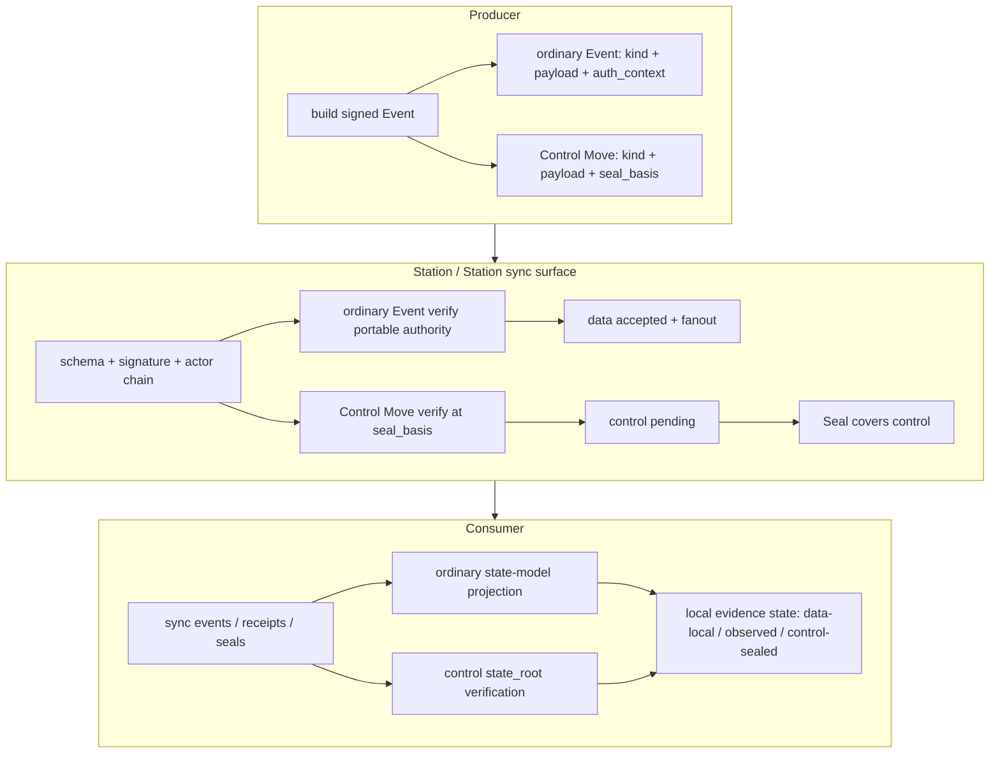

## 0. 规范语言

本文中的规范关键字（**MUST** / **SHOULD** / **MAY** 等）按 [conformance/normative-language.md](../conformance/normative-language.md) 解释；仅大写形式具规范约束力。

## 1. 目标

Arkret 是面向协作对象的分布式发布、传播、查询与收敛协议。同步层的目标是让各副本在不依赖全局共识链的前提下，验证事件来源、传播可合并状态、暴露冲突，并对治理状态提供可审计 finality。

Arkret v1 采用 **CBS**（Control-plane Basis-committed Sealing）：

- 数据面事件（ordinary Event）解决普通协作写入：消息、reaction、read cursor 的持久投影、协作对象字段、排序、计数等。ordinary Event 由 actor 签名、按 `auth_context.authority_refs` 验证授权，通过注册的 cell state model 收敛；它不等待 Seal 才成为本地可接受事实。
- 控制面事件（Control Move）解决治理写入：membership、capability、policy、notary、lifecycle、MLS epoch、密钥治理，以及 schema 明确声明 `sealed=true` 的对象。Control Move 由 Seal 覆盖后才取得 `sealed` finality。
- Seal 确认安全命令及其顺序结果，并在独立的 `data_delta` / `data_event_set_root` 中发布普通 Event 身份与数据基准关闭；普通消息不进入安全 `delta` 或 `state_root`。安全命令 bytes 的可用性由 signed `availability_receipt_digests[]` 逐项承诺。

同步层必须支持 actor 侧可验证发布、append-only 审计日志、离线写入、跨服务传播、选择性同步、最终一致投影、以及控制面问责。

## 2. 事件类型与 wire 边界

Arkret v1 的共享历史基础单位是 signed Event Envelope（schema [`event-envelope.schema.json`](../../artifacts/schemas/event-envelope.schema.json)）。Envelope 由 `event_id`、`realm_id`、`kind`、`actor_id`、`actor_seq`、`prev_refs[]`、`refs[]`、`payload`、`proofs[]` 等字段组成，canonical event bytes 与 proof 规则见 [`event-and-patch.md`](../models/event-and-patch.md) 与 [`encoding.md`](../conformance/encoding.md)。

Reducer-input Event 分为两类，二者 wire shape 互斥：

| 类型 | 必须字段 | 禁止字段 | 收敛语义 |
| --- | --- | --- | --- |
| ordinary Event | `scope_ref`、`auth_context`、`data_basis` | `seal_basis` | reducer 从 kind + payload 派生 data-plane writes；preconditions 仅检查签名因果基底；签名、actor chain、授权、开放数据基准与注册 state-model 验证通过即可本地接受。 |
| Control Move | `scope_ref`、`seal_basis` | `seal_ref`、`auth_context`、`data_basis` | reducer 派生 control-plane writes；进入 pending control set，直到被有效 Seal 覆盖才生效。 |
| Anchor Unit | `scope_ref`；kind 仅限 `ak.realm.create` genesis bootstrap 与 `ak.device.reanchor` recovery unit | `seal_ref`、`auth_context`、`data_basis`、`seal_basis` | 封闭例外；必须按 CBS 非空 genesis / transaction 规则验证。 |

`preconditions[]` 仅属于 Control Move。ordinary Event 不使用全局 CAS precondition；需要强单值、硬配额、跨 cell 原子性或不可自动合并语义的对象，MUST 在 Realm schema 中声明为 control plane，不得伪装成轻量数据面写入。

### 2.1 ordinary Event

ordinary Event 是数据面写入。它的核心字段如下：

| 字段 | 含义 |
| --- | --- |
| reducer contract | 从 kind + payload 派生普通 cell write；全部目标 MUST 为 `execution="data"`。 |
| `auth_context` | 签名 key 坐标、capability refs 与已确认的 `authority_refs`；长期缓存不因签署者离线失效。 |
| `data_basis` | 同 Realm 已确认且尚未最终关闭的 Seal；只绑定数据发布区间，不授予权限、不参与业务排序。 |
| `causal_refs[]` | 业务因果 hash 引用；用于投影、线程、排序与缺依赖诊断，不证明范围完整性。 |
| `refs[]` | 语义引用；例如 `authorized_by`、`parent_event`、`attestation`、`after`。 |

ordinary Event 完整验证后可立即本地投递、fanout 和同步；收到新的授权关闭证据后，按同一证据集合重算历史资格与业务投影。普通观察或复制不提供永久有效保证。

### 2.2 Control Move

Control Move 是控制面写入。它的核心字段如下：

| 字段 | 含义 |
| --- | --- |
| `seal_basis.leaves[]` | 每个参与 Realm 恰一个确认 head；同 Realm 多 leaf 无效。跨 Realm 的 `SealBasis.leaves[]` 不是 Seal 自身的同 Realm 前驱集合，不能表达同 Realm DAG 或 fork。 |
| `preconditions[]` | 可选控制面 pre-state predicate。 |
| reducer contract | 从 kind + payload 派生安全 cell write；全部目标 MUST 为 `execution="security"`。 |

Control Move 的签名、actor chain、basis、precondition 和授权验证通过后，服务 MAY 返回 signed receipt 表示已经进入控制面待检查集合。它只有在有效 Seal 覆盖其 digest 且 `state_root` 重算一致后，才成为 `sealed`。

### 2.3 actor-private 与 ephemeral 边界

`actor_private_event` 仍使用 signed Event Envelope，但不写 shared Realm data/control cell，不进入控制面 Seal 覆盖集，也不影响其他成员的共享状态。它可以用于 account data、device route、个人偏好或 actor 私有投影。

`actor_private_event` 的 CBS 执行分类是 `None`，只表示它不写共享 Data/Control cell，不得因此把它当作 generic Control。当 actual producer（有 `executed_by` 时以它为准）是普通 human Account device 时，该 Event MUST 使用 `account_device` signer evidence；不得使用 `account_device_control`、`principal` 或 session/transport authentication fallback。该例外只适用于 event-kind registry 明确登记的 `wire_scope=actor_private_event`，不为 Agent、Service、Signal、generic Control 或未登记 kind 增加任何 human device authority；完整验证见 [`device-lifecycle.md` §8.2](../crypto-media/device-lifecycle.md)。

Signal 与 to-device 都不属于 Event registry。presence、typing、receipt、call signaling 使用
encrypted-only `SignalEnvelope`；key verification、secret 与 Realm key 请求使用
`DeviceMessageEnvelope`。接收方 MUST NOT 把两者解释为 durable Event、不得分配 shared
`actor_seq`、不得写 cell、不得进入 Seal。

| `wire_scope` | 允许 schema | 允许提交路径 |
| --- | --- | --- |
| `durable_event` | `ak.schema.event.v1` | `ak.self.events.command.submit.v1`、`ak.peer.events.command.submit.v1` |
| `actor_private_event` | `ak.schema.event.v1`，但不得携带 CBS reducer 字段 | `ak.self.events.command.submit.v1` 的 actor 私有路径 |

Signal 与 DeviceMessage 使用各自 operation 和 schema，不具有 `wire_scope` 值。`wire_scope`
只分类 signed Event Envelope。

## 3. 接收与验证

任何接收 Event Envelope 的 Events API 或 Station sync surface，MUST 先执行通用验证：

1. JSON schema validation。
2. canonical bytes 与 `proofs[]` 校验；proof signer MUST 对应 `actor_id`，或在 `executed_by` 场景下对应代理身份并满足 `authorization_ref`。验签 MUST 优先使用 Event 所引用的 accepted auth-state / key epoch / device authorization / agent signer evidence 中固定的公钥绑定；命中既有绑定时不得重新在线解析 DID。只有出现新 DID、新 verification method、rotation / recovery / deactivation、service delegation 变化或 freshness policy 明确要求更新证据时，才进入 [`../identity/did-usage-and-verification.md` §4](../identity/did-usage-and-verification.md) 的 DID 权威验证路径。
3. `event_id` 与 canonical bytes 的幂等冲突检测。
4. `actor_seq`、`prev_refs[]` 与 actor chain 连续性验证。
5. `realm_id`、kind registry、payload schema、critical extension 与 reducer profile 支持性验证。

通用验证通过后，按 CBS 类型分流。

### 3.1 ordinary Event 验证

接收方 MUST：

1. 首次提交由任意合资格接收站独立验证 producer、授权与因果证据，和本地已知 revoke fence 串行持久化。普通消息不要求新 Seal 或原站确认。federation/backfill 按相同证据闭包求历史资格，后续关闭可使此前暂时接纳的消息进入隔离，历史导入不触发 live 副作用。

ordinary Event 的安全问题主要是签名伪造、授权过期、写入不属于 data plane、恶意获权写入与资源滥用。签名伪造由 DID/key 与 Event proof 解决；授权基准由已验证 `auth_context.authority_refs` 提供；`causal_register` 按固定 `(depth,EventId)` 收敛为单值并保留落选证据；其它 state model 按各自登记规则收敛。

### 3.2 Control Move 验证

接收方 MUST：

1. 对非 anchor-unit 的 Control Move，确认 Event 携带签名 `scope_ref`、`seal_basis`，且不携带 `seal_ref` 或 `auth_context`。
2. 确认 `seal_basis.leaves[]` canonical sorted、duplicate-free、每 Realm 恰一个已确认 head，并独立验证各域配置与 治理结果证明。Event 不重复声明 roots。
3. 从签名 basis 验证 signer、capability、policy、membership、Realm/Circle lifecycle 与 scope；在唯一确认的实际执行位置，重验授权及全部实际读写 Cell 的 revision。跨域依赖按安全事务锁定，不能用旧 basis 的值比较代替身份比较。
4. 求值 `preconditions[]`；任一 predicate 不成立则拒绝该 Control Move。
5. 从注册 reducer 的条件重算有效 write，确认至少一个 security write，且全部效果构成注册的同一原子命令。仅登记的 bootstrap unit 可携带 D 初始效果。
6. 将该 Control Move 放入控制面 pending set，等待 Seal 覆盖。

Control Move 按 Seal 的 command_results 顺序产生持久 committed/rejected 结果；只有 committed 的安全效果进入 delta 与 state_root。治理 Station必须重放并验证结果；治理结果消费 Station按已验证配置唯一签名和有权读取的确切状态证明或 [治理结果证明](../authz/cbs-profiles.md#9-治理结果证明normative) 验证，不重算已确认历史执行。结构、签名、顺序或 root 不成立时拒绝该 Seal。

#### 3.2.1 Anchor Unit 验证

接收方 MUST 先按注册写入和已登记原子 unit 判定执行域。普通 Event 使用 §3.1 的独立准入；只有属于登记 anchor unit 的安全命令及其同 unit 初始效果，才在没有 `seal_basis` 时进入本节封闭分支。不能把所有无 `seal_basis` 的 reducer-input Event 都当成 anchor，也不能把合法 anchor 按非锚点 Control Move 拒绝。receiver MUST 按 [`event-auth-state-resolution.md` §5](../authz/event-auth-state-resolution.md) 验证：kind / batch 组合白名单、同批原子性、`ak.realm.create` 的 critical `refs[role=did_inception]` 与 bootstrap follow-up 完整覆盖，或 `ak.device.reanchor` 的 accepted PCR policy/verified session、冻结 replacement device key 对两条 Event 的证明、`pre_fence_seal_frontier` 全 frontier CAS 与 replacement authorize 原子 unit（`device-lifecycle.md` §14；不得携带 `did_recovery_anchor` ref）。任一 unit 缺项、跨 Realm、重复或携带 `seal_basis` 均 MUST fail closed。

### 3.3 Seal 验证

Seal 的 wire contract 见 [`seal.schema.json`](../sync/authority-commit-log.md)，完整语义见 [`event-auth-state-resolution.md`](../authz/event-auth-state-resolution.md)。

接收方 MUST 至少验证：

- notary / committee 签名与 signer sequence。
- predecessor / slot / profile 约束。
- `delta[]` 只包含本 Seal 新增的控制面 Event digest。
- `control_event_set_root` 与递归控制面覆盖集一致。
- 治理 Station及选择独立审计的重放者按 `command_results` 重算执行结果、安全状态与 `state_root`；治理结果消费 Station依 §3.2 引用的 治理结果证明规则验证所需事实，不因读取普通消息而强制完整重放。
- inclusion list / receipt obligation / fault evidence 规则。

普通消息不依赖数据观察根。`availability_receipt_digests[]` 只约束对应安全命令 bytes 的可用性义务。

## 4. Event-first 发布模型

规范要点：

- Producer 与 Consumer 都可以从 signed Event 与 Seal proof 独立验证历史。
- Station sync surface 是传播与投影服务，不是签名事实的来源；它不能伪造 actor Event。
- ordinary Event 可以离线产生，使用完整已验证的缓存授权即可，不要求新 Seal 或缓存新鲜度续租。
- Control Move 的 finality 来自 Seal，而不是到达顺序。

## 5. 批量提交与 partial accept

`ak.self.events.command.submit.v1` 接收单个 `EventInitialSubmission` 或
`{events: EventInitialSubmission[]}`；`ak.peer.events.command.submit.v1` 接收
`EventFederationSubmission[]`。两种封装中的 `event` 都是同一个完整签名 Event Envelope；
lease、receipt 与 proof bundle 是独立发布证据，不进入 Event digest。批处理的最小原子单元是
单个 Event 及其发布证据；一个 Event 的失败不得回滚同批已接受 Event。

`events[]` MUST 按数组顺序处理。下文“Event”均指每项的 `event` 字段。同批中已接受的前序
Event 仅可作为后续 Event 的解析材料：

- 可以解析 bytes、Event ID、actor chain、`prev_refs[]`、`causal_refs[]` 或 payload-level causal reference。
- 不得作为后续 Event 的授权基准。
- ordinary Event 的授权基准是自身签名 `auth_context.authority_refs`。
- Control Move 的授权与 precondition 基准始终是该 Event 自己的 `seal_basis`。
- 同批前序 Event 创建、delegate、恢复、扩权或 revoke 的 grant/policy，不会在同批后续 Event 的授权判定中提前生效。

后续 Event 若依赖同批失败、缺失或隔离的 Event，MUST 以 `dependency_missing`、`causal_conflict`、`capability_denied`、`soft_failed` 或等价原因拒绝或隔离。

**后向引用（同批数组顺序靠后）的判定（normative）**：当某 Event 的 `prev_refs[]` / `causal_refs[]` 指向**同批中数组顺序在其之后、尚未处理**的 Event 时，实现 MUST 在单遍按序处理到该 Event 时一律判 `dependency_missing`（或隔离待重交），MUST NOT 为满足同批后向引用而对批做整批拓扑重排。这把"按数组顺序处理"与"前序作解析材料"在 reorder 下的歧义锁死为确定行为：同批解析材料只覆盖数组靠前已处理的 Event，靠后未处理的引用一律视为缺依赖。提交方应自行按因果序排列 `events[]`，缺序时通过重交（`accepted ∪ duplicate` 求差后重提）收敛，而非依赖服务端重排。

批量响应 MUST 区分：

| 字段 | 语义 |
| --- | --- |
| `accepted[]` | 首次接受的 Event。 |
| `ingress_receipts[]` | 本次首次签发或幂等重放的原始 IngressReceipt；重复提交不得以新时间重签。 |
| `duplicate[]` | canonical bytes 完全一致的幂等重复。 |
| `rejected[]` | 已确定失败的 Event。 |
| `quarantine[]` | 因缺 proof、缺依赖、缺可用性或异步验证而暂不能决定的 Event。 |

`status=accepted` 仅当 `rejected[]` 与 `quarantine[]` 均为空且 `accepted[]` 非空。全部为幂等重复时使用 `status=duplicate`。其它结果使用 `status=partial`；因此全 rejected / quarantine 且 `accepted[]`、`duplicate[]` 均为空仍是合法 `partial`，不是请求级失败。peer submit 的历史补录例外 MAY 使用 `status=historical_only`，其精确定义见 [`federation.md` §4.1](./federation.md)。

**批量 read-your-writes barrier cursor（normative）**：批量 submit 响应 MUST 返回一个绑定本批 `accepted[]`（∪ `duplicate[]`）所达 max causal frontier 的 barrier cursor（语义与 api-conventions §8 单事件 barrier cursor 一致，形态为 `ak:cursor:` opaque handle）；客户端用它向 projection 层等待"读己之所写"。`accepted[]` 为空（全部 rejected / quarantine）时 barrier cursor MAY 省略或回显请求基线 frontier。该 cursor 覆盖本批已接受集合的前沿，不覆盖 quarantine 中尚未决定的 Event。

## 6. Receipt、可用性与完整性证明

Event 是 canonical history；receipt、attestation、snapshot 与 Seal observation 是加速层或审计证明，不替代 Event 自身签名。

### 6.1 Event Batch Receipt

Event Batch Receipt（schema [`event-batch-receipt.schema.json`](../../artifacts/schemas/event-batch-receipt.schema.json)，`ak.schema.event_batch_receipt.v1`，字段与概念分层见 [`../models/event-and-patch.md` §5](../models/event-and-patch.md)）是 best-effort RYW / 加速 / 审计 hint：issuer（服务、客户端或 witness）证明已看到并承诺 `events[]` 所列 Event 集合的 integrity。它可用于 read-your-writes、跨服务对账、轻客户端同步与 censorship 诊断；它不证明 Event 已进入控制面 finality，只对 issuer 选择承诺的集合提供 integrity，不提供范围 completeness。接收方 MUST 能在没有 batch receipt 的情况下验证单个 Event。

单事件确认是 `events[]` 单元素的退化形态；协议只定义 Event Batch Receipt 这一种 set-bound receipt 结构。多事件 receipt 的 `events[]` MUST 使用 [`encoding.md` §5](../conformance/encoding.md) 的 canonical set 顺序并去重；数组位置不表达到达顺序、因果顺序或签发优先级。typed receipt item 只携 `event_id + kind`；consumer 从 Event ID token 解码 suite 与完整 digest，并继续重算/比对 Event canonical bytes。

### 6.2 AvailabilityReceipt

AvailabilityReceipt（schema [`availability-receipt.schema.json`](../sync/authority-commit-log.md)）证明 holder 在某 retention window 内承诺保存指定 Event bytes 或 blob bytes。Seal 直接签入其 full canonical `receipt_digest`；完整 receipt 与历史 signer evidence 经 typed governance-dependency resolve 获取。它不替代事件签名、授权验证或 state-model 收敛。

### 6.3 Audit RYW Receipt

`ak.audit.ryw_receipt`（schema [`audit-ryw-receipt.schema.json`](../../artifacts/schemas/audit-ryw-receipt.schema.json)，`ak.schema.audit_ryw_receipt.v1`）是审计释放路径专用的 per-event RYW witness attestation：它对单个 `ak.audit.accessed` / `ak.audit.release` Event 提供带 witness 背书的 accepted 确认，是 audited-E2EE release gate 的前置条件（见 [`../crypto-media/audited-e2ee.md` §6](../crypto-media/audited-e2ee.md)）。与 §6.1 的通用 hint 不同，它带强制 witness attestation 结构与 fail-closed 校验，并具有 "object + durable event kind" 双形态（[`../models/event-and-patch.md` §5.1](../models/event-and-patch.md)）。

### 6.4 历史完整性边界（normative）

Arkret v1 不提供历史 range-completeness 证明。服务、自报签名、witness quorum、frontier/root、cursor/`has_more`、Event Batch Receipt、AvailabilityReceipt、Snapshot 或 Seal 的 listed-set commitment 都只能证明各自明确列出的已观察视图、集合或分页状态；任何一项都不能证明 source 没有隐藏一个从未被 verifier 观察到的 Event。

日常可靠投递由 durable outbox、幂等 `accepted|duplicate` outcome、known-ID/dependency resolve 与 admission 保证。frontier 只提供同一已知 scope 内的 divergence hint；scan/backfill 只用于 known-gap recovery 或有界的人工 best-effort 调和。实现与 UI MUST NOT 把 root 相等、扫描结束、分页结束、receipt 或单源签名升级表述为“历史完整”“无遗漏”或 high-assurance completeness。

## 7. 同步面

同步面以可见性裁剪后的 Event、receipt、Seal、snapshot 与 projection delta 组成。

| 面 | 用途 |
| --- | --- |
| Event Source Sync | actor 历史恢复、审计重放、事件查缺。 |
| Realm Sync | Realm 级 durable Event、Seal 与 projection 增量。 |
| Strand Sync | Strand 当前态、track 状态、可见性裁剪后的 activity。 |
| Discussion Sync | Strand discussion 轨道消息时间线。 |
| Board Sync | Board/List/Strand 位置与排序 projection。 |
| Query Surface | view、搜索、context timeline 与 graph 查询。 |
| Authz / Invite Surface | invite、grant 视图、控制面状态与可写性诊断。 |

Strand Sync MUST NOT 因 actor 可读 Strand synthesis 就自动展开不可读 discussion timeline 或 Morph 内容。所有同步面都 MUST 先按 Realm、Circle、object scope、history visibility、E2EE availability 与 caller capability 裁剪。

## 8. 查询响应证据

v1 不定义跨所有查询响应通用的 `basis` / `grade` 包装。operation registry 的 `response_schema_ref` 与 OpenAPI binding 是各响应字段的机器真源；receipt、Seal observational root 或 transparency attestation 只有在具体 operation / profile 显式登记承载字段、schema 与验证规则时，才构成该响应的可互操作证据。这些证据均不提供历史无遗漏保证。

实现不得用私有等级字符串替代已登记证明，也不得把数据面 observation 表述为控制面 Seal finality。未登记证据字段的响应只具有对应 operation 已声明的读取语义。

## 9. 冲突与收敛

Arkret 不用全局链决定普通协作写入顺序。状态收敛由 cell family 登记的 state-model 规则定义：

- 普通 or_set、ordered_log 与已注册 issuer-local counter 在相同资格证据下 MUST 对输入顺序不敏感。安全 sequenced_state 按确认顺序执行，不适用无序 join。
- 单值、硬配额、跨 cell 原子性和不可交换操作不得放在 data plane，除非使用专门 sequencer。
- 普通 `causal_register` 对同 Cell 写入计算固定 `depth`，再按完整 typed EventId 字节兜底，确定性选择唯一当前值；不得使用 HLC、actor id、数据库自增 ID、本地到达顺序或 Station sync surface 顺序。
- Relation 互斥、parent 成环等已登记跨 Cell 领域约束仍可产生独立 diagnostic；它们不得被误写成通用寄存器多头，也不得改变寄存器 winner。
- Timeline 展示顺序是 projection，MUST NOT 反向写入 canonical state、授权判断或 state-model result。

ordinary Event 的 `causal_refs[]` 为每个 causal-register 更新绑定确切同 Cell 来源并用于固定 depth；其它引用仍可帮助投影层稳定排序和诊断缺依赖。它不是全局 completeness proof。

## 10. Snapshot

Snapshot 是恢复加速层，不是真相源。Snapshot manifest MUST 声明以下字段（权威必填集见 [`../conformance/realm-state-snapshot-schema.md`](../conformance/realm-state-snapshot-schema.md) 与 [`realm-state-snapshot.schema.json`](../../artifacts/schemas/realm-state-snapshot.schema.json) 的 `required`，本清单与之等价）：

- `id`（snapshot 自身 id）
- `realm_id`
- `reducer_profile` 与 `schema_profile_refs`（reducer / schema profile refs）
- `state_digest`（**必填**）——对 snapshot 的完整 typed-current entry 集合求规范 Merkle root；完整规则见 [snapshot schema](../conformance/realm-state-snapshot-schema.md)。该摘要与各 stream head 独立校验，不能互相代入。
- `event_set_commitment`（绑定"哪些事件产生该状态"的承诺，与 `state_digest` 各自独立、**均必填**；接纳外部 snapshot 的服务器 MUST 验证它）
- `frontier`（covered Event frontier / Seal basis）
- `chunks`（chunk digests）
- `security_class`
- `created_by`（issuer）与 `created_at`
- `authority_binding`（证明 `created_by` 在 `created_at` 被授权签发该 snapshot）
- `signature`

接纳外部 Snapshot 的服务器 MUST 验证 signature、issuer authority、chunk digest、profile compatibility、basis、Event set commitment 与必要 inclusion/omission 条件。自己 Account Station 向客户端提供的 Snapshot 是已验证结果，客户端只核对已认证来源、账号/Realm、所请求 basis、格式兼容和下载内容 hash/加密认证；不证明服务器的历史完整性、不重放治理或 issuer authority。结果缺失或失效时重新请求所需的服务器基线，MUST NOT 回退客户端全历史验证。

Snapshot 后续恢复流程：

1. 从自己 Station 获取当前请求 Realm/basis 对应的 manifest。
2. 核对来源、请求绑定、大小与格式。
3. 按需下载相关 chunks，核对内容 hash/端到端认证。
4. 安装服务器已确认的当前视图与可恢复同步位置，不能将 Event frontier 当成 cursor。
5. 按显示、解密与离线需要获取内容增量；治理接纳及历史 root 计算由服务器完成。
6. 进入增量订阅。单 Realm pending 不阻塞账号首页与其它 Realm。

## 11. 首次加入 Realm

**加入提交目标（normative）**：跨域加入时客户端唯一提交目标是自己的 Station。后者完成本地 admission 后，才可使用 `ak.find.directory.read.resolve_realm.v1` / `ak.find.directory.read.resolve_target.v1` / signed invite metadata 中由 signed invite 或当前 joined-joined-member ActorId routing projection 裁剪的 `join_candidates[]` 作为 federation forwarding hints（见 [`federation.md` §5.0](./federation.md)）。客户端不得直投 candidate；所有重试 MUST 绑定同一 canonical `realm_id`。

推荐流程：

1. 解析 canonical `realm_id` 与所需 signed invite / Seal basis；客户端把 join material 提交给自己的 Station，后者按 [`federation.md` §5.0](./federation.md) 从有界 `join_candidates[]` 选择 joined-member Station 转发目标。
2. 获取与 caller 相关的 invite、claim、grant 或 presentation challenge。
3. 拉取当前 Seal 与必要控制面 proof。
4. 验证 membership / capability / policy。
5. 拉取最近 Snapshot（可选）并验证。
6. 从 snapshot basis 或当前 Seal 之后拉取 Event。
7. 本地重放并进入 cursor 增量订阅。

若客户端只有 handle 而没有 DID，必须先完成 handle -> DID 解析与双向校验；handle 不得直接作为 actor 或 grant subject。

## 12. 幂等、去重与重放

重复提交与重复投递是正常情况：

- `event_id` 的 raw 33-octet token（suite wire_code + full 32-octet event_digest）是 Event 相等、exact replay、canonical store 与最终去重真相源。
- 只有相同 `event_id` 且相同 canonical preimage 的重复投递才是 exact duplicate，并 MAY 作为幂等成功处理。携带相同 ID 但重算结果不同是 `event_id_digest_mismatch`，必须在进入 ID bucket 前拒绝，不能影响既有 accepted Event。
- 若两个不同 canonical preimage 在同一 suite 下重算出同一个 `event_id`，这是完整 hash collision evidence。提交响应 MUST 拒绝新到变体；本地状态处置 MUST 把该 ID 的全部已验证变体作为一组进入 quarantine，包括此前已 accepted 的变体、由任一变体创建的 Event-derived object、未 final writes，以及引用该 ID 的后继。先到顺序、较早 accepted 或字典序都不能证明哪一变体“正确”。
- 节点 MUST 从所有 data cell join 输入移除这些变体经 reducer 派生的 writes；尚未被 accepted Seal 覆盖的 Control Move 同样移除。已被 accepted Seal 覆盖的控制面事实不得从 `covered_set` / `state_root` 追溯删除，按 [`event-auth-state-resolution.md` §15](../authz/event-auth-state-resolution.md) 等待 fork-resolution compaction Seal；相关 actor 的后续控制写入在归一前 fail closed。碰撞下两个变体的 `event_digest` 相同，Seal 承诺无法指认覆盖的是哪一个 preimage，因此归一裁决按 canonical bytes 指认、历史 Seal 输入不得事后重算、碰撞区间不得被 compaction 跨越——见 [`event-auth-state-resolution.md` §15](../authz/event-auth-state-resolution.md)。
- submit、probe、backfill 或本地审计任一路径发现完整 hash collision，都 MUST 执行同一整组 quarantine。raw/quarantine 查询以完整 Event ID 定位碰撞 bucket，并返回全部已知 canonical 变体，不得 first-row-wins。operator-approved 解除只接受当前唯一 signer 确认的专用 fork-resolution Seal 所覆盖的 `ak.fork.resolution`：`subject.kind=event_id_collision` 时 `conflict_evidence.kind=full_hash_collision` 必须携恰两个 locator，每个 locator 或内联完整 canonical preimage bytes，或按 `ak.schema.realm_commit.v1` 引用（接近 1 MiB 的原 Event 必须走引用分支，否则 resolution Event 自身越界）；winner 必须以同一完整 bytes 的 locator 指认或使用 `void_all`；digest-only winner 以 `witness_disagreement` 拒绝。碰撞组跨 Realm 时，本 Realm 的裁决只治理本 Realm 内的投影，不改写其它 Realm 的变体。raw replay 只用于取得全部已知变体，最终解除仍必须由上述 accepted fork-resolution authority 驱动；current-v1 不存在历史范围 attestation 或同 scope witness quorum 解除分支，任何普通成功、root 相等或数据库直清都不是解除 authority。
- **accepted `canonical_winner` 归一是本条整组 quarantine 的唯一封闭豁免（normative）**：当本 Realm 已有一条 accepted 的 `ak.fork.resolution`，其 `subject.kind=event_id_collision`、subject 逐字等于该 `event_id`、`verdict.kind=canonical_winner`，且待准入 bytes 与该 verdict 的 `conflict_evidence.variants[winner_index]` 解出的 bytes 逐字相等时，receiver MUST 按 [`../authz/event-auth-state-resolution.md` §15](../authz/event-auth-state-resolution.md) 第 3 点把 winner 准入为该 ID 的 accepted 变体，并 MUST NOT 因此报 `witness_disagreement` 或再次整组 quarantine。豁免的触发条件只有这一条：**不存在满足上述四项的 accepted `ak.fork.resolution` 时，第二个 preimage 仍按本节整组 quarantine**，普通提交 MUST NOT 触发它；winner 仍 MUST 独立通过结构 / suite / `realm_id` / `event_id` 重算前置检查，并按 §15 第 3 点复用该 `event_id` 已验证的 proof 集合重跑 binding 校验；loser 保留为 forensic 变体，其派生 writes 按本节既有规则移除。MUST NOT 用 `event_digest`、另一 suite discriminator、长度或局部 byte slice 指认待准入变体，也 MUST NOT 经私有 endpoint、operator 命令或数据库直写完成取代。

## 13. 授权时序

授权不能只看墙上时钟。CBS 的授权时序规则是：

- revoke、grant、membership、policy 与安全生命周期按已确认前缀执行；普通消息使用缓存授权，历史资格按全部适用关闭集合重算。接收记录不授予不可撤销的有效性。

## 14. 可见性、密文负载与 E2EE 索引

ACL 不等于密文保护。Station sync surface 可以转发不透明密文，但不得把未授权的明文元数据暴露给未被 policy 委托的服务。

字段可见性分级：

- Event Envelope 顶层路由、因果与签名归属元数据：`event_id`、`realm_id`、签名 `scope_ref`、`kind`、`prev_refs[]`、可选非空 `causal_refs[]` / `refs[]`、`actor_id`、`actor_seq`、`hlc`、`auth_context` 或 `seal_basis`、以及 schema 声明的 `executed_by`、`authorization_ref`、`applet_id`、`external_ref`。
- 明文业务元数据：轻量状态、rank、due date 等；若足以暴露敏感内容，接收服务必须列入 Realm policy 的 plaintext-visible service。
- 不透明加密负载：message body、附件内容、私有对象字段等。

MLS / E2EE 语义见 [`encryption-and-audit.md`](../crypto-media/encryption-and-audit.md)。控制面 MLS epoch 属 Control Move；普通加密消息仍是 ordinary Event。

## 15. 设计决定

Arkret v1 固定：

- signed Event Envelope 是 actor 发布单元。
- ordinary Event 是普通协作数据面的默认写入单元。
- Control Move 是治理状态和强不变量的写入单元。
- Seal 只给控制面 finality；对数据面的 root 是观测承诺。
- Event 签名、accepted DID/key binding 和 capability 检查解决伪造事件问题；DID authority
  resolution 只在身份 / key binding 建立、变更或显式 freshness 触发时执行。
- 数据面的核心分布式问题是收敛、可用性、可见性与观测证明；普通寄存器由固定因果全序选 current，其它登记 state model 与领域不变量各自解决。
- 密文负载可以由不解密的 Station sync surface 转发。
- hard erasure 只能删除本地 payload / blob / 派生内容，并保留事件图验证所需的最小 verification stub；Event subject 的 `event_id` 本身保留完整 `(digest suite wire_code, event_digest)`。这只能保留已记录的身份，不能在 canonical bytes 已擦除后重新证明原 hash 正确。不得重写 Event hash 或伪装事件从未存在。

## 16. 规范性引用

- CBS 双平面、Seal、观测证据与 failure state 见 [`event-auth-state-resolution.md`](../authz/event-auth-state-resolution.md)。
- Event Envelope、canonical bytes、Patch 与 proof 见 [`event-and-patch.md`](../models/event-and-patch.md)。
- HTTP operation binding 见 [`service-http-binding.md`](./service-http-binding.md)。
- Federation transport 见 [`federation.md`](./federation.md)。
- Cursor 编码、digest suite 与 HLC 见 [`encoding.md`](../conformance/encoding.md)。
- Strand / Message、Realm / Space / Morph 语义见 [`strand-and-message.md`](../models/strand-and-message.md)、[`realm-and-space.md`](../models/realm-and-space.md) 与 [`morph.md`](../models/morph.md)。
