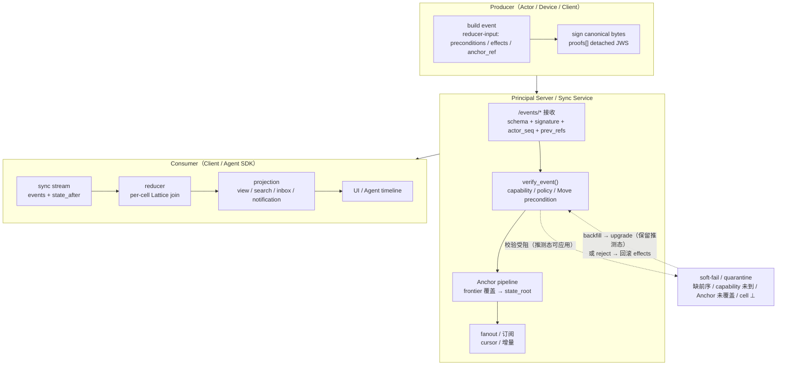

## 1. 目标

Contrix 是面向协作对象的分布式发布、传播、查询与收敛协议。

同步层必须支持：

- actor 侧可验证发布
- append-only 审计日志
- Flow identity 与 track 能力
- Flow `discussion` track / Message 时间线
- Board Space / List Space / Flow 工作流
- Morph 开放对象
- 离线写入
- 最终一致收敛

## 2. 核心角色

Contrix v1 区分：

- `client`
- `agent`
- `event_store`
- `principal_server`
- `sync_service`
- `blob store`

### 2.1 Event Store 与 reducer-input Event

Contrix v1 的唯一 wire / 传输单位是 **signed Event**（schema 见 [`event-schema.json`](../../artifacts/schemas/event-schema.json)）：reducer-input event 把 `preconditions[]` / `effects[]` / `anchor_ref` 直接放在 event 顶层；non-reducer event（read marker、typing 等）不携带这三个字段。actor-chain 因果用顶层 `prev_refs[]`；其他语义引用（授权、attestation、recovery_capability、state_witness、inclusion_proof 等）统一进 `refs[]`，每条带 `role`。

Reducer-input event 的核心字段（详见 [`event-auth-state-resolution.md`](../authz/event-auth-state-resolution.md) §3）：

| 字段 | 含义 |
| --- | --- |
| `event_id` (`cx:event:<uuid>`) | producer 在签名前分配的 typed-UUIDv7。被纳入 canonical bytes 由 `proof.payload_hash` 覆盖。 |
| `actor_id` | 签发者 DID。 |
| `realm_id` | 所属 Realm。 |
| `actor_seq` | actor chain 单调序号。 |
| `prev_refs[]` | actor chain 因果前序。 |
| `refs[]` | 语义引用集合，每条 `{id, role, critical?}`；授权 ref 用 `role="authorized_by"`，其他 role 包括 `attestation` / `parent_event` / `after` / `recovery_capability` / `state_witness` / `inclusion_proof`。 |
| `preconditions[]` | reducer-input only：`[(cell, predicate)]`。任一不成立则整个 event FAIL。 |
| `effects[]` | reducer-input only：`[(cell, lattice_op)]`。原子多 cell CAS。 |
| `anchor_ref` | reducer-input only：本 event 提交时所对应的 Anchor DAG 节点。 |
| `payload` | kind-specific 业务载荷（`cx.message.create.payload.content`、`cx.flow.update.payload.patch` 等）；它们是 effect 写入值的源数据，不替代 effects[]。 |
| `proofs[]` | 至少一条 detached JWS，覆盖 canonical event bytes（不含 `proofs` 与 `unsigned`）。 |
| `hlc` | advisory tie-breaker。**进入 canonical event bytes 与 proof `payload_hash`**（与 [encoding.md](../conformance/encoding.md) §7、[event-auth-state-resolution.md](../authz/event-auth-state-resolution.md) §3 rule 1 一致），因此被生产者签名锁定、relay 不得改写；但语义上仅用于 timeline 展示与 freshness 诊断，MUST NOT 进授权决策、Lattice 收敛、Move precondition 比较或 Anchor finality 判断。 |

非 reducer-input 事件（`wire_scope=actor_private_event` / `ephemeral_event`，例如 `cx.read.marker`、`cx.notification.read`、`cx.typing`、`cx.receipt.read`、`cx.call.signal`）**不**携带 `preconditions` / `effects` / `anchor_ref`。它们只是 actor 私有或 ephemeral 信号，不进 anchor frontier、不写 cell、不参与 state_root。schema 已用 allOf if/then 静态强制此约束。

### 3.6 Wire-Scope 边界（normative）

为避免 ephemeral 信号意外进入持久 Event 流，event-schema.json 与 cx.events.submit MUST 按下表 fail-closed：

| `wire_scope`（[`event-kind-registry.json`](../../artifacts/registry/event-kind-registry.json)） | 允许使用的 envelope schema | 允许的提交路径 |
| --- | --- | --- |
| `durable_event` | `cx.schema.event.v1`（[`event-schema.json`](../../artifacts/schemas/event-schema.json)） | `cx.events.submit` |
| `actor_private_event` | `cx.schema.event.v1`（同上；不携带 `preconditions/effects/anchor_ref`） | `cx.events.submit`（actor 私有，写入 actor 私有 store；不进 Realm frontier） |
| `ephemeral_event`（`cx.presence` / `cx.typing` / `cx.receipt.read` / `cx.call.signal`） | `cx.schema.ephemeral_envelope.v1`（[`ephemeral-envelope.schema.json`](../../artifacts/schemas/ephemeral-envelope.schema.json)） | ephemeral 广播通道（sync subscribe 实时流、presence/typing fanout、call signaling channel）；**MUST NOT** 出现在 `cx.events.submit` |
| `ephemeral_event`（`cx.key.verification.*` — 点对点 to-device） | `cx.schema.device_message.v1`（[`device-message.schema.json`](../../artifacts/schemas/device-message.schema.json)） | to-device 队列（不广播）；**MUST NOT** 出现在 `cx.events.submit` |

规则：

1. `cx.events.submit` MUST 对 `kind` 的 `wire_scope=ephemeral_event` 立即 `schema_violation`，不进 reducer / anchor pipeline。event-schema.json 已用 `not` 分支静态强制 cx.call.signal / cx.presence / cx.typing / cx.receipt.read / cx.key.verification.* MUST NOT 出现在 durable Event Envelope。
2. ephemeral 广播信号 MUST 携带 `expires_at` 并由接收方按 schema 中 5 分钟硬上限丢弃；不得作为 backfill / sync replay 入口。
3. 接收方 MUST NOT 把 ephemeral envelope 解释为 reducer 输入：它们不写 cell、不推 anchor frontier、不消耗 actor_seq。
4. 部署若希望"高频信号但仍可审计"，MUST 选择 sample / digest 后单独 emit 一条 durable event（例如 `cx.call.state` / `cx.notification.read`），而不是把 ephemeral envelope 当 durable Event 提交。
5. 负向测试：conformance suite MUST 包含 reject case，把 `cx.presence` / `cx.typing` / `cx.call.signal` / `cx.key.verification.start` 这些 kind 当 durable Event 通过 `cx.events.submit` 提交时立即被拒（`schema_violation`，不进 anchor pipeline）。

接收方 MUST 按以下顺序验证 reducer-input event：

1. Envelope schema validation（`cx.schema.event.v1`，含 canonical bytes / proofs[]）。
2. 至少一条 `proofs[]` 由 `actor_id` 控制密钥签发；签名 payload 覆盖 canonical event bytes（不含 `proofs` 与 `unsigned`；`hlc` 包含在内但仅作 advisory）。
3. `verify_event()`（[`event-auth-state-resolution.md`](../authz/event-auth-state-resolution.md) §6）在该 event 的 `anchor_ref` 对应 pre-state 下成立。
4. 写入 Anchor pipeline。

任一步骤失败，整个 event 被 reject 并回退原因（`schema_violation` / `invalid_signature` / `failed_precondition` / `failed_bottom` / etc.）。非 reducer 事件只走步骤 1+2。

### 2.1.1 Event Store

Event Store 是 Principal Server、客户端、本地节点或授权副本保存 Event 的服务/存储能力。它不是独立权威对象，也不要求实现 atprotocol/Git 式数据仓库。实现可以用数据库、append-only file、Merkle log、object store、content-addressed block store 或其他存储引擎保存 Event；协议只要求下列语义可验证：

- event store：保存 signed Event。
- per-actor event chain：由 `actor_id`、`actor_seq` 和 `prev_refs` 表达 actor 自己的发布顺序。
- frontier / cursor：按 actor、Realm 或查询范围暴露调用方可见的同步前沿。
- proof material：签名、hash、DID key 状态引用和可选 witness receipt。
- Anchor view：reducer-input event 集合 + 当前 Anchor DAG + state_root 视图。

网络上的 `/events/*` 是 Event 提交、读取、回填和前沿查询 API surface。接收方验证 Event 时 MUST 按 §2.1 顺序校验。

实现 MAY 发布 Event batch receipt、checkpoint、snapshot 或 witness receipt 加速恢复和审计，但这些对象不得成为 canonical history 的必经层，也不得替代 Event 本身的签名责任。

### 2.2 Principal Server / Sync Service

Principal Server 是 principal 控制或明确委托的服务边界；Sync Service 是该服务器上的 Realm 增量同步能力。

Sync Service 聚合本服务器授权可见的 Realm Event，并提供订阅、fanout、backfill、ephemeral signaling 和初级过滤。它不是独立第三方服务器，也不应由未被 principal 或 Realm policy 委托的第三方接触非加密私有内容。

Principal Server / Sync Service MUST NOT：

- 伪造 principal 的 Event。
- 把自己托管的 Realm 自动标记为组织 official Realm。
- 用本地数据库状态替代 Realm reducer、capability 和 policy 判定。
- 阻止客户端从源 Event、witness receipt、snapshot frontier 或其他受信 Principal Server 交叉验证历史。
- 将非加密私有正文转发给未被发送方、接收方或 Realm policy 明确委托的服务。

## 3. Event-first 发布模型

Contrix 采用 Event-first 模型：

1. actor/device/service 生成 signed Event。reducer-input event 在顶层带 `preconditions[]` / `effects[]` / `anchor_ref`（§2.1）。
2. `/events/*` 或等价 transport 接收 event，校验 schema、签名、actor chain；对 reducer-input event 走 `verify_event` + Anchor pipeline。
3. Principal Server / Sync Service 同步调用方授权可见的 Realm Event。每个 reducer-input event 与 Anchor 的当前态 (`event_state` / `anchor view` / `state_root`) 通过同步 surface 暴露给客户端 reducer。
4. client reducer 将 accepted reducer-input event 集合按 Lattice + Anchor frontier 归约为当前态；non-reducer event（read marker / notification / typing 等）不进 cell。客户端可选择生成本地搜索索引和 View projection。

这套模型同时适用于：

- Flow / Message
- Realm / Space / Flow（看板与列容器是 Space）
- Morph

### 3.1 写入流水线

下图把 Event 从生成到呈现的完整链路画成三段：Producer 生成签名 Event，Principal Server / Sync Service 校验并通过 Anchor pipeline 给出 finality，Consumer 增量同步并本地 reduce + project。Soft-fail 是这条链路上唯一的可逆退化路径。



读图要点：

- Sync Service 与 Anchor pipeline 不是真相源，只是按 Anchor finality 暴露 `events + state_after` 的传输面；Producer 与 Consumer 的客户端都可以重算同样的 effective state。
- Consumer 端 reducer 的输入是 accepted reducer-input event 集合 + Anchor frontier；non-reducer event（read marker / typing 等）不进 cell、不进 state_root。
- soft-fail 路径是 §6.2 的 reconciliation 主题：推测态会被标记，最终升级或回滚都必须确定性。

## 4. Event Batch Receipt / Checkpoint

Event 是 canonical history。Event batch receipt、checkpoint 和 snapshot 只是加速层或审计证明，不是 reducer 输入的替代物。

实现 MAY 为一批已接受 Event 生成签名 receipt：

```json
{
  "receipt_id": "cx:receipt:01964186-5800-7000-8000-000000000000",
  "issuer": "did:web:alice.example.net",
  "scope": {
    "actor_id": "did:web:alice.example.com",
    "realm_id": "cx:realm:0196419b-0000-7000-8000-000000000000"
  },
  "frontier": {
    "actor_seq": 144,
    "event_hash": "sha256:aaaaaaaaaaaaaaaaaaaaaaaaaaaaaaaaaaaaaaaaaaaaaaaaaaaaaaaaaaaaaaaa"
  },
  "events": [
    "cx:event:019640ed-8000-7000-8000-000000000000",
    "cx:event:019640ee-0000-7000-8000-000000000000"
  ],
  "created_at": "2026-04-22T08:30:00Z",
  "proofs": []
}
```

Receipt 可用于 read-your-writes、回放完整性检查、witness 证明或跨服务 backfill 对账。接收方 MUST 能在没有 receipt 的情况下验证单个 Event；也 MUST NOT 因缺少 batch receipt 而拒绝格式、签名、授权和因果均有效的 Event，除非某个高安全 deployment profile 明确要求额外 witness。

### 4.1 Batch Receipt 不证明的事实 (Normative Non-Properties)

Batch receipt 是 best-effort RYW / 加速 / 审计 hint，**不是** range completeness（范围完整覆盖）证明。即使在 `events[]` 上叠加 Merkle commitment（如 `event_set_commitment` / batch root），它也只保证 *integrity*（issuer 给出的事件集合未被中间人篡改），不保证 *completeness*（issuer 没有静默丢弃属于该范围的其他事件）。本节明确列出 receipt 不证明的事实：

- Receipt MUST NOT 被实现解释为“该 `scope`（actor / realm / frontier）下的所有已 accepted reducer-input event 都包含在 `events[]` 中”。Issuer 可以选择性 commit 任意子集，set-bound commitment 不构成抗丢弃证明。
- Receipt MUST NOT 替代 Event 自身签名作为 reducer 输入合法性凭据：reducer MUST 按 §5 / event-and-patch.md §6 在 Event 层验证签名、prev_refs、refs、anchor 与 schema。
- Receipt MUST NOT 被 Anchor pipeline 当作 canonical history 输入：Anchor 仍以 Event 为真源。
- 想取得 range completeness 的实现，MUST 使用 §4.2 定义的 `cx.attestation.range_completeness` 原语（active event kind；payload schema `cx.schema.range_completeness_attestation.v1`），其 scope 必须有显式 range 语义（per-actor seq interval + frontier 上下界），并伴随 witness quorum 或独立 anchor 背书。Core batch receipt 不承担此职责。

> 术语：*integrity* 指给定数据未被篡改；*completeness* 指给定范围内没有漏给的成员。Set-bound Merkle commitment 提供 integrity，不提供 completeness——后者必须依赖 range-bound 语义。详见 [glossary.md](../overview/glossary.md)。

### 4.2 Range-bound Completeness Attestation (Normative)

`cx.attestation.range_completeness` 是独立的 attestation event kind（见 [`event-kind-registry.json`](../../artifacts/registry/event-kind-registry.json)，`status=active`），用于提供 *completeness* 证明——即"该范围内没有 reducer-input event 被静默丢弃"。它与 `cx.event_batch_receipt`（set-bound integrity）和 `cx.audit.ryw_receipt`（per-event RYW）正交：completeness 需要 range 语义 + per-actor seq interval + witness 背书，缺一不可。

事件 kind 不携带 `.v1` 后缀；版本号只出现在 payload schema id 上。Schema id: `cx.schema.range_completeness_attestation.v1`（artifact `artifacts/schemas/range-completeness-attestation.schema.json`）。

```json
{
  "attestation_id": "cx:attestation:01970a55-0000-7000-8000-000000000000",
  "schema": "cx.schema.range_completeness_attestation.v1",
  "issuer": "did:web:witness.example",
  "issuer_role": "witness",
  "realm_id": "cx:realm:0196419b-0000-7000-8000-000000000000",
  "scope": {
    "from_frontier": {"realm_frontier": ["cx:event:..."]},
    "to_frontier":   {"realm_frontier": ["cx:event:..."]},
    "actor_seq_ranges": [
      { "actor_id": "did:web:alice.example", "from_seq_exclusive": 144, "to_seq_inclusive": 187 },
      { "actor_id": "did:web:bob.example",   "from_seq_exclusive": 87,  "to_seq_inclusive": 102 }
    ]
  },
  "root": "sha256:...",
  "count": 58,
  "observed_at": "2026-05-18T08:30:00Z",
  "witness_attestation": {
    "kind": "federation_witness_attested",
    "witnesses": [
      {"issuer": "did:web:witness.example",  "verification_method": "did:web:witness.example#range-attest-1",  "controlling_organization": "did:webvh:witness-coop"},
      {"issuer": "did:web:witness2.example", "verification_method": "did:web:witness2.example#range-attest-3", "controlling_organization": "did:webvh:audit-co"}
    ]
  },
  "proofs": [ { "kind": "detached_jws", "alg": "EdDSA", "verification_method": "did:web:witness.example#range-attest-1", "payload_hash": "sha256:...", "created_at": "2026-05-18T08:30:00Z", "jws": "..." } ]
}
```

#### 4.2.1 Scope 语义

- `from_frontier` 是 **exclusive** 下界；attestation 覆盖该 frontier *之后* 因果发生的 reducer-input event。
- `to_frontier` 是 **inclusive** 上界。
- `actor_seq_ranges[]` 给出每个在 `(from_frontier, to_frontier]` 区间内产生 reducer-input event 的 actor 的 seq 区间（half-open `(from_seq_exclusive, to_seq_inclusive]`）。MUST 覆盖区间内所有产生 reducer-input event 的 actor；不可遗漏。
- silent fork 经常表现为"某个 actor 的某段 seq 在对端不可见而全局 frontier 仍单调推进"——这就是为什么必须显式 per-actor seq interval，仅有 frontier 不够。

#### 4.2.2 `root` 计算

`root` 是 canonical Merkle root over **scope 内全部 reducer-input event 的 `(actor_id, actor_seq, event_id, payload_hash)` 四元组排序集合**：

1. 收集 scope 内每个 actor 在其 seq interval 内的全部 accepted reducer-input event；
2. 对每个 event 形成 leaf `canonical_bytes({actor_id, actor_seq, event_id, payload_hash})`；
3. 按 `(actor_id, actor_seq)` 字典序排序；
4. 计算 binary Merkle tree（Hash 算法按 Realm.hash_profile）；
5. `count` MUST 等于叶子数。

不包含 non-reducer event（read marker / typing 等）。leaves 排序确定性使 verifier 可以局部 backfill 后独立重算 `root`。

#### 4.2.3 Witness Attestation 与 sovereign-grade 完整性

`witness_attestation` 复用 `cx.audit.ryw_receipt.witness_attestation` 的语义（见 [`../crypto-media/audited-e2ee.md` §4.1.1](../crypto-media/audited-e2ee.md)）：

- `witness_attestation.kind="federation_witness_attested"` MUST 满足 `witnesses[].length >= 2`、`(issuer, controlling_organization, verification_method)` 两两 distinct、且每个 `issuer` 在 Realm `audit.range_completeness_witnesses[]` 中已声明。
- `witness_attestation.kind="single_source"` 是单签发者的诚实声明，MUST `witnesses.length == 1`。

**重要**：`single_source` attestation 不构成 sovereign-grade completeness 证明——它只是 issuer 的自报。需要"对方未藏分支"语义保证的部署 MUST 要求 `federation_witness_attested`。这是 silent fork 抗性的最后一道防线：base batch receipt（integrity）+ frontier exchange（probe）+ range-completeness attestation（completeness with witness quorum）才能完整覆盖。

#### 4.2.4 Verifier 协议

接收方 verifier 验证 attestation 时 MUST：

1. 校验所有 `proofs[]` 与 `witness_attestation.witnesses[].verification_method` 签名；
2. 校验 `witness_attestation.kind` 与 `witnesses[]` cardinality / distinctness / Realm policy 列表一致；任一不通过 `audit_receipt_invalidated`；
3. 校验 `from_frontier` / `to_frontier` 因果一致（`to_frontier` ⊇ `from_frontier`）；
4. 若 verifier 自身持有 scope 内事件，MUST 重算 `root` 并 constant-time 比较；不一致 `range_completeness_root_mismatch`；
5. 若 verifier 只持有 scope 子集，可以验证 inclusion proof（按 standard Merkle inclusion）；不持有任何 scope 事件时只能记录 attestation 不能确认 completeness。
6. 校验 `actor_seq_ranges[]` 中每个 actor 的 seq interval 与 verifier 本地视图（partial replication 后）一致；本地视图若发现缺口而 attestation 声称完整，MUST `range_completeness_actor_seq_gap`。

#### 4.2.5 与其它原语的关系

| 原语 | scope | 提供 | 不提供 |
| --- | --- | --- | --- |
| `cx.event_batch_receipt` | issuer 选择的 events 集合 | integrity（给的没被改） | completeness（没漏给） |
| `cx.audit.ryw_receipt` | 单个 `cx.audit.accessed` event | RYW witness attestation | range coverage |
| `cx.attestation.range_completeness`（本节） | 显式 (from_frontier, to_frontier] + per-actor seq intervals | completeness with witness quorum | per-event payload 解密能力 |

issuer / verifier 应根据需求选取；混用以补强各自边界。

## 5. Wire Event

v1 的规范性 wire fact 只有 **Event**（schema 见 [`event-schema.json`](../../artifacts/schemas/event-schema.json)）。Events API、Sync、Federation、Client write 和 reducer 都 MUST 以 `cx.schema.event.v1` 作为共享状态事实输入。Reducer-input event 是单层 Event，无外层 Envelope 包裹。

Service operation 名称可以描述提交、同步或联邦动作，但共享 wire fact 仍然只有 Event。SDK 可以定义本地 builder / draft 对象作为生成 Event 前的中间结构，但这种 builder 不进入协议 wire format，也不出现在 registry / schema 中——它属于 SDK 实现细节，不是 protocol normative 对象。

Event 的 `kind` 是标准事件类型，`payload` 是事件负载，`prev_refs` 表示 actor event chain 前序，`refs[]` 表示语义依赖（含授权 `role="authorized_by"`）。标准 `cx.*` Event kind 不得写入顶层 `type` 或 `payload.type`；`type` 只用于物化对象、外部标准对象或 payload schema 明确声明的 discriminator。`target_ref`、`idempotency_key`、客户端事务 ID 等可放入 `payload` 或 `unsigned`，但不得替代 `event_id`、`prev_refs`、`refs`、`actor_seq` 和签名绑定。

如果事件依赖接收方可能不理解的新语义，发送方 MUST 在 Event 顶层 `requirements` 对象中声明对应 `features` 或 `critical_extensions`。`requirements.{schema, reducer, features, critical_extensions}` 全部 MUST 进入 canonical event bytes、event digest 和 proof `payload_hash`。接收方不支持任何 critical feature 时 MUST fail closed，返回 `unsupported_feature`、`schema_violation`、`soft_fail` 或 `quarantine`，不得把事件当作普通已知语义接受。

Reducer-input event 示例（preconditions / effects / anchor_ref 在顶层）：

```json
{
  "event_id": "cx:event:019640ed-8000-7000-8000-000000000000",
  "realm_id": "cx:realm:0196419b-0000-7000-8000-000000000000",
  "actor_id": "did:web:alice.example.com",
  "actor_seq": 42,
  "kind": "cx.flow.update",
  "created_at": "2026-04-22T08:30:00Z",
  "hlc": "01970e589d21-0007-a13f9c2e",
  "prev_refs": [
    "cx:event:019640ed-0000-7000-8000-000000000000"
  ],
  "refs": [
    { "id": "cx:grant:0196410c-0000-7000-8000-000000000000", "role": "authorized_by", "critical": true }
  ],
  "preconditions": [
    {
      "cell": "cx:cell:cx.component.flow.fields.v1:cx:flow:019640c6-8000-7000-8000-000000000000",
      "predicate": { "op": "head_eq", "value": { "fields.status": "in_progress" } }
    }
  ],
  "effects": [
    {
      "cell": "cx:cell:cx.component.flow.fields.v1:cx:flow:019640c6-8000-7000-8000-000000000000",
      "op": { "kind": "set", "value": { "fields.status": "review" } }
    }
  ],
  "anchor_ref": "cx:anchor:sha256:0000000000000000000000000000000000000000000000000000000000000000",
  "payload": {
    "flow_id": "cx:flow:019640c6-8000-7000-8000-000000000000",
    "patch": {
      "fields.status": "review"
    }
  },
  "proofs": [
    {
      "kind": "detached_jws",
      "alg": "EdDSA",
      "verification_method": "did:web:alice.example.com#device-laptop",
      "payload_hash": "sha256:...",
      "created_at": "2026-04-22T08:30:00Z",
      "jws": "base64url..."
    }
  ]
}
```

Non-reducer event 示例（无 `preconditions` / `effects` / `anchor_ref`，例如 `cx.read.marker`）：

```json
{
  "event_id": "cx:event:0196418a-0000-7000-8000-000000000000",
  "realm_id": "cx:realm:0196419b-0000-7000-8000-000000000000",
  "actor_id": "did:web:alice.example.com",
  "actor_seq": 43,
  "kind": "cx.read.marker",
  "created_at": "2026-04-22T08:30:00Z",
  "hlc": "01970e589d21-0008-a13f9c2e",
  "prev_refs": ["cx:event:019640ed-8000-7000-8000-000000000000"],
  "payload": {
    "flow_id": "cx:flow:019640c6-8000-7000-8000-000000000000",
    "track": "discussion",
    "marker_event_id": "cx:event:01964147-0000-7000-8000-000000000000"
  },
  "proofs": [{"_comment": "<actor / device proofs over canonical bytes; see encoding.md §6>"}]
}
```

`operation_id` 这个名称只保留给服务 API 的 canonical operation id（例如 `cx.account.subscribe`）。Event、reducer input 和 typed ID 字段不得使用 `operation_id` 表达本地对象 ID；SDK 内部草稿对象使用普通 `id` 和可选 `idempotency_key`，且不得进入另一套排序、去重或签名规则。

## 6. 为什么需要 `prev_refs + hlc + actor_seq`

单一时间戳不足以支撑协作收敛。

Contrix v1 要求：

- `prev_refs` 表示 actor event chain 的直接前序
- `hlc` 表示近实时逻辑时间
- `actor_seq` 表示 actor 因果路径高度和防回退索引

三者的职责边界固定如下：

- `prev_refs` / `refs[role=authorized_by]` 是因果事实。HLC 更大不得覆盖缺失或相反的因果依赖。
- `actor_seq` 在同一 actor 的任一因果路径上 MUST 严格递增；它不是 device-local sequence，也不是全局 total order。生产者 SHOULD 令新事件的 `actor_seq` 大于其同 actor 直接 `prev_refs` 的最大 `actor_seq`。
- 同一 actor 的多个设备或离线写入 MAY 产生同一高度的 sibling fork。接收方若已接受同 actor 更高 `actor_seq`，不得仅因新事件的 `actor_seq` 较低或相同而拒绝；只有当该事件不能从任何已知 frontier 回填为有效历史分支、违反直接前序递增规则、或与同一 `event_id` 的 canonical hash 冲突时，才 MUST reject 或 quarantine。
- 同一高度的 sibling fork 只允许出现在互不因果依赖的分支上。若事件 B 的 `prev_refs` 包含同 actor 事件 A，B 的 `actor_seq` MUST 大于 A；两个同 actor、同 `actor_seq` 的事件 MUST NOT 把对方作为直接或间接前序。
- 同一 actor 发布的新 durable Event SHOULD 以其上一个 accepted durable Event 为唯一直接 `prev_refs`。多设备或离线分叉导致多个 actor frontier head 时，生产者 MAY 使用多个同 actor `prev_refs` 合并分支，并 SHOULD 设置 `actor_seq = max(prev_actor_seq) + 1`；接收方 MUST 把 actor frontier 表达为 head set，而不是单个最大序号，并保留 fork / merge 证据按 reducer 规则收敛。
- `prev_refs` 或 `refs[]` MUST NOT 包含当前 `event_id`。任何自引用事件 MUST 以 `causal_conflict` reject。
- 当 `prev_refs` 表示 A 因果先于 B，但 `hlc(A) > hlc(B)` 时，因果顺序仍为 A -> B；实现 MAY 记录 clock skew warning，但不得用 HLC 反转因果。
- 当两个事件之间没有因果路径时，reducer 才可使用 deterministic ordering 中的 HLC / actor / event hash 作为 tie-breaker。

实现 MUST NOT 把 Sync Service 到达顺序、数据库自增 ID 或 HTTP 接收顺序当作协议顺序。

### 6.1 跨 Actor 依赖与确定性排序

Contrix v1 将 Move 依赖关系和 Anchor/Lattice 生效分开处理：

- `prev_refs` 表示 actor chain 因果；`refs[]` 表示语义依赖（authorized_by / attestation / state_witness / ...）。状态收敛以顶层 `preconditions[]`、`effects[]`、`refs[]` 和 Anchor frontier 为准。
- 若事件 B 的 dependency closure 包含事件 A，任何 canonical replay、timeline recovery 或 reducer input normalization 都 MUST 在拓扑上令 A 先于 B；即使 `hlc(A) > hlc(B)` 也不得反转。
- `refs[role="authorized_by"]` 表示授权判定必须能看到对应凭证，不表示被引用 payload 自动覆盖引用者，也不额外提高任何冲突权重。
- 只有当两个 accepted Event 在 dependency graph 中互不可达时，才使用 HLC、Actor ID、`actor_seq`、`event_id` / hash 作为 deterministic total-order tie-breaker。
- 协议状态不再由 reducer 选择 conflict winner。Move precondition 不成立则失败；Anchor 提供 finality；Lattice 对 cell 返回 value 或 `⊥`。Timeline 展示顺序不得被反向用于授权。

因此，跨 actor 的 `refs[role="authorized_by"]` 会创建可验证依赖边界，但不会引入全局共识时钟或服务端接收顺序。

参考验证算法：

```
function validate_actor_seq(event, known_frontiers):
    actor = event.actor_id
    seq = event.actor_seq

    // 规则 1: 直接前序递增
    prev_seqs = [e.actor_seq for e in event.prev_refs if e.actor_id == actor]
    if prev_seqs:
        if seq <= max(prev_seqs):
            reject("actor_seq must exceed direct prev_refs max")

    // 规则 2: 防回退 — 低于所有已知 frontier heads 时先回补上下文
    if actor in known_frontiers:
        frontier_heads = known_frontiers[actor]  // head set, not single max
        if all(seq < h for h in frontier_heads):
            soft_fail("actor_seq below known heads; backfill required")

    // 规则 3: 无自引用
    if event.event_id in event.prev_refs or any(r["id"] == event.event_id for r in event.refs):
        reject("self-referential event")

    accept()
```

低于所有已知 frontier head 的事件不应被立即永久拒绝，因为它可能是稍后回补到达的合法历史分支。接收方 MUST 先尝试 backfill 或用可验证 snapshot 证明该事件能连接到某个有效分支；只有在确认无法连接、直接前序递增规则被破坏、或同 `event_id` hash 冲突时，才 reject / quarantine。

该算法只验证 `actor_seq` 语义。完整的 Event 验证还必须包括签名、schema、capability、Realm policy、因果依赖（`prev_refs` / `refs[]` 存在性）和 HLC 合理性检查。

### 6.2 Soft-fail Event Reconciliation

一个 Event 被 soft-failed（受 backfill 等候、causal 上下文未到、frontier 暂时落后）时，本地 reducer / projection 在等待期间 MAY 已经把它的 effects 应用到推测态。当后续 backfill 完成、或 capability / policy 后续发现该 Event 不应通过时，本地状态需要按下表确定性地 reconcile：

| Soft-fail 原因 | 后续判定 | 对本地推测态的处理 |
| --- | --- | --- |
| 缺前序（`prev_refs` 未到） | backfill 完成且签名 / schema / causal 全过 → **upgrade to accepted**；upgrade 后 reducer / projection 不需要重新计算（推测态与最终态一致） | 推测应用 → 标记 `accepted` |
| 缺前序，但 backfill 完成后发现 `actor_seq` 与已知 chain 冲突（`actor_seq` collision、prev hash 不一致） | reject | reducer MUST **回滚** 该 Event 在推测态下产生的所有 cell effects；projection MUST 在下次重算时排除该 Event |
| capability 暂时未知（grant 尚未到达） | grant backfill 后通过 → upgrade；grant 仍缺 / 已 revoke / 已过期 → reject | 同上：通过则升级，reject 则回滚 |
| Anchor 未覆盖（`anchor_ref` 引用未到 Anchor） | Anchor 到达且覆盖该 Move → upgrade；超出 `max_anchor_staleness_ms` 仍未到 → quarantine | quarantine 时不进入 effective state；超时后 reject 走回滚路径 |
| Move precondition 暂时不可解（依赖 cell 处于 ⊥） | ⊥ 修复（conflict-recovery Move）后 precondition 重检通过 → upgrade；precondition 永久 fail → reject | 同上 |

**回滚正确性要求**：

- Reducer 实现 MUST 把"应用 soft-failed Move 的推测 effects"与"应用 accepted Move 的 effects"区分开。最简实现是 **per-cell two-phase materialization**：speculative cells 与 accepted cells 分别计算，最终 effective state 只暴露 accepted。projection 层从 effective state 派生。
- 任何在推测期间产生的副作用（client UI 提示、本地 search index、本地 notification）SHOULD 标注 `pending_event_id` 以便 reconcile 时撤回。重要业务副作用（外发邮件、第三方 webhook、外部 API 调用）MUST NOT 在 soft-failed 状态下触发。
- 同一个 `event_id` 从 `soft_failed` → `accepted` 是单调升级；从 `soft_failed` → `rejected` 触发回滚。**MUST NOT** 出现 `accepted` → `rejected` 的状态退化（除非走 redaction / governance 显式撤回路径，那是新的 Event，不是同一个 Event 状态变化）。
- reconcile 完成后，reducer MUST 重算受影响 cell 的 state_root 并更新本地 frontier；client SHOULD 通过 sync stream 通知 UI 刷新。

合规客户端 MUST 实现该 reconciliation 流程；conformance vector `cx.vector.sync.soft_fail_reconcile.v1`（参见 `conformance-vectors.md`）覆盖 backfill→accepted 与 backfill→rejected 两条路径。

## 7. 标准 Event Kind

标准 `Event.kind` 的机器可读 source of truth 是 `artifacts/registry/event-kind-registry.json`；`schema-registry.md` 只是文档视图。实现必须拒绝未注册、未带 `cx.` 前缀或未在服务端能力清单中声明的标准事件类型。自定义事件不得使用 `cx.` 前缀，除非已纳入标准 registry。

registry 的 `wire_scope` 决定 kind 能进入哪条 wire path：只有 active 且 `wire_scope=durable_event` 的 kind 可以进入共享 Event Envelope 历史、参与 actor chain、推进 reducer frontier 或 state hash；`wire_scope=actor_private_event` 只能用于加密 account data 或 actor-private stream；`wire_scope=ephemeral_event` 只能走 ephemeral channel，MUST NOT 增加 `actor_seq`、`prev_refs`、state hash 或 reducer frontier。生产者不得发出未声明的 wire_scope。

本节列出 Event-first 写路径中的核心 durable Event kind，不替代 registry。

### 7.1 Realm / Schema / Policy / Discovery

- `cx.realm.create`
- `cx.realm.update`
- `cx.realm.archive`
- `cx.realm.freeze`
- `cx.realm.tombstone`
- `cx.realm.destroy`
- `cx.realm.schema`
- `cx.realm.policy`
- `cx.realm.policy_server`
- `cx.realm.policy_components`
- `cx.realm.plaintext_visible_services`
- `cx.realm.history_visibility`
- `cx.realm.join_rule`
- `cx.realm.discovery`
- `cx.organization.discovery`
- `cx.schema.define`
- `cx.schema.update`
- `cx.policy.set`

### 7.2 Flow

- `cx.flow.create`
- `cx.flow.update`
- `cx.flow.archive`
- `cx.flow.restore`
- `cx.flow.tracks.update`
- `cx.flow.move`
- `cx.flow.reorder`
- `cx.flow.watch.set`

`cx.flow.*` 只修改 Flow 自身、track 配置或 Flow 在 Board / List Space 中的位置。它们不得直接写入 Message 正文或 Morph 正文内容。Track 不携带独立 access — 启用 / 切换 primary / 修改 track profile / 关闭 track 全部走 `cx.flow.tracks.update`（patch `Flow.tracks` map）；需要独立 membership / history visibility / E2EE 的 discussion MUST 升级为 linked Realm 并通过 `Flow.discussion_realm_ref` 引用（见 [`../models/flow-and-message.md` §5](../models/flow-and-message.md)）。`cx.flow.tracks.update` 的 reducer 产物是 Flow `tracks` map 的当前态，而不是新的独立对象。`cx.flow.watch.set` 写入 per-(flow, actor) cas-register cell `cx.component.flow.watch.v1`，是 `watches` Relation 的 truth source（直接 `cx.relation.create relation_kind=watches` MUST schema_violation，见 [`../models/flow-and-message.md` §8](../models/flow-and-message.md)）。

### 7.3 Space

- `cx.space.create`
- `cx.space.update`
- `cx.space.parent`
- `cx.space.archive`
- `cx.space.restore`
- `cx.space.tombstone`

`cx.space.*` 只修改 Space 自身的元数据与生命周期；`archive -> active` 的反向转换由 `cx.space.restore` 承担，不得通过 `cx.space.update` 直接 PATCH 顶层 `state`。`tombstoned` 是不可逆终态，MUST NOT 被 restore。Flow 在 Space 中的位置由 `cx.flow.move` / `cx.flow.reorder` 维护，不写入 `cx.space.*`。

### 7.4 Message

- `cx.message.create`
- `cx.message.revise`
- `cx.message.redact`
- `cx.reaction.add`
- `cx.reaction.remove`

### 7.5 Morph / Relation / View

- `cx.morph.create`
- `cx.morph.update`
- `cx.morph.archive`
- `cx.morph.restore`
- `cx.relation.create`
- `cx.relation.update`
- `cx.relation.delete`
- `cx.container.move_item`
- `cx.container.rebalance`
- `cx.view.create`
- `cx.view.update`
- `cx.view.reconcile`

`cx.view.*` 只修改 View definition，例如 query、projection kind、renderer、visible fields、layout、grouping 或 shared saved view 配置。它不得用于保存 Flow 所属 List Space、Flow rank、List Space rank、discussion membership、Message timeline、Relation active state 或对象字段的唯一真相。

### 7.6 Membership / Invite / Capability

- `cx.member.state`
- `cx.invite.create`
- `cx.invite.cancel`
- `cx.invite.accept`
- `cx.capability.grant`
- `cx.capability.delegate`
- `cx.capability.revoke`

> `realm.join_policy` / `member.application` / `member.application.review` / `member.application.cancel` 是 **候选**（candidate）workflow concept/action 名称，不是 v1 wire `Event.kind`。它们尚未进入 v1 active conformance；实现声明 v1 base profile 时不强制支持。正式登记进入 v1 registry 前不得使用 `cx.*` 标准前缀，也不得作为 Event envelope 的 `kind`、active reducer 或 sync conformance 项。

`cx.member.state{membership="join"}` 除成员 FSM 外，还承载该成员在本 Realm 的 effective delivery binding。`payload.delivery_binding.recipient_service_did` 是 Realm-scoped Event / sync / to-device / push / key package 的投递服务；DID Document 中的默认 `ContrixPrincipalServer` 只可在 Realm policy 允许 `did_document_default` fallback 且已物化进该 field 时使用。成员已处于 `join` 时，新的 `membership="join"` Move MAY 作为 delivery rebind self-transition 更新 binding，但必须满足 Join Policy / Realm policy 的 rebind 授权。`payload.delivery_status="unroutable"` 只能在 Realm policy 显式允许不可服务端投递成员时出现。

### 7.7 Profile / Device / Realm Key

- `cx.profile.update`
- `cx.profile.space_override`
- `cx.device.authorized`
- `cx.device.revoked`
- `cx.device.list_update`
- `cx.mls.keypackage`
- `cx.realm_key.share`
- `cx.realm_key.withheld`
- `cx.mls.proposal`
- `cx.mls.commit`
- `cx.mls.commit_failed`
- `cx.mls.welcome`
- `cx.audit.accessed`
- `cx.redaction`

`cx.profile.update`、`cx.device.*` 与 `cx.session.grant` 是 durable Event Envelope kind，但其规范作用域是 principal control Realm。生产者 MUST 使用目标 principal 的 `principal_control_realm_id` 作为 `realm_id`；普通协作 Realm 只能通过 `refs[role="authorized_by"]`、verified snapshot 或 policy proof 引用这些身份状态，不得把全局 profile、device 或 session 控制事件混入协作 Realm history。`cx.profile.space_override` 若作为共享 Realm history 传播，MUST 使用目标 Realm 的 `realm_id` 并通过该 Realm policy；若作为 principal control profile state 传播，MUST 在 payload 中显式绑定目标 Realm。

以下标准 kind 不属于共享 durable Realm history，不能列入本节 durable 写路径：

- `cx.read.marker`：`actor_private_event`，只能进入 encrypted account data 或 actor-private stream。
- `cx.receipt.read`：`ephemeral_event`，只能走 ephemeral / receipt stream，不推进 `actor_seq`、Realm reducer frontier 或 state hash。

## 8. 操作体原则

非 create 类操作 SHOULD 只携带 delta，而不是完整对象快照。对象字段更新的标准 delta 格式是 `cx.patch.v1`，定义见 [`../models/event-and-patch.md` §4](../models/event-and-patch.md)；实现不得用私有 dot-path 解析规则替代该格式。Event Envelope 中，patch 永远嵌入 `payload.patch`，目标对象用 `payload.flow_id`、`payload.morph_id`、`payload.relation_id`、`payload.view_id` 或该 kind schema 声明的等价字段表达。

Create 类操作若在 `payload.object` 中携带完整 materialized object schema，接收方 MUST 在 schema validation 后执行 cross-field validation：对象创建者字段必须与顶层 `actor_id` / 授权 controller 一致，对象 `created_at` 必须与顶层 Event `created_at` 一致。任何不一致都不得进入 reducer；返回标准 `schema_violation`，或在 controller/guardian 授权缺失时返回 `capability_denied`。

Flow `tracks` 是以 track 名为 key 的 map，patch path 直接使用普通对象段，例如 `tracks.discussion.profile` 或 `tracks.synthesis.is_primary`；不再需要 stable-key selector。对于 profile / 扩展引入的具名集合数组，patch path MUST 使用 schema 允许的 selector 段（`<field>[<key>=<value>]`），不得使用数字下标，因为不同副本上的数组物理顺序不是授权或 reducer 语义。

例如：

- `cx.flow.update` 只带字段变更
- `cx.flow.move` 只带目标 List 和新 rank
- `cx.message.revise` 只带新正文
- `cx.message.redact` 只带目标消息与原因
- `cx.morph.update` 只带 Morph 字段 patch
- `cx.view.update` 只带投影定义 patch；通过 View 触发的对象变更仍使用对应对象 Event kind

### 8.1 Flow Track 写入

`cx.flow.tracks.update` 通过 `cx.patch.v1` 对 `Flow.tracks` map 做任意原子修改——开/关 track、切换 primary、修改 track profile 都走同一条 event。v1 标准 track name 为 `synthesis` 和 `discussion`；profile MAY 声明更多 track name。

```json
{
  "kind": "cx.flow.tracks.update",
  "payload": {
    "flow_id": "cx:flow:01964195-8000-7000-8000-000000000000",
    "patch": {
      "tracks.discussion.enabled": { "$op": "set", "value": true },
      "tracks.discussion.profile": { "$op": "set", "value": "discussion" }
    }
  }
}
```

规则：

- 开 / 关 track 不改变 Flow identity。
- 开 `discussion` track 时，access 完全继承源 Realm。需要让 discussion 拥有独立 membership / history visibility / E2EE 时，必须创建 linked Realm 并通过 `Flow.discussion_realm_ref` 引用——`cx.flow.tracks.update` payload 不支持 `access` 子对象。
- Flow synthesis 可见性 ≠ discussion 可见性：未设 `discussion_realm_ref` 时，按源 Realm history visibility；设了 `discussion_realm_ref` 时，按 linked Realm policy 独立判断。projection 必须按有效 Realm access 裁剪。
- Reducer MUST 保证同一 Flow 至多一个 active track 设置 `is_primary=true`。若没有显式 primary，且 `synthesis` 与 `discussion` 同时存在，默认入口 MUST 派生为 `synthesis`。
- 发送 `cx.message.*` 到未启用的 discussion track MUST 返回 `discussion_track_disabled` 或等价 fail-closed 结果。

## 9. Flow 有序操作

### 9.1 `cx.flow.move`

`cx.flow.move` 用于跨 List-Space 移动 Flow。它移动的是 Flow 在一个 Board Space 内的主位置，而不是修改 track 定义。

写入路径是 cas-register cell `cx:cell:cx.component.flow.position.v1:<board_space_id>:<flow_id>`（详见 [`../models/realm-and-space.md` §3.6](../models/realm-and-space.md#36-flow-位置)）。`expected_position` 在 Move 中编译为 cell 的 `head_eq` precondition；`target_space_id` + `rank` 编译为 `set { list_space_id, rank }` effect。Payload 上的目的地输入字段只有 `target_space_id` 一个；MUST NOT 在 `cx.flow.move` payload 上直接写 `list_space_id`（schema `additionalProperties=false` 已经会拒）——`list_space_id` 是 cell value 字段名，由 reducer 从 `target_space_id` 编译而来。这与 Space-parent 的 cas-register 模型对称：tuple dedup 仅作为 projection 不变量，**真相由 cell 决定**，并发竞态收敛为正式 `⊥` 而非"先到先赢"。

```json
{
  "kind": "cx.flow.move",
  "unsigned": {
    "target_ref_hint": "cx:flow:019641a9-8000-7000-8000-000000000000"
  },
  "payload": {
    "board_space_id": "cx:space:019640b6-8000-7000-8000-000000000000",
    "flow_id": "cx:flow:019641a9-8000-7000-8000-000000000000",
    "from_space_id": "cx:space:01d01a00-0000-7000-8000-000000000000",
    "target_space_id": "cx:space:01c3b617-7000-7000-8000-000000000000",
    "rank": "mV",
    "expected_position": {
      "space_id": "cx:space:01d01a00-0000-7000-8000-000000000000",
      "rank": "h0",
      "relation_id": "cx:relation:01005a00-0000-7000-8000-000000000000"
    }
  }
}
```

Reducer 语义：

1. 验证 actor 对 `board_space_id`、`flow_id`、`from_space_id` 和 `target_space_id` 的 move/reorder 权限（落到 Flow 所属 Realm）。
2. 验证 `target_space_id` 是 `board_space_id` 下的 active List Space（`kind="list"` 且 `parent_ref` 为 board）。
3. 验证目标 Flow 所属 Realm schema/profile 允许它进入该 Board Space。
4. 把 `expected_position` 编译为 cell `cx:cell:cx.component.flow.position.v1:<board_space_id>:<flow_id>` 的 `head_eq` precondition；把 `target_space_id` + `rank` 编译为 `set { list_space_id: target_space_id, rank }` effect。
5. cas-register lattice 在该 cell 上 join：成功则 `target_space_id --contains--> flow_id` 派生 Relation 由 cell value 自动投影出来（旧 list 的派生 Relation 自动失效）；并发不同 set 返回 `⊥`（kind=conflict），依赖该 cell 的后续 Move fail_bottom，必须走 §8 conflict-recovery。
6. 对相同 Event 保持幂等（同一 `event_id` / `event_digest` 的重放是 cell 的恒等 set，不产生新 ⊥）。

`cx.flow.move` 不得把 `board_space_id`、`space_id` 或 `rank` 写入 Flow canonical object 作为唯一真相源；真相是 cell value。View projection MAY 返回这些派生字段，但必须能追溯到该 cell 的 anchored value 和 reducer frontier。

CAS 语义：`expected_position` 描述的是移动前源 Space 中 Flow 的当前位置，编译为 cell 的 `head_eq`：

- `expected_position.space_id` → `head_eq.list_space_id`
- `expected_position.rank` → `head_eq.rank`
- `expected_position.relation_id` 仅作为客户端 hint，不参与 cell join（派生 Relation 的 id 由 reducer 计算）。

不一致时 cas-register 直接返回 `failed_precondition`（走标准 lattice 路径）。`expected_position` 缺失 / 为空 → 等价 `head_eq null`，仅在 cell 真正处于初始态（Flow 尚未进入该 Board）时通过；非初始态下省略 `expected_position` MUST `failed_precondition`，不接受"无 CAS 强制写"。policy 明确允许"无条件覆盖"的特殊场景（如管理员强制重置）必须使用专门的高权限 event kind，而不是省略 `cx.flow.move` 的 `expected_position`。

### 9.2 `cx.flow.reorder`

`cx.flow.reorder` 只改变同一 List Space 内的 rank，不改变 List Space membership。它写入与 `cx.flow.move` 相同的 cell `cx:cell:cx.component.flow.position.v1:<board_space_id>:<flow_id>`，但 effect 的 `list_space_id` MUST 与 `head_eq.list_space_id` 相同（即只更新 rank）；试图通过 reorder 改变 list 的 effect MUST `schema_violation`，必须使用 `cx.flow.move`。

```json
{
  "kind": "cx.flow.reorder",
  "unsigned": {
    "target_ref_hint": "cx:flow:019641a9-8000-7000-8000-000000000000"
  },
  "payload": {
    "board_space_id": "cx:space:019640b6-8000-7000-8000-000000000000",
    "space_id": "cx:space:01c3b617-7000-7000-8000-000000000000",
    "flow_id": "cx:flow:019641a9-8000-7000-8000-000000000000",
    "rank": "mV",
    "expected_position": {
      "rank": "h0",
      "relation_id": "cx:relation:01b03200-0000-7000-8000-000000000000"
    }
  }
}
```

`cx.flow.reorder` 不得改变 List Space。`expected_position` 编译为 cell `head_eq`；不一致时 cas-register 返回 `failed_precondition`，不再走单独的 `cas_conflict` 旁路。`expected_position` 缺失只在 Flow 尚未进入该 Board 的初始态合法（理论上此时也不该用 reorder），其他情况 MUST `failed_precondition`。

### 9.3 List Space 排序

List Space 在 Board Space 内的顺序通过 `cx.space.update` 修改 List Space 的 `rank` 字段（或 `cx.space.parent` 调整 `parent_ref` + rank）来改变。它不得移动 Flow。**禁止**使用 `cx.realm.update` 修改 List 排序——Space 不是 Realm，不与 Realm 共享生命周期 / membership / E2EE 边界。

### 9.4 切换 Flow 默认 track

通过同一条 `cx.flow.tracks.update` 原子地启用目标 track 并切换 primary：

```json
{
  "kind": "cx.flow.tracks.update",
  "payload": {
    "flow_id": "cx:flow:019641a9-8000-7000-8000-000000000000",
    "patch": {
      "tracks.discussion.enabled":    { "$op": "set", "value": true },
      "tracks.synthesis.is_primary":  { "$op": "set", "value": false },
      "tracks.discussion.is_primary": { "$op": "set", "value": true }
    }
  }
}
```

规则：

- 要求对应 capability action（`cx.flow.tracks.manage`）。
- 不改变 `flow_id`，不删除已有 discussion 历史或 synthesis 字段。
- 切到一个尚未 enabled 的 track 时 MUST 在同一 patch 中将其 enabled 置 true；否则 reducer MUST reject。
- 切换 primary 不自动关闭 discussion track；若要关闭讨论，必须在同一或后续 patch 中显式 `tracks.<name>.enabled: false`。
- Reducer MUST 把目标 track 的 `is_primary` 设为 true，并清除同一 Flow 其他 active track 的 primary 标记。
- 默认 track 切换不自动移除 Board/List 位置；是否移除由后续 `cx.flow.move` / profile policy 决定。

## 10. 验证流程

任何接收 Event Envelope 的 Events API 或 sync service，至少应校验：

1. 签名有效。
2. actor DID 可解析。
3. key 在操作时点有效。
4. `realm_id` 与 target object 所属 Realm 一致。
5. capability 在操作时点有效。
6. `prev_refs` / `refs[]` 因果依赖不违反基本约束。
7. 对 Flow / Message / Morph 执行对象类型 schema validation；Board Space 与 List Space 按 Space schema 验证（Space 不是 Realm，不走 Realm schema）。

## 11. Snapshot

Snapshot 是加速层，不是真相源。

Snapshot manifest MUST 包含：

- `snapshot_ref`
- `realm_id`
- `reducer_profile`
- `schema_profile_refs`
- `chunks[]`（每项包含 `chunk_ref`、`sha256`、`size_bytes`）
- `state_hash`
- `frontier`
- `event_set_commitment`
- `verification_hints`（可选，但 high-assurance profile 必须包含 inclusion proof 入口或 witness quorum）
- `signature`

客户端在采用 Snapshot 前 MUST 验证：

1. `signature` 是标准 detached proof，覆盖 `snapshot_ref`、`realm_id`、`state_hash`、`frontier`、`event_set_commitment`、`chunks`、`reducer_profile`、`schema_profile_refs` 和 `verification_hints` 的 canonical manifest hash。
2. `signature.verification_method` 对应的 DID 必须是 Realm creator、Realm owner、当前有效 Realm admin、Realm policy 授权的 snapshot issuer 或 witness quorum 成员；该权限 MUST 按 manifest `created_at` 的 as-of auth state 验证，且该 auth state 必须覆盖 snapshot frontier 以及截至 `created_at` 可解析的相关 grant/revoke。若 signer 在 `created_at` 前已被撤销，或 revoke freshness 无法确认，客户端 MUST quarantine / reject snapshot。
3. 每个 chunk 的实际 SHA-256 与 manifest 中声明的 digest 一致。
4. `event_set_commitment` 的 root 必须与 manifest 声称覆盖的 Event frontier、actor sequence range 和 canonical event hash 集合一致。
5. **Inclusion challenge**：`security_class=high_assurance` 的 Realm MUST 在采用 snapshot 前对抽样 Event ID、actor sequence range、soft-failed / quarantined 摘要执行 inclusion / omission challenge（wire 形态、抽样规则与失败处理见 [`conformance/snapshot-schema.md` §6](../conformance/snapshot-schema.md)）；其他 profile SHOULD。issuer 无法提供合规证明时，客户端 MUST 返回 `inclusion_proof_failed` 并 quarantine snapshot 或回退到原始 Event 回放。Issuer 在 `created_at` 之前已被 revoke 时 MUST 返回 `snapshot_issuer_revoked`。
6. 后续 admin / snapshot issuer revoke 不会自动否定此前在有效权限下签名的 snapshot，但客户端在用 snapshot 恢复后 MUST 继续回放 snapshot frontier 之后的 Event，再用当前 auth state 判断新写入。
7. 若任何校验失败，客户端 MUST 丢弃快照并回退到 `GET /events?before=<cursor>`（`cx.events.query`）进行原始 Event 历史回放。

## 12. 同步面

### 12.1 Event Source Sync

用于 actor 历史恢复与审计重放。

### 12.2 Realm Sync

用于 Realm 级当前态与增量同步。

### 12.3 Flow Sync

用于 Flow 当前态、track 状态、可见性裁剪后的 discussion preview 和 Flow activity projection。

Flow Sync MUST NOT 因为 actor 可读 Flow synthesis 就自动展开不可读 discussion timeline 或 Morph 内容。

### 12.4 Discussion Sync

用于 Flow `discussion` track 的消息时间线、membership 和通知。

### 12.5 Board Sync

用于 Board/List/Flow 当前态、Flow position 和拖拽增量。

### 12.6 Query Surface

用于 view、搜索与 context timeline 查询。

### 12.7 Authz / Invite Surface

用于：

- 拉取 invite
- 拉取有效 grant 集
- 判断某个 Event 在当前 frontier 下是否可写

## 13. 首次加入 Realm

推荐流程：

1. 获取 Realm metadata。
2. 获取与自己相关的 invite / grant 视图。
3. 拉取最近 snapshot manifest。
4. 下载 snapshot chunk。
5. 从 snapshot frontier 之后拉取增量 event。
6. 本地执行 reducer。
7. 进入 cursor 增量订阅。

若客户端没有现成 DID，但只有 handle，则在步骤 1 之前 MUST 先完成 handle -> DID 解析与双向校验。

## 14. 选择性同步

选择性同步至少支持以下过滤维度：

- realm
- flow
- flow track
- board
- list
- object type
- morph type
- relation kind
- watched refs
- changed after cursor

## 15. 幂等、去重与重放

在去中心化同步里，重复提交与重复投递是常态。

因此：

- `event_id` MUST 全局稳定。
- 同一个 `event_id` 的完全相同内容 MAY 被重复接收。
- 若同一个 ID 对应不同内容，节点 MUST 拒绝并记为冲突。
- sync service SHOULD 以 `event_id` 去重，而不是按到达次数计数。

## 16. 冲突与收敛

Contrix 初版不引入全网共识链。

它要求：

- 对同一 Realm
- 在同一有效 event 集下
- 所有正确实现的 reducer

最终收敛到相同当前态。

协议状态收敛以 `event-auth-state-resolution.md` 的 Move/Anchor/Lattice 规则为准：Move precondition 不成立则失败，Anchor frontier 决定 effective set，cell Lattice 返回 value 或 bottom。实现不得用 timeline tie-breaker、HLC、actor id 或本地接收顺序替代 Lattice 结果。

非 state 的并发对象操作也必须使用确定性顺序归约。除各对象规则另有更具体定义外，reducer 应先按依赖图验证候选可用性，再用 `(causal_depth DESC, HLC DESC, actor_id ASC, event_id ASC)` 选择唯一候选并记录 losers / conflict records。

该 reducer 顺序不同于客户端 timeline 的展示顺序；timeline 通常先按 `prev_refs` / `refs` / payload causal refs 的 dependency graph 做稳定拓扑排序，再对互不可达事件按 `causal_depth ASC, hlc ASC, actor_id ASC, actor_seq ASC, event_id ASC` 递增展示。实现不得使用本地接收顺序、数据库自增 ID 或 Sync Service 顺序作为 tie-breaker。

### 16.1 Reducer Contract

Reducer 是确定性纯函数，不是服务端当前数据库状态。对同一 `realm_id`、同一 Anchor frontier、同一 Move set 和同一 reducer profile，正确实现 MUST 产生相同的 `state_hash`、materialized object state、bottom diagnostics 和 reducer frontier。

Reducer 输入：

- accepted Event Envelope 集合及其 canonical bytes / digest。
- 每个 Event 的 `prev_refs`、`refs[]`（含 `role="authorized_by"` 等语义引用）、`actor_seq`、HLC、kind、payload、proof validation result 和 authorization result。
- schema profile refs、reducer profile ref、Realm policy state 和必要 snapshot base。

Reducer 输出：

- materialized object state / state map。
- reducer frontier，表示已纳入当前结果的 Event head set。
- conflict records、redaction records、soft-fail dependency records 和 state hash。

规则：

- Reducer MUST 幂等：重复输入同一 Event 不得改变输出。
- Reducer MUST 对输入集合顺序不敏感；排序只能使用本规范声明的 deterministic ordering。
- Reducer profile MUST 明确声明它处理的 Event kind / Move effect kind、cell family、lattice type、redaction preserved fields、rank/order profile、schema interpretation profile 和 critical extension 行为。
- 两个 reducer profile 只有在 profile id、critical feature 集合、Lattice 规则和字段 merge operator 均匹配时，才可比较 state hash。否则必须声明为不同 projection，不得声称同一 canonical state。
- Partial reducer MAY 用于客户端视图、搜索、通知或只读 projection，但它输出的是 scoped projection frontier，不是 Realm accepted reducer frontier。Partial reducer 遇到不支持但会影响其输出语义的 standard Event kind、critical extension 或 required feature 时 MUST fail closed、返回 `projection_incomplete` / `unsupported_feature`，或降级为明确标注的不完整视图；不得静默忽略后继续声称完整。

## 17. 字段级 merge 与对象级收敛

### 17.1 标量字段

例如：

- `flow.title`
- `flow.fields.status`
- `flow.summary`
- `morph.fields.severity`

建议使用基于 deterministic event order 的 LWW。

### 17.2 集合字段

例如：

- labels
- watchers
- linked refs

建议使用 OR-Set。

### 17.3 Board position

同一个 Flow 在同一 Board 内的唯一主位置 key 是 `(board_id, flow_id)`。同一 key 下出现多个 active position edge 时，Reducer MUST 按 deterministic event order 选择唯一 winner，并在 `conflict_records` 中记录 losers。

### 17.4 Graph cycle

对象在依赖图、引用图或容器图中产生循环时，Reducer MUST 按 deterministic event order 从高到低尝试保留候选；任何会形成非法循环的 candidate MUST 被标记为 `rejected_cycle`。

## 18. Message

- `cx.message.create` 是 append-only。
- `cx.message.revise` 形成 revision chain。
- 默认视图显示最新可见 revision。
- `cx.message.redact` 保留最小审计字段。

## 19. 授权时序收敛

授权不能只看墙上时钟，否则 revoke、迟到 Event、离线写入都会失真。

Contrix v1 要求：

- grant / delegate / revoke 本身也是 event。
- 某个业务 event 是否有效，由同一 reducer 顺序下的有效授权集合决定。
- 若某个写入在 reducer 顺序上已经晚于相关 revoke，则 MUST 视为无效。
- 若顺序无法确定，实现 SHOULD fail closed。

## 20. 可见性、密文负载与 E2EE 索引

ACL 不等于密文保护，Sync Service 也不应被迫看懂所有正文。

字段可见性分级：

- 可路由元数据：`realm_id`、`target_ref`、`type`、`causal`。
- 明文业务元数据：轻量状态、rank、due date 等；若足以暴露敏感内容，接收它们的受托 search / projection 服务必须列入 `plaintext_visible_services`。
- 不透明加密负载：message body、附件内容等。

## 21. 本地存储建议

客户端 SHOULD 维护三层本地数据：

- raw events
- reduced snapshots
- materialized local indexes

## 22. 设计决定

Contrix v1 固定：

- signed Event Envelope 是 actor 发布单元。
- Event Envelope 是共享状态归约单元。
- Flow / Message、Board / List 工作流、Morph 共享同一同步协议。
- `flow` 是统一协作主对象；默认 track 由 track primary 解析规则表达。
- `synthesis` track 承载整理后的正式表达与推进字段。
- Track 不携带独立 access；discussion 默认完全继承源 Realm。独立 access 域通过 `Flow.discussion_realm_ref` 升级到 linked Realm。
- invite / grant / snapshot 组成 Realm bootstrap 主流程。
- event 重试必须幂等。
- 授权有效性由同一 reducer 顺序收敛。
- 密文负载可以被不解密的 sync service 转发。
- 撤回采用 redaction/tombstone 语义。
- hard erasure 只能删除本地 payload / blob / 派生内容，并保留事件图验证所需的最小 verification stub；不得重写 event hash、额外保留已擦除明文的未加盐 digest，或伪装事件从未存在。
- 冲突通过固定 reducer 规则收敛。

## 23. 规范性引用

- Cursor 编码与 opaque 语义见 `encoding.md`、`../models/common-fields.md` 和 `conformance-vectors.md`。
- HLC 文本格式固定为 `<unix_ms_hex_12>-<logical_hex_4>-<node_id_hash_8>`，排序向量见 `conformance-vectors.md`。
- Snapshot manifest、chunk digest、`state_hash` 和签名规则见 `snapshot-schema.md`。
- Flow discussion track / Message 语义见 [`../models/flow-and-message.md`](../models/flow-and-message.md)。
- Flow / Board / List / Morph 语义见 [`../models/realm-and-space.md`](../models/realm-and-space.md)、[`../models/morph.md`](../models/morph.md) 和 [`../models/views.md`](../models/views.md)。
