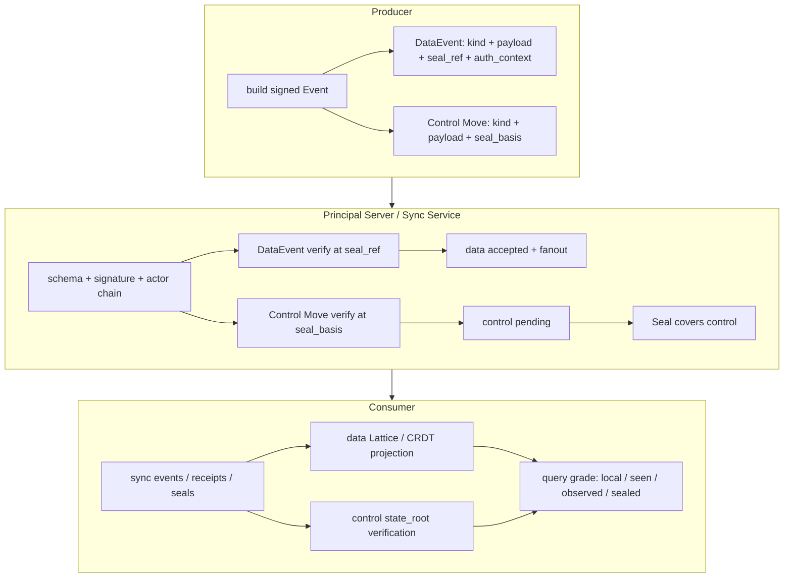

## 0. 规范语言

本文中的规范关键字（**MUST** / **SHOULD** / **MAY** 等）按 [conformance/normative-language.md](../conformance/normative-language.md) 解释；仅大写形式具规范约束力。

## 1. 目标

Arkret 是面向协作对象的分布式发布、传播、查询与收敛协议。同步层的目标是让各副本在不依赖全局共识链的前提下，验证事件来源、传播可合并状态、暴露冲突，并对治理状态提供可审计 finality。

Arkret v1 采用 **CBA**（Control-plane Basis-committed Sealing）：

- 数据面事件（DataEvent）解决普通协作写入：消息、reaction、read cursor 的持久投影、协作对象字段、排序、计数等。DataEvent 由 actor 签名、按 `seal_ref` 验证授权，通过 cell Lattice / CRDT 收敛；它不等待 Seal 才成为本地可接受事实。
- 控制面事件（Control Move）解决治理写入：membership、capability、policy、notary、lifecycle、MLS epoch、密钥治理，以及 schema 明确声明 `sealed=true` 的对象。Control Move 由 Seal 覆盖后才取得 `sealed` finality。
- Seal 只对控制面给出 finality；它可以携带数据面的观测承诺（例如 `data_view_root` / `data_event_set_root` / `availability_root`），但这些根只证明对应 observation，不把数据面升级为控制面 finality。

同步层必须支持 actor 侧可验证发布、append-only 审计日志、离线写入、跨服务传播、选择性同步、最终一致投影、以及控制面问责。

## 2. 事件类型与 wire 边界

Arkret v1 的共享历史基础单位是 signed Event Envelope（schema [`event-envelope.schema.json`](../../artifacts/schemas/event-envelope.schema.json)）。Envelope 由 `event_id`、`realm_id`、`kind`、`actor_id`、`actor_seq`、`prev_refs[]`、`refs[]`、`payload`、`proofs[]` 等字段组成，canonical event bytes 与 proof 规则见 [`event-and-patch.md`](../models/event-and-patch.md) 与 [`encoding.md`](../conformance/encoding.md)。

Reducer-input Event 分为两类，二者 wire shape 互斥：

| 类型 | 必须字段 | 禁止字段 | 收敛语义 |
| --- | --- | --- | --- |
| DataEvent | `scope_ref`、`seal_ref`、`auth_context` | `preconditions`、`seal_basis` | reducer 从 kind + payload 派生 data-plane writes；签名、actor chain、授权与 Lattice 验证通过即可本地接受。 |
| Control Move | `scope_ref`、`seal_basis` | `seal_ref`、`auth_context` | reducer 派生 control-plane writes；进入 pending control set，直到被有效 Seal 覆盖才生效。 |
| Anchor Unit | `scope_ref`；kind 仅限 `ak.realm.create` genesis bootstrap 与 `ak.device.reanchor` recovery unit | `seal_ref`、`auth_context`、`seal_basis` | 封闭例外；必须按 CBA 非空 genesis / transaction 规则验证。 |

`preconditions[]` 仅属于 Control Move。DataEvent 不使用全局 CAS precondition；需要强单值、硬配额、跨 cell 原子性或不可自动合并语义的对象，MUST 在 Realm schema 中声明为 control plane（或使用专门 per-object sequencer），不得伪装成轻量数据面写入。

### 2.1 DataEvent

DataEvent 是数据面写入。它的核心字段如下：

| 字段 | 含义 |
| --- | --- |
| reducer contract | 从 kind + payload 派生数据面 cell 与 Lattice 操作；全部目标 MUST 为 `plane="data"`。 |
| `seal_ref` | 已接受的 Seal id，表示授权验证使用的控制面基准。 |
| `auth_context` | 签名 DID、key epoch、可选 credential epoch 与 capability refs。 |
| `causal_refs[]` | 业务因果 hash 引用；用于投影、线程、排序与缺依赖诊断，不证明范围完整性。 |
| `refs[]` | 语义引用；例如 `authorized_by`、`parent_event`、`attestation`、`after`。 |

DataEvent 验证通过后可以立即进入本地 accepted set、fanout、同步和投影。Seal 后续 MAY 观测到该 DataEvent，并通过 `data_event_set_root` 或 `data_view_root` 暴露 `observed` 证明；未被观测不否定该 DataEvent 的签名事实和本地可接受性。

### 2.2 Control Move

Control Move 是控制面写入。它的核心字段如下：

| 字段 | 含义 |
| --- | --- |
| `seal_basis.leaves[]` | 签名时采用的 Seal leaf 集合。 |
| `preconditions[]` | 可选控制面 pre-state predicate。 |
| reducer contract | 从 kind + payload 派生控制面 cell 与 Lattice 操作；全部目标 MUST 为 `plane="control"`。 |

Control Move 的签名、actor chain、basis、precondition 和授权验证通过后，服务 MAY 返回 signed receipt 表示已经进入控制面待检查集合。它只有在有效 Seal 覆盖其 digest 且 `state_root` 重算一致后，才成为 `sealed`。

### 2.3 actor-private 与 ephemeral 边界

`actor_private_event` 仍使用 signed Event Envelope，但不写 shared Realm data/control cell，不进入控制面 Seal 覆盖集，也不影响其他成员的共享状态。它可以用于 account data、device route、个人偏好或 actor 私有投影。

Signal 与 to-device 都不属于 Event registry。presence、typing、receipt、call signaling 使用
encrypted-only `SignalEnvelope`；key verification、secret 与 Realm key 请求使用
`DeviceMessageEnvelope`。接收方 MUST NOT 把两者解释为 durable Event、不得分配 shared
`actor_seq`、不得写 cell、不得进入 Seal。

| `wire_scope` | 允许 schema | 允许提交路径 |
| --- | --- | --- |
| `durable_event` | `ak.schema.event.v1` | `ak.self.events.command.submit`、`ak.peer.events.command.submit` |
| `actor_private_event` | `ak.schema.event.v1`，但不得携带 CBA reducer 字段 | `ak.self.events.command.submit` 的 actor 私有路径 |

Signal 与 DeviceMessage 使用各自 operation 和 schema，不具有 `wire_scope` 值。`wire_scope`
只分类 signed Event Envelope。

## 3. 接收与验证

任何接收 Event Envelope 的 Events API 或 Sync Service，MUST 先执行通用验证：

1. JSON schema validation。
2. canonical bytes 与 `proofs[]` 校验；proof signer MUST 对应 `actor_id`，或在 `executed_by` 场景下对应代理身份并满足 `authorization_ref`。验签 MUST 优先使用 Event 所引用的 accepted auth-state / key epoch / device authorization / agent signer evidence 中固定的公钥绑定；命中既有绑定时不得重新在线解析 DID。只有出现新 DID、新 verification method、rotation / recovery / deactivation、service delegation 变化或 freshness policy 明确要求更新证据时，才进入 [`../identity/did-usage-and-verification.md` §4](../identity/did-usage-and-verification.md) 的 DID 权威验证路径。
3. `event_id` 与 canonical bytes 的幂等冲突检测。
4. `actor_seq`、`prev_refs[]` 与 actor chain 连续性验证。
5. `realm_id`、kind registry、payload schema、critical extension 与 reducer profile 支持性验证。

通用验证通过后，按 CBA 类型分流。

### 3.1 DataEvent 验证

接收方 MUST：

1. 确认 Event 携带签名 `scope_ref`、`seal_ref`、`auth_context`，且不携带 `preconditions` 或 `seal_basis`。
2. 确认 `seal_ref` 指向本 Realm 已接受的 Seal。
3. 在该 Seal 的控制面 `state_root` / KeyView 下验证 actor/key binding、key epoch、credential epoch、capability refs、policy、membership、Realm lifecycle、Circle lifecycle 与 object scope；这里的 actor/key binding 校验是对 pinned auth-state 的确定性求值，不是对当前 DID Document 的在线重解析。Circle `state=active` MUST 在该 `seal_ref` view 中求值，不得读取 receiver 当前 projection。
4. 按 Realm 的 `revocation_freshness_window_ms` 判定该 `seal_ref` 是否仍可作为数据面授权基准；Circle archive 复用该框架，Circle tombstone 与 `open_set` 并发 archive / tombstone 不享受窗口，具体见 [`circle.md` §6.1](../models/circle.md)。无法确认撤销新鲜度的高风险写入 MUST fail closed。
5. 从注册的 reducer contract 重算全部 cell writes，确认它们只命中 data plane cell，且 cell family 的 Lattice 操作合法。
6. 将 DataEvent 纳入本地 data accepted set，并按 cell Lattice join 重算数据面 projection。

DataEvent 的安全问题主要是签名伪造、授权过期、写入不属于 data plane、以及不可合并冲突。签名伪造由 DID/key 与 Event proof 解决；授权基准由 `seal_ref` 解决；事件冲突由 Lattice / CRDT / bottom diagnostic 解决。

### 3.2 Control Move 验证

接收方 MUST：

1. 对非 anchor-unit 的 Control Move，确认 Event 携带签名 `scope_ref`、`seal_basis`，且不携带 `seal_ref` 或 `auth_context`。
2. 确认 `seal_basis.leaves[]` canonical sorted、duplicate-free 且均为已接受 Seal；从这些 Seal 合成 view 并重算 `control_event_set_root` 与 `state_root`，Event 不重复声明 roots。
3. 在该 control basis 下验证 signer、capability、policy、membership、Realm lifecycle、Circle lifecycle 与 object scope；Circle `state=active` MUST 在 `seal_basis.leaves[]` 合成的 joined control view 中求值，并在 Seal 接受时由 `apply_seal` step 8 对冻结 predecessor joined governance state 重验。
4. 求值 `preconditions[]`；任一 predicate 不成立则拒绝该 Control Move。
5. 从注册的 reducer contract 重算全部 cell writes，确认它们只命中 control plane cell。
6. 将该 Control Move 放入控制面 pending set，等待 Seal 覆盖。

Control Move 被有效 Seal 覆盖后，接收方重放控制面覆盖集，计算 control cell Lattice 与 `state_root`。root 匹配则该 Move 进入 `sealed`；root 不匹配或 Seal 签名、slot、delta、root、batch 验证失败，则拒绝该 Seal 并产生问责证据。

#### 3.2.1 Anchor Unit 验证

无 `seal_basis` 的 reducer-input Event MUST 先进入封闭 anchor-unit 分支，不能按普通 Control Move 拒绝。receiver MUST 按 [`event-auth-state-resolution.md` §5](../authz/event-auth-state-resolution.md) 验证：kind / batch 组合白名单、同批原子性、`ak.realm.create` 的 critical `refs[role=did_inception]` 与 bootstrap follow-up 完整覆盖，或 `ak.device.reanchor` 的 `refs[role=did_recovery_anchor]`、`pre_fence_basis` 全 frontier CAS 与 replacement authorize 原子 unit。任一 unit 缺项、跨 Realm、重复或携带 `seal_basis` 均 MUST fail closed。

### 3.3 Seal 验证

Seal 的 wire contract 见 [`seal.schema.json`](../../artifacts/schemas/seal.schema.json)，完整语义见 [`event-auth-state-resolution.md`](../authz/event-auth-state-resolution.md)。

接收方 MUST 至少验证：

- notary / committee 签名与 signer sequence。
- predecessor / slot / profile 约束。
- `delta[]` 只包含本 Seal 新增的控制面 Event digest。
- `control_event_set_root` 与递归控制面覆盖集一致。
- 控制面 reducer 重放后的 `state_root` 与 Seal 声明一致。
- inclusion list / receipt obligation / fault evidence 规则。

`data_view_root`、`data_event_set_root` 和 `availability_root` 只证明 notary 在该 Seal 观察到的数据面集合或可用性材料；它们不得用于改变 DataEvent 的控制面授权结果。

## 4. Event-first 发布模型



规范要点：

- Producer 与 Consumer 都可以从 signed Event 与 Seal proof 独立验证历史。
- Sync Service 是传播与投影服务，不是签名事实的来源；它不能伪造 actor Event。
- DataEvent 可以离线产生，但必须选择一个可验证且足够新鲜的 `seal_ref`。
- Control Move 的 finality 来自 Seal，而不是到达顺序。

## 5. 批量提交与 partial accept

`ak.self.events.command.submit` 接收单个 `EventInitialSubmission` 或
`{events: EventInitialSubmission[]}`；`ak.peer.events.command.submit` 接收
`EventFederationSubmission[]`。两种封装中的 `event` 都是同一个完整签名 Event Envelope；
lease、receipt 与 proof bundle 是独立发布证据，不进入 Event digest。批处理的最小原子单元是
单个 Event 及其发布证据；一个 Event 的失败不得回滚同批已接受 Event。

`events[]` MUST 按数组顺序处理。下文“Event”均指每项的 `event` 字段。同批中已接受的前序
Event 仅可作为后续 Event 的解析材料：

- 可以解析 bytes、Event ID、actor chain、`prev_refs[]`、`causal_refs[]` 或 payload-level causal reference。
- 不得作为后续 Event 的授权基准。
- DataEvent 的授权基准始终是该 Event 自己的 `seal_ref`。
- Control Move 的授权与 precondition 基准始终是该 Event 自己的 `seal_basis`。
- 同批前序 Event 创建、delegate、恢复、扩权或 revoke 的 grant/policy，不会在同批后续 Event 的授权判定中提前生效。

后续 Event 若依赖同批失败、缺失或隔离的 Event，MUST 以 `dependency_missing`、`causal_conflict`、`capability_denied`、`soft_failed` 或等价原因拒绝或隔离。

**后向引用（同批数组顺序靠后）的判定（normative）**：当某 Event 的 `prev_refs[]` / `causal_refs[]` 指向**同批中数组顺序在其之后、尚未处理**的 Event 时，实现 MUST 在单遍按序处理到该 Event 时一律判 `dependency_missing`（或隔离待重交），MUST NOT 为满足同批后向引用而对批做整批拓扑重排。这把"按数组顺序处理"与"前序作解析材料"在 reorder 下的歧义锁死为确定行为：同批解析材料只覆盖数组靠前已处理的 Event，靠后未处理的引用一律视为缺依赖。提交方应自行按因果序排列 `events[]`，缺序时通过重交（`accepted ∪ duplicate` 求差后重提）收敛，而非依赖服务端重排。

批量响应 MUST 区分：

| 字段 | 语义 |
| --- | --- |
| `accepted[]` | 首次接受的 Event。 |
| `ingress_receipts[]` | 本次首次签发或幂等重放的原始 IngressReceipt；重复提交不得以新时间重签。 |
| `duplicate[]` | canonical bytes 完全一致的幂等重复。 |
| `rejected[]` | 已确定失败的 Event。 |
| `quarantine[]` | 因缺 proof、缺依赖、缺可用性或异步验证而暂不能决定的 Event。 |

`status=accepted` 仅当 `rejected[]` 与 `quarantine[]` 均为空且 `accepted[]` 非空。全部为幂等重复时使用 `status=duplicate`。其它结果使用 `status=partial`；因此全 rejected / quarantine 且 `accepted[]`、`duplicate[]` 均为空仍是合法 `partial`，不是请求级失败。peer submit 的历史补录例外 MAY 使用 `status=historical_only`，其精确定义见 [`federation.md` §4.1](./federation.md)。

**批量 read-your-writes barrier cursor（normative）**：批量 submit 响应 MUST 返回一个绑定本批 `accepted[]`（∪ `duplicate[]`）所达 max causal frontier 的 barrier cursor（语义与 api-conventions §8 单事件 barrier cursor 一致，形态为 `ak:cursor:` opaque handle）；客户端用它向 projection 层等待"读己之所写"。`accepted[]` 为空（全部 rejected / quarantine）时 barrier cursor MAY 省略或回显请求基线 frontier。该 cursor 覆盖本批已接受集合的前沿，不覆盖 quarantine 中尚未决定的 Event。

## 6. Receipt、可用性与完整性证明

Event 是 canonical history；receipt、attestation、snapshot 与 Seal observation 是加速层或审计证明，不替代 Event 自身签名。

### 6.1 Event Batch Receipt

Event Batch Receipt（schema [`event-batch-receipt.schema.json`](../../artifacts/schemas/event-batch-receipt.schema.json)，`ak.schema.event_batch_receipt.v1`，字段与概念分层见 [`../models/event-and-patch.md` §5](../models/event-and-patch.md)）是 best-effort RYW / 加速 / 审计 hint：issuer（服务、客户端或 witness）证明已看到并承诺 `events[]` 所列 Event 集合的 integrity。它可用于 read-your-writes、跨服务对账、轻客户端同步与 censorship 诊断；它不证明 Event 已进入控制面 finality，只对 issuer 选择承诺的集合提供 integrity，不提供范围 completeness。接收方 MUST 能在没有 batch receipt 的情况下验证单个 Event。

单事件确认是 `events[]` 单元素的退化形态；协议只定义 Event Batch Receipt 这一种 set-bound receipt 结构。多事件 receipt 的 `events[]` MUST 使用 [`encoding.md` §5](../conformance/encoding.md) 的 canonical set 顺序并去重；数组位置不表达到达顺序、因果顺序或签发优先级。

### 6.2 AvailabilityReceipt

AvailabilityReceipt（schema [`availability-receipt.schema.json`](../../artifacts/schemas/availability-receipt.schema.json)）证明 holder 在某 retention window 内承诺保存指定 Event bytes 或 blob bytes。它可被 Seal 的 `availability_root` 观测，但不替代事件签名、授权验证或 Lattice 收敛；具体 operation / profile 若要返回该观测证明，必须显式登记响应字段、schema 与验证规则。

### 6.3 Audit RYW Receipt

`ak.audit.ryw_receipt`（schema [`audit-ryw-receipt.schema.json`](../../artifacts/schemas/audit-ryw-receipt.schema.json)，`ak.schema.audit_ryw_receipt.v1`）是审计释放路径专用的 per-event RYW witness attestation：它对单个 `ak.audit.accessed` / `ak.audit.release` Event 提供带 witness 背书的 accepted 确认，是 audited-E2EE release gate 的前置条件（见 [`../crypto-media/audited-e2ee.md` §6](../crypto-media/audited-e2ee.md)）。与 §6.1 的通用 hint 不同，它带强制 witness attestation 结构与 fail-closed 校验，并具有 "object + durable event kind" 双形态（[`../models/event-and-patch.md` §5.1](../models/event-and-patch.md)）。

### 6.4 Range-bound Completeness Attestation

需要证明“某范围内没有漏给事件”时，必须使用带显式 range 的 attestation：per-actor seq interval、from/to frontier、root、count 与 witness quorum。Set-bound Merkle commitment 只能证明集合未被篡改，不能证明范围未被删减。

`ak.attestation.range_completeness` 是 v1 已注册 active event kind（payload schema `ak.schema.range_completeness_attestation.v1`，artifact [`range-completeness-attestation.schema.json`](../../artifacts/schemas/range-completeness-attestation.schema.json)），用于提供 *completeness* 证明——即“该范围内没有 reducer-input event 被静默丢弃”。它与 `ak.event_batch_receipt`（set-bound integrity）和 `ak.audit.ryw_receipt`（per-event RYW）正交：completeness 需要 range 语义 + per-actor seq interval + witness 背书，缺一不可。

#### 6.4.1 Payload 与 root（normative）

`ak.attestation.range_completeness` 的 payload schema 是 [`range-completeness-attestation.schema.json`](../../artifacts/schemas/range-completeness-attestation.schema.json)（schema id `ak.schema.range_completeness_attestation.v1`）。payload MUST 至少声明：

- `realm_id`：完整性范围所属 Realm；
- `event_range.from_frontier.realm_frontier[]`：下界 frontier（exclusive）；
- `event_range.to_frontier.realm_frontier[]`：上界 frontier（inclusive）；
- `event_range.actor_seq_ranges[]`：每个 actor 的 `(from_seq_exclusive, to_seq_inclusive]` 区间；
- `root`：对范围内全部 reducer-input Event 的 Merkle root；
- `count`：参与 root 的 leaf 数；
- `witness_attestation.kind` 与 `witness_attestation.witnesses[]`。

`root` 的 leaf 集 MUST 恰好是 `realm_id` 下位于 `(from_frontier, to_frontier]` 且 actor seq 落入对应 `actor_seq_ranges[]` 的全部 reducer-input Event。每个 leaf 的 `leaf_data` 为下列 closed object 的 canonical JSON UTF-8 bytes：

```json
{
  "actor_id": "<event.actor_id>",
  "actor_seq": 0,
  "event_id": "<event.event_id>",
  "event_digest": "<event.proofs[0].event_digest>"
}
```

在当前 attestation 绑定的单一 `realm_id` 内，leaf 顺序按 `(actor_id code point ASC, actor_seq ASC, event_id ASC, event_digest ASC)` 排列；`actor_seq_ranges[]` 只描述该 Realm 的 `(actor_id, actor_seq)` 链，其他 Realm 的合法序号不形成本 Realm gap。跨 Realm Event 混入 range MUST `range_completeness_actor_seq_gap` 并 fail closed。Merkle 组合 MUST 使用 [`event-auth-state-resolution.md` §6.2.2](../authz/event-auth-state-resolution.md) 的 Seal Merkle 组合规则（`leaf = H(0x00 || leaf_data)`、`node = H(0x01 || left || right)`、空集合 root 为 `H("")`），`H` 取该 Realm 的 `digest_algorithm`。`count` MUST 等于 leaf 数；`root` MUST 等于该 leaf 集重算结果。

#### 6.4.2 Quorum 语义（normative）

`witness_attestation.kind="single_source"` 表示 issuer 自报：verifier MAY 用它检测传输篡改和本地缺口，但 MUST NOT 把它当作 sovereign-grade completeness 证明。`single_source` payload 的 `witnesses[]` MUST 至少包含 issuer 自身或一个声明代表 issuer 的 witness entry；issuer、verification method 与 proof controller 不一致时 MUST `schema_violation`。

`witness_attestation.kind="federation_witness_attested"` 表示独立 witness quorum 已对同一 `(realm_id, from_frontier, to_frontier, actor_seq_ranges, root, count)` 签署一致见证。verifier MUST 校验：

1. `witnesses[].issuer`、`verification_method`、`controlling_organization` 在 quorum 内 pairwise distinct 到 policy 要求的最小独立性；
2. 每个 witness 均在 Realm policy `audit.range_completeness_witnesses[]` 或等价 profile-declared witness 集合内；
3. witness proof 覆盖同一 canonical payload digest；
4. quorum 中的 witness 必须签署**同一完整 canonical payload**，即 `(realm_id, from_frontier, to_frontier, actor_seq_ranges, root, count)` 全部逐字节一致。若它们被要求见证该同一完整 scope 却给出不同 `root`、`count` 或 `actor_seq_ranges[]`，verifier MUST 标记 `witness_disagreement`，quarantine 该 attestation / range，并 fail closed，不得把任一方结果展示为完整。反之，`actor_seq_ranges[]` 或 frontier 边界不同的独立 attestation 是不同 scope 的证明，不能仅因 root 不同互判 `witness_disagreement`；consumer 只能分别在各自 scope 内验证，若需要组成 quorum，必须先请求 witness 对同一完整 payload 重新签署。

声明 `security_class=high_assurance` 或 `ak.profile.federation.high_assurance.v1` 的 Realm，解除 completeness 关注时 MUST 只接受 `federation_witness_attested`；`single_source` 只能作为诊断输入。

本节所称 witness policy 的唯一 wire 承载是 Realm `audit_policy`（`realm.schema.json`）。“等价 profile-declared witness 集合”仅指 profile 要求同一字段取更严格值，不能引入另一私有承载；`audit_policy` 缺失时 `federation_witness_attested` 不可验证，verifier MUST fail closed。

#### 6.4.3 single-source issuer 行为（normative）

签发 `single_source` attestation 的 issuer MUST 先从自己的 accepted store 构造 `(from_frontier, to_frontier]` 范围，按 §6.4.1 计算 `actor_seq_ranges[]`、`root` 与 `count`，再签名 payload。issuer 不得仅依据分页结果、查询过滤器结果或一组 `events[]` 响应临时推断完整性；范围必须来自该 issuer 对 Realm history 的 accepted frontier 视图。issuer 后续发现该 range 内存在漏收、over-fork quarantine、签名无效或 actor chain repair 时，MUST 将旧 attestation 视为 stale diagnostic，不得继续作为 completeness 证明返回。

#### 6.4.4 verifier 协议（normative）

客户端或 peer 验证 range-completeness attestation 时 MUST 按下列顺序执行：

1. 验证承载 EventEnvelope 的签名、`event_digest`、`kind="ak.attestation.range_completeness"` 与 payload `schema="ak.schema.range_completeness_attestation.v1"`；payload schema 校验失败即 `schema_violation`。
2. 校验 `realm_id`、`from_frontier`、`to_frontier` 与查询 / backfill scope 一致；attestation 的 range MAY over-cover 响应页，但 verifier 只能对本地已经 backfill 完成且落在 attestation range 内的交集声明完整。
3. 校验 `actor_seq_ranges[]` canonical 排序、无重复 actor、每个 `from_seq_exclusive < to_seq_inclusive`；不满足时 `schema_violation`。
4. 从本地已验证 accepted store 取出 `(from_frontier, to_frontier]` 且匹配 `actor_seq_ranges[]` 的全部 reducer-input Event，按 §6.4.1 重算 Merkle root；不一致 MUST `range_completeness_root_mismatch`。
5. 重算 leaf 数并与 `count` 比对；不一致 MUST `range_completeness_root_mismatch`。
6. 对每个 `actor_seq_ranges[]`，verifier MUST 比对本地视图的 per-actor seq interval：若本地在该区间内存在缺口、已知 quarantine / dependency_missing 输入，或存在区间内 accepted Event 未被 leaf 覆盖，而 attestation 声称完整，MUST `range_completeness_actor_seq_gap` 并 fail closed。
7. 按 §6.4.2 校验 quorum；witness 对同一 range 的 payload 不一致、policy 不承认 witness、或 high-assurance Realm 只收到 `single_source` 时，MUST `witness_disagreement` 或 profile 指定的更具体 reason，quarantine 该 completeness 结论。

上述任一步失败时，verifier MAY 继续展示已签名 Event 自身，但 MUST NOT 向用户、上层 API 或审计报告声明该范围“历史完整”。

## 7. 同步面

同步面以可见性裁剪后的 Event、receipt、Seal、snapshot 与 projection delta 组成。

| 面 | 用途 |
| --- | --- |
| Event Source Sync | actor 历史恢复、审计重放、事件查缺。 |
| Realm Sync | Realm 级 durable Event、Seal 与 projection 增量。 |
| Strand Sync | Strand 当前态、track 状态、可见性裁剪后的 activity。 |
| Discussion Sync | Strand discussion 轨道消息时间线。 |
| Board Sync | Board/List/Strand 位置与排序 projection。 |
| Query Surface | view、搜索、context timeline 与 graph 查询。 |
| Authz / Invite Surface | invite、grant 视图、控制面状态与可写性诊断。 |

Strand Sync MUST NOT 因 actor 可读 Strand synthesis 就自动展开不可读 discussion timeline 或 Morph 内容。所有同步面都 MUST 先按 Realm、Circle、object scope、history visibility、E2EE availability 与 caller capability 裁剪。

## 8. 查询响应证据

v1 不定义跨所有查询响应通用的 `basis` / `grade` 包装。operation registry 的 `response_schema_ref` 与 OpenAPI binding 是各响应字段的机器真源；receipt、Seal observational root、range-completeness attestation 或 transparency attestation 只有在具体 operation / profile 显式登记承载字段、schema 与验证规则时，才构成该响应的可互操作证据。

实现不得用私有等级字符串替代已登记证明，也不得把数据面 observation 表述为控制面 Seal finality。未登记证据字段的响应只具有对应 operation 已声明的读取语义。

## 9. 冲突与收敛

Arkret 不用全局链决定普通协作写入顺序。状态收敛由 cell family 的 Lattice / CRDT 规则定义：

- OR-Set、ordered log、RGA、PN-counter、escrow counter 等可合并 cell MUST 对输入顺序不敏感。
- 单值、硬配额、跨 cell 原子性和不可交换操作不得放在 data plane，除非使用专门 sequencer。
- 并发不可合并时，reducer MUST 产生 structured bottom / conflict diagnostic，而不是用 HLC、actor id、数据库自增 ID、本地到达顺序或 Sync Service 顺序挑选 winner。
- Timeline 展示顺序是 projection，MUST NOT 反向写入 canonical state、授权判断或 Lattice winner。

DataEvent 的 `causal_refs[]` 可以帮助投影层稳定排序和诊断缺依赖；它不是全局 completeness proof。

## 10. Snapshot

Snapshot 是恢复加速层，不是真相源。Snapshot manifest MUST 声明以下字段（权威必填集见 [`../conformance/snapshot-schema.md`](../conformance/snapshot-schema.md) 与 [`snapshot.schema.json`](../../artifacts/schemas/snapshot.schema.json) 的 `required`，本清单与之等价）：

- `id`（snapshot 自身 id）
- `realm_id`
- `reducer_profile` 与 `schema_profile_refs`（reducer / schema profile refs）
- `state_digest`（投影状态根：data projection root 或 control `state_root`，按 `security_class` 确定，**必填**）
- `event_set_commitment`（绑定"哪些事件产生该状态"的承诺，与 `state_digest` 各自独立、**均必填**；客户端采用前 MUST 验证它，见下）
- `frontier`（covered Event frontier / Seal basis）
- `chunks`（chunk digests）
- `security_class`
- `created_by`（issuer）与 `created_at`
- `authority_binding`（证明 `created_by` 在 `created_at` 被授权签发该 snapshot）
- `signature`

客户端采用 Snapshot 前 MUST 验证 signature、chunk digest、profile compatibility、basis freshness、Event set commitment 与必要 inclusion / omission challenge。验证失败时 MUST 丢弃 Snapshot 并回退到原始 Event / Seal 回放。

Snapshot 后续恢复流程：

1. 获取 Snapshot manifest。
2. 验证 issuer 与 proof。
3. 下载并验证 chunks。
4. 从 Snapshot frontier / Seal basis 之后拉取 Event 与 Seal。
5. 重放 DataEvent Lattice 与控制面 Seal。
6. 进入增量订阅。

## 11. 首次加入 Realm

**加入提交目标（normative）**：跨域加入时"向哪台服务提交 join material"的唯一权威来源是 `ak.find.directory.query.resolve_realm` / `ak.find.directory.query.resolve_target` / signed invite metadata 返回的 `join_candidates[]`（规范定义见 [`federation.md` §5.0](./federation.md)）。客户端 / 提交服务 MUST NOT 从 Realm ID、邀请者所在 Principal Server、被邀请者自己的 Principal Server 或 URL 路由提示推导加入提交目标；所有重试 MUST 绑定同一 canonical `realm_id`。

推荐流程：

1. 解析 Realm metadata 与 service binding；按 [`federation.md` §5.0](./federation.md) 取得 canonical `realm_id` 与 `join_candidates[]`，并以 `join_candidates[]` 作为 join material 的提交目标。
2. 获取与 caller 相关的 invite、claim、grant 或 presentation challenge。
3. 拉取当前 Seal 与必要控制面 proof。
4. 验证 membership / capability / policy。
5. 拉取最近 Snapshot（可选）并验证。
6. 从 snapshot basis 或当前 Seal 之后拉取 Event。
7. 本地重放并进入 cursor 增量订阅。

若客户端只有 handle 而没有 DID，必须先完成 handle -> DID 解析与双向校验；handle 不得直接作为 actor 或 grant subject。

## 12. 幂等、去重与重放

重复提交与重复投递是正常情况：

- `event_id` MUST 全局稳定。
- 同一个 `event_id` 的完全相同 canonical bytes MAY 被重复接收，并作为幂等成功处理。
- 同一个 `event_id` 对应不同 canonical bytes 时，提交响应 MUST 拒绝新到变体并返回 `duplicate_conflict`；本地状态处置则 MUST 把该 `event_id` 的全部已知变体作为一组进入 quarantine，包括此前已 accepted 的变体。节点 MUST 从所有 data cell join 输入移除这些变体经 reducer 派生的 writes；尚未被 accepted Seal 覆盖的 Control Move 同样移除。依赖任一变体的后续 Event 转为 `dependency_missing` / pending。已被 accepted Seal 覆盖的 Control Move 不得从其 `covered_set` / `state_root` 追溯删除，按 [`event-auth-state-resolution.md` §6.3.2](../authz/event-auth-state-resolution.md) 等待 fork-resolution compaction Seal；相关 actor 的后续控制写入在归一前 fail closed。节点同时保留最小冲突证据。
- submit、probe、backfill 或本地审计任一路径发现双变体，都 MUST 执行同一整组 quarantine 处置；wire `duplicate_conflict` 只是当前调用的响应语义，不能替代本地追溯状态转换。解除 quarantine 只允许走 [`federation.md` §4.5](./federation.md) 的 raw replay、quorum witness 或 operator-approved fork resolution。
- Sync Service SHOULD 以 `event_id` 与 `event_digest` 去重，而不是以到达次数计数。

## 13. 授权时序

授权不能只看墙上时钟。CBA 的授权时序规则是：

- DataEvent 按自身 `seal_ref` 指向的控制面 Seal 验证授权。
- Control Move 按自身 `seal_basis` 指向的控制面 view 验证授权和 precondition。
- revoke、grant、membership、policy 与 lifecycle 的可见性由控制面 Seal 拓扑和 `revocation_freshness_window_ms` 判定。
- 同批提交不会让授权变更提前影响后续 Event。
- 无法解析必要控制面 proof 或 freshness 的写入 MUST fail closed 或 quarantine，不得按 HLC、本地到达顺序或服务端当前数据库猜测授权有效。

## 14. 可见性、密文负载与 E2EE 索引

ACL 不等于密文保护。Sync Service 可以转发不透明密文，但不得把未授权的明文元数据暴露给未被 policy 委托的服务。

字段可见性分级：

- Event Envelope 顶层路由、因果与签名归属元数据：`event_id`、`realm_id`、签名 `scope_ref`、`kind`、`prev_refs[]`、`causal_refs[]`、`refs[]`、`actor_id`、`actor_seq`、`hlc`、`seal_ref` 或 `seal_basis`、以及 schema 声明的 `executed_by`、`authorization_ref`、`applet_id`、`external_ref`、`actor_kind`。
- 明文业务元数据：轻量状态、rank、due date 等；若足以暴露敏感内容，接收服务必须列入 Realm policy 的 plaintext-visible service。
- 不透明加密负载：message body、附件内容、私有对象字段等。

MLS / E2EE 语义见 [`encryption-and-audit.md`](../crypto-media/encryption-and-audit.md)。控制面 MLS epoch 属 Control Move；普通加密消息仍是 DataEvent。

## 15. 设计决定

Arkret v1 固定：

- signed Event Envelope 是 actor 发布单元。
- DataEvent 是普通协作数据面的默认写入单元。
- Control Move 是治理状态和强不变量的写入单元。
- Seal 只给控制面 finality；对数据面的 root 是观测承诺。
- Event 签名、accepted DID/key binding 和 capability 检查解决伪造事件问题；DID authority
  resolution 只在身份 / key binding 建立、变更或显式 freshness 触发时执行。
- 数据面的核心分布式问题是冲突、可用性、可见性与观测证明；冲突由 Lattice / CRDT / bottom diagnostic 解决。
- 密文负载可以由不解密的 Sync Service 转发。
- hard erasure 只能删除本地 payload / blob / 派生内容，并保留事件图验证所需的最小 verification stub；不得重写 Event hash 或伪装事件从未存在。

## 16. 规范性引用

- CBA 双平面、Seal、query grade 与 failure state 见 [`event-auth-state-resolution.md`](../authz/event-auth-state-resolution.md)。
- Event Envelope、canonical bytes、Patch 与 proof 见 [`event-and-patch.md`](../models/event-and-patch.md)。
- HTTP operation binding 见 [`service-http-binding.md`](./service-http-binding.md)。
- Federation transport 见 [`federation.md`](./federation.md)。
- Cursor 编码、digest suite 与 HLC 见 [`encoding.md`](../conformance/encoding.md)。
- Strand / Message、Realm / Space / Morph 语义见 [`strand-and-message.md`](../models/strand-and-message.md)、[`realm-and-space.md`](../models/realm-and-space.md) 与 [`morph.md`](../models/morph.md)。
