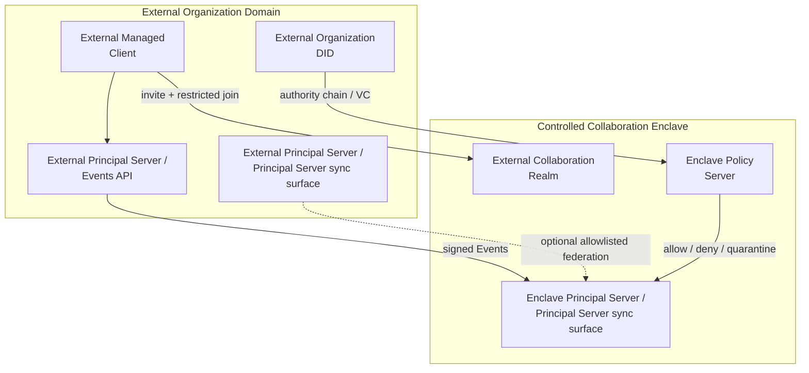

## 0. 规范语言

本文中的规范关键字（**MUST** / **SHOULD** / **MAY** 等）按 [conformance/normative-language.md](../conformance/normative-language.md) 解释；仅大写形式具规范约束力。

## 1. 目标

高安全组织可以运行独立的 Arkret 网络，同时在必要时为外部人员或外部组织开启 **External Collaboration Realm**。

本文定义：

- sovereign deployment 的边界
- isolated federation domain
- 在 sovereign deployment 下 External Collaboration Realm 的强制 policy（`ak.profile.sovereign_deployment.v1`）
- 外部主体进入高安全网络的验证、授权、加密、审计和退出规则
- sovereign client 与 DID resolver policy

> Realm 角色分类（Principal Control Realm / Internal Collaboration Realm / External Collaboration Realm）见 [`models/realm-and-space.md` §2.8](../models/realm-and-space.md)。

## 2. 部署模型

Sovereign deployment 是由单一组织或联盟控制的 Arkret 服务域。它通常包含：

- Organization DID / governance registry / witness
- Identity Registry
- Principal Server / Principal Server sync surface
- Directory
- Blob Store
- Policy Server
- Push Gateway
- TURN / SFU / Realtime Media Server
- Applet / Agent Runtime allowlist

这些服务 SHOULD 使用 service DID，并由 Organization DID 或联盟治理 DID 明确委派。

### 2.1 网络拓扑图

域内结构（简化视图）：


为保持可读性，域内图将 `Directory` / `Blob` / `Media` / `Policy` 等次级组件折叠为 service plane；细项仍以上文服务清单与后续章节为准。

跨域协作路径：



拓扑含义：

- 主网络保持 closed federation，不向外部主体暴露内部 Directory 或服务拓扑。
- Controlled Collaboration Enclave 是独立协作边界，只承载被批准的 Realm。
- 外部主体通过 DID / VC / authority chain / invite / restricted join 进入 enclave Realm。
- 外部组织可以保留自己的 Principal Server / Events API，但写入必须经过 enclave Principal Server / Principal Server sync surface、Policy Server 和本地授权验证。
- 主网络与 enclave 之间没有默认桥接；资料进出必须经过 export / import review。

## 2.2 Sovereign Client

高安全部署不一定要求从零开发专用客户端，但 MUST 使用受管控客户端 profile。普通公共网络客户端只有在被锁定配置、审计、签名发布和策略管理后才可进入 sovereign deployment。

Sovereign client MUST:

- pin organization trust seals：Organization DID、governance DID、registry DID、witness DID、service DID allowlist。
- 使用组织配置的 DID resolver policy，MUST NOT 默认查询公共 registry / public directory。
- 验证服务 DID 委派、证书、HTTP message signature 和 feature profile。
- MUST NOT 允许用户手动添加未批准 Principal Server sync surface / Directory / Blob / Applet endpoint。
- 默认关闭公共 federation、公共搜索、外部 Applet 和外部 Agent handoff。
- 对每个 Realm 显示 classification、E2EE、auditable E2EE、export、external member policy。
- 支持远程撤销 session、device、grant、Applet delegation 和 cached secret。
- 支持本地日志、审计导出和密钥擦除策略。

Sovereign client(在 `ak.profile.sovereign_deployment.v1` 语境下)逐条强制度——数据外泄控制为 MUST,运营增强为 SHOULD/MAY:

- 对批量导出、外部分享实施本地 policy enforcement(MUST;安全关键项，防止未授权再分发)。
- 支持 policy-signed configuration update(SHOULD)。
- 支持离线/内网 resolver bundle(SHOULD)。
- 使用硬件密钥、平台安全模块或智能卡(SHOULD)。
- 对截屏、复制施加提示与水印(MAY,作为运营追溯手段；客户端平台能力受限时不强制)。

## 3. 默认安全姿态

高安全部署的默认姿态在 `ak.profile.sovereign_deployment.v1` 语境下逐条强制度如下——安全关键项为 MUST,可调运营默认为 SHOULD:

- 禁止公共 federation(MUST)。
- 禁止公共 directory listing(MUST)。
- frontier 交换只通过 `/_arkret/peer/events/frontier` 对 allowlist peer 开放（见 [`federation.md` §4.5.1](federation.md)）；sovereign profile 不定义匿名 frontier 探测面，避免 `frontier_root` 摘要被多次轮询推断 Realm 活跃度时间序列。
- Principal Server sync surface / Directory 只接受 allowlist service DID(MUST)。
- Blob、snapshot、backup、audit log 存储在组织控制基础设施内(MUST)。
- E2EE 默认开启(MUST);需要合规审查时使用 auditable E2EE，且必须向成员显示。
- 外部 Applet、Agent handoff、TSP/A2A/ACP transport 默认关闭，按 Realm 明确开启(MUST)。
- Realm 默认 `discoverability=unlisted` 或 `invite_only`(SHOULD；与 §7 的 sovereign profile 声明一致)。
- Realm 默认 `join_rule=invite` 或 `restricted`(SHOULD)。
- Policy Server 默认 `closed` 或 `quarantine` fail mode(SHOULD)。
- PQ-hybrid TLS：sovereign / 高安全 profile 的 client-service、service-to-service 与 federation peer 连接 MUST 遵守 [`transport-bindings.md` §5](./transport-bindings.md) 的 canonical 握手义务。该要求零 wire 字段成本，与 §3.2 / federation §3.2 的 RFC 9421 请求签名正交；conformance 使用 §11 的 deployment-profile 握手探针，而非 object-model vector。完整威胁论据见 [`../security/server-threat-model.md` §2.4](../security/server-threat-model.md)。

## 3.1 DID Policy

Sovereign 部署 MUST 在内部使用既有 DID 方法。组织与服务主体 SHOULD 使用私有或 allowlist 范围内的 `did:webvh` / `did:web`；仅当 policy 明确允许时，MAY 为外部协作方接受 `did:plc`。

部署 MUST 定义 DID resolver policy：

```json
{
  "kind": "ak.sovereign.did_policy",
  "payload": {
    "trust_domain": "ak:trust_domain:did.webvh.defense.example",
    "value": {
      "default_principal_method": "did:webvh",
      "allowed_methods": ["did:webvh", "did:web", "did:plc", "did:key"],
      "trust_roots": [
        "ak:did_core:webvh:zE2ucm2oH9PCib4kBzLEAkFqa",
        "ak:did_core:webvh:z2TiX7ug9JmCNeioq6D2V4VjK",
        "ak:did_core:webvh:z8rCaf8NFL1av8pHxRpz8APYa"
      ],
      "public_resolver_allowed": false,
      "method_policy": {
        "did:webvh": "allowlist",
        "did:web": "allowlist",
        "did:plc": "external_collaborator_only",
        "did:key": "ephemeral_only"
      }
    }
  }
}
```

规则：

- `trust_roots[]` 是稳定 `did_core_id` allowlist，不是 resolver locator、bare DID 或 verification-method DID URL。对候选 bare `full_id` 做准入时，verifier MUST 先按已登记 method adapter 计算 `project(full_id)`，再与 root 逐字节比较；`did:webvh` root 因此只保留 SCID，MUST NOT 拼接 hosting domain/path。
- 命中 `trust_roots[]` 只回答“这个稳定身份是否可作为信任根”，不提供公钥或解析地址，也不证明控制权。密码学验证仍 MUST 消费候选 `full_id` / verification-method DID URL 以及受批准 resolver、witness/watcher、离线 bundle或已接受 binding 提供的 method evidence，并验证 `project(full_id) == matched trust_root`。调用点若只有 `did_core_id`、没有可验证的 `full_id` / key binding / method evidence，MUST fail closed，不得从 Core ID 反向拼造 DID。
- 除非 policy 明确允许该 method 与 trust root，否则客户端 MUST NOT 通过公共 resolver 端点解析内部主体。
- 内部 DID Document 与 method 历史 MUST 从受批准的 resolver / witness / watcher / 离线 bundle 获取。
- 仅当 policy 允许且权限链已验证时，MAY 为外部协作方接受公共 DID 方法。
- 当 `public_resolver_allowed:false` 时，`did:plc` 等本质依赖公共 directory 的方法 MUST NOT 直接查询公共 PLC directory；其 DID Document 与操作历史 MUST 经受批准的 PLC mirror、审计日志 source 或离线 bundle 解析（与上条内部主体同一约束）。无可用受批准来源时 MUST fail closed，不得回退到公共 resolver。
- 涉及关联风险的外部协作 SHOULD 使用 pairwise DID。
- 指向公共 Principal Server sync surface / Directory 的 `ServiceResolutionRecord.base_url` 或 bootstrap hint 在未 allowlist 时 MUST 被忽略；DID Document service endpoint 也不得绕过该规则。

**`did:key` 的 `ephemeral_only` enforcement 语义（normative）**：`method_policy` 把某 method（默认 `did:key`）设为 `ephemeral_only` 时，该取值是可测试约束而非口号。落入 `ephemeral_only` 的 DID **MUST NOT** 被用作：

- principal-level `ak.capability.grant` 的 grant subject；
- 跨 epoch 的 membership key（即作为 `ak.member.state` 的长期 `actor_id` 跨越 MLS epoch rotation 或 Seal epoch 持续有效）；
- 任何长期身份锚点（DID resolver / witness / OOBI 解析意义上的持久主体）。

`ephemeral_only` DID **只能**作为 per-session / per-device 的 ephemeral binding 出现（一次会话或一台设备生命周期内的临时凭据 / 临时签名 key），其有效期不得跨越所绑定 session / device 的生命周期。reducer / Policy Server 收到以 `ephemeral_only` DID 为 principal-level grant subject 或跨 epoch membership key 的写入时 MUST fail closed。

这与 [`client-sync.md` §8.1](./client-sync.md) 中"高隐私 Realm MAY 用 Realm-scoped pairwise `did:key` 作 `actor_id`"协调：作为**长期 membership key 的 pairwise DID** 不属于 `ephemeral_only`，MUST 由 `did:webvh` 派生（可持久解析、可轮换、可撤销），或在 `method_policy` 中对该用途**显式豁免**（例如把承载长期 pairwise membership 的 method 标为 `allowlist` 而非 `ephemeral_only`）。纯 per-session 或按单一 device scope 派生的临时 pairwise **principal DID** 不需要该豁免；这不会使设备自身成为 DID 主体。

## 4. External Collaboration Realm 在 sovereign deployment 下的强制 policy

启用 `ak.profile.sovereign_deployment.v1` 的部署中，组织 MAY 创建 External Collaboration Realm，允许外部网络的人员或组织加入特定协作范围。该 Realm 是隔离边界，不应让外部主体直接进入组织主网络。Realm 角色分类见 [`models/realm-and-space.md` §2.8](../models/realm-and-space.md)。

在该部署下 External Collaboration Realm SHOULD 使用：

```json
{
  "kind": "ak.realm.create",
  "payload": {
    "object": {
      "id": "ak:realm:AT_SiZlQ_-94UNHCwJMH62ckd3G0BPmq-EeRbqXfjh-W",
      "schema": "ak.schema.realm.v1",
      "reducer_profile": "ak.reducer.core.v1",
      "security_class": "high_assurance",
      "title": "External Collaboration",
      "created_by": "ak:did_core:webvh:zGsmzvyUSDby8As5bHG3kAtWL",
      "trust_domain": "ak:trust_domain:did.webvh.defense.example",
      "owning_organizations": [
        "did:webvh:zGsmzvyUSDby8As5bHG3kAtWL:defense.example"
      ],
      "schema_refs": [
        "ak.schema.realm.v1"
      ],
      "default_discoverability": "unlisted",
      "default_join_rule": "restricted",
      "history_access": "since_join",
      "encryption_profile": "mls_rfc9420",
      "federation_policy": "restricted",
      "notary": {
        "kind": "single_signer",
        "signer": {
          "actor_id": "ak:did_core:webvh:zCnzAMiBV2XXjoWzmojUF2YbL",
          "verification_method": "did:webvh:zCnzAMiBV2XXjoWzmojUF2YbL:server.defense.example#notary-1",
          "key_kind": "ed25519_raw32",
          "jose_algorithm": "Ed25519",
          "frozen_public_key_b64u": "AAAAAAAAAAAAAAAAAAAAAAAAAAAAAAAAAAAAAAAAAAA",
          "frozen_public_key_digest": "sha256:66687aadf862bd776c8fc18b8e9f8e20089714856ee233b3902a591d0d5f2925"
        }
      },
      "revocation_freshness_window_ms": 86400000,
      "created_at": "2026-04-26T00:00:00Z"
    }
  }
}
```

Sovereign 部署默认采用 **`notary.kind=single_signer`**：每个 Realm create 冻结一个 did_core actor、完整 DID URL verification method、exact key bytes/digest 与 JOSE 算法；后续 Seal 始终按 predecessor-state frozen descriptor 验签，不依赖 current DID 解析。Principal Server 可托管 actor，但 service DID 本身不是 notary wire identity（参见 [`authz/event-auth-state-resolution.md`](../authz/event-auth-state-resolution.md)）。DataEvent 仍按签名、`seal_ref`、capability 与 Lattice/CRDT 本地接受；membership、policy、capability、notary、lifecycle、MLS epoch 等 Control Move 必须被该 notary 的 Seal 覆盖后才 `sealed`。组织间共享 Realm 可以使用 `notary.kind=threshold|mixed`；notary 变更是 Control Move，由旧控制面 basis 授权并由后续 Seal finality，fallback recovery 由 Realm create 固定。需要开放联邦协作时，create event 显式声明 `federation_policy="open"` 与 `notary.kind="open_set"`。

推荐 policy：

- `discoverability=unlisted` 或 `invite_only`
- `default_join_rule=restricted` 或 `knock_restricted`
- `history_access=since_join`
- `encryption_profile=mls_rfc9420`，并按 Realm policy 设置 `content_encryption_floor`
- `federation_policy=restricted`；允许的外部 peer 由 [`federation.md`](./federation.md) §3.4 的部署本地 peer policy / allowlist 控制
- `ak.realm.discovery.directory_visibility.public_directory=false`
- 默认禁用 reshare / export
- 默认禁用 applet / agent，需显式授权方可使用

## 5. 外部主体进入流程

外部人员或组织进入受控 Realm MUST 经过受控流程：

1. 外部主体提供 DID、Organization DID、service DID 或 verifiable credential。
2. 主组织验证 DID control、handle binding、organization authority chain。
3. Policy Server 检查 allowlist、risk score、clearance claim、contract claim、device posture。
4. Realm admin 或 delegated approval actor 发出 invite。
5. 外部主体接受 invite，并提交 `ak.member.state` join event。
6. 对 E2EE Realm，管理员客户端或 key service 只向该主体授权设备发 MLS Welcome。
7. Directory 和客户端本地 projection 只暴露该 Realm 允许的 stripped preview 和加入后历史。

外部主体 MUST NOT 获得：

- 主网络 directory 全量搜索能力
- 其他 Realm 列表
- 组织成员列表
- 不相关 service topology
- 加入前历史密钥，除非 policy 明确允许

## 6. 外部组织协作

外部组织加入时 SHOULD 使用组织级 trust chain：

```json
{
  "claim_kind": "external_organization_authorization",
  "issuer": "ak:did_core:webvh:zGsmzvyUSDby8As5bHG3kAtWL",
  "subject": "ak:did_core:webvh:zGTog8Hi4N3h8YrvWRQ2Lr3RP",
  "claim_scope": {
    "realm_id": "ak:realm:AdWzSfd6qUSWZ7yTEm3s-ICCpjkzBWzz2DrtY8FQvjIv",
    "roles": ["contractor_reviewer"],
    "max_members": 20
  },
  "expires_at": "2026-07-26T00:00:00Z"
}
```

外部组织 MAY 运营自己的 Principal Server / Events API，但受控 Realm SHOULD 要求：

- 外部 service DID 已通过审批
- federation 事务签名
- server ACL allowlist
- 逐事件签名验证
- 本地策略再次校验
- 每次跨域写入留存 audit record

## 7. Gateway / Enclave 模式

高安全组织 SHOULD NOT 将整个内部域桥接到外部网络。

推荐模式：

- 主网络保持 closed federation。
- 创建独立的 collaboration enclave。
- 外部主体只被邀请到 enclave Realm。
- enclave Realm 使用独立 Principal Server / Blob / Policy Server。
- 从主网络复制到 enclave 的资料必须经 redaction / export review / declassification policy。
- 从 enclave 回流主网络的资料必须经 import review / malware scan / policy approval。

## 8. Applet 与 Agent 控制

Sovereign deployment 下的 External Collaboration Realm SHOULD 默认：

- 禁用 Applet。
- 禁用 Agent protocol handoff。
- 禁用外部工具访问。
- 禁用媒体录制。

任何例外 MUST 通过 capability 与 policy 授权：

- `via_applet_id`
- `allowed_protocols`
- `allowed_data_labels`
- `human_approval_required`
- `audit_mode`
- `egress_policy`

**Outbound trust_domain 校验（normative）**: Sovereign client 在向任意外部 service 发起 federation request 前，MUST 先校验目标 service_id 的 trust_domain ∈ 本地 `federation_allowlist`；不在 allowlist 时 outbound MUST fail closed，不得依赖接收方拒绝。该规则对 inbound allowlist（§3-§7）对称。

## 9. 数据出域与导出

外部成员 MAY 只在被授予的范围内读取或写入。

导出控制在 `ak.profile.sovereign_deployment.v1` 语境下逐条强制度如下——安全关键项为 MUST,运营手段为 SHOULD/MAY:

- 阻止公共目录索引(MUST)
- 阻止跨服务的未授权再分发(MUST)
- 保留 audience / classification 标签(MUST)
- 默认禁用批量导出(SHOULD;经审批的批量导出例外见下)
- 附件与 snapshot 导出需审批(SHOULD)
- 对导出包加水印或留存审计(MAY,作为运营追溯手段)

若内容已加密，导出 MUST NOT 在预期接收者集合之外附带密钥。

## 10. 退出、撤销与事件响应

外部访问结束时：

- 撤销 invite / grant / delegation
- 把成员状态设为 `leave` 或 `ban`
- 从 MLS group 中移除外部设备
- 轮换 MLS epoch
- 撤销 Applet / Agent 会话
- 停止其在 directory 中的可见性
- 标记外部 service DID 为不再允许
- 按 retention policy 保留 audit 记录

如怀疑遭受入侵：

- 冻结 Realm 或受影响对象集合
- 隔离跨域事件
- 轮换 service key
- 要求所有外部成员重新认证
- 基于源 Events API 运行 backfill 完整性审计

## 11. 一致性 Profile

`ak.profile.sovereign_deployment.v1` SHOULD 测试：

- 默认 closed federation
- service DID allowlist
- External Collaboration Realm 的创建流程
- restricted 外部加入流程
- Policy Server 的 closed fail 模式
- 仅向受批准的外部设备发送 MLS Welcome
- 目录对非成员的不可见性
- 跨域事件审计
- 外部 grant 撤销与 epoch 轮换
- enclave 的 import / export review 元数据
- **PQ-hybrid TLS 握手探针（sovereign / 高安全）**：对 service-to-service（federation peer）与 client-service TLS 1.3 连接，握手完成后检查协商出的 TLS named group 是否等于 `X25519MLKEM768`，并验证对端不提供该 group 时 fail closed（不降级到纯经典 key exchange）。这是 sovereign / 高安全 deployment-profile 握手探针，不是 object-model conformance vector；canonical 表述见 [`transport-bindings.md` §5](./transport-bindings.md)，威胁论据见 [`../security/server-threat-model.md` §2.4](../security/server-threat-model.md)。

### 11.1 联邦 frontier 主动交换 (high-assurance)

sovereign / regulated / multi-writer federation 部署 **MUST** 同时声明 `ak.profile.federation.high_assurance.v1`，并满足 [`federation.md` §4.5.3](./federation.md) 中定义的硬性要求：

- 每个 federation-visible Realm 与每个授权 peer 的 frontier probe 间隔 ≤ 1 小时；
- frontier probe 与 `frontier_root` 主动交换使用固定刷新 bucket、jitter 与 per-peer 限速，刷新节奏不得随 Realm 活动量变化；
- 维护 per-peer / per-Realm frontier exchange 状态机，跟踪 `last_success_at` 与连续失败计数；
- 连续 3 次 probe 失败（**仅限可用性类**；fork evidence 一类的证据按 [`federation.md` §4.5](./federation.md) 首次出现即 quarantine，不受该计数约束） MUST 触发 `peer_stale` 标记；该状态下 MUST 拒绝以该 peer 的 push payload 推进本地 frontier，MUST 通过 alarm 通道暴露，MAY 拒绝向该 peer fanout 新 Event；
- fork resolution 成功后 MUST 解除 `peer_stale` 标记。

这里的 `federation_policy=closed` 只限制网络可达性与 peer allowlist，不把多个 witness 自动视为同一控制主体。high-assurance range completeness 若声明 `witness_independence=distinct_controlling_organization`，仍必须由至少 `witnessed_min_attestations` 个组织控制相互独立、且已在 `Realm.audit_policy.range_completeness_witnesses[]` allowlist 中的 witness 签署；它们可以位于同一封闭网络、联盟成员域或经批准的单向 evidence gateway。只有一个 controlling organization 的完全单组织部署无法满足该档独立性：它 MUST 把 completeness 保持为 unverified / degraded，或选择与实际保障一致的较低声明；不得把同组织内两个 service DID、两个 HSM key 或两个机房伪装成组织独立 witness。封闭部署因此是可满足的，但满足性来自组织控制独立，而非公网 federation。

理由：sovereign 部署的威胁模型默认包含"独立 Principal Server 在同一 Realm 共同写入"，单纯依赖 seal 签名、duplicate_conflict、witness receipt 只能证明"看到的有效"，无法证明"对方没藏分支"——high-assurance frontier 主动交换 + fail-state 是 silent fork 抗性的最后一道防线。
