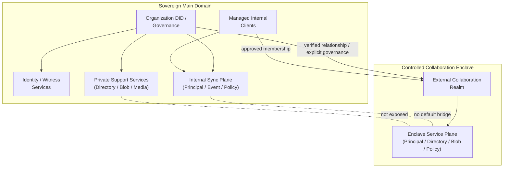
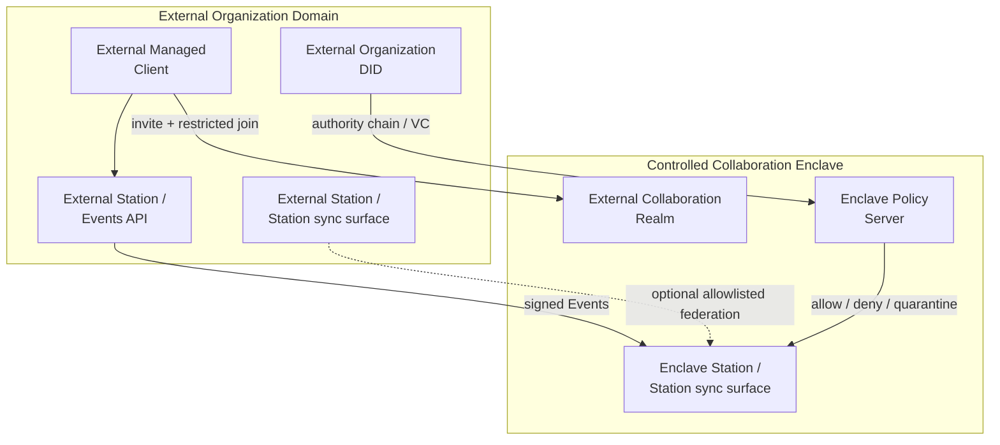

## 0. 规范语言

本文中的规范关键字（**MUST** / **SHOULD** / **MAY** 等）按 [conformance/normative-language.md](../conformance/normative-language.md) 解释；仅大写形式具规范约束力。

## 1. 目标

高安全组织可以运行独立的 Arkret 网络，同时在必要时为外部人员或外部组织开启 **External Collaboration Realm**。

本文定义：

- sovereign deployment 的边界
- isolated federation domain
- 在 sovereign deployment 下 External Collaboration Realm 的强制 policy（`ak.profile.sovereign_deployment.v1`）
- 外部主体进入高安全网络的验证、授权、加密、审计和退出规则
- sovereign client 与 DID resolver policy

> Realm 角色分类（Principal Control Realm / Internal Collaboration Realm / External Collaboration Realm）见 [`models/realm-and-space.md` §2.8](../models/realm-and-space.md)。

## 2. 部署模型

Sovereign deployment 是由单一组织或联盟控制的 Arkret 服务域。它通常包含：

- Organization DID / governance registry / witness
- Identity Registry
- Station / Station sync surface
- Directory
- Blob Store
- Push Gateway
- TURN / SFU / Realtime Media Services
- Applet / Agent Runtime allowlist

这些服务 SHOULD 使用 service DID，并由 Organization DID 或联盟治理 DID 明确委派。

### 2.1 网络拓扑图

域内结构（简化视图）：



为保持可读性，域内图将 `Directory` / `Blob` / `Media` / `Policy` 等次级组件折叠为 service plane；细项仍以上文服务清单与后续章节为准。

跨域协作路径：



拓扑含义：

- 主网络保持 closed federation，不向外部主体暴露内部 Directory 或服务拓扑。
- Controlled Collaboration Enclave 是独立协作边界，只承载被批准的 Realm。
- 外部主体通过 DID / VC / authority chain / invite / restricted join 进入 enclave Realm。
- 外部组织可以保留自己的 Station / Events API，但写入必须经过 enclave Station / Station sync surface 和本地授权验证。
- 主网络与 enclave 之间没有默认桥接；资料进出必须经过 export / import review。

## 2.2 Sovereign Client

高安全部署不一定要求从零开发专用客户端，但 MUST 使用受管控客户端 profile。普通公共网络客户端只有在被锁定配置、审计、签名发布和策略管理后才可进入 sovereign deployment。

Sovereign client MUST:

- pin organization trust anchors：Organization DID、governance DID、registry DID、witness DID、service DID allowlist。
- 使用组织配置的 DID resolver policy，MUST NOT 默认查询公共 registry / public directory。
- 验证服务 DID 委派、证书、HTTP message signature 和 feature profile。
- MUST NOT 允许用户手动添加未批准 Station sync surface / Directory / Blob / Applet endpoint。
- 默认关闭公共 federation、公共搜索、外部 Applet 和外部 Agent handoff。
- 对每个 Realm 显示 classification、E2EE、auditable E2EE、export、external member policy。
- 支持远程撤销 session、device、grant、Applet delegation 和 cached secret。
- 支持本地日志、审计导出和密钥擦除策略。

Sovereign client(在 `ak.profile.sovereign_deployment.v1` 语境下)逐条强制度——数据外泄控制为 MUST,运营增强为 SHOULD/MAY:

- 对批量导出、外部分享实施本地 policy enforcement(MUST;安全关键项，防止未授权再分发)。
- 支持 policy-signed configuration update(SHOULD)。
- 支持离线/内网 resolver bundle(SHOULD)。
- 使用硬件密钥、平台安全模块或智能卡(SHOULD)。
- 对截屏、复制施加提示与水印(MAY,作为运营追溯手段；客户端平台能力受限时不强制)。

## 3. 默认安全姿态

高安全部署的默认姿态在 `ak.profile.sovereign_deployment.v1` 语境下逐条强制度如下——安全关键项为 MUST,可调运营默认为 SHOULD:

- 禁止公共 federation(MUST)。
- 禁止公共 directory listing(MUST)。
- 逐 stream 复制只通过 `/_arkret/peer/streams/scan` 对 allowlist peer 开放（见 [`federation.md` §4.5.1](federation.md)）；sovereign profile 不定义匿名 head 探测面，避免 stream 活跃度被轮询推断。
- Station sync surface / Directory 只接受 allowlist service DID(MUST)。
- Blob、snapshot、backup、audit log 存储在组织控制基础设施内(MUST)。
- E2EE 默认开启(MUST);需要合规审查时使用 auditable E2EE，且必须向成员显示。
- 外部 Applet、Agent handoff、外部 agent protocol transport 默认关闭，按 Realm 明确开启(MUST)。
- Realm 默认 `discoverability=unlisted` 或 `invite_only`(SHOULD；与 §7 的 sovereign profile 声明一致)。
- Realm 默认 `join_rule=invite` 或 `restricted`(SHOULD)。
- policy 与 moderation 检查默认 fail closed 或进入 quarantine(SHOULD)。
- PQ-hybrid TLS：sovereign / 高安全 profile 的 client-service、service-to-service 与 federation peer 连接 MUST 遵守 [`transport-bindings.md` §5](./transport-bindings.md) 的 canonical 握手义务。该要求零 wire 字段成本，与 §3.2 / federation §3.2 的 RFC 9421 请求签名正交；conformance 使用 §11 的 deployment-profile 握手探针，而非 object-model vector。完整威胁论据见 [`../security/server-threat-model.md` §2.4](../security/server-threat-model.md)。

## 3.1 DID Policy

Sovereign 部署 MUST 在内部使用既有 DID 方法。组织与服务主体 SHOULD 使用私有或 allowlist 范围内的 `did:webvh` / `did:web`；仅当 policy 明确允许时，MAY 为外部协作方接受 `did:plc`。

部署 MUST 定义 DID resolver policy：

```json
{
  "kind": "ak.sovereign.did_policy",
  "payload": {
    "trust_domain": "ak:trust_domain:did.webvh.defense.example",
    "value": {
      "default_principal_method": "did:webvh",
      "allowed_methods": [
        "did:webvh",
        "did:web",
        "did:plc",
        "did:key"
      ],
      "trust_roots": [
        "ak:did_core:webvh:zE2ucm2oH9PCib4kBzLEAkFqa",
        "ak:did_core:webvh:z2TiX7ug9JmCNeioq6D2V4VjK",
        "ak:did_core:webvh:z8rCaf8NFL1av8pHxRpz8APYa"
      ],
      "public_resolver_allowed": false,
      "method_policy": {
        "did:webvh": "allowlist",
        "did:web": "allowlist",
        "did:plc": "external_collaborator_only",
        "did:key": "ephemeral_only"
      }
    }
  }
}
```

规则：

- `trust_roots[]` 是稳定 `did_core_id` allowlist，不是 resolver locator、bare DID 或 verification-method DID URL。对候选 bare `did` 做准入时，verifier MUST 先按已登记 method adapter 计算 `project(did)`，再与 root 逐字节比较；`did:webvh` root 因此只保留 SCID，MUST NOT 拼接 hosting domain/path。
- 命中 `trust_roots[]` 只回答“这个稳定身份是否可作为信任根”，不提供公钥或解析地址，也不证明控制权。密码学验证仍 MUST 消费候选 `did` / verification-method DID URL 以及受批准 resolver、witness/watcher、离线 bundle或已接受 binding 提供的 method evidence，并验证 `project(did) == matched trust_root`。调用点若只有 `did_core_id`、没有可验证的 `did` / key binding / method evidence，MUST fail closed，不得从 Core ID 反向拼造 DID。
- 除非 policy 明确允许该 method 与 trust root，否则客户端 MUST NOT 通过公共 resolver 端点解析内部主体。
- 内部 DID Document 与 method 历史 MUST 从受批准的 resolver / witness / watcher / 离线 bundle 获取。
- 仅当 policy 允许且权限链已验证时，MAY 为外部协作方接受公共 DID 方法。
- 当 `public_resolver_allowed:false` 时，`did:plc` 等本质依赖公共 directory 的方法 MUST NOT 直接查询公共 PLC directory；其 DID Document 与操作历史 MUST 经受批准的 PLC mirror、审计日志 source 或离线 bundle 解析（与上条内部主体同一约束）。无可用受批准来源时 MUST fail closed，不得回退到公共 resolver。
- 涉及关联风险的外部协作 SHOULD 使用 pairwise DID。
- 指向公共 Station sync surface / Directory 的 经 method 验证的 DID 服务入口 或 bootstrap hint 在未 allowlist 时 MUST 被忽略；DID Document service endpoint 也不得绕过该规则。

**`did:key` 的 `ephemeral_only` enforcement 语义（normative）**：`method_policy` 把某 method（默认 `did:key`）设为 `ephemeral_only` 时，该取值是可测试约束而非口号。落入 `ephemeral_only` 的 DID **MUST NOT** 被用作：

- principal-level `ak.capability.grant` 的 grant subject；
- 跨 epoch 的 membership key（即作为 `ak.member.state` 的长期 `actor_id` 跨越 MLS epoch rotation 或 RealmCommit epoch 持续有效）；
- 任何长期身份锚点（DID resolver / witness / OOBI 解析意义上的持久主体）。

`ephemeral_only` DID **只能**作为 per-session / per-device 的 ephemeral binding 出现（一次会话或一台设备生命周期内的临时凭据 / 临时签名 key），其有效期不得跨越所绑定 session / device 的生命周期。reducer 收到以 `ephemeral_only` DID 为 principal-level grant subject 或跨 epoch membership key 的写入时 MUST fail closed。

这与 [`client-sync.md` §8.1](./client-sync.md) 中"高隐私 Realm MAY 用 Realm-scoped pairwise `did:key` 作 `actor_id`"协调：作为**长期 membership key 的 pairwise DID** 不属于 `ephemeral_only`，MUST 由 `did:webvh` 派生（可持久解析、可轮换、可撤销），或在 `method_policy` 中对该用途**显式豁免**（例如把承载长期 pairwise membership 的 method 标为 `allowlist` 而非 `ephemeral_only`）。纯 per-session 或按单一 device scope 派生的临时 pairwise **principal DID** 不需要该豁免；这不会使设备自身成为 DID 主体。

### 3.2 五个正交边界

Sovereign deployment 不增加 Realm 类型或 Realm hosting authority。实现、管理面和 UI MUST 分开解释下列五个轴：

| 轴 | 唯一协议 carrier | 明确不授予的含义 |
| --- | --- | --- |
| deployment profile | 服务通过 `ak.server.read.describe.v1` 的 `supported_profiles[]` 发布，并由对应 conformance evidence 支撑 | 不得写入 Realm genesis、`schema_refs` 或任何 Realm facet；不产生 `primary_server`、`hosted_on` 或完整历史权威 |
| Realm structural role | 只有 closed `ak.schema.realm_genesis.v1` 的 `purpose` | 不表示物理部署位置、组织所有权或 federation peer；`schema_refs` 不承载它 |
| organization relationship | active `ak.realm.organization`，且同时通过 Realm-side admin authority 与 organization-side authorization | `relationship=owner` 仍不自动授予 `ak.realm.owner` / `ak.realm.admin` capability、governance-Station handoff、recovery key、Station hosting 或历史完整性 |
| governance Station | genesis `governance_station_id` 与连续 verified `RealmAuthorityHandoff` chain | 只决定各独立 stream 的 RealmCommit authority；不证明该 Station 永久保存或可向任意 caller 提供全部 Event |
| Station routing | 当前 `join` member 的完整 `ActorId` 所携 `station_id`，再结合 deployment peer allowlist | 只是实际路由候选；不产生 Realm owner、home server、canonical mirror 或唯一数据源 |

`owning_organization_ids` 是由已接受 relationship facts 派生的展示投影，不是可单独提交或信任的 authority。Realm 的治理只来自 authority-root、capability 与相应 control Event；deployment profile、organization metadata、governance-Station identity 与成员 Station 路由均不得替代这些事实。

## 4. External Collaboration Realm 在 sovereign deployment 下的强制 policy

启用 `ak.profile.sovereign_deployment.v1` 的部署中，组织 MAY 创建 External Collaboration Realm，允许外部网络的人员或组织加入特定协作范围。该 Realm 是隔离边界，不应让外部主体直接进入组织主网络。Realm 角色分类见 [`models/realm-and-space.md` §2.8](../models/realm-and-space.md)。

在该部署下，普通 Collaboration Realm 的 bootstrap MUST 使用 [`models/realm-and-space.md` §2.5](../models/realm-and-space.md) 登记的原子顺序。下面只展示各 Event 的 `kind` 与 closed `payload`；完整 Event envelope、proof、staged authority-root proof、CAS precondition 与 genesis RealmCommit 仍按该节生成，`realm_id` 必须等于首条 create Event ID 的 retype：

```json
[
  {
    "kind": "ak.realm.create",
    "payload": {
      "object": {
        "schema": "ak.schema.realm_genesis.v1",
        "purpose": "collaboration",
        "genesis_salt": "EjRWeJCrze8SNFZ4kKvN7xI0VniQq83vEjRWeJCrze8",
        "trust_domain": "ak:trust_domain:did.webvh.defense.example",
        "schema_refs": [
          "ak.schema.realm.v1"
        ],
        "digest_algorithm": "sha256",
        "security_class": "high_assurance",
        "governance_station_id": "ak:did_core:webvh:zCnzAMiBV2XXjoWzmojUF2YbL",
        "initial_join_rule": "invite",
        "initial_history_access": "since_join",
        "initial_discoverability": "invite_only"
      }
    }
  },
  {
    "kind": "ak.realm.profile",
    "payload": {
      "schema": "ak.schema.realm_profile.v1",
      "title": "External Collaboration"
    }
  },
  {
    "kind": "ak.realm.policy_bundle",
    "payload": {
      "policy_revision": 1,
      "federation_policy": "restricted"
    }
  },
  {
    "kind": "ak.realm.join_rule",
    "payload": {
      "value": "restricted"
    }
  },
  {
    "kind": "ak.realm.history_access",
    "payload": {
      "from": null,
      "to": "since_join"
    }
  },
  {
    "kind": "ak.realm.discovery",
    "payload": {
      "value": {
        "discoverability": "unlisted",
        "directory_visibility": {
          "public_directory": false
        }
      }
    }
  },
  {
    "kind": "ak.member.state",
    "payload": {
      "realm_id": "ak:realm:AT_SiZlQ_-94UNHCwJMH62ckd3G0BPmq-EeRbqXfjh-W",
      "member_id": {
        "kind": "account",
        "account_id": {
          "principal_id": "ak:did_core:webvh:zGsmzvyUSDby8As5bHG3kAtWL",
          "station_id": "ak:did_core:webvh:z6mkfixturestationexample"
        }
      },
      "membership": "join"
    }
  }
]
```

示例采用唯一治理 signer，配置在 create 显式冻结。轮换必须由旧权威确认、冻结旧写权并继承完整耐久历史；不提供多 Station 共同确认。普通 Event 按已验证缓存授权接纳，安全命令按唯一序列生效，federation_policy 与治理配置正交。

推荐 policy：

- `discoverability=unlisted` 或 `invite_only`
- `join_rule=restricted` 或 `knock_restricted`
- `history_access=since_join`
- 在 Realm 建立后立即提交该 scope 的 `ak.mls.genesis`，把 scope 不可逆激活为 standard RFC 9420
- `federation_policy=restricted`；允许的外部 peer 由 [`federation.md`](./federation.md) §3.4 的部署本地 peer policy / allowlist 控制
- `ak.realm.discovery.directory_visibility.public_directory=false`
- 默认禁用 reshare / export
- 默认禁用 applet / agent，需显式授权方可使用

## 5. 外部主体进入流程

外部人员或组织进入受控 Realm MUST 经过受控流程：

1. 外部主体提供 DID、Organization DID、service DID 或 verifiable credential。
2. 主组织验证 DID control、handle binding、organization authority chain。
3. 接收服务根据 accepted policy state 检查 allowlist、risk score、clearance claim、contract claim、device posture。
4. Realm admin 或 delegated approval actor 发出 invite。
5. 外部主体提交 `ak.invite.accept`；该 Event 原子推进 invite lifecycle 并写入其 `join` membership。只有另有已登记 profile 时，才可使用该 profile 明确规定的等价 `ak.member.state` 路径。
6. 对 E2EE Realm，管理员客户端或 key service 只向该主体授权设备发 MLS Welcome。
7. Directory 和客户端本地 projection 只暴露该 Realm 允许的 stripped preview 和加入后历史。

外部主体 MUST NOT 获得：

- 主网络 directory 全量搜索能力
- 其他 Realm 列表
- 组织成员列表
- 不相关 service topology
- 加入前历史密钥，除非 policy 明确允许

## 6. 外部组织协作

外部组织加入时 SHOULD 使用组织级 trust chain：

```json
{
  "claim_kind": "external_organization_authorization",
  "issuer": "ak:did_core:webvh:zGsmzvyUSDby8As5bHG3kAtWL",
  "subject": "ak:did_core:webvh:zGTog8Hi4N3h8YrvWRQ2Lr3RP",
  "claim_scope": {
    "realm_id": "ak:realm:AdWzSfd6qUSWZ7yTEm3s-ICCpjkzBWzz2DrtY8FQvjIv",
    "roles": [
      "contractor_reviewer"
    ],
    "max_members": 20
  },
  "expires_at": "2026-07-26T00:00:00Z"
}
```

外部组织 MAY 运营自己的 Station / Events API，但受控 Realm SHOULD 要求：

- 外部 service DID 已通过审批
- federation 事务签名
- server ACL allowlist
- 逐事件签名验证
- 本地策略再次校验
- 每次跨域写入留存 audit record

## 7. Gateway / Enclave 模式

高安全组织 SHOULD NOT 将整个内部域桥接到外部网络。

推荐的**部署本地**模式：

- 主网络保持 closed federation。
- 创建独立的 collaboration enclave。
- 外部主体只被邀请到 enclave Realm。
- enclave Realm 使用独立 Station / Blob。
- 主域与 enclave 之间不运行隐式复制、共享内存 queue 或任意 JSON store-and-forward bridge。
- 经本地 redaction / export review / declassification policy 批准后，操作者 MAY 在目标 Realm 重新提交一条新的 canonical Event；源 Event 的 `event_id`、`realm_id`、proof 或 RealmCommit 不得被改写后冒充目标 Realm Event。
- enclave 回流主域时同理：import review / malware scan / policy approval 是部署本地前置条件，批准后才可在目标 Realm 建立新 Blob 与新 Event。

### 7.1 跨区数据流的 current-v1 carrier inventory

| 行为 | current-v1 canonical carrier | 边界 |
| --- | --- | --- |
| 创建 enclave 内 Collaboration Realm | `ak.self.events.command.submit.v1` 提交原子 `ak.realm.create → ak.realm.profile → ak.realm.policy_bundle → ak.realm.join_rule → ak.realm.history_access → ak.realm.discovery → creator ak.member.state{join}` | 不得调用私有 Realm create endpoint，也不得由 enclave 配置预置同一 `realm_id` |
| 邀请与外部加入 | durable `ak.invite.create` / `ak.invite.accept`；私有投递使用 `ak.self.invites.command.dispatch.v1` 与 `ak.peer.invites.command.submit.v1` | invite locator、路由 token 与 receive policy 不进入 Realm Event；加入事实不存入部署私有 account/invite map |
| Station 间 Event 复制 | durable outbox 经 `ak.peer.events.command.submit.v1` 投递原始 signed Event；连续回填使用 `ak.peer.events.read.scan.v1`，精确取证使用 `ak.peer.events.read.resolve_committed.v1` | receiver 必须执行完整 schema、proof、capability、policy、admission 与 reducer 验证；scan / resolve 只处理已获准的独立 Realm、Circle 或 Sidecar stream，不证明对端没有 withholding |
| 客户端提交与读取 | `ak.self.events.command.submit.v1`、`ak.self.events.read.scan.v1`、`ak.self.events.resource.get.v1`、`ak.self.events.stream.subscribe.v1` | 这些 operation 访问 canonical Event store，不得切换到 `/_soland/*` shadow state |
| Blob 进入目标域 | `ak.self.blob.upload.create.v1` 创建目标域 Blob，再由目标 Realm 的新 canonical Event 引用；读取使用 `ak.self.blob.resource.get.v1` | v1 没有“保留源 Event identity 的跨 Realm/跨区 Blob copy”operation；密钥不得随 export 泄露给非目标受众 |
| Realm policy、组织关系与成员路由 | `ak.realm.policy_bundle`、`ak.realm.discovery`、`ak.realm.organization`、`ak.member.state` | deployment profile、organization relationship、governance Station 与成员 Station routing 各自保持 §3.2 的边界 |
| 源 Realm 内撤回/隔离 | `ak.message.redact`、`ak.redaction`、committed `ak.moderation.decision` / `ak.moderation.decision.lift` | 这些 Event 只改变其所在 scope 的状态；不构成“已净化导出包”或跨区传输许可 |

current-v1 **没有** export/import review record、declassification approval、malware-scan receipt、watermark receipt、跨区 transfer job、任意内容 queue 或 sovereign boundary audit Event/operation。部署 MAY 在本地执行并审计这些流程，但 MUST NOT 把本地记录宣告为 Arkret interoperable state、profile feature 或 Realm history。实现不得用 `/_soland/*` 或其它私有接口补出协议状态；若未来要把其中任一行为升级为可互操作能力，必须先完整登记 closed schema、operation、authorization、Event/admission、durable store、replay/failure 语义与 conformance evidence。

## 8. Applet 与 Agent 控制

Sovereign deployment 下的 External Collaboration Realm SHOULD 默认：

- 禁用 Applet。
- 禁用 Agent protocol handoff。
- 禁用外部工具访问。
- 禁用媒体录制。

任何例外 MUST 通过 capability 与 policy 授权：

- `via_applet_id`
- `allowed_protocols`
- `allowed_data_labels`
- `human_approval_required`
- `audit_mode`
- `egress_policy`

**Outbound trust_domain 校验（normative）**: Sovereign client 在向任意外部 service 发起 federation request 前，MUST 先校验目标 service_id 的 trust_domain ∈ 本地 `federation_allowlist`；不在 allowlist 时 outbound MUST fail closed，不得依赖接收方拒绝。该规则对 inbound allowlist（§3-§7）对称。

## 9. 数据出域与导出

外部成员 MAY 只在被授予的范围内读取或写入。

导出控制是 `ak.profile.sovereign_deployment.v1` 的部署本地 enforcement，不是 Realm wire facet；逐条强制度如下——安全关键项为 MUST，运营手段为 SHOULD/MAY：

- 阻止公共目录索引(MUST)
- 阻止跨服务的未授权再分发(MUST)
- 保留 audience / classification 标签(MUST)
- 默认禁用批量导出(SHOULD;经审批的批量导出例外见下)
- 附件与 snapshot 导出需审批(SHOULD)
- 对导出包加水印或留存审计(MAY,作为运营追溯手段)

若内容已加密，导出 MUST NOT 在预期接收者集合之外附带密钥。

## 10. 退出、撤销与事件响应

外部访问结束时：

- 撤销 invite / grant / delegation
- 把成员状态设为 `leave` 或 `ban`
- 从 MLS group 中移除外部设备
- 轮换 MLS epoch
- 撤销 Applet / Agent 会话
- 停止其在 directory 中的可见性
- 标记外部 service DID 为不再允许
- 按 retention policy 保留 audit 记录

如怀疑遭受入侵：

- 冻结 Realm 或受影响对象集合
- 隔离跨域事件
- 轮换 service key
- 要求所有外部成员重新认证
- 通过标准 checkpoint / scan / resolve surface 对已知 scope 做 best-effort reconciliation 与 known-gap recovery；该过程只能验证取得的 Event、已知 actor/range 与已知持有者，MUST NOT 宣称证明源没有 withholding 或历史没有遗漏（边界见 [`federation.md` §4.5](./federation.md)）

## 11. 一致性 Profile

`ak.profile.sovereign_deployment.v1` SHOULD 测试：

- 默认 closed federation
- service DID allowlist
- External Collaboration Realm 的创建流程
- restricted 外部加入流程
- policy 与 moderation 检查的 fail-closed 模式
- 仅向受批准的外部设备发送 MLS Welcome
- 目录对非成员的不可见性
- 跨域事件审计
- 外部 grant 撤销与 epoch 轮换
- 部署本地 import / export / malware review 确实在跨区写入前 fail closed；测试不得把这些本地记录当作 Arkret Event 或 interoperable metadata
- **PQ-hybrid TLS 握手探针（sovereign / 高安全）**：对 service-to-service（federation peer）与 client-service TLS 1.3 连接，握手完成后检查协商出的 TLS named group 是否等于 `X25519MLKEM768`，并验证对端不提供该 group 时 fail closed（不降级到纯经典 key exchange）。这是 sovereign / 高安全 deployment-profile 握手探针，不是 object-model conformance vector；canonical 表述见 [`transport-bindings.md` §5](./transport-bindings.md)，威胁论据见 [`../security/server-threat-model.md` §2.4](../security/server-threat-model.md)。

ServiceDescribe 只有在同一实现已用上述标准 operation/Event 完成 live 双 Station、双独立数据库、两侧 restart、断网后 durable outbox/known-gap 恢复、external-member join/leave/ban 边界以及 `federation_policy=closed|restricted|quarantine` 的实际 ingress、destination selection 与 fanout enforcement 后，才可声明 `ak.profile.sovereign_deployment.v1` / `ak.profile.sovereign_enclave.v1`。静态 fixture ID、进程内 map、重复 seed 的 Realm ID、私有 endpoint 或未持久化 checkpoint 均不是该声明的 conformance evidence；证据不足时 MUST 省略 profile claim 并 fail closed。

### 11.1 联邦诊断与 high-assurance 边界

sovereign / regulated 部署 MUST 对 authority bundle、RealmCommit 签名、authority generation continuity 与同 stream `previous_commit_ref` 连续性执行完整验证。缺失 commit 前缀或当前 authority 资料时 fail closed，并通过 exact committed-ref 拉取补齐；协议不定义基于多头集合比较的 governance Station reconciliation。

`federation_policy=closed` 只限制网络可达性与 peer allowlist，不把任何 service、receipt 或 witness 升级成历史完整性权威。checkpoint/root、duplicate outcome、RealmCommit、Snapshot 与 witness receipt 都只能验证各自已观察、已列出的视图。实现 MUST NOT 宣称它们能证明“对方没藏分支”；已知缺口恢复依赖 durable outbox、known-ID/dependency resolve 与 admission，未知 withholding 在 v1 中没有 completeness 证明。
