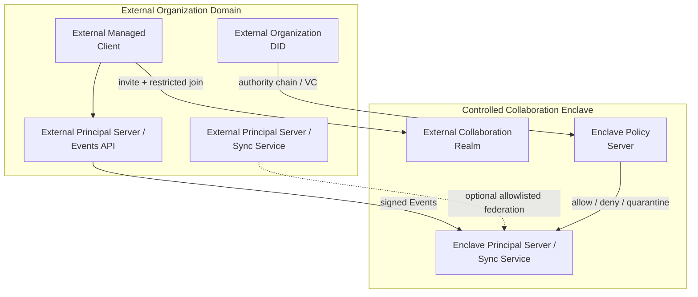

## 0. 规范语言

本文中的规范关键字（**MUST** / **SHOULD** / **MAY** 等）按 [conformance/normative-language.md](../conformance/normative-language.md) 解释；仅大写形式具规范约束力。

## 1. 目标

高安全组织可以运行独立的 Cokret 网络，同时在必要时为外部人员或外部组织开启 **External Collaboration Realm**。

本文定义：

- sovereign deployment 的边界
- isolated federation domain
- 在 sovereign deployment 下 External Collaboration Realm 的强制 policy（`ck.profile.sovereign_deployment.v1`）
- 外部主体进入高安全网络的验证、授权、加密、审计和退出规则
- sovereign client 与 DID resolver policy

> Realm 角色分类（Principal Control Realm / Internal Collaboration Realm / External Collaboration Realm）见 [`models/realm-and-space.md` §2.8](../models/realm-and-space.md)。

## 2. 部署模型

Sovereign deployment 是由单一组织或联盟控制的 Cokret 服务域。它通常包含：

- Organization DID / governance registry / witness
- Identity Registry
- Principal Server / Sync Service
- Directory
- Blob Store
- Policy Server
- Push Gateway
- TURN / SFU / Realtime Media Server
- Applet / Agent Runtime allowlist

这些服务 SHOULD 使用 service DID，并由 Organization DID 或联盟治理 DID 明确委派。

### 2.1 网络拓扑图

域内结构（简化视图）：


为保持可读性，域内图将 `Directory` / `Blob` / `Media` / `Policy` 等次级组件折叠为 service plane；细项仍以上文服务清单与后续章节为准。

跨域协作路径：



拓扑含义：

- 主网络保持 closed federation，不向外部主体暴露内部 Directory 或服务拓扑。
- Controlled Collaboration Enclave 是独立协作边界，只承载被批准的 Realm。
- 外部主体通过 DID / VC / authority chain / invite / restricted join 进入 enclave Realm。
- 外部组织可以保留自己的 Principal Server / Events API，但写入必须经过 enclave Principal Server / Sync Service、Policy Server 和本地授权验证。
- 主网络与 enclave 之间没有默认桥接；资料进出必须经过 export / import review。

## 2.2 Sovereign Client

高安全部署不一定要求从零开发专用客户端，但 MUST 使用受管控客户端 profile。普通公共网络客户端只有在被锁定配置、审计、签名发布和策略管理后才可进入 sovereign deployment。

Sovereign client MUST:

- pin organization trust seals：Organization DID、governance DID、registry DID、witness DID、service DID allowlist。
- 使用组织配置的 DID resolver policy，MUST NOT 默认查询公共 registry / public directory。
- 验证服务 DID 委派、证书、HTTP message signature 和 feature profile。
- MUST NOT 允许用户手动添加未批准 Sync Service / Directory / Blob / Applet endpoint。
- 默认关闭公共 federation、公共搜索、外部 Applet 和外部 Agent handoff。
- 对每个 Realm 显示 classification、E2EE、auditable E2EE、export、external member policy。
- 支持远程撤销 session、device、grant、Applet delegation 和 cached secret。
- 支持本地日志、审计导出和密钥擦除策略。

Sovereign client(在 `ck.profile.sovereign_deployment.v1` 语境下)逐条强制度——数据外泄控制为 MUST,运营增强为 SHOULD/MAY:

- 对批量导出、外部分享实施本地 policy enforcement(MUST;安全关键项，防止未授权再分发)。
- 支持 policy-signed configuration update(SHOULD)。
- 支持离线/内网 resolver bundle(SHOULD)。
- 使用硬件密钥、平台安全模块或智能卡(SHOULD)。
- 对截屏、复制施加提示与水印(MAY,作为运营追溯手段；客户端平台能力受限时不强制)。

## 3. 默认安全姿态

高安全部署的默认姿态在 `ck.profile.sovereign_deployment.v1` 语境下逐条强制度如下——安全关键项为 MUST,可调运营默认为 SHOULD:

- 禁止公共 federation(MUST)。
- 禁止公共 directory listing(MUST)。
- frontier 交换只通过 `/_cokret/peer/events/frontier` 对 allowlist peer 开放（见 [`federation.md` §4.5.1](federation.md)）；sovereign profile 不定义匿名 frontier 探测面，避免 `frontier_root` 摘要被多次轮询推断 Realm 活跃度时间序列。
- Sync Service / Directory 只接受 allowlist service DID(MUST)。
- Blob、snapshot、backup、audit log 存储在组织控制基础设施内(MUST)。
- E2EE 默认开启(MUST);需要合规审查时使用 auditable E2EE，且必须向成员显示。
- 外部 Applet、Agent handoff、TSP/A2A/ACP transport 默认关闭，按 Realm 明确开启(MUST)。
- Realm 默认 `discoverability=secret` 或 `invite_only`(SHOULD)。
- Realm 默认 `join_rule=invite` 或 `restricted`(SHOULD)。
- Policy Server 默认 `closed` 或 `quarantine` fail mode(SHOULD)。

> **PQ-hybrid TLS 基线（informative，路线图注记）**：sovereign / 高安全部署的 federation / service-to-service / client-service 链路尤其建议使用 TLS 1.3 并启用混合后量子 group `X25519MLKEM768`（draft-ietf-tls-ecdhe-mlkem），以缓解仅靠 TLS 保护的传输面的 Harvest-Now-Decrypt-Later 风险。完整论据与适用面见 [`../security/server-threat-model.md` §2.4](../security/server-threat-model.md)。本注记为 informative / SHOULD 级，不升 MUST、不引入新 normative 规则；是否对本 profile 收紧由独立路线图裁决。

## 3.1 DID Policy

Sovereign 部署 MUST 在内部使用既有 DID 方法。组织与服务主体 SHOULD 使用私有或 allowlist 范围内的 `did:webvh` / `did:web`；仅当 policy 明确允许时，MAY 为外部协作方接受 `did:plc`。

部署 MUST 定义 DID resolver policy：

```json
{
  "kind": "ck.sovereign.did_policy",
  "trust_domain": "ck:trust_domain:did.webvh.defense.example",
  "default_principal_method": "did:webvh",
  "allowed_methods": ["did:webvh", "did:web", "did:plc", "did:key"],
  "trust_roots": [
    "did:web:registry.defense.example",
    "did:web:witness-1.defense.example",
    "did:web:witness-2.defense.example"
  ],
  "public_resolver_allowed": false,
  "method_policy": {
    "did:webvh": "allowlist",
    "did:web": "allowlist",
    "did:plc": "external_collaborator_only",
    "did:key": "ephemeral_only"
  }
}
```

规则：

- 除非 policy 明确允许该 method 与 trust root，否则客户端 MUST NOT 通过公共 resolver 端点解析内部主体。
- 内部 DID Document 与 method 历史 MUST 从受批准的 resolver / witness / watcher / 离线 bundle 获取。
- 仅当 policy 允许且权限链已验证时，MAY 为外部协作方接受公共 DID 方法。
- 当 `public_resolver_allowed:false` 时，`did:plc` 等本质依赖公共 directory 的方法 MUST NOT 直接查询公共 PLC directory；其 DID Document 与操作历史 MUST 经受批准的 PLC mirror、审计日志 source 或离线 bundle 解析（与上条内部主体同一约束）。无可用受批准来源时 MUST fail closed，不得回退到公共 resolver。
- 涉及关联风险的外部协作 SHOULD 使用 pairwise DID。
- 指向公共 Sync Service / Directory 的 DID Document service endpoint 在未 allowlist 时 MUST 被忽略。

## 4. External Collaboration Realm 在 sovereign deployment 下的强制 policy

启用 `ck.profile.sovereign_deployment.v1` 的部署中，组织 MAY 创建 External Collaboration Realm，允许外部网络的人员或组织加入特定协作范围。该 Realm 是隔离边界，不应让外部主体直接进入组织主网络。Realm 角色分类见 [`models/realm-and-space.md` §2.8](../models/realm-and-space.md)。

在该部署下 External Collaboration Realm SHOULD 使用：

```json
{
  "kind": "ck.realm.create",
  "payload": {
    "object": {
      "id": "ck:realm:019640ea-8000-7000-8000-000000000000",
      "schema": "ck.schema.realm.v1",
      "security_class": "high_assurance",
      "title": "External Collaboration",
      "created_by": "did:web:defense.example",
      "trust_domain": "ck:trust_domain:did.webvh.defense.example",
      "owning_organizations": [
        "did:web:defense.example"
      ],
      "schema_refs": [
        "ck.schema.realm.v1"
      ],
      "default_discoverability": "unlisted",
      "default_join_rule": "restricted",
      "history_visibility": "joined",
      "encryption_profile": "mls_rfc9420",
      "federation_policy": "closed",
      "notary_profile": "single_did",
      "notary": {
        "type": "single_did",
        "did": "did:web:server.defense.example"
      },
      "revocation_freshness_window_ms": 86400000,
      "created_at": "2026-04-26T00:00:00Z"
    }
  }
}
```

Sovereign 部署默认采用 **single_did Notary profile**：每个 Realm 由组织自己的 Principal Server（service DID）作为 genesis notary，负责控制面 Seal 的签发与问责（参见 [`authz/event-auth-state-resolution.md`](../authz/event-auth-state-resolution.md)）。DataEvent 仍按签名、`seal_ref`、capability 与 Lattice/CRDT 本地接受；membership、policy、capability、notary、lifecycle、MLS epoch 等 Control Move 必须被该 notary 的 Seal 覆盖后才 `sealed`。这与 sovereign 部署"组织拥有自己的服务器，且服务器是 Realm 的治理真相源"的事实结构一致。组织间共享 Realm（多个 `owning_organizations`）可以使用 `threshold` 或 `mixed` Notary profile；notary 变更是 Control Move，由旧控制面 basis 授权并由后续 Seal finality，fallback recovery 由 Realm create 固定。需要开放联邦协作时，create event 显式声明 `federation_policy="open"` 与 `notary_profile="open_set"`。

推荐 policy：

- `discoverability=unlisted` 或 `invite_only`
- `default_join_rule=restricted` 或 `knock_restricted`
- `history_visibility=joined`
- `encryption_profile=mls_rfc9420`，并按 Realm policy 设置 `content_encryption_floor`
- `federation_policy=restricted`；允许的外部 peer 由 [`federation.md`](./federation.md) §3.4 的部署本地 peer policy / allowlist 控制
- `ck.realm.discovery.directory_visibility.public_directory=false`
- 默认禁用 reshare / export
- 默认禁用 applet / agent，需显式授权方可使用

## 5. 外部主体进入流程

外部人员或组织进入受控 Realm MUST 经过受控流程：

1. 外部主体提供 DID、Organization DID、service DID 或 verifiable credential。
2. 主组织验证 DID control、handle binding、organization authority chain。
3. Policy Server 检查 allowlist、risk score、clearance claim、contract claim、device posture。
4. Realm admin 或 delegated approval actor 发出 invite。
5. 外部主体接受 invite，并提交 `ck.member.state` join event。
6. 对 E2EE Realm，管理员客户端或 key service 只向该主体授权设备发 MLS Welcome。
7. Directory 和客户端本地 projection 只暴露该 Realm 允许的 stripped preview 和加入后历史。

外部主体 MUST NOT 获得：

- 主网络 directory 全量搜索能力
- 其他 Realm 列表
- 组织成员列表
- 不相关 service topology
- 加入前历史密钥，除非 policy 明确允许

## 6. 外部组织协作

外部组织加入时 SHOULD 使用组织级 trust chain：

```json
{
  "claim_type": "external_org_authorization",
  "issuer": "did:web:defense.example",
  "subject": "did:web:contractor.example",
  "claim_scope": {
    "realm_id": "ck:realm:400d7400-0000-7000-8000-000000000000",
    "roles": ["contractor_reviewer"],
    "max_members": 20
  },
  "expires_at": "2026-07-26T00:00:00Z"
}
```

外部组织 MAY 运营自己的 Principal Server / Events API，但受控 Realm SHOULD 要求：

- 外部 service DID 已通过审批
- federation 事务签名
- server ACL allowlist
- 逐事件签名验证
- 本地策略再次校验
- 每次跨域写入留存 audit record

## 7. Gateway / Enclave 模式

高安全组织 SHOULD NOT 将整个内部域桥接到外部网络。

推荐模式：

- 主网络保持 closed federation。
- 创建独立的 collaboration enclave。
- 外部主体只被邀请到 enclave Realm。
- enclave Realm 使用独立 Principal Server / Blob / Policy Server。
- 从主网络复制到 enclave 的资料必须经 redaction / export review / declassification policy。
- 从 enclave 回流主网络的资料必须经 import review / malware scan / policy approval。

## 8. Applet 与 Agent 控制

Sovereign deployment 下的 External Collaboration Realm SHOULD 默认：

- 禁用 Applet。
- 禁用 Agent protocol handoff。
- 禁用外部工具访问。
- 禁用媒体录制。

任何例外 MUST 通过 capability 与 policy 授权：

- `via_applet_id`
- `allowed_protocols`
- `allowed_data_classes`
- `human_approval_required`
- `audit_mode`
- `egress_policy`

**Outbound trust_domain 校验（normative）**: Sovereign client 在向任意外部 service 发起 federation request 前，MUST 先校验目标 service_did 的 trust_domain ∈ 本地 `federation_allowlist`；不在 allowlist 时 outbound MUST fail closed，不得依赖接收方拒绝。该规则对 inbound allowlist（§3-§7）对称。

## 9. 数据出域与导出

外部成员 MAY 只在被授予的范围内读取或写入。

导出控制在 `ck.profile.sovereign_deployment.v1` 语境下逐条强制度如下——安全关键项为 MUST,运营手段为 SHOULD/MAY:

- 阻止公共目录索引(MUST)
- 阻止跨服务的未授权再分发(MUST)
- 保留 audience / classification 标签(MUST)
- 默认禁用批量导出(SHOULD;经审批的批量导出例外见下)
- 附件与 snapshot 导出需审批(SHOULD)
- 对导出包加水印或留存审计(MAY,作为运营追溯手段)

若内容已加密，导出 MUST NOT 在预期接收者集合之外附带密钥。

## 10. 退出、撤销与事件响应

外部访问结束时：

- 撤销 invite / grant / delegation
- 把成员状态设为 `leave` 或 `ban`
- 从 MLS group 中移除外部设备
- 轮换 MLS epoch
- 撤销 Applet / Agent 会话
- 停止其在 directory 中的可见性
- 标记外部 service DID 为不再允许
- 按 retention policy 保留 audit 记录

如怀疑遭受入侵：

- 冻结 Realm 或受影响对象集合
- 隔离跨域事件
- 轮换 service key
- 要求所有外部成员重新认证
- 基于源 Events API 运行 backfill 完整性审计

## 11. 一致性 Profile

`ck.profile.sovereign_deployment.v1` SHOULD 测试：

- 默认 closed federation
- service DID allowlist
- External Collaboration Realm 的创建流程
- restricted 外部加入流程
- Policy Server 的 closed fail 模式
- 仅向受批准的外部设备发送 MLS Welcome
- 目录对非成员的不可见性
- 跨域事件审计
- 外部 grant 撤销与 epoch 轮换
- enclave 的 import / export review 元数据

### 11.1 联邦 frontier 主动交换 (high-assurance)

sovereign / regulated / multi-writer federation 部署 **MUST** 同时声明 `ck.profile.federation.high_assurance.v1`，并满足 [`federation.md` §4.5.3](./federation.md) 中定义的硬性要求：

- 每个 federation-visible Realm 与每个授权 peer 的 frontier probe 间隔 ≤ 1 小时；
- frontier probe 与 `frontier_root` 主动交换使用固定刷新 bucket、jitter 与 per-peer 限速，刷新节奏不得随 Realm 活动量变化；
- 维护 per-peer / per-Realm frontier exchange 状态机，跟踪 `last_success_at` 与连续失败计数；
- 连续 3 次 probe 失败 MUST 触发 `stale_peer` 标记；该状态下 MUST 拒绝以该 peer 的 push payload 推进本地 frontier，MUST 通过 alarm 通道暴露，MAY 拒绝向该 peer fanout 新 Event；
- fork resolution 成功后 MUST 解除 `stale_peer` 标记。

理由：sovereign 部署的威胁模型默认包含"独立 Principal Server 在同一 Realm 共同写入"，单纯依赖 seal 签名、duplicate_conflict、witness receipt 只能证明"看到的有效"，无法证明"对方没藏分支"——high-assurance frontier 主动交换 + fail-state 是 silent fork 抗性的最后一道防线。
