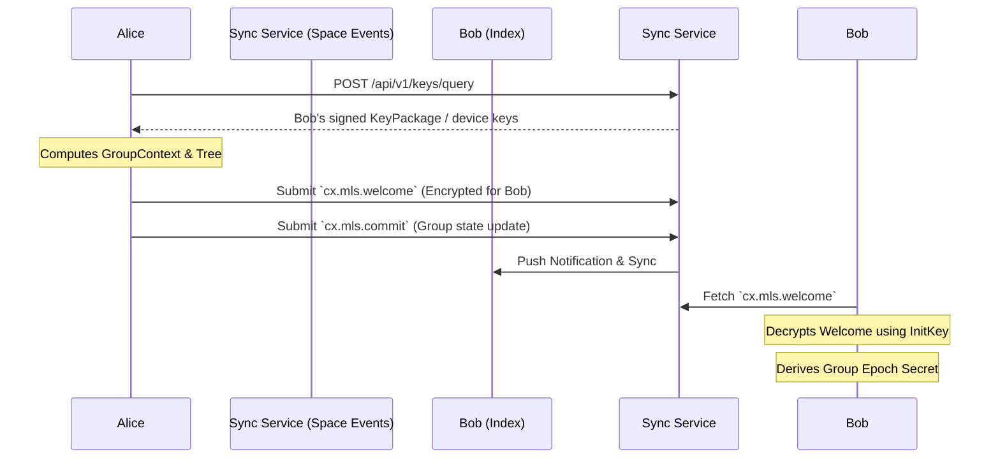

# Encryption and Auditability

## 1. 目标

去中心化协作协议面临着复杂的隐私与合规矛盾：一方面，商业数据和私密频道必须提供不可被 Sync Service / Index 窃听的端到端加密 (E2EE)；另一方面，在特定组织边界内，数据流又需要受到法律或合规层面的安全审查。

本规范定义了 Contrix 官方推荐的加密标准，旨在实现：
- 基于 **MLS (RFC 9420)** 的高效大规模协作加密
- 强前向安全 (Forward Secrecy) 与后向安全 (Post-Compromise Security)
- 独创的 **可审查加密 (Auditable E2EE)**，确保合规解密必定留下透明不可抵赖的密码学记录。

## 2. 基础加密架构：MLS 与 Contrix 的融合

Contrix 采用 [RFC 9420 - Message Layer Security (MLS)](https://datatracker.ietf.org/doc/html/rfc9420) 作为官方的群组加密标准。
不推荐使用传统的 Double Ratchet（双棘轮），因为在包含数十到数百名成员的 Room 或大型协作 Space 中，双棘轮会导致巨大的性能开销与并发处理难题。

### 2.1 KeyPackage 与服务发现
在参与 MLS 加密前，用户必须公布自己的 `KeyPackage`。
- **发布位置**：Actor 通过 signed Event 发布自己的 `KeyPackage`，或者在其 DID Document 的 `service` 中指定独立的 `MLS Delivery Service` 节点入口。
- **生命周期验证**：其他客户端在拉取 `KeyPackage` 时，MUST 通过 Actor 的 DID Document 与 Event history 验证该包的公钥签名，确保未被身份盗用。

### 2.2 握手与组成员管理 (Welcome, Commit)
MLS 维护了一颗成员密钥树 (Ratchet Tree)。在 Contrix 中，群组的密钥状态变动不依赖于独立的中心化分发服务器，而是映射到原生的 `Space` 与 Event 模型中：



- **`cx.mls.commit`**：当拥有权限的 Admin 邀请新成员加入或移除成员时，客户端计算 MLS 的 `Commit` 消息。该 `Commit` 必须作为 `cx.mls.commit` 类型的 Event 提交至 Space Event history。它作为不可篡改的账本，确保全网节点对群组密钥状态树的演进达成一致。
- **`Welcome` 分发**：新成员会收到由 Admin 构造的 `Welcome` 消息。由于其仅面向特定新成员解密，该消息可通过 Sync Service 的 Ephemeral Channel 发送，或通过私信 `message` 投递。

### 2.3 载荷加密 (Application Data)
日常的 Message、Card 或 Morph 内容负载在写入 Event 前，必须使用当前 MLS Epoch 的流密钥 (Application Key) 加密为密文信封。
- **可路由元数据分离**：密文信封 `encrypted_payload` 仅包裹实际的业务内容 (`body`, `content`, `attachments`)。
- **明文元数据保留**：用于网络路由和索引查询的 `space_id`, `type`, `causal_links`, `status`, `labels` 必须保持明文。
- Sync Service 和 Index 节点可以依据明文元数据完成数据的转发、排序、过滤和去重，而完全无法窥探密文信封内的具体正文。

### 2.4 Sync 与 MLS Epoch

Client Sync 中的事件顺序不保证密钥材料已经同步完成。加密事件和 MLS epoch state MUST 作为相关但可独立到达的 stream 处理：

- encrypted event 可以先进入 raw event cache 和 timeline position。
- `cx.mls.*` state event / MLS Commit 决定客户端是否拥有对应 epoch 的解密状态。
- 客户端缺少 epoch 时 MUST 标记 `decryption_pending`，不得静默丢弃或重排事件。
- backfill 历史事件时，客户端 SHOULD 同步对应 epoch 区间的 MLS state，而不是逐条向成员请求密钥。
- 被移除成员不得获取移除后 epoch 的 group secret；客户端必须 fail closed。

服务端、Sync Service、Index 不需要解密正文，但必须保留明文 routing metadata、epoch reference、hash 和 causal refs，以便客户端后续补齐密钥后重试解密。

### 2.5 MLS 绑定的应用状态根

E2EE Space 中，MLS 不应只保护正文，也必须帮助成员发现服务端是否向不同客户端展示了不同的成员、策略或房间元数据。

每个 `cx.mls.commit` MUST 绑定一个 `application_state_ref`，并把该引用纳入 MLS transcript 或等价的 commit-authenticated data：

```json
{
  "application_state_ref": {
    "space_id": "cx:space:01js0sp0000000000000000000",
    "mls_group_id": "base64url...",
    "previous_epoch": 41,
    "next_epoch": 42,
    "membership_frontier": ["cx:event:membersh1phead000000000000"],
    "policy_root": "sha256:canonical_state_policy_root",
    "capability_root": "sha256:effective_capability_root",
    "room_metadata_hash": "sha256:canonical_room_metadata",
    "binding_profile": "cx.profile.mls_state_binding.full.v1",
    "reducer_profile": "cx.reducer.v1"
  }
}
```

规则：

- `membership_frontier` MUST 覆盖本次 Commit 声称生效的成员状态、invite/leave/ban 变化和设备信任变化。
- `policy_root` MUST 覆盖影响加密、history visibility、asset privacy、logging、bot、moderation 和 plaintext-visible service 的 Space policy state。
- v1 base E2EE profile 只要求 `membership_frontier` 与 `policy_root`。这两个字段缺失或无法验证时，客户端 MUST 标记 epoch 为 `state_mismatch` 或 `decryption_pending`。
- `capability_root` 与 `room_metadata_hash` 属于 `cx.profile.mls_state_binding.full.v1` hardening profile。实现声明该 profile 时，它们 MUST 覆盖与本次成员或策略变化相关的 effective grant / revoke / claim 状态，以及成员可见的房间名称、头像、主题、公开标识和 provider/federation 元数据；不应包含只有服务端可见的私有索引状态。
- 客户端在接受 MLS epoch 前 MUST 独立验证 `application_state_ref` 指向的 Contrix state 已经按 `event-auth-state-resolution.md` accepted。无法回补或 hash 不匹配时 MUST 标记该 epoch 为 `decryption_pending` 或 `state_mismatch`，不得继续用该 epoch 解密新正文。
- 并发 Commit 仍按 Contrix 的 auth weight / HLC / actor / event hash 规则裁决；失败 Commit 的 MLS transcript 不得被接受为当前 epoch。

实现若使用 MLS AppSync、GroupContext extension 或 future MLS application-state extension，SHOULD 将上述字段放入该扩展。若底层 MLS 库暂不支持扩展，MUST 至少把 `application_state_ref` 放入签名 Event 和 Commit transcript hash 可验证覆盖的字段中。

### 2.6 KeyPackage Claim 生命周期

KeyPackage 不应被建模为可无限次公开拉取的静态材料。E2EE 实现 MUST 将 MLS KeyPackage 作为可声明、可领取、可消费、可撤销的单次使用材料。

KeyPackage lifecycle：

```text
published -> claimed -> consumed
          -> expired
          -> revoked
```

推荐记录：

```json
{
  "type": "cx.mls.keypackage",
  "keypackage_id": "cx:mls:kp:01JS...",
  "principal_id": "did:uuid:alice",
  "device_id": "dev_01HV...",
  "keypackage_ref": "sha256:...",
  "cipher_suites": ["MLS_128_DHKEMX25519_AES128GCM_SHA256_Ed25519"],
  "capabilities": ["mimi.content.v1", "cx.content.v1"],
  "state": "published",
  "created_at": "2026-04-30T00:00:00Z",
  "expires_at": "2026-05-07T00:00:00Z",
  "device_signature": "base64url..."
}
```

Claim 请求 MUST 绑定：

- requester principal / service DID 和 device proof。
- intended `space_id` 或 room id。
- required capabilities / content profiles / cipher suites。
- 是否允许 minimal-metadata pseudonymous credential。
- claim nonce、过期时间和目标 Welcome 路由服务。

Claim 成功后：

- KeyPackage MUST 进入 `claimed`，并绑定 `claim_id`、requester、intended Space、capability set 和 expiry。
- 同一 KeyPackage 不得被第二个 room、第二个 requester 或第二次 Welcome 重复使用。
- Welcome 发送方 MUST 引用 `keypackage_ref` / `claim_id`，接收端 MUST 校验 Welcome 使用的是自己设备已 claimed 且未过期、未撤销、未消费的 KeyPackage。
- 成功处理 Welcome 后，接收端或服务端状态 SHOULD 标记该 KeyPackage 为 `consumed`。若 Welcome 失败或过期，KeyPackage 不得自动回到 `published`；设备 SHOULD 发布新的 KeyPackage。
- 服务端返回 KeyPackage 时 MUST 附带 device signature、principal binding 和 revocation status。客户端 MUST 通过 DID control chain 与 device trust chain 验证后才能加密。

### 2.7 Minimal-Metadata E2EE Space

高隐私 Space MAY 启用 `cx.mls.minimal_metadata_space.v1`。该 profile 的目标是让转发服务、shared Space Host 或跨域 provider 只看到必要 routing pseudonym，而默认看不到真实 principal DID、设备列表或社交图。

Profile 规则：

- MLS leaf credential MAY 使用 room-scoped pseudonymous credential，例如 `cx:pseudonym:<space_id>:<random>`。
- 真实 `principal_id`、设备身份、display profile 和可选 handle MUST 放入端到端加密的 `cx.identity_link` application message 或 MLS private extension 中，只对当前 room members 可见。
- `cx.identity_link` MUST 绑定 pseudonym、principal DID、device id、room id、MLS leaf index、effective time 和签名证明。
- Sync / Federation 服务只可按 pseudonym、space id、epoch、event id 和授权服务绑定路由；不得要求明文 principal DID 才能转发密文。
- Capability、moderation、legal hold 或 enterprise policy 需要真实主体时，Space policy MUST 在加入前声明 disclosure 条件。客户端不接受该 disclosure policy 时 MUST NOT 加入该 Space。
- 任何从 pseudonym 到 principal DID 的服务端可见映射都 MUST 有明确 purpose、expiry、audience 和 audit record；默认不得写入公开 Space history。

Minimal-metadata Space 不改变签名责任。客户端在解密后仍必须验证发送者的 identity link、MLS credential、device trust 和对应 capability。无法建立映射时，该消息可被展示为未验证 pseudonymous sender，但不得被提升为已验证 DID 发送者。

### 2.8 Message ID AAD 可见性

加密信封中的 AAD 能帮助路由和诊断，但也可能成为跨服务关联信号。Space policy MUST 声明 `aad_visibility`：

```json
{
  "aad_visibility": {
    "message_id": "hidden",
    "event_id": "routing_hash",
    "debug_trace_id": "disabled"
  }
}
```

取值：

- `hidden`：默认值；不在 MLS AAD 或服务可见 metadata 中暴露稳定 message id。
- `routing_hash`：只暴露不可逆 hash，用于去重、幂等和 backfill 诊断。
- `opaque_id`：暴露 opaque event/message id，用于跨 provider 投递确认。
- `debug`：仅限短期调试或受控企业 profile；MUST 有过期时间、审计和用户/管理员可见声明。

隐私优先 Space SHOULD 使用 `hidden` 或 `routing_hash`。企业合规或 federation 调试场景 MAY 使用 `opaque_id`，但 MUST 在 `application_state_ref.policy_root` 覆盖的 policy 中声明，并且不得把正文、附件名、mention、reply excerpt 或 sender handle 放入 AAD。

## 3. 可审查的端到端加密 (Auditable E2EE)

在很多去中心化产品中，如果存在审查，往往是通过向客户端下发“旁路后门”或者弱化密钥机制实现的，这引起了极大的隐私恐慌。

Contrix 引入 **“透明留痕审计 (Transparent Audit Trail)”** 机制：既满足组织的强制合规要求，又向所有参与者提供 100% 透明的审计记录。没有隐秘监控，所有的解密审查都被置于阳光之下。

### 3.1 Auditable Policy 声明
要启用此机制，Space 的 `schema/policy` 必须显式声明：
```json
{
  "encryption_profile": "mls-rfc9420",
  "auditable_e2ee": true,
  "audit_actors": [
    "did:web:compliance.acme.corp"
  ]
}
```
客户端在加入此类 Space 前，**UI 必须向人类用户明确警告**：“这是一个受审核的加密空间，内容对合规员可见，但任何审查都会被记录并在群内公示。”

### 3.2 审计节点的入群
`did:web:compliance.acme.corp` 对应的合规客户端（Audit Agent）会作为一个合法的、只读的成员，由创建者通过正常的 `cx.mls.commit` 邀请加入 MLS 群组。
这意味着：
- Audit Agent 从密码学上获得了当前 Epoch 的解密能力。
- 群组内所有的普通成员都可以通过检查 MLS 树，清晰地知晓 Audit Agent 的存在。

### 3.3 强制留痕机制 (Audit Record Mandatory)
获得密钥并不意味着可以随意“暗中偷看”。协议要求 Audit Agent 的实现（强烈建议依托于 TEE / SGX enclave 技术）必须执行以下硬性工作流：

1. **收到审查请求**：组织内部触发对某条涉嫌违规的 Message 的审查（如 `message_id: cx:message:msg12300000000000000000000`）。
2. **强制上链/入库声明**：Audit Agent 在进行解密之前，MUST 生成一条类型为 `cx.audit.accessed` 的不可撤销 Event，并提交给该 Space：
   ```json
   {
     "type": "cx.audit.accessed",
     "target_ref": "cx:message:msg12300000000000000000000",
     "reason": "Internal legal compliance request #8801",
     "actor": "did:web:compliance.acme.corp"
   }
   ```
3. **基于 RYW (Read-Your-Writes) 的因果确权回执等待**：为防止网络抖动或同步节点恶意丢包导致的“假动作死锁”（即记录没发出去但明文已吐出），合规飞地 MUST 等待来自底层 Events API 或至少一个独立验证节点的 `sync_token`（或因果确权回执），确认该 `cx.audit.accessed` 已经成功跨越本地局域网并在协作图中落盘。
4. **完成解密**：只有在接收到确权回执后，硬件飞地（或受控合规服务）才被允许利用持有的 MLS 密钥将对应的明文吐出给合规人员。

### 3.4 审查透明公示
因为 `cx.audit.accessed` 是一条公开写入的协作事件，所有参与者的客户端 Index 都能实时同步到该事件。
- **用户端 UI**：客户端检测到自己发送的消息被附加了 `cx.audit.accessed` 后，应在界面上（如气泡旁边）显示明显的标识（例如一个带警告色的“合规审查”眼睛图标），并允许用户点击查看审查事由与时间。
- **不可抵赖性**：合规员无法悄无声息地查看信息；一旦查看，全群组所有成员都能看到透明的访问足迹。

## 4. 受控账号的通信穿透 (Master-Agent Control)

协议严格区分“场地方合规审查 (Space Audit)”与“参与方主控权穿透 (Master-Agent Control)”。

当一个受控账户（如 AI Agent，拥有自己独立的 DID）加入了一个私密加密群组，其拥有者（Master）理论上拥有读取该 Agent 所有通信记录的权利。这属于**终端节点数据与密钥管理范畴**，不需要、也不应该触发前文所述的 `cx.audit.accessed` 强制公开留痕机制。

协议推荐以下三种原生方式实现 Master 对 Agent 的通信穿透：

### 4.1 方案 A：密钥衍生与影子客户端 (Key Derivation / Ghost Client) —— 首选
如果 Agent 是完全独立的 DID，其初始私钥 MUST 由 Master 的根种子（Root Seed）以分层确定性（HD）方式衍生。
- **机制**：Master 设备在本地计算出 Agent 的 MLS 私钥，并在本地静默运行一个无 UI 的“影子客户端”。
- **效果**：Master 能够直接从 Event history 同步并解密发给 Agent 的所有群组信息。对于群内其他成员而言，消息只是发给了 Agent，这不会破坏群组的加密边界，也不会产生额外的协议开销。

### 4.2 方案 B：记忆提取与私聊同步 (Memory Forwarding)
如果 Agent 运行在受控云端环境中，Master 无需同步全量密文：
- **机制**：Agent 在可信执行环境 (TEE) 中解密所参与的群聊消息，提炼为 `memory` 对象，然后通过 Agent 与 Master 之间单独建立的 **专属 1 对 1 E2EE Space** 转发给 Master。
- **效果**：利用应用层的常规消息传递机制完成上下文汇报，无需污染原始协作空间的加密树。

### 4.3 方案 C：多设备绑定 (Multi-Device KeyPackage)
- **机制**：Agent 作为一个独立的物理/逻辑实体，生成自己的 `KeyPackage`，但在身份层面上挂靠在 Master 的 DID 下，作为 Master 的另一台“设备”。
- **效果**：在 MLS 树中，发送者对同一个主体的多个叶子节点加密。Master 手机与 Agent 服务器同时收到密文副本并各自解密。

## 5. 组员变动与高可用容错 (Proposal & Commit)

在去中心化网络中，管理员踢人（或邀请人）是一个典型的容易因网络抖动而“做到一半瘫痪”的操作。为避免单点故障导致群组密钥树锁定，Contrix 严格继承了 MLS (RFC 9420) 的 **“提案与提交分离 (Proposal & Commit)”** 架构。

### 5.1 意图与生效的分离
组员的增删改不再是一个原子动作，而是两步走：
1. **意图上链 (Proposal)**：管理员 A 发出 `cx.mls.proposal` (意图移除用户 D)。这只是一条明文路由加上密码学签名的操作意图。**注意：此时群组 Epoch 并没有推进，旧密钥依然有效，用户 D 依然在群内**。
2. **正式生效 (Commit)**：必须有成员针对上述 Proposal 打包并发起一个 `cx.mls.commit` 操作。一旦 Commit 落盘，Ratchet Tree 被重新洗牌，新密钥分发给剩余成员（不包含 D），此时 D 才被真正物理隔离。

### 5.2 断网接力与挂起状态 (Takeover)
如果管理员 A 在发出踢人 Proposal 后瞬间掉线，群组**绝对不会瘫痪**。
- **挂起态的可用性**：在 Commit 被提交之前，群组处于“有待处理提案”的挂起状态，所有成员依然可以使用现有的 Epoch 密钥继续聊天通信。
- **无缝接力 (Takeover)**：群组内其他具备足够权限的成员（如管理员 B 或普通成员 C）在侦测到未处理的 Proposal 后，可以主动“接手”。成员 B 的客户端会自动执行重新加密，打包移除 D 的逻辑，并广播出 `cx.mls.commit`。一旦 B 的 Commit 被接受，D 成功被踢出。

### 5.3 防冲突仲裁 (Concurrency Resolution)
如果 A 和 B 同时发起不同的 Commit，或者 A 发送缓慢导致与 B 的接力 Commit 在网络中发生竞态碰撞：
- 节点将根据底层 Event reducer 的 **Tie-breaking 规则**（优先级排序：`Auth Weight` -> `HLC` -> `Actor_ID 字典序` -> `Event Hash`）进行无分歧的绝对仲裁。
- 胜出者的 Commit 成为合法的下一个 Epoch。失败者的客户端发现自己的 Commit 版本过期后，会自动丢弃本地更改并拉取胜出者的状态，确保 E2EE 的强一致性。

## 6. 离线支持与消息延迟到达
- 凭借 MLS 的 Ratchet Tree，即使某成员长时间离线，只要他没有被驱逐出群组，他上线后依然能通过同步全量的 `cx.mls.commit` 操作跟上 Epoch 的演进，并解密积压在 Sync Service 中的加密事件。
- 对于极端网络分区情况，客户端 SHOULD 保存尚未完全确认的前驱 Epoch 密钥状态，直到所有相关的历史 `encrypted_payload` 都已被成功拉取与解密。

## 7. v1 集成要求

- KeyPackage 在 DID Document 或 Device / Key Server 中的映射 MUST 绑定 principal DID、device id、KeyPackage hash、supported cipher suites、created_at、expires_at、revocation status 和 device signature。客户端必须通过 DID 控制链和 device trust chain 验证后才能加密。
- TEE / Audit Agent remote attestation MUST 绑定 enclave measurement、service DID、policy version、audit purpose、operator DID、created_at 和 expiry。Attestation 只能证明运行环境和代码身份，不能绕过 `cx.audit.accessed` 先写后解密要求。
- Signal / Double Ratchet 私信兼容只能作为 profile-specific fallback。fallback 必须声明会话 identity binding、device verification、forward secrecy profile、history visibility 差异和迁移边界；不得在 MLS Space 内静默降级。
