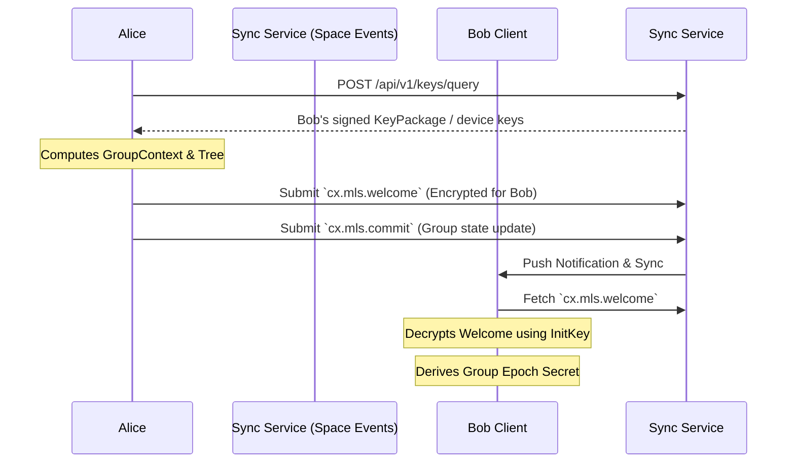

# Encryption and Auditability

## 1. 目标

去中心化协作协议面临着复杂的隐私与合规矛盾：一方面，商业数据和私密频道必须提供不可被 Sync Service 或未授权受托服务窃听的端到端加密 (E2EE)；另一方面，在特定组织边界内，数据流又需要受到法律或合规层面的安全审查。

本规范定义了 Contrix 官方推荐的加密标准，旨在实现：
- 基于 **MLS (RFC 9420)** 的高效大规模协作加密
- 强前向安全 (Forward Secrecy) 与后向安全 (Post-Compromise Security)
- **可审查加密 (Auditable E2EE)**，在 TEE / HSM / 等价受控执行 profile 下把合规解密绑定到可验证审计记录；在 software-only profile 下提供透明审计流程，但不声称具备同等密码学强制力。

## 2. 基础加密架构：MLS 与 Contrix 的融合

Contrix 采用 [RFC 9420 - Message Layer Security (MLS)](https://datatracker.ietf.org/doc/html/rfc9420) 作为官方的群组加密标准。
不推荐使用传统的 Double Ratchet（双棘轮），因为在包含数十到数百名成员的 discussion branch 或大型协作 Space 中，双棘轮会导致巨大的性能开销与并发处理难题。

### 2.1 KeyPackage 与服务发现
在参与 MLS 加密前，用户必须公布自己的 `KeyPackage`。
- **发布位置**：Actor 通过 signed Event 发布自己的 `KeyPackage`，或者在其 DID Document 的 `service` 中指定独立的 `MLS Delivery Service` 节点入口。
- **生命周期验证**：其他客户端在拉取 `KeyPackage` 时，MUST 通过 Actor 的 DID Document 与 Event history 验证该包的公钥签名，确保未被身份盗用。

### 2.2 握手与组成员管理 (Welcome, Commit)
MLS 维护了一颗成员密钥树 (Ratchet Tree)。在 Contrix 中，群组的密钥状态变动不依赖于独立的中心化分发服务器，而是映射到原生的 `Space` 与 Event 模型中：



- **`cx.mls.commit`**：当拥有权限的 Admin 邀请新成员加入或移除成员时，客户端计算 MLS 的 `Commit` 消息。该 `Commit` 必须作为 `cx.mls.commit` 类型的 Event 提交至 Space Event history。它作为不可篡改的账本，确保全网节点对群组密钥状态树的演进达成一致。
- **`Welcome` 分发**：新成员会收到由 Admin 构造的 `Welcome` 消息。Welcome MUST 通过 durable `cx.mls.welcome` Event、durable encrypted pointer 或等价可 backfill 记录交付，直到被消费、撤销或过期。Sync Service 的 Ephemeral Channel 只能作为通知和加速通道，不得是唯一交付路径；否则离线设备、跨域 backfill 和恢复流程无法验证加入历史。

### 2.3 载荷加密 (Application Data)
日常的 Message、Flow synthesis 或 Morph 内容负载在写入 Event 前，必须使用当前 MLS Epoch 的流密钥 (Application Key) 加密为密文信封。
- **可路由元数据分离**：密文信封 `encrypted_payload` 仅包裹实际的业务内容 (`body`, `content`, `attachments`)。
- **明文元数据保留**：用于网络路由和客户端本地 projection 的 `space_id`, `type`, `causal_links`, `status`, `labels` 必须保持明文。
- Sync Service 可以依据明文元数据完成数据的转发、排序、过滤和去重，而完全无法窥探密文信封内的具体正文。客户端在解密后 MAY 建立本地搜索索引；受托 search / projection 服务只有在 `plaintext_visible_services` 授权下才能接收明文或可逆摘要。

### 2.4 Sync 与 MLS Epoch

Client Sync 中的事件顺序不保证密钥材料已经同步完成。加密事件和 MLS epoch state MUST 作为相关但可独立到达的 stream 处理：

- encrypted event 可以先进入 raw event cache 和 timeline position。
- `cx.mls.*` state event / MLS Commit 决定客户端是否拥有对应 epoch 的解密状态。
- 客户端缺少 epoch 时 MUST 标记 `decryption_pending`，不得静默丢弃或重排事件。
- backfill 历史事件时，客户端 SHOULD 同步对应 epoch 区间的 MLS state，而不是逐条向成员请求密钥。
- 被移除成员不得获取移除后 epoch 的 group secret；客户端必须 fail closed。

服务端和 Sync Service 不需要解密正文，但必须保留明文 routing metadata、epoch reference、hash 和 causal refs，以便客户端后续补齐密钥后重试解密。

### 2.5 MLS 绑定的应用状态根

E2EE Space 中，MLS 不应只保护正文，也必须帮助成员发现服务端是否向不同客户端展示了不同的成员、策略或 discussion 元数据。

MLS group 的绑定层级取决于启用位置：若 Space 级 policy 声明 `encryption_profile="mls_rfc9420"`，group 可以覆盖整个 Space；若某个 Flow 的 `discussion` branch 通过 `access.branch_overrides.discussion.e2ee="branch_scoped"` 或等价 policy 独立启用 E2EE，则 MLS group MUST 绑定到 `flow_id + branch=discussion`，不得隐式扩展到整个 Space。Space 级与 branch 级 group 可以并存，但必须通过 policy 明确区分成员范围、history sharing 和审计边界。

每个 `cx.mls.commit` MUST 绑定一个 `application_state_ref`，并把该引用纳入 MLS transcript 或等价的 commit-authenticated data：

```json
{
  "application_state_ref": {
    "space_id": "cx:space:01js0sp0000000000000000000",
    "mls_group_id": "base64url...",
    "previous_epoch": 41,
    "next_epoch": 42,
    "membership_frontier": ["cx:event:membersh1phead000000000000"],
    "policy_root": "sha256:canonical_state_policy_root",
    "capability_root": "sha256:effective_capability_root",
    "discussion_metadata_hash": "sha256:canonical_discussion_metadata",
    "binding_profile": "cx.profile.mls_state_binding.full.v1",
    "reducer_profile": "cx.reducer.v1"
  }
}
```

当 MLS group 绑定到 Flow discussion branch 时，`application_state_ref` MUST 同时覆盖 `flow_id` 与 `branch="discussion"`，并以有效 branch access、membership、history visibility 和 policy state 作为验证边界。

规则：

- `membership_frontier` MUST 覆盖本次 Commit 声称生效的成员状态、invite/leave/ban 变化和设备信任变化。
- `policy_root` MUST 覆盖影响加密、history visibility、asset privacy、logging、bot、moderation 和 plaintext-visible service 的 Space policy state。
- v1 base E2EE profile 只要求 `membership_frontier` 与 `policy_root`。这两个字段缺失或无法验证时，客户端 MUST 标记 epoch 为 `state_mismatch` 或 `decryption_pending`。
- `capability_root` 与 `discussion_metadata_hash` 属于 `cx.profile.mls_state_binding.full.v1` hardening profile。实现声明该 profile 时，它们 MUST 覆盖与本次成员或策略变化相关的 effective grant / revoke / claim 状态，以及成员可见的 discussion 名称、头像、主题、公开标识和 provider/federation 元数据；不应包含只有服务端可见的私有索引状态。
- 客户端在接受 MLS epoch 前 MUST 独立验证 `application_state_ref` 指向的 Contrix state 已经按 `event-auth-state-resolution.md` accepted。无法回补或 hash 不匹配时 MUST 标记该 epoch 为 `decryption_pending` 或 `state_mismatch`，不得继续用该 epoch 解密新正文。
- 并发 Commit 仍按 Contrix 的 auth weight / HLC / actor / event hash 规则裁决；失败 Commit 的 MLS transcript 不得被接受为当前 epoch。

实现 SHOULD 将 `application_state_ref` 纳入 MLS GroupContext extension，使其被 `confirmed_transcript_hash` 覆盖。声明 `cx.profile.mls_state_binding.full.v1` 或更高保证 profile 的实现 MUST 支持该绑定方式，或声明等价 transcript-authenticated binding profile。

#### 2.5.1 GroupContext Extension 定义

Contrix 定义以下 MLS GroupContext extension 绑定形状；实际 codepoint 必须通过实现 profile、部署 profile 或未来 registry 协商，不能静默占用未声明的公共 codepoint。

| 字段 | 值 |
|------|-----|
| ExtensionType | `cx_app_state_ref`（profile-negotiated；private-use codepoint 只能在双方显式协商后使用） |
| ExtensionData | `application_state_ref` 对象的 CBOR 编码 |

CBOR 编码 MUST 使用 deterministic canonical encoding (RFC 8949 Section 4.2)。字段顺序按 lexicographic key 排列：

```cbor
{
  "binding_profile":     tstr,
  "capability_root":     bstr,    ; optional, full profile only
  "discussion_metadata_hash": bstr, ; optional, full profile only
  "mls_group_id":        bstr,
  "membership_frontier": [+ bstr],
  "next_epoch":          uint,
  "policy_root":         bstr,
  "previous_epoch":      uint,
  "reducer_profile":     tstr,
  "space_id":            tstr
}
```

当 MLS group 绑定到 Flow discussion branch 时，CBOR map MUST 包含额外键 `"flow_id"` (tstr) 和 `"branch"` (tstr, 值为 `"discussion"`)。

规则：

- 声明 full binding profile 时，`cx_app_state_ref` extension MUST 出现在每次 `cx.mls.commit` 对应的 GroupContext `extensions` 字段中。
- `confirmed_transcript_hash` 的计算覆盖包含该 extension 的 GroupContext，从而将 Contrix 应用状态绑定到 MLS transcript。
- 若底层 MLS 库暂不支持 GroupContext extension，base E2EE profile MUST 至少把 `application_state_ref` 放入签名 Event 和 Commit transcript hash 可验证覆盖的字段中，并在实现文档中声明降级原因；不得声称支持 full binding profile。
- 接收方验证 Commit 时 MUST 解码 `cx_app_state_ref` extension 并执行 section 2.5 中的 `application_state_ref` 验证规则。

### 2.6 KeyPackage Claim 生命周期

KeyPackage 不应被建模为可无限次公开拉取的静态材料。E2EE 实现 MUST 将 MLS KeyPackage 作为可声明、可领取、可消费、可撤销的单次使用材料。

> **Contrix 扩展说明**：RFC 9420 Section 10.1 将 KeyPackage 定义为全局单次使用材料（一个 KeyPackage 对应一次 Welcome）。Contrix 的 claim 模型在此基础上增加了 `intended_space_id` 绑定和 room-scoped claim，要求 MLS Delivery Service 跟踪 room affinity。这是 Contrix 的有意扩展，理由是：(a) 去中心化环境中没有中心化 Delivery Service 来全局追踪 KeyPackage 消费状态；(b) room-scoped claim 使客户端可以控制自己被邀请进入哪些 Space，而非被动接受任何 Welcome；(c) claim 绑定使审计链可追溯某个 KeyPackage 被哪个 Space 消费。实现若使用标准 MLS 库（不支持 room-scoped claim），MUST 至少在 Contrix 协议层维护 claim 映射表，并在 Welcome 发送/接收时执行 claim 验证。

KeyPackage lifecycle：

```text
published -> claimed -> consumed
          -> expired
          -> revoked
```

推荐记录：

```json
{
  "kind": "cx.mls.keypackage",
  "keypackage_id": "cx:mls:kp:01JS...",
  "principal_id": "did:web:alice.example.com",
  "device_id": "cx:device:01js0ke0000000000000000000",
  "keypackage_ref": "sha256:...",
  "cipher_suites": ["MLS_128_DHKEMX25519_AES128GCM_SHA256_Ed25519"],
  "capabilities": ["mimi.content.v1", "cx.content.v1"],
  "state": "published",
  "created_at": "2026-04-30T00:00:00Z",
  "expires_at": "2026-05-07T00:00:00Z",
  "device_signature": "base64url..."
}
```

Claim 请求 MUST 绑定：

- requester principal / service DID 和 device proof。
- intended `space_id` 或 room id。
- required capabilities / content profiles / cipher suites。
- 是否允许 minimal-metadata pseudonymous credential。
- claim nonce、过期时间和目标 Welcome 路由服务。

Claim 成功后：

- KeyPackage MUST 进入 `claimed`，并绑定 `claim_id`、requester、intended Space、capability set 和 expiry。
- 同一 KeyPackage 不得被第二个 room、第二个 requester 或第二次 Welcome 重复使用。
- Welcome 发送方 MUST 引用 `keypackage_ref` / `claim_id`，接收端 MUST 校验 Welcome 使用的是自己设备已 claimed 且未过期、未撤销、未消费的 KeyPackage。
- 成功处理 Welcome 后，接收端或服务端状态 SHOULD 标记该 KeyPackage 为 `consumed`。若 Welcome 失败或过期，KeyPackage 不得自动回到 `published`；设备 SHOULD 发布新的 KeyPackage。
- 服务端返回 KeyPackage 时 MUST 附带 device signature、principal binding 和 revocation status。客户端 MUST 通过 DID control chain 与 device trust chain 验证后才能加密。

### 2.7 Minimal-Metadata E2EE Space

高隐私 Space MAY 启用 `cx.mls.minimal_metadata_space.v1`。该 profile 的目标是让转发服务、shared Space Host 或跨域 provider 只看到必要 routing pseudonym，而默认看不到真实 principal DID、设备列表或关系图谱。

Profile 规则：

- Event Envelope 的 `actor_id` 仍然必须是 DID。minimal-metadata profile 中，`actor_id` SHOULD 使用 room-scoped pairwise DID，例如成员为该 Space / Flow branch 生成的 `did:key`、`did:peer` 或 policy 允许的其他 pseudonymous DID。实现不得把非 DID 字符串放入 `actor_id`。
- MLS leaf credential SHOULD 绑定同一个 room-scoped pairwise DID，或绑定可由该 pairwise DID 验证的 credential。
- 真实 `principal_id`、设备身份、display profile 和可选 handle MUST 放入端到端加密的 `cx.identity_link` application message 或 MLS private extension 中，只对当前 room members 可见。
- `cx.identity_link` MUST 绑定 pairwise DID、principal DID、device id、room id / flow branch id、MLS leaf index、effective time 和签名证明；该证明必须能从 principal DID 的控制链或 profile 声明的 disclosure proof 验证。
- Sync / Federation 服务只可按 pairwise DID、space id、epoch、event id / routing hash 和授权服务绑定路由；不得要求明文 principal DID 才能转发密文。
- Capability、moderation、legal hold 或 enterprise policy 需要真实主体时，Space policy MUST 在加入前声明 disclosure 条件。客户端不接受该 disclosure policy 时 MUST NOT 加入该 Space。
- 任何从 pairwise DID 到 principal DID 的服务端可见映射都 MUST 有明确 purpose、expiry、audience 和 audit record；默认不得写入公开 Space history。

Minimal-metadata Space 不改变签名责任。客户端在解密后仍必须验证发送者的 identity link、MLS credential、device trust 和对应 capability。无法建立映射时，该消息可被展示为未验证 pairwise sender，但不得被提升为已验证 principal DID 发送者。

**Identity Link 缓存**：客户端 SHOULD 在本地设备存储中缓存已验证的 `cx.identity_link` 映射，key 为 `(space_id, pairwise_did)`。缓存 MUST 包含验证时间、MLS epoch、principal DID、device id 和签名证明摘要。缓存失效规则：

- MLS epoch 变更（成员被移除或主动离开）时，MUST 失效对应成员的缓存条目。
- `cx.identity_link` 被更新或撤销时，MUST 替换旧条目。
- 缓存 TTL SHOULD 不超过 7 天；过期后 MUST 重新验证。
- 设备丢失或恢复后，MUST 清除所有 identity_link 缓存。

### 2.8 Message ID AAD 可见性

加密信封中的 AAD 能帮助路由和诊断，但也可能成为跨服务关联信号。Space policy MUST 声明 `aad_visibility`：

```json
{
  "aad_visibility": {
    "message_id": "hidden",
    "event_id": "routing_hash",
    "debug_trace_id": "disabled"
  }
}
```

取值：

- `hidden`：默认值；不在 MLS AAD 或服务可见 metadata 中暴露稳定 message id。
- `routing_hash`：只暴露不可逆 hash，用于去重、幂等和 backfill 诊断。
- `opaque_id`：暴露 opaque event/message id，用于跨 provider 投递确认。
- `debug`：仅限短期调试或受控企业 profile；MUST 有过期时间、审计和用户/管理员可见声明。

隐私优先 Space SHOULD 使用 `hidden` 或 `routing_hash`。企业合规或 federation 调试场景 MAY 使用 `opaque_id`，但 MUST 在 `application_state_ref.policy_root` 覆盖的 policy 中声明，并且不得把正文、附件名、mention、reply excerpt 或 sender handle 放入 AAD。

## 3. 可审查的端到端加密 (Auditable E2EE)

在很多去中心化产品中，如果存在审查，往往是通过向客户端下发“旁路后门”或者弱化密钥机制实现的，这引起了极大的隐私恐慌。

Contrix 引入 **“透明留痕审计 (Transparent Audit Trail)”** 机制：既满足组织的强制合规要求，又向所有参与者提供可验证的审计记录。TEE / HSM / 等价受控执行 profile 可以把 key release 或明文输出绑定到先写审计记录；software-only profile 只能提供协议级流程和审计要求，不能密码学阻止持钥客户端绕过日志。

### 3.1 Auditable Policy 声明
要启用此机制，Space 的 `schema/policy` 必须显式声明：
```json
{
  "encryption_profile": "mls_rfc9420",
  "auditable_e2ee": true,
  "auditable_e2ee_profile": "cx.profile.auditable_e2ee.tee_required.v1",
  "audit_enforcement_level": "hardware_tee",
  "audit_actors": [
    "did:web:compliance.acme.corp"
  ]
}
```

`audit_enforcement_level` 取值：

| 值 | 说明 |
|-----|------|
| `hardware_tee` | Audit Agent 在 TEE / HSM / 等价硬件隔离环境中运行；密钥和明文不离开受控边界。 |
| `software_process` | 无硬件隔离；审计保证依赖协议流程和合规监督，不提供密码学阻断。 |
| `none` | 未声明审计强制级别；客户端 MUST 视为最弱保证。 |

客户端在加入 auditable Space 前 MUST 读取 `audit_enforcement_level` 并向用户展示当前强制级别。
客户端在加入此类 Space 前，**UI 必须向人类用户明确警告**：“这是一个受审核的加密空间，内容对合规员可见，但任何审查都会被记录并在群内公示。”

Auditable E2EE profile：

- `cx.profile.auditable_e2ee.tee_required.v1`：Audit Agent MUST 在声明的 TEE / enclave 或等价硬件隔离环境中运行；remote attestation MUST 绑定 enclave measurement、service DID、policy version、audit purpose、operator DID、created_at 和 expiry。
- `cx.profile.auditable_e2ee.software_only.v1`：不要求 TEE，但 Space policy MUST 明确声明该降级；成员加入前必须可见确认。该 profile 仍然必须执行 `cx.audit.accessed` 先写后解密流程，但其保证属于合规和可审计流程保证，不是密码学强制保证。

### 3.2 审计节点的入群
`did:web:compliance.acme.corp` 对应的合规客户端（Audit Agent）会作为一个合法的、只读的成员，由创建者通过正常的 `cx.mls.commit` 邀请加入 MLS 群组。
这意味着：
- Audit Agent 从密码学上获得了当前 Epoch 的解密能力。
- 群组内所有的普通成员都可以通过检查 MLS 树，清晰地知晓 Audit Agent 的存在。

### 3.3 强制留痕机制 (Audit Record Mandatory)
获得密钥并不意味着可以合规地随意查看。协议要求 Audit Agent 按声明的 auditable E2EE profile 执行以下工作流；`tee_required` profile 下该实现必须依托 TEE / enclave 或等价硬件隔离环境，并保证 MLS key、exporter secret 或解密明文不会在审计确认前离开受控边界：

1. **收到审查请求**：组织内部触发对某条涉嫌违规的 Message 的审查（如 `message_id: cx:message:msg12300000000000000000000`）。
2. **强制上链/入库声明**：Audit Agent 在进行解密之前，MUST 生成一条 `kind="cx.audit.accessed"` 的不可撤销 Event，并提交给该 Space：
   ```json
   {
     "kind": "cx.audit.accessed",
     "space_id": "cx:space:01js0sp0000000000000000000",
     "actor_id": "did:web:compliance.acme.corp",
     "content": {
       "target_ref": "cx:message:msg12300000000000000000000",
       "purpose": "Internal legal compliance request #8801",
       "accessed_at": "2026-04-30T00:00:00Z"
     }
   }
   ```
3. **基于 RYW (Read-Your-Writes) 的因果确权回执等待**：为防止网络抖动或同步节点恶意丢包导致的“假动作死锁”（即记录没发出去但明文已吐出），合规飞地 MUST 等待来自底层 Events API、witness receipt 或至少一个独立验证节点的因果确权回执，确认该 `cx.audit.accessed` 已经成功跨越本地局域网并在协作图中落盘。
   - **独立节点验证**：高保证 profile SHOULD 从至少一个与 Audit Agent 无共同控制面的验证节点获得回执；单节点部署或 software-only profile 只能使用单源回执时，MUST 在审计记录中标记 `receipt_source_count=1` 和 `receipt_independence="single_source"`。
   - **失效处理**：若后续 backfill / witness / state verification 证明该 `cx.audit.accessed` 未进入 accepted history、canonical bytes 与回执不匹配、或确权来源无权签发该回执，Audit Agent MUST 将对应解密会话标记为 `audit_receipt_invalidated`，并在重新输出明文前重新发布审计事件并等待新的确权回执。普通 redaction 不会抹除已发生访问的 verification stub，但客户端应在审计视图中显示 redaction 状态。
4. **完成解密**：只有在接收到确权回执后，硬件飞地、HSM 或受控合规服务才被允许利用持有的 MLS 密钥将对应明文输出给合规人员。Software-only profile MUST 按同一顺序执行并记录证明，但对恶意持钥客户端不提供密码学阻断。

### 3.4 审查透明公示
因为 `cx.audit.accessed` 是一条公开写入的协作事件，所有参与者的客户端都能通过 sync 实时同步到该事件。
- **用户端 UI**：客户端检测到自己发送的消息被附加了 `cx.audit.accessed` 后，应在界面上（如气泡旁边）显示明显的标识（例如一个带警告色的“合规审查”眼睛图标），并允许用户点击查看审查事由与时间。
- **不可抵赖性范围**：在 TEE / HSM / 等价受控执行 profile 中，合规输出必须绑定到 `cx.audit.accessed` 的确权回执；在 software-only profile 中，成员可审计合规客户端是否按流程记录访问，但协议不能阻止恶意持钥实现绕过日志。

## 4. 受控账号的通信穿透 (Master-Agent Control)

协议严格区分“场地方合规审查 (Space Audit)”与“参与方主控权穿透 (Master-Agent Control)”。

当一个受控账户（如 AI Agent，拥有自己独立的 DID）加入了一个私密加密群组，其控制者（Controller / Master）可以通过显式设备、授权转发或受控日志获得该 Agent 的通信副本。这属于**终端节点数据与密钥管理范畴**，不等同于场地方合规审查；只要访问范围已经在 Agent authority、grant、设备绑定或 owner-private policy 中声明，就不需要触发前文所述的 `cx.audit.accessed` 强制公开留痕机制。

协议支持以下两种原生方式实现 Controller 对 Agent 的通信穿透。默认实现 SHOULD 使用方案 A；方案 B 只在部署和产品策略明确时启用。

### 4.1 方案 A：独立 Agent 密钥与显式控制通道 (Independent Agent Key) —— 默认

Agent SHOULD 拥有独立 DID、独立 device key 和独立 MLS KeyPackage。Controller 通过 capability delegation、`cx.schema.agent_authority.v1`、device / session grant、approval policy 和可撤销的 owner-private control channel 管理该 Agent。

- **机制**：Agent 自己生成和持有签名密钥、设备密钥与 MLS KeyPackage；Controller 通过显式 grant、controller approval、kill switch、审计事件和可选的 owner-private 1 对 1 E2EE Space 接收必要副本或摘要。
- **效果**：Agent compromise 的影响边界限制在 Agent 自身 DID、device、session、grant 和可见 Space 内。Controller 根种子、恢复密钥和其他身份材料不会因为 Agent 运行环境泄露而被扩散。

规则：

- Agent 私钥、Controller 主体私钥、Controller recovery key 和 Controller backup key MUST 是不同密钥域。
- Controller 拥有权限不自动使 Agent 拥有权限；Agent 写入、加入 Space / Flow discussion branch、读取 owner-private 知识源、读取 owner presence 或启动外部 protocol session 仍必须命中 Agent 自己的 grant / approval / policy。
- Agent Authority Panel MUST 能解释 Controller、responsible actor、effective grant、presence policy、knowledge source、join policy 和 expiry。
- 撤销 Controller 对 Agent 的控制通道时，必须使相关 session grant、owner-private 知识源 grant、presence trigger 和 tool / protocol session grant 失效。

### 4.2 方案 B：多设备绑定 (Multi-Device KeyPackage)
- **机制**：Agent 作为一个独立的物理/逻辑实体，生成自己的 `KeyPackage`，但在身份层面上挂靠在 Master 的 DID 下，作为 Master 的另一台“设备”。
- **效果**：在 MLS 树中，发送者对同一个主体的多个叶子节点加密。Master 手机与 Agent 服务器同时收到密文副本并各自解密。

方案 B 会把 Agent 与 Controller 的主体边界收紧，适合“同一 principal 的托管设备”而不是“独立 Agent DID”。若产品向用户展示 Agent 是独立 Actor，或 Space policy 要求 automated actor 可审计，MUST 使用方案 A，不得把 Agent 静默伪装成 Controller 的普通设备。

### 4.3 HD 派生的限制

使用 Controller 根种子或主恢复种子派生 Agent 初始私钥不是 v1 默认 profile。实现 MAY 在完全本地、单用户、可导出性受控且 UI 明确告知风险的 profile 中使用 HD 派生，但必须满足：

- 派生路径、purpose、Agent DID、device id、audience 和 expiry 必须固定并可审计。
- Agent 子密钥泄露不得允许攻击者推导 Controller 根种子、Controller DID 控制密钥、recovery key 或其他 Agent 子密钥。
- HD 派生密钥不得用于 Controller 的 DID recovery、Space admin grant 签发或组织治理动作。
- 该 profile 必须声明为可选高风险能力；互操作对端不得假设所有 Agent DID 都由 Controller 根种子派生。

## 5. 组员变动与高可用容错 (Proposal & Commit)

在去中心化网络中，管理员踢人（或邀请人）是一个典型的容易因网络抖动而“做到一半瘫痪”的操作。为避免单点故障导致群组密钥树锁定，Contrix 严格继承了 MLS (RFC 9420) 的 **“提案与提交分离 (Proposal & Commit)”** 架构。

### 5.1 意图与生效的分离
组员的增删改是两阶段流程：
1. **意图上链 (Proposal)**：管理员 A 发出 `cx.mls.proposal` (意图移除用户 D)。这只是一条明文路由加上密码学签名的操作意图。**注意：此时群组 Epoch 并没有推进，先前密钥依然有效，用户 D 依然在群内**。
2. **正式生效 (Commit)**：必须有成员针对上述 Proposal 打包并发起一个 `cx.mls.commit` 操作。一旦 Commit 落盘，Ratchet Tree 被重新洗牌，新密钥分发给剩余成员（不包含 D），此时 D 才被真正物理隔离。

### 5.2 断网接力与挂起状态 (Takeover)
如果管理员 A 在发出踢人 Proposal 后瞬间掉线，群组**绝对不会瘫痪**。
- **挂起态的可用性**：在 Commit 被提交之前，群组处于“有待处理提案”的挂起状态，所有成员依然可以使用现有的 Epoch 密钥继续聊天通信。
- **无缝接力 (Takeover)**：群组内其他具备足够权限的成员（如管理员 B 或普通成员 C）在侦测到未处理的 Proposal 后，可以主动“接手”。成员 B 的客户端会自动执行重新加密，打包移除 D 的逻辑，并广播出 `cx.mls.commit`。一旦 B 的 Commit 被接受，D 成功被踢出。

### 5.3 防冲突仲裁 (Concurrency Resolution)
如果 A 和 B 同时发起不同的 Commit，或者 A 发送缓慢导致与 B 的接力 Commit 在网络中发生竞态碰撞：
- 节点将根据底层 Event reducer 的 **Tie-breaking 规则**（优先级排序：`Auth Weight` -> `HLC` -> `Actor_ID 字典序` -> `Event Hash`）进行无分歧的绝对仲裁。
- 胜出者的 Commit 成为合法的下一个 Epoch。失败者的客户端发现自己的 Commit 版本过期后，会自动丢弃本地更改并拉取胜出者的状态，确保 E2EE 的强一致性。

MLS Commit 的输入和输出必须在 Event content 中可验证表达：

- `group_id`：目标 MLS group。
- `base_epoch`：Commit 构造时读取的当前 epoch。
- `base_epoch_ref`：本地认为当前有效的 `cx.mls.epoch` event 或 genesis group state ref。
- `proposal_refs`：被该 Commit 消费的 `cx.mls.proposal` events；即使只有一个 proposal，也 MUST 使用长度为 1 的数组，生产者不得使用单数 `proposal_ref`。
- `commit_message_ref` / `commit_hash`：MLS Commit 消息或其 content-addressed blob。
- `next_epoch`：必须等于 `base_epoch + 1`。
- `application_state_ref`：见第 2.5 节。

同一 `(group_id, base_epoch)` 上多个 accepted `cx.mls.commit` 候选是 state conflict，而不是并存的多个有效 epoch。Reducer MUST 只选择一个 winner 生成当前 MLS epoch state；loser commit 的 MLS transcript 不得被用于解密或继续提交后续 epoch。客户端发现自己提交的 commit 失败后，必须以 winner epoch 为 base 重新生成 Commit；原 loser commit 中未被 winner 消费且仍满足授权、membership、policy 和 freshness 的 proposal MAY 重新发布为 proposal，或被后续 Commit 重新引用，但不得自动视为已生效。

`cx.mls.epoch` 是从 winner `cx.mls.commit` 机械派生的 epoch checkpoint，不是独立的成员操作。若实现把该 checkpoint 作为 durable Event Envelope 传播或缓存，必须满足：

- `content.source` MUST 为 `commit_winner_checkpoint`。
- `content.commit_ref` MUST 指向已 accepted 且在同一 `(group_id, base_epoch)` conflict set 中胜出的 `cx.mls.commit`。
- `content.epoch` MUST 等于 winner commit 的 `next_epoch`，`application_state_ref` MUST 与 winner commit 中被 MLS transcript 覆盖的引用一致。
- `auth_refs` MUST 包含 winner commit 或其已验证 checkpoint / snapshot 证明。
- Events API MUST reject 任何无法从 winner commit 机械验证的 `cx.mls.epoch`；actor、service 或 key server 不得通过单独提交 `cx.mls.epoch` 推进 epoch。

当网络分区导致节点短期看见不同 winner 时，客户端 MUST 把依赖未知或竞争 epoch 的加密事件标记为 `decryption_pending` / `state_mismatch`，直到 event-auth state resolution、backfill 或 snapshot-assisted verification 收敛。服务端不得通过本地接收顺序指定 MLS epoch；可选 designated committer / key service 只能由 Space policy 授权为普通 actor 或 service capability，不能替代上述 deterministic state resolution。

## 6. 离线支持与消息延迟到达
- 凭借 MLS 的 Ratchet Tree，即使某成员长时间离线，只要他没有被驱逐出群组，他上线后依然能通过同步全量的 `cx.mls.commit` 操作跟上 Epoch 的演进，并解密积压在 Sync Service 中的加密事件。
- 对于极端网络分区情况，客户端 SHOULD 保存尚未完全确认的前驱 Epoch 密钥状态，直到所有相关的历史 `encrypted_payload` 都已被成功拉取与解密。
- 这种前驱 Epoch 保留是有界的恢复缓存，不是为未来新成员历史共享而无限期保存先前 secret。客户端 MUST 对本地先前 epoch key 使用设备保护存储或明确授权的 key backup，并在 retention / legal hold / erasure policy 不再要求保留时销毁。

## 7. v1 集成要求

- KeyPackage 在 DID Document 或 Device / Key Server 中的映射 MUST 绑定 principal DID、device id、KeyPackage hash、supported cipher suites、created_at、expires_at、revocation status 和 device signature。客户端必须通过 DID 控制链和 device trust chain 验证后才能加密。
- 当 auditable E2EE profile 要求 TEE 时，Audit Agent remote attestation MUST 绑定 enclave measurement、service DID、policy version、audit purpose、operator DID、created_at 和 expiry。Attestation 只能证明运行环境和代码身份，不能绕过 `cx.audit.accessed` 先写后解密要求。`software_only` profile 不得伪造或暗示存在 TEE attestation。
- Signal / Double Ratchet 私信互操作只能作为 profile-specific fallback。fallback 必须声明会话 identity binding、device verification、forward secrecy profile、history visibility 差异和迁移边界；不得在 MLS Space 内静默降级。
