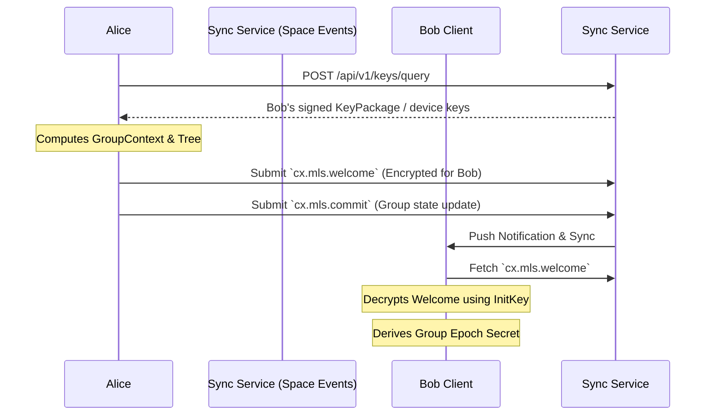

# Encryption and Auditability

## 1. 目标

去中心化协作协议面临着复杂的隐私与合规矛盾：一方面，商业数据和私密频道必须提供不可被 Sync Service 或未授权受托服务窃听的端到端加密 (E2EE)；另一方面，在特定组织边界内，数据流又需要受到法律或合规层面的安全审查。

本规范定义了 Contrix 官方推荐的加密标准，旨在实现：
- 基于 **MLS (RFC 9420)** 的高效大规模协作加密
- 强前向安全 (Forward Secrecy) 与后向安全 (Post-Compromise Security)
- **可审查加密 (Auditable E2EE)**，在 TEE / HSM / 等价受控执行 profile 下把合规解密绑定到可验证审计记录；在 software-only profile 下提供透明审计流程，但不声称具备同等密码学强制力。

## 2. 基础加密架构：MLS 与 Contrix 的融合

Contrix 采用 [RFC 9420 - Message Layer Security (MLS)](https://datatracker.ietf.org/doc/html/rfc9420) 作为官方的群组加密标准。
不推荐使用传统的 Double Ratchet（双棘轮），因为在包含数十到数百名成员的 discussion branch 或大型协作 Space 中，双棘轮会导致巨大的性能开销与并发处理难题。

### 2.1 KeyPackage 与服务发现
在参与 MLS 加密前，用户必须公布自己的 `KeyPackage`。
- **发布位置**：Actor 通过 signed Event 发布自己的 `KeyPackage`，或者在其 DID Document 的 `service` 中指定独立的 `MLS Delivery Service` 节点入口。
- **生命周期验证**：其他客户端在拉取 `KeyPackage` 时，MUST 通过 Actor 的 DID Document 与 Event history 验证该包的公钥签名，确保未被身份盗用。

### 2.2 握手与组成员管理 (Welcome, Commit)
MLS 维护了一颗成员密钥树 (Ratchet Tree)。在 Contrix 中，群组的密钥状态变动不依赖于独立的中心化分发服务器，而是映射到原生的 `Space` 与 Event 模型中：



- **`cx.mls.commit`**：当拥有权限的 Admin 邀请新成员加入或移除成员时，客户端计算 MLS 的 `Commit` 消息。该 `Commit` 必须作为 `cx.mls.commit` 类型的 Event 提交至 Space Event history。它作为不可篡改的账本，确保全网节点对群组密钥状态树的演进达成一致。
- **`Welcome` 分发**：新成员会收到由 Admin 构造的 `Welcome` 消息。Welcome MUST 通过 durable `cx.mls.welcome` Event、durable encrypted pointer 或等价可 backfill 记录交付，直到被消费、撤销或过期。Sync Service 的 Ephemeral Channel 只能作为通知和加速通道，不得是唯一交付路径；否则离线设备、跨域 backfill 和恢复流程无法验证加入历史。

#### 2.2.1 MLS Group Admin 推导

MLS group admin 不是“第一个发 Welcome 的客户端”或“branch 的第一个成员”。Contrix v1 按当前 accepted auth state 确定管理集合：

- Space-scoped MLS group 的默认 admin set 来自 `cx.space.create.payload.object.initial_creators` / `created_by_principal`，以及当前有效的 `cx.space.admin`、`cx.mls.commit`、`cx.mls.welcome` 或 Space policy 声明的等价 E2EE admin capability。
- Flow discussion branch-scoped MLS group 的 admin set 是 Space-scoped admin set，加上对该 `flow_id + branch=discussion` 具有 `cx.flow.branch.admin`、`cx.flow.branch.member` 管理权或 policy 声明 E2EE branch admin capability 的 actor。
- `cx.flow.convert` 不改变 MLS group identity、admin set 推导规则或历史 epoch；它只改变哪个 branch 标记为 primary。若转换同时改变 branch E2EE policy，必须发布独立 policy / branch access event，并通过新的 `cx.mls.proposal` / `cx.mls.commit` 推进 group。
- Admin capability 可以通过普通 capability grant / revoke 转移或收回；转移生效点由 state resolution 和 revoke freshness 决定，不由 MLS leaf index、设备在线状态或本地 UI 角色决定。

发送 `cx.mls.proposal`、`cx.mls.commit` 或 `cx.mls.welcome` 的 actor 必须在其事件自己的 causal auth state 下属于上述 admin set，或满足该 event kind 允许的普通成员 update / self-update 规则。

### 2.3 载荷加密 (Application Data)
日常的 Message、Flow synthesis 或 Morph 内容负载在写入 Event 前，必须使用当前 MLS Epoch 的流密钥 (Application Key) 加密为密文信封。
- **可路由元数据分离**：密文信封 `encrypted_payload` 仅包裹实际的业务内容 (`body`, `content`, `attachments`)。
- **明文元数据保留**：用于网络路由和客户端本地 projection 的 `space_id`, `type`, `causal_links`, `status`, `labels` 必须保持明文。
- Sync Service 可以依据明文元数据完成数据的转发、排序、过滤和去重，而完全无法窥探密文信封内的具体正文。客户端在解密后 MAY 建立本地搜索索引；受托 search / projection 服务只有在 `plaintext_visible_services` 授权下才能接收明文或可逆摘要。

### 2.4 Sync 与 MLS Epoch

Client Sync 中的事件顺序不保证密钥材料已经同步完成。加密事件和 MLS epoch state MUST 作为相关但可独立到达的 stream 处理：

- encrypted event 可以先进入 raw event cache 和 timeline position。
- `cx.mls.*` state event / MLS Commit 决定客户端是否拥有对应 epoch 的解密状态。
- 客户端缺少 epoch 时 MUST 标记 `decryption_pending`，不得静默丢弃或重排事件。
- backfill 历史事件时，客户端 SHOULD 同步对应 epoch 区间的 MLS state，而不是逐条向成员请求密钥。
- 被移除成员不得获取移除后 epoch 的 group secret；客户端必须 fail closed。

服务端和 Sync Service 不需要解密正文，但必须保留明文 routing metadata、epoch reference、hash 和 causal refs，以便客户端后续补齐密钥后重试解密。

#### 2.4.1 Membership 与 Epoch 不一致窗口

Membership state 与 MLS epoch 推进是异步事件，但可见性规则必须确定：

- 会影响 E2EE 可见性的 `cx.member.state` / `cx.flow.branch.member` accepted 后，该 encryption scope 进入 `epoch_update_required`，直到有 winning `cx.mls.commit` 的 `application_state_ref.membership_frontier` 覆盖该 membership frontier。
- 新加入成员在 Welcome / Commit 被接受并成功处理前，只能看到 policy 允许的 stripped metadata、邀请信息或 `decryption_pending` 占位；不得看到加入前后正文，除非 history sharing policy 和 key share event 明确授权。
- 被移除、ban 或离开的成员在对应 membership frontier 之后不得接收新 epoch 的 Welcome、group secret 或 history key share。若客户端仍收到使用旧 epoch 加密的新正文，必须标记 `state_mismatch` 或拒绝解密结果进入 verified timeline。
- 发送客户端在发现 `epoch_update_required` 后 SHOULD 暂停该 scope 的新 application messages，或把发送状态标记为 `encryption_transition_pending`。高安全 profile MUST 暂停发送，直到 winner epoch 覆盖最新 membership frontier。
- Space / reducer profile MUST 声明 `max_mls_commit_delay_ms`。交互式 profile 默认 SHOULD 不超过 30,000 ms；超过后客户端 MUST 将该 scope 降级为 read-only / send blocked，服务端 SHOULD 返回 `epoch_update_required` 或 `temporarily_unavailable`。
- 网络分区期间可以继续 backfill 旧 epoch 历史，但不得把旧 epoch 下的新消息展示为已满足最新 membership policy 的消息。

该窗口规则不改变 MLS Proposal / Commit 两阶段语义；它只定义 Contrix 在 state 已变化但 epoch 尚未收敛时的 UI、发送和解密处理。

### 2.5 MLS 绑定的应用状态根

E2EE Space 中，MLS 不应只保护正文，也必须帮助成员发现服务端是否向不同客户端展示了不同的成员、策略或 discussion 元数据。

MLS group 的绑定层级取决于启用位置：若 Space 级 policy 声明 `encryption_profile="mls_rfc9420"`，group 可以覆盖整个 Space；若某个 Flow 的 `discussion` branch 通过 `branches[].access.e2ee="branch_scoped"` 或等价 policy 独立启用 E2EE，则 MLS group MUST 绑定到 `flow_id + branch=discussion`，不得隐式扩展到整个 Space。Space 级与 branch 级 group 可以并存，但必须通过 policy 明确区分成员范围、history sharing 和审计边界。

每个 `cx.mls.commit` MUST 绑定一个 `application_state_ref`，并把该引用纳入 MLS transcript 或等价的 commit-authenticated data：

```json
{
  "application_state_ref": {
    "space_id": "cx:space:01js0sp0000000000000000000",
    "mls_group_id": "base64url...",
    "previous_epoch": 41,
    "next_epoch": 42,
    "membership_frontier": ["cx:event:membersh1phead000000000000"],
    "policy_root": "sha256:canonical_state_policy_root",
    "capability_root": "sha256:effective_capability_root",
    "discussion_metadata_hash": "sha256:canonical_discussion_metadata",
    "binding_profile": "cx.profile.mls_state_binding.full.v1",
    "reducer_profile": "cx.reducer.v1"
  }
}
```

当 MLS group 绑定到 Flow discussion branch 时，`application_state_ref` MUST 同时覆盖 `flow_id` 与 `branch="discussion"`，并以有效 branch access、membership、history visibility 和 policy state 作为验证边界。

规则：

- `membership_frontier` MUST 覆盖本次 Commit 声称生效的成员状态、invite/leave/ban 变化和设备信任变化。
- `policy_root` MUST 覆盖影响加密、history visibility、asset privacy、logging、bot、moderation 和 plaintext-visible service 的 Space policy state。
- v1 base E2EE profile 只要求 `membership_frontier` 与 `policy_root`。这两个字段缺失或无法验证时，客户端 MUST 标记 epoch 为 `state_mismatch` 或 `decryption_pending`。
- `capability_root` 与 `discussion_metadata_hash` 属于 `cx.profile.mls_state_binding.full.v1` hardening profile。实现声明该 profile 时，它们 MUST 覆盖与本次成员或策略变化相关的 effective grant / revoke / claim 状态，以及成员可见的 discussion 名称、头像、主题、公开标识和 provider/federation 元数据；不应包含只有服务端可见的私有索引状态。
- 客户端在接受 MLS epoch 前 MUST 独立验证 `application_state_ref` 指向的 Contrix state 已经按 `event-auth-state-resolution.md` accepted。无法回补或 hash 不匹配时 MUST 标记该 epoch 为 `decryption_pending` 或 `state_mismatch`，不得继续用该 epoch 解密新正文。
- 并发 Commit 仍按 Contrix 的 auth weight / HLC / actor / event hash 规则裁决；失败 Commit 的 MLS transcript 不得被接受为当前 epoch。

实现 SHOULD 将 `application_state_ref` 纳入 MLS GroupContext extension，使其被 `confirmed_transcript_hash` 覆盖。声明 `cx.profile.mls_state_binding.full.v1` 或更高保证 profile 的实现 MUST 支持该绑定方式，或声明等价 transcript-authenticated binding profile。

#### 2.5.1 GroupContext Extension 定义

Contrix 定义以下 MLS GroupContext extension 绑定形状；实际 codepoint 必须通过实现 profile、部署 profile 或未来 registry 协商，不能静默占用未声明的公共 codepoint。

| 字段 | 值 |
|------|-----|
| ExtensionType（IANA name） | `cx_app_state_ref` |
| ExtensionType（数值 codepoint） | `0xCAFE` ∈ MLS GroupContext private-use range `0xF000`–`0xFFFF` 之外的 Contrix 保留私用空间。Contrix v1 wire 形态固定使用 `0xCAFE`。该 codepoint 由 Contrix specification 直接保留，不需要再向 IANA 注册；如未来与其它 MLS 用户产生冲突，将通过下一 `space_version` 升级路径切换 codepoint。`cx.profile.mls_state_binding.full.v1` MUST 使用 `0xCAFE`；deployment policy MAY 私有覆盖该 codepoint，但任何不同覆盖必须在 deployment profile 中显式声明，且不得在跨 deployment 的 federation Space 中并存。 |
| ExtensionData | `application_state_ref` 对象的 CBOR 编码 |

CBOR 编码 MUST 使用 deterministic canonical encoding (RFC 8949 Section 4.2)。字段顺序按 lexicographic key 排列：

```cbor
{
  "binding_profile":     tstr,
  "capability_root":     bstr,    ; optional, full profile only
  "discussion_metadata_hash": bstr, ; optional, full profile only
  "mls_group_id":        bstr,
  "membership_frontier": [+ bstr],
  "next_epoch":          uint,
  "policy_root":         bstr,
  "previous_epoch":      uint,
  "reducer_profile":     tstr,
  "space_id":            tstr
}
```

当 MLS group 绑定到 Flow discussion branch 时，CBOR map MUST 包含额外键 `"flow_id"` (tstr) 和 `"branch"` (tstr, 值为 `"discussion"`)。

规则：

- 声明 full binding profile 时，`cx_app_state_ref` extension MUST 出现在每次 `cx.mls.commit` 对应的 GroupContext `extensions` 字段中。
- `confirmed_transcript_hash` 的计算覆盖包含该 extension 的 GroupContext，从而将 Contrix 应用状态绑定到 MLS transcript。
- 若底层 MLS 库暂不支持 GroupContext extension，base E2EE profile MUST 至少把 `application_state_ref` 放入签名 Event 和 Commit transcript hash 可验证覆盖的字段中，并在实现文档中声明降级原因；不得声称支持 full binding profile。
- 接收方验证 Commit 时 MUST 解码 `cx_app_state_ref` extension 并执行 section 2.5 中的 `application_state_ref` 验证规则。

### 2.6 KeyPackage Claim 生命周期

KeyPackage 不应被建模为可无限次公开拉取的静态材料。E2EE 实现 MUST 将 MLS KeyPackage 作为可声明、可领取、可消费、可撤销的单次使用材料。

> **Contrix 扩展说明**：RFC 9420 Section 10.1 将 KeyPackage 定义为全局单次使用材料（一个 KeyPackage 对应一次 Welcome）。Contrix 的 claim 模型在此基础上增加了 `intended_space_id` 绑定和 room-scoped claim，要求 MLS Delivery Service 跟踪 room affinity。这是 Contrix 的有意扩展，理由是：(a) 去中心化环境中没有中心化 Delivery Service 来全局追踪 KeyPackage 消费状态；(b) room-scoped claim 使客户端可以控制自己被邀请进入哪些 Space，而非被动接受任何 Welcome；(c) claim 绑定使审计链可追溯某个 KeyPackage 被哪个 Space 消费。实现若使用标准 MLS 库（不支持 room-scoped claim），MUST 至少在 Contrix 协议层维护 claim 映射表，并在 Welcome 发送/接收时执行 claim 验证。

KeyPackage lifecycle：

```text
published -> claimed -> consumed
          -> expired
          -> revoked
```

推荐记录：

```json
{
  "kind": "cx.mls.keypackage",
  "keypackage_id": "cx:mls:kp:01JS...",
  "principal_id": "did:web:alice.example.com",
  "device_id": "cx:device:01js0ke0000000000000000000",
  "keypackage_ref": "sha256:...",
  "cipher_suites": ["MLS_128_DHKEMX25519_AES128GCM_SHA256_Ed25519"],
  "capabilities": ["mimi.content.v1", "cx.content.v1"],
  "state": "published",
  "created_at": "2026-04-30T00:00:00Z",
  "expires_at": "2026-05-07T00:00:00Z",
  "device_signature": "base64url..."
}
```

Claim 请求 MUST 绑定：

- requester principal / service DID 和 device proof。
- intended `space_id` 或 room id。
- required capabilities / content profiles / cipher suites。
- 是否允许 minimal-metadata pseudonymous credential。
- claim nonce、过期时间和目标 Welcome 路由服务。

Claim 成功后：

- KeyPackage MUST 进入 `claimed`，并绑定 `claim_id`、requester、intended Space、capability set 和 expiry。
- 同一 KeyPackage 不得被第二个 room、第二个 requester 或第二次 Welcome 重复使用。
- Welcome 发送方 MUST 引用 `keypackage_ref` / `claim_id`，接收端 MUST 校验 Welcome 使用的是自己设备已 claimed 且未过期、未撤销、未消费的 KeyPackage。
- 成功处理 Welcome 后，接收端或服务端状态 SHOULD 标记该 KeyPackage 为 `consumed`。若 Welcome 失败或过期，KeyPackage 不得自动回到 `published`；设备 SHOULD 发布新的 KeyPackage。
- 服务端返回 KeyPackage 时 MUST 附带 device signature、principal binding 和 revocation status。客户端 MUST 通过 DID control chain 与 device trust chain 验证后才能加密。

### 2.7 Minimal-Metadata E2EE Space

高隐私 Space MAY 启用 `cx.mls.minimal_metadata_space.v1`。该 profile 的目标是让转发服务、shared Space Host 或跨域 provider 只看到必要 routing pseudonym，而默认看不到真实 principal DID、设备列表或关系图谱。

Profile 规则：

- Event Envelope 的 `actor_id` 仍然必须是 DID。minimal-metadata profile 中，`actor_id` SHOULD 使用 room-scoped pairwise DID，例如成员为该 Space / Flow branch 生成的 `did:key`、`did:peer` 或 policy 允许的其他 pseudonymous DID。实现不得把非 DID 字符串放入 `actor_id`。
- MLS leaf credential SHOULD 绑定同一个 room-scoped pairwise DID，或绑定可由该 pairwise DID 验证的 credential。
- 真实 `principal_id`、设备身份、display profile 和可选 handle MUST 放入端到端加密的 `cx.identity_link` application message 或 MLS private extension 中，只对当前 room members 可见。
- `cx.identity_link` MUST 绑定 pairwise DID、principal DID、device id、room id / flow branch id、MLS leaf index、effective time 和签名证明；该证明必须能从 principal DID 的控制链或 profile 声明的 disclosure proof 验证。
- Sync / Federation 服务只可按 pairwise DID、space id、epoch、event id / routing hash 和授权服务绑定路由；不得要求明文 principal DID 才能转发密文。
- Capability、moderation、legal hold 或 enterprise policy 需要真实主体时，Space policy MUST 在加入前声明 disclosure 条件。客户端不接受该 disclosure policy 时 MUST NOT 加入该 Space。
- 任何从 pairwise DID 到 principal DID 的服务端可见映射都 MUST 有明确 purpose、expiry、audience 和 audit record；默认不得写入公开 Space history。

Minimal-metadata Space 不改变签名责任。客户端在解密后仍必须验证发送者的 identity link、MLS credential、device trust 和对应 capability。无法建立映射时，该消息可被展示为未验证 pairwise sender，但不得被提升为已验证 principal DID 发送者。

**Identity Link 缓存**：客户端 SHOULD 在本地设备存储中缓存已验证的 `cx.identity_link` 映射，key 为 `(space_id, pairwise_did)`。缓存 MUST 包含验证时间、MLS epoch、principal DID、device id 和签名证明摘要。缓存失效规则：

- MLS epoch 变更（成员被移除或主动离开）时，MUST 失效对应成员的缓存条目。
- `cx.identity_link` 被更新或撤销时，MUST 替换旧条目。
- 缓存 TTL SHOULD 不超过 7 天；过期后 MUST 重新验证。
- 设备丢失或恢复后，MUST 清除所有 identity_link 缓存。

### 2.8 Message ID AAD 可见性

加密信封中的 AAD 能帮助路由和诊断，但也可能成为跨服务关联信号。Space policy MUST 声明 `aad_visibility`：

```json
{
  "aad_visibility": {
    "message_id": "hidden",
    "event_id": "routing_hash",
    "debug_trace_id": "disabled"
  }
}
```

取值：

- `hidden`：默认值；不在 MLS AAD 或服务可见 metadata 中暴露稳定 message id。
- `routing_hash`：只暴露不可逆 hash，用于去重、幂等和 backfill 诊断。
- `opaque_id`：暴露 opaque event/message id，用于跨 provider 投递确认。
- `debug`：仅限短期调试或受控企业 profile；MUST 有过期时间、审计和用户/管理员可见声明。

隐私优先 Space SHOULD 使用 `hidden` 或 `routing_hash`。企业合规或 federation 调试场景 MAY 使用 `opaque_id`，但 MUST 在 `application_state_ref.policy_root` 覆盖的 policy 中声明，并且不得把正文、附件名、mention、reply excerpt 或 sender handle 放入 AAD。

加密信封的 Event kind 字段在 AAD 中规范名为 `aad.event_kind`；Space policy、AAD visibility、日志和 conformance vector MUST 使用该名字。

## 3. 受审计的端到端加密 (Audited E2EE)

在很多去中心化产品中，如果存在审查，往往是通过向客户端下发“旁路后门”或者弱化密钥机制实现的，这引起了极大的隐私恐慌。

Contrix 引入 **“透明留痕审计 (Transparent Audit Trail)”** 机制：既满足组织的强制合规要求，又向所有参与者提供可验证的审计记录。该机制划分为两类正交保证：

- **`attested` 类**（`cx.profile.attested_audit.e2ee.v1`）：通过 TEE / HSM / 等价硬件隔离把 key release 或明文输出**密码学绑定**到先写审计记录。
- **`disclosed` 类**（`cx.profile.disclosed_audit.e2ee.v1`）：仅在 Space policy 中**公开声明**审计代理在场并约定流程，**不提供密码学/硬件强制**——协议层不能阻止恶意持钥客户端绕过日志。

`disclosed` 与 `attested` **不是强弱不同的同一保证**，而是不同 family 的保证。任何把两者混称为 "Auditable E2EE" 或暗示二者等价的措辞都不符合本规范（见 §3.5）。

### 3.1 Audit Policy 声明

要启用此机制，Space 的 `schema/policy` 必须显式声明 **两个正交字段**：`audit_disclosure`（透明度承诺，两类共用）+ `audit_assurance`（保证类型，决定使用哪个 profile）。

```json
{
  "encryption_profile": "mls_rfc9420",
  "audit_disclosure": {
    "audit_actors": ["did:web:compliance.acme.corp"],
    "purpose_classes": ["legal_compliance"],
    "retention_days": 365,
    "ryw_receipt_required": true
  },
  "audit_assurance": "attested_hardware"
}
```

`audit_assurance` 是封闭 enum，且与 profile id 一一映射；schema 通过 `if/then` 强约束二者一致。

| `audit_assurance` 值 | 对应 profile | 含义 |
| --- | --- | --- |
| `attested_hardware` | `cx.profile.attested_audit.e2ee.v1` | Audit Agent MUST 在声明的 TEE / enclave / 等价硬件隔离环境中运行；remote attestation MUST 绑定 enclave measurement、service DID、policy version、audit purpose、operator DID、created_at 和 expiry。Key material 与明文输出 MUST 在受控边界内处理。 |
| `disclosed_policy` | `cx.profile.disclosed_audit.e2ee.v1` | 不要求 TEE。Audit Agent 仍然 MUST 执行 `cx.audit.accessed` 先写后解密流程并等待 RYW receipt，但**保证类别仅是合规与流程承诺，不是密码学强制**。Space policy MUST 在加入前可见确认该降级。 |

客户端在加入声明 `audit_disclosure` 的 Space 前 MUST 读取 `audit_assurance`，并按 §3.1.1 显示**正确分类**的 join warning；MUST NOT 用同一段笼统文案覆盖两种保证。

#### 3.1.1 Join Warning（normative MUST，必须分两套）

实现 MUST 按 `audit_assurance` 显示如下两套文案之一（也可本地化，但必须保留区分）。MUST NOT 把两套文案合并成一段或省略关键限定词。

- 当 `audit_assurance = "attested_hardware"`（profile = `cx.profile.attested_audit.e2ee.v1`）：

  > 这是一个**硬件强制审计的加密空间**。审查由声明的 TEE / 飞地强制执行先写后解密：合规员的访问会在你看到之前先公开留痕，群内可验证。被移除的合规员仍可解密其成员期间的历史。

- 当 `audit_assurance = "disclosed_policy"`（profile = `cx.profile.disclosed_audit.e2ee.v1`）：

  > 这是一个**仅依赖流程承诺的审计加密空间**。合规员能解密内容；空间公开声明会留痕，但**协议层不能阻止恶意合规客户端在不留痕的情况下解密内容**——是否信任取决于你对该组织和该客户端实现的信任，而不是密码学强制。被移除的合规员仍可解密其成员期间的历史。

`disclosed_policy` 文案中"协议层不能阻止恶意合规客户端…"一段 MUST 完整呈现，不得作为可折叠的次要说明被默认收起。

### 3.2 审计节点的入群
`did:web:compliance.acme.corp` 对应的合规客户端（Audit Agent）会作为一个合法的、只读的成员，由创建者通过正常的 `cx.mls.commit` 邀请加入 MLS 群组。
这意味着：
- Audit Agent 从密码学上获得了当前 Epoch 的解密能力。
- 群组内所有的普通成员都可以通过检查 MLS 树，清晰地知晓 Audit Agent 的存在。

#### 3.2.1 审计节点最小权限与前向安全边界

Audited E2EE 必须明确承认其安全边界：Audit Agent 是真实 MLS 成员，因此它被移除后仍可解密其成员期间已经收到且按 retention policy 保留的历史消息；Audit Agent key 泄露会影响其可访问 epoch 的机密性。Contrix 不得把这种模式描述为“审计方不可见内容”或“对审计方仍保持完整 forward secrecy”。

Audit Agent profile MUST 满足：

- 只授予 `cx.audit.accessed`、必要的 key receive / decrypt capability 和 policy 明确声明的 audit query capability；不得授予普通发消息、编辑内容、管理 membership、签发 capability、推进 MLS epoch 或更改 Space policy 的权限。
- MLS leaf credential、service DID、attestation evidence、operator DID、保留策略、允许的 audit purpose 和有效期 MUST 对成员可见，并被 Space policy / `application_state_ref.policy_root` 覆盖。
- `audit_assurance = "attested_hardware"` 下，MLS key material、exporter secret、历史 epoch secret 和明文输出 MUST 在 HSM、TEE、enclave 或等价硬件隔离边界内处理；remote attestation 必须绑定代码 measurement、service DID、policy version、audit purpose、created_at 和 expiry。
- `audit_assurance = "disclosed_policy"` 下，客户端必须按 §3.1.1 disclosed 文案向成员显示这是**流程性披露**，不是硬件强制保证；MUST NOT 复用 `attested_hardware` 文案。
- Audit Agent 的本地 key retention MUST 有上限，并能被成员验证为 policy 声明的一部分；legal hold 或监管保留需要单独声明，不能由 Agent 私下延长。

不需要常驻审计解密能力的 Space SHOULD 使用 franking / moderation proof profile（例如 `cx.moderation.frank` 或 profile 注册的等价 token）来证明消息可审计性，并在真正审计时由发送方、持钥成员或受控服务按 policy 解密；不得把 standing Audit Agent 作为唯一合规模式。

### 3.3 强制留痕机制 (Audit Record Mandatory)
获得密钥并不意味着可以合规地随意查看。协议要求 Audit Agent 按声明的 audit profile 执行以下工作流；`cx.profile.attested_audit.e2ee.v1` 下该实现必须依托 TEE / enclave 或等价硬件隔离环境，并保证 MLS key、exporter secret 或解密明文不会在审计确认前离开受控边界：

1. **收到审查请求**：组织内部触发对某条涉嫌违规的 Message 的审查（如 `message_id: cx:message:msg12300000000000000000000`）。
2. **强制上链/入库声明**：Audit Agent 在进行解密之前，MUST 生成一条 `kind="cx.audit.accessed"` 的不可撤销 Event，并提交给该 Space：
   ```json
   {
     "kind": "cx.audit.accessed",
     "space_id": "cx:space:01js0sp0000000000000000000",
     "actor_id": "did:web:compliance.acme.corp",
     "payload": {
       "target_ref": "cx:message:msg12300000000000000000000",
       "purpose": "Internal legal compliance request #8801",
       "accessed_at": "2026-04-30T00:00:00Z"
     }
   }
   ```
3. **基于 RYW (Read-Your-Writes) 的因果确权回执等待**：为防止网络抖动或同步节点恶意丢包导致的“假动作死锁”（即记录没发出去但明文已吐出），合规飞地 MUST 等待来自底层 Events API、witness receipt 或至少一个独立验证节点的因果确权回执，确认该 `cx.audit.accessed` 已经成功跨越本地局域网并在协作图中落盘。回执 MUST 携带 `audit_assurance_class` 字段，且其值 MUST 与 Space policy 声明的 `audit_assurance` 一致；不一致时接收方 MUST fail closed。
   - **独立节点验证**：`cx.profile.attested_audit.e2ee.v1` SHOULD 从至少一个与 Audit Agent 无共同控制面的验证节点获得回执；单节点部署或 `cx.profile.disclosed_audit.e2ee.v1` 只能使用单源回执时，MUST 在审计记录中标记 `receipt_source_count=1` 和 `receipt_independence="single_source"`。
   - **失效处理**：若后续 backfill / witness / state verification 证明该 `cx.audit.accessed` 未进入 accepted history、canonical bytes 与回执不匹配、`audit_assurance_class` 与 Space `audit_assurance` 不一致、或确权来源无权签发该回执，Audit Agent MUST 将对应解密会话标记为 `audit_receipt_invalidated`，并在重新输出明文前重新发布审计事件并等待新的确权回执。普通 redaction 不会抹除已发生访问的 verification stub，但客户端应在审计视图中显示 redaction 状态。
4. **完成解密**：只有在接收到确权回执后，硬件飞地、HSM 或受控合规服务才被允许利用持有的 MLS 密钥将对应明文输出给合规人员。`cx.profile.disclosed_audit.e2ee.v1` MUST 按同一顺序执行并记录证明，但**对恶意持钥客户端不提供密码学阻断**——这是该 profile 的本质局限，不是实现缺陷。

#### 3.3.1 RYW Receipt Schema

`cx.audit.ryw_receipt` 是 receipt 对象，用于满足 §3.3 步骤 3 的"因果确权回执"要求。它由 Events API、witness 或独立验证节点签发，证明特定 `cx.audit.accessed` 已经进入接收方 accepted history（或至少其 actor frontier 已经覆盖该 event）。

Schema id：`cx.schema.audit_ryw_receipt.v1`

```json
{
  "receipt_id": "cx:receipt:01js0ry0000000000000000000",
  "schema": "cx.schema.audit_ryw_receipt.v1",
  "issuer": "did:web:witness.example.com",
  "issuer_role": "witness",
  "audit_event_id": "cx:event:01js0aa0000000000000000000",
  "audit_event_digest": "sha256:...",
  "space_id": "cx:space:01js0sp0000000000000000000",
  "audit_actor_id": "did:web:audit-agent.example.com",
  "frontier": {
    "space_frontier": ["cx:event:..."],
    "actor_frontier": {
      "did:web:audit-agent.example.com": {
        "actor_seq": 17,
        "event_id": "cx:event:01js0aa0000000000000000000"
      }
    }
  },
  "observed_at": "2026-04-26T00:00:00.123Z",
  "receipt_independence": "independent",
  "audit_assurance_class": "attested_hardware",
  "proofs": [
    {
      "kind": "detached_jws",
      "alg": "EdDSA",
      "verification_method": "did:web:witness.example.com#receipt-key-1",
      "payload_hash": "sha256:...",
      "created_at": "2026-04-26T00:00:00.123Z",
      "jws": "..."
    }
  ]
}
```

字段语义：

| 字段 | 必填 | 说明 |
| --- | --- | --- |
| `receipt_id` | yes | `cx:receipt:<ulid>`。 |
| `type` | yes | 固定 `audit_ryw_receipt`。 |
| `schema` | yes | 固定 `cx.schema.audit_ryw_receipt.v1`。 |
| `issuer` | yes | 签发方 service / witness DID。MUST 与 proof `verification_method` 同 DID。 |
| `issuer_role` | yes | `events_api` / `witness` / `peer_node` 之一，标记 receipt 来源类型。 |
| `audit_event_id` | yes | 对应的 `cx.audit.accessed` event 的 typed ID。 |
| `audit_event_digest` | yes | `cx.audit.accessed` envelope 的 canonical digest（与该 envelope `proofs[].payload_hash` 一致）。 |
| `space_id` | yes | `cx.audit.accessed` 所在 Space。 |
| `audit_actor_id` | yes | 发起 audit 的 Audit Agent DID。 |
| `frontier.space_frontier` | yes | 签发时 issuer 已 accepted 的 Space frontier。MUST 因果上 ≥ `audit_event_id`。 |
| `frontier.actor_frontier` | conditional | 至少包含 `audit_actor_id` 的 frontier。其它 actor frontier 由 issuer 选择性透出。 |
| `observed_at` | yes | issuer 观测到 `cx.audit.accessed` accepted 的时间。 |
| `receipt_independence` | yes | `independent` / `single_source`，与 §3.3 step 3 文字一致。 |
| `audit_assurance_class` | yes | `attested_hardware` / `disclosed_policy`。MUST 与 Space `audit_assurance` 在该 receipt 的 frontier 处一致；不一致时接收方 fail closed。该字段是协议层向接收方透出的保证级别 hint，**不是**实现声称硬件 attestation 的依据；硬件 attestation 由 Audit Agent profile（`cx.profile.attested_audit.e2ee.v1`）的 attestation evidence 单独证明。 |
| `proofs` | yes | 至少一个 detached JWS，覆盖 receipt 全部字段（除 proofs 自身）。 |

规则：

- Audit Agent MUST 在解密前等待至少一个有效 RYW receipt；`cx.profile.attested_audit.e2ee.v1` SHOULD 等待来自至少 2 个独立 issuer 的 receipts，且每个 `receipt_independence="independent"`。
- Issuer 不得伪造未观测到的 receipt；任何客户端 / 审计客户端 MUST 拒绝 `audit_event_digest` 与 envelope 实际 digest 不符的 receipt，并按 `audit_receipt_invalidated`（参见 `error-code-registry.json`）处理。
- RYW receipt 默认是 actor-private / ephemeral 在 `cx.profile.disclosed_audit.e2ee.v1` 下；在 `cx.profile.attested_audit.e2ee.v1` 下 receipt 可以同时作为 durable Event（`cx.audit.ryw_receipt`）进入 audit log，便于事后调查。
- Receipt 可被 redaction 覆盖，但 redaction 只清除 cleartext metadata；`audit_event_id`、`audit_event_digest` 与 `audit_assurance_class` 仍保留，以便审计链可还原。

### 3.4 审查透明公示
因为 `cx.audit.accessed` 是一条公开写入的协作事件，所有参与者的客户端都能通过 sync 实时同步到该事件。
- **用户端 UI**：客户端检测到自己发送的消息被附加了 `cx.audit.accessed` 后，应在界面上（如气泡旁边）显示明显的标识（例如一个带警告色的“合规审查”眼睛图标），并允许用户点击查看审查事由、时间与 `audit_assurance_class`。
- **不可抵赖性范围**：在 `cx.profile.attested_audit.e2ee.v1` 下，合规输出必须绑定到 `cx.audit.accessed` 的确权回执；在 `cx.profile.disclosed_audit.e2ee.v1` 下，成员可审计合规客户端是否按流程记录访问，但协议不能阻止恶意持钥实现绕过日志。

### 3.5 禁止误导性营销措辞 (normative)

`cx.profile.disclosed_audit.e2ee.v1` 提供的是流程性披露，不是密码学/硬件强制保证。该 profile 的产品文档、UI 标签、合规材料、营销材料、销售对外材料和向监管/采购方提交的合规说明 **MUST NOT** 使用以下措辞或它们在其他语言下的等价含义：

- "cryptographically enforced audit"
- "hardware-bound audit" / "TEE-equivalent audit"
- "attested audit"（除非该部署同时声明并实现了 `cx.profile.attested_audit.e2ee.v1`，且 attestation evidence 当前有效）
- "tamper-proof audit log"
- "end-to-end encrypted with audit"（暗示加密强度等同于 audit 强度）
- "auditable encryption"（v1 弃用统称——必须明确二选一）

`cx.profile.attested_audit.e2ee.v1` 的对外材料 MAY 使用 "hardware-attested" / "TEE-bound" / "enclave-enforced" 等措辞，**但仅限 attestation evidence 当前在有效期内、measurement 与已发布 reference value 一致、且 service DID 仍为 Space policy 声明的 audit_actors 之一**。Attestation 失效或撤销期间，对外材料 MUST 暂停使用上述措辞。

实现声明对本规范一致时，conformance suite SHOULD 包含一条 documentation lint vector（`forbidden_marketing_terms_check`），扫描产品材料语料并对违规命中 fail closed；该 lint 不替代但补充审计员对真实 attestation evidence 的人工核验。

## 4. 受控账号的通信穿透 (Master-Agent Control)

协议严格区分“场地方合规审查 (Space Audit)”与“参与方主控权穿透 (Master-Agent Control)”。

当一个受控账户（如 AI Agent，拥有自己独立的 DID）加入了一个私密加密群组，其控制者（Controller / Master）可以通过显式设备、授权转发或受控日志获得该 Agent 的通信副本。这属于**终端节点数据与密钥管理范畴**，不等同于场地方合规审查；只要访问范围已经在 Agent authority、grant、设备绑定或 owner-private policy 中声明，就不需要触发前文所述的 `cx.audit.accessed` 强制公开留痕机制。

协议支持以下两种原生方式实现 Controller 对 Agent 的通信穿透。默认实现 SHOULD 使用方案 A；方案 B 只在部署和产品策略明确时启用。

### 4.1 方案 A：独立 Agent 密钥与显式控制通道 (Independent Agent Key) —— 默认

Agent SHOULD 拥有独立 DID、独立 device key 和独立 MLS KeyPackage。Controller 通过 capability delegation、`cx.schema.agent_authority.v1`、device / session grant、approval policy 和可撤销的 owner-private control channel 管理该 Agent。

- **机制**：Agent 自己生成和持有签名密钥、设备密钥与 MLS KeyPackage；Controller 通过显式 grant、controller approval、kill switch、审计事件和可选的 owner-private 1 对 1 E2EE Space 接收必要副本或摘要。
- **效果**：Agent compromise 的影响边界限制在 Agent 自身 DID、device、session、grant 和可见 Space 内。Controller 根种子、恢复密钥和其他身份材料不会因为 Agent 运行环境泄露而被扩散。

规则：

- Agent 私钥、Controller 主体私钥、Controller recovery key 和 Controller backup key MUST 是不同密钥域。
- Controller 拥有权限不自动使 Agent 拥有权限；Agent 写入、加入 Space / Flow discussion branch、读取 owner-private 知识源、读取 owner presence 或启动外部 protocol session 仍必须命中 Agent 自己的 grant / approval / policy。
- Agent Authority Panel MUST 能解释 Controller、responsible actor、effective grant、presence policy、knowledge source、join policy 和 expiry。
- 撤销 Controller 对 Agent 的控制通道时，必须使相关 session grant、owner-private 知识源 grant、presence trigger 和 tool / protocol session grant 失效。

### 4.2 方案 B：多设备绑定 (Multi-Device KeyPackage)
- **机制**：Agent 作为一个独立的物理/逻辑实体，生成自己的 `KeyPackage`，但在身份层面上挂靠在 Master 的 DID 下，作为 Master 的另一台“设备”。
- **效果**：在 MLS 树中，发送者对同一个主体的多个叶子节点加密。Master 手机与 Agent 服务器同时收到密文副本并各自解密。

方案 B 会把 Agent 与 Controller 的主体边界收紧，适合“同一 principal 的托管设备”而不是“独立 Agent DID”。若产品向用户展示 Agent 是独立 Actor，或 Space policy 要求 automated actor 可审计，MUST 使用方案 A，不得把 Agent 静默伪装成 Controller 的普通设备。

### 4.3 HD 派生的限制

使用 Controller 根种子或主恢复种子派生 Agent 初始私钥不是 v1 默认 profile。实现 MAY 在完全本地、单用户、可导出性受控且 UI 明确告知风险的 profile 中使用 HD 派生，但必须满足：

- 派生路径、purpose、Agent DID、device id、audience 和 expiry 必须固定并可审计。
- Agent 子密钥泄露不得允许攻击者推导 Controller 根种子、Controller DID 控制密钥、recovery key 或其他 Agent 子密钥。
- HD 派生密钥不得用于 Controller 的 DID recovery、Space admin grant 签发或组织治理动作。
- 该 profile 必须声明为可选高风险能力；互操作对端不得假设所有 Agent DID 都由 Controller 根种子派生。

## 5. 组员变动与高可用容错 (Proposal & Commit)

在去中心化网络中，管理员踢人（或邀请人）是一个典型的容易因网络抖动而“做到一半瘫痪”的操作。为避免单点故障导致群组密钥树锁定，Contrix 严格继承了 MLS (RFC 9420) 的 **“提案与提交分离 (Proposal & Commit)”** 架构。

### 5.1 MLS Group Genesis

`cx.mls.genesis` 创建 Contrix 绑定的 MLS group 初始状态。它不是普通 Commit，也不消费 Proposal；它声明 epoch 0 的 group identity、初始 ratchet tree / GroupInfo proof 和被 MLS GroupContext extension 覆盖的 Contrix application state。

`cx.mls.genesis.content` MUST 至少包含：

- `mls_group_id`
- `scope`：`space_id`，以及可选 `flow_id`、`branch`；branch-scoped discussion group MUST 写入 `branch="discussion"`。
- `epoch`：MUST 为 `0`。
- `creator_principal_id`
- `creator_device_id`
- `cipher_suite`
- `group_info_ref` 或 `group_info_hash`
- `ratchet_tree_ref` 或 `ratchet_tree_hash`
- `application_state_ref`
- `created_at`

Genesis 接受规则：

1. 创建者必须在 `application_state_ref.membership_frontier` 和 `policy_root` 覆盖的状态下有创建该 MLS group 的权限；通常需要 `cx.mls.genesis` 或包含该动作的管理 grant。
2. `application_state_ref.next_epoch` MUST 为 `0`；若包含 `previous_epoch`，也 MUST 为 `0`。
3. 同一 `(scope, mls_group_id)` 只能有一个 accepted genesis。并发重复 genesis 是 state conflict，按 event-auth state resolution 选择 winner；loser 的 GroupInfo / ratchet tree 不得用于解密或后续 commit。
4. Genesis 后即可发送 epoch 0 application message。第一次成员变动或 group context extension 更新必须使用 `cx.mls.commit`，其 `base_epoch=0`、`base_epoch_ref` 指向 winning `cx.mls.genesis`、`next_epoch=1`。
5. 新加入成员的 `cx.mls.welcome` MUST 引用 accepted genesis 或后续 winning commit 派生出的 epoch state；客户端不得从未 accepted 的 welcome / ratchet tree 本地推断 group authority。

### 5.2 意图与生效的分离
组员的增删改是两阶段流程：
1. **意图上链 (Proposal)**：管理员 A 发出 `cx.mls.proposal` (意图移除用户 D)。这只是一条明文路由加上密码学签名的操作意图。**注意：此时群组 Epoch 并没有推进，先前密钥依然有效，用户 D 依然在群内**。
2. **正式生效 (Commit)**：必须有成员针对上述 Proposal 打包并发起一个 `cx.mls.commit` 操作。一旦 Commit 落盘，Ratchet Tree 被重新洗牌，新密钥分发给剩余成员（不包含 D），此时 D 才被真正物理隔离。

### 5.3 断网接力与挂起状态 (Takeover)
如果管理员 A 在发出踢人 Proposal 后瞬间掉线，群组**绝对不会瘫痪**。
- **挂起态的可用性**：在 Commit 被提交之前，群组处于“有待处理提案”的挂起状态，所有成员依然可以使用现有的 Epoch 密钥继续聊天通信。
- **无缝接力 (Takeover)**：群组内其他具备足够权限的成员（如管理员 B 或普通成员 C）在侦测到未处理的 Proposal 后，可以主动“接手”。成员 B 的客户端会自动执行重新加密，打包移除 D 的逻辑，并广播出 `cx.mls.commit`。一旦 B 的 Commit 被接受，D 成功被踢出。

### 5.4 防冲突仲裁 (Concurrency Resolution)
如果 A 和 B 同时发起不同的 Commit，或者 A 发送缓慢导致与 B 的接力 Commit 在网络中发生竞态碰撞：
- 节点将根据底层 Event reducer 的 **Tie-breaking 规则**（优先级排序：`Auth Weight` -> `HLC` -> `Actor_ID 字典序` -> `Event Hash`）进行无分歧的绝对仲裁。
- 胜出者的 Commit 成为合法的下一个 Epoch。失败者的客户端发现自己的 Commit 版本过期后，会自动丢弃本地更改并拉取胜出者的状态，确保 E2EE 的强一致性。

MLS Commit 的输入和输出必须在 Event payload 中可验证表达：

- `group_id`：目标 MLS group。
- `base_epoch`：Commit 构造时读取的当前 epoch。
- `base_epoch_ref`：本地认为当前有效的 `cx.mls.epoch` event 或 `cx.mls.genesis` event / genesis group state ref。
- `proposal_refs`：被该 Commit 消费的 `cx.mls.proposal` events；即使只有一个 proposal，也 MUST 使用长度为 1 的数组，生产者不得使用单数 `proposal_ref`。
- `commit_message_ref` / `commit_hash`：MLS Commit 消息或其 content-addressed blob。
- `next_epoch`：必须等于 `base_epoch + 1`。
- `application_state_ref`：见第 2.5 节。

同一 `(group_id, base_epoch)` 上多个 accepted `cx.mls.commit` 候选是 state conflict，而不是并存的多个有效 epoch。Reducer MUST 只选择一个 winner 生成当前 MLS epoch state；loser commit 的 MLS transcript 不得被用于解密或继续提交后续 epoch。客户端发现自己提交的 commit 失败后，必须以 winner epoch 为 base 重新生成 Commit；原 loser commit 中未被 winner 消费且仍满足授权、membership、policy 和 freshness 的 proposal MAY 重新发布为 proposal，或被后续 Commit 重新引用，但不得自动视为已生效。

`cx.mls.epoch` 是从 winner `cx.mls.commit` 机械派生的 epoch checkpoint，不是独立的成员操作。若实现把该 checkpoint 作为 durable Event Envelope 传播或缓存，必须满足：

- `payload.source` MUST 为 `commit_winner_checkpoint`。
- `payload.commit_ref` MUST 指向已 accepted 且在同一 `(group_id, base_epoch)` conflict set 中胜出的 `cx.mls.commit`。
- `payload.epoch` MUST 等于 winner commit 的 `next_epoch`，`application_state_ref` MUST 与 winner commit 中被 MLS transcript 覆盖的引用一致。
- `auth_refs` MUST 包含 winner commit 或其已验证 checkpoint / snapshot 证明。
- Events API MUST reject 任何无法从 winner commit 机械验证的 `cx.mls.epoch`；actor、service 或 key server 不得通过单独提交 `cx.mls.epoch` 推进 epoch。

当网络分区导致节点短期看见不同 winner 时，客户端 MUST 把依赖未知或竞争 epoch 的加密事件标记为 `decryption_pending` / `state_mismatch`，直到 event-auth state resolution、backfill 或 snapshot-assisted verification 收敛。服务端不得通过本地接收顺序指定 MLS epoch；可选 designated committer / key service 只能由 Space policy 授权为普通 actor 或 service capability，不能替代上述 deterministic state resolution。

### 5.5 Commit / Welcome 处理失败报告

客户端本地处理 winning `cx.mls.commit`、`cx.mls.welcome` 或其 `application_state_ref` 失败时，MAY 发布 `cx.mls.commit_failed` 诊断事件。该事件用于让管理员、key service 或发送方重新发 Welcome、重新提交 Commit 或调查 state mismatch；它不回滚 accepted commit，也不推进 epoch。

`cx.mls.commit_failed.content` MUST 至少包含：

- `mls_group_id`
- `commit_ref`
- `epoch`
- `failure_stage`，例如 `welcome_decrypt`、`transcript_verify`、`application_state_ref`、`group_state_update`、`keypackage_claim`、`policy_root_mismatch`、`unsupported_cipher_suite`、`storage_failure`
- `reporter_device_id`
- `failed_at`

规则：

- 事件的 `actor_id` MUST 是报告失败的 principal 或其授权设备 / service actor；`reporter_device_id` 必须能从 principal control state 验证。
- `payload` MUST NOT 包含 MLS secret、明文、Welcome 明文、私钥、passphrase、完整 ratchet tree 或可用于离线攻击的调试 dump。
- `auth_refs` SHOULD 包含失败的 `commit_ref`、相关 `cx.mls.welcome`、当前 membership / policy frontier 或可验证 snapshot reference。
- 收到该事件的客户端 MAY 将相关消息保持 `decryption_pending`，并提示重新同步；服务端或管理员 MAY 重发 Welcome 或提交修复 Commit，但必须重新走普通授权和 state resolution。

## 6. 离线支持与消息延迟到达
- 凭借 MLS 的 Ratchet Tree，即使某成员长时间离线，只要他没有被驱逐出群组，他上线后依然能通过同步全量的 `cx.mls.commit` 操作跟上 Epoch 的演进，并解密积压在 Sync Service 中的加密事件。
- 对于极端网络分区情况，客户端 SHOULD 保存尚未完全确认的前驱 Epoch 密钥状态，直到所有相关的历史 `encrypted_payload` 都已被成功拉取与解密。
- 这种前驱 Epoch 保留是有界的恢复缓存，不是为未来新成员历史共享而无限期保存先前 secret。客户端 MUST 对本地先前 epoch key 使用设备保护存储或明确授权的 key backup，并在 retention / legal hold / erasure policy 不再要求保留时销毁。

## 7. v1 集成要求

- KeyPackage 在 DID Document 或 Device / Key Server 中的映射 MUST 绑定 principal DID、device id、KeyPackage hash、supported cipher suites、created_at、expires_at、revocation status 和 device signature。客户端必须通过 DID 控制链和 device trust chain 验证后才能加密。
- 当 Space 声明 `audit_assurance = "attested_hardware"`（profile = `cx.profile.attested_audit.e2ee.v1`）时，Audit Agent remote attestation MUST 绑定 enclave measurement、service DID、policy version、audit purpose、operator DID、created_at 和 expiry。Attestation 只能证明运行环境和代码身份，不能绕过 `cx.audit.accessed` 先写后解密要求。`cx.profile.disclosed_audit.e2ee.v1` 不得伪造或暗示存在 TEE attestation；该 profile 在所有对外材料中遵守 §3.5 禁用措辞条款。
- Signal / Double Ratchet 私信互操作只能作为 profile-specific fallback。fallback 必须声明会话 identity binding、device verification、forward secrecy profile、history visibility 差异和迁移边界；不得在 MLS Space 内静默降级。
