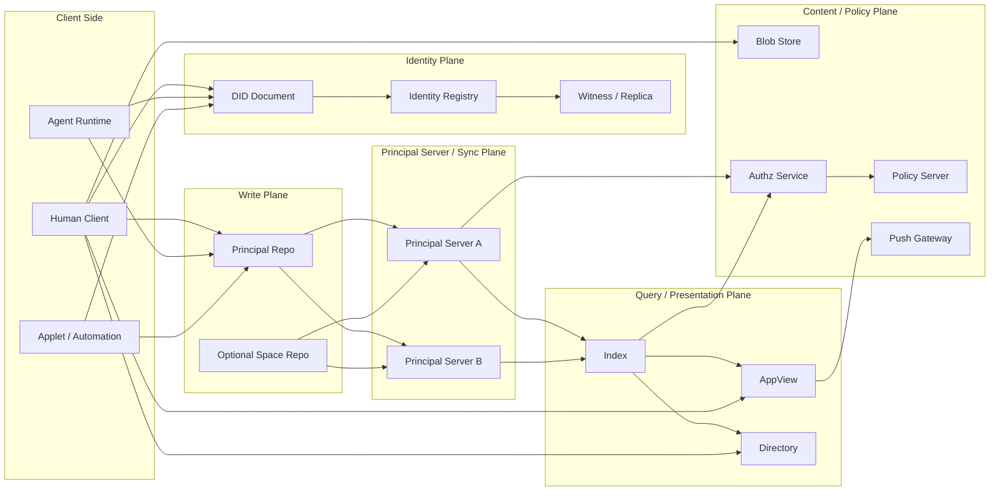

# Architecture Draft

## 1. 目标

Contrix 的顶层架构要同时满足四件事：

- 去中心化身份与发布
- 多主体协作对象共享
- 对人类友好的工作界面
- 对 AI agent 友好的执行与记忆模型

这要求协议在一开始就把“身份、写入、传播、查询、展示、记忆”拆成不同平面，而不是把所有能力都塞进一个服务角色里。

## 2. 总体模型

Contrix 采用 **principal server + principal repo + identity registry + query index** 的分层模型。

`Principal Server` 是 principal 自己控制或通过 DID / Space policy 明确委托的服务入口。产品层可以把它称为 Home Server。它可以同机承载 repo、sync、index、blob、push、policy 等能力，但协议上仍然把这些能力分层描述。

Contrix 不设置独立的第三方分发服务器角色。跨主体、跨组织传播通过参与方 Principal Server 之间的同步与联邦完成。

### 2.0 Organization / Space 边界

组织在 Contrix 中首先表现为 **Organization principal**，通常由组织 DID 标识，而不是直接表现为 Space。

Organization principal 可以：

- 签发组织成员资格、组织角色、handle 绑定等 credential
- 控制 Principal Server、Index、Policy Server、Applet、Media Service 等 service DID
- 作为 Space owner、policy issuer、trusted issuer 或 capability issuer
- 托管多个 Space，或与其他组织共同治理同一个 Space

Space 则是协作数据边界。它定义 membership、capability scope、schema、policy、history visibility、replication 和 E2EE group。一个组织 MAY 创建或拥有多个 Space；一个 Space MAY 由多个组织共同治理；用户也 MAY 创建不属于任何组织的个人或临时 Space。

因此实现 MUST NOT 以 `space_id` 代替组织身份，也 MUST NOT 仅凭用户在某 Space 内的 membership 推断其属于某组织。组织身份和成员资格应通过组织 DID 签发的 claim / VC / attestation、Space policy 中列出的 trusted issuer、或 governance registry 中的组织记录证明。

### 2.1 Principal Repo

每个 principal 都有自己的 repo，用于发布自己签名的 commit 和 operation。

它承担：

- actor 侧可验证发布
- 历史追溯
- 设备离线后重传
- 审计基线

这点借鉴 atproto 的 repo 思路，但 Contrix 的 repo 记录的是 **协作操作**，而不是面向社交 feed 的 record 集。

Principal Repo 是逻辑上的可验证发布日志，不等同于一台服务器。它可以由以下形态承载：

- 用户设备上的本地 append-only log。
- 用户自托管或组织托管的 Repo Service。
- 多个受控 storage replica 保存的只读副本。
- DID Document 中声明的 `ContrixRepo` service endpoint。

Repo 的权威来自 principal 对 commit / operation 的签名、DID 控制链、commit hash 链和幂等序列，而不是来自托管它的服务器。托管 Repo Service 可以拒绝服务、延迟同步或丢失副本，但不能替 principal 伪造有效写入。

### 2.2 Principal Server / Home Server

Principal Server 是 principal 的受控服务边界。它负责承载或代理：

- principal repo 的提交、读取与复制
- Space 范围的增量同步、回补与订阅
- 个人或组织受控 index / appview
- blob、push、policy、device message 等辅助服务
- 与其他 Principal Server 的 federation transaction

Principal Server 不是身份本身，也不能替 principal 伪造 commit 或 operation。它的权威来自 DID Document、service delegation、Space policy、capability 和签名事件。

明文规则：

- 非 E2EE / 非内容加密的私有内容 MUST NOT 提交给未被发送方、接收方或 Space policy 明确委托的第三方服务。
- 如果 Space 声明了 shared Space Host，该 Host 必须是 Space policy 中显式列出的受信 Principal Server 或组织服务 DID。
- 客户端在发送非加密内容前 MUST 校验目标服务器是否属于本 principal 控制、对方 principal 控制，或 Space policy 明确委托。
- 凡会接收或保存私有正文、附件预览、全文索引、通知摘要、embedding、可逆派生摘要的服务，都必须在 Space policy 中声明为 `plaintext_visible_services`。
- 接收方 Principal Server 对非加密内容是可见方；这属于用户或组织控制边界的一部分，不应被描述成透明转发层。
- 未受信的第三方服务只能接收公开内容、密文 envelope 或不可解析 payload。

### 2.3 Query Index / AppView

Index 负责把授权操作物化成便于查询的当前态和投影。

它承担：

- 当前态归约
- 复杂查询
- 全文搜索
- 视图渲染输入
- 统计和报表
- 可选 embedding / vector index

Index 是派生层，不是真相源。

### 2.4 Blob Store

Blob Store 提供附件、大对象和可选 snapshot chunk 的内容存储。

Blob 地址可以多源，校验应基于内容哈希而不是单一 URL。

### 2.5 Capability Authority

Capability Authority 是一个逻辑角色，不要求独立部署。

它负责：

- 发布授权策略
- 响应 grant / revoke / delegate 相关查询
- 为 repo / sync / index 提供可缓存的授权依据

### 2.6 Client / Agent

Contrix 的 client 不只包括 GUI 应用，也包括：

- CLI
- webhook worker
- CI agent
- autonomous agent
- background automation

协议必须把 agent 当作一等参与者，而不是 UI 里的“插件”。

## 3. 架构平面

### 3.1 Identity Plane

负责：

- DID 解析
- Handle 解析
- 服务发现
- key rotation / recovery
- DID 日志写入与复制
- registry / witness / replica 协调

### 3.2 Write Plane

负责：

- 生成 op
- 生成 repo commit
- 签名
- 发布到 repo

### 3.3 Distribution Plane

负责：

- sync stream
- space 增量同步
- 去重与 cursor

### 3.4 Query Plane

负责：

- 当前态查询
- 视图查询
- 搜索
- memory 检索
- **因果一致性屏障 (Causal Barrier)**：在返回查询结果前，可根据客户端提供的 `sync_token` 阻塞等待特定写入前沿的到达，保障“读己之所写”体验。

### 3.5 Presentation Plane

负责：

- kanban/list/table/calendar/timeline/graph/activity
- 人类审阅队列
- agent run timeline

### 3.6 Memory Plane

负责：

- run 轨迹沉淀
- episodic memory
- semantic memory
- memory promotion / supersession / forgetting

### 3.7 Confidentiality Plane

负责：

- 可见性与密文负载区分
- 内容加密 envelope
- key distribution / rotation
- 让 Sync Service 在不解密正文时也能继续转发

### 3.8 Portability Plane

负责：

- export / import
- snapshot + op replay
- service replacement
- 多 repo / 多 Principal Server / 多 index 迁移

## 4. 部署拓扑

Contrix 不要求所有角色分离部署。

### 4.0 通用网络拓扑图

要点：

- DID / Registry / Witness 负责身份解析和控制链证明。
- Principal Repo 是主体发布日志，Principal Server 提供受控同步、托管和联邦入口。
- Index / AppView / Directory 都是派生层，不能替代签名事件和 reducer。
- Blob、Policy、Push 是独立服务平面，可与其他角色同机部署，也可分离部署。

### 4.1 单人/小团队拓扑

同一个部署可同时承载：

- identity registry
- repo
- sync service
- index
- blob

适合：

- 小团队
- 私有实验环境
- 单组织内部部署

### 4.2 多组织协作拓扑

常见模式是：

- 每个组织维护自己的 principal repo
- 每个组织或可信运营方运行自己的 Principal Server / index / policy server
- 参与方 Principal Server 通过 federation transaction 交换 Space 相关 op
- 多个 query index 为不同参与方提供视图
- Space policy 明确列出共同治理的 organization DID、trusted issuer 和 service DID

这种模式更接近跨企业交付与供应链协作。

### 4.3 Agent 优先拓扑

在 agent 密集场景中，常见模式是：

- user/org DID 作为 authority
- agent DID 拥有受限 capability
- run log 写入 agent repo
- agent 的 Principal Server 将 run log 同步到协作 Space
- index 生成 human review queue

### 4.4 Sovereign / High-Assurance 拓扑

高安全组织 MAY 运行 sovereign deployment，即由组织或联盟控制 identity registry、repo、sync、index、directory、blob、policy server、media service、applet runtime 和 agent runtime。

该拓扑默认关闭公共 federation 和公共 directory，只允许 allowlist service DID 与受控客户端接入。

Sovereign deployment 不排斥跨组织协作。组织 MAY 创建 **Controlled Collaboration Space**，只向经过验证的外部人员或组织开放特定 Space，而不是开放整个内部网络。

Controlled Collaboration Space SHOULD：

- 使用 `discoverability=unlisted`、`invite_only` 或 `secret`。
- 使用 `join_rule=restricted` 或 `knock_restricted`。
- 通过 Organization DID、external organization DID、claim / VC、policy server 和 admin approval 验证外部主体。
- 使用 E2EE，并只向批准设备发送 MLS Welcome。
- 使用独立 Principal Server / index / directory / blob enclave，避免外部主体获得主网络目录或服务拓扑。
- 对 Applet、Agent handoff、media recording、export、bulk download 默认 deny，按 capability 显式授权。

详细规则见 `sovereign-deployment.md`。

## 5. 核心架构取向

Contrix 固定以下架构取向：

- space-first
- object-first
- repo-first
- collaboration-first

这意味着：

- 房间不是唯一世界模型
- 消息也不是唯一原子单元
- UI 不需要从聊天历史里推业务状态
- 协议直接允许“任务、决策、记忆、运行记录、关系”成为一等对象

## 6. 信任边界

### 6.1 Repo 可证明 actor 发过什么

repo 能证明：

- 哪个 principal 发布了哪些 commit
- commit 内有哪些 op
- 顺序与签名是否成立

repo 不能单方面定义共享 space 的最终当前态。

### 6.2 Principal Server 可提供同步，但不应重写历史

Principal Server 可以：

- 缓存
- 排序
- 去重
- 按 cursor 订阅输出
- 与其他 Principal Server 交换 federation transaction

Principal Server 不可以：

- 伪造 actor op
- 静默删除仍然有效的历史 op
- 把未授权明文内容发送给未被 principal 或 Space policy 委托的第三方服务
- 把非加密私有内容复制到未声明为 `plaintext_visible_services` 的 Index、AppView、Push、Blob preview 或 Policy preview 服务

### 6.3 Index 可解释状态，但不应替代原始审计链

index 可以：

- 给出当前态
- 提供搜索
- 给出看板/列表/图投影
- 依据 `sync_token` 提供强一致性屏障

index 不能作为唯一可验证来源。

### 6.4 Capability 是共享状态合法性的裁判，不是 UI 假设

是否允许某个写入，必须由有效 grant 集决定，而不是：

- 某客户端里当前看起来像管理员
- 某个服务器本地的隐式角色表

### 6.5 物理隔离与跨域限制

Space 构成了协作图的硬性隔离边界：
- 节点在处理深度 Graph/Tree 查询时，遇到跨 Space 引用必须截断返回惰性链接 (Lazy Link)，严禁越权自动化拼接外部图谱。
- 跨组织的级联图谱展示必须由拥有多域权限的客户端发起多次请求主动合成。

## 7. AI 与人类共用同一协议

Contrix 不打算做“两套系统”：

- 一套给人类看板
- 一套给 AI memory

相反，协议应该保证：

- AI 写入的对象能被人类审阅
- 人类创建的对象能被 AI 理解和引用
- 任务、评论、关系、运行记录、记忆可以互相链接
- 所有沉淀都能投影成可操作界面

## 8. 初版架构决定

当前草案建议固定以下方向：

- principal repo 是 actor 发布基线
- identity registry / witness 是 DID 文档的解析与写入层
- Principal Server / Sync Service 是受控同步与联邦层
- index/appview 是物化查询层
- blob 是独立内容层
- capability 是独立决策层
- run 与 memory 是一等协议对象
- 同一数据既服务人类 UI，也服务 agent 记忆
- confidentiality 与 portability 也是明确协议平面，而不是部署细节

## 9. 后续待细化

下一轮仍需继续明确：

- repo commit 的精确编码
- sync stream 的订阅协议
- index query surface
- capability cache 的一致性策略
- 多 Principal Server / 多 index 并存时的互操作要求
- 加密 envelope 与 key 分发接口
- export/import 的一致性边界
