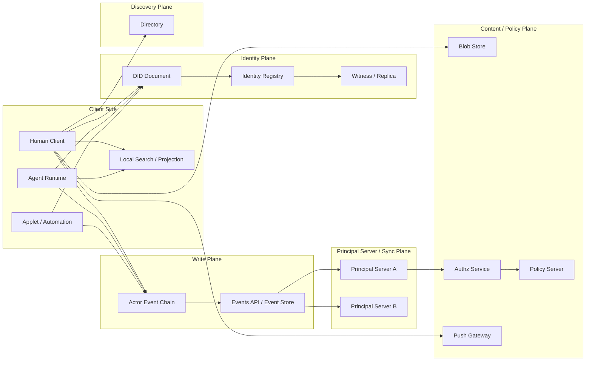

# Architecture

## 1. 目标

Contrix 的顶层架构要同时满足四件事：

- 去中心化身份与发布
- 多主体协作对象共享
- 对人类友好的工作界面
- 对 AI agent 友好的执行与记忆模型

这要求协议在一开始就把“身份、写入、传播、展示、记忆”和可选查询体验拆成不同平面，而不是把所有能力都塞进一个服务角色里。

## 2. 总体模型

Contrix 采用 **principal server + signed Event + identity registry + client-side projection** 的分层模型。

`Principal Server` 是 principal 自己控制或通过 DID / Space policy 明确委托的服务入口。它可以同机承载 Events API、sync、blob、push、policy 等能力，但协议上仍然把这些能力分层描述。搜索、inbox、notification 和 View projection 默认是客户端或 SDK 的派生能力；若某部署额外提供受托搜索服务，该服务仍是可选扩展，不是协议核心真相源。

Contrix 不设置独立的第三方分发服务器角色。跨主体、跨组织传播通过参与方 Principal Server 之间的同步与联邦完成。

协作数据层使用 Space 作为复制与授权边界，在 Space 内直接建模 Room、Board、List、Card、Message 等标准对象。Morph 只承担开放扩展对象角色；其可选能力由 Space schema / Morph profile 显式声明，facets 只是这些声明能力的 hint / 查询标签。Morph 不是替代所有标准对象的万能容器。

### 2.0 Organization / Space 边界

组织在 Contrix 中首先表现为 **Organization principal**，通常由组织 DID 标识，而不是直接表现为 Space。

Organization principal 可以：

- 签发组织成员资格、组织角色、handle 绑定等 credential
- 控制 Principal Server、Policy Server、Applet、Media Service 等 service DID
- 作为 Space owner、policy issuer、trusted issuer 或 capability issuer
- 托管多个 Space，或与其他组织共同治理同一个 Space

Space 则是协作数据边界。它定义 membership、capability scope、schema、policy、history visibility、replication 和 E2EE group。一个组织 MAY 创建或拥有多个 Space；一个 Space MAY 由多个组织共同治理；用户也 MAY 创建不属于任何组织的个人或临时 Space。

因此实现 MUST NOT 以 `space_id` 代替组织身份，也 MUST NOT 仅凭用户在某 Space 内的 membership 推断其属于某组织。组织身份和成员资格应通过组织 DID 签发的 claim / VC / attestation、Space policy 中列出的 trusted issuer、或 governance registry 中的组织记录证明。

### 2.1 Per-Actor Event Chain

Contrix v1 不再把用户数据仓库作为协议一等概念。每个 actor 通过自己签名的 Event Envelope、`actor_id`、`actor_seq` 和 `prev_refs` 形成可验证 event chain。

它承担：

- actor 侧可验证发布
- 历史追溯
- 设备离线后重传
- 审计基线

这保留了 atproto per-principal publication 的安全目标，但不要求实现 atprotocol/Git 式数据仓库。Contrix 记录的是 **协作 Event**，不是面向公开内容分发的 record 集。

Event chain 可以由以下形态承载：

- 用户设备上的本地 append-only log。
- Principal Server 内置的 event store 与 `/events/*` API。
- 多个受控 storage replica 保存的只读副本。
- Principal Server 在 DID Document 中声明的服务 endpoint。

Event 的实际存储形态由实现决定：可以是数据库表、对象存储中的 Event blob、文件系统 append-only log、Merkle log、content-addressed block store，或这些形式的组合。协议只要求它能稳定输出 canonical Event bytes、hash、签名、frontier、cursor 和 proof material。

Event 的权威来自 actor/device/service 对 Event 的签名、DID 控制链、`actor_seq` 单调性、`prev_refs` 因果链和 `event_id` 幂等性，而不是来自托管它的 Principal Server。Principal Server 可以拒绝服务、延迟同步或丢失副本，但不能替 principal 伪造有效写入。

### 2.2 Principal Server

Principal Server 是 principal 的受控服务边界。它负责承载或代理：

- Event 的提交、读取、回填与复制
- Space 范围的增量同步、回补与订阅
- blob、push、policy、device message 等辅助服务
- 与其他 Principal Server 的 federation transaction

Principal Server 不是身份本身，也不能替 principal 伪造 Event。它的权威来自 DID Document、service delegation、Space policy、capability 和签名事件。

明文规则：

- 非 E2EE / 非内容加密的私有内容 MUST NOT 提交给未被发送方、接收方或 Space policy 明确委托的第三方服务。
- 如果 Space 声明了 shared Space Host，该 Host 必须是 Space policy 中显式列出的受信 Principal Server 或组织服务 DID。
- 客户端在发送非加密内容前 MUST 校验目标服务器是否属于本 principal 控制、对方 principal 控制，或 Space policy 明确委托。
- 凡会接收或保存私有正文、附件预览、全文索引、通知摘要、embedding、可逆派生摘要的服务，都必须在 Space policy 中声明为 `plaintext_visible_services`。
- 接收方 Principal Server 对非加密内容是可见方；这属于用户或组织控制边界的一部分，不应被描述成透明转发层。
- 未受信的第三方服务只能接收公开内容、密文 envelope 或不可解析 payload。

### 2.3 Client Query / Projection

客户端或 SDK 可以把已同步、已授权、已解密的 Event 集合物化成当前态、搜索索引、inbox、notification 和 View projection。这些都是本地派生体验，不是协议必需服务面。

协议只约束以下边界：

- View 是可同步的投影定义，不拥有被投影对象的事实。
- 查询、搜索和 projection 不得绕过 Space policy、Room membership、history visibility、E2EE 可见性或 capability。
- 任何受托 search / projection 服务若接收私有明文、正文摘要、embedding、通知摘要或可逆派生内容，MUST 被 Space policy 列入 `plaintext_visible_services`。
- 派生输出不得成为唯一真相源；缓存丢失后必须能从 signed Event、reducer profile、View definition 和 causal frontier 重新计算。

### 2.4 Blob Store

Blob Store 提供附件、大对象和可选 snapshot chunk 的内容存储。

Blob 地址可以多源，校验应基于内容哈希而不是单一 URL。

### 2.5 Capability Authority

Capability Authority 是一个逻辑角色，不要求独立部署。

它负责：

- 发布授权策略
- 响应 grant / revoke / delegate 相关查询
- 为 Events API / sync / projection executor 提供可缓存的授权依据

### 2.6 Client / Agent

Contrix 的 client 不只包括 GUI 应用，也包括：

- CLI
- webhook worker
- CI agent
- autonomous agent
- background automation

协议必须把 agent 当作一等参与者，而不是 UI 里的“插件”。

### 2.7 Principal Server 部署形态

Contrix 的协议文档按“服务角色”定义能力；实际落地时可以把多个角色合并在同一进程、同一域名或同一节点中。合并部署不得改变各角色的安全边界：service DID、`service_type`、capability、Space policy、plaintext visibility 和 endpoint 契约仍必须可区分。

面向用户和运维文档时，也应直接使用 **Principal Server**。不同部署层级的差异由 deployment profile、内置或拆分的服务角色、委托来源、公共基础设施依赖、合规和明文边界要求表达。

| 部署层级 | 必须自建 | 通常使用公共或托管服务 | 适合对象 |
| --- | --- | --- | --- |
| 个人 / 小团队 | Principal Server | Identity Resolver、Directory、Push Gateway、TURN / Media Relay | 个人、家庭、小项目、小团队。 |
| 普通组织 | 组织委托的 Principal Server、Auth / Account Server；需要统一授权和审计时增加 Admin / Policy Server | Identity Resolver、Directory、Push Gateway、TURN / Media Relay | 公司、学校、社区、普通协作组织。 |
| 高安全组织 | 一个或多个组织委托的 Principal Server、Auth / Account Server、Identity Resolution Infrastructure、Policy / Authz Server、Blob / Media Server | 可选使用公共 Directory、Push Gateway 或外部互联入口 | 政企、医疗、金融、强合规组织。 |
| 涉密 / 隔离网络 | Principal Server、Identity Resolution Infrastructure、Auth / Account Server、Directory Server、Policy / Authz Server、Events / Blob Server、Sync / Federation Server、Audit / Compliance Server | 原则上不依赖公共服务；跨域协作必须经受控网关、邀请包或 trust bundle 明确解析上下文 | 军方、内网、完全隔离或强管控网络。 |

最小个人或小团队部署只有一个 Principal Server：

```text
Principal Server
├─ principal endpoint
├─ event storage
├─ sync / federation endpoint
├─ local policy
├─ blob storage
└─ basic app view / inbox
```

它可以默认使用公共基础设施：

- Identity Resolver：公共 DID / handle 解析；具体可由 `did:uuid` registry / witness、`did:web` method resolver、`did:key` 本地 resolver 或 `did:keri` witness / watcher / resolver 实现。
- Directory Server：公共 Space、Organization、Actor、Applet 发现。
- Push Gateway：移动或桌面脱敏通知投递。
- TURN / Media Relay：音视频中继和 NAT 穿透。

Auth / Account Server 与 Identity Resolution Infrastructure 不要求同源部署。普通组织可以自建自己的登录入口、SSO、设备配对和 session 管理，同时继续使用公共 `did:uuid` resolver 来解析用户 DID，或使用 `did:key` 本地 resolver、`did:keri` resolver / witness / watcher。登录服务器负责证明“这个服务账户 / 设备当前绑定到哪个 DID”，identity resolver 只负责返回或验证该 DID 的控制密钥、key state、key log / KERI log 和服务委托证据；组织 Policy / Authz 再决定该 DID 是否能访问组织 Space、Event 或管理动作。

`did:web` 等 method-specific DID MAY 按各自方法从域名或外部网络解析；组织私有 `did:uuid` MAY 只在组织或隔离网络的 resolver trust domain 内解析。客户端和服务器必须按本地 trust policy 选择 resolver，不能因为 DID method 同为 `did:uuid` 就假设解析入口相同。

普通用户不应被要求单独部署 Directory Server、Push Gateway、Identity Resolution Infrastructure、TURN / Media Relay 或 Moderation / Compliance Server。搜索、inbox、notification 和 View projection 默认可在客户端本地完成。若使用 `did:key`，identity resolution 可以完全本地完成；若使用 `did:keri`，通常需要 KERI log / witness / watcher / OOBI 基础设施，但不需要传统中心化 registry。只有当组织需要身份主权、内网隔离、合规审计、公共网络不可依赖或受控跨组织 federation 时，才应把这些基础设施收回自建。

高级实现仍应按以下服务角色声明能力和安全边界。多个角色可以合并在同一部署中，但必须在 service DID、`service_type`、capability、Space policy、plaintext visibility 和 endpoint 契约上保持可区分。

| 服务角色 | 常见 `service_type` | 主要服务 | 是否真相源 | 明文边界 |
| --- | --- | --- | --- | --- |
| Principal Server | `principal_server` | principal 的受控入口；可聚合 Events API、sync、federation、device message、policy、blob 等受托能力。 | 否；真相来自 signed Event。 | 可以接收该 principal 或 Space policy 授权范围内的非加密内容。 |
| Identity Resolution Infrastructure | `identity_registry` 或 method-specific resolver | DID Document、DID key log、KERI event log、handle binding、receipt / witness、watcher、OOBI、service discovery。 | 是身份控制链的可验证来源之一；`did:key` 可由本地算法解析。 | 不应接收 Space 正文。 |
| Auth / Account Server | `auth_server` 或部署私有名 | passkey、OIDC、SSO、设备配对、session grant、账户恢复与 soft logout。 | 否；只证明服务账户登录，并绑定到 DID / device。 | 不应因密码恢复获得 E2EE 明文或 DID 控制权。 |
| Sync / Federation Server | `principal_server` 或 `sync_node` | client sync、Space subscription、backfill、snapshot head、跨域 federation transaction。 | 否；只传播和回补。 | 只能把非加密私有内容发给授权 Principal Server 或 `plaintext_visible_services`。 |
| Directory Server | `directory_service` | Space / Organization / Actor / handle / Applet 的授权搜索与精确解析。 | 否；派生发现层。 | 只返回最小可发现信息，不应暴露私有拓扑。 |
| Blob / Media Server | `blob_node` / `media_service` | blob upload、HEAD / GET authenticated download、thumbnail、preview、retention、media policy。 | 内容 hash 可验证；metadata 是服务声明。 | 私有 blob 下载、预览和缩略图必须按授权执行。 |
| Device / Key Server | `device_key_service` | to-device message、one-time key、fallback key、device list、secret backup metadata。 | 否；设备信任来自签名链。 | 不应能解密 E2EE 正文。 |
| Authz / Policy Server | `authz_service` / `policy_server` | capability 查询、grant / invite 查询、policy decision、risk score、quarantine / review。 | 否；决策必须可追溯到签名 policy / grant。 | policy preview 只能接收最小披露字段，除非显式明文授权。 |
| Push Gateway | `push_gateway` | push device register / unregister、脱敏通知投递、移动平台适配。 | 否。 | 默认不得接收 E2EE 明文或正文摘要。 |
| Applet Server | `applet_service` | bot、bridge、外部 SaaS、portal Space、ghost actor、Applet transaction。 | 否；写入仍需 capability 和签名。 | 只在 Space / principal 明确授权范围内可见明文。 |
| MIMI Provider Facade | `mimi_provider_facade` | MIMI provider discovery、room binding、key material、submit message、groupInfo、consent、identifier query、abuse report、proxy download。 | 否；MIMI room state 是 Contrix Space/Room 的互操作投影。 | 只能处理 `cx.mimi.room_binding` 和 Space policy 授权范围内的密文、metadata 或明文。 |
| Agent Runtime Server | `agent_runtime` | agent run、tool execution、memory promotion、A2A / ACP / MCP handoff。 | 否；输出必须写成 signed Event 才成为协议事实。 | agent 可见范围由 capability、device / session 和 Space policy 限定。 |
| Realtime Media Server | `media_service` / `sfu_service` / `turn_service` | WebRTC signaling 辅助、ICE config、TURN / STUN、SFU / MCU、录制。 | 否。 | SFU / TURN 通常不应接触明文；MCU / 录制必须显式授权。 |
| Moderation / Compliance Server | `moderation_service` | report、审核队列、server ACL、policy list、appeal、legal hold / erasure workflow。 | 否；处理结果必须落成可审计 policy / moderation Event。 | 只能接收审核所需的最小证据或授权明文。 |

协议不要求公开部署所有服务器。某个节点实际支持哪些服务，必须通过 DID Document service entry、`GET /api/v1/server/describe`、`supported_operations`、conformance profile 和 Space policy 共同声明。

## 3. 架构平面

### 3.1 Identity Plane

负责：

- DID 解析
- Handle 解析
- 服务发现
- key rotation / recovery
- DID 日志写入与复制
- registry / witness / replica 协调

### 3.2 Write Plane

负责：

- 生成 Event
- 签名
- 发布到 Events API

### 3.3 Distribution Plane

负责：

- sync stream
- space 增量同步
- 去重与 cursor

### 3.4 Local Query / Projection Plane

负责：

- 当前态查询
- 视图查询
- 搜索
- memory 检索
- **因果一致性屏障 (Causal Barrier)**：客户端或可选受托服务在返回查询结果前，可根据本地 sync frontier 等待特定写入前沿的到达，保障“读己之所写”体验。

### 3.5 Presentation Plane

负责：

- kanban/list/table/calendar/timeline/graph/activity
- 人类审阅队列
- agent run timeline

### 3.6 Memory Plane

负责：

- run 轨迹沉淀
- episodic memory
- semantic memory
- memory promotion / supersession / forgetting

### 3.7 Confidentiality Plane

负责：

- 可见性与密文负载区分
- 内容加密 envelope
- key distribution / rotation
- 让 Sync Service 在不解密正文时也能继续转发

### 3.8 Portability Plane

负责：

- export / import
- snapshot + Event replay
- service replacement
- 多 Principal Server / 受托 search service 迁移

## 4. 部署拓扑

Contrix 不要求所有角色分离部署。

### 4.0 通用网络拓扑图



要点：

- DID / Registry / Witness 负责身份解析和控制链证明。
- Actor Event Chain 是主体发布日志，Principal Server 提供受控同步、托管和联邦入口。
- Search / View projection 默认在客户端本地派生；Directory 是受授权的发现层，不能替代签名事件和 reducer。
- Blob、Policy、Push 是独立服务平面，可与其他角色同机部署，也可分离部署。

### 4.1 单人/小团队拓扑

同一个部署可同时承载：

- identity registry
- events
- sync service
- blob

适合：

- 小团队
- 私有实验环境
- 单组织内部部署

### 4.2 多组织协作拓扑

常见模式是：

- 每个组织维护自己的受控 Principal Server / Event store
- 每个组织或可信运营方运行自己的 Principal Server / policy server
- 参与方 Principal Server 通过 federation transaction 交换 Space 相关 Event
- 各参与方客户端基于自身授权范围生成本地视图，或显式使用受托 search / projection 扩展
- Space policy 明确列出共同治理的 organization DID、trusted issuer 和 service DID

这种模式更接近跨企业交付与供应链协作。

### 4.3 Agent 优先拓扑

在 agent 密集场景中，常见模式是：

- user/org DID 作为 authority
- agent DID 拥有受限 capability
- run log 写成 agent 签名 Event
- agent 的 Principal Server 将 run log 同步到协作 Space
- 客户端或受托 projection 扩展生成 human review queue

### 4.4 Sovereign / High-Assurance 拓扑

高安全组织 MAY 运行 sovereign deployment，即由组织或联盟控制 identity registry、events、sync、directory、blob、policy server、media service、applet runtime 和 agent runtime。

该拓扑默认关闭公共 federation 和公共 directory，只允许 allowlist service DID 与受控客户端接入。

Sovereign deployment 不排斥跨组织协作。组织 MAY 创建 **Controlled Collaboration Space**，只向经过验证的外部人员或组织开放特定 Space，而不是开放整个内部网络。

Controlled Collaboration Space SHOULD：

- 使用 `discoverability=unlisted`、`invite_only` 或 `secret`。
- 使用 `join_rule=restricted` 或 `knock_restricted`。
- 通过 Organization DID、external organization DID、claim / VC、policy server 和 admin approval 验证外部主体。
- 使用 E2EE，并只向批准设备发送 MLS Welcome。
- 使用独立 Principal Server / directory / blob enclave，避免外部主体获得主网络目录或服务拓扑。
- 对 Applet、Agent handoff、media recording、export、bulk download 默认 deny，按 capability 显式授权。

详细规则见 `sovereign-deployment.md`。

## 5. 核心架构取向

Contrix 固定以下架构取向：

- space-first
- object-first
- event-first
- collaboration-first

这意味着：

- 房间不是唯一世界模型
- 消息也不是唯一原子单元
- UI 不需要从聊天历史里推业务状态
- 协议直接允许 Room、Board、List、Card、Message、Morph 和 Relation 成为一等对象

## 6. 信任边界

### 6.1 Event Chain 可证明 actor 发过什么

Event chain 能证明：

- 哪个 principal 发布了哪些 Event
- Event 的签名、`actor_seq` 和 `prev_refs` 是否成立
- 顺序与签名是否成立

Event chain 不能单方面定义共享 space 的最终当前态。

### 6.2 Principal Server 可提供同步，但不应重写历史

Principal Server 可以：

- 缓存
- 排序
- 去重
- 按 cursor 订阅输出
- 与其他 Principal Server 交换 federation transaction

Principal Server 不可以：

- 伪造 actor Event
- 静默删除仍然有效的历史 Event
- 把未授权明文内容发送给未被 principal 或 Space policy 委托的第三方服务
- 把非加密私有内容复制到未声明为 `plaintext_visible_services` 的 Push、Blob preview、Policy preview 或任何受托 search / projection 服务

### 6.3 Projection 可解释状态，但不应替代原始审计链

客户端本地 projection 或受托 search / projection 服务可以：

- 给出当前态
- 提供搜索
- 给出看板/列表/图投影
- 依据 `sync_token` 提供强一致性屏障

这些派生输出不能作为唯一可验证来源。

### 6.4 Capability 是共享状态合法性的裁判，不是 UI 假设

是否允许某个写入，必须由有效 grant 集决定，而不是：

- 某客户端里当前看起来像管理员
- 某个服务器本地的隐式角色表

### 6.5 物理隔离与跨域限制

Space 构成了协作图的硬性隔离边界：
- 节点在处理深度 Graph/Tree 查询时，遇到跨 Space 引用必须截断返回惰性链接 (Lazy Link)，严禁越权自动化拼接外部图谱。
- 跨组织的级联图谱展示必须由拥有多域权限的客户端发起多次请求主动合成。

## 7. AI 与人类共用同一协议

Contrix 不打算做“两套系统”：

- 一套给人类看板
- 一套给 AI memory

相反，协议应该保证：

- AI 写入的对象能被人类审阅
- 人类创建的对象能被 AI 理解和引用
- Card、Message、Relation、运行记录、记忆和其他 Morph 对象可以互相链接
- 所有沉淀都能投影成可操作界面

## 8. 架构决定

Contrix v1 固定以下方向：

- signed Event Envelope 和 per-actor event chain 是 actor 发布基线
- identity registry / witness 是 DID 文档的解析与写入层
- Principal Server / Sync Service 是受控同步与联邦层
- search / View projection 默认是客户端本地派生体验；受托搜索服务只能作为可选扩展
- blob 是独立内容层
- capability 是独立决策层
- run 与 memory 通过 Morph 类型或扩展 profile 成为可审计协议对象
- 同一数据既服务人类 UI，也服务 agent 记忆
- confidentiality 与 portability 也是明确协议平面，而不是部署细节

## 9. 可落地性要求

Contrix v1 不允许实现用单一“万能服务”隐藏协议边界。任何声称支持 `cx.profile.principal_server.v1` 或 `cx.profile.full_client.v1` 的实现 MUST 满足以下要求：

- Event digest、event-batch receipt digest、签名绑定、HLC 和 cursor 行为按 `encoding.md` 与 `encoding-conformance-vectors.md` 执行。
- Client sync、subscribe、backfill、snapshot frontier 和 read-your-writes barrier 按 `client-sync.md`、`operations-sync.md`、`sync-conformance-vectors.md` 与 `service-surface.md` 执行。
- Search / View projection 若对外暴露可互操作语义，按 `query-schema.md`、`views.md` 和 `service-surface.md` 执行；结果必须能追溯到 signed Event、reducer profile 和 causal frontier。
- Capability cache 只能作为优化。缓存命中必须绑定 causal frontier、grant / revoke / claim 状态和 policy version；上下文缺失、过期或发生分叉时 MUST fail closed 或重新执行完整 authz。
- 多 Principal Server 或受托 search / projection 服务并存时，客户端 MUST 比较 DID service delegation、Space policy、frontier、snapshot hash、reducer profile 和 plaintext visibility 后再选用服务。
- 加密 envelope、device / key server、MLS KeyPackage、Welcome、epoch backfill 和 key backup 按 `encryption-and-audit.md`、`devices-and-auth.md`、`device-crypto-verification.md` 与 `media-and-blob.md` 执行。
- Export / import MUST 以 snapshot manifest、state hash、chunk digest、Event replay 和 policy / redaction metadata 为边界；导入端不得仅信任外部 projection 或 search dump。
