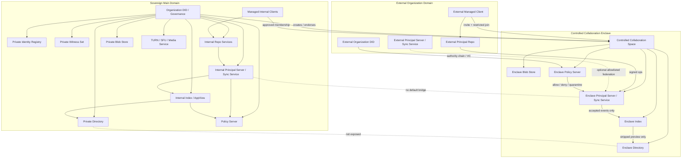

# Sovereign Deployment and Controlled Collaboration Draft

## 1. 目标

高安全组织可以运行独立的 Contrix 网络，同时在必要时为外部人员或外部组织开启受控协作 Space。

本文定义：

- sovereign deployment 的边界
- isolated federation domain
- controlled collaboration Space
- 外部主体进入高安全网络的验证、授权、加密、审计和退出规则
- sovereign client 与 DID resolver policy

## 2. 部署模型

Sovereign deployment 是由单一组织或联盟控制的 Contrix 服务域。它通常包含：

- Organization DID / governance registry / witness
- Identity Registry
- Repo Service
- Principal Server / Sync Service
- Index / AppView
- Directory
- Blob Store
- Policy Server
- Push Gateway
- TURN / SFU / Media Service
- Applet / Agent Runtime allowlist

这些服务 SHOULD 使用 service DID，并由 Organization DID 或联盟治理 DID 明确委派。

### 2.1 网络拓扑图



拓扑含义：

- 主网络保持 closed federation，不向外部主体暴露内部 Directory、Index 或服务拓扑。
- Controlled Collaboration Enclave 是独立协作边界，只承载被批准的 Space。
- 外部主体通过 DID / VC / authority chain / invite / restricted join 进入 enclave Space。
- 外部组织可以保留自己的 Repo，但写入必须经过 enclave Principal Server / Sync Service、Policy Server 和本地授权验证。
- 主网络与 enclave 之间没有默认桥接；资料进出必须经过 export / import review。

## 2.2 Sovereign Client

高安全部署不一定要求从零开发专用客户端，但 MUST 使用受管控客户端 profile。普通公共网络客户端只有在被锁定配置、审计、签名发布和策略管理后才可进入 sovereign deployment。

Sovereign client MUST:

- pin organization trust anchors：Organization DID、governance DID、registry DID、witness DID、service DID allowlist。
- 使用组织配置的 DID resolver policy，不得默认查询公共 registry / public directory。
- 验证服务 DID 委派、证书、HTTP message signature 和 feature profile。
- 禁止用户手动添加未批准 Sync Service / Index / Directory / Blob / Applet endpoint。
- 默认关闭公共 federation、公共搜索、公共 social feed、外部 Applet 和外部 Agent handoff。
- 对每个 Space 显示 classification、E2EE、auditable E2EE、export、external member policy。
- 支持远程撤销 session、device、grant、Applet delegation 和 cached secret。
- 支持本地日志、审计导出和密钥擦除策略。

Sovereign client SHOULD:

- 使用硬件密钥、平台安全模块或智能卡。
- 支持离线/内网 resolver bundle。
- 支持 policy-signed configuration update。
- 对截屏、复制、批量导出、水印、外部分享实施本地 policy enforcement。

## 3. 默认安全姿态

高安全部署 SHOULD 默认：

- 禁止公共 federation。
- 禁止公共 directory listing。
- Space 默认 `discoverability=secret` 或 `invite_only`。
- Space 默认 `join_rule=private` 或 `restricted`。
- Policy Server 默认 `closed` 或 `quarantine` fail mode。
- Sync Service / Index / Directory 只接受 allowlist service DID。
- Blob、snapshot、backup、audit log 存储在组织控制基础设施内。
- 外部 Applet、Agent handoff、TSP/A2A/ACP transport 默认关闭，按 Space 明确开启。
- E2EE 默认开启；需要合规审查时使用 auditable E2EE，且必须向成员显示。

## 3.1 DID Policy

Sovereign deployment MAY use `did:uuid` internally. `did:uuid` is not tied to the public Contrix network.

The deployment MUST define a DID resolver policy:

```json
{
  "kind": "cx.sovereign.did_policy",
  "trust_domain": "did:web:defense.example#contrix-domain",
  "allowed_methods": ["did:uuid", "did:web"],
  "registries": [
    "did:web:registry.defense.example"
  ],
  "witnesses": [
    "did:web:witness-1.defense.example",
    "did:web:witness-2.defense.example"
  ],
  "public_registry_allowed": false,
  "external_did_methods": {
    "did:web": "allowlist",
    "did:plc": "deny",
    "did:key": "ephemeral_only"
  }
}
```

Rules:

- Clients MUST NOT resolve internal `did:uuid` through public registry endpoints.
- Internal `did:uuid` DID documents MUST be obtained from approved registry / witness / offline bundle.
- Public DID methods MAY be accepted for external collaborators only when policy allows and the authority chain is verified.
- Pairwise DID SHOULD be used for external collaboration when correlation risk matters.
- DID Document service endpoints that point to public Sync Service / Index / Directory MUST be ignored unless allowlisted.

## 4. Controlled Collaboration Space

组织 MAY 创建受控协作 Space，允许外部网络的人员或组织加入特定协作范围。

该 Space 是隔离边界，不应让外部主体直接进入组织主网络。

Controlled Collaboration Space SHOULD 使用：

```json
{
  "kind": "cx.space.create",
  "space_version": "1",
  "content": {
    "space_kind": "controlled_collaboration",
    "created_by_principal": "did:web:defense.example",
    "owning_organizations": ["did:web:defense.example"],
    "default_discoverability": "unlisted",
    "default_join_rule": "restricted",
    "history_visibility": "joined"
  }
}
```

Recommended policy:

- `discoverability=unlisted` or `invite_only`
- `join_rule=restricted` or `knock_restricted`
- `history_visibility=joined`
- `encryption_required=true`
- `external_federation=allowlist`
- `directory_visibility.public_directory=false`
- `reshare/export disabled by default`
- `applet/agent disabled unless explicitly granted`

## 5. 外部主体进入流程

外部人员或组织进入受控 Space MUST pass a gated flow:

1. 外部主体提供 DID、Organization DID、service DID 或 verifiable credential。
2. 主组织验证 DID control、handle binding、organization authority chain。
3. Policy Server 检查 allowlist、risk score、clearance claim、contract claim、device posture。
4. Space admin 或 delegated approval actor 发出 invite。
5. 外部主体接受 invite，并提交 `cx.member.state` join event。
6. 对 E2EE Space，管理员客户端或 key service 只向该主体授权设备发 MLS Welcome。
7. Directory / Index 只暴露该 Space 允许的 stripped preview 和加入后历史。

外部主体 MUST NOT receive:

- 主网络 directory 全量搜索能力
- 其他 Space 列表
- 组织成员列表
- 不相关 service topology
- 加入前历史密钥，除非 policy 明确允许

## 6. 外部组织协作

当外部组织加入时，建议使用组织级 trust chain：

```json
{
  "claim_type": "external_org_authorization",
  "issuer": "did:web:defense.example",
  "subject": "did:web:contractor.example",
  "scope": {
    "space_id": "cx:space:joint-operation",
    "roles": ["contractor_reviewer"],
    "max_members": 20
  },
  "valid_until": "2026-07-26T00:00:00Z"
}
```

外部组织 MAY operate its own Repo / Principal Server, but the controlled Space SHOULD require:

- approved external service DID
- federation transaction signature
- server ACL allowlist
- per-event signature verification
- local policy re-check
- audit record for every cross-domain write

## 7. Gateway / Enclave Pattern

高安全组织 SHOULD NOT bridge the entire internal domain to external networks.

Recommended pattern:

- 主网络保持 closed federation。
- 创建 isolated collaboration enclave。
- 外部主体只被邀请到 enclave Space。
- enclave Space 使用独立 Principal Server / Index / Blob / Policy Server。
- 从主网络复制到 enclave 的资料必须经 redaction / export review / declassification policy。
- 从 enclave 回流主网络的资料必须经 import review / malware scan / policy approval。

## 8. Applet and Agent Controls

Controlled Collaboration Space SHOULD default:

- Applet disabled.
- Agent protocol handoff disabled.
- External tool access disabled.
- Media recording disabled.

Any exception MUST be granted by capability and policy:

- `via_applet_id`
- `allowed_protocols`
- `allowed_data_classes`
- `human_approval_required`
- `audit_mode`
- `egress_policy`

## 9. Data Egress and Export

External members MAY read or write only within granted scope.

Export controls SHOULD include:

- disable bulk export by default
- watermark or audit export packages
- require approval for attachments and snapshots
- preserve audience / classification labels
- prevent public directory indexing
- prevent repost / quote / social redistribution

If content is encrypted, export must not include keys beyond the intended recipient set.

## 10. Exit, Revocation and Incident Response

When external access ends:

- revoke invite / grant / delegation
- set membership to `leave` or `ban`
- remove external device from MLS group
- rotate MLS epoch
- revoke Applet / Agent sessions
- stop directory visibility
- mark external service DID as no longer allowed
- preserve audit records under retention policy

If compromise is suspected:

- freeze Space or affected Entity set
- quarantine cross-domain events
- rotate service keys
- require re-verification for all external members
- run backfill integrity audit from source Repo

## 11. Conformance Profile

`cx.profile.sovereign_deployment.v1` SHOULD test:

- closed federation by default
- service DID allowlist
- controlled collaboration Space creation
- restricted external join
- policy server closed fail mode
- MLS welcome only to approved external devices
- directory non-disclosure for non-members
- cross-domain event audit
- external grant revocation and epoch rotation
- enclave import/export review metadata
